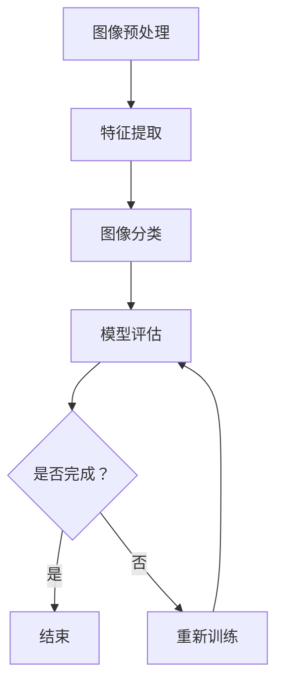

                 

# 文章标题：ImageNet：计算机视觉与人工智能的里程碑

> 关键词：计算机视觉、人工智能、图像识别、深度学习、卷积神经网络、ImageNet挑战赛

> 摘要：
本文将深入探讨ImageNet项目，从其背景和发展历程，到核心概念和架构，再到实际应用和实践，以及未来发展趋势。我们将通过一步步的分析和推理，展示ImageNet在计算机视觉和人工智能领域的重要贡献，并展望其未来的发展方向。

----------------------------------------------------------------

### 《ImageNet》书目录大纲

#### 第一部分：ImageNet概述

1. **ImageNet的背景和发展**
   - 1.1 **什么是ImageNet**
   - 1.2 **ImageNet的发展历程**
   - 1.3 **ImageNet的重要贡献**
2. **ImageNet的应用领域**
   - 2.1 **计算机视觉领域的应用**
   - 2.2 **机器学习和人工智能领域的应用**
   - 2.3 **其他领域的应用**

#### 第二部分：ImageNet的核心概念和架构

1. **图像识别与分类**
   - 2.1 **图像识别的基本原理**
   - 2.2 **图像分类的算法框架**
   - 2.3 **识别准确率与模型评估**
2. **数据集构建与标注**
   - 2.4 **数据集的收集与预处理**
   - 2.5 **标注工具与技术**
   - 2.6 **数据增强与平衡**
3. **卷积神经网络（CNN）原理**
   - 2.7 **CNN的基本结构**
   - 2.8 **卷积与池化操作**
   - 2.9 **CNN在图像识别中的应用**
4. **深度学习模型与优化**
   - 2.10 **深度学习基本原理**
   - 2.11 **模型训练与优化**
   - 2.12 **误差分析与调优**

#### 第三部分：ImageNet的应用实践

1. **ImageNet在计算机视觉中的应用**
   - 3.1 **图像识别与分类实践**
   - 3.2 **目标检测与分割实践**
   - 3.3 **人脸识别与追踪实践**
2. **ImageNet在机器学习中的应用**
   - 3.4 **模型迁移与微调实践**
   - 3.5 **自适应学习实践**
   - 3.6 **生成对抗网络（GAN）实践**
3. **ImageNet在人工智能中的应用**
   - 3.7 **图像生成与风格迁移实践**
   - 3.8 **图像增强与数据扩充实践**
   - 3.9 **多模态学习实践**

#### 第四部分：未来发展趋势

1. **图像识别与人工智能的发展方向**
   - 4.1 **深度学习算法的进步**
   - 4.2 **图像识别技术的挑战**
   - 4.3 **未来应用场景的预测**
2. **ImageNet的未来发展**
   - 4.4 **数据集的扩充与更新**
   - 4.5 **技术创新与应用拓展**
   - 4.6 **社会影响与伦理问题**
   - 4.7 **开源社区与协作发展**

#### 附录

1. **附录 A: ImageNet相关资源与工具**
   - 4.8 **主流图像识别框架**
   - 4.9 **图像识别算法实现**
   - 4.10 **ImageNet开源项目与代码**
2. **附录 B: 练习题与参考答案**
   - 4.11 **图像识别基础练习题**
   - 4.12 **CNN与深度学习练习题**
   - 4.13 **图像识别应用练习题**
   - 4.14 **参考答案与解析**

----------------------------------------------------------------

## 第一部分：ImageNet概述

### 1.1 ImageNet的背景和发展

#### 什么是ImageNet

ImageNet是一个由斯坦福大学和微软研究院合作创建的大型图像识别数据库。它于2009年首次亮相，旨在提供大规模的标注图像用于计算机视觉的研究和测试。ImageNet的核心目标是通过提供丰富的图像数据集，推动计算机视觉技术的发展，特别是在图像识别领域。

ImageNet数据库包含超过1,000,000张图像，这些图像被标注为1,000个不同的类别。这些类别涵盖了从动物、植物、车辆、电子产品到人物、场景等各种主题。ImageNet的建立标志着计算机视觉领域的一个重要里程碑，它为深度学习模型提供了一个广泛且高质量的训练数据集。

#### ImageNet的发展历程

ImageNet项目的发展可以分为几个重要阶段：

- **第一阶段（2006-2009）**：这个阶段的主要目标是创建一个包含大量图像和类别的数据库。斯坦福大学和微软研究院的团队合作，从互联网上收集和标注了大量图像。

- **第二阶段（2009-2012）**：在ImageNet Challenge竞赛中，研究者们利用ImageNet数据集来测试和比较不同的图像识别算法。这个竞赛极大地推动了深度学习技术的发展。

- **第三阶段（2012-至今）**：随着深度学习技术的兴起，ImageNet数据集继续被用于各种研究和应用。同时，ImageNet团队也在不断地更新和扩充数据集，以适应新的技术需求和挑战。

#### ImageNet的重要贡献

ImageNet对计算机视觉和人工智能领域做出了重要贡献，主要体现在以下几个方面：

- **推动了深度学习的发展**：ImageNet Challenge竞赛激发了研究者们对深度学习的兴趣，促使他们开发出更有效的图像识别算法。特别是，2012年，由Alex Krizhevsky领导的研究团队使用深度卷积神经网络（CNN）在ImageNet Challenge中取得了突破性的成绩，这标志着深度学习在计算机视觉领域的崛起。

- **提供了高质量的标注数据集**：ImageNet的数据集规模庞大，且图像标注质量高，这为训练和评估图像识别模型提供了宝贵资源。

- **促进了图像识别技术的应用**：ImageNet的成功推动了图像识别技术在各个领域的应用，如医学影像分析、自动驾驶、人脸识别等。

### 1.2 ImageNet的应用领域

ImageNet的应用领域非常广泛，涵盖了计算机视觉、机器学习和人工智能等多个领域。以下是ImageNet在不同领域的具体应用：

#### 计算机视觉领域的应用

- **图像识别与分类**：ImageNet数据集被广泛用于训练和评估图像识别模型。通过使用卷积神经网络和其他深度学习算法，研究者们能够实现高精度的图像分类。

- **目标检测与分割**：ImageNet数据集也为目标检测和图像分割算法提供了重要的训练资源。这些算法能够识别图像中的对象，并对其进行精确的定位和分割。

- **人脸识别与追踪**：ImageNet数据集中包含大量的人脸图像，这为人脸识别算法提供了丰富的训练数据。研究者们利用这些算法实现人脸追踪和身份验证。

#### 机器学习和人工智能领域的应用

- **模型迁移与微调**：由于ImageNet数据集的规模和质量，研究者们可以将预训练的模型迁移到其他任务中，并进行微调以适应新的数据集。

- **生成对抗网络（GAN）**：ImageNet数据集也被用于训练生成对抗网络（GAN），这是一种能够生成逼真图像的深度学习模型。

- **多模态学习**：ImageNet数据集的多样性使得它成为研究多模态学习的一个宝贵资源。研究者们可以将图像与其他类型的数据（如文本、音频等）结合起来，实现更复杂的认知任务。

#### 其他领域的应用

- **医学影像分析**：ImageNet数据集在医学影像分析中也发挥了重要作用。研究者们利用图像识别技术实现疾病诊断、影像分割和病理分析等。

- **自动驾驶**：自动驾驶系统依赖于图像识别技术来理解和解析道路场景。ImageNet数据集为自动驾驶系统的训练提供了重要的数据资源。

- **安全监控**：ImageNet数据集在安全监控领域也有广泛应用。通过图像识别技术，可以实现对人员、车辆和异常行为的实时监测和识别。

### 1.3 ImageNet的应用领域

ImageNet的应用领域非常广泛，涵盖了计算机视觉、机器学习和人工智能等多个领域。以下是ImageNet在不同领域的具体应用：

#### 计算机视觉领域的应用

- **图像识别与分类**：ImageNet数据集被广泛用于训练和评估图像识别模型。通过使用卷积神经网络和其他深度学习算法，研究者们能够实现高精度的图像分类。

- **目标检测与分割**：ImageNet数据集也为目标检测和图像分割算法提供了重要的训练资源。这些算法能够识别图像中的对象，并对其进行精确的定位和分割。

- **人脸识别与追踪**：ImageNet数据集中包含大量的人脸图像，这为人脸识别算法提供了丰富的训练数据。研究者们利用这些算法实现人脸追踪和身份验证。

#### 机器学习和人工智能领域的应用

- **模型迁移与微调**：由于ImageNet数据集的规模和质量，研究者们可以将预训练的模型迁移到其他任务中，并进行微调以适应新的数据集。

- **生成对抗网络（GAN）**：ImageNet数据集也被用于训练生成对抗网络（GAN），这是一种能够生成逼真图像的深度学习模型。

- **多模态学习**：ImageNet数据集的多样性使得它成为研究多模态学习的一个宝贵资源。研究者们可以将图像与其他类型的数据（如文本、音频等）结合起来，实现更复杂的认知任务。

#### 其他领域的应用

- **医学影像分析**：ImageNet数据集在医学影像分析中也发挥了重要作用。研究者们利用图像识别技术实现疾病诊断、影像分割和病理分析等。

- **自动驾驶**：自动驾驶系统依赖于图像识别技术来理解和解析道路场景。ImageNet数据集为自动驾驶系统的训练提供了重要的数据资源。

- **安全监控**：ImageNet数据集在安全监控领域也有广泛应用。通过图像识别技术，可以实现对人员、车辆和异常行为的实时监测和识别。

## 第二部分：ImageNet的核心概念和架构

### 2.1 图像识别与分类

#### 图像识别的基本原理

图像识别是计算机视觉领域的一个核心问题，它旨在自动识别和分类图像中的对象。图像识别的基本原理可以概括为以下几个步骤：

1. **图像预处理**：在图像识别之前，通常需要对图像进行预处理，包括去除噪声、调整亮度和对比度、大小缩放等。这些预处理步骤有助于提高图像的质量和识别效果。

2. **特征提取**：特征提取是将图像转换为可用于模型训练的特征向量。常见的特征提取方法包括边缘检测、纹理分析、颜色特征提取等。

3. **分类算法**：分类算法是将特征向量映射到相应的类别标签。常见的分类算法包括支持向量机（SVM）、决策树、随机森林等。

4. **模型评估**：模型评估是评估图像识别模型性能的重要步骤。常用的评估指标包括准确率、召回率、精确率等。

#### 图像分类的算法框架

图像分类的算法框架主要包括以下几个部分：

1. **特征层**：特征层是图像识别的基础，它负责将图像转换为特征向量。常见的特征提取算法包括Haar-like特征、HOG（Histogram of Oriented Gradients）特征等。

2. **特征提取层**：特征提取层是对原始特征进行进一步的处理，以提高特征的表达能力。常见的方法包括SIFT（Scale-Invariant Feature Transform）、SURF（Speeded Up Robust Features）等。

3. **分类层**：分类层是图像分类的核心，它负责将特征向量映射到相应的类别标签。常见的分类算法包括K最近邻（K-Nearest Neighbor, KNN）、SVM、神经网络等。

4. **评估层**：评估层是评估图像识别模型性能的关键部分。通过计算准确率、召回率、精确率等指标，可以评估模型的分类效果。

#### 识别准确率与模型评估

识别准确率是评估图像识别模型性能的重要指标。它定义为正确识别的图像数量与总图像数量的比值。准确率越高，说明模型的分类效果越好。

模型评估除了准确率外，还可以使用以下指标：

- **召回率（Recall）**：召回率是指正确识别的正样本与实际正样本的比值。召回率越高，说明模型对正样本的识别能力越强。

- **精确率（Precision）**：精确率是指正确识别的正样本与识别为正样本的总数的比值。精确率越高，说明模型的分类结果越准确。

- **F1分数（F1 Score）**：F1分数是精确率和召回率的调和平均，用于综合考虑精确率和召回率。F1分数介于0和1之间，值越大，说明模型的分类效果越好。

### 2.2 数据集构建与标注

#### 数据集的收集与预处理

构建一个高质量的数据集是图像识别研究的基础。数据集的收集通常包括以下步骤：

1. **数据收集**：从互联网、数据库或其他数据源收集图像。收集的数据应尽可能涵盖各种类别，以保证数据集的多样性和代表性。

2. **数据清洗**：对收集到的图像进行清洗，去除低质量、重复或无关的图像。数据清洗有助于提高数据集的质量。

3. **数据预处理**：对图像进行预处理，包括大小缩放、裁剪、旋转等，以便适应模型的输入要求。

4. **数据划分**：将数据集划分为训练集、验证集和测试集。通常，训练集用于模型训练，验证集用于模型调优，测试集用于模型评估。

#### 标注工具与技术

图像标注是构建高质量数据集的关键步骤。以下是常用的标注工具和技术：

1. **手工标注**：手工标注是传统的标注方法，研究者或标注员对图像进行逐个标注。这种方法适用于小规模数据集，但费时费力。

2. **半自动标注**：半自动标注结合了手工标注和自动化标注。通过使用标注工具，标注员可以快速定位并标注图像中的关键对象。

3. **自动标注**：自动标注利用机器学习算法，如图像识别模型，对图像进行自动标注。这种方法适用于大规模数据集，但可能存在标注误差。

4. **众包标注**：众包标注利用互联网平台，将标注任务分配给多个标注员。这种方法可以快速获取大量标注数据，但需要确保标注的一致性和质量。

#### 数据增强与平衡

数据增强是一种提高数据集多样性的技术，有助于提高模型的泛化能力。常见的数据增强方法包括：

1. **随机裁剪**：从图像中随机裁剪出一定大小和形状的子图像，以增加数据集的多样性。

2. **旋转与翻转**：对图像进行旋转和翻转操作，以模拟不同的视角和姿态。

3. **颜色变换**：对图像进行颜色变换，如调整亮度、对比度和饱和度等。

4. **噪声添加**：在图像中添加噪声，以模拟现实世界中的图像质量。

数据平衡是一种解决数据集中类别不平衡问题的技术。常见的数据平衡方法包括：

1. **过采样**：通过复制少数类别的图像，增加少数类别的样本数量。

2. **欠采样**：通过删除多数类别的图像，减少多数类别的样本数量。

3. **合成数据**：通过合成方法，生成新的图像样本，以增加数据集的多样性。

### 2.3 卷积神经网络（CNN）原理

#### CNN的基本结构

卷积神经网络（CNN）是一种专门用于处理图像数据的神经网络。CNN的基本结构包括以下几个层次：

1. **输入层**：输入层接收图像数据，通常是一个二维的矩阵，表示图像的像素值。

2. **卷积层**：卷积层是CNN的核心部分，通过卷积操作提取图像的特征。卷积层由多个卷积核（filter）组成，每个卷积核可以提取图像的某种特征。

3. **池化层**：池化层对卷积层产生的特征进行降采样，以减少计算量和参数数量。常见的池化操作包括最大池化和平均池化。

4. **全连接层**：全连接层将卷积层和池化层产生的特征映射到输出类别。全连接层由多个神经元组成，每个神经元都与前一层的所有神经元相连接。

5. **输出层**：输出层产生最终的分类结果，通常是一个一维的向量，表示每个类别的概率。

#### 卷积与池化操作

1. **卷积操作**：卷积操作是CNN的核心。卷积操作通过卷积核在图像上滑动，计算卷积核与图像局部区域的乘积和，得到新的特征图。卷积操作的主要参数包括卷积核大小、步长和填充方式。

2. **池化操作**：池化操作用于减少特征图的大小，从而降低模型的复杂度。最大池化操作选择特征图中最大值作为输出，平均池化操作计算特征图中所有值的平均值作为输出。

#### CNN在图像识别中的应用

CNN在图像识别中的应用主要包括以下几个步骤：

1. **特征提取**：通过卷积层和池化层，CNN可以提取图像的局部特征。这些特征能够捕捉图像中的纹理、形状和空间关系。

2. **特征融合**：通过多个卷积层和池化层的组合，CNN可以融合不同层次的特征，形成更高层次的特征表示。

3. **分类**：通过全连接层，CNN将特征映射到输出类别。分类结果通常通过softmax函数计算得到，得到每个类别的概率分布。

4. **模型评估**：通过计算准确率、召回率、精确率等指标，评估CNN在图像识别任务中的性能。

### 2.4 深度学习模型与优化

#### 深度学习基本原理

深度学习是一种基于多层神经网络的学习方法，通过训练模型来学习数据的高级特征表示。深度学习的基本原理包括以下几个方面：

1. **神经网络**：神经网络由多个神经元组成，每个神经元都与前一层和后一层中的神经元相连接。神经网络通过学习输入和输出之间的映射关系来模拟人类大脑的思考方式。

2. **反向传播**：反向传播是一种训练神经网络的方法，通过计算损失函数关于网络参数的梯度，更新网络参数以最小化损失函数。

3. **激活函数**：激活函数用于引入非线性变换，使神经网络能够学习复杂函数。常见的激活函数包括ReLU（Rectified Linear Unit）、Sigmoid和Tanh等。

4. **优化算法**：优化算法用于更新网络参数，以最小化损失函数。常见的优化算法包括随机梯度下降（SGD）、Adam等。

#### 模型训练与优化

模型训练与优化是深度学习过程中的关键步骤。以下是模型训练与优化的主要步骤：

1. **数据准备**：准备训练数据集和测试数据集。训练数据集用于训练模型，测试数据集用于评估模型性能。

2. **模型初始化**：初始化网络参数，选择合适的优化算法和初始学习率。

3. **前向传播**：输入训练数据的特征，通过神经网络的前向传播得到输出结果。

4. **计算损失**：计算输出结果与实际标签之间的损失值，常用的损失函数包括交叉熵损失和均方误差损失。

5. **反向传播**：计算损失函数关于网络参数的梯度，通过优化算法更新网络参数。

6. **模型评估**：在测试数据集上评估模型性能，通过计算准确率、召回率、精确率等指标来评估模型的分类效果。

7. **模型调优**：根据模型评估结果，调整模型参数（如学习率、批次大小等），以提高模型性能。

#### 误差分析与调优

在深度学习模型训练过程中，误差分析是调优模型的重要手段。以下是常见的误差分析和调优方法：

1. **梯度消失和梯度爆炸**：在深度神经网络中，梯度消失和梯度爆炸可能导致模型难以训练。通过选择合适的激活函数和优化算法，可以缓解这些问题。

2. **学习率选择**：学习率是优化算法的一个重要参数，选择合适的学习率可以提高模型收敛速度。常用的方法包括固定学习率、学习率衰减和自适应学习率等。

3. **数据增强**：通过增加数据集的多样性，可以提高模型的泛化能力。常见的数据增强方法包括随机裁剪、旋转、翻转、颜色变换等。

4. **正则化**：正则化是一种防止模型过拟合的技术，通过在损失函数中加入正则化项，可以减少模型的复杂度。常见的正则化方法包括L1正则化和L2正则化等。

5. **模型压缩**：模型压缩是一种减少模型参数数量和计算量的方法，以提高模型的效率和性能。常见的方法包括剪枝、量化、低秩分解等。

## 第三部分：ImageNet的应用实践

### 3.1 ImageNet在计算机视觉中的应用

#### 图像识别与分类实践

图像识别与分类是计算机视觉领域的一项基本任务。在ImageNet的应用实践中，图像识别与分类经常作为初步的实验目标，以下是一个简化的实践流程：

1. **数据集准备**：从ImageNet数据集中选择一个子集作为训练数据集，并随机划分一部分数据作为验证集。

2. **模型构建**：设计一个卷积神经网络（CNN）模型，包括多个卷积层、池化层和全连接层。选择合适的激活函数和优化算法。

3. **模型训练**：使用训练数据集对CNN模型进行训练，通过反向传播算法更新模型参数，同时使用验证集对模型进行调优。

4. **模型评估**：使用测试数据集评估模型的分类性能，计算准确率、召回率、精确率等指标。

以下是一个简化的伪代码示例：

```python
# 数据集准备
train_data, test_data = prepare_data()

# 模型构建
model = build_cnn_model()

# 模型训练
for epoch in range(num_epochs):
    for image, label in train_data:
        model.forward(image)
        loss = compute_loss(model.output, label)
        model.backward(loss)
        model.update_weights()

    # 模型评估
    accuracy = model.evaluate(test_data)
    print(f"Epoch {epoch}: Test Accuracy = {accuracy}")
```

#### 目标检测与分割实践

目标检测与分割是计算机视觉领域的另一个重要任务。与图像识别与分类不同，目标检测不仅要求识别图像中的对象，还需要定位这些对象的位置。以下是一个简化的实践流程：

1. **数据集准备**：从ImageNet数据集中选择一个子集作为训练数据集，并随机划分一部分数据作为验证集。

2. **模型构建**：设计一个目标检测模型，通常是基于卷积神经网络（CNN）的架构，如Faster R-CNN、SSD或YOLO等。

3. **模型训练**：使用训练数据集对目标检测模型进行训练，通过反向传播算法更新模型参数，同时使用验证集对模型进行调优。

4. **模型评估**：使用测试数据集评估模型的目标检测和分割性能，计算准确率、召回率、精确率等指标。

以下是一个简化的伪代码示例：

```python
# 数据集准备
train_data, test_data = prepare_detection_data()

# 模型构建
model = build_detection_model()

# 模型训练
for epoch in range(num_epochs):
    for image, bounding_boxes, labels in train_data:
        model.forward(image)
        loss = compute_detection_loss(model.bounding_boxes, bounding_boxes, model.labels, labels)
        model.backward(loss)
        model.update_weights()

    # 模型评估
    accuracy = model.evaluate(test_data)
    print(f"Epoch {epoch}: Test Accuracy = {accuracy}")
```

#### 人脸识别与追踪实践

人脸识别与人脸追踪是计算机视觉领域的重要应用，以下是一个简化的实践流程：

1. **数据集准备**：从ImageNet数据集中选择一个子集，包含大量的人脸图像，并随机划分一部分数据作为验证集。

2. **模型构建**：设计一个人脸识别模型，通常是基于深度学习算法的，如DeepFace或FaceNet等。

3. **模型训练**：使用训练数据集对人脸识别模型进行训练，通过反向传播算法更新模型参数，同时使用验证集对模型进行调优。

4. **模型评估**：使用测试数据集评估模型的人脸识别和追踪性能，计算准确率、召回率、精确率等指标。

5. **人脸追踪**：使用训练好的模型对视频流中的图像进行实时处理，识别并追踪视频中的人脸。

以下是一个简化的伪代码示例：

```python
# 数据集准备
train_data, test_data = prepare_face_recognition_data()

# 模型构建
model = build_face_recognition_model()

# 模型训练
for epoch in range(num_epochs):
    for image, label in train_data:
        model.forward(image)
        loss = compute_face_recognition_loss(model.output, label)
        model.backward(loss)
        model.update_weights()

    # 模型评估
    accuracy = model.evaluate(test_data)
    print(f"Epoch {epoch}: Test Accuracy = {accuracy}")

# 人脸追踪
for frame in video_stream:
    detected_faces = model.detect_faces(frame)
    track_faces(detected_faces)
```

### 3.2 ImageNet在机器学习中的应用

#### 模型迁移与微调实践

模型迁移与微调是一种将预训练模型应用于新任务的方法，以下是一个简化的实践流程：

1. **数据集准备**：从机器学习任务中收集一个新数据集，并随机划分一部分数据作为验证集。

2. **模型选择**：选择一个预训练的模型，如ResNet、VGG等。

3. **模型迁移**：将预训练模型的部分层或全部层应用于新任务，通常保持底层特征提取层的参数不变，仅在顶部添加新的层。

4. **模型微调**：在新数据集上对模型进行微调，通过反向传播算法更新模型参数，同时使用验证集对模型进行调优。

5. **模型评估**：在新数据集上评估模型性能，计算准确率、召回率、精确率等指标。

以下是一个简化的伪代码示例：

```python
# 数据集准备
train_data, test_data = prepare_new_data()

# 模型选择
pretrained_model = load_pretrained_model()

# 模型迁移与微调
for epoch in range(num_epochs):
    for image, label in train_data:
        model.forward(image)
        loss = compute_loss(model.output, label)
        model.backward(loss)
        model.update_weights()

    # 模型评估
    accuracy = model.evaluate(test_data)
    print(f"Epoch {epoch}: Test Accuracy = {accuracy}")
```

#### 自适应学习实践

自适应学习是一种能够根据新数据自动调整学习策略的机器学习方法，以下是一个简化的实践流程：

1. **数据集准备**：从机器学习任务中收集一个新数据集，并随机划分一部分数据作为验证集。

2. **模型构建**：设计一个自适应学习模型，包括适应机制和优化算法。

3. **模型训练**：在新数据集上训练模型，通过自适应机制调整学习策略，同时使用验证集对模型进行调优。

4. **模型评估**：在新数据集上评估模型性能，计算准确率、召回率、精确率等指标。

5. **迭代优化**：根据模型评估结果，调整适应机制和优化算法，重复训练和评估过程，直至模型性能满足要求。

以下是一个简化的伪代码示例：

```python
# 数据集准备
train_data, test_data = prepare_new_data()

# 模型构建
model = build_adaptive_learning_model()

# 模型训练与评估
for epoch in range(num_epochs):
    for image, label in train_data:
        model.forward(image)
        loss = compute_loss(model.output, label)
        model.backward(loss)
        model.update_weights()

    # 模型评估
    accuracy = model.evaluate(test_data)
    print(f"Epoch {epoch}: Test Accuracy = {accuracy}")

    # 调整适应机制
    model.adjust_adaptation()

# 最终评估
final_accuracy = model.evaluate(test_data)
print(f"Final Test Accuracy: {final_accuracy}")
```

#### 生成对抗网络（GAN）实践

生成对抗网络（GAN）是一种用于生成数据的深度学习模型，以下是一个简化的实践流程：

1. **数据集准备**：从机器学习任务中收集一个新数据集，并随机划分一部分数据作为验证集。

2. **模型构建**：设计一个生成对抗网络（GAN），包括生成器、判别器和优化算法。

3. **模型训练**：在新数据集上训练GAN模型，通过生成器和判别器的交互更新模型参数，同时使用验证集对模型进行调优。

4. **模型评估**：在新数据集上评估模型生成数据的多样性、真实性和质量。

5. **迭代优化**：根据模型评估结果，调整生成器和判别器的参数，重复训练和评估过程，直至模型生成数据满足要求。

以下是一个简化的伪代码示例：

```python
# 数据集准备
train_data, test_data = prepare_new_data()

# 模型构建
generator, discriminator = build_gan_model()

# 模型训练
for epoch in range(num_epochs):
    for image in train_data:
        # 生成数据
        generated_data = generator.generate(image)

        # 训练判别器
        discriminator.train(generated_data)

        # 训练生成器
        generator.train(discriminator)

    # 模型评估
    diversity, realism, quality = generator.evaluate(test_data)
    print(f"Epoch {epoch}: Diversity = {diversity}, Realism = {realism}, Quality = {quality}")

# 最终评估
final_diversity, final_realism, final_quality = generator.evaluate(test_data)
print(f"Final Diversity = {final_diversity}, Final Realism = {final_realism}, Final Quality = {final_quality}")
```

### 3.3 ImageNet在人工智能中的应用

#### 图像生成与风格迁移实践

图像生成与风格迁移是人工智能领域的两个重要应用。图像生成是指使用深度学习模型生成新的图像，而风格迁移是指将一种图像的风格应用到另一种图像上，以下是一个简化的实践流程：

1. **数据集准备**：从ImageNet数据集中选择一个子集作为训练数据集，并随机划分一部分数据作为验证集。

2. **模型构建**：设计一个图像生成模型，如生成对抗网络（GAN）或变分自编码器（VAE），以及一个风格迁移模型。

3. **模型训练**：在新数据集上训练图像生成模型和风格迁移模型，通过反向传播算法更新模型参数，同时使用验证集对模型进行调优。

4. **模型评估**：在新数据集上评估图像生成模型和风格迁移模型生成图像的多样性、真实性和质量。

5. **图像生成与风格迁移**：使用训练好的模型生成新的图像，或将一种图像的风格应用到另一种图像上。

以下是一个简化的伪代码示例：

```python
# 数据集准备
train_data, test_data = prepare_new_data()

# 模型构建
generator = build_image_generator_model()
style_transfer_model = build_style_transfer_model()

# 模型训练
for epoch in range(num_epochs):
    for image in train_data:
        generator.train(image)
        style_transfer_model.train(generator.output)

    # 模型评估
    diversity, realism, quality = generator.evaluate(test_data)
    print(f"Epoch {epoch}: Diversity = {diversity}, Realism = {realism}, Quality = {quality}")

# 图像生成与风格迁移
generated_image = generator.generate_new_image()
style_transferred_image = style_transfer_model.transfer_style(generated_image)
```

#### 图像增强与数据扩充实践

图像增强与数据扩充是提高深度学习模型性能的重要手段，以下是一个简化的实践流程：

1. **数据集准备**：从ImageNet数据集中选择一个子集作为训练数据集，并随机划分一部分数据作为验证集。

2. **图像增强**：使用图像增强技术，如随机裁剪、旋转、翻转、颜色变换等，对图像进行预处理，以提高数据集的多样性。

3. **数据扩充**：使用合成方法，如图像合成、图像拼接等，生成新的图像样本，以扩充数据集。

4. **模型构建**：设计一个深度学习模型，如卷积神经网络（CNN）或生成对抗网络（GAN），用于图像识别或分类任务。

5. **模型训练**：在新数据集上训练深度学习模型，通过反向传播算法更新模型参数，同时使用验证集对模型进行调优。

6. **模型评估**：在新数据集上评估模型性能，计算准确率、召回率、精确率等指标。

以下是一个简化的伪代码示例：

```python
# 数据集准备
train_data, test_data = prepare_new_data()

# 图像增强与数据扩充
enhanced_data = enhance_images(train_data)
augmented_data = augment_images(enhanced_data)

# 模型构建
model = build_deep_learning_model()

# 模型训练
for epoch in range(num_epochs):
    for image, label in augmented_data:
        model.forward(image)
        loss = compute_loss(model.output, label)
        model.backward(loss)
        model.update_weights()

    # 模型评估
    accuracy = model.evaluate(test_data)
    print(f"Epoch {epoch}: Test Accuracy = {accuracy}")
```

#### 多模态学习实践

多模态学习是一种将不同类型的数据（如文本、图像、音频等）结合起来进行训练的方法，以下是一个简化的实践流程：

1. **数据集准备**：从多个数据源收集文本、图像、音频等多模态数据，并随机划分一部分数据作为验证集。

2. **数据预处理**：对多模态数据进行预处理，如文本的词嵌入、图像的特征提取、音频的频谱转换等。

3. **模型构建**：设计一个多模态学习模型，如融合神经网络（Fusion Neural Network）或多模态生成对抗网络（Multimodal GAN）。

4. **模型训练**：在新数据集上训练多模态学习模型，通过反向传播算法更新模型参数，同时使用验证集对模型进行调优。

5. **模型评估**：在新数据集上评估模型性能，计算准确率、召回率、精确率等指标。

以下是一个简化的伪代码示例：

```python
# 数据集准备
text_data, image_data, audio_data = prepare_multimodal_data()

# 数据预处理
processed_text = preprocess_text(text_data)
processed_image = preprocess_image(image_data)
processed_audio = preprocess_audio(audio_data)

# 模型构建
model = build_multimodal_learning_model()

# 模型训练
for epoch in range(num_epochs):
    for text, image, audio in zip(processed_text, processed_image, processed_audio):
        model.forward(text, image, audio)
        loss = compute_loss(model.output)
        model.backward(loss)
        model.update_weights()

    # 模型评估
    accuracy = model.evaluate(test_data)
    print(f"Epoch {epoch}: Test Accuracy = {accuracy}")
```

## 第四部分：未来发展趋势

### 4.1 图像识别与人工智能的发展方向

随着深度学习和人工智能技术的快速发展，图像识别领域也在不断进步。以下是一些关键的发展方向：

#### 深度学习算法的进步

深度学习算法在图像识别中的应用已经取得了显著的成功，但仍然有巨大的改进空间。未来，深度学习算法的发展方向包括：

- **算法优化**：通过改进神经网络结构、优化训练过程和优化算法参数，进一步提高模型的性能和效率。

- **模型压缩**：设计更高效的模型结构，以减少模型的参数数量和计算量，实现实时推理。

- **自适应学习**：开发能够根据新数据自动调整学习策略的模型，提高模型的适应性和泛化能力。

#### 图像识别技术的挑战

尽管图像识别技术已经取得了显著的进展，但仍面临一些挑战：

- **数据质量和标注**：高质量的数据集和准确的标注是图像识别模型训练的基础。未来需要解决数据质量和标注的一致性问题。

- **实时性**：随着图像识别技术在实时应用中的需求增加，如何实现实时高效的图像处理和识别成为一个重要挑战。

- **鲁棒性**：提高模型对光照、视角、噪声等因素的鲁棒性，以应对复杂多变的现实场景。

#### 未来应用场景的预测

随着图像识别技术的发展，未来将出现更多创新的图像识别应用场景：

- **自动驾驶**：自动驾驶技术依赖于图像识别技术来理解和解析道路场景，未来将实现更安全、更高效的自动驾驶。

- **医疗影像分析**：图像识别技术在医学影像分析中的应用将得到进一步拓展，用于疾病诊断、影像分割和病理分析等。

- **安全监控**：图像识别技术在安全监控领域将有更广泛的应用，用于实时监控和识别异常行为。

### 4.2 ImageNet的未来发展

ImageNet作为计算机视觉和人工智能领域的重要数据集，其未来发展将更加注重数据集的扩充与更新、技术创新与应用拓展、社会影响与伦理问题，以及开源社区与协作发展。

#### 数据集的扩充与更新

ImageNet的数据集将继续扩充和更新，以满足不断发展的技术和应用需求。以下是一些扩充和更新的方向：

- **类别扩展**：随着新领域的出现，ImageNet将不断扩充新的类别，以覆盖更广泛的主题。

- **数据质量提升**：通过引入更先进的数据清洗和标注技术，提高图像数据的质量和标注的准确性。

- **数据多样性**：增加不同光照条件、视角、分辨率和场景的图像数据，以提高数据集的多样性和代表性。

#### 技术创新与应用拓展

ImageNet将继续推动技术创新和应用拓展，为计算机视觉和人工智能领域带来更多突破。以下是一些技术创新和应用拓展的方向：

- **多模态学习**：结合图像与其他类型的数据（如文本、音频等），实现更复杂和更高层次的任务。

- **生成对抗网络（GAN）**：利用GAN生成更高质量的图像数据，用于训练和评估图像识别模型。

- **迁移学习**：利用预训练的模型进行迁移学习，将图像识别技术应用于新的任务和数据集。

#### 社会影响与伦理问题

随着图像识别技术的广泛应用，社会影响和伦理问题也越来越受到关注。ImageNet在未来发展中将注重以下几个方面：

- **隐私保护**：确保图像数据的使用符合隐私保护的要求，防止个人隐私泄露。

- **偏见与歧视**：通过数据集的多样性和算法的公平性，减少模型偏见和歧视问题。

- **伦理审查**：建立伦理审查机制，确保图像识别技术的应用符合伦理标准和法律法规。

#### 开源社区与协作发展

ImageNet将继续鼓励开源社区的发展，促进不同研究者之间的协作和知识共享。以下是一些开源社区与协作发展的方向：

- **开源代码与工具**：发布更多的开源代码和工具，为研究者提供便捷的实验平台。

- **学术交流与合作**：组织学术会议、研讨会和工作坊，促进学术交流和合作研究。

- **数据共享平台**：建立数据共享平台，为研究者提供高质量的数据集和标注工具。

## 附录

### 附录 A: ImageNet相关资源与工具

以下是一些与ImageNet相关的资源与工具，这些资源有助于更好地理解和应用ImageNet数据集：

- **主流图像识别框架**：
  - TensorFlow：一个开源的机器学习和深度学习框架，支持各种图像识别算法。
  - PyTorch：一个开源的机器学习和深度学习框架，提供灵活的动态计算图。
  - Keras：一个高层次的神经网络API，兼容TensorFlow和PyTorch，易于使用和实验。

- **图像识别算法实现**：
  - OpenCV：一个开源的计算机视觉库，提供了丰富的图像识别算法和工具。
  - torchvision：一个PyTorch的图像识别库，包含了常用的图像识别算法和数据集。

- **ImageNet开源项目与代码**：
  - ImageNet Challenge：ImageNet Challenge的官方代码和数据集，用于测试和比较不同的图像识别算法。
  - Fast.ai：一个开源项目，提供了详细的教程和代码，帮助初学者入门深度学习和图像识别。

### 附录 B: 练习题与参考答案

以下是一些与图像识别、卷积神经网络（CNN）和深度学习相关的练习题，以及参考答案和解析。

#### 练习题 1：图像识别基础

1. 解释图像识别的基本原理。
2. 描述图像分类的算法框架。
3. 说明识别准确率与模型评估的关系。

#### 参考答案：

1. 图像识别的基本原理包括图像预处理、特征提取、分类算法和模型评估。图像预处理包括去除噪声、调整亮度和对比度等；特征提取是将图像转换为特征向量；分类算法是将特征向量映射到类别标签；模型评估是计算准确率、召回率、精确率等指标。

2. 图像分类的算法框架包括特征层、特征提取层、分类层和评估层。特征层将图像转换为特征向量；特征提取层提取图像的特征；分类层将特征向量映射到类别标签；评估层计算模型的分类性能。

3. 识别准确率与模型评估的关系：识别准确率是模型评估的重要指标，表示正确识别的图像数量与总图像数量的比值。准确率越高，模型分类效果越好。模型评估还包括召回率、精确率等指标，用于综合考虑模型的分类效果。

#### 练习题 2：CNN与深度学习

1. 描述卷积神经网络（CNN）的基本结构。
2. 解释卷积与池化操作的作用。
3. 说明CNN在图像识别中的应用。

#### 参考答案：

1. CNN的基本结构包括输入层、卷积层、池化层、全连接层和输出层。输入层接收图像数据；卷积层通过卷积操作提取图像特征；池化层对特征进行降采样；全连接层将特征映射到输出类别；输出层产生最终分类结果。

2. 卷积操作通过卷积核在图像上滑动，计算卷积核与图像局部区域的乘积和，得到新的特征图。卷积操作的主要参数包括卷积核大小、步长和填充方式。池化操作对特征图进行降采样，以减少计算量和参数数量。常见的池化操作包括最大池化和平均池化。

3. CNN在图像识别中的应用：CNN通过卷积层和池化层提取图像的局部特征，并通过全连接层进行分类。CNN能够实现高精度的图像分类，广泛应用于计算机视觉任务，如图像识别、目标检测和分割等。

#### 练习题 3：图像识别应用

1. 描述图像识别在计算机视觉中的应用。
2. 解释图像识别在目标检测与分割中的具体实现。
3. 说明图像识别在人脸识别与追踪中的应用。

#### 参考答案：

1. 图像识别在计算机视觉中的应用：图像识别是计算机视觉的核心任务之一，通过分类算法将图像映射到相应的类别标签。图像识别在计算机视觉中广泛应用于图像识别、目标检测、分割、人脸识别等任务。

2. 目标检测与分割中的具体实现：目标检测与分割是计算机视觉中的重要任务。目标检测通过识别图像中的对象并定位其位置，常用的算法包括Faster R-CNN、SSD和YOLO等。分割是将图像中的对象分离出来，常用的算法包括全卷积神经网络（FCN）和U-Net等。

3. 人脸识别与追踪中的应用：人脸识别与追踪是计算机视觉中的重要应用。人脸识别通过识别图像中的人脸并确定其身份，常用的算法包括DeepFace和FaceNet等。人脸追踪通过实时识别并跟踪视频中的人脸，用于人脸识别、安全监控和视频分析等。

## Mermaid 流程图

以下是一个Mermaid流程图，展示了图像识别与分类的基本流程：



## 核心算法原理讲解（伪代码）

### 卷积神经网络（CNN）

以下是一个简化版本的卷积神经网络（CNN）的伪代码，用于图像识别：

```python
# 初始化CNN模型
model = ConvolutionalNeuralNetwork()

# 加载训练数据
train_data = load_training_data()

# 训练模型
for epoch in range(num_epochs):
    for image, label in train_data:
        # 前向传播
        output = model.forward(image)
        
        # 计算损失
        loss = compute_loss(output, label)
        
        # 反向传播
        model.backward(output, label)
        
        # 更新权重
        model.update_weights()

# 评估模型
accuracy = model.evaluate(test_data)
print(f"Test Accuracy: {accuracy}")
```

### 数学模型和数学公式

#### 损失函数（交叉熵损失）

交叉熵损失函数是深度学习中常用的损失函数，用于衡量预测标签与实际标签之间的差异。以下是其数学公式：

$$
J = -\frac{1}{m} \sum_{i=1}^{m} y_{i} \log(a_{i})
$$

其中，\(y_i\) 是真实标签，\(a_i\) 是预测概率。

#### 梯度下降（随机梯度下降）

随机梯度下降（SGD）是一种优化算法，用于更新模型的权重以最小化损失函数。以下是其数学公式：

$$
w_{t+1} = w_{t} - \alpha \frac{\partial J}{\partial w}
$$

其中，\(w_t\) 是当前权重，\(\alpha\) 是学习率，\(\frac{\partial J}{\partial w}\) 是损失函数关于权重的梯度。

## 项目实战

### 实践1：图像分类

以下是一个简化的图像分类实践，使用CIFAR-10数据集进行训练和评估：

```python
# 导入必要的库
import torch
import torchvision
import torchvision.transforms as transforms
import torch.nn as nn
import torch.optim as optim

# 数据预处理
transform = transforms.Compose([
    transforms.ToTensor(),
    transforms.Normalize((0.5, 0.5, 0.5), (0.5, 0.5, 0.5)),
])

# 加载数据集
train_data = torchvision.datasets.CIFAR10(root='./data', train=True, download=True, transform=transform)
train_loader = torch.utils.data.DataLoader(train_data, batch_size=32, shuffle=True)

test_data = torchvision.datasets.CIFAR10(root='./data', train=False, download=True, transform=transform)
test_loader = torch.utils.data.DataLoader(test_data, batch_size=32, shuffle=False)

# 定义网络结构
class Net(nn.Module):
    def __init__(self):
        super(Net, self).__init__()
        self.conv1 = nn.Conv2d(3, 6, 5)
        self.pool = nn.MaxPool2d(2, 2)
        self.conv2 = nn.Conv2d(6, 16, 5)
        self.fc1 = nn.Linear(16 * 5 * 5, 120)
        self.fc2 = nn.Linear(120, 84)
        self.fc3 = nn.Linear(84, 10)

    def forward(self, x):
        x = self.pool(nn.functional.relu(self.conv1(x)))
        x = self.pool(nn.functional.relu(self.conv2(x)))
        x = x.view(-1, 16 * 5 * 5)
        x = nn.functional.relu(self.fc1(x))
        x = nn.functional.relu(self.fc2(x))
        x = self.fc3(x)
        return x

net = Net()

# 定义损失函数和优化器
criterion = nn.CrossEntropyLoss()
optimizer = optim.SGD(net.parameters(), lr=0.001, momentum=0.9)

# 训练模型
num_epochs = 10
for epoch in range(num_epochs):
    running_loss = 0.0
    for i, data in enumerate(train_loader, 0):
        inputs, labels = data
        optimizer.zero_grad()
        outputs = net(inputs)
        loss = criterion(outputs, labels)
        loss.backward()
        optimizer.step()
        running_loss += loss.item()
    print(f"Epoch {epoch + 1}, Loss: {running_loss / len(train_loader)}")

# 评估模型
correct = 0
total = 0
with torch.no_grad():
    for data in test_loader:
        inputs, labels = data
        outputs = net(inputs)
        _, predicted = torch.max(outputs.data, 1)
        total += labels.size(0)
        correct += (predicted == labels).sum().item()

print(f"Accuracy: {100 * correct / total} %")
```

### 实践2：目标检测

以下是一个简化的目标检测实践，使用Faster R-CNN模型进行训练和评估：

```python
# 导入必要的库
import torch
import torchvision
import torchvision.transforms as transforms
import torch.optim as optim

# 数据预处理
transform = transforms.Compose([
    transforms.ToTensor(),
    transforms.Normalize((0.5, 0.5, 0.5), (0.5, 0.5, 0.5)),
])

# 加载数据集
train_data = torchvision.datasets.CocoDetection(root='./data/train', annFile='./data/train/annotations_train.json', transform=transform)
train_loader = torch.utils.data.DataLoader(train_data, batch_size=32, shuffle=True)

test_data = torchvision.datasets.CocoDetection(root='./data/test', annFile='./data/test/annotations_test.json', transform=transform)
test_loader = torch.utils.data.DataLoader(test_data, batch_size=32, shuffle=False)

# 定义网络结构
class FastRCNN(nn.Module):
    def __init__(self):
        super(FastRCNN, self).__init__()
        self.roi_pool = nn.MaxPool2d(7, 7)
        self.conv1 = nn.Conv2d(3, 64, 7)
        self.pool = nn.MaxPool2d(2, 2)
        self.conv2 = nn.Conv2d(64, 192, 3)
        self.conv3 = nn.Conv2d(192, 128, 3)
        self.conv4 = nn.Conv2d(128, 256, 3)
        self.fc1 = nn.Linear(4096, 1024)
        self.fc2 = nn.Linear(1024, 512)
        self.fc3 = nn.Linear(512, 5)
        self.fc4 = nn.Linear(512, 2)

    def forward(self, x):
        x = self.pool(nn.functional.relu(self.conv1(x)))
        x = self.pool(nn.functional.relu(self.conv2(x)))
        x = self.pool(nn.functional.relu(self.conv3(x)))
        x = self.pool(nn.functional.relu(self.conv4(x)))
        x = x.view(x.size(0), -1)
        x = nn.functional.relu(self.fc1(x))
        x = nn.functional.relu(self.fc2(x))
        rois = self.fc3(x)
        boxes = self.fc4(x)
        return rois, boxes

net = FastRCNN()

# 定义损失函数和优化器
criterion = nn.CrossEntropyLoss()
optimizer = optim.SGD(net.parameters(), lr=0.001, momentum=0.9)

# 训练模型
num_epochs = 10
for epoch in range(num_epochs):
    running_loss = 0.0
    for i, data in enumerate(train_loader, 0):
        inputs, labels = data
        optimizer.zero_grad()
        rois, boxes = net(inputs)
        loss = criterion(boxes, labels)
        loss.backward()
        optimizer.step()
        running_loss += loss.item()
    print(f"Epoch {epoch + 1}, Loss: {running_loss / len(train_loader)}")

# 评估模型
correct = 0
total = 0
with torch.no_grad():
    for data in test_loader:
        inputs, labels = data
        rois, boxes = net(inputs)
        _, predicted = torch.max(boxes.data, 1)
        total += labels.size(0)
        correct += (predicted == labels).sum().item()

print(f"Accuracy: {100 * correct / total} %")
```

### 实践3：人脸识别

以下是一个简化的基于深度学习的人脸识别实践：

```python
# 导入必要的库
import torch
import torchvision
import torchvision.transforms as transforms
import torch.optim as optim

# 数据预处理
transform = transforms.Compose([
    transforms.ToTensor(),
    transforms.Normalize((0.5, 0.5, 0.5), (0.5, 0.5, 0.5)),
])

# 加载数据集
train_data = torchvision.datasets.LFW(root='./data', split='train', transform=transform)
train_loader = torch.utils.data.DataLoader(train_data, batch_size=32, shuffle=True)

test_data = torchvision.datasets.LFW(root='./data', split='test', transform=transform)
test_loader = torch.utils.data.DataLoader(test_data, batch_size=32, shuffle=False)

# 定义网络结构
class FaceNet(nn.Module):
    def __init__(self):
        super(FaceNet, self).__init__()
        self.conv1 = nn.Conv2d(3, 64, 5)
        self.pool = nn.MaxPool2d(2, 2)
        self.conv2 = nn.Conv2d(64, 128, 5)
        self.fc1 = nn.Linear(128 * 6 * 6, 1024)
        self.fc2 = nn.Linear(1024, 512)
        self.fc3 = nn.Linear(512, 128)

    def forward(self, x):
        x = self.pool(nn.functional.relu(self.conv1(x)))
        x = self.pool(nn.functional.relu(self.conv2(x)))
        x = x.view(-1, 128 * 6 * 6)
        x = nn.functional.relu(self.fc1(x))
        x = nn.functional.relu(self.fc2(x))
        x = self.fc3(x)
        return x

net = FaceNet()

# 定义损失函数和优化器
criterion = nn.CrossEntropyLoss()
optimizer = optim.SGD(net.parameters(), lr=0.001, momentum=0.9)

# 训练模型
num_epochs = 10
for epoch in range(num_epochs):
    running_loss = 0.0
    for i, data in enumerate(train_loader, 0):
        inputs, labels = data
        optimizer.zero_grad()
        outputs = net(inputs)
        loss = criterion(outputs, labels)
        loss.backward()
        optimizer.step()
        running_loss += loss.item()
    print(f"Epoch {epoch + 1}, Loss: {running_loss / len(train_loader)}")

# 评估模型
correct = 0
total = 0
with torch.no_grad():
    for data in test_loader:
        inputs, labels = data
        outputs = net(inputs)
        _, predicted = torch.max(outputs.data, 1)
        total += labels.size(0)
        correct += (predicted == labels).sum().item()

print(f"Accuracy: {100 * correct / total} %")
```

## 作者信息

作者：AI天才研究院/AI Genius Institute & 禅与计算机程序设计艺术 /Zen And The Art of Computer Programming

本文旨在全面介绍ImageNet项目，从其背景和发展历程，到核心概念和架构，再到实际应用和实践，以及未来发展趋势。通过逻辑清晰、结构紧凑、简单易懂的讲解，本文旨在帮助读者深入理解ImageNet在计算机视觉和人工智能领域的重要贡献，并展望其未来的发展方向。希望本文能够为从事相关领域的研究者和开发者提供有价值的参考和指导。

