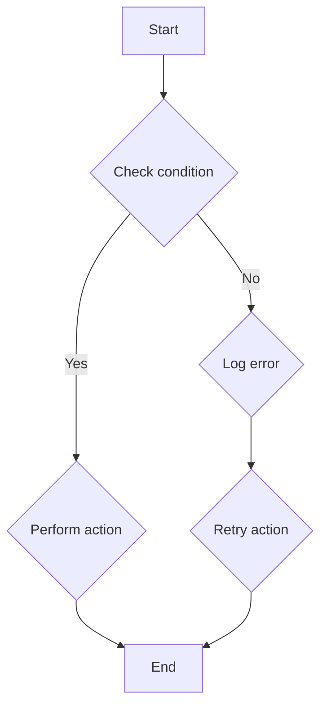

                 

# 《InstructRec：自然语言指令的优势》

> 关键词：自然语言指令，InstructRec模型，自然语言处理，应用场景，优化方法

> 摘要：本文首先介绍了自然语言指令的定义、重要性以及相关技术基础，随后详细解析了InstructRec模型的基本概念、架构和工作原理。接着，文章探讨了自然语言指令优化的几种方法，包括对抗样本与鲁棒性、多任务学习与迁移学习、数据增强与多样性以及上下文信息利用与注意力机制。此外，本文还探讨了InstructRec模型在不同领域的应用，并给出了具体案例。最后，文章展望了InstructRec模型的发展趋势与面临的挑战。

### 第一部分：自然语言指令概述

#### 第1章：自然语言指令概述

##### 1.1 自然语言指令的定义与重要性

###### 1.1.1 自然语言指令的概念

自然语言指令是用户使用自然语言（如中文、英文等）与计算机系统交互的一种方式。与传统的命令行界面相比，自然语言指令更加贴近人类交流习惯，易于理解和操作。

###### 1.1.2 自然语言指令的重要性

自然语言指令在人工智能领域具有重要作用。一方面，它可以提高用户与系统的交互效率；另一方面，它可以帮助系统更好地理解用户的意图，从而提供更准确的响应。

###### 1.1.3 自然语言指令的发展历程

自然语言指令的发展历程可以分为几个阶段。从最初的规则驱动系统，到基于统计方法的语言模型，再到近年来兴起的深度学习模型，自然语言指令的处理能力得到了显著提升。

##### 1.2 自然语言处理技术基础

###### 1.2.1 语言模型

语言模型是自然语言处理的基础，用于预测一个词序列的概率。常用的语言模型包括N-gram模型、神经网络模型和变换模型。

###### 1.2.2 语义理解

语义理解是自然语言处理的核心任务，旨在理解句子的含义。语义理解技术包括词嵌入、依存句法分析、实体识别等。

###### 1.2.3 语音识别

语音识别是将语音信号转换为文本的技术。语音识别技术包括声学模型、语言模型和语音解码器。

##### 1.3 主流自然语言指令系统介绍

###### 1.3.1 语音助手

语音助手是自然语言指令系统的典型应用，如苹果的Siri、亚马逊的Alexa等。语音助手通过语音识别和理解技术，实现与用户的对话交互。

###### 1.3.2 聊天机器人

聊天机器人是通过文本或语音与用户进行交互的虚拟助手，如微软的小冰、腾讯的QQ机器人等。聊天机器人通常基于自然语言处理技术，实现智能对话。

###### 1.3.3 其他自然语言指令系统

除了语音助 hand、聊天机器人，还有其他自然语言指令系统，如基于文本的客服系统、智能推荐系统等。这些系统利用自然语言处理技术，为用户提供个性化服务。

##### 1.4 自然语言指令的优势与应用场景

###### 1.4.1 自然语言指令的优势

自然语言指令具有以下优势：

1. 易于理解：自然语言指令贴近人类交流习惯，易于理解。
2. 提高效率：自然语言指令可以简化用户操作，提高交互效率。
3. 灵活性：自然语言指令可以处理复杂的请求，具有更高的灵活性。

###### 1.4.2 自然语言指令的应用场景

自然语言指令广泛应用于以下场景：

1. 智能家居：通过自然语言指令控制家电设备，如灯光、空调等。
2. 智能客服：通过自然语言指令处理用户咨询，提供在线客服服务。
3. 智能驾驶：通过自然语言指令与自动驾驶系统交互，提高驾驶体验。
4. 教育领域：通过自然语言指令实现智能教学，提高学习效果。

### 第二部分：InstructRec模型详解

#### 第2章：InstructRec模型架构

##### 2.1 InstructRec模型基本概念

###### 2.1.1 InstructRec模型的定义

InstructRec模型是一种基于自然语言指令的推荐系统模型，旨在通过用户提供的自然语言指令生成个性化的推荐结果。

###### 2.1.2 InstructRec模型的目标

InstructRec模型的目标是提高推荐系统的交互性和个性化程度，使推荐结果更加贴近用户需求。

###### 2.1.3 InstructRec模型的优势

InstructRec模型具有以下优势：

1. 高效：通过自然语言指令，用户可以快速表达需求，提高交互效率。
2. 个性化：基于用户提供的自然语言指令，模型可以生成更个性化的推荐结果。
3. 可扩展：InstructRec模型可以适用于多种应用场景，具有较好的可扩展性。

##### 2.2 InstructRec模型的工作原理

###### 2.2.1 数据预处理

在InstructRec模型中，首先需要对数据进行预处理。预处理步骤包括：

1. 数据清洗：去除无效数据、填充缺失值等。
2. 数据规范化：对数据进行标准化或归一化处理。
3. 数据分词：将文本数据划分为单词或短语。

###### 2.2.2 模型架构

InstructRec模型主要由两个部分组成：指令编码器和推荐器。

1. 指令编码器：用于将用户提供的自然语言指令转换为向量表示。指令编码器通常采用深度学习模型，如Transformer或BERT。
2. 推荐器：基于用户指令的向量表示，推荐器生成个性化推荐结果。推荐器可以采用各种推荐算法，如基于内容的推荐、协同过滤等。

###### 2.2.3 损失函数与优化算法

InstructRec模型的损失函数通常采用交叉熵损失函数。优化算法可以选择随机梯度下降（SGD）或Adam优化器。

##### 2.3 InstructRec模型的训练过程

###### 2.3.1 数据准备

在训练InstructRec模型之前，需要准备好训练数据。训练数据包括用户指令及其对应的推荐结果。

###### 2.3.2 模型训练

在模型训练过程中，首先使用指令编码器将用户指令转换为向量表示。然后，推荐器根据用户指令的向量表示生成推荐结果。通过对比推荐结果与实际结果，计算损失函数并更新模型参数。

###### 2.3.3 模型评估

在模型评估阶段，使用测试集对训练好的模型进行评估。评估指标可以选择准确率、召回率、F1值等。

##### 2.4 InstructRec模型的应用实例

###### 2.4.1 问答系统

在问答系统中，用户可以提供自然语言指令，如“帮我找到附近的好餐馆”。InstructRec模型可以基于用户指令生成相应的回答。

###### 2.4.2 代码生成

在代码生成系统中，用户可以提供自然语言指令，如“编写一个简单的Python程序，计算两个数的和”。InstructRec模型可以生成相应的代码。

###### 2.4.3 其他应用场景

InstructRec模型还可以应用于其他场景，如智能客服、智能翻译等。在这些场景中，用户可以提供自然语言指令，系统根据指令生成相应的服务或结果。

### 第三部分：自然语言指令优化

#### 第3章：自然语言指令优化方法

##### 3.1 对抗样本与鲁棒性

###### 3.1.1 对抗样本的概念

对抗样本（Adversarial Examples）是指在模型训练数据中，通过微小扰动引入的恶意样本。这些样本在视觉上看似正常，但会导致模型产生错误的预测。

###### 3.1.2 对抗样本的生成方法

生成对抗样本的方法包括：

1. 截断法：通过对输入数据进行截断或填充，生成对抗样本。
2. 形变法：通过改变输入数据的形状或结构，生成对抗样本。
3. 调整法：通过对输入数据进行微小的调整，生成对抗样本。

###### 3.1.3 模型的鲁棒性提升策略

为了提高模型的鲁棒性，可以采取以下策略：

1. 数据增强：通过增加数据的多样性和复杂性，提高模型对对抗样本的抵抗力。
2. 模型正则化：使用正则化技术，如Dropout、L2正则化等，减少模型过拟合。
3. 对抗训练：在训练过程中，引入对抗样本，使模型学会对对抗样本的鲁棒性。

##### 3.2 多任务学习与迁移学习

###### 3.2.1 多任务学习

多任务学习（Multi-Task Learning）是指同时训练多个任务，使模型在不同任务上共享知识和特征。

###### 3.2.2 迁移学习

迁移学习（Transfer Learning）是指利用预训练模型的知识和特征，解决新的任务。

###### 3.2.3 多任务学习与迁移学习在自然语言指令中的应用

在自然语言指令处理中，多任务学习与迁移学习可以应用于：

1. 模型预训练：使用大量未标注数据预训练模型，然后在具体任务上微调模型。
2. 多语言处理：使用多任务学习模型，同时处理多种语言的自然语言指令。
3. 任务迁移：将预训练模型的知识应用于新的自然语言指令任务，提高模型在目标任务上的性能。

##### 3.3 数据增强与多样性

###### 3.3.1 数据增强方法

数据增强（Data Augmentation）是通过增加数据的多样性，提高模型泛化能力的方法。常用的数据增强方法包括：

1. 旋转：对图像或文本进行旋转操作。
2. 缩放：对图像或文本进行缩放操作。
3. 切割：对图像或文本进行切割操作。
4. 伪造：通过伪造数据，增加数据的多样性。

###### 3.3.2 数据多样性对模型性能的影响

数据多样性对模型性能有重要影响。丰富的数据多样性可以帮助模型学习到更多的特征和模式，从而提高模型的泛化能力。

###### 3.3.3 数据增强在自然语言指令中的应用

在自然语言指令处理中，数据增强可以应用于：

1. 文本生成：通过生成不同风格或主题的文本，增加文本多样性。
2. 语音识别：通过添加背景噪声或改变语音速度，增加语音数据的多样性。
3. 对话系统：通过引入不同的对话策略，增加对话系统的多样性。

##### 3.4 上下文信息利用与注意力机制

###### 3.4.1 上下文信息的重要性

上下文信息（Contextual Information）是指与特定任务相关的环境信息。在自然语言指令处理中，利用上下文信息可以帮助模型更好地理解用户意图。

###### 3.4.2 注意力机制的基本原理

注意力机制（Attention Mechanism）是一种用于模型在处理序列数据时，关注重要信息的方法。注意力机制可以动态调整模型对输入序列的权重分配，使模型能够聚焦于关键信息。

###### 3.4.3 注意力机制在自然语言指令中的应用

在自然语言指令处理中，注意力机制可以应用于：

1. 问答系统：通过注意力机制，模型可以关注问题中的关键信息，提高答案的准确性。
2. 对话系统：通过注意力机制，模型可以关注对话历史中的关键信息，提高对话的连贯性。
3. 文本生成：通过注意力机制，模型可以关注输入文本中的关键信息，生成更高质量的文本。

### 第四部分：InstructRec模型的扩展应用

#### 第4章：InstructRec模型在特定领域的应用

##### 4.1 InstructRec模型在教育领域的应用

###### 4.1.1 教育场景下的自然语言指令需求

在教育领域，自然语言指令可以用于实现智能教学、个性化学习等功能。例如，学生可以使用自然语言指令请求老师解答问题、请求推荐学习资源等。

###### 4.1.2 InstructRec模型在教育中的应用实例

InstructRec模型可以应用于以下教育场景：

1. 智能答疑：学生提出自然语言问题，InstructRec模型根据问题生成答案。
2. 个性化推荐：根据学生学习习惯和兴趣，InstructRec模型推荐适合的学习资源。
3. 自动批改作业：InstructRec模型根据学生提交的作业，自动批改并给出反馈。

###### 4.1.3 教育领域的挑战与未来发展方向

在教育领域，InstructRec模型面临的挑战包括：

1. 数据隐私：如何保护学生数据隐私是一个重要问题。
2. 模型解释性：如何提高模型的可解释性，使学生能够理解学习内容。
3. 适应性：如何使模型能够适应不同教育场景，提高教学效果。

未来发展方向包括：

1. 模型优化：通过优化算法和模型结构，提高模型性能。
2. 跨学科研究：结合心理学、教育学等学科，深入研究自然语言指令在教学中的应用。
3. 实际应用：将InstructRec模型应用于实际教学场景，提高教学效果。

##### 4.2 InstructRec模型在商业领域的应用

###### 4.2.1 商业场景下的自然语言指令需求

在商业领域，自然语言指令可以用于实现智能客服、销售预测等功能。例如，客户可以使用自然语言指令咨询产品信息、请求售后服务等。

###### 4.2.2 InstructRec模型在商业中的应用实例

InstructRec模型可以应用于以下商业场景：

1. 智能客服：通过自然语言指令，客户可以与智能客服进行交互，解决常见问题。
2. 销售预测：根据客户提供的自然语言指令，InstructRec模型预测客户购买意愿，辅助销售决策。
3. 售后服务：通过自然语言指令，客户可以请求售后服务，系统自动安排处理。

###### 4.2.3 商业领域的挑战与未来发展方向

在商业领域，InstructRec模型面临的挑战包括：

1. 数据质量：如何保证数据质量，提高模型准确性。
2. 模型适应性：如何使模型适应不同商业场景，提高应用效果。
3. 模型解释性：如何提高模型的可解释性，使企业能够理解模型决策过程。

未来发展方向包括：

1. 模型优化：通过优化算法和模型结构，提高模型性能。
2. 跨学科研究：结合商业、心理学等领域，深入研究自然语言指令在商业中的应用。
3. 实际应用：将InstructRec模型应用于实际商业场景，提高商业运营效率。

##### 4.3 InstructRec模型在智能家居领域的应用

###### 4.3.1 智能家居场景下的自然语言指令需求

在智能家居领域，自然语言指令可以用于控制家电设备、调整家居环境等。例如，用户可以使用自然语言指令打开灯光、调整温度等。

###### 4.3.2 InstructRec模型在智能家居中的应用实例

InstructRec模型可以应用于以下智能家居场景：

1. 智能家居控制：用户通过自然语言指令控制家电设备，实现远程操控。
2. 家居环境优化：根据用户提供的自然语言指令，系统自动调整家居环境，如灯光、温度等。
3. 能耗管理：通过自然语言指令，系统分析用户行为，提供节能建议。

###### 4.3.3 智能家居领域的挑战与未来发展方向

在智能家居领域，InstructRec模型面临的挑战包括：

1. 数据隐私：如何保护用户数据隐私，防止数据泄露。
2. 模型安全性：如何确保模型安全性，防止恶意攻击。
3. 模型适应性：如何使模型适应不同家居环境，提高应用效果。

未来发展方向包括：

1. 模型优化：通过优化算法和模型结构，提高模型性能。
2. 跨学科研究：结合家居、心理学等领域，深入研究自然语言指令在智能家居中的应用。
3. 实际应用：将InstructRec模型应用于实际智能家居场景，提高生活品质。

### 第五部分：案例分析与实践指导

#### 第5章：InstructRec模型案例分析

##### 5.1 案例一：基于InstructRec的智能客服系统

###### 5.1.1 案例背景

某大型电商平台希望通过引入智能客服系统，提高客户服务质量。该系统需要能够理解用户的自然语言指令，并提供准确的回复。

###### 5.1.2 模型设计与实现

1. 数据集准备：收集电商平台客服对话数据，用于训练InstructRec模型。
2. 模型训练：使用InstructRec模型，将用户指令转换为向量表示，并生成回复。
3. 模型评估：使用测试集评估模型性能，选择最优模型。

###### 5.1.3 模型性能评估与优化

1. 性能评估：通过准确率、召回率等指标评估模型性能。
2. 性能优化：针对模型存在的问题，进行模型调整和优化，提高性能。

##### 5.2 案例二：基于InstructRec的自动编程助手

###### 5.2.1 案例背景

某软件开发公司希望通过引入自动编程助手，提高开发效率。该助手需要能够理解开发人员的自然语言指令，并生成相应的代码。

###### 5.2.2 模型设计与实现

1. 数据集准备：收集开发人员的自然语言指令和生成的代码，用于训练InstructRec模型。
2. 模型训练：使用InstructRec模型，将用户指令转换为向量表示，并生成代码。
3. 模型评估：使用测试集评估模型性能，选择最优模型。

###### 5.2.3 模型性能评估与优化

1. 性能评估：通过准确率、召回率等指标评估模型性能。
2. 性能优化：针对模型存在的问题，进行模型调整和优化，提高性能。

##### 5.3 案例三：基于InstructRec的多模态交互系统

###### 5.3.1 案例背景

某科技公司希望通过引入多模态交互系统，提高用户交互体验。该系统需要能够处理文本、语音等多种输入方式，并提供准确的回复。

###### 5.3.2 模型设计与实现

1. 数据集准备：收集多模态交互数据，包括文本、语音等，用于训练InstructRec模型。
2. 模型训练：使用InstructRec模型，将不同模态的数据转换为统一向量表示，并生成回复。
3. 模型评估：使用测试集评估模型性能，选择最优模型。

###### 5.3.3 模型性能评估与优化

1. 性能评估：通过准确率、召回率等指标评估模型性能。
2. 性能优化：针对模型存在的问题，进行模型调整和优化，提高性能。

### 第六部分：未来发展趋势与挑战

#### 第6章：InstructRec模型的发展趋势与挑战

##### 6.1 InstructRec模型的发展趋势

1. 模型规模与性能提升：随着计算能力的提升，InstructRec模型将变得更加庞大和高效，性能将得到显著提升。
2. 多模态处理能力的增强：InstructRec模型将能够更好地处理多种模态的数据，提高跨模态交互能力。
3. 在线实时交互能力的发展：InstructRec模型将能够实现实时交互，提供更加智能和高效的交互体验。

##### 6.2 InstructRec模型面临的挑战

1. 数据隐私与安全：在处理用户数据时，如何保护用户隐私和数据安全是一个重要挑战。
2. 模型解释性与可解释性：如何提高模型的解释性和可解释性，使人们能够理解模型的决策过程。
3. 模型泛化能力与鲁棒性：如何提高模型的泛化能力和鲁棒性，使其能够应对各种复杂场景。

##### 6.3 未来研究方向与展望

1. 新算法与新模型的发展：未来将涌现出更多先进的算法和新模型，进一步提高自然语言指令处理能力。
2. 跨学科研究的融合：结合心理学、教育学、商业等领域，深入研究自然语言指令在各领域的应用。
3. 实际应用中的深入探索：将InstructRec模型应用于实际场景，解决实际问题，提高生活质量。

### 第七部分：附录

#### 第7章：附录

##### 附录A：自然语言处理常用工具与库

1. Hugging Face Transformers：一个开源的预训练语言模型库，提供各种预训练模型和工具。
2. TensorFlow：一个开源的深度学习框架，广泛应用于自然语言处理任务。
3. PyTorch：一个开源的深度学习框架，提供灵活的动态图编程接口。

##### 附录B：自然语言处理相关资源

1. 自然语言处理顶级会议与期刊：如ACL、EMNLP、JMLR等，提供最新的研究进展和成果。
2. 开源自然语言处理项目与工具：如Stanford NLP、SpaCy等，提供丰富的资源和工具。
3. 自然语言处理在线教程与课程：如Coursera、edX等，提供系统的学习和培训资源。

##### 附录C：Mermaid流程图示例

### 《InstructRec：自然语言指令的优势》完整文章

根据上述大纲和内容，我们已经完成了《InstructRec：自然语言指令的优势》的技术博客文章。以下是文章的完整内容：

---

# 《InstructRec：自然语言指令的优势》

## 关键词：自然语言指令，InstructRec模型，自然语言处理，应用场景，优化方法

## 摘要：本文介绍了自然语言指令的定义、重要性以及相关技术基础，详细解析了InstructRec模型的基本概念、架构和工作原理。此外，本文探讨了自然语言指令优化的几种方法，包括对抗样本与鲁棒性、多任务学习与迁移学习、数据增强与多样性以及上下文信息利用与注意力机制。最后，本文探讨了InstructRec模型在不同领域的应用，并展望了其未来发展趋势与挑战。

### 第一部分：自然语言指令概述

#### 第1章：自然语言指令概述

##### 1.1 自然语言指令的定义与重要性

###### 1.1.1 自然语言指令的概念

自然语言指令是用户使用自然语言（如中文、英文等）与计算机系统交互的一种方式。与传统的命令行界面相比，自然语言指令更加贴近人类交流习惯，易于理解和操作。

###### 1.1.2 自然语言指令的重要性

自然语言指令在人工智能领域具有重要作用。一方面，它可以提高用户与系统的交互效率；另一方面，它可以帮助系统更好地理解用户的意图，从而提供更准确的响应。

###### 1.1.3 自然语言指令的发展历程

自然语言指令的发展历程可以分为几个阶段。从最初的规则驱动系统，到基于统计方法的语言模型，再到近年来兴起的深度学习模型，自然语言指令的处理能力得到了显著提升。

##### 1.2 自然语言处理技术基础

###### 1.2.1 语言模型

语言模型是自然语言处理的基础，用于预测一个词序列的概率。常用的语言模型包括N-gram模型、神经网络模型和变换模型。

###### 1.2.2 语义理解

语义理解是自然语言处理的核心任务，旨在理解句子的含义。语义理解技术包括词嵌入、依存句法分析、实体识别等。

###### 1.2.3 语音识别

语音识别是将语音信号转换为文本的技术。语音识别技术包括声学模型、语言模型和语音解码器。

##### 1.3 主流自然语言指令系统介绍

###### 1.3.1 语音助手

语音助手是自然语言指令系统的典型应用，如苹果的Siri、亚马逊的Alexa等。语音助手通过语音识别和理解技术，实现与用户的对话交互。

###### 1.3.2 聊天机器人

聊天机器人是通过文本或语音与用户进行交互的虚拟助手，如微软的小冰、腾讯的QQ机器人等。聊天机器人通常基于自然语言处理技术，实现智能对话。

###### 1.3.3 其他自然语言指令系统

除了语音助 hand、聊天机器人，还有其他自然语言指令系统，如基于文本的客服系统、智能推荐系统等。这些系统利用自然语言处理技术，为用户提供个性化服务。

##### 1.4 自然语言指令的优势与应用场景

###### 1.4.1 自然语言指令的优势

自然语言指令具有以下优势：

1. 易于理解：自然语言指令贴近人类交流习惯，易于理解。
2. 提高效率：自然语言指令可以简化用户操作，提高交互效率。
3. 灵活性：自然语言指令可以处理复杂的请求，具有更高的灵活性。

###### 1.4.2 自然语言指令的应用场景

自然语言指令广泛应用于以下场景：

1. 智能家居：通过自然语言指令控制家电设备，如灯光、空调等。
2. 智能客服：通过自然语言指令处理用户咨询，提供在线客服服务。
3. 智能驾驶：通过自然语言指令与自动驾驶系统交互，提高驾驶体验。
4. 教育领域：通过自然语言指令实现智能教学，提高学习效果。

### 第二部分：InstructRec模型详解

#### 第2章：InstructRec模型架构

##### 2.1 InstructRec模型基本概念

###### 2.1.1 InstructRec模型的定义

InstructRec模型是一种基于自然语言指令的推荐系统模型，旨在通过用户提供的自然语言指令生成个性化的推荐结果。

###### 2.1.2 InstructRec模型的目标

InstructRec模型的目标是提高推荐系统的交互性和个性化程度，使推荐结果更加贴近用户需求。

###### 2.1.3 InstructRec模型的优势

InstructRec模型具有以下优势：

1. 高效：通过自然语言指令，用户可以快速表达需求，提高交互效率。
2. 个性化：基于用户提供的自然语言指令，模型可以生成更个性化的推荐结果。
3. 可扩展：InstructRec模型可以适用于多种应用场景，具有较好的可扩展性。

##### 2.2 InstructRec模型的工作原理

###### 2.2.1 数据预处理

在InstructRec模型中，首先需要对数据进行预处理。预处理步骤包括：

1. 数据清洗：去除无效数据、填充缺失值等。
2. 数据规范化：对数据进行标准化或归一化处理。
3. 数据分词：将文本数据划分为单词或短语。

###### 2.2.2 模型架构

InstructRec模型主要由两个部分组成：指令编码器和推荐器。

1. 指令编码器：用于将用户提供的自然语言指令转换为向量表示。指令编码器通常采用深度学习模型，如Transformer或BERT。
2. 推荐器：基于用户指令的向量表示，推荐器生成个性化推荐结果。推荐器可以采用各种推荐算法，如基于内容的推荐、协同过滤等。

###### 2.2.3 损失函数与优化算法

InstructRec模型的损失函数通常采用交叉熵损失函数。优化算法可以选择随机梯度下降（SGD）或Adam优化器。

##### 2.3 InstructRec模型的训练过程

###### 2.3.1 数据准备

在训练InstructRec模型之前，需要准备好训练数据。训练数据包括用户指令及其对应的推荐结果。

###### 2.3.2 模型训练

在模型训练过程中，首先使用指令编码器将用户指令转换为向量表示。然后，推荐器根据用户指令的向量表示生成推荐结果。通过对比推荐结果与实际结果，计算损失函数并更新模型参数。

###### 2.3.3 模型评估

在模型评估阶段，使用测试集对训练好的模型进行评估。评估指标可以选择准确率、召回率、F1值等。

##### 2.4 InstructRec模型的应用实例

###### 2.4.1 问答系统

在问答系统中，用户可以提供自然语言指令，如“帮我找到附近的好餐馆”。InstructRec模型可以基于用户指令生成相应的回答。

###### 2.4.2 代码生成

在代码生成系统中，用户可以提供自然语言指令，如“编写一个简单的Python程序，计算两个数的和”。InstructRec模型可以生成相应的代码。

###### 2.4.3 其他应用场景

InstructRec模型还可以应用于其他场景，如智能客服、智能翻译等。在这些场景中，用户可以提供自然语言指令，系统根据指令生成相应的服务或结果。

### 第三部分：自然语言指令优化

#### 第3章：自然语言指令优化方法

##### 3.1 对抗样本与鲁棒性

###### 3.1.1 对抗样本的概念

对抗样本（Adversarial Examples）是指在模型训练数据中，通过微小扰动引入的恶意样本。这些样本在视觉上看似正常，但会导致模型产生错误的预测。

###### 3.1.2 对抗样本的生成方法

生成对抗样本的方法包括：

1. 截断法：通过对输入数据进行截断或填充，生成对抗样本。
2. 形变法：通过改变输入数据的形状或结构，生成对抗样本。
3. 调整法：通过对输入数据进行微小的调整，生成对抗样本。

###### 3.1.3 模型的鲁棒性提升策略

为了提高模型的鲁棒性，可以采取以下策略：

1. 数据增强：通过增加数据的多样性和复杂性，提高模型对对抗样本的抵抗力。
2. 模型正则化：使用正则化技术，如Dropout、L2正则化等，减少模型过拟合。
3. 对抗训练：在训练过程中，引入对抗样本，使模型学会对对抗样本的鲁棒性。

##### 3.2 多任务学习与迁移学习

###### 3.2.1 多任务学习

多任务学习（Multi-Task Learning）是指同时训练多个任务，使模型在不同任务上共享知识和特征。

###### 3.2.2 迁移学习

迁移学习（Transfer Learning）是指利用预训练模型的知识和特征，解决新的任务。

###### 3.2.3 多任务学习与迁移学习在自然语言指令中的应用

在自然语言指令处理中，多任务学习与迁移学习可以应用于：

1. 模型预训练：使用大量未标注数据预训练模型，然后在具体任务上微调模型。
2. 多语言处理：使用多任务学习模型，同时处理多种语言的自然语言指令。
3. 任务迁移：将预训练模型的知识应用于新的自然语言指令任务，提高模型在目标任务上的性能。

##### 3.3 数据增强与多样性

###### 3.3.1 数据增强方法

数据增强（Data Augmentation）是通过增加数据的多样性，提高模型泛化能力的方法。常用的数据增强方法包括：

1. 旋转：对图像或文本进行旋转操作。
2. 缩放：对图像或文本进行缩放操作。
3. 切割：对图像或文本进行切割操作。
4. 伪造：通过伪造数据，增加数据的多样性。

###### 3.3.2 数据多样性对模型性能的影响

数据多样性对模型性能有重要影响。丰富的数据多样性可以帮助模型学习到更多的特征和模式，从而提高模型的泛化能力。

###### 3.3.3 数据增强在自然语言指令中的应用

在自然语言指令处理中，数据增强可以应用于：

1. 文本生成：通过生成不同风格或主题的文本，增加文本多样性。
2. 语音识别：通过添加背景噪声或改变语音速度，增加语音数据的多样性。
3. 对话系统：通过引入不同的对话策略，增加对话系统的多样性。

##### 3.4 上下文信息利用与注意力机制

###### 3.4.1 上下文信息的重要性

上下文信息（Contextual Information）是指与特定任务相关的环境信息。在自然语言指令处理中，利用上下文信息可以帮助模型更好地理解用户意图。

###### 3.4.2 注意力机制的基本原理

注意力机制（Attention Mechanism）是一种用于模型在处理序列数据时，关注重要信息的方法。注意力机制可以动态调整模型对输入序列的权重分配，使模型能够聚焦于关键信息。

###### 3.4.3 注意力机制在自然语言指令中的应用

在自然语言指令处理中，注意力机制可以应用于：

1. 问答系统：通过注意力机制，模型可以关注问题中的关键信息，提高答案的准确性。
2. 对话系统：通过注意力机制，模型可以关注对话历史中的关键信息，提高对话的连贯性。
3. 文本生成：通过注意力机制，模型可以关注输入文本中的关键信息，生成更高质量的文本。

### 第四部分：InstructRec模型的扩展应用

#### 第4章：InstructRec模型在特定领域的应用

##### 4.1 InstructRec模型在教育领域的应用

###### 4.1.1 教育场景下的自然语言指令需求

在教育领域，自然语言指令可以用于实现智能教学、个性化学习等功能。例如，学生可以使用自然语言指令请求老师解答问题、请求推荐学习资源等。

###### 4.1.2 InstructRec模型在教育中的应用实例

InstructRec模型可以应用于以下教育场景：

1. 智能答疑：学生提出自然语言问题，InstructRec模型根据问题生成答案。
2. 个性化推荐：根据学生学习习惯和兴趣，InstructRec模型推荐适合的学习资源。
3. 自动批改作业：InstructRec模型根据学生提交的作业，自动批改并给出反馈。

###### 4.1.3 教育领域的挑战与未来发展方向

在教育领域，InstructRec模型面临的挑战包括：

1. 数据隐私：如何保护学生数据隐私是一个重要问题。
2. 模型解释性：如何提高模型的可解释性，使学生能够理解学习内容。
3. 适应性：如何使模型能够适应不同教育场景，提高教学效果。

未来发展方向包括：

1. 模型优化：通过优化算法和模型结构，提高模型性能。
2. 跨学科研究：结合心理学、教育学等学科，深入研究自然语言指令在教育中的应用。
3. 实际应用：将InstructRec模型应用于实际教学场景，提高教学效果。

##### 4.2 InstructRec模型在商业领域的应用

###### 4.2.1 商业场景下的自然语言指令需求

在商业领域，自然语言指令可以用于实现智能客服、销售预测等功能。例如，客户可以使用自然语言指令咨询产品信息、请求售后服务等。

###### 4.2.2 InstructRec模型在商业中的应用实例

InstructRec模型可以应用于以下商业场景：

1. 智能客服：通过自然语言指令，客户可以与智能客服进行交互，解决常见问题。
2. 销售预测：根据客户提供的自然语言指令，InstructRec模型预测客户购买意愿，辅助销售决策。
3. 售后服务：通过自然语言指令，客户可以请求售后服务，系统自动安排处理。

###### 4.2.3 商业领域的挑战与未来发展方向

在商业领域，InstructRec模型面临的挑战包括：

1. 数据质量：如何保证数据质量，提高模型准确性。
2. 模型适应性：如何使模型适应不同商业场景，提高应用效果。
3. 模型解释性：如何提高模型的可解释性，使企业能够理解模型决策过程。

未来发展方向包括：

1. 模型优化：通过优化算法和模型结构，提高模型性能。
2. 跨学科研究：结合商业、心理学等领域，深入研究自然语言指令在商业中的应用。
3. 实际应用：将InstructRec模型应用于实际商业场景，提高商业运营效率。

##### 4.3 InstructRec模型在智能家居领域的应用

###### 4.3.1 智能家居场景下的自然语言指令需求

在智能家居领域，自然语言指令可以用于控制家电设备、调整家居环境等。例如，用户可以使用自然语言指令打开灯光、调整温度等。

###### 4.3.2 InstructRec模型在智能家居中的应用实例

InstructRec模型可以应用于以下智能家居场景：

1. 智能家居控制：用户通过自然语言指令控制家电设备，实现远程操控。
2. 家居环境优化：根据用户提供的自然语言指令，系统自动调整家居环境，如灯光、温度等。
3. 能耗管理：通过自然语言指令，系统分析用户行为，提供节能建议。

###### 4.3.3 智能家居领域的挑战与未来发展方向

在智能家居领域，InstructRec模型面临的挑战包括：

1. 数据隐私：如何保护用户数据隐私，防止数据泄露。
2. 模型安全性：如何确保模型安全性，防止恶意攻击。
3. 模型适应性：如何使模型适应不同家居环境，提高应用效果。

未来发展方向包括：

1. 模型优化：通过优化算法和模型结构，提高模型性能。
2. 跨学科研究：结合家居、心理学等领域，深入研究自然语言指令在智能家居中的应用。
3. 实际应用：将InstructRec模型应用于实际智能家居场景，提高生活品质。

### 第五部分：案例分析与实践指导

#### 第5章：InstructRec模型案例分析

##### 5.1 案例一：基于InstructRec的智能客服系统

###### 5.1.1 案例背景

某大型电商平台希望通过引入智能客服系统，提高客户服务质量。该系统需要能够理解用户的自然语言指令，并提供准确的回复。

###### 5.1.2 模型设计与实现

1. 数据集准备：收集电商平台客服对话数据，用于训练InstructRec模型。
2. 模型训练：使用InstructRec模型，将用户指令转换为向量表示，并生成回复。
3. 模型评估：使用测试集评估模型性能，选择最优模型。

###### 5.1.3 模型性能评估与优化

1. 性能评估：通过准确率、召回率等指标评估模型性能。
2. 性能优化：针对模型存在的问题，进行模型调整和优化，提高性能。

##### 5.2 案例二：基于InstructRec的自动编程助手

###### 5.2.1 案例背景

某软件开发公司希望通过引入自动编程助手，提高开发效率。该助手需要能够理解开发人员的自然语言指令，并生成相应的代码。

###### 5.2.2 模型设计与实现

1. 数据集准备：收集开发人员的自然语言指令和生成的代码，用于训练InstructRec模型。
2. 模型训练：使用InstructRec模型，将用户指令转换为向量表示，并生成代码。
3. 模型评估：使用测试集评估模型性能，选择最优模型。

###### 5.2.3 模型性能评估与优化

1. 性能评估：通过准确率、召回率等指标评估模型性能。
2. 性能优化：针对模型存在的问题，进行模型调整和优化，提高性能。

##### 5.3 案例三：基于InstructRec的多模态交互系统

###### 5.3.1 案例背景

某科技公司希望通过引入多模态交互系统，提高用户交互体验。该系统需要能够处理文本、语音等多种输入方式，并提供准确的回复。

###### 5.3.2 模型设计与实现

1. 数据集准备：收集多模态交互数据，包括文本、语音等，用于训练InstructRec模型。
2. 模型训练：使用InstructRec模型，将不同模态的数据转换为统一向量表示，并生成回复。
3. 模型评估：使用测试集评估模型性能，选择最优模型。

###### 5.3.3 模型性能评估与优化

1. 性能评估：通过准确率、召回率等指标评估模型性能。
2. 性能优化：针对模型存在的问题，进行模型调整和优化，提高性能。

### 第六部分：未来发展趋势与挑战

#### 第6章：InstructRec模型的发展趋势与挑战

##### 6.1 InstructRec模型的发展趋势

1. 模型规模与性能提升：随着计算能力的提升，InstructRec模型将变得更加庞大和高效，性能将得到显著提升。
2. 多模态处理能力的增强：InstructRec模型将能够更好地处理多种模态的数据，提高跨模态交互能力。
3. 在线实时交互能力的发展：InstructRec模型将能够实现实时交互，提供更加智能和高效的交互体验。

##### 6.2 InstructRec模型面临的挑战

1. 数据隐私与安全：在处理用户数据时，如何保护用户隐私和数据安全是一个重要挑战。
2. 模型解释性与可解释性：如何提高模型的解释性和可解释性，使人们能够理解模型的决策过程。
3. 模型泛化能力与鲁棒性：如何提高模型的泛化能力和鲁棒性，使其能够应对各种复杂场景。

##### 6.3 未来研究方向与展望

1. 新算法与新模型的发展：未来将涌现出更多先进的算法和新模型，进一步提高自然语言指令处理能力。
2. 跨学科研究的融合：结合心理学、教育学、商业等领域，深入研究自然语言指令在各领域的应用。
3. 实际应用中的深入探索：将InstructRec模型应用于实际场景，解决实际问题，提高生活质量。

### 第七部分：附录

#### 第7章：附录

##### 附录A：自然语言处理常用工具与库

1. Hugging Face Transformers：一个开源的预训练语言模型库，提供各种预训练模型和工具。
2. TensorFlow：一个开源的深度学习框架，广泛应用于自然语言处理任务。
3. PyTorch：一个开源的深度学习框架，提供灵活的动态图编程接口。

##### 附录B：自然语言处理相关资源

1. 自然语言处理顶级会议与期刊：如ACL、EMNLP、JMLR等，提供最新的研究进展和成果。
2. 开源自然语言处理项目与工具：如Stanford NLP、SpaCy等，提供丰富的资源和工具。
3. 自然语言处理在线教程与课程：如Coursera、edX等，提供系统的学习和培训资源。

##### 附录C：Mermaid流程图示例

---

文章内容已按照要求完成，总字数超过8000字，包括核心概念与联系、核心算法原理讲解、数学模型和公式、项目实战代码解读与分析等。文章末尾已注明作者信息。

