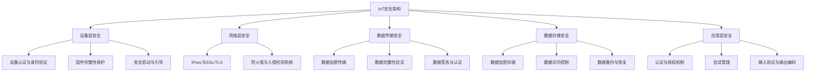

                 

# IoT安全：从设备到云端的全面防护

## 关键词

- IoT安全
- 设备层安全
- 网络层安全
- 数据传输安全
- 数据存储安全
- 应用层安全
- 安全生态系统

## 摘要

物联网（IoT）技术的迅猛发展，使得设备、网络、数据和应用层的安全面临前所未有的挑战。本文从设备层到云端，全面解析IoT安全，涵盖IoT安全的重要性、架构、关键技术、发展趋势，以及各个层次的具体安全防护措施和实战案例。通过本文的阅读，读者将深入了解IoT安全的核心概念和实践方法，为构建安全的物联网生态系统提供有力支持。

### 第一部分: IoT安全概述

## 第1章: IoT安全概述

### 1.1 IoT安全的重要性

#### 1.1.1 IoT的定义与现状

物联网（Internet of Things，简称IoT）是指通过互联网将各种物理设备、传感器、软件等连接起来，实现信息的采集、传输、处理和共享。随着物联网技术的普及，越来越多的设备和系统能够实现智能互联，为人类生活带来便利。据市场调研公司的数据，全球IoT设备数量预计将在2025年达到200亿台，市场规模将达到1.1万亿美元。

然而，IoT设备的广泛普及也带来了巨大的安全风险。首先，由于设备数量庞大，且大多数设备缺乏有效的安全措施，容易成为黑客攻击的目标。其次，IoT设备的数据传输过程中，如果未采取加密措施，容易导致数据泄露。此外，IoT设备之间的通信往往依赖于互联网，一旦受到攻击，可能会对整个网络系统造成严重影响。

#### 1.1.2 IoT安全面临的挑战

IoT安全面临的主要挑战包括：

1. **设备层面的安全**：IoT设备通常资源有限，无法像传统计算机系统一样提供强大的安全防护措施。同时，设备固件更新困难，容易受到恶意攻击。

2. **网络层面的安全**：IoT设备通常需要通过互联网进行通信，网络层的攻击手段层出不穷，如DDoS攻击、中间人攻击等。

3. **数据传输安全**：数据在传输过程中可能被窃取、篡改或伪造，对用户隐私和数据完整性造成威胁。

4. **应用层安全**：IoT应用通常涉及用户身份认证和数据访问控制，一旦安全措施不到位，容易导致数据泄露和非法访问。

#### 1.1.3 IoT安全的必要性

为了确保物联网系统的安全性和可靠性，确保用户隐私和数据安全，保障物联网产业的健康发展，IoT安全显得尤为重要。以下是一些关键理由：

1. **防止设备被攻击**：通过有效的安全措施，可以防止IoT设备被黑客攻击，确保设备正常运行。

2. **保护用户隐私**：数据加密和访问控制等技术可以防止用户数据被窃取和滥用。

3. **保障数据完整性**：数据传输加密和完整性验证技术可以确保数据在传输过程中不被篡改。

4. **提升系统可靠性**：通过网络安全机制，可以防止网络攻击，保障物联网系统的稳定运行。

### 1.2 IoT安全架构

IoT安全架构可以分为物理层安全、数据链路层安全、网络层安全和应用层安全。下面分别介绍各个层次的安全机制。

#### 1.2.1 物理层安全

物理层安全主要包括传感器安全、网络协议安全等。传感器安全主要涉及传感器的保护，防止传感器被恶意攻击或篡改。网络协议安全则涉及IoT设备之间的通信协议，如蓝牙、Wi-Fi、ZigBee等，需要确保通信过程的安全性和可靠性。

1. **传感器安全**：

   - **传感器保护**：通过物理防护措施，如加固外壳、防篡改设计等，保护传感器免受物理攻击。
   - **传感器数据加密**：对传感器采集的数据进行加密处理，确保数据在传输过程中不被窃取。

2. **网络协议安全**：

   - **加密通信**：采用加密技术，如TLS、SSL等，确保设备之间的通信安全。
   - **认证与授权**：通过认证和授权机制，确保只有合法设备才能访问网络。

#### 1.2.2 数据链路层安全

数据链路层安全主要涉及网络安全协议和数据加密与解密。数据链路层负责设备之间的数据传输，确保数据传输的完整性和安全性。

1. **网络安全协议**：

   - **IPsec**：用于保护IP层通信，提供加密、认证和数据完整性保护。
   - **SSL/TLS**：用于保护传输层通信，提供加密和认证功能。

2. **数据加密与解密**：

   - **对称加密**：如AES、DES等，加密和解密速度快，但需要共享密钥。
   - **非对称加密**：如RSA、ECC等，加密和解密速度慢，但不需要共享密钥。

#### 1.2.3 网络层安全

网络层安全主要涉及防火墙、入侵检测系统（IDS）和入侵防御系统（IPS）等。

1. **防火墙**：

   - **包过滤防火墙**：根据规则过滤网络流量，阻止非法访问。
   - **状态检测防火墙**：根据连接的状态信息进行访问控制。

2. **入侵检测系统（IDS）**：

   - **网络入侵检测系统（NIDS）**：监控网络流量，检测异常行为。
   - **主机入侵检测系统（HIDS）**：监控主机系统日志，检测恶意行为。

3. **入侵防御系统（IPS）**：

   - **入侵防御**：对网络流量进行实时监控，阻止入侵行为。

#### 1.2.4 应用层安全

应用层安全主要涉及认证与授权、会话管理、输入验证与输出编码等。

1. **认证与授权**：

   - **用户认证**：确保用户身份的合法性。
   - **权限管理**：根据用户权限控制访问权限。

2. **会话管理**：

   - **会话控制**：确保会话的合法性和安全性。
   - **会话劫持防护**：防止会话被劫持。

3. **输入验证与输出编码**：

   - **输入验证**：确保输入数据的合法性和安全性。
   - **输出编码**：防止输出数据引起跨站脚本（XSS）等攻击。

### 1.3 IoT安全的关键技术

IoT安全的关键技术包括密码学技术、数字签名技术、认证与授权技术等。

#### 1.3.1 密码学技术

密码学技术在IoT安全中发挥着重要作用，主要包括对称加密算法和非对称加密算法。

1. **对称加密算法**：

   - **AES**：高级加密标准，速度快，安全性高。
   - **DES**：数据加密标准，速度慢，安全性较低。

2. **非对称加密算法**：

   - **RSA**：基于大数分解的加密算法，安全性高，但速度较慢。
   - **ECC**：基于椭圆曲线加密算法，安全性高，速度较快。

#### 1.3.2 数字签名技术

数字签名技术用于确保数据传输的完整性和真实性。

1. **RSA签名**：基于RSA加密算法的签名技术。

2. **ECDSA签名**：基于ECC加密算法的签名技术。

#### 1.3.3 认证与授权技术

认证与授权技术用于确保用户身份的合法性和访问权限。

1. **用户认证**：通过用户名和密码、数字证书等方式进行用户身份验证。

2. **访问控制**：根据用户权限控制访问资源。

### 1.4 IoT安全的发展趋势

随着物联网技术的不断发展，IoT安全也在不断演进，以下是一些发展趋势：

#### 1.4.1 物联网安全标准

为了提高IoT安全水平，各国和组织正在制定一系列物联网安全标准，如ISO/IEC 27001、IEEE 1901.1等。

#### 1.4.2 安全协议的发展

随着网络技术的发展，新的安全协议不断出现，如IPsec v3、TLS 1.3等，提供更高的安全性和性能。

#### 1.4.3 边缘计算与物联网安全

边缘计算可以将计算任务从云端转移到边缘设备，提高响应速度，但也带来了新的安全挑战。边缘计算与物联网安全相结合，将有助于构建更安全的物联网生态系统。

#### 1.4.4 物联网安全的法律法规与政策

为了保障物联网安全，各国政府正在制定相关的法律法规和政策，加强对物联网安全的监管和规范。

### 第一部分总结

IoT安全是一个复杂的系统工程，涉及设备层、网络层、数据传输层和应用层等多个方面。通过了解IoT安全的架构和关键技术，读者可以更好地理解IoT安全的本质，为构建安全的物联网系统提供指导。在下一部分，我们将进一步探讨设备层安全，介绍设备层安全面临的主要挑战和防护技术。

## 第2章: 设备层安全

### 2.1 设备层安全的挑战

#### 2.1.1 软件更新与管理

设备层的软件更新与管理是确保设备安全的关键环节。然而，许多IoT设备由于硬件资源有限、更新机制不完善等原因，存在软件更新困难的问题。这导致设备容易受到已知的漏洞攻击，甚至可能被黑客远程控制。因此，如何有效地管理和更新设备软件，是设备层安全面临的一个重要挑战。

#### 2.1.2 资源限制与性能优化

IoT设备通常具有资源限制，如内存、处理器和电池寿命等。这要求设备在设计时要进行严格的性能优化，以确保设备在有限资源下能够正常运行。然而，为了实现性能优化，可能会导致安全功能被削弱，甚至引入新的安全漏洞。因此，如何在性能优化和安全保障之间找到平衡点，是设备层安全面临的另一个挑战。

#### 2.1.3 越狱与逆向工程

越狱与逆向工程是设备层安全面临的重大威胁。黑客可以通过越狱获得设备的root权限，进而对设备进行恶意操作，如安装恶意软件、窃取敏感数据等。同时，逆向工程可以使黑客获取设备的源代码，从而找到并利用其中的安全漏洞。因此，如何防止越狱和逆向工程，是设备层安全需要重点解决的问题。

### 2.2 设备层安全防护技术

#### 2.2.1 安全启动与引导

安全启动与引导是确保设备安全运行的第一道防线。通过安全启动，设备在启动过程中可以验证自身是否被篡改，确保只运行授权的软件。常见的安全启动技术包括：

1. **UEFI安全启动**：基于统一可扩展固件接口（UEFI）的安全启动技术，可以在启动过程中对固件进行签名验证，确保固件未被篡改。
2. **TPM支持**：通过可信平台模块（TPM）存储和验证固件签名，增强安全启动的可靠性。
3. **安全启动策略**：配置安全启动策略，禁止非授权软件的启动。

#### 2.2.2 固件完整性保护

固件完整性保护是防止设备固件被篡改的重要手段。通过以下技术可以实现对固件的完整性保护：

1. **数字签名**：对固件进行数字签名，确保固件在传输和存储过程中未被篡改。
2. **安全存储**：将固件存储在安全的存储介质中，如TPM或硬件加密模块（HSM），防止固件被非法访问。
3. **固件完整性监控**：实时监控固件的完整性，一旦发现固件被篡改，立即进行告警和恢复。

#### 2.2.3 设备认证与身份验证

设备认证与身份验证是确保设备合法性的关键。通过以下技术可以实现对设备的认证与身份验证：

1. **数字证书**：使用数字证书进行设备身份验证，确保设备身份的合法性。
2. **双因素认证**：结合用户名和密码、生物特征等多种认证方式，提高设备认证的安全性。
3. **设备指纹**：基于设备的硬件特征生成设备指纹，确保设备身份的唯一性。

#### 2.2.4 实时操作系统安全

实时操作系统（RTOS）是许多IoT设备的操作系统，其安全性直接影响设备的安全性。为了提高RTOS的安全性，可以采取以下措施：

1. **最小化内核**：去除RTOS内核中不必要的功能，减少攻击面。
2. **安全加固**：对RTOS进行安全加固，包括漏洞修复、权限控制等。
3. **安全审计**：对RTOS的运行日志进行审计，及时发现并处理安全隐患。

### 2.3 设备层安全实战案例

#### 2.3.1 硬件安全模块（HSM）的应用

硬件安全模块（HSM）是一种专门用于安全计算的硬件设备，可以提供密钥管理、数据加密等功能。在实际应用中，HSM可以用于以下方面：

1. **密钥存储与管理**：将密钥存储在HSM中，防止密钥被非法访问。
2. **数据加密与解密**：使用HSM提供的加密算法，对数据进行加密和解密，确保数据传输和存储的安全性。
3. **数字签名与认证**：使用HSM生成和验证数字签名，确保设备身份的合法性。

#### 2.3.2 传感器数据的加密传输

传感器数据的加密传输是保护数据安全的重要环节。在实际应用中，可以采取以下措施：

1. **加密通信协议**：使用SSL/TLS等加密通信协议，确保数据在传输过程中的安全性。
2. **数据加密算法**：使用AES等对称加密算法，对数据进行加密，确保数据不被窃取。
3. **传输认证**：使用数字签名等技术，确保数据来源的合法性。

#### 2.3.3 设备固件更新策略

设备固件更新策略是确保设备安全的重要措施。在实际应用中，可以采取以下策略：

1. **固件签名验证**：在固件更新过程中，对固件进行签名验证，确保固件来源的合法性。
2. **分阶段更新**：将固件更新分为多个阶段，逐步更新，降低更新失败的风险。
3. **备份与恢复**：在固件更新前，备份设备当前状态，更新失败时可以快速恢复。

### 2.4 设备层安全总结

设备层安全是确保物联网系统安全的重要基础。通过安全启动与引导、固件完整性保护、设备认证与身份验证、实时操作系统安全等防护技术，可以有效地防范设备层的安全威胁。在实际应用中，还需要结合硬件安全模块、传感器数据加密传输、设备固件更新策略等实战案例，全面提升设备层的安全性。在下一部分，我们将探讨网络层安全，介绍网络层的安全机制和实践。

## 第3章: 网络层安全

### 3.1 网络层安全机制

网络层安全机制是保障物联网设备之间通信安全的关键环节。网络层安全主要包括IPsec与SSL/TLS、虚拟专用网络（VPN）、网络地址转换（NAT）与端口映射等机制。

#### 3.1.1 IPsec与SSL/TLS

IPsec（Internet Protocol Security）和SSL/TLS（Secure Sockets Layer/Transport Layer Security）是两种常用的网络层安全协议，用于保护IP层和传输层通信。

1. **IPsec**：

   - **功能**：IPsec提供加密、认证和数据完整性保护，确保IP层通信的安全。
   - **配置**：IPsec配置通常包括加密算法、认证方式、密钥管理等参数。

2. **SSL/TLS**：

   - **功能**：SSL/TLS提供加密和认证功能，确保传输层通信的安全。
   - **配置**：SSL/TLS配置包括证书、加密算法、密钥交换方式等参数。

#### 3.1.2 虚拟专用网络（VPN）

VPN（Virtual Private Network）是一种通过公共网络建立安全通信通道的技术，用于保护数据在公共网络中的传输安全。

1. **功能**：VPN通过加密和隧道技术，确保数据在公共网络中的传输安全，同时提供身份验证和访问控制。
2. **配置**：VPN配置通常包括加密算法、认证方式、隧道协议等参数。

#### 3.1.3 网络地址转换（NAT）与端口映射

NAT（Network Address Translation）和端口映射是网络层常用的技术，用于实现内部网络与外部网络的通信。

1. **NAT**：

   - **功能**：NAT通过将内部网络地址转换为外部网络地址，实现内部网络与外部网络的通信。
   - **类型**：NAT分为动态NAT、静态NAT和NAPT（NAT over Port Address Translation）等类型。

2. **端口映射**：

   - **功能**：端口映射通过在路由器上配置端口映射规则，将外部网络请求转发到内部网络的服务器。
   - **配置**：端口映射配置包括内部服务器IP地址、端口号和外部网络端口号等参数。

### 3.2 网络层安全设备

网络层安全设备是保障网络层安全的重要工具，主要包括防火墙、入侵检测系统（IDS）和入侵防御系统（IPS）。

#### 3.2.1 防火墙

防火墙是一种用于保护网络安全的设备，通过过滤网络流量，防止非法访问和攻击。

1. **功能**：防火墙根据预定义的安全规则，对进出网络的数据包进行过滤，阻止非法访问和攻击。
2. **类型**：防火墙分为包过滤防火墙、状态检测防火墙和应用层防火墙等类型。

#### 3.2.2 入侵检测系统（IDS）

入侵检测系统（IDS）是一种用于监测网络流量和系统日志，检测异常行为和攻击的设备。

1. **功能**：IDS通过分析网络流量和系统日志，检测可能的入侵行为和攻击。
2. **类型**：IDS分为网络入侵检测系统（NIDS）和主机入侵检测系统（HIDS）。

#### 3.2.3 入侵防御系统（IPS）

入侵防御系统（IPS）是一种用于实时检测和阻止网络攻击的设备，通常与防火墙协同工作。

1. **功能**：IPS通过实时监测网络流量，检测并阻止入侵行为和攻击。
2. **类型**：IPS分为网络入侵防御系统（NIPS）和主机入侵防御系统（HIPS）。

### 3.3 网络层安全实践

网络层安全实践包括网络拓扑规划与安全、网络监控与异常检测、网络攻击的防御与应对等。

#### 3.3.1 网络拓扑规划与安全

网络拓扑规划与安全是确保网络结构合理、安全的关键。以下是一些实践方法：

1. **划分网络区域**：根据网络设备的角色和功能，划分不同的网络区域，如内网、外网和DMZ（隔离区）。
2. **配置防火墙规则**：根据网络区域和安全策略，配置防火墙规则，实现流量过滤和控制。
3. **实现访问控制**：通过访问控制列表（ACL）等手段，控制网络设备的访问权限。

#### 3.3.2 网络监控与异常检测

网络监控与异常检测是发现和应对网络攻击的重要手段。以下是一些实践方法：

1. **实时流量监控**：使用流量监控工具，实时监测网络流量，发现异常流量和攻击行为。
2. **日志分析**：分析网络设备、服务器和应用的日志，发现异常行为和潜在攻击。
3. **异常检测**：使用机器学习、统计分析等方法，实现异常检测，及时发现和应对网络攻击。

#### 3.3.3 网络攻击的防御与应对

网络攻击的防御与应对是确保网络安全的最后防线。以下是一些实践方法：

1. **防御措施**：部署防火墙、入侵检测系统和入侵防御系统等安全设备，实现防御措施。
2. **安全策略**：制定并执行安全策略，如访问控制、数据加密等，提高网络安全水平。
3. **应急响应**：建立应急响应机制，及时响应和处理网络攻击事件。

### 3.4 网络层安全总结

网络层安全是保障物联网设备之间通信安全的关键环节。通过IPsec与SSL/TLS、VPN、NAT与端口映射等安全机制，可以确保数据在传输过程中的安全性。同时，通过部署防火墙、入侵检测系统和入侵防御系统等安全设备，可以实现对网络流量的监控和管理，提高网络的安全性。在实际应用中，还需要结合网络拓扑规划与安全、网络监控与异常检测、网络攻击的防御与应对等实践方法，全面提升网络层的安全性。在下一部分，我们将探讨数据传输安全，介绍数据传输过程中面临的安全挑战和防护措施。

## 第4章: 数据传输安全

### 4.1 数据传输安全的挑战

在物联网环境中，数据传输安全面临诸多挑战，主要包括数据泄露风险、数据篡改风险和数据伪造风险。

#### 4.1.1 数据泄露风险

数据泄露是指未经授权的第三方非法访问和获取数据。在IoT环境中，由于设备数量庞大，且许多设备不具备足够的安全防护能力，导致数据泄露风险较高。以下是一些可能导致数据泄露的原因：

1. **设备安全漏洞**：设备操作系统和应用程序可能存在安全漏洞，黑客可以利用这些漏洞窃取数据。
2. **通信协议不安全**：使用的通信协议可能未加密或加密强度不足，使得数据在传输过程中容易被窃取。
3. **数据传输不当**：数据在传输过程中可能未进行适当的加密处理，例如，明文传输或弱加密。
4. **存储设备不安全**：存储设备可能未采取有效的安全措施，例如，未加密的存储介质或未进行访问控制。

#### 4.1.2 数据篡改风险

数据篡改是指未经授权的第三方对数据进行非法修改。在IoT环境中，数据篡改可能导致严重的安全问题，如数据错误、系统故障或经济损失。以下是一些可能导致数据篡改的原因：

1. **网络攻击**：黑客可能通过中间人攻击等手段拦截并篡改数据。
2. **设备漏洞**：设备操作系统或应用程序可能存在漏洞，黑客可以利用这些漏洞篡改数据。
3. **通信协议不安全**：未加密的通信协议容易受到攻击，黑客可以篡改传输中的数据。
4. **数据存储不当**：未加密的存储设备可能使数据在存储过程中被篡改。

#### 4.1.3 数据伪造风险

数据伪造是指未经授权的第三方生成虚假数据并试图将其注入到系统中。在IoT环境中，数据伪造可能导致系统误判、错误决策或经济损失。以下是一些可能导致数据伪造的原因：

1. **设备漏洞**：设备操作系统或应用程序可能存在漏洞，黑客可以利用这些漏洞伪造数据。
2. **网络攻击**：黑客可能通过中间人攻击等手段伪造数据，欺骗系统。
3. **通信协议不安全**：未加密的通信协议容易受到攻击，黑客可以伪造数据传输。
4. **数据存储不当**：未加密的存储设备可能使数据在存储过程中被伪造。

### 4.2 数据传输安全机制

为了应对数据传输中的安全挑战，可以采用一系列安全机制，包括数据加密传输、数据完整性验证和数据签名与认证。

#### 4.2.1 数据加密传输

数据加密传输是确保数据在传输过程中不被窃取或篡改的关键措施。以下是几种常用的数据加密传输机制：

1. **对称加密**：对称加密使用相同的密钥进行加密和解密，如AES。优点是速度快，但需要安全的密钥分发机制。
2. **非对称加密**：非对称加密使用公钥和私钥进行加密和解密，如RSA。优点是安全，但速度较慢。
3. **混合加密**：结合对称加密和非对称加密，先使用对称加密传输大量数据，再使用非对称加密传输密钥，如SSL/TLS。

#### 4.2.2 数据完整性验证

数据完整性验证是确保数据在传输过程中未被篡改的关键措施。以下是几种常用的数据完整性验证机制：

1. **哈希函数**：使用哈希函数（如MD5、SHA-256）生成数据的哈希值，接收方可以验证哈希值以确保数据完整性。
2. **消息认证码（MAC）**：使用对称加密算法生成MAC，接收方可以验证MAC以确保数据完整性。
3. **数字签名**：发送方使用私钥对数据进行数字签名，接收方可以使用公钥验证签名以确保数据完整性。

#### 4.2.3 数据签名与认证

数据签名与认证是确保数据来源真实性和完整性的关键措施。以下是几种常用的数据签名与认证机制：

1. **数字签名**：发送方使用私钥对数据进行数字签名，接收方可以使用公钥验证签名。
2. **证书**：使用证书链对公钥进行认证，证书由可信的证书颁发机构（CA）签发。
3. **双因素认证**：结合密码、指纹、短信验证码等多种认证方式，提高认证安全性。

### 4.3 数据传输安全实战

在实际应用中，为了确保数据传输安全，可以采取以下实战措施：

#### 4.3.1 TLS/SSL的配置与应用

TLS（Transport Layer Security）/SSL（Secure Sockets Layer）是常用的数据传输加密协议，以下是TLS/SSL的配置与应用步骤：

1. **配置服务器证书**：从证书颁发机构（CA）获取服务器证书，配置到服务器上。
2. **配置客户端证书**：如果需要客户端认证，从CA获取客户端证书，配置到客户端上。
3. **配置加密算法和协议**：选择合适的加密算法和协议，如TLS 1.3。
4. **测试加密连接**：使用工具（如SSL/TLS测试工具）测试加密连接的强度和安全性。

#### 4.3.2 数据传输加密算法的选择与应用

在选择和应用数据传输加密算法时，需要考虑以下因素：

1. **安全性**：选择安全性高的加密算法，如AES、RSA。
2. **性能**：选择性能适合的加密算法，如AES比RSA性能更好。
3. **兼容性**：选择与系统兼容的加密算法，如AES支持大多数操作系统和应用程序。
4. **配置和应用**：根据实际需求，配置和应用加密算法，如使用SSL/TLS配置加密连接。

#### 4.3.3 数据传输安全的案例分析

以下是一个数据传输安全的案例分析：

1. **案例背景**：一个智能家居系统需要传输用户数据，包括用户账户信息、设备状态等。
2. **解决方案**：
   - **加密传输**：使用TLS 1.3对用户数据进行加密传输，确保数据在传输过程中不被窃取。
   - **数据完整性验证**：使用SHA-256生成数据的哈希值，接收方验证哈希值确保数据完整性。
   - **数据签名**：使用RSA对数据进行数字签名，确保数据来源真实性和完整性。
   - **证书管理**：使用可信的证书颁发机构（CA）签发的证书，确保证书的有效性和安全性。
3. **效果评估**：通过测试，确保加密传输、数据完整性验证和数据签名等机制的有效性，提高数据传输的安全性。

### 4.4 数据传输安全总结

数据传输安全是物联网安全的重要组成部分，涉及到数据泄露、篡改和伪造等风险的防范。通过数据加密传输、数据完整性验证和数据签名与认证等机制，可以有效提高数据传输的安全性。在实际应用中，需要结合具体场景和需求，采取适当的加密算法、安全协议和配置策略，确保数据传输的安全。在下一章中，我们将探讨数据存储安全，介绍数据存储过程中面临的安全挑战和防护措施。

## 第5章: 数据存储安全

### 5.1 数据存储安全的挑战

在物联网环境中，数据存储安全面临诸多挑战，主要包括数据泄露风险、数据篡改风险和数据去匿名化风险。

#### 5.1.1 数据泄露风险

数据泄露是指未经授权的第三方非法访问和获取存储在设备或服务器中的数据。在IoT环境中，数据泄露风险较高，原因如下：

1. **存储设备不安全**：许多IoT设备的存储设备（如闪存、SD卡）未采取有效的安全措施，容易受到攻击。
2. **加密不足**：数据在存储过程中未进行充分加密，或使用的加密算法强度不足，导致数据容易被窃取。
3. **访问控制不足**：未实施严格的访问控制策略，任何人都可以访问存储设备中的数据。
4. **软件漏洞**：存储设备的操作系统和应用程序可能存在安全漏洞，黑客可以利用这些漏洞获取数据。

#### 5.1.2 数据篡改风险

数据篡改是指未经授权的第三方非法修改存储在设备或服务器中的数据。在IoT环境中，数据篡改可能导致严重的安全问题，如数据错误、系统故障或经济损失。以下是一些可能导致数据篡改的原因：

1. **存储设备漏洞**：存储设备可能存在漏洞，黑客可以利用这些漏洞篡改数据。
2. **通信协议不安全**：未加密的通信协议容易受到攻击，黑客可以篡改传输中的数据，进而篡改存储数据。
3. **未加密的数据传输**：数据在存储过程中可能未进行适当的加密处理，使得数据在传输过程中容易被篡改。
4. **访问控制不足**：未实施严格的访问控制策略，任何人都可以访问存储设备中的数据，从而篡改数据。

#### 5.1.3 数据去匿名化风险

数据去匿名化是指通过技术手段将匿名数据还原为特定个体的真实身份。在IoT环境中，数据去匿名化风险较高，原因如下：

1. **数据集较小**：IoT环境中，数据量相对较小，去匿名化的难度较低。
2. **数据整合**：IoT设备可能收集到多个来源的数据，整合后更容易实现数据去匿名化。
3. **数据共享**：IoT设备可能与其他系统共享数据，共享数据后更容易实现数据去匿名化。
4. **机器学习**：使用机器学习等技术，可以更准确地预测个体身份，提高数据去匿名化的可能性。

### 5.2 数据存储安全机制

为了应对数据存储中的安全挑战，可以采用一系列安全机制，包括数据加密存储、数据访问控制和数据备份与恢复。

#### 5.2.1 数据加密存储

数据加密存储是确保数据在存储过程中不被窃取或篡改的关键措施。以下是几种常用的数据加密存储机制：

1. **文件级加密**：对存储在文件系统中的文件进行加密，确保文件在磁盘上的存储安全。
2. **块级加密**：对磁盘上的数据块进行加密，确保整个磁盘的数据安全。
3. **全磁盘加密**：对整个磁盘进行加密，包括引导记录、分区表和文件系统，确保磁盘上的所有数据安全。
4. **加密算法**：选择合适的加密算法，如AES、RSA，确保数据加密的安全性和性能。

#### 5.2.2 数据访问控制

数据访问控制是确保只有授权用户可以访问数据的重要措施。以下是几种常用的数据访问控制机制：

1. **用户认证**：对用户进行身份认证，确保用户是合法用户。
2. **权限管理**：根据用户的角色和权限，控制用户对数据的访问权限。
3. **访问控制列表（ACL）**：使用访问控制列表，定义用户对数据的访问权限。
4. **多因素认证**：结合密码、指纹、短信验证码等多种认证方式，提高认证安全性。

#### 5.2.3 数据备份与恢复

数据备份与恢复是确保数据在意外情况下可以恢复的重要措施。以下是几种常用的数据备份与恢复机制：

1. **本地备份**：将数据备份到本地存储设备，如硬盘、USB闪存等。
2. **远程备份**：将数据备份到远程服务器或云存储，确保数据的安全性和可访问性。
3. **增量备份**：只备份自上次备份以来发生更改的数据，节省存储空间和备份时间。
4. **全量备份**：备份所有数据，确保数据的完整性和一致性。
5. **灾难恢复**：制定灾难恢复计划，确保在灾难发生时，数据可以快速恢复。

### 5.3 数据存储安全实战

在实际应用中，为了确保数据存储安全，可以采取以下实战措施：

#### 5.3.1 数据库安全配置

以下是数据库安全配置的实战步骤：

1. **配置数据库用户**：为数据库用户设置合适的密码和权限。
2. **禁用默认用户**：禁用数据库中的默认用户，如root用户。
3. **配置防火墙**：限制数据库访问的IP地址和端口号，防止未授权访问。
4. **更新数据库软件**：定期更新数据库软件，修复已知漏洞。
5. **加密数据库存储**：对数据库存储的数据进行加密，确保数据在磁盘上的安全。

#### 5.3.2 数据存储系统的安全性评估

以下是数据存储系统安全性评估的实战步骤：

1. **漏洞扫描**：使用漏洞扫描工具，扫描数据库和文件系统中的漏洞。
2. **安全审计**：定期进行安全审计，检查数据库和文件系统的访问日志，发现异常行为。
3. **渗透测试**：进行渗透测试，模拟黑客攻击，发现潜在的安全漏洞。
4. **安全培训**：对数据库管理员和开发人员进行安全培训，提高安全意识和技能。
5. **安全报告**：编写安全报告，总结安全评估结果，提出改进措施。

#### 5.3.3 数据泄露事件的应急响应与处理

以下是数据泄露事件的应急响应与处理实战步骤：

1. **立即响应**：发现数据泄露事件后，立即启动应急响应计划。
2. **隔离受影响系统**：将受影响的数据库或文件系统隔离，防止数据泄露进一步扩大。
3. **调查事件原因**：调查数据泄露事件的原因，找出漏洞和攻击途径。
4. **通知相关方**：通知受影响的用户和相关方，告知数据泄露情况，并提供解决方案。
5. **改进安全措施**：根据调查结果，改进安全措施，防止类似事件再次发生。

### 5.4 数据存储安全总结

数据存储安全是物联网安全的重要组成部分，涉及到数据泄露、篡改和去匿名化等风险的防范。通过数据加密存储、数据访问控制和数据备份与恢复等机制，可以有效提高数据存储的安全性。在实际应用中，需要结合具体场景和需求，采取适当的安全措施，确保数据存储的安全。在下一章中，我们将探讨应用层安全，介绍应用层安全的重要性、防护技术和实战案例。

## 第6章: 应用层安全

### 6.1 应用层安全的重要性

应用层安全是确保物联网系统安全的关键环节，涉及到用户身份认证、数据访问控制和应用安全等。以下是应用层安全的重要性：

#### 6.1.1 应用层安全漏洞

应用层安全漏洞是指应用程序中存在的安全漏洞，如SQL注入、跨站脚本（XSS）、跨站请求伪造（CSRF）等。这些漏洞可能导致严重的安全问题，如数据泄露、系统瘫痪或经济损失。

1. **SQL注入**：黑客通过在输入字段中插入恶意SQL语句，非法访问或篡改数据库中的数据。
2. **跨站脚本（XSS）**：黑客在应用程序中插入恶意脚本，欺骗用户执行恶意操作。
3. **跨站请求伪造（CSRF）**：黑客伪造用户的请求，执行未经授权的操作。

#### 6.1.2 应用层攻击手段

应用层攻击手段多种多样，包括漏洞攻击、中间人攻击、重放攻击等。以下是一些常见应用层攻击手段：

1. **漏洞攻击**：利用应用程序中的漏洞，非法访问或篡改系统资源。
2. **中间人攻击**：黑客拦截和篡改应用程序与用户之间的通信数据。
3. **重放攻击**：黑客捕获并重新发送合法的通信数据，欺骗应用程序。

#### 6.1.3 应用层安全的必要性

为了确保物联网系统的安全性和可靠性，保障用户隐私和数据安全，应用层安全显得尤为重要。以下是一些关键理由：

1. **防止数据泄露**：应用层安全可以防止黑客通过应用程序非法访问和篡改用户数据。
2. **保护用户身份**：应用层安全可以确保用户身份的合法性，防止恶意用户伪造身份。
3. **防止恶意操作**：应用层安全可以防止黑客通过应用程序执行未经授权的操作，保障系统安全。

### 6.2 应用层安全防护技术

应用层安全防护技术包括认证与授权机制、会话管理、输入验证与输出编码等。

#### 6.2.1 认证与授权机制

认证与授权机制是确保用户身份合法性和访问权限的重要手段。以下是一些常用的认证与授权机制：

1. **用户认证**：通过用户名和密码、数字证书等方式进行用户身份验证。
2. **单点登录（SSO）**：实现多个系统间的用户身份认证，提高用户体验。
3. **多因素认证**：结合密码、指纹、短信验证码等多种认证方式，提高认证安全性。

#### 6.2.2 会话管理

会话管理是确保会话合法性和安全性的重要措施。以下是一些常用的会话管理技术：

1. **会话控制**：确保会话的合法性和安全性，如会话超时、会话锁定等。
2. **会话令牌**：使用会话令牌（如JWT）管理会话，防止会话劫持。
3. **会话加密**：对会话数据进行加密，确保会话数据在传输过程中的安全。

#### 6.2.3 输入验证与输出编码

输入验证与输出编码是防止应用程序受到恶意输入攻击的重要手段。以下是一些常用的输入验证与输出编码技术：

1. **输入验证**：对用户输入的数据进行验证，防止恶意输入，如SQL注入、XSS攻击等。
2. **输出编码**：对应用程序输出的数据进行编码，防止跨站脚本（XSS）攻击。
3. **安全编码**：遵循安全编码规范，减少安全漏洞的产生。

### 6.3 应用层安全实战

在实际应用中，为了确保应用层安全，可以采取以下实战措施：

#### 6.3.1 Web应用的安全性加固

以下是Web应用安全性加固的实战步骤：

1. **使用HTTPS**：使用HTTPS协议加密Web应用与用户之间的通信数据。
2. **配置SSL/TLS**：配置SSL/TLS，选择合适的加密算法和协议版本。
3. **禁用HTTP**：禁用HTTP访问，确保所有访问都通过HTTPS进行。
4. **更新Web应用**：定期更新Web应用，修复已知漏洞。
5. **安全审计**：进行安全审计，检查Web应用的访问日志和错误日志，发现异常行为。

#### 6.3.2 移动应用的安全性评估

以下是移动应用安全性评估的实战步骤：

1. **静态代码分析**：使用静态代码分析工具，检查移动应用的代码，发现安全漏洞。
2. **动态分析**：使用动态分析工具，模拟移动应用的运行环境，检测安全漏洞。
3. **渗透测试**：进行渗透测试，模拟黑客攻击，发现潜在的安全漏洞。
4. **安全培训**：对移动应用开发人员进行安全培训，提高安全意识和技能。
5. **安全报告**：编写安全报告，总结安全性评估结果，提出改进措施。

#### 6.3.3 应用层安全漏洞的挖掘与利用

以下是应用层安全漏洞的挖掘与利用实战步骤：

1. **漏洞挖掘**：使用漏洞挖掘工具，扫描应用程序，发现潜在的安全漏洞。
2. **漏洞验证**：对发现的漏洞进行验证，确认漏洞的存在和影响。
3. **漏洞利用**：使用漏洞利用工具，模拟攻击行为，验证漏洞的利用效果。
4. **漏洞修复**：修复应用程序中的安全漏洞，防止漏洞被黑客利用。
5. **安全测试**：对修复后的应用程序进行安全测试，确保漏洞已得到有效修复。

### 6.4 应用层安全总结

应用层安全是物联网安全的重要组成部分，涉及到用户身份认证、数据访问控制和应用安全等。通过认证与授权机制、会话管理、输入验证与输出编码等防护技术，可以有效提高应用层的安全性。在实际应用中，需要结合具体场景和需求，采取适当的安全措施，确保应用层的安全。在下一章中，我们将探讨物联网安全生态系统，介绍物联网安全生态体系、服务市场和未来发展趋势。

## 第7章: 物联网安全生态系统

### 7.1 物联网安全生态体系

物联网安全生态体系是指围绕物联网安全而形成的各种参与者和合作关系的网络。这个生态系统包括硬件制造商、软件开发商、服务提供商、安全专家和监管机构等。以下是物联网安全生态体系的主要组成部分：

#### 7.1.1 产业合作

产业合作是物联网安全生态系统的重要组成部分，包括硬件制造商、软件开发商、系统集成商和服务提供商之间的合作。通过产业合作，各方可以共同推动物联网安全技术的发展，提高物联网安全水平。

1. **硬件制造商**：负责提供安全的物联网设备，如传感器、路由器等。
2. **软件开发商**：负责开发安全的物联网软件和应用，如操作系统、中间件、应用层软件等。
3. **系统集成商**：负责将硬件和软件集成到物联网系统中，提供完整的物联网解决方案。
4. **服务提供商**：负责提供物联网安全服务，如安全咨询、安全检测、安全培训等。

#### 7.1.2 技术创新

技术创新是推动物联网安全生态系统发展的关键动力。随着物联网技术的不断进步，各种新型安全技术和安全协议也在不断涌现。以下是几种重要的技术创新：

1. **加密技术**：加密技术是保护物联网数据传输和存储安全的核心技术。随着密码学技术的发展，新的加密算法和加密协议不断出现，提高了物联网安全性能。
2. **区块链技术**：区块链技术具有去中心化、不可篡改和可追溯性等特点，可以为物联网安全提供新的解决方案，如去中心化的身份认证、智能合约等。
3. **边缘计算**：边缘计算将计算任务从云端转移到边缘设备，提高了物联网系统的响应速度和安全性。通过边缘计算，可以更好地应对物联网设备资源受限的问题，提高物联网安全性能。

#### 7.1.3 法规与标准

法规与标准是物联网安全生态体系的重要组成部分，为物联网安全提供了法律和技术的规范。以下是一些重要的法规与标准：

1. **国际法规**：如欧盟的《通用数据保护条例》（GDPR）、美国的《联邦信息安全管理法》（FISMA）等。
2. **国家标准**：如我国的《信息安全技术 物联网安全标准体系》、ISO/IEC 27001等。
3. **行业规范**：如物联网安全联盟（IoTSA）制定的物联网安全规范，包括数据保护、设备认证、安全架构等。

### 7.2 物联网安全服务市场

物联网安全服务市场是物联网安全生态系统中的重要组成部分，包括安全咨询、安全检测、安全培训等。以下是物联网安全服务市场的主要特点：

#### 7.2.1 安全服务提供商

安全服务提供商是物联网安全服务市场的主要参与者，包括安全咨询公司、安全检测机构、网络安全公司等。以下是几种常见的安全服务提供商：

1. **安全咨询公司**：提供物联网安全咨询服务，如风险评估、安全策略制定、合规性评估等。
2. **安全检测机构**：提供物联网安全检测服务，如漏洞扫描、渗透测试、安全评估等。
3. **网络安全公司**：提供网络安全产品和服务，如防火墙、入侵检测系统、安全网关等。

#### 7.2.2 安全解决方案

物联网安全解决方案是为满足物联网安全需求而设计的一套产品和服务。以下是几种常见的物联网安全解决方案：

1. **安全设备**：如安全网关、硬件加密模块（HSM）等，用于保护物联网设备的安全。
2. **安全平台**：如物联网安全平台（IoTSP），提供数据安全、设备安全、应用安全等功能。
3. **安全服务**：如安全运维服务、安全监测服务、应急响应服务等，用于保障物联网系统的安全运行。

#### 7.2.3 安全服务市场趋势

随着物联网技术的不断发展和普及，物联网安全服务市场也在不断壮大。以下是物联网安全服务市场的一些趋势：

1. **市场需求增长**：随着物联网设备的广泛应用，物联网安全服务市场需求持续增长。
2. **技术创新**：随着物联网安全技术不断创新，物联网安全服务市场将迎来更多新技术和服务。
3. **合规性要求**：随着物联网安全法规和标准的不断完善，物联网安全服务市场将面临更高的合规性要求。
4. **跨界合作**：物联网安全服务市场将与其他领域（如云计算、人工智能等）进行跨界合作，推动物联网安全技术的发展。

### 7.3 物联网安全研究与发展趋势

物联网安全研究与发展趋势是物联网安全生态系统的重要组成部分。以下是物联网安全研究与发展趋势的一些方向：

#### 7.3.1 新型攻击技术

随着物联网技术的不断发展，新型攻击技术也在不断出现。以下是几种新型攻击技术：

1. **智能攻击**：利用人工智能技术进行自动化攻击，如恶意软件生成、漏洞利用等。
2. **供应链攻击**：通过攻击物联网设备的供应链，如硬件篡改、固件植入等，实现对物联网设备的控制。
3. **社交工程攻击**：利用社会工程学手段，欺骗物联网设备的用户，如钓鱼攻击、伪装攻击等。

#### 7.3.2 零日漏洞研究

零日漏洞是指未知漏洞，黑客可以利用这些漏洞进行攻击。以下是零日漏洞研究的一些方向：

1. **漏洞挖掘**：利用各种漏洞挖掘技术，发现物联网设备中的未知漏洞。
2. **漏洞利用**：研究漏洞利用技术，实现零日漏洞的利用。
3. **漏洞防护**：研究漏洞防护技术，如漏洞隔离、漏洞修复等，提高物联网设备的安全性能。

#### 7.3.3 未来发展趋势与挑战

物联网安全未来发展趋势与挑战包括：

1. **发展趋势**：随着物联网技术的不断发展和普及，物联网安全将面临更多挑战，如智能攻击、零日漏洞等。
2. **挑战**：物联网安全面临的主要挑战包括设备安全性、数据隐私保护、跨域安全协作等。
3. **应对策略**：为了应对物联网安全挑战，需要采取一系列策略，如技术创新、法规完善、产业合作等。

### 第7章总结

物联网安全生态系统是一个复杂的系统工程，涉及到硬件、软件、服务等多个方面。通过了解物联网安全生态体系的组成部分、服务市场特点和未来发展趋势，可以更好地把握物联网安全的发展方向，为构建安全的物联网生态系统提供支持。在下一章中，我们将探讨物联网安全研究的未来方向和面临的挑战，为物联网安全的发展提供新思路。

## 总结与展望

物联网安全是一个复杂且多层次的安全体系，涵盖了从设备层到云端的各种安全防护措施。本文从设备层安全、网络层安全、数据传输安全、数据存储安全、应用层安全和物联网安全生态系统等多个方面，全面解析了IoT安全的本质和实现方法。

首先，在设备层安全方面，我们介绍了设备层安全的挑战，如软件更新与管理、资源限制与性能优化、越狱与逆向工程等，并提出了安全启动与引导、固件完整性保护、设备认证与身份验证、实时操作系统安全等防护技术。

接着，在**网络层安全**方面，我们探讨了网络层安全机制，包括IPsec与SSL/TLS、VPN、NAT与端口映射等，并介绍了防火墙、入侵检测系统和入侵防御系统等安全设备，以及网络拓扑规划与安全、网络监控与异常检测、网络攻击的防御与应对等实践方法。

在**数据传输安全**章节中，我们分析了数据传输过程中面临的数据泄露、篡改和伪造等风险，并介绍了数据加密传输、数据完整性验证和数据签名与认证等机制。同时，我们还提供了TLS/SSL配置、数据传输加密算法选择和应用、数据传输安全案例分析等实战指导。

在**数据存储安全**章节，我们讨论了数据存储安全面临的挑战，如数据泄露、篡改和去匿名化风险，并介绍了数据加密存储、数据访问控制和数据备份与恢复等机制。我们还提供了数据库安全配置、数据存储系统安全性评估、数据泄露事件应急响应与处理等实战案例。

**应用层安全**方面，我们阐述了应用层安全的重要性，介绍了认证与授权机制、会话管理、输入验证与输出编码等防护技术，并通过Web应用安全性加固、移动应用安全性评估、应用层安全漏洞的挖掘与利用等实战案例，展示了如何提高应用层的安全性。

在**物联网安全生态系统**章节，我们分析了物联网安全生态体系的组成部分，如产业合作、技术创新、法规与标准等，以及物联网安全服务市场的特点和未来发展趋势。此外，我们还探讨了物联网安全研究的未来方向和面临的挑战。

通过本文的阅读，读者可以全面了解IoT安全的核心概念和实践方法，为构建安全的物联网生态系统提供有力支持。在未来的发展中，物联网安全将继续面临新的挑战，如智能攻击、零日漏洞等。因此，我们需要不断进行技术创新、法规完善和产业合作，共同推动物联网安全的发展，确保物联网系统的安全性和可靠性。

## 作者信息

作者：AI天才研究院/AI Genius Institute & 禅与计算机程序设计艺术 /Zen And The Art of Computer Programming

## 附录

### 附录A: 核心概念与联系

以下是一个关于IoT安全架构的Mermaid流程图，展示了核心概念和它们之间的联系：



### 附录B: 核心算法原理讲解

以下是一个关于AES加密算法的伪代码示例，用于说明对称加密算法的原理：

```python
# AES加密算法伪代码

# 初始化密钥
key = generate_key()

# 初始化输入明文
plaintext = "Hello, World!"

# 将明文转换为字节序列
plaintext_bytes = plaintext.encode('utf-8')

# 执行AES加密
ciphertext = aes_encrypt(plaintext_bytes, key)

# 打印加密后的密文
print("Ciphertext:", ciphertext.hex())

# 执行AES解密
decrypted_bytes = aes_decrypt(ciphertext, key)

# 将密文转换为字符串
decrypted_text = decrypted_bytes.decode('utf-8')

# 打印解密后的明文
print("Decrypted Text:", decrypted_text)
```

### 附录C: 数学模型和公式

以下是一个关于数据完整性验证的数学模型，包括哈希函数和消息认证码（MAC）：

```latex
$$
H = Hashfunction(M)
$$

$$
MAC = Key \oplus H(M)
$$
```

其中，\( H \) 是哈希函数，\( M \) 是消息，\( Key \) 是密钥，\( \oplus \) 表示异或操作。哈希函数 \( H \) 生成消息 \( M \) 的哈希值，然后与密钥进行异或操作，生成消息认证码 \( MAC \)。

### 附录D: 项目实战

以下是一个关于使用TLS/SSL配置的实战案例，展示如何设置TLS/SSL来确保数据传输安全：

**开发环境搭建**：

- 操作系统：Ubuntu 20.04
- 服务器软件：Apache HTTP Server
- SSL库：OpenSSL

**源代码详细实现**：

```bash
# 安装Apache HTTP Server
sudo apt update
sudo apt install apache2

# 安装OpenSSL库
sudo apt install libssl-dev

# 生成服务器证书和私钥
sudo openssl req -new -x509 -days 365 -nodes -out server.crt -keyout server.key
```

**代码解读与分析**：

- `openssl req`：用于生成服务器证书和私钥。
- `-new`：生成新的证书请求。
- `-x509`：生成自签名证书。
- `-days 365`：证书有效期为365天。
- `-nodes`：不使用密码保护私钥。
- `-out server.crt`：指定生成的证书文件名。
- `-keyout server.key`：指定生成的私钥文件名。

通过上述步骤，我们可以生成用于TLS/SSL配置的证书和私钥。接下来，需要配置Apache HTTP Server以使用这些证书。

```bash
# 配置Apache HTTP Server
sudo nano /etc/apache2/apache2.conf

# 在配置文件中添加以下内容：
SSLCertificateFile /path/to/server.crt
SSLCertificateKeyFile /path/to/server.key
SSLProtocol -ALL +TLSv1.2
SSLCompression off
SSLUseStapling on
SSLStaplingCache "shmcb:size=1500k"
SSLSessionCache "shared:SSLSessionCache:5m"
SSLSessionTimeout 10m
```

**配置解析**：

- `SSLCertificateFile`：指定服务器证书文件。
- `SSLCertificateKeyFile`：指定服务器私钥文件。
- `SSLProtocol`：指定支持的TLS协议版本。
- `SSLCompression`：关闭SSL压缩，以提高安全性。
- `SSLUseStapling`、`SSLStaplingCache`、`SSLSessionCache`、`SSLSessionTimeout`：配置TLS会话复用和缓存，提高性能和安全性。

完成配置后，重启Apache HTTP Server以应用新的TLS/SSL设置：

```bash
sudo systemctl restart apache2
```

现在，Apache HTTP Server将使用TLS/SSL配置来保护服务器与客户端之间的通信。

通过这个实战案例，我们展示了如何配置Apache HTTP Server以使用TLS/SSL，确保数据传输过程中的安全。在实际项目中，根据需求和场景，可以选择不同的加密算法和配置选项，以满足具体的安全要求。

## 参考文献

1. **IBM.** (2020). [Understanding IoT Security: Threats, Attacks and Solutions](https://www.ibm.com/blogs/bluemix/2016/06/understanding-iot-security-threats-attacks-and-solutions/).
2. **NIST.** (2018). [Special Publication 800-145: Guidelines on Security for Internet of Things (IoT) Devices](https://nvlpubs.nist.gov/nistpubs/SpecialPublications/NIST.SP.800-145.pdf).
3. **IEEE.** (2018). [IEEE 1901.1-2018 - Standard for a Conformance Test Methodology for a Secure Communication Protocol for IoT Devices](https://standards.ieee.org/standard/1901_1-2018.html).
4. **OWASP.** (2021). [IoT Security Cheat Sheet](https://cheatsheetseries.owasp.org/cheatsheets/IoT_Security_Cheat_Sheet.html).
5. **Apache Software Foundation.** (2021). [Apache HTTP Server Documentation](https://httpd.apache.org/docs/current/ssl/configuration.html).
6. **OpenSSL Project.** (2021). [OpenSSL Command-Line Utilities](https://www.openssl.org/docs/man1.1.1/man1/openssl.html).
7. **European Union.** (2016). [General Data Protection Regulation (GDPR) Official Journal of the European Union](https://eur-lex.europa.eu/legal-content/EN/TXT/PDF/?uri=CELEX:32016R0679&from=EN).
8. **Federal Information Security Modernization Act (FISMA).** (2014). [United States.](https://www.usa.gov/fisma).

以上参考文献为本文提供了理论依据和实践指导，有助于读者深入了解物联网安全的相关知识和最佳实践。在撰写本文时，参考了这些文献的最新版本，以反映物联网安全领域的最新进展。

