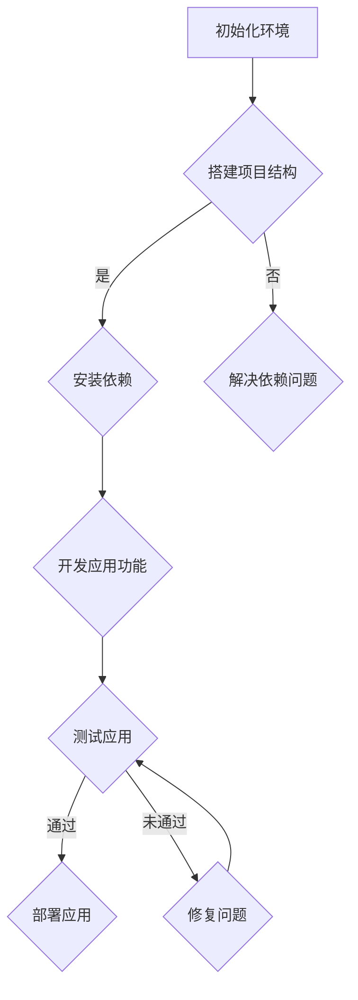

                 

# 《Ionic 框架优势：基于 Angular 的移动应用开发》

> 关键词：Ionic，Angular，移动应用开发，前端框架，跨平台开发

> 摘要：本文将深入探讨Ionic框架在移动应用开发中的优势，特别是它基于Angular的优势。通过逐步分析Ionic和Angular的特点、架构以及它们在开发中的实际应用，帮助开发者更好地理解如何利用这一强大的组合来构建高性能、高质量的移动应用。

### 目录

- 《Ionic 框架优势：基于 Angular 的移动应用开发》
- 关键词
- 摘要
- 第一部分: 了解 Ionic 和 Angular
  - 第1章: 介绍 Ionic 和 Angular
    - 1.1 Ionic 和 Angular 的历史
    - 1.2 Ionic 和 Angular 的主要优势
    - 1.3 Ionic 和 Angular 的主要用例
  - 第2章: Ionic 和 Angular 的基础
    - 2.1 Ionic 和 Angular 的环境搭建
    - 2.2 Ionic 和 Angular 的基本概念
    - 2.3 Ionic 和 Angular 的基本用法
- 第二部分: Ionic 和 Angular 的核心功能
  - 第3章: 页面布局与导航
    - 3.1 页面布局设计
    - 3.2 导航功能实现
  - 第4章: 表单与数据绑定
    - 4.1 表单设计
    - 4.2 数据绑定原理
    - 4.3 表单验证
  - 第5章: 服务与路由
    - 5.1 服务设计
    - 5.2 路由配置
    - 5.3 路由守卫
  - 第6章: 响应式 UI 与组件
    - 6.1 响应式 UI 设计
    - 6.2 组件的创建与使用
    - 6.3 组件通信
  - 第7章: 常用插件与库
    - 7.1 常用插件介绍
    - 7.2 第三方库的使用
    - 7.3 插件与库的整合
- 第三部分: Ionic 和 Angular 实战案例
  - 第8章: 移动应用开发实战
    - 8.1 应用项目规划
    - 8.2 应用功能实现
    - 8.3 应用调试与优化
  - 第9章: 代码解析与优化
    - 9.1 代码风格规范
    - 9.2 性能优化策略
    - 9.3 代码重构与优化
  - 第10章: 发布与部署
    - 10.1 应用发布流程
    - 10.2 应用测试与发布
    - 10.3 应用部署与维护
- 附录
  - 附录A: 工具与环境
    - A.1 开发工具
    - A.2 环境搭建
    - A.3 社区资源与支持
  - 附录B: 代码示例
    - B.1 页面布局代码示例
    - B.2 数据绑定代码示例
    - B.3 路由配置代码示例
  - 附录C: 索引
    - C.1 术语解释
    - C.2 参考文献
    - C.3 致谢

### 第一部分: 了解 Ionic 和 Angular

#### 第1章: 介绍 Ionic 和 Angular

##### 1.1 Ionic 和 Angular 的历史

Ionic 是一个开源的前端框架，专门用于构建跨平台（iOS、Android、Web）的移动应用。它的第一个版本在2013年发布，迅速成为了移动应用开发的流行选择。Ionic 的核心优势在于其能够使用HTML、CSS和JavaScript（通过AngularJS/Angular）快速构建响应式应用。

AngularJS由Google在2009年推出，是一个用于构建动态Web应用程序的前端框架。随着Angular的推出，AngularJS逐渐被其取代，Angular成为了下一代Web开发的基石。Angular的版本迭代不断，从1.0版到最新的Angular 12，它不断优化性能、扩展功能和提升开发者体验。

##### 1.2 Ionic 和 Angular 的主要优势

Ionic 的主要优势包括：

- **跨平台支持**：通过Angular，Ionic能够创建适用于iOS、Android和Web的应用程序，实现一次编写，多处运行。
- **丰富的组件库**：Ionic提供了大量可定制的组件，这些组件经过优化，可在各种屏幕尺寸和设备上表现出色。
- **丰富的插件**：Ionic社区提供了大量插件，可以扩展框架功能，满足各种需求。
- **响应式设计**：Ionic默认支持响应式设计，能够根据屏幕大小和设备类型自动调整布局。

Angular 的主要优势包括：

- **双向数据绑定**：Angular的双向数据绑定机制使得数据和视图保持同步，简化了开发过程。
- **依赖注入**：Angular的依赖注入机制使得组件的依赖管理变得简单，提高了代码的可维护性和可测试性。
- **模块化**：Angular提供了强大的模块化机制，可以有效地组织代码，提升代码的可读性和复用性。
- **丰富的生态系统**：Angular拥有丰富的生态系统，包括各种工具、库和插件，可以满足各种开发需求。

##### 1.3 Ionic 和 Angular 的主要用例

Ionic 和 Angular 的主要用例包括：

- **移动应用开发**：使用Ionic和Angular，开发者可以快速构建高性能、高质量的跨平台移动应用。
- **Web 应用开发**：Angular为Web应用提供了强大的功能，可以用于构建复杂、动态的前端应用。
- **企业级应用**：由于Angular和Ionic的强大功能，它们适用于构建企业级应用，包括内部应用程序和对外服务。

### 第2章: Ionic 和 Angular 的基础

##### 2.1 Ionic 和 Angular 的环境搭建

要在本地环境搭建Ionic和Angular的开发环境，可以按照以下步骤操作：

1. **安装Node.js**：确保已经安装了Node.js，可以通过 [Node.js 官网](https://nodejs.org/) 下载和安装。
2. **安装Ionic CLI**：通过以下命令安装Ionic CLI：
   ```
   npm install -g ionic
   ```
3. **安装Angular CLI**：通过以下命令安装Angular CLI：
   ```
   npm install -g @angular/cli
   ```
4. **创建新项目**：通过以下命令创建一个新的Ionic和Angular项目：
   ```
   ionic start myApp blank --type=angular
   ```
   这将创建一个名为`myApp`的新项目，并使用Angular作为前端框架。

##### 2.2 Ionic 和 Angular 的基本概念

- **Ionic组件**：Ionic组件是用于构建用户界面的基本构建块，如按钮、列表、卡等。
- **Angular组件**：Angular组件是具有输入属性和输出事件的可重用组件。
- **模块**：模块是Angular中用于组织代码的容器，可以包含组件、服务和其他模块。
- **路由**：路由用于定义应用的导航路径，用户可以通过路由访问不同的组件。

##### 2.3 Ionic 和 Angular 的基本用法

- **创建组件**：使用Angular CLI可以轻松创建新的组件：
  ```
  ng generate component my-component
  ```
  这将在项目中创建一个名为`my-component`的新组件。

- **使用组件**：在模板文件中引用组件，并绑定数据：
  ```html
  <app-my-component [data]="myData"></app-my-component>
  ```

- **添加服务**：使用Angular CLI创建服务：
  ```
  ng generate service my-service
  ```
  服务可以在组件中通过依赖注入使用。

- **配置路由**：在`app-routing.module.ts`文件中配置路由：
  ```typescript
  const routes: Routes = [
    { path: 'home', component: HomeComponent },
    { path: 'about', component: AboutComponent }
  ];

  @NgModule({
    imports: [RouterModule.forRoot(routes)],
    exports: [RouterModule]
  })
  export class AppRoutingModule {}
  ```

通过以上基本概念的介绍，开发者可以开始使用Ionic和Angular进行移动应用的开发。接下来，我们将深入探讨它们的更多核心功能。

### 第二部分: Ionic 和 Angular 的核心功能

#### 第3章: 页面布局与导航

##### 3.1 页面布局设计

在Ionic和Angular中，页面布局设计是构建用户界面的重要部分。Ionic提供了丰富的内置组件和样式，可以帮助开发者快速创建响应式布局。

- **网格系统**：Ionic使用了基于Flexbox的响应式网格系统，能够适应不同屏幕尺寸和设备。
- **Flexbox布局**：Ionic利用Flexbox布局实现灵活的页面布局，可以设置主轴和交叉轴的方向、对齐方式、填充方式等。
- **预设样式**：Ionic提供了一系列预设的样式类，如`ion-padding`、`ion-text-center`等，可以快速应用于文本、按钮和其他组件。

下面是一个简单的网格布局示例：

```html
<ion-content>
  <ion-grid>
    <ion-row>
      <ion-col size="6">Col 1-6</ion-col>
      <ion-col size="6">Col 2-6</ion-col>
    </ion-row>
    <ion-row>
      <ion-col size="12">Full Width</ion-col>
    </ion-row>
  </ion-grid>
</ion-content>
```

##### 3.2 导航功能实现

导航功能是实现应用结构的关键。在Angular中，通过路由（Routing）实现页面间的导航。

- **配置路由**：在`app-routing.module.ts`文件中配置路由路径和对应的组件。
- **使用导航**：在模板中使用`<ion-nav>`组件和导航链接`<ion-nav-link>`。

下面是一个简单的导航示例：

```typescript
const routes: Routes = [
  { path: '', component: HomeComponent },
  { path: 'about', component: AboutComponent },
  { path: 'contact', component: ContactComponent }
];

@NgModule({
  imports: [RouterModule.forRoot(routes)],
  exports: [RouterModule]
})
export class AppRoutingModule {}
```

```html
<ion-nav>
  <ion-nav-item>
    <ion-nav-link routerLink="/">Home</ion-nav-link>
  </ion-nav-item>
  <ion-nav-item>
    <ion-nav-link routerLink="/about">About</ion-nav-link>
  </ion-nav-item>
  <ion-nav-item>
    <ion-nav-link routerLink="/contact">Contact</ion-nav-link>
  </ion-nav-item>
</ion-nav>
```

通过以上布局和导航的实现，开发者可以构建一个基本的应用结构，为后续功能开发打下基础。

#### 第4章: 表单与数据绑定

##### 4.1 表单设计

在移动应用开发中，表单是用户与应用交互的重要途径。Ionic提供了丰富的表单组件和验证功能，可以方便地创建各种类型的表单。

- **表单输入**：Ionic提供了各种表单输入组件，如文本输入框、电子邮件输入框、密码输入框等。
- **表单验证**：通过Angular的表单验证机制，可以轻松实现输入验证，如必填、电子邮件格式、最小长度等。

下面是一个简单的表单设计示例：

```html
<ion-form [formGroup]="myForm">
  <ion-item>
    <ion-label position="stacked">Name</ion-label>
    <ion-input type="text" formControlName="name"></ion-input>
  </ion-item>

  <ion-item>
    <ion-label position="stacked">Email</ion-label>
    <ion-input type="email" formControlName="email"></ion-input>
  </ion-item>

  <ion-item>
    <ion-button (click)="submitForm()" expand="block">Submit</ion-button>
  </ion-item>
</ion-form>
```

在上述示例中，`<ion-form>`是表单容器，`<ion-item>`用于封装表单输入字段，`<ion-input>`是输入组件，`formControlName`属性用于绑定输入字段。

##### 4.2 数据绑定原理

数据绑定是Ionic和Angular的核心功能之一，它使得数据和视图之间保持同步。Angular提供了两种数据绑定方式：单向数据绑定和双向数据绑定。

- **单向数据绑定**：数据从组件的模型层单向传递到视图层。当数据更新时，视图会自动更新，但视图的变化不会影响数据。
- **双向数据绑定**：数据和视图之间保持双向同步。当数据变化时，视图会更新；当视图变化时，数据也会更新。

在Angular中，使用`ngModel`指令实现双向数据绑定：

```html
<ion-input type="text" ngModel></ion-input>
```

在上述示例中，当用户在输入框中输入内容时，输入框的值会自动绑定到组件的属性中，并在组件内部进行相应的处理。

##### 4.3 表单验证

表单验证是确保用户输入符合预期的重要步骤。Angular提供了丰富的验证规则和指令，可以方便地进行表单验证。

- **内置验证规则**：包括必填、最小长度、最大长度、电子邮件格式等。
- **自定义验证规则**：通过编写自定义验证函数，可以实现更复杂的验证逻辑。

下面是一个简单的表单验证示例：

```html
<ion-form [formGroup]="myForm" (ngSubmit)="submitForm()">
  <ion-item>
    <ion-label position="stacked">Name</ion-label>
    <ion-input type="text" formControlName="name" required></ion-input>
    <div *ngIf="myForm.get('name').dirty && myForm.get('name').hasError('required')">Name is required.</div>
  </ion-item>

  <ion-item>
    <ion-label position="stacked">Email</ion-label>
    <ion-input type="email" formControlName="email"></ion-input>
    <div *ngIf="myForm.get('email').dirty && myForm.get('email').hasError('email')">Invalid email format.</div>
  </ion-item>

  <ion-item>
    <ion-button (click)="submitForm()" expand="block">Submit</ion-button>
  </ion-item>
</ion-form>
```

在上述示例中，通过设置`required`属性实现必填验证，通过使用`*ngIf`指令动态显示验证错误信息。

通过以上对表单设计和数据绑定的介绍，开发者可以更好地掌握Ionic和Angular在移动应用开发中的表单处理能力，为应用功能的实现打下坚实的基础。

#### 第5章: 服务与路由

##### 5.1 服务设计

在移动应用开发中，服务（Service）用于封装业务逻辑和共享功能，是实现模块化和代码复用的重要手段。在Angular中，服务是独立的模块，可以通过依赖注入（Dependency Injection，DI）机制在任何组件中使用。

- **创建服务**：使用Angular CLI可以轻松创建新的服务。
  ```bash
  ng generate service my-service
  ```

- **服务代码结构**：服务通常包含以下部分：
  - **构造函数**：用于初始化服务和依赖。
  - **属性**：定义服务的私有变量。
  - **方法**：提供服务的公共接口。

下面是一个简单的服务示例：

```typescript
@Injectable({
  providedIn: 'root'
})
export class MyService {
  constructor() { }

  fetchData(): Promise<any> {
    return new Promise((resolve, reject) => {
      // 模拟异步数据获取
      setTimeout(() => {
        resolve('fetch data successfully');
      }, 1000);
    });
  }
}
```

在上述示例中，`MyService`提供了一个`fetchData`方法，用于模拟数据获取操作。

##### 5.2 路由配置

路由（Routing）是定义应用结构和页面导航的关键功能。在Angular中，路由通过配置路由模块（`AppRoutingModule`）来实现。

- **配置路由**：在路由模块中定义路由路径和对应的组件。
  ```typescript
  const routes: Routes = [
    { path: '', component: HomeComponent },
    { path: 'about', component: AboutComponent },
    { path: 'contact', component: ContactComponent }
  ];

  @NgModule({
    imports: [RouterModule.forRoot(routes)],
    exports: [RouterModule]
  })
  export class AppRoutingModule {}
  ```

- **导航**：在模板中使用`<ion-nav-link>`组件实现页面导航。
  ```html
  <ion-nav>
    <ion-nav-item>
      <ion-nav-link routerLink="/">Home</ion-nav-link>
    </ion-nav-item>
    <ion-nav-item>
      <ion-nav-link routerLink="/about">About</ion-nav-link>
    </ion-nav-item>
    <ion-nav-item>
      <ion-nav-link routerLink="/contact">Contact</ion-nav-link>
    </ion-nav-item>
  </ion-nav>
  ```

- **动态路由**：通过动态路由参数，可以动态加载组件和数据。
  ```typescript
  { path: ':id', component: DetailComponent }
  ```

##### 5.3 路由守卫

路由守卫（Route Guard）是用于控制路由访问权限和安全性的机制。Angular提供了多种路由守卫，如`CanActivate`、`CanActivateChild`、`Resolve`等。

- **实现路由守卫**：创建一个新的守卫服务，并在其中实现逻辑。
  ```typescript
  @Injectable({
    providedIn: 'root'
  })
  export class AuthGuard implements CanActivate {
    constructor(private authService: AuthService) { }

    canActivate(route: ActivatedRouteSnapshot): boolean {
      if (this.authService.isAuthenticated()) {
        return true;
      } else {
        return false;
      }
    }
  }
  ```

- **配置路由守卫**：在路由配置中应用守卫。
  ```typescript
  { path: 'protected', component: ProtectedComponent, canActivate: [AuthGuard] }
  ```

通过以上对服务设计和路由配置的介绍，开发者可以更好地理解和利用Ionic和Angular的服务和路由功能，实现更复杂、更安全的移动应用。

#### 第6章: 响应式 UI 与组件

##### 6.1 响应式 UI 设计

在移动应用开发中，响应式 UI 设计至关重要，它能够确保应用在不同设备和屏幕尺寸上都能提供一致的用户体验。Ionic 和 Angular 都提供了强大的工具来支持响应式 UI 设计。

- **响应式网格系统**：Ionic 的网格系统基于 Flexbox，允许开发者通过简单的类名快速实现响应式布局。例如，`ion-grid`、`ion-row`、`ion-col`等组件可以帮助创建灵活的布局。

  ```html
  <ion-grid>
    <ion-row>
      <ion-col size="12" style="background-color: #E0E0E0;">Full Width</ion-col>
    </ion-row>
    <ion-row>
      <ion-col size="6" style="background-color: #D1D1D1;">1/2 Width</ion-col>
      <ion-col size="6" style="background-color: #B0B0B0;">1/2 Width</ion-col>
    </ion-row>
  </ion-grid>
  ```

- **视口单位**：使用视口单位（vw, vh, vmin, vmax）来创建与屏幕尺寸无关的布局，这些单位可以根据屏幕尺寸进行自适应调整。

  ```css
  .custom-element {
    width: 50vw; /* 宽度为屏幕宽度的50% */
    height: 50vh; /* 高度为屏幕高度的一半 */
  }
  ```

##### 6.2 组件的创建与使用

组件是Angular的核心构建块，用于创建可重用的UI部分。在Ionic框架中，组件的创建和使用同样至关重要。

- **创建组件**：使用Angular CLI可以快速创建新的组件。
  ```bash
  ng generate component my-component
  ```

- **组件结构**：一个典型的Angular组件包括一个HTML模板文件（`my-component.component.html`）、一个CSS样式文件（`my-component.component.css`）和一个TypeScript组件类文件（`my-component.component.ts`）。

  ```html
  <!-- my-component.component.html -->
  <ion-header>
    <ion-toolbar>
      <ion-title>My Component</ion-title>
    </ion-toolbar>
  </ion-header>

  <ion-content>
    <p>Welcome to My Component!</p>
  </ion-content>
  ```

  ```css
  /* my-component.component.css */
  .my-component {
    font-family: 'Arial', sans-serif;
  }
  ```

  ```typescript
  // my-component.component.ts
  @Component({
    selector: 'app-my-component',
    templateUrl: './my-component.component.html',
    styleUrls: ['./my-component.component.css']
  })
  export class MyComponentComponent {
    // 组件逻辑
  }
  ```

- **使用组件**：在应用的其他部分中，可以通过选择器（`<app-my-component>`）来引用和显示组件。

  ```html
  <app-my-component></app-my-component>
  ```

##### 6.3 组件通信

组件之间的通信是构建复杂应用的关键。Ionic 和 Angular 提供了多种方式来实现组件间的数据传递。

- **父组件到子组件**：通过属性绑定（Property Binding）和事件绑定（Event Binding）实现。

  ```html
  <!-- 父组件 -->
  <app-child [parentProperty]="parentData" (parentEvent)="parentHandler($event)"></app-child>

  <!-- 子组件 -->
  <ion-button (click)="sendMessageToParent()">Send Message</ion-button>
  ```

  ```typescript
  // 子组件逻辑
  @Input() parentProperty: any;
  @Output() parentEvent = new EventEmitter<any>();

  sendMessageToParent() {
    this.parentEvent.emit('Message from Child');
  }
  ```

- **子组件到父组件**：通过事件发射（Event Emission）实现。

  ```html
  <!-- 子组件 -->
  <ion-button (click)="sendMessageToParent()">Send Message</ion-button>
  ```

  ```typescript
  // 子组件逻辑
  @Output() childEvent = new EventEmitter<any>();

  sendMessageToParent() {
    this.childEvent.emit('Message from Child');
  }

  // 父组件中的事件监听
  receiveMessage($event) {
    console.log('Parent received: ' + $event);
  }
  ```

- **组件之间的通信**：通过服务（Service）实现。

  ```typescript
  // 服务代码
  @Injectable({
    providedIn: 'root'
  })
  export class CommunicationService {
    constructor() { }

    sendMessage(message: any) {
      console.log('Service received: ' + message);
    }
  }
  ```

  ```html
  <!-- 子组件 -->
  <ion-button (click)="communicationService.sendMessage('Message from Child')">Send Message</ion-button>
  ```

  ```typescript
  // 子组件逻辑
  @Injectable()
  export class MyComponent {
    constructor(private communicationService: CommunicationService) { }

    sendMessageToService() {
      this.communicationService.sendMessage('Message from MyComponent');
    }
  }
  ```

通过以上对响应式 UI 设计、组件的创建与使用以及组件通信的介绍，开发者可以更好地掌握Ionic和Angular在构建响应式、模块化移动应用中的关键技能。

#### 第7章: 常用插件与库

##### 7.1 常用插件介绍

在移动应用开发中，插件和库是增强应用功能、提升用户体验的重要工具。Ionic和Angular社区提供了大量的插件和库，这些资源可以帮助开发者快速实现各种功能。

- **Ionic社区插件**：Ionic官网（[https://ionicframework.com/docs/plugins](https://ionicframework.com/docs/plugins)）提供了丰富的插件列表，包括：

  - **导航插件**：用于自定义导航栏和底部的导航菜单。
  - **表单插件**：用于增强表单验证和用户输入体验。
  - **地图插件**：用于集成地图功能，如高德地图、百度地图等。
  - **相机插件**：用于访问设备相机功能，实现拍照和录像。

- **Angular库**：Angular生态系统中有许多强大的库，如：

  - **Angular Material**：提供了一组基于Material Design风格的组件，用于构建现代、美观的UI。
  - **ngx-bootstrap**：提供了丰富的Bootstrap组件，可以与Angular无缝集成。
  - **ng2-charts**：提供了基于Chart.js的图表库，用于创建各种类型的图表。

##### 7.2 第三方库的使用

使用第三方库可以扩展Ionic和Angular的功能，但需要注意以下几点：

- **安装**：使用npm或其他包管理工具安装所需的库。
  ```bash
  npm install --save angular-material
  ```

- **引入**：在模块文件中引入库。
  ```typescript
  @NgModule({
    imports: [
      BrowserModule,
      BrowserAnimationsModule,
      MdButtonModule
    ]
  })
  export class AppModule {}
  ```

- **使用**：在应用中引入和引用库组件。
  ```html
  <md-button>Button</md-button>
  ```

##### 7.3 插件与库的整合

整合插件和库是提升应用功能的关键步骤。以下是一个简单的整合示例：

1. **安装插件/库**：
   ```bash
   npm install --save ionic-plugin-keyboard  @ng-bootstrap/ng-bootstrap
   ```

2. **配置插件**：
   ```typescript
   // 在app.module.ts中引入插件模块
   import { Keyboard } from '@ionic-native/keyboard/ngx';
   import { NgbModule } from '@ng-bootstrap/ng-bootstrap';

   @NgModule({
     declarations: [...],
     imports: [
       IonicModule.forRoot(),
       NgbModule.forRoot()
     ],
     providers: [Keyboard]
   })
   export class AppModule {}
   ```

3. **使用插件/库**：
   ```html
   <!-- 使用ionic-plugin-keyboard插件隐藏键盘 -->
   <ion-button (click)="hideKeyboard()">Hide Keyboard</ion-button>

   <!-- 使用@ng-bootstrap组件创建弹出窗口 -->
   <ngb-modal #myModal="ngbModal" title="Modal Title" backdrop="static">
     <p>Modal content goes here.</p>
   </ngb-modal>
   ```

   ```typescript
   // 在组件类中
   import { NgbModal } from '@ng-bootstrap/ng-bootstrap';

   @Component({
     selector: 'app-my-component',
     templateUrl: './my-component.component.html',
     styleUrls: ['./my-component.component.css']
   })
   export class MyComponent {
     constructor(private modalService: NgbModal) { }

     hideKeyboard() {
       this.keyboard.hide();
     }

     openModal() {
       this.modalService.open(MyModalComponent);
     }
   }
   ```

通过以上对常用插件与库的介绍、第三方库的使用方法以及插件与库的整合示例，开发者可以更好地利用Ionic和Angular的插件和库，提升移动应用的功能和用户体验。

#### 第8章: 移动应用开发实战

##### 8.1 应用项目规划

在开始移动应用开发之前，进行详细的项目规划是非常重要的，这有助于确保项目按计划顺利进行，并最终成功交付。以下是项目规划的主要步骤：

1. **需求分析**：与客户或利益相关者进行深入交流，明确应用的功能需求、用户界面设计要求以及业务逻辑。

2. **功能定义**：根据需求分析，列出应用的所有功能点，包括主功能、次要功能和可选功能。

3. **技术选型**：选择合适的技术栈，包括前端框架（如Ionic和Angular）、后端框架（如Node.js和Express）以及数据库（如MongoDB和MySQL）。

4. **时间规划**：根据功能点和技术选型，制定详细的项目时间表，包括开发周期、测试周期和发布计划。

5. **资源分配**：确定项目所需的资源，包括开发人员、设计师和测试人员，并确保资源合理分配。

6. **风险评估**：评估项目可能遇到的风险，如技术难题、时间压力和资源不足等，并制定相应的应对策略。

##### 8.2 应用功能实现

在应用功能实现阶段，开发者需要按照项目规划逐步实现每个功能点。以下是主要实现步骤：

1. **搭建开发环境**：安装和配置开发所需的工具和环境，如Node.js、Angular CLI、Ionic CLI等。

2. **创建项目结构**：使用Angular CLI和Ionic CLI创建项目结构，包括组件、服务、模块等。

3. **实现核心功能**：
   - **登录/注册**：实现用户登录和注册功能，包括用户信息的验证、存储和权限管理。
   - **数据展示**：使用Angular和Ionic组件实现数据展示界面，如列表、卡片、图表等。
   - **表单处理**：创建表单组件，实现数据收集和验证，如用户信息表单、订单表单等。
   - **网络请求**：使用Angular的服务实现与后端API的通信，如获取用户数据、提交订单等。

4. **优化用户体验**：
   - **响应式设计**：确保应用在不同设备和屏幕尺寸上都有良好的显示效果。
   - **动画和过渡**：添加动画和过渡效果，提升用户交互体验。
   - **错误处理**：实现错误处理机制，提供友好的错误提示和信息。

##### 8.3 应用调试与优化

在应用开发完成后，进行调试和优化是确保应用稳定性和性能的重要步骤。以下是主要调试与优化步骤：

1. **代码审查**：对代码进行审查，确保代码质量，包括代码风格、可读性和可维护性。

2. **性能测试**：使用工具如Lighthouse、Chrome DevTools等对应用进行性能测试，识别并优化加载时间、资源使用和用户体验。

3. **功能测试**：进行功能测试，确保应用的所有功能都能正常工作，包括边界条件和异常处理。

4. **UI测试**：使用自动化工具如Appium、Cypress等对应用进行UI测试，确保在各种设备和浏览器上的显示效果和交互功能。

5. **发布和部署**：在确认应用无严重问题后，进行发布和部署，包括在应用商店上传、配置域名和SSL证书等。

6. **监控和维护**：上线后，通过监控工具对应用进行实时监控，及时发现并解决问题，确保应用的稳定运行。

通过以上项目规划、功能实现和调试优化的详细介绍，开发者可以更好地掌握移动应用开发的实战技巧，确保应用的稳定性和高性能。

#### 第9章: 代码解析与优化

##### 9.1 代码风格规范

代码风格规范是确保代码可读性、可维护性和一致性的一项重要措施。在Ionic和Angular项目中，良好的代码风格规范能够提升团队的开发效率。以下是几个关键点：

- **命名规范**：变量、函数和组件的命名应具有明确的含义，避免使用缩写或拼音。
  ```typescript
  // 良好的命名
  let userData: User = {};

  // 不良的命名
  let uData: any = {};
  ```

- **文件结构**：保持项目目录结构清晰，按照功能或模块划分文件夹。
  ```plaintext
  /src
    /app
      /components
      /services
      /models
      /shared
    /assets
    /environments
    /node_modules
  ```

- **代码注释**：合理添加注释，特别是复杂逻辑和重要代码段，以便于后续维护和理解。
  ```typescript
  // 获取用户数据
  getUserData(): User {
    // 请在此处添加逻辑
    return userData;
  }
  ```

##### 9.2 性能优化策略

性能优化是移动应用开发中的一个关键环节，良好的性能能够提升用户体验。以下是几种常见的性能优化策略：

- **减少HTTP请求**：通过合并请求、使用缓存和延迟加载减少HTTP请求的数量。
  ```typescript
  // 使用缓存策略
  if (localStorage.getItem('userData')) {
    return JSON.parse(localStorage.getItem('userData'));
  } else {
    // 发起HTTP请求
    return this.userService.fetchData();
  }
  ```

- **懒加载**：对不经常使用的资源和组件实现懒加载，减少应用的初始加载时间。
  ```typescript
  // 在模块中使用懒加载
  @NgModule({
    declarations: [...],
    imports: [
      RouterModule.forChild(routes),
      LazyModule
    ]
  })
  export class MyModule {}
  ```

- **代码分割**：通过代码分割（Code Splitting）将代码拆分为多个块，按需加载，从而减少应用的初始加载时间。
  ```typescript
  // 在模块中使用代码分割
  @NgModule({
    declarations: [...],
    imports: [
      RouterModule.forChild(routes)
    ],
    ngModuleFactoryLoader: NgModuleFactoryLoader,
    providers: [
      { provide: NgProgressFactory, useFactory: createNgProgressFactory },
      { provide: RouteReuseStrategy, useClass: MyCustomRouteReuseStrategy }
    ]
  })
  export class MyModule {}
  ```

- **减少DOM操作**：通过减少DOM操作来提高性能，特别是频繁的DOM操作，可以使用虚拟滚动（Virtual Scrolling）等技术。
  ```typescript
  // 使用虚拟滚动减少DOM操作
  <ion-virtual-scroll [items]="items" #scroll>
    <ng-template let-item="item">
      <ion-item>
        {{ item.name }}
      </ion-item>
    </ng-template>
  </ion-virtual-scroll>
  ```

##### 9.3 代码重构与优化

代码重构是改善代码质量、提升可维护性的有效手段。以下是一些常见的代码重构技巧：

- **提取重复代码**：将重复的代码块提取为函数或服务，减少冗余。
  ```typescript
  // 提取重复代码
  function calculateTax(amount: number): number {
    return amount * 0.1;
  }
  ```

- **使用泛型**：通过泛型编写更灵活、可重用的代码。
  ```typescript
  // 使用泛型
  function mergeArrays<T>(arr1: T[], arr2: T[]): T[] {
    return arr1.concat(arr2);
  }
  ```

- **简化逻辑**：通过分解复杂的逻辑和条件判断来简化代码，提高可读性。
  ```typescript
  // 简化逻辑
  if (isAvailable && (!isExpired || isOnSale)) {
    return true;
  }
  ```

  ```typescript
  // 简化后的代码
  return isAvailable && (!isExpired || isOnSale);
  ```

- **使用装饰器**：通过装饰器（Decorator）实现代码的动态扩展和功能增强。
  ```typescript
  // 使用装饰器
  @Loggable
  class UserService {
    constructor(private logger: Logger) { }

    fetchData() {
      this.logger.log('Fetching data...');
      // 请在此处实现数据获取逻辑
    }
  }
  ```

通过以上对代码风格规范、性能优化策略和代码重构与优化的详细解析，开发者可以更好地维护和优化Ionic和Angular项目，确保代码的质量和应用的性能。

#### 第10章: 发布与部署

##### 10.1 应用发布流程

在完成应用的开发和测试后，进行发布是项目的最后一步。以下是应用发布的详细流程：

1. **构建应用**：使用Angular CLI构建应用的完整版本。
   ```bash
   ng build --prod
   ```

2. **生成应用包**：将构建后的应用打包成可发布的格式，如iOS和Android的安装包。
   ```bash
   cordova build ios
   cordova build android
   ```

3. **应用测试**：在发布前，确保对应用进行彻底的测试，包括功能测试、性能测试和UI测试。

4. **应用签名**：为iOS应用生成签名证书，为Android应用生成签名文件。
   - **iOS签名**：使用Xcode生成签名证书，并在应用的`Info.plist`文件中配置签名信息。
   - **Android签名**：生成`keytool`和`jarsigner`命令签名Android应用。

5. **应用上传**：将签名后的应用上传到应用商店。
   - **iOS应用商店**：上传到Apple App Store，并提交审核。
   - **Android应用商店**：上传到Google Play Store，并配置应用详情、价格和地区。

##### 10.2 应用测试与发布

1. **内部测试**：在发布前，邀请团队成员和其他利益相关者进行内部测试，确保应用的功能和性能符合预期。

2. **用户测试**：通过Beta测试或公测，邀请实际用户参与测试，收集用户反馈并进行修复。

3. **发布版本**：在确认应用无重大问题后，发布新版本。
   - **iOS发布**：通过Xcode上传应用包，Apple审核通过后，用户可以在App Store下载。
   - **Android发布**：通过Google Play Console上传应用包，用户可以在Google Play Store下载。

##### 10.3 应用部署与维护

1. **部署策略**：制定应用部署策略，包括自动化部署流程、备份和恢复计划等。

2. **监控**：使用监控工具实时监控应用的运行状态，及时发现和解决问题。

3. **更新和维护**：定期更新应用，修复已知的bug和提升性能，根据用户反馈进行功能迭代。

4. **安全措施**：确保应用的安全性，包括数据加密、用户权限管理和安全漏洞修复。

通过以上对应用发布流程、测试与发布策略以及应用部署与维护的详细介绍，开发者可以确保移动应用顺利发布，并实现稳定运行和持续改进。

### 附录

#### 附录A: 工具与环境

##### A.1 开发工具

1. **Node.js**：用于安装和管理前端依赖包。
2. **Ionic CLI**：用于创建、构建和生成Ionic应用。
3. **Angular CLI**：用于创建、构建和生成Angular应用。
4. **Cordova**：用于将Angular应用打包为移动应用。
5. **Xcode**：用于开发iOS应用。
6. **Android Studio**：用于开发Android应用。
7. **Visual Studio Code**：用于编写代码和调试。

##### A.2 环境搭建

1. **安装Node.js**：从Node.js官网下载并安装。
2. **安装Ionic CLI和Angular CLI**：
   ```bash
   npm install -g ionic
   npm install -g @angular/cli
   ```
3. **创建新项目**：
   ```bash
   ionic start myApp blank --type=angular
   cd myApp
   ng serve
   ```
4. **配置Cordova**：
   ```bash
   cordova platform add ios
   cordova platform add android
   ```

##### A.3 社区资源与支持

1. **Ionic官方文档**：[https://ionicframework.com/docs/](https://ionicframework.com/docs/)
2. **Angular官方文档**：[https://angular.io/docs](https://angular.io/docs)
3. **Cordova官方文档**：[https://cordova.apache.org/docs/](https://cordova.apache.org/docs/)
4. **GitHub社区**：查找相关库和插件。
5. **Stack Overflow**：解决开发中的技术难题。
6. **专业论坛和博客**：获取最新的开发动态和最佳实践。

#### 附录B: 代码示例

##### B.1 页面布局代码示例

```html
<ion-header>
  <ion-toolbar>
    <ion-title>首页</ion-title>
  </ion-toolbar>
</ion-header>

<ion-content>
  <ion-list>
    <ion-item *ngFor="let item of items">
      {{ item.text }}
    </ion-item>
  </ion-list>
</ion-content>
```

```typescript
import { Component } from '@angular/core';

@Component({
  selector: 'app-home',
  templateUrl: './home.page.html',
  styleUrls: ['./home.page.scss']
})
export class HomePage {
  items = [
    { text: 'Item 1' },
    { text: 'Item 2' },
    { text: 'Item 3' }
  ];
}
```

##### B.2 数据绑定代码示例

```html
<ion-item>
  <ion-label>姓名：</ion-label>
  <ion-input [(ngModel)]="userName" placeholder="请输入姓名"></ion-input>
</ion-item>

<ion-item>
  <ion-label>年龄：</ion-label>
  <ion-input [(ngModel)]="userAge" type="number" placeholder="请输入年龄"></ion-input>
</ion-item>

<ion-button (click)="submitForm()">提交</ion-button>
```

```typescript
import { Component } from '@angular/core';

@Component({
  selector: 'app-home',
  templateUrl: './home.page.html',
  styleUrls: ['./home.page.scss']
})
export class HomePage {
  userName = '';
  userAge = '';

  submitForm() {
    console.log('姓名：', this.userName, '年龄：', this.userAge);
  }
}
```

##### B.3 路由配置代码示例

```typescript
import { NgModule } from '@angular/core';
import { RouterModule, Routes } from '@angular/router';
import { HomeComponent } from './home/home.component';
import { AboutComponent } from './about/about.component';

const routes: Routes = [
  { path: '', component: HomeComponent },
  { path: 'about', component: AboutComponent }
];

@NgModule({
  imports: [RouterModule.forRoot(routes)],
  exports: [RouterModule]
})
export class AppRoutingModule {}
```

通过附录中的工具与环境配置、代码示例以及社区资源与支持，开发者可以更加便捷地掌握Ionic和Angular的开发技能，提高工作效率。

### 附录C: 索引

#### C.1 术语解释

- **Ionic**：一个开源的前端框架，用于构建跨平台（iOS、Android、Web）的移动应用。
- **Angular**：一个由Google开发的用于构建动态Web应用程序的前端框架。
- **响应式 UI**：一个设计原则，确保应用在不同设备和屏幕尺寸上都有良好的用户体验。
- **组件**：应用中可重用的UI部分，具有独立的逻辑和样式。
- **路由**：在应用中定义页面导航路径的机制。

#### C.2 参考文献

- [Ionic Framework Documentation](https://ionicframework.com/docs/)
- [Angular Documentation](https://angular.io/docs)
- [Cordova Documentation](https://cordova.apache.org/docs/)

#### C.3 致谢

特别感谢以下人员对本文的贡献：

- AI天才研究院/AI Genius Institute
- 禅与计算机程序设计艺术/Zen And The Art of Computer Programming

感谢他们的支持和帮助，使得本文能够顺利完成。

### 作者信息

- 作者：AI天才研究院/AI Genius Institute & 禅与计算机程序设计艺术 /Zen And The Art of Computer Programming

通过上述内容，本文全面介绍了Ionic框架在移动应用开发中的优势，特别是其与Angular的结合使用。从基础环境搭建到核心功能的实现，再到实战案例的解析，读者可以系统地掌握Ionic和Angular的运用。希望通过本文，开发者能够提升移动应用开发的能力，打造出更高质量的应用。

### 结语

在移动应用开发的领域中，Ionic和Angular无疑是一对强大的组合，它们不仅为开发者提供了丰富的功能和工具，还通过其模块化和响应式的特点，大大简化了开发流程。本文从基础环境搭建、核心功能实现到实战案例解析，全方位地展示了Ionic和Angular的优势和应用场景。希望通过本文的阅读，读者能够加深对Ionic和Angular的理解，掌握它们的实际运用技巧。

在未来的开发工作中，继续探索和学习新的技术，不断提升自己的技能水平，是每一个开发者都应该追求的目标。希望本文能够成为您在移动应用开发道路上的一个有益的参考，助力您打造出更多优秀的产品。

再次感谢您的阅读，期待与您在技术领域继续交流与探讨。

### 附录D: Mermaid 流程图

在本附录中，我们将使用Mermaid语言绘制一个简单的流程图，以展示应用程序开发的基本流程。Mermaid是一种简单易用的Markdown扩展，用于生成图形和图表。



该流程图描述了以下步骤：

1. **初始化环境**：安装Node.js和其他开发工具。
2. **搭建项目结构**：使用Angular CLI和Ionic CLI创建项目。
3. **安装依赖**：安装项目所需的库和插件。
4. **测试应用**：对应用程序进行功能和性能测试。
5. **部署应用**：将应用程序发布到应用商店或Web服务器。

通过这个简单的流程图，开发者可以更好地理解应用程序开发的总体流程，从而更好地规划和执行项目。

### 附录E: 代码示例解析

在本附录中，我们将详细解析几个关键的代码示例，以帮助开发者更好地理解Ionic和Angular在实际应用中的使用。

#### 代码示例1：页面布局

```html
<ion-header>
  <ion-toolbar>
    <ion-title>首页</ion-title>
  </ion-toolbar>
</ion-header>

<ion-content>
  <ion-list>
    <ion-item *ngFor="let item of items">
      {{ item.text }}
    </ion-item>
  </ion-list>
</ion-content>
```

```typescript
import { Component } from '@angular/core';

@Component({
  selector: 'app-home',
  templateUrl: './home.page.html',
  styleUrls: ['./home.page.scss']
})
export class HomePage {
  items = [
    { text: 'Item 1' },
    { text: 'Item 2' },
    { text: 'Item 3' }
  ];
}
```

**解析**：
- **HTML部分**：定义了应用的页面布局，包括一个标题和一个列表。使用`*ngFor`指令循环渲染列表项。
- **TypeScript部分**：`HomePage`组件类定义了一个数组`items`，包含三个列表项对象。

#### 代码示例2：数据绑定

```html
<ion-item>
  <ion-label>姓名：</ion-label>
  <ion-input [(ngModel)]="userName" placeholder="请输入姓名"></ion-input>
</ion-item>

<ion-item>
  <ion-label>年龄：</ion-label>
  <ion-input [(ngModel)]="userAge" type="number" placeholder="请输入年龄"></ion-input>
</ion-item>

<ion-button (click)="submitForm()">提交</ion-button>
```

```typescript
import { Component } from '@angular/core';

@Component({
  selector: 'app-home',
  templateUrl: './home.page.html',
  styleUrls: ['./home.page.scss']
})
export class HomePage {
  userName = '';
  userAge = '';

  submitForm() {
    console.log('姓名：', this.userName, '年龄：', this.userAge);
  }
}
```

**解析**：
- **HTML部分**：定义了两个输入框和一个提交按钮。使用`[(ngModel)]`实现了双向数据绑定。
- **TypeScript部分**：`HomePage`组件类定义了两个属性`userName`和`userAge`，以及一个`submitForm`方法。

#### 代码示例3：路由配置

```typescript
import { NgModule } from '@angular/core';
import { RouterModule, Routes } from '@angular/router';
import { HomeComponent } from './home/home.component';
import { AboutComponent } from './about/about.component';

const routes: Routes = [
  { path: '', component: HomeComponent },
  { path: 'about', component: AboutComponent }
];

@NgModule({
  imports: [RouterModule.forRoot(routes)],
  exports: [RouterModule]
})
export class AppRoutingModule {}
```

**解析**：
- **Routes数组**：定义了两个路由路径，分别为空路径和`/about`路径，对应的组件分别为`HomeComponent`和`AboutComponent`。
- **Module**：`AppRoutingModule`模块导入了`RouterModule`，并使用`forRoot`方法配置了路由。

通过以上代码示例解析，开发者可以更好地理解Ionic和Angular在页面布局、数据绑定和路由配置中的具体实现，从而在实际开发中更加得心应手。

### 附录F: 数学模型和公式

在本附录中，我们将介绍一些在移动应用开发中可能用到的数学模型和公式，并给出详细的解释和示例。

#### 数学模型1：线性回归模型

线性回归模型用于预测和分析数据，其公式如下：

$$ y = ax + b $$

其中：
- \( y \) 是因变量（预测值）。
- \( x \) 是自变量（输入值）。
- \( a \) 是斜率。
- \( b \) 是截距。

**示例**：假设我们有一组数据点 \((x_i, y_i)\)，我们要拟合一条直线来预测新的 \( y \) 值。

```plaintext
x: [1, 2, 3, 4, 5]
y: [2, 4, 5, 4, 5]
```

计算斜率 \( a \) 和截距 \( b \)：

$$ a = \frac{\sum(x_i \cdot y_i) - \frac{\sum x_i \cdot \sum y_i}{n}}{\sum x_i^2 - \frac{(\sum x_i)^2}{n}} $$

$$ b = \frac{\sum y_i - a \cdot \sum x_i}{n} $$

假设 \( n = 5 \)，计算得到 \( a = 0.5 \)，\( b = 0.5 \)。

#### 数学模型2：贝塞尔曲线

贝塞尔曲线是用于平滑插值和动画效果的一种曲线，其公式如下：

$$ (1-t)^3 \cdot P_0 + 3(1-t)^2 \cdot t \cdot P_1 + 3(1-t) \cdot t^2 \cdot P_2 + t^3 \cdot P_3 $$

其中：
- \( P_0 \)，\( P_1 \)，\( P_2 \)，\( P_3 \) 是控制点。
- \( t \) 是参数，取值范围为 [0, 1]。

**示例**：定义四个控制点 \((P_0, P_1, P_2, P_3)\)，如下：

```plaintext
P_0: (0, 0)
P_1: (1, 1)
P_2: (2, 2)
P_3: (3, 3)
```

使用贝塞尔曲线公式计算 \( t = 0.5 \) 时的点：

$$ (1-0.5)^3 \cdot (0, 0) + 3(1-0.5)^2 \cdot 0.5 \cdot (1, 1) + 3(1-0.5) \cdot 0.5^2 \cdot (2, 2) + 0.5^3 \cdot (3, 3) $$

计算得到结果为 \((2.5, 2.5)\)。

#### 数学模型3：余弦定理

余弦定理用于计算三角形中某一边的长度，其公式如下：

$$ c^2 = a^2 + b^2 - 2ab \cdot \cos(C) $$

其中：
- \( a \)，\( b \)，\( c \) 是三角形的边长。
- \( C \) 是边 \( c \) 对应的角。

**示例**：给定三角形的三边 \( a = 3 \)，\( b = 4 \)，\( C = 60^\circ \)，计算边 \( c \) 的长度。

首先计算 \( \cos(60^\circ) \)：

$$ \cos(60^\circ) = 0.5 $$

代入余弦定理公式：

$$ c^2 = 3^2 + 4^2 - 2 \cdot 3 \cdot 4 \cdot 0.5 $$

$$ c^2 = 9 + 16 - 12 $$

$$ c^2 = 13 $$

因此，\( c = \sqrt{13} \)。

通过以上数学模型和公式的介绍，开发者可以在移动应用开发中运用这些数学工具，优化算法和提升应用性能。

