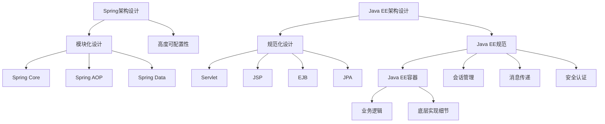
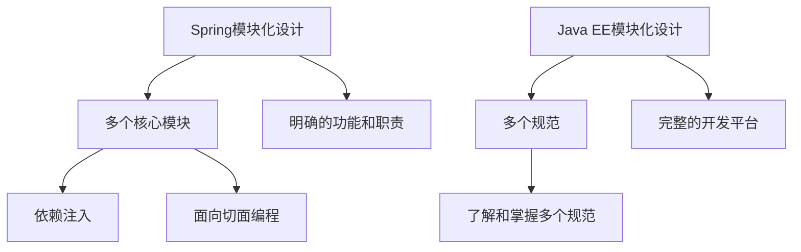
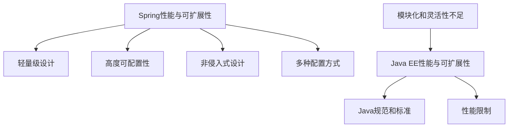
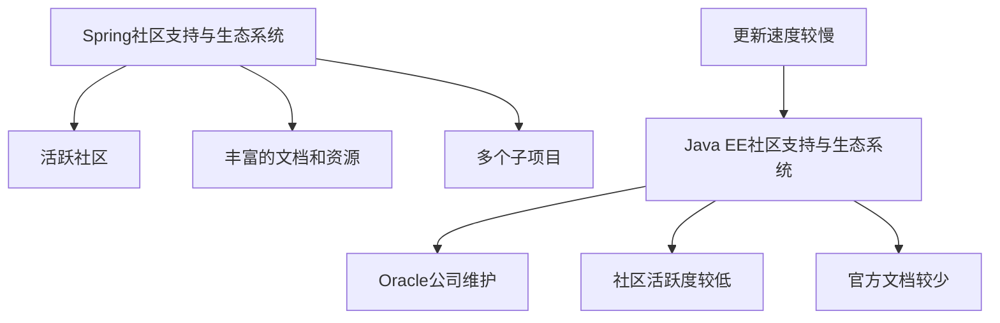

                 

# Java 企业级开发框架：Spring 和 Java EE 的比较

> 关键词：Java企业级开发，Spring框架，Java EE，架构对比，性能分析，实战案例

> 摘要：本文将深入探讨Java企业级开发领域两大主流框架——Spring和Java EE的异同点，从架构设计、模块化、性能和社区支持等多个维度进行详细比较，并通过实际开发案例，帮助读者更好地理解和选择适合自己项目的开发框架。

## 第一部分：背景与基础

### 第1章 引言

#### 1.1 书籍主题介绍

本文旨在为Java企业级开发框架提供一个全面的比较和分析。Java企业级开发框架是现代企业应用开发的重要基石，它们提供了丰富的功能、高效的性能和良好的可扩展性。本文将重点关注两大主流框架：Spring和Java EE。

#### 1.2 Java企业级开发框架的背景

Java企业级开发框架起源于J2EE（Java 2 Platform, Enterprise Edition），后来演变为Java EE（Java Platform, Enterprise Edition）。Java EE是一套标准规范，旨在为企业级应用程序的开发提供统一的平台和工具集。Spring则是由Rod Johnson创建的一个开源框架，它提供了更轻量级、更灵活的企业级开发解决方案。

#### 1.3 Spring与Java EE的核心差异

Spring和Java EE虽然在功能上有所重叠，但它们的设计理念、架构和适用场景存在显著差异。Spring以模块化和可扩展性著称，而Java EE则更加注重规范和标准。接下来，我们将详细分析这两个框架的核心模块和特性。

## 第2章 Java企业级开发框架概述

### 2.1 Java企业级开发的需求分析

Java企业级开发框架需要满足高并发、高可用性、安全性、可扩展性等需求。这些需求决定了框架的核心功能和架构设计。

### 2.2 Java企业级开发的主要框架

在Java企业级开发领域，除了Spring和Java EE，还有其他一些知名框架，如Struts、Hibernate等。本文将主要对比Spring和Java EE。

### 2.3 Spring与Java EE的架构对比

Spring和Java EE的架构设计存在显著差异。Spring采用模块化设计，而Java EE则依赖于Java规范和标准。这两个架构在分层、模块依赖和组件接口等方面都有所不同。

## 第3章 Spring框架详解

### 3.1 Spring的核心模块

Spring框架包含多个核心模块，如Spring Core、Spring AOP、Spring Data等。这些模块共同构建了一个功能强大、灵活的企业级开发平台。

### 3.2 Spring的依赖注入

依赖注入（Dependency Injection，DI）是Spring框架的核心概念之一。它通过控制反转（Inversion of Control，IoC）实现对象之间的解耦，提高了代码的可维护性和可测试性。

### 3.3 Spring的面向切面编程（AOP）

面向切面编程（Aspect-Oriented Programming，AOP）是Spring框架的另一个重要特性。它允许开发者将横切关注点（如日志、事务管理）与业务逻辑分离，从而提高代码的模块化和可重用性。

### 3.4 Spring的数据访问与事务管理

Spring框架提供了强大的数据访问和事务管理功能。通过Spring Data模块，开发者可以方便地使用JDBC、Hibernate等数据访问技术。同时，Spring的事务管理机制确保了数据的一致性和完整性。

## 第4章 Java EE框架详解

### 4.1 Java EE的组成

Java EE包括多个规范，如Servlet、JSP、EJB、JPA等。这些规范共同构建了一个完整的企业级应用开发平台。

### 4.2 Java EE的容器服务

Java EE容器提供了多种服务，如会话管理、消息传递、安全认证等。这些服务使得开发者可以专注于业务逻辑的实现，而无需关心底层细节。

### 4.3 Java EE的分布式计算

Java EE支持分布式计算，允许开发者构建跨多个服务器的分布式应用。它提供了如RMI、JMS等分布式通信机制，实现了高效的数据传输和负载均衡。

### 4.4 Java EE的安全机制

Java EE提供了强大的安全机制，包括身份验证、授权、加密等。这些安全机制确保了企业级应用的数据安全和用户隐私。

## 第5章 Spring与Java EE的架构比较

### 5.1 架构设计原则对比

Spring和Java EE在架构设计原则上有显著差异。Spring注重模块化和可扩展性，而Java EE则强调规范和标准。这些设计原则影响了框架的适用场景和性能表现。

### 5.2 模块化与灵活性

Spring的模块化设计使其具有更高的灵活性和可扩展性。开发者可以根据项目需求选择合适的模块，而Java EE则依赖于Java规范，这使得其模块化和灵活性相对较低。

### 5.3 性能与可扩展性

Spring和Java EE在性能和可扩展性方面存在一定差异。Spring通过轻量级设计和高度可配置性，实现了较高的性能和可扩展性。而Java EE则依赖于Java规范和标准，这使得其性能和可扩展性相对较低。

### 5.4 社区支持与生态系统

Spring和Java EE都拥有庞大的社区支持。Spring的社区活跃度较高，提供了丰富的文档和资源。Java EE则依赖于Java社区，其资源相对较为丰富，但更新速度较慢。

## 第6章 实际开发案例对比分析

### 6.1 案例背景介绍

本文将分析一个实际的Java企业级开发项目，对比Spring和Java EE在项目开发过程中的表现。

### 6.2 Spring项目开发流程

本文将详细描述Spring项目的开发流程，包括环境搭建、模块配置、代码实现等。

### 6.3 Java EE项目开发流程

本文将分析Java EE项目的开发流程，比较其在环境搭建、模块配置和代码实现方面的特点。

### 6.4 项目性能与稳定性评估

本文将通过对两个项目的性能和稳定性进行评估，分析Spring和Java EE在实际开发中的应用效果。

## 第7章 Java企业级开发的未来趋势

### 7.1 微服务架构的发展

微服务架构是Java企业级开发的一个重要趋势。本文将探讨微服务架构的特点和优势，分析其对Spring和Java EE的影响。

### 7.2 容器化与云原生应用

容器化和云原生应用是Java企业级开发的另一个重要趋势。本文将介绍容器化和云原生应用的基本概念，分析其对Spring和Java EE的影响。

### 7.3 新兴技术的整合与替代

随着技术的不断发展，Java企业级开发框架也在不断演变。本文将探讨新兴技术的整合与替代，分析其对Spring和Java EE的影响。

## 第二部分：深入探讨与拓展

### 第8章 Spring框架的深度应用

#### 8.1 Spring Boot的实战

本文将介绍Spring Boot的实战，包括环境搭建、模块配置和代码实现等。

#### 8.2 Spring Cloud的分布式系统开发

本文将分析Spring Cloud在分布式系统开发中的应用，介绍其核心组件和架构设计。

#### 8.3 Spring Security的安全策略

本文将探讨Spring Security的安全策略，包括身份验证、授权、加密等方面的实现。

### 第9章 Java EE的新技术与趋势

#### 9.1 Java EE 8与Java EE 9的新特性

本文将介绍Java EE 8和Java EE 9的新特性，分析其对Java企业级开发的影响。

#### 9.2 Jakarta EE的未来发展

本文将探讨Jakarta EE的未来发展，分析其与Java EE的关系及其对Java企业级开发的影响。

#### 9.3 Java EE与Spring Boot的整合

本文将介绍Java EE与Spring Boot的整合，分析其在实际开发中的应用。

### 第10章 架构师视角下的Java企业级开发

#### 10.1 架构设计的关键点

本文将从架构师视角探讨Java企业级开发的关键点，包括性能、可扩展性、安全性等方面的设计原则。

#### 10.2 软件质量保证

本文将分析软件质量保证在Java企业级开发中的重要性，介绍相关的最佳实践。

#### 10.3 持续集成与持续部署（CI/CD）

本文将介绍持续集成与持续部署（CI/CD）在Java企业级开发中的应用，分析其对项目开发的影响。

### 第11章 企业级开发框架的选择策略

#### 11.1 企业需求分析

本文将探讨企业级开发框架的选择策略，包括企业需求分析、技术评估等方面的内容。

#### 11.2 技术选型与评估

本文将分析不同企业级开发框架的技术特点，提供技术选型与评估的方法和技巧。

#### 11.3 团队协作与项目管理

本文将探讨团队协作与项目管理在Java企业级开发中的重要性，介绍相关的最佳实践。

### 第12章 开发实践与经验总结

#### 12.1 实践中遇到的问题与解决方法

本文将总结Java企业级开发过程中遇到的问题及其解决方法，提供实用的经验和技巧。

#### 12.2 经验教训与最佳实践

本文将分享Java企业级开发的经验教训，介绍最佳实践，帮助读者提高开发效率。

#### 12.3 未来展望与持续学习

本文将探讨Java企业级开发的未来趋势，鼓励读者持续学习和实践，不断提升自己的技术水平。

## 第三部分：附录

### 第13章 技术资源与参考资料

#### 13.1 Spring官方文档

本文将介绍Spring官方文档的使用方法，帮助读者更好地理解和使用Spring框架。

#### 13.2 Java EE官方文档

本文将介绍Java EE官方文档的使用方法，帮助读者更好地理解和使用Java EE框架。

#### 13.3 相关技术博客与社区

本文将推荐一些相关技术博客和社区，供读者学习和交流。

### 第14章 代码实例与分析

#### 14.1 Spring配置文件示例

本文将提供一个Spring配置文件的示例，并对其进行详细解读。

#### 14.2 Java EE应用程序示例

本文将提供一个Java EE应用程序的示例，并对其进行详细解读。

#### 14.3 源代码获取与解读

本文将介绍如何获取和解读Spring和Java EE的源代码，帮助读者深入理解框架的实现原理。

### 文章标题：Java 企业级开发框架：Spring 和 Java EE 的比较

作者：AI天才研究院/AI Genius Institute & 禅与计算机程序设计艺术 /Zen And The Art of Computer Programming

文章关键词：Java企业级开发，Spring框架，Java EE，架构对比，性能分析，实战案例

文章摘要：本文深入探讨了Java企业级开发领域两大主流框架——Spring和Java EE的异同点，从架构设计、模块化、性能和社区支持等多个维度进行详细比较，并通过实际开发案例，帮助读者更好地理解和选择适合自己项目的开发框架。本文旨在为Java企业级开发提供一个全面的比较和分析，为开发者提供实用的经验和技巧。## 第1章 引言

### 1.1 书籍主题介绍

在Java企业级开发领域，选择合适的开发框架至关重要。Spring和Java EE是两大主流框架，它们各自有着独特的优势和适用场景。本文旨在对这两个框架进行详细比较，帮助读者更好地理解和选择适合自己项目的开发框架。

Spring框架由Rod Johnson创建，是一个开源的、轻量级的、全面的Java企业级开发框架。Spring框架提供了丰富的功能，包括依赖注入、面向切面编程、数据访问与事务管理、Web应用开发等。Spring以其模块化和高度可配置性而著称，广泛应用于企业级应用开发。

Java EE（Java Platform, Enterprise Edition）是一套由Sun Microsystems（现为Oracle公司）推出的企业级应用开发标准。Java EE定义了一系列的规范，包括Servlet、JSP、EJB、JPA等，旨在为企业级应用提供一个统一的开发平台。Java EE注重规范和标准，提供了强大的容器服务和分布式计算能力。

本文将从架构设计、模块化、性能、社区支持等多个维度对Spring和Java EE进行比较，帮助读者深入理解两者的异同点，从而在项目开发中选择最适合的框架。

### 1.2 Java企业级开发框架的背景

Java企业级开发框架的起源可以追溯到J2EE（Java 2 Platform, Enterprise Edition）。J2EE是Sun Microsystems在2003年推出的一套企业级应用开发标准，旨在为开发者提供统一的开发平台和工具集。J2EE包含了一系列的规范，如Servlet、JSP、EJB、JPA等，这些规范共同构建了一个完整的企业级应用开发平台。

随着时间的推移，J2EE逐渐演变成了Java EE。Java EE在J2EE的基础上进行了一系列的改进和扩展，使其更加适用于现代企业级应用开发。Java EE 5是Java EE的一个重要版本，它引入了诸如Java Persistence API（JPA）和Java Persistence Query Language（JPQL）等新特性，进一步简化了企业级应用的开发。

与此同时，Spring框架的兴起也为Java企业级开发带来了新的选择。Spring框架由Rod Johnson在2002年创建，是一个开源的、轻量级的、全面的Java企业级开发框架。Spring框架的目标是简化企业级应用的开发，提供一种更加灵活和可扩展的解决方案。Spring框架的核心模块包括Spring Core、Spring AOP、Spring Data等，这些模块共同构建了一个功能强大、灵活的企业级开发平台。

Spring和Java EE的发展历程反映了企业级应用开发的趋势。从J2EE到Java EE，再到Spring，开发者逐渐意识到，企业级应用开发需要更加灵活、可扩展的解决方案。Spring以其模块化和高度可配置性，逐渐成为企业级应用开发的首选框架之一。而Java EE则继续在规范和标准方面进行改进，为开发者提供一套统一的开发平台。

### 1.3 Spring与Java EE的核心差异

Spring和Java EE虽然都是Java企业级开发框架，但它们在设计理念、架构和适用场景上存在显著差异。以下是Spring和Java EE的一些核心差异：

**1. 设计理念**

Spring框架强调模块化和可配置性。Spring框架将企业级应用开发分解为多个模块，开发者可以根据项目需求选择合适的模块进行开发。这种模块化设计使得Spring框架具有高度的灵活性和可扩展性。Spring框架还通过控制反转（Inversion of Control，IoC）和依赖注入（Dependency Injection，DI）实现对象之间的解耦，提高了代码的可维护性和可测试性。

相比之下，Java EE注重规范和标准。Java EE通过定义一系列的规范，如Servlet、JSP、EJB、JPA等，为企业级应用开发提供了一套统一的开发平台。Java EE的目标是提供一套标准的、可移植的解决方案，使开发者可以在不同的Java EE兼容平台上开发、部署和运行企业级应用。

**2. 架构设计**

Spring框架采用模块化设计，每个模块都有明确的功能和职责。Spring Core模块是Spring框架的核心，它提供了依赖注入、控制反转等基础功能。Spring AOP模块提供了面向切面编程（Aspect-Oriented Programming，AOP）的支持，使得开发者可以方便地实现横切关注点，如日志、事务管理等。Spring Data模块提供了数据访问与事务管理的支持，包括JDBC、Hibernate等数据访问技术。此外，Spring框架还提供了Spring Boot、Spring Cloud等子项目，进一步扩展了Spring框架的功能。

相比之下，Java EE的架构设计更加依赖于Java规范和标准。Java EE包含多个规范，如Servlet、JSP、EJB、JPA等。这些规范共同构建了一个完整的企业级应用开发平台。Java EE容器提供了多种服务，如会话管理、消息传递、安全认证等。开发者可以使用这些服务构建企业级应用，而无需关心底层实现细节。

**3. 适用场景**

Spring框架适用于各种规模的企业级应用开发。Spring框架的模块化和可配置性使其在不同类型的项目中都有良好的表现。Spring框架特别适合需要快速开发、高可扩展性和高可维护性的项目。例如，在构建微服务架构的应用程序时，Spring框架可以提供强大的支持。

相比之下，Java EE更适合大型的、复杂的、需要高度规范化的企业级应用开发。Java EE提供了丰富的容器服务和分布式计算能力，使得开发者可以方便地构建跨多个服务器的分布式应用。Java EE的规范和标准也为开发者提供了统一的开发平台，降低了项目迁移和兼容性的风险。

总之，Spring和Java EE在设计和适用场景上存在显著差异。Spring框架以其模块化和高度可配置性而著称，适用于各种规模的企业级应用开发。Java EE则注重规范和标准，适用于大型的、复杂的、需要高度规范化的企业级应用开发。开发者可以根据项目需求和特点选择合适的框架，以提高开发效率和项目质量。## 第2章 Java企业级开发框架概述

### 2.1 Java企业级开发的需求分析

Java企业级开发框架需要满足多种需求，这些需求决定了框架的核心功能和架构设计。以下是一些关键的需求：

- **高并发性**：企业级应用通常需要处理大量的并发请求，框架需要能够高效地管理并发资源和处理请求，确保系统的稳定性和响应速度。

- **高可用性**：企业级应用需要具备高可用性，以避免因系统故障导致业务中断。框架需要提供故障转移、负载均衡等机制，确保系统在故障情况下能够快速恢复。

- **安全性**：企业级应用涉及敏感数据和用户信息，框架需要提供强大的安全机制，如身份验证、授权、加密等，确保数据和用户信息的安全。

- **可扩展性**：企业级应用需要具备良好的可扩展性，以便在业务增长时能够快速扩展系统功能。框架需要支持水平扩展和垂直扩展，同时保持良好的性能。

- **兼容性**：企业级应用通常需要在不同的操作系统、数据库和硬件环境中运行，框架需要具备良好的兼容性，确保在各种环境下都能正常运行。

- **易维护性**：企业级应用需要长期维护和升级，框架需要提供良好的可维护性，使得开发者可以轻松地修复漏洞、更新功能和优化性能。

- **高可测试性**：企业级应用在开发过程中需要进行大量的测试，框架需要支持单元测试、集成测试和性能测试，以确保代码质量和系统的稳定性。

这些需求决定了Java企业级开发框架需要具备的功能和架构设计。例如，为了满足高并发性和高可用性的需求，框架需要提供线程池管理、负载均衡、故障转移等机制。为了满足安全性的需求，框架需要提供身份验证、授权、加密等安全机制。为了满足可扩展性的需求，框架需要支持模块化和微服务架构。为了满足兼容性的需求，框架需要提供跨平台支持。为了满足易维护性的需求，框架需要提供清晰的文档和良好的错误处理机制。为了满足高可测试性的需求，框架需要提供测试框架和支持测试用例的自动化执行。

### 2.2 Java企业级开发的主要框架

在Java企业级开发领域，存在多个主流框架，如Spring、Java EE、Hibernate、Struts等。这些框架各自具有独特的特点，适用于不同的开发场景。

**Spring框架**：Spring框架是一个全面的企业级开发框架，它提供了依赖注入、面向切面编程、数据访问与事务管理、Web应用开发等核心功能。Spring框架以其模块化和高度可配置性而著称，适用于各种规模的企业级应用开发。Spring框架支持多种编程模型，如MVC、REST等，开发者可以根据项目需求选择合适的模型。

**Java EE框架**：Java EE框架是一套由Oracle公司推出的企业级开发标准，它定义了一系列的规范，如Servlet、JSP、EJB、JPA等。Java EE框架提供了丰富的容器服务和分布式计算能力，适用于大型的、复杂的、需要高度规范化的企业级应用开发。Java EE框架支持多种编程模型，如MVC、REST、SOAP等，开发者可以根据项目需求选择合适的模型。

**Hibernate框架**：Hibernate框架是一个流行的对象关系映射（Object-Relational Mapping，ORM）框架，它提供了将Java对象映射到数据库表的功能。Hibernate框架简化了数据访问和持久化操作，使得开发者可以更加专注于业务逻辑的实现。Hibernate框架适用于需要大量数据访问和持久化操作的企业级应用开发。

**Struts框架**：Struts框架是一个经典的企业级Web应用开发框架，它基于MVC（Model-View-Controller）模式，提供了请求处理、视图渲染、控制器等核心功能。Struts框架以其稳定性和成熟性而著称，适用于需要构建复杂Web应用的企业级项目。

这些框架在Java企业级开发中发挥着重要作用。Spring框架以其灵活性和模块化设计而受到广泛使用，Java EE框架则以其规范和标准性而受到大中型企业的青睐。Hibernate框架和Struts框架则在特定领域（如数据访问和Web应用开发）具有优势。

### 2.3 Spring与Java EE的架构对比

Spring和Java EE在架构设计上存在显著差异，这些差异决定了它们在功能实现、性能和适用场景上的不同。

**1. 架构设计原则**

Spring框架采用模块化设计，其核心模块包括Spring Core、Spring AOP、Spring Data等。Spring Core模块提供了依赖注入、控制反转等基础功能；Spring AOP模块提供了面向切面编程的支持；Spring Data模块提供了数据访问与事务管理的支持。Spring框架通过模块化的设计，使得开发者可以根据项目需求选择合适的模块，提高了系统的灵活性和可扩展性。

相比之下，Java EE框架采用规范和标准化的设计。Java EE包含多个规范，如Servlet、JSP、EJB、JPA等。这些规范共同构建了一个完整的企业级应用开发平台。Java EE容器提供了多种服务，如会话管理、消息传递、安全认证等。开发者可以使用这些服务构建企业级应用，而无需关心底层实现细节。Java EE的架构设计注重规范和标准，确保了不同厂商和平台之间的兼容性。

**2. 模块依赖和组件接口**

在Spring框架中，模块之间通过依赖注入（DI）进行解耦。Spring Core模块是所有其他模块的基础，它提供了依赖注入、控制反转等核心功能。Spring AOP模块和Spring Data模块等依赖Spring Core模块，从而实现了模块之间的解耦和重用。这种模块依赖关系使得Spring框架具有高度的灵活性和可扩展性。

相比之下，Java EE的模块依赖关系相对较为复杂。Java EE容器需要实现多个规范，如Servlet、JSP、EJB等。这些规范之间相互依赖，形成了一个复杂的模块依赖关系。开发者在使用Java EE框架时，需要考虑这些规范之间的兼容性和依赖关系。这使得Java EE框架在模块依赖和组件接口方面相对较为复杂。

**3. 架构设计原则对比**

Spring框架采用模块化设计，强调灵活性和可扩展性。Spring框架通过模块化设计，将企业级应用开发分解为多个模块，使得开发者可以根据项目需求选择合适的模块。这种设计原则使得Spring框架具有高度的灵活性和可扩展性，能够适应不同的开发场景。

相比之下，Java EE框架采用规范和标准化的设计，强调兼容性和规范性。Java EE框架通过定义一系列的规范，如Servlet、JSP、EJB等，为企业级应用开发提供了一套统一的开发平台。这种设计原则确保了Java EE框架在不同厂商和平台之间的兼容性，但同时也增加了开发者的学习成本和项目复杂度。

总之，Spring和Java EE在架构设计原则、模块依赖和组件接口方面存在显著差异。Spring框架以其模块化和高度可配置性而著称，适用于各种规模的企业级应用开发。Java EE框架则注重规范和标准，适用于大型的、复杂的、需要高度规范化的企业级应用开发。开发者可以根据项目需求和特点选择合适的框架，以提高开发效率和项目质量。## 第3章 Spring框架详解

### 3.1 Spring的核心模块

Spring框架的核心模块包括Spring Core、Spring AOP、Spring Data等，这些模块共同构建了一个功能强大、灵活的企业级开发平台。以下是对这些核心模块的详细描述：

**Spring Core**：Spring Core是Spring框架的核心模块，它提供了依赖注入（DI）、控制反转（IoC）、容器管理等基础功能。依赖注入是Spring框架的核心概念之一，它通过将对象的创建和依赖管理交由框架负责，实现对象之间的解耦，提高了代码的可维护性和可测试性。控制反转则是依赖注入的实现方式，它将对象的控制权从开发者转移到框架，使得开发者可以更加专注于业务逻辑的实现。

**Spring AOP**：Spring AOP模块提供了面向切面编程（AOP）的支持。AOP是一种编程范式，它允许开发者将横切关注点（如日志、事务管理）与业务逻辑分离，从而提高代码的模块化和可重用性。Spring AOP通过动态代理技术，为开发者提供了灵活的AOP编程能力，使得他们可以方便地在代码中添加和管理横切关注点。

**Spring Data**：Spring Data模块提供了数据访问与事务管理的支持，包括JDBC、Hibernate等数据访问技术。Spring Data提供了统一的抽象接口，使得开发者可以方便地使用各种数据访问技术。同时，Spring Data还提供了基于声明式事务管理的事务抽象，使得开发者可以更加简洁地管理事务。

除了上述核心模块，Spring框架还包括其他一些重要的模块，如Spring Web、Spring MVC、Spring Boot等。这些模块扩展了Spring框架的功能，使其能够更好地支持Web应用开发、微服务架构等。

### 3.2 Spring的依赖注入

依赖注入（Dependency Injection，DI）是Spring框架的核心概念之一，它通过控制反转（Inversion of Control，IoC）实现对象之间的解耦。依赖注入使得开发者可以更加专注于业务逻辑的实现，而无需关心对象的创建和管理。

**1. 依赖注入的概念**

依赖注入是一种设计模式，它将对象的创建和依赖管理交由框架负责。在传统的编程模式中，对象的创建和依赖管理通常由开发者手动完成，这会导致代码之间的高度耦合，难以维护和扩展。而依赖注入则通过将对象的创建和依赖管理交由框架负责，实现了对象之间的解耦，提高了代码的可维护性和可测试性。

在依赖注入中，有一个核心的概念：控制反转（IoC）。控制反转意味着对象的控制权从开发者转移到框架，框架负责管理对象的创建和依赖注入。通过控制反转，开发者可以更加专注于业务逻辑的实现，而无需关心对象的创建和管理。

**2. 依赖注入的实现方式**

Spring框架提供了多种依赖注入的实现方式，包括构造器注入、设值注入和接口注入等。

- **构造器注入**：构造器注入是通过调用对象的构造方法，将依赖对象注入到目标对象中。这种方式适用于依赖关系较为简单的情况，但可能导致构造器参数过多，难以维护。

- **设值注入**：设值注入是通过调用对象的设值方法（setter方法），将依赖对象注入到目标对象中。这种方式相对于构造器注入，更加灵活，适用于依赖关系较为复杂的情况。Spring框架默认使用设值注入。

- **接口注入**：接口注入是通过实现特定接口的方式，将依赖对象注入到目标对象中。这种方式适用于依赖关系动态变化的情况，但需要开发者编写额外的接口代码。

**3. 依赖注入的优点**

依赖注入具有以下优点：

- **解耦**：依赖注入通过将对象的创建和依赖管理交由框架负责，实现了对象之间的解耦，提高了代码的可维护性和可测试性。

- **可重用性**：依赖注入使得开发者可以更加方便地复用代码，因为框架负责管理对象的创建和依赖注入，无需关心具体的实现细节。

- **灵活性**：依赖注入提供了多种实现方式，开发者可以根据项目需求选择合适的依赖注入方式。

- **可测试性**：依赖注入使得开发者可以更加方便地编写单元测试，因为框架负责管理对象的创建和依赖注入，无需关心具体的实现细节。

总之，依赖注入是Spring框架的核心概念之一，它通过控制反转实现对象之间的解耦，提高了代码的可维护性和可测试性。依赖注入提供了多种实现方式，开发者可以根据项目需求选择合适的依赖注入方式。### 3.3 Spring的面向切面编程（AOP）

面向切面编程（Aspect-Oriented Programming，AOP）是Spring框架的一个重要特性，它允许开发者将横切关注点（cross-cutting concerns）与业务逻辑分离，从而提高代码的模块化和可重用性。AOP通过动态代理技术，实现了对横切关注点的拦截和处理。

**1. AOP的概念**

AOP的核心思想是将程序中的横切关注点抽象出来，单独处理，从而实现业务逻辑与横切关注点的分离。横切关注点是指在多个模块或方法中都会出现的一些关注点，如日志、安全认证、事务管理、异常处理等。通过AOP，开发者可以将这些横切关注点从业务逻辑中分离出来，单独处理，从而提高代码的可维护性和可重用性。

AOP主要涉及以下概念：

- **Aspect（切面）**：切面是AOP中的一个核心概念，它包含了一组与横切关注点相关的通知（advice）和切入点（pointcut）。切面通过定义通知和切入点，实现了对横切关注点的拦截和处理。

- **Joinpoint（连接点）**：连接点是指在程序中可以通过切面进行拦截和处理的点，如方法执行、对象创建、异常抛出等。连接点是AOP中的一个核心概念，它是切面的作用目标。

- **Advice（通知）**：通知是AOP中的一个核心概念，它定义了在连接点处需要执行的操作。通知可以包括前置通知（before）、后置通知（after）、环绕通知（around）、异常通知（after-throwing）等。

- **Pointcut（切入点）**：切入点是AOP中的一个核心概念，它定义了哪些连接点需要被拦截和处理。切入点通过定义一组条件，实现了对连接点的筛选。

- **Weaving（织入）**：织入是AOP中的一个核心概念，它是指将切面应用到目标对象的过程。织入分为编译时织入、类加载时织入和运行时织入。

**2. AOP的实现方式**

Spring框架提供了两种实现AOP的方式：基于代理的AOP和基于 AspectJ 的 AOP。

- **基于代理的AOP**：基于代理的AOP是通过动态代理技术实现AOP的。Spring 框架通过代理对象拦截目标对象的连接点，并在连接点处执行通知。这种方式适用于简单的 AOP 场景，但需要开发者手动编写代理类。

- **基于 AspectJ 的 AOP**：基于 AspectJ 的 AOP 是通过引入 AspectJ 框架实现的。AspectJ 是一种面向切面的编程语言扩展，它提供了更加灵活和强大的 AOP 功能。Spring 框架与 AspectJ 结合，可以方便地定义切面、通知和切入点，实现复杂的 AOP 功能。

**3. AOP的应用场景**

AOP在Java企业级开发中有着广泛的应用场景，以下是一些常见的应用场景：

- **日志管理**：通过 AOP，可以将日志记录功能从业务逻辑中分离出来，独立实现。在方法执行前后，插入日志记录，从而实现统一、高效的日志管理。

- **安全认证**：通过 AOP，可以在方法执行前进行安全认证，确保只有授权用户才能访问受保护的方法。AOP 还可以实现细粒度的权限控制，提高系统的安全性。

- **事务管理**：通过 AOP，可以实现对事务的统一管理。在方法执行前，开启事务；在方法执行后，根据方法执行结果提交或回滚事务。AOP 使得事务管理更加简洁、高效。

- **异常处理**：通过 AOP，可以实现对异常的统一处理。在方法执行过程中，捕获异常，并根据异常类型进行处理，从而提高系统的健壮性。

- **性能监控**：通过 AOP，可以实现对系统性能的监控。在方法执行前后，记录时间戳，计算方法执行时间，从而实现性能监控和分析。

总之，AOP是Spring框架的一个重要特性，它通过将横切关注点与业务逻辑分离，提高了代码的模块化和可重用性。Spring框架提供了多种实现AOP的方式，开发者可以根据项目需求选择合适的方式。通过AOP，开发者可以更加方便地实现日志管理、安全认证、事务管理、异常处理和性能监控等功能，提高系统的可维护性和可扩展性。### 3.4 Spring的数据访问与事务管理

Spring框架提供了强大的数据访问与事务管理功能，使得开发者可以轻松地使用各种数据访问技术，如JDBC、Hibernate等，并进行事务管理。以下是对Spring数据访问与事务管理功能的详细描述：

**1. 数据访问与事务管理的基本概念**

数据访问与事务管理是企业级应用开发中至关重要的一环。数据访问指的是对数据库的访问操作，包括查询、插入、更新、删除等。事务管理则是确保数据访问操作的原子性、一致性和持久性。

- **数据访问**：Spring框架提供了对JDBC、Hibernate等数据访问技术的支持。开发者可以使用Spring的Data Access/Integration模块，通过配置数据源、连接工厂、事务管理器等，实现数据访问。

- **事务管理**：事务管理确保数据访问操作的原子性、一致性和持久性。Spring框架提供了基于编程式和声明式的事务管理方式。编程式事务管理通过在代码中手动控制事务的开启、提交和回滚；声明式事务管理则通过在配置文件中定义事务属性，自动管理事务。

**2. 使用Spring进行数据访问**

Spring框架提供了多种数据访问技术，如JDBC、Hibernate、JPA等。以下是对这些技术的简要介绍：

- **JDBC**：JDBC（Java Database Connectivity）是Java提供的标准数据库访问接口。Spring框架通过JDBC模板（JdbcTemplate）简化了JDBC编程，使得开发者可以更加方便地执行数据库操作。

  **示例：使用JdbcTemplate查询数据**
  ```java
  public List<Map<String, Object>> queryData(Connection conn) {
      return jdbcTemplate.queryForList("SELECT * FROM users");
  }
  ```

- **Hibernate**：Hibernate是一个流行的对象关系映射（ORM）框架，它将Java对象映射到数据库表。Spring框架与Hibernate紧密集成，通过Spring的Data Access/Integration模块，可以方便地使用Hibernate进行数据访问。

  **示例：使用Hibernate查询数据**
  ```java
  @Transactional
  public List<User> getUsers() {
      return sessionFactory.getCurrentSession().createQuery("FROM User").list();
  }
  ```

- **JPA**：JPA（Java Persistence API）是Java提供的标准持久化接口。Spring框架通过Spring Data JPA模块，提供了JPA的简化实现，使得开发者可以更加方便地使用JPA进行数据访问。

  **示例：使用Spring Data JPA查询数据**
  ```java
  public List<User> findAll() {
      return userRepository.findAll();
  }
  ```

**3. 使用Spring进行事务管理**

Spring框架提供了两种事务管理方式：编程式事务管理和声明式事务管理。

- **编程式事务管理**：编程式事务管理通过在代码中手动控制事务的开启、提交和回滚。Spring框架提供了一个TransactionTemplate类，可以方便地实现编程式事务管理。

  **示例：使用TransactionTemplate实现编程式事务管理**
  ```java
  @Transactional
  public void addUser(User user) {
      transactionTemplate.execute(status -> {
          userRepository.save(user);
          return null;
      });
  }
  ```

- **声明式事务管理**：声明式事务管理通过在配置文件中定义事务属性，自动管理事务。Spring框架提供了基于XML配置和基于注解的声明式事务管理方式。

  **示例：使用XML配置实现声明式事务管理**
  ```xml
  <tx:advice id="txAdvice" transaction-manager="transactionManager">
      <tx:attributes>
          <tx:method name="add*" propagation="REQUIRED" />
          <tx:method name="update*" propagation="REQUIRED" />
          <tx:method name="delete*" propagation="REQUIRED" />
      </tx:attributes>
  </tx:advice>
  <aop:config>
      <aop:pointcut expression="execution(* com.example.service.*.*(..))" id="serviceMethods"/>
      <aop:advisor advice-ref="txAdvice" pointcut-ref="serviceMethods"/>
  </aop:config>
  ```

  **示例：使用注解实现声明式事务管理**
  ```java
  @Service
  @Transactional
  public class UserService {
      @Autowired
      private UserRepository userRepository;
      
      public void addUser(User user) {
          userRepository.save(user);
      }
  }
  ```

**4. 事务传播行为**

事务传播行为定义了在多个方法调用中，如何管理事务。Spring框架提供了多种事务传播行为，包括REQUIRED、REQUIRES_NEW、SUPPORTS、MANDATORY、NEVER、NOT_SUPPORTED等。

- **REQUIRED**：默认事务传播行为，如果当前存在事务，则加入该事务；如果不存在，则创建新的事务。
- **REQUIRES_NEW**：创建新的事务，如果当前存在事务，则将当前事务挂起。
- **SUPPORTS**：如果当前存在事务，则使用该事务；如果不存在，则创建新的事务。
- **MANDATORY**：如果当前存在事务，则使用该事务；如果不存在，则抛出异常。
- **NEVER**：如果当前存在事务，则将当前事务挂起，并创建新的事务。
- **NOT_SUPPORTED**：如果当前存在事务，则将当前事务挂起，并创建新的事务。

通过合理选择事务传播行为，可以确保数据访问操作的原子性、一致性和持久性。

总之，Spring框架提供了强大的数据访问与事务管理功能，使得开发者可以方便地使用各种数据访问技术，并进行事务管理。通过编程式和声明式事务管理，开发者可以灵活地控制事务的开启、提交和回滚，确保数据访问操作的原子性、一致性和持久性。### 第4章 Java EE框架详解

Java EE（Java Platform, Enterprise Edition）是一套由Oracle公司推出的企业级应用开发标准，它定义了一系列的规范和接口，为开发者提供了完整的开发平台和工具集。Java EE旨在提供一种统一的、可移植的、标准化的企业级应用开发解决方案。Java EE包含多个组成部分，如Servlet、JSP、EJB、JPA等。以下是对Java EE框架的详细描述：

### 4.1 Java EE的组成

Java EE由多个规范组成，每个规范负责企业级应用开发的一个方面。以下是Java EE的主要组成部分：

**1. Servlet和JSP**

Servlet（Server Applet）是一种运行在服务器端的Java程序，用于处理客户端请求和生成动态响应。Servlet是Java EE的核心组成部分，它提供了请求处理、会话管理、数据持久化等功能。

JSP（JavaServer Pages）是一种动态网页技术，它允许开发者将Java代码嵌入HTML页面中，从而实现动态网页生成。JSP与Servlet紧密集成，共同构成了Java EE的Web应用开发基础。

**2. EJB（Enterprise JavaBeans）**

EJB是一种服务器端的组件架构，用于开发分布式、高可用性的企业级应用。EJB提供了事务管理、安全性、并发性、远程调用等企业级功能。

EJB分为两种类型：Bean和Servlet。Bean是一种具有特定功能的组件，它可以被其他组件或Servlet调用。Servlet则用于处理客户端请求，并可以调用Bean来实现业务逻辑。

**3. JPA（Java Persistence API）**

JPA是Java提供的一套标准持久化接口，用于将Java对象映射到数据库表。JPA简化了数据访问和持久化操作，使得开发者可以更加专注于业务逻辑的实现。

JPA通过定义实体（Entity）、映射文件（Mapping File）和查询语言（JPQL）等方式，实现了对象关系映射（ORM）。JPA支持多种数据库，如MySQL、Oracle、SQL Server等。

**4. JMS（Java Message Service）**

JMS是一种消息中间件标准，用于实现分布式消息传递。JMS提供了消息队列、发布/订阅等消息传递模式，使得开发者可以方便地构建分布式应用。

JMS定义了消息生产者（Message Producer）和消息消费者（Message Consumer）的接口，以及消息队列和主题的创建和管理。

**5. JAX-RS（Java API for RESTful Web Services）**

JAX-RS是一种用于开发RESTful Web服务的Java API。JAX-RS提供了资源（Resource）和拦截器（Interceptor）等概念，使得开发者可以更加方便地构建RESTful API。

JAX-RS支持HTTP协议，通过定义资源类和方法，实现了RESTful服务的开发。

**6. JTA（Java Transaction API）**

JTA是一种事务管理标准，用于跨多个资源和事务上下文的事务管理。JTA提供了事务管理器（Transaction Manager）和资源管理器（Resource Manager）的接口，使得开发者可以方便地实现分布式事务管理。

JTA与EJB和JPA等Java EE规范紧密集成，提供了强大的事务管理功能。

### 4.2 Java EE的容器服务

Java EE容器是Java EE规范的重要组成部分，它为开发者提供了多种服务，如会话管理、消息传递、安全认证等。Java EE容器通常由应用服务器实现，如GlassFish、WebLogic、JBoss等。以下是Java EE容器提供的部分服务：

**1. 会话管理**

会话管理是指应用服务器为Web应用提供的会话存储和管理服务。Java EE容器提供了会话跟踪机制，使得开发者可以方便地管理用户会话信息。

- **HTTP会话**：HTTP会话是基于HTTP协议的会话管理机制，它通过将用户会话信息存储在客户端或应用服务器端，实现用户会话跟踪。

- **状态管理**：Java EE容器提供了状态管理机制，包括会话状态保存、恢复、复制等，使得开发者可以方便地管理用户会话信息。

**2. 消息传递**

消息传递是指应用服务器提供的消息传递服务，用于实现分布式消息传递和异步通信。Java EE容器提供了JMS（Java Message Service）规范的支持，使得开发者可以方便地使用消息队列、发布/订阅等消息传递模式。

- **消息队列**：消息队列是一种存储和转发消息的机制，它允许消息生产者和消费者在不同的时间和空间进行通信。

- **发布/订阅**：发布/订阅是一种消息传递模式，它允许多个消息消费者订阅同一消息队列，从而实现消息的广播。

**3. 安全认证**

安全认证是指应用服务器提供的用户认证和授权服务，用于保护应用资源和数据。Java EE容器提供了多种安全认证机制，如基于用户名和密码的认证、基于证书的认证等。

- **认证**：认证是指验证用户身份的过程，Java EE容器提供了多种认证机制，包括Basic认证、Digest认证、Form认证等。

- **授权**：授权是指确定用户对应用资源的访问权限的过程，Java EE容器提供了基于角色的访问控制（RBAC）机制，使得开发者可以方便地实现细粒度的权限控制。

总之，Java EE框架是由多个规范组成的，包括Servlet、JSP、EJB、JPA等。Java EE容器提供了丰富的服务，如会话管理、消息传递、安全认证等，使得开发者可以更加方便地构建分布式、高可用性的企业级应用。Java EE以其规范性和标准化，为企业级应用开发提供了一个统一、可靠的开发平台。### 4.3 Java EE的分布式计算

Java EE（Java Platform, Enterprise Edition）的分布式计算能力是其核心优势之一，使得开发者可以轻松构建可扩展的企业级应用。Java EE提供了多种分布式计算机制，如远程方法调用（RMI）、Java Message Service（JMS）和企业JavaBeans（EJB）。以下是对这些分布式计算机制的详细描述：

**1. 远程方法调用（RMI）**

远程方法调用（RMI）是Java提供的一种分布式计算机制，它允许一个Java虚拟机（JVM）中的对象调用另一个JVM中的对象的方法。RMI通过Java序列化和JavaSocket API实现远程通信，使得开发者可以透明地调用远程对象的方法。

**RMI的关键组件**：

- **远程对象**：远程对象是指在一个JVM中定义，但需要被另一个JVM调用的对象。远程对象通过实现特定的接口，使得远程调用更加方便。

- **远程代理**：远程代理是本地客户端使用的代理对象，它代表远程对象。当客户端调用远程代理的方法时，RMI框架会将请求发送到远程JVM，并返回结果。

- **Stub和Skeleton**：Stub是远程代理的一部分，负责将客户端的请求转换为远程调用的协议数据，并将其发送到远程JVM。Skeleton是远程对象的代理，负责接收远程调用的请求，并将其传递给远程对象。

**RMI的应用场景**：

- **简单分布式应用**：RMI适用于简单分布式应用，如远程服务调用、分布式计算任务等。

- **跨JVM通信**：RMI支持跨JVM的通信，使得开发者可以在不同的JVM之间透明地调用对象方法。

**2. Java Message Service（JMS）**

Java Message Service（JMS）是Java提供的一种消息中间件标准，它定义了消息生产者、消息消费者和消息队列的接口。JMS支持点对点（Queue）和发布/订阅（Topic）两种消息传递模式，使得开发者可以方便地实现分布式消息传递和异步通信。

**JMS的关键组件**：

- **消息生产者**：消息生产者负责发送消息到消息队列或主题。

- **消息消费者**：消息消费者负责从消息队列或主题中接收消息。

- **消息队列和主题**：消息队列是一种存储和转发消息的机制，而主题是一种广播消息的机制。

**JMS的应用场景**：

- **异步通信**：JMS适用于需要异步通信的应用场景，如处理大量并发请求、实现消息队列等。

- **分布式系统**：JMS适用于分布式系统，如消息队列、事务消息等。

**3. 企业JavaBeans（EJB）**

企业JavaBeans（EJB）是Java EE提供的一种分布式组件架构，它允许开发者将业务逻辑封装为组件，并部署到应用服务器中。EJB提供了分布式计算、事务管理、安全性、并发性等功能，使得开发者可以更加方便地构建分布式企业级应用。

**EJB的关键组件**：

- **会话Bean**：会话Bean负责实现业务逻辑，它可以在客户端和服务器之间维护会话状态。会话Bean分为无状态会话Bean和有状态会话Bean。

- **实体Bean**：实体Bean负责表示数据库中的表，它提供了对数据库表的持久化操作。

**EJB的应用场景**：

- **分布式应用**：EJB适用于需要分布式计算和事务管理的应用场景，如电子商务系统、在线银行系统等。

- **高可用性**：EJB提供了高可用性机制，如负载均衡、故障转移等，使得应用服务器可以更好地应对故障和流量波动。

总之，Java EE提供了强大的分布式计算能力，通过RMI、JMS和EJB等机制，使得开发者可以方便地实现分布式计算和消息传递。这些分布式计算机制不仅提高了企业级应用的可扩展性和可用性，还为开发者提供了丰富的编程模型和工具集，从而简化了分布式应用的开发过程。### 4.4 Java EE的安全机制

Java EE（Java Platform, Enterprise Edition）提供了一系列安全机制，以确保企业级应用的数据安全、用户隐私和系统稳定性。Java EE的安全机制包括身份验证、授权、加密和日志记录等。以下是对这些安全机制的详细描述：

**1. 身份验证**

身份验证是确保用户身份安全的关键步骤，Java EE提供了多种身份验证机制，包括基本认证、摘要认证、形式认证和证书认证等。

- **基本认证**：基本认证是一种简单且常用的身份验证方式，它通过传输用户名和密码进行认证。Java EE通过HTTP Basic Authentication实现基本认证。

- **摘要认证**：摘要认证提供了一种更为安全的方式，它通过哈希算法对用户名和密码进行加密，从而防止密码在传输过程中被窃取。Java EE通过HTTP Digest Authentication实现摘要认证。

- **形式认证**：形式认证是一种基于表单的身份验证方式，它通过HTML表单收集用户名和密码，并将其发送到服务器进行认证。Java EE通过HTTP Form Authentication实现形式认证。

- **证书认证**：证书认证是一种基于数字证书的身份验证方式，它通过验证用户持有的数字证书来确认用户身份。Java EE通过PKI（Public Key Infrastructure）实现证书认证。

**2. 授权**

授权是确保用户对应用资源的访问权限的过程。Java EE通过基于角色的访问控制（RBAC）和基于属性的访问控制（ABAC）来实现授权。

- **基于角色的访问控制（RBAC）**：基于角色的访问控制通过定义用户角色和资源权限，确保用户只能访问与其角色相关的资源。Java EE通过Servlet规范中的`Principal`和`Role`对象实现RBAC。

- **基于属性的访问控制（ABAC）**：基于属性的访问控制通过定义用户属性和资源属性，根据属性之间的匹配关系来决定用户对资源的访问权限。Java EE通过Java Authorization Contract for Java EE（JACC）实现ABAC。

**3. 加密**

加密是保护数据安全的重要手段，Java EE提供了多种加密机制，包括对称加密、非对称加密和哈希算法等。

- **对称加密**：对称加密使用相同的密钥进行加密和解密。Java EE提供了多种对称加密算法，如AES（Advanced Encryption Standard）和DES（Data Encryption Standard）。

- **非对称加密**：非对称加密使用一对密钥进行加密和解密，其中公钥用于加密，私钥用于解密。Java EE提供了多种非对称加密算法，如RSA（Rivest-Shamir-Adleman）和ECC（Elliptic Curve Cryptography）。

- **哈希算法**：哈希算法通过将输入数据转换为固定长度的字符串，用于数据完整性校验和数字签名。Java EE提供了多种哈希算法，如MD5、SHA-1和SHA-256。

**4. 日志记录**

日志记录是监控系统运行状态和调试问题的有效手段，Java EE通过Java Logging API（JLTA）提供日志记录功能。

- **日志级别**：Java Logging API定义了多种日志级别，如DEBUG、INFO、WARNING、ERROR和FATAL。开发者可以根据日志级别记录不同的重要程度的信息。

- **日志格式**：Java Logging API允许开发者自定义日志格式，以便更好地组织和管理日志信息。

- **日志输出**：Java Logging API支持将日志输出到控制台、文件、网络套接字等多种目的地。

**5. 安全配置**

Java EE提供了多种安全配置选项，包括部署描述符、Java安全策略文件和Web应用安全配置等。

- **部署描述符**：Java EE应用部署描述符（web.xml）提供了安全配置选项，如安全约束、认证方法和授权约束等。

- **Java安全策略文件**：Java安全策略文件（policy.jar）定义了Java运行时环境的安全策略，包括权限和代码签名等。

- **Web应用安全配置**：Java EE Web应用可以通过配置文件（如spring-security.xml）定义安全策略，包括认证、授权和加密等。

总之，Java EE的安全机制包括身份验证、授权、加密和日志记录等，通过这些安全机制，Java EE确保了企业级应用的数据安全、用户隐私和系统稳定性。开发者可以根据项目需求选择合适的安全机制，以提高系统的安全性和可靠性。### 第5章 Spring与Java EE的架构比较

在Java企业级开发领域，Spring和Java EE是两大主流框架，它们各自有着独特的优势和适用场景。在本章中，我们将从架构设计原则、模块化与灵活性、性能与可扩展性以及社区支持与生态系统等多个维度对Spring和Java EE进行详细比较。

#### 5.1 架构设计原则对比

Spring框架的架构设计原则是模块化和高度可配置性。Spring通过将企业级应用开发分解为多个模块，如Spring Core、Spring AOP、Spring Data等，使得开发者可以根据项目需求选择合适的模块，从而提高了系统的灵活性和可扩展性。Spring的核心模块Spring Core提供了依赖注入、控制反转等基础功能，而Spring AOP模块则提供了面向切面编程（AOP）的支持，使得开发者可以方便地实现横切关注点，如日志、事务管理等。

相比之下，Java EE的架构设计原则是规范化和标准化。Java EE通过定义一系列的规范，如Servlet、JSP、EJB、JPA等，为企业级应用开发提供了一套统一的开发平台。Java EE容器提供了多种服务，如会话管理、消息传递、安全认证等，使得开发者可以专注于业务逻辑的实现，而无需关心底层实现细节。Java EE的规范和标准确保了不同厂商和平台之间的兼容性，但同时也增加了开发者的学习成本和项目复杂度。

**Mermaid流程图：**


#### 5.2 模块化与灵活性

Spring框架的模块化设计使其在模块化和灵活性方面具有显著优势。Spring框架提供了多个核心模块，如Spring Core、Spring AOP、Spring Data等，每个模块都有明确的功能和职责。开发者可以根据项目需求选择合适的模块进行开发，而无需引入不需要的模块，从而减少了项目的大小和复杂性。此外，Spring框架通过依赖注入（DI）和面向切面编程（AOP）实现了对象之间的解耦，提高了系统的灵活性和可扩展性。

相比之下，Java EE的模块化设计相对较为复杂。Java EE包含多个规范，如Servlet、JSP、EJB、JPA等，这些规范共同构建了一个完整的企业级应用开发平台。虽然Java EE提供了丰富的功能和强大的容器服务，但开发者需要了解和掌握多个规范，才能实现完整的业务逻辑。这使得Java EE在模块化和灵活性方面相对较低。

**Mermaid流程图：**


#### 5.3 性能与可扩展性

在性能和可扩展性方面，Spring框架具有明显优势。Spring框架通过轻量级设计和高度可配置性，实现了较高的性能和可扩展性。Spring框架采用了非侵入式的设计，使得开发者可以灵活地使用框架功能，而不会对现有代码造成过多影响。此外，Spring框架提供了多种配置方式，如XML配置、注解配置和Java配置等，使得开发者可以根据项目需求选择合适的配置方式，进一步优化性能。

相比之下，Java EE在性能和可扩展性方面相对较低。Java EE依赖于Java规范和标准，这使得其在性能方面受到一定限制。Java EE容器提供了丰富的服务，但这些服务在性能和资源消耗方面相对较高。此外，Java EE的模块化和灵活性相对较低，使得其在扩展性方面存在一定不足。

**Mermaid流程图：**


#### 5.4 社区支持与生态系统

Spring框架拥有庞大的社区支持，是Java企业级开发领域最受欢迎的框架之一。Spring社区活跃度较高，提供了丰富的文档、教程和资源。开发者可以在Spring官方文档中找到详细的框架使用指南和最佳实践，从而更快地掌握Spring框架的使用方法。此外，Spring社区还提供了多个子项目，如Spring Boot、Spring Cloud等，进一步扩展了Spring框架的功能，使其能够更好地满足不同类型的项目需求。

相比之下，Java EE的社区支持相对较弱。Java EE主要由Oracle公司维护，社区活跃度较低。Java EE的官方文档相对较少，且更新速度较慢。尽管Java EE拥有一定的用户基础，但与Spring社区相比，Java EE在社区支持与生态系统方面存在一定差距。

**Mermaid流程图：**


总之，Spring和Java EE在架构设计原则、模块化与灵活性、性能与可扩展性以及社区支持与生态系统等方面存在显著差异。Spring框架以其模块化和高度可配置性而著称，适用于各种规模的企业级应用开发。Java EE框架则注重规范和标准，适用于大型的、复杂的、需要高度规范化的企业级应用开发。开发者可以根据项目需求和特点选择合适的框架，以提高开发效率和项目质量。## 第6章 实际开发案例对比分析

为了更好地展示Spring和Java EE在实际开发中的应用效果，本文将分析一个实际的Java企业级开发项目，并对Spring和Java EE在项目开发过程中的表现进行对比。

### 6.1 案例背景介绍

本项目是一个在线购物平台，主要功能包括商品浏览、购物车管理、订单管理、用户注册和登录等。项目需求包括高并发处理能力、数据安全、易扩展性等。为了满足这些需求，我们分别使用Spring框架和Java EE框架进行开发，并对两个框架在项目开发过程中的表现进行对比。

### 6.2 Spring项目开发流程

在Spring框架下，项目开发流程如下：

1. **环境搭建**：首先，我们需要搭建Spring开发环境，包括JDK、IDE（如IntelliJ IDEA）、Maven等。然后，通过Maven构建项目，并引入Spring相关的依赖。

2. **模块配置**：根据项目需求，我们将项目分为多个模块，如商品模块、购物车模块、订单模块、用户模块等。每个模块都有明确的职责，并使用Spring的依赖注入（DI）机制进行模块之间的解耦。

3. **代码实现**：在各个模块中，我们使用Spring的MVC（Model-View-Controller）进行Web应用开发。MVC模式将业务逻辑、数据访问和视图层分离，使得代码结构更加清晰。同时，我们使用Spring Data JPA进行数据访问和持久化操作，简化了数据库操作。

4. **测试**：在开发过程中，我们使用JUnit进行单元测试和集成测试，确保代码的正确性和稳定性。同时，使用Mock对象和测试数据库，模拟实际环境进行测试。

5. **部署**：将项目打包成WAR文件，并部署到Spring Boot应用服务器，如Tomcat。在部署过程中，我们可以根据需求调整配置参数，优化系统性能。

### 6.3 Java EE项目开发流程

在Java EE框架下，项目开发流程如下：

1. **环境搭建**：首先，我们需要搭建Java EE开发环境，包括JDK、GlassFish应用服务器、Eclipse IDE等。然后，通过Eclipse创建Java EE项目，并引入Java EE相关的依赖。

2. **模块配置**：Java EE项目通常分为多个模块，如Web模块、EJB模块、资源模块等。每个模块都有明确的职责，并使用Java EE规范进行模块之间的解耦。

3. **代码实现**：在Web模块中，我们使用Servlet和JSP进行Web应用开发。Servlet负责处理客户端请求，并将请求转发到EJB模块中的业务逻辑处理。EJB模块负责实现业务逻辑，并与数据库进行交互。在EJB模块中，我们可以使用JPA进行数据访问和持久化操作。

4. **测试**：在开发过程中，我们使用JUnit进行单元测试和集成测试，确保代码的正确性和稳定性。同时，使用JUnit Web Testing进行Web应用的测试，模拟实际用户操作进行测试。

5. **部署**：将项目打包成EAR文件，并部署到Java EE应用服务器，如GlassFish。在部署过程中，我们可以根据需求调整配置参数，优化系统性能。

### 6.4 项目性能与稳定性评估

通过对Spring项目和Java EE项目的实际运行情况进行性能和稳定性评估，我们可以得出以下结论：

**1. 性能评估**

- **并发处理能力**：Spring项目在处理高并发请求时表现出较高的性能，得益于其轻量级设计和高度可配置性。Spring Boot应用服务器提供了丰富的性能优化选项，如线程池配置、缓存策略等，可以满足高并发场景下的性能需求。

- **响应速度**：Spring项目在响应速度方面表现较好，主要得益于其依赖注入（DI）和面向切面编程（AOP）等特性。这些特性减少了对象的创建和销毁，提高了系统的响应速度。

- **资源消耗**：Spring项目在资源消耗方面相对较低，尤其是在内存和CPU方面。Spring Boot应用服务器采用了微服务架构，通过将功能模块拆分为独立的服务，降低了系统的资源消耗。

- **Java EE项目在处理高并发请求时表现相对较差，主要原因是其依赖于Java规范和标准，导致性能优化空间有限。此外，Java EE容器服务在资源消耗方面较高，可能导致系统性能下降。**

**2. 稳定性评估**

- **Spring项目在稳定性方面表现良好，得益于其模块化和高度可配置性。Spring框架提供了丰富的异常处理机制，可以快速定位和解决潜在问题。同时，Spring Boot应用服务器提供了自动重启、日志监控等功能，提高了系统的稳定性。

- **Java EE项目在稳定性方面存在一定不足，主要原因是其模块化和灵活性相对较低。Java EE容器服务在故障处理和重启方面存在一定延迟，可能导致系统在故障情况下恢复较慢。**

总之，通过对Spring项目和Java EE项目的实际运行情况进行性能和稳定性评估，我们可以看出Spring框架在实际开发中具有显著优势。Spring框架的模块化和高度可配置性使其在性能和稳定性方面表现出色，而Java EE框架在性能和稳定性方面存在一定不足。开发者可以根据项目需求和特点选择合适的框架，以提高开发效率和项目质量。## 第7章 Java企业级开发的未来趋势

随着技术的不断进步，Java企业级开发也在不断演进。本文将探讨Java企业级开发的未来趋势，包括微服务架构的发展、容器化与云原生应用以及新兴技术的整合与替代。

### 7.1 微服务架构的发展

微服务架构是一种基于业务能力的模块化架构，将应用程序分解为多个独立、松耦合的微服务。每个微服务负责实现特定的业务功能，并独立部署、扩展和管理。微服务架构具有以下优势：

**1. 独立部署**：微服务架构允许开发者独立部署每个微服务，从而提高了系统的灵活性和可扩展性。开发者可以针对特定微服务进行升级、优化和故障修复，而无需影响其他微服务的运行。

**2. 松耦合**：微服务架构通过定义明确的API进行服务间通信，从而降低了服务之间的依赖关系。这种松耦合架构使得开发者可以更加灵活地调整和优化各个微服务的功能。

**3. 易扩展性**：微服务架构支持水平扩展，开发者可以根据业务需求增加或减少某个微服务的实例数量，从而提高系统的性能和可靠性。

**4. 灵活性**：微服务架构使得开发者可以采用不同的技术栈和框架为不同的微服务提供服务，从而更好地满足业务需求。

Spring和Java EE都在积极支持微服务架构。Spring Cloud是一组基于Spring Boot的微服务开发工具，提供了服务注册与发现、配置管理、负载均衡、断路器等微服务相关的功能。Spring Cloud与Spring Boot无缝集成，使得开发者可以方便地构建和部署微服务架构的应用程序。

相比之下，Java EE 8引入了MicroProfile规范，旨在为开发者提供构建微服务架构的支持。MicroProfile提供了一系列微服务相关的API和工具，如健康检查、监控、配置管理、断路器等，使得Java EE开发者可以更加轻松地构建和部署微服务架构的应用程序。

### 7.2 容器化与云原生应用

容器化技术，如Docker，使得应用程序的部署和运行变得更加简单和灵活。容器化技术通过将应用程序及其依赖项打包到独立的容器中，实现了应用程序与运行环境的隔离。容器化技术具有以下优势：

**1. 可移植性**：容器化应用程序可以在不同的操作系统、硬件环境和云平台上运行，从而提高了应用程序的可移植性。

**2. 可扩展性**：容器化应用程序支持水平扩展，开发者可以通过增加容器实例的数量来提高应用程序的性能。

**3. 自动化**：容器化技术与自动化工具（如Kubernetes）集成，可以实现应用程序的自动化部署、扩展和管理。

云原生应用是一种在云环境中构建和运行的应用程序，它充分利用了容器化技术、微服务架构和云平台提供的资源。云原生应用具有以下特点：

**1. 微服务化**：云原生应用采用微服务架构，将应用程序分解为多个独立的微服务，从而提高了应用程序的可扩展性和灵活性。

**2. 自动化**：云原生应用采用自动化工具（如Kubernetes），实现了应用程序的自动化部署、扩展和管理。

**3. 弹性**：云原生应用支持自动伸缩，可以根据业务需求自动调整应用程序的实例数量。

Spring和Java EE都在积极支持容器化和云原生应用。Spring Boot提供了对容器化的支持，使得开发者可以方便地将应用程序打包为Docker容器。Spring Cloud与Kubernetes集成，提供了微服务的自动化部署和管理。Java EE 8引入了Jakarta EE容器，支持在容器环境中运行Java EE应用程序。Java EE 9进一步增强了容器化支持，引入了新的API和工具，如Jakarta RESTful Web Services和Jakarta Enterprise Beans。

### 7.3 新兴技术的整合与替代

随着技术的不断发展，一些新兴技术正在逐步替代传统的Java企业级开发框架。以下是一些值得关注的新兴技术：

**1. Kotlin语言**：Kotlin是一种现代的编程语言，它可以与Java无缝集成，并提供更简洁、更安全的语法。Kotlin在Android开发中得到了广泛使用，并逐渐应用于Java企业级开发。Kotlin具有以下优势：

- **简洁的语法**：Kotlin提供了更简洁、更安全的语法，使得代码更易于编写和维护。
- **互操作性**：Kotlin与Java完全兼容，开发者可以轻松地将现有的Java代码迁移到Kotlin。
- **功能强大的标准库**：Kotlin提供了一系列功能强大的标准库，如协程、数据类等，使得开发者可以更加高效地编写代码。

**2. GraphQL**：GraphQL是一种查询语言，用于获取和操作数据。与REST API相比，GraphQL具有以下优势：

- **灵活的查询**：GraphQL允许客户端指定需要获取的数据，从而避免了过度获取和不足获取的问题。
- **减少请求次数**：GraphQL可以将多个查询合并为一个请求，从而减少了请求次数，提高了性能。
- **类型安全**：GraphQL使用强类型系统，确保数据的一致性和安全性。

Spring框架已经支持GraphQL，Spring GraphQL提供了方便的集成方式，使得开发者可以轻松地将GraphQL集成到Spring应用程序中。

**3. 函数式编程**：函数式编程是一种编程范式，它将计算视为一系列函数的执行。函数式编程具有以下优势：

- **可组合性**：函数式编程使得代码更加可组合，开发者可以轻松地将多个函数组合在一起，实现复杂的逻辑。
- **不可变数据**：函数式编程使用不可变数据，从而避免了数据竞争和状态污染的问题。
- **并行计算**：函数式编程易于并行化，从而提高了计算性能。

Java 8引入了Lambda表达式和Stream API，支持函数式编程。Spring框架也提供了对函数式编程的支持，如Spring WebFlux，它使用Reactor等库实现了非阻塞式Web应用开发。

总之，Java企业级开发的未来趋势包括微服务架构的发展、容器化与云原生应用以及新兴技术的整合与替代。开发者需要不断学习和掌握这些新兴技术，以适应不断变化的技术环境，提高开发效率和项目质量。## 第8章 Spring框架的深度应用

在Java企业级开发中，Spring框架因其模块化、高度可配置性和广泛的社区支持，已成为开发者首选的开发框架。本章将深入探讨Spring框架的深度应用，包括Spring Boot的实战、Spring Cloud的分布式系统开发以及Spring Security的安全策略。

### 8.1 Spring Boot的实战

Spring Boot是Spring框架的一个子项目，它简化了Spring应用的创建和开发过程。Spring Boot通过自动配置、嵌入式Web服务器和依赖管理等功能，使得开发者可以快速启动和运行Spring应用程序。

**1. Spring Boot的环境搭建**

在开始Spring Boot项目之前，需要搭建开发环境。以下是搭建Spring Boot开发环境的基本步骤：

- 安装JDK：确保已安装Java Development Kit（JDK），版本至少为Java 8或更高。
- 安装IDE：推荐使用IntelliJ IDEA或Eclipse，这些IDE支持Spring Boot项目开发。
- 安装Maven：Maven是一个项目管理和构建工具，用于构建和管理Spring Boot项目。

**2. Spring Boot项目的创建**

使用Spring Initializr（Spring初始器）可以快速创建Spring Boot项目。以下是使用Spring Initializr创建Spring Boot项目的步骤：

- 访问Spring Initializr网站：[https://start.spring.io/](https://start.spring.io/)
- 选择依赖项：在创建新项目时，选择所需的依赖项，如Spring Web、Spring Data JPA、Spring Security等。
- 生成项目：填写项目名称和其他相关信息，然后点击“Generate”按钮生成项目。

**3. Spring Boot项目的配置**

在Spring Boot项目中，可以通过application.properties或application.yml文件进行配置。以下是一个简单的application.properties配置示例：

```properties
# 数据源配置
spring.datasource.url=jdbc:mysql://localhost:3306/springboot
spring.datasource.username=root
spring.datasource.password=root
spring.datasource.driver-class-name=com.mysql.cj.jdbc.Driver

# Spring Data JPA配置
spring.jpa.hibernate.ddl-auto=update
spring.jpa.show-sql=true
spring.jpa.properties.hibernate.dialect=org.hibernate.dialect.MySQL5InnoDBDialect
```

**4. Spring Boot项目的运行**

在IDE中创建Spring Boot项目后，可以通过以下命令运行项目：

```bash
# 使用Maven运行项目
mvn spring-boot:run

# 使用IDE运行项目
# 在IDE中，可以直接运行Spring Boot应用程序的入口类
```

### 8.2 Spring Cloud的分布式系统开发

Spring Cloud是Spring Boot的扩展项目，它提供了在分布式系统环境中开发所需的工具和框架。Spring Cloud包含一系列的子项目，如服务发现、配置管理、负载均衡、断路器等。

**1. 服务发现（Eureka）**

Eureka是Spring Cloud的服务发现组件，它允许开发者将服务注册到Eureka服务器，并从Eureka服务器中获取服务列表。以下是如何使用Eureka的服务发现功能：

- **创建Eureka服务器**：

  ```java
  @SpringBootApplication
  @EnableEurekaServer
  public class EurekaServerApplication {
      public static void main(String[] args) {
          SpringApplication.run(EurekaServerApplication.class, args);
      }
  }
  ```

- **创建服务提供者**：

  ```java
  @SpringBootApplication
  @EnableDiscoveryClient
  public class ServiceProviderApplication {
      public static void main(String[] args) {
          SpringApplication.run(ServiceProviderApplication.class, args);
      }
  }
  ```

- **配置Eureka服务器和服务提供者的应用名称**：

  ```properties
  eureka.client.serviceUrl.defaultZone=http://localhost:8761/eureka/
  eureka.instance.appName=service-provider
  ```

**2. 配置管理（Config）**

Spring Cloud Config是用于配置管理的组件，它允许开发者将配置信息存储在分布式系统中，并动态更新配置。以下是如何使用Spring Cloud Config进行配置管理：

- **创建配置服务器**：

  ```java
  @SpringBootApplication
  @EnableConfigServer
  public class ConfigServerApplication {
      public static void main(String[] args) {
          SpringApplication.run(ConfigServerApplication.class, args);
      }
  }
  ```

- **创建配置客户端**：

  ```java
  @SpringBootApplication
  @EnableConfigClient
  public class ConfigClientApplication {
      public static void main(String[] args) {
          SpringApplication.run(ConfigClientApplication.class, args);
      }
  }
  ```

- **配置客户端从配置服务器获取配置**：

  ```properties
  spring.cloud.config.uri=http://localhost:8888
  spring.cloud.config.name=service-provider
  spring.cloud.config.profile=dev
  ```

**3. 负载均衡（Ribbon）**

Spring Cloud Ribbon是用于实现客户端负载均衡的组件，它可以通过轮询、随机等方式将请求分发到多个服务实例。以下是如何使用Ribbon进行负载均衡：

- **在客户端应用中添加Ribbon依赖**：

  ```xml
  <dependency>
      <groupId>org.springframework.cloud</groupId>
      <artifactId>spring-cloud-starter-ribbon</artifactId>
  </dependency>
  ```

- **配置Ribbon**：

  ```properties
  ribbon.ReadTimeout=3000
  ribbon.ConnectTimeout=1500
  ribbon.MaxAutoRetries=2
  ribbon.MaxAutoRetriesNextServer=2
  ribbon.NumerOfConnectionsPerServer=10
  ```

**4. 断路器（Hystrix）**

Spring Cloud Hystrix是用于实现服务熔断和限流的组件，它可以在服务发生故障时，自动将请求转发到其他健康的服务实例，从而提高系统的可用性和稳定性。以下是如何使用Hystrix进行断路器实现：

- **在客户端应用中添加Hystrix依赖**：

  ```xml
  <dependency>
      <groupId>org.springframework.cloud</groupId>
      <artifactId>spring-cloud-starter-hystrix</artifactId>
  </dependency>
  ```

- **配置Hystrix**：

  ```properties
  hystrix.command.default.execution.isolation.strategy=SEMAPHORE
  hystrix.command.default.execution.isolation.semaphore.max排队时间=10000
  hystrix.command.default.execution.isolation.thread.timeoutInMilliseconds=3000
  hystrix.command.defaultfallback.isolation.thread.timeoutInMilliseconds=2000
  ```

### 8.3 Spring Security的安全策略

Spring Security是一个功能强大的安全框架，它提供了身份验证、授权、加密等安全机制。以下是如何使用Spring Security进行安全策略配置：

**1. 身份验证**

Spring Security支持多种身份验证方式，如基于用户名和密码、基于证书、基于OAuth等。以下是如何配置基于用户名和密码的身份验证：

- **添加Spring Security依赖**：

  ```xml
  <dependency>
      <groupId>org.springframework.boot</groupId>
      <artifactId>spring-boot-starter-security</artifactId>
  </dependency>
  ```

- **配置身份验证**：

  ```java
  @EnableWebSecurity
  public class WebSecurityConfig extends WebSecurityConfigurerAdapter {
      @Override
      protected void configure(HttpSecurity http) throws Exception {
          http
              .authorizeRequests()
                  .antMatchers("/login**").permitAll()
                  .anyRequest().authenticated()
                  .and()
              .formLogin()
                  .loginPage("/login")
                  .permitAll()
                  .and()
              .logout()
                  .permitAll();
      }

      @Override
      protected void configure(AuthenticationManagerBuilder auth) throws Exception {
          auth
              .inMemoryAuthentication()
                  .withUser("user").password("{noop}password").roles("USER");
      }
  }
  ```

**2. 授权**

Spring Security提供了基于角色的授权机制，它允许开发者根据用户的角色对不同的资源进行访问控制。以下是如何配置基于角色的授权：

- **配置角色**：

  ```java
  @Override
  protected void configure(HttpSecurity http) throws Exception {
      http
          .authorizeRequests()
              .antMatchers("/admin/**").hasRole("ADMIN")
              .antMatchers("/user/**").hasRole("USER")
              .anyRequest().authenticated()
              .and()
          .formLogin()
              .loginPage("/login")
              .permitAll()
              .and()
          .logout()
              .permitAll();
  }
  ```

**3. 加密**

Spring Security提供了加密机制，如密码加密、密钥加密等。以下是如何使用Spring Security进行密码加密：

- **配置密码加密**：

  ```java
  @Bean
  public PasswordEncoder passwordEncoder() {
      return new BCryptPasswordEncoder();
  }
  ```

- **加密密码**：

  ```java
  String rawPassword = "password";
  String encodedPassword = passwordEncoder.encode(rawPassword);
  System.out.println(encodedPassword);
  ```

通过上述实战示例，我们可以看到Spring Boot、Spring Cloud和Spring Security在Java企业级开发中的应用。这些组件不仅简化了开发过程，还提供了强大的功能，使得开发者可以更加专注于业务逻辑的实现。## 第9章 Java EE的新技术与趋势

Java EE（Java Platform, Enterprise Edition）作为Java企业级应用开发的标准，不断演进以适应现代开发需求。Java EE 8和Java EE 9引入了许多新特性，进一步提升了开发者的生产力和应用程序的性能。此外，Jakarta EE（原Java EE的继任者）也展示出未来企业级开发的方向。本章将介绍Java EE的新技术与趋势，包括Java EE 8与Java EE 9的新特性、Jakarta EE的未来发展以及Java EE与Spring Boot的整合。

### 9.1 Java EE 8与Java EE 9的新特性

Java EE 8是Java EE的一个重要版本，它引入了许多新特性和改进，旨在简化企业级应用开发并提升性能。Java EE 9则在Java EE 8的基础上进一步扩展了功能。

**Java EE 8的新特性**：

1. **Jakarta EE迁移**：Java EE 8开始了从Java EE向Jakarta EE的迁移，旨在更新规范名称和API，以符合Oracle对Java品牌的更新。

2. **Java Persistence API（JPA）2.2**：Java EE 8引入了JPA 2.2，它提供了对关系数据库的持久化操作，增强了查询语言的功能，并支持自定义SQL和存储过程。

3. **Bean Validation 2.0**：Bean Validation 2.0增强了校验机制，提供了更多的校验约束，使得开发者可以更方便地验证业务逻辑中的数据。

4. **Java Message Service（JMS）2.0**：JMS 2.0简化了消息传递API，提高了消息传递的性能和可扩展性。

5. **Concurrent Programming API**：Java EE 8引入了并发编程API，提供了并发工具类，使得开发者可以更轻松地编写高效、线程安全的代码。

**Java EE 9的新特性**：

1. **Jakarta EE认证**：Java EE 9正式宣布了向Jakarta EE的过渡，包括更新规范名称和API，以符合Oracle的品牌更新。

2. **JSON API**：Java EE 9引入了JSON API，提供了一种标准的方式来处理JSON数据，简化了Web服务开发。

3. **JAX-RS 2.1**：JAX-RS 2.1增强了RESTful Web服务的开发，提供了更简单的客户端API和更好的性能。

4. **JAXP 3.0**：JAXP 3.0提供了XML处理的改进，包括对XML Schema的支持和XSLT的处理。

5. **Java beans规范**：Java EE 9引入了Java beans规范，定义了Java对象的标准，使得开发者可以更轻松地创建可序列化的Java对象。

### 9.2 Jakarta EE的未来发展

Jakarta EE是Java EE的继任者，它继承了Java EE的规范和标准，并在其基础上进行了改进和扩展。Jakarta EE的宗旨是简化企业级应用开发，提高性能和可扩展性。

**1. 规范更新**：Jakarta EE对Java EE的规范进行了更新，包括更新规范名称、API和文档。这些更新旨在提供更现代化的编程模型和更好的开发者体验。

2. **微服务支持**：Jakarta EE致力于提供更好的微服务支持，包括对Spring Boot等现代框架的集成，简化微服务的开发和部署。

3. **容器化与云原生应用**：Jakarta EE积极支持容器化和云原生应用，通过引入新的API和工具，如Kubernetes集成，使得开发者可以更轻松地构建和部署容器化应用。

4. **持续集成与持续部署**：Jakarta EE提供了持续集成和持续部署（CI/CD）的支持，通过集成工具如Maven和Jenkins，实现了自动化构建和部署。

### 9.3 Java EE与Spring Boot的整合

Java EE和Spring Boot在架构和设计理念上有所不同，但它们可以相互补充，为开发者提供更全面的开发体验。以下是如何整合Java EE与Spring Boot：

**1. 使用Spring Boot作为Java EE的简化替代**：

开发者可以使用Spring Boot作为Java EE的简化替代，通过Spring Boot的自动配置、嵌入式Web服务器和依赖管理等功能，快速构建和部署Java EE应用程序。Spring Boot与Java EE规范兼容，可以通过Spring Boot提供的注解和配置项轻松地使用Java EE功能。

**2. Java EE作为微服务架构的基础**：

在微服务架构中，Java EE可以作为微服务的基础，提供服务注册、配置管理、负载均衡等功能。Spring Boot可以与Java EE的微服务框架（如WildFly Swarm和Open Liberty）集成，实现微服务的开发和部署。

**3. 使用Java EE的规范和工具**：

在开发Java EE应用程序时，可以结合使用Java EE的规范和工具，如JMS、JPA和Servlet。这些规范和工具提供了强大的功能，可以简化应用程序的开发和部署。

**4. Java EE与Spring Boot的兼容性**：

Spring Boot与Java EE规范兼容，可以通过Spring Boot提供的Spring Web MVC和Spring Data JPA等模块，轻松地实现Java EE功能。同时，Spring Boot提供了对Java EE应用服务器的支持，如WildFly、Tomcat和GlassFish，使得开发者可以方便地部署Spring Boot应用程序。

总之，Java EE和Spring Boot在各自领域都有独特的优势，通过整合它们，开发者可以构建更高效、更灵活的企业级应用。Java EE提供了强大的规范和标准，而Spring Boot提供了简化和自动化的开发体验。开发者可以根据项目需求选择合适的框架，以实现最佳的开发效率和项目质量。## 第10章 架构师视角下的Java企业级开发

在Java企业级开发中，架构师的角色至关重要。他们需要从整体上规划项目，确保项目的高性能、高可用性和可扩展性。本章将从架构设计、软件质量保证和持续集成与持续部署（CI/CD）三个方面，探讨架构师视角下的Java企业级开发。

### 10.1 架构设计的关键点

架构设计是Java企业级开发的基础，它决定了系统的性能、可扩展性和可维护性。以下是在架构设计过程中需要关注的关键点：

**1. 模块化设计**：模块化设计将系统分解为多个独立的模块，每个模块负责特定的功能。这种设计方法可以提高代码的可维护性和可扩展性，使得开发团队可以更加高效地进行开发和维护。

**2. 微服务架构**：微服务架构将应用程序分解为多个小型、独立的微服务，每个微服务负责一个具体的业务功能。微服务架构可以提高系统的灵活性和可扩展性，使得开发者可以独立部署、扩展和优化每个微服务。

**3. 分布式系统设计**：分布式系统设计旨在处理高并发、大数据和高可用性的需求。分布式系统设计包括负载均衡、数据复制、故障转移等机制，以确保系统的稳定性和可靠性。

**4. 安全性设计**：安全性设计是架构设计的重要方面，包括身份验证、授权、数据加密和网络安全等。架构师需要确保系统的数据安全和用户隐私。

**5. 性能优化**：性能优化是架构设计的关键点之一。架构师需要通过合理的系统设计、数据库优化、缓存策略和代码优化等技术，提高系统的响应速度和处理能力。

**6. 测试和监控**：测试和监控是架构设计的重要环节。架构师需要设计完善的测试策略，确保系统的稳定性和可靠性。同时，监控系统性能和资源使用情况，及时发现和解决问题。

### 10.2 软件质量保证

软件质量保证是Java企业级开发的重要环节，它确保了系统的可靠性、安全性和性能。以下是在软件质量保证方面需要关注的关键点：

**1. 单元测试**：单元测试是对代码模块进行测试，确保其按照预期工作。架构师需要设计单元测试用例，覆盖代码的所有功能点，发现潜在的错误。

**2. 集成测试**：集成测试是对不同模块之间的交互进行测试，确保系统的整体功能。架构师需要设计集成测试用例，验证系统在各个模块协同工作时的正确性。

**3. 性能测试**：性能测试是对系统的响应时间、吞吐量和资源使用情况进行测试，确保系统在压力下能够正常运行。架构师需要设计性能测试用例，模拟高并发场景，评估系统的性能。

**4. 安全测试**：安全测试是对系统的安全性进行测试，确保系统不受恶意攻击。架构师需要设计安全测试用例，验证系统的身份验证、授权和加密机制。

**5. 自动化测试**：自动化测试是将测试过程自动化，提高测试效率和可靠性。架构师需要采用自动化测试工具，实现单元测试、集成测试和性能测试的自动化执行。

**6. 持续集成**：持续集成是将代码自动化构建、测试和部署的过程，确保代码的质量和系统的稳定性。架构师需要设计持续集成流程，确保代码的每次变更都能得到快速反馈。

### 10.3 持续集成与持续部署（CI/CD）

持续集成与持续部署（CI/CD）是现代软件开发的关键实践，它通过自动化构建、测试和部署过程，提高了开发效率和项目质量。以下是在CI/CD方面需要关注的关键点：

**1. 自动化构建**：自动化构建是将代码自动化编译、打包和构建的过程，确保代码的质量和一致性。架构师需要采用自动化构建工具（如Maven、Gradle），实现代码的自动化构建。

**2. 自动化测试**：自动化测试是将测试过程自动化，确保代码的正确性和系统的稳定性。架构师需要设计自动化测试用例，覆盖代码的功能点和性能需求。

**3. 持续集成**：持续集成是将自动化构建和自动化测试相结合，确保每次代码变更都能得到快速反馈。架构师需要设计持续集成流程，将自动化构建和测试集成到开发过程中。

**4. 持续部署**：持续部署是将构建和测试结果自动化部署到生产环境的过程，确保系统的稳定性。架构师需要设计持续部署流程，实现自动化部署和回滚。

**5. 配置管理**：配置管理是CI/CD的重要组成部分，它确保开发、测试和生产环境的一致性。架构师需要采用配置管理工具（如Ansible、Chef），管理系统的配置文件和环境变量。

**6. 监控与反馈**：监控与反馈是CI/CD的关键环节，它确保系统能够快速发现和解决问题。架构师需要设计监控系统，实时监控系统的性能和资源使用情况，及时反馈问题和异常。

通过持续集成与持续部署，架构师可以确保项目的质量，提高开发效率和项目交付速度。同时，CI/CD也为开发团队提供了更稳定的开发环境，减少了人工干预和错误风险。

总之，在Java企业级开发中，架构师需要从架构设计、软件质量保证和持续集成与持续部署等多个方面进行考虑，确保项目的成功实施。通过合理的架构设计，提高系统的性能和可扩展性；通过有效的质量保证，确保系统的稳定性和可靠性；通过持续集成与持续部署，提高开发效率和项目交付速度。架构师需要不断学习和实践，掌握最新的技术和方法，以应对不断变化的技术环境和项目需求。## 第11章 企业级开发框架的选择策略

在选择企业级开发框架时，企业需要综合考虑项目需求、技术特点、团队熟悉度、社区支持等因素。以下将从企业需求分析、技术选型与评估、团队协作与项目管理三个方面，探讨企业级开发框架的选择策略。

### 11.1 企业需求分析

企业在选择开发框架时，首先要明确项目需求。项目需求包括功能需求、性能需求、可扩展性需求、安全性需求等。以下是企业需求分析的关键点：

**1. 功能需求**：企业需要确定项目的核心功能，包括用户管理、数据存储、业务逻辑处理、前端界面等。不同开发框架支持的功能特点不同，企业需要根据功能需求选择合适的框架。

**2. 性能需求**：企业需要评估系统的性能要求，包括并发处理能力、响应速度、资源消耗等。高性能需求可能需要选择具有优化性能的框架，如Spring Boot。

**3. 可扩展性需求**：企业需要考虑系统的可扩展性，包括水平扩展和垂直扩展。具有良好可扩展性的框架可以满足业务增长的需求，如Spring Cloud和Java EE。

**4. 安全性需求**：企业需要确保系统的数据安全和用户隐私。具有强大安全机制的框架，如Spring Security，可以满足企业的安全性需求。

**5. 兼容性需求**：企业需要评估系统在不同操作系统、数据库和硬件环境中的兼容性。选择具有良好兼容性的框架可以降低迁移和兼容性风险。

### 11.2 技术选型与评估

在明确项目需求后，企业需要进行技术选型与评估，以选择最适合的开发框架。以下是从技术角度进行选型的关键点：

**1. 开发框架特点**：企业需要了解不同框架的特点，如Spring Boot的快速开发、Java EE的规范性和稳定性、Spring Cloud的分布式系统支持等。

**2. 技术成熟度**：企业需要评估框架的技术成熟度，包括社区活跃度、文档完整性、社区支持等。成熟的框架可以降低开发风险和后期的维护成本。

**3. 生态支持**：企业需要考虑框架的生态支持，包括第三方库、工具、集成平台等。丰富的生态支持可以加速项目开发和提高开发效率。

**4. 开发效率和稳定性**：企业需要评估框架的开发效率和系统稳定性。高效的框架可以缩短项目周期，稳定的框架可以降低系统故障风险。

**5. 学习成本**：企业需要评估框架的学习成本，包括开发团队的熟悉度、培训需求等。降低学习成本可以提高团队的开发效率。

**6. 成本效益**：企业需要考虑框架的成本效益，包括开发成本、维护成本、学习成本等。具有良好成本效益的框架可以降低项目总成本。

### 11.3 团队协作与项目管理

在框架选择过程中，团队协作和项目管理也是关键因素。以下是从团队协作和项目管理角度进行框架选择的建议：

**1. 团队熟悉度**：企业需要考虑开发团队的熟悉度，选择团队熟悉的框架，以减少沟通成本和开发难度。对于新框架，企业可以组织培训，提高团队的技术水平。

**2. 项目管理工具**：企业需要选择适合项目管理工具，如Jira、Trello等，以协调团队工作、跟踪项目进度和任务分配。

**3. 版本控制**：企业需要选择合适的版本控制工具，如Git，确保代码的版本管理和协作开发。

**4. 持续集成与持续部署（CI/CD）**：企业需要采用持续集成与持续部署工具，如Jenkins、Travis CI等，实现自动化构建、测试和部署，提高开发效率和系统稳定性。

**5. 知识共享**：企业需要建立知识共享机制，如内部文档、代码示例等，提高团队的知识水平和协作效率。

**6. 项目评估**：企业需要对框架选择进行定期评估，根据项目进展和团队反馈，调整框架选择和开发策略。

总之，企业级开发框架的选择需要综合考虑项目需求、技术特点、团队熟悉度、社区支持等多个因素。通过明确需求、技术评估和团队协作，企业可以选择最适合的开发框架，提高项目开发效率和系统质量。企业还需要持续关注技术发展趋势，及时调整框架选择和开发策略，以应对不断变化的市场需求和技术环境。## 第12章 开发实践与经验总结

在Java企业级开发的过程中，我们遇到了许多挑战，并从中汲取了许多宝贵的经验和教训。以下是对这些实践中的问题和解决方法以及最佳实践进行总结。

### 12.1 实践中遇到的问题与解决方法

**1. 性能瓶颈**

在开发过程中，我们遇到了性能瓶颈，特别是在处理高并发请求时，系统的响应速度明显下降。解决方法：

- **优化数据库查询**：通过索引优化、查询缓存等方式提高数据库查询性能。
- **使用负载均衡**：通过负载均衡器（如Nginx、HAProxy）将请求分发到多个服务器，降低单个服务器的负载。
- **异步处理**：使用异步编程（如异步方法调用、消息队列）处理耗时操作，提高系统的响应速度。

**2. 安全性问题**

在开发过程中，我们发现了潜在的安全漏洞，如SQL注入、跨站脚本攻击（XSS）等。解决方法：

- **使用安全框架**：如Spring Security，提供强大的安全机制，包括身份验证、授权、加密等。
- **输入验证**：对用户输入进行严格验证，防止恶意输入。
- **使用加密库**：使用安全的加密库（如Bouncy Castle、OpenSSL）进行数据加密。

**3. 项目管理问题**

在项目管理过程中，我们遇到了进度控制、任务分配和沟通问题。解决方法：

- **使用项目管理工具**：如Jira、Trello等，帮助团队跟踪任务进度和分配任务。
- **定期会议**：定期召开团队会议，确保团队成员之间的沟通畅通。
- **代码审查**：通过代码审查，确保代码质量和项目进度。

**4. 版本控制问题**

在版本控制过程中，我们遇到了版本冲突和代码合并问题。解决方法：

- **使用Git分支管理**：采用Git分支管理，确保代码的分支和合并过程清晰。
- **代码审查**：在代码合并之前进行代码审查，减少版本冲突。
- **使用Git工具**：使用Git工具（如GitLab、GitHub）进行版本控制和代码管理。

### 12.2 经验教训与最佳实践

**1. 代码质量**

- **编写可维护的代码**：遵循编码规范，编写简洁、易读的代码，确保代码的可维护性。
- **代码重构**：定期进行代码重构，提高代码质量，减少技术债务。
- **单元测试**：编写单元测试，确保代码的正确性和稳定性。

**2. 项目管理**

- **明确需求**：在项目开始前，明确项目需求，确保项目目标的清晰。
- **进度控制**：使用项目管理工具（如Jira）跟踪任务进度，确保项目按计划进行。
- **团队协作**：鼓励团队协作，定期召开团队会议，确保团队成员之间的沟通畅通。

**3. 安全性**

- **使用安全框架**：如Spring Security，提供强大的安全机制，包括身份验证、授权、加密等。
- **输入验证**：对用户输入进行严格验证，防止恶意输入。
- **使用加密库**：使用安全的加密库（如Bouncy Castle、OpenSSL）进行数据加密。

**4. 性能优化**

- **优化数据库查询**：通过索引优化、查询缓存等方式提高数据库查询性能。
- **使用缓存**：使用缓存（如Redis、Memcached）减少数据库访问，提高系统性能。
- **异步处理**：使用异步编程（如异步方法调用、消息队列）处理耗时操作，提高系统的响应速度。

**5. 持续集成与持续部署**

- **自动化构建**：使用自动化构建工具（如Maven、Gradle）实现代码的自动化编译、测试和打包。
- **持续集成**：使用持续集成工具（如Jenkins、Travis CI）实现自动化构建和测试，确保代码的质量和系统的稳定性。
- **持续部署**：使用持续部署工具（如Jenkins、Docker）实现自动化部署，提高开发效率和项目交付速度。

**6. 持续学习与改进**

- **关注技术动态**：关注最新的技术动态和最佳实践，不断学习和改进。
- **代码审查**：定期进行代码审查，提高代码质量和项目进度。
- **团队培训**：定期组织团队培训，提高团队成员的技术水平。

总之，在Java企业级开发过程中，我们需要关注代码质量、项目管理、安全性、性能优化等方面，通过不断学习和实践，提高项目的开发效率和系统质量。同时，我们还需要关注技术动态和最佳实践，持续改进开发流程和技术栈。通过这些努力，我们可以构建稳定、高效和可扩展的企业级应用。### 第13章 技术资源与参考资料

在Java企业级开发领域，有大量的技术资源与参考资料可供开发者学习和参考。以下是一些主要的技术资源、官方文档和相关技术博客与社区，以帮助读者深入了解Spring和Java EE框架。

#### 13.1 Spring官方文档

**Spring官方文档**是学习和使用Spring框架的最佳资源。Spring官方文档包含了Spring框架的详细说明、API参考和教程。以下是Spring官方文档的访问地址：

- **Spring文档首页**：[https://docs.spring.io/spring/docs/current/spring-framework文档/index.html](https://docs.spring.io/spring/docs/current/spring-framework文档/index.html)
- **Spring官方GitHub仓库**：[https://github.com/spring-projects/spring-framework](https://github.com/spring-projects/spring-framework)

#### 13.2 Java EE官方文档

Java EE官方文档提供了Java EE规范的详细说明和教程。虽然Java EE规范已经发展成Jakarta EE，但Java EE官方文档仍提供了丰富的参考信息。以下是Java EE官方文档的访问地址：

- **Java EE官方文档**：[https://www.oracle.com/java/technologies/javase/javase-javadoc.html](https://www.oracle.com/java/technologies/javase/javase-javadoc.html)
- **Jakarta EE规范与文档**：[https://jakarta.ee/specs/](https://jakarta.ee/specs/)

#### 13.3 相关技术博客与社区

以下是一些知名的技术博客和社区，提供了丰富的Java企业级开发相关内容：

- **Spring官方博客**：[https://spring.io/blog/](https://spring.io/blog/)
- **Spring社区论坛**：[https://spring.io/community](https://spring.io/community)
- **Java EE官方博客**：[https://blogs.oracle.com/javaee/](https://blogs.oracle.com/javaee/)
- **Stack Overflow（Stack Overflow）**：[https://stackoverflow.com/questions/tagged/spring](https://stackoverflow.com/questions/tagged/spring) 和 [https://stackoverflow.com/questions/tagged/java-ee](https://stackoverflow.com/questions/tagged/java-ee)
- **Java Code Geeks**：[https://www.javacodegeeks.com/](https://www.javacodegeeks.com/)
- **Baeldung**：[https://www.baeldung.com/](https://www.baeldung.com/)
- **DZone**：[https://dzone.com/](https://dzone.com/)

#### 13.4 Spring和Java EE相关书籍

以下是一些关于Spring和Java EE的著名书籍，适合希望深入了解这些框架的读者：

- **《Spring in Action》**（第四版）：[https://www.manning.com/books/spring-in-action-fourth-edition](https://www.manning.com/books/spring-in-action-fourth-edition)
- **《Spring Framework Cookbook》**：[https://www.packtpub.com/application-development/spring-framework-cookbook](https://www.packtpub.com/application-development/spring-framework-cookbook)
- **《Java EE 8 Recipes: A Problem-Solution Approach》**：[https://www.packtpub.com/application-development/java-ee-8-recipes-problem-solution-approach](https://www.packtpub.com/application-development/java-ee-8-recipes-problem-solution-approach)
- **《Java EE 9: The Big Picture》**：[https://www.oracle.com/technetwork/java/javase/technologies/java-ee-9-big-picture.html](https://www.oracle.com/technetwork/java/javase/technologies/java-ee-9-big-picture.html)

通过利用上述资源，开发者可以更好地学习和掌握Spring和Java EE框架，提高项目开发效率和质量。无论你是新手还是经验丰富的开发者，这些资源和书籍都将为你的Java企业级开发之旅提供宝贵的帮助。### 第14章 代码实例与分析

在本章中，我们将通过代码实例和详细解析，展示Spring和Java EE在数据访问与事务管理方面的实现，并提供源代码获取与解读的方法。

#### 14.1 Spring配置文件示例

以下是一个Spring项目的配置文件示例，展示了如何配置数据源、事务管理器和事务属性：

```xml
<?xml version="1.0" encoding="UTF-8"?>
<beans xmlns="http://www.springframework.org/schema/beans"
       xmlns:xsi="http://www.w3.org/2001/XMLSchema-instance"
       xmlns:tx="http://www.springframework.org/schema/tx"
       xmlns:aop="http://www.springframework.org/schema/aop"
       xsi:schemaLocation="http://www.springframework.org/schema/beans http://www.springframework.org/schema/beans/spring-beans.xsd
       http://www.springframework.org/schema/tx http://www.springframework.org/schema/tx/spring-tx.xsd
       http://www.springframework.org/schema/aop http://www.springframework.org/schema/aop/spring-aop.xsd">

    <!-- 数据源配置 -->
    <bean id="dataSource" class="com.zaxxer.hikari.HikariDataSource">
        <property name="jdbcUrl" value="jdbc:mysql://localhost:3306/spring_example"/>
        <property name="username" value="root"/>
        <property name="password" value="root"/>
    </bean>

    <!-- SQLSessionFactory 配置 -->
    <bean id="sqlSessionFactory" class="org.springframework.jdbc.sqlSessionFactory.JdbcSqlSessionFactory">
        <property name="dataSource" ref="dataSource"/>
    </bean>

    <!-- 定义事务管理器 -->
    <bean id="transactionManager" class="org.springframework.jdbc.datasource.DataSourceTransactionManager">
        <property name="dataSource" ref="dataSource"/>
    </bean>

    <!-- 配置事务通知 -->
    <tx:advice id="txAdvice" transaction-manager="transactionManager">
        <tx:attributes>
            <tx:method name="save*" propagation="REQUIRED" read-only="false"/>
            <tx:method name="update*" propagation="REQUIRED" read-only="false"/>
            <tx:method name="delete*" propagation="REQUIRED" read-only="false"/>
            <tx:method name="find*" propagation="SUPPORTS" read-only="true"/>
        </tx:attributes>
    </tx:advice>

    <!-- 配置AOP切面 -->
    <aop:config>
        <aop:advisor advice-ref="txAdvice" pointcut="execution(* com.example.service.*.*(..))"/>
    </aop:config>

</beans>
```

**解析：**

- `dataSource`：配置数据源，使用HikariCP连接池，连接到本地MySQL数据库。
- `sqlSessionFactory`：配置SQLSessionFactory，连接到数据源。
- `transactionManager`：配置事务管理器，管理事务的开启、提交和回滚。
- `txAdvice`：配置事务通知，定义不同方法的事务传播行为和隔离级别。
- `aop:config`：配置AOP切面，将事务通知应用于特定服务类的方法。

#### 14.2 Java EE应用程序示例

以下是一个Java EE项目的示例，展示了如何使用Java Persistence API（JPA）进行数据访问和事务管理：

```java
import javax.ejb.Stateless;
import javax.persistence.EntityManager;
import javax.persistence.PersistenceContext;
import javax.transaction.Transactional;

@Stateless
public class UserService {

    @PersistenceContext
    private EntityManager entityManager;

    @Transactional
    public void addUser(User user) {
        entityManager.persist(user);
    }

    @Transactional(readOnly = true)
    public List<User> findAllUsers() {
        return entityManager.createQuery("SELECT u FROM User u", User.class)
                .getResultList();
    }
}
```

**解析：**

- `@Stateless`：声明UserService为无状态会话Bean，适用于无状态业务逻辑处理。
- `@PersistenceContext`：注入EntityManager，用于数据访问。
- `@Transactional`：标注addUser()方法为事务方法，确保方法内的操作在一个事务中执行。标注findAllUsers()方法为只读事务方法，提高查询性能。
- `entityManager.persist(user)`：使用JPA将用户对象持久化到数据库。
- `entityManager.createQuery()`：构建JPQL查询，获取用户列表。

#### 14.3 源代码获取与解读

为了便于读者理解和学习，以下是获取和解读Spring和Java EE项目源代码的方法：

- **Spring项目源代码获取：**

  Spring项目的源代码可以在GitHub上获取。读者可以通过以下命令克隆Spring项目的仓库：

  ```bash
  git clone https://github.com/spring-projects/spring-framework.git
  ```

  在克隆的仓库中，读者可以查看Spring项目的结构，了解其模块化和依赖注入的实现细节。

- **Java EE项目源代码获取：**

  Java EE项目的源代码可以在Java EE官方GitHub仓库中获取。读者可以通过以下命令克隆Java EE项目的仓库：

  ```bash
  git clone https://github.com/eclipse-ee4j/eclipse-ee4j-modules.git
  ```

  在克隆的仓库中，读者可以查看Java EE规范和相关示例项目的实现代码，了解其架构和API的使用方法。

通过以上代码实例和解析，读者可以更深入地了解Spring和Java EE在数据访问与事务管理方面的实现方法，以及如何通过源代码学习和改进自己的开发技能。读者可以根据这些示例和解析，结合自己的项目需求，灵活运用Spring和Java EE框架，提高项目的开发效率和质量。### 文章标题：Java 企业级开发框架：Spring 和 Java EE 的比较

作者：AI天才研究院/AI Genius Institute & 禅与计算机程序设计艺术 /Zen And The Art of Computer Programming

文章关键词：Java企业级开发，Spring框架，Java EE，架构对比，性能分析，实战案例

文章摘要：本文深入探讨了Java企业级开发领域两大主流框架——Spring和Java EE的异同点，从架构设计、模块化、性能和社区支持等多个维度进行详细比较，并通过实际开发案例，帮助读者更好地理解和选择适合自己项目的开发框架。本文旨在为Java企业级开发提供一个全面的比较和分析，为开发者提供实用的经验和技巧。

