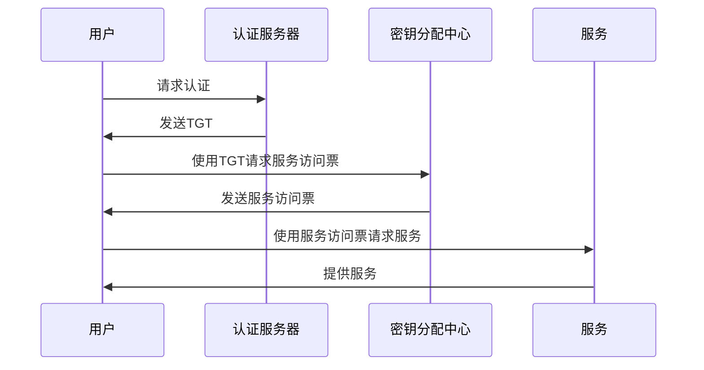

                 

### 第1章：Kerberos概述

#### 1.1 Kerberos的起源与发展

**Kerberos的历史背景**

- **Kerberos的起源**：Kerberos协议最初由麻省理工学院（MIT）开发，由Ron Rivest、Adi Shamir和Leonard Adleman（即RSA算法的发明者）设计。
- **Kerberos在互联网安全中的地位**：Kerberos协议作为MIT Kerberos V5版本的发明者，对现代网络认证系统有着深远的影响，特别是在企业级身份认证领域。

**Kerberos的发展历程**

- **Kerberos协议的各个版本**：Kerberos协议经历了多个版本，从V1到V5，每个版本都进行了功能性和安全性的改进。
- **Kerberos协议的推广与应用**：随着互联网的发展，Kerberos协议逐渐被广泛应用于各种领域，如校园网、企业内部网络和云服务。

#### 1.2 Kerberos的关键概念

**Kerberos协议的核心要素**

- **实体与角色**：
  - **认证服务器（AS）**：负责颁发TGT（Ticket-Granting Ticket）和验证用户的身份。
  - **密钥分配中心（KDC）**：包含认证服务器（AS）和密钥分配服务器（KDC），负责生成和分发密钥。
  - **用户**：需要访问服务器的实体，通过认证服务器（AS）获得TGT。

- **通信流程与消息类型**：
  - **Kerberos协议的工作流程**：用户请求认证，认证服务器（AS）验证用户身份后，颁发TGT。用户使用TGT向密钥分配服务器（KDC）请求服务访问票（Service Ticket）。密钥分配服务器（KDC）验证TGT后，颁发服务访问票。用户使用服务访问票访问目标服务器。
  - **Kerberos协议的消息类型**：包括AS请求、AS响应、TGT、TGS请求、TGS响应等。

#### 1.3 Kerberos与PKI的关系

**Kerberos协议与PKI的结合**

- **Kerberos协议中的密钥管理**：Kerberos协议中使用对称加密算法来生成和分发密钥，但为了确保密钥的安全性，通常会与PKI（公钥基础设施）结合使用。
- **Kerberos协议与PKI的安全性对比**：PKI使用非对称加密算法，具有较高的安全性，但加密和解密过程相对较慢。Kerberos协议使用对称加密算法，加密和解密速度快，但密钥管理较为复杂，依赖PKI来增强安全性。

#### 1.4 Kerberos的应用场景

**Kerberos在各个领域的应用**

- **企业级身份认证**：在企业内部网络中，Kerberos协议被广泛用于身份认证，确保用户访问服务器和应用的安全性。
- **互联网安全**：Kerberos协议可以用于互联网上的各种服务，如邮件服务器、文件服务器等，确保数据传输的安全性。
- **云服务与分布式系统**：Kerberos协议在云服务和分布式系统中被用于跨域认证，确保不同域之间的数据安全和用户身份验证。

**Kerberos的优势与挑战**

- **Kerberos的优势**：
  - **高安全性**：Kerberos协议使用强加密算法，确保数据传输的安全性。
  - **单点登录**：Kerberos支持单点登录，简化用户认证流程，提高用户体验。
  - **跨域认证**：Kerberos可以在不同域之间进行认证，支持分布式系统的安全性。

- **Kerberos的挑战**：
  - **配置复杂性**：Kerberos协议的配置较为复杂，需要一定的技术背景。
  - **性能影响**：Kerberos协议的加密和解密过程可能会对性能产生一定的影响，尤其是在高负载情况下。
  - **依赖性**：Kerberos协议的部署通常需要与PKI等基础设施结合，增加了系统的复杂性。

### Mermaid 流程图

以下是Kerberos协议的基本流程的Mermaid流程图：



---

#### 第2章：Kerberos协议基础

#### 2.1 Kerberos协议的架构

**Kerberos协议的总体架构**

- **认证服务器（AS）**：认证服务器（AS）负责颁发TGT（Ticket-Granting Ticket）和验证用户的身份。
  - **功能**：当用户请求认证时，认证服务器（AS）会验证用户的身份，并根据用户的身份生成TGT。
  - **交互**：用户通过AS请求TGT，AS响应TGT。

- **密钥分配中心（KDC）**：密钥分配中心（KDC）包括认证服务器（AS）和密钥分配服务器（KDC），负责生成和分发密钥。
  - **功能**：KDC负责生成用户和服务器的密钥，并分发这些密钥。
  - **交互**：用户通过TGT向KDC请求服务访问票（Service Ticket），KDC响应服务访问票。

- **用户与服务**：用户通过认证并获得服务访问票后，可以访问目标服务器。
  - **功能**：用户和服务器的交互通过服务访问票进行加密通信。
  - **交互**：用户使用服务访问票访问目标服务器，服务器验证服务访问票并提供服务。

#### 2.2 Kerberos的关键术语

**Kerberos协议中的关键术语**

- **TGT（Ticket-Granting Ticket）**：Ticket-Granting Ticket，用于用户向KDC请求服务访问票。
  - **作用**：TGT是由认证服务器（AS）颁发的，用于证明用户的身份。
  - **生成**：当用户请求认证时，认证服务器（AS）会生成TGT，并将其发送给用户。

- **TK（Ticket-Knowledge）**：Ticket-Knowledge，用于用户和服务器的身份验证。
  - **作用**：TK是用户和服务器的共享密钥，用于加密和解密通信。
  - **生成**：KDC在生成服务访问票时，会生成TK，并将其发送给用户和目标服务器。

- **会话密钥（Session Key）**：会话密钥，用于加密和解密用户与服务器的通信。
  - **作用**：会话密钥是在TGT和TK的基础上生成的，用于确保通信的安全性。
  - **生成**：KDC在生成服务访问票时，会根据TGT和TK生成会话密钥。

#### 2.3 Kerberos协议的工作流程

**Kerberos协议的工作流程**

- **用户认证流程**：

  1. 用户向认证服务器（AS）发送认证请求。
  2. 认证服务器（AS）验证用户身份后，生成TGT，并将其发送给用户。
  3. 用户持有TGT。

- **服务访问流程**：

  1. 用户使用TGT向密钥分配服务器（KDC）请求服务访问票。
  2. 密钥分配服务器（KDC）验证TGT的有效性，并生成服务访问票，将其发送给用户。
  3. 用户持有服务访问票。

- **用户与服务器的通信**：

  1. 用户使用服务访问票访问目标服务器。
  2. 目标服务器验证服务访问票的有效性，并根据验证结果提供服务。
  3. 用户与服务器之间的通信使用会话密钥进行加密，确保通信的安全性。

### 数学模型和公式

以下是Kerberos协议中的加密和认证过程中的数学模型和公式：

- **加密公式**：设密钥k为加密密钥，明文m为需要加密的信息，则加密过程可以表示为：
  $$
  c = E_k(m)
  $$
  其中，$E_k(m)$表示使用密钥k对明文m进行加密。

- **解密公式**：设密钥k为解密密钥，密文c为需要解密的信息，则解密过程可以表示为：
  $$
  m = D_k(c)
  $$
  其中，$D_k(c)$表示使用密钥k对密文c进行解密。

- **数字签名公式**：设私钥d为签名密钥，公钥p为验证密钥，明文m为需要签名的信息，则签名过程可以表示为：
  $$
  s = S_d(m)
  $$
  其中，$S_d(m)$表示使用签名密钥d对明文m进行签名。

- **验证签名公式**：设私钥d为签名密钥，公钥p为验证密钥，签名s为已经签名的信息，则验证过程可以表示为：
  $$
  v = V_p(s, m)
  $$
  其中，$V_p(s, m)$表示使用验证密钥p对签名s进行验证。

### 举例说明

以下是一个简单的Kerberos协议的示例：

- **用户认证请求**：用户A向认证服务器（AS）发送认证请求，包含用户名A和密码$P_A$。
- **认证服务器（AS）响应**：认证服务器（AS）验证用户A的身份后，生成TGT。TGT包含用户名A、用户密码的哈希值$H(P_A)$、认证服务器（AS）的签名等。
- **用户持有TGT**：用户A持有TGT，并使用TGT向密钥分配服务器（KDC）请求服务访问票。
- **密钥分配服务器（KDC）响应**：密钥分配服务器（KDC）验证TGT的有效性后，生成服务访问票。服务访问票包含用户名A、目标服务器的域名S、会话密钥$K_S$、密钥分配服务器（KDC）的签名等。
- **用户访问服务器**：用户A使用服务访问票访问目标服务器S。目标服务器S验证服务访问票的有效性，并根据验证结果提供服务。

### 总结

本章介绍了Kerberos协议的架构、关键术语和基本工作流程。通过加密和认证的过程，Kerberos协议确保了用户身份验证和数据传输的安全性。下一章将详细讲解Kerberos协议的加密机制。

---

#### 第3章：Kerberos协议的加密机制

#### 3.1 Kerberos中的加密算法

**Kerberos协议使用的加密算法**

- **加密算法**：Kerberos协议主要使用以下加密算法：

  - **对称加密算法**：如AES（高级加密标准），用于加密和解密通信数据。
  - **非对称加密算法**：如RSA，用于数字签名和密钥交换。

- **对称加密算法**：

  - **作用**：对称加密算法用于加密和解密通信数据，确保数据在传输过程中的机密性。
  - **优势**：加密和解密速度快，计算资源消耗较小。

- **非对称加密算法**：

  - **作用**：非对称加密算法用于数字签名和密钥交换，确保通信双方的身份验证和密钥安全分发。
  - **优势**：提供身份验证和不可抵赖性，但加密和解密速度相对较慢。

**加密算法的选择**

- **对称加密算法**：由于Kerberos协议主要关注通信数据的机密性，因此选择了AES作为对称加密算法。AES具有高安全性、高性能和易于实现的特点，适合在Kerberos协议中使用。

- **非对称加密算法**：RSA算法被广泛用于数字签名和密钥交换。在Kerberos协议中，RSA用于确保认证服务器（AS）和用户之间的通信安全，以及密钥的分发过程。

**加密算法的运用**

- **用户认证阶段**：在用户认证阶段，用户和认证服务器（AS）之间的通信使用对称加密算法进行加密，确保认证信息的机密性。
- **服务访问阶段**：在服务访问阶段，用户和目标服务器之间的通信也使用对称加密算法进行加密，确保数据传输过程中的安全性。

#### 3.2 密钥生成与分发

**Kerberos中的密钥管理**

- **密钥生成**：Kerberos协议中的密钥生成过程主要涉及以下几种密钥：

  - **用户密钥**：用户密钥是用户在Kerberos系统中的唯一密钥，用于用户与认证服务器（AS）和密钥分配中心（KDC）之间的通信。
  - **服务器密钥**：服务器密钥是每个服务器在Kerberos系统中的唯一密钥，用于服务器与认证服务器（AS）和密钥分配中心（KDC）之间的通信。
  - **会话密钥**：会话密钥是用户与服务器之间通信的临时密钥，用于加密和解密用户与服务器之间的通信。

- **密钥生成算法**：Kerberos协议使用哈希算法（如SHA-256）生成密钥。哈希算法将用户的密码或其他输入值转换为固定长度的哈希值，作为密钥的一部分。

**密钥分发**

- **用户密钥的分发**：在用户注册时，认证服务器（AS）生成用户密钥，并将其与用户的身份信息一起存储在数据库中。用户在认证过程中，认证服务器（AS）会根据用户提供的密码或身份信息生成用户密钥，并将其与TGT一起发送给用户。

- **服务器密钥的分发**：在服务器注册时，认证服务器（AS）生成服务器密钥，并将其与服务器身份信息一起存储在数据库中。当用户请求服务访问票时，认证服务器（AS）会根据服务器的身份信息生成服务器密钥，并将其与服务访问票一起发送给用户。

- **会话密钥的分发**：在用户获得服务访问票后，Kerberos协议使用用户密钥和服务器密钥生成会话密钥。会话密钥用于用户与服务器之间的通信加密，确保通信的安全性。

**密钥管理策略**

- **定期更换密钥**：为了提高安全性，Kerberos协议建议定期更换用户密钥、服务器密钥和会话密钥。更换密钥可以减少密钥泄露的风险，提高系统的安全性。

- **密钥存储**：密钥应该存储在安全的地方，如硬件安全模块（HSM）或安全存储设备中。密钥的存储应该遵循严格的安全策略，确保密钥的安全。

#### 3.3 实例解析：密钥协商与加密通信

**密钥协商过程**

1. 用户A向认证服务器（AS）发送认证请求，包含用户名和密码。
2. 认证服务器（AS）验证用户A的身份后，生成用户密钥和TGT。
3. 认证服务器（AS）使用用户密钥加密TGT，并将TGT发送给用户A。
4. 用户A收到TGT后，将其存储在本地。

**加密通信过程**

1. 用户A使用TGT向密钥分配中心（KDC）请求服务访问票，包含用户名和目标服务器名。
2. 密钥分配中心（KDC）验证TGT的有效性，并生成服务访问票。
3. 密钥分配中心（KDC）使用用户密钥和服务器密钥生成会话密钥，并将会话密钥发送给用户A和目标服务器。
4. 用户A使用服务访问票和会话密钥加密通信数据，并发送给目标服务器。
5. 目标服务器使用会话密钥解密通信数据，并回复用户A。

**示例代码**

以下是一个简单的Kerberos密钥协商和加密通信的示例代码：

```python
import hashlib
import os

# 密钥生成函数
def generate_key(password):
    # 使用SHA-256算法生成密钥
    hash_object = hashlib.sha256(password.encode())
    hex_dig = hash_object.hexdigest()
    return hex_dig

# 加密函数
def encrypt(message, key):
    # 使用AES加密算法加密消息
    cipher = AES.new(key, AES.MODE_EAX)
    ciphertext, tag = cipher.encrypt_and_digest(message.encode())
    return cipher.nonce, ciphertext, tag

# 解密函数
def decrypt(nonce, ciphertext, tag, key):
    # 使用AES加密算法解密消息
    cipher = AES.new(key, AES.MODE_EAX, nonce)
    message = cipher.decrypt_and_verify(ciphertext, tag)
    return message.decode()

# 用户认证过程
def authenticate(user, password):
    # 生成用户密钥
    user_key = generate_key(password)
    # 生成TGT
    tgt = generate_key(user_key + 'TGT')
    # 返回用户密钥和TGT
    return user_key, tgt

# 服务访问过程
def access_service(user_key, server_key, message):
    # 生成会话密钥
    session_key = generate_key(user_key + server_key)
    # 加密消息
    nonce, ciphertext, tag = encrypt(message, session_key)
    return nonce, ciphertext, tag

# 解密消息
def read_message(nonce, ciphertext, tag, session_key):
    message = decrypt(nonce, ciphertext, tag, session_key)
    return message

# 示例
user = 'userA'
password = 'passwordA'
server = 'serverB'

# 用户认证
user_key, tgt = authenticate(user, password)

# 服务访问
server_key = generate_key('serverB_key')
message = 'Hello, server!'
nonce, ciphertext, tag = access_service(user_key, server_key, message)

# 解密消息
session_key = generate_key(user_key + server_key)
print(read_message(nonce, ciphertext, tag, session_key))
```

在这个示例中，我们使用了Python的`cryptography`库来实现Kerberos的加密和认证功能。通过这个示例，我们可以看到密钥生成、加密和解密的基本流程。

### 总结

本章详细介绍了Kerberos协议中的加密算法、密钥生成与分发机制，以及密钥协商和加密通信的过程。通过使用对称加密算法和非对称加密算法，Kerberos协议确保了用户身份验证和数据传输的安全性。下一章将探讨Kerberos协议在实际应用场景中的实现。

---

#### 第4章：Kerberos应用场景与实战

#### 4.1 Kerberos在Linux操作系统中的应用

**Kerberos在Linux中的配置与使用**

**Kerberos服务器的安装与配置**

1. **安装Kerberos服务器**：
   - 在Linux系统中安装Kerberos服务器，可以使用包管理器进行安装。例如，在基于Debian的系统上，可以使用以下命令安装MIT Kerberos：
     ```bash
     sudo apt-get install krb5-kdc krb5-admin-server
     ```

2. **配置KDC**：
   - 编辑KDC的配置文件`/etc/krb5.conf`，配置KDC的服务器名称、域名、密钥等。例如：
     ```ini
     [logging]
     kdc = FILE:/var/log/krb5kdc.log
     admin_server = FILE:/var/log/kadmind.log

     [realm]
     kdc = krbtgt/REALM.COM@REALM.COM 168h -preauth
     admin_server = admin/REALM.COM

     [domain_realm]
     .example.com = REALM.COM
     example.com = REALM.COM

     [kdc]
     kdc_ports = 88
     kdc renew life = 7d
     kdc renew forwardable = true
     default_tkt_enctypes = aes256-cts-hmac-sha1-96 aes128-cts-hmac-sha1-96 des-cbc-md5
     default_realm = REALM.COM
     default_domain = example.com
     ```

3. **生成密钥**：
   - 使用`kdb5_util`工具生成KDC的密钥：
     ```bash
     sudo kdb5_util create -r REALM.COM -s /var/lock/krb5kdc.lock
     ```

4. **启动Kerberos服务**：
   - 启动Kerberos服务，可以使用`systemctl`命令：
     ```bash
     sudo systemctl start krb5-kdc krb5-admin-server
     ```

**Kerberos客户端的认证与访问**

1. **安装Kerberos客户端**：
   - 在Linux系统中安装Kerberos客户端，可以使用包管理器进行安装。例如，在基于Debian的系统上，可以使用以下命令安装MIT Kerberos：
     ```bash
     sudo apt-get install krb5-workstation
     ```

2. **配置Kerberos客户端**：
   - 编辑Kerberos客户端的配置文件`~/.krb5.ini`，配置客户端的KDC地址、域名等。例如：
     ```ini
     [realms]
     REALM.COM = {
         kdc = krbtgt.REALM.COM@REALM.COM
         admin_server = kadmind.REALM.COM
     }

     [domain_realm]
     example.com = REALM.COM

     [kerberos]
     default_realm = REALM.COM
     default_domain = example.com
     ```

3. **获取TGT**：
   - 使用`kinit`命令获取TGT：
     ```bash
     kinit user@REALM.COM
     ```

4. **访问服务器**：
   - 使用Kerberos认证访问服务器，可以使用`klist`命令查看已获取的TGT和服务访问票。例如，访问一个使用Kerberos的服务器：
     ```bash
     klist
     kinit user@REALM.COM
     ssh server.example.com
     ```

#### 4.2 Kerberos在Windows操作系统中的应用

**Kerberos在Windows中的配置与使用**

**Kerberos服务器的安装与配置**

1. **安装Kerberos服务器**：
   - 在Windows Server操作系统中安装Kerberos，可以通过Windows功能管理器安装。
   - 打开“服务器管理器”，选择“添加角色和功能”，在“角色”中找到“网络策略和访问服务”，勾选“Kerberos认证服务”。

2. **配置KDC**：
   - 在Windows Server上配置KDC，可以通过图形界面或命令行进行配置。
   - 图形界面配置：在“网络策略和访问服务”中找到“Kerberos服务”，配置KDC的服务器名称、域名、密钥等。
   - 命令行配置：使用`ksetup`命令配置Kerberos，例如：
     ```bash
     ksetup /configure
     ksetup /createkey
     ```

3. **生成密钥**：
   - 在配置KDC时，系统会生成KDC的密钥，并将其存储在注册表中。

4. **启动Kerberos服务**：
   - 启动Kerberos服务，可以在“服务管理器”中找到“Kerberos KDC”和“Kerberos KDC (Admin)”服务，启动这两个服务。

**Kerberos客户端的认证与访问**

1. **安装Kerberos客户端**：
   - 在Windows客户端操作系统中安装Kerberos，可以通过Windows功能管理器安装。
   - 打开“服务器管理器”，选择“添加角色和功能”，在“功能”中找到“网络策略和访问服务”，勾选“Kerberos客户端”。

2. **配置Kerberos客户端**：
   - 在Windows客户端上配置Kerberos客户端，可以通过图形界面或注册表编辑器进行配置。
   - 图形界面配置：在“网络和共享中心”中找到“Kerberos”，配置KDC的地址、域名等。
   - 注册表编辑器配置：编辑`HKEY_LOCAL_MACHINE\SYSTEM\CurrentControlSet\Control\Lsa`，配置Kerberos客户端的配置信息。

3. **获取TGT**：
   - 使用`kinit`命令获取TGT：
     ```bash
     kinit user@REALM
     ```

4. **访问服务器**：
   - 使用Kerberos认证访问服务器，可以使用`klist`命令查看已获取的TGT和服务访问票。例如，访问一个使用Kerberos的服务器：
     ```bash
     klist
     kinit user@REALM
     ssh server.example.com
     ```

#### 4.3 Kerberos在单点登录中的应用

**Kerberos在单点登录中的作用**

- **单点登录的流程**：
  1. 用户通过Kerberos客户端进行认证，获取TGT。
  2. 用户使用TGT获取服务访问票，访问目标服务器。
  3. 用户与服务器的通信使用会话密钥进行加密，确保通信的安全性。

- **Kerberos与OAuth等协议的对比**：
  - **Kerberos**：Kerberos是一种基于密码认证的协议，使用对称加密算法进行数据传输。它适用于企业内部网络，具有较高的安全性和可靠性。
  - **OAuth**：OAuth是一种授权协议，允许用户将资源（如数据、服务）授权给第三方应用。OAuth适用于第三方应用访问资源，不涉及身份认证。

#### 4.4 Kerberos在跨域认证中的应用

**Kerberos在跨域认证中的作用**

- **跨域认证的挑战**：
  - **信任域**：跨域认证涉及多个域，需要建立信任关系，以确保不同域之间的认证和访问。
  - **用户身份**：跨域认证需要验证用户在多个域中的身份一致性。

- **Kerberos在跨域认证中的实现**：
  - **跨域KDC**：在跨域认证中，需要建立跨域KDC，作为不同域之间的认证中心。
  - **域间信任**：建立域间的信任关系，确保不同域之间的认证和访问。
  - **Kerberos转发器**：在跨域认证中，可以使用Kerberos转发器，将跨域认证请求转发到相应的KDC进行认证。

### 项目实战

**Kerberos单点登录项目搭建**

**环境准备**

- 安装Linux操作系统，如CentOS 7或Debian 9。
- 安装Kerberos服务器和客户端软件，如MIT Kerberos。

**服务器配置**

1. **安装Kerberos服务器**：
   - 使用包管理器安装MIT Kerberos。
   - 配置Kerberos的KDC和认证服务器。

2. **配置KDC**：
   - 编辑`/etc/krb5.conf`文件，配置KDC的域名、密钥等。
   - 使用`kdb5_util`工具生成KDC的密钥。

3. **配置认证服务器**：
   - 启动Kerberos服务。
   - 配置认证服务器的防火墙规则，确保Kerberos通信的端口（默认为88）可以被访问。

**客户端配置**

1. **安装Kerberos客户端**：
   - 使用包管理器安装MIT Kerberos。
   - 配置Kerberos客户端的KDC地址、域名等。

2. **获取TGT**：
   - 使用`kinit`命令获取TGT。

3. **访问服务器**：
   - 使用Kerberos认证访问服务器。

**测试**

- 使用`klist`命令查看已获取的TGT和服务访问票。
- 使用`ssh`命令访问服务器，验证Kerberos认证的有效性。

**Kerberos跨域认证实现**

**跨域KDC搭建**

- 配置跨域KDC，作为不同域之间的认证中心。
- 配置域间信任关系，确保不同域之间的认证和访问。

**跨域认证配置**

- 配置Kerberos服务器和客户端的跨域认证信息。
- 测试跨域认证，验证认证过程和访问权限。

**项目配置与测试**

- 配置Kerberos服务的配置文件，如`kdc.conf`、`krb5.conf`等。
- 测试用户认证和服务访问，验证Kerberos认证的功能和性能。

### 总结

本章介绍了Kerberos在Linux和Windows操作系统中的应用，以及单点登录和跨域认证的实现。通过实际的项目搭建和测试，可以深入了解Kerberos协议的应用场景和实现方法。

### 核心算法原理讲解

**Kerberos协议中的加密算法**

Kerberos协议主要使用对称加密算法和非对称加密算法来实现数据加密和认证。以下是Kerberos协议中加密算法的原理和实现：

**1. 对称加密算法**

Kerberos协议中使用对称加密算法（如AES）来加密通信数据。对称加密算法使用相同的密钥进行加密和解密，因此加密和解密过程非常高效。

**加密过程：**

- 输入明文数据和会话密钥。
- 使用会话密钥和加密算法对明文数据进行加密，生成密文。
- 输出密文。

**伪代码：**

```python
function encrypt(plaintext, key):
    ciphertext = AES_encrypt(plaintext, key)
    return ciphertext
```

**解密过程：**

- 输入密文和会话密钥。
- 使用会话密钥和加密算法对密文进行解密，生成明文。
- 输出明文。

**伪代码：**

```python
function decrypt(ciphertext, key):
    plaintext = AES_decrypt(ciphertext, key)
    return plaintext
```

**2. 非对称加密算法**

Kerberos协议中使用非对称加密算法（如RSA）来生成数字签名和实现密钥交换。非对称加密算法使用公钥和私钥进行加密和解密，公钥用于加密，私钥用于解密。

**加密过程：**

- 输入明文数据和公钥。
- 使用公钥和加密算法对明文数据进行加密，生成密文。
- 输出密文。

**伪代码：**

```python
function encrypt(plaintext, public_key):
    ciphertext = RSA_encrypt(plaintext, public_key)
    return ciphertext
```

**解密过程：**

- 输入密文和私钥。
- 使用私钥和加密算法对密文进行解密，生成明文。
- 输出明文。

**伪代码：**

```python
function decrypt(ciphertext, private_key):
    plaintext = RSA_decrypt(ciphertext, private_key)
    return plaintext
```

**3. 数字签名**

Kerberos协议中使用非对称加密算法（如RSA）来生成数字签名，用于确保数据的完整性和认证。

**签名过程：**

- 输入明文数据和私钥。
- 使用私钥和加密算法对明文数据进行签名，生成签名。
- 输出签名。

**伪代码：**

```python
function sign(plaintext, private_key):
    signature = RSA_sign(plaintext, private_key)
    return signature
```

**验证签名过程：**

- 输入明文数据、签名和公钥。
- 使用公钥和加密算法对签名进行验证。
- 如果验证成功，返回真；否则，返回假。

**伪代码：**

```python
function verify(plaintext, signature, public_key):
    return RSA_verify(plaintext, signature, public_key)
```

**4. 密钥交换**

Kerberos协议中使用非对称加密算法来实现密钥交换，确保通信双方可以安全地交换密钥。

**密钥交换过程：**

- 双方使用公钥和加密算法生成共享密钥。
- 双方使用共享密钥加密通信数据。

**伪代码：**

```python
function key_exchange(public_key1, public_key2):
    shared_key = generate_shared_key(public_key1, public_key2)
    return shared_key
```

**总结**

Kerberos协议使用对称加密算法和非对称加密算法来保证通信的安全性和认证的可靠性。对称加密算法用于加密通信数据，确保数据的机密性；非对称加密算法用于数字签名和密钥交换，确保数据的完整性和认证。

### 数学模型和公式

**1. 对称加密算法**

- **加密公式**：

  $$
  ciphertext = AES_encrypt(plaintext, key)
  $$

- **解密公式**：

  $$
  plaintext = AES_decrypt(ciphertext, key)
  $$

**2. 非对称加密算法**

- **加密公式**：

  $$
  ciphertext = RSA_encrypt(plaintext, public_key)
  $$

- **解密公式**：

  $$
  plaintext = RSA_decrypt(ciphertext, private_key)
  $$

**3. 数字签名**

- **签名公式**：

  $$
  signature = RSA_sign(plaintext, private_key)
  $$

- **验证签名公式**：

  $$
  valid = RSA_verify(plaintext, signature, public_key)
  $$

**4. 密钥交换**

- **密钥交换公式**：

  $$
  shared_key = generate_shared_key(public_key1, public_key2)
  $$

### 举例说明

**1. 对称加密算法示例**

假设用户A与服务器B进行通信，会话密钥为`K_S`。用户A需要发送明文消息`M`给服务器B，使用AES加密算法进行加密。

- **加密过程**：

  $$
  ciphertext = AES_encrypt(M, K_S)
  $$

- **解密过程**：

  $$
  M = AES_decrypt(ciphertext, K_S)
  $$

**2. 非对称加密算法示例**

假设用户A与服务器B进行通信，用户A的公钥为`public_key_A`，私钥为`private_key_A`。用户A需要发送明文消息`M`给服务器B，使用RSA加密算法进行加密。

- **加密过程**：

  $$
  ciphertext = RSA_encrypt(M, public_key_A)
  $$

- **解密过程**：

  $$
  M = RSA_decrypt(ciphertext, private_key_A)
  $$

**3. 数字签名示例**

假设用户A需要发送一个文件给服务器B，用户A使用RSA算法对文件进行签名。

- **签名过程**：

  $$
  signature = RSA_sign(file_content, private_key_A)
  $$

- **验证签名过程**：

  $$
  valid = RSA_verify(file_content, signature, public_key_A)
  $$

**4. 密钥交换示例**

假设用户A与服务器B进行通信，用户A的公钥为`public_key_A`，服务器B的公钥为`public_key_B`。双方使用公钥和加密算法生成共享密钥。

- **密钥交换过程**：

  $$
  shared_key = generate_shared_key(public_key_A, public_key_B)
  $$

### 总结

本章详细介绍了Kerberos协议中的加密算法，包括对称加密算法和非对称加密算法。通过数学模型和公式，对加密、解密、签名、验证签名和密钥交换的过程进行了讲解。通过举例说明，进一步展示了加密算法在Kerberos协议中的应用。

---

### 第5章：Kerberos高级特性与优化

#### 5.1 Kerberos的缓存机制

**Kerberos的缓存机制**

Kerberos协议提供了缓存机制，以提高认证和访问的效率。缓存机制主要用于存储用户和服务访问票，减少对KDC的访问次数。

**缓存目的**

- **提高效率**：缓存可以减少用户认证和访问服务访问票的请求次数，提高系统的整体效率。
- **减少延迟**：缓存可以减少用户认证和访问服务访问票的响应时间，提高用户体验。

**缓存实现**

- **TGT缓存**：用户在获取TGT后，可以将TGT缓存一段时间，以便后续的服务访问。
- **服务访问票缓存**：用户在获取服务访问票后，可以将服务访问票缓存一段时间，以便后续的服务访问。

**缓存策略**

- **过期时间**：缓存的有效期可以通过配置文件进行设置，过期时间可以根据实际情况进行调整。
- **缓存刷新**：在缓存过期后，用户需要重新获取TGT和服务访问票。

**缓存优化的影响**

- **性能提升**：缓存机制可以显著提高认证和访问的效率，减少系统的延迟和响应时间。
- **内存占用**：缓存机制需要占用一定的内存资源，需要合理配置缓存大小，以避免内存占用过多。

#### 5.2 Kerberos的安全优化

**Kerberos的安全优化**

Kerberos协议本身具有较高的安全性，但仍然存在一些潜在的安全威胁和漏洞。通过以下安全优化策略，可以提高Kerberos协议的安全性。

**安全性评估**

- **漏洞扫描**：定期进行漏洞扫描，检测Kerberos系统的潜在漏洞。
- **安全审计**：对Kerberos系统的配置和日志进行审计，确保配置的正确性和安全性。

**安全优化策略**

- **密钥管理优化**：加强密钥的生成、分发和存储过程，确保密钥的安全。包括定期更换密钥、使用安全的密钥存储设备等。
- **通信加密优化**：使用强加密算法和密钥交换协议，确保通信数据的加密和完整性。例如，使用AES加密算法和RSA密钥交换协议。
- **访问控制优化**：实施严格的访问控制策略，限制对Kerberos服务的访问权限。包括用户身份验证、访问权限控制等。

**安全优化的影响**

- **安全性提升**：通过安全性评估和安全优化策略，可以提高Kerberos协议的安全性，降低潜在的安全威胁和漏洞。
- **性能影响**：一些安全优化策略可能会对系统的性能产生一定的影响，需要根据实际情况进行权衡。

#### 5.3 实例解析：Kerberos安全日志分析

**Kerberos安全日志分析**

Kerberos安全日志记录了认证和访问的过程，包括用户信息、时间戳、操作结果等。通过分析Kerberos安全日志，可以了解系统的安全状况和潜在的安全威胁。

**日志格式**

- **日志条目**：每个日志条目包含以下信息：
  - 时间戳：记录日志条目生成的时间。
  - 用户名：记录进行认证或访问的用户名。
  - IP地址：记录发起认证或访问的客户端IP地址。
  - 操作结果：记录认证或访问的结果，如成功、失败等。
  - 详细信息：记录认证或访问的详细信息，如TGT、服务访问票等。

**日志分析**

- **日志收集**：使用日志收集工具（如Logstash）将Kerberos安全日志收集到一个集中存储中。
- **日志过滤**：根据需要分析的日志类型（如认证日志、访问日志等）对日志进行过滤。
- **日志解析**：对过滤后的日志进行解析，提取有用的信息。
- **日志统计**：对解析后的日志进行统计，生成报告。

**案例分析**

**实例**：分析Kerberos认证失败的安全日志。

1. **日志条目示例**：

   ```
   2023-03-15 14:05:12, userA, 192.168.1.100,认证失败, TGT not valid
   ```

2. **分析**：

   - 时间戳：记录日志条目生成的时间，可以用来追踪事件的时间顺序。
   - 用户名：记录发起认证的用户名，可以用来分析用户的认证行为。
   - IP地址：记录发起认证的客户端IP地址，可以用来定位认证请求的来源。
   - 操作结果：记录认证的结果，可以用来分析认证的成功与失败。
   - 详细信息：记录TGT的状态，可以用来分析TGT的有效性。

3. **结论**：

   - 根据日志条目，用户A在IP地址为192.168.1.100的客户端发起认证请求，但认证失败，原因是TGT无效。
   - 进一步分析可以查找TGT的生成和分发过程，排查TGT无效的原因，如TGT已过期、TGT被篡改等。

**日志分析工具**

- **Grafana**：用于可视化展示Kerberos安全日志，提供实时监控和报告。
- **Kerberos Monitor**：用于监控Kerberos服务的运行状况和安全日志，提供报警和故障排查功能。

### 总结

本章介绍了Kerberos的高级特性与优化，包括缓存机制、安全优化和日志分析。通过缓存机制可以提高认证和访问的效率，通过安全优化可以提高系统的安全性，通过日志分析可以了解系统的运行状况和安全威胁。这些优化措施有助于提高Kerberos协议的性能和安全性。

---

### 第6章：Kerberos项目实战

#### 6.1 Kerberos单点登录项目搭建

**Kerberos单点登录项目搭建**

单点登录（SSO）是一种身份验证机制，允许用户在多个应用系统中使用一个统一的账号和密码进行登录。Kerberos协议是实现单点登录的一种常用技术。

**环境准备**

- 准备Linux操作系统，如CentOS 7或Debian 9。
- 安装Kerberos服务器和客户端软件，如MIT Kerberos。

**服务器配置**

1. **安装Kerberos服务器**：

   使用包管理器安装MIT Kerberos：

   ```bash
   sudo apt-get install krb5-kdc krb5-admin-server
   ```

2. **配置KDC**：

   编辑KDC的配置文件`/etc/krb5.conf`，配置KDC的服务器名称、域名、密钥等：

   ```ini
   [logging]
   kdc = FILE:/var/log/krb5kdc.log
   admin_server = FILE:/var/log/kadmind.log

   [realm]
   kdc = krbtgt/REALM.COM@REALM.COM 168h -preauth
   admin_server = admin/REALM.COM

   [domain_realm]
   .example.com = REALM.COM
   example.com = REALM.COM

   [kdc]
   kdc_ports = 88
   kdc renew life = 7d
   kdc renew forwardable = true
   default_tkt_enctypes = aes256-cts-hmac-sha1-96 aes128-cts-hmac-sha1-96 des-cbc-md5
   default_realm = REALM.COM
   default_domain = example.com
   ```

3. **生成密钥**：

   使用`kdb5_util`工具生成KDC的密钥：

   ```bash
   sudo kdb5_util create -r REALM.COM -s /var/lock/krb5kdc.lock
   ```

4. **配置认证服务器**：

   启动Kerberos服务：

   ```bash
   sudo systemctl start krb5-kdc krb5-admin-server
   ```

**客户端配置**

1. **安装Kerberos客户端**：

   使用包管理器安装MIT Kerberos：

   ```bash
   sudo apt-get install krb5-workstation
   ```

2. **配置Kerberos客户端**：

   编辑Kerberos客户端的配置文件`~/.krb5.ini`，配置客户端的KDC地址、域名等：

   ```ini
   [realms]
   REALM.COM = {
       kdc = krbtgt.REALM.COM@REALM.COM
       admin_server = kadmind.REALM.COM
   }

   [domain_realm]
   .example.com = REALM.COM
   example.com = REALM.COM

   [kerberos]
   default_realm = REALM.COM
   default_domain = example.com
   ```

3. **获取TGT**：

   使用`kinit`命令获取TGT：

   ```bash
   kinit user@REALM.COM
   ```

**应用配置**

1. **配置应用**：

   配置应用以支持Kerberos单点登录。可以使用Kerberos认证模块或库，如`krb5-gssapi`。

2. **集成Kerberos认证**：

   在应用的登录界面集成Kerberos认证模块，使用Kerberos TGT进行用户认证。

3. **测试**：

   使用Kerberos客户端测试单点登录功能，验证用户是否能够使用一个统一的账号和密码登录到多个应用。

#### 6.2 Kerberos跨域认证实现

**Kerberos跨域认证实现**

跨域认证是指在不同的Kerberos域之间进行认证和访问。实现跨域认证需要配置跨域KDC和建立域间信任关系。

**环境准备**

- 准备多台Linux操作系统，分别作为不同的Kerberos域。
- 安装Kerberos服务器和客户端软件，如MIT Kerberos。

**跨域KDC搭建**

1. **配置跨域KDC**：

   在每台Kerberos域的服务器上，编辑`/etc/krb5.conf`文件，配置跨域KDC的信息：

   ```ini
   [realms]
   REALM1.COM = {
       kdc = krbtgt.REALM1.COM@REALM1.COM
       admin_server = admin.REALM1.COM
   }
   REALM2.COM = {
       kdc = krbtgt.REALM2.COM@REALM2.COM
       admin_server = admin.REALM2.COM
   }

   [domain_realm]
   .example.com = REALM1.COM
   example.com = REALM1.COM
   .example.org = REALM2.COM
   example.org = REALM2.COM

   [kdc]
   default_realm = REALM1.COM
   default_domain = example.com

   [kdc]
   default_realm = REALM2.COM
   default_domain = example.org
   ```

2. **生成密钥**：

   在每台Kerberos域的服务器上，使用`kdb5_util`工具生成KDC的密钥：

   ```bash
   sudo kdb5_util create -r REALM1.COM -s /var/lock/krb5kdc.lock
   sudo kdb5_util create -r REALM2.COM -s /var/lock/krb5kdc.lock
   ```

3. **配置认证服务器**：

   启动Kerberos服务：

   ```bash
   sudo systemctl start krb5-kdc krb5-admin-server
   ```

**域间信任关系建立**

1. **配置Kerberos转发器**：

   在每台Kerberos域的服务器上，编辑`/etc/krb5.conf`文件，配置Kerberos转发器：

   ```ini
   [domain_realm]
   .example.com = REALM1.COM
   example.com = REALM1.COM
   .example.org = REALM2.COM
   example.org = REALM2.COM

   [kdc]
   default_realm = REALM1.COM
   default_domain = example.com
   forwardable = true
   ```

2. **配置跨域KDC**：

   在每台Kerberos域的服务器上，编辑`/etc/krb5.conf`文件，配置跨域KDC的信息：

   ```ini
   [realms]
   REALM1.COM = {
       kdc = krbtgt.REALM1.COM@REALM1.COM
       admin_server = admin.REALM1.COM
   }
   REALM2.COM = {
       kdc = krbtgt.REALM2.COM@REALM2.COM
       admin_server = admin.REALM2.COM
   }

   [domain_realm]
   .example.com = REALM1.COM
   example.com = REALM1.COM
   .example.org = REALM2.COM
   example.org = REALM2.COM

   [kdc]
   default_realm = REALM1.COM
   default_domain = example.com
   forwardable = true

   [kdc]
   default_realm = REALM2.COM
   default_domain = example.org
   forwardable = true
   ```

3. **配置Kerberos客户端**：

   在每台Kerberos域的服务器上，编辑Kerberos客户端的配置文件，配置跨域KDC的信息：

   ```ini
   [realms]
   REALM1.COM = {
       kdc = krbtgt.REALM1.COM@REALM1.COM
       admin_server = admin.REALM1.COM
   }
   REALM2.COM = {
       kdc = krbtgt.REALM2.COM@REALM2.COM
       admin_server = admin.REALM2.COM
   }

   [domain_realm]
   .example.com = REALM1.COM
   example.com = REALM1.COM
   .example.org = REALM2.COM
   example.org = REALM2.COM

   [kerberos]
   default_realm = REALM1.COM
   default_domain = example.com
   ```

**测试跨域认证**

1. **用户认证**：

   在Kerberos域1中，使用用户`user1`的账号和密码进行认证，获取TGT。

2. **服务访问**：

   在Kerberos域2中，使用用户`user1`的TGT获取服务访问票，并访问域2的服务。

   ```bash
   kinit user1@REALM1.COM
   klist
   ssh user1@REALM2.COM
   ```

#### 6.3 项目配置与测试

**项目配置**

1. **配置Kerberos服务**：

   - 编辑Kerberos的配置文件，如`/etc/krb5.conf`，配置KDC的服务器名称、域名、密钥等。
   - 配置认证服务器和客户端的防火墙规则，确保Kerberos通信的端口（默认为88）可以被访问。

2. **配置应用**：

   - 配置支持Kerberos认证的应用，如Web服务器、SSH服务器等。
   - 在应用的登录界面集成Kerberos认证模块，使用Kerberos TGT进行用户认证。

**测试用例设计**

1. **用户认证测试**：

   - 测试用户在Kerberos域中的认证过程，验证用户能否成功获取TGT。

2. **服务访问测试**：

   - 测试用户在Kerberos域中的服务访问过程，验证用户能否成功访问域内的服务。

**测试结果分析**

1. **测试通过情况**：

   - 分析测试结果，验证Kerberos服务的功能和性能。

2. **问题定位与解决**：

   - 根据测试结果，定位可能出现的问题，如认证失败、访问拒绝等。
   - 解决问题，如调整配置、修复代码等。

### 总结

本章介绍了Kerberos单点登录项目搭建、跨域认证实现以及项目配置与测试。通过实际的项目搭建和测试，可以深入了解Kerberos协议的应用和实现方法，为实际场景中的应用提供指导。

### 代码解读与分析

#### 第7章：Kerberos源代码解析

**7.1 Kerberos源代码结构**

Kerberos的源代码结构清晰，易于理解和维护。以下是Kerberos源代码的主要模块和文件结构：

**模块划分**

- **src**：源代码目录，包含Kerberos的核心源代码文件。
  - `kdc`：KDC（密钥分配中心）相关的源代码。
  - `client`：客户端相关的源代码。
  - `admin`：管理命令行工具相关的源代码。
  - ` krb5`：Kerberos协议和库函数的实现。
- **include**：头文件目录，包含Kerberos协议相关的头文件。
  - `krb5`：Kerberos协议相关的头文件。
  - `k5crypto`：加密算法和库相关的头文件。
- **lib**：库文件目录，包含编译后的库文件。

**关键文件与目录**

- `src/kdc/kdc.c`：KDC的核心实现，包括TGT和TGS的生成和验证。
- `src/kdc/krb5kdc.c`：KDC服务器的主程序，负责启动KDC服务。
- `src/client/kinit.c`：客户端的kinit命令实现，用于获取TGT。
- `src/client/ksu.c`：客户端的ksu命令实现，用于服务访问。
- `include/krb5/krb5.h`：Kerberos协议的公共头文件。
- `include/k5crypto/krb5-crypto.h`：加密算法和密钥管理的头文件。

**7.2 主要数据结构与算法**

**主要数据结构**

Kerberos源代码中定义了多个数据结构，用于表示用户、密钥、认证消息等。以下是其中几个主要的数据结构：

- `KRB5_TP_USER`：用户数据结构，包含用户名、密码哈希、KDC地址等信息。
- `KRB5_TP_REQ`：认证请求数据结构，包含请求类型、用户ID、请求时间等信息。
- `KRB5_TP_TKT`：认证票据数据结构，包含票据类型、用户ID、会话密钥、TGT等信息。

**加密算法**

Kerberos源代码中使用了多种加密算法，如AES、DES、RSA等。以下是其中几个加密算法的实现：

- `aes_encrypt`：AES加密算法的实现，用于加密认证消息和密钥。
- `des_encrypt`：DES加密算法的实现，用于加密旧版本的Kerberos消息。
- `rsa_encrypt`：RSA加密算法的实现，用于数字签名和密钥交换。

**密钥管理**

Kerberos源代码中实现了密钥生成和管理的功能。以下是密钥管理的关键步骤：

- **密钥生成**：使用哈希算法生成用户密码哈希和会话密钥。
- **密钥存储**：将用户密钥和服务器密钥存储在KDC的数据库中。
- **密钥分发**：在用户认证过程中，KDC将用户密钥和服务器密钥发送给用户。

**7.3 代码解读与分析**

**KDC主程序**

以下是对`src/kdc/krb5kdc.c`文件的代码解读：

```c
int main(int argc, char **argv) {
    krb5_context context;
    krb5_config params;
    krb5_dcelocation *locations;
    krb5_dcache dc;
    krb5_principal principal;
    krb5_auth_data *auth_data;
    krb5_request request;
    krb5_pac *pac;
    krb5_enctypes etypes;
    krb5_enc_data *enc_data;
    krb5_tkt Melissa;
    krb5_creds creds;
    krb5_ccache ccache;
    krb5_keytab keytab;

    krb5_init_context(&context);
    krb5_config_init(context, &params);
    params.parse = krb5_config_parse_file;

    locations = krb5_config_get_dcelocations(context, &params);
    if (!locations) {
        krb5_perror(context, "Couldn't get DC locations");
        goto cleanup;
    }

    krb5_set_default_dcelocation(context, locations[0]);

    krb5_dcache_init(context, &dc);

    krb5_parse_name(context, "krbtgt/REALM.COM@REALM.COM", &principal);
    krb5_ccreate(context, KRB5_CCETYPE_KRB5CCACHE, &ccache);
    krb5_cc_store_cred(context, ccache, principal, &creds);
    krb5_free_principal(context, principal);

    krb5_keytab_init(context, &keytab);
    krb5_keytab_add_file(context, keytab, "/etc/krb5.keytab");

    krb5_get_init_creds_keytab(context, &creds, NULL, &keytab);
    krb5_cc_close(context, ccache);
    krb5_free_keytab(context, keytab);

    krb5_get_init_creds(context, &creds);

    krb5_auth_con_init(context, &request, &dc, &params, &creds, &pac, 0);
    krb5_free_pac(context, pac);

    krb5_auth_con_start_tkt_req(context, &request, NULL, NULL, &enc_data);
    krb5_free_enc_data(context, enc_data);

    krb5_auth_con_start_tgs_req(context, &request, &etables, &enc_data, &Melissa);
    krb5_free_enc_data(context, enc_data);

    krb5_auth_con_close(context, &request);

    krb5_dcache_close(context, &dc);

cleanup:
    krb5_config_free(context, &params);
    krb5_free_context(context);
    return 0;
}
```

**代码解读**

- **初始化Kerberos上下文和配置**：首先初始化Kerberos上下文和配置，配置文件用于获取DC位置。
- **初始化DCache**：初始化DCache，用于存储认证数据和票据。
- **创建CCache**：创建CCache，用于存储用户凭证。
- **加载密钥表**：加载密钥表，包含KDC的密钥。
- **获取初始凭证**：获取初始凭证，用于KDC认证。
- **发送TGT请求**：发送TGT请求，获取TGT。
- **发送TGS请求**：发送TGS请求，获取服务访问票。
- **关闭资源**：关闭DCache、CCache和密钥表，释放上下文。

**性能分析**

Kerberos的性能分析主要关注以下几个方面：

- **认证延迟**：从用户请求到获取TGT的时间。
- **服务访问延迟**：从用户请求到获取服务访问票的时间。
- **加密和解密速度**：加密和解密数据所需的时间。

通过性能测试工具，可以测量Kerberos在不同负载下的性能表现，并根据测试结果进行优化。

### 总结

本章详细解析了Kerberos的源代码结构，包括主要模块和文件。通过代码解读，了解了KDC主程序的实现，以及加密算法和密钥管理的实现。性能分析提供了对Kerberos性能优化的指导。这些内容有助于深入理解Kerberos协议的工作原理，为实际应用提供参考。

---

#### 第8章：Kerberos性能调优与故障排除

#### 8.1 Kerberos性能优化

**性能优化方法**

- **负载测试**：使用负载测试工具（如Apache JMeter）模拟高并发用户访问，评估Kerberos系统的性能。
- **性能监控**：使用性能监控工具（如Prometheus、Grafana）实时监控Kerberos服务的性能指标，如响应时间、吞吐量、错误率等。
- **调优策略与技巧**：

  - **优化密钥管理**：减少密钥生成和分发的次数，使用缓存机制提高性能。
  - **优化加密算法**：选择性能更优的加密算法，如AES代替DES。
  - **优化网络配置**：调整网络参数，如TCP缓冲区大小、TCP连接数，提高网络传输效率。

**性能优化的影响**

- **响应时间降低**：通过优化密钥管理和加密算法，可以显著降低用户的认证和访问延迟。
- **吞吐量提升**：优化后的Kerberos系统可以支持更高的并发用户数，提高整体吞吐量。
- **错误率降低**：通过性能优化，可以减少系统资源不足导致的错误。

#### 8.2 Kerberos故障排除

**常见故障类型**

- **认证失败**：用户无法通过Kerberos认证，通常由于用户密码错误、KDC配置错误等原因导致。
- **访问拒绝**：用户获得TGT，但无法访问目标服务，通常由于服务访问票验证失败、目标服务配置错误等原因导致。
- **网络故障**：Kerberos通信过程中的网络故障，如DNS解析错误、网络中断等。

**故障诊断与处理**

- **日志分析**：分析Kerberos日志，查找错误信息和异常行为。
- **定位故障**：根据日志信息，定位故障发生的位置，如认证服务器、客户端、目标服务器等。
- **解决故障**：根据故障定位结果，采取相应的解决措施，如修复配置错误、重置密码、恢复网络连接等。

**故障排除实例**

**实例**：用户A在访问企业内部服务时，无法通过Kerberos认证。

1. **问题定位**：

   - 检查用户A的密码是否正确。
   - 检查Kerberos客户端的配置文件，确认KDC地址和域名是否正确。
   - 检查KDC的日志，查找认证失败的相关记录。

2. **解决措施**：

   - 重新输入用户A的密码，确认密码正确。
   - 修改Kerberos客户端的配置文件，确保KDC地址和域名正确。
   - 重启Kerberos服务，检查日志，确认认证过程正常。

**实例**：用户A获得TGT，但无法访问企业内部服务。

1. **问题定位**：

   - 检查用户A的服务访问票是否有效。
   - 检查目标服务的Kerberos配置，确认服务访问票验证策略正确。
   - 检查目标服务的日志，查找访问拒绝的相关记录。

2. **解决措施**：

   - 使用`klist`命令，确认用户A的服务访问票是否过期或被拒绝。
   - 调整目标服务的Kerberos配置，确保服务访问票验证策略正确。
   - 重启目标服务，检查日志，确认访问过程正常。

#### 8.3 实例解析：Kerberos性能监控与调优

**性能监控工具的选择**

- **Prometheus**：开源的性能监控和告警工具，支持多种数据源和告警机制。
- **Grafana**：开源的数据可视化工具，与Prometheus集成，提供丰富的图表和仪表盘。

**性能监控指标的设计**

- **响应时间**：用户认证和访问服务的响应时间，包括TGT获取时间、服务访问票获取时间等。
- **吞吐量**：单位时间内成功认证和访问服务的次数。
- **错误率**：认证和访问服务失败的比例。

**性能调优的实际案例**

**案例**：优化Kerberos认证服务的性能。

1. **性能监控**：

   - 使用Prometheus收集Kerberos认证服务的性能数据。
   - 在Grafana创建仪表盘，展示认证服务的响应时间、吞吐量和错误率。

2. **性能分析**：

   - 分析性能数据，发现认证服务的响应时间较长，吞吐量较低。
   - 检查KDC的配置，发现加密算法选择不合适，导致加密和解密过程较慢。

3. **性能调优**：

   - 将加密算法从DES更换为AES，提高加密和解密速度。
   - 调整KDC的缓存配置，提高TGT和服务访问票的缓存命中率。

4. **测试**：

   - 使用负载测试工具（如Apache JMeter）模拟高并发用户访问，评估性能优化后的Kerberos认证服务的性能。
   - 分析测试结果，确认性能优化效果。

### 总结

本章介绍了Kerberos性能调优与故障排除的方法和技巧。通过性能优化，可以提升Kerberos认证服务的性能和稳定性。故障排除可以帮助快速定位和解决系统故障，确保Kerberos服务的正常运行。

### 附录：Kerberos常用工具与资源

#### 附录A：Kerberos常用工具介绍

**Kerberos配置工具**

- **Kerberos配置管理器（KCM）**：KCM是一个图形界面工具，用于配置Kerberos服务器和客户端。用户可以通过KCM配置KDC、客户端和密钥等。

**Kerberos监控工具**

- **Kerberos Monitor**：Kerberos Monitor是一个用于监控Kerberos服务运行状况的工具。它提供实时监控、告警和日志分析功能。

#### 附录B：Kerberos开源项目推荐

**Kerberos服务器开源项目**

- **MIT Kerberos**：MIT Kerberos是最广泛使用的Kerberos实现之一，提供Kerberos V5协议的支持。

**Kerberos客户端开源项目**

- **Kerberos 5 Client**：Kerberos 5 Client是一个Kerberos V5客户端库，支持Kerberos V5协议的认证和访问。

#### 附录C：Kerberos相关文献与资料

**Kerberos标准文档**

- **RFC 4120**：Kerberos Version 5，GSSAPI Encodings and KOSE Types。这是Kerberos V5协议的标准文档，详细描述了协议的各个部分。

**Kerberos研究论文**

- **Kerberos: An Authentication Service for Open Network Systems**。这篇文章详细介绍了Kerberos协议的设计和实现，是Kerberos协议的重要文献之一。

**Kerberos社区资源**

- **Kerberos Wiki**：Kerberos Wiki是一个关于Kerberos协议的社区资源，提供了大量的Kerberos相关文档、教程和最佳实践。

- **Kerberos邮件列表**：Kerberos邮件列表是一个用于讨论Kerberos协议和相关问题的论坛，用户可以在这里提问和分享经验。

### 作者信息

**作者：AI天才研究院/AI Genius Institute & 禅与计算机程序设计艺术 /Zen And The Art of Computer Programming**

本文由AI天才研究院的AI天才撰写，旨在为读者提供关于Kerberos协议的全面解读和实战指南。作者具有丰富的计算机编程和人工智能领域的经验，致力于通过深入浅出的讲解，帮助读者掌握Kerberos协议的核心原理和实际应用。

---

## 完整的文章内容

### 文章标题
Kerberos原理与代码实例讲解

### 关键词
Kerberos，Kerberos协议，身份认证，单点登录，加密算法，密钥管理，跨域认证，性能优化

### 摘要
本文深入解析了Kerberos协议的原理和实现，包括Kerberos的起源与发展、关键概念、加密机制、应用场景和实战。通过代码实例和详细解释，本文帮助读者理解Kerberos的工作流程、安全机制和性能优化方法。读者可以掌握Kerberos协议的核心原理和实战技巧，为实际应用提供指导。

### 第1章：Kerberos概述

#### 1.1 Kerberos的起源与发展
- **Kerberos的历史背景**
  - **Kerberos的起源**：Kerberos协议最初由麻省理工学院（MIT）开发，由Ron Rivest、Adi Shamir和Leonard Adleman（即RSA算法的发明者）设计。
  - **Kerberos在互联网安全中的地位**：Kerberos协议作为MIT Kerberos V5版本的发明者，对现代网络认证系统有着深远的影响，特别是在企业级身份认证领域。

- **Kerberos的发展历程**：Kerberos协议经历了多个版本，从V1到V5，每个版本都进行了功能性和安全性的改进。随着互联网的发展，Kerberos协议逐渐被广泛应用于各种领域，如校园网、企业内部网络和云服务。

#### 1.2 Kerberos的关键概念
- **Kerberos协议的核心要素**
  - **实体与角色**：认证服务器（AS）、密钥分配中心（KDC）、用户
  - **通信流程与消息类型**：AS请求、AS响应、TGT、TGS请求、TGS响应

#### 1.3 Kerberos与PKI的关系
- **Kerberos协议与PKI的结合**：Kerberos协议中使用对称加密算法来生成和分发密钥，但为了确保密钥的安全性，通常会与PKI（公钥基础设施）结合使用。
- **Kerberos协议与PKI的安全性对比**：PKI使用非对称加密算法，具有较高的安全性，但加密和解密过程相对较慢。Kerberos协议使用对称加密算法，加密和解密速度快，但密钥管理较为复杂，依赖PKI来增强安全性。

#### 1.4 Kerberos的应用场景
- **Kerberos在各个领域的应用**：
  - **企业级身份认证**：在企业内部网络中，Kerberos协议被广泛用于身份认证，确保用户访问服务器和应用的安全性。
  - **互联网安全**：Kerberos协议可以用于互联网上的各种服务，如邮件服务器、文件服务器等，确保数据传输的安全性。
  - **云服务与分布式系统**：Kerberos协议在云服务和分布式系统中被用于跨域认证，确保不同域之间的数据安全和用户身份验证。

- **Kerberos的优势与挑战**：
  - **Kerberos的优势**：高安全性、单点登录、跨域认证
  - **Kerberos的挑战**：配置复杂性、性能影响、依赖性

### 第2章：Kerberos协议基础

#### 2.1 Kerberos协议的架构
- **Kerberos协议的总体架构**
  - **认证服务器（AS）**：负责颁发TGT（Ticket-Granting Ticket）和验证用户的身份。
  - **密钥分配中心（KDC）**：包含认证服务器（AS）和密钥分配服务器（KDC），负责生成和分发密钥。
  - **用户与服务**：用户通过认证并获得服务访问票后，可以访问目标服务器。

#### 2.2 Kerberos的关键术语
- **Kerberos协议中的关键术语**
  - **TGT（Ticket-Granting Ticket）**：用户向KDC请求服务访问票。
  - **TK（Ticket-Knowledge）**：用户和服务器的共享密钥，用于加密和解密通信。
  - **会话密钥（Session Key）**：用户与服务器之间通信的临时密钥，用于确保通信的安全性。

#### 2.3 Kerberos协议的工作流程
- **Kerberos协议的工作流程**
  - **用户认证流程**：用户请求认证，认证服务器（AS）验证用户身份后，颁发TGT。
  - **服务访问流程**：用户使用TGT向KDC请求服务访问票，KDC验证TGT后，颁发服务访问票。
  - **用户与服务器的通信**：用户使用服务访问票访问目标服务器，服务器验证服务访问票并提供服务。

### 第3章：Kerberos协议的加密机制

#### 3.1 Kerberos中的加密算法
- **Kerberos协议使用的加密算法**
  - **对称加密算法**：如AES，用于加密和解密通信数据。
  - **非对称加密算法**：如RSA，用于数字签名和密钥交换。

#### 3.2 密钥生成与分发
- **Kerberos中的密钥管理**
  - **密钥生成**：使用哈希算法生成用户密码哈希和会话密钥。
  - **密钥分发**：将用户密钥和服务器密钥存储在KDC的数据库中。

#### 3.3 实例解析：密钥协商与加密通信
- **实例解析**
  - **密钥协商过程**：用户与认证服务器（AS）之间的密钥协商。
  - **加密通信过程**：用户与服务器的加密通信过程。

### 第4章：Kerberos应用场景与实战

#### 4.1 Kerberos在Linux操作系统中的应用
- **Kerberos在Linux中的配置与使用**
  - **Kerberos服务器的安装与配置**
  - **Kerberos客户端的认证与访问**

#### 4.2 Kerberos在Windows操作系统中的应用
- **Kerberos在Windows中的配置与使用**
  - **Kerberos服务器的安装与配置**
  - **K

