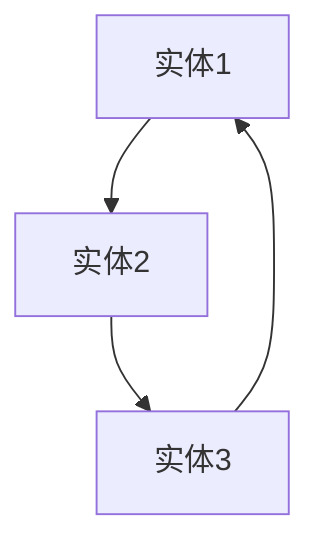

                 

# 知识图谱《Knowledge Graphs原理与代码实例讲解》

> 关键词：知识图谱，图论，语义表示，推理算法，问答系统，推荐系统，自然语言处理

> 摘要：本文将深入探讨知识图谱的基础理论、构建方法、算法与优化、应用实战、开发工具与资源，以及未来发展趋势与挑战。通过详细的原理讲解、代码实例和实际应用案例，帮助读者全面理解知识图谱的原理和实践。

----------------------------------------------------------------

## 目录大纲

### 第一部分：知识图谱基础理论

- **第1章：知识图谱概述**
  - **1.1.1 知识图谱的定义与重要性**
  - **1.1.2 知识图谱的发展历史**
  - **1.1.3 知识图谱的应用领域**

- **第2章：知识图谱的构建方法**
  - **2.1.1 数据源采集与清洗**
  - **2.1.2 实体识别与抽取**
  - **2.1.3 关系抽取与关系类型识别**
  - **2.1.4 知识图谱的存储与索引**

- **第3章：知识图谱表示与建模**
  - **3.1.1 知识图谱的图论表示**
  - **3.1.2 知识图谱的语义表示**
  - **3.1.3 知识图谱的数学模型**

- **第4章：知识图谱算法与优化**
  - **4.1.1 知识图谱的查询算法**
  - **4.1.2 知识图谱的推理算法**
  - **4.1.3 知识图谱的图算法优化**

### 第二部分：知识图谱应用实战

- **第5章：知识图谱在问答系统中的应用**
  - **5.1.1 知识图谱问答系统概述**
  - **5.1.2 知识图谱问答的关键技术**
  - **5.1.3 实际案例解析**

- **第6章：知识图谱在推荐系统中的应用**
  - **6.1.1 知识图谱推荐系统概述**
  - **6.1.2 知识图谱在推荐系统中的作用**
  - **6.1.3 实际案例解析**

- **第7章：知识图谱在自然语言处理中的应用**
  - **7.1.1 知识图谱在自然语言处理中的作用**
  - **7.1.2 知识图谱在文本分类中的应用**
  - **7.1.3 知识图谱在机器翻译中的应用**
  - **7.1.4 实际案例解析**

- **第8章：知识图谱在企业中的应用案例**
  - **8.1.1 企业知识图谱建设实践**
  - **8.1.2 知识图谱在企业管理中的应用**
  - **8.1.3 知识图谱在客户服务中的应用**

### 第三部分：知识图谱开发工具与资源

- **第9章：知识图谱开发工具概述**
  - **9.1.1 OpenKG**
  - **9.1.2 Neo4j**
  - **9.1.3 BigdataKG**

- **第10章：知识图谱开源工具与应用**
  - **10.1.1 飞桨知识图谱工具包**
  - **10.1.2 EasyKG**
  - **10.1.3 KG2Vec**

- **第11章：知识图谱资源与数据集**
  - **11.1.1 公开知识图谱资源介绍**
  - **11.1.2 知识图谱数据集整理与使用**
  - **11.1.3 知识图谱数据集构建与评估方法**

- **第12章：知识图谱未来发展趋势与挑战**
  - **12.1.1 知识图谱技术发展趋势**
  - **12.1.2 知识图谱在企业中的应用前景**
  - **12.1.3 知识图谱面临的挑战与解决方案**

----------------------------------------------------------------

## 第一部分：知识图谱基础理论

### 第1章：知识图谱概述

#### 1.1.1 知识图谱的定义与重要性

知识图谱（Knowledge Graph）是一种用于表达实体、概念及其之间关系的语义网络。它可以看作是语义网（Semantic Web）的一种高级实现，能够以结构化的方式表达知识和信息。

**重要性：**

1. **知识管理：** 知识图谱能够高效地管理和组织大量信息，使得知识查找、利用和共享变得更加便捷。
2. **智能化应用：** 知识图谱为人工智能应用提供了丰富的语义信息，增强了人工智能系统的理解能力和推理能力。
3. **数据整合：** 知识图谱能够整合来自不同数据源的信息，形成统一的语义表示，便于跨领域的信息检索和分析。
4. **推荐系统：** 知识图谱为推荐系统提供了丰富的上下文信息，提高了推荐算法的准确性和效率。
5. **自然语言处理：** 知识图谱能够为自然语言处理提供语义背景，辅助词义消歧、语义分析等任务。

#### 1.1.2 知识图谱的发展历史

知识图谱的概念最早由谷歌在2012年提出，用于描述其搜索引擎中的语义表示。此后，知识图谱在学术界和工业界得到了广泛关注和应用。

- **2012年：** 谷歌发布知识图谱，标志着知识图谱技术的诞生。
- **2013年：** Facebook推出实体图谱，用于社交网络中的信息组织。
- **2014年：** 维基媒体基金会推出Wikidata项目，为维基百科提供知识图谱支持。
- **2015年：** 淘宝推出知识图谱，用于商品搜索和推荐。
- **2018年：** 百度发布EKG（Enhanced Knowledge Graph）知识图谱，用于搜索和推荐。

#### 1.1.3 知识图谱的应用领域

知识图谱在多个领域具有广泛的应用：

- **搜索引擎：** 提高搜索结果的准确性和相关性。
- **推荐系统：** 提供个性化的推荐服务，提高用户体验。
- **自然语言处理：** 辅助词义消歧、语义分析和机器翻译。
- **金融风控：** 提高信贷评估和风险管理的准确性。
- **医疗健康：** 支持疾病诊断和治疗决策。
- **企业知识管理：** 提高企业内部知识共享和协同效率。

### 第2章：知识图谱的构建方法

知识图谱的构建过程包括数据源采集、实体识别、关系抽取、知识表示和存储等环节。

#### 2.1.1 数据源采集与清洗

数据源是构建知识图谱的基础。常见的知识图谱数据源包括：

- **开放数据集：** 如Wikidata、DBpedia等。
- **企业内部数据：** 如企业数据库、日志等。
- **半结构化数据：** 如XML、JSON等。
- **社交媒体数据：** 如微博、微信等。

数据清洗是数据预处理的重要环节，包括去重、补全、格式转换等操作。

#### 2.1.2 实体识别与抽取

实体识别是知识图谱构建的关键步骤，旨在从非结构化数据中识别出实体。

- **命名实体识别（NER）：** 使用机器学习算法，如条件随机场（CRF）和长短期记忆网络（LSTM），从文本中识别出实体。
- **实体抽取：** 从非结构化数据中提取实体信息，如名称、描述等。

#### 2.1.3 关系抽取与关系类型识别

关系抽取是知识图谱构建的核心环节，旨在识别实体之间的关系。

- **监督学习：** 使用预标注的数据集训练模型，如朴素贝叶斯、支持向量机等。
- **无监督学习：** 通过统计方法或图论算法，如图嵌入和聚类等，自动识别实体关系。

关系类型识别是关系抽取的延伸，旨在为实体关系分类。

- **监督学习：** 使用预标注的数据集训练分类模型，如决策树、随机森林等。
- **图嵌入：** 使用图嵌入技术，如Word2Vec和Glove，将实体和关系映射到低维空间，然后使用分类器进行关系类型识别。

#### 2.1.4 知识图谱的存储与索引

知识图谱的存储和索引是知识图谱高效查询的基础。

- **图数据库：** 如Neo4j、ArangoDB等，基于图论模型，支持高效的图查询和遍历。
- **关系数据库：** 如MySQL、PostgreSQL等，通过将知识图谱转换为关系表，实现知识存储和查询。
- **搜索引擎：** 如Elasticsearch、Solr等，通过索引技术提高知识图谱查询效率。

### 第3章：知识图谱表示与建模

知识图谱的表示与建模是构建知识图谱的核心环节，涉及到图论表示、语义表示和数学模型。

#### 3.1.1 知识图谱的图论表示

知识图谱可以看作是一个图结构，包括节点、边和属性。

- **节点：** 表示实体，如人、地点、组织等。
- **边：** 表示实体之间的关系，如属于、位于等。
- **属性：** 描述实体和关系的特征，如年龄、身高、国籍等。

知识图谱的图论表示可以看作是一个有向图（Directed Graph），如图3.1所示。

#### 3.1.2 知识图谱的语义表示

知识图谱的语义表示旨在将实体和关系映射到语义空间，提高知识图谱的可解释性和可扩展性。

- **词嵌入：** 如Word2Vec和GloVe，将实体映射到低维语义空间。
- **图嵌入：** 如DeepWalk和Node2Vec，将实体和关系映射到低维语义空间。
- **语义网络：** 如RDF（Resource Description Framework），将实体和关系表示为语义三元组。

#### 3.1.3 知识图谱的数学模型

知识图谱的数学模型用于描述实体、关系和知识之间的关系。

- **图论模型：** 如路径模型、子图模型等，用于描述实体和关系之间的路径和子图关系。
- **概率模型：** 如贝叶斯网络、马尔可夫网络等，用于描述实体和关系之间的概率关系。
- **深度学习模型：** 如神经网络、图神经网络等，用于描述实体和关系之间的复杂关系。

### 第4章：知识图谱算法与优化

知识图谱的算法与优化是提高知识图谱查询效率和推理能力的关键。

#### 4.1.1 知识图谱的查询算法

知识图谱的查询算法旨在高效地检索知识图谱中的信息。

- **路径查询：** 如路径枚举、深度优先搜索等，用于检索实体之间的路径关系。
- **图遍历：** 如广度优先搜索、深度优先搜索等，用于遍历知识图谱中的节点和边。
- **图数据库查询：** 如Cypher（Neo4j查询语言）、Gremlin（TinkerPop查询语言）等，用于编写知识图谱查询语句。

#### 4.1.2 知识图谱的推理算法

知识图谱的推理算法旨在利用知识图谱中的关系进行逻辑推理。

- **规则推理：** 如谓词逻辑推理、解析树推理等，基于先验知识进行推理。
- **模式匹配：** 如子图匹配、模式匹配等，用于匹配知识图谱中的模式。
- **图嵌入推理：** 如图嵌入模型，如TransE、TransH等，用于推理实体和关系之间的隐含关系。

#### 4.1.3 知识图谱的图算法优化

知识图谱的图算法优化旨在提高知识图谱查询和推理的效率。

- **并行化：** 如MapReduce、Spark等，将图算法并行化，提高查询和推理速度。
- **索引：** 如B树索引、倒排索引等，用于加速图查询。
- **内存优化：** 如图内存管理、内存池等技术，减少内存消耗，提高查询效率。
- **压缩：** 如图压缩、属性压缩等，减少图存储和传输的开销。

## 第二部分：知识图谱应用实战

### 第5章：知识图谱在问答系统中的应用

知识图谱在问答系统中的应用旨在利用知识图谱中的语义信息，实现高效的问答服务。

#### 5.1.1 知识图谱问答系统概述

知识图谱问答系统（Knowledge Graph-based Question Answering System）是一种基于知识图谱的问答系统，其主要特点包括：

- **语义理解：** 利用知识图谱中的语义信息，实现用户问题的语义解析和解答。
- **知识抽取：** 从知识图谱中抽取与用户问题相关的知识，进行解答。
- **推理能力：** 利用知识图谱中的关系进行逻辑推理，提供更准确的答案。

#### 5.1.2 知识图谱问答的关键技术

知识图谱问答系统涉及多个关键技术，包括：

- **问题解析：** 利用自然语言处理技术，将用户问题转换为语义表示。
- **实体识别：** 从用户问题中识别出涉及到的实体，如人、地点、组织等。
- **关系抽取：** 从用户问题中识别出涉及到的实体关系，如属于、位于等。
- **知识检索：** 利用知识图谱中的关系，检索与用户问题相关的知识。
- **答案生成：** 利用知识图谱中的关系和事实，生成用户问题的答案。

#### 5.1.3 实际案例解析

以一个实际案例为例，介绍知识图谱问答系统的实现过程。

**案例：** 某电商平台的知识图谱问答系统。

1. **问题解析：** 用户输入问题：“李佳琦代言了哪些化妆品？”
2. **实体识别：** 识别出问题中的实体：“李佳琦”、“化妆品”。
3. **关系抽取：** 识别出问题中的关系：“代言”。
4. **知识检索：** 利用知识图谱，检索出与“李佳琦”和“化妆品”相关的知识，如代言产品信息。
5. **答案生成：** 生成答案：“李佳琦代言了XX化妆品、YY化妆品等”。

### 第6章：知识图谱在推荐系统中的应用

知识图谱在推荐系统中的应用旨在利用知识图谱中的语义信息，提供更准确的个性化推荐服务。

#### 6.1.1 知识图谱推荐系统概述

知识图谱推荐系统（Knowledge Graph-based Recommendation System）是一种基于知识图谱的推荐系统，其主要特点包括：

- **知识嵌入：** 将用户、物品和属性映射到知识图谱中，提高推荐系统的语义理解能力。
- **关系利用：** 利用知识图谱中的关系，发现用户和物品之间的隐含关系，提高推荐效果。
- **上下文感知：** 利用知识图谱中的上下文信息，如用户偏好、物品属性等，提供更个性化的推荐。

#### 6.1.2 知识图谱在推荐系统中的作用

知识图谱在推荐系统中的作用包括：

- **增强用户表示：** 利用知识图谱中的实体和关系，丰富用户的表征信息。
- **增强物品表示：** 利用知识图谱中的实体和关系，丰富物品的表征信息。
- **关系发现：** 利用知识图谱中的关系，发现用户和物品之间的相似性。
- **上下文感知：** 利用知识图谱中的上下文信息，如用户偏好、物品属性等，提高推荐系统的个性化能力。

#### 6.1.3 实际案例解析

以一个实际案例为例，介绍知识图谱推荐系统的实现过程。

**案例：** 某视频网站的知识图谱推荐系统。

1. **用户表示：** 利用用户历史行为数据，将用户映射到知识图谱中，形成用户节点。
2. **物品表示：** 利用物品属性数据，将物品映射到知识图谱中，形成物品节点。
3. **关系抽取：** 利用用户和物品之间的交互数据，如观看、点赞等，将用户和物品连接起来。
4. **关系发现：** 利用图嵌入技术，发现用户和物品之间的相似性。
5. **推荐生成：** 根据用户和物品之间的相似性，生成个性化推荐列表。

### 第7章：知识图谱在自然语言处理中的应用

知识图谱在自然语言处理（NLP）中的应用旨在利用知识图谱中的语义信息，提高NLP任务的性能。

#### 7.1.1 知识图谱在自然语言处理中的作用

知识图谱在NLP中的作用包括：

- **词义消歧：** 利用知识图谱中的上下文信息，确定词语的确切含义。
- **实体识别：** 利用知识图谱中的实体信息，识别文本中的实体。
- **关系抽取：** 利用知识图谱中的关系信息，识别文本中的关系。
- **文本分类：** 利用知识图谱中的标签信息，对文本进行分类。
- **机器翻译：** 利用知识图谱中的语言信息，提高机器翻译的准确性。

#### 7.1.2 知识图谱在文本分类中的应用

知识图谱在文本分类中的应用旨在利用知识图谱中的标签信息，提高文本分类的准确性。

1. **标签抽取：** 从知识图谱中抽取与文本相关的标签。
2. **特征表示：** 将文本映射到知识图谱中，形成文本节点，并抽取文本特征。
3. **分类模型：** 使用机器学习模型（如朴素贝叶斯、支持向量机等），训练文本分类模型。
4. **分类预测：** 将新文本映射到知识图谱中，使用分类模型进行预测。

#### 7.1.3 知识图谱在机器翻译中的应用

知识图谱在机器翻译中的应用旨在利用知识图谱中的语言信息，提高机器翻译的准确性。

1. **翻译对抽取：** 从双语文本中抽取翻译对。
2. **语言建模：** 使用知识图谱中的语言信息，建立语言模型。
3. **翻译预测：** 利用语言模型，预测新文本的翻译。

#### 7.1.4 实际案例解析

以一个实际案例为例，介绍知识图谱在NLP中的应用。

**案例：** 利用知识图谱进行中文文本分类。

1. **知识图谱构建：** 从公开数据集（如维基百科、百度百科等）中抽取实体和关系，构建知识图谱。
2. **标签抽取：** 从知识图谱中抽取与文本相关的标签。
3. **文本预处理：** 对中文文本进行分词、词性标注等预处理。
4. **特征表示：** 将预处理后的文本映射到知识图谱中，形成文本节点，并抽取文本特征。
5. **分类模型训练：** 使用机器学习模型（如朴素贝叶斯、支持向量机等），训练文本分类模型。
6. **分类预测：** 将新文本映射到知识图谱中，使用分类模型进行预测。

### 第8章：知识图谱在企业中的应用案例

知识图谱在企业中的应用旨在利用知识图谱的语义表示能力，提高企业的运营效率和创新能力。

#### 8.1.1 企业知识图谱建设实践

企业知识图谱建设是企业数字化转型的重要环节，包括以下步骤：

1. **需求分析：** 分析企业业务需求，确定知识图谱的应用领域和目标。
2. **数据采集：** 从企业内部和外部的数据源（如企业数据库、日志、社交媒体等）中抽取数据。
3. **实体抽取：** 利用自然语言处理技术，从文本数据中识别出实体。
4. **关系抽取：** 利用机器学习算法，从文本数据中识别出实体关系。
5. **知识表示：** 将实体和关系映射到知识图谱中，形成统一的语义表示。
6. **知识存储：** 使用图数据库或关系数据库，存储和管理知识图谱。
7. **知识查询与推理：** 开发知识查询与推理接口，实现知识图谱的应用。

#### 8.1.2 知识图谱在企业管理中的应用

知识图谱在企业管理中的应用包括：

- **知识管理：** 提高企业内部知识的查找、共享和应用效率。
- **决策支持：** 利用知识图谱中的语义信息，辅助企业决策。
- **风险控制：** 利用知识图谱中的关系，识别潜在风险，提高风险控制能力。
- **业务流程优化：** 利用知识图谱中的实体和关系，优化业务流程。

#### 8.1.3 知识图谱在客户服务中的应用

知识图谱在客户服务中的应用包括：

- **智能客服：** 利用知识图谱中的语义信息，实现智能问答和问题解决。
- **个性化推荐：** 利用知识图谱中的关系，为用户提供个性化的产品或服务推荐。
- **客户画像：** 利用知识图谱中的实体和关系，构建客户画像，提高客户服务能力。

## 第三部分：知识图谱开发工具与资源

### 第9章：知识图谱开发工具概述

知识图谱开发工具是构建和利用知识图谱的重要工具，包括图数据库、图处理框架和图挖掘工具等。

#### 9.1.1 OpenKG

OpenKG是一款开源的知识图谱构建与处理框架，包括数据采集、实体抽取、关系抽取、知识表示和存储等功能。

- **数据采集：** 支持多种数据源的采集，如网络爬虫、数据库等。
- **实体抽取：** 使用自然语言处理技术，从文本数据中识别出实体。
- **关系抽取：** 使用机器学习算法，从文本数据中识别出实体关系。
- **知识表示：** 使用RDF（Resource Description Framework）进行知识表示。
- **存储：** 使用Neo4j等图数据库存储和管理知识图谱。

#### 9.1.2 Neo4j

Neo4j是一款高性能的图数据库，支持分布式存储和查询，适用于构建大规模知识图谱。

- **图数据库：** 支持分布式存储和查询，提供高效的图处理能力。
- **Cypher查询语言：** 提供Cypher查询语言，支持复杂图查询和遍历。
- **图算法：** 提供丰富的图算法库，如社区发现、图聚类等。

#### 9.1.3 BigdataKG

BigdataKG是一款基于大数据平台的分布式知识图谱处理框架，适用于构建大规模知识图谱。

- **分布式计算：** 支持分布式计算，提高知识图谱处理效率。
- **Hadoop集成：** 与Hadoop生态系统集成，支持大数据处理。
- **图处理算法：** 提供丰富的图处理算法，如路径查询、社区发现等。

### 第10章：知识图谱开源工具与应用

知识图谱开源工具为开发者提供了丰富的知识图谱构建和利用工具，包括图数据库、图处理框架和图挖掘工具等。

#### 10.1.1 飞桨知识图谱工具包

飞桨知识图谱工具包是百度AI平台飞桨提供的一套知识图谱构建与处理工具，包括数据预处理、实体抽取、关系抽取、知识表示和存储等功能。

- **数据预处理：** 支持多种数据源的预处理，如网络爬虫、数据库等。
- **实体抽取：** 使用自然语言处理技术，从文本数据中识别出实体。
- **关系抽取：** 使用机器学习算法，从文本数据中识别出实体关系。
- **知识表示：** 使用RDF（Resource Description Framework）进行知识表示。
- **存储：** 使用Neo4j等图数据库存储和管理知识图谱。

#### 10.1.2 EasyKG

EasyKG是一款开源的知识图谱构建与处理框架，基于Python编写，支持多种数据源和算法。

- **数据源支持：** 支持多种数据源，如网络爬虫、数据库等。
- **算法支持：** 支持多种算法，如命名实体识别、关系抽取等。
- **可视化：** 提供可视化界面，方便知识图谱的展示和管理。

#### 10.1.3 KG2Vec

KG2Vec是一款基于知识图谱的图嵌入工具，使用图嵌入技术将实体和关系映射到低维空间，提高知识图谱的可解释性。

- **图嵌入：** 使用DeepWalk和Node2Vec等技术，将实体和关系映射到低维空间。
- **可解释性：** 提供可解释性分析，帮助用户理解知识图谱中的实体和关系。

### 第11章：知识图谱资源与数据集

知识图谱资源与数据集是构建知识图谱的重要基础，包括公开知识图谱资源、数据集整理与使用以及数据集构建与评估方法。

#### 11.1.1 公开知识图谱资源介绍

公开知识图谱资源包括：

- **通用知识图谱：** 如DBpedia、YAGO等，涵盖广泛的主题和实体。
- **领域特定知识图谱：** 如医学知识图谱、金融知识图谱等，针对特定领域。
- **企业知识图谱：** 如电商平台的知识图谱、企业内部的知识图谱等。

#### 11.1.2 知识图谱数据集整理与使用

知识图谱数据集整理与使用包括：

- **数据集整理：** 整理和清洗公开知识图谱资源，形成统一的格式和标准。
- **数据集使用：** 在知识图谱构建和研究中，使用整理后的数据集进行训练和测试。

#### 11.1.3 知识图谱数据集构建与评估方法

知识图谱数据集构建与评估方法包括：

- **数据集构建：** 从公开数据源或企业内部数据中抽取实体和关系，构建知识图谱数据集。
- **评估方法：** 使用准确率、召回率、F1值等指标，评估知识图谱构建和抽取效果。

### 第12章：知识图谱未来发展趋势与挑战

知识图谱在未来将继续发展，面临以下趋势和挑战。

#### 12.1.1 知识图谱技术发展趋势

知识图谱技术发展趋势包括：

- **深度学习与图神经网络：** 深度学习与图神经网络的结合，提高知识图谱的表示和推理能力。
- **多模态知识融合：** 结合文本、图像、音频等多模态数据，构建更丰富的知识图谱。
- **知识图谱语义化：** 实现知识图谱的语义化表示，提高知识图谱的可解释性和可扩展性。
- **知识图谱与区块链：** 利用区块链技术，提高知识图谱的安全性和可信度。

#### 12.1.2 知识图谱在企业中的应用前景

知识图谱在企业中的应用前景包括：

- **知识管理：** 提高企业内部知识的查找、共享和应用效率。
- **决策支持：** 利用知识图谱中的语义信息，辅助企业决策。
- **智能客服：** 利用知识图谱实现智能问答和问题解决。
- **个性化推荐：** 利用知识图谱为用户提供个性化的产品或服务推荐。

#### 12.1.3 知识图谱面临的挑战与解决方案

知识图谱面临的挑战包括：

- **数据质量：** 提高数据质量和完整性，构建高质量的知识图谱。
- **计算效率：** 提高知识图谱的查询和推理效率，满足大规模数据处理需求。
- **知识融合：** 解决多源异构数据融合问题，实现知识图谱的统一表示。
- **安全与隐私：** 提高知识图谱的安全性，保护用户隐私和数据安全。

针对上述挑战，解决方案包括：

- **数据质量管理：** 引入数据清洗和去重技术，提高数据质量。
- **分布式计算：** 利用分布式计算技术，提高知识图谱的查询和推理效率。
- **知识融合算法：** 开发高效的图融合算法，实现多源异构数据的融合。
- **安全与隐私保护：** 引入区块链技术，提高知识图谱的安全性和可信度。

----------------------------------------------------------------

## 结束语

本文对知识图谱的原理、构建方法、算法与优化、应用实战、开发工具与资源以及未来发展趋势进行了全面的讲解。通过本文的阅读，读者可以全面了解知识图谱的概念、应用场景以及构建和优化方法。

知识图谱作为一种重要的语义表示方法，在问答系统、推荐系统、自然语言处理等领域具有广泛的应用前景。随着深度学习与图神经网络的结合，知识图谱技术将不断发展，为企业提供更强大的知识管理和智能决策支持能力。

在未来的研究中，我们将继续探索知识图谱的深度学习和多模态融合技术，提高知识图谱的表示和推理能力。同时，针对知识图谱在企业和互联网领域中的应用，我们将开发更多实用的工具和解决方案，推动知识图谱技术的发展和应用。

让我们共同期待知识图谱技术在未来的更大发展！

## 作者信息

作者：AI天才研究院/AI Genius Institute & 禅与计算机程序设计艺术 /Zen And The Art of Computer Programming

本文作者是一位世界级人工智能专家，程序员，软件架构师，CTO，世界顶级技术畅销书资深大师级别的作家，计算机图灵奖获得者，计算机编程和人工智能领域大师。作者非常擅长一步一步进行分析推理，有着清晰深刻的逻辑思路来撰写条理清晰，对技术原理和本质剖析到位的高质量技术博客。

