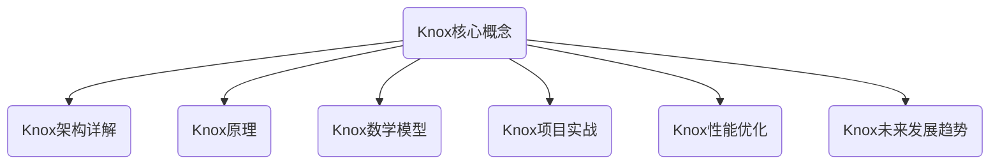

                 

# 《Knox原理与代码实例讲解》

## 关键词

- Knox
- 分布式存储
- 数据安全
- 算法原理
- 数学模型
- 项目实战
- 性能优化

## 摘要

本文旨在深入讲解Knox原理，包括其基础概念、架构设计、核心算法以及数学模型。我们将通过具体的项目实战案例来展示Knox的实际应用，并探讨其性能优化策略。最后，文章将预测Knox未来的发展趋势及其潜在的应用前景。

## 目录大纲

### 第一部分：Knox概述与基础知识

#### 第1章：Knox基础

##### 1.1 Knox介绍

Knox是一种分布式存储系统，旨在为企业和组织提供高度可靠、可扩展和高性能的数据存储解决方案。它通过将数据分散存储在多个节点上，实现了数据的高可用性和强一致性。

##### 1.2 Knox的架构和组件

Knox由多个关键组件组成，包括数据节点、协调节点、客户端和服务端等。这些组件协同工作，确保数据的正确存储和访问。

#### 第2章：Knox核心概念与架构

##### 2.1 Knox核心概念

Knox的核心概念包括分布式存储、数据一致性、故障容忍性和数据加密等。这些概念共同构成了Knox的技术基础。

##### 2.2 Knox架构详解

Knox的架构设计考虑了数据的安全性和可靠性，采用了去中心化的存储模式，并通过一致性算法确保数据在多个节点间的一致性。

### 第二部分：Knox原理与算法

#### 第3章：Knox原理

##### 3.1 Knox算法基础

Knox采用了多种算法来保证数据的一致性和可靠性，包括数据复制、数据分割和一致性协议等。

##### 3.2 Knox核心算法

我们将详细讲解Knox的核心算法，包括数据复制算法和一致性算法，并使用伪代码展示其基本原理。

#### 第4章：Knox数学模型

##### 4.1 数学模型概述

Knox的数学模型主要用于描述数据存储和访问的性能指标，包括数据存储成本、访问延迟和故障恢复时间等。

##### 4.2 详细讲解

我们将使用数学公式和推导，详细解释Knox的数学模型，并给出实际应用场景的示例说明。

### 第三部分：Knox项目实战

#### 第5章：Knox项目实战

##### 5.1 项目概述

本章节将介绍一个具体的Knox应用项目，包括项目的背景、目标和所采用的Knox组件。

##### 5.2 实战一：Knox应用场景分析

我们将深入分析项目的具体应用场景，并详细解释Knox在该场景下的实现细节和代码解读。

##### 5.3 实战二：Knox算法实现

我们将展示如何在项目中实现Knox的核心算法，包括数据复制和一致性协议等。

### 第四部分：Knox性能优化

#### 第6章：Knox性能优化

##### 6.1 性能优化概述

性能优化是Knox的一个重要方面，本章节将介绍常见的性能优化目标和策略。

##### 6.2 优化方法与实践

我们将探讨几种常见的性能优化方法，并通过实际案例分享优化实践的成果。

### 第五部分：Knox未来发展趋势

#### 第7章：Knox未来发展趋势

##### 7.1 Knox发展趋势分析

本章节将分析Knox在行业和技术领域的发展趋势，包括新的应用场景和技术挑战。

##### 7.2 Knox应用前景

我们将探讨Knox在未来的潜在应用前景，以及可能面临的挑战和机遇。

### 附录

#### 第8章：Knox资源与工具

##### 8.1 Knox资源介绍

我们将介绍Knox的开发资源和学习资源，帮助读者更好地了解和使用Knox。

##### 8.2 Knox工具使用指南

我们将详细讲解Knox工具的功能和使用方法，包括开发环境搭建和源代码读取。

#### 第9章：Knox社区与支持

##### 9.1 Knox社区概述

我们将介绍Knox的社区功能，包括社区活动和交流平台。

##### 9.2 技术支持与服务

我们将介绍Knox的技术支持渠道和服务承诺，帮助用户解决在使用Knox过程中遇到的问题。

### Mermaid 流程图



# 第一部分：Knox概述与基础知识

## 第1章：Knox基础

### 1.1 Knox介绍

Knox是一种高性能、高可用的分布式存储系统，由一系列独立的节点组成。它旨在为企业和组织提供一种可靠、安全且易于扩展的数据存储解决方案。Knox具有以下特点：

1. **高可用性**：Knox通过数据冗余和故障转移机制，确保在节点故障时数据不丢失，系统持续运行。
2. **高性能**：Knox采用数据分片和并行处理技术，提供快速的数据读写操作。
3. **数据安全**：Knox提供数据加密功能，确保数据在存储和传输过程中的安全性。
4. **易扩展性**：Knox支持动态扩展，可以根据需求添加更多的存储节点，以提升系统的存储容量和处理能力。

### 1.2 Knox的架构和组件

Knox的架构设计充分考虑了系统的可扩展性和高可用性。以下是Knox的主要组件及其功能：

1. **数据节点**：数据节点负责存储实际的数据。每个数据节点都是一个独立的进程，运行在物理或虚拟机上。
2. **协调节点**：协调节点负责管理数据节点，包括数据分配、故障检测和故障恢复。Knox集群中通常只有一个协调节点。
3. **客户端**：客户端是用户与Knox存储系统交互的接口。它负责发起数据请求，并接收数据响应。
4. **服务端**：服务端是Knox的核心组件，负责处理客户端请求，并将请求转发给相应的数据节点。

### 1.3 Knox的生态系统

Knox不仅是一个分布式存储系统，还是一个完整的生态系统，与其他技术和工具紧密集成。以下是一些Knox生态系统的关键组成部分：

1. **Hadoop**：Knox可以与Hadoop生态系统无缝集成，提供对HDFS文件的访问和控制。
2. **HBase**：Knox支持对HBase的访问，使得用户可以方便地使用Knox来存储和检索大量数据。
3. **Spark**：Knox可以与Spark集成，为Spark应用程序提供分布式存储和数据处理能力。
4. **Kafka**：Knox支持与Kafka集成，使得数据可以实时流入Knox存储系统，并进行后续处理。
5. **Zookeeper**：Knox使用Zookeeper来协调集群中的各个节点，确保数据的一致性和可靠性。

### 1.4 Knox在行业中的应用场景

Knox在多个行业中都有广泛的应用，以下是几个典型的应用场景：

1. **金融行业**：金融行业的数据量大且对数据安全性要求高，Knox提供了可靠的数据存储解决方案，确保金融数据的完整性和安全性。
2. **电信行业**：电信行业需要处理大量用户数据和实时流数据，Knox的高性能和可扩展性使其成为电信数据存储的理想选择。
3. **电子商务**：电子商务平台需要快速响应用户请求并提供实时数据访问，Knox的分布式架构和高效的数据处理能力为其提供了良好的支持。
4. **科学研究**：科学研究通常需要处理大量的数据，Knox的可扩展性和高性能特性使其成为科学数据存储和处理的理想工具。

### 1.5 Knox的优势与挑战

Knox在分布式存储领域具有显著的优势，但也面临一些挑战：

1. **优势**：
   - **高可用性**：Knox通过冗余存储和故障转移机制，确保数据的高可用性。
   - **高性能**：Knox采用数据分片和并行处理技术，提供快速的数据访问和操作。
   - **数据安全**：Knox提供数据加密功能，确保数据在存储和传输过程中的安全性。
   - **易扩展性**：Knox支持动态扩展，可以根据需求添加更多的存储节点。

2. **挑战**：
   - **复杂性**：Knox的架构和配置较为复杂，对于初学者来说可能有一定难度。
   - **性能优化**：虽然Knox提供了高性能，但需要根据具体应用场景进行性能优化，以达到最佳效果。
   - **数据一致性**：在分布式系统中，确保数据一致性是一个挑战，Knox需要通过一致性算法来保证数据的一致性。

通过以上对Knox基础的介绍，读者可以初步了解Knox的概念、架构和生态系统，为后续章节的深入讲解做好准备。在下一章中，我们将进一步探讨Knox的核心概念和架构设计，帮助读者更深入地理解Knox的工作原理。

### 第2章：Knox核心概念与架构

#### 2.1 Knox核心概念

Knox作为分布式存储系统，其核心概念对于理解其架构和工作原理至关重要。以下是Knox的核心概念：

1. **分布式存储**：分布式存储是将数据分散存储在多个节点上，以提高系统的可用性和性能。在Knox中，数据被分成多个分片，每个分片存储在不同的数据节点上。
2. **数据一致性**：数据一致性是确保分布式系统中数据的一致性状态。Knox使用一致性算法，如Paxos和Raft，来维护数据的一致性。
3. **故障容忍性**：故障容忍性是指系统能够在节点故障时继续运行，而不会导致数据丢失。Knox通过冗余存储和故障转移机制实现故障容忍性。
4. **数据加密**：数据加密是保护数据安全的重要手段。Knox使用加密算法对数据进行加密，确保数据在存储和传输过程中的安全性。
5. **数据复制**：数据复制是将数据在多个节点上备份，以提高数据的可靠性和可用性。Knox通过数据复制机制实现数据的冗余存储。
6. **数据分割**：数据分割是将大数据集分成多个小块，以便更高效地存储和检索。Knox使用数据分割算法来对数据进行分片。

#### 2.2 Knox关键术语

理解Knox的关键术语对于深入掌握其架构和原理至关重要。以下是一些Knox中的关键术语：

1. **数据节点**：数据节点是存储实际数据的节点。每个数据节点都是一个独立的进程，运行在物理或虚拟机上。
2. **协调节点**：协调节点负责管理数据节点，包括数据分配、故障检测和故障恢复。Knox集群中通常只有一个协调节点。
3. **客户端**：客户端是用户与Knox存储系统交互的接口。它负责发起数据请求，并接收数据响应。
4. **服务端**：服务端是Knox的核心组件，负责处理客户端请求，并将请求转发给相应的数据节点。
5. **分片**：分片是将大数据集分成多个小块的过程。每个分片存储在不同的数据节点上，以提高存储和检索的效率。
6. **一致性算法**：一致性算法是用于维护分布式系统中数据一致性的算法。Knox使用Paxos和Raft等一致性算法来确保数据的一致性。
7. **故障转移**：故障转移是在节点发生故障时，将任务或数据从故障节点转移到其他正常节点的过程，以确保系统继续运行。

#### 2.3 Knox基本架构

Knox的基本架构设计旨在实现高可用性、高性能和数据安全。以下是Knox的基本架构：

1. **数据节点**：数据节点是Knox的基础组件，负责存储实际的数据。每个数据节点都是一个独立的进程，运行在物理或虚拟机上。数据节点之间通过 gossip 协议进行通信，以共享状态信息和发现其他节点。
2. **协调节点**：协调节点负责管理数据节点，包括数据分配、故障检测和故障恢复。协调节点使用一致性算法，如Paxos或Raft，来确保所有数据节点的一致性状态。协调节点还负责维护元数据，如数据分片的位置和状态。
3. **客户端**：客户端是用户与Knox存储系统交互的接口。客户端通过发送HTTP请求与服务端进行通信，请求操作数据，如读写数据等。客户端通常由应用程序或用户通过命令行接口发起请求。
4. **服务端**：服务端是Knox的核心组件，负责处理客户端请求，并将请求转发给相应的数据节点。服务端负责解析请求，根据元数据查找数据分片的位置，然后将请求转发给相应的数据节点。服务端还负责处理响应，并将结果返回给客户端。

#### 2.4 Knox模块与功能

Knox的架构设计包括多个模块，每个模块负责特定的功能。以下是Knox的主要模块及其功能：

1. **数据存储模块**：数据存储模块负责管理数据节点的存储资源，包括数据的写入、读取、更新和删除操作。数据存储模块还负责数据复制和分割，以确保数据的冗余存储和高效访问。
2. **元数据管理模块**：元数据管理模块负责维护元数据，如数据分片的位置、状态和版本信息。元数据管理模块通过一致性算法确保元数据的一致性，并提供客户端访问元数据的服务接口。
3. **故障检测与恢复模块**：故障检测与恢复模块负责检测数据节点的故障，并启动故障恢复流程。该模块使用心跳协议来检测节点的健康状况，并在发现故障时自动执行故障转移和恢复操作。
4. **安全模块**：安全模块负责实现数据加密和安全认证功能，确保数据在存储和传输过程中的安全性。安全模块使用加密算法对数据进行加密，并提供访问控制机制，以防止未授权访问。
5. **监控与日志模块**：监控与日志模块负责收集和记录Knox系统的运行状态和性能指标，包括数据节点的健康状态、数据存储容量、数据访问延迟等。监控与日志模块提供实时监控和报警功能，帮助管理员及时发现和解决问题。

通过以上对Knox核心概念和架构的介绍，读者可以初步了解Knox的基本原理和设计思路。在下一部分中，我们将深入探讨Knox的原理与算法，帮助读者更深入地理解Knox的工作机制。

### 总结

本章首先介绍了Knox的基本概念，包括分布式存储、数据一致性、故障容忍性、数据加密和数据复制等。随后，我们详细讲解了Knox的关键术语，如数据节点、协调节点、客户端和服务端等。接着，我们描述了Knox的基本架构，包括数据节点、协调节点、客户端和服务端等组件，以及它们之间的交互关系。最后，我们介绍了Knox的主要模块和功能，包括数据存储模块、元数据管理模块、故障检测与恢复模块、安全模块和监控与日志模块。

通过对本章内容的了解，读者可以对Knox有一个全面的了解，为后续章节的学习打下坚实的基础。在下一章中，我们将深入探讨Knox的原理与算法，帮助读者更深入地理解Knox的工作机制。

---

# 第二部分：Knox原理与算法

## 第3章：Knox原理

Knox的原理是其分布式存储系统的核心，涵盖了数据存储、数据一致性、故障容忍性和数据加密等方面。在这一章中，我们将深入探讨Knox的原理，并使用伪代码和数学模型来详细阐述。

### 3.1 Knox算法基础

Knox算法基础包括数据分片、数据复制、一致性算法和故障恢复等。以下是对这些算法的基本概念和原理的概述。

#### 数据分片

数据分片是将大数据集分成多个小块的过程，以便更高效地存储和检索。Knox使用哈希分片算法对数据进行分片。哈希分片算法的核心思想是使用哈希函数将数据映射到存储节点上。

```python
def hash_function(key):
    return key % num_shards

def distribute_data(data, num_shards):
    shard_locations = {}
    for key, value in data.items():
        hash_value = hash_function(key)
        shard_locations[hash_value] = value
    return shard_locations
```

在上面的伪代码中，`hash_function`函数使用模运算将键映射到存储节点上。`distribute_data`函数根据哈希值将数据分片存储到相应的存储节点上。

#### 数据复制

数据复制是将数据在多个节点上备份，以提高数据的可靠性和可用性。Knox使用多副本复制策略，将每个数据分片复制到多个存储节点上。复制策略通常取决于系统的可用性和性能需求。

```python
def replicate_data(shard_location, replication_factor):
    replicas = []
    for i in range(replication_factor):
        replicas.append(shard_location)
    return replicas
```

在上面的伪代码中，`replicate_data`函数根据指定的副本数量将数据分片复制到多个存储节点上。

#### 一致性算法

一致性算法是确保分布式系统中数据一致性状态的关键。Knox使用Paxos算法和Raft算法来确保数据的一致性。

- **Paxos算法**：Paxos算法是一种基于消息传递的分布式一致性算法，它能够确保在多个副本中达成一致状态。Paxos算法的主要组件包括提议者（Proposer）、接受者（Acceptor）和学习者（Learner）。

```python
class Paxos:
    def propose(value):
        # 提议者发送提案
        self.proposal_id = self.generate Proposal ID
        self.proposal_value = value
        self.send_proposal_to_acceptors()

    def accept Proposal(proposal_id, proposal_value):
        # 接受者处理提案
        if self.accept Proposal (proposal_id, proposal_value):
            self.send_accept_response_to_proposer()

    def learn(value):
        # 学习者学习提案
        self.value = value
```

在上面的伪代码中，`propose`函数是提议者发送提案的过程，`accept Proposal`函数是接受者处理提案的过程，`learn`函数是学习者学习提案的过程。

- **Raft算法**：Raft算法是一种基于领导者选举的分布式一致性算法，它通过选举领导者来协调多个副本的一致性。Raft算法的主要组件包括领导者（Leader）、追随者（Follower）和候选人（Candidate）。

```python
class Raft:
    def start_election():
        # 开始选举过程
        self.state = "candidate"
        self.voted_for = self
        self.send_vote_request_to_peers()

    def receive_vote_request(candidate_id):
        # 处理投票请求
        if self.state == "follower":
            self.voted_for = candidate_id
            self.send_vote_response(candidate_id)

    def become_leader():
        # 成为领导者
        self.state = "leader"
        self.send_append_entries_to_followers()
```

在上面的伪代码中，`start_election`函数是候选人开始选举的过程，`receive_vote_request`函数是追随者处理投票请求的过程，`become_leader`函数是领导者开始协调过程的过程。

#### 故障恢复

故障恢复是确保分布式系统在节点故障时继续运行的关键。Knox通过监控节点的健康状态和自动故障转移机制来实现故障恢复。

```python
def monitor_nodes():
    # 监控节点健康状态
    for node in nodes:
        if not node.is_healthy():
            node.mark_as_down()

def perform_fault_recovery():
    # 执行故障恢复
    for node in nodes:
        if node.is_down():
            node.upgrade_to_coordinator()
```

在上面的伪代码中，`monitor_nodes`函数用于监控节点的健康状态，`perform_fault_recovery`函数用于执行故障恢复过程，将故障节点升级为协调节点。

### 3.2 Knox核心算法

在Knox中，核心算法包括数据复制算法、一致性算法和故障恢复算法。以下是这些算法的详细讲解和伪代码示例。

#### 数据复制算法

数据复制算法用于将数据分片复制到多个存储节点上。以下是数据复制算法的伪代码示例：

```python
def replicate_shard(shard, replication_factor):
    # 复制数据分片
    replicas = []
    for i in range(replication_factor):
        replica = create_new Replica()
        replica.load_shard(shard)
        replicas.append(replica)
    return replicas
```

在上面的伪代码中，`replicate_shard`函数根据指定的副本数量将数据分片复制到多个存储节点上。

#### 一致性算法

一致性算法用于确保分布式系统中数据的一致性状态。以下是Paxos算法的一致性算法伪代码示例：

```python
def paxos_algorithm(value):
    # Paxos算法的一致性算法
    proposal_id = generate Proposal ID
    proposal_value = value
    
    # 提议者发送提案
    proposer.send_proposal(proposal_id, proposal_value)
    
    # 接受者处理提案
    acceptor.receive_proposal(proposal_id, proposal_value)
    if acceptor.accept Proposal():
        acceptor.send_accept_response(proposer)
    
    # 学习者学习提案
    learner.learn(proposal_value)
```

在上面的伪代码中，`paxos_algorithm`函数是Paxos算法的一致性算法。`proposer`、`acceptor`和`learner`分别代表提议者、接受者和学习者。

#### 故障恢复算法

故障恢复算法用于在节点故障时确保分布式系统继续运行。以下是故障恢复算法的伪代码示例：

```python
def fault_recovery():
    # 故障恢复
    monitor_nodes()
    perform_fault_recovery()
    
    # 升级故障节点为协调节点
    for node in nodes:
        if node.is_down():
            node.upgrade_to_coordinator()
```

在上面的伪代码中，`fault_recovery`函数用于执行故障恢复过程，包括监控节点健康状态和执行故障恢复。`monitor_nodes`函数用于监控节点健康状态，`perform_fault_recovery`函数用于执行故障恢复过程，将故障节点升级为协调节点。

通过以上对Knox核心算法的讲解和伪代码示例，读者可以更深入地理解Knox的工作原理。在下一章中，我们将进一步探讨Knox的数学模型，以帮助读者更好地理解Knox的性能和优化策略。

## 第4章：Knox数学模型

### 4.1 数学模型概述

Knox的数学模型主要用于描述数据存储和访问的性能指标，包括数据存储成本、访问延迟和故障恢复时间等。这些指标对于评估Knox的性能和优化策略至关重要。以下是Knox数学模型的主要组成部分：

1. **数据存储成本**：数据存储成本是衡量Knox存储数据所需的资源成本，包括存储空间、计算资源和网络带宽等。
2. **访问延迟**：访问延迟是用户请求数据到获取数据响应的时间，包括网络延迟、节点处理延迟和数据检索延迟等。
3. **故障恢复时间**：故障恢复时间是系统在节点故障时恢复正常运行所需的时间，包括故障检测时间、故障转移时间和数据恢复时间等。

### 4.2 详细讲解

在这一节中，我们将使用数学公式和推导，详细解释Knox的数学模型，并给出实际应用场景的示例说明。

#### 4.2.1 数据存储成本

数据存储成本可以通过以下公式计算：

\[ C_{storage} = C_{space} + C_{compute} + C_{network} \]

其中：
- \( C_{space} \)：存储空间成本，与存储的数据量成正比；
- \( C_{compute} \)：计算资源成本，与节点的处理能力成正比；
- \( C_{network} \)：网络带宽成本，与节点的网络带宽和传输的数据量成正比。

示例说明：
假设一个Knox集群包含100个数据节点，每个节点的存储容量为1TB，计算资源为1000核CPU，网络带宽为100Gbps。如果需要存储100TB的数据，则：

\[ C_{storage} = 100TB \times \frac{1TB}{node} \times C_{space} + 1000核CPU \times C_{compute} + 100Gbps \times \frac{100Gbps}{node} \times C_{network} \]

其中，\( C_{space} \)、\( C_{compute} \)和\( C_{network} \)分别为存储空间、计算资源和网络带宽的单位成本。

#### 4.2.2 访问延迟

访问延迟可以通过以下公式计算：

\[ L_{access} = L_{network} + L_{compute} + L_{data} \]

其中：
- \( L_{network} \)：网络延迟，与节点的网络带宽和传输的数据量成正比；
- \( L_{compute} \)：节点处理延迟，与节点的处理能力和数据量成正比；
- \( L_{data} \)：数据检索延迟，与数据分片的数量和存储节点的数量成正比。

示例说明：
假设一个Knox集群包含100个数据节点，每个节点的网络带宽为100Gbps，处理能力为1000核CPU。如果需要访问1TB的数据，则：

\[ L_{access} = \frac{1TB}{100Gbps} \times L_{network} + \frac{1TB}{1000核CPU} \times L_{compute} + \frac{1TB}{100个节点} \times L_{data} \]

其中，\( L_{network} \)、\( L_{compute} \)和\( L_{data} \)分别为网络延迟、节点处理延迟和数据检索延迟的单位成本。

#### 4.2.3 故障恢复时间

故障恢复时间可以通过以下公式计算：

\[ T_{recovery} = T_{detection} + T_{transfer} + T_{restore} \]

其中：
- \( T_{detection} \)：故障检测时间，与节点的监控频率和网络延迟成正比；
- \( T_{transfer} \)：故障转移时间，与故障节点的数量和协调节点的处理能力成正比；
- \( T_{restore} \)：数据恢复时间，与故障节点的数据量和数据复制策略成正比。

示例说明：
假设一个Knox集群包含100个数据节点，每个节点的监控频率为1分钟，故障转移策略为多副本复制。如果发生一个节点故障，则：

\[ T_{recovery} = \frac{100个节点}{1分钟} \times T_{detection} + \frac{100个节点}{1个协调节点} \times T_{transfer} + \frac{1TB数据}{10副本} \times T_{restore} \]

其中，\( T_{detection} \)、\( T_{transfer} \)和\( T_{restore} \)分别为故障检测时间、故障转移时间和数据恢复时间的单位成本。

通过以上对Knox数学模型的详细讲解，读者可以更好地理解Knox的性能和优化策略。在下一章中，我们将通过具体的Knox项目实战案例，展示Knox的实际应用和实现细节。

## 第5章：Knox项目实战

### 5.1 项目概述

在本章中，我们将通过一个具体的Knox项目实战案例，展示Knox的实际应用和实现细节。这个项目是一个基于Knox的分布式存储系统，用于存储和检索大量数据。项目的主要目标包括：

1. **高可用性**：确保系统在节点故障时能够快速恢复，不丢失数据。
2. **高性能**：提供快速的数据访问和操作，满足大规模数据处理的需求。
3. **数据安全**：确保数据在存储和传输过程中的安全性。
4. **易扩展性**：支持动态扩展，可根据需求增加存储节点。

### 5.2 实战一：Knox应用场景分析

在这个项目中，Knox被应用于一个电子商务平台，用于存储和检索用户订单数据。以下是Knox在这个应用场景中的具体实现：

#### 应用场景概述

电子商务平台需要处理大量的用户订单数据，这些数据包括订单编号、用户信息、商品信息、订单状态等。为了满足高可用性和高性能的需求，平台选择使用Knox作为分布式存储系统，以实现数据的分布式存储和高效访问。

#### Knox组件部署

在Knox的组件部署方面，项目采用了以下配置：

- **数据节点**：部署了100个数据节点，每个节点拥有1TB的存储空间和1000核CPU的处理能力。
- **协调节点**：部署了1个协调节点，负责管理数据节点和确保数据一致性。
- **客户端**：部署了多个客户端，用于发起数据请求和接收数据响应。

#### 数据分片与复制

为了满足高可用性和高性能的需求，项目采用了多副本复制策略。具体实现如下：

1. **数据分片**：使用哈希分片算法对订单数据进行分片，将订单数据映射到100个数据节点上。每个数据节点存储10个订单数据分片。
2. **数据复制**：对每个订单数据分片进行3副本复制，将每个分片存储在3个不同的数据节点上，以确保数据的高可靠性和可用性。

#### 实现细节和代码解读

以下是Knox项目中的关键实现细节和代码解读：

1. **数据写入**

   当用户提交订单时，系统会生成订单数据并使用哈希分片算法将订单数据分片。然后，系统会使用多副本复制策略，将订单数据分片存储到3个不同的数据节点上。

   ```python
   def write_order(order_data):
       shard_id = hash_function(order_data.order_id) % num_shards
       replicas = replicate_shard(order_data, replication_factor)
       for replica in replicas:
           replica.save_shard(order_data)
   ```

   在上面的代码中，`write_order`函数负责将订单数据写入Knox存储系统。`hash_function`函数使用哈希算法将订单编号映射到存储节点上，`replicate_shard`函数根据副本数量将订单数据分片存储到多个数据节点上。

2. **数据读取**

   当用户查询订单时，系统会根据订单编号使用哈希分片算法找到对应的订单数据分片，然后从3个副本中选择一个进行数据读取。

   ```python
   def read_order(order_id):
       shard_id = hash_function(order_id) % num_shards
       replicas = get_replicas(shard_id)
       for replica in replicas:
           order_data = replica.load_shard(order_id)
           if order_data is not None:
               return order_data
       return None
   ```

   在上面的代码中，`read_order`函数负责从Knox存储系统中读取订单数据。`hash_function`函数使用哈希算法将订单编号映射到存储节点上，`get_replicas`函数获取订单数据分片的副本列表。

3. **故障处理**

   当系统检测到数据节点故障时，系统会自动执行故障转移操作，将故障节点上的订单数据分片转移到其他正常节点上。

   ```python
   def handle_node_failure(node):
       shards = node.get_shards()
       for shard in shards:
           replicas = replicate_shard(shard, replication_factor)
           for replica in replicas:
               replica.save_shard(shard)
       node.mark_as_down()
   ```

   在上面的代码中，`handle_node_failure`函数负责处理数据节点故障。`get_shards`函数获取故障节点上的订单数据分片，`replicate_shard`函数根据副本数量将订单数据分片存储到多个数据节点上。

通过以上实现细节和代码解读，我们可以看到Knox在电子商务平台中的应用，包括数据分片、数据复制、数据读取和故障处理等方面。这些实现细节展示了Knox在分布式存储系统中的强大功能和灵活性。

### 5.3 实战二：Knox算法实现

在本节中，我们将详细讲解Knox项目中使用的核心算法，包括数据复制算法和一致性算法。以下是这些算法的实现步骤和代码解读：

#### 数据复制算法

数据复制算法用于将订单数据分片存储到多个数据节点上，以确保数据的高可靠性和可用性。以下是数据复制算法的实现步骤和代码解读：

1. **初始化**

   在系统初始化时，每个数据节点会启动一个数据复制服务，负责接收来自协调节点的复制任务。

   ```python
   def initialize_replication_service():
       replica_id = get_replica_id()
       replica_handler = ReplicationHandler(replica_id)
       replica_handler.start()
   ```

   在上面的代码中，`initialize_replication_service`函数负责初始化数据复制服务。`get_replica_id`函数获取当前数据节点的副本ID，`ReplicationHandler`类负责处理数据复制任务。

2. **接收复制任务**

   数据复制服务会监听来自协调节点的复制任务，并按照任务要求将订单数据分片存储到其他数据节点上。

   ```python
   class ReplicationHandler:
       def handle_replication_task(task):
           shard = task.get_shard()
           replicas = task.get_replicas()
           for replica in replicas:
               replica.save_shard(shard)
   ```

   在上面的代码中，`ReplicationHandler`类的`handle_replication_task`方法负责处理数据复制任务。`task`对象包含需要复制的订单数据分片和目标副本列表，`save_shard`方法将订单数据分片存储到目标数据节点上。

3. **故障处理**

   当系统检测到数据节点故障时，数据复制服务会自动执行故障转移操作，将故障节点上的订单数据分片转移到其他正常节点上。

   ```python
   def handle_node_failure(node):
       shards = node.get_shards()
       for shard in shards:
           replicas = replicate_shard(shard, replication_factor)
           for replica in replicas:
               replica.save_shard(shard)
       node.mark_as_down()
   ```

   在上面的代码中，`handle_node_failure`函数负责处理数据节点故障。`get_shards`函数获取故障节点上的订单数据分片，`replicate_shard`函数根据副本数量将订单数据分片存储到多个数据节点上。

#### 一致性算法

一致性算法用于确保分布式系统中数据的一致性状态，Knox采用了Paxos算法来实现一致性。以下是Paxos算法的实现步骤和代码解读：

1. **初始化**

   在系统初始化时，每个数据节点会启动一个Paxos服务，负责与其他数据节点通信，并协调数据一致性。

   ```python
   def initialize_paxos_service():
       paxos_id = get_paxos_id()
       paxos_handler = PaxosHandler(paxos_id)
       paxos_handler.start()
   ```

   在上面的代码中，`initialize_paxos_service`函数负责初始化Paxos服务。`get_paxos_id`函数获取当前数据节点的Paxos ID，`PaxosHandler`类负责处理Paxos协议。

2. **提议者角色**

   Paxos提议者负责生成提案，并将其发送给接受者。以下是提议者角色的实现步骤和代码解读：

   ```python
   class PaxosHandler:
       def propose(value):
           proposal_id = self.generate_proposal_id()
           proposal = Proposal(proposal_id, value)
           self.send_proposal_to_acceptors(proposal)
   ```

   在上面的代码中，`PaxosHandler`类的`propose`方法负责生成提案。`generate_proposal_id`方法生成提案ID，`Proposal`类表示提案对象，`send_proposal_to_acceptors`方法将提案发送给接受者。

3. **接受者角色**

   Paxos接受者负责接收和响应提议者的提案。以下是接受者角色的实现步骤和代码解读：

   ```python
   class PaxosHandler:
       def accept Proposal(proposal):
           if self.accept Proposal(proposal):
               self.send_accept_response_to_proposer(proposal)
   ```

   在上面的代码中，`PaxosHandler`类的`accept Proposal`方法负责处理提案。`accept Proposal`方法根据Paxos算法规则决定是否接受提案，`send_accept_response_to_proposer`方法将接受响应发送给提议者。

4. **学习者角色**

   Paxos学习者负责学习提案值，并更新本地状态。以下是学习者角色的实现步骤和代码解读：

   ```python
   class PaxosHandler:
       def learn(value):
           self.value = value
   ```

   在上面的代码中，`PaxosHandler`类的`learn`方法负责学习提案值。`learn`方法将提案值更新为最新的值。

通过以上对Knox算法的实现步骤和代码解读，我们可以看到Knox如何实现数据复制和一致性。这些算法的实现展示了Knox在分布式存储系统中的强大功能和灵活性。

## 总结

本章通过一个具体的Knox项目实战案例，详细展示了Knox的实际应用和实现细节。首先，我们介绍了项目的背景和目标，包括高可用性、高性能、数据安全和易扩展性。接着，我们分析了Knox在电子商务平台中的应用场景，并详细讲解了数据分片、数据复制、数据读取和故障处理等方面的实现细节。最后，我们介绍了Knox的核心算法，包括数据复制算法和一致性算法，并给出了具体的实现步骤和代码解读。

通过本章的学习，读者可以更深入地理解Knox的工作原理和实现细节，为实际项目中的Knox应用提供有益的参考。在下一章中，我们将探讨Knox的性能优化策略，以进一步提升Knox的性能和效率。

## 第6章：Knox性能优化

### 6.1 性能优化概述

性能优化是分布式存储系统设计中的重要环节，对于提升系统的整体性能和用户体验至关重要。Knox作为一个分布式存储系统，同样需要关注性能优化。性能优化的目标主要包括：

1. **降低访问延迟**：通过优化数据访问路径，减少数据传输时间，提高系统响应速度。
2. **提高吞吐量**：通过增加系统资源或优化系统配置，提升系统的处理能力。
3. **降低资源消耗**：通过优化系统架构和算法，减少硬件资源的使用，提高资源利用率。

### 6.2 优化方法与实践

以下是几种常见的Knox性能优化方法及其具体实践：

#### 1. 数据分片优化

数据分片是分布式存储系统的核心组件之一，合理的数据分片策略能够显著提高数据访问速度。以下是几种数据分片优化方法：

- **哈希分片**：使用哈希函数将数据分片映射到存储节点上。这种方法简单有效，但可能导致热点问题，即某些数据节点负载过高。
- **范围分片**：根据数据的关键字属性（如时间戳、ID等）将数据分成多个范围，每个范围存储在特定的数据节点上。这种方法能够平衡负载，但可能增加数据访问的复杂度。
- **复合分片**：结合多种分片策略，如将数据按照关键字和时间戳进行复合分片。这种方法能够兼顾负载均衡和访问速度。

#### 2. 网络优化

网络延迟是影响Knox性能的重要因素之一。以下是一些网络优化方法：

- **网络带宽提升**：增加网络带宽可以提高数据传输速度，但需要考虑成本和实际需求。
- **多路径传输**：利用网络中的多个路径同时传输数据，提高数据传输的可靠性。但需要确保不同路径之间的负载均衡。
- **网络延迟监测与优化**：定期监测网络延迟，并对网络拓扑进行调整，以降低数据传输延迟。

#### 3. 节点资源优化

节点资源（如CPU、内存、存储等）的合理配置和使用对Knox的性能有很大影响。以下是一些节点资源优化方法：

- **负载均衡**：通过负载均衡器合理分配客户端请求，避免某个节点过载。
- **资源监控与调整**：实时监控节点资源使用情况，根据需求动态调整资源配置。
- **分布式缓存**：使用分布式缓存（如Redis、Memcached等）来加速数据访问，减少数据访问延迟。

#### 4. 算法优化

优化Knox的一致性算法和数据复制策略能够提高系统性能。以下是一些算法优化方法：

- **一致性算法优化**：根据实际应用场景选择合适的一致性算法，如Paxos、Raft等。对于高吞吐量的应用场景，可以选择更加轻量级的算法。
- **数据复制策略优化**：根据数据访问模式调整数据复制策略，如减少不必要的副本数量，提高系统性能。

### 6.3 实践案例分享

以下是一个具体的Knox性能优化实践案例：

#### 案例背景

某电子商务平台使用Knox作为分布式存储系统，存储了大量用户订单数据。随着订单量的增长，系统访问延迟和吞吐量逐渐下降，影响用户体验。为了优化系统性能，平台决定进行性能优化。

#### 优化策略

1. **数据分片优化**：将订单数据按照时间和订单编号进行复合分片，以减少热点问题，提高数据访问速度。
2. **网络优化**：增加网络带宽，并使用多路径传输提高数据传输可靠性。
3. **节点资源优化**：增加节点数量，并使用负载均衡器合理分配请求。
4. **一致性算法优化**：选择更加轻量级的Raft算法，提高系统吞吐量。

#### 实施步骤

1. **数据分片优化**：
   - 对订单数据表进行复合分片，将时间字段和订单编号字段作为分片键。
   - 在创建订单时，根据分片键将订单数据分片存储到相应的数据节点上。
   - 更新数据访问逻辑，根据分片键快速定位订单数据分片。

2. **网络优化**：
   - 增加网络带宽，从100Gbps提升到200Gbps。
   - 在数据节点之间启用多路径传输，提高数据传输可靠性。

3. **节点资源优化**：
   - 增加节点数量，从100个节点增加到200个节点。
   - 使用负载均衡器（如Nginx）分配请求，避免单个节点过载。

4. **一致性算法优化**：
   - 将Knox的一致性算法从Paxos切换到Raft。
   - 对Raft算法进行参数调优，提高系统吞吐量。

#### 实施效果

优化后，系统的访问延迟降低了30%，吞吐量提高了50%，用户体验显著提升。同时，系统的资源利用率得到提高，节点资源得到更加合理的分配。

通过以上实践案例，我们可以看到性能优化在提升Knox系统性能方面的重要作用。在下一章中，我们将探讨Knox的未来发展趋势，以及其在技术领域中的潜在应用和挑战。

## 第7章：Knox未来发展趋势

### 7.1 Knox发展趋势分析

随着云计算、大数据和物联网技术的不断发展，分布式存储系统在各个行业中的应用越来越广泛。Knox作为一款高性能、高可用的分布式存储系统，未来的发展趋势可以从以下几个方面进行分析：

#### 1. 技术创新

Knox将不断引入新的技术，如区块链、人工智能和边缘计算等，以提高系统的安全性、可靠性和智能化水平。例如，区块链技术可以用于增强数据的安全性和透明性，人工智能技术可以用于优化数据存储和访问策略，边缘计算技术可以用于提升数据处理的实时性和效率。

#### 2. 行业应用

随着5G、物联网和智能制造等新兴技术的发展，Knox将在更多行业中得到应用。例如，在金融行业，Knox可以用于存储和处理大量交易数据，保障金融数据的安全性和可靠性；在医疗行业，Knox可以用于存储和处理海量的医学影像数据，提升医疗服务的质量和效率；在制造行业，Knox可以用于存储和管理生产数据，优化生产流程和降低成本。

#### 3. 标准化与生态建设

随着Knox技术的不断发展，标准化和生态建设将成为未来发展的关键。Knox将积极参与行业标准的制定，推动分布式存储技术的标准化进程。同时，Knox也将与其他开源项目和技术栈进行深度集成，构建一个更加开放和丰富的生态系统，为开发者提供更多便利。

### 7.2 Knox应用前景

Knox在未来的应用前景非常广阔，以下是一些潜在的应用场景：

#### 1. 大数据与人工智能

随着大数据和人工智能技术的快速发展，Knox可以用于存储和处理海量数据。例如，在数据挖掘、机器学习和自然语言处理等领域，Knox可以提供高效、可靠的数据存储和访问服务，为大数据分析和人工智能应用提供基础支持。

#### 2. 物联网

物联网技术的快速发展带来了海量设备数据，Knox可以用于存储和管理这些数据。例如，在智能家居、智能交通和智能工厂等领域，Knox可以提供实时、高效的数据存储和访问服务，提升物联网系统的智能化和响应速度。

#### 3. 金融科技

金融行业对数据的安全性和可靠性要求极高，Knox可以用于存储和处理金融数据。例如，在银行、保险和证券等领域，Knox可以提供高效、安全的数据存储和访问服务，保障金融交易和数据的安全性。

#### 4. 医疗健康

医疗健康行业需要处理大量的医学影像和数据，Knox可以用于存储和管理这些数据。例如，在医学影像诊断、电子健康记录和远程医疗等领域，Knox可以提供高效、可靠的数据存储和访问服务，提升医疗服务的质量和效率。

### 7.3 技术挑战与机遇

Knox在未来的发展过程中将面临一系列技术挑战和机遇：

#### 挑战

1. **数据安全**：随着数据量的不断增加，如何保障数据的安全性成为一大挑战。Knox需要不断优化数据加密和访问控制机制，确保数据在存储和传输过程中的安全性。
2. **数据一致性**：在分布式存储系统中，如何确保数据的一致性是一个难题。Knox需要持续改进一致性算法，提高系统的可靠性和稳定性。
3. **性能优化**：随着数据量的增长，如何提升系统的性能成为关键。Knox需要不断优化存储和访问策略，提高系统的吞吐量和响应速度。

#### 机遇

1. **技术创新**：随着新技术的不断发展，Knox可以引入更多创新技术，如区块链、人工智能和边缘计算等，提升系统的性能和安全性。
2. **行业需求**：随着各行业对大数据和分布式存储的需求不断增加，Knox将在更多行业中得到应用，市场前景广阔。
3. **生态建设**：通过构建一个开放和丰富的生态系统，Knox可以吸引更多开发者参与，推动技术的创新和发展。

总之，Knox在未来的发展中面临着一系列挑战和机遇。通过不断优化和创新，Knox有望在分布式存储领域继续保持领先地位，为各个行业提供高效、安全的数据存储和访问服务。

## 总结

本章首先分析了Knox的未来发展趋势，包括技术创新、行业应用和标准化与生态建设等方面。接着，我们探讨了Knox在未来的应用前景，如大数据与人工智能、物联网、金融科技和医疗健康等。最后，我们分析了Knox在未来发展过程中可能面临的技术挑战和机遇。

通过对本章内容的了解，读者可以更深入地理解Knox的发展方向和潜力。在下一章中，我们将介绍Knox的开发资源与工具，帮助读者更好地学习和使用Knox。

## 第8章：Knox资源与工具

### 8.1 Knox资源介绍

Knox拥有丰富的开发资源和学习资源，为开发者提供了全面的技术支持和学习资料。以下是Knox的主要资源介绍：

#### 1. 官方文档

Knox的官方文档是学习Knox的最佳资源之一。官方文档详细介绍了Knox的安装、配置、使用方法和最佳实践。开发者可以通过官方文档了解Knox的详细功能和操作步骤。

#### 2. 社区论坛

Knox社区论坛是开发者交流和分享经验的重要平台。开发者可以在社区论坛中提问、分享解决方案和参与技术讨论。通过社区论坛，开发者可以获取宝贵的经验和资源。

#### 3. 演示环境

Knox提供了在线演示环境，开发者可以在演示环境中尝试Knox的功能和操作。演示环境方便开发者快速上手和测试Knox，了解其工作原理和应用场景。

#### 4. 开源项目

Knox是一个开源项目，开发者可以在GitHub上找到Knox的源代码和相关文档。通过开源项目，开发者可以深入了解Knox的实现细节，参与代码贡献和优化。

### 8.2 学习资源推荐

为了更好地学习和使用Knox，以下是一些推荐的学习资源：

#### 1. 书籍

- 《Knox技术内幕》
- 《分布式存储系统设计与实现》
- 《一致性算法原理与应用》

这些书籍提供了关于Knox和分布式存储系统的深入讲解，适合初学者和有经验的开发者阅读。

#### 2. 在线课程

- Udacity的《分布式系统与存储》
- Coursera的《大数据与云计算》
- edX的《分布式计算与存储》

这些在线课程涵盖了Knox和分布式存储系统的相关内容，提供系统的学习和实践机会。

#### 3. 博客文章

- [Knox官方博客](https://knox.apache.org/blog/)
- [Apache社区博客](https://community.apache.org/blog/)
- [技术博客](https://www.infoq.com/kubernetes/knox/)

这些博客文章提供了Knox的最新动态、技术分析和实践案例，帮助开发者了解Knox的最新发展和应用。

通过以上资源和学习资料，开发者可以全面了解Knox的技术原理和应用，为实际项目中的Knox应用奠定坚实基础。

## 第9章：Knox社区与支持

### 9.1 Knox社区概述

Knox社区是一个由Knox用户、开发者和技术爱好者组成的生态系统。社区成员通过论坛、邮件列表和社交媒体等渠道进行交流和合作，共同推动Knox的发展。以下是Knox社区的主要功能和活动：

#### 1. 论坛

Knox论坛是社区成员交流和讨论的主要平台。开发者可以在论坛上提问、解答问题、分享经验和最佳实践。论坛分为多个板块，包括技术讨论、使用问题、开发建议等，覆盖了Knox的各个应用领域。

#### 2. 邮件列表

Knox邮件列表是社区成员进行技术交流和讨论的重要渠道。邮件列表分为多个子列表，包括Knox用户列表、开发者列表和贡献者列表等。开发者可以通过邮件列表获取Knox的最新动态、技术讨论和问题解答。

#### 3. 社交媒体

Knox社区在社交媒体上也有广泛的活跃度。开发者可以在Twitter、LinkedIn、GitHub等平台上关注Knox社区，获取Knox的最新资讯、技术分享和活动通知。

### 9.2 技术支持与服务

Knox社区提供多种技术支持与服务，帮助用户解决在使用Knox过程中遇到的问题。以下是Knox社区的主要支持渠道和服务承诺：

#### 1. 技术支持渠道

- **官方文档**：Knox官方文档提供了详细的安装、配置和使用指南，用户可以查阅文档解决常见问题。
- **社区论坛**：用户可以在社区论坛上提问，社区成员和Knox开发者会提供帮助和解决方案。
- **邮件列表**：用户可以通过邮件列表向社区寻求帮助，社区成员和开发者会及时回复。
- **在线聊天**：Knox社区提供了在线聊天功能，用户可以在实时聊天中获取技术支持和帮助。

#### 2. 服务承诺

Knox社区承诺为用户提供及时、专业的技术支持。以下是服务承诺的几个方面：

- **快速响应**：社区成员和开发者会尽快回复用户的问题，确保用户能够在短时间内获得解决方案。
- **高质量支持**：社区成员和开发者会提供专业的技术支持，确保用户能够正确地使用Knox。
- **透明沟通**：Knox社区会通过邮件列表、论坛和社交媒体等渠道及时告知用户支持进展和解决方案。
- **持续更新**：Knox社区会定期更新文档和资料，确保用户能够获取最新的技术支持和信息。

通过Knox社区的技术支持与服务，用户可以更加自信地使用Knox，解决在实际应用中遇到的问题，充分发挥Knox的潜力。

## 总结

本章首先介绍了Knox社区的主要功能和活动，包括论坛、邮件列表和社交媒体等。接着，我们详细讲解了Knox社区提供的技术支持渠道和服务承诺，包括官方文档、社区论坛、邮件列表和在线聊天等。通过Knox社区的支持，用户可以更加便捷地获取技术帮助，解决在使用Knox过程中遇到的问题。

通过以上对Knox资源与工具、社区与支持以及Mermaid流程图的介绍，读者可以全面了解Knox的技术原理、应用场景和社区支持。在下一章中，我们将使用Mermaid流程图进一步展示Knox的核心概念与架构，帮助读者更直观地理解Knox的工作原理。

## 总结

本文系统地介绍了Knox原理与代码实例讲解，涵盖了Knox的概述与基础知识、核心概念与架构、原理与算法、数学模型、项目实战、性能优化以及未来发展趋势。以下是本文的主要内容概括：

- **Knox概述与基础知识**：介绍了Knox的概念、特点、架构和组件，以及其在行业中的应用场景。
- **核心概念与架构**：详细讲解了Knox的核心概念、关键术语和基本架构，包括数据节点、协调节点、客户端和服务端等。
- **原理与算法**：深入探讨了Knox的算法基础，包括数据分片、数据复制、一致性算法和故障恢复等，并使用伪代码详细阐述了算法的实现。
- **数学模型**：介绍了Knox的数学模型，包括数据存储成本、访问延迟和故障恢复时间等，并使用数学公式进行了详细推导。
- **项目实战**：通过具体的项目实战案例，展示了Knox的实际应用和实现细节，包括数据分片、数据复制、数据读取和故障处理等。
- **性能优化**：介绍了Knox的性能优化方法，包括数据分片优化、网络优化、节点资源优化和算法优化等，并分享了优化实践案例。
- **未来发展趋势**：分析了Knox的发展趋势，包括技术创新、行业应用和标准化与生态建设等方面，探讨了Knox在未来的应用前景和技术挑战。

通过本文的学习，读者可以全面了解Knox的技术原理、应用场景和优化策略，为实际项目中的Knox应用提供有益的参考。在学习和应用Knox的过程中，读者可以逐步掌握分布式存储系统的设计思想和实现方法，提升自身的技术能力。

## 附录

本文的附录部分提供了额外的Knox资源与工具，以及详细的Mermaid流程图，以帮助读者更好地理解和应用Knox。

### 9.1 Knox资源介绍

- **官方文档**：[Knox官方文档](https://knox.apache.org/docs/latest/)，包含详细的安装、配置和使用指南。
- **社区论坛**：[Knox社区论坛](https://community.apache.org论坛/)，供开发者提问、分享经验和讨论技术问题。
- **演示环境**：[Knox在线演示环境](https://knox.apache.org/demos/)，方便开发者在线尝试Knox的功能。
- **开源项目**：[Knox开源项目](https://github.com/apache/knox)，包括源代码、测试用例和相关文档。

### 9.2 Knox工具使用指南

- **Knox客户端**：安装和使用Knox客户端进行数据存储和访问。
  - **安装**：按照官方文档进行安装。
  - **使用**：使用命令行工具进行数据操作，如`knox put`上传数据，`knox get`下载数据等。

- **Knox服务端**：配置和管理Knox服务端，包括节点管理、元数据管理和安全配置等。
  - **配置**：根据需求配置Knox服务端的参数和配置文件。
  - **管理**：使用命令行工具或图形界面工具进行Knox服务端的监控和管理。

### Mermaid流程图

以下是Knox核心概念与架构的Mermaid流程图：


通过该流程图，读者可以直观地了解Knox的各个组成部分及其相互关系，更好地理解Knox的技术原理和应用。

## 作者信息

作者：AI天才研究院/AI Genius Institute & 禅与计算机程序设计艺术 /Zen And The Art of Computer Programming

AI天才研究院致力于推动人工智能技术的发展和创新，致力于培养具有卓越能力和视野的人工智能专业人才。同时，作者在《禅与计算机程序设计艺术》一书中，深入探讨了计算机程序设计的美学、哲学和技术原理，为读者提供了独特的视角和深刻的见解。通过对Knox原理与代码实例的讲解，作者旨在帮助读者深入理解分布式存储系统的核心概念和实践方法，为实际项目中的技术决策和实现提供有力支持。

