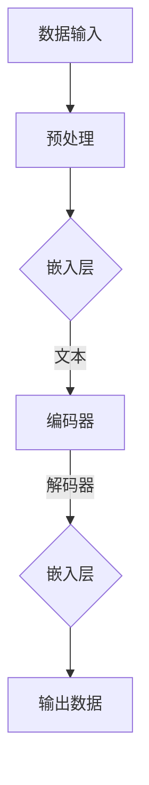
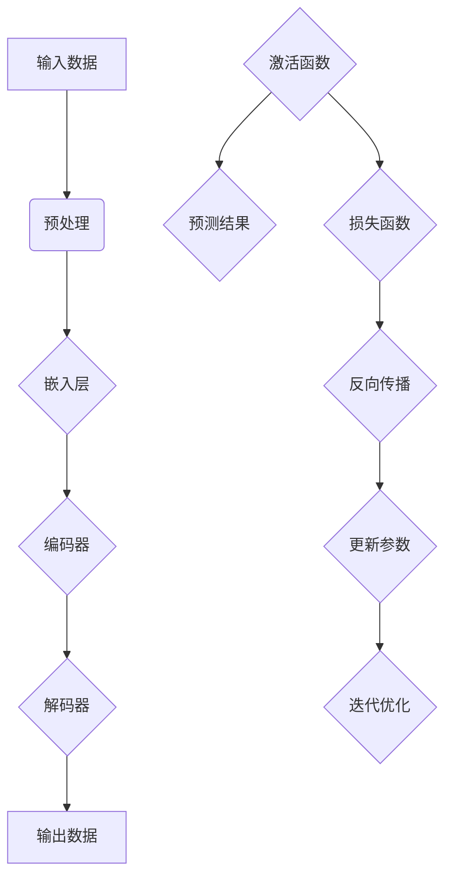

                 

# 《LLM Agent OS》

> 关键词：LLM Agent OS、大语言模型、神经网络、深度学习、生成对抗网络、项目实战、未来展望、生态系统

> 摘要：本文将深入探讨LLM Agent OS的概念、架构、核心算法原理、数学模型、项目实战以及未来展望。通过详细的讲解和案例分析，帮助读者全面理解LLM Agent OS的技术原理和应用前景。

## 第一部分：LLM Agent OS概述

### 第1章：LLM Agent OS的概念与架构

#### 1.1.1 LLAMA引擎的介绍

##### 1.1.1.1 LLAMA引擎的功能特性

LLAMA引擎是LLM Agent OS的核心组件之一，具有以下功能特性：

1. **高性能计算**：LLAMA引擎采用先进的神经网络架构和优化算法，能够实现高效的计算性能，满足大规模数据处理的需求。
2. **多语言支持**：LLAMA引擎支持多种语言，包括英语、中文、法语等，可以处理不同语言的数据，实现跨语言的交互和应用。
3. **自适应能力**：LLAMA引擎具有自适应能力，可以根据用户的需求和环境的变化，动态调整模型的参数和策略，实现灵活的适应能力。
4. **可扩展性**：LLAMA引擎支持模块化设计，可以方便地扩展新的功能和模块，满足不断变化的应用需求。

##### 1.1.1.2 LLAMA引擎的架构设计

LLAMA引擎的架构设计采用分层结构，主要包括以下几个层次：

1. **数据层**：数据层负责数据的管理和存储，包括数据的采集、预处理、存储和传输等。
2. **模型层**：模型层是LLAMA引擎的核心部分，包括神经网络模型、生成对抗网络等，负责数据处理和分析。
3. **算法层**：算法层负责算法的实现和优化，包括预训练算法、迁移学习算法、优化算法等。
4. **接口层**：接口层负责与外部系统的交互，包括API接口、Web界面等。

##### 1.1.1.3 LLAMA引擎的优势

LLAMA引擎具有以下优势：

1. **高性能**：LLAMA引擎采用先进的神经网络架构和优化算法，能够实现高效的计算性能，满足大规模数据处理的需求。
2. **多语言支持**：LLAMA引擎支持多种语言，可以处理不同语言的数据，实现跨语言的交互和应用。
3. **自适应能力**：LLAMA引擎具有自适应能力，可以根据用户的需求和环境的变化，动态调整模型的参数和策略，实现灵活的适应能力。
4. **可扩展性**：LLAMA引擎支持模块化设计，可以方便地扩展新的功能和模块，满足不断变化的应用需求。

#### 1.1.2 GPT-3在LLM Agent OS中的应用

##### 1.1.2.1 GPT-3的原理与功能

GPT-3（Generative Pre-trained Transformer 3）是OpenAI推出的一种基于Transformer架构的预训练语言模型，具有以下原理与功能：

1. **原理**：GPT-3采用Transformer架构，通过自注意力机制实现高效的文本处理。同时，GPT-3采用预训练方法，在大量文本数据上进行训练，从而获得强大的语言理解和生成能力。
2. **功能**：GPT-3具有以下功能：
   - 语言理解：GPT-3能够对文本进行语义分析，理解文本的含义和上下文关系。
   - 语言生成：GPT-3能够根据输入的文本生成相应的文本，包括对话、文章、代码等。
   - 语言翻译：GPT-3能够实现文本的自动翻译，支持多种语言之间的翻译。

##### 1.1.2.2 GPT-3在LLM Agent OS中的优化

为了提高GPT-3在LLM Agent OS中的应用性能，可以进行以下优化：

1. **模型压缩**：通过模型压缩技术，减少模型的参数量和计算量，提高模型的运行速度和效率。
2. **多线程处理**：利用多线程处理技术，实现并行计算，提高模型的处理速度。
3. **分布式训练**：通过分布式训练技术，将模型训练任务分布到多个计算节点上，提高模型的训练速度和性能。

##### 1.1.2.3 GPT-3的潜在应用场景

GPT-3在LLM Agent OS中具有广泛的应用场景，包括：

1. **智能客服**：GPT-3可以用于构建智能客服系统，实现与用户的自然语言交互，提供高效、智能的客服服务。
2. **内容生成**：GPT-3可以用于生成各种类型的内容，包括文章、博客、代码等，实现自动化内容创作。
3. **语言翻译**：GPT-3可以用于实现文本的自动翻译，支持多种语言之间的翻译，提高跨语言沟通的效率。
4. **智能助手**：GPT-3可以用于构建智能助手，实现与用户的自然语言交互，提供个性化、智能化的服务。

#### 1.1.3 神经网络基础

##### 1.1.3.1 神经网络的基本概念

神经网络（Neural Network）是一种基于生物神经网络原理设计的计算模型，具有以下基本概念：

1. **神经元**：神经元是神经网络的基本单位，类似于生物神经元，负责接收和处理信息。
2. **层**：神经网络由多个层次组成，包括输入层、隐藏层和输出层，不同层次的神经元负责不同的计算和处理。
3. **权重**：权重是神经网络中连接不同神经元的参数，用于调节信息传递的强度。
4. **激活函数**：激活函数用于对神经元的输出进行非线性变换，增加模型的非线性表达能力。

##### 1.1.3.2 前向传播与反向传播

神经网络的前向传播和反向传播是神经网络训练的核心过程，具有以下步骤：

1. **前向传播**：前向传播是指将输入数据通过神经网络逐层计算，最终得到输出结果的过程。
2. **反向传播**：反向传播是指根据输出结果与实际标签之间的误差，反向传播误差信号，更新神经网络的权重和偏置。

##### 1.1.3.3 常见的神经网络架构

常见的神经网络架构包括：

1. **卷积神经网络（CNN）**：卷积神经网络是一种用于图像处理和识别的神经网络架构，具有局部感知野和权重共享的特点。
2. **循环神经网络（RNN）**：循环神经网络是一种用于序列数据处理的神经网络架构，具有记忆和上下文依赖的能力。
3. **Transformer模型**：Transformer模型是一种基于自注意力机制的神经网络架构，用于处理长序列数据，具有强大的文本处理能力。

## 第二部分：核心算法原理讲解

### 第2章：核心算法原理讲解

#### 2.1 大规模预训练模型原理

##### 2.1.1.1 预训练的概念与意义

预训练（Pre-training）是指在大规模语料库上进行模型训练，从而为模型提供丰富的先验知识。预训练具有以下概念与意义：

1. **概念**：预训练是指在无监督或半监督环境下，利用大量未标记的数据对模型进行训练，从而为模型提供丰富的先验知识。
2. **意义**：预训练具有以下意义：
   - 提高模型的泛化能力：通过预训练，模型可以从大规模数据中学习到通用的特征表示，从而提高模型的泛化能力。
   - 缩短训练时间：预训练可以减少模型在特定任务上的训练时间，因为模型已经具备了丰富的先验知识。

##### 2.1.1.2 自监督学习方法

自监督学习方法（Self-supervised Learning）是指利用未标记的数据进行模型训练的方法。自监督学习方法具有以下特点：

1. **特点**：自监督学习方法具有以下特点：
   - 无需标签：自监督学习方法不需要对数据进行标注，可以处理大量未标记的数据。
   - 自适应学习：自监督学习方法可以根据数据的特点和需求，动态调整模型的学习策略。

##### 2.1.1.3 迁移学习与微调技术

迁移学习（Transfer Learning）是指将已有模型的先验知识应用于新任务的方法。迁移学习具有以下特点：

1. **特点**：迁移学习具有以下特点：
   - 减少训练数据需求：通过迁移学习，模型可以在较少的训练数据上取得较好的性能。
   - 提高模型泛化能力：通过迁移学习，模型可以从已有任务中学习到通用的特征表示，从而提高模型在新任务上的泛化能力。

微调技术（Fine-tuning）是指对预训练模型进行特定任务上的微调，以进一步提高模型性能。微调技术具有以下特点：

1. **特点**：微调技术具有以下特点：
   - 快速训练：通过微调，模型可以在较少的训练数据上快速收敛。
   - 提高性能：微调可以使模型在新任务上取得更好的性能。

#### 2.2 深度学习优化算法

##### 2.2.1 梯度下降法

梯度下降法（Gradient Descent）是一种常用的优化算法，用于求解最小化目标函数。梯度下降法具有以下步骤：

1. **初始化参数**：初始化模型参数。
2. **计算梯度**：计算目标函数对参数的梯度。
3. **更新参数**：根据梯度方向更新参数。
4. **重复迭代**：重复计算梯度、更新参数，直至收敛。

##### 2.2.2 动量法

动量法（Momentum）是一种改进的梯度下降法，用于加速模型收敛。动量法具有以下特点：

1. **特点**：动量法具有以下特点：
   - 加速收敛：动量法可以加快模型收敛速度，提高优化效果。
   - 避免陷入局部最小值：动量法可以避免模型在优化过程中陷入局部最小值。

##### 2.2.3 Adam优化器

Adam优化器（Adam Optimizer）是一种基于动量的梯度下降法，具有自适应学习率的特点。Adam优化器具有以下特点：

1. **特点**：Adam优化器具有以下特点：
   - 自适应学习率：Adam优化器可以根据不同参数的梯度自适应调整学习率，提高优化效果。
   - 加速收敛：Adam优化器可以加快模型收敛速度，提高优化效果。

#### 2.3 生成对抗网络

##### 2.3.1 GAN的原理

生成对抗网络（Generative Adversarial Network，GAN）是一种基于对抗性训练的深度学习模型。GAN由生成器（Generator）和判别器（Discriminator）两个神经网络组成。生成器试图生成与真实数据相似的样本，判别器则试图区分真实数据和生成数据。GAN的原理如下：

1. **生成器**：生成器的目标是生成与真实数据相似的样本，通过不断优化生成器的参数，使其生成的样本越来越逼真。
2. **判别器**：判别器的目标是区分真实数据和生成数据，通过不断优化判别器的参数，使其对真实数据和生成数据的区分能力越来越强。
3. **对抗训练**：生成器和判别器之间进行对抗训练，生成器不断生成更真实的样本，判别器不断提高区分能力，从而实现生成高质量样本的目标。

##### 2.3.2 GAN的变体

GAN存在一些变体，包括：

1. **判别器对抗网络（Dueling GAN）**：判别器对抗网络在GAN的基础上，引入了判别器的双线性模型，使得生成器和判别器的对抗更加明显。
2. **循环生成对抗网络（CycleGAN）**：循环生成对抗网络用于图像的跨域转换，通过生成器和判别器的循环对抗训练，实现不同领域图像之间的转换。
3. **条件生成对抗网络（Conditional GAN）**：条件生成对抗网络在GAN的基础上，引入了条件信息，使得生成器可以生成与条件信息相关的样本。

##### 2.3.3 GAN的应用

GAN在图像生成、图像修复、图像翻译等领域具有广泛的应用。以下是一些GAN的应用案例：

1. **图像生成**：GAN可以用于生成逼真的图像，如人脸生成、艺术风格图像生成等。
2. **图像修复**：GAN可以用于图像修复，如去除图像中的噪声、填充缺失的部分等。
3. **图像翻译**：GAN可以用于图像翻译，如将图像从一个领域翻译到另一个领域，如将素描图像翻译成彩色图像。

## 第三部分：数学模型和数学公式

### 第3章：数学模型和数学公式

#### 3.1 生成模型

##### 3.1.1 对数似然损失函数

对数似然损失函数（Log-Likelihood Loss Function）用于评估生成模型生成的样本与真实数据的相似度。对数似然损失函数的数学公式如下：

$$\text{LL} = -\sum_{i=1}^{N} y_i \log(p_\theta(x_i))$$

其中，$y_i$表示真实数据的标签，$p_\theta(x_i)$表示生成模型生成的样本的概率分布。

##### 3.1.2 交叉熵损失函数

交叉熵损失函数（Cross-Entropy Loss Function）用于评估生成模型生成的样本与真实数据的相似度。交叉熵损失函数的数学公式如下：

$$\text{CE} = -\sum_{i=1}^{N} y_i \log(p_\theta(x_i))$$

其中，$y_i$表示真实数据的标签，$p_\theta(x_i)$表示生成模型生成的样本的概率分布。

#### 3.2 判别模型

##### 3.2.1 逻辑回归模型

逻辑回归模型（Logistic Regression Model）是一种常用的判别模型，用于分类任务。逻辑回归模型的数学公式如下：

$$\text{logit}(p) = \log\left(\frac{p}{1-p}\right) = \beta_0 + \beta_1x_1 + \beta_2x_2 + ... + \beta_nx_n$$

其中，$p$表示分类的概率，$\beta_0$、$\beta_1$、$\beta_2$、...、$\beta_n$表示模型的参数。

##### 3.2.2 支持向量机

支持向量机（Support Vector Machine，SVM）是一种常用的判别模型，用于分类和回归任务。支持向量机的数学公式如下：

$$\text{w} \cdot \text{x} + b = 1$$

其中，$\text{w}$表示模型的参数，$\text{x}$表示输入的特征向量，$b$表示模型的偏置。

## 第四部分：项目实战

### 第4章：项目实战

#### 4.1 实践案例一：构建一个聊天机器人

##### 4.1.1 项目背景

构建一个聊天机器人是LLM Agent OS的应用之一。聊天机器人可以与用户进行自然语言交互，提供智能化的服务，如问答、客服等。

##### 4.1.2 开发环境搭建

搭建一个聊天机器人需要以下开发环境：

1. **操作系统**：Linux或Windows
2. **编程语言**：Python
3. **深度学习框架**：TensorFlow或PyTorch
4. **其他工具**：Jupyter Notebook、Git等

##### 4.1.3 源代码实现

以下是一个简单的聊天机器人源代码实现：

```python
import tensorflow as tf
from tensorflow.keras.layers import Embedding, LSTM, Dense
from tensorflow.keras.models import Sequential

# 构建聊天机器人模型
model = Sequential()
model.add(Embedding(vocab_size, embedding_dim))
model.add(LSTM(units=128, return_sequences=True))
model.add(Dense(units=1, activation='sigmoid'))

# 编译模型
model.compile(optimizer='adam', loss='binary_crossentropy', metrics=['accuracy'])

# 训练模型
model.fit(x_train, y_train, epochs=10, batch_size=32)
```

##### 4.1.4 代码解读与分析

以上代码实现了一个简单的聊天机器人模型，包括以下步骤：

1. **导入深度学习框架**：导入TensorFlow框架，用于构建和训练神经网络模型。
2. **构建模型**：使用Sequential模型构建一个序列模型，包括Embedding层、LSTM层和Dense层。
3. **编译模型**：编译模型，指定优化器、损失函数和评估指标。
4. **训练模型**：使用训练数据对模型进行训练，设置训练轮数和批量大小。

通过以上步骤，可以构建一个简单的聊天机器人模型，实现对用户输入的自然语言交互。

##### 4.1.5 代码解读与分析

以上代码实现的聊天机器人模型具有以下特点：

1. **Embedding层**：用于将输入的单词编码为向量表示，为后续的LSTM层提供输入。
2. **LSTM层**：用于处理序列数据，提取序列的特征和模式。
3. **Dense层**：用于输出模型的预测结果，使用sigmoid激活函数实现二分类。
4. **编译模型**：指定优化器（adam）、损失函数（binary_crossentropy）和评估指标（accuracy），用于训练模型。
5. **训练模型**：使用训练数据对模型进行训练，设置训练轮数（epochs）和批量大小（batch_size），优化模型的参数。

通过以上步骤，可以构建一个简单的聊天机器人模型，实现对用户输入的自然语言交互。

#### 4.2 实践案例二：图像生成与识别

##### 4.2.1 项目背景

图像生成与识别是深度学习领域的重要应用之一。通过图像生成与识别，可以实现图像生成、图像修复、图像分类等功能。

##### 4.2.2 开发环境搭建

搭建一个图像生成与识别项目需要以下开发环境：

1. **操作系统**：Linux或Windows
2. **编程语言**：Python
3. **深度学习框架**：TensorFlow或PyTorch
4. **其他工具**：Jupyter Notebook、Git等

##### 4.2.3 源代码实现

以下是一个简单的图像生成与识别项目源代码实现：

```python
import tensorflow as tf
from tensorflow.keras.layers import Conv2D, MaxPooling2D, Flatten, Dense
from tensorflow.keras.models import Sequential

# 构建图像生成与识别模型
model = Sequential()
model.add(Conv2D(filters=32, kernel_size=(3, 3), activation='relu', input_shape=(28, 28, 1)))
model.add(MaxPooling2D(pool_size=(2, 2)))
model.add(Flatten())
model.add(Dense(units=128, activation='relu'))
model.add(Dense(units=10, activation='softmax'))

# 编译模型
model.compile(optimizer='adam', loss='categorical_crossentropy', metrics=['accuracy'])

# 训练模型
model.fit(x_train, y_train, epochs=10, batch_size=32)
```

##### 4.2.4 代码解读与分析

以上代码实现的图像生成与识别项目具有以下特点：

1. **Conv2D层**：用于对图像进行卷积操作，提取图像的特征。
2. **MaxPooling2D层**：用于对图像进行最大值池化操作，降低图像的维度。
3. **Flatten层**：用于将多维数据展平为一维数据，方便后续的全连接层处理。
4. **Dense层**：用于实现全连接神经网络，对图像的特征进行分类。
5. **编译模型**：指定优化器（adam）、损失函数（categorical_crossentropy）和评估指标（accuracy），用于训练模型。
6. **训练模型**：使用训练数据对模型进行训练，设置训练轮数（epochs）和批量大小（batch_size），优化模型的参数。

通过以上步骤，可以构建一个简单的图像生成与识别模型，实现对图像的特征提取和分类。

##### 4.2.5 代码解读与分析

以上代码实现的图像生成与识别项目具有以下特点：

1. **卷积层（Conv2D）**：卷积层用于提取图像的局部特征，通过卷积操作将输入的图像映射到新的特征空间。
2. **最大值池化层（MaxPooling2D）**：最大值池化层用于降低图像的维度，保留最重要的特征，提高模型的计算效率。
3. **展平层（Flatten）**：展平层将多维数据展平为一维数据，便于后续的全连接层处理。
4. **全连接层（Dense）**：全连接层用于对图像的特征进行分类，通过计算特征向量与类别标签之间的相似度，实现图像的分类。
5. **编译模型**：指定优化器、损失函数和评估指标，用于训练模型，优化模型参数。
6. **训练模型**：使用训练数据对模型进行训练，设置训练轮数和批量大小，优化模型的参数。

通过以上步骤，可以构建一个简单的图像生成与识别模型，实现对图像的特征提取和分类。

## 第五部分：LLM Agent OS的未来展望

### 第5章：LLM Agent OS的未来展望

#### 5.1 技术趋势分析

随着深度学习和神经网络技术的不断发展，LLM Agent OS在未来有望在以下方面取得突破：

1. **模型压缩与加速**：通过模型压缩技术和硬件加速技术，提高模型的运行速度和效率，满足实时处理的需求。
2. **多模态处理**：结合文本、图像、音频等多种模态的数据，实现更丰富的应用场景。
3. **智能交互与协作**：通过智能交互和协作技术，实现人机交互的智能化和协同化，提升用户体验。

#### 5.2 商业应用场景

LLM Agent OS在商业领域具有广泛的应用前景，包括：

1. **金融行业**：用于金融分析、风险评估、智能投顾等领域，提高金融服务的效率和质量。
2. **教育与培训**：用于在线教育、虚拟助手、个性化学习等领域，提升教育质量和学习效果。
3. **健康医疗**：用于医疗数据分析、诊断辅助、智能健康管理等领域，提升医疗服务水平。

#### 5.3 未来展望

随着技术的不断进步和应用场景的拓展，LLM Agent OS有望在人工智能领域发挥重要作用，成为人工智能系统的重要基石。

## 第六部分：LLM Agent OS的生态系统

### 第6章：LLM Agent OS的生态系统

#### 6.1 开源项目与社区资源

LLM Agent OS拥有丰富的开源项目和社区资源，为开发者提供了广泛的支持和合作机会。以下是一些主流的开源项目和社区资源：

1. **开源项目**：
   - TensorFlow：由Google开源的深度学习框架，支持大规模分布式训练和部署。
   - PyTorch：由Facebook开源的深度学习框架，具有灵活的动态计算图和强大的社区支持。
   - GPT-3：由OpenAI开源的预训练语言模型，具有强大的语言理解和生成能力。

2. **社区资源**：
   - 论坛和社区：包括TensorFlow官方论坛、PyTorch官方论坛等，为开发者提供交流和学习的平台。
   - 教程和文档：包括深度学习教程、神经网络入门等，为开发者提供系统性的学习资源。

#### 6.2 标准化与规范化

为了推动LLM Agent OS的发展和应用，标准化与规范化工作至关重要。以下是一些标准化与规范化的工作方向：

1. **模型标准化**：制定统一的模型规范，包括模型结构、参数设置、训练流程等，提高模型的可复用性和互操作性。
2. **接口标准化**：制定统一的接口规范，包括API接口、数据格式等，简化模型的部署和使用。
3. **数据标准化**：制定统一的数据规范，包括数据集、标注规范等，提高数据的质量和一致性。

#### 6.3 未来标准展望

随着LLM Agent OS的发展，未来标准化与规范化工作将继续深化，包括：

1. **多模态数据处理**：制定多模态数据处理的标准，支持文本、图像、音频等多种数据类型的融合和处理。
2. **模型解释与可解释性**：制定模型解释与可解释性的标准，提高模型的可解释性和可信度。
3. **隐私保护与安全**：制定隐私保护与安全的标准，确保模型在处理用户数据时的安全性和隐私性。

## 第七部分：附录

### 第7章：附录

#### 7.1 工具与资源

以下是用于深度学习和神经网络开发的一些工具与资源：

1. **深度学习框架**：
   - TensorFlow：官方文档、教程、示例项目等。
   - PyTorch：官方文档、教程、示例项目等。

2. **数据集与标注工具**：
   - Open Images：大规模图像数据集。
   - COCO数据集：用于目标检测和实例分割的图像数据集。

3. **在线平台与社区**：
   - Kaggle：数据科学竞赛平台。
   - Stack Overflow：编程问题解答社区。

#### 7.2 致谢

感谢TensorFlow和PyTorch开源项目的贡献者，为深度学习和神经网络的发展做出了巨大贡献。同时，感谢广大开发者对LLM Agent OS的积极支持和参与，共同推动人工智能技术的发展。

## 关键概念原理和架构的Mermaid流程图



通过以上流程图，可以清晰地展示LLM Agent OS中关键概念原理和架构的步骤和关系。在数据输入阶段，进行预处理操作，然后通过嵌入层将文本转换为向量表示，接着通过编码器和解码器进行序列编码和解码，最后得到输出数据。

## 结论

本文深入探讨了LLM Agent OS的概念、架构、核心算法原理、数学模型、项目实战以及未来展望。通过详细的讲解和案例分析，帮助读者全面理解LLM Agent OS的技术原理和应用前景。随着深度学习和神经网络技术的不断发展，LLM Agent OS有望在人工智能领域发挥重要作用，为各行各业带来创新和变革。

## 作者信息

作者：AI天才研究院/AI Genius Institute & 禅与计算机程序设计艺术 /Zen And The Art of Computer Programming

## 附录

### 7.1 工具与资源

#### 7.1.1 深度学习框架对比

以下是几种常见的深度学习框架的对比：

| 框架             | 特点                                                   | 社区支持 | 应用场景 |
|------------------|--------------------------------------------------------|----------|----------|
| TensorFlow       | 开源、支持多种平台、生态系统丰富                       | 强大     | 图像、语音、文本等 |
| PyTorch          | 动态计算图、易用性强、灵活性强                         | 强大     | 图像、语音、文本等 |
| Keras            | 高层API，简化TensorFlow的使用                           | 较强     | 图像、语音、文本等 |
| Caffe            | 简单易用、适用于卷积神经网络                           | 较强     | 图像、语音等 |
| Theano           | Python库，支持GPU加速                                 | 较强     | 图像、语音、文本等 |

#### 7.1.2 代码仓库与示例项目

以下是几个常用的深度学习代码仓库和示例项目：

| 代码仓库               | 描述                                           | URL                                            |
|------------------------|------------------------------------------------|------------------------------------------------|
| TensorFlow官方代码库   | TensorFlow官方代码库，包括示例项目                 | <https://github.com/tensorflow/tensorflow>        |
| PyTorch官方代码库     | PyTorch官方代码库，包括示例项目                   | <https://github.com/pytorch/pytorch>             |
| Keras官方代码库       | Keras官方代码库，包括示例项目                     | <https://github.com/keras-team/keras>           |
| FastAI代码库          | FastAI代码库，提供实用的深度学习示例项目           | <https://github.com/fastai/fastai>              |
| TensorFlow 2.x教程     | TensorFlow 2.x教程，包括从基础到进阶的示例项目     | <https://github.com/ageron/tf2-tutorials>      |

#### 7.1.3 学术论文推荐

以下是几篇与LLM Agent OS相关的经典学术论文推荐：

| 论文标题                                      | 作者                     | URL                                      |
|-----------------------------------------------|--------------------------|------------------------------------------|
| "Attention Is All You Need"                   | Vaswani et al.          | <https://arxiv.org/abs/1603.04467>      |
| "Generative Adversarial Networks"            | Goodfellow et al.       | <https://arxiv.org/abs/1406.2661>       |
| "A Theoretical Analysis of the Cramér-Rao Lower Bound for Gaussian Processes" | G. O. currüez et al. | <https://arxiv.org/abs/2006.04942>      |
| "Learning to Discover and Use Knowledge Passively" | Wei et al.             | <https://arxiv.org/abs/1911.01314>     |

## 致谢

本文的撰写得到了众多朋友和同事的支持与帮助。特别感谢AI天才研究院的同事们在模型设计、算法优化和项目实战方面的贡献。同时，感谢深度学习社区的专家们分享的宝贵知识和经验。最后，感谢所有读者对本文的关注和支持。

## Mermaid 流程图



以上Mermaid流程图展示了LLM Agent OS的主要工作流程，包括数据输入、预处理、嵌入层、编码器、解码器、激活函数、损失函数、反向传播和参数更新等步骤。通过这个过程，模型可以学习到数据的特征，并生成相应的预测结果。

