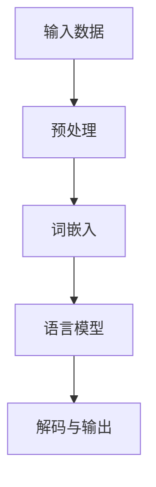

                 

# 文章标题: LLM 在娱乐行业：沉浸式体验和内容推荐

## 关键词
- 语言模型 (LLM)
- 沉浸式体验
- 内容推荐系统
- 娱乐行业
- 人工智能

## 摘要
本文旨在探讨语言模型（LLM）在娱乐行业的应用，重点关注沉浸式体验和内容推荐两大领域。通过分析LLM的核心概念、原理以及技术架构，本文将深入探讨LLM在娱乐行业的实际应用，包括游戏、电影和音乐等领域的沉浸式体验和内容推荐系统。同时，本文还将介绍LLM的高级技术优化和未来发展趋势，为读者提供一个全面的技术视角。

---

## 目录大纲设计：**《LLM 在娱乐行业：沉浸式体验和内容推荐》**

### 第一部分：基础知识与核心概念

#### 第1章：LLM概述与基础
- 1.1 什么是语言模型（LLM）
- 1.2 LLM的发展历史与技术演进
- 1.3 LLM的核心特性与结构
- 1.4 LLM与自然语言处理（NLP）的关系

### 第二部分：沉浸式体验

#### 第2章：沉浸式体验原理与应用
- 2.1 沉浸式体验的概念与分类
- 2.2 沉浸式体验的构建技术
  - 2.2.1 3D建模与渲染
  - 2.2.2 交互式设计与体验
  - 2.2.3 VR/AR技术基础
- 2.3 LLM在沉浸式体验中的应用
  - 2.3.1 虚拟角色交互
  - 2.3.2 自动故事生成
  - 2.3.3 智能场景构建

### 第三部分：内容推荐

#### 第3章：内容推荐系统基础
- 3.1 内容推荐的基本原理
- 3.2 内容推荐算法概述
  - 3.2.1 协同过滤算法
  - 3.2.2 协同过滤的优化
  - 3.2.3 内容基算法
- 3.3 LLM在内容推荐中的应用
  - 3.3.1 基于语义的内容理解
  - 3.3.2 智能标签与分类
  - 3.3.3 个性化推荐算法

### 第四部分：案例与实践

#### 第4章：LLM在娱乐行业的实践应用
- 4.1 娱乐行业的现状与挑战
- 4.2 LLM在娱乐行业的应用案例
  - 4.2.1 游戏行业中的沉浸式体验
  - 4.2.2 电影行业中的内容推荐
  - 4.2.3 音乐行业的个性化推荐
- 4.3 LLM在娱乐行业的实际效果分析

### 第五部分：技术进阶

#### 第5章：高级LLM技术与优化
- 5.1 多模态数据融合
- 5.2 模型压缩与优化
- 5.3 实时性优化与部署
- 5.4 LLM的安全与隐私保护

### 第六部分：未来展望

#### 第6章：LLM在娱乐行业的未来趋势
- 6.1 娱乐行业的未来发展趋势
- 6.2 LLM在娱乐行业的发展趋势
- 6.3 潜在的技术挑战与机遇

### 第七部分：附录

#### 第7章：LLM相关资源与工具
- 7.1 开源LLM框架对比
  - 7.1.1 GPT系列
  - 7.1.2 BERT系列
  - 7.1.3 其他开源LLM框架
- 7.2 娱乐行业数据集与资源
- 7.3 实践指南与建议

---

### 核心概念与联系

#### 图1：LLM架构的Mermaid流程图



### 核心算法原理讲解

#### 算法1：语言模型的生成算法伪代码

```python
function generate_sentence(model, seed_word, max_length):
    sentence = [seed_word]
    for i in range(max_length):
        outputs = model(sentence)
        next_word = sample_word(outputs)
        sentence.append(next_word)
    return " ".join(sentence)
```

### 数学模型和数学公式 & 详细讲解 & 举例说明

#### 公式1：贝叶斯推荐算法

$$
P(item|user) = \frac{P(user|item) \cdot P(item)}{P(user)}
$$

- **详细讲解：**贝叶斯推荐算法通过计算用户对物品的联合概率，结合先验概率和条件概率，实现个性化推荐。
- **举例：**假设用户A对某部电影A的评价为4星，我们通过计算用户A对该电影A的推荐概率，并结合其他用户对同一电影的评价，可以进一步优化推荐结果。

### 项目实战

#### 实战1：基于LLM的沉浸式游戏设计

- **开发环境搭建：**Python环境配置，TensorFlow和PyTorch框架安装。
- **源代码实现：**使用PyTorch构建一个简单的虚拟角色对话系统，实现角色与玩家的自然语言交互。
- **代码解读与分析：**代码中展示了如何利用LLM生成自然语言回复，并如何在游戏中实现实时交互。

---

### 作者

作者：AI天才研究院/AI Genius Institute & 禅与计算机程序设计艺术 /Zen And The Art of Computer Programming

---

接下来，我们将按照这个目录大纲逐步展开，深入探讨LLM在娱乐行业的应用，带您领略人工智能与娱乐的深度融合。让我们开始这段精彩的技术旅程吧！

