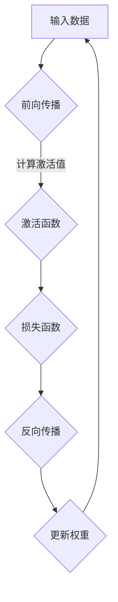

                 

# LLM 对社会的潜在影响：积极和负面效应

> 关键词：大规模语言模型，社会影响，积极效应，负面效应，伦理问题，安全挑战

> 摘要：本文探讨了大规模语言模型（LLM）在社会中的潜在影响，包括其积极和负面效应。文章首先介绍了LLM的核心概念和技术基础，然后深入分析了LLM在教育、医疗、工业等领域的应用价值。随后，文章探讨了LLM可能带来的隐私风险、伦理问题、安全与滥用问题，并提出了相应的解决方案。最后，文章总结了LLM的发展趋势与未来展望，为读者提供了全面而深入的视角。

## 引言与核心概念

### 第1章 引言

#### 1.1 书籍目的与结构

**书籍目的：** 本文旨在深入探讨大规模语言模型（LLM）对社会产生的广泛而深远的影响，通过逐步分析其技术基础、应用场景、积极效应和潜在负面效应，为读者提供一个全面而客观的视角。随着人工智能技术的不断进步，LLM已经成为现代科技领域的一个重要组成部分，其应用范围广泛，影响力巨大。本文希望通过系统地分析LLM的技术本质及其在不同领域的应用，帮助读者更好地理解这一技术对社会各方面的潜在影响。

**书籍结构概述：** 本文分为四个主要部分。第一部分介绍了LLM的核心概念和技术基础，包括深度学习、自然语言处理以及LLM的预训练与微调等内容。第二部分重点讨论了LLM在社会中的应用场景与价值，包括文本生成、数据处理、教育、医疗、工业等多个领域。第三部分则深入分析了LLM可能带来的隐私风险、伦理问题、安全与滥用问题，并提出了相应的解决方案。第四部分是对LLM发展的总结与展望，讨论了其未来研究方向、面临的挑战以及发展策略。

#### 1.2 人工智能与语言模型概述

##### 1.2.1 人工智能的兴起

人工智能（AI）是指计算机系统通过模拟人类智能行为，实现感知、思考、学习和决策的能力。人工智能的起源可以追溯到20世纪50年代，当时计算机科学家开始探索如何让机器具备类似人类的智能。随着计算能力的提升和算法的发展，人工智能逐渐从理论走向应用，并在多个领域取得了显著成果。尤其是在深度学习技术的推动下，人工智能取得了前所未有的突破，为现代科技的发展注入了新的动力。

##### 1.2.2 语言模型的基本原理

语言模型是一种用于预测文本序列的统计模型，其目标是根据已知的文本数据生成可能的后续文本。基本原理包括概率模型和生成模型两种。概率模型通过计算给定前文序列下某个单词或句子的概率来生成文本，例如N-gram模型。生成模型则通过建模文本生成的概率分布来生成文本，如循环神经网络（RNN）和变分自编码器（VAE）等。

##### 1.2.3 大规模语言模型（LLM）的特点与发展

大规模语言模型（LLM）是指参数规模庞大、能够处理和理解复杂语言结构的语言模型。与传统的语言模型相比，LLM具有以下特点：

1. **参数规模大：** LLM通常拥有数亿甚至数十亿的参数，这使得它们能够更好地捕捉语言的复杂性和多样性。
2. **泛化能力强：** 通过大规模预训练，LLM能够在各种不同的任务和应用场景中表现出优异的性能。
3. **理解深度：** LLM不仅能够生成文本，还能够理解文本中的含义和逻辑关系，为许多复杂任务提供了强大的支持。

LLM的发展历程可以追溯到2018年，当时谷歌发布了BERT模型，标志着LLM的崛起。此后，GPT系列、T5、GPT-Neo等一系列高性能LLM相继问世，推动了自然语言处理领域的飞速发展。LLM的成功不仅依赖于深度学习技术的进步，也得益于大规模数据集和计算资源的支持。

### 第2章 大规模语言模型（LLM）的技术基础

#### 第2章 大规模语言模型（LLM）的技术基础

##### 2.1 深度学习基础

##### 2.1.1 深度学习的发展

深度学习是人工智能的一个重要分支，起源于20世纪40年代，但直到21世纪初才逐渐崭露头角。深度学习的发展历程可以分为以下几个阶段：

1. **人工神经网络（ANN）的兴起：** 20世纪80年代，人工神经网络的研究取得了初步成果，但由于计算能力和算法的限制，其应用范围有限。
2. **计算能力的提升：** 随着计算机硬件的发展，特别是GPU和TPU的普及，深度学习算法得以在高性能计算环境中运行，大幅提升了模型的训练效率。
3. **大数据和大数据集：** 互联网的普及和数据存储技术的发展，为深度学习提供了丰富的数据资源，使得大规模训练成为可能。
4. **算法的进步：** 卷积神经网络（CNN）、循环神经网络（RNN）和自注意力机制等算法的创新，使得深度学习在图像、语音和自然语言处理等领域取得了突破性进展。

##### 2.1.2 神经网络的基本原理

神经网络是一种模拟人脑结构和功能的计算模型，由大量相互连接的神经元组成。每个神经元接收来自其他神经元的输入信号，通过加权求和处理后产生输出信号，从而实现数据的输入、处理和输出。

1. **神经元模型：** 神经元是神经网络的基本单元，通常包括输入层、加权求和处理层和输出层。
2. **激活函数：** 激活函数用于引入非线性特性，常见的激活函数包括sigmoid、ReLU和Tanh等。
3. **前向传播与反向传播：** 在前向传播过程中，输入信号从输入层传递到输出层；在反向传播过程中，通过计算梯度来更新网络权重，实现模型的训练和优化。

##### 2.1.3 深度学习的主要算法

深度学习算法是构建深度神经网络的核心，主要包括以下几种：

1. **卷积神经网络（CNN）：** CNN是一种用于图像识别和处理的深度学习模型，通过卷积层、池化层和全连接层实现特征提取和分类。
2. **循环神经网络（RNN）：** RNN是一种用于序列数据处理的深度学习模型，通过循环连接实现长期依赖信息的捕捉。
3. **长短期记忆网络（LSTM）：** LSTM是RNN的一种变体，通过引入门控机制，解决了RNN的梯度消失和梯度爆炸问题。
4. **自注意力机制：** 自注意力机制通过计算序列中每个元素之间的相互关系，实现了对输入序列的动态建模。

##### 2.2 自然语言处理技术

##### 2.2.1 词嵌入

词嵌入是一种将词汇映射到高维连续空间的技巧，通过捕捉词汇之间的语义和句法关系，实现文本数据的向量化表示。常见的词嵌入方法包括：

1. **基于分布式假设的词嵌入：** 基于分布式假设的词嵌入方法认为，相似的词汇在语义空间中更接近，例如Word2Vec。
2. **基于上下文的词嵌入：** 基于上下文的词嵌入方法通过考虑词汇在不同上下文中的表现，捕捉词汇的动态特征，例如BERT。

##### 2.2.2 序列模型与注意力机制

序列模型是一种用于处理序列数据的深度学习模型，常见的方法包括循环神经网络（RNN）和其变体长短期记忆网络（LSTM）。序列模型通过捕捉序列中元素的时间依赖关系，实现文本的理解和生成。

注意力机制是一种在深度学习模型中引入的机制，用于动态地聚焦于序列中的关键信息。注意力机制的应用包括：

1. **基于注意力机制的序列模型：** 例如Transformer模型，通过自注意力机制实现文本的建模和生成。
2. **多任务学习中的注意力机制：** 在多任务学习中，注意力机制用于平衡不同任务的重要性，提高模型的性能。

##### 2.2.3 转换器架构

转换器（Transformer）架构是一种基于自注意力机制的深度学习模型，广泛应用于自然语言处理任务。转换器模型的主要组成部分包括：

1. **编码器（Encoder）：** 编码器用于对输入文本序列进行编码，生成序列的上下文表示。
2. **解码器（Decoder）：** 解码器用于对编码器的输出进行解码，生成输出文本序列。

转换器模型在机器翻译、文本生成等任务中取得了显著的性能提升，其核心优势在于并行计算能力和长距离依赖捕捉能力。

##### 2.3 LLM的预训练与微调

##### 2.3.1 预训练的基本概念

预训练是一种在特定任务之前对模型进行大规模训练的方法，旨在使模型具备一定的泛化能力。预训练的基本步骤包括：

1. **数据收集与预处理：** 收集大规模的文本数据，并进行预处理，例如分词、去停用词等。
2. **预训练任务：** 在预训练阶段，模型通常参与多个预训练任务，例如语言模型、命名实体识别等，以增强模型的泛化能力。
3. **模型优化：** 通过反向传播和梯度下降等优化算法，更新模型参数，实现预训练任务的优化。

##### 2.3.2 自监督学习

自监督学习是一种无需人工标注的数据处理方法，通过利用未标注的数据，使模型自动学习数据的分布和特征。在LLM的预训练过程中，自监督学习发挥了重要作用，常见的方法包括：

1. **Masked Language Model（MLM）：** 在预训练阶段，随机遮盖文本中的部分词语，模型需要预测这些遮盖的词语。
2. **Recurrent Language Model（RLM）：** 通过对输入文本进行递归编码，模型预测文本的后续部分。
3. **Contrastive Language Model（CLM）：** 通过比较文本的相似度和差异度，模型学习文本的语义表示。

##### 2.3.3 迁移学习与微调

迁移学习是一种利用已在大规模数据集上训练好的模型，在新任务上快速适应和优化的方法。在LLM的应用中，迁移学习和微调发挥了重要作用：

1. **预训练模型：** 在预训练阶段，模型在大规模文本数据上进行了充分的训练，积累了丰富的语言知识。
2. **微调过程：** 在实际应用中，预训练模型通常参与微调过程，通过在特定任务数据上训练，进一步优化模型的性能。
3. **数据适应性：** 微调过程中，模型需要适应特定任务的数据分布和特征，以实现最佳性能。

### 第二部分: LLM在社会中的应用

#### 第3章: LLM的应用场景与价值

##### 3.1 文本生成与应用

文本生成是LLM最引人注目的应用之一，涵盖自动写作、聊天机器人、机器翻译等多个领域。

##### 3.1.1 自动写作

自动写作是指使用LLM生成高质量的文章、报告、新闻等内容。LLM通过学习大量的文本数据，能够自动生成符合语法和语义规则的文本。自动写作的应用场景包括：

1. **新闻报道：** 在新闻行业，LLM可以自动生成新闻稿，提高新闻发布的速度和效率。
2. **博客写作：** 在个人博客或企业网站，LLM可以辅助用户生成高质量的博客文章，节省时间和精力。
3. **内容创作：** 在广告、营销等领域，LLM可以生成创意广告文案和营销素材，提高营销效果。

##### 3.1.2 聊天机器人

聊天机器人是一种能够与用户进行自然语言交互的智能系统。LLM在聊天机器人的构建中发挥着关键作用，通过自然语言处理技术，实现人机对话的流畅性和准确性。聊天机器人的应用场景包括：

1. **客户服务：** 在企业客服领域，聊天机器人可以自动回答用户的问题，提供即时服务，提高客户满意度。
2. **社交媒体：** 在社交媒体平台，聊天机器人可以与用户进行互动，提供个性化内容推荐和咨询。
3. **在线教育：** 在在线教育领域，聊天机器人可以辅助学生进行学习，提供学习指导和支持。

##### 3.1.3 机器翻译

机器翻译是指使用LLM将一种语言的文本翻译成另一种语言的文本。LLM在机器翻译领域取得了显著的进展，通过大规模预训练和迁移学习，实现了高精度和高效率的翻译。机器翻译的应用场景包括：

1. **跨国企业：** 在跨国企业中，机器翻译可以帮助企业跨语言沟通，提高国际业务效率。
2. **旅游行业：** 在旅游行业，机器翻译可以提供实时翻译服务，帮助游客无障碍交流。
3. **国际会议：** 在国际会议中，机器翻译可以实时翻译演讲内容，方便与会者理解和参与。

##### 3.2 数据处理与分析

数据处理与分析是LLM在众多领域中应用的重要方向，包括文本分类与聚类、信息提取与关系抽取、情感分析等。

##### 3.2.1 文本分类与聚类

文本分类是指将文本数据根据其内容特征划分为不同的类别。LLM在文本分类中具有显著的优势，通过预训练和微调，可以实现高精度的文本分类。文本分类的应用场景包括：

1. **垃圾邮件过滤：** 在邮件系统中，LLM可以自动识别和过滤垃圾邮件，提高邮件的纯净度。
2. **情感分析：** 在社交媒体分析中，LLM可以识别文本的情感倾向，帮助企业和政府了解公众情绪。
3. **内容推荐：** 在内容推荐系统中，LLM可以分析用户兴趣和偏好，为用户提供个性化内容推荐。

##### 3.2.2 信息提取与关系抽取

信息提取是指从文本中提取关键信息，如人名、地名、日期等。关系抽取是指识别文本中实体之间的关系，如“张三”和“北京大学”之间的关系。LLM在信息提取与关系抽取中具有强大的能力，通过预训练和微调，可以实现高精度的信息提取和关系抽取。信息提取与关系抽取的应用场景包括：

1. **知识图谱构建：** 在知识图谱构建中，LLM可以提取文本中的关键信息，构建实体与关系的知识图谱。
2. **智能问答：** 在智能问答系统中，LLM可以理解用户的问题，提取相关文本中的关键信息，提供准确的答案。
3. **案件分析：** 在法律行业中，LLM可以分析案件报告，提取关键证据和信息，辅助律师进行案件分析。

##### 3.2.3 情感分析

情感分析是指通过分析文本的情感倾向，判断文本的情感极性。LLM在情感分析中具有显著的优势，通过预训练和微调，可以实现高精度的情感分析。情感分析的应用场景包括：

1. **社交媒体监测：** 在社交媒体监测中，LLM可以分析用户的评论和帖子，监测公众情绪和趋势。
2. **品牌分析：** 在品牌分析中，LLM可以分析用户对品牌的评价和反馈，帮助企业了解用户满意度。
3. **舆情分析：** 在舆情分析中，LLM可以分析媒体报道和公众评论，了解社会热点和舆论动向。

##### 3.3 教育与医疗领域

教育与医疗是LLM应用的两个重要领域，LLM在教育中提供了个性化学习、课程辅助和知识共享等功能，在医疗中提供了疾病诊断、预测和医疗服务优化等功能。

##### 3.3.1 个性化教育

个性化教育是指根据学生的特点和需求，提供个性化的学习资源和教学方案。LLM在个性化教育中具有重要作用，通过分析学生的学习数据，LLM可以为学生推荐合适的学习内容和教学方法。个性化教育的应用场景包括：

1. **在线教育：** 在在线教育中，LLM可以为学生提供个性化的学习路径和资源，提高学习效果。
2. **教育辅导：** 在教育辅导中，LLM可以为学生提供个性化的辅导方案，帮助学生解决学习中的困难。
3. **智能评估：** 在智能评估中，LLM可以分析学生的考试数据和表现，提供个性化的评估和建议。

##### 3.3.2 医疗诊断与预测

医疗诊断与预测是指使用LLM对医疗数据进行处理和分析，辅助医生进行疾病诊断和预测。LLM在医疗诊断与预测中具有显著的优势，通过预训练和微调，可以实现高精度的诊断和预测。医疗诊断与预测的应用场景包括：

1. **疾病诊断：** 在疾病诊断中，LLM可以分析医疗数据，辅助医生进行疾病诊断，提高诊断准确性。
2. **疾病预测：** 在疾病预测中，LLM可以分析历史数据，预测患者的病情发展和风险，帮助医生制定个性化的治疗方案。
3. **健康监测：** 在健康监测中，LLM可以分析健康数据，监测患者的健康状况，提供健康建议和预警。

##### 3.3.3 医疗知识普及

医疗知识普及是指使用LLM将复杂的医疗知识转化为通俗易懂的内容，帮助公众了解医疗知识和健康信息。LLM在医疗知识普及中具有重要作用，通过自然语言生成技术，LLM可以生成高质量的医疗文章和科普内容。医疗知识普及的应用场景包括：

1. **健康咨询：** 在健康咨询中，LLM可以回答公众关于医疗健康的问题，提供专业的健康建议。
2. **健康教育：** 在健康教育中，LLM可以生成健康教育材料，提高公众的健康意识和知识水平。
3. **医疗宣传：** 在医疗宣传中，LLM可以生成医疗宣传材料，提高公众对医疗服务的认知和信任。

##### 3.4 工业自动化与智能客服

工业自动化与智能客服是LLM在工业领域的重要应用方向，LLM在工业自动化中提供了智能制造、生产流程优化和质量控制等功能，在智能客服中提供了智能客服系统、语音识别等功能。

##### 3.4.1 智能客服系统

智能客服系统是指使用LLM构建的智能客服平台，能够自动回答用户的问题和提供解决方案。智能客服系统的应用场景包括：

1. **客户服务：** 在企业客服中，智能客服系统可以自动回答用户的问题，提供快速和准确的解决方案，提高客户满意度。
2. **在线咨询：** 在在线咨询中，智能客服系统可以提供24/7的在线服务，方便用户随时咨询和解决问题。
3. **投诉处理：** 在投诉处理中，智能客服系统可以自动识别和处理用户的投诉，提高投诉处理效率和满意度。

##### 3.4.2 工业自动化中的语言模型应用

工业自动化是指使用LLM构建的自动化系统，能够自动执行工业生产中的任务。工业自动化中的应用场景包括：

1. **智能制造：** 在智能制造中，LLM可以自动化生产流程，提高生产效率和产品质量。
2. **生产流程优化：** 在生产流程优化中，LLM可以分析生产数据，优化生产流程，降低生产成本。
3. **质量控制：** 在质量控制中，LLM可以自动检测产品质量，提高产品合格率。

### 第三部分: LLM的潜在负面效应与挑战

#### 第5章: LLM的隐私风险与伦理问题

##### 5.1 隐私保护

隐私保护是LLM应用中一个不可忽视的重要问题。随着LLM在各个领域的广泛应用，大量个人和企业数据被用于模型训练和优化，隐私保护问题日益凸显。

###### 5.1.1 数据收集与处理

数据收集与处理是隐私保护的关键环节。在LLM的预训练阶段，需要收集大量的文本数据，这些数据可能包含个人隐私信息。因此，在数据收集过程中，需要严格遵守隐私保护法律法规，确保数据的合法性和安全性。

1. **数据来源：** 数据来源应当合法，避免非法获取和利用他人数据。
2. **数据保护：** 在数据收集和存储过程中，应采用加密和去识别化等技术手段，保护数据不被泄露和滥用。

###### 5.1.2 隐私泄露的风险

隐私泄露的风险是LLM应用中面临的重大挑战。一旦LLM的训练数据或模型参数被泄露，个人隐私信息可能被不法分子利用，导致严重的隐私侵害。

1. **数据泄露途径：** 数据泄露途径包括数据存储漏洞、数据传输失误和内部人员泄露等。
2. **防范措施：** 针对数据泄露风险，需要采取严格的数据安全措施，如数据加密、访问控制和审计等。

###### 5.1.3 隐私保护的法律与道德框架

隐私保护不仅需要技术手段，还需要法律法规的保障。各国纷纷出台隐私保护法律法规，如《通用数据保护条例》（GDPR）和《加州消费者隐私法案》（CCPA）等，为个人隐私保护提供了法律依据。

1. **法律框架：** 隐私保护法律框架包括数据收集、处理、存储和传输等方面的规定，确保个人数据的合法性和安全性。
2. **道德规范：** 隐私保护还涉及道德规范，要求企业和机构在数据处理过程中遵循诚信、公正和透明的原则，保护个人隐私权益。

##### 5.2 伦理问题

伦理问题是在LLM应用过程中需要深入思考的一个重要方面，涉及数据偏见、人机交互和模型透明性等问题。

###### 5.2.1 数据偏见与歧视

数据偏见是指训练数据中的偏见可能导致模型在决策过程中产生不公平的结果。数据偏见可能导致性别、种族、年龄等方面的歧视，影响模型的公正性和可信度。

1. **数据偏见来源：** 数据偏见可能来自数据收集、标注和预处理等环节。
2. **解决方案：** 为了消除数据偏见，需要采取多种措施，如多样化数据集、偏见检测和纠正等。

###### 5.2.2 人机交互的伦理问题

人机交互是LLM应用中的一个重要方面，但同时也带来了一系列伦理问题。例如，AI助手、智能客服等应用中，如何确保人机交互的公正、诚信和透明性。

1. **人机交互原则：** 人机交互应遵循公正、诚信和透明的原则，确保用户权益不受侵犯。
2. **用户隐私保护：** 在人机交互中，需要采取措施保护用户的隐私，避免滥用用户数据。

###### 5.2.3 模型透明性与可解释性

模型透明性与可解释性是伦理问题中的另一个重要方面。随着模型复杂度的增加，黑箱模型越来越多地应用于实际场景，但模型的透明性和可解释性成为了一个挑战。

1. **透明性需求：** 用户有权利了解AI模型的决策过程和依据，确保模型的决策是公正和可信的。
2. **可解释性方法：** 为了提高模型的透明性和可解释性，需要采用可解释性方法，如模型可视化、决策路径追踪等。

##### 5.3 模型安全与滥用问题

模型安全与滥用问题是LLM应用中面临的另一个重要挑战。随着模型的广泛应用，如何确保模型的安全性和防范恶意攻击成为了一个关键问题。

###### 5.3.1 模型安全

模型安全是指防止模型被恶意攻击和滥用，确保模型的正常运行和可靠性。模型安全主要包括以下方面：

1. **攻击类型：** 模型面临的攻击类型包括模型注入、数据中毒和对抗样本等。
2. **防御策略：** 为了提高模型的安全性，需要采用多种防御策略，如对抗训练、模型加密和访问控制等。

###### 5.3.2 恶意使用风险的防范

恶意使用风险是指模型可能被用于不正当或有害的目的，如生成虚假信息、进行网络攻击等。为了防范恶意使用风险，需要采取以下措施：

1. **监管机制：** 建立健全的监管机制，对模型的应用进行监管和审查，防止恶意使用。
2. **技术手段：** 采用技术手段，如数据清洗、模型加固和用户身份验证等，防止恶意使用。

###### 5.3.3 安全监控与审计

安全监控与审计是指对模型的安全状况进行实时监控和审计，及时发现和解决安全风险。安全监控与审计主要包括以下方面：

1. **实时监控：** 对模型运行状态、数据流和网络通信等进行实时监控，及时发现异常情况。
2. **审计记录：** 对模型的安全事件和操作记录进行审计，分析安全事件的原因和处理结果，为安全优化提供依据。

#### 第6章: LLM的安全与滥用问题

##### 6.1 模型安全

模型安全是大规模语言模型（LLM）应用中的核心问题，确保模型在运行过程中不受恶意攻击和数据篡改。以下是模型安全的一些关键方面：

###### 6.1.1 模型攻击与防御

模型攻击是指通过特定的技术手段，对LLM进行干扰和破坏，使其产生错误输出或泄露敏感信息。常见的模型攻击包括：

1. **对抗攻击：** 对抗攻击是一种通过在输入数据中添加微小扰动，使模型产生错误预测的攻击方法。为了应对对抗攻击，可以采取以下防御策略：
   - **对抗训练：** 在训练阶段，添加对抗样本来增强模型的鲁棒性。
   - **防御模型：** 使用专门设计的防御模型，对输入数据进行预处理，消除对抗样本的影响。

2. ** poisoning Attack：** 数据中毒攻击是指通过在训练数据集中注入恶意样本，改变模型的决策边界。为了防御数据中毒攻击，可以采取以下措施：
   - **数据验证：** 对训练数据进行严格验证，确保数据的真实性和完整性。
   - **数据清洗：** 定期对训练数据进行清洗，过滤掉异常值和恶意样本。

###### 6.1.2 恶意使用风险的防范

恶意使用风险是指LLM可能被用于产生虚假信息、进行网络攻击等不良行为。为了防范恶意使用风险，可以采取以下措施：

1. **访问控制：** 对LLM的访问进行严格控制，确保只有授权用户可以访问和操作模型。
2. **用户身份验证：** 引入用户身份验证机制，确保用户身份的真实性和合法性。
3. **行为监控：** 实时监控LLM的使用行为，识别异常操作和潜在风险。

###### 6.1.3 安全监控与审计

安全监控与审计是保障模型安全的重要手段。以下是一些关键措施：

1. **日志记录：** 记录模型运行过程中的所有操作和事件，包括输入数据、输出结果和中间处理过程。
2. **异常检测：** 利用机器学习技术，对日志数据进行异常检测，及时发现和处理异常情况。
3. **安全审计：** 定期进行安全审计，评估模型的安全状况，发现潜在风险和改进机会。

##### 6.2 模型滥用

模型滥用是指未经授权或恶意使用LLM，对模型进行不正当操作，产生不良后果。以下是一些模型滥用的具体例子和对策：

###### 6.2.1 恶意言论的生成

恶意言论的生成是模型滥用的一个重要方面，可能导致社会不稳定和道德风险。以下是一些具体例子和对策：

1. **虚假新闻生成：** 使用LLM生成虚假新闻，散布不实信息，误导公众。
   - **对策：** 对生成的文本进行严格审核，使用自然语言处理技术检测虚假信息，建立举报机制，及时处理和纠正虚假新闻。

2. **恶意评论生成：** 使用LLM生成恶意评论，攻击他人或传播仇恨言论。
   - **对策：** 对生成的评论进行内容审核，使用自然语言处理技术检测恶意评论，限制或删除恶意评论，保护网络环境。

###### 6.2.2 虚假信息的传播

虚假信息的传播是模型滥用带来的另一个严重问题，可能对个人、组织和社会造成重大损失。以下是一些具体例子和对策：

1. **谣言传播：** 使用LLM生成谣言，通过社交媒体等渠道传播，误导公众。
   - **对策：** 建立谣言监测和辟谣机制，利用自然语言处理技术检测谣言，及时发布辟谣信息，提高公众的鉴别能力。

2. **网络诈骗：** 使用LLM生成网络诈骗信息，诱骗用户进行非法交易。
   - **对策：** 对生成的网络诈骗信息进行检测和过滤，加强网络安全教育，提高用户的防范意识。

###### 6.2.3 模型的滥用监管与对策

为了有效监管和防范模型滥用，需要采取一系列措施：

1. **法律法规：** 制定相关法律法规，明确模型滥用的界定和处罚标准，提高法律效力。

2. **行业自律：** 建立行业自律机制，行业组织和企业共同制定行为准则，加强内部监管。

3. **技术手段：** 利用人工智能技术，对模型滥用行为进行实时监控和识别，采取技术手段进行防范和处置。

4. **公众参与：** 提高公众对模型滥用的认识和防范能力，鼓励公众参与监督和举报，共同维护网络环境。

#### 第7章: LLM发展的挑战与未来趋势

##### 7.1 资源消耗与效率问题

大规模语言模型（LLM）的运行依赖于大量计算资源和存储资源，其资源消耗问题成为其发展的关键挑战之一。以下是资源消耗与效率问题的具体分析：

###### 7.1.1 计算资源需求

计算资源需求是LLM运行的核心问题，特别是对于深度学习算法和高参数规模的语言模型。以下是LLM计算资源需求的具体方面：

1. **训练资源：** LLM的训练过程需要大量的计算资源，包括CPU、GPU和TPU等。训练过程中需要进行大量的矩阵运算和梯度计算，这对计算能力提出了很高的要求。

2. **推理资源：** LLM在推理阶段同样需要大量的计算资源，特别是在实时应用场景中，如聊天机器人、智能客服等。推理过程中需要快速生成文本，对计算速度和效率提出了挑战。

###### 7.1.2 模型优化与效率提升

为了应对计算资源需求，研究人员和工程师致力于优化LLM的计算效率和资源利用。以下是模型优化与效率提升的具体方法：

1. **模型压缩：** 模型压缩是一种通过减少模型参数数量和降低计算复杂度，提高模型运行效率的方法。常见的模型压缩方法包括剪枝、量化、蒸馏等。

2. **模型并行化：** 模型并行化是一种通过分布式计算和并行处理技术，提高模型训练和推理效率的方法。通过将模型拆分为多个部分，利用多GPU、多TPU等硬件资源，实现高效的模型训练和推理。

3. **推理加速：** 推理加速是指通过硬件优化和算法改进，提高LLM的推理速度和效率。常见的推理加速技术包括GPU加速、TPU加速和专用推理硬件（如NVIDIA GPU T4）。

##### 7.2 研发成本与经济效益

大规模语言模型的研发成本是一个重要问题，涉及到大量的资金投入和人力资源。以下是研发成本与经济效益的具体分析：

###### 7.2.1 研发成本分析

1. **硬件成本：** LLM的运行需要高性能计算硬件，如GPU、TPU等，这些硬件成本较高。

2. **数据成本：** 预训练LLM需要大量的高质量文本数据，这些数据的获取和处理成本不菲。

3. **人力成本：** LLM的研发需要大量的人工投入，包括数据预处理、模型训练、模型优化等，这些都会增加研发成本。

###### 7.2.2 经济效益评估

尽管LLM的研发成本较高，但其应用场景广泛，具有显著的经济效益。以下是LLM在各个领域的经济效益评估：

1. **工业自动化：** LLM在工业自动化中的应用，如智能客服、自动化写作等，可以显著提高生产效率和服务质量，降低人力成本。

2. **医疗领域：** LLM在医疗诊断、预测和知识普及中的应用，可以提高医疗服务的准确性和效率，降低医疗成本。

3. **教育领域：** LLM在教育领域的应用，如个性化学习、课程辅助等，可以提高教学效果，降低教育成本。

###### 7.2.3 商业模式探索

为了实现LLM的经济效益，企业需要探索多种商业模式，以下是几种常见的商业模式：

1. **产品销售：** 企业可以将LLM作为产品销售，提供给其他企业和机构使用，如聊天机器人、文本生成工具等。

2. **订阅服务：** 企业可以提供LLM的订阅服务，用户按需付费使用LLM，如智能客服系统、教育平台等。

3. **广告合作：** 企业可以利用LLM生成高质量的内容，与广告商合作，实现广告投放和内容变现。

##### 7.3 国际合作与竞争

大规模语言模型（LLM）的发展离不开国际合作与竞争。随着AI技术的不断发展，各国纷纷加大在LLM领域的投入，形成了激烈的国际竞争态势。以下是国际合作与竞争的具体分析：

###### 7.3.1 国际合作的重要性

1. **技术共享：** 国际合作有助于各国共享AI技术和研究成果，推动LLM技术的快速发展。

2. **资源整合：** 国际合作可以实现资源的整合，如计算资源、数据资源和人才资源，提高LLM的研发效率。

3. **市场拓展：** 国际合作有助于LLM的应用和市场拓展，提高国际竞争力。

###### 7.3.2 竞争态势分析

目前，LLM领域的竞争态势主要表现在以下几个国家或地区：

1. **美国：** 美国在LLM领域处于领先地位，拥有谷歌、微软、亚马逊等顶级科技企业，其研发投入和成果在国际上具有显著影响力。

2. **中国：** 中国在LLM领域也取得了显著进展，以百度、阿里巴巴和腾讯为代表的科技企业加大了在LLM的研发投入，推动国内LLM技术的发展。

3. **欧洲：** 欧洲国家在LLM领域具有一定的竞争力，欧盟成员国通过联合研发和合作，推动了LLM技术的发展。

###### 7.3.3 未来合作趋势

未来，LLM领域的国际合作将继续深化，以下是未来合作趋势：

1. **开放创新：** 各国将加强开放创新，推动LLM技术的共享和协同发展。

2. **合作研发：** 各国企业和研究机构将开展合作研发，共同推动LLM技术的突破和创新。

3. **人才培养：** 各国将加强人才培养和交流，提高全球AI人才储备，为LLM技术的发展提供人才支持。

### 第四部分: 实际案例分析与应用实例

#### 第8章: 案例分析

##### 8.1 案例一：教育领域的应用

**案例背景：** 随着人工智能技术的发展，教育领域逐渐引入了大规模语言模型（LLM）技术，以提高教学效果和个性化学习体验。某在线教育平台为了提高学生的学习效果，决定采用LLM技术构建智能教育系统。

**应用场景：** 智能教育系统包括以下主要应用场景：
1. **个性化学习路径推荐：** 根据学生的学习数据和偏好，LLM系统推荐最适合的学习内容和教学方法。
2. **智能辅导：** LLM系统通过自然语言处理技术，为学生提供实时辅导和解答问题。
3. **课程生成：** LLM系统根据课程大纲和教学目标，自动生成教学材料和课程内容。

**实现方案：** 实现智能教育系统的主要步骤如下：
1. **数据收集与处理：** 收集学生的成绩、学习进度、学习偏好等数据，进行预处理和清洗，为LLM模型提供高质量的数据集。
2. **模型选择与训练：** 选择合适的LLM模型，如BERT或GPT系列，进行预训练和微调，使其适应教育领域的应用场景。
3. **系统集成：** 将LLM模型集成到在线教育平台中，实现个性化学习路径推荐、智能辅导和课程生成等功能。

**效果评估：** 智能教育系统在实际应用中取得了显著效果：
1. **学习效果提升：** 学生在学习过程中，通过个性化学习路径推荐和智能辅导，学习效果得到了显著提高。
2. **教学资源优化：** LLM系统自动生成的教学材料，提高了教学资源的利用率，降低了教师的工作负担。
3. **用户满意度提高：** 学生和教师对智能教育系统的满意度提高，使用频率增加，平台用户活跃度提升。

##### 8.2 案例二：医疗领域的应用

**案例背景：** 在医疗领域，大规模语言模型（LLM）被广泛应用于疾病诊断、预测和知识普及。某大型医院为了提升医疗服务的质量和效率，决定引入LLM技术构建智能医疗系统。

**应用场景：** 智能医疗系统包括以下主要应用场景：
1. **疾病诊断：** LLM系统通过分析患者的病史、检查报告等信息，提供疾病诊断建议。
2. **病情预测：** LLM系统根据患者的病情数据和医疗知识，预测病情发展趋势和潜在风险。
3. **知识普及：** LLM系统生成通俗易懂的医疗知识文章，提高公众的健康意识和知识水平。

**实现方案：** 实现智能医疗系统的主要步骤如下：
1. **数据收集与处理：** 收集大量的医疗数据，包括病例记录、检查报告、医学文献等，进行预处理和清洗，为LLM模型提供高质量的数据集。
2. **模型选择与训练：** 选择合适的LLM模型，如BERT或GPT系列，进行预训练和微调，使其适应医疗领域的应用场景。
3. **系统集成：** 将LLM模型集成到医院信息系统中，实现疾病诊断、病情预测和知识普及等功能。

**效果评估：** 智能医疗系统在实际应用中取得了显著效果：
1. **诊断准确性提高：** LLM系统在疾病诊断中的应用，提高了诊断的准确性，降低了误诊率。
2. **病情预测准确性提高：** LLM系统在病情预测中的应用，提高了预测的准确性，帮助医生制定更合理的治疗方案。
3. **知识普及效果显著：** LLM系统生成的医疗知识文章，提高了公众的健康意识和知识水平，促进了健康生活方式的养成。

##### 8.3 案例三：工业领域的应用

**案例背景：** 在工业领域，大规模语言模型（LLM）被广泛应用于智能客服、自动化写作和工业自动化。某制造企业为了提高生产效率和服务质量，决定引入LLM技术构建智能工业系统。

**应用场景：** 智能工业系统包括以下主要应用场景：
1. **智能客服：** LLM系统通过自然语言处理技术，提供实时在线客服服务，解答用户的问题。
2. **自动化写作：** LLM系统自动生成工作报告、生产计划等文档，提高办公效率。
3. **工业自动化：** LLM系统用于自动化控制生产流程，提高生产效率和质量。

**实现方案：** 实现智能工业系统的主要步骤如下：
1. **数据收集与处理：** 收集生产数据、客户咨询记录、文档模板等数据，进行预处理和清洗，为LLM模型提供高质量的数据集。
2. **模型选择与训练：** 选择合适的LLM模型，如BERT或GPT系列，进行预训练和微调，使其适应工业领域的应用场景。
3. **系统集成：** 将LLM模型集成到工业系统中，实现智能客服、自动化写作和工业自动化等功能。

**效果评估：** 智能工业系统在实际应用中取得了显著效果：
1. **客服效率提高：** LLM系统在智能客服中的应用，提高了客服效率，降低了用户等待时间，提高了用户满意度。
2. **办公效率提高：** LLM系统在自动化写作中的应用，提高了办公效率，降低了文档撰写时间，提高了工作效率。
3. **生产效率提高：** LLM系统在工业自动化中的应用，提高了生产效率和质量，降低了生产成本，提高了企业的竞争力。

### 第五部分: 总结与展望

#### 第9章: 总结与展望

##### 9.1 总结

大规模语言模型（LLM）作为人工智能领域的重要技术之一，其在社会中的应用呈现出广泛而深远的影响。本文通过对LLM的核心概念、技术基础、应用场景、积极效应和负面效应的深入分析，总结了LLM在多个领域的应用价值以及面临的挑战。

**核心优势：**
- **强大文本处理能力：** LLM通过深度学习和自然语言处理技术，具备强大的文本生成、分类、分析等能力，为多个领域提供了强有力的支持。
- **高效数据利用：** LLM能够高效地利用大规模数据集，实现模型的自适应和优化，提高了模型的应用效果和准确性。
- **泛化能力：** 通过大规模预训练，LLM具备了良好的泛化能力，能够适应各种不同的应用场景。

**潜在负面效应：**
- **隐私风险：** LLM在数据处理过程中可能涉及个人隐私信息，隐私保护成为了一个重要问题。
- **伦理问题：** 数据偏见、人机交互和模型透明性等问题可能导致不公平和不可解释的决策。
- **安全与滥用风险：** 恶意攻击、虚假信息传播和模型滥用等问题可能对社会造成严重负面影响。

##### 9.2 展望

随着人工智能技术的不断发展，LLM在未来将面临更多的机遇和挑战。以下是LLM未来发展的几个方向：

**未来研究方向：**
- **隐私保护技术：** 加强LLM的隐私保护技术，确保个人数据的合法和安全使用。
- **伦理规范：** 建立完善的伦理规范和标准，确保LLM的应用不会对社会和个人造成负面影响。
- **模型解释性：** 提高LLM的解释性和可解释性，增强模型的透明性和可信度。
- **资源优化：** 研究和开发高效、节能的LLM模型，降低计算资源消耗。

**面临的挑战：**
- **技术挑战：** 如何在保证模型性能的同时，提高模型的计算效率和资源利用。
- **数据挑战：** 如何获取和利用高质量的训练数据，保证模型的准确性和泛化能力。
- **法律与监管：** 如何建立有效的法律和监管框架，确保LLM的应用合法和合规。

**发展策略与建议：**
- **技术创新：** 持续推进人工智能技术的创新，提高LLM的性能和应用效果。
- **数据共享：** 鼓励数据共享和开放，促进LLM技术的发展和合作。
- **伦理教育：** 加强伦理教育，提高从业者的伦理意识和责任感。
- **政策支持：** 制定和实施相关政策，支持LLM技术的发展和应用。

**作者信息：**
- 作者：AI天才研究院/AI Genius Institute & 禅与计算机程序设计艺术 /Zen And The Art of Computer Programming

### 附录

#### 附录A: Mermaid流程图

以下是一个关于深度学习模型的Mermaid流程图示例：



#### 附录B: 伪代码

以下是一个用于实现线性回归模型的伪代码示例：

```plaintext
// 线性回归模型伪代码

初始化权重 W 和偏置 b
初始化学习率 α

for epoch in 1 to max_epochs:
    for each sample in dataset:
        计算预测值 y_hat = W * x + b
        计算损失 L = (y - y_hat)^2
        计算梯度 ∂L/∂W = 2 * (y - y_hat) * x
        计算梯度 ∂L/∂b = 2 * (y - y_hat)
        更新权重 W = W - α * ∂L/∂W
        更新偏置 b = b - α * ∂L/∂b
    endfor
endfor
```

#### 附录C: 数学模型和公式

以下是一个关于线性回归的数学模型和公式示例，使用LaTeX格式表示：

```latex
$$
y = \beta_0 + \beta_1x + \epsilon
$$

$$
\min_{\beta_0, \beta_1} \sum_{i=1}^n (y_i - (\beta_0 + \beta_1x_i))^2
$$

$$
\beta_0 = \frac{1}{n} \sum_{i=1}^n (y_i - \bar{y}) = \bar{y} - \beta_1\bar{x}
$$

$$
\beta_1 = \frac{1}{n} \sum_{i=1}^n (x_i - \bar{x})(y_i - \bar{y})
$$
```

#### 附录D: 代码实际案例和详细解释

以下是一个简单的Python代码示例，用于实现线性回归模型，并对其进行详细解释：

```python
import numpy as np

# 模型参数初始化
W = np.random.rand(1)  # 权重
b = np.random.rand(1)  # 偏置

# 学习率
alpha = 0.01

# 最大迭代次数
max_epochs = 1000

# 数据集
x = np.array([1, 2, 3, 4, 5])
y = np.array([2, 4, 5, 4, 5])

# 线性回归模型
for epoch in range(max_epochs):
    for i in range(len(x)):
        # 前向传播
        y_hat = W * x[i] + b
        
        # 计算损失
        loss = (y[i] - y_hat) ** 2
        
        # 计算梯度
        dW = 2 * (y[i] - y_hat) * x[i]
        db = 2 * (y[i] - y_hat)
        
        # 更新模型参数
        W -= alpha * dW
        b -= alpha * db
        
        # 打印当前epoch的损失
        print(f"Epoch {epoch}, Loss: {loss}")

# 打印最终模型参数
print(f"Final Model Parameters: W = {W}, b = {b}")
```

**代码解释：**
- **模型参数初始化：** 随机初始化权重`W`和偏置`b`，以及学习率`alpha`。
- **数据集：** 使用简单的线性数据集，其中`x`代表输入特征，`y`代表目标值。
- **模型训练：** 使用随机梯度下降（SGD）算法进行模型训练，包括前向传播、损失计算、梯度计算和模型参数更新。
- **打印损失和模型参数：** 在每个epoch后打印当前epoch的损失值，以及最终训练完成的模型参数。

通过上述代码示例，我们可以直观地看到线性回归模型的训练过程，以及如何使用Python实现模型训练和优化。

#### 附录E: 开发环境搭建

在开始开发大规模语言模型（LLM）项目之前，我们需要搭建一个合适的开发环境。以下是一个基于Python的LLM开发环境搭建步骤：

**步骤1：安装Python**

确保Python环境已安装。Python是LLM开发的主要编程语言，版本推荐为3.8或更高版本。可以使用以下命令检查Python版本：

```bash
python --version
```

如果没有安装，可以从Python官网（https://www.python.org/downloads/）下载并安装。

**步骤2：安装深度学习框架**

选择一个深度学习框架，如TensorFlow或PyTorch。TensorFlow是由谷歌开发的开源深度学习框架，而PyTorch是由Facebook开发的开源深度学习框架。

安装TensorFlow：

```bash
pip install tensorflow
```

安装PyTorch：

```bash
pip install torch torchvision
```

**步骤3：安装文本处理库**

安装用于文本处理的开源库，如NLTK或spaCy。

安装NLTK：

```bash
pip install nltk
```

安装spaCy及其依赖：

```bash
pip install spacy
python -m spacy download en
```

**步骤4：配置环境变量**

确保Python和深度学习框架的路径已添加到系统的环境变量中。在Windows系统中，可以通过“系统属性”->“高级”->“环境变量”进行设置；在Linux系统中，可以通过编辑`~/.bashrc`文件添加路径。

**步骤5：测试环境**

在命令行中执行以下命令，测试环境配置是否正确：

```bash
python
```

在Python交互式环境中，尝试导入安装的库，如`import tensorflow`或`import torch`，检查是否能够正常运行。

确保所有依赖项都已正确安装和配置，就可以开始搭建和运行LLM项目了。

### 附录F: 源代码详细实现和代码解读

以下是一个简单的Python代码实现，用于构建和训练一个基于BERT模型的语言分类任务。我们将使用Hugging Face的Transformers库，这是使用BERT模型的标准选择。

**代码实现：**

```python
from transformers import BertTokenizer, BertModel, Trainer, TrainingArguments
from transformers import TextClassificationPipeline
from datasets import load_dataset

# 设置BERT模型和Tokenizer
model_name = "bert-base-uncased"
tokenizer = BertTokenizer.from_pretrained(model_name)
model = BertModel.from_pretrained(model_name)

# 加载数据集
dataset = load_dataset("squad")

# 数据预处理
def preprocess_function(examples):
    return tokenizer(examples["question"], examples["context"], truncation=True, padding="max_length")

tokenized_dataset = dataset.map(preprocess_function, batched=True)

# 训练参数设置
training_args = TrainingArguments(
    output_dir='./results',
    num_train_epochs=3,
    per_device_train_batch_size=16,
    per_device_eval_batch_size=16,
    warmup_steps=500,
    weight_decay=0.01,
    evaluate_during_training=True,
    logging_dir='./logs',
)

# 训练器
trainer = Trainer(
    model=model,
    args=training_args,
    train_dataset=tokenized_dataset["train"],
    eval_dataset=tokenized_dataset["validation"],
)

# 训练模型
trainer.train()

# 评估模型
trainer.evaluate()

# 使用模型进行预测
pipeline = TextClassificationPipeline(model=model, tokenizer=tokenizer)
predictions = pipeline("I am a sentence.")

print(predictions)
```

**代码解读：**

1. **导入库：** 我们首先导入所需的库，包括Transformers库和Datasets库，用于处理BERT模型和数据处理。

2. **设置BERT模型和Tokenizer：** 我们从预训练模型库中加载BERT模型和Tokenizer。这里使用的是预训练的BERT模型（`bert-base-uncased`），它是一个基于Transformer的预训练模型，适用于处理自然语言文本。

3. **加载数据集：** 我们使用Hugging Face的Datasets库加载一个简单的文本分类数据集（SQuAD），这是一个常用于自然语言处理任务的数据集。

4. **数据预处理：** 定义一个数据处理函数`preprocess_function`，该函数用于将原始文本数据转换为BERT模型所需的输入格式。主要步骤包括Tokenization、Truncation和Padding。

5. **训练参数设置：** 我们设置训练参数，包括训练轮数（`num_train_epochs`）、批量大小（`per_device_train_batch_size`和`per_device_eval_batch_size`）、学习率调整（`warmup_steps`）、权重衰减（`weight_decay`）等。

6. **训练器：** 我们创建一个`Trainer`对象，它是一个用于处理训练、评估和推理的便捷接口。

7. **训练模型：** 调用`trainer.train()`方法开始训练模型。训练过程中，模型会自动处理数据加载、优化参数更新、模型评估等步骤。

8. **评估模型：** 调用`trainer.evaluate()`方法评估模型在验证集上的性能。

9. **使用模型进行预测：** 我们创建一个文本分类Pipeline，使用`pipeline`方法对新的文本输入进行分类预测。这里我们简单演示了如何对一句话进行分类。

**代码分析：**

- **数据处理：** 数据预处理是关键步骤，它确保输入数据格式与模型要求一致。对于BERT模型，我们需要将文本转换为Token序列，并添加必要的填充和截断操作。
- **模型训练：** `Trainer`类简化了模型的训练过程，它自动处理了数据加载、优化更新和性能评估等步骤，使得模型训练更加便捷。
- **模型预测：** 使用`TextClassificationPipeline`可以轻松地进行文本分类预测。这个Pipeline封装了模型的输入和输出处理，使得预测过程更加直观和简单。

通过上述代码，我们可以快速构建和训练一个基于BERT的语言分类模型，并对其进行评估和预测。这只是一个简单的示例，实际应用中可能需要更复杂的数据处理、模型调整和性能优化。

