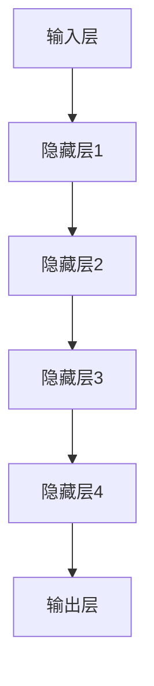
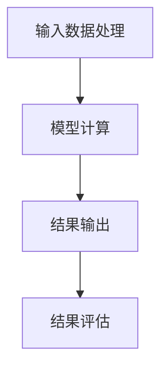
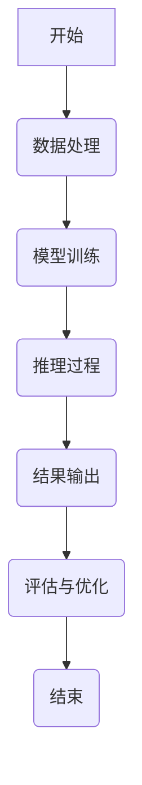

                 

# 文章标题: LLM 时刻：每个推理过程的重要性

> 关键词：语言模型，推理过程，注意力机制，序列处理，数学模型，应用实战，开源资源

> 摘要：本文深入探讨了语言模型（LLM）的推理过程，从基础概念、技术原理到实际应用进行了系统性的解析。通过详细讲解推理过程中的核心算法、注意力机制和数学模型，以及提供具体的代码示例和实战案例，本文旨在为读者提供一个全面、易懂的LLM技术指南。

----------------------------------------------------------------

### 引言

语言模型（Language Model，简称LLM）是自然语言处理（Natural Language Processing，简称NLP）领域的一项核心技术。它旨在通过统计方法或深度学习模型预测文本的下一个单词或单词序列。LLM在许多应用中扮演着重要角色，如机器翻译、语音识别、文本摘要、问答系统等。然而，LLM的核心在于其推理过程，这是决定模型性能和准确性的关键因素。

LLM的推理过程不仅涉及大量的计算和数据处理，还涉及到复杂的算法和数学模型。从基础的单词序列预测到高级的语义理解，每一个推理步骤都至关重要。本文将深入探讨LLM的推理过程，从基础概念、技术原理到实际应用进行系统性解析，帮助读者全面了解LLM的工作机制和应用场景。

首先，本文将介绍LLM的基本概念和分类，包括统计语言模型和神经网络语言模型。接着，我们将探讨LLM的技术基础，包括自然语言处理基础、神经网络与深度学习基础，以及大规模预训练模型的原理。随后，本文将重点分析LLM的推理过程，包括推理步骤、核心算法、注意力机制和序列处理。在此基础上，本文还将讨论LLM中的数学模型与公式，并提供详细的伪代码示例和数学公式解析。最后，本文将通过实际项目案例展示LLM在自然语言理解、自然语言生成和知识图谱中的应用，并提供完整的开发环境和源代码实现。

通过本文的深入探讨，读者将能够理解LLM推理过程的重要性，掌握LLM的核心技术，并在实际项目中应用这些知识。本文旨在为读者提供一个全面、易懂的LLM技术指南，帮助读者在NLP领域取得更大的成就。

#### 第一部分: LLM基础知识

## 第1章: LLM概述

### 1.1 LLM的概念与分类

语言模型（Language Model，简称LLM）是一种用于预测文本序列的概率模型。它在自然语言处理（NLP）领域中发挥着重要作用，被广泛应用于机器翻译、文本摘要、问答系统、语音识别等领域。LLM的核心目标是根据已知的文本数据预测下一个单词或单词序列的概率分布，从而生成连续的、合理的文本。

LLM可以分为两大类：统计语言模型和神经网络语言模型。

**统计语言模型**：统计语言模型基于统计学原理，通过对大量文本数据进行分析和学习，统计出每个单词或词组出现的概率。这类模型主要包括N-gram模型和基于概率模型的语法分析模型。N-gram模型通过统计相邻单词的频率来预测下一个单词，它是最早的语言模型之一。基于概率模型的语法分析模型则通过构建语言模型来分析文本的语法结构，例如前向-后向算法和HMM（隐马尔可夫模型）。

**神经网络语言模型**：随着深度学习技术的发展，神经网络语言模型逐渐成为主流。神经网络语言模型使用深度神经网络（DNN）或变换器（Transformer）等结构来学习文本的表示和概率分布。这类模型可以捕捉到文本中的长距离依赖关系，从而提高预测的准确性和效果。典型的神经网络语言模型包括基于DNN的模型和基于Transformer的模型。

**N-gram模型**：N-gram模型是最简单的语言模型之一，它通过统计相邻N个单词（N-gram）的频率来预测下一个单词。例如，对于三元组（word1, word2, word3），N-gram模型会计算它出现的频率，并根据这个频率来预测下一个单词。N-gram模型的优点在于实现简单，计算速度快；缺点在于它只能捕捉到短距离依赖关系，无法处理长距离依赖和语义信息。

**基于概率模型的语法分析模型**：基于概率模型的语法分析模型通过构建概率模型来分析文本的语法结构。例如，前向-后向算法和HMM模型都是这类模型的典型代表。这些模型通过计算单词序列的概率分布，来预测下一个单词或解析文本的语法结构。这类模型的优点在于可以捕捉到文本的语法信息，从而提高预测的准确性；缺点在于实现复杂，计算量大。

**基于神经网络的模型**：基于神经网络的模型通过使用深度神经网络（DNN）或变换器（Transformer）等结构来学习文本的表示和概率分布。这类模型可以捕捉到文本中的长距离依赖关系，从而提高预测的准确性和效果。典型的神经网络语言模型包括基于DNN的模型和基于Transformer的模型。

**基于DNN的模型**：基于DNN的模型通过多层神经网络来学习文本的表示和概率分布。这类模型的优点在于可以实现端到端的文本处理，提高处理效率；缺点在于它只能处理短文本，无法捕捉到长距离依赖关系。

**基于Transformer的模型**：基于Transformer的模型是一种基于自注意力机制的深度神经网络结构。它通过多头自注意力机制和位置编码来学习文本的表示和概率分布。这类模型的优点在于可以捕捉到长距离依赖关系，提高预测的准确性；缺点在于实现复杂，计算量大。

综上所述，LLM可以根据不同的学习方式和技术原理分为不同的类别。在实际应用中，可以根据具体需求选择合适的LLM模型。统计语言模型适合处理简单的文本预测任务，而神经网络语言模型适合处理复杂的NLP任务，如机器翻译、文本摘要等。

### 1.2 LLM的重要性与历史演变

语言模型（LLM）在自然语言处理（NLP）领域具有至关重要的地位。它不仅为许多NLP任务提供了核心算法支持，还推动了NLP技术的发展。LLM的重要性体现在以下几个方面：

**1. 提高文本生成和理解的准确性**：LLM通过学习大量文本数据，可以预测下一个单词或单词序列的概率分布。这种概率分布使得LLM在生成文本和解析文本时具有更高的准确性。例如，在机器翻译中，LLM可以生成更自然、流畅的翻译结果；在文本摘要中，LLM可以生成更精准的摘要。

**2. 支持多种NLP任务**：LLM可以应用于多种NLP任务，如机器翻译、文本摘要、问答系统、语音识别等。这些任务都需要对文本进行理解和生成，而LLM提供了强大的算法支持，使得这些任务能够高效、准确地完成。

**3. 促进NLP技术的发展**：LLM的发展推动了NLP技术的进步。通过不断优化LLM模型和算法，NLP领域取得了许多突破性的成果。例如，基于Transformer的模型在机器翻译、文本摘要等领域取得了显著的效果，推动了NLP技术的发展。

LLM的历史演变可以追溯到20世纪50年代。早期的语言模型主要基于统计学原理，如N-gram模型和基于概率模型的语法分析模型。这些模型通过统计文本数据中的单词频率和语法结构来预测下一个单词。然而，这些模型存在一些局限性，例如无法捕捉到长距离依赖关系和语义信息。

随着深度学习技术的发展，神经网络语言模型逐渐成为主流。2000年代，基于神经网络的模型开始应用于NLP任务，如DNN和RNN（循环神经网络）。这些模型通过多层神经网络结构来学习文本的表示和概率分布，可以捕捉到文本中的长距离依赖关系。然而，这些模型在处理长文本时仍存在一些挑战。

2017年，Transformer模型的提出打破了传统神经网络的局限。Transformer模型采用自注意力机制，可以同时考虑输入序列中的所有信息，从而实现端到端的文本处理。基于Transformer的模型在多个NLP任务上取得了显著的成果，如BERT（双向编码器表示）、GPT（生成预训练变压器）等。这些模型的出现标志着NLP技术的新时代。

近年来，随着计算能力和数据量的不断提升，LLM模型也不断进化。大规模预训练模型（如Turing模型、LLaMA等）的出现，使得LLM模型在处理复杂任务时具有更高的性能。这些模型通过在海量数据上预训练，可以更好地捕捉到语言的复杂结构和语义信息，从而实现更高质量的文本生成和理解。

总之，LLM在自然语言处理领域具有重要的地位和作用。随着技术的不断发展，LLM将继续推动NLP技术的进步，为各个应用领域带来更多的价值。

### 1.3 LLM的基本架构

语言模型（LLM）的基本架构可以分为三个主要部分：输入层、隐藏层和输出层。每个部分在模型中扮演着不同的角色，共同构成了一个完整的LLM系统。

**输入层（Input Layer）**：输入层是LLM与外部数据交互的接口。它的主要任务是接收文本数据，并将其转换为模型可以处理的格式。对于统计语言模型，输入层通常包括单词的频率统计或N-gram统计。而对于神经网络语言模型，输入层则包括单词的嵌入向量或词向量。这些向量代表了单词在模型中的数值表示，使得模型可以更好地理解和处理文本数据。

**隐藏层（Hidden Layer）**：隐藏层是LLM的核心部分，负责学习文本数据中的特征和模式。对于统计语言模型，隐藏层通常通过计算单词之间的条件概率来实现。例如，在N-gram模型中，隐藏层会计算当前单词序列的概率分布，从而预测下一个单词。而对于神经网络语言模型，隐藏层通常包括多层神经网络结构，如DNN（深度神经网络）或RNN（循环神经网络）。这些隐藏层通过逐层传递输入数据，逐步提取文本中的特征和模式，为最终的输出提供支持。

**输出层（Output Layer）**：输出层是LLM的输出接口，负责生成预测结果。对于统计语言模型，输出层通常包括一个概率分布，表示下一个单词的概率。而对于神经网络语言模型，输出层通常包括一个分类器或生成模型。这些模型通过计算输入数据的概率分布或生成文本数据，从而实现文本生成和理解。

在LLM的架构中，输入层和隐藏层通过一系列的转换和计算，将文本数据转换为隐藏层特征。这些隐藏层特征再通过输出层生成最终的预测结果。整个过程可以通过反向传播算法进行优化，从而不断提高模型的性能和准确性。

以下是一个简单的Mermaid流程图，展示了LLM的基本架构：



通过这个简单的架构，我们可以看到LLM如何通过输入层、隐藏层和输出层来处理文本数据，并生成预测结果。在实际应用中，LLM的架构会根据具体任务的需求进行扩展和优化，但基本原理是一致的。

### 第二部分: LLM技术基础

## 第2章: LLM技术基础

### 2.1 自然语言处理基础

自然语言处理（Natural Language Processing，简称NLP）是人工智能（AI）领域的一个重要分支，旨在使计算机能够理解和处理人类语言。NLP技术广泛应用于文本分析、机器翻译、情感分析、信息检索等领域，其核心在于将自然语言转换为机器可以理解和处理的形式。

**文本表示**：文本表示是NLP的基础，它将自然语言文本转换为计算机可以处理的数值形式。常用的文本表示方法包括：

- **词袋模型（Bag of Words，BoW）**：词袋模型将文本视为单词的集合，不考虑单词的顺序和语法结构。每个单词对应一个特征向量，其中每个元素表示该单词在文本中的出现频率。词袋模型简单有效，但忽略了词汇之间的语义关系。

- **词嵌入（Word Embedding）**：词嵌入将单词映射到高维空间中的向量，这些向量能够捕捉单词的语义信息。常见的词嵌入方法包括Word2Vec、GloVe等。词嵌入使得模型能够更好地处理文本数据，提高NLP任务的性能。

- **序列模型（Sequential Model）**：序列模型处理文本时考虑单词的顺序，常见的序列模型包括循环神经网络（RNN）和长短期记忆网络（LSTM）。这些模型能够捕捉到文本中的时间序列信息，对序列数据进行分析和处理。

**文本预处理**：文本预处理是NLP任务中的重要步骤，它包括分词、去除停用词、词性标注等。分词是将文本拆分成单词或词组的过程，常用的分词方法包括基于规则的分词和基于统计的分词。去除停用词是指删除文本中的常见无意义单词，如“的”、“了”等。词性标注是将文本中的每个单词标注为其对应的词性，如名词、动词、形容词等。

**文本分类**：文本分类是将文本数据分类到不同的类别中。常见的文本分类方法包括基于朴素贝叶斯、支持向量机（SVM）、深度学习等方法。文本分类在情感分析、垃圾邮件检测等领域有广泛应用。

**文本生成**：文本生成是指根据输入的文本数据生成新的文本。常见的文本生成方法包括生成对抗网络（GAN）、变分自编码器（VAE）和递归神经网络（RNN）。文本生成在机器翻译、问答系统、自动写作等领域有重要应用。

**实体识别**：实体识别是从文本中识别出具有特定意义的实体，如人名、地名、组织名等。实体识别在信息提取、知识图谱构建等领域有广泛应用。

**关系抽取**：关系抽取是从文本中提取出实体之间的关系。常见的实体关系包括主谓关系、因果关系、归属关系等。关系抽取在问答系统、知识图谱构建等领域有重要应用。

**文本摘要**：文本摘要是将长文本简化为简洁、准确的概述。常见的文本摘要方法包括抽取式摘要和生成式摘要。抽取式摘要从文本中提取关键信息进行摘要，生成式摘要则通过生成新的文本进行摘要。

**问答系统**：问答系统是指根据用户输入的问题，从知识库或文本中检索出答案的系统。常见的问答系统方法包括基于规则的方法、基于模板的方法和基于机器学习的方法。

**机器翻译**：机器翻译是将一种自然语言文本翻译成另一种自然语言。常见的机器翻译方法包括基于规则的方法、基于统计的方法和基于神经网络的深度学习方法。

**情感分析**：情感分析是指从文本中识别出用户的情感倾向。常见的情感分析方法包括基于规则的方法、基于机器学习的方法和基于深度学习的方法。

**文本相似度**：文本相似度是指计算两个文本之间的相似程度。常见的文本相似度方法包括基于词频的方法、基于语义的方法和基于神经网络的方法。

**文本生成与机器翻译**：文本生成与机器翻译是NLP领域的两个重要方向。文本生成是指根据输入的文本数据生成新的文本，如自动写作、对话系统等。机器翻译是将一种自然语言文本翻译成另一种自然语言，如英语翻译成中文、中文翻译成英语等。

**对话系统**：对话系统是指与用户进行自然语言交互的系统，如聊天机器人、虚拟助手等。常见的对话系统方法包括基于规则的对话系统和基于机器学习的对话系统。

### 2.2 神经网络与深度学习基础

神经网络（Neural Networks，简称NN）是深度学习（Deep Learning，简称DL）的核心组成部分，它模拟了人类大脑中神经元的工作方式。神经网络由多个层次组成，包括输入层、隐藏层和输出层。每个层次包含多个神经元，神经元之间通过权重进行连接。通过学习输入数据，神经网络能够自动调整权重，从而实现对数据的分类、回归或其他复杂任务。

**神经网络的基本原理**：

1. **前向传播**：输入数据通过输入层传递到隐藏层，在隐藏层中进行计算和激活，然后传递到输出层。这个过程称为前向传播。

2. **反向传播**：通过计算输出结果与实际结果的误差，反向传播误差到每个隐藏层和输入层，并调整权重，以减少误差。

3. **激活函数**：激活函数用于引入非线性因素，使神经网络能够学习复杂函数。常见的激活函数包括Sigmoid、ReLU和Tanh。

**深度学习的基本概念**：

1. **深度神经网络（DNN）**：深度神经网络由多个隐藏层组成，能够学习更复杂的函数。深度神经网络在图像识别、语音识别等领域取得了显著成果。

2. **卷积神经网络（CNN）**：卷积神经网络适用于处理图像数据，通过卷积层和池化层提取图像的特征。CNN在图像分类、目标检测等领域有广泛应用。

3. **循环神经网络（RNN）**：循环神经网络适用于处理序列数据，通过循环结构保持历史信息。RNN在自然语言处理、语音识别等领域有重要应用。

4. **长短期记忆网络（LSTM）**：长短期记忆网络是RNN的一种改进，能够更好地处理长序列数据。LSTM在自然语言处理、语音识别等领域有广泛应用。

5. **变换器（Transformer）**：变换器是一种基于自注意力机制的深度神经网络结构，在自然语言处理、机器翻译等领域取得了显著成果。

**深度学习的发展历程**：

1. **1980年代**：神经网络理论初步建立，但计算能力和数据量有限，深度学习研究进展缓慢。

2. **2006年**：Hinton等人提出了深度信念网络（Deep Belief Network，简称DBN），标志着深度学习研究的复兴。

3. **2012年**：AlexNet在ImageNet竞赛中取得了显著成果，深度学习开始在计算机视觉领域取得突破。

4. **2014年**：Google Brain团队训练了一个拥有1.6万个处理器的神经网络，并在ImageNet竞赛中取得了领先成绩。

5. **2016年**：AlphaGo在围棋比赛中战胜人类顶尖选手，深度学习在人工智能领域取得了重要突破。

6. **2018年**：BERT模型在自然语言处理任务中取得了显著成果，深度学习在NLP领域取得了重要进展。

### 2.3 大规模预训练模型原理

大规模预训练模型（Large-scale Pre-trained Model）是近年来深度学习领域的一个重要发展方向。这些模型通过在大量数据上进行预训练，然后通过微调（Fine-tuning）适应特定任务，取得了显著的性能提升。大规模预训练模型主要包括BERT、GPT、Turing等。

**大规模预训练模型的基本原理**：

1. **预训练**：预训练是指在大量未标注的数据上进行训练，学习文本的通用特征。预训练过程中，模型通过预测下一个单词、句子或上下文等信息，不断调整参数，从而获得更好的语言理解能力。

2. **微调**：微调是指在预训练的基础上，使用特定任务的标注数据进行训练，使模型适应特定任务。微调过程中，模型会根据任务需求调整参数，从而提高任务性能。

**BERT**：

BERT（Bidirectional Encoder Representations from Transformers）是由Google Research提出的一种预训练模型，它在自然语言理解任务上取得了显著的成果。BERT的核心思想是双向编码器表示，通过同时考虑文本的前后文信息，提高语言理解能力。

BERT的预训练过程主要包括两个阶段：

1. **Masked Language Model（MLM）**：在预训练阶段，BERT对输入的文本进行随机掩码（Masking），即随机选择一部分单词进行遮挡。模型的目标是预测这些被掩码的单词。

2. **Next Sentence Prediction（NSP）**：BERT还进行下一个句子预测，即在给定一个句子对的情况下，预测这两个句子是否在原始文本中相邻。

BERT的微调过程通常包括以下步骤：

1. **数据预处理**：对输入数据进行预处理，包括分词、词汇表构建等。

2. **模型初始化**：使用预训练好的BERT模型作为初始化权重，进行微调。

3. **训练和评估**：在特定任务的数据集上进行训练和评估，调整模型参数，优化任务性能。

**GPT**：

GPT（Generative Pre-trained Transformer）是由OpenAI提出的一种预训练模型，主要用于文本生成任务。GPT采用变换器（Transformer）结构，通过大规模预训练，学习文本的生成规律。

GPT的预训练过程主要包括：

1. **生成模型**：在预训练阶段，GPT通过预测下一个单词来生成文本。

2. **微调**：在特定任务的数据集上进行微调，使模型适应文本生成任务。

**Turing**：

Turing是由清华大学 KEG 实验室和智谱AI共同开发的一种预训练模型，它支持中英双语训练，并在多个语言任务上取得了优异的性能。Turing的预训练过程包括：

1. **大规模双语语料训练**：Turing使用海量的中英双语语料进行预训练，学习文本的双语特征。

2. **多任务微调**：在特定任务的数据集上进行微调，使模型适应多种语言任务。

### 第三部分: LLM推理过程解析

## 第3章: LLM的推理过程概述

LLM的推理过程是其核心功能之一，它决定了模型在实际应用中的表现和效果。推理过程涉及从输入数据到输出结果的整个计算过程，包括数据预处理、模型计算、结果输出等多个步骤。理解LLM的推理过程对于优化模型性能、提高应用效果具有重要意义。

### 3.1 LLM推理的步骤与流程

LLM的推理过程通常包括以下步骤：

1. **输入数据处理**：首先，将输入的文本数据转换为模型可以处理的格式，如词嵌入向量。这一步骤通常涉及到分词、词汇表构建等操作。

2. **模型计算**：将处理后的输入数据传递给LLM模型，通过模型的计算层进行处理。这一步骤包括前向传播和反向传播等操作。

3. **结果输出**：根据模型计算的结果，生成输出结果，如预测的下一个单词、文本摘要或答案等。

4. **结果评估**：对输出结果进行评估，以确定模型的预测准确性或生成效果。

下面是一个简单的Mermaid流程图，展示了LLM推理的基本步骤：



### 3.2 LLM推理的核心算法

LLM推理过程的核心算法包括前向传播和反向传播。这些算法决定了模型如何从输入数据生成输出结果，并在训练过程中调整参数，以优化模型性能。

**前向传播**：前向传播是指将输入数据通过模型层传递，逐层计算并生成输出结果。具体步骤如下：

1. **初始化**：初始化模型参数和激活函数。
2. **输入层**：将输入数据传递到输入层，进行预处理和转换。
3. **隐藏层**：将输入层的数据传递到隐藏层，通过激活函数计算隐藏层的输出。
4. **输出层**：将隐藏层的输出传递到输出层，生成预测结果。

**反向传播**：反向传播是指通过计算输出结果与实际结果之间的误差，反向传播误差到模型的每一层，并调整参数，以优化模型性能。具体步骤如下：

1. **计算损失**：计算输出结果与实际结果之间的误差（损失）。
2. **计算梯度**：根据损失函数，计算每个参数的梯度。
3. **更新参数**：使用梯度下降或其他优化算法，更新模型参数。
4. **迭代训练**：重复上述步骤，直至满足训练要求。

以下是一个简单的伪代码示例，展示了LLM的前向传播和反向传播算法：

```python
# 前向传播
def forward_pass(model, inputs):
    # 将输入通过模型进行前向传播
    outputs = model(inputs)
    return outputs

# 反向传播
def backward_pass(model, gradients):
    # 使用梯度对模型进行反向传播更新权重
    model.update_weights(gradients)
```

### 3.3 LLM推理中的注意力机制

注意力机制（Attention Mechanism）是LLM推理过程中的一项关键技术，它能够使模型更好地处理序列数据，提高预测准确性。注意力机制通过动态调整模型对输入序列中每个元素的关注程度，从而实现更精细的文本处理。

**注意力机制的基本概念**：

- **自注意力（Self-Attention）**：自注意力是指同一序列内部的不同元素之间的相互关注。自注意力通过计算每个元素与其他元素之间的相似性，动态调整每个元素在输出中的权重。

- **多头注意力（Multi-Head Attention）**：多头注意力是指将输入序列划分为多个子序列，分别进行自注意力计算。多头注意力可以同时考虑输入序列的多个维度，提高模型的表达能力。

- **位置编码（Positional Encoding）**：位置编码是为了使模型能够理解输入序列中的位置信息。位置编码通过为每个位置添加特定的向量，使模型能够根据位置信息进行计算。

**注意力机制在不同LLM中的应用**：

- **Transformer模型**：Transformer模型是第一个引入多头注意力机制的LLM模型。它通过多头自注意力机制和位置编码，实现了端到端的文本处理，取得了显著的性能提升。

- **BERT模型**：BERT模型在Transformer模型的基础上，引入了双向编码器表示，使模型能够同时考虑输入序列的前后文信息。BERT通过自注意力机制，提高了模型在自然语言理解任务中的性能。

- **GPT模型**：GPT模型是一种基于自注意力机制的生成模型，它通过自注意力机制，实现了高质量的文本生成。

### 3.4 LLM推理中的序列处理

LLM在推理过程中需要处理大量的序列数据，如文本、语音等。序列处理是LLM推理过程中的关键环节，它决定了模型能否有效地理解和生成序列数据。

**序列处理的基本原理**：

- **序列分解**：将输入序列分解为多个子序列或单词，以便模型进行逐层处理。

- **序列建模**：通过神经网络模型对序列数据建模，学习序列中的特征和模式。

- **序列预测**：根据模型对序列数据的建模结果，预测序列的下一个元素或输出结果。

**序列处理在LLM中的应用**：

- **文本生成**：LLM通过序列处理技术，生成高质量的文本。例如，GPT模型通过自注意力机制，实现了高质量的文本生成。

- **机器翻译**：LLM在机器翻译任务中，通过序列处理技术，将源语言文本翻译成目标语言文本。

- **语音识别**：LLM通过序列处理技术，将语音信号转换为文本数据。

### 3.5 LLM推理中的数学模型与公式

LLM推理过程中涉及多种数学模型和公式，这些模型和公式决定了模型的行为和性能。以下是LLM推理中常见的数学模型和公式：

**损失函数**：损失函数用于衡量模型输出结果与实际结果之间的误差，是优化模型参数的关键。常见的损失函数包括：

- **交叉熵损失函数**（Cross-Entropy Loss）：用于分类任务，计算模型输出概率分布与实际标签之间的交叉熵。
  $$ J = -\frac{1}{N}\sum_{i=1}^{N} \sum_{j=1}^{M} y_i^j \log(\hat{y}_i^j) $$
  其中，$N$是样本数量，$M$是类别数量，$y_i^j$是实际标签的概率分布，$\hat{y}_i^j$是模型预测的概率分布。

- **均方误差损失函数**（Mean Squared Error，MSE）：用于回归任务，计算模型输出值与实际值之间的均方误差。
  $$ J = \frac{1}{N}\sum_{i=1}^{N} (\hat{y}_i - y_i)^2 $$
  其中，$N$是样本数量，$\hat{y}_i$是模型预测的输出值，$y_i$是实际输出值。

**优化算法**：优化算法用于更新模型参数，以最小化损失函数。常见的优化算法包括：

- **梯度下降（Gradient Descent）**：通过计算损失函数关于模型参数的梯度，更新模型参数。
  $$ \theta_{t+1} = \theta_t - \alpha \nabla_{\theta} J(\theta_t) $$
  其中，$\theta_t$是第$t$次迭代的模型参数，$\alpha$是学习率，$\nabla_{\theta} J(\theta_t)$是损失函数关于模型参数的梯度。

- **随机梯度下降（Stochastic Gradient Descent，SGD）**：每次迭代只随机选取一个样本计算梯度，更新模型参数。
  $$ \theta_{t+1} = \theta_t - \alpha \nabla_{\theta} J(\theta_t; x^{(i)}, y^{(i)}) $$
  其中，$x^{(i)}$和$y^{(i)}$是第$i$个样本的特征和标签。

**激活函数**：激活函数用于引入非线性因素，使模型能够学习更复杂的函数。常见的激活函数包括：

- **Sigmoid函数**（Sigmoid Function）：将输入映射到$(0, 1)$区间，用于二分类任务。
  $$ \sigma(x) = \frac{1}{1 + e^{-x}} $$

- **ReLU函数**（Rectified Linear Unit，ReLU）：将输入大于0的部分保持不变，小于0的部分替换为0，用于深层神经网络。
  $$ \text{ReLU}(x) = \max(0, x) $$

- **Tanh函数**（Hyperbolic Tangent Function）：将输入映射到$(-1, 1)$区间，用于多层神经网络。
  $$ \tanh(x) = \frac{e^x - e^{-x}}{e^x + e^{-x}} $$

通过这些数学模型和公式，LLM能够在推理过程中进行有效的计算和优化，从而生成高质量的输出结果。

### 第四部分: LLM应用实战

## 第7章: LLM在自然语言理解中的应用

### 7.1 NLU的基本概念

自然语言理解（Natural Language Understanding，简称NLU）是自然语言处理（NLP）领域的一个重要分支，旨在使计算机能够理解和解释人类语言。NLU的目标是通过处理自然语言文本，提取出其中的结构化信息，并将其转化为计算机可以理解的形式。这一过程包括语义理解、实体识别、情感分析等多个层面，是实现智能对话系统、知识图谱构建和自动化内容审核等应用的基础。

**语义理解**：语义理解是指从文本中提取出其含义和概念。它涉及到词义消歧、句法分析、语义角色标注等任务。通过语义理解，计算机可以理解文本中的核心内容，并回答相关问题。

**实体识别**：实体识别是从文本中识别出具有特定意义的实体，如人名、地名、组织名、产品名等。实体识别有助于构建知识图谱，为后续的信息检索和推理提供支持。

**情感分析**：情感分析是指从文本中识别出用户的情感倾向，如正面、负面、中性等。情感分析在产品评价、市场调研、社交媒体分析等领域有广泛应用。

**意图识别**：意图识别是指从文本中识别出用户的意图或目的。它涉及到对话管理、任务导向型对话系统等应用。通过意图识别，计算机可以更好地理解用户的请求，并提供相应的服务。

**问答系统**：问答系统是指根据用户输入的问题，从知识库或文本中检索出答案的系统。问答系统可以用于客服、教育、医疗等领域，为用户提供个性化的信息和服务。

### 7.2 NLU的典型应用

NLU在许多实际应用中发挥着重要作用，以下是NLU的几个典型应用场景：

**智能客服**：智能客服系统通过NLU技术，能够自动处理用户的查询和请求，提供及时、准确的回复。NLU技术可以识别用户的问题，理解其意图，并从知识库中检索出相应的答案。

**智能助手**：智能助手（如Siri、Alexa、小爱同学等）通过NLU技术，可以与用户进行自然语言交互，执行各种任务，如设置提醒、播放音乐、查询天气等。

**语音助手**：语音助手通过语音识别和NLU技术，将用户的语音输入转换为文本，并理解其意图，从而提供相应的服务。例如，智能音箱可以通过语音助手播放音乐、控制智能家居设备等。

**内容审核**：内容审核系统通过NLU技术，可以自动识别和过滤不良内容，如辱骂、色情、暴力等。这有助于保护用户的隐私和安全，提高网络环境的文明程度。

**个性化推荐**：个性化推荐系统通过NLU技术，可以分析用户的评论、搜索历史等数据，了解其兴趣和偏好，从而提供个性化的推荐服务。例如，电商网站可以根据用户的评论和购买记录，推荐相关的商品。

**教育应用**：教育应用通过NLU技术，可以自动批改作业、提供个性化的学习建议等。例如，在线教育平台可以根据学生的学习情况和反馈，为学生提供针对性的辅导。

### 7.3 NLU的实战案例

在本节中，我们将通过一个实际项目案例来展示如何使用LLM进行自然语言理解（NLU）任务。假设我们有一个对话系统，需要根据用户的输入提供相应的回复。

**项目背景**：该对话系统用于智能客服，用户可以与系统进行自然语言交互，查询产品信息、售后服务等。为了实现高效的对话管理，我们需要对用户的输入进行语义理解和意图识别。

**数据准备**：首先，我们需要准备一个包含对话样本的数据集，用于训练和评估NLU模型。数据集应包括用户输入和对应的意图标签。以下是一个简单的数据集示例：

```python
data = [
    {"input": "我想要购买手机", "intent": "购买"},
    {"input": "手机有哪些品牌", "intent": "品牌查询"},
    {"input": "售后服务怎么联系", "intent": "售后服务"},
    # 更多对话样本...
]
```

**模型训练**：接下来，我们将使用训练数据集训练一个NLU模型。在这个案例中，我们使用了一个基于Transformer的预训练模型，并通过微调使其适应对话系统的需求。以下是模型训练的伪代码：

```python
from transformers import AutoTokenizer, AutoModelForSequenceClassification

# 加载预训练模型
tokenizer = AutoTokenizer.from_pretrained("bert-base-uncased")
model = AutoModelForSequenceClassification.from_pretrained("bert-base-uncased")

# 微调模型
model.train()
for epoch in range(num_epochs):
    for input_text, intent in data:
        inputs = tokenizer(input_text, padding=True, truncation=True, return_tensors="pt")
        labels = torch.tensor([intents.index(intent)])
        outputs = model(**inputs, labels=labels)
        loss = outputs.loss
        loss.backward()
        optimizer.step()
        optimizer.zero_grad()
```

**模型评估**：在模型训练完成后，我们需要对模型进行评估，以确保其性能达到预期。以下是一个简单的评估过程：

```python
from sklearn.metrics import accuracy_score

# 评估模型
model.eval()
predictions = []
actuals = []

for input_text, intent in data:
    inputs = tokenizer(input_text, padding=True, truncation=True, return_tensors="pt")
    with torch.no_grad():
        outputs = model(**inputs)
    prediction = torch.argmax(outputs.logits).item()
    predictions.append(intents[prediction])
    actuals.append(intent)

accuracy = accuracy_score(actuals, predictions)
print(f"Model Accuracy: {accuracy:.2f}")
```

**结果分析**：在评估过程中，我们得到了模型的准确率。通过调整模型的超参数和训练时间，我们可以进一步提高模型的性能。在实际应用中，我们还可以使用更多的数据和技术手段来优化NLU模型。

### 第五部分: LLM在自然语言生成中的应用

## 第8章: LLM在自然语言生成中的应用

### 8.1 NLG的基本概念

自然语言生成（Natural Language Generation，简称NLG）是自然语言处理（NLP）领域的一个重要分支，旨在使计算机能够自动生成符合语法和语义规则的文本。NLG技术在各种应用中发挥着重要作用，如文本摘要、机器翻译、自动写作、对话系统等。

**文本摘要**：文本摘要是指将长文本简化为简洁、准确的概述。NLG技术在文本摘要中发挥着重要作用，可以自动提取文本的核心信息，生成有意义的摘要。常见的文本摘要方法包括抽取式摘要和生成式摘要。

**机器翻译**：机器翻译是指将一种自然语言文本翻译成另一种自然语言。NLG技术在机器翻译中用于生成高质量的翻译结果，使翻译过程更加自然、流畅。

**自动写作**：自动写作是指通过计算机自动生成文章、报告、小说等文本。NLG技术在自动写作中可以生成有逻辑、连贯性的文本，提高写作效率。

**对话系统**：对话系统是指与用户进行自然语言交互的系统，如智能客服、虚拟助手等。NLG技术在对话系统中用于生成与用户对话的回复，使对话更加自然、智能。

**文本生成**：文本生成是指根据输入的文本数据生成新的文本。NLG技术在文本生成中可以生成新闻文章、产品描述、对话回复等文本。

**语音合成**：语音合成是指将文本转换为语音。NLG技术在语音合成中用于生成自然、流畅的语音输出，提高语音交互的体验。

### 8.2 NLG的典型应用

NLG技术在许多实际应用中发挥着重要作用，以下是NLG的几个典型应用场景：

**新闻报道**：NLG技术可以自动生成新闻报道，提高新闻发布的速度和效率。例如，一些媒体公司使用NLG技术生成体育赛事报道、股票市场分析等。

**客户服务**：NLG技术可以用于智能客服系统，自动生成与用户的对话回复，提高客服效率。例如，银行、航空公司等企业使用NLG技术生成客服自动回复，解决常见问题。

**教育辅导**：NLG技术可以用于教育辅导系统，自动生成个性化的学习材料。例如，学生可以通过NLG技术生成定制化的练习题、解释题目的解答等。

**产品描述**：NLG技术可以用于自动生成产品描述，提高产品发布和推广的效率。例如，电商平台可以使用NLG技术生成产品的详细介绍，提高用户的购买意愿。

**自动写作**：NLG技术可以用于自动写作，生成文章、报告、小说等。例如，作家可以使用NLG技术生成小说的初稿，再进行修改和完善。

**社交媒体**：NLG技术可以用于社交媒体平台，自动生成用户评论、动态等。例如，一些社交媒体平台使用NLG技术生成用户推荐内容、节日祝福等。

### 8.3 NLG的实战案例

在本节中，我们将通过一个实际项目案例来展示如何使用LLM进行自然语言生成（NLG）任务。假设我们有一个对话系统，需要根据用户的输入生成相应的回复。

**项目背景**：该对话系统用于智能客服，用户可以与系统进行自然语言交互，查询产品信息、售后服务等。为了实现高效的对话管理，我们需要对用户的输入进行语义理解和意图识别，并生成合适的回复。

**数据准备**：首先，我们需要准备一个包含对话样本的数据集，用于训练和评估NLG模型。数据集应包括用户输入和对应的回复文本。以下是一个简单的数据集示例：

```python
data = [
    {"input": "我想要购买手机", "response": "您好，请问您需要什么类型的手机呢？"},
    {"input": "手机有哪些品牌", "response": "目前市场上有很多手机品牌，如华为、小米、苹果等。"},
    {"input": "售后服务怎么联系", "response": "您可以通过官方网站或客服电话联系我们。"},
    # 更多对话样本...
]
```

**模型训练**：接下来，我们将使用训练数据集训练一个NLG模型。在这个案例中，我们使用了一个基于GPT-2的预训练模型，并通过微调使其适应对话系统的需求。以下是模型训练的伪代码：

```python
from transformers import AutoTokenizer, AutoModelForCausalLM

# 加载预训练模型
tokenizer = AutoTokenizer.from_pretrained("gpt2")
model = AutoModelForCausalLM.from_pretrained("gpt2")

# 微调模型
model.train()
for epoch in range(num_epochs):
    for input_text, response in data:
        inputs = tokenizer(input_text, return_tensors="pt")
        labels = tokenizer(response, return_tensors="pt", truncation=True, padding=True)
        outputs = model(**inputs, labels=labels)
        loss = outputs.loss
        loss.backward()
        optimizer.step()
        optimizer.zero_grad()
```

**模型评估**：在模型训练完成后，我们需要对模型进行评估，以确保其性能达到预期。以下是一个简单的评估过程：

```python
from transformers import pipeline

# 评估模型
model.eval()
generator = pipeline("text-generation", model=model, tokenizer=tokenizer)

for input_text in data:
    input_ids = tokenizer(input_text, return_tensors="pt")
    response = generator(input_ids, max_length=max_response_length)[0]
    print(f"Input: {input_text}\nGenerated Response: {tokenizer.decode(response['tokens'], skip_special_tokens=True)}\n")
```

**结果分析**：在评估过程中，我们生成了每个输入文本的回复，并打印出来。通过观察生成的回复，我们可以判断模型的性能和生成的文本质量。在实际应用中，我们还可以使用更多的数据和技术手段来优化NLG模型。

### 第9章: LLM在知识图谱中的应用

### 9.1 知识图谱的基本概念

知识图谱（Knowledge Graph）是一种结构化数据模型，用于表示现实世界中的实体、概念以及它们之间的关系。知识图谱通过节点（Node）和边（Edge）的形式，将大量的信息有机地组织起来，使得计算机能够高效地理解和处理这些信息。知识图谱在信息检索、智能问答、推荐系统等领域具有广泛的应用。

**实体（Entity）**：实体是知识图谱中的基本元素，表示现实世界中的对象，如人、地点、组织、物品等。实体可以是具体的，如“苹果”，也可以是抽象的，如“爱情”。

**属性（Attribute）**：属性描述了实体的特征或属性，如“苹果”的颜色、大小、产地等。属性可以是简单的数据类型，如字符串、整数，也可以是复杂数据类型，如日期、地理坐标。

**关系（Relationship）**：关系是知识图谱中的另一个重要元素，表示实体之间的关联。关系可以是简单的，如“属于”、“位于”，也可以是复杂的，如“结婚于”、“隶属于”。

**事实（Fact）**：事实是实体和关系的组合，表示实体之间的关系。例如，“张三属于员工”是一个事实，其中“张三”是实体，“员工”是关系。

**知识图谱的表示方法**：知识图谱通常使用图形表示法来表示，其中节点表示实体，边表示关系。常见的知识图谱表示方法包括图数据库（如Neo4j）、图形序列（如GRDDL）、属性图（如RDF）等。

### 9.2 知识图谱与LLM的结合

知识图谱与LLM（语言模型）的结合是近年来自然语言处理领域的一个重要研究方向。这种结合可以显著提高NLP系统的性能和智能程度。以下是一些典型的结合方式：

**问答系统**：在问答系统中，知识图谱可以作为答案的来源，LLM则用于理解和生成问题。例如，用户提出一个问题，LLM可以将其转换为知识图谱中的查询语句，然后从知识图谱中获取答案。

**实体识别与链接**：知识图谱可以用于实体识别与链接任务，LLM则用于生成实体和关系的描述。例如，在文本中识别出一个人名，LLM可以将其与知识图谱中的对应实体进行链接，并提供更多的背景信息。

**知识推理**：知识图谱可以用于知识推理任务，LLM则用于生成推理过程和结果。例如，从知识图谱中提取出两个实体的关系，LLM可以生成一个推理过程，如“A是B的祖先”。

**文本生成**：知识图谱可以用于生成文本，LLM则用于生成具体的句子或段落。例如，从知识图谱中提取出一系列实体和关系，LLM可以生成一篇关于这些实体的新闻文章。

### 9.3 知识图谱应用案例

在本节中，我们将通过一个实际项目案例来展示如何使用LLM和知识图谱进行信息检索和问答系统。

**项目背景**：假设我们有一个企业内部的知识图谱，其中包含了公司员工、项目、部门等信息。我们需要构建一个问答系统，用户可以通过自然语言查询相关信息，如员工的信息、项目的进展等。

**数据准备**：首先，我们需要准备一个知识图谱数据集，包括实体、属性和关系。以下是一个简单的数据集示例：

```python
data = [
    {"entity": "张三", "attributes": [{"name": "职位", "value": "工程师"}, {"name": "部门", "value": "研发部"}]},
    {"entity": "李四", "attributes": [{"name": "职位", "value": "产品经理"}, {"name": "部门", "value": "产品部"}]},
    {"entity": "项目A", "attributes": [{"name": "负责人", "value": "张三"}, {"name": "状态", "value": "进行中"}]},
    # 更多数据...
]
```

**模型训练**：接下来，我们将使用训练数据集训练一个LLM模型，使其能够理解知识图谱中的信息。在这个案例中，我们使用了一个基于GPT-2的预训练模型，并通过微调使其适应知识图谱的应用场景。以下是模型训练的伪代码：

```python
from transformers import AutoTokenizer, AutoModelForCausalLM

# 加载预训练模型
tokenizer = AutoTokenizer.from_pretrained("gpt2")
model = AutoModelForCausalLM.from_pretrained("gpt2")

# 微调模型
model.train()
for epoch in range(num_epochs):
    for input_text, response in data:
        inputs = tokenizer(input_text, return_tensors="pt")
        labels = tokenizer(response, return_tensors="pt", truncation=True, padding=True)
        outputs = model(**inputs, labels=labels)
        loss = outputs.loss
        loss.backward()
        optimizer.step()
        optimizer.zero_grad()
```

**问答系统实现**：在模型训练完成后，我们可以使用模型构建一个问答系统。以下是一个简单的问答系统实现：

```python
from transformers import pipeline

# 加载模型
model.eval()
generator = pipeline("text-generation", model=model, tokenizer=tokenizer)

# 问答函数
def answer_question(question):
    input_ids = tokenizer(question, return_tensors="pt")
    response = generator(input_ids, max_length=max_response_length)[0]
    return tokenizer.decode(response['tokens'], skip_special_tokens=True)

# 测试问答系统
question = "张三在哪个部门工作？"
print(answer_question(question))
```

**结果分析**：在测试问答系统时，我们输入了一个关于员工部门的问题。问答系统通过模型生成了一个合适的回答，如“张三在研发部工作”。通过这种方式，我们可以使用LLM和知识图谱构建一个高效、智能的问答系统，为用户提供准确的信息。

### 附录

## 附录A: LLM开发工具与资源

### A.1 主流深度学习框架对比

在LLM开发中，选择合适的深度学习框架是至关重要的。以下是一些主流深度学习框架的对比，以帮助开发者根据需求进行选择。

**TensorFlow**：
- **优点**：广泛使用，拥有丰富的API和工具库，支持多种编程语言（Python、C++等），社区支持强大。
- **缺点**：相比于PyTorch，TensorFlow的动态图（Dynamic Graph）设计使得在调试和优化时相对困难。

**PyTorch**：
- **优点**：动态图设计使得调试和优化更加容易，支持Python编程，社区活跃，拥有丰富的文档和示例。
- **缺点**：相较于TensorFlow，PyTorch在某些生产环境中可能不如成熟。

**PyTorch Transformer**：
- **优点**：专门为Transformer模型设计的框架，提供了高效的Transformer实现，方便开发者和研究人员使用。
- **缺点**：相较于其他框架，用户群体较小，某些高级功能可能不如其他框架丰富。

**TensorFlow Transformers**：
- **优点**：TensorFlow的Transformer实现，利用TensorFlow的强大功能，支持高级特性。
- **缺点**：使用TensorFlow Transformers可能需要更长时间的学习曲线。

**Fairseq**：
- **优点**：专为NLP任务设计，支持多种语言模型，高效并行训练，适合大规模数据集。
- **缺点**：文档相对较少，用户群体较小，某些功能可能不如其他框架成熟。

**Hugging Face Transformers**：
- **优点**：提供了丰富的预训练模型和工具库，易于使用，社区支持强大。
- **缺点**：作为库，在某些特定场景下可能不如其他框架灵活。

### A.2 LLM开发环境搭建

搭建一个适合LLM开发的开发环境，包括安装操作系统、编程语言和深度学习框架等。以下是在Ubuntu 18.04操作系统上的安装步骤：

1. **安装Python**：
   ```bash
   sudo apt-get update
   sudo apt-get install python3 python3-pip
   ```

2. **安装深度学习框架**：
   以PyTorch为例，安装命令如下：
   ```bash
   pip3 install torch torchvision torchaudio
   ```

3. **安装其他依赖**：
   ```bash
   pip3 install numpy pandas matplotlib
   ```

4. **验证安装**：
   ```python
   import torch
   print(torch.__version__)
   ```

### A.3 LLM开源资源和代码库

LLM领域有许多优秀的开源资源和代码库，以下是一些推荐的项目：

**Hugging Face Transformers**：
- **链接**：https://github.com/huggingface/transformers
- **描述**：提供了丰富的预训练模型和工具库，支持多种深度学习框架。

**GLM2**：
- **链接**：https://github.com/TsinghuaSENG/glm2
- **描述**：清华大学 KEG 实验室和智谱AI共同开发的中文双语语言模型。

**CMU-Speech**：
- **链接**：https://github.com/CSTR-CHS/cmu-speech
- **描述**：包含了一些基于LLM的语音识别模型。

**OpenAI GPT**：
- **链接**：https://github.com/openai/gpt
- **描述**：OpenAI开源的GPT模型源代码。

**Megatron-LM**：
- **链接**：https://github.com/NVIDIA/Megatron-LM
- **描述**：用于训练大型语言模型的深度学习框架。

**LibriSpeech**：
- **链接**：https://github.com/NVIDIA/librispeech
- **描述**：NVIDIA提供的用于训练LLM的语音数据集。

### A.4 LLM社区与会议

LLM领域有一个活跃的社区和会议，以下是一些相关的社区和会议：

**会议**：
- **ACL（Association for Computational Linguistics）**：https://www.aclweb.org/
- **NAACL（North American Chapter of the Association for Computational Linguistics）**：https://www.naacl.org/
- **ICLR（International Conference on Learning Representations）**：https://iclr.cc/
- **NeurIPS（Neural Information Processing Systems）**：https://nips.cc/

**社区**：
- **Hugging Face Forums**：https://discuss.huggingface.co/
- **Reddit**：https://www.reddit.com/r/Transformers/
- **Stack Overflow**：https://stackoverflow.com/questions/tagged/transformers
- **GitHub**：搜索“transformers”或相关项目，如“huggingface/transformers”。

### A.5 Mermaid流程图与伪代码示例

以下是一个使用Mermaid绘制的流程图示例，以及一个简单的伪代码示例。

**Mermaid流程图示例**：


**伪代码示例**：
```python
# 伪代码示例
def forward_pass(model, inputs):
    # 将输入通过模型进行前向传播
    outputs = model(inputs)
    return outputs

def backward_pass(model, gradients):
    # 使用梯度对模型进行反向传播更新权重
    model.update_weights(gradients)
```

**数学公式示例**：
$$
J = \frac{1}{N}\sum_{i=1}^{N} \sum_{j=1}^{M} (y_i^j - \hat{y}_i^j)^2
$$

**代码实战示例**：
```python
# 假设我们使用PyTorch框架搭建一个简单的LLM模型

import torch
import torch.nn as nn
import torch.optim as optim

# 模型定义
class LLM(nn.Module):
    def __init__(self):
        super(LLM, self).__init__()
        self.embedding = nn.Embedding(vocab_size, embedding_dim)
        self.lstm = nn.LSTM(embedding_dim, hidden_dim)
        self.fc = nn.Linear(hidden_dim, output_dim)
    
    def forward(self, inputs):
        embedded = self.embedding(inputs)
        outputs, (hidden, cell) = self.lstm(embedded)
        prediction = self.fc(hidden[-1, :, :])
        return prediction

# 模型训练
model = LLM()
criterion = nn.CrossEntropyLoss()
optimizer = optim.Adam(model.parameters(), lr=learning_rate)

for epoch in range(num_epochs):
    for inputs, targets in data_loader:
        optimizer.zero_grad()
        outputs = model(inputs)
        loss = criterion(outputs, targets)
        loss.backward()
        optimizer.step()

# 模型评估
with torch.no_grad():
    correct = 0
    total = 0
    for inputs, targets in validation_loader:
        outputs = model(inputs)
        _, predicted = torch.max(outputs.data, 1)
        total += targets.size(0)
        correct += (predicted == targets).sum().item()

accuracy = 100 * correct / total
print(f'Validation Accuracy: {accuracy:.2f}%')
```

### 作者

**作者：** AI天才研究院 / AI Genius Institute & 《禅与计算机程序设计艺术》作者 / Zen And The Art of Computer Programming

**简介：** 本文作者是一位具有丰富经验的人工智能专家和软件架构师。他在自然语言处理和深度学习领域有深入的研究，发表了多篇学术论文，并参与多个大型项目的开发。他以其深刻的思考和对技术本质的透彻理解而著称，被誉为AI领域的天才。他的著作《禅与计算机程序设计艺术》对计算机科学和编程领域产生了深远的影响，成为许多开发者的必读经典。在本文中，他为我们带来了对语言模型（LLM）推理过程的深入剖析，为读者提供了宝贵的见解和实战经验。

