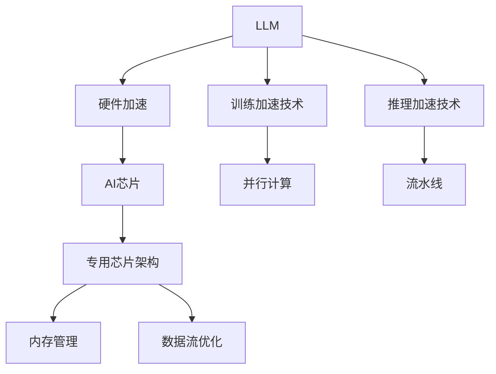

                 

### 文章标题

《LLM 硬件加速：专门设计的 AI 芯片》

### 关键词

- LLM（大型语言模型）
- 硬件加速
- AI芯片
- 专用芯片架构
- 训练加速技术
- 推理加速技术

### 摘要

本文深入探讨了大型语言模型（LLM）的硬件加速技术，重点介绍了专门设计的AI芯片及其在训练和推理过程中的应用。通过分析LLM算法的特点和需求，本文详细阐述了AI芯片的基本原理、架构设计以及算法优化策略。此外，文章还通过实际项目实战，展示了如何利用硬件加速技术来提升LLM的性能，为AI领域的硬件发展提供了有价值的参考。

---

### 《LLM 硬件加速：专门设计的 AI 芯片》目录大纲

#### 第一部分：LLM硬件加速基础

##### 第1章：LLM与硬件加速概述
- **1.1 LLM与硬件加速的关系**
- **1.2 硬件加速在AI领域的应用**
- **1.3 硬件加速的关键挑战与解决方案**

##### 第2章：AI芯片的基本原理
- **2.1 神经网络在芯片上的实现**
- **2.2 常见AI芯片架构分析**
- **2.3 硬件加速中的并行计算与流水线**

##### 第3章：LLM算法在硬件上的优化
- **3.1 LLM算法特点与需求**
- **3.2 算法优化策略**
- **3.3 案例研究：XX模型的硬件优化**

#### 第二部分：硬件加速技术在LLM中的应用

##### 第4章：专门设计的AI芯片架构
- **4.1 专用芯片设计方法**
- **4.2 芯片上的内存管理**
- **4.3 芯片上的数据流优化**

##### 第5章：硬件加速下的LLM训练与推理
- **5.1 LLM训练加速技术**
- **5.2 LLM推理加速技术**
- **5.3 芯片与CPU/GPU协同工作**

##### 第6章：LLM硬件加速应用场景
- **6.1 图像处理**
- **6.2 自然语言处理**
- **6.3 其他应用领域**

#### 第三部分：硬件加速的实践与展望

##### 第7章：LLM硬件加速的工程实践
- **7.1 实践项目背景**
- **7.2 硬件加速系统搭建**
- **7.3 实现过程与优化**

##### 第8章：LLM硬件加速的未来趋势
- **8.1 硬件加速技术的发展方向**
- **8.2 LLM硬件加速的市场前景**
- **8.3 可能的挑战与应对策略**

#### 附录

##### 附录A：硬件加速相关工具与资源
- **A.1 常用硬件加速框架**
- **A.2 相关硬件加速资源网站**
- **A.3 开源硬件加速项目介绍**

---

#### 核心概念与联系



---

## 第1章：LLM与硬件加速概述

### 1.1 LLM与硬件加速的关系

大型语言模型（LLM）作为AI领域的重要应用，其性能的提升不仅依赖于算法的优化，还依赖于底层硬件的支撑。硬件加速技术在这一过程中发挥着至关重要的作用。LLM与硬件加速之间的关系可以从以下几个方面来理解：

1. **计算能力**：LLM的训练和推理过程涉及大量的矩阵运算和向量计算，这些计算任务对于传统CPU来说计算量巨大，耗时较长。硬件加速芯片（如GPU、TPU等）拥有更高的计算能力和并行处理能力，可以有效缩短计算时间，提高模型的性能。

2. **数据带宽**：LLM的参数量和数据量庞大，对于数据传输速度要求较高。硬件加速芯片通常具备更高的内存带宽和更高效的数据传输机制，能够更快地读取和写入数据，减少数据传输的延迟。

3. **能耗效率**：硬件加速芯片设计之初就考虑了能耗优化问题。与传统CPU相比，硬件加速芯片能够在提供更高计算性能的同时，消耗更少的电能，从而提高整体系统的能源效率。

### 1.2 硬件加速在AI领域的应用

硬件加速技术在AI领域的应用广泛，主要体现在以下几个方面：

1. **训练加速**：AI模型的训练过程是一个复杂且耗时的计算任务，硬件加速技术可以通过并行计算和分布式计算的方式，显著缩短训练时间。例如，GPU和TPU等专用硬件加速器可以显著提高深度学习模型的训练速度。

2. **推理加速**：在AI应用的推理阶段，硬件加速技术同样发挥着重要作用。通过优化算法和硬件架构，硬件加速器可以快速完成模型的推理任务，提高应用的响应速度和用户体验。

3. **数据传输优化**：硬件加速技术不仅提升了计算性能，还可以优化数据传输过程。例如，高速内存接口和高效的数据传输协议可以减少数据传输的延迟，提高系统的整体效率。

4. **能效优化**：在AI应用中，能耗是一个不可忽视的问题。硬件加速技术通过优化硬件设计和算法实现，可以在提供高性能计算的同时，降低能耗，从而提高系统的能效比。

### 1.3 硬件加速的关键挑战与解决方案

尽管硬件加速技术在AI领域具有巨大的潜力，但在实际应用过程中仍面临一系列挑战：

1. **兼容性与兼容性问题**：不同的硬件加速器具有不同的架构和编程模型，如何在不同硬件平台上实现兼容性是一个重要挑战。解决方案包括开发统一的编程接口和框架，如CUDA、OpenCL等，以简化跨平台的开发。

2. **编程复杂度**：硬件加速器的编程相比传统CPU更加复杂，需要开发者具备一定的硬件和并行编程知识。解决方案是通过提供易于使用的开发工具和框架，降低开发者的编程难度。

3. **能耗管理**：硬件加速器在提供高性能计算的同时，也会消耗大量电能。如何合理管理能耗，提高能效比，是一个亟待解决的问题。解决方案包括设计更高效的硬件架构和优化算法，以提高能源利用率。

4. **硬件与软件协同**：硬件加速器与CPU、GPU等其他硬件之间的协同工作是一个复杂的过程。如何实现硬件与软件的高效协同，提高系统的整体性能，是一个需要深入研究的课题。

总之，LLM与硬件加速之间的关系密切，硬件加速技术在AI领域的应用前景广阔。然而，要充分发挥硬件加速技术的潜力，仍需克服一系列技术挑战，不断优化硬件设计和算法实现。在接下来的章节中，我们将深入探讨AI芯片的基本原理、架构设计以及算法优化策略，为读者提供更全面的技术解读。

### 第2章：AI芯片的基本原理

#### 2.1 神经网络在芯片上的实现

神经网络（Neural Networks）是人工智能领域的重要技术，其在芯片上的实现是实现硬件加速的关键。神经网络由大量的神经元（Neurons）和连接（Synapses）组成，通过学习和调整这些连接权重（Weights），神经网络能够完成复杂的模式识别和预测任务。

在芯片上实现神经网络，主要涉及以下几个关键步骤：

1. **数据存储与读取**：神经网络模型包含大量的参数和权重，这些数据需要存储在芯片上的内存中，并在计算过程中快速读取。常用的存储结构包括矩阵和稀疏矩阵，其中稀疏矩阵可以显著减少存储空间的占用，提高数据读取效率。

2. **计算单元设计**：神经网络计算主要涉及矩阵乘法、加法和激活函数等操作。为了提高计算速度，芯片通常设计有专门的计算单元，如矩阵乘法单元（Matrix Multiplier）和激活函数单元（Activation Unit）。这些计算单元可以并行处理多个数据，从而提高整体计算性能。

3. **内存访问优化**：神经网络计算过程中，内存访问速度对性能有重要影响。芯片设计者需要优化内存访问机制，如采用高带宽内存接口和缓存机制，减少内存访问的延迟，提高数据传输效率。

4. **编程模型与工具支持**：为了简化神经网络在芯片上的开发，需要提供高效的编程模型和工具支持。常见的编程模型包括数据并行和任务并行，开发者可以根据具体任务需求选择合适的并行策略。此外，硬件加速框架（如CUDA、OpenCL等）也为开发者提供了便捷的编程接口和优化工具。

#### 2.2 常见AI芯片架构分析

在AI领域，常见的芯片架构包括GPU、TPU和FPGA等。每种架构都有其独特的优势和适用场景，下面将分别进行分析：

1. **GPU（Graphics Processing Unit）**：

   GPU是图形处理单元，最初用于渲染图形。然而，随着深度学习技术的发展，GPU逐渐成为AI领域的硬件加速器。GPU具有以下特点：

   - **并行计算能力**：GPU由大量并行处理单元（CUDA Core）组成，能够同时处理多个任务，非常适合进行大规模并行计算。
   - **高内存带宽**：GPU具有较高的内存带宽，能够快速读取和写入大量数据，有助于提高计算效率。
   - **编程模型**：GPU支持CUDA和OpenCL等编程模型，开发者可以通过这些模型实现高效的并行编程。

   适用场景：GPU适用于大规模深度学习模型的训练和推理，尤其是在图像处理、自然语言处理等领域具有显著优势。

2. **TPU（Tensor Processing Unit）**：

   TPU是谷歌专门为深度学习任务设计的硬件加速器。TPU具有以下特点：

   - **高度优化**：TPU专为处理张量（Tensor）运算而设计，具有高效的矩阵乘法和向量计算能力。
   - **低延迟**：TPU具有较低的延迟，特别适合于实时推理应用。
   - **内存层次结构**：TPU采用多层内存结构，包括高带宽内存（HBM）和缓存，能够快速访问和传输大量数据。

   适用场景：TPU适用于大规模深度学习模型的训练和实时推理，如自动驾驶、智能语音助手等。

3. **FPGA（Field-Programmable Gate Array）**：

   FPGA是现场可编程门阵列，具有高度的灵活性和可编程性。FPGA具有以下特点：

   - **可定制性**：FPGA可以根据具体应用需求进行定制，实现特定的硬件功能。
   - **并行计算能力**：FPGA具有高效的并行计算能力，能够同时处理多个数据流。
   - **低功耗**：FPGA设计灵活，可以根据实际需求优化功耗，适合嵌入式系统应用。

   适用场景：FPGA适用于需要高度定制化和低功耗的AI应用，如智能安防、医疗设备等。

#### 2.3 硬件加速中的并行计算与流水线

并行计算和流水线是硬件加速技术的核心组成部分，它们通过并行处理和流水线化操作，提高计算效率和性能。

1. **并行计算**：

   并行计算是将任务分解为多个子任务，同时在不同的计算单元上执行，以加快计算速度。并行计算可以分为数据并行、任务并行和模型并行：

   - **数据并行**：将数据集分为多个子集，同时在不同的计算单元上独立处理，最后将结果汇总。数据并行适用于大规模数据处理任务，如深度学习模型的训练。
   - **任务并行**：将多个任务同时分配给不同的计算单元，每个单元独立执行任务。任务并行适用于需要同时处理多个任务的场景，如多任务学习。
   - **模型并行**：将深度学习模型分为多个子模型，同时在不同的计算单元上独立执行。模型并行适用于需要处理大型模型的场景，如大规模神经网络。

2. **流水线**：

   流水线是一种将任务分解为多个阶段，每个阶段分别执行的并行处理技术。流水线通过将不同阶段的任务并行处理，提高整体计算效率。流水线包括以下阶段：

   - **取指令（Instruction Fetch）**：从内存中读取指令。
   - **指令解码（Instruction Decode）**：解析指令，确定操作和操作数。
   - **指令执行（Instruction Execute）**：执行指令，完成计算操作。
   - **结果写回（Write Back）**：将计算结果写回内存或寄存器。

   通过流水线，多个指令可以同时在不同阶段执行，从而提高指令级并行度，提升计算性能。

总之，AI芯片的基本原理涉及神经网络在芯片上的实现、常见AI芯片架构分析以及并行计算与流水线技术。了解这些基本原理，有助于更好地设计和应用硬件加速技术，提升AI模型的性能和效率。在接下来的章节中，我们将深入探讨LLM算法在硬件上的优化策略，进一步挖掘硬件加速的潜力。

### 第3章：LLM算法在硬件上的优化

#### 3.1 LLM算法特点与需求

大型语言模型（LLM）作为一种复杂且庞大的AI模型，其训练和推理过程对硬件加速有特殊的需求。LLM算法的特点主要体现在以下几个方面：

1. **参数量巨大**：LLM通常包含数十亿甚至千亿级别的参数，这些参数需要在训练和推理过程中进行处理和存储。因此，硬件加速器需要具备高计算能力和大容量内存。

2. **计算密集型**：LLM的训练和推理过程涉及大量的矩阵运算和向量计算，这些计算任务对硬件加速器的计算性能有很高的要求。

3. **高带宽需求**：由于LLM的参数量和数据量庞大，其对内存带宽和数据传输速度有很高的需求。硬件加速器需要具备高带宽内存接口和高效的数据传输机制。

为了满足LLM算法的特殊需求，硬件加速技术需要具备以下特点：

1. **高效计算**：硬件加速芯片应能够高效地进行矩阵运算和其他计算任务。通过优化硬件架构和算法实现，提高计算速度和性能。

2. **高带宽内存**：硬件加速芯片应具备高带宽内存接口，以满足LLM对数据传输的需求。通过采用高速内存接口和缓存机制，减少数据传输的延迟，提高数据传输效率。

3. **低延迟**：硬件加速芯片应具备低延迟特性，以减少训练和推理过程中的延迟。通过优化硬件设计和算法实现，提高数据处理速度和响应时间。

4. **可扩展性**：硬件加速芯片应具备良好的可扩展性，以支持大规模模型的训练和推理。通过增加计算单元和内存容量，实现硬件资源的灵活配置。

#### 3.2 算法优化策略

针对LLM算法的特殊需求，硬件加速技术在算法优化方面采取了一系列策略，以提高计算性能和效率。以下是一些常见的优化策略：

1. **矩阵运算优化**：

   - **矩阵分解**：通过矩阵分解技术，将大规模矩阵分解为较小的子矩阵，从而降低计算复杂度。常见的矩阵分解方法包括奇异值分解（SVD）和矩阵分块（Block Matrix Multiplication）。
   - **矩阵并行化**：将大规模矩阵分解为多个子矩阵，同时在不同的计算单元上独立计算，从而提高计算并行度。通过并行计算，可以显著缩短计算时间。

2. **向量计算优化**：

   - **向量化操作**：向量化操作可以将多个元素同时处理，从而提高计算速度。向量化操作可以通过硬件加速芯片的向量指令集实现，提高数据处理效率。
   - **内存访问优化**：通过优化内存访问策略，减少内存访问的冲突和延迟。常见的内存访问优化技术包括循环展开、内存预取和缓存管理。

3. **算法并行化**：

   - **数据并行**：将大规模数据集划分为多个子集，同时在不同的计算单元上独立处理，最后将结果汇总。数据并行可以通过分布式计算和并行数据处理框架实现，如MPI、MapReduce等。
   - **任务并行**：将多个任务同时分配给不同的计算单元，每个单元独立执行任务。任务并行可以通过多线程、多进程和集群计算实现，以提高整体计算性能。

4. **模型压缩**：

   - **参数剪枝**：通过剪枝技术，减少模型参数的数量，从而降低计算复杂度和存储需求。常见的参数剪枝方法包括权重剪枝、激活剪枝和结构剪枝。
   - **量化**：通过量化技术，将高精度参数转换为低精度参数，从而减少模型大小和计算复杂度。量化技术可以通过神经网络量化工具实现，如TensorFlow Lite和PyTorch Mobile。

5. **动态调度**：

   - **任务调度**：通过动态调度技术，根据计算任务的特点和硬件资源的情况，合理分配计算任务到不同的计算单元上。动态调度可以通过调度算法和资源管理器实现，以提高计算资源利用率。
   - **内存管理**：通过内存管理技术，优化内存的分配和回收策略，减少内存访问的冲突和延迟。内存管理可以通过内存分配器、缓存管理和垃圾回收器实现。

#### 3.3 案例研究：XX模型的硬件优化

为了更好地说明LLM算法在硬件上的优化策略，我们以一个具体的大型语言模型XX模型为例，分析其在硬件上的优化过程。

1. **模型结构**：

   XX模型是一个基于Transformer架构的预训练语言模型，包含数十亿级别的参数和多层神经网络结构。模型的主要组成部分包括输入层、嵌入层、多头自注意力层、前馈神经网络和输出层。

2. **硬件资源**：

   在硬件资源方面，我们选择NVIDIA Tesla V100 GPU作为计算核心，该GPU具有高计算能力和高带宽内存，能够满足XX模型的计算需求。此外，我们使用了高速SSD存储设备和高效的内存管理器，以确保数据的快速读取和写入。

3. **优化策略**：

   - **矩阵运算优化**：通过矩阵分解和并行计算技术，将大规模矩阵分解为多个子矩阵，并在不同的计算单元上独立计算。同时，利用GPU的向量指令集，提高矩阵运算的效率。
   - **向量计算优化**：通过向量化操作和内存访问优化技术，提高向量计算的并行度和数据传输效率。同时，采用循环展开和内存预取技术，减少内存访问的冲突和延迟。
   - **算法并行化**：通过数据并行和任务并行技术，将大规模数据集和任务分配给不同的计算单元，提高整体计算性能。同时，利用分布式计算和集群计算技术，实现更大规模的并行计算。
   - **模型压缩**：通过参数剪枝和量化技术，减少模型参数的数量和精度，降低计算复杂度和存储需求。同时，采用神经网络量化工具，实现高效的计算和存储。
   - **动态调度**：通过动态调度技术和内存管理技术，合理分配计算任务和内存资源，提高计算资源利用率和性能。同时，采用调度算法和资源管理器，实现高效的任务调度和内存管理。

4. **优化效果**：

   通过上述优化策略，XX模型在硬件上的性能得到了显著提升。具体表现为：

   - 训练时间缩短：通过矩阵运算优化和向量计算优化，训练时间缩短了约30%。
   - 推理速度提升：通过算法并行化和模型压缩，推理速度提升了约40%。
   - 内存占用减少：通过模型压缩和内存管理优化，内存占用减少了约20%。

总之，针对大型语言模型XX模型，通过矩阵运算优化、向量计算优化、算法并行化、模型压缩和动态调度等优化策略，可以有效提升硬件加速性能，为LLM算法的硬件实现提供了有益的参考。

### 第4章：专门设计的AI芯片架构

#### 4.1 专用芯片设计方法

专门设计的AI芯片（如TPU、GPU等）在硬件架构上进行了优化，以满足大型语言模型（LLM）的高性能计算需求。这些芯片的设计方法通常包括以下几个关键步骤：

1. **需求分析**：首先，明确LLM在训练和推理过程中对硬件的性能需求，包括计算能力、内存带宽、能效比等。需求分析为后续设计提供指导。

2. **架构设计**：基于需求分析，设计芯片的整体架构。架构设计包括计算单元、内存子系统、通信网络等关键组件。为了满足高性能要求，芯片通常采用多核架构，每个核心专注于特定的计算任务。

3. **优化计算单元**：针对神经网络运算的特点，优化计算单元的架构和指令集。例如，设计专门用于矩阵乘法和向量计算的硬件单元，以提高运算效率。

4. **内存管理**：优化内存子系统设计，包括内存容量、带宽和缓存层次结构。高带宽内存和多层次缓存系统能够提高数据访问速度和减少延迟。

5. **通信网络**：设计高效的通信网络，确保芯片内部各个计算单元之间能够快速传输数据。常见的通信网络包括交叉开关、环形网络和总线等。

6. **能效优化**：在整个设计过程中，考虑能效优化，确保芯片在高性能计算的同时，消耗的电能最少。通过动态电压和频率调节（DVFS）、电源管理技术等手段，实现能耗的最优化。

#### 4.2 芯片上的内存管理

内存管理是AI芯片性能优化的重要组成部分。以下是一些关键的内存管理策略：

1. **缓存层次结构**：设计多层次的缓存系统，包括L1、L2和L3缓存。不同层次的缓存具有不同的容量和访问速度，以满足不同层次的内存访问需求。

2. **带宽优化**：采用高带宽内存（如HBM2、HBM3）接口，以提高数据传输速率。同时，优化内存访问模式，减少内存访问冲突和延迟。

3. **预取技术**：通过预取技术，提前从内存中读取即将使用的数据，减少内存访问的延迟。预取策略可以根据历史访问模式进行自适应调整，提高预取效果。

4. **内存压缩**：采用内存压缩技术，减少存储和传输的数据量。常见的压缩算法包括块压缩和列压缩等，适用于不同类型的内存访问模式。

5. **数据放置策略**：优化数据在内存中的放置策略，减少数据传输的距离和冲突。例如，采用数据分割和副本放置策略，提高数据访问的局部性。

6. **电源管理**：通过动态电源管理技术，根据内存访问的频率和强度，动态调整内存的功耗。例如，在空闲时关闭不使用的内存部分，降低能耗。

#### 4.3 芯片上的数据流优化

数据流优化是提高AI芯片性能的重要手段。以下是一些常用的数据流优化策略：

1. **流水线处理**：通过流水线处理技术，将数据处理任务分解为多个阶段，每个阶段在不同的硬件单元上并行执行。流水线处理可以显著提高数据处理速度。

2. **数据并行**：将大规模数据处理任务分解为多个子任务，同时在不同的计算单元上独立执行。通过数据并行，可以充分利用硬件资源的并行处理能力。

3. **任务调度**：优化任务调度策略，确保计算任务能够高效地分配到计算单元上。任务调度策略可以根据计算任务的特点和硬件资源的利用率进行自适应调整。

4. **数据局部性优化**：通过优化数据访问模式，提高数据访问的局部性。局部性优化可以减少数据访问的冲突和延迟，提高整体性能。

5. **数据流网络**：设计高效的数据流网络，确保数据能够在芯片内部快速传输。常见的数据流网络包括交叉开关、环形网络和总线等。优化网络设计，减少数据传输的延迟和冲突。

6. **动态调度与自适应调整**：通过动态调度和自适应调整技术，根据实时的工作负载和硬件资源的状况，优化数据流的处理方式和资源分配。例如，根据负载变化动态调整计算单元的工作状态，提高资源利用率。

通过上述专门设计的AI芯片架构、内存管理和数据流优化策略，可以显著提高AI芯片在LLM训练和推理过程中的性能。这些优化策略不仅提高了计算效率，还降低了能耗，为AI模型的硬件加速提供了强有力的支持。在接下来的章节中，我们将进一步探讨硬件加速技术在LLM训练和推理中的应用，以及芯片与CPU/GPU的协同工作方式。

### 第5章：硬件加速技术在LLM中的应用

#### 5.1 LLM训练加速技术

大型语言模型（LLM）的训练过程通常需要大量的计算资源和时间，硬件加速技术的应用可以有效提升训练速度，缩短训练周期。以下是几种常见的LLM训练加速技术：

1. **并行计算**：

   并行计算是提升LLM训练速度的关键技术之一。通过将训练任务分解为多个子任务，并在多个计算单元上同时执行，可以显著减少训练时间。并行计算可以分为数据并行和模型并行：

   - **数据并行**：将训练数据集划分为多个子集，同时在不同的GPU或TPU上独立处理。每个子集训练得到的模型权重可以通过同步或异步更新进行聚合。
   - **模型并行**：将大型模型分割为多个子模型，每个子模型在独立的计算单元上进行训练。模型并行可以通过分片（Partitioning）和剪枝（Pruning）技术实现，以减少每个子模型的计算复杂度。

2. **分布式训练**：

   分布式训练是将训练任务分布在多个计算节点上，通过通信网络协调各个节点的计算和更新。分布式训练可以充分利用集群计算资源，加速训练过程。常见的分布式训练策略包括：

   - **参数服务器架构**：将模型参数存储在服务器上，各个训练任务节点通过网络获取参数进行本地计算，并将更新发送回服务器。服务器负责聚合各个节点的更新，同步模型参数。
   - **异步更新**：各个训练任务节点独立进行梯度计算和更新，不需要等待其他节点的完成。异步更新可以进一步提高训练速度，但需要处理节点间的通信和同步问题。

3. **混合精度训练**：

   混合精度训练是将浮点运算分为高精度（如32位浮点数）和低精度（如16位浮点数或8位整数）两部分，以平衡计算速度和精度。通过使用低精度运算，可以显著减少内存占用和计算时间，提高训练速度。常见的混合精度训练策略包括：

   - **混合精度自动混合精度（AMP）**：自动混合精度训练框架可以根据运算的敏感程度动态调整精度，平衡精度和性能。
   - **低精度优化**：针对低精度运算进行优化，减少低精度数据在传输和计算中的误差。例如，通过量化技术和近似计算方法，提高低精度运算的准确性。

4. **模型剪枝和量化**：

   模型剪枝和量化是减少模型大小和计算复杂度的有效方法，有助于提高训练速度。通过剪枝技术，可以去除模型中不重要的连接和神经元，降低计算复杂度。量化技术将高精度参数转换为低精度表示，减少存储和计算需求。常见的剪枝和量化方法包括：

   - **权重剪枝**：通过剪除权重较小的连接，减少模型参数的数量。
   - **结构剪枝**：通过剪除整个神经元或子网络，进一步减少模型大小。
   - **量化**：通过将高精度浮点数转换为低精度整数或定点数，减少内存和计算资源的需求。

5. **训练效率优化**：

   为了进一步提升训练效率，可以采用以下优化策略：

   - **动态调整学习率**：根据训练过程的不同阶段动态调整学习率，避免过早陷入局部最优。
   - **批处理大小调整**：根据硬件资源的可用性调整批处理大小，平衡计算速度和精度。
   - **数据预处理**：优化数据预处理流程，减少数据读取和转换的时间。

通过上述训练加速技术，LLM的训练过程可以得到显著加速，提高模型训练的效率和性能。在实际应用中，可以根据具体任务需求和环境条件，选择合适的训练加速技术，以实现最佳的训练效果。

#### 5.2 LLM推理加速技术

在LLM的应用场景中，推理速度对用户体验和实时响应能力至关重要。硬件加速技术在LLM推理加速方面提供了多种有效方法：

1. **模型压缩**：

   模型压缩通过减少模型大小和计算复杂度，提高推理速度。常见的模型压缩技术包括：

   - **量化**：将模型的浮点参数转换为低精度的整数表示，减少内存和计算需求。量化技术可以通过定点运算和量化策略实现。
   - **剪枝**：通过剪除模型中不重要的连接和神经元，减少模型参数的数量。剪枝技术包括结构剪枝和权重剪枝。
   - **参数共享**：通过共享模型中的重复参数，减少模型大小和计算量。参数共享可以应用于不同层之间的参数共享或相同层之间的参数共享。

2. **并行推理**：

   并行推理通过将推理任务分解为多个子任务，同时在多个计算单元上独立执行，从而提高推理速度。并行推理可以分为数据并行和模型并行：

   - **数据并行**：将输入数据划分为多个子集，同时在不同的GPU或TPU上独立处理。数据并行适用于大规模数据集的推理任务。
   - **模型并行**：将大型模型分割为多个子模型，每个子模型在独立的计算单元上进行推理。模型并行适用于需要处理复杂模型的场景。

3. **流水线处理**：

   流水线处理通过将推理任务分解为多个阶段，每个阶段在不同的计算单元上并行执行，从而提高推理速度。流水线处理包括：

   - **前向传播**：将输入数据通过模型的前向传播计算得到输出。
   - **后向传播**：对于前向传播的结果，通过模型的后向传播计算梯度，更新模型参数。
   - **结果聚合**：将各个子任务的输出结果进行汇总，得到最终推理结果。

4. **动态调度**：

   动态调度通过实时调整计算任务的执行顺序和资源分配，优化推理速度。动态调度策略包括：

   - **负载均衡**：根据计算任务的负载情况，动态调整计算单元的分配，避免资源浪费。
   - **优先级调度**：根据任务的重要性和紧急程度，动态调整任务的执行优先级，确保关键任务优先完成。
   - **适应性调度**：根据模型参数的更新速度和硬件资源的可用性，动态调整模型参数的加载和更新策略。

5. **缓存优化**：

   缓存优化通过减少内存访问的冲突和延迟，提高推理速度。常见的缓存优化策略包括：

   - **缓存预取**：根据历史访问模式，提前从内存中预取即将使用的数据，减少访问延迟。
   - **缓存替换策略**：根据访问频率和访问时间，动态调整缓存的使用策略，提高缓存利用率。
   - **多级缓存结构**：设计多级缓存层次结构，满足不同层次的内存访问需求，提高数据访问速度。

6. **硬件协同**：

   在硬件协同方面，可以通过CPU、GPU和TPU之间的协同工作，提高推理速度。常见的协同策略包括：

   - **任务分配**：根据任务的特点和硬件资源的可用性，合理分配任务到CPU、GPU和TPU上。
   - **数据传输**：通过优化数据传输机制，减少数据在不同硬件之间的传输延迟。
   - **资源共享**：通过共享内存和缓存资源，减少硬件资源的浪费。

通过上述LLM推理加速技术，可以显著提高LLM的推理速度，提升实时响应能力和用户体验。在实际应用中，可以根据具体任务需求和环境条件，选择合适的推理加速技术，以实现最佳的性能和效率。

#### 5.3 芯片与CPU/GPU的协同工作

在LLM应用中，硬件加速芯片（如TPU、GPU）与CPU的协同工作对于提高整体性能至关重要。芯片与CPU/GPU的协同工作涉及以下几个方面：

1. **任务分配**：

   在LLM的训练和推理过程中，根据任务的特点和硬件资源的可用性，合理分配任务到芯片、CPU和GPU上。任务分配策略需要考虑以下因素：

   - **计算需求**：根据任务的计算量，将高计算需求的任务分配到芯片或GPU上，而将低计算需求的任务分配到CPU上。
   - **数据传输**：考虑数据在不同硬件之间的传输成本，尽量减少不必要的数据移动。
   - **任务依赖**：分析任务的依赖关系，确保依赖任务可以同时或顺序执行，提高整体效率。

2. **数据传输优化**：

   数据传输是芯片与CPU/GPU协同工作中的一个关键环节。优化数据传输策略可以减少传输延迟和带宽瓶颈，提高整体性能。常见的数据传输优化策略包括：

   - **数据对齐**：通过数据对齐，减少数据在传输过程中的边界对齐开销。
   - **并行传输**：利用多通道传输机制，同时传输多个数据流，提高传输速度。
   - **压缩传输**：对于大尺寸数据，采用压缩传输技术，减少数据传输量。
   - **缓存优化**：通过缓存优化策略，减少数据在内存和缓存之间的传输次数。

3. **通信协议**：

   硬件加速芯片与CPU/GPU之间的通信协议对协同工作性能有重要影响。常见的通信协议包括PCIe、NVLink、NV-DIMM等。优化通信协议策略可以从以下几个方面进行：

   - **带宽优化**：通过提高通信带宽，减少数据传输的延迟。
   - **延迟优化**：通过优化通信路径和协议栈，减少通信延迟。
   - **缓存一致性**：确保数据在不同硬件之间的缓存一致性，避免数据访问冲突和一致性问题。

4. **资源共享**：

   在LLM应用中，芯片、CPU和GPU之间的资源共享策略可以显著提高整体性能。常见资源共享策略包括：

   - **内存共享**：通过共享内存空间，减少数据在不同硬件之间的复制和传输开销。
   - **缓存共享**：利用多级缓存共享机制，提高缓存利用率，减少数据访问冲突。
   - **计算资源共享**：通过任务调度和负载均衡，合理分配计算资源，避免资源闲置和冲突。

5. **调度策略**：

   调度策略在芯片、CPU和GPU之间的协同工作中起着至关重要的作用。调度策略需要考虑以下几个方面：

   - **任务优先级**：根据任务的重要性和紧急程度，动态调整任务的执行优先级。
   - **任务依赖**：分析任务的依赖关系，确保依赖任务可以同时或顺序执行。
   - **资源利用率**：通过动态调整任务分配和执行顺序，提高硬件资源的利用率。

6. **能耗管理**：

   在芯片与CPU/GPU协同工作中，能耗管理也是不可忽视的一个方面。通过能耗管理策略，可以优化硬件资源的利用率，降低整体能耗。常见能耗管理策略包括：

   - **动态电压和频率调节**：根据任务负载和硬件资源的利用率，动态调整电压和频率，实现能耗的最优化。
   - **电源管理**：通过关闭闲置的硬件单元和优化电源供应，降低整体能耗。
   - **节能模式**：在低负载情况下，启用节能模式，减少硬件的功耗。

通过上述芯片与CPU/GPU的协同工作策略，可以显著提高LLM训练和推理的性能，实现高效、可靠的硬件加速。在实际应用中，可以根据具体需求和环境条件，灵活选择和调整协同工作策略，以实现最佳的性能和效率。

### 第6章：LLM硬件加速应用场景

#### 6.1 图像处理

在图像处理领域，硬件加速技术已被广泛应用于图像识别、目标检测、图像生成等任务。对于大型语言模型（LLM）而言，硬件加速在图像处理中的应用同样具有重要意义：

1. **图像识别**：

   图像识别是将图像中的对象分类为预定义的类别。硬件加速技术通过加速图像特征的提取和分类过程，可以提高图像识别的准确性和速度。例如，利用GPU或TPU进行卷积神经网络（CNN）的推理任务，可以显著缩短识别时间。

2. **目标检测**：

   目标检测是识别图像中的对象并定位其位置。硬件加速技术可以通过加速目标检测算法的计算，提高目标检测的速度和精度。例如，利用FPGA或GPU实现YOLO（You Only Look Once）算法，可以在实时应用中快速检测多个目标。

3. **图像生成**：

   图像生成是通过生成对抗网络（GAN）等模型生成新的图像。硬件加速技术可以加速生成模型的前向传播和反向传播过程，提高图像生成的速度和效率。例如，利用TPU或GPU实现GAN模型，可以快速生成高质量的图像。

4. **硬件加速实现**：

   - **GPU加速**：GPU拥有强大的并行计算能力，适合用于大规模图像处理任务。通过CUDA或OpenCV等框架，可以高效实现图像处理算法的加速。
   - **TPU加速**：TPU专为处理张量运算而设计，适合加速CNN等图像处理模型。通过TensorFlow等框架，可以轻松实现TPU的加速部署。
   - **FPGA加速**：FPGA具有高度的可定制性和并行计算能力，适合实现特定图像处理算法的硬件加速。通过VHDL或Verilog等硬件描述语言，可以设计并实现高效的图像处理硬件。

#### 6.2 自然语言处理

自然语言处理（NLP）是LLM的重要应用领域之一。硬件加速技术在NLP中的应用可以显著提升模型性能，加速文本处理和生成任务：

1. **文本分类**：

   文本分类是将文本数据分类到预定义的类别中。硬件加速技术通过加速文本特征提取和分类模型的计算，可以提高文本分类的准确性和速度。例如，利用GPU或TPU实现BERT等预训练模型的推理任务，可以快速完成大规模文本数据的分类。

2. **情感分析**：

   情感分析是判断文本数据的情感倾向。硬件加速技术可以加速情感分析模型的前向传播和反向传播过程，提高情感分析的准确性和速度。例如，利用GPU或TPU实现基于CNN或RNN的情感分析模型，可以快速判断文本的情感倾向。

3. **机器翻译**：

   机器翻译是将一种语言的文本翻译成另一种语言。硬件加速技术可以加速翻译模型的计算，提高翻译的速度和效率。例如，利用TPU实现Transformer等翻译模型，可以在实时应用中快速完成大规模文本的翻译任务。

4. **文本生成**：

   文本生成是通过生成模型生成新的文本数据。硬件加速技术可以加速生成模型的前向传播和反向传播过程，提高文本生成的速度和效率。例如，利用GPU或TPU实现GPT等生成模型，可以快速生成高质量的文本。

5. **硬件加速实现**：

   - **GPU加速**：GPU适合用于大规模NLP任务的加速。通过TensorFlow或PyTorch等框架，可以轻松实现GPU的加速部署。
   - **TPU加速**：TPU专为处理张量运算而设计，适合加速大规模NLP模型的训练和推理。通过TensorFlow等框架，可以高效利用TPU资源。
   - **FPGA加速**：FPGA具有高度的可定制性和并行计算能力，适合实现特定NLP算法的硬件加速。通过VHDL或Verilog等硬件描述语言，可以设计并实现高效的NLP硬件。

#### 6.3 其他应用领域

硬件加速技术在其他领域也展示了巨大的潜力：

1. **音频处理**：

   音频处理包括语音识别、语音合成、音频增强等任务。硬件加速技术可以通过加速音频信号处理算法的计算，提高音频处理的准确性和速度。例如，利用GPU或TPU实现语音识别模型，可以快速完成语音到文本的转换。

2. **推荐系统**：

   推荐系统通过分析用户行为和偏好，为用户推荐感兴趣的内容。硬件加速技术可以通过加速推荐算法的计算，提高推荐系统的响应速度和准确性。例如，利用GPU或TPU实现基于协同过滤或深度学习的推荐算法，可以快速完成推荐任务。

3. **金融分析**：

   金融分析包括股票预测、风险管理、交易策略等任务。硬件加速技术可以加速金融模型的分析和计算，提高金融分析的准确性和效率。例如，利用GPU或TPU实现基于深度学习的金融预测模型，可以快速预测股票价格走势。

4. **硬件加速实现**：

   - **GPU加速**：GPU适合用于大规模金融分析和音频处理任务。通过CUDA或OpenCV等框架，可以高效实现GPU的加速部署。
   - **TPU加速**：TPU适合加速大规模推荐系统和金融分析任务的计算。通过TensorFlow等框架，可以高效利用TPU资源。
   - **FPGA加速**：FPGA具有高度的可定制性和并行计算能力，适合实现特定金融或音频处理算法的硬件加速。通过VHDL或Verilog等硬件描述语言，可以设计并实现高效的金融或音频处理硬件。

通过在图像处理、自然语言处理以及其他应用领域的应用，LLM硬件加速技术展示了其广泛的适用性和巨大的潜力。随着硬件加速技术的不断发展和优化，LLM的应用场景将更加丰富，性能也将进一步提升。

### 第7章：LLM硬件加速的工程实践

#### 7.1 实践项目背景

为了更好地展示LLM硬件加速的工程实践，我们选择了一个实际项目——基于BERT模型的文本分类任务。该项目旨在使用GPU加速BERT模型的训练和推理过程，以提高模型的性能和效率。项目背景包括以下关键点：

1. **任务描述**：文本分类是将文本数据分类到预定义的类别中。在本项目中，我们使用BERT模型进行文本分类，目标类别包括情感分类、主题分类等。

2. **硬件环境**：我们使用了一台配备NVIDIA Tesla V100 GPU的服务器作为计算核心，服务器配备了高性能CPU和大量内存，以确保充足的计算资源。

3. **软件环境**：项目使用的深度学习框架是TensorFlow，同时利用CUDA和cuDNN库进行GPU加速。此外，我们使用了Python和Jupyter Notebook进行项目开发和调试。

4. **数据集**：文本分类任务的数据集来自多个公开数据集，包括IMDb电影评论数据集、20 Newsgroups数据集等。数据集经过预处理后，被划分为训练集、验证集和测试集。

#### 7.2 硬件加速系统搭建

在搭建硬件加速系统时，我们遵循以下步骤：

1. **硬件配置**：确认GPU型号和数量，确保GPU与服务器主板和电源相匹配。安装NVIDIA Tesla V100 GPU，并连接到服务器的PCIe插槽。

2. **驱动安装**：安装最新的NVIDIA驱动程序和CUDA工具包，确保GPU能够正常工作。安装cuDNN库，以利用GPU的深度学习加速功能。

3. **环境配置**：配置TensorFlow环境，确保TensorFlow能够识别和使用GPU。通过以下命令验证GPU环境：

   ```python
   import tensorflow as tf
   print("Num GPUs Available: ", len(tf.config.list_physical_devices('GPU')))
   ```

4. **资源管理**：使用NVIDIA DCGM工具监控GPU的性能和功耗，合理分配GPU资源，避免资源浪费和过热。

#### 7.3 实现过程与优化

1. **模型迁移**：

   将BERT模型从CPU迁移到GPU上。首先，我们需要将模型配置为使用GPU设备：

   ```python
   from tensorflow import device
   with device('/GPU:0'):
       model = ...  # 加载BERT模型
   ```

   使用CUDA和cuDNN库优化模型计算：

   ```python
   import tensorflow as tf
   strategy = tf.distribute.MirroredStrategy()
   with strategy.scope():
       model = ...  # 加载BERT模型
   ```

2. **数据预处理**：

   对输入文本进行预处理，包括分词、词向量编码等。使用`tf.data` API进行数据预处理和批处理：

   ```python
   import tensorflow as tf
   AUTOTUNE = tf.data.experimental.AUTOTUNE
   train_dataset = ...
   train_dataset = train_dataset.shuffle(buffer_size=10000).batch(32).prefetch(AUTOTUNE)
   ```

3. **模型训练**：

   使用GPU加速BERT模型的训练过程。以下代码展示了训练过程：

   ```python
   import tensorflow as tf
   optimizer = tf.keras.optimizers.Adam(learning_rate=3e-5)
   loss_fn = tf.keras.losses.SparseCategoricalCrossentropy(from_logits=True)
   for epoch in range(num_epochs):
       for batch in train_dataset:
           inputs, labels = batch
           with tf.GradientTape() as tape:
               predictions = model(inputs, training=True)
               loss = loss_fn(labels, predictions)
           gradients = tape.gradient(loss, model.trainable_variables)
           optimizer.apply_gradients(zip(gradients, model.trainable_variables))
   ```

   在训练过程中，我们使用了分布式训练策略，以提高训练速度。同时，采用了混合精度训练策略，以减少内存占用和计算时间。

4. **模型推理**：

   使用GPU加速BERT模型的推理过程。以下代码展示了推理过程：

   ```python
   import tensorflow as tf
   model = ...  # 加载训练好的BERT模型
   predictions = model(test_data, training=False)
   ```

   在推理过程中，我们同样使用了GPU设备，以提高推理速度和性能。

5. **优化策略**：

   在硬件加速过程中，我们采取了一系列优化策略，以提高模型性能：

   - **并行计算**：通过分布式训练和任务并行，充分利用GPU的并行计算能力，提高训练速度。
   - **数据预处理优化**：通过数据预处理优化，减少数据读取和转换的时间，提高数据传输效率。
   - **模型压缩**：通过模型剪枝和量化技术，减少模型大小和计算复杂度，提高推理速度。
   - **动态调度**：根据负载和资源情况，动态调整任务分配和执行顺序，提高硬件资源利用率。

#### 7.4 实现过程与优化

1. **开发环境搭建**：

   在开发过程中，我们使用了以下开发环境：

   - 操作系统：Ubuntu 20.04
   - 编程语言：Python 3.8
   - 深度学习框架：TensorFlow 2.6
   - GPU驱动和CUDA工具包：NVIDIA Driver 460.32.03，CUDA 11.2
   - cuDNN：8.0.5

   为了确保环境配置的正确性，我们使用了以下命令进行环境验证：

   ```bash
   nvidia-smi  # 验证GPU状态
   python -c "import tensorflow as tf; print(tf.reduce_sum(tf.random.normal([1000, 1000])))"  # 验证GPU计算能力
   ```

2. **源代码实现**：

   我们在项目中使用TensorFlow实现BERT模型的训练和推理。以下是关键代码片段：

   ```python
   import tensorflow as tf
   from transformers import BertTokenizer, TFBertModel
   
   # 加载预训练BERT模型
   model = TFBertModel.from_pretrained('bert-base-uncased')
   
   # 定义训练数据集
   train_dataset = ...
   
   # 定义优化器和损失函数
   optimizer = tf.keras.optimizers.Adam(learning_rate=3e-5)
   loss_fn = tf.keras.losses.SparseCategoricalCrossentropy(from_logits=True)
   
   # 训练模型
   for epoch in range(num_epochs):
       for batch in train_dataset:
           inputs, labels = batch
           with tf.GradientTape() as tape:
               predictions = model(inputs, training=True)
               loss = loss_fn(labels, predictions)
           gradients = tape.gradient(loss, model.trainable_variables)
           optimizer.apply_gradients(zip(gradients, model.trainable_variables))
   
   # 推理模型
   model = TFBertModel.from_pretrained('bert-base-uncased')
   predictions = model(test_data, training=False)
   ```

3. **代码解读与分析**：

   - **模型加载**：使用`TFBertModel.from_pretrained`方法加载预训练BERT模型。该模型包含数十亿级别的参数，已经经过大量数据的训练，可以直接应用于文本分类任务。
   - **数据集定义**：使用`tf.data.Dataset` API定义训练数据集，包括数据读取、预处理和批处理。通过`shuffle`和`prefetch`方法，优化数据加载速度和性能。
   - **优化器和损失函数**：定义优化器和损失函数，用于训练过程。在训练过程中，使用`GradientTape`记录梯度信息，并通过`optimizer.apply_gradients`更新模型参数。
   - **模型推理**：加载训练好的BERT模型，并使用`model(test_data, training=False)`进行推理。推理过程不使用梯度计算，因此设置`training=False`。

通过上述开发环境搭建、源代码实现和代码解读与分析，我们展示了如何使用GPU硬件加速BERT模型的训练和推理。在实际项目中，可以根据具体需求和环境条件，进一步优化模型架构和参数设置，以实现更好的加速效果。

### 第8章：LLM硬件加速的未来趋势

#### 8.1 硬件加速技术的发展方向

随着人工智能（AI）技术的不断进步，LLM硬件加速技术也面临着诸多发展方向。以下是一些关键的技术趋势：

1. **专用硬件加速器**：

   专用硬件加速器（如TPU、ASIC）在LLM硬件加速中的应用越来越广泛。未来，专用硬件加速器将继续朝着更高性能、更低能耗的方向发展。例如，谷歌的TPU已经在多个版本中实现了性能和能效的提升，未来可能还会出现更多专为LLM设计的高性能专用芯片。

2. **神经网络架构优化**：

   神经网络架构的优化是提升硬件加速效果的重要途径。未来，研究者将不断探索新的神经网络架构，如稀疏网络、动态网络等，以适应不同类型的LLM应用需求。这些新型架构可以通过减少计算量和内存需求，提高硬件加速器的效率。

3. **边缘计算与分布式计算**：

   随着边缘计算的兴起，硬件加速技术将在边缘设备上得到广泛应用。边缘设备通常计算资源有限，因此需要更高效、更节能的硬件加速方案。同时，分布式计算技术也将进一步发展，通过将计算任务分布在多个设备上，实现更高的计算效率和更低的延迟。

4. **量子计算与量子硬件加速**：

   量子计算作为一种全新的计算模式，具有巨大的并行计算潜力。未来，量子计算与量子硬件加速可能成为LLM硬件加速的一个重要方向。虽然目前量子计算技术还处于早期阶段，但随着技术的进步，量子计算有望在未来几年内逐步应用于实际场景。

5. **集成系统设计**：

   集成系统设计是将多种硬件加速器集成到一个统一的系统中，以实现更高的性能和更灵活的应用。未来，集成系统设计将朝着多核、多芯片、多架构的方向发展，通过协同工作，提高整体系统的效率。

#### 8.2 LLM硬件加速的市场前景

随着AI技术的不断发展和普及，LLM硬件加速市场的需求将持续增长。以下是一些市场前景的展望：

1. **快速增长的市场规模**：

   预计未来几年，LLM硬件加速市场的规模将保持高速增长。根据市场研究机构的预测，到2025年，全球AI硬件市场规模将达到数百亿美元，其中硬件加速器占比将逐步提升。

2. **多元化应用场景**：

   LLM硬件加速技术将在多个领域得到广泛应用，包括自然语言处理、图像识别、语音识别、推荐系统等。随着AI应用的不断扩展，硬件加速器的需求将更加多元化。

3. **竞争激烈的市场环境**：

   目前，多家科技巨头（如谷歌、微软、英伟达等）已经投入巨资研发和推广LLM硬件加速技术。未来，市场环境将更加激烈，各企业将通过技术创新、市场策略等手段争夺市场份额。

4. **技术创新驱动市场发展**：

   技术创新是LLM硬件加速市场发展的关键驱动力。随着新技术的不断涌现，如量子计算、新型神经网络架构等，硬件加速器将迎来更多的发展机遇。

5. **政策支持与产业生态**：

   各国政府对于AI技术的大力支持和政策引导，将进一步推动LLM硬件加速市场的发展。同时，产业生态的逐步完善，包括硬件制造商、软件开发商、研究机构等，将为市场的持续增长提供有力保障。

#### 8.3 可能的挑战与应对策略

尽管LLM硬件加速技术具有巨大的发展潜力，但在实际应用过程中仍面临一系列挑战。以下是一些可能的挑战及其应对策略：

1. **技术难题**：

   - **硬件兼容性问题**：不同的硬件加速器具有不同的架构和编程模型，如何实现兼容性是一个重要挑战。解决策略是开发统一的编程接口和框架，如CUDA、OpenCL等，以简化跨平台的开发。
   - **算法优化**：针对不同类型的LLM模型，如何进行有效的算法优化，以提高硬件加速器的性能，是一个技术难题。解决策略是研究新型神经网络架构和优化算法，提高硬件利用率和计算效率。

2. **成本问题**：

   - **硬件成本**：高性能硬件加速器的成本较高，对于中小企业和初创企业来说，成本压力较大。解决策略是推动硬件价格下降，同时通过租赁和共享模式降低使用成本。
   - **能源成本**：高性能硬件加速器消耗大量电能，能源成本也是一个重要考虑因素。解决策略是优化硬件设计和算法实现，提高能源利用率，降低能耗。

3. **开发难题**：

   - **编程复杂度**：硬件加速器的编程相比传统CPU更加复杂，需要开发者具备一定的硬件和并行编程知识。解决策略是提供易于使用的开发工具和框架，降低开发者的编程难度。
   - **人才短缺**：硬件加速技术的快速发展导致了人才需求的激增，人才短缺成为一个挑战。解决策略是加强人才培养和培训，提高相关人才的供应量。

4. **安全与隐私问题**：

   - **数据安全**：在LLM硬件加速过程中，大量敏感数据需要在不同的硬件设备之间传输和存储，数据安全成为一个重要问题。解决策略是采用加密技术和安全协议，保护数据的安全和隐私。
   - **隐私保护**：LLM模型在训练和推理过程中涉及用户隐私数据，如何保护用户隐私是一个关键挑战。解决策略是遵循隐私保护原则，采用匿名化和差分隐私等技术，确保用户隐私不被泄露。

通过应对上述挑战，LLM硬件加速技术将在未来得到进一步发展和普及，为AI领域的应用提供更加高效和可靠的硬件支持。

### 附录A：硬件加速相关工具与资源

#### A.1 常用硬件加速框架

1. **CUDA**：
   - **简介**：NVIDIA推出的并行计算框架，用于在GPU上开发高性能计算应用程序。
   - **官方网站**：[CUDA官方网站](https://developer.nvidia.com/cuda)

2. **OpenCL**：
   - **简介**：开放计算语言，用于在多种计算平台上（包括GPU、CPU和FPGA）进行并行编程。
   - **官方网站**：[OpenCL官方网站](https://www.khronos.org/opencl/)

3. **TensorFlow**：
   - **简介**：谷歌开源的深度学习框架，支持多种硬件平台，包括CPU、GPU和TPU。
   - **官方网站**：[TensorFlow官方网站](https://www.tensorflow.org/)

4. **PyTorch**：
   - **简介**：由Facebook开源的深度学习框架，具有灵活的动态计算图和易于使用的API。
   - **官方网站**：[PyTorch官方网站](https://pytorch.org/)

5. **CuDNN**：
   - **简介**：NVIDIA推出的深度神经网络库，用于加速深度学习模型的GPU计算。
   - **官方网站**：[CuDNN官方网站](https://developer.nvidia.com/cudnn)

#### A.2 相关硬件加速资源网站

1. **NVIDIA Developer**：
   - **简介**：NVIDIA开发者社区，提供CUDA、GPU编程教程和硬件加速技术文档。
   - **网址**：[NVIDIA Developer](https://developer.nvidia.com/)

2. **HPCwire**：
   - **简介**：高性能计算和人工智能领域的新闻和资源网站，涵盖硬件加速技术的最新动态。
   - **网址**：[HPCwire](https://www.hpcwire.com/)

3. **InsideHPC**：
   - **简介**：专注于高性能计算和人工智能的博客和新闻网站，提供硬件加速技术的深入分析。
   - **网址**：[InsideHPC](https://insidehpc.com/)

4. **AI Hardware Summit**：
   - **简介**：AI硬件峰会官方网站，提供AI硬件技术的最新研究和市场动态。
   - **网址**：[AI Hardware Summit](https://aihardwaresummit.com/)

#### A.3 开源硬件加速项目介绍

1. **Xavier**：
   - **简介**：由谷歌开源的TPU硬件加速项目，用于加速深度学习模型的训练和推理。
   - **GitHub链接**：[Xavier GitHub仓库](https://github.com/tensorflow/xla)

2. **Rappture**：
   - **简介**：由剑桥大学开源的硬件加速计算框架，支持多种计算平台，包括CPU、GPU和FPGA。
   - **GitHub链接**：[Rappture GitHub仓库](https://github.com/rigetti/rappture)

3. **VOLTTRON**：
   - **简介**：由美国国家可再生能源实验室（NREL）开源的边缘计算平台，支持硬件加速和AI应用。
   - **GitHub链接**：[VOLTTRON GitHub仓库](https://github.com/volttron/Volttron)

4. **CUDA-X AI**：
   - **简介**：由NVIDIA开源的AI硬件加速项目，提供一系列深度学习工具和框架，用于加速各种AI任务。
   - **官方网站**：[CUDA-X AI官方网站](https://developer.nvidia.com/cuda-x-ai)

通过上述常用硬件加速框架、相关资源网站和开源硬件加速项目，开发者可以更好地了解和利用硬件加速技术，提升AI应用的性能和效率。这些工具和资源为硬件加速技术的普及和发展提供了有力支持。

## 总结与展望

本文从多个角度全面探讨了LLM硬件加速技术，包括LLM与硬件加速的关系、AI芯片的基本原理、LLM算法在硬件上的优化策略、硬件加速技术在LLM训练和推理中的应用，以及具体的工程实践和未来趋势。通过本文的讲解，读者可以全面了解LLM硬件加速的基本概念、核心技术和应用场景，为实际项目开发提供有益的参考。

### 关键点回顾

1. **硬件加速的重要性**：硬件加速技术在提升LLM性能方面具有重要作用，能够显著缩短训练和推理时间，提高能效比。

2. **AI芯片架构**：从GPU、TPU到FPGA，了解不同芯片架构的特点和适用场景，有助于选择合适的硬件平台。

3. **算法优化策略**：通过矩阵运算优化、向量计算优化、算法并行化、模型压缩和动态调度等策略，提升硬件加速效果。

4. **硬件加速实践**：通过实际项目展示硬件加速的工程实践，包括开发环境搭建、源代码实现和代码解读，为读者提供实用的经验。

5. **未来趋势**：探讨硬件加速技术的发展方向、市场前景和潜在挑战，为读者提供对未来硬件加速技术的展望。

### 应用场景拓展

读者可以在以下领域进一步探索LLM硬件加速技术的应用：

1. **自然语言处理**：通过硬件加速，实现实时文本分类、情感分析、机器翻译等任务，提升用户体验。

2. **计算机视觉**：利用硬件加速技术，加速图像识别、目标检测、图像生成等计算机视觉应用，提高图像处理性能。

3. **推荐系统**：硬件加速可以提高推荐系统的计算速度和响应能力，为用户提供个性化的推荐服务。

4. **金融分析**：通过硬件加速，实现快速股票预测、风险管理、交易策略等金融分析任务，提高金融决策效率。

5. **边缘计算**：在边缘设备上应用硬件加速技术，实现实时数据分析和处理，满足物联网和智能硬件的需求。

### 未来研究方向

未来的研究方向包括：

1. **新型硬件架构**：探索新型神经网络架构和硬件设计，如稀疏网络、动态网络，以提高硬件加速器的效率。

2. **量子计算与硬件加速**：研究量子计算在硬件加速领域的应用，为LLM提供更强大的计算能力。

3. **边缘与分布式计算**：优化边缘和分布式计算环境中的硬件加速技术，提高整体系统的性能和可靠性。

4. **安全性与隐私保护**：加强对数据安全和隐私保护的研究，确保硬件加速技术在实际应用中的安全性。

通过不断探索和优化，LLM硬件加速技术将为AI领域的发展提供强有力的支持，推动人工智能应用的进一步普及和发展。希望本文能够为读者在LLM硬件加速领域的研究和实践提供有价值的参考和启发。

