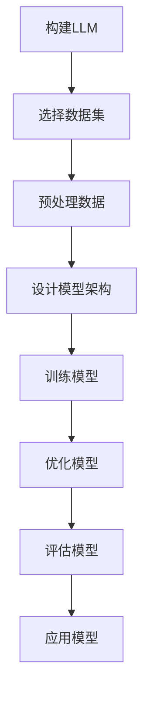

                 

# 文章标题: LLM:人工智能新范式的崛起

> 关键词：语言模型，人工智能，深度学习，自然语言处理，预训练，文本生成，问答系统

> 摘要：本文深入探讨了语言模型（LLM）的基础、发展、构建、优化及其在实际应用中的挑战和未来展望。通过逻辑清晰的分析，本文旨在为读者提供一个全面、详细的LLM知识体系，以推动人工智能新范式的崛起。

## 引言

随着人工智能（AI）技术的飞速发展，自然语言处理（NLP）作为其重要分支，已成为众多领域的关键技术。在这一背景下，语言模型（LLM）作为NLP的核心组件，受到了广泛关注。LLM的出现，不仅带来了AI技术的新突破，也为各行各业带来了变革性的影响。

本文将围绕LLM这一主题，进行以下方面的探讨：

1. **LLM的基础与概述**：介绍LLM的背景、发展历程及核心优势。
2. **LLM的技术基础**：阐述LLM的技术基础，包括自然语言处理基础、神经网络与深度学习、大规模预训练。
3. **LLM的构建与优化**：分析LLM的构建过程、优化策略及评估方法。
4. **LLM的实际应用**：探讨LLM在文本生成、问答系统等领域的应用。
5. **LLM的挑战与未来**：讨论LLM面临的挑战及其未来发展方向。

通过本文的探讨，我们希望能够为读者提供一个全面、深入的LLM知识体系，以应对人工智能新范式的崛起。

### 第一部分: LLM的基础与概述

#### 第1章: LLM的背景与发展

##### 1.1 什么是LLM

语言模型（Language Model，简称LLM）是一种基于统计和学习方法，对自然语言进行建模的AI模型。它可以对给定的文本输入，预测下一个可能的词或句子。LLM的核心目标是使计算机能够理解和生成人类语言，从而实现与人类更自然的交互。

LLM与自然语言处理（NLP）密切相关。NLP是AI的一个分支，主要研究如何使计算机理解和生成人类语言。LLM作为NLP的核心组件，为NLP任务提供了强大的语言建模能力。

##### 1.2 LLM的发展历程

LLM的发展历程可以追溯到20世纪50年代，当时研究人员开始探索如何使用计算机模拟人类语言。然而，早期的模型由于计算能力和数据限制，效果不佳。

直到20世纪80年代，随着统计模型和神经网络的发展，LLM的研究取得了重要突破。1986年，Rumelhart等人提出了反向传播算法（Backpropagation），使得神经网络在NLP任务中的应用成为可能。

进入21世纪，随着深度学习和大数据技术的发展，LLM的研究进入了新的阶段。2003年，Bengio等人提出了深度神经网络（DNN）在NLP中的应用，开启了深度学习在LLM领域的应用。

近年来，随着计算能力的提升和数据的丰富，大规模预训练模型如BERT、GPT等取得了显著的成果，使得LLM的性能得到了大幅提升。

##### 1.3 LLM的核心优势

LLM具有以下几个核心优势：

1. **泛化能力**：LLM通过在大规模数据上进行预训练，可以有效地泛化到不同的语言任务和数据集，减少了任务特定的调优需求。
2. **知识的深度与广度**：通过预训练，LLM可以积累丰富的知识，从而在多种语言任务中表现出强大的能力。
3. **强大的语言理解与生成能力**：LLM能够理解复杂的语言结构，生成符合语法和语义规则的文本。

#### 第2章: LLM的技术基础

##### 2.1 自然语言处理基础

自然语言处理（NLP）是LLM的技术基础。NLP主要研究如何使计算机理解和生成人类语言。NLP的核心任务包括文本预处理、词嵌入、句法分析、语义理解等。

1. **文本预处理**：文本预处理是NLP任务的第一步，主要包括去除标点符号、停用词过滤、词干提取等操作，以提高后续处理的质量。
2. **词嵌入**：词嵌入是将词汇映射到高维空间中的向量表示。通过词嵌入，可以实现词汇之间的相似性和距离度量，从而提高NLP任务的效果。
3. **句法分析**：句法分析是研究句子结构的一种方法，主要包括词性标注、句法树构建等任务。
4. **语义理解**：语义理解是NLP的最高目标，旨在使计算机能够理解人类语言背后的含义。

##### 2.2 神经网络与深度学习

神经网络（Neural Network）是LLM的核心技术之一。神经网络通过模拟生物神经网络的结构和功能，实现数据的输入、处理和输出。深度学习（Deep Learning）是神经网络的一种发展，通过多层神经网络的堆叠，实现更复杂的特征提取和模型学习。

1. **神经网络结构**：神经网络由输入层、隐藏层和输出层组成。输入层接收外部输入数据，隐藏层对数据进行特征提取和变换，输出层生成最终的输出结果。
2. **反向传播算法**：反向传播算法是一种用于训练神经网络的优化方法。通过计算输出误差，反向传播误差到隐藏层，更新网络的权重和偏置，以达到最优解。
3. **深度学习应用**：深度学习在NLP领域有着广泛的应用，包括文本分类、情感分析、机器翻译等任务。

##### 2.3 大规模预训练

大规模预训练是LLM的重要特征之一。通过在大规模数据集上进行预训练，LLM可以学习到丰富的语言特征和知识，从而提高模型在具体任务中的性能。

1. **预训练的概念**：预训练是指在网络训练前，在大量无标签数据上进行训练，以使网络具备一定的语言理解能力。
2. **预训练的技术细节**：预训练主要包括两个阶段：预训练和微调。预训练阶段，模型在大量文本数据上学习语言特征；微调阶段，模型在特定任务的数据上进行微调，以适应具体的任务需求。

### 第二部分: LLM的构建与优化

#### 第3章: LLM的构建

##### 3.1 数据集的选择与预处理

构建LLM的第一步是选择合适的数据集，并进行预处理。数据集的选择直接影响模型的学习效果和性能。以下是一些关键步骤：

1. **数据集的选择**：选择具有代表性的数据集，如公共语料库、专业领域文本等。常用的数据集包括Wikipedia、Common Crawl、新闻语料库等。
2. **数据预处理**：数据预处理包括去除噪声、标点符号、停用词过滤、词干提取等操作。此外，还需对文本进行分词、编码等操作，以适应模型输入。

##### 3.2 模型的架构设计

LLM的架构设计是构建过程中的关键环节。当前主流的LLM架构是基于Transformer的模型，如BERT、GPT等。以下是一些关键设计要素：

1. **Transformer架构**：Transformer是一种基于自注意力机制的神经网络模型，可以有效处理长距离依赖问题。
2. **网络层设计**：包括编码器（Encoder）和解码器（Decoder），其中编码器用于提取输入文本的特征，解码器用于生成输出文本。
3. **注意力机制**：注意力机制是Transformer的核心，通过计算输入文本中各个词之间的相似性，动态调整每个词的重要性。

##### 3.3 训练策略

训练策略直接影响LLM的性能和学习速度。以下是一些关键训练策略：

1. **训练算法**：常用的训练算法包括随机梯度下降（SGD）、Adam优化器等。
2. **学习率调度**：学习率调度是调整模型训练过程中学习率的方法，常用的方法包括固定学习率、指数衰减等。
3. **批量大小**：批量大小是每次训练过程中的样本数量，批量大小会影响模型的训练速度和稳定性。

#### 第4章: LLM的优化与调参

##### 4.1 超参数调优

超参数调优是提高LLM性能的重要手段。以下是一些常见的超参数调优方法：

1. **学习率**：学习率是影响模型训练速度和稳定性的重要超参数。常用的方法包括固定学习率、学习率衰减等。
2. **批量大小**：批量大小影响模型的训练速度和梯度稳定性。选择合适的批量大小可以提高模型的性能。
3. **正则化**：正则化方法包括Dropout、权重衰减等，可以防止模型过拟合。

##### 4.2 正则化技术

正则化技术在优化LLM过程中起着重要作用。以下是一些常用的正则化技术：

1. **Dropout**：Dropout是一种常用的正则化方法，通过随机丢弃神经元，防止模型过拟合。
2. **权重衰减**：权重衰减是一种通过减小权重值来降低模型复杂度的方法，可以有效防止过拟合。

##### 4.3 模型的评估与验证

模型评估与验证是确保LLM性能的重要步骤。以下是一些常见的评估指标：

1. **准确率**：准确率是模型预测正确的样本数量与总样本数量的比值，用于衡量模型的分类性能。
2. **词汇覆盖**：词汇覆盖是指模型能够处理的词汇数量与总词汇数量的比值，用于衡量模型对词汇的掌握程度。

### 第三部分: LLM的实际应用

#### 第5章: LLM在文本生成中的应用

##### 5.1 自动写作

自动写作是LLM在文本生成中的一项重要应用。通过训练大规模的语言模型，可以实现自动生成文章、故事、评论等文本内容。

1. **文章生成**：利用LLM生成文章，可以应用于新闻写作、报告撰写等领域，提高写作效率。
2. **聊天机器人**：聊天机器人是LLM在交互式应用中的重要场景。通过训练模型，可以实现与用户的自然对话，提高用户体验。

##### 5.2 自动摘要

自动摘要是LLM在文本处理中的另一项重要应用。通过训练模型，可以实现自动提取文本的关键信息，生成摘要。

1. **文本摘要**：自动摘要可以应用于新闻摘要、文档摘要等领域，提高信息获取效率。
2. **预测摘要**：预测摘要是一种基于LLM的摘要方法，通过预测文本的后续内容，生成摘要。

##### 5.3 对话系统

对话系统是LLM在交互式应用中的典型场景。通过训练模型，可以实现与用户的自然对话，提供个性化的服务。

1. **问答系统**：问答系统是一种基于LLM的对话系统，通过训练模型，可以实现对用户问题的自动回答。
2. **聊天机器人**：聊天机器人是一种基于LLM的交互式应用，通过与用户进行自然对话，提供娱乐、咨询等服务。

#### 第6章: LLM在问答系统中的应用

##### 6.1 开放域问答

开放域问答是LLM在问答系统中的一个重要应用。通过训练模型，可以实现自动回答用户提出的各种问题。

1. **多跳查询**：多跳查询是一种基于LLM的问答方法，通过多个步骤的查询和推理，获取答案。
2. **增量学习**：增量学习是一种基于LLM的问答方法，通过不断更新模型的知识库，提高问答系统的性能。

##### 6.2 知识图谱问答

知识图谱问答是LLM在问答系统中的另一个重要应用。通过训练模型，可以实现基于知识图谱的问答。

1. **知识表示**：知识表示是将实体、关系和属性等信息转化为计算机可理解的形式。
2. **问答匹配**：问答匹配是一种基于LLM的问答方法，通过匹配问题和答案，实现问答系统的自动化。

##### 6.3 对话管理

对话管理是LLM在交互式应用中的重要环节。通过训练模型，可以实现与用户的自然对话，提供个性化的服务。

1. **对话状态跟踪**：对话状态跟踪是一种基于LLM的对话管理方法，通过跟踪对话中的关键信息，实现对话的连贯性。
2. **上下文理解**：上下文理解是一种基于LLM的对话管理方法，通过理解对话中的上下文信息，实现对话的连贯性和个性化。

### 第四部分: LLM的挑战与未来

#### 第7章: LLM的挑战与解决方案

##### 7.1 模型大小与计算资源

随着LLM规模的不断扩大，计算资源的需求也越来越高。以下是一些解决方案：

1. **模型压缩**：模型压缩是一种通过减小模型大小，降低计算资源需求的方法。常用的模型压缩方法包括量化、剪枝等。
2. **分布式训练**：分布式训练是一种通过在多个计算节点上训练模型，提高训练速度和效率的方法。常用的分布式训练方法包括数据并行、模型并行等。

##### 7.2 模型的安全性与可解释性

随着LLM在关键领域的应用，模型的安全性和可解释性变得越来越重要。以下是一些解决方案：

1. **模型的鲁棒性**：模型的鲁棒性是指模型对输入数据的抗干扰能力。提高模型的鲁棒性可以通过数据增强、对抗训练等方法实现。
2. **可解释性方法**：可解释性方法是一种通过解释模型决策过程，提高模型可理解性的方法。常用的可解释性方法包括可视化、决策树等。

##### 7.3 模型的伦理与责任

随着LLM在关键领域的应用，模型的伦理和责任问题也备受关注。以下是一些解决方案：

1. **数据隐私**：数据隐私是指保护用户数据不泄露的方法。常用的数据隐私方法包括数据加密、差分隐私等。
2. **偏见问题**：偏见问题是指模型在训练过程中可能出现的歧视性输出。解决偏见问题可以通过数据平衡、算法公平性等方法实现。

#### 第8章: LLM的未来展望

##### 8.1 LLM在专业领域的应用

LLM在专业领域的应用前景广阔。以下是一些应用领域：

1. **医学**：LLM可以用于医学文本处理、疾病诊断等领域，提高医疗效率。
2. **金融**：LLM可以用于金融文本分析、风险评估等领域，提供智能决策支持。

##### 8.2 LLM在教育领域的应用

LLM在教育领域的应用潜力巨大。以下是一些应用场景：

1. **个性化学习**：LLM可以用于分析学生行为数据，提供个性化的学习建议。
2. **评测与反馈**：LLM可以用于自动评估学生的作业和考试，提供即时反馈。

##### 8.3 LLM在其他领域的拓展

LLM在其他领域的应用也在不断拓展。以下是一些应用场景：

1. **物联网**：LLM可以用于物联网设备的自然语言交互，提高用户体验。
2. **娱乐产业**：LLM可以用于音乐、电影等娱乐内容的创作和推荐，提升娱乐体验。

### 附录

#### 附录A: LLM相关资源与工具

以下是一些LLM相关资源与工具：

1. **常用工具**：包括TensorFlow、PyTorch、Transformer等。
2. **开源框架**：包括Hugging Face、OpenAI等。
3. **论文资源**：包括NLP、深度学习等相关领域的经典论文。

#### 附录B: LLM流程图



#### 附录C: LLM伪代码与数学模型

```python
# 伪代码：构建LLM
def build_LLM(data, model_architecture, optimizer, loss_function):
    # 预处理数据
    processed_data = preprocess_data(data)
    
    # 构建模型
    model = build_model(model_architecture)
    
    # 训练模型
    for epoch in range(num_epochs):
        for batch in processed_data:
            # 前向传播
            predictions = model(batch)
            
            # 计算损失
            loss = loss_function(predictions, batch)
            
            # 反向传播
            optimizer.zero_grad()
            loss.backward()
            optimizer.step()
    
    return model

# 数学模型：损失函数
def loss_function(predictions, targets):
    return (predictions - targets).pow(2).mean()
```

### 作者

作者：AI天才研究院/AI Genius Institute & 禅与计算机程序设计艺术 /Zen And The Art of Computer Programming

本文由AI天才研究院撰写，深入探讨了LLM的基础、发展、构建、优化及其在实际应用中的挑战和未来展望。本文旨在为读者提供一个全面、详细的LLM知识体系，以应对人工智能新范式的崛起。

