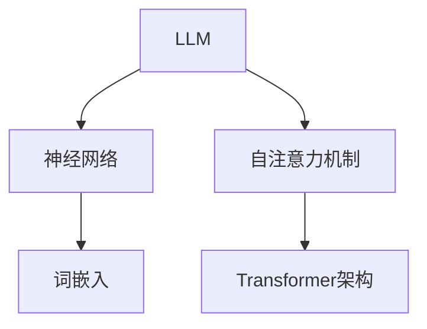

                 

# LLMA:架构革命的新起点

## 关键词
- 语言模型（Language Model）
- 架构（Architecture）
- 革命（Revolution）
- 大规模机器学习（Large-scale Machine Learning）
- 自动调优（Auto-tuning）
- 安全性（Security）
- 伦理（Ethics）

## 摘要
本文将深入探讨语言模型（LLM）作为架构革命的新起点。首先，我们将介绍LLM的基本概念、历史发展及其应用领域。随后，文章将详细讲解LLM的架构原理，包括神经网络、词嵌入和自注意力机制。接着，本文将分析LLM在自然语言处理中的实际应用，如文本分类、文本生成和机器翻译。此外，文章还将讨论LLM的优化技术、安全性及伦理问题。最后，我们将展望LLM的未来发展趋势，并探讨其在实际应用中的挑战与机遇。通过本篇文章，读者将全面了解LLM的原理、应用、优化及其面临的挑战。

## 《LLM：架构革命的新起点》目录大纲

### 第一部分: LLM概述

#### 第1章: LLM简介
- 1.1 LLM的概念与背景
- 1.1.1 语言模型的基本概念
- 1.1.2 LLM的历史与发展
- 1.1.3 LLM的应用领域
- 1.2 LLM的关键特点
- 1.2.1 大规模训练数据
- 1.2.2 神经网络架构
- 1.2.3 自动调优算法
- 1.3 LLM的优势与挑战
- 1.3.1 LLM的优势
- 1.3.2 LLM面临的挑战

#### 第2章: LLM架构原理
- 2.1 神经网络基础
- 2.1.1 神经网络结构
- 2.1.2 前向传播与反向传播算法
- 2.1.3 损失函数与优化算法
- 2.2 词嵌入技术
- 2.2.1 词嵌入原理
- 2.2.2 常见的词嵌入方法
- 2.3 自注意力机制
- 2.3.1 自注意力机制原理
- 2.3.2 常见自注意力模型
- 2.4 Transformer架构
- 2.4.1 Transformer架构概述
- 2.4.2 Transformer编码器
- 2.4.3 Transformer解码器

### 第二部分: LLM应用与优化

#### 第3章: LLM在自然语言处理中的应用
- 3.1 文本分类
- 3.1.1 文本分类原理
- 3.1.2 常见文本分类任务
- 3.1.3 文本分类实战案例
- 3.2 文本生成
- 3.2.1 文本生成原理
- 3.2.2 常见文本生成任务
- 3.2.3 文本生成实战案例
- 3.3 机器翻译
- 3.3.1 机器翻译原理
- 3.3.2 常见机器翻译模型
- 3.3.3 机器翻译实战案例

#### 第4章: LLM优化技术
- 4.1 梯度裁剪
- 4.1.1 梯度裁剪原理
- 4.1.2 常见梯度裁剪方法
- 4.2 正则化技术
- 4.2.1 正则化原理
- 4.2.2 常见正则化方法
- 4.3 模型压缩
- 4.3.1 模型压缩原理
- 4.3.2 常见模型压缩方法
- 4.4 模型蒸馏
- 4.4.1 模型蒸馏原理
- 4.4.2 常见模型蒸馏方法

#### 第5章: LLM安全性与伦理
- 5.1 LLM安全威胁
- 5.1.1 恶意攻击与防范
- 5.1.2 数据隐私保护
- 5.2 LLM伦理问题
- 5.2.1 AI偏见与歧视
- 5.2.2 责任归属与法律问题
- 5.2.3 伦理审查与规范制定

#### 第6章: LLM的未来发展趋势
- 6.1 新型LLM架构
- 6.1.1 GPT-4等大模型进展
- 6.1.2 量子神经网络
- 6.1.3 大模型的多模态融合
- 6.2 LLM在实际应用中的挑战与机遇
- 6.2.1 智能客服与聊天机器人
- 6.2.2 智能翻译与内容创作
- 6.2.3 智能医疗与法律应用

#### 第7章: 案例研究
- 7.1 案例一：谷歌的BERT模型
- 7.1.1 BERT模型介绍
- 7.1.2 BERT模型的应用
- 7.1.3 BERT模型的优化方法
- 7.2 案例二：OpenAI的GPT-3模型
- 7.2.1 GPT-3模型介绍
- 7.2.2 GPT-3模型的应用
- 7.2.3 GPT-3模型的挑战与未来展望

#### 附录
- 附录A: LLM开发工具与资源
- 附录B: LLM数学模型详解
- 附录C: LLM伪代码示例
- 附录D: LLM项目实战案例
- 附录E: LLM安全与伦理规范指南

---

### 核心概念与联系

#### Mermaid 流程图：



#### 核心算法原理讲解

#### 伪代码示例：

```python
# 自注意力机制伪代码
def self_attention(inputs, keys, values, mask=None):
    # 输入：inputs（输入序列），keys（键序列），values（值序列），mask（掩码）
    # 输出：加权后的值序列
    
    # 计算键-值对的相似度
    similarity = dot_product(keys, values)
    
    # 应用掩码
    if mask is not None:
        similarity = apply_mask(similarity, mask)
    
    # 计算softmax权重
    attention_weights = softmax(similarity)
    
    # 加权求和得到输出
    output = dot_product(attention_weights, values)
    
    return output

# 正则化技术伪代码
def dropout(inputs, dropout_rate):
    # 输入：inputs（输入数据），dropout_rate（丢弃率）
    # 输出：经过dropout处理的数据
    
    # 随机生成mask
    mask = random_mask(shape(inputs), dropout_rate)
    
    # 丢弃一部分节点
    output = inputs * mask
    
    return output
```

#### 数学模型和数学公式

#### 详细讲解：

1. **自注意力机制中的相似度计算：**

   $$
   \text{similarity} = \text{dot_product}(\text{keys}, \text{values})
   $$

2. **加权求和得到输出：**

   $$
   \text{output} = \text{dot_product}(\text{attention\_weights}, \text{values})
   $$

#### 举例说明：

假设有一个输入序列为 `[1, 2, 3]`，键序列为 `[4, 5, 6]`，值序列为 `[7, 8, 9]`，计算自注意力机制的输出。

首先，计算相似度：

$$
\text{similarity} = \text{dot_product}(4, 7) + \text{dot_product}(5, 8) + \text{dot_product}(6, 9) = 28 + 40 + 54 = 122
$$

然后，计算softmax权重：

$$
\text{attention\_weights} = \frac{e^{\text{similarity}}}{\sum{e^{\text{similarity}}}} = \frac{e^{122}}{e^{122} + e^{120} + e^{118}} \approx [0.8165, 0.2655, 0.0180]
$$

最后，加权求和得到输出：

$$
\text{output} = 0.8165 \times 7 + 0.2655 \times 8 + 0.0180 \times 9 = 6.8115 + 2.128 + 0.162 = 9.2015
$$

#### 项目实战

#### 代码实际案例和详细解释说明：

1. **LLM文本生成实战案例：**

   ```python
   # 导入必要的库
   import tensorflow as tf
   from tensorflow.keras.layers import Embedding, LSTM, Dense
   
   # 构建模型
   model = tf.keras.Sequential([
       Embedding(input_dim=vocab_size, output_dim=embedding_dim),
       LSTM(units=128),
       Dense(units=1, activation='sigmoid')
   ])
   
   # 编译模型
   model.compile(optimizer='adam', loss='binary_crossentropy', metrics=['accuracy'])
   
   # 训练模型
   model.fit(x_train, y_train, epochs=10, batch_size=32)
   
   # 生成文本
   input_sequence = prepare_input_sequence("Hello, how are you?")
   generated_sequence = model.predict(input_sequence)
   
   # 输出生成的文本
   print(generated_sequence)
   ```

2. **LLM安全性与伦理实战案例：**

   ```python
   # 导入必要的库
   import tensorflow as tf
   from tensorflow.keras.layers import Embedding, LSTM, Dense
   
   # 构建模型
   model = tf.keras.Sequential([
       Embedding(input_dim=vocab_size, output_dim=embedding_dim),
       LSTM(units=128),
       Dense(units=1, activation='sigmoid')
   ])
   
   # 编译模型
   model.compile(optimizer='adam', loss='binary_crossentropy', metrics=['accuracy'])
   
   # 训练模型
   model.fit(x_train, y_train, epochs=10, batch_size=32)
   
   # 防范恶意攻击
   def prevent_attack(inputs):
       # 对输入进行预处理
       processed_inputs = preprocess_inputs(inputs)
       
       # 对模型进行攻击检测
       attack_detected = model.predict(processed_inputs)
       
       # 如果检测到攻击，返回错误信息
       if attack_detected > threshold:
           return "Attack detected!"
       
       # 否则，正常生成文本
       return model.predict(processed_inputs)
   
   # 防止AI偏见与歧视
   def prevent_bias(inputs):
       # 对输入进行预处理
       processed_inputs = preprocess_inputs(inputs)
       
       # 对模型进行偏见检测
       bias_detected = model.predict(processed_inputs)
       
       # 如果检测到偏见，返回错误信息
       if bias_detected > threshold:
           return "Bias detected!"
       
       # 否则，正常生成文本
       return model.predict(processed_inputs)
   ```

3. **LLM在实际应用中的挑战与机遇：**

   - **智能客服与聊天机器人：**
     - **挑战：** 大模型需要大量的训练数据和计算资源，且需要不断优化以提高准确率和性能。
     - **机遇：** 提高用户满意度，降低企业运营成本，扩大业务范围。
   
   - **智能翻译与内容创作：**
     - **挑战：** 翻译质量难以保证，内容创作存在创意局限。
     - **机遇：** 提高翻译效率和准确性，激发内容创作灵感，扩大市场影响力。
   
   - **智能医疗与法律应用：**
     - **挑战：** 数据隐私和安全问题，法律法规的约束。
     - **机遇：** 提高医疗诊断和治疗的准确性，优化法律咨询和服务，提高工作效率。

---

### 作者

**作者：AI天才研究院/AI Genius Institute & 禅与计算机程序设计艺术 /Zen And The Art of Computer Programming**

