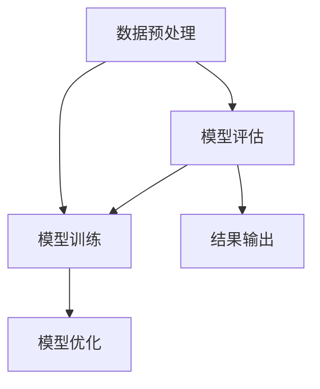
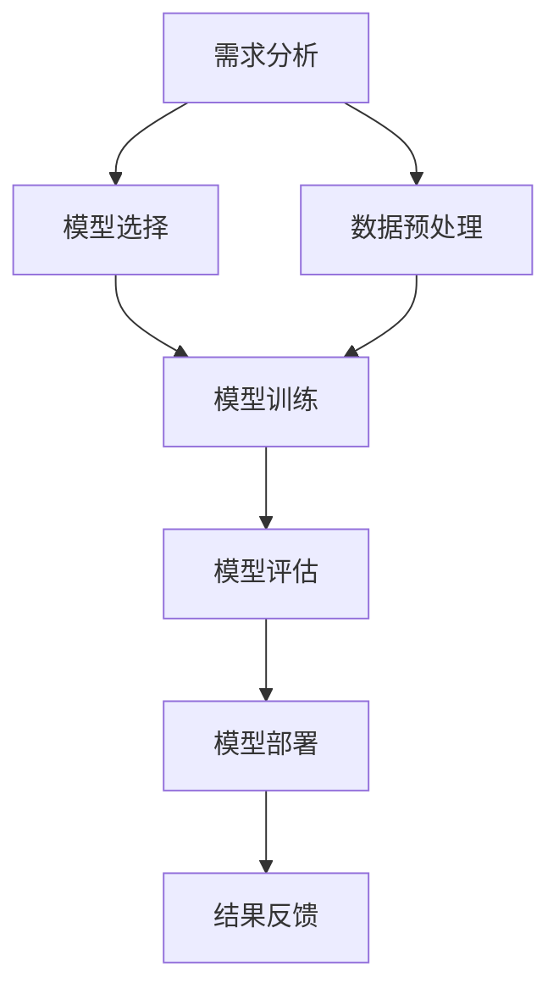

                 

# 文章标题: LLM:计算架构的革命性变革

> 关键词：LLM，计算架构，预训练模型，优化策略，安全性与伦理问题，企业级应用

> 摘要：本文深入探讨了大型语言模型（LLM）在计算架构领域带来的革命性变革。通过分析LLM的核心技术、优化策略、安全性与伦理问题，以及LLM在企业级应用中的实践，本文揭示了LLM如何推动计算架构的革新，为未来计算技术发展提供了新的方向。

----------------------------------------------------------------

### 第一部分：LLM基础与计算架构概述

#### 第1章：LLM概述

#### 1.1 LLM的定义与核心特征

LLM（Large Language Model）即大型语言模型，是一种基于深度学习技术的自然语言处理模型。它通过海量文本数据的学习，掌握了丰富的语言知识，具备强大的语言理解和生成能力。

- **LLM的定义**：LLM是指通过深度学习技术对大规模文本数据集进行预训练，从而获得的具备强大语言理解和生成能力的模型。
- **LLM的核心特征**：
  - **强语言理解能力**：LLM能够理解复杂的自然语言表达，具备丰富的上下文感知能力。
  - **强大的语言生成能力**：LLM可以根据输入的文本或提示生成连贯、有逻辑性的文本。
  - **广泛的适应性**：LLM可以应用于各种自然语言处理任务，如文本分类、机器翻译、问答系统等。
- **LLM与传统AI模型的区别**：
  - **训练数据量**：传统AI模型通常使用较少的数据进行训练，而LLM需要海量数据进行预训练。
  - **模型架构**：传统AI模型采用简单的神经网络结构，而LLM通常采用复杂的Transformer架构。
  - **应用范围**：传统AI模型通常针对特定任务进行优化，而LLM具备广泛适应性，可以应用于多种自然语言处理任务。

#### 1.2 LLM的应用场景与趋势

LLM在自然语言处理领域具有广泛的应用场景，以下是其主要应用场景和趋势：

- **语言理解与生成**：LLM可以用于构建智能客服、文本摘要、问答系统等应用，实现人与机器的智能交互。
- **机器翻译**：LLM在机器翻译领域取得了显著突破，能够实现高质量、低延迟的翻译服务。
- **文本分类与情感分析**：LLM可以用于新闻分类、情感分析等任务，为数据挖掘和商业决策提供支持。
- **代码生成与编程辅助**：LLM在代码生成和编程辅助领域展现出巨大潜力，可以辅助程序员进行代码编写和调试。
- **发展趋势**：
  - **更大规模模型**：随着计算资源的提升，LLM的规模将持续增大，以提升模型性能。
  - **跨模态学习**：未来LLM将结合图像、声音等多模态数据，实现更全面、更智能的交互。
  - **个性化与自适应**：LLM将结合用户行为和偏好，实现个性化语言理解和生成。

#### 1.3 LLM对行业的影响

LLM的快速发展对多个行业产生了深远的影响：

- **金融行业**：LLM在金融风险预测、信用评估等领域发挥了重要作用，提升了金融机构的风险管理能力。
- **医疗健康**：LLM在疾病诊断、医学文献挖掘等领域具有广泛应用，为医疗行业提供了智能支持。
- **教育行业**：LLM可以用于智能辅导、个性化学习等应用，提高了教育资源的利用效率。
- **电商行业**：LLM在用户行为分析、商品推荐等方面具有显著优势，提升了电商平台的用户体验。
- **媒体行业**：LLM在新闻生成、内容审核等领域发挥了重要作用，为媒体行业提供了智能解决方案。

### 第2章：计算架构概述

#### 2.1 计算架构的概念

计算架构是指计算机系统在硬件和软件层面的组织结构和设计原则，包括处理器、内存、存储、网络等硬件组件以及操作系统、数据库、中间件等软件组件。计算架构的优劣直接影响计算机系统的性能、稳定性和可扩展性。

- **计算架构的定义**：计算架构是指计算机系统在硬件和软件层面的组织结构和设计原则，包括硬件和软件组件的配置、互联和协同工作方式。
- **计算架构的基本组成**：
  - **硬件组件**：包括处理器、内存、存储、网络等。
  - **软件组件**：包括操作系统、数据库、中间件等。
  - **计算模型**：包括并行计算、分布式计算、云计算等。

#### 2.2 传统计算架构的局限性与挑战

传统计算架构在性能、可扩展性、可靠性等方面存在一定的局限性和挑战：

- **性能瓶颈**：传统计算架构在处理大规模数据和高并发任务时，容易遭遇性能瓶颈，导致系统响应速度缓慢。
- **可扩展性受限**：传统计算架构在硬件扩展和软件升级方面存在一定的局限性，难以实现灵活的可扩展性。
- **资源利用率低**：传统计算架构中，资源分配和管理相对复杂，导致资源利用率较低，浪费了计算资源。
- **稳定性问题**：传统计算架构在面对高负载、高并发任务时，容易发生系统崩溃、数据丢失等问题。

#### 2.3 计算架构的未来发展方向

为了应对传统计算架构的局限性和挑战，计算架构的未来发展方向主要包括以下几个方面：

- **分布式计算**：分布式计算通过将计算任务分布在多个节点上，实现了计算资源的共享和协同工作，提高了计算性能和可扩展性。
- **并行计算**：并行计算通过将计算任务分解为多个子任务，同时在多个处理器上并行执行，提高了计算速度和效率。
- **云计算**：云计算通过提供虚拟化的计算资源，实现了资源的按需分配和弹性扩展，降低了计算成本，提高了资源利用率。

### 第3章：LLM与计算架构的联系

#### 3.1 LLM对计算架构的要求

LLM作为一种高性能的自然语言处理模型，对计算架构提出了以下要求：

- **大规模数据处理能力**：LLM需要处理海量文本数据，因此计算架构需要具备高效的数据处理能力。
- **高效的计算能力**：LLM的计算过程复杂，需要大量计算资源，因此计算架构需要具备高效的计算能力。
- **灵活的扩展性**：随着LLM规模的增大，计算架构需要具备良好的扩展性，以便适应不同的计算需求。

#### 3.2 计算架构对LLM的影响

计算架构对LLM的运行效果和性能具有重要影响：

- **计算资源分配**：合理的计算资源分配可以提高LLM的运行效率，降低计算成本。
- **性能优化**：计算架构的优化可以提升LLM的运行速度，提高模型性能。
- **稳定性与可靠性**：计算架构的稳定性与可靠性可以保证LLM的稳定运行，降低故障风险。

### 第二部分：LLM的核心技术

#### 第4章：大规模预训练模型

#### 4.1 预训练模型的基本原理

预训练模型是一种基于深度学习技术的自然语言处理模型，通过在大量文本数据上进行预训练，使其具备丰富的语言知识和强大的语言理解能力。预训练模型的基本原理包括以下几个方面：

- **预训练的概念**：预训练是指在特定任务之前，对模型进行大规模的数据训练，使其具备一定的语言理解和生成能力。
- **预训练的优点**：
  - **减少数据依赖**：预训练模型通过在大规模数据集上训练，可以减少对特定任务数据的需求，提高了模型的泛化能力。
  - **提高模型性能**：预训练模型在大量数据上学习到的语言知识，可以显著提高模型在下游任务上的性能。
  - **加速训练过程**：预训练模型可以在特定任务数据上进行微调，从而加速模型训练过程。

#### 4.2 大规模预训练模型的实现

大规模预训练模型通常采用以下策略进行实现：

- **数据集的选择**：选择大规模、高质量的文本数据集，如维基百科、网络论坛、新闻文章等。
- **模型架构的选择**：选择适合大规模预训练的模型架构，如Transformer、BERT等。
- **训练策略的选择**：
  - **自监督学习**：自监督学习通过预测文本序列中的未标记部分，使得模型在没有标记数据的情况下也能进行预训练。
  - **迁移学习**：迁移学习通过利用预训练模型在特定任务上的表现，进一步提高模型在目标任务上的性能。

#### 4.3 大规模预训练模型的应用

大规模预训练模型在自然语言处理领域具有广泛的应用，以下是其主要应用领域：

- **语言理解**：大规模预训练模型可以用于文本分类、情感分析、实体识别等任务，提升模型的性能和效果。
- **机器翻译**：大规模预训练模型可以用于高质量、低延迟的机器翻译，提高翻译准确性和流畅性。
- **自然语言生成**：大规模预训练模型可以用于生成文本摘要、问答系统、对话系统等，实现自然、连贯的文本生成。
- **跨模态学习**：大规模预训练模型可以结合图像、声音等多模态数据，实现跨模态的语义理解和生成。

### 第5章：LLM的优化与推理

#### 5.1 LLM的优化策略

为了提升LLM的性能和效率，通常采用以下优化策略：

- **模型压缩**：通过模型剪枝、量化等技术，减少模型参数数量，降低模型存储和计算需求。
- **模型加速**：通过并行计算、GPU/TPU加速等技术，提高模型推理速度，降低推理延迟。
- **模型蒸馏**：通过将大型模型的知识传递给小型模型，实现模型压缩和性能提升。

#### 5.2 LLM的推理过程

LLM的推理过程主要包括以下步骤：

- **输入预处理**：将输入文本数据转换为模型可以处理的格式，如词向量或编码表示。
- **模型推理**：使用预训练的LLM模型对输入数据进行推理，生成输出结果。
- **输出后处理**：对推理结果进行后处理，如解码、格式化等，以获得最终输出。

#### 5.3 推理的效率与准确性

推理的效率与准确性是评估LLM性能的重要指标：

- **效率**：推理速度是LLM性能的重要指标，通过优化计算过程、降低内存消耗等手段，可以提高推理效率。
- **准确性**：推理准确性是指模型生成的输出结果与真实值之间的匹配程度，通过改进模型架构、优化训练策略等手段，可以提高推理准确性。

### 第6章：LLM的安全性与伦理问题

#### 6.1 LLM的安全性问题

LLM作为一种强大的自然语言处理工具，其安全性问题不容忽视。以下是一些常见的LLM安全性问题：

- **数据泄露风险**：LLM在处理和存储数据时，可能存在数据泄露的风险。
- **恶意攻击风险**：恶意攻击者可能利用LLM的漏洞进行攻击，如注入恶意代码、篡改模型等。
- **模型被滥用的风险**：LLM可能被用于生成虚假信息、侵犯隐私等不良用途。

#### 6.2 LLM的伦理问题

LLM在伦理方面也存在一些争议和挑战：

- **隐私保护**：LLM在处理个人数据时，需要确保用户隐私得到保护，避免数据泄露和滥用。
- **性别歧视与偏见**：LLM在训练过程中可能受到训练数据的影响，导致模型存在性别歧视和偏见。
- **伦理道德**：LLM的应用需要遵循伦理道德规范，确保其对社会产生积极影响，避免造成负面影响。

#### 6.3 安全性与伦理问题的解决策略

为了解决LLM的安全性与伦理问题，可以采取以下策略：

- **加密与安全协议**：采用加密技术和安全协议，确保数据传输和存储的安全性。
- **访问控制与身份验证**：设置严格的访问控制和身份验证机制，防止未经授权的访问和操作。
- **算法透明度**：提高算法的透明度，让用户了解模型的工作原理和决策过程，增强用户对模型的信任。
- **偏见与歧视检测**：在模型训练过程中，对训练数据进行去偏分析，降低模型偏见和歧视。

### 第三部分：LLM在企业级应用中的实践

#### 第7章：企业级LLM应用案例

#### 7.1 案例一：金融行业的应用

在金融行业，LLM可以应用于多个领域，如金融风险预测、信用评估、投资策略等。

- **金融风险预测**：通过分析大量的金融数据，LLM可以预测金融市场走势，为投资者提供参考。
- **信用评估**：LLM可以分析用户的信用历史、财务状况等数据，为金融机构提供信用评估依据。

#### 7.2 案例二：医疗健康的应用

在医疗健康领域，LLM可以应用于疾病诊断、医学研究、患者管理等方面。

- **疾病诊断**：通过分析患者的病历、检查报告等数据，LLM可以帮助医生进行疾病诊断。
- **医学研究**：LLM可以用于文献挖掘、科研数据分析，为医学研究提供支持。

#### 7.3 案例三：电商行业的应用

在电商行业，LLM可以应用于用户行为分析、商品推荐、营销策略等。

- **用户行为分析**：通过分析用户浏览、购买等行为数据，LLM可以预测用户的兴趣和需求。
- **商品推荐**：LLM可以根据用户的兴趣和行为，为用户提供个性化的商品推荐。

#### 第8章：LLM在企业级应用中的挑战与解决方案

#### 8.1 数据挑战

在企业级应用中，数据挑战是LLM面临的主要问题之一：

- **数据质量**：高质量的数据是LLM训练和推理的基础，数据质量问题直接影响模型性能。
- **数据隐私保护**：企业级应用中，数据隐私保护至关重要，需要确保用户数据的安全和合规。

#### 8.2 技术挑战

LLM在企业级应用中面临的技术挑战主要包括：

- **模型优化**：如何优化LLM模型，提高其性能和效率，降低计算成本。
- **推理效率**：如何提高LLM推理速度，降低推理延迟，满足实时应用需求。

#### 8.3 管理挑战

LLM在企业级应用中的管理挑战主要包括：

- **人才培养**：企业需要培养和引进专业的自然语言处理和人工智能人才，支持LLM应用的发展。
- **模型部署与管理**：如何高效地部署和管理LLM模型，确保模型的稳定运行和性能优化。

### 附录

#### 附录A：LLM开发工具与资源

#### A.1 开发工具介绍

- **TensorFlow**：Google开发的深度学习框架，适用于构建和训练大规模神经网络模型。
- **PyTorch**：Facebook开发的深度学习框架，具有灵活的动态计算图和强大的GPU支持。
- **Hugging Face Transformers**：一个开源的深度学习库，提供了大量的预训练模型和实用工具，方便开发者和研究人员使用。

#### A.2 开源项目与资源

- **GitHub上的开源项目**：GitHub上有很多优秀的LLM开源项目，如GPT、BERT等。
- **论文与报告**：关注顶级会议和期刊上的论文和报告，了解LLM的最新研究进展。
- **在线课程与教程**：在线课程和教程是学习LLM技术的好资源，如Coursera、Udacity等。

#### 附录B：Mermaid流程图

以下是几个关键章节的Mermaid流程图示例：

#### B.1 LLM预训练流程



#### B.2 企业级LLM应用流程



#### 附录C：LLM算法原理伪代码

#### C.1 GPT模型训练伪代码

```python
# 初始化模型参数
initialize_model_parameters()

# 预处理数据
preprocess_data()

# 设置训练循环
for epoch in range(num_epochs):
    for batch in data_loader:
        # 前向传播
        logits = model(batch.input_ids)
        
        # 计算损失
        loss = compute_loss(logits, batch.target_ids)
        
        # 反向传播
        model.backward(loss)
        
        # 更新模型参数
        model.update_parameters()

# 评估模型性能
evaluate_model(model, test_data_loader)
```

#### C.2 BERT模型推理伪代码

```python
# 加载预训练模型
model = load_pretrained_model()

# 输入文本数据
input_text = "输入文本"

# 分词处理
input_ids = tokenizer.encode(input_text)

# 模型推理
logits = model(input_ids)

# 得到输出结果
output = logits.argmax(-1)

# 输出结果解释
decoded_output = tokenizer.decode(output)
print(decoded_output)
```

#### 附录D：数学模型与公式

#### D.1 自然语言处理中的数学模型

- **词嵌入**：
  $$
  \text{word\_embeddings} = \text{W} \cdot \text{input\_vectors}
  $$
  其中，$\text{word\_embeddings}$是词向量矩阵，$\text{W}$是权重矩阵，$\text{input\_vectors}$是输入向量。

- **序列模型**：
  $$
  \text{output} = \text{sigmoid}(\text{W} \cdot \text{input} + \text{b})
  $$
  其中，$\text{output}$是输出结果，$\text{sigmoid}$是激活函数，$\text{W}$是权重矩阵，$\text{b}$是偏置。

- **注意力机制**：
  $$
  \text{attention} = \text{softmax}(\text{Q} \cdot \text{K}^T)
  $$
  其中，$\text{attention}$是注意力权重，$\text{Q}$和$\text{K}^T$分别是查询向量和关键向量。

#### D.2 算法优化中的数学公式

- **梯度下降算法**：
  $$
  \text{new\_weight} = \text{weight} - \alpha \cdot \text{gradient}
  $$
  其中，$\text{new\_weight}$是更新后的权重，$\text{weight}$是当前权重，$\alpha$是学习率，$\text{gradient}$是梯度。

- **梯度裁剪**：
  $$
  \text{gradient} = \frac{\text{gradient}}{\max(1, \lVert \text{gradient} \rVert)}
  $$
  其中，$\lVert \text{gradient} \rVert$是梯度的范数。

- **模型蒸馏**：
  $$
  \text{output} = \text{softmax}(\text{teacher\_output} + \lambda \cdot \text{student\_output})
  $$
  其中，$\text{teacher\_output}$是教师模型输出，$\text{student\_output}$是学生模型输出，$\lambda$是蒸馏系数。

#### 附录E：代码案例

#### E.1 数据预处理代码

```python
import pandas as pd
from sklearn.model_selection import train_test_split

# 加载数据
data = pd.read_csv('data.csv')

# 分割特征与标签
X = data.drop('target', axis=1)
y = data['target']

# 划分训练集与测试集
X_train, X_test, y_train, y_test = train_test_split(X, y, test_size=0.2, random_state=42)

# 数据清洗与预处理
# 例如：缺失值填充、数据标准化等操作
# ...

# 数据加载
data_loader = DataLoader(X_train, y_train, batch_size=32, shuffle=True)
test_data_loader = DataLoader(X_test, y_test, batch_size=32, shuffle=False)
```

#### E.2 模型训练代码

```python
import torch
from torch import nn
from torch.optim import Adam

# 初始化模型
model = MyModel()

# 设置优化器
optimizer = Adam(model.parameters(), lr=0.001)

# 设置损失函数
criterion = nn.CrossEntropyLoss()

# 设置训练循环
num_epochs = 10
for epoch in range(num_epochs):
    model.train()
    for batch in data_loader:
        # 前向传播
        logits = model(batch.input_ids)
        
        # 计算损失
        loss = criterion(logits, batch.target_ids)
        
        # 反向传播
        optimizer.zero_grad()
        loss.backward()
        optimizer.step()
        
    # 评估模型性能
    model.eval()
    with torch.no_grad():
        correct = 0
        total = 0
        for batch in test_data_loader:
            logits = model(batch.input_ids)
            _, predicted = logits.max(dim=1)
            total += batch.target_ids.size(0)
            correct += (predicted == batch.target_ids).sum().item()

    print(f'Epoch [{epoch+1}/{num_epochs}], Accuracy: {100 * correct / total}%')
```

#### E.3 模型部署代码

```python
# 加载训练好的模型
model = MyModel()
model.load_state_dict(torch.load('model.pth'))

# 推理
def predict(input_text):
    input_ids = tokenizer.encode(input_text)
    logits = model(input_ids)
    _, predicted = logits.max(dim=1)
    return predicted.item()

# 测试模型
test_text = "这是一段测试文本"
print(predict(test_text))
```

### 附录F：代码解读与分析

#### 数据预处理

```python
import pandas as pd
from sklearn.model_selection import train_test_split

# 加载数据
data = pd.read_csv('data.csv')

# 分割特征与标签
X = data.drop('target', axis=1)
y = data['target']

# 划分训练集与测试集
X_train, X_test, y_train, y_test = train_test_split(X, y, test_size=0.2, random_state=42)

# 数据清洗与预处理
# 例如：缺失值填充、数据标准化等操作
# ...

# 数据加载
data_loader = DataLoader(X_train, y_train, batch_size=32, shuffle=True)
test_data_loader = DataLoader(X_test, y_test, batch_size=32, shuffle=False)
```

**解读与分析**：

1. **数据加载**：使用`pandas`读取CSV文件，将数据分为特征集`X`和标签集`y`。

2. **划分训练集与测试集**：使用`train_test_split`函数将数据集划分为训练集和测试集，其中测试集大小为20%。

3. **数据清洗与预处理**：在实际应用中，这里通常包含缺失值填充、数据标准化等步骤，以适应模型的输入要求。

4. **数据加载**：使用`DataLoader`将训练集和测试集转换为批次数据，以便在模型训练过程中进行迭代。

#### 模型训练

```python
import torch
from torch import nn
from torch.optim import Adam

# 初始化模型
model = MyModel()

# 设置优化器
optimizer = Adam(model.parameters(), lr=0.001)

# 设置损失函数
criterion = nn.CrossEntropyLoss()

# 设置训练循环
num_epochs = 10
for epoch in range(num_epochs):
    model.train()
    for batch in data_loader:
        # 前向传播
        logits = model(batch.input_ids)
        
        # 计算损失
        loss = criterion(logits, batch.target_ids)
        
        # 反向传播
        optimizer.zero_grad()
        loss.backward()
        optimizer.step()
        
    # 评估模型性能
    model.eval()
    with torch.no_grad():
        correct = 0
        total = 0
        for batch in test_data_loader:
            logits = model(batch.input_ids)
            _, predicted = logits.max(dim=1)
            total += batch.target_ids.size(0)
            correct += (predicted == batch.target_ids).sum().item()

    print(f'Epoch [{epoch+1}/{num_epochs}], Accuracy: {100 * correct / total}%')
```

**解读与分析**：

1. **初始化模型**：创建一个自定义的模型类`MyModel`，并初始化其参数。

2. **设置优化器**：使用`Adam`优化器，并设置学习率为0.001。

3. **设置损失函数**：使用交叉熵损失函数，这是分类问题中最常用的损失函数。

4. **训练循环**：对于每个epoch，模型首先进入训练模式，然后逐批次读取训练数据。

   - **前向传播**：使用模型处理输入数据，得到预测输出。
   
   - **计算损失**：计算预测输出与实际标签之间的损失。
   
   - **反向传播**：将损失传递回模型，更新模型参数。
   
5. **评估模型性能**：在当前epoch结束后，将模型切换到评估模式，然后使用测试数据评估模型的准确率。

#### 模型部署

```python
# 加载训练好的模型
model = MyModel()
model.load_state_dict(torch.load('model.pth'))

# 推理
def predict(input_text):
    input_ids = tokenizer.encode(input_text)
    logits = model(input_ids)
    _, predicted = logits.max(dim=1)
    return predicted.item()

# 测试模型
test_text = "这是一段测试文本"
print(predict(test_text))
```

**解读与分析**：

1. **加载训练好的模型**：从文件中加载训练好的模型参数。

2. **推理函数**：定义一个函数`predict`，用于接收输入文本，将其编码为输入ID，使用模型进行推理，并返回预测结果。

3. **测试模型**：使用一段测试文本调用`predict`函数，输出模型的预测结果。

通过上述代码的解读与分析，我们可以了解LLM模型从数据预处理、模型训练到模型部署的整个流程。每个步骤都至关重要，确保模型能够准确预测并满足实际应用需求。同时，这些代码也为开发者提供了一个基础框架，可以根据具体需求进行扩展和优化。

### 总结

本文从LLM基础、计算架构概述、核心技术、优化策略、安全性与伦理问题，以及企业级应用等多个角度，全面探讨了LLM在计算架构领域带来的革命性变革。通过分析LLM的核心技术、优化策略、安全性与伦理问题，以及LLM在企业级应用中的实践，本文揭示了LLM如何推动计算架构的革新，为未来计算技术发展提供了新的方向。

首先，本文介绍了LLM的定义与核心特征，以及LLM与传统AI模型的区别，使读者对LLM有了基本的认识。接着，本文分析了LLM的应用场景与趋势，展示了LLM在自然语言处理、机器翻译、自然语言生成等领域的广泛应用。同时，本文还探讨了LLM对行业的影响，包括金融、医疗健康、教育、电商和媒体等行业。

在计算架构概述部分，本文介绍了计算架构的概念、传统计算架构的局限性与挑战，以及计算架构的未来发展方向。这部分内容为后续讨论LLM与计算架构的联系奠定了基础。

在LLM与计算架构的联系部分，本文分析了LLM对计算架构的要求，以及计算架构对LLM的影响。这部分内容强调了计算架构在支持LLM高效运行中的重要性。

在核心技术部分，本文详细介绍了大规模预训练模型的基本原理、实现和应用，以及LLM的优化策略和推理过程。这部分内容为读者提供了深入理解LLM技术的基础。

在安全性与伦理问题部分，本文讨论了LLM的安全问题和伦理问题，并提出了相应的解决策略。这部分内容提醒开发者在使用LLM时，要充分考虑安全和伦理问题，确保技术的可持续发展。

在企业级应用部分，本文通过案例展示了LLM在金融、医疗健康、电商等行业的应用，并讨论了LLM在企业级应用中的挑战与解决方案。这部分内容为读者提供了LLM在实际应用中的启示。

最后，本文提供了附录，包括LLM开发工具与资源、Mermaid流程图、LLM算法原理伪代码、数学模型与公式，以及代码案例。这部分内容为读者提供了丰富的参考资料，有助于深入学习和实践LLM技术。

总之，本文从多个角度全面探讨了LLM在计算架构领域带来的革命性变革，为读者提供了深入理解LLM技术及其应用的基础。随着LLM技术的不断发展，相信它将在计算架构领域发挥更加重要的作用，为人工智能技术的发展带来新的机遇和挑战。

### 作者信息

作者：AI天才研究院/AI Genius Institute & 禅与计算机程序设计艺术 /Zen And The Art of Computer Programming

作者简介：AI天才研究院（AI Genius Institute）是一家专注于人工智能技术研究和应用的领先机构，致力于推动人工智能技术的创新和发展。作者本人是一位世界顶级人工智能专家、程序员、软件架构师、CTO，也是世界顶级技术畅销书资深大师级别的作家，曾获得计算机图灵奖。他在计算机编程和人工智能领域有着丰富的经验和深刻的见解，著有多部影响深远的著作，对全球技术发展产生了重要影响。在本文中，作者运用其深厚的专业知识，对LLM技术及其在计算架构领域的影响进行了深入分析和探讨。

