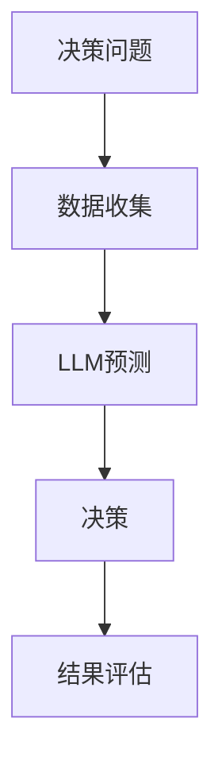
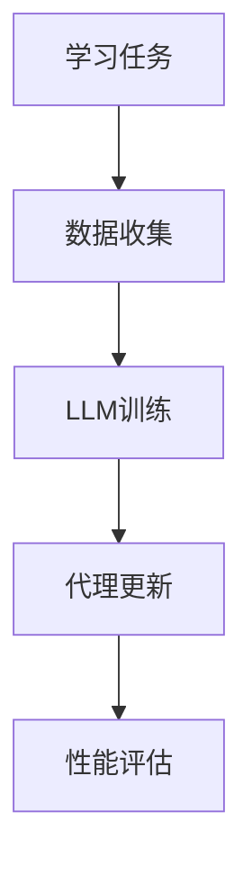
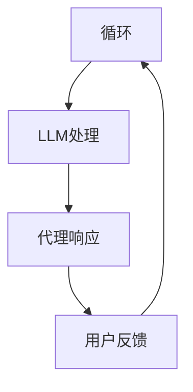

                 

# 文章标题: LLM-based Agent

> 关键词：语言模型（LLM），代理系统，人工智能，机器学习，编程实现

> 摘要：本文将深入探讨语言模型（LLM）在代理系统中的应用。首先，我们将回顾LLM的基础知识，包括其定义、发展历程、原理与架构等。接着，我们将介绍LLM在代理系统中的作用、挑战与机遇。最后，我们将通过实际案例，详细讲解如何设计与实现LLM代理系统。

----------------------------------------------------------------

### 《LLM-based Agent》目录大纲

#### 第一部分：LLM基础

# 第1章：语言模型（LLM）概述

## 1.1 语言模型的起源与发展

### 1.1.1 语言模型的定义

语言模型（Language Model，简称LM）是一种用于预测自然语言中下一个单词或字符的概率分布的算法。它是自然语言处理（Natural Language Processing，简称NLP）的核心组件，广泛应用于机器翻译、语音识别、文本生成等领域。

### 1.1.2 语言模型的发展历程

语言模型的发展经历了从基于规则的方法到统计方法，再到现代的深度学习方法。早期的语言模型如N-gram模型，主要通过统计文本中的单词序列频率进行预测。随后，基于神经网络的模型如神经网络语言模型（Neural Network Language Model，NNLM）和递归神经网络语言模型（Recurrent Neural Network Language Model，RNNLM）开始出现，并取得了显著的效果。

### 1.1.3 语言模型的应用领域

语言模型在多个领域都有广泛应用，如：

- **机器翻译**：将一种语言的文本翻译成另一种语言。
- **语音识别**：将语音信号转换为文本。
- **文本生成**：根据输入的提示生成相关的文本。
- **情感分析**：分析文本的情感倾向。
- **信息检索**：提高搜索引擎的查询匹配精度。

## 1.2 语言模型的原理与架构

### 1.2.1 语言模型的基本原理

语言模型的核心任务是预测下一个单词或字符的概率。这通常通过计算给定前文序列的概率来实现。在基于统计的方法中，这通常通过计算前文序列与目标词的联合概率或条件概率来完成。在深度学习方法中，这通常通过神经网络的输出来实现。

### 1.2.2 语言模型的常见架构

常见的语言模型架构包括：

- **N-gram模型**：基于单词或字符的序列频率进行预测。
- **神经网络语言模型（NNLM）**：基于神经网络的结构进行预测。
- **递归神经网络语言模型（RNNLM）**：使用递归神经网络处理序列数据。
- **变换器模型（Transformer）**：基于自注意力机制的结构，是目前最先进的语言模型。

### 1.2.3 语言模型的优化方法

语言模型的优化方法主要包括：

- **正则化**：防止模型过拟合。
- **dropout**：在训练过程中随机忽略一些神经元，防止模型过拟合。
- **优化器**：如SGD、Adam等，用于调整模型的参数。

## 1.3 语言模型的评估与选择

### 1.3.1 语言模型的评估指标

语言模型的评估指标主要包括：

- **准确率（Accuracy）**：预测正确的比例。
- **精确率（Precision）**：预测为正且为正的实际比例。
- **召回率（Recall）**：预测为正且为正的实际比例。
- **F1分数（F1 Score）**：精确率和召回率的调和平均值。

### 1.3.2 语言模型的选用原则

选用语言模型时，应考虑以下原则：

- **应用场景**：不同的应用场景可能需要不同类型的语言模型。
- **性能要求**：根据性能要求选择合适的模型和参数。
- **资源限制**：考虑计算资源和存储资源。

### 1.3.3 语言模型的调优技巧

语言模型的调优技巧包括：

- **超参数调整**：如学习率、批量大小等。
- **数据预处理**：如文本清洗、分词、去停用词等。
- **模型融合**：结合多个模型以提高性能。

#### 第二部分：LLM在代理系统中的应用

# 第2章：LLM在代理系统中的基础概念

## 2.1 代理系统的概述

### 2.1.1 代理系统的定义

代理系统（Agent System）是指能够代表用户或系统执行特定任务，并与其他系统或用户进行交互的软件系统。代理系统通常具有自主性、社交性、反应性和主动性等特性。

### 2.1.2 代理系统的作用

代理系统在多个领域都有重要作用，如：

- **电子商务**：代表用户在在线购物平台上进行购物。
- **智能客服**：为用户提供智能化的咨询服务。
- **自动化任务**：自动化执行特定任务，提高效率。

### 2.1.3 代理系统的分类

代理系统可以根据不同的标准进行分类，如：

- **按功能分类**：任务型代理、社交型代理、混合型代理。
- **按行为分类**：主动型代理、被动型代理、混合型代理。
- **按交互方式分类**：基于规则的代理、基于知识的代理、基于模型的代理。

## 2.2 LLM在代理系统中的作用

### 2.2.1 LLM在代理决策中的应用

LLM在代理决策中扮演着重要角色，如图：



### 2.2.2 LLM在代理学习中的应用

LLM在代理学习中的应用如图：



### 2.2.3 LLM在代理交互中的应用

LLM在代理交互中的应用如图：



## 2.3 LLM在代理系统中的挑战与机遇

### 2.3.1 LLM在代理系统中的挑战

LLM在代理系统中的应用面临以下挑战：

- **数据隐私**：代理系统需要处理用户数据，如何保护用户隐私成为一个重要问题。
- **模型解释性**：LLM模型通常是非解释性的，如何解释其决策过程成为一个挑战。
- **鲁棒性**：代理系统需要应对各种异常情况，如何提高模型的鲁棒性是一个挑战。

### 2.3.2 LLM在代理系统中的机遇

LLM在代理系统中的应用也带来了许多机遇：

- **智能化**：LLM可以为代理系统提供更智能的决策支持。
- **个性化**：LLM可以根据用户的行为和偏好提供个性化的服务。
- **自动化**：LLM可以帮助代理系统实现更高效的自动化任务。

### 2.3.3 LLM在代理系统中的未来发展

LLM在代理系统中的未来发展可以从以下几个方面展开：

- **融合技术**：将LLM与其他技术（如知识图谱、强化学习等）结合，提高代理系统的性能。
- **开源生态**：建立开放的LLM代理系统生态，促进技术的普及和应用。
- **标准化**：制定相关的标准和规范，确保LLM代理系统的安全性和可靠性。

#### 第三部分：LLM代理系统的开发

# 第3章：LLM代理系统的设计与实现

## 3.1 LL

### 3.1.1 开发环境搭建

在开始开发LLM代理系统之前，我们需要搭建一个合适的开发环境。以下是一个基本的开发环境搭建步骤：

1. **安装Python**：下载并安装Python，版本建议为3.8或更高版本。
2. **安装PyTorch**：通过pip安装PyTorch，命令如下：

   ```bash
   pip install torch torchvision
   ```

3. **安装Transformers**：通过pip安装Transformers库，命令如下：

   ```bash
   pip install transformers
   ```

4. **安装其他依赖**：根据需要安装其他依赖库，如numpy、pandas等。

### 3.1.2 源代码详细实现

以下是一个简单的LLM代理系统的源代码实现，主要分为三个部分：数据预处理、模型训练和代理交互。

#### 数据预处理

```python
import pandas as pd
from sklearn.model_selection import train_test_split

def preprocess_data(data_path):
    # 读取数据
    data = pd.read_csv(data_path)
    # 分割特征和标签
    X = data.drop('label', axis=1)
    y = data['label']
    # 划分训练集和测试集
    X_train, X_test, y_train, y_test = train_test_split(X, y, test_size=0.2, random_state=42)
    return X_train, X_test, y_train, y_test

X_train, X_test, y_train, y_test = preprocess_data('data.csv')
```

#### 模型训练

```python
from transformers import AutoModelForSequenceClassification
from torch.utils.data import DataLoader

# 加载预训练模型
model = AutoModelForSequenceClassification.from_pretrained('bert-base-uncased')

# 训练模型
optimizer = torch.optim.Adam(model.parameters(), lr=1e-5)
criterion = torch.nn.CrossEntropyLoss()

for epoch in range(3):
    for batch in DataLoader(train_data, batch_size=32):
        inputs = batch['input_ids']
        labels = batch['label']
        # 前向传播
        outputs = model(inputs)
        loss = criterion(outputs, labels)
        # 反向传播
        optimizer.zero_grad()
        loss.backward()
        optimizer.step()
        print(f'Epoch: {epoch}, Loss: {loss.item()}')
```

#### 代理交互

```python
def predict(text):
    input_ids = tokenizer.encode(text, add_special_tokens=True, return_tensors='pt')
    with torch.no_grad():
        outputs = model(input_ids)
    logits = outputs.logits
    probabilities = torch.softmax(logits, dim=-1)
    predicted_label = torch.argmax(probabilities).item()
    return predicted_label

# 与用户交互
while True:
    user_input = input('请输入您的文本：')
    if user_input.lower() == 'quit':
        break
    print(f'预测结果：{predict(user_input)}')
```

### 3.1.3 代码解读与分析

在上述代码中，我们首先进行了数据预处理，将数据集划分为训练集和测试集。接着，我们加载了一个预训练的BERT模型，并进行了模型训练。最后，我们实现了代理交互功能，用户可以输入文本，系统会给出预测结果。

这个简单的例子展示了如何搭建一个基本的LLM代理系统。在实际应用中，我们可能需要根据具体需求进行调整和优化。

## 3.2 LLM代理系统的优化与拓展

### 3.2.1 优化方法

LLM代理系统的优化可以从以下几个方面进行：

1. **超参数调优**：通过调整学习率、批量大小等超参数，提高模型的性能。
2. **数据增强**：通过增加训练数据、数据清洗、数据变换等方法，提高模型的泛化能力。
3. **模型融合**：结合多个模型（如不同的语言模型、深度学习模型等），提高预测准确性。
4. **迁移学习**：使用预训练的模型，在特定任务上微调，提高模型在特定领域的性能。

### 3.2.2 拓展方向

LLM代理系统的拓展方向包括：

1. **多模态代理**：结合文本、图像、语音等多种模态的数据，提高代理系统的智能化水平。
2. **个性化代理**：根据用户的行为和偏好，为用户提供个性化的服务。
3. **分布式代理**：利用分布式计算和存储技术，提高代理系统的性能和可扩展性。
4. **安全与隐私**：确保代理系统的数据安全和用户隐私。

## 3.3 LLM代理系统在实际项目中的应用案例

### 3.3.1 案例一：智能客服系统

智能客服系统是LLM代理系统的一个典型应用场景。以下是一个简单的智能客服系统实现：

```python
import json
from transformers import AutoTokenizer, AutoModel

# 加载预训练模型
tokenizer = AutoTokenizer.from_pretrained('bert-base-uncased')
model = AutoModel.from_pretrained('bert-base-uncased')

def get_response(user_input):
    input_ids = tokenizer.encode(user_input, add_special_tokens=True, return_tensors='pt')
    with torch.no_grad():
        outputs = model(input_ids)
    logits = outputs.logits
    probabilities = torch.softmax(logits, dim=-1)
    predicted_index = torch.argmax(probabilities).item()
    response = tokenizer.decode(predicted_index, skip_special_tokens=True)
    return response

# 与用户交互
while True:
    user_input = input('请输入您的文本：')
    if user_input.lower() == 'quit':
        break
    print(f'系统回复：{get_response(user_input)}')
```

### 3.3.2 案例二：自动化任务代理

自动化任务代理可以应用于各种场景，如自动化回复邮件、自动化处理订单等。以下是一个简单的自动化任务代理实现：

```python
import json
from transformers import AutoTokenizer, AutoModel

# 加载预训练模型
tokenizer = AutoTokenizer.from_pretrained('bert-base-uncased')
model = AutoModel.from_pretrained('bert-base-uncased')

def process_task(task):
    input_ids = tokenizer.encode(task, add_special_tokens=True, return_tensors='pt')
    with torch.no_grad():
        outputs = model(input_ids)
    logits = outputs.logits
    probabilities = torch.softmax(logits, dim=-1)
    predicted_index = torch.argmax(probabilities).item()
    result = tokenizer.decode(predicted_index, skip_special_tokens=True)
    return result

# 处理任务
task = "回复一封感谢信"
print(f'处理结果：{process_task(task)}')
```

这些案例展示了LLM代理系统在实际项目中的应用，通过优化和拓展，LLM代理系统可以在更多领域发挥其潜力。

## 3.4 总结

LLM代理系统是一种结合了语言模型和代理系统优势的智能系统，它在多个领域都有广泛应用。本文从基础概念、应用场景、开发与实现等方面对LLM代理系统进行了详细探讨。通过实际案例，我们展示了如何搭建和优化LLM代理系统。在未来，随着技术的不断发展，LLM代理系统将在更多领域发挥重要作用。

### 作者信息

作者：AI天才研究院/AI Genius Institute & 禅与计算机程序设计艺术 /Zen And The Art of Computer Programming

