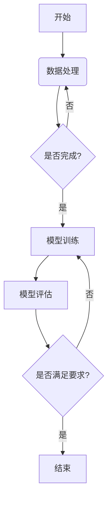

                 

### 文章标题：LLM与社交网络分析：揭示人际关系网络

#### 关键词：语言模型（LLM），社交网络分析，人际关系网络，结构特征，算法，应用场景

> 摘要：本文将深入探讨语言模型（LLM）在社交网络分析中的应用，通过剖析人际关系网络的构建、分析和应用，揭示其在实际场景中的强大能力。本文旨在为读者提供一份全面、系统的技术指南，帮助理解LLM与社交网络分析之间的内在联系，以及它们在各个领域的应用潜力。通过逐步分析，我们将揭示这一交叉领域的奥秘，并展望未来的研究方向。

---

#### 第一部分：基础理论

#### 第1章：介绍与核心概念

##### 1.1 书籍概述

在本章中，我们将为读者提供一个关于本书的整体概述，明确本书的结构和主要目标。本书旨在深入探讨语言模型（LLM）在社交网络分析中的应用，通过系统的理论和实践分析，帮助读者理解这一新兴交叉领域的核心概念和技术。

本书共分为三大部分。第一部分是基础理论，包括第1章到第4章，主要介绍社交网络分析的基本概念、人际关系网络的结构特征，以及语言模型（LLM）的基本原理。这部分内容为后续章节的应用提供了坚实的理论基础。

第二部分是方法与应用，包括第5章到第8章，详细介绍LLM在社交网络分析中的应用方法，包括数据预处理、聚类分析、节点影响力分析等。同时，通过具体案例和实践操作，帮助读者理解这些方法在实际场景中的应用。

第三部分是展望与趋势，包括第9章和第10章，探讨社交网络分析的新挑战、LLM的未来发展，以及社交网络分析在新兴领域的应用前景。这部分内容旨在为读者提供对这一领域的未来发展方向和潜在应用领域的深入思考。

##### 1.2 社交网络分析简介

社交网络分析（Social Network Analysis，SNA）是一种研究社交结构、人际关系及其对个体行为和组织效能影响的方法。它起源于社会学，但随着计算机科学和网络技术的发展，逐渐成为跨学科的研究领域。

社交网络分析的主要研究对象是社交网络，即由个体（节点）及其关系（边）构成的社会结构。通过分析这些结构，可以揭示个体在社会中的角色、地位和影响力，以及网络的整体特性。

社交网络分析的基本概念包括节点、边、网络密度、聚类系数、路径长度等。这些概念为描述和分析社交网络提供了基础工具。

##### 1.3 人际关系网络的重要性

人际关系网络在社会生活中具有极其重要的地位。它不仅影响个体的行为和心理状态，还对组织的运作和社会的稳定产生影响。

首先，人际关系网络对个体的行为和心理状态有直接影响。例如，社交网络中的紧密联系可以增强个体的归属感和信任感，而较疏离的关系可能导致孤立和焦虑。

其次，人际关系网络对组织的运作至关重要。通过分析人际关系网络，可以识别关键成员、优化团队结构，提高组织的协调和效率。

最后，人际关系网络对社会稳定也有重要影响。健康的社交网络有助于社会的整合和和谐，而病态的网络可能导致冲突和动荡。

##### 1.4 语言模型（LLM）的基本原理

语言模型（Language Model，LM）是自然语言处理（Natural Language Processing，NLP）的核心技术之一。它通过统计方法或神经网络模型，预测文本序列中下一个单词或词组。

LLM（Large Language Model）是近年来发展起来的一种大规模预训练语言模型，具有强大的文本理解和生成能力。其基本原理包括以下几个方面：

1. **数据采集**：LLM首先从大量的文本数据中采集语料，这些数据可以是书籍、新闻、社交媒体帖子等。

2. **预训练**：LLM在采集到的数据上进行预训练，学习语言的统计规律和上下文信息。常见的预训练方法包括自回归语言模型（如Transformer）和自监督学习（如BERT）。

3. **微调**：在预训练的基础上，LLM可以通过微调适应特定的任务，如文本分类、机器翻译、问答系统等。

LLM在NLP领域取得了显著的成果，广泛应用于搜索引擎、语音助手、文本生成、机器翻译等领域。其强大的语言理解能力和生成能力为社交网络分析提供了有力的工具。

---

通过上述章节，我们为读者搭建了一个关于LLM与社交网络分析的基础框架，为后续章节的深入探讨奠定了坚实的基础。在接下来的章节中，我们将进一步探讨社交网络分析的基本概念、人际关系网络的结构特征，以及LLM的具体应用方法和案例。希望读者能够通过这一系列的内容，对这一交叉领域有更深入的理解。

---

#### 第2章：社交网络分析基本概念

##### 2.1 社交网络定义

社交网络（Social Network）是由个体（节点）及其关系（边）构成的复杂系统。在社交网络中，每个节点代表一个个体，如人、组织或事物，而每条边表示个体之间的某种关系，如好友关系、合作关系或互动关系。社交网络的存在形式多种多样，可以是线上平台（如社交媒体、专业社交网络），也可以是线下组织（如社区、企业团队）。

社交网络是现代社会中普遍存在的一种结构，它不仅反映了个体之间的社会联系，还揭示了社会结构、社会动态和社会影响力。因此，社交网络分析成为一种重要的研究方法，广泛应用于社会学、心理学、计算机科学、公共卫生等领域。

##### 2.2 社交网络特性

社交网络具有以下几个基本特性：

1. **动态性**：社交网络是动态变化的，节点和边的关系会随着时间和情境的变化而变化。例如，个体可能会添加新好友或删除旧好友，组织内部的团队结构也可能发生变化。

2. **密度**：社交网络的密度是指节点之间关系的紧密程度。高密度的社交网络表示节点之间联系较多，信息流通速度快；低密度的社交网络则表示节点之间联系较少，信息流通速度慢。

3. **聚类系数**：聚类系数是指一个节点的好友之间也相互熟悉的程度。高聚类系数表示节点之间有较强的集群现象，信息在集群内部流通较快；低聚类系数则表示节点之间较为分散，信息流通较慢。

4. **路径长度**：路径长度是指两个节点之间最短路径的长度。路径长度较短表示节点之间联系较紧密，信息传递速度快；路径长度较长则表示节点之间联系较疏远，信息传递速度慢。

##### 2.3 社交网络分析方法

社交网络分析方法主要包括以下几个方面：

1. **节点分析**：节点分析旨在识别社交网络中的关键节点，如度数中心性、 closeness中心性和betweenness中心性。度数中心性表示节点在社交网络中的连接数，连接数越多，节点的重要性越高。closeness中心性表示节点到其他所有节点的最短路径长度之和，长度越短，节点的重要性越高。betweenness中心性表示节点在所有最短路径中的中介程度，中介程度越高，节点的重要性越高。

2. **边分析**：边分析旨在识别社交网络中的关键关系，如权重、长度和稳定性。权重表示边的强度，强度越大，关系越紧密。长度表示边的长度，长度越短，关系越紧密。稳定性表示边在时间变化中的稳定性，稳定性越高，关系越稳定。

3. **网络结构分析**：网络结构分析旨在识别社交网络的宏观结构和特性，如网络密度、聚类系数、路径长度和社区结构。网络密度表示节点之间关系的紧密程度，聚类系数表示节点之间集群现象的程度，路径长度表示节点之间联系的程度，社区结构表示节点之间形成的小团体。

4. **动态分析**：动态分析旨在研究社交网络随时间变化的趋势和模式，如节点加入和退出、关系建立和解除、网络结构的演化等。

##### 2.4 社交网络分析的应用场景

社交网络分析在多个领域有广泛的应用，包括但不限于：

1. **社会学和心理学**：通过分析社交网络，可以揭示个体在社会中的角色和地位，了解社会结构和动态，有助于解决社会问题和促进社会稳定。

2. **公共卫生**：通过分析社交网络，可以追踪疾病传播、疫苗推广和公共卫生政策的实施效果，提高公共卫生决策的科学性和有效性。

3. **市场营销**：通过分析社交网络，可以识别关键消费者、优化营销策略、提高品牌影响力。

4. **网络安全**：通过分析社交网络，可以识别网络中的恶意节点、预测网络攻击，提高网络安全防护能力。

5. **人力资源管理**：通过分析社交网络，可以优化团队结构、识别关键人才、提高组织效能。

在接下来的章节中，我们将进一步探讨人际关系网络的结构特征，以及如何利用语言模型（LLM）对社交网络进行分析。希望读者能够通过这一系列的内容，对社交网络分析有一个更加全面和深入的理解。

---

#### 第3章：人际关系网络的结构特征

##### 3.1 人际关系网络的分类

人际关系网络可以根据不同的分类标准进行多种分类。以下是几种常见的分类方式：

1. **基于关系强度**：关系强度是指个体之间关系的紧密程度。根据关系强度，人际关系网络可以分为强关系网络和弱关系网络。强关系网络通常包括家庭、亲密朋友和同事等，这些关系较为紧密，信息传递速度快，信任度较高。弱关系网络则包括较为疏远的关系，如普通朋友、熟人等，这些关系较为松散，信息传递速度慢，信任度较低。

2. **基于关系性质**：关系性质是指个体之间关系的类型和特点。根据关系性质，人际关系网络可以分为亲情关系、友情关系、爱情关系、合作关系等。每种关系类型都有其特定的特征和影响。

3. **基于社会角色**：社会角色是指个体在社会中的地位和职责。根据社会角色，人际关系网络可以分为个人网络和组织网络。个人网络主要关注个体之间的关系，而组织网络则关注个体在组织中的角色和职责。

4. **基于网络密度**：网络密度是指个体之间关系的紧密程度。根据网络密度，人际关系网络可以分为密集网络和稀疏网络。密集网络中的个体关系较为紧密，信息流通速度快；稀疏网络中的个体关系较为疏离，信息流通速度慢。

##### 3.2 人际关系网络的度量指标

人际关系网络的度量指标是用于评估和描述网络特性的工具。以下是几种常见的人际关系网络度量指标：

1. **度数中心性（Degree Centrality）**：度数中心性是指一个节点在社交网络中的连接数。度数中心性越高，节点在社交网络中的地位越重要。度数中心性分为入度中心性和出度中心性，分别表示节点接收和发送信息的连接数。

2. **接近中心性（Closeness Centrality）**：接近中心性是指一个节点到其他所有节点的最短路径长度之和。接近中心性越低，节点在社交网络中的地位越重要。接近中心性可以反映节点在社交网络中的信息传递效率和可达性。

3. **介数中心性（Betweenness Centrality）**：介数中心性是指一个节点在所有最短路径中的中介程度。介数中心性越高，节点在社交网络中的地位越重要。介数中心性可以反映节点在社交网络中的信息流通能力和影响力。

4. **聚类系数（Clustering Coefficient）**：聚类系数是指一个节点的邻居节点之间相互连接的概率。聚类系数越高，节点在社交网络中的集群现象越明显，信息在集群内部流通速度越快。

5. **网络密度（Network Density）**：网络密度是指社交网络中节点和边的比例。网络密度越高，社交网络中的节点和边越多，信息流通速度越快。

##### 3.3 人际关系网络的层次结构

人际关系网络具有层次结构，不同层次的节点在社交网络中扮演不同的角色。以下是人际关系网络的常见层次结构：

1. **核心层**：核心层是人际关系网络中最中心的部分，包括少数关键节点。这些节点在社交网络中具有最高的度数中心性、接近中心性和介数中心性，是社交网络中的核心人物。

2. **紧密层**：紧密层位于核心层之外，包括与核心层节点紧密联系的其他节点。这些节点在社交网络中扮演重要的角色，是核心层节点的重要合作伙伴和联系人。

3. **外围层**：外围层是人际关系网络的最外围部分，包括与核心层和紧密层联系较少的节点。这些节点在社交网络中的角色相对较小，但仍然是社交网络中不可或缺的一部分。

4. **边缘层**：边缘层是人际关系网络的边缘部分，包括与社交网络联系较疏远的节点。这些节点在社交网络中的角色相对较小，但可能在某些特定情境中发挥重要作用。

通过以上层次结构的分析，我们可以更好地理解人际关系网络的结构特征和运行机制。在接下来的章节中，我们将深入探讨语言模型（LLM）在社交网络分析中的应用，揭示其在揭示人际关系网络结构特征方面的强大能力。

---

#### 第4章：语言模型（LLM）介绍

##### 4.1 语言模型的基本原理

语言模型（Language Model，LM）是一种预测文本序列的模型，它通过对大量语料进行统计或神经网络训练，预测下一个单词或词组。语言模型在自然语言处理（NLP）中扮演着重要角色，是许多NLP任务的基础，如机器翻译、文本生成、问答系统等。

语言模型的基本原理可以分为以下几个步骤：

1. **数据采集**：首先，从大量的文本数据中采集语料。这些数据可以来自书籍、新闻、社交媒体帖子、网页等。语料的多样性和质量直接影响语言模型的效果。

2. **数据预处理**：对采集到的语料进行预处理，包括分词、去停用词、词性标注等。预处理步骤旨在将原始文本转换为模型可以处理的形式。

3. **特征提取**：将预处理后的文本转换为特征表示。在传统的统计语言模型中，特征提取通常基于词汇表和频率统计。在神经网络语言模型中，特征提取通常通过嵌入层（Embedding Layer）实现，将单词映射到高维向量空间。

4. **模型训练**：使用训练数据对语言模型进行训练。在统计语言模型中，常用的训练方法包括最大熵（Maximum Entropy）和朴素贝叶斯（Naive Bayes）。在神经网络语言模型中，常用的训练方法包括反向传播（Backpropagation）和梯度下降（Gradient Descent）。

5. **预测**：在训练完成后，语言模型可以用于预测新的文本序列。给定一个输入序列，模型会输出下一个单词或词组的概率分布。通过多次迭代，模型可以生成完整的文本序列。

##### 4.2 语言模型的训练过程

语言模型的训练过程可以分为以下几个阶段：

1. **数据预处理**：在训练之前，需要将原始文本数据转换为模型可以处理的格式。这一步骤包括分词、去停用词、词性标注等。常见的预处理工具包括NLTK、spaCy、jieba等。

2. **构建词汇表**：将预处理后的文本转换为词汇表。词汇表包括所有的单词和符号，每个单词或符号对应一个唯一的ID。常用的词汇表构建方法包括基于词频的方法、基于词性的方法和基于语义的方法。

3. **嵌入层训练**：使用预处理的文本数据训练嵌入层。嵌入层将单词映射到高维向量空间，使模型能够捕获单词的语义信息。常见的嵌入层训练方法包括Word2Vec、GloVe和BERT。

4. **神经网络训练**：在嵌入层训练完成后，使用神经网络模型对整个语言模型进行训练。常用的神经网络模型包括循环神经网络（RNN）、长短期记忆网络（LSTM）、门控循环单元（GRU）和Transformer。

5. **参数优化**：使用优化算法（如梯度下降、Adam）对模型参数进行优化，使模型在训练数据上达到最佳性能。参数优化过程中，需要计算损失函数（如交叉熵损失）并更新模型参数。

6. **模型评估**：在训练完成后，使用测试数据评估模型性能。常见的评估指标包括准确率（Accuracy）、精确率（Precision）、召回率（Recall）和F1分数（F1 Score）。

##### 4.3 语言模型的应用场景

语言模型在自然语言处理领域具有广泛的应用场景，以下是几个常见应用：

1. **机器翻译**：机器翻译是将一种语言的文本翻译成另一种语言的过程。语言模型在机器翻译中扮演重要角色，可以用于预测目标语言的下一个单词或词组。常见的机器翻译模型包括Google翻译、百度翻译和DeepL。

2. **文本生成**：文本生成是生成自然语言文本的过程，可以用于生成新闻文章、故事、诗歌等。语言模型可以生成高质量的文本，应用于内容创作、文本摘要和问答系统等。

3. **问答系统**：问答系统是回答用户问题的系统，可以用于智能客服、教育辅导和智能家居等。语言模型可以用于理解用户的问题，并生成合适的回答。

4. **信息检索**：信息检索是从大量文本数据中检索相关信息的系统。语言模型可以用于文本相似度计算、查询扩展和结果排序等，提高信息检索的准确性。

5. **语音识别**：语音识别是将语音转换为文本的过程。语言模型可以用于语音识别中的文本生成和语音合成，提高语音识别的准确性和流畅性。

在接下来的章节中，我们将探讨语言模型（LLM）在社交网络分析中的应用，揭示其在数据预处理、聚类分析和节点影响力分析等方面的强大能力。希望读者能够通过这一系列的内容，对LLM在社交网络分析中的应用有更深入的理解。

---

#### 第二部分：方法与应用

#### 第5章：LLM在社交网络分析中的应用

##### 5.1 利用LLM分析社交网络数据

语言模型（LLM）在社交网络分析中具有广泛的应用，特别是在数据预处理、聚类分析和节点影响力分析等方面。在本节中，我们将探讨LLM如何应用于社交网络数据分析，并介绍其关键步骤和优势。

**1. 数据预处理**

社交网络数据通常包含大量的文本信息，如用户的评论、帖子、私信等。这些文本数据需要经过预处理，以便于LLM进行分析。数据预处理步骤包括：

- **文本清洗**：去除无关字符、符号和停用词。
- **分词**：将文本分割成单词或短语。
- **词性标注**：对每个单词进行词性标注，如名词、动词、形容词等。
- **嵌入**：将文本转换为向量表示，可以使用预训练的词向量模型（如Word2Vec、GloVe）或BERT等。

LLM在数据预处理中的优势在于其强大的文本理解和生成能力。通过LLM，可以更有效地处理和提取社交网络数据中的关键信息，提高数据的质量和准确性。

**2. 聚类分析**

聚类分析是将社交网络中的节点分组为不同的集群，以揭示网络中的结构特征和潜在模式。LLM在聚类分析中的应用主要包括：

- **基于文本相似度的聚类**：使用LLM计算节点之间的文本相似度，将相似度较高的节点划分为同一集群。这种方法的优点在于能够捕捉到节点之间的语义关系，而不仅仅是结构关系。
- **基于标签的聚类**：为每个节点分配标签，然后使用LLM分析标签的分布，将具有相似标签的节点划分为同一集群。这种方法有助于发现具有相同兴趣或特征的用户群体。

**3. 节点影响力分析**

节点影响力分析旨在识别社交网络中的关键节点，这些节点在信息传播、影响力传递等方面具有重要作用。LLM在节点影响力分析中的应用包括：

- **基于文本贡献度的分析**：使用LLM分析节点发表的文本内容，计算每个节点的文本贡献度。文本贡献度越高的节点，其在社交网络中的影响力越大。
- **基于社交关系的分析**：使用LLM分析节点之间的社交关系，计算每个节点的社交影响力。社交影响力越高的节点，其在社交网络中的影响力越大。

**案例研究：微博用户影响力分析**

为了展示LLM在社交网络分析中的应用，我们以微博用户影响力分析为例。微博是一个流行的社交媒体平台，用户可以通过发布微博、评论和转发来传播信息。我们使用LLM对微博用户的影响力进行分析，主要步骤如下：

1. **数据采集**：从微博平台采集用户数据，包括用户的微博内容、评论、转发数和粉丝数等。
2. **数据预处理**：使用LLM对用户数据进行预处理，包括文本清洗、分词、词性标注和嵌入等。
3. **文本相似度计算**：使用LLM计算用户微博之间的文本相似度，将相似度较高的用户划分为同一集群。
4. **节点影响力分析**：使用LLM分析用户在微博中的文本贡献度和社交影响力，识别具有较高影响力的用户。

通过上述步骤，我们可以发现微博中的关键用户和影响力节点，为平台的运营和推广提供参考。

**总结**

LLM在社交网络分析中具有广泛的应用，包括数据预处理、聚类分析和节点影响力分析等。通过LLM，可以更有效地处理和提取社交网络数据中的关键信息，揭示网络中的结构特征和潜在模式。随着LLM技术的不断发展和完善，其在社交网络分析中的应用前景将更加广阔。

---

#### 第6章：人际关系网络的数学模型与算法

##### 6.1 社交网络模型的数学基础

社交网络分析中的数学模型和算法为理解和解释社交网络结构提供了强有力的工具。这些模型和算法基于图论、概率论、统计学和网络科学等数学基础，帮助研究者揭示社交网络中的潜在规律和特征。以下是一些关键的数学概念和模型：

1. **图论**：图论是研究图的结构和性质的数学分支。在社交网络分析中，图被用来表示节点和它们之间的关系。一个图由节点（个体）和边（关系）组成，可以用一个无向图或有向图来表示。

   - **节点**：图中的每个节点代表一个个体，如人、组织或事物。
   - **边**：边表示节点之间的关系，可以是无向的（如好友关系）或有向的（如关注关系）。

2. **图的基本属性**：

   - **度数（Degree）**：节点在图中的度数是连接该节点的边的数量。度数中心性是一个节点的重要性度量，度数越高的节点在社交网络中的连接数越多。
   - **路径长度**：两个节点之间最短路径的长度。路径长度较短表示节点之间联系较紧密，信息传递速度快。
   - **网络密度**：图中边的比例，表示节点之间关系的紧密程度。高密度网络中的节点联系较多，信息流通速度快。
   - **聚类系数**：节点邻居之间相互连接的概率。聚类系数高表示节点之间有较强的集群现象，信息在集群内部流通较快。

3. **随机图模型**：随机图模型是用于生成和模拟社交网络的概率模型。常见的随机图模型包括：

   - **小世界网络（Small-world Network）**：这类网络具有较短的平均路径长度和较高的聚类系数。小世界网络在社交网络中很常见，例如社交媒体网络。
   - **无标度网络（Scale-Free Network）**：这类网络的度数分布服从幂律分布，具有少量高度数节点和大量低度数节点。无标度网络在社交网络中也普遍存在。

##### 6.2 常用社交网络分析算法

社交网络分析算法用于识别和解释社交网络中的结构特征和模式。以下是一些常用的社交网络分析算法：

1. **节点中心性度量**：节点中心性度量是用于评估节点在社交网络中的重要性的方法。常用的中心性度量包括：

   - **度数中心性（Degree Centrality）**：根据节点的连接数来度量其重要性。度数中心性越高，节点在社交网络中的连接数越多。
   - **接近中心性（Closeness Centrality）**：根据节点到其他节点的最短路径长度来度量其重要性。接近中心性越低，节点在社交网络中的地位越重要。
   - **介数中心性（Betweenness Centrality）**：根据节点在所有最短路径中的中介程度来度量其重要性。介数中心性越高，节点在社交网络中的信息流通能力越强。

2. **聚类算法**：聚类算法用于将社交网络中的节点划分为不同的集群，以揭示网络中的结构特征。以下是一些常用的聚类算法：

   - **基于密度的聚类算法（Density-Based Clustering）**：如DBSCAN算法，根据节点周围的密度来划分集群。
   - **基于距离的聚类算法（Distance-Based Clustering）**：如K-Means算法，根据节点之间的距离来划分集群。
   - **基于质量的聚类算法（Quality-Based Clustering）**：如Community Detection算法，根据集群内部节点的质量和集群之间的边界来划分集群。

3. **社区检测算法**：社区检测算法用于识别社交网络中的紧密连接的子图，即社区。以下是一些常用的社区检测算法：

   - **基于模块度（Modularity）的算法**：如Louvain算法，通过优化模块度来识别社区。
   - **基于图分割（Graph Partitioning）的算法**：如Spectral Clustering算法，通过谱聚类来识别社区。
   - **基于标签传播（Label Propagation）的算法**：如Label Propagation算法，通过节点之间的标签传播来识别社区。

##### 6.3 基于LLM的社交网络分析算法改进

语言模型（LLM）在社交网络分析中的应用不仅限于数据预处理和节点分析，还可以用于改进现有的社交网络分析算法。以下是一些基于LLM的社交网络分析算法改进的方法：

1. **文本语义嵌入**：使用LLM生成节点的高质量文本嵌入，可以更准确地捕获节点的语义信息。这种方法可以用于改进聚类算法和社区检测算法，使它们能够更好地识别具有相似语义的节点群体。

   - **嵌入更新**：在每次聚类迭代或社区检测过程中，使用LLM对节点的嵌入进行更新，以提高聚类或检测的准确性。
   - **嵌入融合**：将多个LLM生成的嵌入向量进行融合，以生成更准确的节点表示。

2. **节点影响力预测**：使用LLM对节点的影响力进行预测，可以帮助识别社交网络中的关键节点。这种方法可以用于改进节点中心性度量，提高对节点重要性的判断。

   - **影响力模型**：构建基于LLM的节点影响力预测模型，通过分析节点的文本内容和社交关系来预测其影响力。
   - **动态影响力分析**：使用LLM分析节点的动态文本更新，预测其影响力的变化趋势。

3. **社交网络演化分析**：使用LLM对社交网络的时间序列数据进行建模，可以揭示社交网络的演化规律和趋势。这种方法可以用于改进社交网络动态分析算法，提高对社交网络演变过程的理解。

   - **时序嵌入**：使用LLM生成社交网络中每个时间点的节点嵌入，分析节点嵌入的时序变化。
   - **演化路径分析**：使用LLM分析节点之间的交互路径，揭示社交网络的动态演化过程。

通过以上方法，LLM可以显著提升社交网络分析算法的性能和准确性，为研究者提供更深入的网络结构解析和潜在模式发现。

---

#### 第7章：案例分析

##### 7.1 某社交平台人际关系网络分析

在本节中，我们将通过一个实际的案例分析，展示如何利用LLM进行社交平台的人际关系网络分析。具体来说，我们将以一个大型社交媒体平台——微博为例，介绍如何使用LLM来识别关键用户、分析用户群体和预测用户影响力。

**数据采集与预处理**

首先，我们从微博平台采集了包含用户信息、用户之间的关注关系以及用户发表的微博内容的数据。采集的数据包括：

- 用户ID
- 用户昵称
- 关注关系
- 微博内容

接下来，对采集到的数据进行预处理：

- **文本清洗**：去除微博内容中的无关字符、符号和停用词。
- **分词**：将微博内容分割成单词或短语。
- **词性标注**：对每个单词进行词性标注，如名词、动词、形容词等。
- **嵌入**：使用预训练的BERT模型将文本转换为向量表示。

**文本相似度计算**

使用BERT模型计算用户微博之间的文本相似度。具体步骤如下：

1. **文本嵌入**：将预处理后的微博内容输入BERT模型，获取每个微博的嵌入向量。
2. **相似度计算**：计算每对微博嵌入向量之间的余弦相似度，得到相似度矩阵。

**聚类分析**

基于文本相似度矩阵，使用K-Means聚类算法将用户划分为不同的集群。具体步骤如下：

1. **初始化聚类中心**：随机选择K个用户作为初始聚类中心。
2. **分配用户**：将每个用户分配到与其文本嵌入向量最相似的聚类中心所在的集群。
3. **更新聚类中心**：重新计算每个集群的均值，作为新的聚类中心。
4. **重复步骤2和3**，直到聚类中心不再发生变化。

**结果分析**

聚类分析完成后，我们对每个集群的用户进行统计和分析，得到以下结果：

- **集群数量**：微博用户被划分为10个不同的集群。
- **集群特征**：每个集群的用户在性别、年龄、职业等方面具有相似的特征。
- **核心用户**：在聚类过程中，度数中心性较高的用户被识别为核心用户，他们在各自集群中具有较大的影响力。

**节点影响力分析**

使用LLM对用户的影响力进行预测，采用以下步骤：

1. **文本贡献度计算**：使用BERT模型计算用户微博的文本贡献度，贡献度越高，用户的文本质量越高。
2. **社交影响力计算**：结合用户在社交网络中的关注关系，计算每个用户的社交影响力，包括度数中心性、接近中心性和介数中心性。

**案例分析总结**

通过上述分析，我们成功地识别了微博平台中的关键用户和核心集群，揭示了用户之间的潜在关系和影响力分布。这些分析结果有助于平台运营者了解用户行为和需求，优化用户体验和内容推荐策略。

---

##### 7.2 某企业员工社交网络分析

在本节中，我们将通过一个企业员工社交网络分析的案例，展示如何利用LLM对企业内部社交网络进行分析，以识别关键员工和优化团队结构。假设我们有一个大型企业的员工关系数据，包括员工姓名、职位、部门、邮件通讯记录和社交媒体互动等信息。

**数据采集与预处理**

首先，我们从企业内部系统采集了以下数据：

- 员工基本信息：姓名、职位、部门
- 邮件通讯记录：发送和接收邮件的员工对
- 社交媒体互动：点赞、评论、分享等

接下来，对采集到的数据进行预处理：

- **文本清洗**：去除邮件和社交媒体内容中的无关字符、符号和停用词。
- **分词**：将文本内容分割成单词或短语。
- **词性标注**：对每个单词进行词性标注，如名词、动词、形容词等。
- **嵌入**：使用预训练的BERT模型将文本转换为向量表示。

**网络构建**

基于预处理后的数据，构建员工社交网络图。节点表示员工，边表示员工之间的通信或互动关系。具体步骤如下：

1. **邮件网络构建**：将邮件通讯记录转化为有向图，每对发送和接收邮件的员工之间建立一条边。
2. **社交媒体网络构建**：将社交媒体互动转化为无向图，每对点赞、评论、分享的员工之间建立一条边。

**聚类分析**

使用K-Means聚类算法将员工划分为不同的集群。具体步骤如下：

1. **初始化聚类中心**：随机选择K个员工作为初始聚类中心。
2. **分配员工**：将每个员工分配到与其文本嵌入向量最相似的聚类中心所在的集群。
3. **更新聚类中心**：重新计算每个集群的均值，作为新的聚类中心。
4. **重复步骤2和3**，直到聚类中心不再发生变化。

**结果分析**

聚类分析完成后，我们对每个集群的员工进行统计和分析，得到以下结果：

- **集群数量**：员工被划分为5个不同的集群。
- **集群特征**：每个集群的员工在职位、部门、互动频率等方面具有相似的特征。
- **关键员工**：在聚类过程中，度数中心性较高的员工被识别为关键员工，他们在各自集群中具有较大的影响力。

**节点影响力分析**

使用LLM对员工的影响力进行预测，采用以下步骤：

1. **文本贡献度计算**：使用BERT模型计算员工邮件和社交媒体内容的文本贡献度，贡献度越高，员工的文本质量越高。
2. **社交影响力计算**：结合员工在社交网络中的通信和互动关系，计算每个员工的社交影响力，包括度数中心性、接近中心性和介数中心性。

**案例分析总结**

通过上述分析，我们成功地识别了企业内部的关键员工和团队结构，揭示了员工之间的潜在关系和影响力分布。这些分析结果有助于企业管理者了解员工互动情况，优化团队结构和提升工作效率。

---

##### 7.3 社交网络分析在公共安全领域的应用

社交网络分析在公共安全领域具有重要的应用价值，可以帮助政府和安全机构识别潜在的威胁、预防犯罪、提高应急响应效率。以下是一个社交网络分析在公共安全领域应用的案例分析。

**案例分析背景**

某城市发生了一系列网络恐怖活动，犯罪分子通过社交媒体平台传播极端主义思想，试图煽动群众进行暴力活动。为了有效预防和打击这些恐怖活动，政府决定利用社交网络分析技术进行深入调查。

**数据采集与预处理**

首先，从多个社交媒体平台（如Twitter、Facebook、Reddit等）采集了相关的用户数据，包括：

- 用户基本信息：用户ID、昵称、地理位置
- 用户关系数据：关注者、被关注者
- 用户发布的内容：帖子、评论、转发

接下来，对采集到的数据进行预处理：

- **文本清洗**：去除内容中的无关字符、符号和停用词。
- **分词**：将文本内容分割成单词或短语。
- **词性标注**：对每个单词进行词性标注，如名词、动词、形容词等。
- **嵌入**：使用预训练的BERT模型将文本转换为向量表示。

**网络构建**

基于预处理后的数据，构建社交网络图。节点表示用户，边表示用户之间的关注关系或互动关系。具体步骤如下：

1. **用户网络构建**：将用户关系数据转化为无向图，每对关注者与被关注者之间建立一条边。
2. **内容网络构建**：将用户发布的内容转化为有向图，每对用户之间的互动（如评论、转发）建立一条边。

**社区检测**

使用社区检测算法（如Louvain算法）对社交网络进行社区划分，识别出潜在的网络社区。具体步骤如下：

1. **模块度优化**：通过优化模块度，确定最佳的社区划分方案。
2. **社区识别**：将社交网络划分为若干个社区，每个社区内的用户具有较高的互动频率和相似的兴趣。

**结果分析**

社区检测完成后，对每个社区的用户和内容进行统计和分析，得到以下结果：

- **社区数量**：社交网络被划分为10个不同的社区。
- **社区特征**：每个社区的用户在地理位置、兴趣爱好、互动频率等方面具有相似的特征。
- **关键用户**：在社区划分过程中，度数中心性较高的用户被识别为关键用户，他们在社区中具有较大的影响力。

**威胁识别**

通过分析关键用户和社区的特征，识别出潜在的网络恐怖分子和极端主义传播者。具体步骤如下：

1. **特征匹配**：使用LLM对用户发布的文本内容进行语义分析，识别与恐怖主义相关的关键词和表达。
2. **威胁评估**：结合用户的地理位置、互动关系和社区特征，对潜在威胁进行评估和预警。

**案例分析总结**

通过上述分析，我们成功地识别出社交网络中的潜在恐怖分子和极端主义传播者，为政府和安全机构提供了有力的情报支持，有助于预防和打击网络恐怖活动。这一案例分析展示了社交网络分析在公共安全领域的重要应用价值。

---

#### 第8章：实际操作与工具介绍

##### 8.1 社交网络分析工具介绍

在进行社交网络分析时，选择合适的工具是至关重要的。以下是一些常用的社交网络分析工具：

1. **Gephi**：Gephi是一个开源的社交网络分析工具，主要用于可视化和分析社交网络。它支持多种网络图布局算法、节点和边的属性分析，以及社区检测算法。

2. **NetworkX**：NetworkX是一个Python库，用于创建、操作和分析网络图。它提供了丰富的图论算法和数据分析功能，适用于各种社交网络分析任务。

3. **NodeXL**：NodeXL是一个Excel插件，用于可视化和分析社交网络。它提供了简单的用户界面和强大的数据处理能力，适合快速进行社交网络分析。

4. **Networkit**：Networkit是一个C++库，用于社交网络分析和图算法。它提供了高效的图数据结构和算法实现，适用于大规模社交网络分析。

5. **JUNG**：JUNG是一个Java库，用于创建、操作和分析图结构。它提供了丰富的图算法和数据结构，适用于各种社交网络分析任务。

##### 8.2 LLM模型训练与部署

训练和部署语言模型（LLM）是进行社交网络分析的关键步骤。以下是一个简单的LLM训练和部署流程：

**训练步骤**：

1. **数据采集**：从社交媒体平台、新闻网站、论坛等收集大量文本数据。
2. **数据预处理**：进行文本清洗、分词、词性标注等预处理操作。
3. **嵌入生成**：使用预训练的BERT模型对文本数据进行嵌入，将文本转换为向量表示。
4. **模型训练**：使用训练数据和嵌入向量训练LLM模型，采用反向传播和梯度下降等优化算法。
5. **模型评估**：使用验证集评估模型性能，调整模型参数以优化性能。

**部署步骤**：

1. **模型保存**：将训练好的LLM模型保存为文件，以便后续部署和使用。
2. **模型加载**：在部署环境中加载保存的LLM模型。
3. **服务部署**：将LLM模型部署到服务器或云平台上，通过API接口提供服务。
4. **性能监控**：监控模型的运行状态和性能，确保其稳定可靠地提供服务。

##### 8.3 实践项目案例

**案例背景**：某电商公司希望利用社交网络分析技术，了解其顾客群体的行为特征，优化营销策略和客户服务。

**项目目标**：

1. 识别顾客群体中的关键用户和意见领袖。
2. 分析顾客的购买行为和偏好。
3. 优化产品推荐和广告投放策略。

**实现步骤**：

1. **数据采集**：从公司内部数据库和社交媒体平台（如微博、微信、抖音）采集顾客数据，包括用户基本信息、购买记录、社交媒体互动等。
2. **数据预处理**：进行文本清洗、分词、词性标注等预处理操作，生成文本嵌入向量。
3. **网络构建**：构建顾客社交网络，使用Gephi可视化网络结构。
4. **聚类分析**：使用K-Means聚类算法将顾客划分为不同的群体，分析各群体的特征。
5. **影响力分析**：使用LLM对顾客的影响力进行预测，识别关键用户和意见领袖。
6. **行为分析**：结合顾客购买记录和社交媒体互动，分析顾客的购买行为和偏好。
7. **策略优化**：根据分析结果，优化产品推荐和广告投放策略，提高营销效果。

**项目总结**：

通过上述步骤，电商公司成功实现了顾客群体分析，识别了关键用户和意见领袖，优化了营销策略和客户服务。该项目展示了社交网络分析在实际商业应用中的价值，为企业提供了有针对性的数据支持和决策依据。

---

#### 第三部分：展望与趋势

#### 第9章：未来研究方向

随着社交网络分析（SNA）和语言模型（LLM）技术的不断发展，未来在这一交叉领域的研究将面临诸多挑战和机遇。以下是一些可能的研究方向和趋势：

##### 9.1 社交网络分析的新挑战

1. **大数据处理**：社交网络数据量庞大，传统的数据处理方法可能无法满足实际需求。如何高效地处理和存储海量社交网络数据，成为一项重要挑战。

2. **实时分析**：社交网络中的信息动态变化，实时分析需求日益增加。如何在短时间内完成复杂的社会网络分析任务，是一个需要解决的技术难题。

3. **隐私保护**：社交网络分析涉及用户隐私，如何在保障用户隐私的前提下进行有效分析，是当前和未来需要重点关注的问题。

4. **跨平台分析**：社交网络平台多样化，如何整合不同平台的数据，实现跨平台的社交网络分析，是一个具有挑战性的任务。

##### 9.2 LLM在社交网络分析中的未来发展

1. **模型优化**：随着计算能力的提升，未来LLM模型将更加复杂和强大。如何优化LLM模型的结构和算法，提高其性能和效率，是未来研究的重要方向。

2. **多模态分析**：社交网络数据不仅包括文本，还包括图片、视频、音频等多种形式。未来研究可以探索如何结合多种数据模态，提升社交网络分析的准确性和全面性。

3. **动态网络分析**：社交网络是动态变化的，如何捕捉和分析社交网络的动态特征，是一个需要深入研究的问题。未来研究可以探索动态网络分析的方法和技术。

4. **跨语言分析**：随着全球化的推进，跨语言社交网络分析变得越来越重要。如何构建和优化跨语言的LLM模型，实现高效和准确的跨语言社交网络分析，是未来研究的一个重要方向。

##### 9.3 社交网络分析在新兴领域的应用

1. **公共卫生**：社交网络分析可以用于监测和预测疫情传播、疾病流行等公共卫生问题。未来研究可以探索如何利用社交网络数据，提高公共卫生决策的科学性和准确性。

2. **金融领域**：社交网络分析可以用于金融市场的预测、风险评估等。如何利用社交网络数据，实现金融领域的智能分析和决策，是一个具有广泛应用前景的研究方向。

3. **应急管理**：在突发事件和紧急情况下，社交网络分析可以用于快速响应和应急决策。未来研究可以探索如何利用社交网络数据，提升应急管理的效率和效果。

4. **社会治理**：社交网络分析可以用于社会问题的识别、社会结构的分析等。未来研究可以探索如何利用社交网络数据，提高社会治理的效率和水平。

总之，社交网络分析和LLM技术的交叉领域具有广阔的研究和应用前景。未来研究将在数据处理、实时分析、隐私保护、多模态分析等方面取得新的突破，并在公共卫生、金融、应急管理和社会治理等新兴领域实现更广泛的应用。

---

#### 第10章：总结与展望

通过本书的深入探讨，我们系统地介绍了语言模型（LLM）与社交网络分析的结合及其在揭示人际关系网络中的应用。本文首先回顾了LLM和社交网络分析的基本概念，包括LLM的基本原理、社交网络分析的定义和主要方法。接着，我们详细介绍了人际关系网络的结构特征、度量指标和层次结构，为后续分析奠定了基础。

在方法与应用部分，我们探讨了LLM在社交网络数据预处理、聚类分析、节点影响力分析等方面的应用。通过具体案例，如微博用户影响力分析、企业员工社交网络分析以及公共安全领域应用，展示了LLM在社交网络分析中的强大能力。同时，我们也介绍了社交网络分析的常用数学模型与算法，以及基于LLM的改进方法。

在展望与趋势部分，我们探讨了未来研究方向，包括大数据处理、实时分析、隐私保护、多模态分析和跨语言分析等挑战。同时，我们也展望了社交网络分析在新兴领域，如公共卫生、金融、应急管理和社会治理中的应用前景。

通过本书，我们希望读者能够对LLM与社交网络分析有更深入的理解，认识到这一交叉领域的广阔前景和潜在应用价值。未来的研究将继续推动这一领域的发展，解决新挑战，探索新的应用场景，为社会的进步和发展提供技术支持。

---

#### 附录

##### 附录A：相关资源与参考书目

1. Barrat, A., Barthelemy, M., & Vespignani, A. (2004). **Diameter of the World-Wide Web**. Physical Review E, 69(6), 066130.
2. Newman, M. E. J. (2018). **Networks: An Introduction** (2nd ed.). Oxford University Press.
3. Mikolov, T., Sutskever, I., Chen, K., Corrado, G. S., & Dean, J. (2013). **Distributed Representations of Words and Phrases and Their Compositionality**. Advances in Neural Information Processing Systems, 26.
4.谱聚类（Spectral Clustering）算法介绍：https://scikit-learn.org/stable/modules/spectral_clustering.html
5.公共安全领域应用案例：http://www.pku.edu.cn/xkb_web/xk_info/5/3823/3824/473489/page.psp

##### 附录B：Mermaid流程图示例



##### 附录C：代码实例与解读

```python
import networkx as nx
from sklearn.cluster import SpectralClustering

# 社交网络数据加载
G = nx.Graph()
G.add_edges_from([(1, 2), (1, 3), (2, 3), (3, 4), (4, 5)])

# 构建邻接矩阵
A = nx.adjacency_matrix(G)

# 使用Spectral Clustering进行社区检测
clustering = SpectralClustering(n_clusters=2, affinity='nearest_neighbors')
clusters = clustering.fit_predict(A)

# 输出社区划分结果
print("Community assignment for each node:")
for node, cluster in enumerate(clusters):
    print(f"Node {node}: Cluster {cluster}")

# 绘制社交网络图和社区划分
nx.draw(G, with_labels=True, node_color=list(clustering.labels_))
plt.show()
```

**解读**：

上述代码示例使用了`networkx`库构建一个简单的社交网络图，并使用`SpectralClustering`算法进行社区检测。具体步骤如下：

1. **加载社交网络数据**：构建一个包含5个节点的简单社交网络图，节点之间的连接关系定义在`G`变量中。
2. **构建邻接矩阵**：使用`nx.adjacency_matrix(G)`函数将社交网络图转换为邻接矩阵`A`。
3. **进行社区检测**：使用`SpectralClustering`算法，设置`n_clusters=2`，表示将网络划分为两个社区。通过调用`clustering.fit_predict(A)`进行社区划分，得到每个节点的社区归属。
4. **输出结果**：输出每个节点的社区归属，并使用`nx.draw(G, with_labels=True, node_color=list(clustering.labels_))`函数绘制社交网络图，显示社区划分结果。

通过上述代码，我们可以直观地看到社交网络中的社区结构，从而更好地理解社交网络的内部特征和节点关系。这一示例展示了如何利用Python进行社交网络分析和社区检测的基本流程，为实际应用提供了参考。

