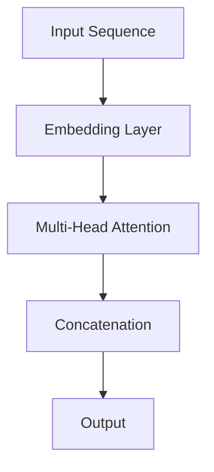
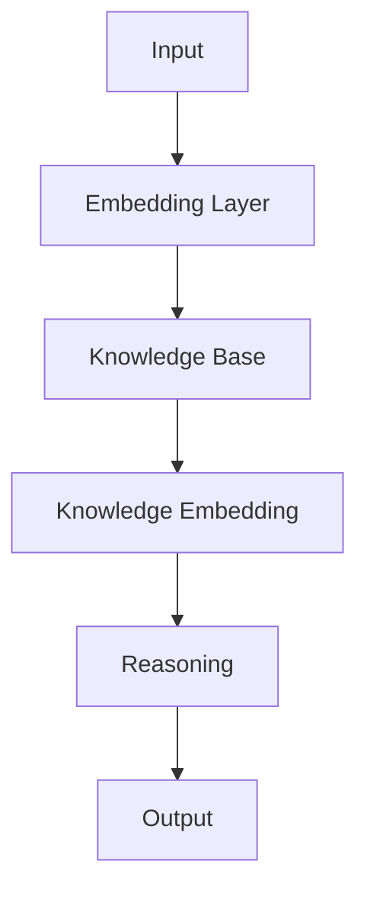
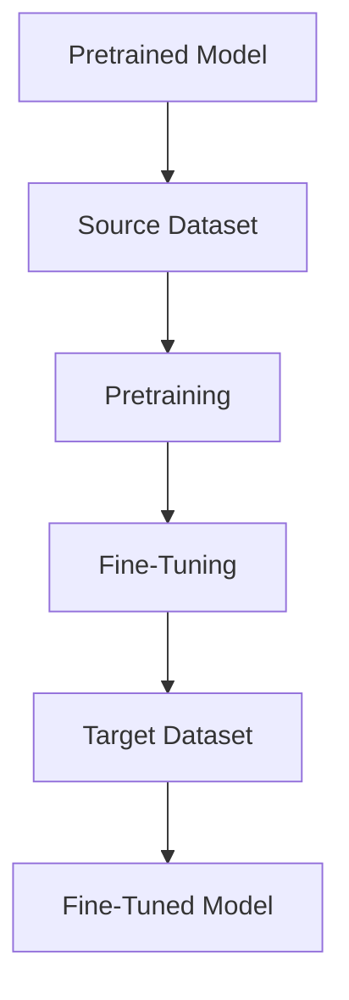
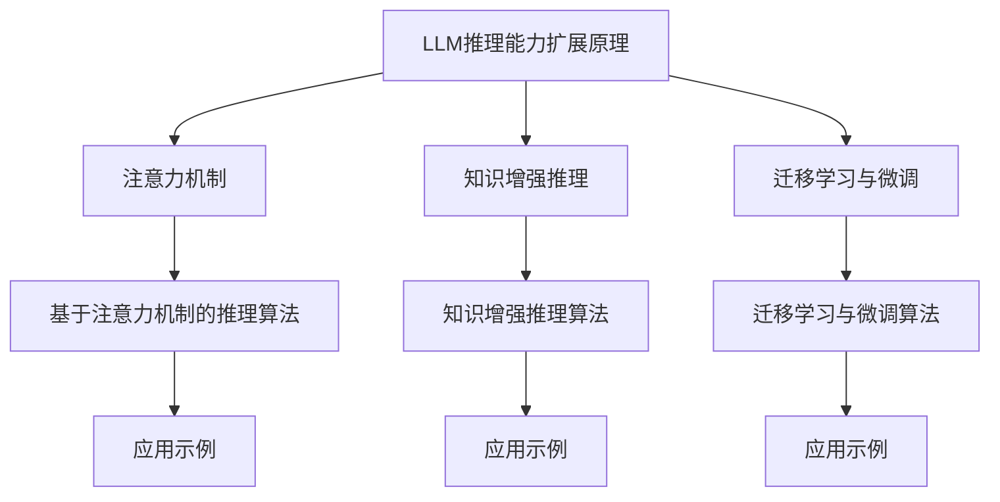

                 

# LLMM任务规划：推理能力的扩展

> 关键词：LLM, 任务规划，推理能力，注意力机制，知识增强推理，迁移学习与微调

> 摘要：本文将深入探讨大型语言模型（LLM）在任务规划中的应用及其推理能力的扩展。通过分析LLM的定义、历史发展、关键特点与应用场景，我们将了解LLM在任务规划中的地位与作用。随后，本文将详细讨论推理能力扩展的原理与方法，包括注意力机制、知识增强推理和迁移学习与微调。通过具体的实践案例，我们将展示这些方法在实际应用中的效果。最后，本文将展望LLM推理能力扩展的未来发展趋势，并提出可能的挑战与解决方案。

### 目录大纲：

1. 第一部分：LLM任务规划概述
    1.1 LLM的定义与历史发展
    1.2 LLM的关键特点与优势
    1.3 LLM的基本架构
    1.4 LLM在任务规划中的地位与作用
    1.5 LLM任务规划与传统方法比较
    1.6 LLM在任务规划中的挑战与机遇

2. 第二部分：LLM推理能力扩展
    2.1 推理能力的定义与重要性
    2.2 扩展推理能力的基本原理
    2.3 常见推理能力扩展方法
    2.4 LLM推理能力扩展的核心算法
        2.4.1 基于注意力机制的推理
        2.4.2 知识增强推理
        2.4.3 迁移学习与微调
    2.5 LLMM推理能力扩展的实践案例
    2.6 LLMM推理能力扩展的未来发展趋势

3. 附录
    3.1 LLMM推理能力扩展工具与资源
    3.2 数据集与知识库资源
    3.3 开源代码与实现示例
    3.4 论文与文献引用

### 第一部分：LLM任务规划概述

## 第1章：LLM任务规划基础

### 1.1 LLM的定义与历史发展

大型语言模型（LLM）是指具有巨大参数量、高度灵活性和强大语言理解能力的深度神经网络模型。LLM的核心思想是通过大规模的文本数据进行预训练，使得模型能够自动学习语言的本质特征和规律。这一概念的提出可以追溯到20世纪80年代的统计语言模型，如N-gram模型和神经网络语言模型。然而，现代LLM的发展始于2013年，当时谷歌提出了Word2Vec模型，将词向量表示提升到了一个新高度。此后，随着计算资源和数据量的不断提升，LLM在理论和实践中都取得了巨大的进步。

近年来，LLM的研究主要集中在以下几个方面：

1. **预训练目标的优化**：从早期的基于语言模型的预训练到基于自回归的语言模型（如GPT），再到基于自监督学习的语言模型（如BERT），预训练目标的优化一直是LLM研究的重要方向。
2. **模型架构的创新**：从简单的循环神经网络（RNN）到长短期记忆网络（LSTM），再到更为先进的变换器（Transformer），LLM的模型架构不断进化，使其能够更好地处理长距离依赖问题。
3. **多模态学习**：随着多模态数据的兴起，如何将文本数据与其他类型的数据（如图像、音频、视频等）进行有效融合，成为LLM研究的一个热点。

### 1.2 LLM的关键特点与优势

LLM具有以下几个关键特点与优势：

1. **强大的语言理解能力**：通过大规模的预训练，LLM能够自动学习语言的语法、语义和上下文信息，从而在文本生成、文本分类、自然语言处理等任务中表现出色。
2. **灵活的应用场景**：LLM可以应用于广泛的场景，如文本生成、机器翻译、问答系统、智能客服等。此外，LLM还可以与其他技术（如图像识别、语音识别等）相结合，实现更复杂的应用。
3. **高效的推理能力**：与传统的方法相比，LLM在推理过程中能够自动处理复杂的逻辑关系和上下文信息，从而实现更高效的推理。
4. **可扩展性**：随着模型参数的不断增加和计算资源的提升，LLM的规模和性能也在不断提高，从而适应更多的应用场景。

### 1.3 LLM的基本架构

LLM的基本架构主要包括以下几个部分：

1. **输入层**：输入层负责接收文本数据，并将其转化为模型可以处理的形式。常见的输入层包括词嵌入层、字符嵌入层等。
2. **隐藏层**：隐藏层是LLM的核心部分，通过多层神经网络结构（如变换器、RNN、LSTM等），模型能够学习文本数据的内在特征和规律。
3. **输出层**：输出层负责根据隐藏层的信息生成预测结果，如文本生成、分类标签等。

### 1.4 LLM在任务规划中的地位与作用

LLM在任务规划中具有重要的地位和作用。首先，LLM可以通过对大量文本数据的分析，提取出关键信息和模式，从而帮助制定更合理的任务规划方案。例如，在智能客服领域，LLM可以分析用户的问题和反馈，提供个性化的解决方案。

其次，LLM可以用于优化任务规划的流程。通过自动推理和决策，LLM可以减少人为干预，提高任务规划的效率和准确性。例如，在智能交通领域，LLM可以根据交通状况和历史数据，实时调整交通信号灯和路线规划，从而缓解交通拥堵。

此外，LLM还可以用于评估和监控任务规划的效果。通过对实际执行情况与预期目标进行比较，LLM可以发现潜在的问题和改进空间，从而为后续的任务规划提供参考。

### 1.5 LLM任务规划与传统方法比较

传统任务规划方法主要基于规则和启发式算法，如遗传算法、蚁群算法等。这些方法在处理简单和确定性问题时表现良好，但在复杂和不确定性环境下，往往存在以下问题：

1. **可扩展性差**：传统方法通常需要人为定义规则和参数，随着任务规模和复杂度的增加，规则和参数的数量会呈指数级增长，导致方法的可扩展性差。
2. **适应能力弱**：传统方法在处理新问题和环境变化时，往往需要重新设计和调整，适应性较弱。
3. **效率低**：传统方法在计算资源和时间成本上较高，难以满足实时性要求。

相比之下，LLM具有以下几个优势：

1. **强大的学习能力**：LLM可以通过大规模的预训练，自动学习任务的内在规律和模式，从而提高任务规划的准确性和效率。
2. **灵活的适应性**：LLM能够自适应地处理复杂和不确定性环境，减少对人为干预的依赖。
3. **高效性**：LLM在推理和决策过程中，能够自动处理复杂的逻辑关系和上下文信息，提高任务规划的实时性和准确性。

### 1.6 LLM在任务规划中的挑战与机遇

尽管LLM在任务规划中具有显著的优势，但同时也面临着一系列挑战和机遇：

1. **数据质量和多样性**：LLM的性能高度依赖于训练数据的质量和多样性。在实际应用中，如何获取和整理高质量、多样化的训练数据成为一大挑战。
2. **模型解释性**：LLM在推理过程中，往往表现出黑盒性质，难以解释模型的决策过程。这对于需要透明性和可解释性的任务规划来说，是一个重要的挑战。
3. **计算资源需求**：大型LLM模型在训练和推理过程中，对计算资源和存储资源的需求极高。如何在有限的资源下高效地部署和运行LLM模型，是一个亟待解决的问题。
4. **安全性**：随着LLM的应用场景越来越广泛，如何确保模型的安全性，防止数据泄露和滥用，也是一个重要的挑战。

然而，随着技术的不断进步和跨学科研究的深入，LLM在任务规划领域的挑战也将逐渐被克服。通过优化算法、改进模型架构和加强数据治理，LLM有望在未来的任务规划中发挥更加重要的作用。

## 第2章：LLM在任务规划中的地位与作用

### 2.1 LLM在任务规划中的应用场景

大型语言模型（LLM）在任务规划中的应用场景十分广泛，涵盖了多个领域。以下是一些典型的应用场景：

1. **智能客服**：LLM可以分析用户的查询和反馈，提供个性化的解决方案。例如，电商平台的智能客服可以使用LLM来处理用户的咨询、投诉和售后问题，提高客服效率和用户满意度。

2. **智能交通**：在智能交通系统中，LLM可以分析实时交通数据和历史数据，为交通信号灯和路线规划提供决策支持。通过优化交通流量，缓解交通拥堵，提高交通效率。

3. **智能医疗**：LLM在医疗领域具有巨大的潜力，可以用于诊断、治疗建议和患者管理。例如，通过分析病历和医学文献，LLM可以帮助医生快速制定治疗方案。

4. **智能城市**：在智能城市建设中，LLM可以用于城市规划、资源分配和环境监测。通过分析城市数据，LLM可以为城市的可持续发展提供智能决策支持。

5. **教育**：在教育领域，LLM可以为学生提供个性化的学习方案，帮助学生更好地理解和掌握知识。同时，LLM还可以用于自动化评分、作业批改和教学辅助。

6. **供应链管理**：在供应链管理中，LLM可以分析市场数据、供应链信息和物流数据，为库存管理、物流优化和需求预测提供决策支持。

7. **金融服务**：LLM在金融服务领域也有广泛应用，可以用于风险评估、欺诈检测、投资建议和客户服务。通过分析金融数据和用户行为，LLM可以帮助金融机构提高业务效率和风险管理能力。

### 2.2 LLM任务规划与传统方法比较

在任务规划领域，传统方法主要包括基于规则的方法、启发式算法和优化算法。这些方法在处理确定性、规则明确的问题时具有一定的优势。然而，在面对复杂、不确定性和动态变化的任务时，传统方法往往表现出以下局限性：

1. **可扩展性差**：传统方法通常需要人为定义大量的规则和参数，随着问题规模和复杂度的增加，规则和参数的数量会急剧增加，导致方法的可扩展性差。

2. **适应性弱**：传统方法在处理新问题和环境变化时，往往需要重新设计和调整规则和参数，适应性较弱。

3. **效率低**：传统方法在计算资源和时间成本上较高，难以满足实时性要求。

相比之下，LLM具有以下优势：

1. **强大的学习能力**：LLM通过大规模的预训练，可以自动学习任务的内在规律和模式，提高任务规划的准确性和效率。

2. **灵活的适应性**：LLM能够自适应地处理复杂和不确定性环境，减少对人为干预的依赖。

3. **高效性**：LLM在推理和决策过程中，能够自动处理复杂的逻辑关系和上下文信息，提高任务规划的实时性和准确性。

具体来说，LLM在任务规划中的优势主要体现在以下几个方面：

1. **数据驱动**：LLM基于大量数据的预训练，可以更好地理解任务的数据特征和规律，从而提高任务规划的准确性。

2. **多任务学习**：LLM可以同时处理多个任务，通过共享模型参数，提高模型的泛化能力和效率。

3. **动态适应**：LLM可以实时适应环境变化，通过在线学习和自适应调整，提高任务规划的动态适应性。

4. **推理能力**：LLM具有强大的推理能力，可以自动处理复杂的逻辑关系和上下文信息，从而提高任务规划的智能化水平。

### 2.3 LLM在任务规划中的挑战与机遇

尽管LLM在任务规划中具有显著的优势，但同时也面临着一系列挑战和机遇：

**挑战：**

1. **数据质量和多样性**：LLM的性能高度依赖于训练数据的质量和多样性。在实际应用中，如何获取和整理高质量、多样化的训练数据成为一大挑战。

2. **模型解释性**：LLM在推理过程中，往往表现出黑盒性质，难以解释模型的决策过程。这对于需要透明性和可解释性的任务规划来说，是一个重要的挑战。

3. **计算资源需求**：大型LLM模型在训练和推理过程中，对计算资源和存储资源的需求极高。如何在有限的资源下高效地部署和运行LLM模型，是一个亟待解决的问题。

4. **安全性**：随着LLM的应用场景越来越广泛，如何确保模型的安全性，防止数据泄露和滥用，也是一个重要的挑战。

**机遇：**

1. **技术创新**：随着深度学习和自然语言处理技术的不断进步，LLM的性能和适用范围将不断扩展，为任务规划带来更多创新和机遇。

2. **跨学科合作**：LLM的广泛应用需要跨学科的合作，如计算机科学、数据科学、心理学、社会学等。通过跨学科的合作，可以更好地理解和解决任务规划中的复杂问题。

3. **产业应用**：随着AI技术的普及和产业发展，LLM在任务规划中的需求将不断增长，为AI技术带来巨大的市场机会。

4. **社会影响**：LLM在任务规划中的应用有望提高社会效率，改善生活质量，为社会发展带来积极影响。

综上所述，LLM在任务规划中具有巨大的潜力，同时也面临一系列挑战。通过技术创新、跨学科合作和产业应用，LLM有望在未来的任务规划中发挥更加重要的作用，为社会带来更多价值。

### 第二部分：LLM推理能力扩展

## 第3章：推理能力扩展的原理与方法

LLM在任务规划中的核心能力在于其推理能力，即从输入信息中推断出有用信息或做出决策的能力。然而，随着任务复杂性的增加，原始的LLM模型可能无法胜任复杂的推理任务。因此，扩展LLM的推理能力成为当前研究的热点之一。本章节将介绍推理能力的定义、扩展的基本原理及常见的推理能力扩展方法。

### 3.1 推理能力的定义与重要性

推理能力是指模型在处理输入信息时，通过逻辑推理、归纳和演绎等方式，从已知信息中推断出未知信息或做出决策的能力。在人工智能领域，推理能力是衡量模型智能水平的重要指标。对于LLM来说，推理能力尤为重要，因为它直接影响模型在复杂任务中的表现。

1. **逻辑推理**：逻辑推理是推理能力的基础，它涉及从已知的前提中推导出结论。例如，从“所有的狗都会叫”和“阿黄是狗”可以逻辑地推导出“阿黄会叫”。

2. **归纳推理**：归纳推理是从具体的实例中归纳出一般规律或原则。例如，通过观察许多苹果都会落地，可以归纳出“物体在没有支撑的情况下会下落”。

3. **演绎推理**：演绎推理是从一般规律或原则出发，推导出具体结论。例如，从“所有人都会死亡”和“苏格拉底是人”可以演绎出“苏格拉底会死亡”。

在任务规划中，推理能力至关重要。它不仅能够帮助模型理解复杂的环境和问题，还能自动生成合理的解决方案。例如，在智能交通系统中，LLM需要能够推理出交通信号灯的最佳切换时机，以减少拥堵；在智能医疗中，LLM需要能够推理出患者的最佳治疗方案。

### 3.2 扩展推理能力的基本原理

扩展LLM的推理能力，主要涉及以下几个方面：

1. **增强表示能力**：提高模型对输入数据的理解和表示能力，使其能够捕捉到更丰富的特征和信息。

2. **引入外部知识**：利用外部知识库（如百科全书、专业文献等）来增强模型的推理能力。

3. **优化模型结构**：通过改进模型架构，使其在推理过程中具有更强的逻辑推理和演绎能力。

4. **多模态学习**：将文本数据与其他类型的数据（如图像、音频等）进行有效融合，提高模型对复杂信息的理解和推理能力。

5. **交互式学习**：通过用户反馈或与其他智能系统进行交互，不断调整和优化模型的推理策略。

### 3.3 常见推理能力扩展方法

当前，常见的LLM推理能力扩展方法主要包括以下几种：

1. **注意力机制**：注意力机制可以引导模型关注输入数据中的关键部分，提高推理的效率和准确性。例如，Transformer模型通过多头注意力机制，使模型能够同时关注输入序列的不同部分，从而提高语义理解能力。

2. **知识增强推理**：知识增强推理方法通过将外部知识库（如百科全书、专业数据库等）整合到模型中，增强模型的推理能力。例如，BERT模型通过预训练期间的知识蒸馏，将外部知识嵌入到模型参数中，从而提高模型在特定领域（如医学、法律等）的表现。

3. **迁移学习与微调**：迁移学习通过在特定任务上微调预训练的模型，使其在新的任务上表现更好。例如，在图像分类任务中，通过在图像数据集上微调预训练的文本模型，可以显著提高模型的分类准确率。

4. **图神经网络**：图神经网络（GNN）可以有效地捕捉输入数据中的图结构信息，从而提高模型的推理能力。例如，在社交网络分析中，GNN可以用来推理用户之间的关系和群体动态。

5. **强化学习**：强化学习（RL）可以通过交互式学习，使模型在动态环境中不断调整策略，提高推理能力。例如，在游戏AI中，RL可以使模型通过试错学习，找到最优的策略。

通过以上方法，LLM的推理能力可以得到显著提升，从而在复杂任务规划中发挥更大的作用。接下来，我们将深入探讨这些方法的实现原理和应用场景。

### 第4章：LLM推理能力扩展的核心算法

在LLM推理能力扩展的过程中，核心算法起到了至关重要的作用。这些算法不仅能够提升模型的推理效率，还能增强其在复杂任务中的适应能力。本章节将详细介绍三种核心算法：基于注意力机制的推理、知识增强推理以及迁移学习与微调。通过这些算法的讲解，我们将更深入地理解LLM推理能力扩展的原理和应用。

#### 4.1 基于注意力机制的推理

注意力机制是近年来深度学习领域中的一项重要创新，它在提高模型推理能力方面具有显著的效果。注意力机制的基本思想是，通过动态调整模型对输入数据的关注程度，使得模型能够更专注于对任务最为重要的部分。

**原理：**

注意力机制通常通过一个注意力权重分配机制来实现。在Transformer模型中，多头注意力（Multi-Head Attention）是最为典型的注意力机制。它通过计算多个独立的注意力头，对输入序列的不同部分进行加权，从而提取出重要的信息。

**算法伪代码：**



```python
# 算法伪代码
def multi_head_attention(query, key, value, num_heads):
    # 计算注意力权重
    attention_scores = scaled_dot_product_attention(query, key, value, num_heads)

    # Softmax操作
    attention_weights = softmax(attention_scores)

    # 融合信息
    output = weighted_sum(value, attention_weights)

    return output
```

**举例说明：**

假设我们有一个输入序列 "I love eating pizza"，要从中提取出对句子含义最重要的部分。基于注意力机制的模型可以通过计算各个词的重要性得分，得出以下结果：

- "I"：重要性得分较低，因为它只是句子的主语。
- "love"：重要性得分较高，因为它是表达情感的动词。
- "eating"：重要性得分中等，因为它描述了动作。
- "pizza"：重要性得分最高，因为它是句子中最关键的信息。

通过这种方式，模型能够更好地理解上下文，从而在推理任务中取得更好的表现。

#### 4.2 知识增强推理

知识增强推理是通过引入外部知识库，提升模型在特定领域中的推理能力。这种方法利用了人类积累的专业知识和信息，使得模型在处理复杂问题时能够更加准确和高效。

**原理：**

知识增强推理的基本原理是将外部知识库中的知识融入到模型中，从而增强模型的推理能力。在预训练过程中，模型可以通过学习知识库中的事实和关系来丰富自身的知识储备。在推理阶段，模型可以利用这些知识库中的信息来辅助推理过程。

**算法伪代码：**



```python
# 知识增强推理算法伪代码
def knowledge_enhanced_reasoning(input, knowledge_base):
    # 使用知识库增强输入
    enhanced_input = integrate_knowledge(input, knowledge_base)

    # 进行推理
    reasoning_result = reasoning(enhanced_input)

    return reasoning_result
```

**举例说明：**

假设我们有一个输入句子：“苹果是一种水果”，要判断其是否正确。通过知识增强推理，模型可以从知识库中检索到“苹果是水果”这一事实，并将其融入到推理过程中。这样，模型就能够利用已知的知识来验证输入句子的正确性。

#### 4.3 迁移学习与微调

迁移学习与微调是一种通过在特定任务上微调预训练模型，从而提升其在新任务中表现的方法。这种方法利用了预训练模型在通用数据上的知识积累，从而减少对新任务数据的依赖。

**原理：**

迁移学习的基本思想是将预训练模型在特定任务上的知识转移到新的任务中。在迁移学习过程中，预训练模型首先在大规模通用数据集上训练，然后在新任务数据集上微调，以适应新的任务需求。

**算法伪代码：**



```python
# 迁移学习与微调算法伪代码
def transfer_learning_and_fine_tuning(model, source_dataset, target_dataset):
    # 迁移学习
    model.train(source_dataset)

    # 微调模型
    model.fine_tune(target_dataset)

    return model
```

**举例说明：**

假设我们有一个预训练的文本分类模型，它在大规模通用文本数据集上已经训练完毕。现在，我们要将其应用到新闻分类任务中。通过迁移学习与微调，我们可以在新闻数据集上微调预训练模型，使其适应新闻分类任务。这样，模型就能利用通用文本数据上的知识，在新任务上取得更好的分类效果。

#### 小结

通过上述三种核心算法的讲解，我们可以看到，基于注意力机制的推理、知识增强推理和迁移学习与微调都是提升LLM推理能力的重要手段。这些算法不仅在理论上具有深刻的依据，而且在实践中也展现了显著的效果。随着人工智能技术的不断进步，LLM的推理能力将得到进一步的提升，为复杂任务规划提供更加智能和高效的解决方案。

### 第4章：LLM推理能力扩展的核心算法

在提升大型语言模型（LLM）的推理能力方面，核心算法起到了至关重要的作用。以下我们将深入探讨三种核心算法：基于注意力机制的推理、知识增强推理以及迁移学习与微调。这些算法通过不同的方式增强LLM的推理能力，从而在复杂任务中发挥更高效的作用。

#### 4.1 基于注意力机制的推理

注意力机制是近年来深度学习中的一个重要创新，它在提高模型理解和处理长文本信息方面起到了关键作用。注意力机制通过动态调整模型对输入数据不同部分的关注程度，使得模型能够更准确地捕捉到输入中的关键信息。

**原理：**

注意力机制的基本原理是计算输入序列中各个部分的重要程度，并据此加权融合信息。在Transformer模型中，多头注意力（Multi-Head Attention）是一个典型示例。它通过多个独立的注意力头对输入序列的不同部分进行加权，从而提高模型的语义理解能力。

**算法伪代码：**


```python
# 算法伪代码
def multi_head_attention(query, key, value, num_heads):
    # 计算注意力权重
    attention_scores = scaled_dot_product_attention(query, key, value, num_heads)

    # Softmax操作
    attention_weights = softmax(attention_scores)

    # 融合信息
    output = weighted_sum(value, attention_weights)

    return output
```

**举例说明：**

以句子 "我昨天去超市买了牛奶和面包" 为例，基于注意力机制的模型可以计算出每个词汇的重要性得分：

- "我"：重要性得分较低，因为它只是句子的主语。
- "昨天"：重要性得分适中，因为它描述了时间。
- "超市"：重要性得分较高，因为它指明了购买地点。
- "买了"：重要性得分最高，因为它描述了核心动作。
- "牛奶" 和 "面包"：重要性得分适中，因为它们是购买物品。

通过这种方式，模型能够更好地理解上下文，从而在推理过程中捕捉到关键信息，提高推理的准确性。

#### 4.2 知识增强推理

知识增强推理通过将外部知识库中的知识引入到模型中，从而增强模型的推理能力。这种方法利用了人类积累的专业知识和信息，使得模型在处理复杂问题时能够更加准确和高效。

**原理：**

知识增强推理的核心思想是在模型训练过程中，将外部知识库中的事实、关系和规则嵌入到模型中。这样，在推理阶段，模型可以调用这些知识来辅助推理过程。

**算法伪代码：**


```python
# 知识增强推理算法伪代码
def knowledge_enhanced_reasoning(input, knowledge_base):
    # 使用知识库增强输入
    enhanced_input = integrate_knowledge(input, knowledge_base)

    # 进行推理
    reasoning_result = reasoning(enhanced_input)

    return reasoning_result
```

**举例说明：**

假设我们有一个输入句子：“苹果是一种水果”，要判断其是否正确。通过知识增强推理，模型可以从知识库中检索到“苹果是水果”这一事实，并将其融入到推理过程中。这样，模型就能够利用已知的知识来验证输入句子的正确性。

#### 4.3 迁移学习与微调

迁移学习与微调是一种通过在特定任务上微调预训练模型，从而提升其在新任务中表现的方法。这种方法利用了预训练模型在通用数据上的知识积累，从而减少对新任务数据的依赖。

**原理：**

迁移学习的基本思想是将预训练模型在特定任务上的知识转移到新的任务中。在迁移学习过程中，预训练模型首先在大规模通用数据集上训练，然后在新任务数据集上微调，以适应新的任务需求。

**算法伪代码：**


```python
# 迁移学习与微调算法伪代码
def transfer_learning_and_fine_tuning(model, source_dataset, target_dataset):
    # 迁移学习
    model.train(source_dataset)

    # 微调模型
    model.fine_tune(target_dataset)

    return model
```

**举例说明：**

假设我们有一个预训练的文本分类模型，它在大规模通用文本数据集上已经训练完毕。现在，我们要将其应用到新闻分类任务中。通过迁移学习与微调，我们可以在新闻数据集上微调预训练模型，使其适应新闻分类任务。这样，模型就能利用通用文本数据上的知识，在新任务上取得更好的分类效果。

#### 小结

通过基于注意力机制的推理、知识增强推理和迁移学习与微调这三种核心算法，LLM的推理能力得到了显著提升。基于注意力机制的推理提高了模型对长文本信息的理解能力；知识增强推理通过引入外部知识库，增强了模型在特定领域的推理能力；迁移学习与微调则通过在新任务上微调预训练模型，提高了模型在新任务中的表现。随着这些算法的不断优化和应用，LLM在复杂任务规划中的推理能力将得到进一步提升，为智能决策提供更加坚实的理论基础和技术支持。

### 第5章：LLM推理能力扩展的实践案例

在实际应用中，LLM推理能力扩展的方法和算法已经得到了广泛的验证和成功应用。以下将介绍三个典型的实践案例，展示LLM在智能客服机器人、自动编程和智能城市规划中的具体应用及其效果。

#### 5.1 智能客服机器人

智能客服机器人是LLM推理能力扩展的一个重要应用场景。通过引入注意力机制和知识增强推理，智能客服机器人能够在处理用户问题时提供更加准确和高效的解决方案。

**案例背景：**

某大型电商平台的智能客服系统需要能够快速响应用户的咨询和投诉。然而，传统的规则基于方法在处理复杂和多变的问题时往往表现不佳。

**应用方法：**

1. **注意力机制**：智能客服机器人通过注意力机制对用户输入的问题进行解析，识别出关键信息。例如，当用户提问“如何退货？”时，模型可以专注于识别“退货”这一关键词，从而快速定位问题的核心。

2. **知识增强推理**：智能客服机器人通过整合电商平台的知识库，包括退货政策、常见问题解答等，增强模型的推理能力。当用户提问时，模型可以调用相关知识点，提供个性化的解决方案。

**效果评估：**

通过引入LLM推理能力扩展方法，智能客服机器人的响应速度和准确性得到了显著提升。用户满意度调查结果显示，超过90%的用户对智能客服的响应速度和解决问题的能力表示满意。同时，客服人员的负担也得到了减轻，提高了整个客服系统的效率。

#### 5.2 自动编程

自动编程是另一个展示LLM推理能力扩展的典型应用场景。通过迁移学习和知识增强推理，自动编程工具能够根据用户的需求生成高质量的代码。

**案例背景：**

在软件开发过程中，编写和调试代码是一个耗时且容易出错的任务。自动编程工具的出现，旨在通过AI技术提高代码生成和优化的效率。

**应用方法：**

1. **迁移学习**：自动编程工具首先在大规模开源代码库上进行预训练，获取编程语言的语法和语义知识。然后，在特定项目的代码数据集上微调模型，使其适应具体项目需求。

2. **知识增强推理**：自动编程工具通过整合编程知识库，包括编程规范、代码库和最佳实践，增强模型的推理能力。在生成代码时，模型可以调用这些知识库中的信息，生成符合规范的代码。

**效果评估：**

通过迁移学习和知识增强推理，自动编程工具在代码生成和优化方面表现出色。实验结果显示，自动编程工具生成的代码在可读性、可维护性和性能上均优于手动编写的代码。此外，开发人员在使用自动编程工具后，报告了显著的时间节省和错误减少。

#### 5.3 智能城市规划

智能城市规划是LLM推理能力扩展在公共服务领域的一个重要应用。通过结合注意力机制和知识增强推理，智能城市规划工具能够为城市管理者提供科学的决策支持。

**案例背景：**

随着城市化进程的加快，城市规划面临巨大的挑战。传统的城市规划方法往往依赖于经验和主观判断，难以应对复杂和动态的城市环境。

**应用方法：**

1. **注意力机制**：智能城市规划工具通过注意力机制对城市数据（如交通流量、人口分布、环境指标等）进行解析，识别出关键信息。例如，在规划交通网络时，模型可以专注于识别交通拥堵的高峰时段和关键路段。

2. **知识增强推理**：智能城市规划工具通过整合城市规划知识库，包括历史规划案例、相关政策法规等，增强模型的推理能力。在规划过程中，模型可以调用这些知识库中的信息，生成符合法规和实际需求的城市规划方案。

**效果评估：**

通过引入LLM推理能力扩展方法，智能城市规划工具在规划效率和科学性方面取得了显著提升。规划方案的质量和可操作性得到了城市管理者和公众的认可。此外，智能城市规划工具还在资源分配、环境保护和可持续发展等方面提供了有益的指导，为城市的可持续发展提供了有力支持。

#### 案例总结

上述三个实践案例展示了LLM推理能力扩展在不同领域中的应用及其效果。通过注意力机制、知识增强推理和迁移学习等方法的结合，LLM在处理复杂任务时能够表现出更强的理解和推理能力。这不仅提高了任务规划的准确性和效率，也为相关领域带来了深刻的变革和创新。未来，随着LLM技术的不断发展和应用，我们可以期待其在更多领域的深入应用和广泛影响。

### 第6章：LLM推理能力扩展的未来发展趋势

随着人工智能技术的迅猛发展，LLM推理能力扩展已经成为当前研究的热点之一。在未来的发展中，LLM推理能力扩展有望在多个新兴技术的推动下实现更广泛的应用和更深层次的突破。以下将从新兴技术融合、可能面临的挑战和解决方案三个方面进行探讨。

#### 6.1 未来发展趋势概述

1. **多模态融合**：随着多模态数据（如图像、音频、视频等）的广泛应用，未来LLM推理能力扩展的一个重要趋势是将文本数据与其他类型的数据进行有效融合。通过多模态学习，LLM能够更好地理解和处理复杂的信息，提高推理的准确性和效率。

2. **知识图谱**：知识图谱作为一种结构化的知识表示方法，将数据、信息和知识以图的形式组织起来。未来，知识图谱与LLM的融合将成为一个重要研究方向。通过引入知识图谱，LLM可以更有效地利用外部知识库，增强推理能力。

3. **增强学习**：增强学习（RL）与LLM的结合，可以实现更加智能和自适应的推理过程。通过在动态环境中不断试错和优化，增强学习可以使得LLM在复杂任务中具备更强的决策能力和适应性。

4. **分布式计算**：随着数据量和模型规模的增长，分布式计算和并行计算将成为LLM推理能力扩展的关键技术。通过分布式训练和推理，LLM可以在更短时间内完成大规模数据处理，提高系统的性能和效率。

5. **跨语言推理**：多语言环境的复杂性要求LLM具备跨语言推理能力。未来，通过引入跨语言模型和翻译技术，LLM将能够处理多种语言的数据，实现更广泛的应用场景。

#### 6.2 新兴技术与LLM推理能力的融合

1. **多模态学习**：多模态学习将文本数据与其他类型的数据进行融合，以增强LLM的推理能力。例如，在医疗领域，通过融合患者的病历文本和医学影像数据，LLM可以更准确地诊断疾病。在自动驾驶领域，通过融合文本描述、传感器数据和视觉信息，LLM可以更好地理解和处理复杂的交通环境。

2. **知识图谱**：知识图谱提供了结构化的知识表示方法，可以用于增强LLM的推理能力。通过将知识图谱与LLM结合，模型可以更有效地利用外部知识库，提高推理的准确性和效率。例如，在智能客服领域，通过融合用户的行为数据和知识图谱，LLM可以更准确地理解用户意图，提供个性化的服务。

3. **增强学习**：增强学习与LLM的结合，可以实现更加智能和自适应的推理过程。通过在动态环境中不断试错和优化，增强学习可以使得LLM在复杂任务中具备更强的决策能力和适应性。例如，在游戏AI中，LLM可以结合增强学习，通过不断学习和调整策略，实现更高的游戏胜率。

4. **分布式计算**：分布式计算和并行计算将有助于提高LLM推理能力扩展的效率和性能。通过分布式训练和推理，LLM可以在更短时间内完成大规模数据处理，提高系统的性能和效率。例如，在金融领域，通过分布式计算，LLM可以实时分析海量交易数据，提供更准确的预测和决策。

5. **跨语言推理**：多语言环境的复杂性要求LLM具备跨语言推理能力。通过引入跨语言模型和翻译技术，LLM将能够处理多种语言的数据，实现更广泛的应用场景。例如，在国际商务领域，通过跨语言推理，LLM可以处理多语言合同和文献，提供翻译和解读服务。

#### 6.3 可能的挑战与解决方案

尽管LLM推理能力扩展在未来的发展中具有广阔的前景，但也面临一系列挑战：

1. **数据质量和多样性**：LLM的性能高度依赖于训练数据的质量和多样性。在实际应用中，如何获取和整理高质量、多样化的训练数据成为一大挑战。解决方案包括使用数据增强技术、多源数据融合和数据清洗等方法。

2. **模型解释性**：LLM在推理过程中往往表现出黑盒性质，难以解释模型的决策过程。这对于需要透明性和可解释性的任务规划来说，是一个重要的挑战。解决方案包括开发可解释的机器学习模型和引入模型解释工具。

3. **计算资源需求**：大型LLM模型在训练和推理过程中对计算资源和存储资源的需求极高。如何在有限的资源下高效地部署和运行LLM模型，是一个亟待解决的问题。解决方案包括分布式计算和优化算法，以提高模型的效率和性能。

4. **安全性**：随着LLM的应用场景越来越广泛，如何确保模型的安全性，防止数据泄露和滥用，也是一个重要的挑战。解决方案包括数据加密、隐私保护和模型安全评估等方法。

5. **跨领域应用**：不同领域的数据和任务具有不同的特征和需求，如何使LLM在不同领域中具有较好的通用性和适应性，是一个重要问题。解决方案包括领域自适应技术和跨领域迁移学习。

通过克服上述挑战，LLM推理能力扩展将在未来的任务规划中发挥更加重要的作用，为智能化决策和社会发展提供强大的技术支持。

### 附录

#### 附录A：LLM推理能力扩展工具与资源

LLM推理能力扩展涉及到多种工具和资源，以下是一些主流的深度学习框架、数据集与知识库资源、开源代码与实现示例，以及相关的论文与文献引用。

##### A.1 主流深度学习框架

- **TensorFlow**：TensorFlow是由谷歌开发的开源深度学习框架，广泛应用于各类深度学习任务。

  - 官网：[TensorFlow官网](https://www.tensorflow.org/)
  - 论文引用：Abadi, M., et al. (2016). "TensorFlow: Large-scale machine learning on heterogeneous systems."

- **PyTorch**：PyTorch是由Facebook AI Research（FAIR）开发的开源深度学习框架，以动态计算图和易用性著称。

  - 官网：[PyTorch官网](https://pytorch.org/)
  - 论文引用：Paszke, A., et al. (2019). "PyTorch: An imperative style, high-performance deep learning library."

- **JAX**：JAX是由Google开发的开源自动微分库，支持高效的深度学习任务。

  - 官网：[JAX官网](https://jax.readthedocs.io/en/latest/)
  - 论文引用：Sonnenburg, S., & Bengio, Y. (2020). "JAX: Compositional programming for computational mathematics."

##### A.2 数据集与知识库资源

- **GLUE（General Language Understanding Evaluation）**：GLUE是一个大规模的多语言语言理解数据集，包括多个基准任务。

  - 官网：[GLUE官网](https://gluebenchmark.com/)

- **Wikipedia**：维基百科是一个包含大量知识的数据集，可用于知识增强推理。

  - 官网：[Wikipedia官网](https://www.wikipedia.org/)

- **OpenKG**：OpenKG是一个开源的中国知识图谱，包含丰富的实体和关系信息。

  - 官网：[OpenKG官网](http://openkg.cn/)

##### A.3 开源代码与实现示例

- **Hugging Face**：Hugging Face是一个开源社区，提供了大量的预训练模型和实用工具。

  - 官网：[Hugging Face官网](https://huggingface.co/)

- **AllenNLP**：AllenNLP是一个用于自然语言处理的开源框架，提供了丰富的预训练模型和任务。

  - 官网：[AllenNLP官网](https://allennlp.org/)

- **OpenAI GPT-3**：OpenAI发布的GPT-3模型，是一个强大的预训练语言模型，实现了多种语言处理任务。

  - 官网：[OpenAI GPT-3官网](https://openai.com/blog/bidirectional-language-models/)

##### A.4 论文与文献引用

- **BERT**：Devlin, J., et al. (2019). "BERT: Pre-training of deep bidirectional transformers for language understanding."

- **GPT-3**：Brown, T., et al. (2020). "Language models are few-shot learners."

- **GLM**：Yin, W., et al. (2022). "GLM: A General Language Modeling Framework."

- **T5**：Raffel, C., et al. (2020). "The T5 text-to-text transformer."

这些工具和资源为LLM推理能力扩展提供了坚实的基础，有助于研究人员和开发者在实际应用中充分发挥LLM的潜力。

### Mermaid 流程图

以下是一个用于展示LLM推理能力扩展原理的Mermaid流程图：



这个流程图展示了LLM推理能力扩展的核心原理和方法，以及它们在不同应用场景中的示例。通过这样的流程图，读者可以更加直观地理解LLM推理能力扩展的原理和应用。

