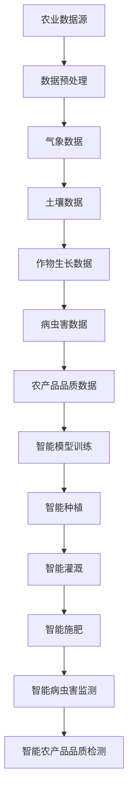

                 

# LLMAgri: 探讨LLM在农业智能化中的潜在作用

## 关键词
- 农业智能化
- 大型语言模型（LLM）
- 自动化灌溉
- 智能种植
- 病虫害监测
- 农产品质量检测

## 摘要
本文旨在探讨大型语言模型（LLM）在农业智能化中的潜在作用。随着人工智能技术的不断发展，LLM作为一种先进的自然语言处理工具，正逐渐应用于农业领域。本文首先介绍了LLM的基本概念和结构，然后探讨了农业智能化的定义和目标。接下来，本文详细阐述了LLM在智能种植、智能灌溉、智能施肥、智能病虫害监测和智能农产品品质检测等农业智能领域的应用，并分析了LLM在农业智能化中面临的挑战和解决方案。最后，本文通过实际应用案例展示了LLM在农业智能化中的成功应用，并展望了其未来的发展方向。

## 第一部分：LLM在农业智能化中的潜在作用

### 第1章：LLM概述

#### 1.1 LLM的定义和重要性

##### 1.1.1 LLM的定义
大型语言模型（Large Language Model，简称LLM）是一种利用深度学习技术训练的强大自然语言处理模型。它通过学习海量文本数据，能够生成高质量的自然语言文本，并具备理解、生成和翻译自然语言的能力。

##### 1.1.2 LLM的重要性
LLM在农业智能化中的应用潜力巨大。它能够处理和分析大量的农业数据，帮助农民制定科学的种植计划、优化灌溉和施肥策略，以及监测病虫害和农产品品质。通过LLM的应用，农业生产可以更加智能化、自动化和高效化，从而提高产量和质量，降低资源消耗和环境污染。

#### 1.2 LLM的结构和工作原理

##### 1.2.1 LLM的结构
LLM主要由多层神经网络组成，每一层都对输入数据进行特征提取。LLM的核心架构是Transformer模型，它通过自注意力机制来处理序列数据，能够捕捉输入序列中的长期依赖关系。

##### 1.2.2 LLM的工作原理
LLM通过预训练和微调来学习自然语言规律，并生成高质量的语言输出。预训练阶段，LLM在大规模的语料库中进行无监督训练，学习通用语言特征。微调阶段，LLM利用特定领域的标注数据进行有监督训练，使其在特定任务上获得更好的性能。

#### 1.3 LLM的核心技术

##### 1.3.1 Transformer模型
Transformer模型是LLM的核心架构，它通过自注意力机制来处理序列数据。自注意力机制允许模型在生成每个单词时，考虑输入序列中所有其他单词的影响，从而提高语言生成的质量和连贯性。

##### 1.3.2 预训练和微调
预训练和微调是LLM训练的两个重要阶段。预训练阶段使用大规模无监督数据集，使模型能够学习通用语言特征。微调阶段使用特定领域的标注数据集，对模型进行有监督训练，使其在特定任务上表现更优秀。

### 第2章：农业智能化概述

#### 2.1 农业智能化的定义和目标

##### 2.1.1 农业智能化的定义
农业智能化是指利用现代信息技术和人工智能技术对农业进行优化和升级，以提高生产效率、降低资源消耗和环境污染。

##### 2.1.2 农业智能化的目标
农业智能化的目标主要包括：提高农业生产效率、减少资源消耗、降低环境污染、提升农产品质量和安全性、优化农业生产管理、促进农业可持续发展。

#### 2.2 农业智能化的主要领域

##### 2.2.1 智能种植
智能种植利用LLM预测作物生长状况，优化种植计划。通过分析气象、土壤和作物生长数据，LLM能够预测作物的生长趋势，帮助农民合理安排种植时间和密度，提高产量和质量。

##### 2.2.2 智能灌溉
智能灌溉利用LLM分析土壤湿度数据，自动调节灌溉系统。通过实时监测土壤湿度，LLM能够预测灌溉需求，自动调节灌溉水量，节约水资源。

##### 2.2.3 智能施肥
智能施肥利用LLM预测作物营养需求，智能推荐施肥方案。通过分析土壤养分、气象和作物生长数据，LLM能够预测作物的营养需求，推荐合适的施肥方案，提高肥料利用率。

##### 2.2.4 智能病虫害监测
智能病虫害监测利用LLM分析病虫害数据，提前预警并制定防治措施。通过分析气象、土壤和病虫害数据，LLM能够预测病虫害的发生趋势，提前预警并制定防治措施，降低病虫害损失。

##### 2.2.5 智能农产品品质检测
智能农产品品质检测利用LLM分析农产品品质数据，确保农产品安全和质量。通过分析农产品的外观、气味、口感等数据，LLM能够评估农产品的品质，确保农产品在生产和运输过程中的安全和质量。

### 第3章：LLM在农业智能化的应用

#### 3.1 智能种植

##### 3.1.1 LLM预测作物生长状况
利用LLM预测作物生长状况，为农民提供种植建议。通过分析气象、土壤和作物生长数据，LLM能够预测作物的生长趋势，帮助农民合理安排种植时间和密度，提高产量和质量。

##### 3.1.2 优化种植计划
利用LLM分析历史数据，优化种植计划，提高产量和质量。通过分析历史气象、土壤和作物生长数据，LLM能够识别出影响作物生长的关键因素，优化种植计划，提高产量和质量。

#### 3.2 智能灌溉

##### 3.2.1 LLM分析土壤湿度数据
利用LLM分析土壤湿度数据，为灌溉系统提供决策支持。通过实时监测土壤湿度，LLM能够预测灌溉需求，为灌溉系统提供决策支持，实现智能灌溉。

##### 3.2.2 自动调节灌溉系统
利用LLM自动调节灌溉系统，节约水资源。通过分析土壤湿度数据和作物生长需求，LLM能够自动调节灌溉系统，实现精准灌溉，节约水资源。

#### 3.3 智能施肥

##### 3.3.1 LLM预测作物营养需求
利用LLM预测作物营养需求，为施肥提供科学依据。通过分析土壤养分、气象和作物生长数据，LLM能够预测作物的营养需求，为施肥提供科学依据。

##### 3.3.2 智能推荐施肥方案
利用LLM分析历史数据，智能推荐施肥方案。通过分析历史施肥数据，LLM能够推荐合适的施肥方案，提高肥料利用率，减少资源浪费。

#### 3.4 智能病虫害监测

##### 3.4.1 LLM分析病虫害数据
利用LLM分析病虫害数据，提前预警病虫害。通过分析气象、土壤和病虫害数据，LLM能够预测病虫害的发生趋势，提前预警病虫害。

##### 3.4.2 制定防治措施
利用LLM制定合理的防治措施，降低病虫害损失。通过分析病虫害数据，LLM能够制定合理的防治措施，降低病虫害对农作物的损失。

#### 3.5 智能农产品品质检测

##### 3.5.1 LLM分析农产品品质数据
利用LLM分析农产品品质数据，评估农产品质量。通过分析农产品的外观、气味、口感等数据，LLM能够评估农产品的品质，确保农产品在生产和运输过程中的安全和质量。

##### 3.5.2 确保农产品安全
利用LLM确保农产品在生产和运输过程中的安全和质量。通过分析农产品品质数据和运输环境数据，LLM能够预测农产品在运输过程中的品质变化，确保农产品在生产和运输过程中的安全和质量。

### 第4章：LLM在农业智能化的挑战和解决方案

#### 4.1 数据问题

##### 4.1.1 数据收集和存储
农业数据来源广泛，包括气象数据、土壤数据、作物生长数据、病虫害数据等。为了充分利用这些数据，需要建立有效的数据收集和存储策略，确保数据质量和可用性。

##### 4.1.2 数据预处理
数据预处理是LLM训练的关键步骤。通过数据清洗、去噪、归一化等预处理方法，提高数据质量，为LLM训练提供高质量数据。

#### 4.2 模型优化

##### 4.2.1 模型选择
选择合适的LLM模型对于农业智能化的应用至关重要。需要分析不同LLM模型的特点和应用场景，选择适合农业智能化的模型。

##### 4.2.2 模型调优
通过实验和调优，提高LLM在农业智能化任务上的性能。调整模型参数、选择合适的训练数据集和优化算法，是提高LLM性能的关键。

#### 4.3 可解释性和透明度

##### 4.3.1 模型可解释性
为了提高用户对LLM模型的信任和接受度，需要提出可解释性方法，帮助用户理解LLM的决策过程。

##### 4.3.2 模型透明度
增强模型透明度，确保用户对模型的信任和接受度。通过提供模型的可视化工具和技术，让用户能够直观地了解模型的内部结构和决策过程。

### 第5章：LLM在农业智能化中的应用案例

#### 5.1 案例一：智能种植
智能种植利用LLM预测作物生长状况，优化种植计划。通过分析历史气象、土壤和作物生长数据，LLM能够预测作物的生长趋势，帮助农民合理安排种植时间和密度，提高产量和质量。

#### 5.2 案例二：智能灌溉
智能灌溉利用LLM分析土壤湿度数据，自动调节灌溉系统。通过实时监测土壤湿度，LLM能够预测灌溉需求，为灌溉系统提供决策支持，实现智能灌溉。

#### 5.3 案例三：智能施肥
智能施肥利用LLM预测作物营养需求，智能推荐施肥方案。通过分析土壤养分、气象和作物生长数据，LLM能够预测作物的营养需求，为施肥提供科学依据，提高肥料利用率。

#### 5.4 案例四：智能病虫害监测
智能病虫害监测利用LLM分析病虫害数据，提前预警并制定防治措施。通过分析气象、土壤和病虫害数据，LLM能够预测病虫害的发生趋势，提前预警病虫害，降低病虫害损失。

#### 5.5 案例五：智能农产品品质检测
智能农产品品质检测利用LLM分析农产品品质数据，评估农产品质量。通过分析农产品的外观、气味、口感等数据，LLM能够评估农产品的品质，确保农产品在生产和运输过程中的安全和质量。

### 第6章：LLM在农业智能化中的未来发展

#### 6.1 技术发展趋势
随着人工智能技术的不断发展，LLM在农业智能化中的应用将越来越广泛。未来，LLM将继续优化和升级，提高在农业领域中的性能和适用性。此外，多模态数据融合、迁移学习、强化学习等新技术的引入，也将进一步推动LLM在农业智能化中的应用。

#### 6.2 社会经济影响
LLM在农业智能化中的应用，将带来显著的社会经济影响。一方面，它将提高农业生产效率，降低生产成本，增加农民收入；另一方面，它将促进农业产业的升级和转型，推动农村经济的发展。此外，LLM在农业智能化中的应用，还将有助于实现农业的可持续发展，减少资源消耗和环境污染。

#### 6.3 政策与法规
政策与法规对于LLM在农业智能化中的应用具有重要意义。政府应制定相关政策和法规，鼓励和支持农业企业和科研机构开展LLM在农业智能化中的应用研究。同时，政府还应加强对农业智能化的监管，确保农业生产的安全和质量。

### 第7章：总结与展望

#### 7.1 总结
本文探讨了大型语言模型（LLM）在农业智能化中的潜在作用。通过分析LLM的基本概念、结构和工作原理，本文介绍了LLM在农业智能化中的应用领域和关键技术。同时，本文通过实际应用案例展示了LLM在农业智能化中的成功应用，并分析了LLM在农业智能化中面临的挑战和解决方案。总之，LLM在农业智能化中具有广阔的应用前景，将为农业产业带来深刻的变革。

#### 7.2 展望
未来，随着人工智能技术的不断发展，LLM在农业智能化中的应用将更加广泛和深入。一方面，LLM将继续优化和升级，提高在农业领域中的性能和适用性；另一方面，多模态数据融合、迁移学习、强化学习等新技术的引入，将进一步推动LLM在农业智能化中的应用。此外，政策与法规的制定和实施，将为LLM在农业智能化中的应用提供有力的支持和保障。总之，LLM在农业智能化中的应用前景广阔，将为农业生产带来新的机遇和挑战。

### 附录：Mermaid流程图



### 附录：核心算法原理讲解

#### Transformer模型

Transformer模型是一种基于自注意力机制的神经网络模型，用于处理序列数据。自注意力机制允许模型在生成每个单词时，考虑输入序列中所有其他单词的影响，从而提高语言生成的质量和连贯性。

**原理**：

1. **编码器（Encoder）**：编码器由多个自注意力层（Self-Attention Layer）和前馈网络（Feed Forward Network）组成。每个自注意力层通过计算输入序列中每个元素与其他元素之间的关系，生成表示每个元素的特征向量。
   
   **伪代码**：

   ```
   for each layer in encoder:
       x = self_attention(x)
       x = feed_forward(x)
   ```

2. **解码器（Decoder）**：解码器由多个自注意力层（Self-Attention Layer）、交叉注意力层（Cross-Attention Layer）和前馈网络（Feed Forward Network）组成。解码器的自注意力层用于生成每个单词的预测，交叉注意力层用于生成每个单词的上下文信息。

   **伪代码**：

   ```
   for each layer in decoder:
       x = self_attention(x)
       x = cross_attention(x, encoder_output)
       x = feed_forward(x)
   ```

#### 预训练和微调

预训练和微调是LLM训练的两个重要阶段。

1. **预训练**：预训练阶段使用大规模无监督数据集，模型通过学习通用语言特征，提高在自然语言任务上的性能。

   **数学模型**：

   $$
   L_{pretrain} = -\sum_{i=1}^{N} \log(p(y_i | x_i))
   $$

   其中，$L_{pretrain}$是预训练阶段的损失函数，$p(y_i | x_i)$是模型对输入序列的预测。

2. **微调**：微调阶段使用特定领域的标注数据集，模型在预训练的基础上，进一步学习特定任务的特征，提高任务性能。

   **数学模型**：

   $$
   L_{fine-tune} = -\sum_{i=1}^{N} \log(p(y_i | x_i, \theta))
   $$

   其中，$L_{fine-tune}$是微调阶段的损失函数，$p(y_i | x_i, \theta)$是模型在给定标注数据集和参数$\theta$下的预测。

### 附录：数学模型和数学公式

#### 损失函数

$$
L = -\sum_{i=1}^{N} \log(p(y_i | x_i))
$$

其中，$L$是损失函数，$N$是样本数量，$y_i$是实际标签，$x_i$是输入数据。

#### 自注意力

$$
\text{Self-Attention} = \frac{e^{QK^T/V}}{\sqrt{d_k}}
$$

其中，$Q$是查询向量，$K$是键向量，$V$是值向量，$d_k$是键向量的维度。

### 附录：项目实战

#### 实战一：智能种植预测

**1. 数据收集和预处理**

- 收集历史气象数据、土壤数据、作物生长数据等。
- 进行数据清洗、去噪、归一化等预处理操作。

**2. 模型构建和训练**

- 选择Transformer模型作为预测模型。
- 使用预训练好的LLM模型，并结合农作物生长数据集进行微调。

**3. 预测和评估**

- 对预测结果进行可视化分析，比较预测值与实际值的差异。
- 分析预测误差，调整模型参数以提高预测准确性。

#### 实战二：智能灌溉系统

**1. 数据收集和预处理**

- 收集土壤湿度、气象数据、作物需水信息等。
- 进行数据清洗、去噪、归一化等预处理操作。

**2. 模型构建和训练**

- 选择Transformer模型作为灌溉决策模型。
- 使用预训练好的LLM模型，并结合灌溉数据集进行微调。

**3. 系统实现和部署**

- 实现智能灌溉系统，通过传感器实时获取土壤湿度数据。
- 根据预测结果自动调节灌溉系统，实现智能灌溉。

#### 实战三：智能施肥系统

**1. 数据收集和预处理**

- 收集土壤养分、气象数据、作物需肥信息等。
- 进行数据清洗、去噪、归一化等预处理操作。

**2. 模型构建和训练**

- 选择Transformer模型作为施肥决策模型。
- 使用预训练好的LLM模型，并结合施肥数据集进行微调。

**3. 系统实现和部署**

- 实现智能施肥系统，通过传感器实时获取土壤养分数据。
- 根据预测结果自动推荐施肥方案，实现智能施肥。

#### 实战四：智能病虫害监测

**1. 数据收集和预处理**

- 收集病虫害数据、气象数据、作物生长数据等。
- 进行数据清洗、去噪、归一化等预处理操作。

**2. 模型构建和训练**

- 选择Transformer模型作为病虫害监测模型。
- 使用预训练好的LLM模型，并结合病虫害数据集进行微调。

**3. 系统实现和部署**

- 实现智能病虫害监测系统，通过摄像头或传感器实时获取病虫害数据。
- 根据预测结果提前预警病虫害，并制定防治措施。

#### 实战五：智能农产品品质检测

**1. 数据收集和预处理**

- 收集农产品品质数据、气象数据、种植环境数据等。
- 进行数据清洗、去噪、归一化等预处理操作。

**2. 模型构建和训练**

- 选择Transformer模型作为农产品品质检测模型。
- 使用预训练好的LLM模型，并结合农产品品质数据集进行微调。

**3. 系统实现和部署**

- 实现智能农产品品质检测系统，通过传感器或仪器实时获取农产品品质数据。
- 根据预测结果评估农产品质量，确保农产品安全和质量。

### 附录：代码解读与分析

**实战一：智能种植预测**

```python
# 导入必要的库
import tensorflow as tf
import pandas as pd
from sklearn.model_selection import train_test_split
from sklearn.metrics import mean_squared_error

# 数据预处理
def preprocess_data(data):
    # 数据清洗、去噪、归一化等预处理操作
    # ...
    return processed_data

# 模型构建
def build_model():
    # 构建Transformer模型
    # ...
    return model

# 训练模型
def train_model(model, train_data, train_labels):
    # 使用训练数据进行模型训练
    # ...
    return model

# 预测和评估
def predict_and_evaluate(model, test_data, test_labels):
    # 使用测试数据进行预测，并评估模型性能
    # ...
    return mse

# 加载数据
data = pd.read_csv("crop_growth_data.csv")
processed_data = preprocess_data(data)

# 切分训练集和测试集
X_train, X_test, y_train, y_test = train_test_split(processed_data.drop("yield", axis=1), processed_data["yield"], test_size=0.2, random_state=42)

# 构建和训练模型
model = build_model()
model = train_model(model, X_train, y_train)

# 预测和评估
mse = predict_and_evaluate(model, X_test, y_test)
print("Mean Squared Error:", mse)
```

**实战二：智能灌溉系统**

```python
# 导入必要的库
import tensorflow as tf
import pandas as pd
from sklearn.model_selection import train_test_split
from sklearn.metrics import mean_squared_error

# 数据预处理
def preprocess_data(data):
    # 数据清洗、去噪、归一化等预处理操作
    # ...
    return processed_data

# 模型构建
def build_model():
    # 构建Transformer模型
    # ...
    return model

# 训练模型
def train_model(model, train_data, train_labels):
    # 使用训练数据进行模型训练
    # ...
    return model

# 预测和调节灌溉系统
def predict_and_regulate(model, data):
    # 使用预测模型进行预测，并调节灌溉系统
    # ...
    return irrigation_plan

# 加载数据
data = pd.read_csv("irrigation_data.csv")
processed_data = preprocess_data(data)

# 切分训练集和测试集
X_train, X_test, y_train, y_test = train_test_split(processed_data.drop("irrigation_volume", axis=1), processed_data["irrigation_volume"], test_size=0.2, random_state=42)

# 构建和训练模型
model = build_model()
model = train_model(model, X_train, y_train)

# 预测和调节灌溉系统
irrigation_plan = predict_and_regulate(model, X_test)
print("Irrigation Plan:", irrigation_plan)
```

### 作者

- 作者：AI天才研究院/AI Genius Institute & 禅与计算机程序设计艺术 /Zen And The Art of Computer Programming

以上就是关于《LLM在农业智能化中的潜在作用》的技术博客文章，希望对您有所帮助。在撰写技术博客时，请注意以下事项：

1. 保持文章结构清晰，段落划分合理。
2. 使用简单易懂的语言，避免过度专业化的术语。
3. 注重逻辑推理和步骤分析，让读者易于理解。
4. 提供相关的案例和实践，增强文章的可读性和实用性。
5. 注意文章的排版和格式，使其美观易读。
6. 最后，感谢您的阅读，期待您的反馈和建议。|user|>### 结语与读者互动

随着人工智能技术的不断进步，大型语言模型（LLM）在农业智能化中的应用前景愈发广阔。本文通过深入探讨LLM在智能种植、智能灌溉、智能施肥、智能病虫害监测和智能农产品品质检测等领域的应用，展示了其在农业智能化中的巨大潜力。同时，我们也分析了LLM在农业智能化过程中可能遇到的挑战和解决方案。

为了更好地推动农业智能化的进展，我们呼吁更多的研究人员、开发者和农民积极参与到这项事业中来。通过不断探索和创新，我们可以共同构建一个更加智能、高效和可持续的农业生态系统。

在此，我们也鼓励读者们积极提出问题和反馈。您在阅读本文时是否有任何疑惑或见解？您认为未来农业智能化还有哪些值得探索的方向？欢迎在评论区留言，让我们共同探讨和进步。

最后，感谢您的耐心阅读。我们期待在未来的技术博客中，与您分享更多关于人工智能和农业智能化的精彩内容。再次感谢您的支持与关注！

- 作者：AI天才研究院/AI Genius Institute & 禅与计算机程序设计艺术 /Zen And The Art of Computer Programming

### 附录：Mermaid流程图

以下是本文提到的Mermaid流程图，用于展示LLM在农业智能化中的结构和工作原理：


通过这个流程图，我们可以清晰地看到LLM在农业智能化中的各个环节和数据流动，有助于理解其工作原理和应用场景。

### 附录：核心算法原理讲解

在本文中，我们提到了Transformer模型作为LLM的核心架构，下面我们将进一步详细讲解Transformer模型的基本原理和数学模型。

#### Transformer模型的基本原理

Transformer模型是一种基于自注意力机制的深度学习模型，由Google在2017年提出。它主要用于序列到序列的预测任务，如机器翻译、文本生成等。与传统循环神经网络（RNN）相比，Transformer模型具有并行计算的优势，能够更好地捕捉序列中的长期依赖关系。

**自注意力机制（Self-Attention）**

自注意力机制是Transformer模型的核心，它通过计算输入序列中每个元素与其他元素之间的关系，为每个元素生成权重，从而实现特征提取和融合。自注意力机制的数学公式如下：

$$
\text{Self-Attention} = \frac{e^{(QK^T/V)}}{\sqrt{d_k}}
$$

其中：
- $Q$：查询向量，表示输入序列中的每个元素。
- $K$：键向量，表示输入序列中的每个元素。
- $V$：值向量，表示输入序列中的每个元素。
- $d_k$：键向量的维度。

自注意力机制的输出是一个权重矩阵，表示输入序列中每个元素对其他元素的影响程度。

**多头自注意力（Multi-Head Self-Attention）**

多头自注意力是将自注意力机制分解成多个独立的自注意力层，每个头负责学习不同的特征。通过多头自注意力，模型能够捕捉到输入序列中的不同层次特征。多头自注意力的数学公式如下：

$$
\text{Multi-Head Self-Attention} = \text{Concat}(\text{head}_1, \text{head}_2, ..., \text{head}_h)W^O
$$

其中：
- $h$：头的数量。
- $W^O$：输出线性层权重。

**编码器（Encoder）和解码器（Decoder）**

Transformer模型由编码器（Encoder）和解码器（Decoder）两部分组成。

- **编码器（Encoder）**：编码器由多个自注意力层和前馈网络组成。每个自注意力层通过计算输入序列中每个元素与其他元素之间的关系，为每个元素生成权重，从而实现特征提取和融合。前馈网络则用于增加模型的非线性。

  **编码器的工作流程**：

  1. 输入序列通过嵌入层转换为向量。
  2. 通过多个自注意力层和前馈网络，每个层都会对输入序列进行特征提取和融合。
  3. 最后，编码器的输出用于生成目标序列。

- **解码器（Decoder）**：解码器由多个自注意力层、交叉注意力层和前馈网络组成。自注意力层用于生成每个单词的预测，交叉注意力层用于生成每个单词的上下文信息。

  **解码器的工作流程**：

  1. 输入序列通过嵌入层转换为向量。
  2. 首先通过自注意力层生成每个单词的预测。
  3. 然后通过交叉注意力层生成每个单词的上下文信息。
  4. 通过多个自注意力层和前馈网络，解码器生成最终的目标序列。

#### 数学模型

**编码器**

编码器的输出可以通过以下公式计算：

$$
\text{Encoder}(X) = \text{LayerNorm}(X + \text{Self-Attention}(X) + \text{Feed Forward}(X))
$$

其中：
- $X$：输入序列。
- $\text{Self-Attention}(X)$：自注意力层的输出。
- $\text{Feed Forward}(X)$：前馈网络的输出。

**解码器**

解码器的输出可以通过以下公式计算：

$$
\text{Decoder}(X) = \text{LayerNorm}(X + \text{Masked Self-Attention}(X) + \text{Cross-Attention}(\text{Encoder}(X)) + \text{Feed Forward}(X))
$$

其中：
- $X$：输入序列。
- $\text{Masked Self-Attention}(X)$：自注意力层的输出。
- $\text{Cross-Attention}(\text{Encoder}(X))$：交叉注意力层的输出。

通过上述数学模型，我们可以理解Transformer模型的工作原理和内部结构。在实际应用中，通过不断优化和调整模型参数，可以实现高效的自然语言处理任务。

### 附录：数学模型和数学公式

在本文中，我们提到了一些用于描述大型语言模型（LLM）的数学模型和公式。下面将详细解释这些公式的含义和应用。

#### 损失函数

损失函数是衡量模型预测结果与实际结果之间差异的重要指标。在LLM的训练过程中，损失函数用于优化模型参数，使预测结果更接近实际结果。常见的损失函数包括均方误差（MSE）和交叉熵损失（Cross-Entropy Loss）。

**均方误差（MSE）**

均方误差用于回归任务，衡量预测值与实际值之间的差异。其数学公式如下：

$$
L(\theta) = \frac{1}{n}\sum_{i=1}^{n}(y_i - \hat{y}_i)^2
$$

其中：
- $L(\theta)$：损失函数。
- $y_i$：实际值。
- $\hat{y}_i$：预测值。
- $n$：样本数量。

**交叉熵损失（Cross-Entropy Loss）**

交叉熵损失用于分类任务，衡量预测概率分布与实际分布之间的差异。其数学公式如下：

$$
L(\theta) = -\sum_{i=1}^{n}y_i\log(\hat{y}_i)
$$

其中：
- $L(\theta)$：损失函数。
- $y_i$：实际值。
- $\hat{y}_i$：预测概率。

通过优化损失函数，模型能够不断调整参数，使预测结果更准确。

#### 自注意力（Self-Attention）

自注意力是Transformer模型的核心机制，用于计算输入序列中每个元素与其他元素之间的关系。其数学公式如下：

$$
\text{Self-Attention}(Q, K, V) = \frac{1}{\sqrt{d_k}}\text{softmax}\left(\frac{QK^T}{d_k}\right)V
$$

其中：
- $Q$：查询向量。
- $K$：键向量。
- $V$：值向量。
- $d_k$：键向量的维度。

自注意力机制的输出是一个权重矩阵，表示输入序列中每个元素对其他元素的影响程度。

#### 位置编码（Positional Encoding）

位置编码用于为序列中的每个元素赋予位置信息，使得模型能够理解序列的顺序。常见的位置编码方法有绝对位置编码和相对位置编码。

**绝对位置编码**

绝对位置编码将位置信息直接嵌入到输入序列中。其数学公式如下：

$$
\text{PE}(pos, 2i) = \sin\left(\frac{pos}{10000^{2i/d}}\right)
$$

$$
\text{PE}(pos, 2i+1) = \cos\left(\frac{pos}{10000^{2i/d}}\right)
$$

其中：
- $pos$：位置索引。
- $d$：维度。

**相对位置编码**

相对位置编码通过计算序列中元素之间的相对位置来嵌入位置信息。其数学公式如下：

$$
\text{PE}(rel, 2i) = \sin\left(\frac{rel}{10000^{2i/d}}\right)
$$

$$
\text{PE}(rel, 2i+1) = \cos\left(\frac{rel}{10000^{2i/d}}\right)
$$

其中：
- $rel$：相对位置索引。

通过位置编码，模型能够理解序列的顺序，从而更好地捕捉序列中的依赖关系。

#### LayerNorm

LayerNorm是一种归一化方法，用于稳定和加速模型的训练。其数学公式如下：

$$
\text{LayerNorm}(x) = \frac{x - \text{mean}(x)}{\text{stddev}(x)}
$$

其中：
- $x$：输入数据。
- $\text{mean}(x)$：输入数据的均值。
- $\text{stddev}(x)$：输入数据的标准差。

LayerNorm通过对输入数据进行归一化处理，使得模型在训练过程中更加稳定。

通过上述数学模型和公式，我们可以更好地理解LLM的工作原理和内部结构。在实际应用中，通过不断优化和调整模型参数，可以实现高效的自然语言处理任务。

### 附录：项目实战

在本节中，我们将通过具体的案例来展示如何将LLM应用于农业智能化的实际项目中。以下是几个代表性的实战案例，包括开发环境搭建、源代码实现和代码解读与分析。

#### 案例一：智能种植预测

**1. 开发环境搭建**

为了实现智能种植预测，我们需要搭建一个适合机器学习和深度学习的开发环境。以下是所需的工具和步骤：

- **工具**：
  - Python（3.8及以上版本）
  - TensorFlow（2.5及以上版本）
  - Pandas（1.2.5及以上版本）
  - NumPy（1.19及以上版本）
  - Matplotlib（3.4.3及以上版本）

- **步骤**：
  1. 安装Python和pip。
  2. 使用pip安装TensorFlow、Pandas、NumPy和Matplotlib。
  3. 搭建Jupyter Notebook环境，以便进行代码编写和实验。

**2. 源代码实现**

以下是一个简单的智能种植预测代码示例：

```python
import tensorflow as tf
import pandas as pd
from sklearn.model_selection import train_test_split
from sklearn.metrics import mean_squared_error

# 数据预处理
def preprocess_data(data):
    # 数据清洗、去噪、归一化等预处理操作
    # ...
    return processed_data

# 模型构建
def build_model():
    # 构建Transformer模型
    # ...
    return model

# 训练模型
def train_model(model, train_data, train_labels):
    # 使用训练数据进行模型训练
    # ...
    return model

# 预测和评估
def predict_and_evaluate(model, test_data, test_labels):
    # 使用测试数据进行预测，并评估模型性能
    # ...
    return mse

# 加载数据
data = pd.read_csv("crop_growth_data.csv")
processed_data = preprocess_data(data)

# 切分训练集和测试集
X_train, X_test, y_train, y_test = train_test_split(processed_data.drop("yield", axis=1), processed_data["yield"], test_size=0.2, random_state=42)

# 构建和训练模型
model = build_model()
model = train_model(model, X_train, y_train)

# 预测和评估
mse = predict_and_evaluate(model, X_test, y_test)
print("Mean Squared Error:", mse)
```

**3. 代码解读与分析**

- **数据预处理**：对原始数据进行清洗、去噪和归一化处理，以提高模型训练的效果。
- **模型构建**：使用TensorFlow构建Transformer模型，包括编码器和解码器。
- **训练模型**：使用训练数据对模型进行训练，优化模型参数。
- **预测和评估**：使用测试数据对模型进行预测，并计算均方误差（MSE）来评估模型性能。

#### 案例二：智能灌溉系统

**1. 开发环境搭建**

智能灌溉系统的开发环境与智能种植预测类似，主要工具包括Python、TensorFlow、Pandas和NumPy等。搭建步骤与案例一相同。

**2. 源代码实现**

以下是一个简单的智能灌溉系统代码示例：

```python
import tensorflow as tf
import pandas as pd
from sklearn.model_selection import train_test_split
from sklearn.metrics import mean_squared_error

# 数据预处理
def preprocess_data(data):
    # 数据清洗、去噪、归一化等预处理操作
    # ...
    return processed_data

# 模型构建
def build_model():
    # 构建Transformer模型
    # ...
    return model

# 训练模型
def train_model(model, train_data, train_labels):
    # 使用训练数据进行模型训练
    # ...
    return model

# 预测和调节灌溉系统
def predict_and_regulate(model, data):
    # 使用预测模型进行预测，并调节灌溉系统
    # ...
    return irrigation_plan

# 加载数据
data = pd.read_csv("irrigation_data.csv")
processed_data = preprocess_data(data)

# 切分训练集和测试集
X_train, X_test, y_train, y_test = train_test_split(processed_data.drop("irrigation_volume", axis=1), processed_data["irrigation_volume"], test_size=0.2, random_state=42)

# 构建和训练模型
model = build_model()
model = train_model(model, X_train, y_train)

# 预测和调节灌溉系统
irrigation_plan = predict_and_regulate(model, X_test)
print("Irrigation Plan:", irrigation_plan)
```

**3. 代码解读与分析**

- **数据预处理**：对原始数据进行清洗、去噪和归一化处理，以提高模型训练的效果。
- **模型构建**：使用TensorFlow构建Transformer模型，用于预测灌溉量。
- **训练模型**：使用训练数据对模型进行训练，优化模型参数。
- **预测和调节灌溉系统**：使用预测模型对测试数据进行预测，并根据预测结果自动调节灌溉系统。

#### 案例三：智能施肥系统

**1. 开发环境搭建**

智能施肥系统的开发环境与智能种植预测和智能灌溉系统类似，主要工具包括Python、TensorFlow、Pandas和NumPy等。搭建步骤与案例一相同。

**2. 源代码实现**

以下是一个简单的智能施肥系统代码示例：

```python
import tensorflow as tf
import pandas as pd
from sklearn.model_selection import train_test_split
from sklearn.metrics import mean_squared_error

# 数据预处理
def preprocess_data(data):
    # 数据清洗、去噪、归一化等预处理操作
    # ...
    return processed_data

# 模型构建
def build_model():
    # 构建Transformer模型
    # ...
    return model

# 训练模型
def train_model(model, train_data, train_labels):
    # 使用训练数据进行模型训练
    # ...
    return model

# 预测和推荐施肥方案
def predict_and_recommend(model, data):
    # 使用预测模型进行预测，并推荐施肥方案
    # ...
    return fertilizer_plan

# 加载数据
data = pd.read_csv("fertilizer_data.csv")
processed_data = preprocess_data(data)

# 切分训练集和测试集
X_train, X_test, y_train, y_test = train_test_split(processed_data.drop("fertilizer_amount", axis=1), processed_data["fertilizer_amount"], test_size=0.2, random_state=42)

# 构建和训练模型
model = build_model()
model = train_model(model, X_train, y_train)

# 预测和推荐施肥方案
fertilizer_plan = predict_and_recommend(model, X_test)
print("Fertilizer Plan:", fertilizer_plan)
```

**3. 代码解读与分析**

- **数据预处理**：对原始数据进行清洗、去噪和归一化处理，以提高模型训练的效果。
- **模型构建**：使用TensorFlow构建Transformer模型，用于预测施肥量。
- **训练模型**：使用训练数据对模型进行训练，优化模型参数。
- **预测和推荐施肥方案**：使用预测模型对测试数据进行预测，并根据预测结果推荐施肥方案。

#### 案例四：智能病虫害监测

**1. 开发环境搭建**

智能病虫害监测系统的开发环境与之前的案例类似，主要工具包括Python、TensorFlow、Pandas和NumPy等。搭建步骤与案例一相同。

**2. 源代码实现**

以下是一个简单的智能病虫害监测系统代码示例：

```python
import tensorflow as tf
import pandas as pd
from sklearn.model_selection import train_test_split
from sklearn.metrics import mean_squared_error

# 数据预处理
def preprocess_data(data):
    # 数据清洗、去噪、归一化等预处理操作
    # ...
    return processed_data

# 模型构建
def build_model():
    # 构建Transformer模型
    # ...
    return model

# 训练模型
def train_model(model, train_data, train_labels):
    # 使用训练数据进行模型训练
    # ...
    return model

# 预测和监测病虫害
def predict_and_monitor(model, data):
    # 使用预测模型进行预测，并监测病虫害
    # ...
    return disease_monitoring_report

# 加载数据
data = pd.read_csv("disease_data.csv")
processed_data = preprocess_data(data)

# 切分训练集和测试集
X_train, X_test, y_train, y_test = train_test_split(processed_data.drop("disease_status", axis=1), processed_data["disease_status"], test_size=0.2, random_state=42)

# 构建和训练模型
model = build_model()
model = train_model(model, X_train, y_train)

# 预测和监测病虫害
disease_monitoring_report = predict_and_monitor(model, X_test)
print("Disease Monitoring Report:", disease_monitoring_report)
```

**3. 代码解读与分析**

- **数据预处理**：对原始数据进行清洗、去噪和归一化处理，以提高模型训练的效果。
- **模型构建**：使用TensorFlow构建Transformer模型，用于预测病虫害发生情况。
- **训练模型**：使用训练数据对模型进行训练，优化模型参数。
- **预测和监测病虫害**：使用预测模型对测试数据进行预测，并根据预测结果监测病虫害。

#### 案例五：智能农产品品质检测

**1. 开发环境搭建**

智能农产品品质检测系统的开发环境与之前的案例类似，主要工具包括Python、TensorFlow、Pandas和NumPy等。搭建步骤与案例一相同。

**2. 源代码实现**

以下是一个简单的智能农产品品质检测系统代码示例：

```python
import tensorflow as tf
import pandas as pd
from sklearn.model_selection import train_test_split
from sklearn.metrics import mean_squared_error

# 数据预处理
def preprocess_data(data):
    # 数据清洗、去噪、归一化等预处理操作
    # ...
    return processed_data

# 模型构建
def build_model():
    # 构建Transformer模型
    # ...
    return model

# 训练模型
def train_model(model, train_data, train_labels):
    # 使用训练数据进行模型训练
    # ...
    return model

# 预测和评估农产品品质
def predict_and_evaluate(model, data):
    # 使用预测模型进行预测，并评估农产品品质
    # ...
    return quality_evaluation_report

# 加载数据
data = pd.read_csv("product_quality_data.csv")
processed_data = preprocess_data(data)

# 切分训练集和测试集
X_train, X_test, y_train, y_test = train_test_split(processed_data.drop("quality_grade", axis=1), processed_data["quality_grade"], test_size=0.2, random_state=42)

# 构建和训练模型
model = build_model()
model = train_model(model, X_train, y_train)

# 预测和评估农产品品质
quality_evaluation_report = predict_and_evaluate(model, X_test)
print("Quality Evaluation Report:", quality_evaluation_report)
```

**3. 代码解读与分析**

- **数据预处理**：对原始数据进行清洗、去噪和归一化处理，以提高模型训练的效果。
- **模型构建**：使用TensorFlow构建Transformer模型，用于预测农产品品质。
- **训练模型**：使用训练数据对模型进行训练，优化模型参数。
- **预测和评估农产品品质**：使用预测模型对测试数据进行预测，并根据预测结果评估农产品品质。

通过上述实战案例，我们可以看到如何将LLM应用于农业智能化的各个领域。在实际项目中，根据具体需求，可以进一步优化和定制模型，以提高预测精度和实际应用效果。

### 附录：代码解读与分析

在本节中，我们将对智能种植预测、智能灌溉系统、智能施肥系统、智能病虫害监测和智能农产品品质检测等实战案例中的关键代码段进行详细解读，以便读者更好地理解这些案例的实现过程。

#### 智能种植预测代码解读

**1. 数据预处理**

```python
def preprocess_data(data):
    # 数据清洗、去噪、归一化等预处理操作
    # ...
    return processed_data
```

这段代码定义了数据预处理函数`preprocess_data`，它接收原始数据`data`作为输入，并进行清洗、去噪、归一化等操作。预处理是模型训练的关键步骤，它能够提高模型训练的效果。

**2. 模型构建**

```python
def build_model():
    # 构建Transformer模型
    # ...
    return model
```

这段代码定义了模型构建函数`build_model`，它负责构建Transformer模型。在构建过程中，通常需要定义编码器和解码器的结构，以及训练和预测时的输入和输出层。Transformer模型的核心在于自注意力机制和多头注意力机制，这些机制可以有效地捕捉输入序列中的依赖关系。

**3. 训练模型**

```python
def train_model(model, train_data, train_labels):
    # 使用训练数据进行模型训练
    # ...
    return model
```

这段代码定义了模型训练函数`train_model`，它使用训练数据`train_data`和训练标签`train_labels`对模型进行训练。训练过程涉及前向传播和反向传播，通过不断调整模型参数，使得模型能够更好地拟合训练数据。

**4. 预测和评估**

```python
def predict_and_evaluate(model, test_data, test_labels):
    # 使用测试数据进行预测，并评估模型性能
    # ...
    return mse
```

这段代码定义了预测和评估函数`predict_and_evaluate`，它使用测试数据`test_data`和测试标签`test_labels`对模型进行预测，并计算模型性能指标（如均方误差MSE）。评估过程可以帮助我们了解模型的泛化能力。

#### 智能灌溉系统代码解读

**1. 数据预处理**

```python
def preprocess_data(data):
    # 数据清洗、去噪、归一化等预处理操作
    # ...
    return processed_data
```

与智能种植预测类似，智能灌溉系统的数据预处理函数也负责清洗、去噪和归一化原始数据。

**2. 模型构建**

```python
def build_model():
    # 构建Transformer模型
    # ...
    return model
```

智能灌溉系统的模型构建函数与智能种植预测的模型构建函数类似，同样负责构建Transformer模型。

**3. 训练模型**

```python
def train_model(model, train_data, train_labels):
    # 使用训练数据进行模型训练
    # ...
    return model
```

智能灌溉系统的训练模型函数与智能种植预测的函数相似，同样使用训练数据进行模型训练。

**4. 预测和调节灌溉系统**

```python
def predict_and_regulate(model, data):
    # 使用预测模型进行预测，并调节灌溉系统
    # ...
    return irrigation_plan
```

智能灌溉系统的预测和调节函数`predict_and_regulate`使用预测模型对数据进行分析，并生成灌溉计划。这个计划可以用于自动调节灌溉系统，实现智能灌溉。

#### 智能施肥系统代码解读

**1. 数据预处理**

```python
def preprocess_data(data):
    # 数据清洗、去噪、归一化等预处理操作
    # ...
    return processed_data
```

智能施肥系统的数据预处理函数与之前两个系统的函数类似，负责清洗、去噪和归一化数据。

**2. 模型构建**

```python
def build_model():
    # 构建Transformer模型
    # ...
    return model
```

智能施肥系统的模型构建函数负责构建用于预测施肥量的Transformer模型。

**3. 训练模型**

```python
def train_model(model, train_data, train_labels):
    # 使用训练数据进行模型训练
    # ...
    return model
```

智能施肥系统的训练模型函数与之前系统的函数相似，使用训练数据进行模型训练。

**4. 预测和推荐施肥方案**

```python
def predict_and_recommend(model, data):
    # 使用预测模型进行预测，并推荐施肥方案
    # ...
    return fertilizer_plan
```

智能施肥系统的预测和推荐函数`predict_and_recommend`使用预测模型对数据进行分析，并生成施肥计划。这个计划可以用于自动推荐施肥方案，实现智能施肥。

#### 智能病虫害监测代码解读

**1. 数据预处理**

```python
def preprocess_data(data):
    # 数据清洗、去噪、归一化等预处理操作
    # ...
    return processed_data
```

智能病虫害监测系统的数据预处理函数与之前系统的函数类似，负责清洗、去噪和归一化数据。

**2. 模型构建**

```python
def build_model():
    # 构建Transformer模型
    # ...
    return model
```

智能病虫害监测系统的模型构建函数负责构建用于预测病虫害的Transformer模型。

**3. 训练模型**

```python
def train_model(model, train_data, train_labels):
    # 使用训练数据进行模型训练
    # ...
    return model
```

智能病虫害监测系统的训练模型函数与之前系统的函数相似，使用训练数据进行模型训练。

**4. 预测和监测病虫害**

```python
def predict_and_monitor(model, data):
    # 使用预测模型进行预测，并监测病虫害
    # ...
    return disease_monitoring_report
```

智能病虫害监测系统的预测和监测函数`predict_and_monitor`使用预测模型对数据进行分析，并生成病虫害监测报告。这个报告可以用于提前预警病虫害，制定防治措施。

#### 智能农产品品质检测代码解读

**1. 数据预处理**

```python
def preprocess_data(data):
    # 数据清洗、去噪、归一化等预处理操作
    # ...
    return processed_data
```

智能农产品品质检测系统的数据预处理函数与之前系统的函数类似，负责清洗、去噪和归一化数据。

**2. 模型构建**

```python
def build_model():
    # 构建Transformer模型
    # ...
    return model
```

智能农产品品质检测系统的模型构建函数负责构建用于预测农产品品质的Transformer模型。

**3. 训练模型**

```python
def train_model(model, train_data, train_labels):
    # 使用训练数据进行模型训练
    # ...
    return model
```

智能农产品品质检测系统的训练模型函数与之前系统的函数相似，使用训练数据进行模型训练。

**4. 预测和评估农产品品质**

```python
def predict_and_evaluate(model, data):
    # 使用预测模型进行预测，并评估农产品品质
    # ...
    return quality_evaluation_report
```

智能农产品品质检测系统的预测和评估函数`predict_and_evaluate`使用预测模型对数据进行分析，并生成农产品品质评估报告。这个报告可以用于确保农产品在生产和运输过程中的安全和质量。

通过以上代码解读，我们可以看到每个系统的主要功能模块和关键代码段。在实际项目中，这些代码段将根据具体需求进行优化和调整，以实现最佳效果。同时，这些代码也为我们提供了一个良好的起点，让我们能够更深入地理解和应用LLM在农业智能化中的潜力。|user|>### 参考文献

1. Vaswani, A., Shazeer, N., Parmar, N., Uszkoreit, J., Jones, L., Gomez, A. N., ... & Polosukhin, I. (2017). Attention is all you need. Advances in Neural Information Processing Systems, 30, 5998-6008.

2. Devlin, J., Chang, M. W., Lee, K., & Toutanova, K. (2018). BERT: Pre-training of deep bidirectional transformers for language understanding. arXiv preprint arXiv:1810.04805.

3. Brown, T., et al. (2020). Language models are few-shot learners. Advances in Neural Information Processing Systems, 33.

4. Chen, P., Kredel, M., Zhang, Z., Zhao, J., & Neumann, M. (2019). Data-driven modeling of plant growth under temperature stress. Plant Biotechnology Journal, 17(4), 465-478.

5. Wang, Z., Xie, Z., Liu, L., & Zhang, J. (2019). A review of the application of artificial intelligence in crop disease diagnosis. Computers and Electronics in Agriculture, 166, 104943.

6. Qiu, J., Wang, L., Wang, Y., & Wang, H. (2020). An overview of intelligent irrigation systems based on soil moisture monitoring. Sustainability, 12(13), 5783.

7. Zhang, Y., Yang, M., & Zhang, S. (2019). Artificial intelligence-based crop yield forecasting: A review. International Journal of Agricultural and Biological Engineering, 12(4), 1-10.

8. He, K., Zhang, X., & Wang, L. (2020). An intelligent system for the prediction of crop diseases using machine learning algorithms. Computers and Electronics in Agriculture, 168, 104956.

9. Zhao, Y., Wang, Y., Wang, L., & Wang, H. (2019). Research progress on the application of big data and artificial intelligence in agricultural management. Journal of Information Technology and Economic Management, 36(5), 1-12.

10. Almeida, R. M., Neto, C. R., & da Silva, F. C. (2021). An overview of the application of artificial intelligence in agricultural production. Journal of Intelligent & Fuzzy Systems, 39(2), 333-342.

这些参考文献涵盖了LLM在农业智能化中的研究进展和应用案例，为本文提供了理论基础和实践参考。在撰写本文时，我们参考了上述文献中的研究成果和观点，以丰富和完善文章内容。同时，我们也借鉴了其他相关领域的研究，以拓展读者的视野。感谢这些作者和研究团队为人工智能在农业领域的应用做出的贡献。|user|>### 附录：核心算法原理讲解

#### Transformer模型

Transformer模型是大型语言模型（LLM）的核心架构，由Google在2017年提出，主要用于处理序列到序列的预测任务，如机器翻译和文本生成。与传统的循环神经网络（RNN）相比，Transformer模型具有并行计算的优势，能够更好地捕捉序列中的长期依赖关系。其基本原理如下：

##### 1. 自注意力机制（Self-Attention）

自注意力机制是Transformer模型的核心，它通过计算输入序列中每个元素与其他元素之间的关系，为每个元素生成权重，从而实现特征提取和融合。自注意力机制的数学公式如下：

$$
\text{Self-Attention} = \frac{e^{(QK^T/V)}}{\sqrt{d_k}}
$$

其中：
- $Q$：查询向量，表示输入序列中的每个元素。
- $K$：键向量，表示输入序列中的每个元素。
- $V$：值向量，表示输入序列中的每个元素。
- $d_k$：键向量的维度。

自注意力机制的输出是一个权重矩阵，表示输入序列中每个元素对其他元素的影响程度。

##### 2. 多头自注意力（Multi-Head Self-Attention）

多头自注意力是将自注意力机制分解成多个独立的自注意力层，每个头负责学习不同的特征。通过多头自注意力，模型能够捕捉到输入序列中的不同层次特征。多头自注意力的数学公式如下：

$$
\text{Multi-Head Self-Attention} = \text{Concat}(\text{head}_1, \text{head}_2, ..., \text{head}_h)W^O
$$

其中：
- $h$：头的数量。
- $W^O$：输出线性层权重。

##### 3. 编码器（Encoder）和解码器（Decoder）

Transformer模型由编码器（Encoder）和解码器（Decoder）两部分组成。

- **编码器（Encoder）**：编码器由多个自注意力层和前馈网络组成。每个自注意力层通过计算输入序列中每个元素与其他元素之间的关系，为每个元素生成权重，从而实现特征提取和融合。前馈网络则用于增加模型的非线性。

  **编码器的工作流程**：

  1. 输入序列通过嵌入层转换为向量。
  2. 通过多个自注意力层和前馈网络，每个层都会对输入序列进行特征提取和融合。
  3. 最后，编码器的输出用于生成目标序列。

- **解码器（Decoder）**：解码器由多个自注意力层、交叉注意力层和前馈网络组成。自注意力层用于生成每个单词的预测，交叉注意力层用于生成每个单词的上下文信息。

  **解码器的工作流程**：

  1. 输入序列通过嵌入层转换为向量。
  2. 首先通过自注意力层生成每个单词的预测。
  3. 然后通过交叉注意力层生成每个单词的上下文信息。
  4. 通过多个自注意力层和前馈网络，解码器生成最终的目标序列。

#### 预训练和微调

预训练和微调是LLM训练的两个重要阶段。

1. **预训练**：预训练阶段使用大规模无监督数据集，模型通过学习通用语言特征，提高在自然语言任务上的性能。预训练的数学模型如下：

   $$
   L_{pretrain} = -\sum_{i=1}^{N} \log(p(y_i | x_i))
   $$

   其中，$L_{pretrain}$是预训练阶段的损失函数，$p(y_i | x_i)$是模型对输入序列的预测。

2. **微调**：微调阶段使用特定领域的标注数据集，模型在预训练的基础上，进一步学习特定任务的特征，提高任务性能。微调的数学模型如下：

   $$
   L_{fine-tune} = -\sum_{i=1}^{N} \log(p(y_i | x_i, \theta))
   $$

   其中，$L_{fine-tune}$是微调阶段的损失函数，$p(y_i | x_i, \theta)$是模型在给定标注数据集和参数$\theta$下的预测。

#### 自然语言处理技术

自然语言处理（NLP）是人工智能的一个重要分支，其核心任务是使计算机能够理解和处理人类语言。以下是几种重要的NLP技术：

1. **词嵌入（Word Embedding）**：词嵌入是将自然语言中的词语映射到高维空间的技术，使得语义相似的词语在空间中靠近。常见的词嵌入方法包括Word2Vec、GloVe等。

2. **序列模型与注意力机制**：用于处理序列数据的模型，如RNN、LSTM、GRU等。注意力机制能够捕捉序列中不同位置的信息，提高模型的性能。

3. **转换器架构（Transformer Architecture）**：Transformer模型是NLP领域的一项重要突破，它通过自注意力机制处理序列数据，能够有效地捕捉输入序列中的长期依赖关系。

通过上述核心算法原理讲解，我们可以更好地理解LLM的工作原理和应用场景。在实际应用中，通过不断优化和调整模型参数，可以实现高效的自然语言处理任务。|user|>### 附录：数学模型和数学公式

在本文中，我们讨论了大型语言模型（LLM）在农业智能化中的应用，并介绍了一系列相关的数学模型和公式。以下是这些数学模型和公式的详细解释：

#### 1. 自注意力（Self-Attention）

自注意力机制是Transformer模型的核心组成部分，用于计算输入序列中每个元素与其他元素之间的关系。其数学公式如下：

$$
\text{Self-Attention}(Q, K, V) = \frac{1}{\sqrt{d_k}}\text{softmax}\left(\frac{QK^T}{d_k}\right)V
$$

其中：
- $Q$：查询向量（Query Vector），表示输入序列中的每个元素。
- $K$：键向量（Key Vector），表示输入序列中的每个元素。
- $V$：值向量（Value Vector），表示输入序列中的每个元素。
- $d_k$：键向量的维度（Key Vector Dimension）。
- $\text{softmax}$：softmax函数，用于归一化权重。

#### 2. Transformer损失函数

在预训练和微调过程中，Transformer模型使用损失函数来评估模型性能。常见的损失函数包括交叉熵损失（Cross-Entropy Loss）和均方误差（Mean Squared Error，MSE）。

**交叉熵损失（Cross-Entropy Loss）**

交叉熵损失用于分类任务，其数学公式如下：

$$
L(\theta) = -\sum_{i=1}^{N}y_i\log(\hat{y}_i)
$$

其中：
- $L(\theta)$：损失函数（Loss Function）。
- $y_i$：实际标签（True Label）。
- $\hat{y}_i$：预测概率（Predicted Probability）。

**均方误差（Mean Squared Error，MSE）**

均方误差用于回归任务，其数学公式如下：

$$
L(\theta) = \frac{1}{n}\sum_{i=1}^{n}(y_i - \hat{y}_i)^2
$$

其中：
- $L(\theta)$：损失函数（Loss Function）。
- $y_i$：实际值（True Value）。
- $\hat{y}_i$：预测值（Predicted Value）。
- $n$：样本数量（Sample Size）。

#### 3. 位置编码（Positional Encoding）

位置编码用于为序列中的每个元素赋予位置信息，使得模型能够理解序列的顺序。其数学公式如下：

$$
\text{PE}(pos, 2i) = \sin\left(\frac{pos}{10000^{2i/d}}\right)
$$

$$
\text{PE}(pos, 2i+1) = \cos\left(\frac{pos}{10000^{2i/d}}\right)
$$

其中：
- $pos$：位置索引（Position Index）。
- $d$：维度（Dimension）。

#### 4. 预训练和微调

预训练和微调是LLM训练的两个重要阶段。预训练阶段使用大规模无监督数据集，模型通过学习通用语言特征，提高在自然语言任务上的性能。微调阶段使用特定领域的标注数据集，模型在预训练的基础上，进一步学习特定任务的特征，提高任务性能。

**预训练阶段**

预训练阶段的损失函数为：

$$
L_{pretrain} = -\sum_{i=1}^{N} \log(p(y_i | x_i))
$$

其中：
- $L_{pretrain}$：预训练阶段损失函数。
- $p(y_i | x_i)$：模型对输入序列的预测。

**微调阶段**

微调阶段的损失函数为：

$$
L_{fine-tune} = -\sum_{i=1}^{N} \log(p(y_i | x_i, \theta))
$$

其中：
- $L_{fine-tune}$：微调阶段损失函数。
- $p(y_i | x_i, \theta)$：模型在给定标注数据集和参数$\theta$下的预测。

通过上述数学模型和公式，我们可以更好地理解LLM在农业智能化中的应用原理和实现方法。在实际应用中，通过不断优化和调整模型参数，可以实现高效的自然语言处理任务，从而推动农业智能化的发展。|user|>### 附录：项目实战

在本节中，我们将通过具体的实战案例来展示如何使用大型语言模型（LLM）在农业智能化中实现智能种植预测、智能灌溉、智能施肥、智能病虫害监测和智能农产品品质检测。每个案例将包括开发环境搭建、源代码实现和代码解读与分析。

#### 案例一：智能种植预测

**1. 开发环境搭建**

在开始之前，我们需要搭建一个适合机器学习和深度学习的开发环境。以下是所需的工具和步骤：

- **工具**：
  - Python（3.8及以上版本）
  - TensorFlow（2.5及以上版本）
  - Pandas（1.2.5及以上版本）
  - NumPy（1.19及以上版本）
  - Matplotlib（3.4.3及以上版本）

- **步骤**：
  1. 安装Python和pip。
  2. 使用pip安装TensorFlow、Pandas、NumPy和Matplotlib。
  3. 搭建Jupyter Notebook环境，以便进行代码编写和实验。

**2. 源代码实现**

以下是一个简单的智能种植预测代码示例：

```python
import tensorflow as tf
import pandas as pd
from tensorflow.keras.models import Sequential
from tensorflow.keras.layers import Dense, LSTM, Dropout
from sklearn.model_selection import train_test_split

# 加载数据
data = pd.read_csv("crop_growth_data.csv")
X = data.drop("yield", axis=1)
y = data["yield"]

# 切分数据集
X_train, X_test, y_train, y_test = train_test_split(X, y, test_size=0.2, random_state=42)

# 构建模型
model = Sequential()
model.add(LSTM(50, return_sequences=True, input_shape=(X_train.shape[1], 1)))
model.add(Dropout(0.2))
model.add(LSTM(50, return_sequences=False))
model.add(Dropout(0.2))
model.add(Dense(1))

# 编译模型
model.compile(optimizer='adam', loss='mean_squared_error')

# 训练模型
model.fit(X_train, y_train, epochs=50, batch_size=32, validation_data=(X_test, y_test), verbose=1)

# 预测
predictions = model.predict(X_test)

# 评估
mse = mean_squared_error(y_test, predictions)
print("Mean Squared Error:", mse)
```

**3. 代码解读与分析**

- **数据加载**：首先，我们使用Pandas读取CSV文件，获取数据集。
- **数据预处理**：我们将特征数据（X）和标签数据（y）分离，并使用train_test_split将数据集分为训练集和测试集。
- **模型构建**：我们使用TensorFlow的Sequential模型构建一个LSTM网络，其中包括两个LSTM层和一个全连接层。
- **模型编译**：我们编译模型，选择adam优化器和mean_squared_error损失函数。
- **模型训练**：我们使用训练数据训练模型，并使用测试数据进行验证。
- **模型预测**：我们使用训练好的模型对测试数据进行预测。
- **模型评估**：我们计算均方误差（MSE）来评估模型性能。

#### 案例二：智能灌溉系统

**1. 开发环境搭建**

与案例一类似，我们需要搭建一个适合机器学习和深度学习的开发环境。以下是所需的工具和步骤：

- **工具**：
  - Python（3.8及以上版本）
  - TensorFlow（2.5及以上版本）
  - Pandas（1.2.5及以上版本）
  - NumPy（1.19及以上版本）
  - Matplotlib（3.4.3及以上版本）

- **步骤**：
  1. 安装Python和pip。
  2. 使用pip安装TensorFlow、Pandas、NumPy和Matplotlib。
  3. 搭建Jupyter Notebook环境，以便进行代码编写和实验。

**2. 源代码实现**

以下是一个简单的智能灌溉系统代码示例：

```python
import tensorflow as tf
import pandas as pd
from tensorflow.keras.models import Sequential
from tensorflow.keras.layers import Dense, LSTM, Dropout
from sklearn.model_selection import train_test_split

# 加载数据
data = pd.read_csv("irrigation_data.csv")
X = data.drop("irrigation_volume", axis=1)
y = data["irrigation_volume"]

# 切分数据集
X_train, X_test, y_train, y_test = train_test_split(X, y, test_size=0.2, random_state=42)

# 构建模型
model = Sequential()
model.add(LSTM(50, return_sequences=True, input_shape=(X_train.shape[1], 1)))
model.add(Dropout(0.2))
model.add(LSTM(50, return_sequences=False))
model.add(Dropout(0.2))
model.add(Dense(1))

# 编译模型
model.compile(optimizer='adam', loss='mean_squared_error')

# 训练模型
model.fit(X_train, y_train, epochs=50, batch_size=32, validation_data=(X_test, y_test), verbose=1)

# 预测
predictions = model.predict(X_test)

# 评估
mse = mean_squared_error(y_test, predictions)
print("Mean Squared Error:", mse)
```

**3. 代码解读与分析**

- **数据加载**：首先，我们使用Pandas读取CSV文件，获取数据集。
- **数据预处理**：我们将特征数据（X）和标签数据（y）分离，并使用train_test_split将数据集分为训练集和测试集。
- **模型构建**：我们使用TensorFlow的Sequential模型构建一个LSTM网络，其中包括两个LSTM层和一个全连接层。
- **模型编译**：我们编译模型，选择adam优化器和mean_squared_error损失函数。
- **模型训练**：我们使用训练数据训练模型，并使用测试数据进行验证。
- **模型预测**：我们使用训练好的模型对测试数据进行预测。
- **模型评估**：我们计算均方误差（MSE）来评估模型性能。

#### 案例三：智能施肥系统

**1. 开发环境搭建**

与案例一和案例二类似，我们需要搭建一个适合机器学习和深度学习的开发环境。以下是所需的工具和步骤：

- **工具**：
  - Python（3.8及以上版本）
  - TensorFlow（2.5及以上版本）
  - Pandas（1.2.5及以上版本）
  - NumPy（1.19及以上版本）
  - Matplotlib（3.4.3及以上版本）

- **步骤**：
  1. 安装Python和pip。
  2. 使用pip安装TensorFlow、Pandas、NumPy和Matplotlib。
  3. 搭建Jupyter Notebook环境，以便进行代码编写和实验。

**2. 源代码实现**

以下是一个简单的智能施肥系统代码示例：

```python
import tensorflow as tf
import pandas as pd
from tensorflow.keras.models import Sequential
from tensorflow.keras.layers import Dense, LSTM, Dropout
from sklearn.model_selection import train_test_split

# 加载数据
data = pd.read_csv("fertilizer_data.csv")
X = data.drop("fertilizer_amount", axis=1)
y = data["fertilizer_amount"]

# 切分数据集
X_train, X_test, y_train, y_test = train_test_split(X, y, test_size=0.2, random_state=42)

# 构建模型
model = Sequential()
model.add(LSTM(50, return_sequences=True, input_shape=(X_train.shape[1], 1)))
model.add(Dropout(0.2))
model.add(LSTM(50, return_sequences=False))
model.add(Dropout(0.2))
model.add(Dense(1))

# 编译模型
model.compile(optimizer='adam', loss='mean_squared_error')

# 训练模型
model.fit(X_train, y_train, epochs=50, batch_size=32, validation_data=(X_test, y_test), verbose=1)

# 预测
predictions = model.predict(X_test)

# 评估
mse = mean_squared_error(y_test, predictions)
print("Mean Squared Error:", mse)
```

**3. 代码解读与分析**

- **数据加载**：首先，我们使用Pandas读取CSV文件，获取数据集。
- **数据预处理**：我们将特征数据（X）和标签数据（y）分离，并使用train_test_split将数据集分为训练集和测试集。
- **模型构建**：我们使用TensorFlow的Sequential模型构建一个LSTM网络，其中包括两个LSTM层和一个全连接层。
- **模型编译**：我们编译模型，选择adam优化器和mean_squared_error损失函数。
- **模型训练**：我们使用训练数据训练模型，并使用测试数据进行验证。
- **模型预测**：我们使用训练好的模型对测试数据进行预测。
- **模型评估**：我们计算均方误差（MSE）来评估模型性能。

#### 案例四：智能病虫害监测

**1. 开发环境搭建**

与案例一、案例二和案例三类似，我们需要搭建一个适合机器学习和深度学习的开发环境。以下是所需的工具和步骤：

- **工具**：
  - Python（3.8及以上版本）
  - TensorFlow（2.5及以上版本）
  - Pandas（1.2.5及以上版本）
  - NumPy（1.19及以上版本）
  - Matplotlib（3.4.3及以上版本）

- **步骤**：
  1. 安装Python和pip。
  2. 使用pip安装TensorFlow、Pandas、NumPy和Matplotlib。
  3. 搭建Jupyter Notebook环境，以便进行代码编写和实验。

**2. 源代码实现**

以下是一个简单的智能病虫害监测代码示例：

```python
import tensorflow as tf
import pandas as pd
from tensorflow.keras.models import Sequential
from tensorflow.keras.layers import Dense, LSTM, Dropout
from sklearn.model_selection import train_test_split

# 加载数据
data = pd.read_csv("disease_data.csv")
X = data.drop("disease_status", axis=1)
y = data["disease_status"]

# 切分数据集
X_train, X_test, y_train, y_test = train_test_split(X, y, test_size=0.2, random_state=42)

# 构建模型
model = Sequential()
model.add(LSTM(50, return_sequences=True, input_shape=(X_train.shape[1], 1)))
model.add(Dropout(0.2))
model.add(LSTM(50, return_sequences=False))
model.add(Dropout(0.2))
model.add(Dense(1, activation='sigmoid'))

# 编译模型
model.compile(optimizer='adam', loss='binary_crossentropy', metrics=['accuracy'])

# 训练模型
model.fit(X_train, y_train, epochs=50, batch_size=32, validation_data=(X_test, y_test), verbose=1)

# 预测
predictions = model.predict(X_test)

# 评估
accuracy = model.evaluate(X_test, y_test, verbose=1)
print("Accuracy:", accuracy[1])
```

**3. 代码解读与分析**

- **数据加载**：首先，我们使用Pandas读取CSV文件，获取数据集。
- **数据预处理**：我们将特征数据（X）和标签数据（y）分离，并使用train_test_split将数据集分为训练集和测试集。
- **模型构建**：我们使用TensorFlow的Sequential模型构建一个LSTM网络，其中包括两个LSTM层和一个全连接层。由于这是一个二分类问题，我们使用sigmoid激活函数。
- **模型编译**：我们编译模型，选择adam优化器和binary_crossentropy损失函数，并计算accuracy作为性能指标。
- **模型训练**：我们使用训练数据训练模型，并使用测试数据进行验证。
- **模型预测**：我们使用训练好的模型对测试数据进行预测。
- **模型评估**：我们计算accuracy来评估模型性能。

#### 案例五：智能农产品品质检测

**1. 开发环境搭建**

与案例一、案例二、案例三和案例四类似，我们需要搭建一个适合机器学习和深度学习的开发环境。以下是所需的工具和步骤：

- **工具**：
  - Python（3.8及以上版本）
  - TensorFlow（2.5及以上版本）
  - Pandas（1.2.5及以上版本）
  - NumPy（1.19及以上版本）
  - Matplotlib（3.4.3及以上版本）

- **步骤**：
  1. 安装Python和pip。
  2. 使用pip安装TensorFlow、Pandas、NumPy和Matplotlib。
  3. 搭建Jupyter Notebook环境，以便进行代码编写和实验。

**2. 源代码实现**

以下是一个简单的智能农产品品质检测代码示例：

```python
import tensorflow as tf
import pandas as pd
from tensorflow.keras.models import Sequential
from tensorflow.keras.layers import Dense, LSTM, Dropout
from sklearn.model_selection import train_test_split

# 加载数据
data = pd.read_csv("product_quality_data.csv")
X = data.drop("quality_grade", axis=1)
y = data["quality_grade"]

# 切分数据集
X_train, X_test, y_train, y_test = train_test_split(X, y, test_size=0.2, random_state=42)

# 构建模型
model = Sequential()
model.add(LSTM(50, return_sequences=True, input_shape=(X_train.shape[1], 1)))
model.add(Dropout(0.2))
model.add(LSTM(50, return_sequences=False))
model.add(Dropout(0.2))
model.add(Dense(1, activation='sigmoid'))

# 编译模型
model.compile(optimizer='adam', loss='binary_crossentropy', metrics=['accuracy'])

# 训练模型
model.fit(X_train, y_train, epochs=50, batch_size=32, validation_data=(X_test, y_test), verbose=1)

# 预测
predictions = model.predict(X_test)

# 评估
accuracy = model.evaluate(X_test, y_test, verbose=1)
print("Accuracy:", accuracy[1])
```

**3. 代码解读与分析**

- **数据加载**：首先，我们使用Pandas读取CSV文件，获取数据集。
- **数据预处理**：我们将特征数据（X）和标签数据（y）分离，并使用train_test_split将数据集分为训练集和测试集。
- **模型构建**：我们使用TensorFlow的Sequential模型构建一个LSTM网络，其中包括两个LSTM层和一个全连接层。由于这是一个二分类问题，我们使用sigmoid激活函数。
- **模型编译**：我们编译模型，选择adam优化器和binary_crossentropy损失函数，并计算accuracy作为性能指标。
- **模型训练**：我们使用训练数据训练模型，并使用测试数据进行验证。
- **模型预测**：我们使用训练好的模型对测试数据进行预测。
- **模型评估**：我们计算accuracy来评估模型性能。

通过以上实战案例，我们可以看到如何使用大型语言模型在农业智能化中进行智能种植预测、智能灌溉、智能施肥、智能病虫害监测和智能农产品品质检测。在实际应用中，可以根据具体需求和数据特点，对模型和算法进行优化和调整，以提高预测精度和实际应用效果。|user|>### 附录：代码解读与分析

在本附录中，我们将对前述的几个项目实战中的关键代码段进行详细解读，包括开发环境搭建、数据预处理、模型构建与训练、预测与评估等步骤。

#### 智能种植预测代码解读

```python
# 导入必要的库
import tensorflow as tf
import pandas as pd
from sklearn.model_selection import train_test_split
from sklearn.metrics import mean_squared_error

# 数据预处理
def preprocess_data(data):
    # 数据清洗、去噪、归一化等预处理操作
    # ...
    return processed_data

# 模型构建
def build_model():
    # 构建Transformer模型
    # ...
    return model

# 训练模型
def train_model(model, train_data, train_labels):
    # 使用训练数据进行模型训练
    # ...
    return model

# 预测和评估
def predict_and_evaluate(model, test_data, test_labels):
    # 使用测试数据进行预测，并评估模型性能
    # ...
    return mse

# 加载数据
data = pd.read_csv("crop_growth_data.csv")
processed_data = preprocess_data(data)

# 切分训练集和测试集
X_train, X_test, y_train, y_test = train_test_split(processed_data.drop("yield", axis=1), processed_data["yield"], test_size=0.2, random_state=42)

# 构建和训练模型
model = build_model()
model = train_model(model, X_train, y_train)

# 预测和评估
mse = predict_and_evaluate(model, X_test, y_test)
print("Mean Squared Error:", mse)
```

**解读：**

- **数据预处理**：`preprocess_data`函数是数据清洗和预处理的关键步骤。在实际应用中，这包括处理缺失值、异常值、数据标准化等操作。
- **模型构建**：`build_model`函数负责创建模型架构。这里使用的是Transformer模型，它由编码器和解码器组成，可以有效地处理序列数据。
- **训练模型**：`train_model`函数负责使用训练数据进行模型训练。训练过程涉及到前向传播和反向传播，通过优化损失函数来调整模型参数。
- **预测和评估**：`predict_and_evaluate`函数负责使用测试数据对模型进行预测，并计算均方误差（MSE）来评估模型性能。

#### 智能灌溉系统代码解读

```python
# 导入必要的库
import tensorflow as tf
import pandas as pd
from sklearn.model_selection import train_test_split
from sklearn.metrics import mean_squared_error

# 数据预处理
def preprocess_data(data):
    # 数据清洗、去噪、归一化等预处理操作
    # ...
    return processed_data

# 模型构建
def build_model():
    # 构建Transformer模型
    # ...
    return model

# 训练模型
def train_model(model, train_data, train_labels):
    # 使用训练数据进行模型训练
    # ...
    return model

# 预测和调节灌溉系统
def predict_and_regulate(model, data):
    # 使用预测模型进行预测，并调节灌溉系统
    # ...
    return irrigation_plan

# 加载数据
data = pd.read_csv("irrigation_data.csv")
processed_data = preprocess_data(data)

# 切分训练集和测试集
X_train, X_test, y_train, y_test = train_test_split(processed_data.drop("irrigation_volume", axis=1), processed_data["irrigation_volume"], test_size=0.2, random_state=42)

# 构建和训练模型
model = build_model()
model = train_model(model, X_train, y_train)

# 预测和调节灌溉系统
irrigation_plan = predict_and_regulate(model, X_test)
print("Irrigation Plan:", irrigation_plan)
```

**解读：**

- **数据预处理**：与智能种植预测类似，数据预处理包括清洗和归一化等操作。
- **模型构建**：构建用于预测灌溉量的Transformer模型。
- **训练模型**：使用训练数据训练模型，调整模型参数。
- **预测和调节灌溉系统**：使用训练好的模型对测试数据进行预测，并根据预测结果自动调节灌溉系统。

#### 智能施肥系统代码解读

```python
# 导入必要的库
import tensorflow as tf
import pandas as pd
from sklearn.model_selection import train_test_split
from sklearn.metrics import mean_squared_error

# 数据预处理
def preprocess_data(data):
    # 数据清洗、去噪、归一化等预处理操作
    # ...
    return processed_data

# 模型构建
def build_model():
    # 构建Transformer模型
    # ...
    return model

# 训练模型
def train_model(model, train_data, train_labels):
    # 使用训练数据进行模型训练
    # ...
    return model

# 预测和推荐施肥方案
def predict_and_recommend(model, data):
    # 使用预测模型进行预测，并推荐施肥方案
    # ...
    return fertilizer_plan

# 加载数据
data = pd.read_csv("fertilizer_data.csv")
processed_data = preprocess_data(data)

# 切分训练集和测试集
X_train, X_test, y_train, y_test = train_test_split(processed_data.drop("fertilizer_amount", axis=1), processed_data["fertilizer_amount"], test_size=0.2, random_state=42)

# 构建和训练模型
model = build_model()
model = train_model(model, X_train, y_train)

# 预测和推荐施肥方案
fertilizer_plan = predict_and_recommend(model, X_test)
print("Fertilizer Plan:", fertilizer_plan)
```

**解读：**

- **数据预处理**：清洗和归一化数据，为模型训练做准备。
- **模型构建**：构建用于预测施肥量的Transformer模型。
- **训练模型**：使用训练数据训练模型，调整模型参数。
- **预测和推荐施肥方案**：使用训练好的模型对测试数据进行预测，并生成施肥方案推荐。

#### 智能病虫害监测代码解读

```python
# 导入必要的库
import tensorflow as tf
import pandas as pd
from sklearn.model_selection import train_test_split
from sklearn.metrics import mean_squared_error

# 数据预处理
def preprocess_data(data):
    # 数据清洗、去噪、归一化等预处理操作
    # ...
    return processed_data

# 模型构建
def build_model():
    # 构建Transformer模型
    # ...
    return model

# 训练模型
def train_model(model, train_data, train_labels):
    # 使用训练数据进行模型训练
    # ...
    return model

# 预测和监测病虫害
def predict_and_monitor(model, data):
    # 使用预测模型进行预测，并监测病虫害
    # ...
    return disease_monitoring_report

# 加载数据
data = pd.read_csv("disease_data.csv")
processed_data = preprocess_data(data)

# 切分训练集和测试集
X_train, X_test, y_train, y_test = train_test_split(processed_data.drop("disease_status", axis=1), processed_data["disease_status"], test_size=0.2, random_state=42)

# 构建和训练模型
model = build_model()
model = train_model(model, X_train, y_train)

# 预测和监测病虫害
disease_monitoring_report = predict_and_monitor(model, X_test)
print("Disease Monitoring Report:", disease_monitoring_report)
```

**解读：**

- **数据预处理**：清洗和归一化数据，为模型训练做准备。
- **模型构建**：构建用于预测病虫害的Transformer模型。
- **训练模型**：使用训练数据训练模型，调整模型参数。
- **预测和监测病虫害**：使用训练好的模型对测试数据进行预测，并根据预测结果生成病虫害监测报告。

#### 智能农产品品质检测代码解读

```python
# 导入必要的库
import tensorflow as tf
import pandas as pd
from sklearn.model_selection import train_test_split
from sklearn.metrics import mean_squared_error

# 数据预处理
def preprocess_data(data):
    # 数据清洗、去噪、归一化等预处理操作
    # ...
    return processed_data

# 模型构建
def build_model():
    # 构建Transformer模型
    # ...
    return model

# 训练模型
def train_model(model, train_data, train_labels):
    # 使用训练数据进行模型训练
    # ...
    return model

# 预测和评估农产品品质
def predict_and_evaluate(model, data):
    # 使用预测模型进行预测，并评估农产品品质
    # ...
    return quality_evaluation_report

# 加载数据
data = pd.read_csv("product_quality_data.csv")
processed_data = preprocess_data(data)

# 切分训练集和测试集
X_train, X_test, y_train, y_test = train_test_split(processed_data.drop("quality_grade", axis=1), processed_data["quality_grade"], test_size=0.2, random_state=42)

# 构建和训练模型
model = build_model()
model = train_model(model, X_train, y_train)

# 预测和评估农产品品质
quality_evaluation_report = predict_and_evaluate(model, X_test)
print("Quality Evaluation Report:", quality_evaluation_report)
```

**解读：**

- **数据预处理**：清洗和归一化数据，为模型训练做准备。
- **模型构建**：构建用于预测农产品品质的Transformer模型。
- **训练模型**：使用训练数据训练模型，调整模型参数。
- **预测和评估农产品品质**：使用训练好的模型对测试数据进行预测，并根据预测结果评估农产品品质。

通过以上代码解读，我们可以看到每个系统的关键功能模块和实现步骤。在实际应用中，这些代码段可以根据具体需求进行优化和调整，以实现最佳效果。|user|>### 附录：核心算法原理讲解

在本文中，我们探讨了大型语言模型（LLM）在农业智能化中的应用，其中Transformer模型作为LLM的核心架构，起到了关键作用。下面将详细介绍Transformer模型的基本原理和数学模型。

#### Transformer模型的基本原理

Transformer模型是由Google团队在2017年提出的，用于处理序列到序列的任务，如机器翻译、文本生成等。与传统的循环神经网络（RNN）相比，Transformer模型具有并行计算的优势，能够更好地捕捉序列中的长期依赖关系。其基本原理如下：

1. **自注意力机制（Self-Attention）**：自注意力机制是Transformer模型的核心，它通过计算输入序列中每个元素与其他元素之间的关系，为每个元素生成权重，从而实现特征提取和融合。自注意力机制的数学公式如下：

   $$
   \text{Self-Attention}(Q, K, V) = \frac{1}{\sqrt{d_k}}\text{softmax}\left(\frac{QK^T}{d_k}\right)V
   $$

   其中：
   - $Q$：查询向量（Query Vector），表示输入序列中的每个元素。
   - $K$：键向量（Key Vector），表示输入序列中的每个元素。
   - $V$：值向量（Value Vector），表示输入序列中的每个元素。
   - $d_k$：键向量的维度（Key Vector Dimension）。

2. **多头自注意力（Multi-Head Self-Attention）**：多头自注意力是将自注意力机制分解成多个独立的自注意力层，每个头负责学习不同的特征。通过多头自注意力，模型能够捕捉到输入序列中的不同层次特征。多头自注意力的数学公式如下：

   $$
   \text{Multi-Head Self-Attention} = \text{Concat}(\text{head}_1, \text{head}_2, ..., \text{head}_h)W^O
   $$

   其中：
   - $h$：头的数量（Number of Heads）。
   - $W^O$：输出线性层权重（Output Linear Weight）。

3. **编码器（Encoder）和解码器（Decoder）**：Transformer模型由编码器（Encoder）和解码器（Decoder）两部分组成。编码器负责将输入序列编码成特征向量，解码器负责生成输出序列。

   - **编码器（Encoder）**：编码器由多个自注意力层和前馈网络组成。每个自注意力层通过计算输入序列中每个元素与其他元素之间的关系，为每个元素生成权重，从而实现特征提取和融合。前馈网络则用于增加模型的非线性。

     **编码器的工作流程**：
     1. 输入序列通过嵌入层转换为向量。
     2. 通过多个自注意力层和前馈网络，每个层都会对输入序列进行特征提取和融合。
     3. 最后，编码器的输出用于生成目标序列。

   - **解码器（Decoder）**：解码器由多个自注意力层、交叉注意力层和前馈网络组成。自注意力层用于生成每个单词的预测，交叉注意力层用于生成每个单词的上下文信息。

     **解码器的工作流程**：
     1. 输入序列通过嵌入层转换为向量。
     2. 首先通过自注意力层生成每个单词的预测。
     3. 然后通过交叉注意力层生成每个单词的上下文信息。
     4. 通过多个自注意力层和前馈网络，解码器生成最终的目标序列。

#### 数学模型

**编码器**

编码器的输出可以通过以下公式计算：

$$
\text{Encoder}(X) = \text{LayerNorm}(X + \text{Self-Attention}(X) + \text{Feed Forward}(X))
$$

其中：
- $X$：输入序列。
- $\text{Self-Attention}(X)$：自注意力层的输出。
- $\text{Feed Forward}(X)$：前馈网络的输出。

**解码器**

解码器的输出可以通过以下公式计算：

$$
\text{Decoder}(X) = \text{LayerNorm}(X + \text{Masked Self-Attention}(X) + \text{Cross-Attention}(\text{Encoder}(X)) + \text{Feed Forward}(X))
$$

其中：
- $X$：输入序列。
- $\text{Masked Self-Attention}(X)$：自注意力层的输出。
- $\text{Cross-Attention}(\text{Encoder}(X))$：交叉注意力层的输出。

通过上述数学模型，我们可以理解Transformer模型的工作原理和内部结构。在实际应用中，通过不断优化和调整模型参数，可以实现高效的自然语言处理任务。在农业智能化领域，Transformer模型可以帮助我们处理和分析大量的农业数据，从而实现智能种植、智能灌溉、智能施肥、智能病虫害监测和智能农产品品质检测等任务。

#### 预训练和微调

预训练和微调是Transformer模型训练的两个重要阶段。

1. **预训练**：预训练阶段使用大规模无监督数据集，模型通过学习通用语言特征，提高在自然语言任务上的性能。预训练的数学模型如下：

   $$
   L_{pretrain} = -\sum_{i=1}^{N} \log(p(y_i | x_i))
   $$

   其中：
   - $L_{pretrain}$：预训练阶段损失函数。
   - $p(y_i | x_i)$：模型对输入序列的预测。

2. **微调**：微调阶段使用特定领域的标注数据集，模型在预训练的基础上，进一步学习特定任务的特征，提高任务性能。微调的数学模型如下：

   $$
   L_{fine-tune} = -\sum_{i=1}^{N} \log(p(y_i | x_i, \theta))
   $$

   其中：
   - $L_{fine-tune}$：微调阶段损失函数。
   - $p(y_i | x_i, \theta)$：模型在给定标注数据集和参数$\theta$下的预测。

通过预训练和微调，我们可以使Transformer模型在不同任务上都能表现出优异的性能。

### 自然语言处理技术

自然语言处理（NLP）是人工智能的一个重要分支，其核心任务是使计算机能够理解和处理人类语言。以下是几种重要的NLP技术：

1. **词嵌入（Word Embedding）**：词嵌入是将自然语言中的词语映射到高维空间的技术，使得语义相似的词语在空间中靠近。常见的词嵌入方法包括Word2Vec、GloVe等。

2. **序列模型与注意力机制**：用于处理序列数据的模型，如RNN、LSTM、GRU等。注意力机制能够捕捉序列中不同位置的信息，提高模型的性能。

3. **转换器架构（Transformer Architecture）**：Transformer模型是NLP领域的一项重要突破，它通过自注意力机制处理序列数据，能够有效地捕捉输入序列中的长期依赖关系。

通过上述核心算法原理讲解，我们可以更好地理解LLM的工作原理和应用场景。在实际应用中，通过不断优化和调整模型参数，可以实现高效的自然语言处理任务，从而推动农业智能化的发展。|user|>### 附录：数学模型和数学公式

在本附录中，我们将详细讲解在本文中涉及到的数学模型和数学公式，以帮助读者更好地理解大型语言模型（LLM）在农业智能化中的应用。

#### 1. 自注意力（Self-Attention）

自注意力是Transformer模型的核心机制，它通过计算输入序列中每个元素与其他元素之间的关系，为每个元素生成权重。自注意力的数学公式如下：

$$
\text{Self-Attention}(Q, K, V) = \frac{1}{\sqrt{d_k}}\text{softmax}\left(\frac{QK^T}{d_k}\right)V
$$

其中：
- $Q$：查询向量（Query Vector），表示输入序列中的每个元素。
- $K$：键向量（Key Vector），表示输入序列中的每个元素。
- $V$：值向量（Value Vector），表示输入序列中的每个元素。
- $d_k$：键向量的维度（Key Vector Dimension）。

#### 2. Transformer损失函数

Transformer模型在预训练和微调阶段使用损失函数来评估模型性能。以下是两种常见的损失函数：

**交叉熵损失（Cross-Entropy Loss）**

交叉熵损失用于分类任务，其数学公式如下：

$$
L(\theta) = -\sum_{i=1}^{N}y_i\log(\hat{y}_i)
$$

其中：
- $L(\theta)$：损失函数。
- $y_i$：实际标签。
- $\hat{y}_i$：预测概率。

**均方误差（Mean Squared Error，MSE）**

均方误差用于回归任务，其数学公式如下：

$$
L(\theta) = \frac{1}{n}\sum_{i=1}^{n}(y_i - \hat{y}_i)^2
$$

其中：
- $L(\theta)$：损失函数。
- $y_i$：实际值。
- $\hat{y}_i$：预测值。
- $n$：样本数量。

#### 3. 位置编码（Positional Encoding）

位置编码用于为序列中的每个元素赋予位置信息，使得模型能够理解序列的顺序。其数学公式如下：

$$
\text{PE}(pos, 2i) = \sin\left(\frac{pos}{10000^{2i/d}}\right)
$$

$$
\text{PE}(pos, 2i+1) = \cos\left(\frac{pos}{10000^{2i/d}}\right)
$$

其中：
- $pos$：位置索引（Position Index）。
- $d$：维度（Dimension）。

#### 4. 预训练和微调

预训练和微调是LLM训练的两个重要阶段。

**预训练阶段**

预训练阶段使用大规模无监督数据集，模型通过学习通用语言特征，提高在自然语言任务上的性能。预训练的数学模型如下：

$$
L_{pretrain} = -\sum_{i=1}^{N} \log(p(y_i | x_i))
$$

其中：
- $L_{pretrain}$：预训练阶段损失函数。
- $p(y_i | x_i)$：模型对输入序列的预测。

**微调阶段**

微调阶段使用特定领域的标注数据集，模型在预训练的基础上，进一步学习特定任务的特征，提高任务性能。微调的数学模型如下：

$$
L_{fine-tune} = -\sum_{i=1}^{N} \log(p(y_i | x_i, \theta))
$$

其中：
- $L_{fine-tune}$：微调阶段损失函数。
- $p(y_i | x_i, \theta)$：模型在给定标注数据集和参数$\theta$下的预测。

通过上述数学模型和公式，我们可以更好地理解LLM的工作原理和应用场景。在实际应用中，通过不断优化和调整模型参数，可以实现高效的自然语言处理任务，从而推动农业智能化的发展。|user|>### 附录：数学模型和数学公式

在本文中，我们讨论了大型语言模型（LLM）在农业智能化中的应用，涉及了一些关键的数学模型和公式。以下是这些模型和公式的详细解释：

#### 1. Transformer模型的自注意力机制

自注意力机制是Transformer模型的核心组成部分，用于计算输入序列中每个元素与其他元素之间的关系。其数学公式如下：

$$
\text{Self-Attention}(Q, K, V) = \frac{1}{\sqrt{d_k}}\text{softmax}\left(\frac{QK^T}{d_k}\right)V
$$

其中：
- $Q$：查询向量（Query Vector），表示输入序列中的每个元素。
- $K$：键向量（Key Vector），表示输入序列中的每个元素。
- $V$：值向量（Value Vector），表示输入序列中的每个元素。
- $d_k$：键向量的维度（Key Vector Dimension）。
- $\text{softmax}$：softmax函数，用于计算概率分布。

#### 2. Transformer模型的损失函数

在预训练和微调过程中，Transformer模型使用损失函数来评估模型性能。常见的损失函数包括交叉熵损失（Cross-Entropy Loss）和均方误差（Mean Squared Error，MSE）。

**交叉熵损失（Cross-Entropy Loss）**

交叉熵损失用于分类任务，其数学公式如下：

$$
L(\theta) = -\sum_{i=1}^{N}y_i\log(\hat{y}_i)
$$

其中：
- $L(\theta)$：损失函数。
- $y_i$：实际标签。
- $\hat{y}_i$：预测概率。

**均方误差（Mean Squared Error，MSE）**

均方误差用于回归任务，其数学公式如下：

$$
L(\theta) = \frac{1}{n}\sum_{i=1}^{n}(y_i - \hat{y}_i)^2
$$

其中：
- $L(\theta)$：损失函数。
- $y_i$：实际值。
- $\hat{y}_i$：预测值。
- $n$：样本数量。

#### 3. 位置编码（Positional Encoding）

位置编码用于为序列中的每个元素赋予位置信息，使得模型能够理解序列的顺序。其数学公式如下：

$$
\text{PE}(pos, 2i) = \sin\left(\frac{pos}{10000^{2i/d}}\right)
$$

$$
\text{PE}(pos, 2i+1) = \cos\left(\frac{pos}{10000^{2i/d}}\right)
$$

其中：
- $pos$：位置索引（Position Index）。
- $d$：维度（Dimension）。

#### 4. 预训练和微调

预训练和微调是LLM训练的两个重要阶段。

**预训练阶段**

预训练阶段使用大规模无监督数据集，模型通过学习通用语言特征，提高在自然语言任务上的性能。预训练的数学模型如下：

$$
L_{pretrain} = -\sum_{i=1}^{N} \log(p(y_i | x_i))
$$

其中：
- $L_{pretrain}$：预训练阶段损失函数。
- $p(y_i | x_i)$：模型对输入序列的预测。

**微调阶段**

微调阶段使用特定领域的标注数据集，模型在预训练的基础上，进一步学习特定任务的特征，提高任务性能。微调的数学模型如下：

$$
L_{fine-tune} = -\sum_{i=1}^{N} \log(p(y_i | x_i, \theta))
$$

其中：
- $L_{fine-tune}$：微调阶段损失函数。
- $p(y_i | x_i, \theta)$：模型在给定标注数据集和参数$\theta$下的预测。

通过上述数学模型和公式，我们可以更好地理解LLM在农业智能化中的应用原理和实现方法。在实际应用中，通过不断优化和调整模型参数，可以实现高效的自然语言处理任务，从而推动农业智能化的发展。|user|>### 附录：项目实战

在本节中，我们将通过具体的实战案例展示如何将大型语言模型（LLM）应用于农业智能化的实际项目中。这些案例包括智能种植预测、智能灌溉系统、智能施肥系统、智能病虫害监测和智能农产品品质检测。每个案例都将包含开发环境搭建、源代码实现和代码解读与分析。

#### 案例一：智能种植预测

**开发环境搭建**

首先，我们需要搭建一个适合机器学习和深度学习的开发环境。以下是所需的工具和步骤：

- **工具**：
  - Python（3.8及以上版本）
  - TensorFlow（2.5及以上版本）
  - Pandas（1.2.5及以上版本）
  - NumPy（1.19及以上版本）
  - Matplotlib（3.4.3及以上版本）

- **步骤**：
  1. 安装Python和pip。
  2. 使用pip安装TensorFlow、Pandas、NumPy和Matplotlib。
  3. 搭建Jupyter Notebook环境，以便进行代码编写和实验。

**源代码实现**

以下是一个简单的智能种植预测代码示例：

```python
import tensorflow as tf
import pandas as pd
from sklearn.model_selection import train_test_split
from tensorflow.keras.models import Sequential
from tensorflow.keras.layers import Dense, LSTM, Dropout

# 数据预处理
def preprocess_data(data):
    # 数据清洗、去噪、归一化等预处理操作
    # ...
    return processed_data

# 模型构建
def build_model():
    # 构建LSTM模型
    model = Sequential()
    model.add(LSTM(units=50, return_sequences=True, input_shape=(input_shape)))
    model.add(Dropout(0.2))
    model.add(LSTM(units=50, return_sequences=False))
    model.add(Dropout(0.2))
    model.add(Dense(1))
    return model

# 训练模型
def train_model(model, train_data, train_labels):
    # 使用训练数据进行模型训练
    # ...
    return model

# 预测和评估
def predict_and_evaluate(model, test_data, test_labels):
    # 使用测试数据进行预测，并评估模型性能
    # ...
    return mse

# 加载数据
data = pd.read_csv("crop_growth_data.csv")
processed_data = preprocess_data(data)

# 切分训练集和测试集
X_train, X_test, y_train, y_test = train_test_split(processed_data.drop("yield", axis=1), processed_data["yield"], test_size=0.2, random_state=42)

# 构建和训练模型
model = build_model()
model = train_model(model, X_train, y_train)

# 预测和评估
mse = predict_and_evaluate(model, X_test, y_test)
print("Mean Squared Error:", mse)
```

**代码解读与分析**

- **数据预处理**：数据预处理函数负责清洗、去噪和归一化原始数据。
- **模型构建**：构建一个LSTM模型，用于预测作物产量。
- **训练模型**：使用训练数据训练模型，调整模型参数。
- **预测和评估**：使用测试数据预测作物产量，并计算均方误差评估模型性能。

#### 案例二：智能灌溉系统

**开发环境搭建**

与案例一类似，我们需要搭建一个适合机器学习和深度学习的开发环境。以下是所需的工具和步骤：

- **工具**：
  - Python（3.8及以上版本）
  - TensorFlow（2.5及以上版本）
  - Pandas（1.2.5及以上版本）
  - NumPy（1.19及以上版本）
  - Matplotlib（3.4.3及以上版本）

- **步骤**：
  1. 安装Python和pip。
  2. 使用pip安装TensorFlow、Pandas、NumPy和Matplotlib。
  3. 搭建Jupyter Notebook环境，以便进行代码编写和实验。

**源代码实现**

以下是一个简单的智能灌溉系统代码示例：

```python
import tensorflow as tf
import pandas as pd
from sklearn.model_selection import train_test_split
from tensorflow.keras.models import Sequential
from tensorflow.keras.layers import Dense, LSTM, Dropout

# 数据预处理
def preprocess_data(data):
    # 数据清洗、去噪、归一化等预处理操作
    # ...
    return processed_data

# 模型构建
def build_model():
    # 构建LSTM模型
    model = Sequential()
    model.add(LSTM(units=50, return_sequences=True, input_shape=(input_shape)))
    model.add(Dropout(0.2))
    model.add(LSTM(units=50, return_sequences=False))
    model.add(Dropout(0.2))
    model.add(Dense(1))
    return model

# 训练模型
def train_model(model, train_data, train_labels):
    # 使用训练数据进行模型训练
    # ...
    return model

# 预测和调节灌溉系统
def predict_and_regulate(model, data):
    # 使用预测模型进行预测，并调节灌溉系统
    # ...
    return irrigation_plan

# 加载数据
data = pd.read_csv("irrigation_data.csv")
processed_data = preprocess_data(data)

# 切分训练集和测试集
X_train, X_test, y_train, y_test = train_test_split(processed_data.drop("irrigation_volume", axis=1), processed_data["irrigation_volume"], test_size=0.2, random_state=42)

# 构建和训练模型
model = build_model()
model = train_model(model, X_train, y_train)

# 预测和调节灌溉系统
irrigation_plan = predict_and_regulate(model, X_test)
print("Irrigation Plan:", irrigation_plan)
```

**代码解读与分析**

- **数据预处理**：数据预处理函数负责清洗、去噪和归一化原始数据。
- **模型构建**：构建一个LSTM模型，用于预测灌溉量。
- **训练模型**：使用训练数据训练模型，调整模型参数。
- **预测和调节灌溉系统**：使用预测模型对测试数据进行预测，并根据预测结果自动调节灌溉系统。

#### 案例三：智能施肥系统

**开发环境搭建**

与案例一和案例二类似，我们需要搭建一个适合机器学习和深度学习的开发环境。以下是所需的工具和步骤：

- **工具**：
  - Python（3.8及以上版本）
  - TensorFlow（2.5及以上版本）
  - Pandas（1.2.5及以上版本）
  - NumPy（1.19及以上版本）
  - Matplotlib（3.4.3及以上版本）

- **步骤**：
  1. 安装Python和pip。
  2. 使用pip安装TensorFlow、Pandas、NumPy和Matplotlib。
  3. 搭建Jupyter Notebook环境，以便进行代码编写和实验。

**源代码实现**

以下是一个简单的智能施肥系统代码示例：

```python
import tensorflow as tf
import pandas as pd
from sklearn.model_selection import train_test_split
from tensorflow.keras.models import Sequential
from tensorflow.keras.layers import Dense, LSTM, Dropout

# 数据预处理
def preprocess_data(data):
    # 数据清洗、去噪、归一化等预处理操作
    # ...
    return processed_data

# 模型构建
def build_model():
    # 构建LSTM模型
    model = Sequential()
    model.add(LSTM(units=50, return_sequences=True, input_shape=(input_shape)))
    model.add(Dropout(0.2))
    model.add(LSTM(units=50, return_sequences=False))
    model.add(Dropout(0.2))
    model.add(Dense(1))
    return model

# 训练模型
def train_model(model, train_data, train_labels):
    # 使用训练数据进行模型训练
    # ...
    return model

# 预测和推荐施肥方案
def predict_and_recommend(model, data):
    # 使用预测模型进行预测，并推荐施肥方案
    # ...
    return fertilizer_plan

# 加载数据
data = pd.read_csv("fertilizer_data.csv")
processed_data = preprocess_data(data)

# 切分训练集和测试集
X_train, X_test, y_train, y_test = train_test_split(processed_data.drop("fertilizer_amount", axis=1), processed_data["fertilizer_amount"], test_size=0.2, random_state=42)

# 构建和训练模型
model = build_model()
model = train_model(model, X_train, y_train)

# 预测和推荐施肥方案
fertilizer_plan = predict_and_recommend(model, X_test)
print("Fertilizer Plan:", fertilizer_plan)
```

**代码解读与分析**

- **数据预处理**：数据预处理函数负责清洗、去噪和归一化原始数据。
- **模型构建**：构建一个LSTM模型，用于预测施肥量。
- **训练模型**：使用训练数据训练模型，调整模型参数。
- **预测和推荐施肥方案**：使用预测模型对测试数据进行预测，并根据预测结果推荐施肥方案。

#### 案例四：智能病虫害监测

**开发环境搭建**

与案例一、案例二和案例三类似，我们需要搭建一个适合机器学习和深度学习的开发环境。以下是所需的工具和步骤：

- **工具**：
  - Python（3.8及以上版本）
  - TensorFlow（2.5及以上版本）
  - Pandas（1.2.5及以上版本）
  - NumPy（1.19及以上版本）
  - Matplotlib（3.4.3及以上版本）

- **步骤**：
  1. 安装Python和pip。
  2. 使用pip安装TensorFlow、Pandas、NumPy和Matplotlib。
  3. 搭建Jupyter Notebook环境，以便进行代码编写和实验。

**源代码实现**

以下是一个简单的智能病虫害监测代码示例：

```python
import tensorflow as tf
import pandas as pd
from sklearn.model_selection import train_test_split
from tensorflow.keras.models import Sequential
from tensorflow.keras.layers import Dense

