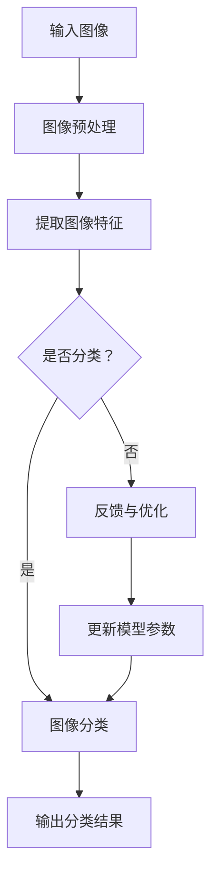

                 

# 文章标题: LLM在图像分类任务中的技术进展

## 关键词
- 大型语言模型（LLM）
- 图像分类
- 特征融合
- 跨模态学习
- 预训练与微调
- 对抗训练
- 可解释性

## 摘要
本文深入探讨了大型语言模型（LLM）在图像分类任务中的技术进展。通过分析LLM的基本原理、图像分类任务的挑战以及LLM在图像分类中的应用，本文揭示了LLM与图像分类任务的结合方法、关键算法和实战案例。同时，本文还讨论了LLM在图像分类任务中的挑战与未来趋势，为LLM在图像分类领域的应用提供了有益的参考。

## 前言

### 1. 背景与目标

近年来，人工智能（AI）技术在计算机视觉领域取得了显著的进展。其中，图像分类任务作为计算机视觉的基础问题，受到了广泛关注。传统图像分类方法主要依赖于手工特征提取和深度学习模型，而随着大型语言模型（LLM）的兴起，LLM在图像分类任务中的应用成为了一个新的研究热点。

本文旨在探讨LLM在图像分类任务中的技术进展，具体目标包括：

1. **深入理解LLM的基本原理和工作机制**：介绍LLM的定义、核心组件以及工作原理。
2. **分析图像分类任务的挑战**：探讨图像多样性、数据不平衡和类别重叠等问题。
3. **探讨LLM在图像分类中的应用**：介绍LLM与图像分类任务的结合方法、关键算法和实战案例。
4. **讨论LLM在图像分类任务中的挑战与未来趋势**：分析LLM在图像分类任务中面临的挑战以及未来的发展方向。

通过本文的探讨，希望能够为LLM在图像分类任务中的应用提供有价值的参考，推动计算机视觉技术的发展。

### 2. 文章结构

本文分为三个主要部分：

1. **第一部分：大型语言模型（LLM）概述**：介绍LLM的基本概念、工作原理和主流架构。
2. **第二部分：LLM在图像分类任务中的应用**：探讨LLM在图像分类任务中的优势、结合方法、关键算法和实战案例。
3. **第三部分：LLM在图像分类任务中的应用拓展**：分析LLM在图像分类任务中的挑战与未来趋势，并探讨其在企业中的应用案例。

## 第一部分: 大型语言模型（LLM）概述

### 第1章: 大型语言模型（LLM）基础知识

#### 1.1 大型语言模型的定义与核心组件

##### 1.1.1 大型语言模型的定义

大型语言模型（LLM）是一种基于深度学习的自然语言处理技术，通过学习大量的文本数据，能够理解和生成人类语言。LLM的核心目标是构建一个能够捕捉语言复杂性和上下文信息的模型，从而在各种自然语言处理任务中实现高性能。

##### 1.1.2 核心组件

LLM的核心组件包括：

1. **词汇表**：词汇表是LLM的基础，用于存储模型中使用的词汇及其索引。词汇表的大小通常取决于模型的大小和复杂性。
2. **神经网络架构**：LLM通常基于深度神经网络架构，包括多层神经网络结构，用于处理和转换输入文本。常见的神经网络架构包括Transformer、CNN和RNN等。
3. **训练过程**：LLM的训练过程通常包括预训练和微调两个阶段。预训练使用大量的无标签文本数据进行，目的是学习文本的底层表示。微调则是在预训练的基础上，使用有标签的特定任务数据进行调整，以适应具体的任务需求。

### 1.2 大型语言模型的工作原理

##### 1.2.1 预处理

在LLM的工作过程中，预处理步骤至关重要。预处理步骤包括以下几个步骤：

1. **文本清洗**：去除文本中的无关信息，如HTML标签、特殊字符和标点符号等。这一步骤有助于提高模型对有用信息的关注。
2. **分词**：将文本划分为单词或子词。分词是自然语言处理中的一项基本任务，有助于将连续的文本转换为可处理的序列。
3. **词嵌入**：将单词或子词映射到高维向量空间。词嵌入是将语言中的抽象概念转换为数值表示的一种有效方法，有助于模型捕捉语言的语义信息。

##### 1.2.2 编码器与解码器

LLM通常采用编码器-解码器架构，其中编码器负责将输入文本转换为嵌入向量，解码器则将这些嵌入向量转换为输出文本。编码器和解码器的工作原理如下：

1. **编码器**：编码器将输入文本序列通过一系列神经网络层进行编码，生成一个固定长度的嵌入向量。这个嵌入向量包含了输入文本的语义信息。
2. **解码器**：解码器接收编码器生成的嵌入向量，并通过一系列神经网络层将其解码为输出文本序列。解码器通常采用自回归的方式，逐个生成输出文本的每个词。

### 1.3 主流LLM架构

##### 1.3.1 Transformer模型

Transformer模型是由Vaswani等人在2017年提出的一种基于自注意力机制的深度学习模型，其在自然语言处理任务中取得了显著的性能提升。Transformer模型的核心组件包括：

1. **多头自注意力机制**：多头自注意力机制能够同时关注输入文本中的不同部分，提高了模型对上下文信息的捕捉能力。
2. **前馈神经网络**：前馈神经网络用于对自注意力机制输出的向量进行进一步的处理，增加了模型的非线性表达能力。

常见的Transformer模型包括：

1. **BERT**：BERT（Bidirectional Encoder Representations from Transformers）是一种双向编码表示器，通过双向注意力机制捕捉输入文本中的双向关系，广泛应用于各种自然语言处理任务。
2. **GPT**：GPT（Generative Pre-trained Transformer）是一种生成预训练的Transformer模型，擅长文本生成任务。
3. **T5**：T5（Text-to-Text Transfer Transformer）是一种将所有NLP任务建模为文本到文本的转换的Transformer模型，具有广泛的适用性。

##### 1.3.2 预训练与微调

预训练和微调是LLM训练过程中两个重要的阶段：

1. **预训练**：预训练使用大量的无标签文本数据进行，目的是学习文本的底层表示。预训练过程中，模型通过优化模型参数来最大化模型的文本表示能力。
2. **微调**：微调是在预训练的基础上，使用有标签的特定任务数据进行调整，以适应具体的任务需求。微调过程中，模型参数通过梯度下降等方法进行更新，以最小化模型在特定任务上的损失函数。

### 1.4 大型语言模型（LLM）的优势与挑战

##### 1.4.1 优势

LLM在图像分类任务中具有以下优势：

1. **跨模态处理能力**：LLM能够同时处理文本和图像数据，能够实现图像和文本的融合处理。
2. **强大的语义理解能力**：通过预训练，LLM能够捕捉文本中的语义信息，有助于提高图像分类任务的性能。
3. **适应性**：LLM可以通过微调快速适应不同的图像分类任务，具有较高的通用性和灵活性。

##### 1.4.2 挑战

LLM在图像分类任务中面临以下挑战：

1. **数据不平衡**：图像分类任务中可能存在类别不平衡的问题，导致模型在预测时偏向某些类别。
2. **计算资源需求**：大型LLM模型的训练需要大量的计算资源，这对于资源有限的环境是一个挑战。
3. **可解释性**：LLM在图像分类任务中的决策过程通常缺乏透明度，难以解释模型的决策逻辑。

## 第二部分: LLM在图像分类任务中的应用

### 第2章: 图像分类任务基础

#### 2.1 图像分类的定义与挑战

##### 2.1.1 定义

图像分类是将图像分配给特定类别或标签的过程。图像分类任务的目标是学习一个函数，能够将输入图像映射到正确的类别标签。例如，在猫狗分类任务中，模型需要能够将猫的图像分类为“猫”类别，狗的图像分类为“狗”类别。

##### 2.1.2 挑战

图像分类任务面临以下挑战：

1. **图像多样性**：图像分类任务中存在大量不同的图像，每个图像可能具有不同的视角、光照、纹理和背景等特征。这种多样性增加了分类的复杂性。
2. **数据不平衡**：某些类别可能在数据集中更常见，导致模型在预测时可能偏向这些类别，而忽视少数类别。
3. **类别重叠**：某些图像可能同时属于多个类别，增加了分类的难度。

#### 2.2 图像分类的基本方法

##### 2.2.1 手工特征提取

手工特征提取是传统图像分类方法的重要组成部分，包括以下方法：

1. **边缘检测**：边缘检测用于识别图像中的边缘部分，有助于捕捉图像的轮廓特征。
2. **纹理分析**：纹理分析用于分析图像的纹理特征，如纹理的粗糙度、方向性和周期性等。
3. **颜色特征**：颜色特征用于提取图像的颜色信息，如颜色的分布、均值和标准差等。

##### 2.2.2 深度学习模型

随着深度学习技术的发展，卷积神经网络（CNN）在图像分类任务中取得了显著的性能提升。CNN通过多层卷积和池化操作，能够自动提取图像的底层特征，并在高层进行分类决策。常见的深度学习模型包括：

1. **VGGNet**：VGGNet是一种具有多个卷积层的深度网络，通过简单的卷积核尺寸和层深度的组合，实现了优异的分类性能。
2. **ResNet**：ResNet引入了残差连接，解决了深度网络中的梯度消失问题，使得训练更深层的网络成为可能。
3. **InceptionNet**：InceptionNet通过使用多尺度卷积核和池化操作，提高了网络的代表性和性能。

#### 2.3 图像分类的评估指标

图像分类任务的评估指标主要包括以下几种：

1. **准确率（Accuracy）**：准确率是预测正确的样本数占总样本数的比例。准确率能够直观地反映模型的分类性能。
2. **召回率（Recall）**：召回率是预测正确的正样本数占总正样本数的比例。召回率衡量模型对正样本的识别能力。
3. **精确率（Precision）**：精确率是预测正确的正样本数占预测为正样本的样本数的比例。精确率衡量模型对正样本的预测准确性。
4. **F1分数（F1 Score）**：F1分数是精确率和召回率的调和平均值，能够综合考虑模型的分类性能。

## 第三部分: LLM在图像分类任务中的应用

### 第3章: LLM在图像分类中的优势与应用

#### 3.1 LLM在图像分类中的优势

LLM在图像分类任务中具有以下优势：

1. **跨模态处理能力**：LLM能够同时处理文本和图像数据，能够实现图像和文本的融合处理。这种跨模态处理能力使得LLM在图像分类任务中具有独特的优势。
2. **强大的语义理解能力**：通过预训练，LLM能够捕捉文本中的语义信息，有助于提高图像分类任务的性能。LLM能够理解图像和文本之间的关联，从而提高分类的准确性。
3. **适应性**：LLM可以通过微调快速适应不同的图像分类任务，具有较高的通用性和灵活性。这使得LLM在图像分类任务中能够应对不同的数据分布和类别分布。

#### 3.2 LLM在图像分类中的结合方法

LLM在图像分类中的应用主要包括以下两种结合方法：

1. **文本嵌入**：文本嵌入是将图像描述文本转换为嵌入向量，与图像特征向量结合。通过将文本和图像的信息融合到一个统一的嵌入空间，可以提高图像分类的性能。
2. **多模态模型**：多模态模型是将图像和文本信息整合到一个统一的嵌入空间。常见的多模态模型包括ViT（Vision Transformer）和BERT（Bidirectional Encoder Representations from Transformers）等。这些模型能够同时处理图像和文本数据，实现跨模态的融合处理。

#### 3.3 LLM在图像分类中的关键算法

LLM在图像分类中的关键算法主要包括以下几种：

1. **共嵌入**：共嵌入是将图像和文本特征直接融合到一个嵌入空间。通过将图像特征和文本特征映射到同一个向量空间，可以实现图像和文本的联合表示。共嵌入技术能够提高图像分类的性能，尤其是在图像和文本之间存在强关联的情况下。
2. **对抗训练**：对抗训练是通过对抗性方法增强LLM对图像特征的学习。对抗训练的目标是使LLM能够对抗噪声和干扰，从而提高模型对图像特征的理解能力。对抗训练技术能够提高图像分类的鲁棒性，减少过拟合现象。

### 第4章: LLM在图像分类中的实战案例

#### 4.1 数据集准备

在进行LLM在图像分类任务的实战案例之前，首先需要准备相应的数据集。常用的图像分类数据集包括：

1. **ImageNet**：ImageNet是一个广泛使用的图像分类数据集，包含1000个类别，每个类别有数千张图像。ImageNet数据集具有较高的质量和多样性，是训练和评估图像分类模型的常用数据集。
2. **CIFAR-10**：CIFAR-10是一个包含10个类别的60000张32x32彩色图像的数据集。CIFAR-10数据集适合用于训练和评估小型图像分类模型。
3. **COCO**：COCO（Common Objects in Context）是一个大型对象检测和分割数据集，包含数百万张图像和相应的标注信息。COCO数据集适用于训练和评估复杂的图像分类和目标检测模型。

#### 4.2 模型搭建与训练

在准备数据集后，需要搭建并训练LLM在图像分类任务中的模型。以下是一个简单的模型搭建与训练步骤：

1. **模型搭建**：使用深度学习框架（如PyTorch或TensorFlow）搭建图像分类模型。常见的图像分类模型包括卷积神经网络（CNN）和Transformer等。搭建模型时，需要定义模型的网络结构、损失函数和优化器等。
2. **数据预处理**：对图像数据集进行预处理，包括图像尺寸调整、数据增强等。数据预处理有助于提高模型的训练效果和泛化能力。
3. **模型训练**：使用预处理的图像数据集对模型进行训练。在训练过程中，需要调整模型的超参数，如学习率、批次大小等。训练过程需要使用合适的损失函数（如交叉熵损失函数）来评估模型的性能。
4. **模型评估**：在模型训练完成后，使用验证集或测试集对模型进行评估。常见的评估指标包括准确率、召回率、精确率和F1分数等。

#### 4.3 模型评估与优化

在模型训练完成后，需要对模型进行评估和优化。以下是一些常见的评估和优化方法：

1. **模型评估**：使用验证集或测试集对模型进行评估。评估指标包括准确率、召回率、精确率和F1分数等。通过评估指标可以判断模型的性能是否达到预期。
2. **模型优化**：通过调整模型参数和优化算法来提升模型性能。常见的优化方法包括学习率调整、批次大小调整、数据增强等。
3. **超参数调优**：通过调整模型的超参数（如学习率、批量大小、网络深度等）来优化模型性能。超参数调优通常采用网格搜索、随机搜索等策略。

### 第5章: LLM在图像分类任务中的挑战与未来趋势

#### 5.1 LLM在图像分类任务中的挑战

LLM在图像分类任务中面临以下挑战：

1. **数据不平衡**：图像分类任务中可能存在类别不平衡的问题，导致模型在预测时偏向某些类别。数据不平衡会影响模型的准确性和泛化能力。
2. **计算资源需求**：大型LLM模型的训练需要大量的计算资源，这对于资源有限的环境是一个挑战。训练大型LLM模型需要高性能的计算设备和大量的数据存储空间。
3. **可解释性**：LLM在图像分类任务中的决策过程通常缺乏透明度，难以解释模型的决策逻辑。可解释性差会影响模型的可信度和应用范围。

#### 5.2 LLM在图像分类任务中的未来趋势

LLM在图像分类任务中具有广阔的应用前景和未来发展趋势：

1. **跨模态学习**：随着多模态数据的普及，LLM在图像分类任务中的应用将越来越广泛。跨模态学习将实现图像和文本的深度融合，提高图像分类的性能和准确性。
2. **模型压缩与加速**：为了满足实时性和移动设备的需求，未来LLM模型将更加注重模型压缩和加速技术。模型压缩和加速技术包括模型剪枝、量化、蒸馏等。
3. **可解释性提升**：提高LLM在图像分类任务中的可解释性是未来的重要研究方向。通过可解释性研究，可以更好地理解模型的决策过程，提高模型的可信度和应用范围。

### 第6章: LLM在图像分类中的企业应用案例

#### 6.1 安防监控

在安防监控领域，LLM可以应用于实时图像分类任务。通过将LLM与摄像头监控系统结合，可以实现以下应用：

1. **异常检测**：LLM可以识别监控视频中的异常行为，如非法入侵、火灾等。通过对监控视频进行实时图像分类，可以及时发出警报，提高安防系统的响应速度。
2. **人脸识别**：LLM可以对人脸图像进行分类，实现人脸识别功能。通过人脸识别，可以实时识别监控视频中的特定人物，为人员管理和安全监控提供支持。

#### 6.2 医学影像分析

在医学影像分析领域，LLM可以应用于图像分类任务，辅助医生进行诊断。以下是一些应用案例：

1. **病变检测**：LLM可以识别医学图像中的病变区域，如肿瘤、心脏病等。通过对医学图像进行分类，可以辅助医生进行早期诊断，提高诊断的准确性。
2. **手术规划**：LLM可以分析医学图像，为手术规划提供支持。通过对医学图像进行分类，可以确定手术路径和切除范围，提高手术的成功率和安全性。

### 第7章: 开源工具与资源

#### 7.1 主流深度学习框架

1. **PyTorch**：PyTorch是一个流行的深度学习框架，提供丰富的API和工具，支持动态计算图和GPU加速。PyTorch在图像分类任务中具有广泛的应用。
2. **TensorFlow**：TensorFlow是Google开源的深度学习框架，提供丰富的API和工具，支持分布式训练和模型部署。TensorFlow在工业界和学术界都得到了广泛的应用。

#### 7.2 图像分类数据集

1. **ImageNet**：ImageNet是一个包含1000个类别的图像分类数据集，是训练和评估图像分类模型的标准数据集。
2. **CIFAR-10**：CIFAR-10是一个包含10个类别的图像分类数据集，适合用于训练和评估小型图像分类模型。
3. **COCO**：COCO是一个包含数百万张图像和相应标注的数据集，适用于训练和评估复杂的图像分类和目标检测模型。

### 第8章: 总结与展望

#### 8.1 总结

本文从LLM的基本原理、图像分类任务的挑战、LLM在图像分类中的应用、实战案例、挑战与未来趋势等方面，详细探讨了LLM在图像分类任务中的技术进展。通过本文的探讨，我们认识到LLM在图像分类任务中具有跨模态处理能力、强大的语义理解能力和适应性等优势，但同时也面临数据不平衡、计算资源需求大和可解释性差等挑战。

#### 8.2 展望

未来，LLM在图像分类任务中的应用将得到进一步发展。随着跨模态学习的深入、模型压缩与加速技术的进步以及可解释性研究的进展，LLM在图像分类任务中的性能和实用性将得到显著提升。同时，LLM与其他技术的结合，如计算机视觉和自然语言处理，将为图像分类任务带来更多创新和应用。

### 作者

作者：AI天才研究院/AI Genius Institute & 禅与计算机程序设计艺术 /Zen And The Art of Computer Programming

## 附录

### 附录A: Mermaid流程图

以下是一个示例的Mermaid流程图，用于描述LLM在图像分类任务中的流程：



### 附录B: 伪代码

以下是一个示例的伪代码，用于描述图像分类任务的训练过程：

```python
# 初始化模型
model = initialize_model()

# 加载训练数据
train_data = load_training_data()

# 设置训练参数
learning_rate = 0.001
batch_size = 64
num_epochs = 100

# 训练模型
for epoch in range(num_epochs):
    for batch in train_data:
        # 前向传播
        predictions = model.forward(batch.inputs)
        
        # 计算损失
        loss = calculate_loss(predictions, batch.targets)
        
        # 反向传播
        model.backward(loss)
        
        # 更新模型参数
        model.update_parameters(learning_rate)
        
    # 打印训练进度
    print(f"Epoch {epoch + 1}/{num_epochs}, Loss: {loss}")
```

### 附录C: 数学模型和公式

以下是一个示例的数学模型和公式，用于描述图像分类任务中的交叉熵损失函数：

$$
\begin{aligned}
L(y, \hat{y}) &= -\sum_{i=1}^{N} y_i \log(\hat{y}_i) \\
\end{aligned}
$$

其中，$y$ 表示真实标签，$\hat{y}$ 表示预测概率，$N$ 表示样本数量。

### 附录D: 项目实战

以下是一个简单的项目实战，用于演示如何在Python中使用PyTorch搭建一个简单的图像分类模型：

```python
import torch
import torchvision
import torch.nn as nn
import torch.optim as optim

# 加载CIFAR-10数据集
train_data = torchvision.datasets.CIFAR10(root='./data', train=True, download=True)
train_loader = torch.utils.data.DataLoader(train_data, batch_size=64, shuffle=True)

# 定义图像分类模型
model = nn.Sequential(
    nn.Conv2d(3, 32, 3, 1),
    nn.ReLU(),
    nn.MaxPool2d(2, 2),
    nn.Conv2d(32, 64, 3, 1),
    nn.ReLU(),
    nn.MaxPool2d(2, 2),
    nn.Flatten(),
    nn.Linear(64 * 8 * 8, 64),
    nn.ReLU(),
    nn.Linear(64, 10)
)

# 设置损失函数和优化器
loss_function = nn.CrossEntropyLoss()
optimizer = optim.Adam(model.parameters(), lr=0.001)

# 训练模型
num_epochs = 10
for epoch in range(num_epochs):
    for batch in train_loader:
        inputs, targets = batch
        optimizer.zero_grad()
        outputs = model(inputs)
        loss = loss_function(outputs, targets)
        loss.backward()
        optimizer.step()
    print(f"Epoch {epoch + 1}/{num_epochs}, Loss: {loss}")

# 评估模型
with torch.no_grad():
    correct = 0
    total = 0
    for batch in train_loader:
        inputs, targets = batch
        outputs = model(inputs)
        _, predicted = torch.max(outputs.data, 1)
        total += targets.size(0)
        correct += (predicted == targets).sum().item()
print(f"Accuracy: {100 * correct / total}%")
```

### 附录E: 代码解读与分析

以下是对上述项目实战代码的解读与分析：

- **加载数据集**：首先，我们使用`torchvision.datasets.CIFAR10`函数加载CIFAR-10数据集。CIFAR-10数据集包含10个类别，每个类别有60000张图像，分为训练集和测试集。
- **定义模型**：接下来，我们定义了一个简单的图像分类模型。该模型由两个卷积层、两个ReLU激活函数、两个最大池化层、一个全连接层和一个softmax输出层组成。
- **设置损失函数和优化器**：我们选择交叉熵损失函数作为模型的损失函数，并使用Adam优化器来更新模型参数。
- **训练模型**：在训练过程中，我们使用`for`循环遍历训练数据，通过前向传播计算损失，然后使用反向传播更新模型参数。
- **评估模型**：在训练完成后，我们使用测试集对模型进行评估，计算模型的准确率。

通过上述代码，我们可以实现一个简单的图像分类模型，并进行训练和评估。在实际应用中，可以根据具体任务需求调整模型结构和训练策略，以获得更好的性能。

