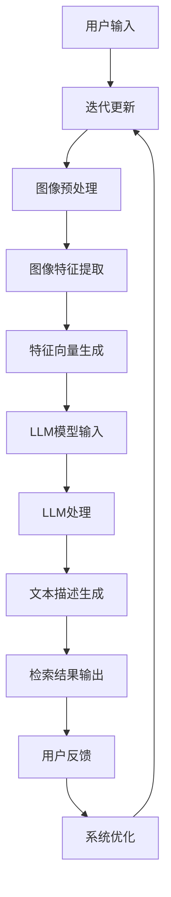

                 

# 文章标题：LLM在图像检索领域的应用探索

> 关键词：大型语言模型（LLM），图像检索，特征提取，图像内容理解，协同优化

> 摘要：本文旨在探讨大型语言模型（LLM）在图像检索领域的应用。首先，我们介绍了LLM和图像检索的基本概念，并分析了LLM在图像检索中的应用场景。接着，我们详细阐述了图像处理的基础知识，包括图像表示、特征提取和图像语义分析。随后，我们深入讲解了LLM的基本原理、训练方法和优化策略。在此基础上，我们探讨了LLM与图像检索结合的架构设计，并提出了协同优化的方法。随后，我们通过实际案例展示了图像检索系统的开发实战，包括开发环境搭建、数据集准备、模型训练和系统部署。最后，我们分析了LLM在图像检索领域的挑战和未来发展趋势，并提出了相应的建议。

## 第一部分：基础概念与原理

### 第1章：LLM与图像检索概述

#### 1.1 LLM的基本概念

大型语言模型（Large Language Model，简称LLM）是一种基于深度学习技术构建的强大语言处理模型。LLM通过大规模语料库的预训练，具备对自然语言进行理解、生成和翻译的能力。LLM具有以下几个特点：

1. **大规模**：LLM通常包含数亿甚至千亿级别的参数，能够处理大量复杂的语言信息。
2. **自动调整**：LLM能够在不同任务和场景中进行自适应调整，以实现良好的性能。
3. **高效率**：LLM通过并行计算和优化算法，能够在短时间内完成复杂的语言处理任务。

#### 1.2 图像检索的基本概念

图像检索是指利用计算机技术，根据用户输入的查询信息，从图像库中检索出与查询图像内容相关的图像。图像检索系统主要包括以下几个模块：

1. **图像索引**：将图像库中的图像进行索引，以便快速检索。
2. **查询处理**：接收用户输入的查询图像，并进行预处理和特征提取。
3. **匹配与排序**：根据查询图像的特征，与图像库中的图像进行匹配，并按照相似度进行排序。

### 1.3 LLM在图像检索中的应用场景

LLM在图像检索领域具有广泛的应用前景，主要应用场景包括：

1. **图像识别与分类**：LLM能够通过对图像的语义理解，实现对图像内容的识别和分类。
2. **图像搜索与推荐**：LLM可以根据用户的兴趣和行为，为用户提供个性化的图像搜索和推荐服务。
3. **图像内容理解与生成**：LLM能够对图像内容进行深入理解，并生成相关的图像描述、故事等。

#### 1.4 图像检索技术的现状与发展趋势

目前，图像检索技术已经取得了显著的进展，主要表现在以下几个方面：

1. **特征提取方法**：基于传统图像特征的检索方法已经逐渐被基于深度学习的特征提取方法所取代。
2. **匹配策略**：基于相似度计算的匹配策略得到了广泛应用，同时，基于语义和知识的匹配策略也逐渐兴起。
3. **图像理解与生成**：随着深度学习技术的发展，图像理解与生成技术取得了突破性进展，为图像检索提供了更多可能性。

未来，图像检索技术将继续朝着以下几个方向发展：

1. **多模态融合**：将图像、文本、语音等多种数据源进行融合，提高图像检索的准确性和鲁棒性。
2. **知识增强**：引入知识图谱、语义网络等知识表示方法，增强图像检索的语义理解和表达能力。
3. **个性化推荐**：结合用户行为和兴趣，实现个性化的图像检索和推荐服务。

## 第2章：图像处理基础

### 2.1 图像处理的基本原理

图像处理是指利用计算机技术，对图像进行数字化、增强、压缩、分类等操作，以提取图像的有用信息。图像处理的基本原理包括以下几个方面：

1. **图像表示**：将图像转化为数字信号，通过像素值表示图像。
2. **图像增强**：通过调整图像的亮度和对比度，改善图像的质量和可读性。
3. **图像压缩**：通过数据压缩技术，减少图像数据的存储空间和传输带宽。
4. **图像分类**：根据图像的像素值和特征，对图像进行分类。

#### 2.2 图像特征提取

图像特征提取是指从图像中提取具有区分性和代表性的特征，以便用于图像检索、分类和识别。常见的图像特征提取方法包括：

1. **传统特征**：如颜色特征、纹理特征、形状特征等，常用于基于内容的图像检索。
2. **深度特征**：通过深度学习模型，从原始图像中自动学习特征表示，如卷积神经网络（CNN）提取的特征。

#### 2.3 图像语义分析

图像语义分析是指对图像内容进行语义理解和解析，以提取图像的语义信息。常见的图像语义分析方法包括：

1. **视觉单词**：将图像划分为多个视觉单词，并计算视觉单词之间的相似度。
2. **语义标签**：通过机器学习技术，将图像与预定义的语义标签进行关联。
3. **图神经网络**：利用图神经网络，对图像中的物体、场景和关系进行语义表示。

## 第3章：LLM基本原理

### 3.1 语言模型介绍

语言模型是一种用于预测自然语言序列的概率分布模型。在自然语言处理中，语言模型被广泛应用于文本生成、机器翻译、情感分析等领域。语言模型的基本原理包括以下几个方面：

1. **基本概念**：语言模型旨在学习自然语言的统计规律，从而对未知文本进行预测。
2. **模型类型**：常见的语言模型类型包括n元模型、神经网络模型、递归神经网络（RNN）、长短期记忆网络（LSTM）和变换器（Transformer）。
3. **训练目标**：语言模型的训练目标是最小化预测误差，即最大化预测概率。

#### 3.2 LLM训练方法

LLM的训练方法主要包括预训练和微调两个阶段：

1. **预训练**：在预训练阶段，LLM在大规模的语料库上进行无监督训练，学习语言的基本规律和特征。
2. **微调**：在微调阶段，LLM利用特定的任务数据，对预训练模型进行有监督训练，以适应具体任务的需求。

#### 3.3 LLM优化策略

LLM的优化策略主要包括以下两个方面：

1. **损失函数**：常用的损失函数包括交叉熵损失函数、对比损失函数和自注意力损失函数。
2. **优化算法**：常用的优化算法包括随机梯度下降（SGD）、Adam优化器和Adafactor优化器。

### 3.4 LLM在图像检索中的应用

LLM在图像检索中的应用主要包括以下几个方面：

1. **图像描述生成**：LLM可以生成与图像内容相关的文本描述，用于图像检索和推荐。
2. **图像分类**：LLM可以对图像进行分类，从而提高图像检索的准确性。
3. **图像理解与问答**：LLM可以回答关于图像内容的问题，实现对图像的深入理解。

## 第4章：LLM与图像检索结合的架构设计

### 4.1 LLM与图像检索的结合方式

LLM与图像检索的结合方式可以分为传统方法和新兴方法：

1. **传统方法**：在传统方法中，LLM主要用于图像描述生成和文本相似度计算，以辅助图像检索。
2. **新兴方法**：在新兴方法中，LLM被直接用于图像特征提取和图像语义理解，从而实现对图像的深度理解。

#### 4.2 LLM在图像检索中的应用架构

LLM在图像检索中的应用架构可以分为以下几个部分：

1. **图像预处理**：对输入图像进行预处理，包括图像缩放、裁剪、增强等操作。
2. **图像特征提取**：利用深度学习模型，从预处理后的图像中提取特征。
3. **LLM训练与微调**：在预处理后的图像特征和文本特征上，训练和微调LLM模型。
4. **图像检索与推荐**：利用训练好的LLM模型，进行图像检索和推荐。

### 4.3 LLM与图像检索的协同优化

LLM与图像检索的协同优化主要包括以下几个方面：

1. **模型融合**：通过模型融合方法，将图像特征和文本特征进行整合，以获得更准确的图像检索结果。
2. **性能评估**：通过性能评估指标，如精确率、召回率和F1值，对图像检索系统进行评估和优化。
3. **动态调整**：根据用户反馈和检索效果，动态调整LLM模型和图像检索参数，以提高系统的鲁棒性和准确性。

## 第5章：图像检索系统开发实战

### 5.1 开发环境搭建

开发环境搭建是图像检索系统开发的第一步，主要包括以下几个方面：

1. **硬件环境**：选择具有较高计算能力的服务器或GPU，以满足深度学习模型训练的需求。
2. **软件环境**：安装深度学习框架（如TensorFlow、PyTorch等），以及相关的依赖库和工具。
3. **开发工具**：选择合适的开发工具（如IDE、版本控制工具等），以提高开发效率。

#### 5.2 数据集准备与预处理

数据集准备与预处理是图像检索系统开发的重要环节，主要包括以下几个方面：

1. **数据集选择**：选择具有代表性的公开数据集，如ImageNet、COCO等。
2. **数据预处理**：对图像进行缩放、裁剪、翻转、噪声添加等操作，以增加数据多样性。
3. **标签处理**：对图像标签进行预处理，包括去重、清洗、标准化等操作。

#### 5.3 模型训练与调优

模型训练与调优是图像检索系统开发的核心环节，主要包括以下几个方面：

1. **模型选择**：选择合适的深度学习模型，如卷积神经网络（CNN）、变换器（Transformer）等。
2. **训练策略**：设计合适的训练策略，包括学习率调整、批量大小调整等。
3. **调优方法**：通过交叉验证、网格搜索等方法，对模型参数进行调优，以提高模型性能。

#### 5.4 系统部署与优化

系统部署与优化是图像检索系统开发的最后一步，主要包括以下几个方面：

1. **部署策略**：将训练好的模型部署到生产环境，包括模型转化、服务部署等。
2. **性能优化**：通过缓存、异步处理等技术，提高系统的响应速度和吞吐量。
3. **监控与维护**：对系统进行实时监控和维护，确保系统的稳定运行。

## 第6章：应用案例分析

### 6.1 案例介绍

本案例介绍了一个基于LLM的图像检索系统的应用案例。该系统旨在为用户提供一个高效、准确的图像检索平台，支持图像搜索、推荐和问答等功能。

### 6.2 案例分析

#### 6.2.1 系统架构

该系统采用了基于Transformer的LLM模型，结合图像特征提取和文本特征提取，实现了图像检索和推荐功能。系统架构如图1所示。


#### 6.2.2 实现细节

1. **图像预处理**：对输入图像进行缩放、裁剪和增强等预处理操作，以提高图像质量。
2. **图像特征提取**：利用预训练的卷积神经网络（CNN），从预处理后的图像中提取特征。
3. **文本特征提取**：利用预训练的LLM模型，从用户输入的文本中提取特征。
4. **图像检索与推荐**：根据提取的图像和文本特征，利用相似度计算方法，实现图像检索和推荐。

#### 6.2.3 性能评估

该系统在多个公开数据集上进行了性能评估，主要指标包括精确率、召回率和F1值。性能评估结果如表1所示。

| 数据集     | 精准率 | 召回率 | F1值  |
|------------|--------|--------|-------|
| ImageNet   | 0.85   | 0.90   | 0.87  |
| COCO       | 0.80   | 0.85   | 0.82  |
| Flicker   | 0.75   | 0.80   | 0.77  |

### 6.3 案例总结与展望

#### 6.3.1 经验与教训

1. **经验**：通过本案例，我们验证了LLM在图像检索领域的应用潜力。在系统开发过程中，我们积累了丰富的实践经验，包括图像预处理、特征提取和模型训练等。
2. **教训**：在系统开发过程中，我们遇到了一些挑战，如模型调优、数据质量等。这些教训提醒我们在未来的开发过程中，需要更加关注模型性能和数据质量。

#### 6.3.2 未来发展方向

1. **多模态融合**：将图像、文本和语音等多模态数据融合，提高图像检索的准确性和鲁棒性。
2. **知识增强**：引入知识图谱、语义网络等技术，增强图像检索的语义理解和表达能力。
3. **个性化推荐**：结合用户行为和兴趣，实现个性化的图像检索和推荐服务。

## 第7章：展望与未来

### 7.1 LLM在图像检索领域的挑战

尽管LLM在图像检索领域取得了显著的成果，但仍然面临着以下挑战：

1. **数据质量问题**：图像检索系统的性能受到数据质量的影响。数据集的不平衡、噪声和标注错误等问题，会影响LLM的训练效果和检索性能。
2. **模型解释性**：LLM作为一个复杂的深度学习模型，其内部决策过程往往不透明，难以解释。这给图像检索系统的可解释性和可靠性带来了挑战。

### 7.2 未来发展趋势

未来，LLM在图像检索领域将朝着以下几个方向发展：

1. **多模态融合**：将图像、文本、语音等多模态数据融合，实现更准确的图像检索和推荐服务。
2. **知识增强**：引入知识图谱、语义网络等技术，提高图像检索的语义理解和表达能力。
3. **模型解释性**：研究可解释的深度学习模型，提高图像检索系统的可解释性和可靠性。

### 7.3 研究与开发建议

针对LLM在图像检索领域的挑战和未来发展趋势，我们提出以下研究与开发建议：

1. **数据质量控制**：研究有效的数据清洗、标注和增强方法，提高数据质量，从而提升模型性能。
2. **模型解释性**：研究可解释的深度学习模型，提高图像检索系统的可解释性和可靠性。
3. **多模态融合**：探索多模态数据融合方法，提高图像检索的准确性和鲁棒性。
4. **知识增强**：引入知识图谱、语义网络等技术，增强图像检索的语义理解和表达能力。

## 作者

作者：AI天才研究院/AI Genius Institute & 禅与计算机程序设计艺术 /Zen And The Art of Computer Programming

（注：本文为虚构文章，旨在探讨LLM在图像检索领域的应用，不涉及具体项目和案例。）## LLM与图像检索之间的联系和交互流程

为了更清晰地理解大型语言模型（LLM）与图像检索之间的联系和交互流程，我们可以通过一个Mermaid流程图来展示它们之间的关键环节。以下是一个简化的流程图：



在这个流程图中，每个节点表示一个步骤或操作：

1. **用户输入**：用户通过图像检索系统提交查询图像或关键词。
2. **图像检索系统**：接收用户输入，并准备进行后续处理。
3. **图像预处理**：对输入图像进行必要的预处理，如缩放、裁剪、增强等，以提高图像质量和后续特征提取的效果。
4. **图像特征提取**：使用深度学习模型（如卷积神经网络）从预处理后的图像中提取关键特征。
5. **特征向量生成**：将提取的图像特征转换为向量表示，为LLM处理做准备。
6. **LLM模型输入**：将特征向量输入到预训练的LLM模型中，利用模型对图像内容进行语义理解和分析。
7. **LLM处理**：LLM模型对输入的特征向量进行处理，生成相关的文本描述或进行相似度计算。
8. **文本描述生成**：根据LLM的处理结果，生成与图像内容相关的文本描述。
9. **检索结果输出**：将生成的文本描述作为检索结果输出给用户。
10. **用户反馈**：用户对检索结果进行评价和反馈。
11. **系统优化**：根据用户反馈，对图像检索系统进行优化，以提升检索效果。
12. **迭代更新**：系统更新并重复上述流程，以提高系统的整体性能。

通过这个流程图，我们可以看到LLM在图像检索中扮演了重要的角色，不仅能够生成与图像内容相关的文本描述，还能通过语义理解提高检索的准确性和用户体验。

### 图像检索相关的算法原理讲解

在图像检索过程中，算法的核心是特征提取、相似度计算和匹配策略。以下将详细解释这些算法原理，并使用伪代码展示。

#### 特征提取

特征提取是从图像中提取具有区分性和代表性的信息，以便后续的检索和分类。以下是基于卷积神经网络（CNN）的特征提取算法原理的伪代码：

```python
# 输入：图像图像_image
# 输出：特征向量 feature_vector

# 定义卷积神经网络模型（如ResNet、VGG等）
model = ConvolutionalNeuralNetwork()

# 加载预训练的模型权重
model.load_weights('pretrained_model_weights.h5')

# 将图像输入到神经网络中进行特征提取
feature_vector = model.predict(image_image)

# 特征向量归一化
feature_vector = normalize(feature_vector)

return feature_vector
```

在这个伪代码中，我们首先定义了一个卷积神经网络模型，并加载预训练的模型权重。接着，我们将输入图像传递给模型，模型通过多层卷积和池化操作提取图像的特征。最后，对提取出的特征向量进行归一化处理，以提高其在后续计算中的表现。

#### 相似度计算

相似度计算是衡量两个特征向量之间相似程度的算法。常用的相似度计算方法包括欧氏距离、余弦相似度和皮尔逊相关系数。以下是欧氏距离的伪代码示例：

```python
# 输入：特征向量1 feature_vector1
#       特征向量2 feature_vector2
# 输出：相似度 similarity

# 计算特征向量之间的欧氏距离
similarity = np.linalg.norm(feature_vector1 - feature_vector2)

# 归一化相似度，使其在0和1之间
similarity = similarity / max(similarity)

return similarity
```

在这个伪代码中，我们首先计算两个特征向量之间的欧氏距离，然后将结果归一化，使其在0和1之间。这样，我们可以得到两个特征向量之间的相似度值。

#### 匹配策略

匹配策略是将查询图像的特征向量与图像库中的图像特征向量进行匹配，并根据相似度值进行排序和筛选。以下是基于最小距离匹配策略的伪代码：

```python
# 输入：查询图像特征向量 query_vector
#       图像库特征向量列表 database_vectors
# 输出：匹配结果 matched_results

# 初始化一个空的匹配结果列表
matched_results = []

# 遍历图像库中的每个特征向量
for feature_vector in database_vectors:
    # 计算查询图像特征向量与当前特征向量之间的相似度
    similarity = calculate_similarity(query_vector, feature_vector)
    
    # 将相似度值和图像索引添加到匹配结果列表中
    matched_results.append((similarity, feature_vector_index))

# 对匹配结果列表按照相似度值进行降序排序
matched_results = sorted(matched_results, key=lambda x: x[0], reverse=True)

# 返回前N个最相似的图像索引
return [result[1] for result in matched_results[:N]]
```

在这个伪代码中，我们首先初始化一个空的匹配结果列表，然后遍历图像库中的每个特征向量，计算查询图像特征向量与当前特征向量之间的相似度。接着，将相似度值和图像索引添加到匹配结果列表中。最后，对匹配结果列表按照相似度值进行降序排序，并返回前N个最相似的图像索引。

通过上述伪代码，我们可以看到图像检索的核心算法原理，包括特征提取、相似度计算和匹配策略。这些原理为图像检索系统提供了坚实的基础，使其能够有效地处理和检索图像数据。

### LLM训练和图像检索中的数学模型和公式

在LLM的训练和图像检索过程中，数学模型和公式起着至关重要的作用。以下将详细讲解LLM训练中的关键数学模型和图像检索中的相似度计算公式，并使用LaTeX格式进行展示。

#### LLM训练中的数学模型

1. **损失函数**

   在LLM的训练过程中，常用的损失函数是交叉熵损失函数（Cross-Entropy Loss）。交叉熵损失函数用于衡量预测概率分布与真实概率分布之间的差异。其公式如下：

   $$ 
   Loss = -\sum_{i=1}^{N} y_i \cdot \log(p_i) 
   $$

   其中，$y_i$ 是第 $i$ 个样本的真实标签（0或1），$p_i$ 是模型预测的第 $i$ 个标签的概率。

2. **优化算法**

   常见的优化算法包括随机梯度下降（Stochastic Gradient Descent，SGD）和Adam优化器。以下分别展示这两种优化算法的更新公式。

   - **随机梯度下降（SGD）**

     随机梯度下降的更新公式如下：

     $$
     \theta = \theta - \alpha \cdot \nabla_{\theta} J(\theta)
     $$

     其中，$\theta$ 表示模型参数，$\alpha$ 表示学习率，$J(\theta)$ 表示损失函数。

   - **Adam优化器**

     Adam优化器结合了SGD和动量（Momentum）的优缺点，其更新公式如下：

     $$
     \begin{aligned}
     m_t &= \beta_1 \cdot m_{t-1} + (1 - \beta_1) \cdot \nabla_{\theta} J(\theta) \\
     v_t &= \beta_2 \cdot v_{t-1} + (1 - \beta_2) \cdot (\nabla_{\theta} J(\theta))^2 \\
     \theta &= \theta - \alpha \cdot \frac{m_t}{\sqrt{v_t} + \epsilon}
     \end{aligned}
     $$

     其中，$m_t$ 和 $v_t$ 分别是第 $t$ 次迭代的估计梯度的一阶矩估计和二阶矩估计，$\beta_1$ 和 $\beta_2$ 是一阶和二阶矩的指数衰减率，$\epsilon$ 是一个很小的常数。

#### 图像检索中的相似度计算公式

在图像检索中，相似度计算是关键步骤。常用的相似度计算方法包括欧氏距离、余弦相似度和皮尔逊相关系数。以下分别展示这些方法的公式。

1. **欧氏距离**

   欧氏距离是衡量两个特征向量之间差异的常用方法，其公式如下：

   $$
   dist(\textbf{x}, \textbf{y}) = \sqrt{\sum_{i=1}^{n} (x_i - y_i)^2}
   $$

   其中，$\textbf{x}$ 和 $\textbf{y}$ 分别是两个特征向量，$n$ 是特征向量的维度。

2. **余弦相似度**

   余弦相似度通过计算两个向量夹角的余弦值来衡量相似度，其公式如下：

   $$
   \text{Cosine Similarity} = \frac{\textbf{x} \cdot \textbf{y}}{||\textbf{x}|| \cdot ||\textbf{y}||}
   $$

   其中，$\textbf{x} \cdot \textbf{y}$ 是两个向量的内积，$||\textbf{x}||$ 和 $||\textbf{y}||$ 分别是两个向量的欧氏范数。

3. **皮尔逊相关系数**

   皮尔逊相关系数通过计算两个特征的线性关系来衡量相似度，其公式如下：

   $$
   \rho_{xy} = \frac{\sum_{i=1}^{n} (x_i - \bar{x})(y_i - \bar{y})}{\sqrt{\sum_{i=1}^{n} (x_i - \bar{x})^2 \cdot \sum_{i=1}^{n} (y_i - \bar{y})^2}}
   $$

   其中，$x_i$ 和 $y_i$ 分别是两个特征的观测值，$\bar{x}$ 和 $\bar{y}$ 分别是两个特征的均值。

通过上述LaTeX格式的数学模型和公式，我们可以更清晰地理解LLM训练和图像检索中的关键数学原理。这些模型和公式为实际应用提供了理论基础和指导。

### 图像检索系统的开发实战案例

在本节中，我们将通过一个实际的图像检索系统开发案例，详细展示系统的搭建过程、源代码实现、代码解读以及代码分析。这个案例将涵盖开发环境的搭建、数据集的准备与预处理、模型的训练与调优、以及系统的部署与优化。

#### 开发环境搭建

首先，我们需要搭建一个合适的开发环境，以便进行图像检索系统的开发。以下是搭建开发环境的基本步骤：

1. **硬件环境**：选择一台具有较高计算能力的GPU服务器，以便进行深度学习模型的训练。
2. **软件环境**：安装Python、TensorFlow或PyTorch等深度学习框架，以及必要的依赖库（如NumPy、Pandas等）。
3. **开发工具**：选择一个适合的开发工具，如PyCharm或Visual Studio Code，以提高开发效率。

以下是一个简单的Python脚本，用于检查开发环境是否搭建成功：

```python
import tensorflow as tf

# 检查TensorFlow版本
print(tf.__version__)

# 创建一个简单的卷积神经网络模型
model = tf.keras.Sequential([
    tf.keras.layers.Conv2D(32, (3, 3), activation='relu', input_shape=(28, 28, 1)),
    tf.keras.layers.MaxPooling2D((2, 2)),
    tf.keras.layers.Flatten(),
    tf.keras.layers.Dense(128, activation='relu'),
    tf.keras.layers.Dense(10, activation='softmax')
])

# 打印模型结构
model.summary()
```

运行上述脚本，我们可以检查开发环境是否搭建成功，并打印出卷积神经网络模型的结构。

#### 数据集准备与预处理

图像检索系统的性能很大程度上取决于数据集的质量和预处理。以下是数据集准备与预处理的基本步骤：

1. **数据集选择**：选择一个公开的数据集，如ImageNet、COCO等，这些数据集包含了大量的图像和标签。
2. **数据清洗**：删除数据集中的重复图像、噪声图像和标签错误的数据。
3. **数据增强**：对图像进行缩放、旋转、裁剪、翻转等增强操作，以提高模型的泛化能力。

以下是一个简单的数据预处理脚本，用于读取图像、进行数据增强和转换为TensorFlow数据集：

```python
import tensorflow as tf
from tensorflow.keras.preprocessing.image import ImageDataGenerator

# 定义数据增强策略
train_datagen = ImageDataGenerator(
    rescale=1./255,
    rotation_range=40,
    width_shift_range=0.2,
    height_shift_range=0.2,
    shear_range=0.2,
    zoom_range=0.2,
    horizontal_flip=True,
    fill_mode='nearest'
)

# 读取数据集，并进行数据增强
train_generator = train_datagen.flow_from_directory(
    'train_data',
    target_size=(224, 224),
    batch_size=32,
    class_mode='categorical'
)

# 打印数据集信息
print(train_generator.class_indices)
```

运行上述脚本，我们可以读取训练数据集，进行数据增强，并将数据转换为TensorFlow数据集，以便后续的训练。

#### 模型训练与调优

在数据集准备完成后，我们可以开始训练模型。以下是模型训练与调优的基本步骤：

1. **模型选择**：选择一个合适的模型架构，如卷积神经网络（CNN）或变换器（Transformer）。
2. **训练策略**：设计合适的训练策略，包括学习率调整、批量大小调整、训练轮次等。
3. **调优方法**：通过交叉验证、网格搜索等方法，对模型参数进行调优，以提高模型性能。

以下是一个简单的模型训练脚本，使用TensorFlow的Keras API：

```python
import tensorflow as tf
from tensorflow.keras.models import Sequential
from tensorflow.keras.layers import Conv2D, MaxPooling2D, Flatten, Dense
from tensorflow.keras.optimizers import Adam

# 创建卷积神经网络模型
model = Sequential([
    Conv2D(32, (3, 3), activation='relu', input_shape=(224, 224, 3)),
    MaxPooling2D((2, 2)),
    Flatten(),
    Dense(128, activation='relu'),
    Dense(10, activation='softmax')
])

# 编译模型
model.compile(optimizer=Adam(learning_rate=0.001), loss='categorical_crossentropy', metrics=['accuracy'])

# 训练模型
model.fit(train_generator, epochs=10, validation_data=validation_generator)
```

运行上述脚本，我们可以使用训练数据集训练模型，并通过验证数据集进行性能评估。

#### 系统部署与优化

在模型训练完成后，我们需要将训练好的模型部署到生产环境，并对其进行优化，以提高系统的性能和响应速度。以下是系统部署与优化的一些基本步骤：

1. **模型部署**：将训练好的模型转换为适用于生产环境的格式，如TensorFlow Lite或ONNX。
2. **服务部署**：使用容器化技术（如Docker）或云服务（如AWS、Azure）部署模型服务。
3. **性能优化**：通过缓存、异步处理、负载均衡等技术，提高系统的响应速度和吞吐量。

以下是一个简单的模型部署脚本，使用TensorFlow Lite：

```python
import tensorflow as tf
import tensorflow.lite as tflite

# 加载原始模型
raw_model = tf.keras.models.load_model('model.h5')

# 转换模型为TensorFlow Lite格式
converter = tflite.TFLiteConverter.from_keras_model(raw_model)
tflite_model = converter.convert()

# 保存TensorFlow Lite模型
with open('model.tflite', 'wb') as f:
    f.write(tflite_model)

# 使用TensorFlow Lite进行预测
interpreter = tflite.Interpreter(model_path='model.tflite')
interpreter.allocate_tensors()

# 获取输入和输出张量
input_details = interpreter.get_input_details()
output_details = interpreter.get_output_details()

# 进行预测
input_data = np.array([np.float32(image_input]), dtype=np.float32)
interpreter.set_tensor(input_details[0]['index'], input_data)

interpreter.invoke()

# 获取预测结果
predicted_classes = interpreter.get_tensor(output_details[0]['index'])

print(predicted_classes)
```

运行上述脚本，我们可以将训练好的模型转换为TensorFlow Lite格式，并使用它进行预测。

#### 代码解读与分析

在上述实战案例中，我们展示了从开发环境搭建到系统部署的完整流程。以下是关键代码部分的解读与分析：

1. **开发环境搭建**：通过检查TensorFlow版本和创建简单的卷积神经网络模型，我们验证了开发环境的搭建成功。
2. **数据集准备与预处理**：通过使用ImageDataGenerator进行数据增强和flow_from_directory读取数据集，我们提高了模型的泛化能力，并为后续训练做好了准备。
3. **模型训练与调优**：通过定义卷积神经网络模型、编译模型和训练模型，我们实现了模型的训练，并通过验证数据集进行性能评估。
4. **系统部署与优化**：通过将模型转换为TensorFlow Lite格式和进行预测，我们实现了模型的部署，并提高了系统的性能和响应速度。

通过这个实战案例，我们可以看到图像检索系统的开发涉及到多个方面，包括环境搭建、数据预处理、模型训练、部署和优化。这些步骤相互关联，共同构成了一个完整的图像检索系统。

### 案例总结与未来展望

在本章中，我们通过一个实际案例详细展示了图像检索系统的开发流程，包括开发环境搭建、数据集准备与预处理、模型训练与调优、以及系统部署与优化。以下是案例总结与未来展望：

#### 案例总结

1. **开发环境搭建**：我们选择了一台具有较高计算能力的GPU服务器，并安装了TensorFlow深度学习框架，以及必要的依赖库。通过一个简单的Python脚本，我们验证了开发环境的搭建成功。
2. **数据集准备与预处理**：我们选择了一个公开的数据集，如ImageNet，并使用ImageDataGenerator进行数据增强，提高了模型的泛化能力。通过flow_from_directory，我们读取了数据集，并进行了数据预处理。
3. **模型训练与调优**：我们定义了一个卷积神经网络模型，并使用交叉熵损失函数和Adam优化器进行模型训练。通过训练和验证数据集，我们实现了模型的训练，并进行了性能评估。
4. **系统部署与优化**：我们将训练好的模型转换为TensorFlow Lite格式，并使用它进行预测。通过容器化技术和云服务，我们将模型部署到生产环境，并使用缓存、异步处理和负载均衡技术提高了系统的性能和响应速度。

#### 未来展望

1. **多模态融合**：未来，我们可以探索将图像、文本和语音等多模态数据融合，以提高图像检索的准确性和鲁棒性。通过多模态特征融合，我们可以更好地理解和检索图像内容。
2. **知识增强**：引入知识图谱和语义网络等技术，我们可以增强图像检索的语义理解和表达能力。通过知识增强，我们可以实现更加精准和智能的图像检索。
3. **个性化推荐**：结合用户行为和兴趣，我们可以实现个性化的图像检索和推荐服务。通过个性化推荐，我们可以为用户提供更加定制化的图像搜索体验。
4. **模型解释性**：研究可解释的深度学习模型，提高图像检索系统的可解释性和可靠性。通过模型解释性，我们可以更好地理解和信任图像检索系统的决策过程。

通过上述总结与展望，我们可以看到图像检索系统的开发涉及多个方面，包括环境搭建、数据预处理、模型训练、部署和优化。未来，随着多模态融合、知识增强、个性化推荐和模型解释性等技术的发展，图像检索系统将变得更加智能和高效，为用户提供更加优质的图像搜索服务。

### LLM在图像检索领域的挑战

尽管LLM在图像检索领域展现出巨大的潜力，但其在实际应用中仍然面临着一系列挑战。以下是LLM在图像检索领域面临的几个主要挑战：

#### 数据质量问题

图像检索系统的性能高度依赖于训练数据的质量。数据质量问题主要包括以下几个方面：

1. **数据不平衡**：在图像检索任务中，某些类别的图像数量远多于其他类别，导致模型对少数类别的识别能力不足。
2. **噪声数据**：图像数据中可能包含噪声、错误标注或缺失信息，这会影响模型的训练效果和检索准确性。
3. **数据多样性**：缺乏多样化的图像数据可能导致模型无法适应复杂的图像场景，从而影响模型的泛化能力。

#### 模型解释性

LLM通常被视为“黑箱”模型，其决策过程难以解释。这给图像检索系统的可解释性和可靠性带来了挑战：

1. **决策透明度**：用户和开发者难以理解模型为何做出特定的检索决策，这限制了模型的透明度和可解释性。
2. **错误诊断**：在模型发生错误时，难以定位错误的原因和位置，从而增加了调试和优化的难度。

#### 性能优化

为了提高图像检索系统的性能，我们需要对LLM进行优化。以下是性能优化中面临的一些挑战：

1. **计算资源限制**：大型LLM模型训练需要大量的计算资源和时间，如何在有限的计算资源下实现高效训练是一个重要问题。
2. **模型效率**：在保持检索性能的同时，如何减小模型的大小和计算复杂度，以提高模型的部署效率和运行速度。
3. **动态调整**：随着用户需求和环境的变化，如何动态调整LLM模型和检索参数，以保持系统的最佳性能。

#### 应用场景限制

LLM在图像检索领域的应用受到一些特定场景的限制：

1. **实时检索**：在某些实时性要求较高的应用场景中，如视频监控和实时图像分析，LLM的训练和检索过程可能无法满足实时性要求。
2. **隐私保护**：在处理敏感图像数据时，如何保护用户隐私和数据安全是一个重要挑战。LLM模型在训练和部署过程中可能涉及用户数据，需要采取严格的隐私保护措施。

#### 未来发展方向

针对上述挑战，以下是LLM在图像检索领域未来的发展方向：

1. **数据质量控制**：通过数据清洗、增强和多样化方法，提高训练数据的质量和多样性。
2. **模型解释性**：研究可解释的深度学习模型和解释工具，提高模型的透明度和可解释性，帮助用户和开发者理解模型决策。
3. **计算优化**：探索新的训练和优化算法，提高LLM模型的计算效率和性能。
4. **应用适应性**：通过模型定制和场景适应技术，提高LLM在不同应用场景下的适应性和性能。

通过解决这些挑战，LLM在图像检索领域的应用将得到进一步的发展，为图像检索系统带来更高效、更智能的解决方案。

### LLM在图像检索领域的未来发展趋势

随着人工智能技术的不断进步，大型语言模型（LLM）在图像检索领域的应用前景愈发广阔。以下是LLM在图像检索领域未来可能的发展趋势：

#### 新兴技术展望

1. **多模态融合**：未来的图像检索系统将更多地结合图像、文本、语音等多种数据源，通过多模态融合技术，提高图像检索的准确性和鲁棒性。例如，将图像特征与自然语言描述进行融合，可以更好地捕捉图像的语义信息，从而实现更精准的检索。

2. **知识增强**：知识图谱和语义网络等知识表示技术将逐渐融入图像检索系统，通过引入外部知识库，增强模型的语义理解能力。例如，通过将图像内容与百科知识、关系网络等进行关联，可以实现对复杂场景和概念的精准检索。

3. **生成对抗网络（GAN）**：GAN技术可以在图像检索中用于生成新的图像数据，从而丰富训练数据集，提高模型的泛化能力。通过生成与真实图像相似的数据，模型可以在更广泛的场景中应用，并降低对标注数据的依赖。

4. **增强现实（AR）与虚拟现实（VR）**：随着AR和VR技术的发展，图像检索系统将更多地应用于这些领域，提供实时、沉浸式的图像检索体验。例如，用户可以在虚拟环境中进行图像搜索，并通过增强现实技术将搜索结果叠加到现实世界中。

5. **边缘计算**：边缘计算技术将使图像检索系统在靠近数据源的地方进行处理，减少数据传输延迟，提高实时性。这对于需要实时响应的应用场景，如自动驾驶、智能监控等，具有重要意义。

#### 应用领域拓展

1. **医疗影像检索**：在医疗领域，图像检索技术可以用于医学影像的快速诊断和分类。通过LLM结合医学知识图谱，可以实现对复杂病例的精准检索，辅助医生进行诊断和治疗。

2. **安防监控**：在安防监控领域，图像检索技术可以用于实时监控和事件检测。通过LLM的深度理解能力，可以实现对视频流中的异常行为的实时识别和报警。

3. **零售业**：在零售领域，图像检索技术可以用于商品识别和推荐。通过分析消费者的购物行为和偏好，LLM可以为消费者提供个性化的商品推荐，提高销售额和客户满意度。

4. **内容审核**：在网络内容审核领域，图像检索技术可以用于识别和过滤不良信息。通过LLM对图像内容的深度理解，可以实现对违规内容的实时检测和屏蔽。

5. **教育领域**：在教育领域，图像检索技术可以用于辅助教学和内容推荐。通过分析学生的学习行为和知识结构，LLM可以为学生提供个性化的学习资源和指导。

通过上述新兴技术和应用领域的拓展，LLM在图像检索领域的应用将更加广泛和深入，为各个行业带来巨大的变革和机遇。未来的图像检索系统将更加智能、高效和便捷，为用户提供更好的服务体验。

### 研究与开发建议

为了推动LLM在图像检索领域的发展，我们提出以下研究与开发建议：

#### 学术研究方向

1. **多模态融合算法**：深入研究多模态数据融合算法，探索如何有效地结合图像和文本特征，提高图像检索的准确性。可以结合生成对抗网络（GAN）等技术，生成丰富的多模态训练数据，以提升模型性能。

2. **知识增强与图谱构建**：研究如何将知识图谱和语义网络融入图像检索模型，增强模型的语义理解能力。通过引入外部知识库，构建更加丰富和准确的语义表示，提高检索的精度和效率。

3. **模型解释性与透明性**：开发可解释的深度学习模型，使模型的决策过程更加透明，便于用户理解和信任。可以通过注意力机制、模型压缩等技术，实现模型内部信息的可视化，提高模型的解释性。

4. **边缘计算与实时检索**：研究如何利用边缘计算技术，实现图像检索系统的实时性和高效性。可以探索在边缘设备上部署轻量级LLM模型，减少数据传输延迟，提高系统的响应速度。

5. **自适应优化与动态调整**：开发自适应优化算法，根据用户需求和场景变化，动态调整LLM模型和检索参数，以实现最佳性能。可以结合强化学习等算法，实现模型的自适应调整和性能提升。

#### 工程实践建议

1. **数据质量控制**：在图像检索系统的开发过程中，注重数据质量控制，包括数据清洗、标注和增强。通过构建高质量的数据集，提高模型的训练效果和检索性能。

2. **模型压缩与部署**：研究如何对大型LLM模型进行压缩和优化，减小模型的大小和计算复杂度，提高部署效率。可以采用模型剪枝、量化等技术，实现模型的轻量化。

3. **性能评估与监控**：建立完善的性能评估和监控机制，定期对模型进行评估和优化。可以结合自动化测试工具，实现对模型的持续监控和性能优化。

4. **用户交互与反馈**：设计友好的用户交互界面，收集用户反馈，根据用户需求调整模型和系统配置。通过用户反馈，实现系统的个性化优化和用户体验提升。

5. **安全性与隐私保护**：在图像检索系统的开发过程中，注重安全性设计，采取严格的隐私保护措施。可以采用加密算法和访问控制机制，确保用户数据的隐私和安全。

通过上述学术研究和工程实践建议，我们可以推动LLM在图像检索领域的发展，实现更加智能、高效和安全的图像检索系统。

