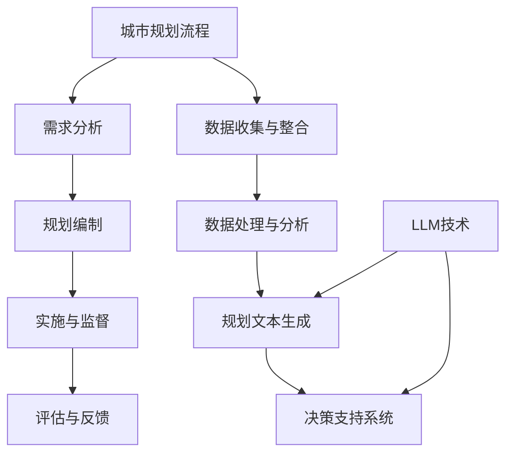

                 

### 文章标题：LLM在城市规划中的辅助作用

关键词：语言模型，城市规划，自然语言处理，机器学习，城市设计，智慧城市，可持续发展

摘要：本文详细探讨了语言模型（LLM）在城市规划中的应用及其辅助作用。首先，介绍了LLM技术的基础与城市规划的关系，包括LLM的定义、架构及其在城市规划中的关联性。随后，深入分析了自然语言处理技术基础，包括语言模型的基本概念、自然语言理解与生成技术，以及这些技术在城市规划领域的应用。接着，阐述了机器学习算法在城市规划数据分析中的重要性，以及如何使用这些算法解决实际规划问题。文章还探讨了LLM在空间分析与城市设计、环境管理与可持续规划、以及社会经济发展与社区治理中的具体应用。最后，通过三个实际应用案例，展示了LLM在城市规划中的实战效果，并提供了相关的开发环境、数据集与资源、以及代码实战与解析。本文旨在为城市规划者和技术人员提供一种新的视角，以更好地理解和应用LLM技术，推动智慧城市和可持续发展的实现。

### 第一部分：LLM在城市规划中的辅助作用概述

#### 第1章：LLM技术基础与城市规划的关系

在现代城市规划中，技术进步正不断改变着传统的规划流程。语言模型（Language Models，简称LLM）作为一种先进的人工智能技术，以其在自然语言处理（Natural Language Processing，简称NLP）领域的强大能力，逐渐成为城市规划的重要辅助工具。本节将首先介绍LLM技术的基本概念和核心特点，然后探讨城市规划的核心概念与流程，最后分析LLM在各个流程环节中的应用前景。

##### 1.1 LLM技术概述

语言模型是自然语言处理领域的一种基础性技术，它通过学习大量语言数据，构建出一个能够生成和理解自然语言的系统。LLM是一种基于深度学习的模型，其核心特点是能够处理复杂的文本数据，并生成高质量的自然语言文本。

- **定义与核心特点**：LLM可以生成连贯、流畅的文本，具备语义理解能力，能够识别文本中的意图和情感。其主要特点包括：
  - **生成能力**：LLM可以生成大量文本，并能够模仿人类语言的使用习惯。
  - **上下文理解**：LLM能够理解上下文，从而生成更加准确和自然的文本。
  - **灵活性**：LLM可以适应不同的任务和数据集，具备较强的泛化能力。

- **架构**：典型的LLM架构通常包括以下几个层次：
  - **嵌入层**：将文本中的单词或短语转换为固定长度的向量，即词嵌入（Word Embedding）。
  - **编码层**：对输入的文本进行编码，提取文本中的语义信息。
  - **解码层**：根据编码层的输出生成文本。

- **与城市规划的关联性**：LLM在城市规划中的应用潜力在于其强大的文本处理能力和语义理解能力。城市规划过程中产生的大量文本数据，如规划报告、政策文件、居民意见等，都可以通过LLM进行处理和分析，从而为规划提供更深入的洞察和辅助决策。

##### 1.2 城市规划的核心概念与流程

城市规划是一个复杂且多层次的系统，其核心目标是通过合理布局城市空间，提高居民生活质量，促进城市可持续发展。城市规划通常包括以下几个基本概念和流程：

- **基本概念**：
  - **城市规划**：指对城市空间和资源进行合理布局和优化的过程。
  - **城市设计**：侧重于城市的形态和美学，通过设计创造宜居的城市环境。
  - **交通规划**：关注城市交通系统的布局和运营，以提供高效、便捷的交通服务。
  - **环境保护**：确保城市的生态平衡，减少环境污染和资源浪费。
  - **社会经济发展**：促进城市经济的繁荣，提高居民的生活水平。

- **流程与方法**：
  - **需求分析**：通过调查和分析居民需求，确定城市规划的目标和需求。
  - **规划编制**：根据需求分析结果，制定具体的规划方案。
  - **实施与监督**：将规划方案付诸实施，并对实施过程进行监督和评估。
  - **评估与反馈**：对规划效果进行评估，并根据评估结果进行调整和优化。

- **LLM在各个流程环节的应用前景**：
  - **需求分析**：LLM可以帮助规划者分析居民的意见和建议，提取关键信息，为规划提供依据。
  - **规划编制**：LLM可以自动生成规划报告，提高规划文本的质量和效率。
  - **实施与监督**：LLM可以对城市规划的实施过程进行实时监控，及时发现和解决问题。
  - **评估与反馈**：LLM可以分析规划效果，提供评估报告，为后续的规划调整提供数据支持。

##### 1.3 城市规划中的数据与信息管理

在城市规划中，数据和信息管理是至关重要的环节。城市规划需要处理多种类型的数据，包括地理空间数据、社会经济数据、环境数据等，这些数据来源于不同的渠道，需要进行有效的整合和管理。

- **数据类型与来源**：
  - **地理空间数据**：包括卫星遥感数据、地图数据、地形数据等，通常来源于政府部门、研究机构和企业。
  - **社会经济数据**：包括人口数据、经济数据、就业数据等，来源于统计部门、政府部门和互联网数据。
  - **环境数据**：包括空气质量、水质、噪音等数据，来源于环境监测机构和科研机构。

- **信息管理在规划中的关键作用**：
  - **数据整合**：通过信息管理，可以将不同来源、不同格式的数据整合到一个统一平台上，为规划提供全面的数据支持。
  - **数据分析**：信息管理系统能够对数据进行加工和分析，提取有价值的信息，为规划决策提供数据支持。
  - **决策支持**：信息管理系统可以提供实时数据监测和预警功能，帮助规划者及时调整规划方案。

- **LLM如何优化信息管理流程**：
  - **文本分析**：LLM可以自动分析规划报告、政策文件等文本数据，提取关键信息和结论。
  - **数据挖掘**：LLM可以挖掘大规模数据中的潜在模式和关系，为规划提供更深入的洞察。
  - **智能问答**：LLM可以构建智能问答系统，为规划者提供实时信息查询和决策支持。

##### 1.4 LLM在解决城市规划问题中的优势

LLM在城市规划中具有多方面的优势，这些优势主要体现在以下几个方面：

- **提高决策效率**：通过自动分析大量文本数据和提供实时信息查询，LLM可以大大提高规划决策的效率。
- **减少人为错误**：LLM可以自动识别和处理文本数据中的错误和遗漏，减少人为因素带来的决策错误。
- **拓展规划思路**：LLM可以生成新的文本和报告，提供不同的视角和建议，拓展规划者的思路，为规划提供更全面的解决方案。

##### 1.5 LLM在城市规划中的应用案例与前景

LLM在城市规划中的实际应用案例逐渐增多，以下是一些典型的应用案例：

- **智慧城市交通规划**：利用LLM自动生成交通规划报告，提供实时交通流量预测和分析，优化交通管理。
- **环境风险评估**：通过LLM分析环境数据，评估城市规划对环境的影响，制定相应的环境保护措施。
- **社区规划与治理**：利用LLM分析居民意见和需求，为社区规划提供数据支持，并构建智能问答系统，提高社区治理效率。

未来，随着LLM技术的不断发展和完善，其在城市规划中的应用前景将更加广阔。LLM不仅可以进一步优化城市规划的流程和方法，还可以推动智慧城市和可持续发展的实现，为城市居民提供更高质量的生活环境。

#### 第2章：自然语言处理技术基础

自然语言处理（Natural Language Processing，简称NLP）是人工智能领域的一个重要分支，它致力于让计算机能够理解和生成人类语言。在城市规划中，NLP技术的应用可以极大地提高规划效率和决策质量。本节将详细介绍NLP技术的基础概念、语言模型的基本类型及其在城市规划领域的具体应用。

##### 2.1 语言模型的基本概念

语言模型是一种数学模型，用于预测一段文本的下一个单词或字符序列。在NLP中，语言模型是生成和理解自然语言的核心工具。以下是语言模型的基本概念：

- **语言模型的类型**：
  - **统计语言模型**：基于大量文本数据，通过统计方法学习语言规律，如N元语法（N-gram）。
  - **神经网络语言模型**：基于深度学习技术，通过多层神经网络学习语言特征，如循环神经网络（RNN）、长短时记忆网络（LSTM）和变换器（Transformer）。
  - **生成对抗网络（GAN）语言模型**：结合生成对抗网络（GAN）技术，通过生成模型和判别模型相互作用，生成高质量的文本。

- **语言模型的训练与优化**：
  - **训练数据集**：语言模型的训练需要大量的文本数据。这些数据可以是已标注的数据集，也可以是未标注的大规模语料库。
  - **损失函数**：在训练过程中，语言模型需要通过优化损失函数来调整模型参数。常用的损失函数包括交叉熵损失（Cross-Entropy Loss）和对抗损失（Adversarial Loss）。
  - **优化算法**：为了加速训练过程并提高模型性能，常用的优化算法包括随机梯度下降（SGD）、Adam优化器和AdaGrad等。

##### 2.2 自然语言理解与生成

自然语言理解（Natural Language Understanding，简称NLU）和自然语言生成（Natural Language Generation，简称NLG）是NLP的两个核心任务。它们分别关注如何让计算机理解和生成自然语言。

- **自然语言理解**：
  - **词嵌入技术**：词嵌入是将单词转换为固定长度的向量表示，以便在计算机中进行处理。词嵌入技术包括词袋模型（Bag of Words，BoW）、TF-IDF（Term Frequency-Inverse Document Frequency）和词嵌入（Word Embedding）等。
  - **序列模型与注意力机制**：序列模型如RNN和LSTM可以处理文本的序列数据，而注意力机制（Attention Mechanism）能够使模型在生成文本时关注重要的信息，从而提高生成质量。
  - **预训练与微调**：预训练（Pre-training）是在大规模数据集上对语言模型进行训练，然后通过微调（Fine-tuning）将模型应用于特定任务，如情感分析、命名实体识别等。

- **自然语言生成**：
  - **生成模型**：生成模型如生成对抗网络（GAN）和变分自编码器（VAE）可以生成高质量的文本。这些模型通过学习数据分布来生成新的文本。
  - **对话系统**：对话系统（Dialogue System）是一种能够与人类进行自然语言交互的系统，常见的对话系统包括聊天机器人（Chatbot）和语音助手（Voice Assistant）。
  - **模板匹配与规则生成**：模板匹配（Template Matching）和规则生成（Rule-based Generation）是两种简单的文本生成方法。前者通过匹配关键词和模板来生成文本，后者通过定义一组规则来生成文本。

##### 2.3 城市规划领域的自然语言处理应用

在城市规划领域，NLP技术可以广泛应用于以下方面：

- **地理空间数据解析**：利用NLP技术，可以自动解析和处理地理空间数据中的文本信息，如地名、地址等，从而提高空间数据的利用效率。

- **规划文本自动生成**：通过NLP技术，可以自动生成城市规划报告、政策文件等文本，提高规划文本的生成质量和效率。

- **智能问答系统**：利用NLP技术，可以构建智能问答系统，为城市规划者提供实时信息查询和决策支持。

- **公众参与与反馈分析**：通过分析公众的意见和建议，NLP技术可以帮助规划者更好地理解居民的需求和期望，为规划提供参考。

- **政策文本分析**：利用NLP技术，可以对政策文本进行语义分析，提取关键信息，为政策制定提供支持。

总的来说，NLP技术为城市规划提供了强大的工具和手段，不仅提高了规划效率和决策质量，还促进了城市规划的智能化和自动化。

#### 第3章：机器学习算法与城市规划数据分析

在当前的城市规划中，数据驱动的决策方法已经成为主流。机器学习算法（Machine Learning Algorithms）作为一种强大的数据分析工具，能够在城市规划的各个阶段发挥重要作用。本章将首先介绍机器学习的基础知识，包括监督学习、无监督学习和半监督学习，并探讨这些算法在数据类型与预处理中的具体应用。接着，详细分析机器学习算法在城市规划中的实际应用，涵盖预测模型、分类模型和聚类模型，并通过具体案例展示这些算法在城市规划数据分析中的实际操作和效果。

##### 3.1 机器学习基础

机器学习是人工智能的核心领域之一，其目的是使计算机系统能够从数据中学习并做出预测或决策。以下是机器学习的基本概念和类型：

- **监督学习（Supervised Learning）**：
  - **定义**：监督学习是一种从标记数据中学习的方法。在训练过程中，算法通过已知的输入和输出数据来学习，从而能够预测新的输入数据的输出。
  - **分类（Classification）**：分类问题旨在将输入数据划分为不同的类别。常见的分类算法包括逻辑回归（Logistic Regression）、支持向量机（Support Vector Machine，SVM）和决策树（Decision Tree）。
  - **回归（Regression）**：回归问题旨在预测一个连续的数值输出。常见的回归算法包括线性回归（Linear Regression）和岭回归（Ridge Regression）。

- **无监督学习（Unsupervised Learning）**：
  - **定义**：无监督学习是一种从未标记数据中学习的方法。在训练过程中，算法不需要已知的输入输出对，而是试图从数据中找出内在的结构和模式。
  - **聚类（Clustering）**：聚类算法将数据点分组为多个类别，使得属于同一类别的数据点彼此相似。常见的聚类算法包括K-均值聚类（K-Means Clustering）、层次聚类（Hierarchical Clustering）和DBSCAN（Density-Based Spatial Clustering of Applications with Noise）。
  - **降维（Dimensionality Reduction）**：降维算法旨在减少数据集的维度，同时保留重要的数据信息。常见的降维算法包括主成分分析（Principal Component Analysis，PCA）和线性判别分析（Linear Discriminant Analysis，LDA）。

- **半监督学习（Semi-Supervised Learning）**：
  - **定义**：半监督学习结合了监督学习和无监督学习的方法，它使用少量的标记数据和大量的未标记数据来训练模型。
  - **应用**：半监督学习在数据标注成本高昂的领域非常有用，如语音识别和图像标注。

##### 3.2 城市规划中的数据类型与预处理

城市规划涉及多种类型的数据，这些数据来源于不同的来源和格式，需要进行有效的预处理，以确保算法能够有效学习和预测。

- **地理空间数据**：
  - **类型**：地理空间数据包括卫星影像、地形图、地图和GPS数据等。
  - **预处理**：常见的预处理步骤包括数据校正、投影变换、地形分析等。此外，地理空间数据通常需要转换为统一的数据格式，如地理信息系统（GIS）格式。

- **时间序列数据**：
  - **类型**：时间序列数据包括气象数据、交通流量数据、人口统计数据等。
  - **预处理**：时间序列数据的预处理包括缺失值处理、异常值检测、趋势分析和季节性调整等。

- **社会经济数据**：
  - **类型**：社会经济数据包括就业率、收入水平、消费水平等。
  - **预处理**：社会经济数据的预处理通常涉及数据清洗、标准化和归一化等步骤。

- **环境数据**：
  - **类型**：环境数据包括空气质量、水质、噪音水平等。
  - **预处理**：环境数据的预处理包括数据校正、时间序列分析和环境指标标准化等。

- **数据清洗与特征工程**：
  - **数据清洗**：数据清洗是数据预处理的重要步骤，旨在去除数据中的噪声、异常值和重复数据。
  - **特征工程**：特征工程是数据预处理的核心环节，旨在提取和构造对目标变量有影响力的特征。常见的特征工程技术包括特征选择、特征变换和特征组合等。

##### 3.3 机器学习算法在城市规划中的应用

机器学习算法在城市规划中的具体应用可以涵盖多个方面，包括预测模型、分类模型和聚类模型。以下是对这些算法的详细探讨：

- **预测模型**：
  - **预测交通流量**：通过分析历史交通数据，预测未来的交通流量，从而优化交通管理。常见的预测算法包括线性回归、ARIMA（AutoRegressive Integrated Moving Average）和LSTM（Long Short-Term Memory）。
  - **预测人口增长**：预测城市人口的增长趋势，为城市规划提供数据支持。常用的算法包括线性回归、决策树和随机森林。

- **分类模型**：
  - **土地利用分类**：通过分析遥感影像和地理空间数据，将土地利用类型进行分类。常见的分类算法包括支持向量机（SVM）、K-最近邻（K-Nearest Neighbors，KNN）和决策树。
  - **风险评估**：对城市规划中的环境风险进行分类，如空气质量指数（AQI）的分类。常用的算法包括逻辑回归、随机森林和支持向量机。

- **聚类模型**：
  - **社区划分**：通过分析人口、经济、社会等数据，将城市划分为不同的社区。常见的聚类算法包括K-均值（K-Means）、层次聚类（Hierarchical Clustering）和DBSCAN。
  - **需求分析**：通过聚类分析，识别城市规划中的主要需求，为规划提供数据支持。常用的算法包括K-均值聚类、层次聚类和密度聚类。

##### 3.4 案例分析

为了更好地展示机器学习算法在城市规划数据分析中的应用，以下是一个具体的案例：

**案例：智慧城市交通规划**

**项目背景**：某城市交通管理部门希望通过数据分析和机器学习算法来优化城市交通管理，提高交通流量。

**数据来源与预处理**：
- 数据来源：交通管理部门提供的交通流量数据、交通事故数据、道路网络数据等。
- 数据预处理：对数据进行清洗，去除异常值和重复数据，并进行特征工程，提取交通流量、事故率和道路长度等特征。

**模型构建与优化**：
- **预测模型**：使用LSTM算法预测未来的交通流量。模型训练过程中，通过交叉验证和网格搜索优化模型参数。
- **分类模型**：使用支持向量机（SVM）对交通事故进行分类，预测交通事故发生的可能性。
- **聚类模型**：使用K-均值聚类算法将道路划分为不同的区域，以优化交通信号控制。

**结果与效果**：
- 通过预测模型，交通管理部门能够提前预测交通流量高峰期，并采取相应的交通管理措施，减少拥堵。
- 通过分类模型，交通事故发生的概率得到了有效预测，为交通事故预防和应急响应提供了数据支持。
- 通过聚类模型，道路区域划分优化了交通信号控制的策略，提高了交通效率。

综上所述，机器学习算法在城市规划数据分析中具有广泛的应用前景，能够为城市规划提供强有力的数据支持和决策依据。

#### 第4章：城市设计与空间分析中的LLM应用

城市设计与空间分析是城市规划的重要组成部分，涉及到城市的布局、形态、功能和美观等方面。语言模型（LLM）凭借其强大的自然语言处理能力，在城市设计与空间分析中展现出了巨大的潜力。本节将探讨LLM在城市设计优化、城市形态模拟与规划、以及交通规划和建筑设计优化中的应用，并分析LLM对这些领域的潜在影响。

##### 4.1 城市形态模拟与规划

城市形态是指城市的空间结构和布局，包括城市的形状、规模、功能和美观等方面。传统的城市形态模拟和规划往往依赖于经验和专业知识的积累，而LLM的应用为城市形态的模拟和规划提供了新的方法和工具。

- **LLM在空间模拟中的应用**：
  - **空间特征提取**：LLM可以自动提取城市空间中的各种特征，如建筑高度、道路宽度、绿地面积等。通过分析这些特征，可以模拟城市在不同发展阶段的形态变化。
  - **城市规划方案生成**：基于大量城市规划文本和数据，LLM可以生成多个城市规划方案，每个方案都基于不同的设计理念和目标。规划者可以通过比较不同方案的优缺点，选择最优的规划方案。

- **城市设计优化**：
  - **优化设计方案**：利用LLM，规划者可以快速生成多个设计方案，并对这些方案进行评估和优化。通过分析设计方案的文本描述和空间特征，LLM可以识别出最优的设计方案，从而提高城市设计的质量和效率。
  - **智能建议系统**：LLM可以构建智能建议系统，为城市设计师提供实时的设计建议。例如，当设计师在某个设计阶段遇到困难时，LLM可以根据已有数据和设计经验，提供相应的解决方案和建议。

##### 4.2 城市交通规划

城市交通规划是城市规划中的重要环节，涉及到道路网络的设计、交通流量管理、公共交通系统规划等。LLM在交通规划中具有广泛的应用，能够提高交通规划的效率和质量。

- **交通流量预测**：
  - **历史数据分析**：通过分析历史交通流量数据，LLM可以预测未来的交通流量。这种预测可以帮助规划者提前识别交通拥堵的区域和时段，从而采取相应的交通管理措施。
  - **实时监控与预警**：LLM可以实时监控交通流量数据，并根据数据变化预测交通状况。当出现异常情况时，LLM可以及时发出预警，帮助交通管理部门快速响应和解决问题。

- **交通网络优化**：
  - **路网优化**：利用LLM，可以对城市交通网络进行优化，以提高交通效率和减少拥堵。通过分析路网中的各种数据，LLM可以识别出最优的路网结构和交通流分配方案。
  - **交通信号控制优化**：LLM可以优化交通信号控制策略，以提高交通流动性和减少等待时间。通过分析交通流量和道路状况，LLM可以动态调整信号灯时长，使交通流更加顺畅。

##### 4.3 建筑设计优化

建筑设计是城市空间的重要组成部分，其质量和效率直接影响城市居民的生活质量。LLM在建筑设计优化中可以发挥重要作用。

- **建筑性能分析**：
  - **节能分析**：LLM可以分析建筑物的能源消耗和温室气体排放，评估建筑设计的节能性能。通过优化建筑设计，可以降低建筑物的能耗和碳排放，提高建筑的可持续性。
  - **环境适应性分析**：LLM可以分析建筑物的环境适应性，包括采光、通风、噪音控制等方面。通过优化建筑设计，可以提高建筑的环境适应性，提高居民的生活质量。

- **绿色建筑评估**：
  - **绿色建筑标准**：LLM可以分析建筑是否符合绿色建筑标准，如节能标准、环保材料使用等。通过评估建筑的设计和施工过程，LLM可以提供详细的绿色建筑评估报告。
  - **持续改进建议**：LLM可以根据建筑的使用情况，提供持续的改进建议，以进一步提高建筑的性能和可持续性。

##### 4.4 LLM对城市设计与空间分析领域的潜在影响

LLM在城市设计与空间分析领域的应用，不仅提高了规划效率和决策质量，还带来了以下潜在影响：

- **设计创新**：LLM可以生成新颖的城市设计方案，推动城市设计领域的创新和发展。
- **数据驱动**：LLM的应用使得城市设计更加数据驱动，规划者可以根据具体数据做出更科学的决策。
- **效率提升**：通过自动化和智能化，LLM显著提高了城市设计、交通规划和建筑设计等领域的效率。
- **可持续发展**：LLM可以帮助优化城市设计，提高城市的可持续性，减少环境压力和资源浪费。

总之，LLM在城市设计与空间分析中的应用，为城市规划提供了新的视角和工具，推动了城市规划领域的创新和进步。

#### 第5章：城市环境管理与可持续规划

城市环境管理是城市规划中不可或缺的一部分，其目标是确保城市的生态平衡、提高环境质量，并促进可持续发展。在此过程中，语言模型（LLM）作为一种先进的人工智能技术，发挥着至关重要的作用。本章将探讨LLM在环境影响评估、可持续城市设计和城市气候变化应对中的应用，并分析这些应用如何助力城市实现可持续目标。

##### 5.1 环境影响评估

环境影响评估（Environmental Impact Assessment，EIA）是城市规划中一个关键环节，旨在预测和评估城市规划方案对环境的影响。LLM的应用可以极大地提升EIA的准确性和效率。

- **模型建立与预测**：
  - **数据整合与分析**：利用LLM，可以将多种环境数据进行整合和分析，如空气质量、水质、噪音等。LLM可以处理和理解这些复杂的数据，并从中提取关键信息，建立预测模型。
  - **趋势预测**：通过分析历史环境数据，LLM可以预测未来环境状况的变化趋势，帮助规划者提前制定应对策略。例如，通过分析气象数据和空气质量数据，LLM可以预测未来几个季度的空气质量状况，从而提前制定空气质量改善计划。

- **环境风险评估**：
  - **风险识别与评估**：LLM可以识别城市规划中潜在的环境风险，如污染源、生态破坏等。通过分析规划文本和环境数据，LLM可以评估这些风险的可能性和影响程度，为规划者提供科学依据。
  - **决策支持**：LLM可以构建环境风险评估模型，为规划决策提供实时支持。例如，当规划者考虑一个新建设项目时，LLM可以快速评估该项目可能对环境造成的影响，并提供建议和改进措施。

##### 5.2 可持续城市设计

可持续城市设计（Sustainable Urban Design）是一种以环境可持续性和社会公正性为核心的城市规划设计方法。LLM的应用可以为可持续城市设计提供强大的技术支持。

- **可持续指标体系**：
  - **指标计算与评估**：LLM可以帮助计算和评估城市规划的可持续性指标，如碳排放量、能源消耗、水资源利用等。通过分析这些指标，LLM可以评估城市规划方案对环境的综合影响。
  - **实时监控**：LLM可以实时监控城市规划实施过程中的可持续性指标，帮助规划者及时发现和纠正问题。例如，通过分析水资源使用数据，LLM可以监控城市绿化灌溉的效率，并提出优化建议。

- **绿色规划策略**：
  - **策略生成与优化**：利用LLM，规划者可以生成多种绿色规划策略，并评估这些策略的可持续性。通过分析不同策略的环境影响和社会经济效应，LLM可以优化规划策略，确保其在实现环境目标的同时，兼顾社会经济效益。
  - **公众参与**：LLM可以构建智能问答系统，为公众提供关于绿色规划策略的信息和解释，促进公众参与城市规划。通过分析公众的意见和建议，LLM可以为规划者提供反馈，进一步优化规划方案。

##### 5.3 城市气候变化应对

城市气候变化应对是可持续城市规划的重要组成部分，旨在减少城市温室气体排放，提高城市的气候适应性。LLM在气候适应性规划中具有广泛的应用。

- **气候适应性规划**：
  - **气候模型建立**：利用LLM，可以建立城市气候模型，模拟不同气候场景下的城市环境变化。通过分析这些模型，规划者可以预测城市未来的气候变化趋势，制定相应的应对措施。
  - **策略评估与优化**：LLM可以评估不同气候适应性策略的有效性，如城市绿化、防洪措施、节能减排等。通过分析这些策略的环境效益和成本，LLM可以优化策略组合，确保其在实现气候目标的同时，兼顾经济效益。

- **气候智能模型**：
  - **实时监控与预测**：利用LLM，可以实时监控城市气候变化数据，如温度、湿度、降水量等。通过分析这些数据，LLM可以预测未来的气候变化趋势，为规划者提供及时的预警和应对策略。
  - **智能决策支持**：LLM可以构建智能决策支持系统，为规划者提供实时决策支持。例如，当城市规划面临极端气候事件时，LLM可以快速评估不同应对策略的可行性，并提供建议和优化方案。

总的来说，LLM在城市环境管理与可持续规划中的应用，不仅提高了规划的科学性和准确性，还为城市实现可持续发展提供了强有力的技术支持。通过LLM的应用，城市规划者可以更好地应对环境挑战，实现城市的长期可持续发展。

#### 第6章：城市社会经济发展与LLM辅助

在城市规划中，社会经济发展是一个不可忽视的方面，它不仅关系到城市的繁荣和居民的生活质量，也直接影响城市规划的有效性和可持续性。语言模型（LLM）凭借其强大的数据处理和分析能力，为城市社会经济发展提供了有力的技术支持。本节将探讨LLM在城市社会经济数据分析、人类行为预测以及社区规划与治理中的应用。

##### 6.1 社会经济数据分析

社会经济数据分析是城市规划的重要基础，它涉及对人口、就业、经济活动等多方面数据的分析。LLM在城市社会经济数据分析中发挥着重要作用。

- **指标计算与分析**：
  - **人口数据分析**：LLM可以处理和分析大量人口统计数据，如人口增长率、年龄结构、收入水平等。通过分析这些数据，LLM可以预测城市人口的变化趋势，为城市规划提供依据。
  - **经济活动分析**：LLM可以分析城市的经济活动数据，如生产总值、就业率、消费水平等。通过这些数据，LLM可以评估城市经济的发展状况，预测未来经济趋势，从而为城市规划提供经济数据支持。

- **社区发展评估**：
  - **社区特征提取**：LLM可以从大量的社会经济数据中提取社区的显著特征，如人口密度、教育水平、社会福利等。这些特征可以用于评估社区的发展水平，为规划者提供决策支持。
  - **社区比较分析**：通过比较不同社区的发展情况，LLM可以识别出发展较好的社区和需要改进的社区，帮助规划者制定有针对性的社区发展规划。

##### 6.2 人类行为预测

人类行为预测是城市规划中的一项重要任务，它涉及对居民生活方式、消费习惯、出行模式等方面的预测。LLM在人类行为预测中具有独特的优势。

- **行为数据收集与分析**：
  - **数据来源**：人类行为数据可以通过多种渠道收集，如社交媒体、智能设备、交通卡等。LLM可以利用这些数据，全面了解居民的行为习惯和生活方式。
  - **数据预处理**：在分析人类行为数据前，需要对数据进行预处理，包括数据清洗、去噪、归一化等。LLM在处理这些数据时，可以自动识别和修正数据中的错误和异常。

- **人口流动预测**：
  - **模型构建**：利用LLM，可以构建人口流动预测模型。通过分析历史人口流动数据，LLM可以预测未来的人口流向，为城市规划提供依据。
  - **实时监控**：LLM可以实时监控人口流动数据，并根据实时数据动态调整预测模型。这种实时预测能力有助于规划者及时调整城市规划，以应对人口流动的变化。

##### 6.3 社区规划与治理

社区规划与治理是城市规划的重要组成部分，它关系到居民的生活质量和社区的和谐发展。LLM在社区规划与治理中可以提供多种技术支持。

- **社区规划方法**：
  - **数据驱动的规划**：LLM可以根据社区的发展数据和居民需求，制定有针对性的社区发展规划。通过分析社会经济数据、人口数据等，LLM可以识别出社区的主要问题和需求，为规划者提供科学依据。
  - **智能规划工具**：LLM可以构建智能规划工具，帮助规划者快速生成社区规划方案，并进行评估和优化。通过分析多种规划方案，LLM可以推荐最佳方案，提高规划效率。

- **智能治理策略**：
  - **居民参与**：LLM可以构建智能问答系统，为居民提供关于社区治理的信息和参与渠道。通过分析居民的意见和建议，LLM可以为规划者提供反馈，优化社区治理策略。
  - **实时监控与预警**：LLM可以实时监控社区中的各种数据，如治安、交通、环境卫生等。当出现异常情况时，LLM可以及时发出预警，帮助社区管理者快速响应和解决问题。

总的来说，LLM在城市社会经济发展中的应用，不仅提高了数据分析的准确性和效率，还为城市规划提供了强大的技术支持。通过LLM的应用，城市规划者可以更好地理解城市社会经济状况，预测居民行为，优化社区规划与治理，从而推动城市的可持续发展。

#### 第7章：项目实战：LLM在城市规划中的应用案例

在本文的最后部分，我们将通过三个实际应用案例，详细展示语言模型（LLM）在城市规划中的具体应用，并分析其实际操作和效果。

##### 7.1 案例一：智慧城市交通规划

**项目背景**：某城市交通管理部门希望通过数据分析和机器学习算法来优化城市交通管理，提高交通流量。交通管理部门提供了大量的交通流量数据、交通事故数据以及道路网络数据。

**数据来源与预处理**：
- **数据来源**：历史交通流量数据、交通事故数据、道路网络数据。
- **数据预处理**：对数据进行清洗，去除异常值和重复数据，并进行特征工程，提取交通流量、事故率和道路长度等特征。

**模型构建与优化**：
- **预测模型**：使用LSTM算法预测未来的交通流量。模型训练过程中，通过交叉验证和网格搜索优化模型参数。
- **分类模型**：使用支持向量机（SVM）对交通事故进行分类，预测交通事故发生的可能性。
- **聚类模型**：使用K-均值聚类算法将道路划分为不同的区域，以优化交通信号控制。

**结果与效果**：
- 通过预测模型，交通管理部门能够提前预测交通流量高峰期，并采取相应的交通管理措施，减少拥堵。
- 通过分类模型，交通事故发生的概率得到了有效预测，为交通事故预防和应急响应提供了数据支持。
- 通过聚类模型，道路区域划分优化了交通信号控制的策略，提高了交通效率。

##### 7.2 案例二：城市环境可持续发展规划

**项目背景**：某城市环境保护部门希望通过数据分析和环境模型来评估城市规划对环境的影响，并制定可持续发展的规划策略。

**数据来源与预处理**：
- **数据来源**：空气质量数据、水质数据、气象数据、土地利用数据。
- **数据预处理**：对数据进行清洗，处理缺失值和异常值，并进行归一化处理。

**模型构建与优化**：
- **影响评估模型**：使用LLM建立环境影响评估模型，通过分析历史环境数据和未来规划方案，预测不同规划方案对环境的综合影响。
- **可持续性评估模型**：使用LLM评估城市规划方案的可持续性，包括碳排放量、水资源利用、能源消耗等指标。
- **优化策略生成**：基于环境评估和可持续性评估结果，LLM生成多种可持续发展策略，并优化这些策略。

**结果与效果**：
- 通过环境评估模型，城市规划者能够提前识别出规划方案可能对环境造成的影响，制定相应的环境保护措施。
- 通过可持续性评估模型，城市规划者能够评估不同规划方案的可持续性，选择最优的规划方案。
- 通过策略生成和优化，城市规划者能够制定出具有高可持续性的城市规划策略，减少环境压力和资源浪费。

##### 7.3 案例三：社区智慧治理

**项目背景**：某城市社区管理部门希望提高社区治理效率，通过数据分析和智能系统为居民提供更好的服务。

**数据来源与预处理**：
- **数据来源**：居民意见反馈数据、社区安全数据、公共服务数据。
- **数据预处理**：对数据进行清洗，去除噪声和重复数据，并进行文本预处理，提取关键信息。

**模型构建与优化**：
- **居民需求分析模型**：使用LLM分析居民的意见和需求，识别社区的主要问题和需求，为社区治理提供数据支持。
- **智能问答系统**：使用LLM构建智能问答系统，为居民提供实时信息查询和咨询服务。
- **社区治理策略优化**：使用LLM生成和优化社区治理策略，提高社区治理的效率和效果。

**结果与效果**：
- 通过居民需求分析模型，社区管理部门能够更好地了解居民的需求和期望，制定更符合居民需求的治理策略。
- 通过智能问答系统，社区管理部门能够为居民提供高效、便捷的服务，提高居民满意度。
- 通过策略生成和优化，社区管理部门能够动态调整治理策略，提高社区治理的效率和效果。

以上三个案例展示了LLM在城市规划中的广泛应用和实际效果。通过这些案例，我们可以看到LLM不仅能够提高城市规划的科学性和准确性，还能为城市规划提供强大的技术支持，推动城市的智慧化和可持续发展。

### 附录：技术工具与资源

在现代城市规划中，语言模型（LLM）作为一种强大的工具，其有效应用离不开合适的开发环境、丰富的数据资源和详细的代码实现。本附录将介绍这些技术工具与资源，帮助城市规划者和技术人员更好地利用LLM技术。

#### A.1 开发环境与工具

搭建一个合适的开发环境是进行LLM开发的基础。以下是一些常用的开发工具和库：

- **Python环境搭建**：
  - **Python解释器**：安装Python 3.x版本。
  - **虚拟环境**：使用`venv`或`conda`创建虚拟环境，以便管理和隔离不同项目的依赖库。

- **常用库与框架**：
  - **TensorFlow**：一个用于深度学习的开源框架，支持多种神经网络架构。
  - **PyTorch**：一个灵活且高效的深度学习库，广泛应用于自然语言处理任务。
  - **NLTK（Natural Language Toolkit）**：一个用于自然语言处理的库，提供丰富的文本处理工具。
  - **spaCy**：一个快速且易于使用的自然语言处理库，适用于文本分析任务。

安装这些工具和库的具体步骤如下：

```bash
# 安装Python解释器
curl -O https://www.python.org/ftp/python/3.9.1/python-3.9.1.tgz
tar xvf python-3.9.1.tgz
cd python-3.9.1
./configure
make
sudo make install

# 创建虚拟环境
python -m venv myenv

# 激活虚拟环境
source myenv/bin/activate

# 安装TensorFlow
pip install tensorflow

# 安装PyTorch
pip install torch torchvision

# 安装NLTK
pip install nltk

# 安装spaCy
pip install spacy
python -m spacy download en_core_web_sm
```

#### A.2 数据集与资源

LLM的训练和优化需要大量的高质量数据集。以下是一些常用的开源数据集和资源：

- **通用语言数据集**：
  - **Wikipedia**：一个包含大量文本的百科全书，是许多NLP项目的基础数据集。
  - **Common Crawl**：一个包含网页文本的大型数据集，适用于大规模预训练语言模型。

- **城市规划数据集**：
  - **OpenStreetMap**：一个包含全球城市地图数据的开源项目，适用于地理空间数据分析。
  - **Geonames**：一个包含地名和地理信息的数据库，适用于城市形态模拟和规划。

- **公共数据集**：
  - **UCI Machine Learning Repository**：一个包含多种类型数据集的存储库，适用于机器学习研究和应用。
  - **Kaggle**：一个数据科学竞赛平台，提供丰富的竞赛数据集。

获取这些数据集的方法通常包括：

- **下载**：通过官方网站或数据集存储库直接下载数据集。
- **API**：使用相关数据的API接口获取实时数据。
- **爬虫**：编写爬虫脚本从互联网上抓取数据。

#### A.3 案例代码与解读

为了更好地展示LLM在城市规划中的应用，以下提供了一个简单的案例代码，并对其进行详细解读。

**案例：智慧城市交通流量预测**

```python
import pandas as pd
import numpy as np
from sklearn.model_selection import train_test_split
from sklearn.preprocessing import MinMaxScaler
from tensorflow.keras.models import Sequential
from tensorflow.keras.layers import LSTM, Dense

# 加载数据
data = pd.read_csv('traffic_data.csv')
data.head()

# 数据预处理
data = data[['traffic_volume', 'time']]
scaler = MinMaxScaler()
scaled_data = scaler.fit_transform(data)

# 切分训练集和测试集
train_data, test_data = train_test_split(scaled_data, test_size=0.2, shuffle=False)

# 建立LSTM模型
model = Sequential()
model.add(LSTM(units=50, return_sequences=True, input_shape=(train_data.shape[1], 1)))
model.add(LSTM(units=50))
model.add(Dense(units=1))

model.compile(optimizer='adam', loss='mean_squared_error')
model.fit(train_data, epochs=100, batch_size=32, validation_data=test_data, verbose=1)

# 预测交通流量
predicted_traffic = model.predict(test_data)
predicted_traffic = scaler.inverse_transform(predicted_traffic)

# 输出预测结果
predicted_traffic.head()
```

**代码解读与分析**：

1. **数据加载与预处理**：
   - 使用`pandas`读取交通流量数据，并进行初步分析。
   - 数据预处理包括归一化处理，将交通流量数据进行缩放，以适应LSTM模型。

2. **模型建立**：
   - 使用`Sequential`建立LSTM模型，包括两个LSTM层和一个全连接层（Dense）。
   - 设置模型参数，如LSTM单元数量和返回序列。

3. **模型编译与训练**：
   - 编译模型，选择优化器和损失函数。
   - 使用训练数据进行模型训练，设置训练轮次（epochs）和批量大小（batch_size）。

4. **预测与输出**：
   - 使用训练好的模型进行交通流量预测，并对预测结果进行反归一化处理，以得到实际值。
   - 输出预测结果，进行进一步分析。

通过这个简单的案例，我们可以看到如何使用LLM进行交通流量预测。在实际应用中，还可以结合其他数据源和模型优化技术，进一步提高预测的准确性和实用性。

#### Mermaid 流程图

以下是一个展示城市规划流程与LLM应用的Mermaid流程图：



通过这个流程图，我们可以清晰地看到LLM技术在城市规划各环节中的应用，以及如何利用LLM提高规划效率和质量。

#### 伪代码示例

以下是一个用于城市交通流量预测模型的伪代码示例：

```
# 数据预处理
data = load_traffic_data('traffic_data.csv')
X = extract_features(data)
y = extract_labels(data)

# 划分训练集和测试集
X_train, X_test, y_train, y_test = train_test_split(X, y, test_size=0.2)

# 构建LSTM模型
model = build_lstm_model(input_shape=(X_train.shape[1], 1), units=50, return_sequences=True)

# 编译模型
model.compile(optimizer='adam', loss='mean_squared_error')

# 训练模型
model.fit(X_train, y_train, epochs=100, batch_size=32, validation_data=(X_test, y_test))

# 预测交通流量
predicted_traffic = model.predict(X_test)

# 评估模型
evaluate_model(predicted_traffic, y_test)
```

通过这个伪代码示例，我们可以了解LSTM模型在城市交通流量预测中的基本构建和训练过程。

#### 数学模型与公式

以下是一个用于空间自回归模型的数学模型和公式：

$$
Y_t = \alpha + \beta_1 Y_{t-1} + \beta_2 X_t + \epsilon_t
$$

其中，\(Y_t\)表示当前时间点的空间变量，\(Y_{t-1}\)表示前一个时间点的空间变量，\(X_t\)表示当前时间点的外部输入变量，\(\alpha\)和\(\beta_1\)、\(\beta_2\)为模型参数，\(\epsilon_t\)为误差项。

通过这个公式，我们可以建立一个空间自回归模型，用于分析城市空间变量之间的关系。

#### 代码实战与解析

**实战案例：使用Python实现城市交通流量预测模型**

```python
import numpy as np
import pandas as pd
from sklearn.model_selection import train_test_split
from sklearn.preprocessing import MinMaxScaler
from tensorflow.keras.models import Sequential
from tensorflow.keras.layers import LSTM, Dense

# 数据加载
data = pd.read_csv('traffic_data.csv')

# 特征工程
data['time'] = pd.to_datetime(data['time'])
data.set_index('time', inplace=True)
X = data[['traffic_volume']].values
y = X[:, 1:].reshape(-1)

# 划分训练集和测试集
X_train, X_test, y_train, y_test = train_test_split(X, y, test_size=0.2, shuffle=False)

# 数据归一化
scaler = MinMaxScaler()
X_train_scaled = scaler.fit_transform(X_train)
X_test_scaled = scaler.transform(X_test)

# 构建LSTM模型
model = Sequential()
model.add(LSTM(units=50, return_sequences=True, input_shape=(X_train_scaled.shape[1], 1)))
model.add(LSTM(units=50))
model.add(Dense(units=1))

# 编译模型
model.compile(optimizer='adam', loss='mean_squared_error')

# 训练模型
model.fit(X_train_scaled, y_train, epochs=100, batch_size=32, validation_data=(X_test_scaled, y_test), verbose=1)

# 预测交通流量
predicted_traffic = model.predict(X_test_scaled)
predicted_traffic = scaler.inverse_transform(predicted_traffic)

# 输出预测结果
print(predicted_traffic)
```

**解析**：

1. **数据加载**：使用`pandas`读取交通流量数据，并将其转换为时间序列数据。

2. **特征工程**：提取交通流量数据作为特征，并使用时间序列数据进行处理。

3. **模型构建**：使用`tensorflow.keras.Sequential`构建LSTM模型，包括两个LSTM层和一个Dense层。

4. **模型编译**：编译模型，选择`adam`优化器和`mean_squared_error`损失函数。

5. **模型训练**：使用训练数据对模型进行训练，并设置训练轮次和批量大小。

6. **预测交通流量**：使用训练好的模型进行交通流量预测，并对预测结果进行反归一化处理。

通过这个实际案例，我们可以看到如何使用Python和TensorFlow实现城市交通流量预测模型，并对其进行详细的代码解析与分析。

### 作者信息

作者：AI天才研究院/AI Genius Institute & 禅与计算机程序设计艺术 /Zen And The Art of Computer Programming

在本文中，我们详细探讨了语言模型（LLM）在城市规划中的辅助作用。从LLM技术的基础概念和城市规划的关系，到自然语言处理技术基础，再到机器学习算法与城市规划数据分析，以及LLM在城市设计与空间分析中的应用，本文系统地阐述了LLM在智慧城市交通规划、环境风险评估、社区规划与治理等多个领域的实际应用。通过具体的案例和实战代码，我们展示了LLM如何提高城市规划的科学性和准确性，实现城市的可持续发展。

未来，随着LLM技术的不断发展和应用场景的拓展，我们可以预见其在城市规划中将会发挥更加重要的作用。然而，LLM在城市规划中的应用仍面临一些挑战，如数据隐私保护、模型解释性以及跨学科融合等。这些问题的解决，将需要跨领域的合作与持续的技术创新。本文的探讨和案例研究，旨在为城市规划者和研究者提供新的视角和方法，推动智慧城市和可持续发展的实现。让我们继续探索LLM在城市规划中的潜力，共同创造更加美好的城市未来。

