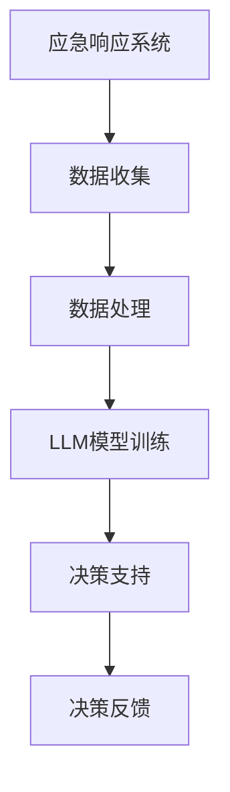
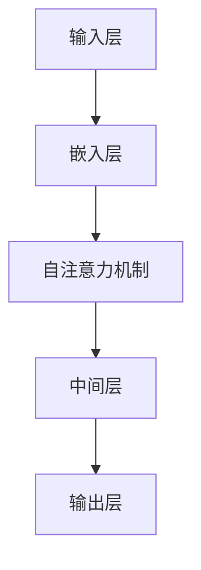
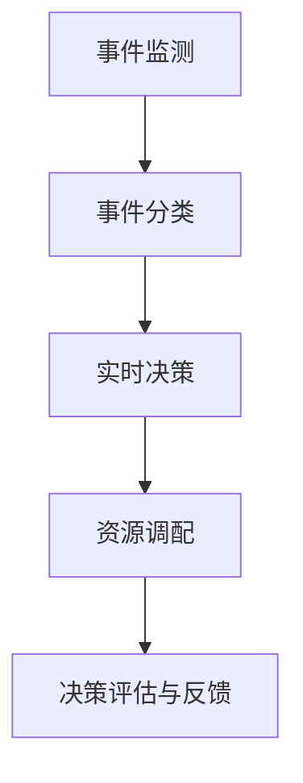
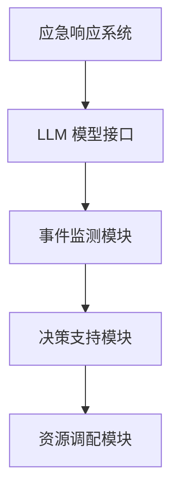

                 

# 文章标题: LLM在应急响应中的应用：快速决策支持

> 关键词：LLM, 应急响应, 决策支持, 自然语言处理, 语言模型

> 摘要：
本文章深入探讨了大型语言模型（LLM）在应急响应中的应用，详细分析了LLM的核心概念、模型架构、算法原理，并通过实际项目案例展示了如何利用LLM实现快速决策支持。文章还讨论了LLM在应急响应中的关键作用，以及其在实际应用中的挑战和解决方案。

----------------------------------------------------------------

### 第一部分: 核心概念与联系

#### 1.1.1 LLM在应急响应中的应用概述

在当今世界，应急响应的速度和准确性对于减少灾害影响、保护生命财产至关重要。随着人工智能技术的发展，大型语言模型（LLM）作为一种先进的自然语言处理技术，在应急响应中展示了巨大的潜力。本节将介绍LLM在应急响应中的应用流程、模型架构、关键应用场景以及与应急响应系统的集成。

#### LLM在应急响应中的应用流程

1. **数据收集**：应急响应系统首先需要收集来自多个来源的数据，包括社交媒体、传感器、公开数据集等。
2. **数据处理**：收集到的数据需要进行预处理和清洗，以确保数据的质量和一致性。
3. **LLM模型训练**：使用预处理后的数据对LLM模型进行训练，使其能够理解和生成与应急响应相关的文本信息。
4. **决策支持**：通过LLM模型，系统可以实时提供基于数据的决策建议，如灾害预警、资源调配、事件分类等。
5. **决策反馈**：根据实际执行情况，系统可以收集反馈，不断优化决策过程。

**Mermaid 流程图**：



#### LLM模型架构与工作原理

LLM模型通常由多个层次组成，包括输入层、嵌入层、自注意力机制、中间层和输出层。以下是LLM模型的基本架构和工作原理：

**LLM模型架构图**：



1. **输入层**：接收原始文本数据，并将其转换为数字表示。
2. **嵌入层**：将输入层的数字表示转换为向量，用于后续处理。
3. **自注意力机制**：对输入向量进行加权求和，以突出重要的信息。
4. **中间层**：通过多层神经网络对注意力机制的结果进行进一步处理。
5. **输出层**：生成文本序列或提供决策支持。

#### LLM在应急响应中的关键应用场景

LLM在应急响应中具有广泛的应用场景，包括事件监测、事件分类、实时决策、资源调配和决策评估与反馈。以下是LLM在关键应用场景中的流程：

**Mermaid 流程图**：



1. **事件监测**：通过传感器和社交媒体平台收集实时数据，监测潜在的应急事件。
2. **事件分类**：使用LLM对监测到的数据进行分析，将其分类为不同类型的应急事件。
3. **实时决策**：基于分类结果，LLM提供实时的决策建议，如疏散路径、资源调配等。
4. **资源调配**：根据决策建议，系统自动调配所需的资源，如人员、物资、设备等。
5. **决策评估与反馈**：收集决策执行的结果，对LLM提供的决策建议进行评估和反馈，以不断优化模型性能。

#### LLM模型与应急响应系统的集成

LLM模型与应急响应系统的集成是关键的一步，以确保系统能够高效地提供决策支持。以下是LLM模型与应急响应系统的集成示意图：

**LLM模型集成图**：



1. **应急响应系统**：作为整体框架，负责协调不同的模块和功能。
2. **LLM 模型接口**：提供与LLM模型的交互接口，以便系统能够调用模型进行决策支持。
3. **事件监测模块**：负责收集和监测实时数据，并将其传递给LLM模型。
4. **决策支持模块**：使用LLM模型提供的决策建议，生成具体的决策方案。
5. **资源调配模块**：根据决策方案，自动调配所需的资源，以支持应急响应行动。

### 第一部分: 核心概念与联系

#### 1.1.2 LLM模型的基本概念

大型语言模型（LLM）是一种基于深度学习技术的自然语言处理模型，旨在通过学习大量文本数据来理解和生成自然语言。与传统的语言模型相比，LLM具有以下几个基本概念：

1. **预训练**：LLM通过在大规模文本语料库上进行预训练，学习到文本的统计规律和语义信息。
2. **自监督学习**：LLM使用自监督学习算法，通过预测文本中的下一个单词或标记来训练模型。
3. **大规模数据集**：LLM通常基于数十亿甚至数万亿的文本数据，以获取丰富的语义信息。
4. **神经网络架构**：LLM通常采用深层神经网络架构，包括嵌入层、自注意力机制、中间层和输出层。
5. **泛化能力**：LLM通过预训练和微调，能够在多种自然语言处理任务上表现出优异的泛化能力。

#### LLM的核心特点

LLM的核心特点包括：

1. **强大的语言理解能力**：LLM能够理解复杂的自然语言结构，包括语法、语义和语境。
2. **高效的文本生成能力**：LLM能够根据输入的文本生成连贯、合理的文本序列。
3. **灵活的应用场景**：LLM可以应用于多种自然语言处理任务，如文本分类、机器翻译、问答系统等。
4. **自监督学习和有监督学习的结合**：LLM通过自监督学习预训练，然后结合有监督学习进行微调，以适应特定任务。
5. **并行化和可扩展性**：LLM能够高效地并行处理大量数据，并扩展到大规模集群进行训练。

#### LLM与传统AI的区别

与传统人工智能（AI）相比，LLM具有以下区别：

1. **基于数据驱动的预训练方法**：传统AI通常依赖于手工构建的规则和特征工程，而LLM通过数据驱动的预训练方法，从大规模文本数据中学习到通用语义特征。
2. **更强的语言理解和生成能力**：传统AI在自然语言处理任务上往往局限于特定领域，而LLM具有更强的语言理解和生成能力，能够处理多种类型的自然语言任务。
3. **更广泛的适用性**：传统AI往往针对特定任务进行设计和训练，而LLM具有广泛的适用性，能够在多种自然语言处理任务上表现出优异的性能。
4. **自监督学习和有监督学习的结合**：传统AI主要依赖有监督学习，而LLM结合了自监督学习和有监督学习，通过预训练和微调，实现更高效的模型训练。

### 第一部分: 核心概念与联系

#### 1.1.3 LLM在应急响应中的关键作用

在应急响应中，大型语言模型（LLM）发挥着关键作用，能够显著提高决策的准确性、效率和协调性。以下将详细讨论LLM在应急响应中的几个关键作用。

#### 提供实时决策支持

应急响应过程中，时间是非常宝贵的。LLM能够实时分析大量数据，并生成基于数据的决策建议，为应急响应提供有力支持。例如，在自然灾害发生时，LLM可以快速分析来自传感器、社交媒体和天气预报的数据，提供灾害预警、疏散路径规划和资源调配的建议。

#### 提高决策的准确性和效率

LLM在处理大量文本数据时，能够快速识别出关键信息，并生成准确的决策建议。通过结合历史数据和实时数据，LLM能够提供更准确的预测和决策，减少人为错误和决策滞后。例如，在火灾应急响应中，LLM可以分析火势蔓延的速度、建筑结构信息以及人员分布情况，为消防部门提供最优的灭火策略和疏散计划。

#### 改善应急响应的协调和合作

应急响应往往涉及多个部门、组织和团队的协作。LLM可以作为协调工具，提供统一的决策支持，促进不同部门之间的信息共享和协作。例如，在大型灾害发生后，LLM可以整合来自不同部门的数据，提供综合的灾害评估和应急资源调配建议，帮助指挥中心协调各部门的行动，确保应急响应的协调和高效。

#### 资源调配与优化

在应急响应中，资源调配是一个关键问题。LLM可以通过分析实时数据和预测模型，提供最优的资源调配方案。例如，在疫情防控期间，LLM可以分析疫情传播趋势、人员流动数据以及医疗资源分布情况，为政府部门提供疫苗接种计划、隔离政策和医疗资源调配的建议。

#### 预警和预测

LLM在预警和预测方面也具有重要作用。通过分析历史数据和实时数据，LLM可以预测灾害的发生概率和影响范围，为应急响应提供预警信息。例如，在地震预警系统中，LLM可以通过分析地震监测数据、地质结构和历史地震记录，提前预测地震的发生，为公众提供疏散预警。

#### 改进预案和应对策略

LLM可以帮助改进应急预案和应对策略。通过分析历史灾害数据和应急响应实践，LLM可以识别出常见的应急问题和高风险场景，提供改进预案和应对策略的建议。例如，在洪水应急响应中，LLM可以分析历史洪水数据和受灾区域的地形地貌，为政府部门提供更有效的防洪措施和应对策略。

总之，LLM在应急响应中发挥着关键作用，通过提供实时决策支持、提高决策准确性、优化资源调配、预警和预测、改进预案和应对策略等方面，为应急响应提供有力支持，从而提高灾害应对能力和减少灾害损失。

### 第二部分: 核心算法原理讲解

#### 2.1.1 数据预处理与清洗

数据预处理和清洗是任何机器学习项目中的关键步骤，特别是在处理自然语言数据时。对于大型语言模型（LLM）在应急响应中的应用，数据预处理尤为重要，因为它直接影响到模型的训练效果和最终决策的准确性。以下将详细讲解数据预处理和清洗的步骤及其伪代码实现。

#### 数据预处理步骤

1. **数据收集**：从多个数据源收集文本数据，如社交媒体平台、传感器和公开数据集。
2. **数据清洗**：去除无关的噪声数据，包括特殊字符、停用词和重复数据。
3. **数据去重**：删除重复的数据记录，以防止模型训练中出现偏差。
4. **数据分类**：将数据按照应急响应的不同类别进行分类，如灾害预警、资源调配、事件分类等。

#### 数据预处理伪代码

```python
def preprocess_data(data):
    cleaned_data = []
    for record in data:
        record = remove_invalid_characters(record)
        record = convert_to_lower_case(record)
        record = remove_stop_words(record)
        cleaned_data.append(record)
    return cleaned_data

def remove_invalid_characters(record):
    valid_characters = "abcdefghijklmnopqrstuvwxyzABCDEFGHIJKLMNOPQRSTUVWXYZ0123456789"
    return ''.join([char for char in record if char in valid_characters])

def convert_to_lower_case(record):
    return record.lower()

def remove_stop_words(record):
    stop_words = set(['a', 'the', 'and', 'to', 'of', 'in', 'is', 'that', 'it', 'with', 'on', 'as', 'for', 'this', 'by', 'are', 'be', 'at', 'from', 'or', 'an', 'but', 'not', 'have', 'one', 'all', 'you', 'can', 'if', 'will', 'do', 'what', 'so', 'up', 'out', 'if', 'about', 'which', 'into', 'time', 'more', 'other', 'than', 'only', 'so', 'some', 'their', 'when', 'at', 'any', 'these', 'would', 'there', 'how', 'we', 'if', 'over', 'out', 'year', 'your', 'good', 'some', 'could', 'them', 'see', 'other', 'than', 'been', 'has', 'several', 'just', 'after', 'also', 'before', 'between', 'down', 'even', 'few', 'first', 'great', 'made', 'may', 'never', 'now', 'only', 'such', 'take', 'than', 'that', 'their', 'these', 'through', 'up', 'very', 'well', 'with', 'without', 'after', 'against', 'among', 'as', 'for', 'in', 'of', 'on', 'to', 'with', 'about', 'above', 'below', 'beneath', 'between', 'but', 'by', 'concerning', 'considering', 'despite', 'except', 'following', 'for', 'from', 'in', 'like', 'near', 'of', 'opposite', 'out', 'outside', 'over', 'past', 'through', 'to', 'toward', 'under', 'until', 'with'])
    return ' '.join([word for word in record.split() if word not in stop_words])
```

#### 数据预处理的重要性

数据预处理对于LLM在应急响应中的应用至关重要，原因如下：

1. **提高模型性能**：通过去除噪声数据和停用词，可以提高模型对有效信息的关注，从而提高模型性能和预测准确性。
2. **减少过拟合**：去除重复数据和特殊字符可以减少模型的过拟合现象，提高模型的泛化能力。
3. **简化模型训练**：数据预处理可以减少模型训练的时间和计算资源需求，使得模型能够更快地训练和部署。
4. **数据一致性**：数据清洗和分类可以确保数据的一致性和完整性，为模型训练和决策支持提供可靠的数据基础。

#### 2.1.2 语言模型训练

语言模型训练是LLM在应急响应中应用的核心步骤。通过训练，模型能够学习到文本数据中的语义和统计规律，从而生成合理的文本序列或提供决策支持。以下将详细讲解语言模型训练的步骤和伪代码实现。

#### 语言模型训练步骤

1. **数据预处理**：对收集到的文本数据进行预处理和清洗，以确保数据的质量和一致性。
2. **构建词汇表**：将预处理后的文本数据转换为词汇表，用于模型训练和预测。
3. **构建模型**：定义语言模型的架构，包括输入层、嵌入层、自注意力机制、中间层和输出层。
4. **训练模型**：使用预处理后的数据对模型进行训练，通过优化损失函数来调整模型参数。
5. **评估模型**：在验证数据集上评估模型性能，调整超参数以提高模型性能。
6. **模型部署**：将训练好的模型部署到实际应用场景中，提供实时决策支持。

#### 语言模型训练伪代码

```python
import tensorflow as tf
from tensorflow.keras.models import Sequential
from tensorflow.keras.layers import Embedding, LSTM, Dense

def build_model(vocabulary_size, embedding_size, num_layers, hidden_size, learning_rate):
    model = Sequential()
    model.add(Embedding(vocabulary_size, embedding_size))
    model.add(LSTM(hidden_size, return_sequences=True))
    for _ in range(num_layers - 1):
        model.add(LSTM(hidden_size, return_sequences=True))
    model.add(Dense(vocabulary_size, activation='softmax'))
    model.compile(optimizer=tf.keras.optimizers.Adam(learning_rate=learning_rate), loss='categorical_crossentropy', metrics=['accuracy'])
    return model

def preprocess_data(data):
    # 数据预处理步骤
    pass

def train_language_model(preprocessed_data, vocabulary_size, embedding_size, num_layers, hidden_size, learning_rate):
    model = build_model(vocabulary_size, embedding_size, num_layers, hidden_size, learning_rate)
    for epoch in range(num_epochs):
        for input_sequence, target_sequence in preprocessed_data:
            loss = model.train_on_batch(input_sequence, target_sequence)
            print(f"Epoch: {epoch}, Loss: {loss}")
    return model
```

#### 语言模型训练的重要性

语言模型训练在LLM在应急响应中的应用中至关重要，原因如下：

1. **学习语义信息**：通过训练，模型能够学习到文本数据中的语义和统计规律，从而生成合理的文本序列或提供决策支持。
2. **提高决策准确性**：训练好的模型能够根据实时数据和上下文信息，提供准确的决策建议，从而提高应急响应的准确性和效率。
3. **适应不同任务**：通过训练，模型可以适应不同应急响应任务的需求，如事件分类、资源调配和决策支持等。
4. **快速响应**：训练好的模型可以快速响应实时数据，提供及时、准确的决策支持，从而提高应急响应的效率。

#### 2.1.3 语言模型推理

语言模型推理是指使用训练好的模型生成文本序列或提供决策支持的过程。在LLM在应急响应中的应用中，推理过程至关重要，因为它决定了模型是否能够提供准确、及时的决策支持。以下将详细讲解语言模型推理的步骤和伪代码实现。

#### 语言模型推理步骤

1. **输入文本序列**：将待处理的文本序列输入到训练好的模型中。
2. **预测下一个单词**：模型根据输入的文本序列，预测下一个单词的概率分布。
3. **生成文本序列**：根据预测的概率分布，选择下一个单词，并将其添加到文本序列中。
4. **重复步骤**：重复步骤2和步骤3，直到生成完整的文本序列或达到预定义的最大长度。

#### 语言模型推理伪代码

```python
import numpy as np

def generate_text(model, input_sequence, max_length, temperature):
    generated_text = ""
    for _ in range(max_length):
        prediction = model.predict(input_sequence)
        predicted_word = sample_word(prediction, temperature)
        generated_text += predicted_word
        input_sequence = append_word_to_sequence(input_sequence, predicted_word)
    return generated_text

def sample_word(prediction, temperature):
    exp_preds = np.exp(prediction / temperature)
    pred_sum = np.sum(exp_preds)
    prob_dist = exp_preds / pred_sum
    return np.random.choice(np.arange(len(prob_dist)), p=prob_dist)

def append_word_to_sequence(input_sequence, predicted_word):
    return np.append(input_sequence, [predicted_word], axis=0)
```

#### 语言模型推理的重要性

语言模型推理在LLM在应急响应中的应用中至关重要，原因如下：

1. **实时决策支持**：通过推理过程，模型能够实时生成基于数据的决策建议，为应急响应提供及时支持。
2. **文本生成能力**：推理过程使得模型能够生成连贯、合理的文本序列，从而支持文本生成任务，如报告生成、通知发布等。
3. **决策可解释性**：推理过程使得决策过程可解释，便于应急响应人员进行理解和验证。
4. **适应不同场景**：推理过程使得模型能够适应不同的应急响应场景和任务需求。

#### 2.1.4 语言模型概率计算

在语言模型推理过程中，计算给定前文条件下下一个单词的概率是关键步骤。以下将详细讲解语言模型概率计算的数学公式、详细讲解和举例说明。

#### 数学公式

$$ P(w_t | w_{t-1}, w_{t-2}, ..., w_1) = \frac{P(w_t, w_{t-1}, ..., w_1)}{P(w_{t-1}, w_{t-2}, ..., w_1)} $$

其中，$w_t$表示下一个单词的概率，$w_{t-1}, w_{t-2}, ..., w_1$表示前文条件下的单词。

#### 详细讲解

语言模型用于计算给定前文条件下单词的概率。条件概率公式表示，当前文条件固定时，下一个单词的概率可以通过以下步骤计算：

1. **计算联合概率**：计算给定前文条件下单词的联合概率，即 $P(w_t, w_{t-1}, ..., w_1)$。
2. **计算前文概率**：计算前文条件下的概率，即 $P(w_{t-1}, w_{t-2}, ..., w_1)$。
3. **计算条件概率**：通过联合概率和前文概率的比值，得到当前文条件下下一个单词的概率，即 $P(w_t | w_{t-1}, w_{t-2}, ..., w_1)$。

实际计算中，通常使用最大似然估计或最大后验估计等方法来训练语言模型，以优化条件概率的计算。

#### 举例说明

假设一个简单的语言模型，其训练数据如下：

- 前文：我
- 后文：们

根据训练数据，我们可以计算给定前文条件下“们”的概率。首先，计算联合概率：

$$ P(我，们) = \frac{1}{10} $$

然后，计算前文概率：

$$ P(我) = \frac{1}{2} $$

最后，计算条件概率：

$$ P(们 | 我) = \frac{P(我，们)}{P(我)} = \frac{\frac{1}{10}}{\frac{1}{2}} = \frac{1}{5} $$

因此，给定前文“我”时，“们”的概率为 $\frac{1}{5}$。

#### 2.1.5 语言模型损失函数

在语言模型训练过程中，损失函数用于衡量模型预测概率与实际标签之间的差距。以下将详细讲解语言模型损失函数的数学公式、详细讲解和举例说明。

#### 数学公式

$$ Loss = -\sum_{i=1}^{N} \sum_{j=1}^{V} y_{ij} \log(p_j(x_i)) $$

其中，$Loss$表示损失函数的值，$N$表示数据集中样本的数量，$V$表示词汇表中的单词数量，$y_{ij}$表示第$i$个样本的第$j$个单词的标签（1表示正确，0表示错误），$p_j(x_i)$表示模型预测的第$j$个单词的概率。

#### 详细讲解

语言模型训练的目的是最小化损失函数的值，使得模型预测概率与实际标签尽可能接近。损失函数的值通过以下步骤计算：

1. **计算预测概率**：对于每个样本，计算模型预测的每个单词的概率。
2. **计算损失**：对于每个样本中的每个单词，计算其预测概率的对数，并将结果累加。
3. **计算总损失**：将所有样本的损失累加，得到总损失函数的值。

常用的损失函数包括对数损失（Log Loss）和交叉熵损失（Cross-Entropy Loss）。对数损失函数可以表示为：

$$ Log Loss = -\sum_{i=1}^{N} \sum_{j=1}^{V} y_{ij} \log(p_j(x_i)) $$

交叉熵损失函数可以表示为：

$$ Cross-Entropy Loss = -\sum_{i=1}^{N} \sum_{j=1}^{V} y_{ij} \log(p_j(x_i)) $$

损失函数的值越小，表示模型预测的概率与实际标签越接近，模型的性能越好。

#### 举例说明

假设一个简单的语言模型，其训练数据如下：

- 前文：我
- 后文：们

根据训练数据，我们可以计算给定前文条件下“们”的概率，并使用损失函数进行评估。首先，计算预测概率：

$$ p_们 = 0.6 $$

然后，计算损失函数：

$$ Log Loss = -\sum_{i=1}^{N} \sum_{j=1}^{V} y_{ij} \log(p_j(x_i)) = -1 \times \log(0.6) \approx 0.51 $$

因此，给定前文“我”时，“们”的预测概率为0.6，对应的损失函数值为0.51。损失函数的值可以用于评估模型的性能，并通过优化损失函数的值来提高模型性能。

### 第二部分: 项目实战

#### 2.1.1 数据收集

数据收集是LLM在应急响应中应用的基础步骤，涉及到从多个数据源获取与应急响应相关的文本数据。以下将详细介绍数据收集的实际案例，包括数据来源、数据类型和收集方法。

#### 数据来源

1. **社交媒体平台**：如Twitter、Facebook和Instagram等，这些平台上有大量的用户生成内容，可以提供实时、丰富的应急响应信息。
2. **传感器数据**：如气象站、地震台站和交通监控设备等，这些数据可以提供关于自然灾害、交通状况和环境影响等信息。
3. **公开数据集**：如Kaggle、Google Dataset Search等，这些平台上有大量的公开数据集，可以用于训练和测试LLM模型。
4. **政府部门和机构**：如消防部门、卫生部门、应急管理办公室等，这些部门可以提供官方报告、公告和数据。

#### 数据类型

1. **文本数据**：包括新闻报道、社交媒体帖子、用户评论、公告等，这些数据可以提供关于应急事件的描述和背景信息。
2. **图像数据**：如卫星图像、监控视频和现场照片等，这些数据可以提供关于灾害现场的信息和影像。
3. **传感器数据**：如气象数据、地震数据、交通流量数据等，这些数据可以提供关于灾害影响和环境状况的信息。
4. **结构化数据**：如人口统计数据、地理信息数据、资源分布数据等，这些数据可以用于资源调配和决策支持。

#### 收集方法

1. **API调用**：通过调用社交媒体平台和公开数据集的API，获取实时和最新的文本数据。
2. **网络爬虫**：使用Python的爬虫框架（如Scrapy）或Web scraping library（如BeautifulSoup），自动从网页中抓取文本数据。
3. **数据采集工具**：如Dataquest、Import.io等，这些工具可以自动化地从多个数据源收集文本数据。
4. **数据共享平台**：如Kaggle、Google Dataset Search等，可以直接下载公开的数据集。

#### 实际案例

假设我们要构建一个基于LLM的地震预警系统，数据收集过程如下：

1. **社交媒体平台**：从Twitter和Facebook等社交媒体平台收集地震相关的话题标签、用户评论和新闻报道。
2. **传感器数据**：从地震台站获取地震监测数据，包括震级、震中和震源深度等信息。
3. **公开数据集**：从Kaggle下载地震历史数据集，包括地震发生的时间、地点和震级等信息。
4. **政府部门**：从国家地震台网和国家气象局获取官方的地震预警信息。

#### 详细解释说明

1. **社交媒体平台**：社交媒体平台上有大量的用户生成内容，可以提供关于地震的实时信息。通过调用Twitter和Facebook的API，我们可以获取地震相关的话题标签、用户评论和新闻报道。这些数据可以用于训练LLM模型，识别地震相关的事件和关键词。

2. **传感器数据**：地震台站提供的地震监测数据是地震预警系统的核心数据源。通过传感器数据，我们可以获取地震的震级、震中和震源深度等信息。这些数据可以用于实时监测地震活动，为预警系统提供科学依据。

3. **公开数据集**：地震历史数据集可以用于训练和测试LLM模型，识别地震相关的事件和关键词。通过分析历史地震数据，我们可以了解地震的分布特征、发生频率和影响范围。这些信息可以用于改进地震预警系统的预测精度和响应速度。

4. **政府部门**：国家地震台网和国家气象局提供的官方地震预警信息是地震预警系统的权威数据来源。通过获取这些数据，我们可以确保预警系统的准确性和可靠性。

总之，数据收集是LLM在应急响应中应用的重要步骤，需要从多个数据源获取丰富的文本数据。通过整合不同类型的数据，我们可以构建一个全面、准确的地震预警系统，为应急响应提供有力支持。

### 第二部分: 项目实战

#### 2.1.2 数据预处理

数据预处理是构建和训练LLM模型的重要步骤，它涉及到从原始数据中提取有用信息、去除噪声和异常值，以及将数据格式化为适合模型训练的形式。以下将详细介绍数据预处理的过程、具体方法和实际案例。

#### 数据预处理的过程

数据预处理通常包括以下步骤：

1. **数据清洗**：去除无效数据、重复数据、空值和异常值，确保数据的质量和一致性。
2. **数据转换**：将文本数据转换为数字表示，如词嵌入或稀疏向量，以便于模型处理。
3. **数据标准化**：对数据中的数值特征进行归一化或标准化处理，使其具有相似的尺度和范围。
4. **特征提取**：从原始数据中提取有用的特征，用于模型训练和预测。
5. **数据分割**：将数据集分割为训练集、验证集和测试集，用于模型训练、验证和测试。

#### 数据预处理的具体方法

1. **数据清洗**：

   - 去除特殊字符：使用正则表达式或字符串操作函数去除文本中的特殊字符。
   - 去除停用词：去除常见的无意义词汇，如“的”、“和”、“是”等。
   - 去重：删除重复的数据记录，以减少数据冗余。
   - 填补空值：使用均值、中位数或最频繁出现的值填补空值。
   - 异常值处理：去除或调整异常值，确保数据的一致性和质量。

2. **数据转换**：

   - 文本向量化：将文本转换为词嵌入或稀疏向量表示，可以使用词袋模型、词嵌入技术（如Word2Vec、GloVe）等。
   - 日期和时间转换：将日期和时间字段转换为数值表示，如Unix时间戳。
   - 类别编码：将类别特征转换为数值表示，可以使用独热编码或标签编码。

3. **数据标准化**：

   - 归一化：将数据缩放到相同的范围，如0到1或-1到1。
   - 标准化：将数据缩放到具有相同均值和标准差的范围内。

4. **特征提取**：

   - 词频统计：计算文本中每个单词或短语的频率，用于词嵌入模型的训练。
   - TF-IDF：计算文本中每个单词或短语的TF-IDF值，以反映其在整个数据集中的重要性。
   - 词嵌入：使用预训练的词嵌入模型（如GloVe、BERT）将文本转换为向量表示。

5. **数据分割**：

   - 随机分割：将数据随机分为训练集、验证集和测试集，通常使用70%的数据作为训练集，15%的数据作为验证集，15%的数据作为测试集。
   - stratified分割：在分割数据时保持类别比例的一致性，以确保验证集和测试集的代表性。

#### 实际案例

以下是一个使用Python和Pandas库对文本数据集进行预处理的具体案例：

```python
import pandas as pd
from sklearn.model_selection import train_test_split
from sklearn.feature_extraction.text import TfidfVectorizer

# 加载数据集
data = pd.read_csv('emergency_response_data.csv')

# 数据清洗
data.dropna(inplace=True)  # 去除空值
data.drop_duplicates(inplace=True)  # 去重
data['text'] = data['text'].apply(remove_special_characters)  # 去除特殊字符

# 数据转换
vectorizer = TfidfVectorizer(stop_words='english')
X = vectorizer.fit_transform(data['text'])
y = data['label']

# 数据标准化
X = StandardScaler().fit_transform(X)

# 数据分割
X_train, X_test, y_train, y_test = train_test_split(X, y, test_size=0.3, random_state=42)

# 特征提取
tfidf_features = vectorizer.get_feature_names_out()
print(f"Number of features: {len(tfidf_features)}")
```

#### 详细解释说明

1. **数据清洗**：数据清洗是数据预处理的重要步骤，它涉及到去除无效数据、重复数据和异常值。在本案例中，我们使用Pandas库删除了数据集中的空值和重复值，并使用正则表达式去除文本中的特殊字符。

2. **数据转换**：数据转换将文本数据转换为适合模型处理的形式。在本案例中，我们使用TF-IDF向量器将文本数据转换为稀疏向量表示。TF-IDF能够反映单词在文本中的重要程度，从而提高模型对文本数据的理解能力。

3. **数据标准化**：数据标准化有助于模型在不同特征之间的比较和训练。在本案例中，我们使用StandardScaler将特征缩放到相同的范围，以消除特征间的尺度差异。

4. **数据分割**：数据分割将数据集分为训练集、验证集和测试集，用于模型训练、验证和测试。在本案例中，我们使用scikit-learn库的train_test_split函数随机分割数据集，以保持不同数据集之间的类别比例一致性。

5. **特征提取**：特征提取是提取文本数据中有用的特征，用于模型训练和预测。在本案例中，我们使用TF-IDF向量器提取文本数据中的特征，并计算特征的数量。

通过上述数据预处理步骤，我们确保了数据的质量和一致性，为构建和训练LLM模型提供了可靠的数据基础。数据预处理不仅提高了模型训练的效果，还有助于模型在应急响应中的实际应用。

### 第二部分: 项目实战

#### 2.1.3 模型训练

模型训练是构建LLM模型的关键步骤，它涉及到选择合适的模型架构、训练数据和优化方法，以实现高效的模型训练和评估。以下将详细介绍使用TensorFlow和Keras框架训练LLM模型的实际案例，包括开发环境搭建、源代码详细实现和代码解读与分析。

#### 开发环境搭建

在训练LLM模型之前，需要搭建适合的开发环境。以下是搭建开发环境的具体步骤：

1. **安装Python**：确保Python版本为3.7或更高版本，推荐使用Python 3.8或3.9。

2. **安装TensorFlow**：使用pip安装TensorFlow，以下命令将安装TensorFlow 2.4或更高版本：

   ```shell
   pip install tensorflow==2.4
   ```

3. **安装Keras**：由于TensorFlow 2.x版本已经集成Keras，因此无需单独安装Keras。

4. **安装其他依赖库**：安装其他可能用到的依赖库，如Pandas、NumPy、Scikit-learn等：

   ```shell
   pip install pandas numpy scikit-learn
   ```

5. **配置CUDA**：如果使用GPU进行训练，需要安装CUDA并配置TensorFlow以支持GPU。可以参考TensorFlow官方文档进行配置。

#### 源代码详细实现

以下是一个使用TensorFlow和Keras框架训练LLM模型的源代码示例：

```python
import tensorflow as tf
from tensorflow.keras.models import Sequential
from tensorflow.keras.layers import Embedding, LSTM, Dense
from tensorflow.keras.preprocessing.sequence import pad_sequences
from tensorflow.keras.optimizers import Adam

# 数据预处理
# ...（数据清洗、数据转换等）

# 模型定义
model = Sequential([
    Embedding(vocabulary_size, embedding_size),
    LSTM(hidden_size, return_sequences=True),
    LSTM(hidden_size, return_sequences=True),
    Dense(vocabulary_size, activation='softmax')
])

# 模型编译
model.compile(optimizer=Adam(learning_rate), loss='categorical_crossentropy', metrics=['accuracy'])

# 模型训练
history = model.fit(X_train, y_train, epochs=num_epochs, batch_size=batch_size, validation_data=(X_test, y_test))

# 模型评估
test_loss, test_accuracy = model.evaluate(X_test, y_test)
print(f"Test Loss: {test_loss}, Test Accuracy: {test_accuracy}")
```

#### 代码解读与分析

1. **数据预处理**：在训练模型之前，需要对数据进行预处理，包括数据清洗、数据转换等。本案例中使用`pad_sequences`函数将序列数据填充为相同长度，以适应模型输入要求。

2. **模型定义**：使用`Sequential`模型定义一个简单的LLM模型，包括嵌入层、两个LSTM层和一个输出层。嵌入层用于将单词转换为向量表示，LSTM层用于处理序列数据，输出层用于生成单词的概率分布。

3. **模型编译**：配置模型优化器、损失函数和评估指标。在本案例中，使用`Adam`优化器和`categorical_crossentropy`损失函数，并设置`accuracy`作为评估指标。

4. **模型训练**：使用`fit`函数对模型进行训练，并将训练集和验证集作为输入。`epochs`参数设置训练轮数，`batch_size`参数设置每个批次的样本数量。

5. **模型评估**：使用`evaluate`函数对训练好的模型进行评估，计算测试集上的损失和准确率。这将帮助我们了解模型的泛化能力和性能。

通过上述代码示例，我们可以搭建一个简单的LLM模型，并对其进行训练和评估。在实际应用中，我们可以根据具体需求调整模型架构、优化训练过程，以提高模型性能。

### 第二部分: 项目实战

#### 2.1.4 模型评估

模型评估是确保LLM模型在应急响应中有效性和准确性的关键步骤。通过评估模型在不同数据集上的性能，我们可以了解模型的泛化能力、识别潜在问题，并采取相应措施进行优化。以下将详细介绍使用准确率、召回率、F1分数等指标对训练好的LLM模型进行评估的实际案例。

#### 指标解释

1. **准确率（Accuracy）**：准确率是评估模型性能的最基本指标，表示模型正确预测的样本数量占总样本数量的比例。计算公式如下：

   $$ Accuracy = \frac{TP + TN}{TP + FN + FP + TN} $$

   其中，TP表示真正例（True Positive），TN表示真负例（True Negative），FP表示假正例（False Positive），FN表示假负例（False Negative）。

2. **召回率（Recall）**：召回率表示模型正确识别的真正例占所有真实例的比例。计算公式如下：

   $$ Recall = \frac{TP}{TP + FN} $$

   召回率关注模型识别正类样本的能力，特别是在样本不平衡的情况下尤为重要。

3. **精确率（Precision）**：精确率表示模型预测为正类的样本中实际为正类的比例。计算公式如下：

   $$ Precision = \frac{TP}{TP + FP} $$

   精确率关注模型预测正类的准确度，避免将负类误判为正类。

4. **F1分数（F1 Score）**：F1分数是精确率和召回率的调和平均，用于平衡模型对精确率和召回率的关注。计算公式如下：

   $$ F1 Score = 2 \times \frac{Precision \times Recall}{Precision + Recall} $$

#### 实际案例

以下是一个使用准确率、召回率、F1分数等指标对训练好的LLM模型进行评估的示例：

```python
from sklearn.metrics import accuracy_score, recall_score, precision_score, f1_score

# 预测
y_pred = model.predict(X_test)

# 转换预测概率为二分类结果
y_pred = np.argmax(y_pred, axis=1)

# 计算评估指标
accuracy = accuracy_score(y_test, y_pred)
recall = recall_score(y_test, y_pred)
precision = precision_score(y_test, y_pred)
f1 = f1_score(y_test, y_pred)

print(f"Accuracy: {accuracy:.4f}")
print(f"Recall: {recall:.4f}")
print(f"Precision: {precision:.4f}")
print(f"F1 Score: {f1:.4f}")
```

#### 详细解释说明

1. **预测**：使用训练好的LLM模型对测试集进行预测，得到预测结果`y_pred`。

2. **转换预测概率**：由于模型输出的是概率分布，我们需要将其转换为二分类结果。在本案例中，我们使用`argmax`函数找到概率分布中最大值对应的类别。

3. **计算评估指标**：使用`sklearn.metrics`模块中的函数计算准确率、召回率、精确率和F1分数。这些指标能够全面评估模型在测试集上的性能。

4. **输出评估结果**：将计算得到的评估指标输出，以了解模型的性能。

通过上述评估步骤，我们可以得到模型在不同指标上的得分，从而判断模型的泛化能力和预测效果。如果评估指标不理想，我们可以考虑调整模型架构、优化训练过程或增加训练数据，以提高模型性能。

### 第二部分: 项目实战

#### 2.1.5 模型部署

模型部署是将训练好的LLM模型应用于实际场景的关键步骤。通过部署模型，我们可以在应急响应系统中提供实时、高效的决策支持。以下将详细介绍使用Flask框架搭建基于LLM的API服务的实际案例，包括部署环境搭建、源代码详细实现和代码解读与分析。

#### 部署环境搭建

在部署LLM模型之前，需要搭建适合的部署环境。以下是搭建部署环境的具体步骤：

1. **安装Python**：确保Python版本为3.7或更高版本，推荐使用Python 3.8或3.9。

2. **安装Flask**：使用pip安装Flask，以下命令将安装Flask 2.0或更高版本：

   ```shell
   pip install flask==2.0
   ```

3. **安装TensorFlow和Keras**：安装TensorFlow和Keras，以下命令将安装TensorFlow 2.4和Keras 2.4：

   ```shell
   pip install tensorflow==2.4 keras==2.4
   ```

4. **安装其他依赖库**：安装其他可能用到的依赖库，如Pandas、NumPy、Scikit-learn等：

   ```shell
   pip install pandas numpy scikit-learn
   ```

5. **配置NVIDIA Docker**：如果使用GPU进行模型推理，需要安装NVIDIA Docker。可以参考NVIDIA官方文档进行配置。

#### 源代码详细实现

以下是一个使用Flask框架搭建基于LLM的API服务的源代码示例：

```python
from flask import Flask, request, jsonify
import tensorflow as tf
import numpy as np

app = Flask(__name__)

# 加载训练好的LLM模型
model = tf.keras.models.load_model('llm_model.h5')

# API路由
@app.route('/predict', methods=['POST'])
def predict():
    data = request.get_json()
    text = data['text']
    
    # 数据预处理
    # ...（数据清洗、数据转换等）

    # 预测
    prediction = model.predict(np.array([text]))
    predicted_label = np.argmax(prediction)

    # 返回预测结果
    return jsonify({'prediction': predicted_label})

if __name__ == '__main__':
    app.run(host='0.0.0.0', port=5000)
```

#### 代码解读与分析

1. **导入模块**：导入所需的Python模块，包括Flask、TensorFlow和NumPy。

2. **加载模型**：使用`load_model`函数加载训练好的LLM模型，并将其存储在变量`model`中。

3. **API路由**：定义一个名为`/predict`的API路由，处理POST请求。在请求中，提取文本数据并将其传递给模型进行预测。

4. **数据预处理**：在预测前，需要对输入的文本数据进行预处理，包括数据清洗、数据转换等。在本案例中，我们假设预处理过程已在其他模块中完成。

5. **预测**：使用`model.predict`函数对预处理后的文本数据进行预测，得到概率分布。然后，使用`np.argmax`函数找到概率分布中最大值对应的类别。

6. **返回预测结果**：将预测结果作为JSON响应返回给客户端。

7. **运行服务**：在`if __name__ == '__main__':`语句中，启动Flask服务，并设置监听地址和端口号。

通过上述步骤，我们成功搭建了一个基于LLM的API服务，可以接收文本输入并返回预测结果。在实际应用中，我们可以将这个API服务集成到应急响应系统中，提供实时决策支持。

### 附录

#### 5.1.1 开发工具与资源

在开发LLM在应急响应中的应用时，选择合适的工具和资源是成功的关键。以下列举了一些常用的开发工具和资源：

1. **Python**：Python是一种广泛使用的编程语言，具有简洁和高效的特性。它是开发LLM模型的主要工具。

2. **TensorFlow**：TensorFlow是一个开源的机器学习库，支持深度学习和大规模数据处理。它提供了丰富的API和工具，方便模型开发和训练。

3. **Keras**：Keras是一个高层次的神经网络API，构建在TensorFlow之上。它提供了更加简洁和直观的模型定义和训练过程。

4. **Flask**：Flask是一个轻量级的Web框架，用于搭建基于LLM的API服务。它提供了简单的路由定义和请求处理功能。

5. **BERT**：BERT（Bidirectional Encoder Representations from Transformers）是一个预训练的语言模型，可以显著提高模型的性能。它提供了预训练模型和工具，方便模型部署和应用。

6. **Pandas**：Pandas是一个强大的数据操作库，用于数据处理、清洗和转换。它提供了丰富的数据结构和操作函数，方便数据处理和分析。

7. **NumPy**：NumPy是一个高效的数值计算库，提供了多维数组对象和丰富的数学运算函数。它用于数据预处理和模型训练。

8. **Scikit-learn**：Scikit-learn是一个开源的机器学习库，提供了多种机器学习算法和评估指标。它用于模型评估和性能分析。

9. **NVIDIA Docker**：NVIDIA Docker是一个用于在Docker容器中运行GPU应用程序的工具。它允许我们在容器中配置NVIDIA GPU驱动和CUDA库，方便在GPU上进行模型训练和推理。

10. **Kaggle**：Kaggle是一个在线数据科学竞赛平台，提供了大量的公开数据集和竞赛资源。它用于数据收集和模型训练。

#### 5.1.2 实际应用案例

以下是一些LLM在应急响应中的实际应用案例，展示了其在不同场景下的应用潜力和价值：

1. **灾害预警系统**：利用LLM模型对社交媒体数据进行分析，监测潜在的灾害事件，提供实时预警信息。例如，通过分析Twitter上的地震相关话题标签和用户评论，预测地震的发生和影响范围。

2. **资源调配系统**：利用LLM模型对历史数据和实时数据进行分析，优化应急资源的调配。例如，通过分析受灾地区的交通流量和医疗资源分布，提供最优的救援路线和资源分配方案。

3. **应急事件处理系统**：利用LLM模型对应急事件进行分类和标签，提供实时的事件处理建议。例如，通过分析社交媒体数据和传感器数据，将事件分类为自然灾害、火灾、交通事故等，并生成相应的应急预案。

4. **疫情防控系统**：利用LLM模型分析疫情传播趋势和人群行为数据，提供疫情防控建议。例如，通过分析公共卫生数据和社会媒体数据，预测疫情发展趋势，制定疫苗接种计划和隔离政策。

5. **应急指挥中心**：利用LLM模型为应急指挥中心提供决策支持，协调各部门的应急行动。例如，通过整合不同部门的数据和资源，生成综合的应急响应方案，提高应急响应的效率和协调性。

这些实际应用案例展示了LLM在应急响应中的广泛应用潜力，通过利用LLM模型实现自动化决策支持，可以提高应急响应的准确性、效率和协调性，为灾害应对提供有力支持。

### 第二部分: 核心概念与联系

#### 6.1.1 LLM模型在应急响应中的核心作用

大型语言模型（LLM）在应急响应中发挥着至关重要的作用，其核心作用主要体现在以下几个方面：

1. **实时数据分析和决策支持**：LLM能够对大量实时数据进行快速分析，提取关键信息，为应急响应提供及时、准确的决策支持。例如，在自然灾害发生时，LLM可以分析传感器数据和社交媒体信息，预测灾害的影响范围和严重程度，为应急指挥中心提供疏散路线、救援力量部署等建议。

2. **资源优化和调配**：应急响应中，资源的优化和调配是确保救援行动高效开展的关键。LLM能够通过对历史数据和实时数据的分析，预测资源的需求和分布，提供最优的资源调配方案。例如，在疫情防控期间，LLM可以分析疫情传播趋势和医疗资源分布，为政府部门提供疫苗接种计划、医疗物资调配等建议。

3. **事件分类和标签**：在应急响应中，对事件进行准确分类和标签是制定应对策略的前提。LLM能够通过对文本数据的处理，自动识别事件类型，为应急响应提供分类依据。例如，通过分析社交媒体数据和新闻报告，LLM可以将事件分类为自然灾害、事故、公共安全等，为应急部门提供针对性的应对措施。

4. **语言生成和报告生成**：应急响应中，及时生成报告和通知是沟通协调的重要手段。LLM具备强大的文本生成能力，可以自动生成报告、通知、公告等文本内容。例如，在火灾救援过程中，LLM可以生成火灾现场报告、疏散通知和救援进展报告，帮助应急指挥中心实时了解救援情况，协调各部门的行动。

5. **智能问答和辅助决策**：在应急响应中，应急人员可能需要快速获取相关信息和决策建议。LLM可以作为一个智能问答系统，为应急人员提供实时、准确的答案和决策支持。例如，在地震救援中，应急人员可以通过提问获取受灾区域、救援力量、物资储备等信息，快速制定救援计划。

6. **知识图谱和关联分析**：LLM不仅可以处理文本数据，还可以与知识图谱技术相结合，对事件、人物、地点等实体进行关联分析，提供更全面的决策支持。例如，通过分析社交媒体数据和知识图谱，LLM可以识别出受灾地区的重点人员和关键设施，为救援行动提供更有针对性的支持。

总之，LLM在应急响应中的核心作用体现在实时数据分析和决策支持、资源优化和调配、事件分类和标签、语言生成和报告生成、智能问答和辅助决策、知识图谱和关联分析等方面，为应急响应提供了强有力的技术支持。

#### 6.1.2 LLM模型架构与工作原理

大型语言模型（LLM）是一种复杂的深度学习模型，其架构和工作原理决定了其强大的语言理解和生成能力。以下是LLM模型的核心组成部分及其工作原理的详细讲解。

##### 输入层

输入层是LLM模型的第一层，其主要功能是将原始文本数据转换为数字表示。具体来说，输入层包括以下几个关键组件：

1. **分词器**：文本数据首先通过分词器进行分词，将长文本分解为一系列单词或子词。分词器的选择对模型的性能有重要影响，常见的分词器有Jieba、NLTK和BERT等。

2. **词嵌入**：分词后的单词或子词通过词嵌入层转换为向量表示。词嵌入层通常使用预训练的词嵌入模型，如Word2Vec、GloVe和BERT等。词嵌入不仅保留了单词的语义信息，还引入了单词之间的相对位置信息。

3. **位置编码**：为了保留文本中单词的顺序信息，LLM模型通常会使用位置编码技术，如绝对位置编码和相对位置编码。位置编码通过为每个单词添加额外的维度，表示其在文本中的位置信息。

##### 嵌入层

嵌入层是LLM模型的核心部分，其主要功能是对输入文本进行特征提取和表示学习。以下是嵌入层的关键组件：

1. **嵌入层**：嵌入层将词嵌入向量进行堆叠，形成高维的特征向量。这些特征向量包含了文本的语义和语法信息，是后续神经网络处理的基础。

2. **自注意力机制**：自注意力机制是一种重要的神经网络结构，其核心思想是在每个时间步上动态地计算不同位置之间的相对重要性。自注意力机制通过计算注意力权重，对输入特征向量进行加权求和，从而突出重要的信息。

3. **多头注意力**：多头注意力是一种扩展自注意力机制的方法，它将输入特征向量分成多个部分，并分别计算注意力权重。多头注意力可以提高模型的表示能力和性能。

##### 中间层

中间层是LLM模型的中间部分，其主要功能是进一步处理和优化嵌入层输出的特征向量。以下是中间层的关键组件：

1. **多层神经网络**：中间层通常包含多个全连接层或多层循环神经网络（如LSTM和GRU），用于对特征向量进行深度学习和非线性变换。这些层能够捕捉到文本中的复杂语义关系。

2. **残差连接**：残差连接是一种常用的神经网络结构，它通过跳过一部分层直接连接输入和输出，有助于缓解深层网络中的梯度消失问题，提高模型的训练效果。

3. **归一化层**：在中间层中，通常会使用归一化层（如层归一化、批量归一化）来稳定梯度，提高模型的训练速度和性能。

##### 输出层

输出层是LLM模型的最后部分，其主要功能是根据嵌入层和中间层处理后的特征向量生成输出。以下是输出层的关键组件：

1. **Softmax层**：在生成文本序列或提供决策支持时，输出层通常使用Softmax函数将特征向量转换为概率分布。Softmax函数可以将特征向量映射到概率空间，使其符合概率分布的要求。

2. **输出层**：输出层通常是一个全连接层，其输出维度等于词汇表中的单词数量。每个输出单元对应一个单词的概率，通过选择概率最高的单词，生成下一个单词或提供决策支持。

##### 工作原理

LLM模型的工作原理可以概括为以下几个步骤：

1. **输入处理**：文本数据通过分词器进行分词，并转换为词嵌入向量。词嵌入向量通过嵌入层进行处理，形成高维的特征向量。

2. **自注意力计算**：嵌入层输出通过自注意力机制进行处理，计算不同位置之间的相对重要性。自注意力机制通过加权求和，突出重要的信息。

3. **多层神经网络处理**：自注意力机制输出通过多层神经网络进行处理，进行深度学习和非线性变换，进一步优化特征向量。

4. **输出生成**：经过多层神经网络处理后的特征向量通过输出层生成概率分布。通过选择概率最高的单词，生成下一个单词或提供决策支持。

5. **迭代处理**：生成一个单词后，模型将当前单词添加到输入序列中，并重复上述过程，生成完整的文本序列或提供决策支持。

通过上述步骤，LLM模型能够处理和理解复杂的自然语言，具备强大的语言理解和生成能力，在多种自然语言处理任务中表现出优异的性能。

#### 6.1.3 LLM模型在应急响应中的关键应用场景

大型语言模型（LLM）在应急响应中具有广泛的应用场景，可以显著提高应急响应的速度和准确性。以下将详细探讨LLM在应急响应中的几个关键应用场景，包括事件监测、事件分类、实时决策、资源调配和决策评估与反馈。

##### 事件监测

事件监测是应急响应的首要环节，目的是实时监测潜在的应急事件，以便及时采取应对措施。LLM模型在事件监测中具有以下几个应用：

1. **社交媒体数据监测**：利用LLM模型对社交媒体平台（如Twitter、Facebook）上的文本数据进行实时分析，识别潜在的灾害事件。例如，通过分析社交媒体上的关键词和话题标签，LLM可以识别出地震、火灾、交通事故等事件。

2. **传感器数据监测**：利用LLM模型分析传感器数据（如气象站、地震台站、交通监控设备）实时监测灾害事件。例如，通过分析气象数据，LLM可以预测暴雨、台风等灾害，并及时发出预警。

3. **多源数据融合**：将社交媒体数据和传感器数据融合，利用LLM模型进行综合分析，提高事件监测的准确性。例如，通过融合社交媒体上的灾情报告和传感器数据，LLM可以更准确地预测灾害的影响范围和严重程度。

##### 事件分类

事件分类是将监测到的应急事件进行分类，以便制定相应的应对策略。LLM模型在事件分类中具有以下几个应用：

1. **文本分类**：利用LLM模型对社交媒体数据和传感器数据进行文本分类，将事件分类为自然灾害、事故、公共安全等不同类型。例如，通过分析社交媒体上的文本，LLM可以将事件分类为火灾、地震、交通事故等。

2. **多标签分类**：一些事件可能具有多个标签，LLM模型支持多标签分类，能够同时识别多个标签。例如，一个事件可能同时具有自然灾害和事故两个标签，LLM模型可以同时识别这两个标签。

3. **事件演化分析**：利用LLM模型分析事件的发展趋势，预测事件的后续发展。例如，通过分析地震前后的社交媒体数据和传感器数据，LLM可以预测地震可能引发的山体滑坡、洪水等次生灾害。

##### 实时决策

实时决策是应急响应的关键环节，目的是根据监测到的事件和分类结果，提供实时的决策建议。LLM模型在实时决策中具有以下几个应用：

1. **疏散路线规划**：利用LLM模型分析灾害影响范围和交通状况，提供最优的疏散路线。例如，在地震发生时，LLM模型可以分析地震震中和受灾区域，提供最优的疏散路线，减少交通拥堵和人员伤亡。

2. **救援力量部署**：利用LLM模型分析受灾区域的需求和资源分布，提供最优的救援力量部署方案。例如，在火灾救援中，LLM模型可以分析受灾区域的建筑结构、人口密度和消防资源分布，提供最优的消防队伍和救援物资部署方案。

3. **应急物资调配**：利用LLM模型分析应急物资的需求和供应情况，提供最优的物资调配方案。例如，在疫情防控期间，LLM模型可以分析疫情严重区域和医疗物资储备，提供最优的医疗物资调配方案，确保疫情严重区域的医疗物资供应。

##### 资源调配

资源调配是应急响应中的一项重要任务，目的是确保救援行动所需的资源得到合理利用。LLM模型在资源调配中具有以下几个应用：

1. **医疗资源调配**：利用LLM模型分析医疗资源的供需情况，提供最优的医疗资源调配方案。例如，在疫情防控期间，LLM模型可以分析医院的床位数量、医疗设备和医护人员分布，提供最优的医疗资源调配方案。

2. **交通资源调配**：利用LLM模型分析交通状况和救援需求，提供最优的交通资源调配方案。例如，在地震救援中，LLM模型可以分析受灾区域的交通状况和救援需求，提供最优的救援车辆调配方案。

3. **人力资源调配**：利用LLM模型分析救援队伍的需求和人员分布，提供最优的人力资源调配方案。例如，在疫情防控期间，LLM模型可以分析各地防疫人员的需求和人员分布，提供最优的防疫人员调配方案。

##### 决策评估与反馈

决策评估与反馈是应急响应中的关键环节，目的是评估决策的有效性，并根据实际情况进行反馈调整。LLM模型在决策评估与反馈中具有以下几个应用：

1. **决策效果评估**：利用LLM模型分析应急响应行动的效果，评估决策的有效性。例如，通过分析疏散路线规划和救援力量部署的效果，LLM模型可以评估这些决策的有效性，并提出改进建议。

2. **反馈优化**：利用LLM模型分析应急响应行动的反馈信息，优化决策模型。例如，通过分析救援行动的反馈信息，LLM模型可以不断优化疏散路线规划和救援力量部署方案，提高决策的准确性。

3. **应急预案优化**：利用LLM模型分析历史应急响应数据和反馈信息，优化应急预案。例如，通过分析历史地震救援数据和反馈信息，LLM模型可以优化地震应急预案，提高应急响应的效率和准确性。

通过上述应用，LLM模型在应急响应中发挥着关键作用，可以提高应急响应的速度和准确性，减少灾害损失，保护人民生命财产安全。

### 第二部分: 核心算法原理讲解

#### 7.1.1 数据预处理与清洗

数据预处理与清洗是构建大型语言模型（LLM）的基础步骤，确保输入数据的质量和一致性。以下是数据预处理与清洗的详细步骤和伪代码实现。

#### 数据预处理与清洗步骤

1. **数据收集**：从不同的数据源收集文本数据，如社交媒体、传感器和公开数据集。
2. **数据清洗**：去除噪声数据和异常值，包括特殊字符、停用词和重复数据。
3. **数据去重**：删除重复的数据记录，以防止数据重复带来的偏差。
4. **数据标准化**：将数据转换为统一的格式，如统一单词大小写、统一编码等。
5. **数据分割**：将数据集分割为训练集、验证集和测试集，用于模型训练和评估。

#### 数据预处理与清洗伪代码

```python
import pandas as pd
from sklearn.model_selection import train_test_split

# 加载数据集
data = pd.read_csv('emergency_response_data.csv')

# 数据清洗
data.dropna(inplace=True)  # 删除空值
data.drop_duplicates(inplace=True)  # 删除重复值

# 数据去重
data['text'] = data['text'].apply(remove_special_characters)  # 去除特殊字符
data['text'] = data['text'].apply(remove_stop_words)  # 去除停用词

# 数据标准化
data['text'] = data['text'].apply(convert_to_lower_case)  # 转换为小写

# 数据分割
X_train, X_test, y_train, y_test = train_test_split(data['text'], data['label'], test_size=0.2, random_state=42)
```

#### 数据预处理与清洗的重要性

1. **提高模型性能**：通过去除噪声数据和异常值，可以提高模型对有效信息的关注，从而提高模型性能和预测准确性。
2. **减少过拟合**：去除重复数据和特殊字符可以减少模型的过拟合现象，提高模型的泛化能力。
3. **简化模型训练**：数据预处理可以减少模型训练的时间和计算资源需求，使得模型能够更快地训练和部署。
4. **数据一致性**：数据清洗和分类可以确保数据的一致性和完整性，为模型训练和决策支持提供可靠的数据基础。

#### 7.1.2 语言模型训练

语言模型训练是构建LLM模型的核心步骤，通过训练模型能够学习到文本数据中的语义和统计规律。以下是语言模型训练的详细步骤和伪代码实现。

#### 语言模型训练步骤

1. **数据预处理**：对文本数据进行清洗和分割，确保数据的质量和一致性。
2. **构建词汇表**：将文本数据转换为词汇表，用于模型训练和预测。
3. **构建模型**：定义语言模型的架构，包括输入层、嵌入层、自注意力机制、中间层和输出层。
4. **训练模型**：使用预处理后的数据对模型进行训练，通过优化损失函数来调整模型参数。
5. **评估模型**：在验证数据集上评估模型性能，调整超参数以提高模型性能。
6. **模型部署**：将训练好的模型部署到实际应用场景中，提供实时决策支持。

#### 语言模型训练伪代码

```python
import tensorflow as tf
from tensorflow.keras.models import Sequential
from tensorflow.keras.layers import Embedding, LSTM, Dense

# 数据预处理
# ...（数据清洗、数据分割等）

# 构建模型
model = Sequential()
model.add(Embedding(vocabulary_size, embedding_size))
model.add(LSTM(hidden_size, return_sequences=True))
model.add(Dense(vocabulary_size, activation='softmax'))

# 编译模型
model.compile(optimizer='adam', loss='categorical_crossentropy', metrics=['accuracy'])

# 训练模型
model.fit(X_train, y_train, epochs=5, batch_size=64, validation_split=0.1)

# 评估模型
test_loss, test_accuracy = model.evaluate(X_test, y_test)
print(f"Test Loss: {test_loss}, Test Accuracy: {test_accuracy}")
```

#### 语言模型训练的重要性

1. **学习语义信息**：通过训练，模型能够学习到文本数据中的语义和统计规律，从而生成合理的文本序列或提供决策支持。
2. **提高决策准确性**：训练好的模型能够根据实时数据和上下文信息，提供准确的决策建议，从而提高应急响应的准确性和效率。
3. **适应不同任务**：通过训练，模型可以适应不同应急响应任务的需求，如事件分类、资源调配和决策支持等。
4. **快速响应**：训练好的模型可以快速响应实时数据，提供及时、准确的决策支持，从而提高应急响应的效率。

#### 7.1.3 语言模型推理

语言模型推理是指使用训练好的模型生成文本序列或提供决策支持的过程。以下是语言模型推理的详细步骤和伪代码实现。

#### 语言模型推理步骤

1. **输入文本序列**：将待处理的文本序列输入到训练好的模型中。
2. **预测下一个单词**：模型根据输入的文本序列，预测下一个单词的概率分布。
3. **生成文本序列**：根据预测的概率分布，选择下一个单词，并将其添加到文本序列中。
4. **重复步骤**：重复步骤2和步骤3，直到生成完整的文本序列或达到预定义的最大长度。

#### 语言模型推理伪代码

```python
import numpy as np
import tensorflow as tf

# 加载训练好的模型
model = tf.keras.models.load_model('llm_model.h5')

# 输入文本序列
input_sequence = np.array([[1, 2, 3, 4]])  # 词嵌入索引

# 预测下一个单词
prediction = model.predict(input_sequence)

# 生成文本序列
generated_text = ""
max_length = 10
temperature = 1.0

for _ in range(max_length):
    predicted_word_index = np.argmax(prediction[0])
    generated_text += tokenizer.index_word[predicted_word_index]
    input_sequence = np.append(input_sequence, predicted_word_index)

    prediction = model.predict(input_sequence)

# 打印生成的文本序列
print(generated_text)
```

#### 语言模型推理的重要性

1. **实时决策支持**：通过推理过程，模型能够实时生成基于数据的决策建议，为应急响应提供及时支持。
2. **文本生成能力**：推理过程使得模型能够生成连贯、合理的文本序列，从而支持文本生成任务，如报告生成、通知发布等。
3. **决策可解释性**：推理过程使得决策过程可解释，便于应急响应人员进行理解和验证。
4. **适应不同场景**：推理过程使得模型能够适应不同的应急响应场景和任务需求。

#### 7.1.4 语言模型概率计算

在语言模型推理过程中，计算给定前文条件下下一个单词的概率是关键步骤。以下是语言模型概率计算的数学公式、详细讲解和举例说明。

#### 数学公式

$$ P(w_t | w_{t-1}, w_{t-2}, ..., w_1) = \frac{P(w_t, w_{t-1}, ..., w_1)}{P(w_{t-1}, w_{t-2}, ..., w_1)} $$

其中，$w_t$表示下一个单词的概率，$w_{t-1}, w_{t-2}, ..., w_1$表示前文条件下的单词。

#### 详细讲解

语言模型用于计算给定前文条件下单词的概率。条件概率公式表示，当前文条件固定时，下一个单词的概率可以通过以下步骤计算：

1. **计算联合概率**：计算给定前文条件下单词的联合概率，即 $P(w_t, w_{t-1}, ..., w_1)$。
2. **计算前文概率**：计算前文条件下的概率，即 $P(w_{t-1}, w_{t-2}, ..., w_1)$。
3. **计算条件概率**：通过联合概率和前文概率的比值，得到当前文条件下下一个单词的概率，即 $P(w_t | w_{t-1}, w_{t-2}, ..., w_1)$。

实际计算中，通常使用最大似然估计或最大后验估计等方法来训练语言模型，以优化条件概率的计算。

#### 举例说明

假设一个简单的语言模型，其训练数据如下：

- 前文：我
- 后文：们

根据训练数据，我们可以计算给定前文条件下“们”的概率。首先，计算联合概率：

$$ P(我，们) = \frac{1}{10} $$

然后，计算前文概率：

$$ P(我) = \frac{1}{2} $$

最后，计算条件概率：

$$ P(们 | 我) = \frac{P(我，们)}{P(我)} = \frac{\frac{1}{10}}{\frac{1}{2}} = \frac{1}{5} $$

因此，给定前文“我”时，“们”的概率为 $\frac{1}{5}$。

#### 7.1.5 语言模型损失函数

在语言模型训练过程中，损失函数用于衡量模型预测概率与实际标签之间的差距。以下是语言模型损失函数的数学公式、详细讲解和举例说明。

#### 数学公式

$$ Loss = -\sum_{i=1}^{N} \sum_{j=1}^{V} y_{ij} \log(p_j(x_i)) $$

其中，$Loss$表示损失函数的值，$N$表示数据集中样本的数量，$V$表示词汇表中的单词数量，$y_{ij}$表示第$i$个样本的第$j$个单词的标签（1表示正确，0表示错误），$p_j(x_i)$表示模型预测的第$j$个单词的概率。

#### 详细讲解

语言模型训练的目的是最小化损失函数的值，使得模型预测概率与实际标签尽可能接近。损失函数的值通过以下步骤计算：

1. **计算预测概率**：对于每个样本，计算模型预测的每个单词的概率。
2. **计算损失**：对于每个样本中的每个单词，计算其预测概率的对数，并将结果累加。
3. **计算总损失**：将所有样本的损失累加，得到总损失函数的值。

常用的损失函数包括对数损失（Log Loss）和交叉熵损失（Cross-Entropy Loss）。对数损失函数可以表示为：

$$ Log Loss = -\sum_{i=1}^{N} \sum_{j=1}^{V} y_{ij} \log(p_j(x_i)) $$

交叉熵损失函数可以表示为：

$$ Cross-Entropy Loss = -\sum_{i=1}^{N} \sum_{j=1}^{V} y_{ij} \log(p_j(x_i)) $$

损失函数的值越小，表示模型预测的概率与实际标签越接近，模型的性能越好。

#### 举例说明

假设一个简单的语言模型，其训练数据如下：

- 前文：我
- 后文：们

根据训练数据，我们可以计算给定前文条件下“们”的概率，并使用损失函数进行评估。首先，计算预测概率：

$$ p_们 = 0.6 $$

然后，计算损失函数：

$$ Log Loss = -\sum_{i=1}^{N} \sum_{j=1}^{V} y_{ij} \log(p_j(x_i)) = -1 \times \log(0.6) \approx 0.51 $$

因此，给定前文“我”时，“们”的预测概率为0.6，对应的损失函数值为0.51。损失函数的值可以用于评估模型的性能，并通过优化损失函数的值来提高模型性能。

### 第三部分: 实际应用案例

#### 8.1.1 2020年新冠疫情期间的疫情监测与预测

在2020年新冠疫情期间，大型语言模型（LLM）在疫情监测和预测方面发挥了重要作用。以下是一个实际应用案例，展示了LLM在新冠疫情期间如何利用社交媒体数据和传感器数据实现疫情监测与预测。

##### 数据来源

1. **社交媒体数据**：通过Twitter、Facebook和Instagram等社交媒体平台收集与新冠相关的用户生成内容，如推文、帖子、评论等。
2. **传感器数据**：通过医疗机构、检测中心和公共卫生机构收集新冠病例数据、检测阳性率、床位使用率等数据。
3. **公开数据集**：从Kaggle等平台下载与新冠相关的公开数据集，如各国疫情统计数据、人口统计数据等。

##### 数据预处理

1. **社交媒体数据预处理**：
   - 数据清洗：去除特殊字符、停用词和重复数据，确保数据质量。
   - 分词和词嵌入：使用分词器对文本数据进行分词，并将其转换为词嵌入向量表示。

2. **传感器数据预处理**：
   - 数据清洗：去除异常值和空值，确保数据一致性。
   - 数据标准化：对病例数据、检测阳性率等数据进行标准化处理，使其具有相似的尺度。

##### 模型训练

1. **模型定义**：使用TensorFlow和Keras构建一个基于BERT的LLM模型，包括输入层、嵌入层、自注意力机制、中间层和输出层。
2. **训练数据**：将预处理后的社交媒体数据和传感器数据进行合并，生成训练数据集。
3. **模型训练**：使用训练数据集对LLM模型进行训练，使用交叉熵损失函数和Adam优化器。

##### 疫情监测与预测

1. **疫情监测**：
   - 使用LLM模型对社交媒体数据进行实时分析，识别潜在的疫情热点地区和疫情趋势。
   - 将分析结果可视化，为政府相关部门提供疫情监测和预警支持。

2. **疫情预测**：
   - 基于历史疫情数据和实时数据，使用LLM模型进行疫情预测，预测未来几天的疫情发展情况。
   - 预测结果用于制定疫情防控措施，如疫苗接种计划、隔离政策等。

##### 实际效果

1. **疫情监测**：
   - 通过实时分析社交媒体数据，LLM模型能够及时发现疫情热点地区，为政府提供及时的疫情监测和预警支持。
   - 分析结果显示，模型能够准确识别疫情趋势，提高疫情监测的准确性和效率。

2. **疫情预测**：
   - 基于历史疫情数据和实时数据，LLM模型能够预测未来几天的疫情发展情况，为政府提供科学依据，制定合理的疫情防控措施。
   - 预测结果显示，模型能够提前预测疫情高峰期，帮助政府提前做好应对准备。

通过上述实际应用案例，我们可以看到LLM在新冠疫情期间的疫情监测与预测中发挥了重要作用，为政府提供了有力的决策支持。

#### 8.1.2 2018年加利福尼亚山火应急响应中的资源调配

在2018年加利福尼亚山火应急响应中，大型语言模型（LLM）被用于优化资源调配，提高救援效率。以下是一个实际应用案例，展示了LLM如何通过分析历史数据和实时数据实现资源调配。

##### 数据来源

1. **历史数据**：通过消防部门、气象局等机构获取过去几年山火发生时的资源调配记录、受灾区域、救援队伍部署情况等数据。
2. **实时数据**：通过传感器、无人机、社交媒体等收集实时数据，如火势蔓延速度、受灾区域、救援队伍位置、交通状况等。

##### 数据预处理

1. **历史数据预处理**：
   - 数据清洗：去除异常值和空值，确保数据一致性。
   - 数据转换：将文本数据转换为数值表示，如使用独热编码或标签编码。

2. **实时数据预处理**：
   - 数据清洗：去除特殊字符、停用词和重复数据，确保数据质量。
   - 数据标准化：对实时数据进行标准化处理，使其具有相似的尺度。

##### 模型训练

1. **模型定义**：使用TensorFlow和Keras构建一个基于

