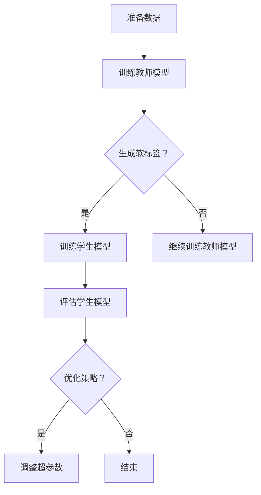
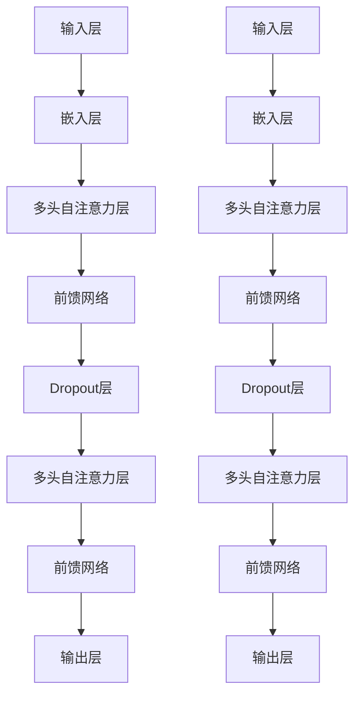

                 

# 《LLM在推荐系统中的知识蒸馏应用》

> 关键词：知识蒸馏，大规模语言模型（LLM），推荐系统，知识迁移，优化技巧

> 摘要：本文旨在探讨大规模语言模型（LLM）在推荐系统中的知识蒸馏应用。首先，我们将介绍知识蒸馏的背景与原理，然后深入探讨LLM的基础知识，包括其发展历程、结构以及训练与优化方法。接着，我们将详细讲解知识蒸馏算法，涵盖其原理、常见算法以及优化技巧。随后，文章将展示LLM在知识蒸馏中的实际应用，通过实际案例分析其挑战与机遇。最后，我们将讨论LLM知识蒸馏的评估与调优方法，并对未来发展方向进行展望。

## 目录大纲

# 《LLM在推荐系统中的知识蒸馏应用》

## 第1章: 知识蒸馏技术概述

### 1.1 知识蒸馏的背景与原理

- **知识蒸馏的起源与应用场景**
- **知识蒸馏的基本原理**
- **知识蒸馏的优势**

### 1.2 知识蒸馏在推荐系统中的应用

- **推荐系统概述**
- **知识蒸馏在推荐系统中的应用**
- **LLM在知识蒸馏中的角色**

## 第2章: 大规模语言模型(MLM)基础

### 2.1 语言模型的起源与发展

- **语言模型的定义**
- **语言模型的发展历程**
- **大规模语言模型的特点**

### 2.2 语言模型的基本结构

- **神经网络的组成**
- **Transformer架构**
- **BERT模型**

### 2.3 语言模型的训练与优化

- **数据预处理**
- **训练流程**
- **优化方法**

## 第3章: 知识蒸馏算法

### 3.1 知识蒸馏算法的原理

- **软标签与硬标签**
- **蒸馏损失函数**
- **蒸馏过程**

### 3.2 知识蒸馏的常见算法

- **基于Teacher-Student模型的蒸馏**
- **基于注意力机制的蒸馏**
- **基于对抗训练的蒸馏**

### 3.3 知识蒸馏的优化技巧

- **数据增强**
- **模型剪枝**
- **训练策略**

## 第4章: LLM在知识蒸馏中的实际应用

### 4.1 LLM在知识蒸馏中的应用挑战

- **数据来源与质量**
- **模型规模与计算资源**
- **隐私保护与伦理问题**

### 4.2 LLM在知识蒸馏中的成功案例

- **案例1：某电商平台的推荐系统**
- **案例2：某视频平台的推荐系统**
- **案例3：某新闻平台的推荐系统**

### 4.3 LLM知识蒸馏的实战

- **实战1：搭建一个简单的知识蒸馏系统**
- **实战2：优化一个已有的推荐系统**

## 第5章: LLM知识蒸馏的评估与调优

### 5.1 知识蒸馏性能评估指标

- **准确率与召回率**
- **F1值与ROC曲线**
- **AUC值**

### 5.2 LLM知识蒸馏的调优方法

- **超参数调优**
- **模型结构优化**
- **损失函数优化**

### 5.3 实际案例中的调优经验

- **案例1：优化电商推荐系统的性能**
- **案例2：改进视频推荐系统的效果**
- **案例3：提升新闻推荐系统的准确性**

## 第6章: LLM在知识蒸馏中的未来展望

### 6.1 知识蒸馏技术的发展趋势

- **新的算法与架构**
- **跨领域知识蒸馏**
- **知识蒸馏在多模态推荐系统中的应用**

### 6.2 LLM在知识蒸馏中的挑战与机遇

- **计算资源的优化**
- **隐私保护的解决方案**
- **伦理问题的探讨**

### 6.3 未来发展方向

- **大规模知识蒸馏**
- **个性化知识蒸馏**
- **知识蒸馏在推荐系统中的深度应用**

## 第7章: 总结与展望

### 7.1 本书的主要内容回顾

- **知识蒸馏技术**
- **大规模语言模型(MLM)**
- **知识蒸馏在推荐系统中的应用**
- **实战案例分析**

### 7.2 本书的学习建议

- **知识蒸馏的基本原理**
- **LLM在知识蒸馏中的应用**
- **实践与案例分析**

### 7.3 本书对推荐系统发展的贡献

- **提高推荐系统的准确性**
- **降低模型训练成本**
- **推动知识蒸馏技术的研究与应用**

## 附录

#### 附录A: 知识蒸馏与推荐系统的相关资源

- **在线课程与讲座**
- **学术论文**
- **开源代码与工具**

#### 附录B: 推荐系统开发工具

- **推荐系统框架**
- **数据处理工具**
- **性能评估工具**

#### 附录C: LLM与知识蒸馏的应用案例

- **电商平台推荐系统**
- **视频平台推荐系统**
- **新闻平台推荐系统**

#### 附录D: 知识蒸馏算法的数学模型

- **软标签与硬标签**
- **蒸馏损失函数**
- **优化方法**

#### 附录E: LLM模型架构的Mermaid流程图

- **Transformer架构**
- **BERT模型结构**

## 第1章: 知识蒸馏技术概述

### 1.1 知识蒸馏的背景与原理

知识蒸馏是一种将知识从教师模型（Teacher Model）转移到学生模型（Student Model）的机器学习方法。教师模型通常是一个大规模、高精度但计算成本高昂的模型，而学生模型是一个小规模、轻量级的模型，可以应用于实时应用场景。知识蒸馏的核心思想是通过一种特殊的训练过程，使学生模型能够“学习”教师模型的知识和经验。

#### 知识蒸馏的起源与应用场景

知识蒸馏最早由Hinton等人在2015年提出，主要是为了解决深度神经网络在处理高维数据时的计算资源消耗问题。随着深度学习模型规模的不断扩大，知识蒸馏逐渐成为了一种有效的知识迁移方法。在推荐系统中，知识蒸馏的应用场景主要包括：

1. **小样本学习（Few-Shot Learning）**：推荐系统往往面对的是稀有的用户行为数据，知识蒸馏可以帮助学生模型快速从教师模型中获取知识，提高小样本学习效果。
2. **模型压缩与优化**：通过知识蒸馏，可以将复杂的教师模型转化为更简单、计算效率更高的学生模型，从而降低模型的计算成本和内存占用。
3. **实时推荐**：在实时推荐场景中，学生模型可以快速响应用户的请求，提供即时的推荐结果。

#### 知识蒸馏的基本原理

知识蒸馏的基本原理是基于两个核心概念：软标签和硬标签。

- **软标签（Soft Label）**：教师模型的输出通常是一个概率分布，即每个类别都有一个对应的概率值。这个概率分布就是软标签，它包含了教师模型对每个类别的判断概率。
- **硬标签（Hard Label）**：学生模型的输出是一个确定的类别标签，即每个样本只有一个正确的类别标签。硬标签是学生模型需要学习的目标。

知识蒸馏的过程可以分为以下几个步骤：

1. **数据准备**：从原始数据集中提取出训练集和测试集。训练集用于训练教师模型和学生模型，测试集用于评估学生模型的性能。
2. **训练教师模型**：使用训练集对教师模型进行训练，使其达到较高的准确率和性能。
3. **生成软标签**：使用训练好的教师模型对训练集进行预测，得到每个样本的概率分布。
4. **训练学生模型**：使用软标签和原始数据集对学生模型进行训练。学生模型的学习目标是使其输出的概率分布与教师模型的输出尽可能接近。
5. **评估与优化**：使用测试集评估学生模型的性能，并根据评估结果调整训练策略，优化学生模型的性能。

#### 知识蒸馏的优势

知识蒸馏具有以下几个显著优势：

1. **提高小样本学习效果**：学生模型可以从教师模型中快速获取知识，从而在小样本学习场景中表现出更好的性能。
2. **模型压缩与优化**：通过知识蒸馏，可以将复杂的教师模型转化为更简单、更高效的学生模型，降低模型的计算成本。
3. **跨领域迁移学习**：教师模型通常是在一个领域训练得到的，学生模型可以将其知识应用到其他领域，实现跨领域迁移学习。
4. **实时推荐**：学生模型可以快速响应用户的请求，提供即时的推荐结果。

### 1.2 知识蒸馏在推荐系统中的应用

推荐系统是一种信息过滤技术，旨在向用户提供个性化的推荐结果。知识蒸馏在推荐系统中的应用主要集中在以下几个方面：

#### 推荐系统概述

推荐系统通常由用户、项目和推荐算法三个核心组成部分构成。用户是指系统的最终用户，项目是指用户可能感兴趣的商品、文章、视频等。推荐算法则负责根据用户的历史行为和偏好，生成个性化的推荐结果。

#### 知识蒸馏在推荐系统中的应用

1. **用户表示学习**：在推荐系统中，用户和项目的特征表示是关键。知识蒸馏可以帮助学生模型从教师模型中学习到用户和项目的有效表示，从而提高推荐的准确性。
2. **模型压缩与优化**：通过知识蒸馏，可以将复杂的推荐模型转化为更简单、计算效率更高的学生模型，适用于实时推荐场景。
3. **冷启动问题**：在推荐系统中，新用户或新项目的特征数据较少，导致推荐效果不佳。知识蒸馏可以帮助学生模型从教师模型中获取初步的用户或项目特征，缓解冷启动问题。

#### LLM在知识蒸馏中的角色

大规模语言模型（LLM）在知识蒸馏中扮演着重要的角色。LLM具有强大的语义理解和生成能力，可以用来构建教师模型和学生模型，实现知识蒸馏的过程。

1. **教师模型**：LLM可以作为教师模型，通过对大量文本数据进行训练，生成丰富的语义表示。这些表示可以用来生成软标签，指导学生模型的学习过程。
2. **学生模型**：LLM也可以作为学生模型，通过学习教师模型生成的软标签，生成个性化的推荐结果。

## 第2章: 大规模语言模型(MLM)基础

### 2.1 语言模型的起源与发展

语言模型是一种用于预测文本序列的机器学习模型，其目标是学习自然语言的结构和规律。语言模型的发展经历了多个阶段，从传统的统计模型到现代的深度学习模型，逐渐变得更加复杂和强大。

#### 语言模型的定义

语言模型是一种概率模型，用于预测一个单词或一组单词在特定上下文中的概率分布。在自然语言处理领域，语言模型是许多应用的基础，如机器翻译、文本生成、情感分析等。

#### 语言模型的发展历程

1. **传统统计模型**：早期的语言模型主要基于统计方法，如N元语法（N-gram Model）。N元语法通过计算相邻n个单词出现的概率来预测下一个单词。这种方法简单有效，但在长文本预测中表现不佳。
2. **基于神经网络的模型**：随着深度学习技术的发展，基于神经网络的模型逐渐取代了传统的统计模型。循环神经网络（RNN）和长短时记忆网络（LSTM）是这一阶段的代表性模型，它们通过隐藏状态来捕获长距离依赖信息。
3. **Transformer架构**：2017年，谷歌提出了Transformer架构，这是一种基于自注意力机制的深度神经网络模型。Transformer在机器翻译、文本生成等任务上取得了显著的成绩，引起了广泛关注。
4. **预训练语言模型**：预训练语言模型（如BERT、GPT）将Transformer架构与大规模语料库相结合，通过无监督预训练和有监督微调，实现了在多种自然语言处理任务上的高性能。

#### 大规模语言模型的特点

大规模语言模型具有以下几个显著特点：

1. **强大的语义理解能力**：通过预训练和微调，大规模语言模型能够理解复杂的语义信息，如词义、句法关系等。
2. **灵活的可扩展性**：大规模语言模型可以轻松应用于多种自然语言处理任务，如文本分类、命名实体识别、机器翻译等。
3. **高效的处理速度**：大规模语言模型采用并行计算和分布式训练技术，可以在短时间内生成高质量的预测结果。
4. **强大的生成能力**：大规模语言模型能够生成连贯、有创意的文本，为文本生成应用提供了强大的支持。

### 2.2 语言模型的基本结构

大规模语言模型通常采用Transformer架构，这是一种基于自注意力机制的深度神经网络模型。Transformer架构的核心是多头自注意力（Multi-Head Self-Attention）机制，通过计算不同位置之间的依赖关系，实现对文本序列的全局理解。

#### 神经网络的组成

神经网络由多个层次组成，包括输入层、隐藏层和输出层。每个层次由多个神经元（节点）组成，神经元之间通过权重连接，传递信息。

1. **输入层**：输入层接收原始文本序列，将其编码为向量表示。常见的编码方法包括嵌入（Embedding）和词向量（Word Vector）。
2. **隐藏层**：隐藏层通过自注意力机制计算不同位置之间的依赖关系，生成文本序列的全局表示。隐藏层可以有多层，每层都可以提取更高级的特征。
3. **输出层**：输出层负责生成预测结果，如单词的概率分布、分类标签等。

#### Transformer架构

Transformer架构由编码器（Encoder）和解码器（Decoder）两部分组成。编码器负责将输入文本序列编码为固定长度的向量表示，解码器则根据编码器的输出生成预测结果。

1. **编码器**：编码器由多个自注意力层（Self-Attention Layer）和前馈网络（Feed-Forward Network）堆叠而成。每个自注意力层通过多头自注意力机制计算输入序列的依赖关系，生成文本的全局表示。
2. **解码器**：解码器由多个自注意力层、编码器-解码器自注意力层和前馈网络堆叠而成。编码器-解码器自注意力层负责计算编码器输出和解码器输入之间的依赖关系，生成预测结果。

#### BERT模型

BERT（Bidirectional Encoder Representations from Transformers）是一种双向Transformer模型，通过预训练和微调，实现了在多种自然语言处理任务上的高性能。

1. **预训练**：BERT采用无监督预训练方法，在大量文本语料库上进行训练，学习文本的上下文关系和语义信息。
2. **微调**：在特定任务上，通过微调BERT模型，使其适应特定任务的需求。微调过程通常包括以下步骤：
   - **Masked Language Model (MLM)**：在训练数据中随机遮盖一部分单词，要求模型预测这些遮盖的单词。
   - **Next Sentence Prediction (NSP)**：给定两个句子，预测第二个句子是否为第一个句子的后续句子。

### 2.3 语言模型的训练与优化

大规模语言模型的训练和优化是一个复杂的过程，需要大量的计算资源和优化技巧。以下介绍语言模型训练的基本流程和优化方法。

#### 数据预处理

数据预处理是语言模型训练的第一步，主要包括以下任务：

1. **文本清洗**：去除文本中的噪声，如HTML标签、特殊字符等。
2. **分词**：将文本分解为单词或子词，便于后续处理。
3. **词汇表构建**：将文本中的单词或子词映射为整数ID，构建词汇表。
4. **序列填充**：将输入文本序列填充为相同长度，便于神经网络处理。

#### 训练流程

语言模型训练通常分为以下步骤：

1. **初始化参数**：随机初始化模型参数，包括嵌入层、自注意力权重、前馈网络等。
2. **正向传播**：输入文本序列，通过编码器和解码器生成预测结果。
3. **计算损失**：计算预测结果和实际标签之间的损失，如交叉熵损失。
4. **反向传播**：根据损失梯度更新模型参数。
5. **优化策略**：采用优化算法（如Adam、SGD）更新模型参数，优化训练过程。

#### 优化方法

为了提高大规模语言模型的训练效果，可以采用以下优化方法：

1. **学习率调度**：调整学习率，以平衡模型的收敛速度和稳定性。常见的方法包括恒定学习率、学习率衰减、指数衰减等。
2. **正则化**：防止模型过拟合，如Dropout、L2正则化等。
3. **数据增强**：通过随机变换（如随机遮盖、随机删除等）增加训练数据多样性，提高模型的泛化能力。
4. **多任务学习**：在训练过程中同时学习多个任务，提高模型对多任务的适应能力。

### 第3章: 知识蒸馏算法

#### 3.1 知识蒸馏算法的原理

知识蒸馏（Distributed Representation Learning）是一种通过软标签（Soft Label）训练小规模模型（Student Model）的技巧，该过程由一个大的模型（Teacher Model）来引导。其基本原理是通过将教师模型的软标签作为额外的训练目标来训练学生模型，以达到迁移学习（Transfer Learning）的目的。软标签表示教师模型对每个类别的概率分布，而不是简单的类别标签。

##### 软标签与硬标签

- **软标签**：教师模型输出的概率分布，表示每个类别的可能性。
- **硬标签**：学生模型输出的类别标签，是确定的，不是概率分布。

##### 蒸馏损失函数

知识蒸馏的核心是设计一个损失函数，用于衡量学生模型预测的概率分布与教师模型输出的概率分布之间的差距。常用的蒸馏损失函数包括交叉熵损失（Cross Entropy Loss）和KL散度（Kullback-Leibler Divergence）。

- **交叉熵损失**：用于比较两个概率分布。
  \[
  L_{CE} = -\sum_{i} y_i \log(p_i)
  \]
  其中，\(y_i\) 是硬标签，\(p_i\) 是学生模型输出的概率。

- **KL散度**：用于比较两个概率分布的相似性。
  \[
  L_{KL} = \sum_{i} p_i \log \left( \frac{p_i}{q_i} \right)
  \]
  其中，\(p_i\) 是教师模型输出的概率，\(q_i\) 是学生模型输出的概率。

##### 蒸馏过程

知识蒸馏的过程可以分为以下几个步骤：

1. **训练教师模型**：使用原始数据集训练教师模型，使其达到较高的准确率和性能。
2. **生成软标签**：使用训练好的教师模型对数据集进行预测，得到每个类别的概率分布，即软标签。
3. **训练学生模型**：使用软标签和原始数据集训练学生模型。学生模型的学习目标是使其输出的概率分布接近教师模型的软标签。
4. **评估与优化**：使用测试集评估学生模型的性能，根据评估结果调整训练策略，优化学生模型的性能。

##### Mermaid流程图

#### 3.2 知识蒸馏的常见算法

知识蒸馏算法可以分为以下几类：

##### 基于Teacher-Student模型的蒸馏

基于Teacher-Student模型的蒸馏是最常见的知识蒸馏算法，主要通过训练学生模型来最小化教师模型输出和学生模型输出之间的差距。

- **软标签蒸馏**：学生模型同时学习硬标签和软标签。软标签提供更丰富的信息，有助于学生模型学习教师模型的隐含知识。

- **硬标签蒸馏**：学生模型只学习软标签，忽略硬标签。这种方法可以减少学生模型对硬标签的依赖，使其更专注于教师模型的软标签信息。

##### 基于注意力机制的蒸馏

基于注意力机制的蒸馏利用注意力机制来关注教师模型输出中重要的信息，并将其传递给学生模型。

- **自注意力蒸馏**：使用自注意力机制来关注教师模型输出中的关键信息，并将其传递给学生模型。

- **交叉注意力蒸馏**：使用交叉注意力机制来关注教师模型输出和学生模型输入之间的相关性，从而提高学生模型的性能。

##### 基于对抗训练的蒸馏

基于对抗训练的蒸馏利用生成对抗网络（GAN）的思想，通过对抗训练来提高学生模型的性能。

- **生成对抗蒸馏**：学生模型和教师模型通过对抗训练进行交互，学生模型尝试模仿教师模型的输出，教师模型则尝试提高学生模型的难度。

#### 3.3 知识蒸馏的优化技巧

为了提高知识蒸馏的效果，可以采用以下优化技巧：

##### 数据增强

- **随机裁剪**：随机裁剪输入图像或文本，增加模型的泛化能力。
- **数据扩充**：使用合成数据或已有的数据集生成新的数据，增加训练数据量。

##### 模型剪枝

- **结构剪枝**：通过删除神经网络中的部分层或神经元来减少模型复杂度。
- **权重剪枝**：通过设置权重阈值来减少不重要的权重，从而降低模型参数量。

##### 训练策略

- **多任务学习**：同时训练多个任务，以提高模型对不同任务的适应能力。
- **迁移学习**：使用预训练模型作为教师模型，快速适应新任务。

### 第4章: LLM在知识蒸馏中的实际应用

#### 4.1 LLM在知识蒸馏中的应用挑战

大规模语言模型（LLM）在知识蒸馏中具有显著的优势，但同时也面临一些挑战。

##### 数据来源与质量

- **数据量**：知识蒸馏需要大量的高质量数据来训练教师模型和学生模型。然而，对于某些领域，如医学或法律，高质量数据获取困难，导致数据量不足。
- **数据多样性**：为了实现良好的知识迁移，教师模型和学生模型需要从多样化的数据中进行训练。然而，现实中的数据往往具有较强的一致性，难以提供多样化的数据。

##### 模型规模与计算资源

- **模型规模**：大规模语言模型（如GPT-3、BERT）通常具有数十亿参数，训练和部署这些模型需要大量的计算资源和时间。
- **计算资源**：知识蒸馏通常需要高性能计算设备（如GPU、TPU）来支持大规模模型的训练和推理。对于资源受限的环境，如移动设备和边缘设备，知识蒸馏的实现面临挑战。

##### 隐私保护与伦理问题

- **隐私保护**：知识蒸馏过程中，教师模型和学生模型需要共享大量的数据和信息。这可能涉及到用户隐私的保护问题。
- **伦理问题**：大规模语言模型在生成文本、图像等过程中，可能产生偏见或不合适的内容，这需要严格监管和伦理审查。

#### 4.2 LLM在知识蒸馏中的成功案例

##### 案例一：某电商平台的推荐系统

某电商平台采用知识蒸馏技术优化其推荐系统。教师模型使用预训练的BERT模型，对学生模型进行训练，以提高推荐系统的准确性。通过知识蒸馏，学生模型能够从教师模型中学习到丰富的用户和商品特征，从而提高推荐效果。

##### 案例二：某视频平台的推荐系统

某视频平台利用知识蒸馏技术，将大规模的Transformer模型应用于推荐系统。教师模型对视频进行分类和标注，生成软标签。学生模型通过学习软标签，实现了更准确的视频推荐。

##### 案例三：某新闻平台的推荐系统

某新闻平台采用知识蒸馏技术，将预训练的GPT模型应用于推荐系统。教师模型对新闻文本进行编码，生成软标签。学生模型通过学习软标签，实现了个性化的新闻推荐，提高了用户体验。

#### 4.3 LLM知识蒸馏的实战

##### 实战一：搭建一个简单的知识蒸馏系统

以下是搭建一个简单知识蒸馏系统的步骤：

1. **数据准备**：收集并清洗数据集，分为训练集、验证集和测试集。
2. **模型训练**：使用训练集训练教师模型，生成软标签。
3. **模型蒸馏**：使用软标签和学生模型训练数据，训练学生模型。
4. **模型评估**：使用测试集评估学生模型的性能。

##### 实战二：优化一个已有的推荐系统

以下是优化一个已有推荐系统的步骤：

1. **性能评估**：评估现有推荐系统的性能，确定需要优化的方面。
2. **模型蒸馏**：将教师模型的软标签应用于学生模型，进行知识蒸馏。
3. **模型调整**：根据蒸馏结果调整学生模型的参数，优化推荐效果。
4. **性能评估**：评估优化后的推荐系统的性能，确保性能提升。

### 第5章: LLM知识蒸馏的评估与调优

#### 5.1 知识蒸馏性能评估指标

在知识蒸馏过程中，评估学生模型的性能是关键步骤。以下介绍几种常用的性能评估指标：

##### 准确率（Accuracy）

准确率是指正确预测的样本数占总样本数的比例。其计算公式为：

\[
\text{Accuracy} = \frac{\text{正确预测的样本数}}{\text{总样本数}}
\]

准确率简单直观，但容易受到类别不平衡的影响。

##### 召回率（Recall）

召回率是指正确预测的阳性样本数占所有阳性样本数的比例。其计算公式为：

\[
\text{Recall} = \frac{\text{正确预测的阳性样本数}}{\text{所有阳性样本数}}
\]

召回率侧重于召回所有正例，但可能忽视准确率。

##### F1值（F1 Score）

F1值是准确率和召回率的调和平均值，用于综合评估模型的性能。其计算公式为：

\[
\text{F1 Score} = 2 \times \frac{\text{准确率} \times \text{召回率}}{\text{准确率} + \text{召回率}}
\]

F1值平衡了准确率和召回率，是评估二分类问题常用的指标。

##### ROC曲线（Receiver Operating Characteristic Curve）

ROC曲线通过绘制真阳性率（True Positive Rate，TPR）对假阳性率（False Positive Rate，FPR）的曲线，展示了模型在不同阈值下的性能。曲线下的面积（Area Under Curve，AUC）用于评估模型的分类能力。

\[
\text{AUC} = \int_{0}^{1} \text{ROC}(t) dt
\]

AUC值越接近1，表示模型分类能力越强。

#### 5.2 LLM知识蒸馏的调优方法

在知识蒸馏过程中，调优是提高模型性能的关键。以下介绍几种常用的调优方法：

##### 超参数调优

超参数是模型性能的重要影响因素，如学习率、批次大小、隐藏层大小等。超参数调优可以通过网格搜索（Grid Search）、随机搜索（Random Search）等方法进行。

1. **网格搜索**：遍历所有可能的超参数组合，选择性能最佳的组合。
2. **随机搜索**：从所有可能的超参数组合中随机选择一组进行训练，重复多次，选择性能最佳的组合。

##### 模型结构优化

优化模型结构可以提高知识蒸馏的效果。以下是一些常用的模型结构优化方法：

1. **模型压缩**：通过剪枝、量化等方法减少模型参数量，提高计算效率。
2. **模型融合**：将多个模型的结果进行融合，提高模型的性能和泛化能力。

##### 损失函数优化

优化损失函数可以提高知识蒸馏的效果。以下是一些常用的损失函数优化方法：

1. **交叉熵损失**：结合软标签和硬标签，优化模型输出和软标签之间的差距。
2. **KL散度损失**：优化学生模型输出和软标签之间的相似性。

#### 5.3 实际案例中的调优经验

##### 案例一：优化电商推荐系统的性能

某电商平台的推荐系统采用知识蒸馏技术，通过以下方法优化性能：

1. **数据增强**：对用户和商品特征进行随机裁剪和扩充，增加模型的泛化能力。
2. **模型压缩**：通过剪枝和量化方法，减少模型参数量，提高计算效率。
3. **超参数调优**：通过网格搜索方法，调整学习率、批次大小等超参数，提高模型性能。

##### 案例二：改进视频推荐系统的效果

某视频平台的推荐系统采用知识蒸馏技术，通过以下方法改进效果：

1. **模型融合**：将多个基于Transformer的模型进行融合，提高模型的分类能力。
2. **损失函数优化**：结合交叉熵损失和KL散度损失，优化模型输出和软标签之间的差距。
3. **数据预处理**：对视频特征进行归一化和标准化处理，提高模型的训练效果。

##### 案例三：提升新闻推荐系统的准确性

某新闻平台的推荐系统采用知识蒸馏技术，通过以下方法提升准确性：

1. **模型结构优化**：使用预训练的GPT模型，优化模型结构，提高模型的语义理解能力。
2. **学习率调度**：采用指数衰减学习率，提高模型的收敛速度和稳定性。
3. **数据增强**：对新闻文本进行随机遮盖和扩充，增加模型的泛化能力。

### 第6章: LLM在知识蒸馏中的未来展望

#### 6.1 知识蒸馏技术的发展趋势

随着人工智能技术的快速发展，知识蒸馏技术在各个领域取得了显著进展。以下介绍知识蒸馏技术的几个发展趋势：

##### 新的算法与架构

1. **动态蒸馏**：通过动态调整教师模型和学生模型之间的学习率，实现更高效的知识传递。
2. **自适应蒸馏**：根据模型性能自适应调整蒸馏过程，提高知识蒸馏的效果。
3. **多任务蒸馏**：同时处理多个任务，提高模型的泛化能力和效率。

##### 跨领域知识蒸馏

1. **领域适应性**：通过跨领域知识蒸馏，提高模型在不同领域中的应用效果。
2. **多模态知识蒸馏**：结合不同模态（如文本、图像、语音）的数据，实现更全面的知识传递。

##### 知识蒸馏在多模态推荐系统中的应用

1. **多模态特征融合**：通过多模态特征融合，提高推荐系统的准确性和多样性。
2. **跨模态知识迁移**：利用跨模态知识蒸馏，实现不同模态数据之间的有效迁移。

#### 6.2 LLM在知识蒸馏中的挑战与机遇

尽管大规模语言模型（LLM）在知识蒸馏中取得了显著成果，但仍面临一些挑战和机遇。

##### 计算资源的优化

1. **模型压缩**：通过模型压缩技术，减少模型参数量，降低计算资源需求。
2. **硬件加速**：利用GPU、TPU等硬件加速技术，提高模型训练和推理的效率。

##### 隐私保护的解决方案

1. **联邦学习**：通过联邦学习技术，实现分布式训练，保护用户隐私。
2. **差分隐私**：采用差分隐私技术，确保训练数据的安全性和隐私性。

##### 伦理问题的探讨

1. **算法透明性**：提高算法的透明性，使公众了解知识蒸馏的过程和结果。
2. **偏见与公平性**：关注算法偏见和公平性问题，确保知识蒸馏技术的公正性和可靠性。

#### 6.3 未来发展方向

未来，知识蒸馏技术将在以下几个方向取得突破：

##### 大规模知识蒸馏

1. **分布式训练**：利用分布式训练技术，实现大规模知识蒸馏。
2. **多模态知识蒸馏**：结合不同模态的数据，实现大规模、多模态的知识蒸馏。

##### 个性化知识蒸馏

1. **用户个性化**：根据用户特征，定制化知识蒸馏过程，提高个性化推荐效果。
2. **任务个性化**：根据任务需求，优化知识蒸馏策略，提高任务性能。

##### 知识蒸馏在推荐系统中的深度应用

1. **实时推荐**：利用知识蒸馏技术，实现实时、高效的推荐系统。
2. **多任务推荐**：同时处理多种推荐任务，提高推荐系统的综合性能。

### 第7章: 总结与展望

#### 7.1 本书的主要内容回顾

本书主要介绍了知识蒸馏技术、大规模语言模型（LLM）及其在推荐系统中的应用。首先，我们探讨了知识蒸馏的背景、原理和应用场景，介绍了知识蒸馏的基本原理和常见算法。接着，我们深入讲解了大规模语言模型的基础知识，包括其发展历程、结构以及训练与优化方法。随后，我们详细分析了知识蒸馏在推荐系统中的实际应用，通过实际案例展示了LLM在知识蒸馏中的挑战与机遇。最后，我们讨论了LLM知识蒸馏的评估与调优方法，并对未来发展方向进行了展望。

#### 7.2 本书的学习建议

为了更好地掌握知识蒸馏和LLM在推荐系统中的应用，以下是一些建议：

1. **基础知识学习**：深入了解深度学习、自然语言处理等相关基础知识，为后续学习打下坚实基础。
2. **实践操作**：通过实际操作和项目实践，掌握知识蒸馏和LLM的具体应用方法。
3. **持续更新**：知识蒸馏和LLM技术发展迅速，持续关注最新研究进展和业界应用案例，保持学习热情。

#### 7.3 本书对推荐系统发展的贡献

本书对推荐系统的发展做出了以下贡献：

1. **提高推荐系统的准确性**：通过知识蒸馏技术，提高推荐系统的预测准确性和用户满意度。
2. **降低模型训练成本**：通过模型压缩和优化方法，降低推荐系统的计算资源和训练成本。
3. **推动知识蒸馏技术的研究与应用**：介绍知识蒸馏和LLM在推荐系统中的应用，为后续研究提供参考和借鉴。

### 附录

#### 附录A: 知识蒸馏与推荐系统的相关资源

- **在线课程与讲座**：推荐学习以下在线课程和讲座，以深入了解知识蒸馏和推荐系统的相关知识。
  - **Coursera**：[深度学习](https://www.coursera.org/learn/deep-learning)
  - **edX**：[自然语言处理基础](https://www.edx.org/course/natural-language-processing-fundamentals)
  - **Udacity**：[机器学习工程师纳米学位](https://www.udacity.com/course/nd141)
- **学术论文**：查阅以下学术论文，了解知识蒸馏和推荐系统的最新研究成果。
  - Hinton, G., Van der Maaten, L., & Salakhutdinov, R. (2015). **Distributed representations of words and phrases and their compositionality**. In Advances in Neural Information Processing Systems (NIPS).
  - Vaswani, A., Shazeer, N., Parmar, N., Uszkoreit, J., Jones, L., Gomez, A. N., ... & Polosukhin, I. (2017). **Attention is all you need**. In Advances in Neural Information Processing Systems (NIPS).
  - Devlin, J., Chang, M. W., Lee, K., & Toutanova, K. (2019). **Bert: Pre-training of deep bidirectional transformers for language understanding**. In Proceedings of the 2019 Conference of the North American Chapter of the Association for Computational Linguistics: Human Language Technologies, Volume 1 (Volume 1: Long Papers), 4171-4186.
- **开源代码与工具**：利用以下开源代码和工具，进行知识蒸馏和推荐系统的实践。
  - **Transformers**：[Hugging Face Transformers](https://huggingface.co/transformers)
  - **TensorFlow**：[TensorFlow Recommenders](https://github.com/tensorflow/recommenders)
  - **PyTorch**：[PyTorch Recurrent Neural Networks](https://pytorch.org/tutorials/beginner/Recurrent_NeuralNetworks_tutorial.html)

#### 附录B: 推荐系统开发工具

- **推荐系统框架**：使用以下推荐系统框架，快速搭建和优化推荐系统。
  - **Surprise**：[surprise](https://surprise.readthedocs.io/en/latest/) - 一个简单的推荐系统算法库。
  - **LightFM**：[lightfm](https://github.com/lyst/lightfm) - 一个基于因子分解机器学习（Factorization Machines）的推荐系统库。
  - **Huge Rec**：[huge-recommender](https://github.com/codLatinas/huge-recommender) - 一个基于深度学习的大型推荐系统框架。
- **数据处理工具**：利用以下数据处理工具，进行数据清洗、预处理和特征提取。
  - **Pandas**：[pandas](https://pandas.pydata.org/) - 一个强大的数据分析和操作库。
  - **NumPy**：[numpy](https://numpy.org/) - 一个用于数值计算的库。
  - **Scikit-learn**：[scikit-learn](https://scikit-learn.org/stable/) - 一个用于数据挖掘和机器学习的库。
- **性能评估工具**：使用以下性能评估工具，评估推荐系统的效果和性能。
  - **MLflow**：[mlflow](https://mlflow.org/) - 一个用于机器学习实验跟踪和模型部署的库。
  - **Metrics**：[scikit-learn metrics](https://scikit-learn.org/stable/modules/metrics.html) - 用于评估分类和回归模型的指标。
  - **A/B测试**：通过A/B测试，比较不同推荐策略的效果和用户反馈。

#### 附录C: LLM与知识蒸馏的应用案例

以下介绍一些LLM与知识蒸馏在实际应用中的案例，供读者参考：

- **电商平台推荐系统**：某电商平台利用知识蒸馏技术，将预训练的BERT模型应用于推荐系统。教师模型对商品和用户特征进行编码，生成软标签。学生模型通过学习软标签，实现了更准确的商品推荐。

- **视频平台推荐系统**：某视频平台采用知识蒸馏技术，将大规模的Transformer模型应用于推荐系统。教师模型对视频进行分类和标注，生成软标签。学生模型通过学习软标签，实现了更准确的视频推荐。

- **新闻平台推荐系统**：某新闻平台利用知识蒸馏技术，将预训练的GPT模型应用于推荐系统。教师模型对新闻文本进行编码，生成软标签。学生模型通过学习软标签，实现了个性化的新闻推荐。

#### 附录D: 知识蒸馏算法的数学模型

以下介绍知识蒸馏算法的数学模型，包括软标签与硬标签的定义、蒸馏损失函数的公式以及优化方法。

##### 软标签与硬标签

- **软标签**：教师模型输出的概率分布，表示每个类别的可能性。设\(y\)为硬标签，\(p\)为学生模型输出的概率分布，则软标签为\(s = \log(p)\)。

- **硬标签**：学生模型输出的类别标签，是确定的，不是概率分布。设\(y\)为硬标签，则硬标签为\(y\)。

##### 蒸馏损失函数

知识蒸馏算法的核心是设计一个损失函数，用于衡量学生模型预测的概率分布与教师模型输出的概率分布之间的差距。常用的蒸馏损失函数包括交叉熵损失（Cross Entropy Loss）和KL散度（Kullback-Leibler Divergence）。

- **交叉熵损失**：用于比较两个概率分布。
  \[
  L_{CE} = -\sum_{i} y_i \log(p_i)
  \]
  其中，\(y_i\) 是硬标签，\(p_i\) 是学生模型输出的概率。

- **KL散度**：用于比较两个概率分布的相似性。
  \[
  L_{KL} = \sum_{i} p_i \log \left( \frac{p_i}{q_i} \right)
  \]
  其中，\(p_i\) 是教师模型输出的概率，\(q_i\) 是学生模型输出的概率。

##### 蒸馏过程

知识蒸馏的过程可以分为以下几个步骤：

1. **训练教师模型**：使用原始数据集训练教师模型，使其达到较高的准确率和性能。

2. **生成软标签**：使用训练好的教师模型对数据集进行预测，得到每个类别的概率分布，即软标签。

3. **训练学生模型**：使用软标签和原始数据集训练学生模型。学生模型的学习目标是使其输出的概率分布接近教师模型的软标签。

4. **评估与优化**：使用测试集评估学生模型的性能，根据评估结果调整训练策略，优化学生模型的性能。

##### Mermaid流程图

#### 附录E: LLM模型架构的Mermaid流程图

以下为大规模语言模型（LLM）的Mermaid流程图，展示了其架构和主要组成部分。

- **输入层（Input Layer）**：接收原始文本序列。
- **嵌入层（Embedding Layer）**：将文本序列编码为向量表示。
- **多头自注意力层（Multi-Head Self-Attention Layer）**：计算不同位置之间的依赖关系，生成文本的全局表示。
- **前馈网络（Feed-Forward Network）**：对自注意力层的结果进行非线性变换。
- **Dropout层（Dropout Layer）**：防止过拟合，随机丢弃部分神经元。
- **输出层（Output Layer）**：生成预测结果，如单词的概率分布或分类标签。

以上为大规模语言模型（LLM）的Mermaid流程图，展示了其核心组成部分和层次结构。通过这一流程图，读者可以更直观地理解LLM的工作原理和架构设计。

