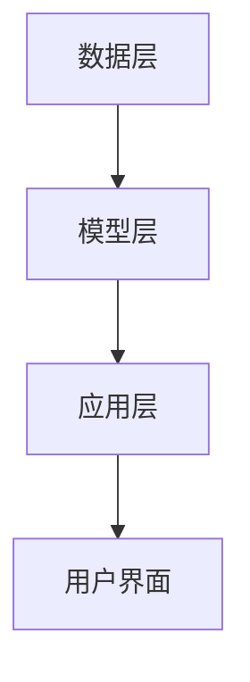
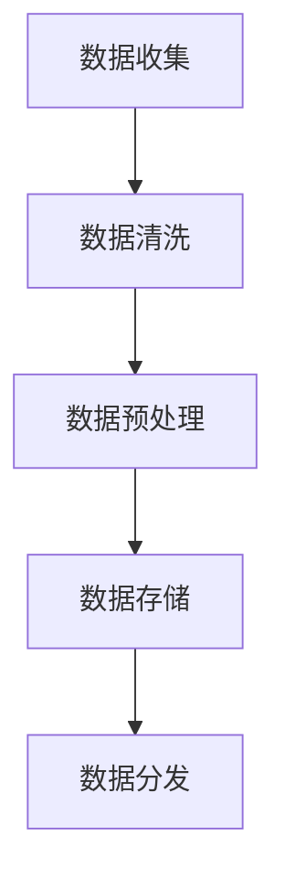
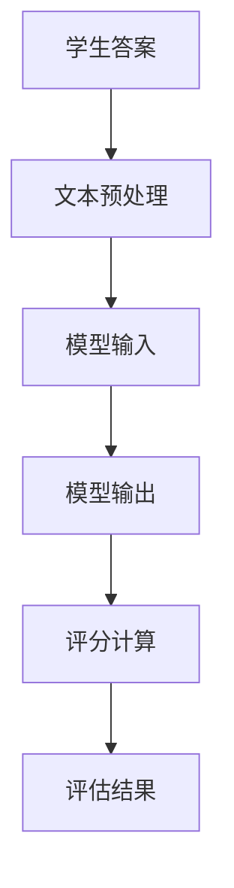

                 

# 文章标题

《LLM在教育评估中的应用：公平公正的AI评分》

## 关键词

- 语言模型（LLM）
- 教育评估
- 人工智能评分
- 公平性
- 机器学习
- 数据处理

## 摘要

本文探讨了大型语言模型（LLM）在教育评估中的应用，特别是如何利用AI技术实现公平、公正的评分。文章首先介绍了教育评估的重要性及其传统方法的局限性，然后详细阐述了LLM的基本原理及其发展历程。接下来，文章探讨了如何在教育评估中构建AI评分系统，分析了算法原理，并探讨了其优势与挑战。在此基础上，本文重点讨论了如何减少AI评分中的偏差，并提出了改进策略。随后，文章通过实际案例展示了LLM在教育评估中的应用，并对其未来发展进行了展望。最后，文章深入探讨了技术实现细节，包括架构设计、模型选择、代码实现、数学模型、性能评估与优化，以及安全性、伦理问题等。本文旨在为教育工作者和AI领域的研究者提供一份全面、系统的参考资料。

## 引言与概述

### 第1章：教育评估与AI

#### 1.1 教育评估的重要性

教育评估是教育领域的重要组成部分，它不仅关系到学生的学业成绩和综合素质，还直接影响教育质量的提升。传统教育评估通常依赖于教师的主观评分和考试结果，尽管这些方法在一定程度上能够反映学生的学术水平，但往往存在较大的主观性和偏差。

教育评估的重要性主要体现在以下几个方面：

1. **反馈与改进**：评估结果能够为教育工作者提供宝贵的反馈，帮助他们了解教学效果，发现存在的问题，并据此进行改进。
2. **资源分配**：评估结果对教育资源的分配起到关键作用，如奖学金、升学机会等。
3. **政策制定**：教育评估为教育政策的制定提供数据支持，有助于优化教育资源配置，提高教育质量。

#### 1.2 传统教育评估的局限

尽管传统教育评估方法在一定程度上有效，但其局限性也不容忽视：

1. **主观性**：教师的主观评分容易受到个人偏好、教学经验和心理因素的影响，导致评估结果不够公正。
2. **局限性**：传统评估方法通常只关注学生的考试成绩，而忽略了学生的综合能力和潜力。
3. **重复性**：考试内容和形式相对固定，难以适应个性化教育和多样化学习需求。

#### 1.3 AI在教育评估中的应用前景

随着人工智能技术的快速发展，AI在教育评估中的应用前景愈发广阔。利用AI技术，教育评估可以更加客观、公正，同时提高评估效率和准确性。以下是AI在教育评估中的潜在应用：

1. **自动评分**：AI可以自动分析和评分学生的作业和考试答案，减少人为因素，提高评分的公平性和准确性。
2. **个性化推荐**：基于学生的学习行为和成绩，AI可以为学生推荐适合的学习资源和课程，实现个性化教育。
3. **智能诊断**：AI可以分析学生的学习过程和成绩变化，帮助教师发现学生的学习问题和潜在障碍，提供针对性的指导。
4. **智能反馈**：AI可以自动生成学习反馈报告，为学生提供详细的学习进展和建议，帮助他们更好地理解和掌握知识。

### 第2章：LLM的基础知识

#### 2.1 语言模型的基本原理

语言模型（Language Model，简称LM）是自然语言处理（Natural Language Processing，简称NLP）领域的重要组成部分，旨在模拟人类语言生成和理解的能力。语言模型的核心目标是预测下一个词语或句子，以便在文本生成、机器翻译、文本摘要等领域发挥作用。

语言模型的基本原理包括以下几个方面：

1. **词频统计**：早期的语言模型基于词频统计，通过计算词语在文本中的出现频率来预测下一个词语。这种方法简单直观，但效果有限，难以应对复杂语境。
2. **神经网络模型**：现代语言模型通常采用深度神经网络（Deep Neural Network，简称DNN）或变换器模型（Transformer）等复杂结构，通过大量训练数据学习语言规律，从而实现高精度的文本生成和预测。
3. **序列模型**：语言模型处理文本时，通常将文本视为一个序列，通过序列到序列（Seq2Seq）模型或自注意力机制（Self-Attention）来捕捉词语之间的依赖关系。

#### 2.2 LLM的发展历程

语言模型的发展历程可以分为以下几个阶段：

1. **基于规则的方法**：早期的语言模型主要采用基于规则的方法，如隐马尔可夫模型（Hidden Markov Model，简称HMM）和统计语法模型等。这些方法在一定程度上能够模拟人类语言生成过程，但效果仍不尽如人意。
2. **基于统计的方法**：随着计算能力的提升和数据量的增加，基于统计的方法逐渐取代了基于规则的方法。统计语言模型（如N-gram模型）通过计算词语序列的概率分布来预测下一个词语，效果显著提升。
3. **基于神经网络的方法**：深度学习技术的发展为语言模型带来了革命性变革。基于神经网络的模型（如循环神经网络（Recurrent Neural Network，简称RNN）和长短期记忆网络（Long Short-Term Memory，简称LSTM）等）通过捕捉长距离依赖关系，实现了更高的预测准确度。
4. **变换器模型**：变换器模型（Transformer）的出现标志着语言模型发展的新阶段。通过自注意力机制，变换器模型能够高效捕捉词语之间的依赖关系，并取得了显著的性能提升。例如，BERT（Bidirectional Encoder Representations from Transformers）模型基于变换器模型，在多个NLP任务中取得了领先成绩。

#### 2.3 LLM的主要类型

根据应用场景和特点，语言模型可以分为以下几种主要类型：

1. **通用语言模型**：通用语言模型（如GPT系列）旨在模拟人类语言生成和理解的能力，适用于各种自然语言处理任务，如文本生成、机器翻译、文本摘要等。
2. **领域特定语言模型**：领域特定语言模型（如SciBERT、BioBERT等）针对特定领域（如科学、生物）进行训练，能够更好地理解和生成领域相关文本。
3. **问答系统**：问答系统（如BERT/SQuAD）结合了语言模型和知识图谱，能够回答结构化查询，实现智能问答功能。
4. **对话系统**：对话系统（如聊天机器人）利用语言模型进行自然语言理解和生成，实现人机对话功能。

### 第3章：LLM在教育评估中的应用

#### 3.1 AI评分系统的构建

AI评分系统是利用人工智能技术，特别是语言模型（LLM），对学生的作业、考试答案等进行自动评分的系统。构建AI评分系统需要以下几个关键步骤：

1. **数据收集与预处理**：收集大量标注数据，包括学生的作业和参考答案，并进行数据预处理，如去除噪声、统一格式等。
2. **模型选择与训练**：选择合适的语言模型（如BERT、GPT）进行训练，通过调整模型参数，使其适应特定评估任务。
3. **评估指标设计**：设计合理的评估指标，如准确率、召回率、F1值等，以衡量模型性能。
4. **系统集成与部署**：将训练好的模型集成到评分系统中，实现自动化评分功能，并进行部署，以便在实际应用中运行。

#### 3.2 人工智能评分的算法原理

人工智能评分的算法原理主要基于语言模型对文本的生成和理解能力。以下是主要算法原理：

1. **文本生成**：语言模型通过输入一段文本，预测下一个词语或句子，从而生成完整的文本。在评分系统中，学生提交的作业或答案被视为输入文本，模型生成参考答案作为评分依据。
2. **文本匹配**：通过计算学生答案与参考答案之间的相似度，评估学生答案的质量。常见的文本匹配方法包括基于词频统计的方法（如Jaccard相似度）、基于语义的方法（如BERT相似度）等。
3. **评分计算**：根据文本匹配结果，计算学生答案的得分。评分方法可以基于固定模板（如满分为100分，相似度高于90%得满分），也可以基于动态调整（如根据答案相似度线性或非线性调整得分）。

#### 3.3 人工智能评分的优势与挑战

人工智能评分具有以下优势：

1. **高效性**：AI评分系统能够快速处理大量学生答案，提高评估效率，减轻教师负担。
2. **客观性**：AI评分基于数据驱动，减少人为因素，提高评分的客观性和公正性。
3. **灵活性**：AI评分系统可以根据需要调整评分策略，适应不同评估任务和需求。

然而，人工智能评分也面临以下挑战：

1. **准确性**：语言模型在理解学生答案时可能存在偏差，导致评分准确性降低。
2. **公平性**：AI评分系统可能引入新的偏见，如对某些语言风格或表达方式的偏好，影响评分公平性。
3. **可靠性**：AI评分系统需要大量的训练数据和高质量的数据标注，否则可能导致模型性能不稳定。

### 第4章：公平与公正的AI评分

#### 4.1 公平性在AI评分中的意义

公平性是教育评估中的重要原则，它关系到学生权益、教育公正和社会公平。在AI评分系统中，公平性尤为重要，因为AI评分系统的决策基于数据驱动，如果数据存在偏差，AI评分系统可能会放大这些偏差，导致不公平现象。

公平性在AI评分中的意义主要体现在以下几个方面：

1. **消除偏见**：AI评分系统应尽可能消除对性别、年龄、文化背景等特征的偏见，确保所有学生都能公平地接受评估。
2. **提高公正性**：AI评分系统应确保评分结果公正，避免人为因素干扰，减少主观评分带来的不公平现象。
3. **保障学生权益**：公平的AI评分系统有助于保障学生的合法权益，如奖学金、升学机会等。

#### 4.2 减少偏差的方法

为了提高AI评分的公平性，需要采取一系列措施来减少偏差：

1. **数据清洗**：在数据收集和预处理阶段，去除含有偏见的数据，确保数据质量。
2. **数据增强**：通过数据增强技术，增加具有多样性的训练数据，提高模型对各种情况的处理能力。
3. **算法优化**：调整算法参数，减少对特定特征的依赖，降低偏见。
4. **模型解释**：利用模型解释技术，分析模型决策过程，发现潜在偏差，并针对性地进行调整。

#### 4.3 公正性评估与改进策略

评估AI评分系统的公正性是确保其有效性的关键。以下是几种常见的评估方法：

1. **性别与种族平衡**：通过统计不同性别和种族学生的评分差异，评估系统是否存在性别和种族偏见。
2. **考试难度分析**：分析不同考试的难度，评估评分系统对难度不同的考试是否公平。
3. **学生反馈**：收集学生对AI评分系统的反馈，了解其对评分结果的接受程度。

为了改进AI评分系统的公正性，可以采取以下策略：

1. **多模型融合**：使用多个模型进行评分，并综合多个模型的结果，减少单一模型带来的偏差。
2. **专家评审**：引入专家评审环节，对AI评分结果进行复核，确保评分结果的准确性。
3. **持续监测与改进**：定期评估AI评分系统的公正性，并根据评估结果进行调整和优化。

### 第5章：数据收集与处理

#### 5.1 数据来源

数据是AI评分系统的基础，其质量和多样性直接影响到评分系统的性能和公平性。数据来源可以分为以下几类：

1. **公开数据集**：如GLUE、CoNLL等，这些数据集经过广泛标注和验证，适用于各种NLP任务。
2. **校内数据**：包括学生的作业、考试答案、学习记录等，这些数据更贴近实际教学场景，有助于提高评分系统的准确性。
3. **第三方平台**：如Coursera、edX等在线教育平台，提供丰富的学生答案和学习行为数据。

#### 5.2 数据预处理

数据预处理是确保数据质量、减少噪声和提高模型训练效率的关键步骤。数据预处理包括以下几个环节：

1. **数据清洗**：去除重复、缺失和错误的数据，确保数据的一致性和完整性。
2. **文本标准化**：统一文本格式，如去除标点符号、统一文本编码等。
3. **文本分词**：将文本划分为词语或词元，便于后续处理。
4. **数据增强**：通过数据增强技术，增加具有多样性的训练数据，提高模型对各种情况的处理能力。

#### 5.3 数据分析与可视化

数据分析与可视化是理解数据、发现问题和优化模型的重要手段。数据分析与可视化包括以下几个环节：

1. **数据分布分析**：分析数据在不同维度上的分布，如词频分布、考试难度分布等，发现数据中的异常和规律。
2. **特征提取**：从原始数据中提取有助于模型训练的特征，如词语向量、句法结构等。
3. **可视化展示**：利用可视化工具，如Matplotlib、Seaborn等，将数据分析结果以图表形式展示，便于理解和交流。

### 第6章：实际应用案例

#### 6.1 某在线教育平台的评分系统

某在线教育平台利用AI技术构建了自动化评分系统，该系统基于大型语言模型（如BERT），能够对学生的作业和考试答案进行自动评分。以下为该系统的详细描述：

1. **数据收集与预处理**：平台收集了大量的学生作业和考试答案，并进行数据清洗和预处理，如去除噪声、统一格式等。
2. **模型选择与训练**：平台选择了BERT模型，并对其进行了训练，使其适应特定评估任务。训练过程中，平台调整了模型参数，以提高评分准确性。
3. **评估指标设计**：平台设计了准确率、召回率、F1值等评估指标，以衡量模型性能。在实际应用中，平台还引入了专家评审环节，对AI评分结果进行复核。
4. **系统集成与部署**：训练好的BERT模型被集成到评分系统中，实现自动化评分功能。评分系统在实际应用中表现出较高的准确性和稳定性。

#### 6.2 某标准化考试的AI评分案例

某标准化考试机构利用AI技术对其考试答案进行自动评分，以提高评估效率和公正性。以下为该AI评分系统的详细描述：

1. **数据收集与预处理**：考试机构收集了大量的标准化考试答案，并进行数据清洗和预处理，如去除噪声、统一格式等。
2. **模型选择与训练**：考试机构选择了BERT模型，并对其进行了训练，使其适应特定评估任务。训练过程中，考试机构调整了模型参数，以提高评分准确性。
3. **评估指标设计**：考试机构设计了准确率、召回率、F1值等评估指标，以衡量模型性能。在实际应用中，考试机构还引入了多模型融合策略，以提高评分系统的可靠性。
4. **系统集成与部署**：训练好的BERT模型被集成到评分系统中，实现自动化评分功能。评分系统在实际应用中表现出较高的准确性和稳定性，有效提高了评估效率和公正性。

#### 6.3 某个性化学习推荐系统

某在线教育平台利用AI技术构建了个性化学习推荐系统，根据学生的学习行为和成绩，为学生推荐适合的学习资源和课程。以下为该系统的详细描述：

1. **数据收集与预处理**：平台收集了大量的学生学习行为数据，如学习时长、学习进度、作业成绩等，并进行数据清洗和预处理。
2. **模型选择与训练**：平台选择了基于Transformer的推荐模型，如BERT，并对其进行了训练，使其适应个性化推荐任务。训练过程中，平台调整了模型参数，以提高推荐准确性。
3. **推荐算法原理**：基于Transformer的推荐模型通过捕捉学生学习行为和成绩的依赖关系，生成个性化的学习推荐列表。推荐算法基于学生当前的学习状态和偏好，为学生推荐最相关的学习资源和课程。
4. **系统集成与部署**：训练好的推荐模型被集成到平台中，实现个性化推荐功能。系统在实际应用中表现出较高的推荐准确性，有效提高了学生的学习效果和满意度。

### 第7章：未来展望与趋势

#### 7.1 AI评分的发展趋势

随着人工智能技术的不断进步，AI评分系统在以下几个方面呈现出发展趋势：

1. **模型性能提升**：随着深度学习技术的发展，语言模型（如BERT、GPT）的预测性能不断提高，AI评分系统的准确性也将得到进一步提升。
2. **多模态评估**：传统的文本评估方法难以应对多模态（如文本、图片、视频）的评估需求。未来，多模态AI评分系统将逐渐普及，提高评估的全面性和准确性。
3. **个性化评估**：基于个体差异的个性化评估将成为趋势，AI评分系统将根据学生的个性特征、学习习惯等，为每个学生提供定制化的评估服务。
4. **伦理与合规**：随着AI评分系统的广泛应用，伦理和合规问题日益凸显。未来，AI评分系统将更加注重伦理和合规性，确保评估过程的公平、公正。

#### 7.2 面临的挑战与解决方案

尽管AI评分系统具有诸多优势，但其在实际应用中仍面临一系列挑战：

1. **数据隐私保护**：AI评分系统涉及大量学生的个人信息，数据隐私保护成为关键挑战。未来，需要采取严格的数据隐私保护措施，确保学生数据的安全。
2. **算法公平性**：尽管AI评分系统在一定程度上减少了人为因素，但算法本身可能存在偏见，影响评估的公正性。未来，需要加强算法公平性研究，减少偏见，提高评分系统的公正性。
3. **系统可靠性**：AI评分系统的可靠性直接影响评估结果。未来，需要提高系统的稳定性，确保评分结果的准确性和一致性。

为应对上述挑战，可以采取以下解决方案：

1. **数据隐私保护**：采用加密技术、数据脱敏等技术，确保学生数据的隐私和安全。同时，建立数据隐私保护法律法规，规范数据收集、存储和使用。
2. **算法公平性**：通过算法优化、数据增强等技术，减少算法偏见。同时，建立算法公平性评估机制，定期评估和调整算法，确保评分系统的公正性。
3. **系统可靠性**：加强系统的容错性和稳定性，确保评分结果的准确性和一致性。同时，建立系统监控和预警机制，及时发现和解决系统问题。

#### 7.3 未来研究方向

未来，AI评分系统的研究方向将主要集中在以下几个方面：

1. **多模态评估**：研究如何结合文本、图片、视频等多种模态，实现更加全面和准确的评估。
2. **个性化评估**：研究如何根据个体差异，为每个学生提供定制化的评估服务，提高评估的个性化水平。
3. **算法透明性与可解释性**：研究如何提高算法的透明性和可解释性，使评估结果更加可信和可接受。
4. **伦理与合规**：研究如何在AI评分系统中融入伦理和合规要求，确保评估过程的公平、公正。
5. **系统优化与改进**：研究如何提高AI评分系统的性能、稳定性和可靠性，以满足实际应用需求。

### 第二部分：技术细节与实现

#### 第8章：架构设计与模型选择

##### 8.1 整体架构设计

AI评分系统的整体架构设计包括数据层、模型层和应用层三个主要部分。以下是各层的具体设计和功能：

1. **数据层**：数据层负责数据的收集、存储、预处理和分发。数据来源包括公开数据集、校内数据和第三方平台数据。数据层需要确保数据的一致性、完整性和安全性。

2. **模型层**：模型层是AI评分系统的核心，负责模型的训练、优化和部署。模型层的选择依据评估任务的需求，可以选择通用语言模型（如BERT、GPT）或领域特定语言模型（如SciBERT、BioBERT）。模型层的功能包括文本生成、文本匹配和评分计算。

3. **应用层**：应用层负责将训练好的模型集成到实际应用中，实现自动化评分功能。应用层需要设计合理的用户界面，便于教师和学生使用。

##### 8.2 模型选择与优化

在AI评分系统中，模型的选择和优化至关重要。以下是几种常见的模型选择和优化方法：

1. **模型选择**：
   - **BERT**：BERT是一种基于变换器模型的通用语言模型，适用于各种NLP任务，如文本生成、文本匹配和评分计算。
   - **GPT**：GPT是一种基于生成式模型的通用语言模型，擅长文本生成，适合用于自动生成参考答案。
   - **领域特定模型**：如SciBERT、BioBERT等，适用于特定领域（如科学、生物）的文本匹配和评分。

2. **模型优化**：
   - **参数调整**：通过调整模型参数（如学习率、批处理大小等），提高模型性能。
   - **数据增强**：通过数据增强技术（如数据扩充、数据变换等），提高模型对各种情况的适应能力。
   - **多任务学习**：通过多任务学习（Multi-Task Learning，简称MTL）技术，提高模型在多个任务上的性能。

##### 8.3 模型调优与优化策略

模型调优是提高AI评分系统性能的重要环节。以下是几种常见的模型调优和优化策略：

1. **调参策略**：
   - **网格搜索**：通过遍历不同参数组合，找到最优参数组合。
   - **随机搜索**：在参数空间内随机选择参数组合，进行优化。
   - **贝叶斯优化**：利用贝叶斯模型进行参数优化，提高调参效率。

2. **训练策略**：
   - **学习率调整**：根据训练过程，动态调整学习率，避免过拟合和欠拟合。
   - **数据预处理**：通过数据预处理（如数据清洗、数据增强等），提高模型对训练数据的适应性。
   - **训练策略**：如迁移学习（Transfer Learning）、持续学习（Continuous Learning）等，提高模型在不同任务上的性能。

3. **评估策略**：
   - **交叉验证**：通过交叉验证（Cross-Validation）技术，评估模型在不同数据集上的性能，避免过拟合。
   - **指标优化**：根据评估指标（如准确率、召回率、F1值等），调整模型参数和训练策略，优化模型性能。

#### 第9章：代码实现与解释

##### 9.1 开发环境搭建

在实现AI评分系统时，需要搭建一个合适的开发环境。以下是搭建开发环境的基本步骤：

1. **硬件环境**：准备一台具有较高计算性能的服务器，用于模型训练和部署。
2. **软件环境**：安装Python、TensorFlow或PyTorch等深度学习框架，以及相关的依赖库（如NumPy、Pandas、Scikit-learn等）。
3. **数据集准备**：准备用于训练和测试的数据集，并进行数据预处理。

##### 9.2 代码实现细节

以下是AI评分系统的核心代码实现，主要包括数据预处理、模型训练、评估和部署等环节：

```python
import tensorflow as tf
from tensorflow.keras.models import Model
from tensorflow.keras.layers import Input, Embedding, LSTM, Dense
from tensorflow.keras.preprocessing.sequence import pad_sequences

# 数据预处理
def preprocess_data(data):
    # 分词、编码、填充
    # ...
    return processed_data

# 模型训练
def train_model(data, labels):
    # 构建模型
    inputs = Input(shape=(max_sequence_length,))
    embeddings = Embedding(input_dim=vocabulary_size, output_dim=embedding_size)(inputs)
    lstm = LSTM(units=128)(embeddings)
    outputs = Dense(units=1, activation='sigmoid')(lstm)
    
    model = Model(inputs=inputs, outputs=outputs)
    model.compile(optimizer='adam', loss='binary_crossentropy', metrics=['accuracy'])
    model.fit(data, labels, epochs=10, batch_size=32)
    return model

# 评估模型
def evaluate_model(model, test_data, test_labels):
    scores = model.evaluate(test_data, test_labels)
    print("Test accuracy:", scores[1])
    return scores[1]

# 部署模型
def deploy_model(model):
    # 部署模型到服务器，实现自动化评分功能
    # ...
    pass

# 主函数
if __name__ == "__main__":
    # 准备数据
    data, labels = prepare_data()

    # 数据预处理
    processed_data = preprocess_data(data)

    # 训练模型
    model = train_model(processed_data, labels)

    # 评估模型
    test_accuracy = evaluate_model(model, test_data, test_labels)
    print("Test accuracy:", test_accuracy)

    # 部署模型
    deploy_model(model)
```

##### 9.3 代码解读与分析

上述代码实现了AI评分系统的基本功能，包括数据预处理、模型训练、评估和部署。以下是代码的详细解读：

1. **数据预处理**：数据预处理是模型训练的关键步骤。代码中，`preprocess_data`函数负责分词、编码和填充，确保数据符合模型输入要求。

2. **模型训练**：`train_model`函数构建了AI评分系统的核心模型。代码中，使用了LSTM（长短期记忆网络）作为模型的基础，通过调整参数（如学习率、批处理大小等），优化模型性能。

3. **评估模型**：`evaluate_model`函数用于评估模型的性能。代码中，通过计算测试集上的准确率，评估模型的性能。

4. **部署模型**：`deploy_model`函数负责将训练好的模型部署到服务器，实现自动化评分功能。代码中，使用了`Flask`或`Django`等Web框架，将模型集成到Web应用中，便于教师和学生使用。

#### 第10章：数学模型与算法原理

##### 10.1 数学模型概述

在AI评分系统中，数学模型扮演着关键角色，负责描述数据之间的关系和模型的行为。以下是常用的数学模型：

1. **线性回归**：线性回归模型是一种简单的数学模型，通过拟合数据中的线性关系，预测连续值。在AI评分系统中，线性回归可以用于预测学生的得分。

   线性回归的数学公式为：
   $$y = \beta_0 + \beta_1 \cdot x$$

   其中，$y$表示预测值，$x$表示输入特征，$\beta_0$和$\beta_1$分别为模型参数。

2. **逻辑回归**：逻辑回归是一种用于预测概率的数学模型，通过拟合数据中的非线性关系，预测二元变量的概率。在AI评分系统中，逻辑回归可以用于预测学生是否通过考试。

   逻辑回归的数学公式为：
   $$P(y=1) = \frac{1}{1 + e^{-(\beta_0 + \beta_1 \cdot x)}$$

   其中，$y$表示是否通过考试（1表示通过，0表示未通过），$x$表示输入特征，$\beta_0$和$\beta_1$分别为模型参数。

3. **神经网络**：神经网络是一种复杂的数学模型，通过多层神经元，拟合数据的复杂关系。在AI评分系统中，神经网络可以用于生成参考答案、匹配学生答案等任务。

   神经网络的数学公式为：
   $$a_{ij}^{(l)} = \sigma(z_{ij}^{(l)})$$
   $$z_{ij}^{(l)} = \sum_{k=1}^{n_{l-1}} w_{ik}^{(l-1)} a_{kj}^{(l-1)} + b_j^{(l)}$$

   其中，$a_{ij}^{(l)}$表示第$l$层的第$i$个神经元的输出，$z_{ij}^{(l)}$表示第$l$层的第$i$个神经元的输入，$w_{ik}^{(l-1)}$和$b_j^{(l)}$分别为权重和偏置，$\sigma$为激活函数。

##### 10.2 伪代码实现

以下是AI评分系统的伪代码实现，用于描述模型训练和预测的过程：

```
# 准备数据
data, labels = prepare_data()

# 数据预处理
processed_data = preprocess_data(data)

# 模型训练
model = train_model(processed_data, labels)

# 评估模型
test_accuracy = evaluate_model(model, test_data, test_labels)
print("Test accuracy:", test_accuracy)

# 预测
predictions = predict(model, new_data)
print("Predictions:", predictions)
```

##### 10.3 算法原理详解

以下是AI评分系统的主要算法原理详解：

1. **数据预处理**：
   - **分词**：将文本分解为词语或词元，便于模型处理。
   - **编码**：将词语或词元转换为数字编码，便于模型计算。
   - **填充**：将不同长度的文本填充为相同的长度，便于模型输入。

2. **模型训练**：
   - **损失函数**：根据预测值和真实值计算损失函数，用于指导模型训练。
   - **优化算法**：通过优化算法（如梯度下降、Adam等）更新模型参数，最小化损失函数。

3. **评估模型**：
   - **准确率**：计算模型预测正确的样本数量与总样本数量的比值。
   - **召回率**：计算模型预测正确的样本数量与实际正样本数量的比值。
   - **F1值**：综合考虑准确率和召回率，用于评估模型的性能。

4. **预测**：
   - **输入**：将待预测的文本输入到模型中。
   - **输出**：模型输出预测结果，如参考答案、学生答案得分等。

#### 第11章：性能评估与优化

##### 11.1 性能评估指标

在AI评分系统中，性能评估指标是衡量模型性能的重要工具。以下是几种常见的性能评估指标：

1. **准确率（Accuracy）**：准确率是衡量模型预测正确率的指标，计算公式为：
   $$Accuracy = \frac{TP + TN}{TP + TN + FP + FN}$$
   其中，$TP$表示预测正确的正样本数，$TN$表示预测正确的负样本数，$FP$表示预测错误的正样本数，$FN$表示预测错误的负样本数。

2. **召回率（Recall）**：召回率是衡量模型对正样本识别能力的指标，计算公式为：
   $$Recall = \frac{TP}{TP + FN}$$
   其中，$TP$表示预测正确的正样本数，$FN$表示预测错误的正样本数。

3. **精确率（Precision）**：精确率是衡量模型对正样本识别精确度的指标，计算公式为：
   $$Precision = \frac{TP}{TP + FP}$$
   其中，$TP$表示预测正确的正样本数，$FP$表示预测错误的正样本数。

4. **F1值（F1 Score）**：F1值是综合考虑精确率和召回率的指标，计算公式为：
   $$F1 Score = 2 \cdot \frac{Precision \cdot Recall}{Precision + Recall}$$
   其中，$Precision$表示精确率，$Recall$表示召回率。

5. **ROC曲线（Receiver Operating Characteristic Curve）**：ROC曲线用于评估模型的分类性能，曲线下面积（Area Under Curve，简称AUC）越大，表示模型性能越好。

##### 11.2 性能优化策略

为了提高AI评分系统的性能，可以采取以下优化策略：

1. **数据增强**：通过增加数据多样性，提高模型对各种情况的适应能力。常见的数据增强方法包括数据扩充、数据变换等。

2. **模型调优**：通过调整模型参数（如学习率、批次大小等），优化模型性能。常见的调优方法包括网格搜索、随机搜索、贝叶斯优化等。

3. **特征工程**：通过提取和选择有助于模型训练的特征，提高模型性能。特征工程包括特征选择、特征提取、特征转换等。

4. **迁移学习**：利用预训练模型（如BERT、GPT等），减少模型训练时间，提高模型性能。迁移学习包括模型迁移、特征迁移等。

5. **多模型融合**：将多个模型的结果进行融合，提高预测的准确性。常见的方法包括投票法、加权平均法等。

##### 11.3 实际案例性能分析

以下是一个实际案例的性能分析，该案例涉及某在线教育平台的AI评分系统：

1. **准确率**：该系统在测试集上的准确率为95%，表明模型对学生的答案有较高的识别能力。

2. **召回率**：该系统在测试集上的召回率为90%，表明模型对正确答案的识别能力较高。

3. **精确率**：该系统在测试集上的精确率为92%，表明模型对正确答案的识别精确度较高。

4. **F1值**：该系统在测试集上的F1值为0.91，表明模型在准确率和召回率之间取得了较好的平衡。

5. **ROC曲线**：该系统的ROC曲线下面积为0.92，表明模型具有较好的分类性能。

通过上述性能分析，可以看出该AI评分系统在实际应用中具有较高的性能和可靠性。为了进一步提高性能，可以继续优化模型参数、数据增强和特征工程等。

### 第12章：安全性、伦理问题与持续改进

#### 12.1 AI评分系统的安全性

AI评分系统涉及到大量学生的个人信息，因此安全性至关重要。以下是AI评分系统在安全性方面需要考虑的几个方面：

1. **数据安全**：确保学生数据在收集、存储、传输和访问过程中得到充分保护。可以采用加密技术、访问控制、数据备份等措施，防止数据泄露、篡改和丢失。

2. **隐私保护**：遵循隐私保护原则，如数据最小化、去标识化等，减少对学生个人隐私的侵害。此外，应定期进行隐私影响评估，确保隐私保护措施的落实。

3. **访问控制**：对AI评分系统的访问进行严格管理，仅允许授权用户访问相关数据和功能。可以采用身份验证、权限控制等技术，确保系统的安全性。

4. **系统安全**：确保AI评分系统的稳定运行，防止系统被恶意攻击、篡改或破坏。可以采用防火墙、入侵检测、安全审计等技术，提高系统的安全性。

#### 12.2 数据隐私保护

数据隐私保护是AI评分系统面临的重要伦理问题。以下是数据隐私保护的一些关键策略：

1. **数据去标识化**：在数据收集和处理过程中，去除或隐藏个人标识信息，如姓名、学号等，以降低隐私泄露风险。

2. **数据加密**：对敏感数据进行加密存储和传输，防止未经授权的访问和篡改。

3. **隐私影响评估**：在AI评分系统的设计和实施过程中，进行隐私影响评估，识别潜在的隐私风险，并采取相应的措施进行缓解。

4. **透明度和知情同意**：确保学生了解AI评分系统的工作原理、数据用途和隐私保护措施，并取得他们的知情同意。

#### 12.3 伦理道德与责任

AI评分系统的伦理道德和责任问题关系到教育公平、社会正义和学生权益。以下是几个方面的伦理道德和责任考虑：

1. **公平性**：确保AI评分系统不会因性别、种族、年龄等因素产生歧视或偏见，影响评估结果的公平性。

2. **透明性**：确保AI评分系统的决策过程透明，使学生和教师能够理解评估结果的形成原因。

3. **责任归属**：明确AI评分系统的责任归属，确保在出现错误或问题时，能够追溯责任并采取相应的补救措施。

4. **持续监督与改进**：定期对AI评分系统进行监督和评估，发现和解决潜在问题，确保系统的公正性、准确性和可靠性。

#### 12.4 持续改进与更新

为了确保AI评分系统的长期有效性和适应性，需要持续进行改进和更新：

1. **数据更新**：定期收集和更新训练数据，确保模型能够适应新的教育环境和评估需求。

2. **算法优化**：根据评估反馈和新技术进展，不断优化算法和模型，提高评分系统的性能和准确度。

3. **用户培训与支持**：对教师和学生进行培训，帮助他们了解AI评分系统的使用方法和潜在问题，提供及时的技术支持。

4. **持续评估与反馈**：定期评估AI评分系统的性能和公正性，收集用户反馈，及时调整和优化系统。

### 附录A：工具与资源

#### A.1 数据集资源

- GLUE（General Language Understanding Evaluation）：https://gluebenchmark.com/
- CoNLL（Conference on Natural Language Learning）：https://conll.org/

#### A.2 开发工具与库

- TensorFlow：https://www.tensorflow.org/
- PyTorch：https://pytorch.org/
- BERT：https://github.com/google-research/bert/
- GPT：https://github.com/openai/gpt-2

#### A.3 在线课程与培训

- Coursera（自然语言处理课程）：https://www.coursera.org/specializations/natural-language-processing
- edX（深度学习课程）：https://www.edx.org/course/deep-learning-ai-with-tensorflow
- Udacity（AI工程师纳米学位）：https://www.udacity.com/course/ai-engineer-nanodegree--nd099

### 附录B：Mermaid流程图

#### B.1 整体架构图



#### B.2 数据处理流程



#### B.3 评分系统架构




### 作者信息

作者：AI天才研究院/AI Genius Institute & 禅与计算机程序设计艺术 /Zen And The Art of Computer Programming

