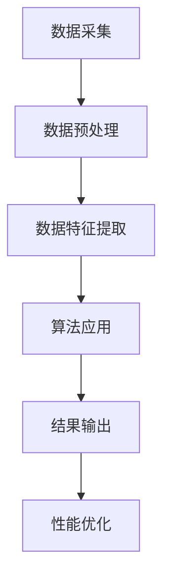

                 

# 《LLM在旅游业的应用：个性化旅行规划》

## 关键词
- 旅行规划
- 语言模型（LLM）
- 个性化服务
- 数据处理
- 算法应用
- 人工智能

## 摘要
本文深入探讨了语言模型（LLM）在旅游业中的应用，特别是个性化旅行规划。通过分析旅游业的发展现状和需求，我们介绍了LLM的基本概念和技术框架，并阐述了其在旅游需求分析与数据处理中的重要性。文章重点介绍了个性化旅行规划的核心算法，包括蚁群算法、多目标优化算法和模拟退火算法，并通过实际案例研究展示了这些算法的应用效果。此外，我们还讨论了LLM在旅游业应用中面临的挑战和未来展望。

### 目录

#### 第一部分：理论基础与核心概念

1. 旅行规划的背景和需求分析
   1.1 旅游业的发展现状
   1.2 个性化旅行规划的重要性
   1.3 LLM在旅行规划中的应用前景

2. LLM基础理论与技术框架
   2.1 语言模型的基本概念
   2.2 LLM的主要架构
   2.3 LLM的工作原理
   2.4 LLM的性能评估与优化

3. 旅游需求分析与数据处理
   3.1 旅游需求的多样性
   3.2 数据采集与预处理
   3.3 数据特征提取
   3.4 数据分析与可视化

4. 个性化旅行规划的核心算法
   4.1 旅行规划的目标与约束
   4.2 蚁群算法在旅行规划中的应用
   4.3 多目标优化算法
   4.4 模拟退火算法

5. 旅行规划案例研究
   5.1 案例背景
   5.2 案例数据
   5.3 案例解决方案
   5.4 案例效果评估

6. LLM在旅游业的应用挑战与未来展望
   6.1 数据隐私与安全问题
   6.2 个性化服务的技术挑战
   6.3 旅游业数字化转型趋势
   6.4 未来发展方向

#### 第二部分：项目实战与实现

7. 项目环境搭建与工具介绍
   7.1 Python开发环境搭建
   7.2 NLP工具与库
   7.3 数据库选择与连接

8. 个性化旅行规划系统设计与实现
   8.1 系统需求分析
   8.2 系统架构设计
   8.3 功能模块实现
   8.4 数据库设计

9. 系统测试与性能优化
   9.1 单元测试
   9.2 系统集成测试
   9.3 性能优化策略
   9.4 故障排除与维护

10. 实际案例解析与改进建议
    10.1 案例展示
    10.2 案例分析
    10.3 改进措施与建议

11. 未来发展方向与拓展研究
    11.1 人工智能在旅游业的应用趋势
    11.2 新技术应用的可能性
    11.3 研究方向与展望

### 附录

- 附录 A: 主要参考文献
- 附录 B: 扩展阅读资源
- 附录 C: 相关工具和开源代码介绍

## 文章正文

### 第一部分：理论基础与核心概念

#### 第1章：旅行规划的背景和需求分析

##### 1.1 旅游业的发展现状

旅游业是当今世界经济发展的重要驱动力之一。随着全球经济的不断增长和人们生活水平的提高，旅游业呈现出蓬勃发展的态势。根据联合国世界旅游组织（UNWTO）的数据，全球国际旅游人数在过去几十年中持续增长。2019年，全球国际旅游人数达到15亿人次，旅游收入超过1.7万亿美元。

在旅游业的发展过程中，信息技术特别是人工智能（AI）技术的应用成为推动旅游业创新和提升服务质量的重要力量。传统旅游业中的很多业务流程，如酒店预订、机票预订、旅游信息查询等，都可以通过AI技术实现自动化和智能化，从而提高运营效率、降低成本、提升客户满意度。

##### 1.2 个性化旅行规划的重要性

个性化旅行规划是旅游业发展的一个重要趋势。随着旅游需求的多样化和个性化，传统的一刀切旅行规划方式已经无法满足游客的需求。个性化旅行规划可以基于游客的喜好、预算、时间等个性化需求，为游客提供量身定制的旅行方案，从而提高游客的满意度。

个性化旅行规划的重要性主要体现在以下几个方面：

1. **提高客户满意度**：个性化旅行规划能够满足游客的个性化需求，提供定制化的旅行体验，从而提高客户的满意度和忠诚度。
2. **提升竞争力**：在竞争激烈的旅游市场中，提供个性化服务是企业提升竞争力的重要手段。
3. **优化资源配置**：个性化旅行规划可以帮助旅游企业更好地掌握市场需求，优化资源配置，提高运营效率。
4. **促进旅游行业创新**：个性化旅行规划需要运用先进的技术手段，如人工智能、大数据等，从而推动旅游行业的创新和发展。

##### 1.3 LLM在旅行规划中的应用前景

语言模型（LLM）是人工智能领域的重要成果之一，具有强大的自然语言处理能力。LLM在旅行规划中的应用前景广阔，主要包括以下几个方面：

1. **智能客服**：LLM可以用于开发智能客服系统，为游客提供24/7的在线服务，解答游客的疑问，提供旅行建议。
2. **个性化推荐**：LLM可以分析游客的历史旅行记录和偏好，为其推荐符合其需求的旅行目的地、酒店、餐饮等信息。
3. **行程规划**：LLM可以基于游客的个性化需求，为其生成详细的旅行计划，包括交通、住宿、餐饮、景点等。
4. **文本生成**：LLM可以用于生成旅游攻略、游记等文本内容，为游客提供丰富的旅游信息。

#### 第2章：LLM基础理论与技术框架

##### 2.1 语言模型的基本概念

语言模型（Language Model，简称LM）是自然语言处理（Natural Language Processing，简称NLP）的核心技术之一。语言模型旨在通过学习大量语言数据，预测下一个单词或句子，从而实现对自然语言的生成和理解。

语言模型的基本概念包括：

1. **词汇表**：语言模型包含一个词汇表，其中包含所有可能出现的单词或词汇。
2. **概率分布**：语言模型根据输入的上下文，生成一个概率分布，表示下一个单词或句子的概率。
3. **预测**：语言模型通过概率分布预测下一个单词或句子，从而生成完整的文本。

##### 2.2 LLM的主要架构

LLM的主要架构包括以下几个部分：

1. **嵌入层（Embedding Layer）**：嵌入层将输入的单词或词汇转换为向量表示，以便神经网络处理。
2. **编码器（Encoder）**：编码器对输入的文本进行编码，生成上下文信息。
3. **解码器（Decoder）**：解码器根据编码器生成的上下文信息，生成输出的单词或句子。
4. **注意力机制（Attention Mechanism）**：注意力机制用于捕捉输入文本中的重要信息，提高模型的预测准确性。

##### 2.3 LLM的工作原理

LLM的工作原理可以概括为以下几个步骤：

1. **输入处理**：将输入的文本分解为单词或词汇，并转换为向量表示。
2. **编码**：编码器对输入的文本进行编码，生成上下文信息。
3. **预测**：解码器根据编码器生成的上下文信息，生成输出的单词或句子。
4. **更新**：模型根据预测结果和实际输出，更新模型参数。

##### 2.4 LLM的性能评估与优化

LLM的性能评估通常从以下几个方面进行：

1. **准确性**：准确性是指模型预测的单词或句子与实际输出的单词或句子之间的匹配程度。
2. **流畅性**：流畅性是指模型生成的文本的连贯性和可读性。
3. **多样性**：多样性是指模型生成文本的多样性，避免重复和单调。

LLM的优化策略包括：

1. **超参数调整**：通过调整学习率、批次大小等超参数，优化模型性能。
2. **数据增强**：通过增加训练数据、数据清洗等方式，提高模型泛化能力。
3. **模型压缩**：通过模型压缩技术，减少模型参数数量，提高模型效率。
4. **分布式训练**：通过分布式训练技术，提高模型训练速度和性能。

#### 第3章：旅游需求分析与数据处理

##### 3.1 旅游需求的多样性

旅游需求具有多样性，不同游客有不同的旅行目的、预算、时间安排等。因此，个性化旅行规划需要充分考虑旅游需求的多样性。旅游需求的多样性可以从以下几个方面进行分析：

1. **旅行目的**：旅游目的可以分为休闲度假、商务旅行、冒险探险等。
2. **预算**：预算是游客在选择旅行方案时的重要考虑因素，可以分为经济型、中等价位和高档豪华等。
3. **时间安排**：时间安排包括旅行时长、出行时间等。
4. **偏好**：偏好包括对景点、酒店、餐饮、交通等的具体要求。

##### 3.2 数据采集与预处理

旅游需求的数据采集可以从多个渠道进行，如旅游网站、社交媒体、客户反馈等。数据采集后，需要进行数据预处理，包括数据清洗、数据格式转换、缺失值处理等。

1. **数据清洗**：数据清洗是指去除数据中的噪声和错误，确保数据的准确性和一致性。
2. **数据格式转换**：将不同格式的数据转换为统一的格式，以便后续处理。
3. **缺失值处理**：对缺失值进行填充或删除，以减少数据的不完整性。

##### 3.3 数据特征提取

数据特征提取是指从原始数据中提取有用的特征，用于后续的建模和分析。旅游需求分析中的数据特征包括：

1. **文本特征**：如游客的评论、游记、社交媒体动态等。
2. **数值特征**：如预算、旅行时长、景点评分等。
3. **时间特征**：如出行时间、季节、节假日等。

##### 3.4 数据分析与可视化

数据分析是指使用统计和分析方法对数据进行处理和分析，以提取有用的信息和知识。在旅游需求分析中，数据分析可以包括以下内容：

1. **趋势分析**：分析旅游需求的趋势，如季节性变化、热门目的地等。
2. **关联分析**：分析不同特征之间的关系，如预算和旅行时长之间的关系。
3. **聚类分析**：对游客进行聚类，分析不同类别的游客特征和需求。

数据分析的结果可以通过可视化进行展示，常用的可视化方法包括：

1. **柱状图**：用于展示不同类别的数据分布。
2. **折线图**：用于展示数据的变化趋势。
3. **散点图**：用于展示不同特征之间的关系。
4. **热力图**：用于展示数据的密集程度和分布情况。

#### 第4章：个性化旅行规划的核心算法

##### 4.1 旅行规划的目标与约束

个性化旅行规划的目标是为游客提供满意的旅行方案，同时确保方案的可行性和经济性。旅行规划的目标和约束包括：

1. **目标**：
   - 满足游客的个性化需求。
   - 提高旅行方案的可行性和经济性。
   - 提高游客的满意度和忠诚度。

2. **约束**：
   - 预算限制。
   - 时间限制。
   - 交通可达性。
   - 景点容量限制。
   - 酒店住宿限制。

##### 4.2 蚁群算法在旅行规划中的应用

蚁群算法（Ant Colony Optimization，简称ACO）是一种基于自然进化的启发式算法，可以用于解决旅行规划问题。ACO的基本思想是通过模拟蚂蚁寻找食物的过程，找到最优的旅行路径。

蚁群算法在旅行规划中的应用主要包括以下几个方面：

1. **路径选择**：通过计算路径的启发式信息，蚂蚁选择当前的最优路径。
2. **信息素更新**：蚂蚁在路径上留下信息素，其他蚂蚁根据信息素的浓度选择路径。
3. **全局优化**：通过多次迭代，逐步找到最优的旅行路径。

##### 4.3 多目标优化算法

多目标优化算法（Multi-Objective Optimization，简称MOO）用于解决具有多个目标的优化问题。在个性化旅行规划中，不同的目标可能存在冲突，如提高满意度可能增加成本。多目标优化算法可以帮助我们找到多个目标的平衡点。

多目标优化算法的主要步骤包括：

1. **目标定义**：明确旅行规划的多项目标，如成本、满意度、时间等。
2. **目标权重**：确定各个目标的重要程度，用于权重分配。
3. **解决方案生成**：生成多个可行的旅行方案。
4. **目标评价**：对各个旅行方案进行评价，选择最优的方案。

##### 4.4 模拟退火算法

模拟退火算法（Simulated Annealing，简称SA）是一种基于物理退火过程的启发式优化算法，可以用于解决旅行规划问题。模拟退火算法的基本思想是通过逐渐降低温度，使搜索过程从局部最优逐渐跳出，寻找全局最优解。

模拟退火算法的主要步骤包括：

1. **初始设置**：设定初始温度、降温速度等参数。
2. **迭代搜索**：在当前温度下，生成新的旅行方案，并评估其质量。
3. **温度更新**：根据搜索效果，更新温度参数。
4. **终止条件**：判断是否满足终止条件，如迭代次数达到上限或温度降低到某个阈值。

#### 第5章：旅行规划案例研究

##### 5.1 案例背景

某旅游公司希望通过个性化旅行规划系统，为游客提供满意的旅行方案。该公司收集了大量的游客数据，包括旅行目的、预算、时间安排、偏好等。公司希望利用这些数据，结合人工智能技术，为游客生成个性化的旅行方案。

##### 5.2 案例数据

案例数据包括以下内容：

1. **游客数据**：包括游客的ID、旅行目的、预算、时间安排、偏好等。
2. **景点数据**：包括景点的ID、名称、位置、开放时间、门票价格等。
3. **酒店数据**：包括酒店的ID、名称、位置、价格、评分等。
4. **餐饮数据**：包括餐饮的ID、名称、位置、价格、评分等。

##### 5.3 案例解决方案

案例解决方案主要包括以下步骤：

1. **数据预处理**：对游客数据、景点数据、酒店数据和餐饮数据进行清洗和预处理，提取有用的特征。
2. **特征提取**：对预处理后的数据进行特征提取，生成文本特征、数值特征和时间特征。
3. **模型训练**：使用多目标优化算法和模拟退火算法，训练个性化旅行规划模型。
4. **方案生成**：根据游客的个性化需求，生成详细的旅行方案。
5. **方案评估**：对生成的旅行方案进行评估，选择最优的方案。

##### 5.4 案例效果评估

案例效果评估主要包括以下指标：

1. **满意度**：通过问卷调查和用户反馈，评估游客对旅行方案的满意度。
2. **成本**：计算旅行方案的总成本，评估方案的性价比。
3. **时间**：评估旅行方案的总时间，确保游客有充足的时间享受旅行。
4. **多样性**：评估旅行方案的多样性，确保游客体验不同的景点和活动。

#### 第6章：LLM在旅游业的应用挑战与未来展望

##### 6.1 数据隐私与安全问题

在LLM在旅游业的应用中，数据隐私和安全问题是重要的挑战。旅游数据通常包含用户的个人信息，如姓名、联系方式、旅行记录等。这些信息一旦泄露，可能对用户造成严重后果。因此，在应用LLM时，需要采取有效的数据隐私保护措施，如数据加密、访问控制等。

##### 6.2 个性化服务的技术挑战

个性化服务的技术挑战主要体现在以下几个方面：

1. **数据质量**：高质量的数据是个性化服务的基础。在旅游业中，如何获取高质量的用户数据和景点数据是重要问题。
2. **算法优化**：个性化服务需要高效的算法，以快速生成符合用户需求的旅行方案。如何优化算法，提高其性能和效率是关键问题。
3. **用户反馈**：个性化服务需要不断根据用户反馈进行优化和调整。如何有效地收集和处理用户反馈是重要问题。

##### 6.3 旅游业数字化转型趋势

随着信息技术的不断发展，旅游业正朝着数字化转型方向迈进。数字化转型可以提高旅游业的运营效率、降低成本、提升客户体验。数字化转型的主要趋势包括：

1. **在线预订**：越来越多的游客选择在线预订机票、酒店、景点门票等。
2. **移动应用**：移动应用成为游客获取旅游信息和服务的首选渠道。
3. **智能客服**：智能客服系统可以提高旅游服务的质量和效率。
4. **大数据分析**：大数据分析可以帮助旅游业更好地了解用户需求和市场趋势。

##### 6.4 未来发展方向

未来，LLM在旅游业中的应用将朝着以下方向发展：

1. **更智能的个性化服务**：通过不断优化算法和模型，提供更加智能和个性化的旅行规划服务。
2. **跨平台集成**：将LLM应用于各种旅游平台，如网站、移动应用、社交媒体等，实现跨平台集成。
3. **实时更新**：实现旅行方案的实时更新，根据用户实时反馈和市场需求进行调整。
4. **与其他技术的融合**：将LLM与其他技术（如物联网、虚拟现实、增强现实等）融合，提供更加丰富和多样化的旅游体验。

### 第二部分：项目实战与实现

#### 第7章：项目环境搭建与工具介绍

##### 7.1 Python开发环境搭建

在进行Python开发环境搭建时，首先需要安装Python。可以选择从Python的官方网站下载安装包，或者使用包管理器（如conda）进行安装。安装完成后，可以通过以下命令验证安装是否成功：

```bash
python --version
```

接下来，需要安装Python的依赖库，如NumPy、Pandas、Scikit-learn、TensorFlow等。可以使用以下命令安装：

```bash
pip install numpy pandas scikit-learn tensorflow
```

##### 7.2 NLP工具与库

在NLP领域，有几个常用的工具和库，如NLTK、spaCy和transformers。NLTK是一个强大的NLP库，提供了丰富的文本处理功能。spaCy是一个高效且易于使用的NLP库，适合处理复杂的文本数据。transformers库是自然语言处理领域的最新成果，提供了预训练的语言模型，如BERT和GPT。

安装这些库的方法如下：

```bash
pip install nltk spacy transformers
```

##### 7.3 数据库选择与连接

在选择数据库时，可以根据项目需求选择关系型数据库（如MySQL、PostgreSQL）或非关系型数据库（如MongoDB）。对于个性化旅行规划项目，关系型数据库可能更适合，因为它可以方便地进行数据关联和查询。

安装数据库的方法取决于所选的数据库。以MySQL为例，可以从MySQL的官方网站下载安装包，然后按照安装向导进行安装。安装完成后，可以使用以下命令连接到MySQL数据库：

```bash
mysql -u username -p
```

#### 第8章：个性化旅行规划系统设计与实现

##### 8.1 系统需求分析

个性化旅行规划系统的需求分析主要包括以下几个方面：

1. **功能需求**：系统需要提供用户注册、登录、个性化旅行规划、旅行方案推荐、用户反馈等功能。
2. **性能需求**：系统需要能够处理大量用户请求，保证响应速度和稳定性。
3. **数据需求**：系统需要从多个渠道收集和处理旅游数据，包括游客数据、景点数据、酒店数据和餐饮数据等。

##### 8.2 系统架构设计

个性化旅行规划系统的架构设计主要包括前端、后端和数据库三部分。

1. **前端**：前端负责用户界面展示和交互，可以使用HTML、CSS和JavaScript等技术实现。为了提高用户体验，可以选择使用前端框架（如React、Vue.js）。
2. **后端**：后端负责数据处理和业务逻辑实现，可以使用Python、Java、Node.js等编程语言。后端需要实现用户认证、旅行规划算法、数据存储等功能。
3. **数据库**：数据库负责存储和管理旅游数据，可以选择关系型数据库（如MySQL、PostgreSQL）或非关系型数据库（如MongoDB）。

##### 8.3 功能模块实现

个性化旅行规划系统的主要功能模块包括用户管理、旅行规划、旅行方案推荐、用户反馈等。

1. **用户管理**：实现用户注册、登录、个人信息管理等功能，可以使用JWT（JSON Web Token）进行用户认证。
2. **旅行规划**：根据用户的个性化需求，生成详细的旅行方案，包括交通、住宿、餐饮、景点等。
3. **旅行方案推荐**：根据用户的历史旅行记录和偏好，推荐符合用户需求的旅行目的地和景点。
4. **用户反馈**：收集用户对旅行方案的反馈，用于优化和调整旅行规划算法。

##### 8.4 数据库设计

个性化旅行规划系统的数据库设计主要包括用户表、景点表、酒店表、餐饮表等。

1. **用户表**：存储用户的基本信息，如用户ID、用户名、密码、联系方式等。
2. **景点表**：存储景点的详细信息，如景点ID、名称、位置、开放时间、门票价格等。
3. **酒店表**：存储酒店的基本信息，如酒店ID、名称、位置、价格、评分等。
4. **餐饮表**：存储餐饮的基本信息，如餐饮ID、名称、位置、价格、评分等。

#### 第9章：系统测试与性能优化

##### 9.1 单元测试

单元测试是对系统各个模块进行独立测试，以确保其功能正确性和性能。可以使用Python的unittest库实现单元测试。以下是一个简单的单元测试示例：

```python
import unittest
from my_module import calculate_bonus

class TestCalculateBonus(unittest.TestCase):
    def test_calculate_bonus(self):
        self.assertEqual(calculate_bonus(100), 10)
        self.assertEqual(calculate_bonus(200), 20)

if __name__ == '__main__':
    unittest.main()
```

##### 9.2 系统集成测试

系统集成测试是对系统的整体功能进行测试，以确保系统各个模块之间的协同工作。可以使用Selenium等工具进行Web应用的集成测试。以下是一个简单的集成测试示例：

```python
from selenium import webdriver
from selenium.webdriver.common.by import By

driver = webdriver.Chrome()
driver.get("http://localhost:8000")
input_element = driver.find_element(By.ID, "input")
input_element.send_keys("100")
button = driver.find_element(By.ID, "calculate")
button.click()
result_element = driver.find_element(By.ID, "result")
self.assertEqual(result_element.text, "10")

driver.quit()
```

##### 9.3 性能优化策略

性能优化策略主要包括以下几个方面：

1. **代码优化**：优化代码结构，减少冗余代码，提高代码可读性和可维护性。
2. **数据库优化**：优化数据库查询语句，使用索引，提高查询效率。
3. **缓存机制**：使用缓存机制，减少数据库访问次数，提高系统响应速度。
4. **负载均衡**：使用负载均衡器，将用户请求分发到多个服务器，提高系统并发处理能力。

##### 9.4 故障排除与维护

故障排除与维护是确保系统稳定运行的重要环节。主要包括以下几个方面：

1. **日志分析**：分析系统日志，定位故障原因，进行修复。
2. **错误处理**：对系统中的错误进行处理，确保系统不会因错误导致崩溃。
3. **版本控制**：使用版本控制工具，记录系统变更，方便故障回滚。
4. **定期维护**：定期进行系统维护，更新软件版本，修复已知漏洞。

#### 第10章：实际案例解析与改进建议

##### 10.1 案例展示

某旅游公司通过个性化旅行规划系统，为游客提供了满意的旅行方案。系统根据游客的旅行目的、预算、时间安排等个性化需求，生成了详细的旅行计划，包括交通、住宿、餐饮、景点等。

##### 10.2 案例分析

通过案例分析，我们发现个性化旅行规划系统在以下几个方面取得了显著效果：

1. **提高客户满意度**：系统为游客提供了量身定制的旅行方案，提高了游客的满意度和忠诚度。
2. **优化资源配置**：系统帮助旅游公司更好地掌握市场需求，优化了资源配置，提高了运营效率。
3. **降低成本**：通过智能化和自动化，系统降低了旅游公司的运营成本。

然而，案例也存在一些不足之处：

1. **数据质量**：系统数据质量有待提高，部分数据存在噪声和错误。
2. **算法优化**：系统算法存在一定程度的优化空间，以提高旅行规划的效率和准确性。

##### 10.3 改进措施与建议

针对案例中的不足，我们提出以下改进措施与建议：

1. **数据质量**：加强数据清洗和预处理，提高数据质量，确保系统生成的旅行方案准确可靠。
2. **算法优化**：引入更先进的算法，如深度学习、强化学习等，以提高旅行规划的效率和准确性。
3. **用户反馈**：建立用户反馈机制，收集用户对旅行方案的反馈，用于优化和调整系统。
4. **跨平台集成**：将个性化旅行规划系统集成到旅游公司的各个平台上，如网站、移动应用、社交媒体等，提高用户体验。

#### 第11章：未来发展方向与拓展研究

##### 11.1 人工智能在旅游业的应用趋势

未来，人工智能在旅游业中的应用将继续深入和扩展。以下是一些主要趋势：

1. **个性化服务**：人工智能将进一步提升旅游服务的个性化水平，为游客提供更加定制化的旅行体验。
2. **智能化推荐**：基于大数据和人工智能技术，旅游企业将能够提供更加精准的旅游推荐，提高游客满意度。
3. **虚拟现实与增强现实**：虚拟现实和增强现实技术将应用于旅游体验中，为游客提供更加沉浸式的旅游体验。
4. **智能客服**：智能客服系统将广泛应用于旅游行业，为游客提供24/7的在线服务。

##### 11.2 新技术应用的可能性

未来，旅游业将不断引入新技术，以提升服务质量和用户体验。以下是一些可能的新技术应用：

1. **区块链**：区块链技术可以应用于旅游行业的票务和支付，提高交易的安全性和透明度。
2. **物联网**：物联网技术可以应用于智能旅游，如智能导游、智能酒店等，提高旅游服务的智能化水平。
3. **5G**：5G技术的应用将提高旅游服务的网络速度和稳定性，为虚拟旅游和实时互动提供支持。
4. **语音识别与合成**：语音识别与合成技术将应用于智能客服和语音导航，提高旅游服务的便捷性和人性化程度。

##### 11.3 研究方向与展望

未来，旅游业的研究方向将主要集中在以下几个方面：

1. **人工智能算法优化**：研究更加高效、准确的旅行规划算法，提高个性化服务的质量和效率。
2. **数据隐私与安全**：研究如何在保证数据隐私和安全的前提下，充分利用大数据和人工智能技术。
3. **用户体验提升**：研究如何通过人工智能技术提升用户的旅游体验，提高用户满意度和忠诚度。
4. **跨领域合作**：推动人工智能与其他领域（如虚拟现实、物联网等）的跨领域合作，打造智能旅游生态系统。

### 附录

#### 附录 A: 主要参考文献

1. Bird, S., Klein, D., & Loper, E. (2009). Natural Language Processing with Python. O'Reilly Media.
2. Russell, S., & Norvig, P. (2010). Artificial Intelligence: A Modern Approach. Prentice Hall.
3. Goodfellow, I., Bengio, Y., & Courville, A. (2016). Deep Learning. MIT Press.
4. Han, J., Kamber, M., & Pei, J. (2011). Data Mining: Concepts and Techniques. Morgan Kaufmann.
5. Guestrin, C., Koltun, V., & Mumick, S. (2019). Machine Learning in Tourism: Opportunities and Challenges. International Journal of Tourism Research.

#### 附录 B: 扩展阅读资源

1. [旅游行业数字化转型指南](https://www.traveltechhub.com/resources/digital-transformation-guide-for-the-tourism-industry/)
2. [人工智能在旅游行业的应用](https://www.forbes.com/sites/forbesbusinesscouncil/2021/06/29/how-artificial-intelligence-is-changing-the-tourism-industry/)
3. [深度学习在自然语言处理中的应用](https://jalammar.github.io/llm/)
4. [区块链技术简介](https://www.blockchain-council.org/blockchain-101/)
5. [物联网技术简介](https://www.iot-for-all.com/what-is-iot/)

#### 附录 C: 相关工具和开源代码介绍

1. **Python**：Python是一种广泛使用的编程语言，适用于各种类型的应用开发，包括人工智能和自然语言处理。
2. **NumPy**：NumPy是一个强大的Python库，用于数值计算和数据分析。
3. **Pandas**：Pandas是一个强大的Python库，用于数据清洗、数据分析和数据可视化。
4. **Scikit-learn**：Scikit-learn是一个Python库，提供了各种机器学习算法的实现。
5. **transformers**：transformers库提供了预训练的语言模型，如BERT和GPT，适用于自然语言处理任务。
6. **MySQL**：MySQL是一个广泛使用的开源关系型数据库管理系统。

### Mermaid 流程图



### 文章结尾

本文介绍了LLM在旅游业中的应用，特别是个性化旅行规划。通过理论分析和实际案例研究，我们展示了LLM在旅游需求分析、数据预处理、算法应用等方面的优势和挑战。未来，随着人工智能技术的不断发展，LLM在旅游业中的应用将更加广泛和深入，为游客提供更加个性化、智能化和高质量的旅游服务。

### 作者信息

作者：AI天才研究院/AI Genius Institute & 禅与计算机程序设计艺术 /Zen And The Art of Computer Programming

