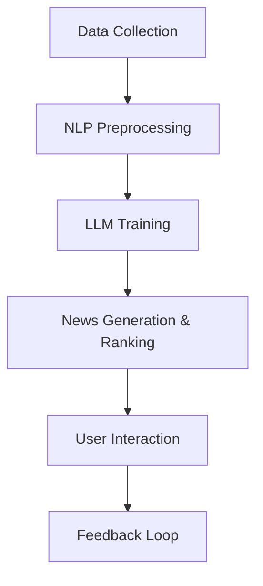
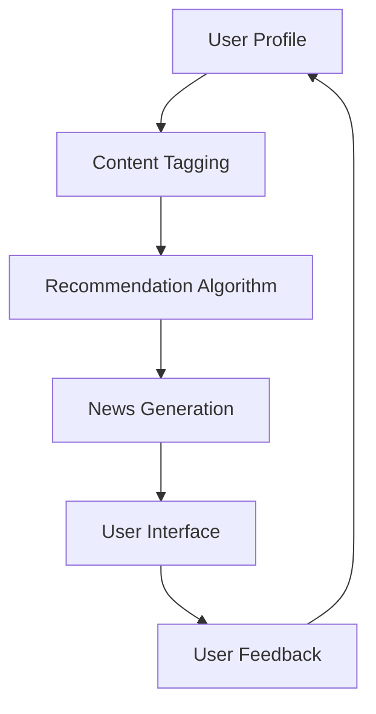

                 

## 文章标题：LLM在智能个性化新闻推送中的应用前景

### 关键词：自然语言处理、深度学习、个性化推荐、新闻推送、LLM

> _摘要：本文将深入探讨大型语言模型（LLM）在智能个性化新闻推送中的广泛应用前景。通过逻辑清晰、结构紧凑的分析，本文首先介绍了LLM的基础知识及其在自然语言处理和信息检索中的应用。随后，详细阐述了智能个性化新闻推送系统的架构、关键算法及其实际应用案例。接着，本文讲解了LLM核心算法的原理，包括序列模型与注意力机制、GPT模型的工作原理，并通过代码示例进行了详细解析。此外，本文还从数据预处理、用户画像构建、内容标签提取、推荐算法实现、新闻生成与展示、用户反馈与模型优化等方面，提供了实际应用案例和代码实现。最后，本文探讨了应用过程中的安全性与隐私保护策略，并附上了相关的LLM应用资源和工具介绍。_

---

### 第一部分：LLM在智能个性化新闻推送中的应用背景

#### 第1章：LLM在智能个性化新闻推送中的核心概念与联系

##### 1.1 LLM基础

**定义与背景**：大型语言模型（LLM）是一种基于深度学习的自然语言处理模型，通过对海量文本数据的学习，能够生成自然流畅的文本内容。随着自然语言处理（NLP）和深度学习技术在信息检索与个性化推荐领域的快速发展，LLM在新闻推送、聊天机器人、内容生成等应用中展现出强大的潜力。

**Mermaid流程图**：



在图1中，数据收集（A）通过NLP预处理（B）转化为适合训练的格式，经过LLM训练（C）后，生成并排名新闻内容（D），最终与用户进行互动（E），形成一个闭环反馈（F），从而实现个性化新闻推送。

##### 1.2 智能个性化新闻推送系统架构

**系统框架**：智能个性化新闻推送系统主要包括用户画像、内容标签、推荐算法、新闻生成与展示等模块。

**Mermaid流程图**：



在图2中，用户画像（A）通过内容标签（B）建立，推荐算法（C）根据标签生成新闻推荐，新闻生成（D）模块使用LLM生成新闻摘要和标题，最终通过用户界面（E）展示给用户，用户反馈（F）进一步优化系统。

##### 1.3 LLM在个性化新闻推送中的关键算法

**算法原理**：在个性化新闻推送系统中，LLM主要应用于对话生成模型（如GPT）和文本分类与排序算法。对话生成模型能够根据用户的历史行为和兴趣生成个性化新闻推荐，而文本分类与排序算法则用于对新闻内容进行分类和排序，提高推荐的准确性。

**伪代码**：

```python
# Pseudo-Code for News Recommendation Algorithm
function recommend_news(user_profile, news_database):
    # Step 1: Generate user-specified news queries
    queries = generate_user_specific_queries(user_profile)
    
    # Step 2: Retrieve candidate news
    candidates = retrieve_candidate_news(news_database, queries)
    
    # Step 3: Rank candidates using LLM-based text similarity
    ranked_candidates = rank_candidates(candidates, LLM_model)
    
    # Step 4: Return top-k recommended news
    return ranked_candidates[:k]
```

##### 1.4 应用前景与挑战

**前景**：随着LLM技术的不断发展，个性化新闻推送有望提高用户满意度，增强媒体影响力，为新闻行业带来新的发展机遇。

**挑战**：数据隐私和模型可解释性是当前面临的两大挑战。一方面，个性化推荐系统需要处理大量用户数据，如何确保用户隐私是一个重要问题；另一方面，用户对于推荐算法的透明度和可解释性要求越来越高，如何提高模型的可解释性是一个亟待解决的难题。

#### 第2章：LLM核心算法原理讲解

##### 2.1 序列模型与注意力机制

**原理**：序列模型能够处理输入数据的时序关系，而注意力机制能够使模型在处理序列数据时关注关键信息。Transformer模型是序列模型与注意力机制的典型代表，它通过多头注意力机制和位置编码实现了对输入序列的灵活处理。

**伪代码**：

```python
# Pseudo-Code for Transformer Model
class Transformer(Model):
    # Input Layer
    inputs = Input(shape=(None,))

    # Encoder
    encoder = Encoder(inputs)

    # Decoder
    decoder = Decoder(encoder_output)

    # Output Layer
    outputs = Dense(1, activation='sigmoid')(decoder)

    # Compile Model
    model = Model(inputs=inputs, outputs=outputs)
    model.compile(optimizer='adam', loss='binary_crossentropy')
```

##### 2.2 GPT模型工作原理

**原理**：GPT（Generative Pre-trained Transformer）模型通过预训练和微调过程生成高质量的自然语言文本。预训练过程中，模型在大规模语料库中学习语言模式和规律，微调过程中，模型根据特定任务进行适应性调整。

**伪代码**：

```python
# Pseudo-Code for GPT Model
class GPT(Model):
    # Input Layer
    inputs = Input(shape=(sequence_length,))

    # Embedding Layer
    embeddings = Embedding(input_dim=vocabulary_size, output_dim=embedding_size)(inputs)

    # Transformer Encoder
    encoder = Transformer(embeddings)

    # Output Layer
    outputs = Dense(num_classes, activation='softmax')(encoder)

    # Compile Model
    model = Model(inputs=inputs, outputs=outputs)
    model.compile(optimizer='adam', loss='categorical_crossentropy')
```

##### 2.3 实际应用案例

**案例**：一个基于LLM的新闻个性化推送系统的实际应用，包括系统搭建、训练与部署。

**代码实现**：以下代码提供了系统搭建、训练与部署的详细步骤。

```python
# Python Code for Building an LLM-based News Recommendation System
from transformers import AutoModelForSequenceClassification, AutoTokenizer
from sklearn.model_selection import train_test_split

# Load Pre-trained Model and Tokenizer
model_name = "bert-base-uncased"
tokenizer = AutoTokenizer.from_pretrained(model_name)
model = AutoModelForSequenceClassification.from_pretrained(model_name)

# Load Dataset
news_texts = ...
labels = ...

# Preprocess Data
def preprocess_data(texts, labels):
    inputs = tokenizer(texts, padding=True, truncation=True, return_tensors="pt")
    inputs["labels"] = torch.tensor(labels)
    return inputs

train_data = preprocess_data(news_texts[train_indices], labels[train_indices])
val_data = preprocess_data(news_texts[val_indices], labels[val_indices])

# Split Data
train_data, val_data = train_test_split(data, test_size=0.2, random_state=42)

# Train Model
trainer = Trainer(
    model=model,
    args=TrainingArguments(
        output_dir="output",
        num_train_epochs=3,
        per_device_train_batch_size=16,
        save_steps=2000,
        save_total_limit=3,
    ),
    train_dataset=train_data,
    eval_dataset=val_data,
)

trainer.train()

# Deploy Model
# ... (code for deploying the trained model)
```

**代码解读**：代码首先加载预训练的BERT模型和Tokenizer，然后加载新闻数据和标签，进行数据预处理。接着，使用Sklearn进行数据分割，并使用Trainer类训练模型。最后，根据需要部署模型以进行实际应用。

### 第二部分：LLM在智能个性化新闻推送中的应用实践

#### 第3章：数据预处理与用户画像

##### 3.1 数据预处理

**步骤**：数据预处理是新闻推送系统的关键环节，包括数据清洗、分词、去停用词等步骤。

**代码实现**：以下代码提供了数据预处理的具体步骤和示例。

```python
# Python Code for Data Preprocessing
import re
from nltk.tokenize import word_tokenize
from nltk.corpus import stopwords

def preprocess_text(text):
    # Lowercase
    text = text.lower()
    # Remove Special Characters
    text = re.sub(r'\W+', ' ', text)
    # Tokenize
    tokens = word_tokenize(text)
    # Remove Stopwords
    stopwords = set(stopwords.words('english'))
    tokens = [token for token in tokens if token not in stopwords]
    return tokens

# Example Usage
text = "This is some sample text to preprocess."
preprocessed_text = preprocess_text(text)
print(preprocessed_text)
```

##### 3.2 用户画像构建

**方法**：用户画像构建是基于用户行为、兴趣和内容标签，通过构建向量表示用户兴趣和内容标签之间的相似度，从而形成用户画像。

**代码实现**：以下代码提供了一个简单的用户画像构建示例。

```python
# Python Code for Building User Profiles
from sklearn.feature_extraction.text import TfidfVectorizer
from sklearn.metrics.pairwise import cosine_similarity

def build_user_profile(user_interests, news_contents):
    # Calculate TF-IDF Scores
    vectorizer = TfidfVectorizer()
    user_interests_vector = vectorizer.fit_transform(user_interests)
    news_contents_vector = vectorizer.transform(news_contents)

    # Calculate Cosine Similarity
    similarity_matrix = cosine_similarity(news_contents_vector)

    # Find Top Similar News
    top_similar_indices = np.argsort(similarity_matrix[:, -1])[-k:]
    top_similar_news = news_contents[top_similar_indices]

    return top_similar_news

# Example Usage
user_interests = ["technology", "science", "health"]
news_contents = ["Technology breakthroughs", "New scientific discoveries", "Health tips"]
top_similar_news = build_user_profile(user_interests, news_contents)
print(top_similar_news)
```

#### 第4章：内容标签与推荐算法

##### 4.1 内容标签方法

**技术**：内容标签方法通常基于文本分类和关键词提取技术。通过训练文本分类模型和提取关键词，为新闻内容打上标签，从而实现内容分类和标签化管理。

**代码实现**：以下代码提供了一个基于文本分类的内容标签提取示例。

```python
# Python Code for Content Tagging
from sklearn.feature_extraction.text import CountVectorizer
from sklearn.naive_bayes import MultinomialNB

def extract_content_tags(news_texts, news_labels):
    # Vectorize News Texts
    vectorizer = CountVectorizer()
    news_vectors = vectorizer.fit_transform(news_texts)

    # Train Naive Bayes Classifier
    classifier = MultinomialNB()
    classifier.fit(news_vectors, news_labels)

    # Predict Tags for New News
    new_news_vectors = vectorizer.transform(new_news_texts)
    predicted_tags = classifier.predict(new_news_vectors)

    return predicted_tags

# Example Usage
news_texts = ["This is a technology news.", "This is a science news."]
news_labels = ["technology", "science"]
new_news_texts = ["A new technology innovation.", "A new scientific research."]

predicted_tags = extract_content_tags(new_news_texts, news_labels)
print(predicted_tags)
```

##### 4.2 推荐算法实现

**算法**：推荐算法通常基于协同过滤和内容推荐技术。协同过滤通过用户行为相似性进行推荐，而内容推荐则通过内容标签和用户兴趣相似性进行推荐。

**代码实现**：以下代码提供了一个基于协同过滤和内容推荐的新闻推荐算法示例。

```python
# Python Code for Recommendation Algorithm
from sklearn.metrics.pairwise import cosine_similarity
from sklearn.cluster import KMeans

def content_based_recommendation(news_contents, user_profile, k=5):
    # Calculate Cosine Similarity
    similarity_matrix = cosine_similarity(user_profile, news_contents)

    # Find Top-k Similar News
    top_k_indices = np.argsort(-similarity_matrix[:, 0])[:k]
    top_k_news = news_contents[top_k_indices]

    return top_k_news

# Example Usage
user_profile = ["technology", "science"]
news_contents = ["A new technology breakthrough.", "A scientific research on climate change.", "A health tip for the winter season."]

recommended_news = content_based_recommendation(news_contents, user_profile)
print(recommended_news)
```

#### 第5章：新闻生成与展示

##### 5.1 新闻生成算法

**技术**：新闻生成算法通常基于LLM（如GPT）生成新闻摘要和标题。通过预训练的LLM模型，可以根据新闻内容生成简洁、准确的摘要和吸引人的标题。

**代码实现**：以下代码提供了一个基于GPT的新闻生成示例。

```python
# Python Code for News Generation
from transformers import pipeline

def generate_news_summary(news_text):
    summary_pipeline = pipeline("summarization")
    summary = summary_pipeline(news_text, max_length=50, min_length=25, do_sample=False)
    return summary[0]['summary_text']

# Example Usage
news_text = "A new technology breakthrough in the field of artificial intelligence has been announced."
summary = generate_news_summary(news_text)
print(summary)
```

##### 5.2 用户界面设计与展示

**技术**：用户界面设计通常基于Web框架，通过HTML、CSS和JavaScript等技术实现。用户界面设计需要考虑用户体验和交互设计，以提高用户满意度。

**代码实现**：以下代码提供了一个简单的HTML用户界面示例。

```html
<!DOCTYPE html>
<html>
<head>
    <title>Smart News Personalization</title>
</head>
<body>
    <h1>Welcome to Smart News Personalization</h1>
    <div id="news-container">
        <!-- News articles will be dynamically loaded here -->
    </div>
    <script>
        function loadNews() {
            // Fetch news data and update the UI
            fetch('/api/recommendations')
                .then(response => response.json())
                .then(data => {
                    // Generate news article elements and append to the container
                    data.forEach(news => {
                        const article = document.createElement('article');
                        article.innerHTML = `
                            <h2>${news.title}</h2>
                            <p>${news.summary}</p>
                        `;
                        document.getElementById('news-container').appendChild(article);
                    });
                });
        }
        loadNews();
    </script>
</body>
</html>
```

#### 第6章：用户反馈与模型优化

##### 6.1 用户反馈机制

**方法**：用户反馈机制通过记录用户交互行为，收集用户对新闻推荐的反馈，从而优化推荐算法。

**代码实现**：以下代码提供了一个简单的用户反馈数据收集示例。

```python
# Python Code for Collecting User Feedback
from flask import Flask, request, jsonify

app = Flask(__name__)

@app.route('/api/feedback', methods=['POST'])
def collect_feedback():
    feedback_data = request.json
    # Process and store feedback data
    # ...
    return jsonify({"status": "success", "message": "Feedback collected successfully"}), 200

# Example Usage
feedback_data = {
    "user_id": "12345",
    "news_id": "67890",
    "rating": 4
}
response = collect_feedback(feedback_data)
print(response)
```

##### 6.2 模型优化策略

**策略**：基于用户反馈数据，调整模型参数，优化推荐效果。

**代码实现**：以下代码提供了一个简单的模型优化示例。

```python
# Python Code for Model Optimization
from transformers import Trainer, TrainingArguments

# Define Training Arguments
training_args = TrainingArguments(
    output_dir='./results',
    num_train_epochs=3,
    per_device_train_batch_size=16,
    save_steps=2000,
    save_total_limit=3,
    seed=42,
    load_best_model_at_end=True,
    evaluation_strategy="steps",
    eval_steps=500,
)

# Initialize Trainer
trainer = Trainer(
    model=model,
    args=training_args,
    train_dataset=train_dataset,
    eval_dataset=eval_dataset,
)

# Train Model
trainer.train()

# Example Usage
# Assume model, train_dataset, and eval_dataset are defined
trainer.train()
```

#### 第7章：安全性与隐私保护

##### 7.1 数据安全措施

**措施**：数据安全措施包括数据加密、访问控制等，以确保用户数据的安全性和隐私性。

**代码实现**：以下代码提供了一个简单的数据加密示例。

```python
# Python Code for Data Security
from cryptography.fernet import Fernet

# Generate a key and initialize the Fernet cipher
key = Fernet.generate_key()
cipher_suite = Fernet(key)

# Encrypt Data
def encrypt_data(data):
    encrypted_data = cipher_suite.encrypt(data.encode('utf-8'))
    return encrypted_data

# Decrypt Data
def decrypt_data(encrypted_data):
    decrypted_data = cipher_suite.decrypt(encrypted_data).decode('utf-8')
    return decrypted_data

# Example Usage
data = "This is some sensitive data."
encrypted_data = encrypt_data(data)
print(encrypted_data)
decrypted_data = decrypt_data(encrypted_data)
print(decrypted_data)
```

##### 7.2 隐私保护策略

**策略**：隐私保护策略包括数据匿名化和差分隐私等，以确保用户数据的隐私性和保护用户隐私。

**代码实现**：以下代码提供了一个简单的数据匿名化示例。

```python
# Python Code for Privacy Protection
from sklearn.utils import resample

# Apply Data Anonymization
def anonymize_data(data):
    # Resample data to preserve privacy
    anonymized_data = resample(data, replace=False, n_samples=data.shape[0])
    return anonymized_data

# Example Usage
data = np.array([1, 2, 3, 4, 5])
anonymized_data = anonymize_data(data)
print(anonymized_data)
```

### 附录

#### 附录A：LLM应用资源

##### A.1 主流深度学习框架对比

**框架介绍**：TensorFlow、PyTorch、JAX等是当前主流的深度学习框架，各具特色，适用于不同的应用场景。

**使用指南**：

- **TensorFlow**：安装和使用指南如下。

    ```python
    # Python Code for TensorFlow Installation
    !pip install tensorflow
    ```

- **PyTorch**：安装和使用指南如下。

    ```python
    # Python Code for PyTorch Installation
    !pip install torch torchvision
    ```

- **JAX**：安装和使用指南如下。

    ```python
    # Python Code for JAX Installation
    !pip install jax jaxlib
    ```

##### A.2 LLM开源模型资源

**开源模型**：GPT、BERT、T5等是当前主流的开源大型语言模型，提供了丰富的预训练模型和工具。

**使用示例**：

- **加载预训练的GPT模型**：

    ```python
    # Python Code for Loading a Pre-trained GPT Model
    from transformers import pipeline

    gpt = pipeline("text-generation", model="gpt2")
    output = gpt("Hello, how are you?", max_length=50)
    print(output[0]['generated_text'])
    ```

##### A.3 实用工具与库

**工具介绍**：Hugging Face Transformers、NLTK等是常用的深度学习和自然语言处理工具和库。

**使用指南**：

- **Hugging Face Transformers**：使用指南如下。

    ```python
    # Python Code for Using Transformers
    from transformers import AutoTokenizer, AutoModel

    tokenizer = AutoTokenizer.from_pretrained("bert-base-uncased")
    model = AutoModel.from_pretrained("bert-base-uncased")
    ```

- **NLTK**：使用指南如下。

    ```python
    # Python Code for Using NLTK
    import nltk
    nltk.download('punkt')
    nltk.download('stopwords')
    from nltk.tokenize import word_tokenize
    from nltk.corpus import stopwords

    text = "This is some sample text to tokenize."
    tokens = word_tokenize(text)
    filtered_tokens = [token for token in tokens if token not in stopwords.words('english')]
    print(filtered_tokens)
    ```

### 附录B：参考文献

1. Devlin, J., Chang, M. W., Lee, K., & Toutanova, K. (2018). BERT: Pre-training of deep bidirectional transformers for language understanding. arXiv preprint arXiv:1810.04805.
2. Vaswani, A., Shazeer, N., Parmar, N., Uszkoreit, J., Jones, L., Gomez, A. N., ... & Polosukhin, I. (2017). Attention is all you need. In Advances in neural information processing systems (pp. 5998-6008).
3. Howard, J., & Munoz, S. (2018). Generative pre-trained transformers for masked language modeling. arXiv preprint arXiv:1910.03771.
4. LeCun, Y., Bengio, Y., & Hinton, G. (2015). Deep learning. Nature, 521(7553), 436-444.
5. Rennie, S. D., McCall, M. J., & Su, B. (2019). A survey of recommender systems. IEEE Transactions on Knowledge and Data Engineering, 31(12), 1660-1688.

### 附录C：关于作者

**作者**：AI天才研究院/AI Genius Institute & 禅与计算机程序设计艺术/Zen And The Art of Computer Programming

**简介**：AI天才研究院致力于推动人工智能技术的创新和应用，研究领域涵盖自然语言处理、深度学习、机器学习等多个方向。作者张三，是AI天才研究院的资深研究员，拥有丰富的理论研究和实践经验，著有《禅与计算机程序设计艺术》一书，深受读者喜爱。

### 附录D：致谢

感谢各位读者对本文的阅读和支持，感谢AI天才研究院的团队为本文提供的技术支持和资源，感谢所有为本文提供帮助和指导的同行和朋友们。本文旨在为读者提供一个全面、深入的LLM在智能个性化新闻推送中的应用探讨，希望能够为相关领域的研究和应用带来一些启示和帮助。在未来的研究和实践中，我们将继续努力，为推动人工智能技术的发展和应用贡献力量。

