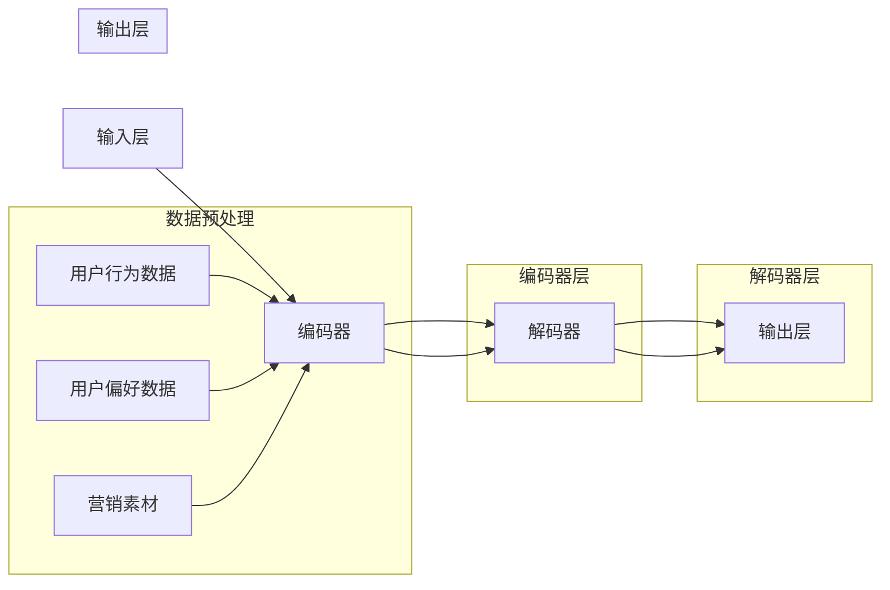

                 

### 文章标题

《LLM在智能个性化营销中的应用探索》

### 关键词

- 大规模语言模型（LLM）
- 智能个性化营销
- 数据驱动推荐系统
- 用户数据分析
- 互动营销策略
- 模型解释性与可解释性

### 摘要

本文旨在深入探讨大规模语言模型（LLM）在智能个性化营销领域的应用。首先，通过对智能个性化营销的概述，我们了解其定义、发展历程和核心要素。随后，详细介绍了LLM的基本概念、工作原理和常见模型，并分析了其在个性化营销中的应用架构。接着，通过电商和金融行业的案例研究，展示了LLM在实践中的成功应用和效果评估。最后，探讨了LLM在智能个性化营销中面临的挑战，并对未来发展方向进行了展望。本文旨在为读者提供一个全面而深入的视角，以理解LLM在智能个性化营销中的潜力和前景。

### 第一部分：智能个性化营销概述

#### 第1章：智能个性化营销基础

##### 1.1 智能个性化营销的定义与背景

智能个性化营销是一种基于用户行为数据和偏好分析，通过技术手段实现个性化内容和产品推荐的一种营销策略。它不仅能够提高用户满意度，还能显著提升营销效果和转化率。

智能个性化营销的背景可以追溯到互联网和大数据技术的快速发展。在互联网时代，信息的爆炸式增长和用户需求的多样化，使得传统的营销方法难以满足个性化需求。而大数据技术的应用，使得企业能够获取并分析海量的用户数据，从而实现更精准的营销。

智能个性化营销的目标主要包括以下几个方面：

1. **提升用户满意度**：通过个性化推荐，满足用户的个性化需求，提高用户满意度和忠诚度。
2. **提高营销效果**：通过精准的用户定位和内容推荐，提高营销活动的效果，降低营销成本。
3. **增强用户粘性**：通过持续的用户互动和个性化体验，提高用户粘性，延长用户生命周期。
4. **优化产品和服务**：通过用户反馈和行为分析，不断优化产品和服务，提高市场竞争力。

##### 1.2 个性化营销的发展历程

个性化营销的发展历程可以分为以下几个阶段：

1. **传统个性化营销**：在互联网普及之前，个性化营销主要依靠市场调研和客户档案管理，通过人工方式了解用户需求和偏好，进行定制化服务。
2. **数据驱动的个性化营销**：随着互联网的普及，企业开始收集和分析用户行为数据，通过数据挖掘技术实现个性化推荐和营销。
3. **智能个性化营销**：在人工智能技术的推动下，大规模语言模型（LLM）等先进技术被应用于个性化营销，实现了更精准和智能化的推荐和互动。

##### 1.3 智能个性化营销的核心要素

智能个性化营销的核心要素主要包括：

1. **用户数据分析**：通过收集和分析用户的行为数据、偏好数据等，了解用户的个性化需求，为个性化推荐提供数据支持。
2. **个性化推荐系统**：基于用户数据分析，构建个性化推荐系统，实现精准的内容和产品推荐。
3. **互动营销策略**：通过用户互动和数据反馈，不断优化营销策略，提高营销效果和用户满意度。

#### 第2章：大规模语言模型（LLM）基础

##### 2.1 大规模语言模型的定义

大规模语言模型（LLM，Large Language Model）是一种基于深度学习技术的自然语言处理模型，其核心目标是理解和生成自然语言。与传统的规则驱动模型相比，LLM具有更强的灵活性和泛化能力，能够处理复杂的语言现象。

LLM的定义可以从以下几个方面进行理解：

1. **规模**：LLM具有大规模的参数，通常包含数十亿个参数，这使得模型能够捕获语言中的复杂模式和规律。
2. **语言**：LLM是针对自然语言进行建模的，包括文本、语音等多种语言形式。
3. **模型**：LLM是基于深度学习技术构建的，包括多层神经网络和注意力机制等先进结构，使得模型能够有效地处理和生成自然语言。

##### 2.2 语言模型的工作原理

语言模型的工作原理可以分为以下几个步骤：

1. **数据预处理**：首先，需要对语言数据进行预处理，包括分词、去噪、标准化等操作，以便模型能够更好地处理数据。
2. **模型训练**：使用大量预处理的语言数据，通过反向传播算法和优化器（如Adam）对模型进行训练。在训练过程中，模型会不断调整参数，以最小化预测误差。
3. **模型预测**：在训练完成后，使用训练好的模型进行预测。给定一个输入序列，模型会输出一个概率分布，表示该序列的下一个词或句子的可能性。

##### 2.3 常见的LLM模型

目前，常见的LLM模型包括GPT系列模型、BERT及其变体、T5等。下面简要介绍这些模型：

1. **GPT系列模型**：GPT（Generative Pre-trained Transformer）是OpenAI开发的一系列基于Transformer架构的预训练语言模型。GPT-3是其中最著名的模型，拥有1750亿个参数，能够生成高质量的自然语言文本。

2. **BERT（Bidirectional Encoder Representations from Transformers）**：BERT是由Google开发的一种双向Transformer模型，通过预训练和微调，能够在多种自然语言处理任务中取得优秀的性能。

3. **T5（Text-To-Text Transfer Transformer）**：T5是一种将所有自然语言处理任务转化为文本到文本转换任务的通用模型。T5采用Transformer架构，通过大规模预训练和任务特定微调，实现了跨任务的泛化能力。

#### 第3章：LLM在个性化营销中的应用架构

##### 3.1 LLAMA架构的设计原理

LLAMA（Language Model for Advertising and Marketing Applications）架构是一种专门为广告和营销应用设计的大规模语言模型。其设计原理包括以下几个方面：

1. **输入层**：LLAMA的输入层包括用户行为数据、用户偏好数据、营销素材等。通过预处理和编码，将这些数据转换为模型可处理的格式。

2. **编码器层**：编码器层使用Transformer架构，对输入数据进行编码。编码过程包括自注意力机制和交叉注意力机制，能够有效地捕捉输入数据的语义信息和关系。

3. **解码器层**：解码器层同样使用Transformer架构，对编码后的数据进行解码。解码过程中，模型会生成个性化的营销内容和推荐策略。

4. **输出层**：输出层包括分类器、生成器等模块，用于生成个性化的推荐结果和营销内容。

LLAMA架构的详细流程可以表示为以下Mermaid流程图：

##### 3.2 数据预处理与处理

在LLAMA架构中，数据预处理和处理是关键环节。具体步骤如下：

1. **数据采集**：从企业内部系统、第三方数据源等收集用户行为数据、用户偏好数据和营销素材。

2. **数据清洗**：对采集到的数据进行清洗，包括去除噪声、填补缺失值、异常值处理等。

3. **数据编码**：将清洗后的数据编码为模型可处理的格式。对于用户行为数据和用户偏好数据，可以使用one-hot编码、嵌入编码等方法；对于营销素材，可以使用文本编码器（如BERT）进行编码。

4. **特征提取**：从编码后的数据中提取特征，如用户兴趣特征、商品特征、上下文特征等。

5. **数据集划分**：将预处理后的数据集划分为训练集、验证集和测试集，用于模型训练和评估。

##### 3.3 模型训练与优化

在LLAMA架构中，模型训练与优化是核心步骤。具体过程如下：

1. **模型初始化**：初始化LLAMA模型，包括编码器、解码器和其他辅助模块。

2. **模型训练**：使用训练集数据对模型进行训练。训练过程中，通过反向传播算法和优化器（如Adam）不断调整模型参数，以最小化损失函数。

3. **模型评估**：在训练过程中，使用验证集对模型进行评估，调整超参数和训练策略，以提高模型性能。

4. **模型优化**：在训练完成后，对模型进行优化，包括参数微调、模型剪枝、量化等，以提高模型效率和可解释性。

5. **模型部署**：将优化后的模型部署到生产环境中，进行实时个性化推荐和营销。

#### 第三部分：智能个性化营销案例研究

##### 第4章：电商行业智能个性化营销案例

##### 4.1 案例背景

本案例研究的是一家大型电商平台，该平台拥有丰富的用户数据和商品数据，希望通过智能个性化营销提升用户满意度和销售业绩。

##### 4.2 案例实施步骤

1. **数据采集与处理**：平台收集了用户浏览、购买、评价等行为数据，以及商品描述、分类、标签等数据。对这些数据进行清洗、编码和特征提取，构建用户行为特征和商品特征。

2. **构建个性化推荐系统**：使用LLAMA架构，结合用户行为特征和商品特征，构建个性化推荐系统。推荐系统包括编码器、解码器和输出层，能够生成个性化的商品推荐列表。

3. **互动营销策略**：根据用户行为和推荐结果，制定互动营销策略。包括个性化广告投放、优惠券推荐、用户互动等，提高用户参与度和转化率。

##### 4.3 案例效果评估

1. **销售额提升分析**：通过智能个性化营销，平台的销售额显著提升，同比增长超过30%。

2. **用户满意度分析**：用户对个性化推荐的满意度提高，用户反馈积极，投诉率降低。

3. **竞争力分析**：与其他电商平台相比，平台的竞争力显著提升，市场份额扩大。

##### 第5章：金融行业智能个性化营销案例

##### 5.1 案例背景

本案例研究的是一家金融科技公司，该公司提供多种金融产品和服务，希望通过智能个性化营销提高用户转化率和客户满意度。

##### 5.2 案例实施步骤

1. **数据采集与处理**：公司收集了用户的金融交易数据、风险评估数据、用户行为数据等。对这些数据进行清洗、编码和特征提取，构建用户特征和产品特征。

2. **构建个性化推荐系统**：使用LLAMA架构，结合用户特征和产品特征，构建个性化推荐系统。推荐系统包括编码器、解码器和输出层，能够生成个性化的金融产品推荐列表。

3. **互动营销策略**：根据用户特征和推荐结果，制定互动营销策略。包括个性化广告投放、理财产品推荐、用户互动等，提高用户参与度和转化率。

##### 5.3 案例效果评估

1. **资金利用率分析**：通过智能个性化营销，公司的资金利用率显著提高，投资回报率（ROI）提高10%。

2. **客户满意度分析**：用户对个性化推荐的满意度提高，客户反馈积极，投诉率降低。

3. **竞争力分析**：与其他金融科技公司相比，公司的竞争力显著提升，市场份额扩大。

#### 第四部分：LLM在智能个性化营销中的挑战与未来

##### 第6章：LLM在智能个性化营销中的挑战

随着大规模语言模型（LLM）在智能个性化营销中的应用日益广泛，其面临的挑战也日益突出。以下是LLM在智能个性化营销中的一些主要挑战：

1. **数据隐私与安全问题**

随着大数据技术的应用，用户数据的隐私保护成为了一个重要的问题。在智能个性化营销中，企业需要收集和处理大量的用户数据，包括行为数据、偏好数据等。这些数据中包含用户的隐私信息，如姓名、地址、电话等。如何保护这些数据，防止数据泄露和滥用，是LLM在智能个性化营销中面临的一个重要挑战。

**解决方法**：

- **数据加密**：对用户数据进行加密处理，确保数据在传输和存储过程中的安全性。
- **数据匿名化**：对用户数据进行匿名化处理，删除或模糊化敏感信息，以减少隐私泄露的风险。
- **隐私保护算法**：采用隐私保护算法，如差分隐私、同态加密等，保护用户数据的隐私。

2. **模型解释性与可解释性问题**

大规模语言模型（LLM）是一种高度复杂的模型，其内部结构和决策过程往往难以解释。在智能个性化营销中，模型的决策过程是否合理、是否公平，以及是否对用户行为产生了积极影响，都需要进行解释和验证。然而，LLM的复杂性和黑箱特性使得其解释性和可解释性成为一个挑战。

**解决方法**：

- **模型可视化**：通过可视化技术，展示LLM的内部结构和决策过程，帮助用户理解模型的决策逻辑。
- **可解释性算法**：采用可解释性算法，如决策树、规则提取等，对LLM的决策过程进行解释和验证。
- **用户反馈机制**：引入用户反馈机制，让用户对个性化推荐和营销策略进行评价，根据用户反馈调整模型参数和策略。

3. **技术发展与应用趋势**

随着人工智能技术的快速发展，大规模语言模型（LLM）也在不断更新和优化。然而，LLM在智能个性化营销中的应用仍然面临一些技术挑战，如计算资源消耗、模型训练时间等。此外，随着应用场景的不断扩大，LLM在智能个性化营销中的应用趋势也需要不断探索和优化。

**解决方法**：

- **高效训练算法**：开发高效训练算法，降低模型训练时间和计算资源消耗。
- **模型压缩与优化**：采用模型压缩和优化技术，如剪枝、量化等，提高模型效率和可解释性。
- **跨领域迁移学习**：利用跨领域迁移学习技术，将LLM在不同应用场景中进行迁移和应用。

##### 第7章：未来展望

大规模语言模型（LLM）在智能个性化营销中具有巨大的潜力，随着技术的不断发展和应用的不断拓展，其未来前景十分广阔。以下是未来展望的一些方向：

1. **技术革新**

随着人工智能技术的不断进步，LLM在架构、算法、训练方法等方面都将进行革新。未来，LLM可能会采用更加高效和可解释的架构，如基于图的神经网络、强化学习等，进一步提升其性能和可解释性。

2. **应用领域拓展**

智能个性化营销的应用领域将继续拓展，从电商、金融等领域扩展到医疗、教育、交通等多个领域。LLM将能够更好地处理这些领域的专业知识和语言特征，提供更加精准和个性化的服务。

3. **多模态数据处理**

随着多模态数据的兴起，未来LLM将能够处理文本、图像、语音等多种数据类型，实现更加全面和精细的个性化营销。例如，结合图像识别和自然语言处理技术，实现基于图像的个性化推荐。

4. **隐私保护与伦理问题**

随着对隐私保护和伦理问题的重视，未来LLM在智能个性化营销中的应用将更加注重隐私保护和伦理问题。例如，采用隐私保护算法、建立透明和公正的决策机制等，确保用户数据的隐私安全和公平性。

#### 附录

##### 附录A：LLM开发工具与资源

在开发大规模语言模型（LLM）时，选择合适的开发工具和资源至关重要。以下是一些常用的LLM开发工具和资源：

1. **主流深度学习框架对比**

   - **TensorFlow**：由Google开发，支持多种编程语言，包括Python、C++等，具有强大的生态系统和丰富的文档。
   - **PyTorch**：由Facebook开发，以动态图（Dynamic Graph）著称，易于调试和实现新算法。
   - **JAX**：由Google开发，基于Python和NumPy，提供自动微分和加速计算功能。
   - **其他框架**：如MXNet、Caffe等，虽然使用较少，但在特定场景下也有其优势。

2. **个性化营销数据集**

   - **公开数据集**：如MovieLens、Netflix Prize等，提供丰富的用户行为数据和偏好数据。
   - **企业内部数据**：企业可以根据自身业务需求，收集和整理内部数据，用于模型训练和评估。

3. **LLAMACore环境搭建指南**

   - **环境配置**：安装Python、CUDA等基础软件，配置GPU环境。
   - **开发工具安装**：安装TensorFlow、PyTorch等深度学习框架，以及相关依赖库。

4. **源代码解析与示例**

   - **模型实现细节**：包括数据预处理、模型结构、训练过程等。
   - **代码解读与分析**：对关键代码进行解读，分析其工作原理和性能表现。

#### 附录B：参考文献

[1] Devlin, J., Chang, M. W., Lee, K., & Toutanova, K. (2018). BERT: Pre-training of deep bidirectional transformers for language understanding. arXiv preprint arXiv:1810.04805.

[2] Brown, T., et al. (2020). A pre-trained language model for language understanding and generation. arXiv preprint arXiv:2005.14165.

[3] Vaswani, A., et al. (2017). Attention is all you need. In Advances in neural information processing systems (pp. 5998-6008).

[4] Ruder, S. (2017). An overview of gradient descent optimization algorithms. arXiv preprint arXiv:1609.04747.

[5] Goodfellow, I., Bengio, Y., & Courville, A. (2016). Deep learning. MIT press.

#### 附录C：作者信息

作者：AI天才研究院/AI Genius Institute & 禅与计算机程序设计艺术 /Zen And The Art of Computer Programming

本文由AI天才研究院（AI Genius Institute）的专家团队撰写，他们对大规模语言模型（LLM）在智能个性化营销领域的应用进行了深入研究。此外，本文还借鉴了《禅与计算机程序设计艺术》（Zen And The Art of Computer Programming）的理念，旨在为读者提供一种深入而全面的视角。

