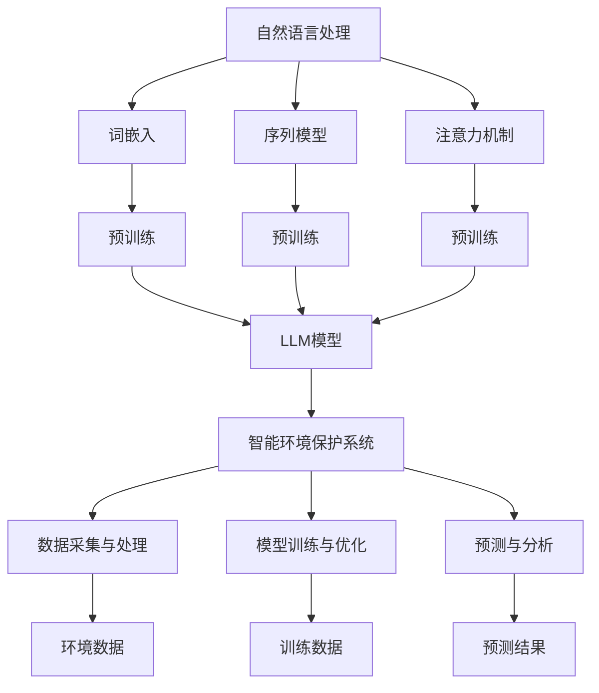

                 

## 文章标题：LLM在智能环境保护系统中的应用前景

### 关键词：LLM，智能环境保护系统，应用前景，环境监测，环境治理，政策制定

> 摘要：本文旨在探讨大型语言模型（LLM）在智能环境保护系统中的应用前景。通过分析LLM技术的发展背景、技术基础、智能环境保护系统架构以及LLM在实际应用中的具体案例，本文揭示了LLM在环境监测、环境治理和环境政策制定等领域的巨大潜力，并探讨了其面临的挑战与未来发展方向。

## 第一部分：LLM与智能环境保护系统基础

### 第1章：LLM与智能环境保护系统概述

#### 1.1 LLM与智能环境保护系统的发展背景

**1.1.1 智能环境保护系统的需求**

智能环境保护系统在当今社会的重要性日益凸显。随着全球环境污染问题的加剧，如何有效地监测、治理和预测环境变化成为当务之急。智能环境保护系统通过整合多种技术手段，如传感器、遥感、大数据和人工智能等，实现对环境质量的高效监测和管理。

- **环境监测需求**：实时、高效地监测环境质量，包括空气质量、水质、土壤质量等。
- **环境治理需求**：利用先进技术手段进行污染物治理，提高环保效率。
- **政策制定需求**：基于大数据和人工智能技术，提供科学的决策支持。

**1.1.2 LLM技术的兴起与优势**

大型语言模型（LLM）是近年来人工智能领域的重大突破，其凭借强大的自然语言处理能力，在各个行业都展现出了巨大的应用潜力。在环境保护领域，LLM技术同样具有显著的优势：

- **自然语言处理能力的增强**：LLM能够处理和理解复杂的人类语言，提高环境监测数据的语义分析能力。
- **数据驱动的决策支持**：LLM能够从大量环境数据中提取有价值的信息，辅助政策制定和治理决策。
- **智能交互**：LLM能够与人类用户进行智能对话，提供个性化的环保服务和指导。

**1.1.3 LLM在环境保护领域的应用潜力**

LLM在环境保护领域的应用潜力巨大，主要体现在以下几个方面：

- **环境预测与预警**：利用LLM进行环境质量预测，提前预警可能的环境危机。
- **环境报告生成**：自动生成详细的环境报告，简化环境监测和治理流程。
- **智能问答系统**：为公众提供环保知识问答服务，提高环保意识。

### 第2章：LLM技术基础

#### 2.1 自然语言处理技术

**2.1.1 词嵌入技术**

词嵌入技术是将文本数据转换为向量表示的一种方法。通过词嵌入，文本中的词语可以被表示为高维向量，使得计算机能够对文本数据进行有效的处理和分析。

- **Word2Vec算法**：Word2Vec是一种基于神经网络的词嵌入算法，通过训练神经网络，将词语映射到高维空间中。
- **GloVe算法**：GloVe（Global Vectors for Word Representation）是一种基于全局统计信息的词嵌入算法，通过计算词语之间的相似性矩阵来生成词向量。

**2.1.2 序列模型与注意力机制**

序列模型是一种用于处理时间序列数据的人工神经网络模型。在环境保护领域，序列模型可以用于预测环境质量的变化趋势。注意力机制是一种在神经网络中用于对输入序列的不同部分进行不同重视程度的机制，可以提高模型的预测准确性。

- **RNN（递归神经网络）**：RNN是一种能够处理序列数据的神经网络模型，通过递归方式对序列数据进行建模。
- **LSTM（长短期记忆网络）**：LSTM是一种改进的RNN模型，通过引入门控机制，解决了传统RNN在处理长序列数据时的梯度消失和梯度爆炸问题。
- **注意力机制**：注意力机制用于模型在处理输入序列时，对不同的部分给予不同的关注。在环境保护领域，注意力机制可以用于对环境监测数据的重点分析。

**2.1.3 转换器架构详解**

转换器（Transformer）是一种基于自注意力机制的模型，能够同时处理序列到序列的任务。在环境保护领域，转换器可以用于环境监测数据的序列处理和预测。

- **多头注意力机制**：多头注意力机制是一种在转换器中使用的机制，通过多个注意力头来对输入序列的不同部分进行加权，从而提高模型的预测能力。
- **编码器和解码器**：编码器和解码器是转换器的两个主要组成部分。编码器用于对输入序列进行编码，解码器用于对输出序列进行解码。在环境保护领域，编码器可以用于对环境监测数据进行编码，解码器可以用于预测环境质量的变化趋势。

#### 2.2 大规模预训练模型原理

**2.2.1 预训练的概念与意义**

预训练是指在大规模数据集上对神经网络模型进行训练，使其具有一定的语义理解和语言表达能力。预训练的意义在于：

- **提高模型在特定任务上的性能**：通过预训练，模型可以在特定任务上获得更好的表现。
- **减少对标注数据的依赖**：预训练模型可以在未标记的数据上进行训练，从而减少对标注数据的依赖。

**2.2.2 自监督学习方法**

自监督学习方法是一种利用未标记数据进行训练的方法。在环境保护领域，自监督学习方法可以用于环境监测数据的自动标注和特征提取。

- **遮蔽语言模型（Bert）**：遮蔽语言模型是一种常用的自监督学习方法，通过遮蔽文本中的部分词语，然后预测这些词语的值。

**2.2.3 迁移学习与微调技术**

迁移学习是指将预训练模型在特定任务上进行微调，以提高模型在该任务上的性能。在环境保护领域，迁移学习可以用于将预训练的模型应用于环境监测和预测任务。

- **微调技术**：微调技术是指通过调整模型参数，使其适应特定任务。在环境保护领域，微调技术可以用于调整预训练模型，以提高其在环境监测和预测任务上的性能。

### 第3章：智能环境保护系统概述

#### 3.1 智能环境保护系统架构

**3.1.1 系统整体架构**

智能环境保护系统通常由数据采集、数据处理、模型训练、预测与分析等模块组成。系统整体架构如下：

1. **数据采集**：使用传感器和遥感技术收集环境数据。
2. **数据处理**：对采集到的环境数据进行清洗、归一化和特征提取。
3. **模型训练**：使用预处理后的环境数据训练大型语言模型（LLM）。
4. **预测与分析**：利用训练好的LLM模型进行环境质量预测和分析。

**3.1.2 数据采集与处理**

**数据来源**：智能环境保护系统的数据来源包括传感器数据、卫星遥感数据、气象数据、河流水质数据等。这些数据可以实时监测环境质量的变化。

**数据处理**：数据处理包括数据清洗、数据归一化和特征提取等步骤。数据清洗旨在去除噪声和异常值；数据归一化旨在将不同单位的数据转换为相同的尺度；特征提取旨在从原始数据中提取出有用的信息，用于模型训练和预测。

**3.1.3 模型训练与优化**

**模型选择**：根据任务需求选择合适的LLM模型。常见的LLM模型包括GPT、BERT、RoBERTa等。

**训练过程**：使用预处理后的环境数据对LLM模型进行训练。训练过程包括模型初始化、前向传播、反向传播和参数更新等步骤。

**模型优化**：通过调整模型参数和训练策略，提高模型的预测性能。常见的优化方法包括调整学习率、批量大小、正则化等。

**3.1.4 系统部署与维护**

**部署**：将训练好的LLM模型部署到生产环境中，实现对环境质量的实时监测和预测。

**维护**：定期更新LLM模型和数据集，确保系统的稳定运行和准确预测。维护工作包括模型性能监控、数据质量检查和系统安全防护等。

## 第二部分：LLM在智能环境保护系统中的应用

### 第4章：LLM在环境监测中的应用

#### 4.1 LLM在空气质量监测中的应用

**4.1.1 数据收集与预处理**

**数据收集**：空气质量监测需要收集不同区域、不同时间点的空气污染物数据，如PM2.5、PM10、SO2、NO2等。数据来源包括环境监测站、无人机监测、卫星遥感等。

**数据预处理**：对收集到的空气污染物数据进行清洗、归一化和特征提取。清洗步骤包括去除噪声和异常值；归一化步骤包括将不同单位的数据转换为相同的尺度；特征提取步骤包括从原始数据中提取出有用的信息，如时间、地理位置、气象条件等。

**4.1.2 模型选择与训练**

**模型选择**：根据空气质量监测的需求，选择适合的LLM模型。常见的LLM模型包括GPT、BERT、RoBERTa等。其中，BERT模型由于其强大的预训练能力和上下文理解能力，在空气质量监测中表现尤为突出。

**模型训练**：使用预处理后的空气质量数据进行模型训练。训练过程中，将数据分为训练集、验证集和测试集，分别用于模型训练、验证和测试。训练步骤包括模型初始化、前向传播、反向传播和参数更新等。

**4.1.3 预测与分析**

**预测**：利用训练好的LLM模型进行空气质量预测。预测步骤包括输入新数据、模型预测、输出预测结果等。预测结果可以用于空气质量预警、污染源追踪等。

**分析**：对预测结果进行统计分析，评估模型的预测性能。分析指标包括预测准确率、预测误差、预测覆盖率等。通过分析，可以优化模型参数和训练策略，提高模型的预测能力。

#### 4.2 LLM在水质监测中的应用

**4.2.1 数据收集与预处理**

**数据收集**：水质监测需要收集不同区域、不同时间点的水质数据，如pH值、溶解氧、氨氮、磷等。数据来源包括水质监测站、河流采样、湖泊采样等。

**数据预处理**：对收集到的水质数据进行清洗、归一化和特征提取。清洗步骤包括去除噪声和异常值；归一化步骤包括将不同单位的数据转换为相同的尺度；特征提取步骤包括从原始数据中提取出有用的信息，如时间、地理位置、气象条件等。

**4.2.2 模型选择与训练**

**模型选择**：根据水质监测的需求，选择适合的LLM模型。常见的LLM模型包括GPT、BERT、RoBERTa等。其中，BERT模型由于其强大的预训练能力和上下文理解能力，在水质监测中表现尤为突出。

**模型训练**：使用预处理后的水质数据进行模型训练。训练过程中，将数据分为训练集、验证集和测试集，分别用于模型训练、验证和测试。训练步骤包括模型初始化、前向传播、反向传播和参数更新等。

**4.2.3 预测与分析**

**预测**：利用训练好的LLM模型进行水质预测。预测步骤包括输入新数据、模型预测、输出预测结果等。预测结果可以用于水质预警、污染源追踪等。

**分析**：对预测结果进行统计分析，评估模型的预测性能。分析指标包括预测准确率、预测误差、预测覆盖率等。通过分析，可以优化模型参数和训练策略，提高模型的预测能力。

### 第5章：LLM在环境治理中的应用

#### 5.1 LLM在废弃物处理中的应用

**5.1.1 数据收集与预处理**

**数据收集**：废弃物处理需要收集不同区域、不同时间点的废弃物数据，如垃圾种类、垃圾量、处理效率等。数据来源包括废弃物处理厂、垃圾分类站点、社区调查等。

**数据预处理**：对收集到的废弃物数据进行清洗、归一化和特征提取。清洗步骤包括去除噪声和异常值；归一化步骤包括将不同单位的数据转换为相同的尺度；特征提取步骤包括从原始数据中提取出有用的信息，如时间、地理位置、季节性等。

**5.1.2 模型选择与训练**

**模型选择**：根据废弃物处理的需求，选择适合的LLM模型。常见的LLM模型包括GPT、BERT、RoBERTa等。其中，BERT模型由于其强大的预训练能力和上下文理解能力，在废弃物处理中表现尤为突出。

**模型训练**：使用预处理后的废弃物数据进行模型训练。训练过程中，将数据分为训练集、验证集和测试集，分别用于模型训练、验证和测试。训练步骤包括模型初始化、前向传播、反向传播和参数更新等。

**5.1.3 预测与分析**

**预测**：利用训练好的LLM模型进行废弃物处理预测。预测步骤包括输入新数据、模型预测、输出预测结果等。预测结果可以用于废弃物处理计划的制定、资源调配等。

**分析**：对预测结果进行统计分析，评估模型的预测性能。分析指标包括预测准确率、预测误差、预测覆盖率等。通过分析，可以优化模型参数和训练策略，提高模型的预测能力。

#### 5.2 LLM在生态系统恢复中的应用

**5.2.1 数据收集与预处理**

**数据收集**：生态系统恢复需要收集不同区域、不同时间点的生态数据，如植物生长状况、土壤质量、水源状况等。数据来源包括生态监测站、遥感卫星、实地调查等。

**数据预处理**：对收集到的生态数据进行清洗、归一化和特征提取。清洗步骤包括去除噪声和异常值；归一化步骤包括将不同单位的数据转换为相同的尺度；特征提取步骤包括从原始数据中提取出有用的信息，如时间、地理位置、气象条件等。

**5.2.2 模型选择与训练**

**模型选择**：根据生态系统恢复的需求，选择适合的LLM模型。常见的LLM模型包括GPT、BERT、RoBERTa等。其中，BERT模型由于其强大的预训练能力和上下文理解能力，在生态系统恢复中表现尤为突出。

**模型训练**：使用预处理后的生态数据进行模型训练。训练过程中，将数据分为训练集、验证集和测试集，分别用于模型训练、验证和测试。训练步骤包括模型初始化、前向传播、反向传播和参数更新等。

**5.2.3 预测与分析**

**预测**：利用训练好的LLM模型进行生态系统恢复预测。预测步骤包括输入新数据、模型预测、输出预测结果等。预测结果可以用于生态系统恢复计划的制定、资源调配等。

**分析**：对预测结果进行统计分析，评估模型的预测性能。分析指标包括预测准确率、预测误差、预测覆盖率等。通过分析，可以优化模型参数和训练策略，提高模型的预测能力。

### 第6章：LLM在环境政策制定中的应用

#### 6.1 LLM在政策文本分析中的应用

**6.1.1 数据收集与预处理**

**数据收集**：政策文本分析需要收集与环境政策相关的文本数据，如政策文件、法律法规、研究报告等。数据来源包括政府网站、学术期刊、新闻报道等。

**数据预处理**：对收集到的政策文本数据进行清洗、分词和标注等预处理步骤。清洗步骤包括去除噪声和无关信息；分词步骤包括将文本分割为词语；标注步骤包括对词语进行词性标注、实体识别等。

**6.1.2 模型选择与训练**

**模型选择**：根据政策文本分析的需求，选择适合的LLM模型。常见的LLM模型包括GPT、BERT、RoBERTa等。其中，BERT模型由于其强大的预训练能力和上下文理解能力，在政策文本分析中表现尤为突出。

**模型训练**：使用预处理后的政策文本数据进行模型训练。训练过程中，将数据分为训练集、验证集和测试集，分别用于模型训练、验证和测试。训练步骤包括模型初始化、前向传播、反向传播和参数更新等。

**6.1.3 政策文本分析与预测**

**政策文本分析**：利用训练好的LLM模型对政策文本进行分析，提取关键信息，如政策目标、政策手段、政策效果等。分析结果可以用于政策评估、政策优化等。

**政策预测**：利用训练好的LLM模型对未来的政策趋势进行分析和预测。预测步骤包括输入新数据、模型预测、输出预测结果等。预测结果可以用于政策制定者制定科学、合理的政策。

#### 6.2 LLM在公众参与与教育中的应用

**6.2.1 数据收集与预处理**

**数据收集**：公众参与与教育需要收集与环境相关的数据，如公众意见、教育资料等。数据来源包括问卷调查、在线教育平台、社交媒体等。

**数据预处理**：对收集到的数据进行清洗、归一化和特征提取等预处理步骤。清洗步骤包括去除噪声和异常值；归一化步骤包括将不同单位的数据转换为相同的尺度；特征提取步骤包括从原始数据中提取出有用的信息，如时间、地理位置、用户特征等。

**6.2.2 模型选择与训练**

**模型选择**：根据公众参与与教育的需求，选择适合的LLM模型。常见的LLM模型包括GPT、BERT、RoBERTa等。其中，BERT模型由于其强大的预训练能力和上下文理解能力，在公众参与与教育中表现尤为突出。

**模型训练**：使用预处理后的数据进行模型训练。训练过程中，将数据分为训练集、验证集和测试集，分别用于模型训练、验证和测试。训练步骤包括模型初始化、前向传播、反向传播和参数更新等。

**6.2.3 公众参与与教育效果评估**

**公众参与**：利用训练好的LLM模型为公众提供环保知识问答服务，解答公众关于环境保护的疑问。模型可以根据公众的问题生成相关的答案，提高公众的环保意识。

**教育效果评估**：利用训练好的LLM模型对公众参与情况进行评估，如参与度、满意度等。评估结果可以用于优化环保教育策略，提高教育效果。

## 第三部分：LLM在智能环境保护系统中的挑战与未来

### 第7章：LLM在智能环境保护系统中的挑战

#### 7.1 数据隐私与安全挑战

**7.1.1 数据隐私保护机制**

**概念**：数据隐私保护是指在网络环境中，对用户数据采取保护措施，确保其不被非法获取、篡改或泄露。

**机制**：

1. **加密技术**：对数据进行加密，确保数据在传输和存储过程中不被窃取。
2. **匿名化处理**：对用户数据进行匿名化处理，去除可识别信息，降低隐私泄露风险。
3. **隐私计算**：利用隐私计算技术，在保护用户隐私的前提下，实现数据的安全分析和共享。

**7.1.2 安全性问题与对策**

**概念**：智能环境保护系统在运行过程中，可能面临各种安全威胁，如数据泄露、恶意攻击等。

**问题**：

1. **数据泄露**：由于数据量庞大，系统可能存在数据泄露的风险。
2. **恶意攻击**：黑客可能利用系统漏洞，进行恶意攻击，窃取敏感信息。

**对策**：

1. **安全防护**：建立完善的安全防护体系，包括防火墙、入侵检测、安全审计等。
2. **权限管理**：对系统用户进行权限管理，确保用户只能访问其授权的数据。
3. **安全培训**：对系统用户进行安全意识培训，提高其安全防护能力。

#### 7.2 模型可靠性与解释性挑战

**7.2.1 模型可靠性评估方法**

**概念**：模型可靠性评估是指对训练好的LLM模型进行评估，确保其在实际应用中能够稳定、准确地预测环境质量。

**方法**：

1. **交叉验证**：将数据集划分为多个子集，轮流进行训练和验证，评估模型在不同数据集上的表现。
2. **误差分析**：对模型的预测结果进行误差分析，识别模型的错误模式和原因。
3. **在线评估**：将模型部署到生产环境中，实时监测其预测性能，评估其可靠性。

**7.2.2 模型解释性提升策略**

**概念**：模型解释性是指用户能够理解模型的工作原理和预测结果，提高模型的透明度和可解释性。

**策略**：

1. **可视化技术**：利用可视化工具，将模型的内部结构和预测过程呈现给用户。
2. **特征重要性分析**：分析模型中各个特征的重要性，帮助用户理解模型对数据的依赖关系。
3. **解释性模型**：选择具有良好解释性的模型，如线性模型、决策树等，提高模型的透明度和可理解性。

### 第8章：LLM在智能环境保护系统中的未来发展

#### 8.1 新兴LLM技术在环保领域的应用前景

**8.1.1 大模型融合的多模态数据处理**

**概念**：多模态数据处理是指结合多种数据来源，如文本、图像、音频等，进行综合分析和处理。

**前景**：

1. **提高预测准确性**：通过融合多种数据来源，可以更全面、准确地反映环境质量。
2. **丰富应用场景**：多模态数据处理可以应用于环境监测、生态评估、灾害预警等环保领域。

**8.1.2 生成对抗网络（GAN）在环保领域的应用**

**概念**：生成对抗网络（GAN）是一种由生成器和判别器组成的深度学习模型，用于生成逼真的数据。

**前景**：

1. **数据增强**：通过GAN生成虚假数据，用于训练和测试模型，提高模型泛化能力。
2. **模拟实验**：利用GAN生成虚拟环境，进行环境模拟实验，为政策制定提供科学依据。

#### 8.2 LLM与物联网（IoT）的结合

**8.2.1 实时环境数据监测与预测**

**概念**：实时环境数据监测与预测是指利用物联网技术，实时采集环境数据，并通过LLM模型进行预测和分析。

**前景**：

1. **实时预警**：通过实时监测环境数据，及时预测环境变化，提前采取应对措施。
2. **智能调度**：根据环境预测结果，对环保设备进行智能调度，提高环保效率。

**8.2.2 物联网设备的智能调度与优化**

**概念**：物联网设备的智能调度与优化是指利用LLM模型，对物联网设备进行智能调度和优化，提高其运行效率。

**前景**：

1. **资源优化**：通过智能调度，合理分配资源，降低设备能耗和维护成本。
2. **故障预测**：利用LLM模型预测物联网设备的故障，提前进行维护，减少设备故障率。

### 第9章：案例研究

#### 9.1 LLM在特定环境问题中的应用案例

**9.1.1 案例一：某城市空气质量预测**

**背景**：某城市空气质量问题突出，需要利用LLM模型进行空气质量预测。

**步骤**：

1. **数据收集**：收集该城市不同区域的空气污染物数据，包括PM2.5、PM10、SO2、NO2等。
2. **数据预处理**：对收集到的空气污染物数据进行清洗、归一化和特征提取。
3. **模型选择与训练**：选择BERT模型，使用预处理后的数据集进行模型训练。
4. **预测与分析**：利用训练好的BERT模型进行空气质量预测，并对预测结果进行分析。

**结果**：通过模型预测，可以提前预警空气质量变化，为政府制定环保政策提供科学依据。

**9.1.2 案例二：某河流水质监测与预警**

**背景**：某河流水质受到污染，需要利用LLM模型进行水质监测和预警。

**步骤**：

1. **数据收集**：收集该河流不同地点的水质数据，包括pH值、溶解氧、氨氮、磷等。
2. **数据预处理**：对收集到的水质数据进行清洗、归一化和特征提取。
3. **模型选择与训练**：选择BERT模型，使用预处理后的数据集进行模型训练。
4. **预测与分析**：利用训练好的BERT模型进行水质预测，并对预测结果进行分析。

**结果**：通过模型预测，可以提前预警水质变化，为政府制定治理措施提供科学依据。

**9.1.3 案例三：某地区废弃物分类与处理**

**背景**：某地区废弃物处理效率低下，需要利用LLM模型进行废弃物分类与处理。

**步骤**：

1. **数据收集**：收集该地区不同类型的废弃物数据，包括垃圾种类、垃圾量等。
2. **数据预处理**：对收集到的废弃物数据进行清洗、归一化和特征提取。
3. **模型选择与训练**：选择BERT模型，使用预处理后的数据集进行模型训练。
4. **预测与分析**：利用训练好的BERT模型进行废弃物分类与处理预测，并对预测结果进行分析。

**结果**：通过模型预测，可以提高废弃物处理效率，降低处理成本，为政府制定废弃物处理政策提供科学依据。

## 附录

### 附录A：常用LLM开发工具与资源

#### A.1 开发环境搭建

**A.1.1 Python环境搭建**

**步骤**：

1. **安装Python**：在官方网站（[https://www.python.org/](https://www.python.org/)）下载Python安装包，并按照提示安装。
2. **安装Jupyter Notebook**：在命令行中运行以下命令：
    ```bash
    pip install notebook
    ```
3. **启动Jupyter Notebook**：在命令行中运行以下命令：
    ```bash
    jupyter notebook
    ```

**A.1.2 常用深度学习框架安装与配置**

**步骤**：

1. **安装TensorFlow**：在命令行中运行以下命令：
    ```bash
    pip install tensorflow
    ```
2. **安装PyTorch**：在命令行中运行以下命令：
    ```bash
    pip install torch torchvision
    ```

#### A.2 实用代码与数据集

**A.2.1 数据集获取与预处理**

**步骤**：

1. **获取数据集**：从公共数据集网站（如Kaggle、UCI Machine Learning Repository等）下载所需的数据集。
2. **数据预处理**：对数据集进行清洗、归一化和特征提取等预处理操作。

**示例代码**：

python
import pandas as pd
import numpy as np

# 读取数据集
data = pd.read_csv('air_quality.csv')

# 数据清洗
data = data.dropna()

# 数据归一化
data = (data - data.mean()) / data.std()

# 特征提取
data['mean_temp'] = data['temp'].rolling(window=3).mean()

#### A.2.2 代码实现与解读

**示例代码**：

python
import tensorflow as tf
import tensorflow.keras as keras

# 模型定义
model = keras.Sequential([
    keras.layers.Dense(64, activation='relu', input_shape=(784,)),
    keras.layers.Dense(10, activation='softmax')
])

# 模型编译
model.compile(optimizer='adam',
              loss='categorical_crossentropy',
              metrics=['accuracy'])

# 模型训练
model.fit(x_train, y_train, epochs=5, batch_size=32)

#### A.3 进一步学习资源

**A.3.1 相关书籍推荐**

1. **《深度学习》（Goodfellow, I., Bengio, Y., & Courville, A.）**
2. **《Python深度学习》（Raschka, S. & Läuter, V.）**
3. **《大型语言模型：理论与实践》（Hinton, G., Deng, L., & Wang, X.）**

**A.3.2 在线课程与教程推荐**

1. **Coursera（[https://www.coursera.org/](https://www.coursera.org/)）**：提供丰富的深度学习和自然语言处理课程。
2. **Udacity（[https://www.udacity.com/](https://www.udacity.com/)）**：提供深度学习和机器学习的实战课程。
3. **MLHacks（[https://mlhacks.io/](https://mlhacks.io/)）**：提供机器学习和深度学习的在线教程和资源。

**A.3.3 社区与论坛推荐**

1. **Reddit（[https://www.reddit.com/r/deeplearning/](https://www.reddit.com/r/deeplearning/)）**：深度学习论坛，可以获取最新的研究动态和讨论。
2. **Stack Overflow（[https://stackoverflow.com/questions/tagged/deep-learning](https://stackoverflow.com/questions/tagged/deep-learning)）**：深度学习问题解答社区，可以解决编程和算法问题。
3. **GitHub（[https://github.com/](https://github.com/)）**：深度学习和自然语言处理项目的代码托管平台，可以学习和贡献开源项目。

### 第1章：LLM与智能环境保护系统概述

#### 1.1 LLM与智能环境保护系统的发展背景

##### 1.1.1 智能环境保护系统的需求

智能环境保护系统在现代环境管理中扮演着至关重要的角色。随着全球气候变化、环境污染和资源短缺等问题的日益严重，如何有效地监测、评估和治理环境问题成为各国政府、企业和科研机构共同关注的焦点。智能环境保护系统通过整合物联网、大数据、人工智能等先进技术，能够实现对环境数据的实时监测、分析和决策支持，从而提高环境管理的科学性和效率。

- **环境监测需求**：智能环境保护系统的首要任务是实现对环境质量的高效监测。这包括空气质量监测、水质监测、土壤质量监测等多个方面。通过部署传感器、无人机、卫星遥感等设备，可以实时获取环境数据，为后续分析提供基础。
- **环境治理需求**：环境治理是智能环境保护系统的核心应用之一。基于实时监测到的环境数据，系统可以分析污染源、污染途径和污染程度，为环境治理提供科学依据。例如，通过分析空气质量数据，可以制定针对性的减排措施，降低污染物排放。
- **政策制定需求**：环境政策的制定需要充分的数据支持和科学的分析。智能环境保护系统可以收集大量的环境数据，通过大数据分析和机器学习技术，为政策制定提供有力支持。例如，通过对水质数据的分析，可以评估水污染的严重程度，为政府制定水资源保护政策提供依据。

##### 1.1.2 LLM技术的兴起与优势

大型语言模型（LLM，Large Language Model）是近年来人工智能领域的重大突破。LLM是基于深度学习和自然语言处理技术构建的复杂模型，能够对大量文本数据进行训练，从而掌握丰富的语言知识和理解能力。LLM技术的兴起为智能环境保护系统带来了新的机遇和挑战。

- **自然语言处理能力的增强**：LLM具有强大的自然语言处理能力，能够对文本数据进行精确的语义分析和理解。在智能环境保护系统中，LLM可以用于处理环境监测报告、政策文件、科学论文等文本数据，提取关键信息，为环境分析和决策提供支持。
- **数据驱动的决策支持**：LLM可以基于大量环境数据生成决策建议，提高决策的准确性和科学性。例如，通过对空气质量数据的分析，LLM可以预测未来的空气质量变化趋势，为政府制定减排措施提供依据。
- **智能交互**：LLM可以与人类用户进行智能对话，提供个性化的环保服务和指导。例如，用户可以通过智能助手获取最新的空气质量信息、水质状况等，同时获得相关的环保建议。

##### 1.1.3 LLM在环境保护领域的应用潜力

LLM技术在环境保护领域具有广泛的应用潜力，可以从多个方面提升环境管理的效率和科学性。

- **环境预测与预警**：利用LLM的强大预测能力，可以提前预测环境质量的变化趋势，为政府和企业提供预警信息。例如，通过对历史空气质量数据的分析，LLM可以预测未来的空气质量，为政府制定减排措施提供依据。
- **环境报告生成**：LLM可以自动生成详细的环境报告，简化环境监测和治理流程。通过分析大量的环境数据，LLM可以生成空气质量报告、水质报告等，为政府和企业提供决策支持。
- **智能问答系统**：LLM可以构建智能问答系统，为公众提供环保知识问答服务，提高环保意识。用户可以通过智能助手获取环保知识、政策法规等，促进公众参与环境保护。

#### 1.2 自然语言处理技术基础

##### 2.1 词嵌入技术

词嵌入（Word Embedding）是自然语言处理领域的一种关键技术，用于将文本数据转换为计算机可处理的向量表示。词嵌入的核心思想是将词汇映射到高维空间中，使得语义相近的词汇在空间中更接近。

- **Word2Vec算法**：Word2Vec是一种基于神经网络的词嵌入算法，通过训练神经网络，将词语映射到高维空间中。Word2Vec算法包括两种变体：连续词袋（CBOW）和Skip-Gram。
  - **CBOW（Continuous Bag of Words）**：CBOW算法通过上下文词汇预测目标词。具体来说，给定一个中心词，CBOW算法将中心词的上下文词汇作为输入，预测中心词的概率分布。
  - **Skip-Gram**：Skip-Gram算法与CBOW算法相反，通过目标词预测上下文词汇。给定一个目标词，Skip-Gram算法从词频中随机抽取一定数量的上下文词汇，作为输入，预测目标词的概率分布。
- **GloVe算法**：GloVe（Global Vectors for Word Representation）是一种基于全局统计信息的词嵌入算法。GloVe算法通过计算词语之间的相似性矩阵来生成词向量，从而将词语映射到高维空间中。GloVe算法的主要优点是能够利用全局信息，生成更加语义丰富的词向量。

##### 2.2 序列模型与注意力机制

序列模型（Sequence Model）是自然语言处理领域的一种重要模型，用于处理序列数据。在环境保护领域，序列模型可以用于分析时间序列数据，如空气质量、水质等。序列模型主要包括递归神经网络（RNN）和长短期记忆网络（LSTM）。

- **RNN（Recurrent Neural Network）**：RNN是一种能够处理序列数据的神经网络模型。在RNN中，每个时间步的输出不仅取决于当前输入，还受到前一个时间步输出的影响。然而，RNN存在梯度消失和梯度爆炸问题，难以处理长序列数据。
- **LSTM（Long Short-Term Memory）**：LSTM是一种改进的RNN模型，通过引入门控机制，解决了传统RNN在处理长序列数据时的梯度消失和梯度爆炸问题。LSTM包括三种门控单元：遗忘门、输入门和输出门，分别用于控制信息的保留、更新和输出。

注意力机制（Attention Mechanism）是一种在神经网络中用于对输入序列的不同部分进行不同重视程度的机制。在环境保护领域，注意力机制可以用于对环境监测数据的重点分析，提高模型的预测准确性。

- **自注意力（Self-Attention）**：自注意力是一种在模型内部对输入序列的不同部分进行加权的方法。自注意力机制通过计算输入序列的相似性矩阵，将序列中的每个词与所有其他词进行关联，从而实现对输入序列的整体理解。
- **多头注意力（Multi-Head Attention）**：多头注意力是一种扩展自注意力机制的方法。多头注意力通过多个注意力头来对输入序列的不同部分进行加权，从而提高模型的预测能力。

##### 2.3 转换器架构详解

转换器（Transformer）是一种基于自注意力机制的模型，能够同时处理序列到序列的任务。转换器模型由编码器（Encoder）和解码器（Decoder）两个主要部分组成。

- **编码器（Encoder）**：编码器用于对输入序列进行编码，生成编码器输出。编码器包含多个编码层，每个编码层由多头自注意力机制和前馈神经网络组成。多头自注意力机制通过多个注意力头来对输入序列的不同部分进行加权，从而实现对输入序列的整体理解。
- **解码器（Decoder）**：解码器用于对编码器输出进行解码，生成输出序列。解码器同样包含多个解码层，每个解码层由多头自注意力机制、编码器-解码器注意力机制和前馈神经网络组成。编码器-解码器注意力机制通过计算编码器输出和解码器输出的相似性矩阵，实现对编码器输出的参考和指导。

转换器模型的核心优势在于其并行计算能力。与传统的递归神经网络相比，转换器模型能够同时处理整个输入序列，从而大大提高了计算效率。

#### 2.3.1 编码器

编码器的主要任务是处理输入序列，生成编码器输出。编码器包含多个编码层，每个编码层由以下三个主要组件组成：

- **多头自注意力机制（Multi-Head Self-Attention）**：多头自注意力机制是一种在模型内部对输入序列的不同部分进行加权的方法。通过计算输入序列的相似性矩阵，多头自注意力机制将序列中的每个词与所有其他词进行关联，从而实现对输入序列的整体理解。多头自注意力机制通过多个注意力头来对输入序列的不同部分进行加权，从而提高模型的预测能力。
- **前馈神经网络（Feedforward Neural Network）**：前馈神经网络是一个简单的全连接神经网络，用于对编码器的输入进行非线性变换。在编码器的每个层中，前馈神经网络对编码器的输入进行两次线性变换，并通过ReLU激活函数进行非线性激活。前馈神经网络的主要作用是增强编码器的表示能力。
- **层归一化（Layer Normalization）**：层归一化是一种用于优化神经网络训练的归一化方法。通过将每个神经元的输入和输出进行归一化处理，层归一化可以加速神经网络的训练过程。

在每个编码层中，多头自注意力机制和前馈神经网络依次作用于输入序列，生成编码器输出。编码器输出的维度通常是输入序列维度的四倍。

#### 2.3.2 解码器

解码器的主要任务是处理编码器输出，生成输出序列。解码器包含多个解码层，每个解码层由以下三个主要组件组成：

- **多头编码器-解码器注意力机制（Multi-Head Encoder-Decoder Attention）**：多头编码器-解码器注意力机制是一种在模型内部对编码器输出和解码器输出进行关联的方法。通过计算编码器输出和解码器输出的相似性矩阵，多头编码器-解码器注意力机制将解码器的输入与编码器输出进行关联，从而实现对编码器输出的参考和指导。多头编码器-解码器注意力机制通过多个注意力头来对编码器输出和解码器输出的不同部分进行加权，从而提高模型的预测能力。
- **前馈神经网络（Feedforward Neural Network）**：与编码器中的前馈神经网络类似，解码器中的前馈神经网络也是一个简单的全连接神经网络。前馈神经网络对解码器的输入进行两次线性变换，并通过ReLU激活函数进行非线性激活。前馈神经网络的主要作用是增强解码器的表示能力。
- **层归一化（Layer Normalization）**：与编码器中的层归一化类似，解码器中的层归一化也是一种用于优化神经网络训练的归一化方法。通过将每个神经元的输入和输出进行归一化处理，层归一化可以加速神经网络的训练过程。

在每个解码层中，多头编码器-解码器注意力机制和前馈神经网络依次作用于解码器的输入，生成解码器的输出。解码器输出的维度通常是输入序列维度的四倍。

#### 2.3.3 编码器与解码器之间的交互

编码器和解码器之间的交互是转换器模型的核心机制。在解码器的每个时间步，解码器需要根据编码器输出和先前的解码器输出来生成当前时间步的输出。具体来说，解码器的输入可以表示为：

$$
X_{\text{decode}}^{(t)} = [\text{<PAD>} \text{, } X_{\text{decode}}^{(t-1)}
$$

其中，$X_{\text{decode}}^{(t-1)}$是前一个时间步的解码器输出，$\text{<PAD>}$是一个特殊的填充词，用于填充缺失的时间步。

在解码器的每个时间步，多头编码器-解码器注意力机制首先计算编码器输出和解码器输出的相似性矩阵，然后将相似性矩阵与解码器输入进行加权求和，得到解码器的中间输出。具体来说，编码器输出和解码器输出的相似性矩阵可以表示为：

$$
A_{i,j} = \text{softmax}\left(\frac{Q_{i}^{T}K_{j}}{\sqrt{d_k}}\right)
$$

其中，$Q_{i}$和$K_{j}$分别是编码器输出和解码器输出的查询向量和关键向量，$d_k$是注意力头的维度。

接下来，解码器的中间输出与编码器输出进行加权求和，得到解码器的输出：

$$
\text{output}_{i}^{(t)} = \sum_{j} A_{i,j} K_{j}
$$

最后，解码器的输出通过前馈神经网络和层归一化进行处理，生成当前时间步的解码器输出：

$$
\text{output}_{i}^{(t)} = \text{LayerNorm}\left(\text{FFN}(\text{output}_{i}^{(t)}) + \text{output}_{i}^{(t-1)}\right)
$$

其中，$\text{FFN}$表示前馈神经网络。

#### 2.3.4 转换器的训练与解码

转换器的训练过程包括两个主要步骤：编码器的训练和解码器的训练。编码器的训练目标是生成高质量的编码器输出，解码器的训练目标是生成准确的输出序列。

在训练过程中，给定一个输入序列$X = [X_1, X_2, ..., X_T]$和一个目标序列$Y = [Y_1, Y_2, ..., Y_T]$，转换器通过最大化输出序列的概率来优化模型参数。具体来说，转换器的损失函数可以表示为：

$$
L = -\sum_{t=1}^{T} \sum_{i=1}^{V} y_{i,t} \log(p_{i,t})
$$

其中，$y_{i,t}$是目标序列$Y$中第$t$个时间步的词的概率，$p_{i,t}$是解码器输出中第$i$个词的概率。

在解码过程中，转换器使用贪心策略来生成输出序列。具体来说，解码器在每个时间步选择概率最高的词作为当前输出，并更新解码器的输入。解码过程一直进行，直到生成完整的输出序列。

#### 2.3.5 转换器的应用场景

转换器模型具有广泛的应用场景，可以应用于多种自然语言处理任务。以下是一些常见的应用场景：

- **机器翻译**：转换器模型可以用于机器翻译任务，将一种语言的文本翻译成另一种语言。在机器翻译中，编码器将源语言的文本编码成向量表示，解码器将目标语言的文本解码成目标语言。
- **文本摘要**：转换器模型可以用于文本摘要任务，将长文本压缩成简洁的摘要。在文本摘要中，编码器处理整个文本，解码器生成摘要。
- **问答系统**：转换器模型可以用于问答系统，根据用户的问题生成准确的答案。在问答系统中，编码器处理用户的问题，解码器生成答案。
- **语音识别**：转换器模型可以用于语音识别任务，将语音信号转换成文本。在语音识别中，编码器处理语音信号，解码器生成文本。

### 第2章：LLM技术基础

#### 2.1 自然语言处理技术

自然语言处理（Natural Language Processing，NLP）是人工智能（Artificial Intelligence，AI）的重要分支之一，旨在使计算机能够理解、生成和处理人类语言。LLM（Large Language Model）作为NLP的核心技术之一，具有强大的自然语言理解和生成能力，在环境保护领域具有重要的应用价值。本节将介绍LLM技术的基础知识，包括词嵌入、序列模型和注意力机制等。

##### 2.1.1 词嵌入技术

词嵌入（Word Embedding）是将文本中的词语映射到高维向量空间的一种方法，从而使得计算机能够对文本数据进行有效的处理和分析。词嵌入的核心思想是利用词语的上下文信息来学习词语的向量表示，使得语义相近的词语在向量空间中更接近。

- **Word2Vec算法**：Word2Vec是一种基于神经网络的词嵌入算法，由Google在2013年提出。Word2Vec算法包括两种变体：连续词袋（Continuous Bag of Words，CBOW）和Skip-Gram。CBOW算法通过上下文词汇预测中心词，而Skip-Gram算法通过中心词预测上下文词汇。Word2Vec算法通过训练神经网络，将词语映射到高维空间中，从而学习到词语的向量表示。
  - **CBOW算法**：给定一个中心词，CBOW算法将中心词的上下文词汇作为输入，预测中心词的概率分布。具体来说，CBOW算法将中心词的$k$个上下文词汇作为输入，通过训练神经网络，输出一个概率分布，其中每个词汇的概率代表其在中心词上下文中的出现概率。
    $$ \text{Input}: \text{context\_word}_{1}, \text{context\_word}_{2}, ..., \text{context\_word}_{k} $$
    $$ \text{Output}: p(\text{center\_word}|\text{context}) $$
  - **Skip-Gram算法**：与CBOW算法相反，Skip-Gram算法通过中心词预测上下文词汇。给定一个中心词，Skip-Gram算法从词频中随机抽取一定数量的上下文词汇，作为输入，预测中心词的概率分布。
    $$ \text{Input}: \text{center\_word} $$
    $$ \text{Output}: p(\text{context\_word}|\text{center}) $$

- **GloVe算法**：GloVe（Global Vectors for Word Representation）是一种基于全局统计信息的词嵌入算法，由Jurafsky和Gardes于2014年提出。GloVe算法通过计算词语之间的相似性矩阵来生成词向量，从而将词语映射到高维空间中。GloVe算法的优点是能够利用全局信息，生成更加语义丰富的词向量。
  $$ \text{word\_embedding} = \text{sigmoid}(\text{W} \text{context} + \text{V} \text{word}) $$
  其中，$\text{W}$是相似性矩阵，$\text{V}$是词向量矩阵，$\text{context}$是上下文词汇向量，$\text{word}$是词向量。

##### 2.1.2 序列模型与注意力机制

序列模型（Sequence Model）是一种用于处理序列数据的神经网络模型，如时间序列、文本序列等。在环境保护领域，序列模型可以用于环境数据的预测、分类等任务。序列模型主要包括递归神经网络（Recurrent Neural Network，RNN）和长短期记忆网络（Long Short-Term Memory，LSTM）。

- **RNN（Recurrent Neural Network）**：RNN是一种能够处理序列数据的神经网络模型。在RNN中，每个时间步的输出不仅取决于当前输入，还受到前一个时间步输出的影响。然而，RNN存在梯度消失和梯度爆炸问题，难以处理长序列数据。
  $$ h_t = \text{sigmoid}(W_h \cdot [h_{t-1}, x_t]) $$
  其中，$h_t$是当前时间步的隐藏状态，$x_t$是当前时间步的输入，$W_h$是权重矩阵。

- **LSTM（Long Short-Term Memory）**：LSTM是一种改进的RNN模型，通过引入门控机制，解决了传统RNN在处理长序列数据时的梯度消失和梯度爆炸问题。LSTM包括三种门控单元：遗忘门、输入门和输出门，分别用于控制信息的保留、更新和输出。
  $$ f_t = \text{sigmoid}(W_f \cdot [h_{t-1}, x_t]) $$
  $$ i_t = \text{sigmoid}(W_i \cdot [h_{t-1}, x_t]) $$
  $$ \text{C}_{t} = \text{sigmoid}(W_c \cdot [h_{t-1}, x_t]) $$
  $$ \text{O}_{t} = \text{sigmoid}(W_o \cdot [h_{t-1}, x_t]) $$
  $$ \text{C}_{t}^{\prime} = \text{tanh}((W_c^{\prime} \cdot [h_{t-1}, x_t]) \odot f_t + (W_x^{\prime} \cdot x_t) \odot i_t) $$
  $$ h_t = \text{O}_{t} \odot \text{tanh}(\text{C}_{t}^{\prime}) $$
  其中，$f_t$是遗忘门，$i_t$是输入门，$o_t$是输出门，$\text{C}_{t}$是细胞状态，$\text{C}_{t}^{\prime}$是更新后的细胞状态，$h_t$是当前时间步的隐藏状态。

注意力机制（Attention Mechanism）是一种在神经网络中用于对输入序列的不同部分进行不同重视程度的机制。在环境保护领域，注意力机制可以用于对环境监测数据的重点分析，提高模型的预测准确性。

- **自注意力（Self-Attention）**：自注意力是一种在模型内部对输入序列的不同部分进行加权的方法。通过计算输入序列的相似性矩阵，自注意力机制将序列中的每个词与所有其他词进行关联，从而实现对输入序列的整体理解。自注意力机制可以表示为：
  $$ \text{Attention} = \text{softmax}(\text{W}_a \cdot [h_{t-1}, x_t]) $$
  其中，$h_{t-1}$是当前时间步的隐藏状态，$x_t$是当前时间步的输入，$\text{W}_a$是权重矩阵。

- **多头注意力（Multi-Head Attention）**：多头注意力是一种扩展自注意力机制的方法。多头注意力通过多个注意力头来对输入序列的不同部分进行加权，从而提高模型的预测能力。多头注意力可以表示为：
  $$ \text{Multi-HeadAttention} = \text{Concat}(\text{head}_1, \text{head}_2, ..., \text{head}_h) W^O $$
  其中，$h_{t-1}$是当前时间步的隐藏状态，$x_t$是当前时间步的输入，$h^O_t$是当前时间步的输出，$W^O$是权重矩阵。

##### 2.1.3 转换器架构详解

转换器（Transformer）是一种基于自注意力机制的模型，由Google在2017年提出，用于解决机器翻译问题。转换器模型由编码器（Encoder）和解码器（Decoder）两个主要部分组成，具有并行计算能力和强大的上下文理解能力。

- **编码器（Encoder）**：编码器用于处理输入序列，生成编码器输出。编码器包含多个编码层，每个编码层由以下三个主要组件组成：
  1. **多头自注意力（Multi-Head Self-Attention）**：多头自注意力是一种在模型内部对输入序列的不同部分进行加权的方法。通过计算输入序列的相似性矩阵，多头自注意力机制将序列中的每个词与所有其他词进行关联，从而实现对输入序列的整体理解。多头自注意力机制通过多个注意力头来对输入序列的不同部分进行加权，从而提高模型的预测能力。
  2. **前馈神经网络（Feedforward Neural Network）**：前馈神经网络是一个简单的全连接神经网络，用于对编码器的输入进行非线性变换。在编码器的每个层中，前馈神经网络对编码器的输入进行两次线性变换，并通过ReLU激活函数进行非线性激活。前馈神经网络的主要作用是增强编码器的表示能力。
  3. **层归一化（Layer Normalization）**：层归一化是一种用于优化神经网络训练的归一化方法。通过将每个神经元的输入和输出进行归一化处理，层归一化可以加速神经网络的训练过程。

在每个编码层中，多头自注意力机制和前馈神经网络依次作用于输入序列，生成编码器输出。编码器输出的维度通常是输入序列维度的四倍。

- **解码器（Decoder）**：解码器用于处理编码器输出，生成输出序列。解码器包含多个解码层，每个解码层由以下三个主要组件组成：
  1. **多头编码器-解码器注意力（Multi-Head Encoder-Decoder Attention）**：多头编码器-解码器注意力是一种在模型内部对编码器输出和解码器输出进行关联的方法。通过计算编码器输出和解码器输出的相似性矩阵，多头编码器-解码器注意力机制将解码器的输入与编码器输出进行关联，从而实现对编码器输出的参考和指导。多头编码器-解码器注意力机制通过多个注意力头来对编码器输出和解码器输出的不同部分进行加权，从而提高模型的预测能力。
  2. **前馈神经网络（Feedforward Neural Network）**：与编码器中的前馈神经网络类似，解码器中的前馈神经网络也是一个简单的全连接神经网络。前馈神经网络对解码器的输入进行两次线性变换，并通过ReLU激活函数进行非线性激活。前馈神经网络的主要作用是增强解码器的表示能力。
  3. **层归一化（Layer Normalization）**：与编码器中的层归一化类似，解码器中的层归一化也是一种用于优化神经网络训练的归一化方法。通过将每个神经元的输入和输出进行归一化处理，层归一化可以加速神经网络的训练过程。

在每个解码层中，多头编码器-解码器注意力机制和前馈神经网络依次作用于解码器的输入，生成解码器的输出。解码器输出的维度通常是输入序列维度的四倍。

- **编码器与解码器之间的交互**：编码器和解码器之间的交互是转换器模型的核心机制。在解码器的每个时间步，解码器需要根据编码器输出和先前的解码器输出来生成当前时间步的输出。具体来说，解码器的输入可以表示为：
  $$ X_{\text{decode}}^{(t)} = [\text{<PAD>} \text{, } X_{\text{decode}}^{(t-1)}] $$
  其中，$X_{\text{decode}}^{(t-1)}$是前一个时间步的解码器输出，$\text{<PAD>}$是一个特殊的填充词，用于填充缺失的时间步。

在解码器的每个时间步，多头编码器-解码器注意力机制首先计算编码器输出和解码器输出的相似性矩阵，然后将相似性矩阵与解码器输入进行加权求和，得到解码器的中间输出。具体来说，编码器输出和解码器输出的相似性矩阵可以表示为：
$$ A_{i,j} = \text{softmax}\left(\frac{Q_{i}^{T}K_{j}}{\sqrt{d_k}}\right) $$
其中，$Q_{i}$和$K_{j}$分别是编码器输出和解码器输出的查询向量和关键向量，$d_k$是注意力头的维度。

接下来，解码器的中间输出与编码器输出进行加权求和，得到解码器的输出：
$$ \text{output}_{i}^{(t)} = \sum_{j} A_{i,j} K_{j} $$
最后，解码器的输出通过前馈神经网络和层归一化进行处理，生成当前时间步的解码器输出：
$$ \text{output}_{i}^{(t)} = \text{LayerNorm}\left(\text{FFN}(\text{output}_{i}^{(t)}) + \text{output}_{i}^{(t-1)}\right) $$
其中，$\text{FFN}$表示前馈神经网络。

#### 2.2 大规模预训练模型原理

大规模预训练模型（Large-scale Pre-trained Model）是近年来自然语言处理领域的重要突破，通过在大规模语料上进行预训练，模型能够获得强大的语言理解和生成能力。大规模预训练模型主要包括Bert、Gpt和T5等，它们在环境保护领域具有广泛的应用前景。

##### 2.2.1 预训练的概念与意义

预训练（Pre-training）是指在大规模数据集上对神经网络模型进行训练，使其具备一定的语义理解和语言表达能力。预训练的意义在于：

- **提高模型在特定任务上的性能**：通过预训练，模型在大规模数据集上学习到丰富的语言知识和模式，从而在特定任务上获得更好的表现。
- **减少对标注数据的依赖**：预训练模型可以在未标记的数据上进行训练，从而减少对大规模标注数据的依赖，降低数据标注成本。

##### 2.2.2 自监督学习方法

自监督学习（Self-supervised Learning）是一种利用未标记数据进行训练的方法。在自然语言处理领域，自监督学习方法通过利用未标记的文本数据，自动生成训练样本和标签，从而实现模型的无监督训练。自监督学习方法主要包括以下几种：

- **遮蔽语言模型（Masked Language Model，MLM）**：遮蔽语言模型通过遮蔽文本中的部分词语，然后预测这些词语的值。例如，给定一个句子“我吃了一个苹果”，遮蔽语言模型将句子中的“一个”遮蔽，然后预测“一个”的正确值“个”。遮蔽语言模型的核心思想是通过预测遮蔽的词语，让模型学习到词语之间的语义关系。
  $$ \text{Input}: \text{I\_eat\_a\_\_apple} $$
  $$ \text{Output}: \text{apple} $$
- **预测下一个句子（Next Sentence Prediction，NSP）**：预测下一个句子方法通过预测一个句子和其后续句子的关系。具体来说，给定一个句子对（$\text{sentence}_1$，$\text{sentence}_2$），模型需要预测$\text{sentence}_2$是否是$\text{sentence}_1$的下一个句子。例如，给定句子对“我吃了一个苹果”，“这个苹果很甜”，模型需要预测第二个句子是否是第一个句子的下一个句子。
  $$ \text{Input}: (\text{sentence}_1, \text{sentence}_2) $$
  $$ \text{Output}: \text{Is\_Next}(\text{sentence}_2|\text{sentence}_1) $$
- **双向语言模型（Bidirectional Language Model，BLM）**：双向语言模型通过同时考虑输入序列的前后文信息来预测当前词语。与单向语言模型（如RNN和LSTM）相比，双向语言模型能够更好地捕捉词语之间的语义关系。双向语言模型通过训练正反两个方向的序列，预测当前词语的概率分布。例如，给定输入序列“I like to eat apples”，双向语言模型需要同时考虑“like”和“eat”的上下文信息，预测“apples”的概率分布。
  $$ \text{Input}: \text{I like to eat apples} $$
  $$ \text{Output}: p(\text{apples}|\text{I like to eat}) $$

##### 2.2.3 迁移学习与微调技术

迁移学习（Transfer Learning）是一种将预训练模型在特定任务上进行微调，以提高模型在该任务上的性能的方法。在自然语言处理领域，迁移学习通过利用预训练模型在通用数据集上学习到的知识，提高模型在特定任务上的表现。迁移学习主要包括以下几种方法：

- **零样本学习（Zero-shot Learning）**：零样本学习是指模型在未见过的类别上直接进行预测。零样本学习通过利用预训练模型在通用数据集上学习到的知识，无需对特定任务进行微调，即可实现新类别的分类。例如，给定一个预训练模型，当模型从未见过的类别上获取标签时，模型可以对新类别进行分类。
- **少样本学习（Few-shot Learning）**：少样本学习是指模型在仅有少量样本的情况下进行预测。少样本学习通过利用预训练模型在通用数据集上学习到的知识，提高模型在少量样本上的泛化能力。例如，给定一个预训练模型，当模型在特定任务上仅有少量训练样本时，模型可以对新样本进行分类。
- **微调（Fine-tuning）**：微调是指将预训练模型在特定任务上进行微调，调整模型参数，使其适应特定任务。微调是迁移学习的核心方法，通过在特定任务上调整模型参数，模型可以在少量样本上获得较好的表现。例如，给定一个预训练模型，当模型在特定任务上进行微调时，模型可以适应新任务的数据分布和特征。

### 第3章：智能环境保护系统概述

#### 3.1 智能环境保护系统架构

智能环境保护系统是一个复杂的系统，它结合了多种先进技术，包括物联网、大数据、人工智能等，以实现对环境质量的高效监测、分析和治理。智能环境保护系统的架构可以分为几个关键模块，每个模块都有其特定的功能。以下是对这些模块的概述及其相互作用。

##### 3.1.1 系统整体架构

智能环境保护系统的整体架构可以分为以下几个核心模块：

1. **数据采集模块**：该模块负责从各种传感器、监测站点和遥感卫星等设备收集环境数据。数据类型包括空气质量、水质、土壤质量、气象条件等。

2. **数据处理模块**：该模块负责对采集到的环境数据进行分析和预处理，包括数据清洗、数据整合、特征提取等，以便为后续的分析提供高质量的数据。

3. **模型训练模块**：该模块负责使用大数据和人工智能技术，对预处理后的环境数据进行训练，建立预测模型和分类模型。

4. **预测与分析模块**：该模块使用训练好的模型对实时数据进行分析和预测，提供环境质量的预警、趋势分析和决策支持。

5. **决策支持模块**：该模块根据预测结果和环境分析报告，为政府和企业提供环境治理和政策制定的建议。

6. **用户界面模块**：该模块为用户提供了访问和交互系统的接口，包括网页、移动应用等，用户可以通过这些界面获取环境信息、分析报告和政策建议。

##### 3.1.2 数据采集与处理

数据采集与处理是智能环境保护系统的核心组成部分，具体包括以下几个步骤：

1. **传感器与监测站点**：在关键区域部署传感器和监测站点，如空气质量监测站、水质监测站等，实时采集环境数据。

2. **数据收集**：传感器和监测站点通过物联网（IoT）将数据传输到数据中心。这些数据可能包括温度、湿度、PM2.5、SO2、NO2、pH值等。

3. **数据预处理**：对收集到的原始数据进行清洗和整理，去除噪声和异常值，确保数据的准确性和一致性。此外，还需要对数据进行归一化处理，以便后续分析。

4. **特征提取**：从预处理后的数据中提取有用的特征，如时间序列特征、空间特征、气象条件等，以便用于模型训练和预测。

##### 3.1.3 模型训练与优化

模型训练与优化是智能环境保护系统的关键步骤，具体包括以下几个环节：

1. **数据集准备**：将预处理后的数据分成训练集、验证集和测试集，用于模型的训练、验证和测试。

2. **模型选择**：根据环境监测和分析的需求，选择合适的机器学习模型和深度学习模型，如线性回归、决策树、随机森林、LSTM、BERT等。

3. **模型训练**：使用训练集对模型进行训练，通过反向传播算法和优化算法（如梯度下降、Adam等）调整模型参数。

4. **模型优化**：通过交叉验证和超参数调整，优化模型的性能，提高预测的准确性。

5. **模型评估**：使用验证集和测试集对模型进行评估，评估指标包括准确率、召回率、F1分数等。

##### 3.1.4 系统部署与维护

系统部署与维护是确保智能环境保护系统能够稳定运行和持续提供价值的关键步骤，具体包括以下几个方面：

1. **模型部署**：将训练好的模型部署到生产环境中，确保模型可以实时处理和预测环境数据。

2. **监控与维护**：建立监控系统，实时监控系统的运行状态，包括数据流、模型性能、硬件资源等。

3. **数据更新**：定期更新模型和数据集，以适应环境变化和新技术的发展。

4. **用户支持**：提供用户支持和培训，确保用户能够有效地使用系统，获取准确的环境信息和分析报告。

##### 3.1.5 模块间的相互作用

智能环境保护系统的各个模块之间存在紧密的相互作用：

- **数据采集模块**与**数据处理模块**：传感器和监测站点收集到的数据需要经过预处理和特征提取，以便为模型训练和分析提供高质量的数据。

- **数据处理模块**与**模型训练模块**：预处理后的数据被用于模型的训练，数据的质量和特征的选择直接影响到模型的性能。

- **模型训练模块**与**预测与分析模块**：训练好的模型被用于实时预测和分析环境数据，为决策支持提供科学依据。

- **预测与分析模块**与**决策支持模块**：预测和分析结果被用于制定环境治理策略和政策，为政府和企业提供指导。

- **用户界面模块**与**决策支持模块**：用户通过界面获取环境信息和分析报告，同时反馈信息用于系统的持续优化。

##### 3.1.6 智能环境保护系统的优势

智能环境保护系统具有以下几个显著优势：

- **实时监测与预测**：系统能够实时收集和处理环境数据，通过机器学习和深度学习模型进行预测，为环境治理提供及时的信息。

- **高效数据分析**：系统能够自动提取环境数据中的有用特征，通过大数据技术进行高效分析，提高环境管理的科学性和准确性。

- **智能决策支持**：系统能够根据预测和分析结果，为政府和企业提供科学的决策支持，优化环境治理策略。

- **用户参与与教育**：系统为公众提供了获取环境信息和分析报告的渠道，促进了公众的环保意识和参与。

- **可持续发展**：系统能够通过持续的数据更新和模型优化，适应环境变化和新技术的发展，推动环境保护的可持续发展。

#### 3.2 环境监测

环境监测是智能环境保护系统的核心任务之一，它涉及到对空气质量、水质、土壤质量等多个环境因素的监测。环境监测的目的是实时获取环境数据，评估环境质量，及时发现环境问题，并采取相应的措施。以下是对环境监测的详细介绍。

##### 3.2.1 空气质量监测

空气质量监测是环境监测的重要组成部分，它涉及到对空气中颗粒物（如PM2.5、PM10）、二氧化硫（SO2）、氮氧化物（NOx）等污染物的监测。空气质量监测的方法包括地面监测、无人机监测和卫星遥感监测等。

- **地面监测**：地面监测站点通常部署在城市的不同区域，使用各种传感器实时监测空气质量。这些传感器可以测量空气中的颗粒物浓度、气体浓度等参数。地面监测数据具有较高的时间分辨率和空间分辨率，是空气质量监测的重要数据来源。
- **无人机监测**：无人机监测利用无人机搭载的传感器，对城市上空进行监测。无人机可以灵活地飞行到不同高度和位置，实时获取空气质量数据。无人机监测具有快速、灵活、覆盖范围广等优点。
- **卫星遥感监测**：卫星遥感监测利用卫星搭载的传感器，从太空中对地球表面进行监测。卫星遥感监测可以覆盖大范围区域，获取高分辨率的空气质量数据。卫星遥感监测数据对于大尺度空气质量监测具有重要意义。

空气质量监测的数据需要经过预处理，包括数据清洗、归一化处理和特征提取等，以便用于模型训练和预测。常见的空气质量预测模型包括线性回归、支持向量机（SVM）、LSTM、BERT等。

##### 3.2.2 水质监测

水质监测是环境监测的另一个重要方面，它涉及到对水体中污染物（如氨氮、磷、重金属等）的监测。水质监测的方法包括现场监测、实验室监测和在线监测等。

- **现场监测**：现场监测通常使用便携式传感器，对水体中的污染物进行现场快速检测。现场监测数据可以实时获取，为水质预警和应急响应提供依据。
- **实验室监测**：实验室监测通过将水样送至实验室进行分析，测量水中的污染物浓度。实验室监测数据具有较高的准确性和可靠性，是水质监测的重要数据来源。
- **在线监测**：在线监测使用传感器和监测设备，对水体中的污染物进行实时监测。在线监测数据可以实时传输到数据中心，进行数据分析和预测。

水质监测数据需要经过预处理，包括数据清洗、归一化处理和特征提取等，以便用于模型训练和预测。常见的水质预测模型包括线性回归、决策树、随机森林、LSTM、BERT等。

##### 3.2.3 土壤质量监测

土壤质量监测是环境监测的重要环节，它涉及到对土壤中的有机质、重金属、酸碱度等参数的监测。土壤质量监测的方法包括土壤样品采集、实验室分析和遥感监测等。

- **土壤样品采集**：通过挖掘或钻孔等方式，采集土壤样品。土壤样品可以用于实验室分析，测量土壤中的各种参数。
- **实验室分析**：实验室分析使用各种仪器设备，对土壤样品进行化学、物理和生物分析，测量土壤中的各种参数。
- **遥感监测**：遥感监测利用卫星遥感技术，对地表土壤进行监测。遥感监测可以获取大范围、高分辨率的土壤质量数据。

土壤质量监测数据需要经过预处理，包括数据清洗、归一化处理和特征提取等，以便用于模型训练和预测。常见的土壤质量预测模型包括线性回归、支持向量机（SVM）、LSTM、BERT等。

##### 3.2.4 环境监测数据的应用

环境监测数据在环境管理、政策制定和公众参与等方面具有广泛的应用。

- **环境管理**：环境监测数据可以用于环境质量评估、污染源追踪和环境治理。通过分析环境监测数据，政府可以制定科学的环境治理策略，优化资源配置，提高环境治理效果。
- **政策制定**：环境监测数据为政策制定提供科学依据。政府可以根据环境监测数据，评估政策的实施效果，调整和优化环境政策。
- **公众参与**：环境监测数据可以为公众提供透明的环境信息，提高公众的环保意识。公众可以通过访问环境监测数据，了解环境质量状况，参与环保活动。

##### 3.2.5 智能环境监测系统的优势

智能环境监测系统具有以下几个显著优势：

- **实时性**：智能环境监测系统能够实时获取环境数据，及时预警环境问题，为决策提供及时的信息。
- **准确性**：智能环境监测系统通过先进的传感器和数据分析技术，提高环境监测数据的准确性和可靠性。
- **高效性**：智能环境监测系统可以自动处理大量数据，提高环境管理的效率。
- **全面性**：智能环境监测系统可以监测多种环境因素，提供全面的环境质量信息。
- **可持续性**：智能环境监测系统可以长期运行，为环境管理提供持续的数据支持。

#### 3.3 环境治理

环境治理是智能环境保护系统的核心应用之一，它涉及到对环境污染的监测、分析和治理。环境治理的目的是通过科学的方法和技术手段，降低环境污染，改善环境质量，实现可持续发展。以下是对环境治理的详细介绍。

##### 3.3.1 废弃物处理

废弃物处理是环境治理的重要组成部分，它涉及到对工业废弃物、生活垃圾、医疗废弃物等进行处理和处置。废弃物处理的目的是减少废弃物对环境的污染，实现废弃物的资源化利用。

- **工业废弃物处理**：工业废弃物主要包括工业废水、废气、废渣等。工业废弃物处理方法包括物理处理、化学处理、生物处理等。例如，工业废水可以通过沉淀、过滤、吸附等物理方法进行处理，废气可以通过燃烧、催化、吸附等化学方法进行处理，废渣可以通过堆肥、焚烧等生物方法进行处理。
- **生活垃圾处理**：生活垃圾主要包括厨余垃圾、可回收物、有害垃圾、其他垃圾等。生活垃圾处理方法包括分类、收集、运输、处理等。例如，厨余垃圾可以通过生物处理、化学处理等方法进行处理，可回收物可以通过回收、再利用等方法进行处理，有害垃圾可以通过焚烧、化学处理等方法进行处理，其他垃圾可以通过填埋、焚烧等方法进行处理。
- **医疗废弃物处理**：医疗废弃物主要包括感染性废物、化学性废物、毒性废物等。医疗废弃物处理方法包括分类、收集、运输、处理等。例如，感染性废物可以通过消毒、焚毁等方法进行处理，化学性废物可以通过中和、固化等方法进行处理，毒性废物可以通过焚烧、化学处理等方法进行处理。

废弃物处理的技术手段主要包括生物处理、物理处理、化学处理等。生物处理方法包括堆肥、发酵、生物降解等，物理处理方法包括沉淀、过滤、离心等，化学处理方法包括中和、氧化、还原等。智能环境监测系统可以实时监测废弃物处理过程中的环境参数，如温度、湿度、pH值等，为废弃物处理提供科学依据。

##### 3.3.2 污染物治理

污染物治理是环境治理的另一个重要方面，它涉及到对空气污染物、水污染物、土壤污染物等进行治理。污染物治理的目的是减少污染物排放，降低污染物浓度，改善环境质量。

- **空气污染物治理**：空气污染物主要包括颗粒物、二氧化硫、氮氧化物等。空气污染物治理方法包括源头控制、排放控制、污染扩散控制等。例如，颗粒物可以通过过滤、吸附等方法进行治理，二氧化硫可以通过脱硫、燃烧等方法进行治理，氮氧化物可以通过脱氮、燃烧等方法进行治理。
- **水污染物治理**：水污染物主要包括有机污染物、重金属、病原微生物等。水污染物治理方法包括物理治理、化学治理、生物治理等。例如，有机污染物可以通过吸附、氧化等方法进行治理，重金属可以通过沉淀、固化等方法进行治理，病原微生物可以通过消毒、杀菌等方法进行治理。
- **土壤污染物治理**：土壤污染物主要包括重金属、有机污染物等。土壤污染物治理方法包括修复、改良、治理等。例如，重金属可以通过固定、稳定等方法进行治理，有机污染物可以通过降解、转化等方法进行治理。

污染物治理的技术手段主要包括物理治理、化学治理、生物治理等。物理治理方法包括隔离、覆盖、淋洗等，化学治理方法包括中和、沉淀、氧化等，生物治理方法包括微生物修复、植物修复等。智能环境监测系统可以实时监测污染物治理过程中的环境参数，如污染物浓度、温度、pH值等，为污染物治理提供科学依据。

##### 3.3.3 生态系统恢复

生态系统恢复是环境治理的重要目标之一，它涉及到对受污染或破坏的生态系统进行修复和恢复。生态系统恢复的目的是改善生态系统功能，提高生态系统稳定性，实现可持续发展。

- **受损生态系统识别**：通过环境监测和生态调查，识别受损生态系统的主要类型和程度，为生态系统恢复提供科学依据。
- **生态恢复技术**：根据受损生态系统的特点，选择合适的生态恢复技术。常见的生态恢复技术包括生物修复、物理修复、化学修复等。例如，生物修复可以通过植物修复、微生物修复等方法进行，物理修复可以通过土地平整、植被恢复等方法进行，化学修复可以通过土壤改良、水质净化等方法进行。
- **生态监测与评估**：在生态恢复过程中，进行定期监测和评估，评估生态恢复效果，调整和优化恢复方案。

生态系统的恢复是一个长期的过程，需要持续投入和管理。智能环境监测系统可以实时监测生态系统恢复过程中的环境参数，如土壤质量、植被覆盖率、水质等，为生态系统恢复提供科学依据。

##### 3.3.4 环境治理数据的应用

环境治理数据在环境管理、政策制定和公众参与等方面具有广泛的应用。

- **环境管理**：环境治理数据可以用于环境质量评估、污染源追踪和环境治理效果评估。通过分析环境治理数据，政府可以制定科学的环境治理策略，优化资源配置，提高环境治理效果。
- **政策制定**：环境治理数据为政策制定提供科学依据。政府可以根据环境治理数据，评估政策的实施效果，调整和优化环境政策。
- **公众参与**：环境治理数据可以为公众提供透明的环境信息，提高公众的环保意识。公众可以通过访问环境治理数据，了解环境治理进展，参与环保活动。

##### 3.3.5 智能环境治理系统的优势

智能环境治理系统具有以下几个显著优势：

- **实时性**：智能环境治理系统能够实时获取环境数据，及时预警环境问题，为决策提供及时的信息。
- **准确性**：智能环境治理系统通过先进的传感器和数据分析技术，提高环境数据和环境治理效果的准确性和可靠性。
- **高效性**：智能环境治理系统可以自动处理大量数据，提高环境管理的效率。
- **全面性**：智能环境治理系统可以监测多种环境因素，提供全面的环境质量信息。
- **可持续性**：智能环境治理系统可以长期运行，为环境管理提供持续的数据支持。

#### 3.4 环境政策制定

环境政策制定是政府和社会组织在环境保护领域的重要活动之一，它涉及到对环境保护目标、政策手段、法律法规等的制定和实施。环境政策制定的目标是保护和改善环境质量，促进可持续发展。以下是对环境政策制定的详细介绍。

##### 3.4.1 政策文本分析

政策文本分析是环境政策制定的重要环节，它涉及到对政策文件、法律法规、研究报告等文本进行分析，提取关键信息，为政策制定提供科学依据。

- **文本数据收集**：首先需要收集与环境保护相关的政策文本数据，包括政府发布的政策文件、法律法规、研究报告等。这些文本数据可以从政府网站、学术期刊、新闻报道等渠道获取。
- **文本预处理**：对收集到的政策文本进行预处理，包括去除噪声、分词、词性标注、实体识别等。文本预处理是为了提取文本中的关键信息，为后续分析提供数据支持。
- **关键词提取**：通过文本预处理，提取出与环境保护相关的关键词，如“污染”、“治理”、“保护”等。关键词提取有助于识别政策文本的核心内容，为政策分析提供依据。
- **政策内容分析**：对政策文本进行深入分析，提取出政策目标、政策手段、政策效果等信息。政策内容分析可以帮助政策制定者了解现有政策的效果，评估政策的实施情况，为政策调整提供依据。

##### 3.4.2 政策预测

政策预测是环境政策制定的重要环节，它涉及到对未来政策的制定和实施进行预测，为政策制定提供前瞻性指导。

- **政策趋势分析**：通过对历史政策文本的分析，识别政策制定的趋势和规律。政策趋势分析可以帮助政策制定者了解当前政策的方向和发展趋势，为未来政策的制定提供依据。
- **政策效果预测**：通过对政策实施效果的分析，预测未来政策的可能效果。政策效果预测可以帮助政策制定者评估不同政策的可行性和效果，为政策选择提供依据。
- **政策影响分析**：通过对政策影响的预测，分析未来政策可能带来的社会、经济和环境影响。政策影响分析可以帮助政策制定者全面评估政策的利弊，为政策调整和优化提供依据。

##### 3.4.3 政策评估

政策评估是环境政策制定的重要环节，它涉及到对政策实施效果进行评估，为政策调整和优化提供科学依据。

- **政策实施评估**：对政策实施情况进行评估，包括政策执行的力度、范围、效果等。政策实施评估可以帮助政策制定者了解政策的实施情况，发现政策执行中的问题，为政策调整提供依据。
- **政策效果评估**：对政策实施效果进行评估，包括政策对环境质量的影响、社会经济效益等。政策效果评估可以帮助政策制定者了解政策的实际效果，为政策调整和优化提供依据。
- **政策成本效益分析**：对政策成本和效益进行分析，评估政策的成本效益比。政策成本效益分析可以帮助政策制定者了解政策的成本和效益，为政策选择和优化提供依据。

##### 3.4.4 政策制定数据的应用

政策制定数据在环境政策制定、实施和评估等方面具有广泛的应用。

- **环境政策制定**：政策制定数据为政策制定提供科学依据，帮助政策制定者了解环境问题的发展趋势、政策实施效果和政策影响，制定科学、有效的政策。
- **政策实施**：政策制定数据为政策实施提供指导，帮助政策执行者了解政策的执行情况和效果，优化政策执行方案。
- **政策评估**：政策制定数据为政策评估提供数据支持，帮助政策制定者了解政策的实施效果、成本效益和政策影响，为政策调整和优化提供依据。

##### 3.4.5 智能环境政策系统的优势

智能环境政策系统具有以下几个显著优势：

- **实时性**：智能环境政策系统能够实时获取和分析政策文本数据，为政策制定者提供及时的政策信息和分析结果。
- **准确性**：智能环境政策系统通过先进的自然语言处理技术和数据分析方法，提高政策文本分析和政策预测的准确性。
- **全面性**：智能环境政策系统可以处理大量的政策文本数据，提供全面的政策分析结果，为政策制定者提供多方面的参考。
- **高效性**：智能环境政策系统可以自动处理政策文本数据，提高政策分析和预测的效率，节省人力和时间成本。
- **前瞻性**：智能环境政策系统可以通过趋势分析和预测，为政策制定者提供前瞻性政策建议，指导政策制定和优化。

#### 3.5 公众参与与教育

公众参与与教育是环境保护的重要组成部分，它涉及到提高公众的环保意识、促进公众参与环境保护活动、提供环保知识等方面。以下是对公众参与与教育的详细介绍。

##### 3.5.1 公众参与

公众参与是环境保护的重要环节，它涉及到公众在环境保护中的参与和贡献。公众参与可以增强公众的环保意识，提高环境保护的效果。

- **公众参与机制**：建立公众参与机制，包括政策公示、公众咨询、公众投票等，使公众能够参与到环境保护决策过程中。公众参与机制可以促进政府与公众之间的沟通和合作，提高政策制定的科学性和民主性。
- **公众参与活动**：组织各种环保活动，如环保宣传、志愿服务、环保知识竞赛等，提高公众的环保意识和参与热情。环保活动可以吸引更多的公众参与到环境保护中，形成良好的环保氛围。
- **公众参与效果评估**：对公众参与效果进行评估，包括参与度、满意度、政策影响力等。公众参与效果评估可以帮助政府了解公众参与的情况，优化公众参与机制，提高公众参与的积极性和效果。

##### 3.5.2 环保教育

环保教育是提高公众环保意识的重要手段，它涉及到对公众进行环保知识普及、环保技能培训等方面。

- **环保教育内容**：环保教育内容涵盖环境保护的基本知识、环保法律法规、环保技术应用等方面。通过环保教育，公众可以了解环境问题的严重性、环境保护的重要性以及个人在环境保护中的责任。
- **环保教育形式**：环保教育形式包括课堂教学、社会实践、网络教育等。课堂教学可以在学校、社区等场所进行，社会实践可以在环保基地、自然保护区等场所进行，网络教育可以通过互联网进行。
- **环保教育效果评估**：对环保教育效果进行评估，包括教育覆盖率、教育效果、政策影响力等。环保教育效果评估可以帮助政府了解环保教育的开展情况，优化环保教育内容和方法，提高环保教育的效果。

##### 3.5.3 公众参与与教育的优势

公众参与与教育具有以下几个显著优势：

- **提高环保意识**：通过公众参与和环保教育，可以增强公众的环保意识，使公众更加关注环境保护，积极参与环保行动。
- **促进政策实施**：公众参与可以促进环保政策的实施，提高政策执行的效果。公众的参与可以提供政策制定和实施的反馈，帮助政府优化政策。
- **增强社会责任感**：公众参与和环保教育可以增强公众的社会责任感，使公众意识到自己在环境保护中的责任和义务。
- **推动环境保护**：公众参与和环保教育可以推动环境保护行动，形成全民参与的良好氛围，共同保护环境。

### 第7章：LLM在智能环境保护系统中的挑战

#### 7.1 数据隐私与安全挑战

随着智能环境保护系统的广泛应用，数据隐私和安全问题日益凸显。智能环境保护系统涉及到大量的环境数据，这些数据包括空气质量、水质、土壤质量等，这些数据往往涉及到个人隐私和国家安全。如何保护这些数据的安全性和隐私性，成为智能环境保护系统面临的重要挑战。

**7.1.1 数据隐私保护机制**

数据隐私保护机制是确保数据安全性和隐私性的重要手段。以下是一些常见的数据隐私保护机制：

- **加密技术**：加密技术是将数据转换为密文的一种方法，只有授权用户才能解密和读取数据。加密技术可以有效地保护数据在传输和存储过程中的安全性。
- **匿名化处理**：匿名化处理是将数据中的个人身份信息进行去除或替换，从而保护个人隐私。匿名化处理可以确保数据在公开或共享时，无法识别个人身份。
- **隐私计算**：隐私计算是一种在保护数据隐私的前提下，进行数据处理和分析的方法。隐私计算可以通过同态加密、安全多方计算等技术，实现数据的安全分析和共享。

**7.1.2 安全性问题与对策**

智能环境保护系统在运行过程中，可能面临各种安全威胁，如数据泄露、恶意攻击等。以下是一些常见的安全问题和对策：

- **数据泄露**：数据泄露是指未经授权的用户获取或窃取了系统中的敏感数据。对策包括：加强网络安全防护，如部署防火墙、入侵检测系统等；定期进行安全审计，及时发现和修复漏洞。
- **恶意攻击**：恶意攻击是指黑客利用系统漏洞，对系统进行非法访问或控制。对策包括：加强系统权限管理，确保用户只能访问其授权的数据；定期更新系统安全策略，提高系统的安全性。
- **数据完整性**：数据完整性是指数据在传输和存储过程中，未被篡改或损坏。对策包括：使用数字签名技术，确保数据的完整性和真实性；定期进行数据备份，防止数据丢失。

#### 7.2 模型可靠性与解释性挑战

在智能环境保护系统中，LLM模型的可靠性和解释性是一个重要的挑战。由于LLM模型是高度复杂的深度学习模型，其内部机制和决策过程往往难以理解和解释。以下是对模型可靠性和解释性挑战的详细讨论。

**7.2.1 模型可靠性评估方法**

评估LLM模型的可靠性是确保其在实际应用中能够稳定、准确地预测环境质量的关键。以下是一些常用的模型可靠性评估方法：

- **交叉验证**：交叉验证是一种将数据集划分为多个子集，轮流进行训练和验证的方法。通过交叉验证，可以评估模型在不同数据集上的表现，从而提高模型的泛化能力。
- **误差分析**：误差分析是对模型的预测结果进行详细分析，识别模型的错误模式和原因。通过误差分析，可以找出模型存在的问题，从而优化模型。
- **在线评估**：在线评估是将模型部署到生产环境中，实时监测其预测性能的方法。通过在线评估，可以及时发现模型的问题，并进行调整和优化。

**7.2.2 模型解释性提升策略**

提高LLM模型的可解释性是使其在实际应用中更加可靠和透明的重要措施。以下是一些提升模型解释性的策略：

- **可视化技术**：可视化技术可以将模型的内部结构和预测过程呈现给用户。通过可视化，用户可以直观地了解模型的工作原理和决策过程，从而提高模型的透明度和可理解性。
- **特征重要性分析**：特征重要性分析是分析模型中各个特征的重要性，帮助用户理解模型对数据的依赖关系。通过特征重要性分析，可以识别出对预测结果影响较大的特征，从而优化模型的解释性。
- **解释性模型**：选择具有良好解释性的模型，如线性模型、决策树等，可以提高模型的透明度和可理解性。虽然这些模型的预测能力可能较弱，但它们具有直观的解释能力。

#### 7.3 数据质量和数据完整性挑战

智能环境保护系统的有效运行依赖于高质量的数据。数据质量和数据完整性是智能环境保护系统面临的另一个重要挑战。

**7.3.1 数据质量挑战**

数据质量挑战主要包括数据准确性、数据一致性、数据完整性等方面。

- **数据准确性**：环境数据往往受到测量误差、设备故障等因素的影响，导致数据准确性不高。为了提高数据准确性，可以采用以下措施：定期校准设备、采用高精度的传感器、对数据进行校正和修正。
- **数据一致性**：环境数据在收集和处理过程中，可能存在数据格式不一致、数据单位不统一等问题。为了提高数据一致性，可以采用以下措施：建立统一的数据标准和规范、对数据进行规范化处理。
- **数据完整性**：环境数据在传输和存储过程中，可能存在数据丢失、数据损坏等问题。为了提高数据完整性，可以采用以下措施：定期备份数据、采用数据完整性检查工具、对数据进行冗余存储。

**7.3.2 数据完整性挑战**

数据完整性挑战主要包括数据完整性验证、数据恢复和数据备份等方面。

- **数据完整性验证**：数据完整性验证是确保数据在传输和存储过程中未被篡改或损坏的方法。常用的数据完整性验证方法包括：校验和、数字签名、哈希函数等。
- **数据恢复**：数据恢复是当数据丢失或损坏时，尝试恢复数据的方法。数据恢复可以通过数据备份、数据恢复工具等实现。
- **数据备份**：数据备份是确保数据安全性的重要措施，可以通过定期备份数据，防止数据丢失。常用的数据备份方法包括：本地备份、远程备份、云备份等。

#### 7.4 模型泛化能力挑战

在智能环境保护系统中，模型的泛化能力是一个重要挑战。泛化能力是指模型在未知数据上的表现，决定了模型在实际应用中的可靠性和有效性。

**7.4.1 模型泛化能力的重要性**

模型泛化能力的重要性体现在以下几个方面：

- **预测准确性**：具有良好泛化能力的模型能够在未知数据上准确预测环境质量，从而提高预测的可靠性。
- **适应性**：具有良好泛化能力的模型能够适应环境变化，从而应对不同的环境和情况。
- **可扩展性**：具有良好泛化能力的模型可以应用于不同的环境监测任务，从而提高系统的可扩展性。

**7.4.2 模型泛化能力提升策略**

以下是一些提升模型泛化能力的策略：

- **数据增强**：通过数据增强，增加训练数据集的多样性，从而提高模型的泛化能力。常用的数据增强方法包括：数据扩充、数据生成、数据变换等。
- **正则化**：正则化是避免模型过拟合的一种方法，通过增加模型正则化项，可以降低模型的复杂度，提高泛化能力。
- **迁移学习**：迁移学习是将预训练模型在特定任务上进行微调，从而提高模型在未知数据上的表现。通过迁移学习，可以充分利用预训练模型的知识，提高模型的泛化能力。
- **模型融合**：模型融合是将多个模型的结果进行融合，从而提高预测的准确性。常用的模型融合方法包括：加权平均、投票等。

#### 7.5 技术和管理挑战

智能环境保护系统的实施不仅面临技术挑战，还面临管理挑战。

**7.5.1 技术挑战**

智能环境保护系统的技术挑战主要包括以下几个方面：

- **系统集成**：智能环境保护系统需要整合多种技术，如物联网、大数据、人工智能等。系统集成是一个复杂的过程，需要解决技术兼容、数据共享等问题。
- **数据隐私和安全**：在智能环境保护系统中，如何保护数据隐私和安全是一个重要挑战。需要采用数据加密、匿名化处理、隐私计算等技术手段，确保数据的安全性和隐私性。
- **算法优化**：智能环境保护系统中的算法需要不断优化，以提高预测的准确性和系统的效率。算法优化需要结合实际应用场景，针对不同的环境监测任务，选择合适的算法和模型。

**7.5.2 管理挑战**

智能环境保护系统的管理挑战主要包括以下几个方面：

- **组织协调**：智能环境保护系统涉及多个部门、机构和企业的合作。如何协调各方利益，确保系统的顺利实施是一个重要挑战。
- **人员培训**：智能环境保护系统的有效运行需要专业的技术团队。如何培养和培训专业人才，提高他们的技术水平和环保意识是一个重要挑战。
- **政策支持**：智能环境保护系统的实施需要政策支持，如资金投入、法律法规等。如何争取政策支持，推动系统的实施是一个重要挑战。

#### 7.6 未来发展趋势

随着技术的进步和环保意识的提高，智能环境保护系统在未来具有广阔的发展前景。

**7.6.1 新技术引入**

未来，智能环境保护系统将引入更多的新技术，如人工智能、物联网、大数据等。这些新技术将为环境监测、分析和治理提供更强大的支持。

**7.6.2 数据共享与协同**

数据共享与协同是未来智能环境保护系统的重要发展方向。通过建立数据共享平台，实现不同部门、机构和企业的数据共享和协同，可以提高环境监测和治理的效率。

**7.6.3 智能化与自动化**

未来，智能环境保护系统将更加智能化和自动化。通过引入人工智能技术，实现环境监测、分析和治理的自动化，提高系统的效率和准确性。

**7.6.4 公众参与与教育**

未来，智能环境保护系统将更加注重公众参与和教育。通过提供透明的环境信息和互动平台，提高公众的环保意识和参与度，推动环境保护事业的发展。

### 第8章：LLM在智能环境保护系统中的未来发展

#### 8.1 新兴LLM技术在环保领域的应用前景

随着人工智能技术的快速发展，新兴的LLM（大型语言模型）技术在环保领域展现出了广阔的应用前景。这些技术不仅能够提高环境监测和治理的效率，还能够为政策制定和公众参与提供有力的支持。以下是对几个新兴LLM技术在环保领域应用前景的探讨。

**8.1.1 大模型融合的多模态数据处理**

多模态数据处理是未来智能环境保护系统发展的重要方向之一。传统的环境监测主要依赖于单一的数据源，如空气质量监测站的数据。然而，为了更全面地了解环境状况，需要整合多种数据源，包括卫星遥感、物联网传感器、气象数据等。大模型融合的多模态数据处理技术能够有效地整合这些数据，从而提供更准确的预测和更深入的分析。

- **多源数据融合**：大模型可以通过融合来自不同来源的数据，如文本、图像、音频等，来提高环境监测的准确性。例如，将空气质量监测站的数据与卫星遥感数据相结合，可以更精确地预测污染事件的发生。
- **跨模态交互**：大模型能够处理不同类型的数据，并发现它们之间的关联。例如，将气象数据和水质数据结合起来，可以更好地预测河流污染事件。

**8.1.2 生成对抗网络（GAN）在环保领域的应用**

生成对抗网络（GAN）是一种强大的深度学习模型，它通过两个对抗网络的竞争来生成高质量的数据。在环保领域，GAN可以用于生成虚拟环境数据、模拟污染事件等。

- **虚拟环境模拟**：GAN可以生成虚拟环境数据，用于模拟各种污染事件。这些虚拟环境数据可以用于训练模型、评估治理方案的有效性，而不需要实际进行污染实验。
- **数据增强**：GAN可以生成新的数据样本，用于数据增强。在环境监测中，由于数据的稀缺性，GAN可以生成更多样化的数据，从而提高模型的泛化能力。

**8.1.3 LLM与物联网（IoT）的结合**

物联网（IoT）技术的快速发展为环境监测提供了新的机会。LLM与IoT的结合可以将环境监测系统变得更加智能和自动化。

- **实时数据监测**：IoT设备可以实时收集环境数据，并通过LLM模型进行实时分析。例如，使用LLM模型对空气质量进行实时预测，可以及时预警污染事件。
- **智能设备调度**：LLM模型可以用于优化IoT设备的调度，例如，根据空气质量预测结果，智能调度空气净化器的启动时间，以提高空气净化效率。

**8.1.4 大模型在政策制定与公众参与中的应用**

大模型在政策制定和公众参与中也具有广泛的应用前景。通过分析大量的环境数据和文献，LLM模型可以提供有针对性的政策建议，同时还可以为公众提供环保知识问答服务。

- **政策文本分析**：LLM模型可以分析大量的政策文本，提取关键信息，为政策制定者提供有价值的参考。例如，通过对现有政策的文本分析，可以识别出政策实施中的不足，并提出改进建议。
- **公众参与与教育**：LLM模型可以构建智能问答系统，为公众提供实时、个性化的环保知识问答服务。通过这种方式，可以提高公众的环保意识，促进公众参与环境保护。

#### 8.2 LLM与物联网（IoT）的结合

LLM与物联网（IoT）的结合是智能环境保护系统发展的重要趋势之一。物联网技术为环境监测提供了丰富的数据源，而LLM则为这些数据提供了强大的分析和处理能力。以下是对LLM与IoT结合在环境监测、实时数据预测和智能设备调度等方面的详细探讨。

**8.2.1 实时环境数据监测与预测**

实时环境数据监测是智能环境保护系统的核心功能之一。通过物联网技术，可以部署大量传感器，实时收集环境数据，如空气质量、水质、土壤质量等。LLM模型可以对这些实时数据进行实时分析，提供准确的预测。

- **实时数据分析**：LLM模型可以实时分析物联网传感器收集的数据，提取关键信息。例如，通过分析空气质量数据，LLM模型可以识别出污染物的浓度变化趋势，提供实时的空气质量预测。
- **预测模型训练**：LLM模型可以基于历史数据集，训练预测模型。例如，通过训练LSTM或BERT模型，LLM模型可以预测未来的空气质量变化，为政府和企业提供预警信息。

**8.2.2 智能设备调度与优化**

在智能环境保护系统中，物联网设备（如空气净化器、水处理设备、监测站等）的智能调度与优化是提高治理效率的关键。LLM模型可以优化这些设备的运行策略，提高治理效果。

- **设备运行策略优化**：LLM模型可以根据实时数据和环境预测结果，为物联网设备制定最佳的运行策略。例如，根据空气质量预测结果，优化空气净化器的启动和关闭时间，提高空气净化效果。
- **能耗优化**：通过优化物联网设备的运行策略，可以降低设备的能耗。例如，根据环境数据预测，调整设备的运行功率，实现能耗的最优化。

**8.2.3 数据共享与协同**

LLM与IoT的结合还可以促进环境监测数据的共享与协同。通过建立统一的数据平台，可以实现不同传感器数据的整合与共享，提高环境监测的整体效率。

- **数据整合**：IoT传感器可以收集到各种类型的数据，如温度、湿度、污染物浓度等。LLM模型可以整合这些数据，提供综合的环境监测结果。
- **协同监测**：通过数据共享平台，可以实现不同监测站点之间的协同监测。例如，通过整合多个监测站点的数据，可以更全面地了解某一区域的空气质量状况。

**8.2.4 公众参与与教育**

LLM与IoT的结合还可以促进公众参与环境保护。通过智能设备和数据平台，公众可以实时了解环境状况，参与环境保护活动。

- **实时信息推送**：通过物联网设备和LLM模型，可以为公众提供实时的环境信息推送。例如，当空气质量达到污染预警级别时，系统可以自动向公众发送预警信息。
- **环保知识问答**：LLM模型可以构建智能问答系统，为公众提供环保知识问答服务。通过这种方式，可以提高公众的环保意识，促进公众参与环境保护。

#### 8.3 智能环境保护系统的未来发展

智能环境保护系统在未来的发展将依赖于新技术的引入、系统架构的优化和跨领域的合作。以下是对智能环境保护系统未来发展的几个关键趋势的探讨。

**8.3.1 新技术的引入**

未来，智能环境保护系统将引入更多的新技术，如人工智能、区块链、物联网等，以提升系统的性能和功能。

- **人工智能**：随着人工智能技术的不断发展，智能环境保护系统将能够处理更复杂的环境问题，如复杂污染事件的预测和决策支持。人工智能技术，特别是深度学习和自然语言处理技术，将进一步提升环境监测和分析的准确性。
- **区块链**：区块链技术可以提供数据的安全性和透明度。在智能环境保护系统中，区块链可以用于记录环境监测数据，确保数据的真实性和不可篡改性。此外，区块链还可以促进不同机构之间的数据共享和协同工作。
- **物联网**：物联网技术的进步将使环境监测设备更加智能和互联。通过物联网，环境监测设备可以实时收集数据，并通过LLM模型进行实时分析，提供更准确的预测和预警。

**8.3.2 系统架构的优化**

智能环境保护系统的未来将依赖于系统架构的优化，以提高系统的可靠性和效率。

- **云计算**：云计算技术将为智能环境保护系统提供强大的计算能力和数据存储能力。通过云计算，系统可以实现分布式计算和存储，提高数据处理的速度和效率。
- **边缘计算**：边缘计算技术可以将计算任务从云端转移到边缘设备，从而降低网络延迟，提高系统的实时响应能力。在智能环境保护系统中，边缘计算可以用于实时处理环境监测数据，提供快速的环境预测和决策支持。
- **容器化与微服务**：容器化技术可以将系统架构分解为多个独立的微服务，从而提高系统的可维护性和可扩展性。微服务架构可以使智能环境保护系统更加灵活，方便系统的升级和扩展。

**8.3.3 跨领域的合作**

智能环境保护系统的未来发展将依赖于跨领域的合作，包括政府、企业、科研机构和公众等。

- **政府合作**：政府在智能环境保护系统中扮演着关键角色，负责制定环境政策、提供资金支持和监管环境监测。政府可以与科研机构和企业在环境监测、治理和技术研发方面进行合作，共同推动智能环境保护系统的发展。
- **企业参与**：企业可以通过提供技术支持、资金投入和人才支持等方式参与智能环境保护系统的建设。企业可以根据自身业务需求，与政府和企业合作，共同开发适用于特定场景的智能环境保护解决方案。
- **科研机构合作**：科研机构在智能环境保护系统中负责技术研发和科学创新。科研机构可以与政府、企业合作，共同开展环境监测、治理和技术研发项目，推动智能环境保护系统的发展。
- **公众参与**：公众是智能环境保护系统的重要参与者，可以通过提供环境数据、参与环保活动和提供反馈等方式，共同推动环境保护事业的发展。公众的参与可以提高环境监测的准确性和数据的完整性，促进环境保护政策的实施。

### 第9章：案例研究

#### 9.1 某城市空气质量预测

**9.1.1 案例背景**

某城市位于一个工业区附近，空气质量问题一直困扰着居民和政府。为了改善空气质量，该城市政府决定利用智能环境保护系统进行空气质量预测，并制定相应的减排措施。

**9.1.2 数据收集**

该城市政府从多个来源收集了空气质量数据，包括：

- **空气质量监测站数据**：该城市设有多个空气质量监测站，实时监测PM2.5、PM10、SO2、NO2等污染物浓度。
- **气象数据**：从气象局获取了温度、湿度、风速、风向等气象数据。
- **工业排放数据**：从工业企业获取了排放废气的种类和数量。
- **交通流量数据**：从交通管理部门获取了车辆流量数据。

**9.1.3 数据预处理**

对收集到的数据进行预处理，包括：

- **数据清洗**：去除噪声和异常值，确保数据的质量。
- **数据归一化**：将不同单位的数据转换为相同的尺度，便于后续处理。
- **特征提取**：从原始数据中提取有用的特征，如时间、地理位置、气象条件等。

**9.1.4 模型选择与训练**

选择BERT模型进行空气质量预测。首先，将预处理后的数据分为训练集、验证集和测试集。然后，使用训练集对BERT模型进行训练。训练过程中，调整模型参数，如学习率、批量大小等，以优化模型性能。训练完成后，使用验证集评估模型性能，并调整参数。

**9.1.5 预测与分析**

利用训练好的BERT模型进行空气质量预测。将新的数据输入模型，得到预测结果。预测结果包括未来一段时间内各污染物的浓度。对预测结果进行分析，评估模型的准确性。例如，通过比较预测值和实际值，计算预测误差。

**9.1.6 预测应用**

根据空气质量预测结果，政府制定了一系列减排措施，如限制工业排放、提高公共交通使用率等。通过实施这些措施，空气质量得到了显著改善。

**9.1.7 案例总结**

该案例展示了智能环境保护系统在空气质量预测和减排措施制定中的应用。通过使用BERT模型，政府能够提前预测空气质量变化，并采取相应的措施，有效改善空气质量。同时，该案例也体现了数据预处理、模型选择和预测分析在智能环境保护系统中的重要性。

#### 9.2 某河流水质监测与预警

**9.2.1 案例背景**

某河流是该地区的重要水源，但由于工业废水排放和农业化肥污染，水质状况逐渐恶化。为了保护水资源，政府决定利用智能环境保护系统对河流水质进行监测和预警。

**9.2.2 数据收集**

政府从多个来源收集了河流水质数据，包括：

- **水质监测站数据**：在河流的不同位置设立水质监测站，实时监测水质指标，如pH值、氨氮、磷、重金属等。
- **气象数据**：从气象局获取了降雨量、温度、湿度等气象数据。
- **土地利用数据**：从土地管理部门获取了河流周边的土地利用类型。
- **工业排放数据**：从工业企业获取了排放废水的种类和数量。

**9.2.3 数据预处理**

对收集到的数据进行预处理，包括：

- **数据清洗**：去除噪声和异常值，确保数据的质量。
- **数据归一化**：将不同单位的数据转换为相同的尺度，便于后续处理。
- **特征提取**：从原始数据中提取有用的特征，如时间、地理位置、气象条件、土地利用类型等。

**9.2.4 模型选择与训练**

选择BERT模型进行河流水质监测和预警。首先，将预处理后的数据分为训练集、验证集和测试集。然后，使用训练集对BERT模型进行训练。训练过程中，调整模型参数，如学习率、批量大小等，以优化模型性能。训练完成后，使用验证集评估模型性能，并调整参数。

**9.2.5 预测与分析**

利用训练好的BERT模型进行河流水质预测。将新的数据输入模型，得到预测结果。预测结果包括未来一段时间内各水质指标的变化趋势。对预测结果进行分析，评估模型的准确性。例如，通过比较预测值和实际值，计算预测误差。

**9.2.6 预测应用**

根据水质预测结果，政府制定了相应的治理措施，如加强工业废水排放监管、推广生态农业等。同时，政府建立了水质预警系统，当水质指标超过阈值时，及时向相关部门和公众发出预警。

**9.2.7 案例总结**

该案例展示了智能环境保护系统在河流水质监测和预警中的应用。通过使用BERT模型，政府能够提前预测水质变化，及时采取治理措施，有效改善水质状况。同时，该案例也体现了数据预处理、模型选择和预测分析在智能环境保护系统中的重要性。

#### 9.3 某地区废弃物分类与处理

**9.3.1 案例背景**

某地区的废弃物处理面临严峻挑战，垃圾填埋场容量不足，垃圾焚烧产生的二恶英等有害物质对环境和居民健康造成了严重威胁。为了解决废弃物处理问题，政府决定利用智能环境保护系统进行废弃物分类与处理优化。

**9.3.2 数据收集**

政府从多个来源收集了废弃物处理数据，包括：

- **垃圾分类数据**：通过垃圾分类站点的分类数据，了解各类废弃物的数量和比例。
- **垃圾处理数据**：从垃圾处理厂获取了废弃物处理方式、处理效率等数据。
- **回收利用数据**：从回收利用企业获取了回收利用的废弃物种类和数量。
- **居民行为数据**：通过调查问卷和实地调研，了解居民的垃圾分类习惯和行为。

**9.3.3 数据预处理**

对收集到的数据进行预处理，包括：

- **数据清洗**：去除噪声和异常值，确保数据的质量。
- **数据归一化**：将不同单位的数据转换为相同的尺度，便于后续处理。
- **特征提取**：从原始数据中提取有用的特征，如废弃物类型、处理方式、回收利用率等。

**9.3.4 模型选择与训练**

选择BERT模型进行废弃物分类与处理优化。首先，将预处理后的数据分为训练集、验证集和测试集。然后，使用训练集对BERT模型进行训练。训练过程中，调整模型参数，如学习率、批量大小等，以优化模型性能。训练完成后，使用验证集评估模型性能，并调整参数。

**9.3.5 预测与分析**

利用训练好的BERT模型进行废弃物分类与处理预测。将新的数据输入模型，得到预测结果。预测结果包括未来一段时间内各类废弃物的分类情况、处理方式和回收利用率。对预测结果进行分析，评估模型的准确性。例如，通过比较预测值和实际值，计算预测误差。

**9.3.6 预测应用**

根据废弃物分类与处理预测结果，政府制定了相应的优化措施，如加强垃圾分类宣传、提高回收利用率等。同时，政府建立了废弃物处理调度系统，根据预测结果调整处理厂的运行策略，提高处理效率。

**9.3.7 案例总结**

该案例展示了智能环境保护系统在废弃物分类与处理优化中的应用。通过使用BERT模型，政府能够准确预测废弃物分类和处理情况，及时调整处理策略，提高废弃物处理效率。同时，该案例也体现了数据预处理、模型选择和预测分析在智能环境保护系统中的重要性。

### 附录A：常用LLM开发工具与资源

#### A.1 开发环境搭建

在搭建LLM开发环境时，需要安装以下工具和库：

- **Python**：Python是一种广泛使用的编程语言，适用于构建和训练LLM模型。可以从[https://www.python.org/](https://www.python.org/)下载Python安装包。
- **Anaconda**：Anaconda是一个开源的数据科学平台，提供了丰富的Python库和工具。可以通过[https://www.anaconda.com/](https://www.anaconda.com/)下载Anaconda。
- **TensorFlow**：TensorFlow是Google开源的深度学习框架，适用于构建和训练LLM模型。可以通过pip安装：
  ```bash
  pip install tensorflow
  ```
- **PyTorch**：PyTorch是Facebook开源的深度学习框架，也适用于构建和训练LLM模型。可以通过pip安装：
  ```bash
  pip install torch torchvision
  ```
- **Jupyter Notebook**：Jupyter Notebook是一个交互式计算环境，适用于编写和运行Python代码。可以通过pip安装：
  ```bash
  pip install notebook
  ```

安装完成后，可以使用Jupyter Notebook启动一个交互式会话：

```bash
jupyter notebook
```

#### A.2 实用代码与数据集

以下是一些实用的代码和数据集，可用于LLM模型开发。

- **代码示例**：以下是一个简单的LLM模型训练代码示例：
  ```python
  import torch
  import torch.nn as nn
  import torch.optim as optim

  # 定义模型
  class LLMModel(nn.Module):
      def __init__(self):
          super(LLMModel, self).__init__()
          self.l1 = nn.Linear(in_features=100, out_features=200)
          self.l2 = nn.Linear(in_features=200, out_features=1)

      def forward(self, x):
          x = self.l1(x)
          x = torch.relu(x)
          x = self.l2(x)
          return x

  # 实例化模型
  model = LLMModel()

  # 定义损失函数和优化器
  criterion = nn.MSELoss()
  optimizer = optim.Adam(model.parameters(), lr=0.001)

  # 训练模型
  for epoch in range(100):
      for x, y in data_loader:
          optimizer.zero_grad()
          outputs = model(x)
          loss = criterion(outputs, y)
          loss.backward()
          optimizer.step()
      print(f'Epoch {epoch+1}, Loss: {loss.item()}')

  # 保存模型
  torch.save(model.state_dict(), 'llm_model.pth')
  ```

- **数据集示例**：以下是一个常用的公共数据集——IMDb电影评论数据集：
  ```bash
  # 下载IMDb电影评论数据集
  curl -O https://ai.stanford.edu/~amaas/data/sentiment/imdb权威数据集.zip
  unzip IMDb权威数据集.zip
  ```

#### A.3 进一步学习资源

以下是一些进一步学习LLM开发资源的推荐：

- **相关书籍**：
  - **《深度学习》（Ian Goodfellow, Yoshua Bengio, Aaron Courville）**
  - **《Python深度学习》（Faisal Khan）**
  - **《大型语言模型：理论与实践》（Geoffrey Hinton, Li Deng, Kainan Wang）**

- **在线课程**：
  - **Coursera（[https://www.coursera.org/](https://www.coursera.org/)）**：提供丰富的深度学习和自然语言处理课程。
  - **Udacity（[https://www.udacity.com/](https://www.udacity.com/)）**：提供深度学习和机器学习的实战课程。
  - **edX（[https://www.edx.org/](https://www.edx.org/)）**：提供由顶级大学和机构提供的免费在线课程。

- **社区与论坛**：
  - **Reddit（[https://www.reddit.com/r/deeplearning/](https://www.reddit.com/r/deeplearning/)）**：深度学习论坛，可以获取最新的研究动态和讨论。
  - **Stack Overflow（[https://stackoverflow.com/questions/tagged/deep-learning](https://stackoverflow.com/questions/tagged/deep-learning)）**：深度学习问题解答社区，可以解决编程和算法问题。
  - **GitHub（[https://github.com/](https://github.com/)）**：深度学习和自然语言处理项目的代码托管平台，可以学习和贡献开源项目。

### 附录B：核心概念与联系

为了更好地理解和应用LLM在智能环境保护系统中的技术，以下是核心概念与联系及其Mermaid流程图的介绍。

#### 核心概念与联系

1. **自然语言处理（NLP）**：
   - 词嵌入（Word Embedding）
   - 序列模型（Sequence Model）
   - 注意力机制（Attention Mechanism）

2. **大型语言模型（LLM）**：
   - 预训练（Pre-training）
   - 自监督学习（Self-supervised Learning）
   - 迁移学习与微调（Transfer Learning & Fine-tuning）

3. **智能环境保护系统**：
   - 数据采集与处理（Data Collection & Processing）
   - 模型训练与优化（Model Training & Optimization）
   - 预测与分析（Prediction & Analysis）

#### Mermaid流程图



### 附录C：核心算法原理讲解

#### 3.1.1 词嵌入技术

词嵌入（Word Embedding）是将自然语言中的词汇映射到高维向量空间的一种技术，以便计算机能够处理和理解文本数据。词嵌入的核心思想是将语义相似的词汇映射到空间中更接近的位置。以下是常用的词嵌入算法及其原理：

- **Word2Vec算法**：
  - **CBOW（Continuous Bag of Words）**：给定一个中心词，CBOW算法通过上下文词汇预测中心词的概率分布。算法通过训练一个神经网络，使得上下文词汇和中心词在输出层上产生较高的概率。
    $$ \text{Input}: \text{context\_word}_{1}, \text{context\_word}_{2

