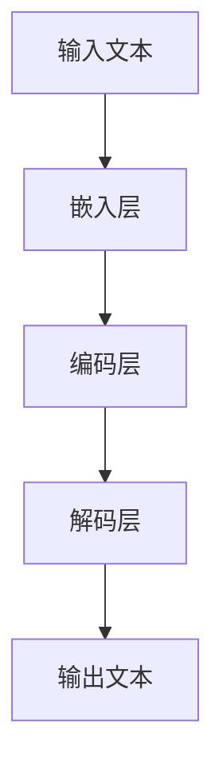
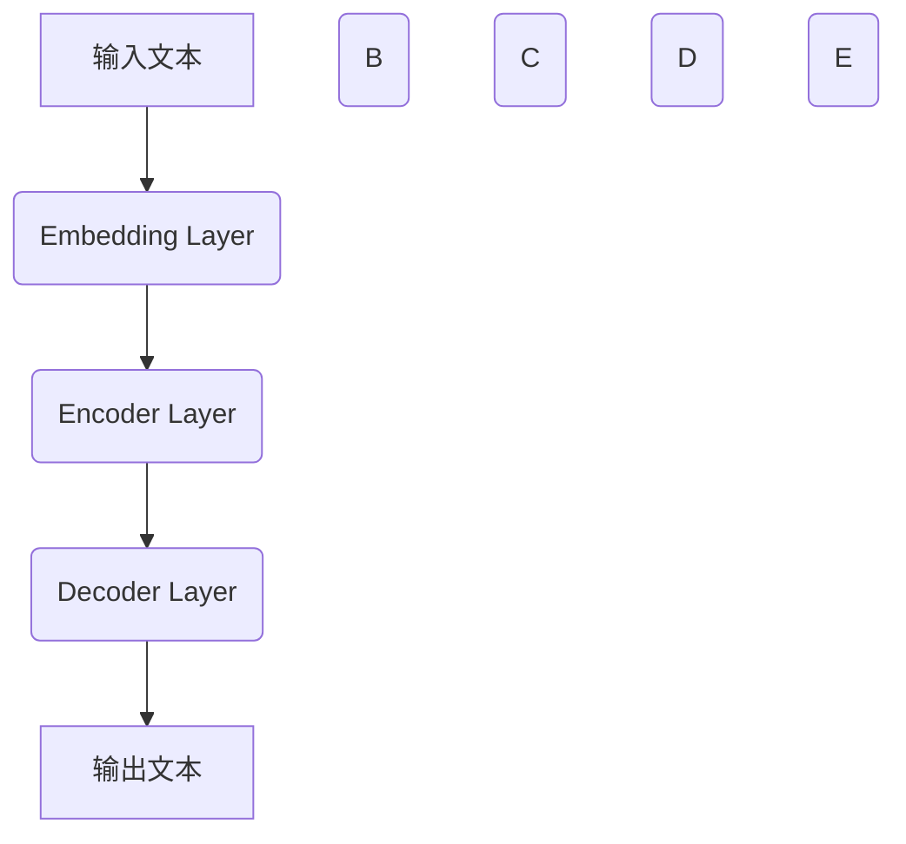
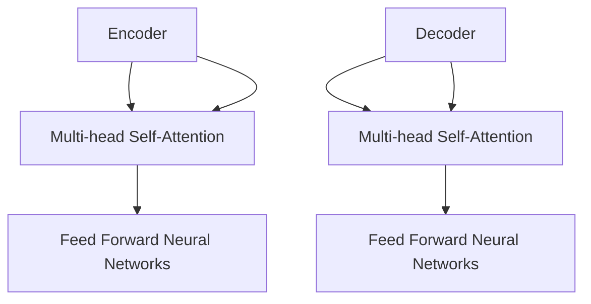
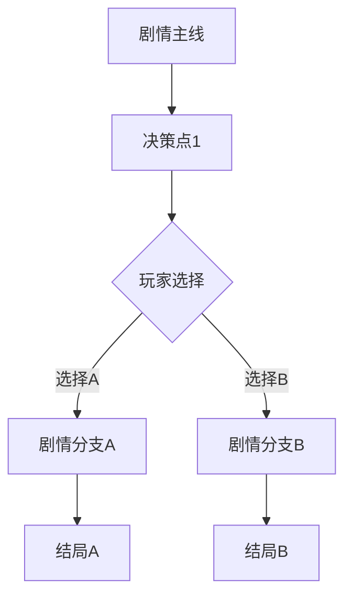
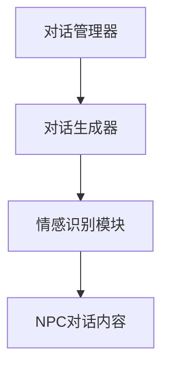

                 

## 文章标题：LLM在游戏设计中的应用：动态剧情和NPC对话

## 关键词：自然语言处理，游戏设计，动态剧情，NPC对话，情感表达

## 摘要：
本文详细探讨了大型语言模型（LLM）在游戏设计中的创新应用，特别是动态剧情生成和NPC对话系统。文章首先介绍了LLM的核心概念和架构，然后深入分析了动态剧情设计和NPC对话系统的实现原理。通过具体的算法原理讲解、数学模型和公式、以及实战项目案例，本文展示了如何利用LLM技术构建丰富、个性化和互动性的游戏体验。文章最后展望了LLM在游戏设计中的未来趋势，并提供了相关技术资源和实战代码解读。

---

### 第一部分：LLM基础与概述

#### 第1章：LLM的定义与核心特性

**1.1 LLM的定义**

LLM，即大型语言模型（Large Language Model），是一种能够理解和生成自然语言文本的深度学习模型。LLM通常拥有数亿个参数，通过对大量文本数据进行预训练，能够学习到语言的统计规律和语义知识，从而实现文本的生成、理解和推理。

**1.2 LLM的核心特性**

- **高容量参数**：LLM拥有庞大的参数量，使其能够捕捉复杂的语言模式。
- **强大的语言理解能力**：LLM通过预训练能够理解各种复杂的语言现象，包括语法、语义和情感。
- **高效的文本生成**：LLM能够基于输入文本生成连贯、自然的文本，适用于多种应用场景。

**1.3 LLM在游戏设计中的应用潜力**

- **动态剧情生成**：利用LLM的强大语言生成能力，可以实现动态剧情的自动生成，提供个性化、多样的游戏体验。
- **NPC对话系统**：通过LLM的自然语言处理能力，可以构建智能、自然的NPC对话系统，增强游戏的互动性和沉浸感。

#### 1.4 LLM的核心概念与架构

**图1-1：LLM的架构与流程**



**核心概念**：

- **嵌入层**：将输入文本转换为向量表示。
- **编码层**：通过多层神经网络对输入文本进行编码，提取语义信息。
- **解码层**：基于编码后的信息生成输出文本。

**LLM的架构图解**：



#### 1.5 LLM在游戏剧情与NPC对话中的应用概述

- **游戏剧情生成**：利用LLM生成丰富、动态的剧情，根据玩家行为和决策实时调整剧情走向。
- **NPC对话系统**：通过LLM实现自然、流畅的NPC对话，识别玩家情感并给予适当的反馈。

---

### 第一部分：LLM技术深入

#### 第2章：LLM的架构与算法

**2.1 LLM的架构**

LLM通常采用Transformer架构，这是一种基于自注意力机制的深度学习模型。Transformer由编码器和解码器组成，其核心是多头自注意力机制和位置编码。

**图2-1：Transformer架构**



**核心算法**：

- **自注意力机制**：计算输入序列中每个词与其他词之间的关联强度，并加权求和。
- **位置编码**：为每个词添加位置信息，保持句子的顺序。
- **编码器与解码器**：编码器将输入序列编码为上下文表示，解码器基于上下文生成输出序列。

#### 2.2 LLM的预训练与微调

**预训练**：

- **大规模文本数据集**：使用大量文本数据对模型进行预训练，使模型学习到语言的通用规律。
- **预训练任务**：包括语言理解、语言生成等任务，如GPT-3中的掩码语言模型（Masked Language Model, MLM）。

**微调**：

- **特定任务数据**：在特定任务上使用少量数据对模型进行微调，使其适应具体的应用场景。
- **微调策略**：通过调整模型参数，提高模型在特定任务上的性能。

#### 2.3 LLM的情感识别与表达

**情感识别**：

- **情感分类模型**：使用预训练的LLM，结合情感分类模型，对文本进行情感分类。
- **情感强度估计**：通过分析文本的情感词汇和句子结构，估计情感强度。

**情感表达**：

- **情感角色模型**：为每个NPC设计情感角色模型，根据模型调整NPC的情感表达。
- **情感语音合成**：使用情感语音合成技术，根据情感状态调整NPC的语音特征。

---

### 第二部分：动态剧情设计与实现

#### 第3章：动态剧情设计原理

**3.1 动态剧情的原理与优势**

**动态剧情**是指游戏剧情可以根据玩家的行为和决策实时变化，提供不同的剧情走向和结局。与传统的线性剧情相比，动态剧情具有以下优势：

- **个性化**：根据玩家的行为生成个性化的剧情，提高玩家的沉浸感和满意度。
- **多样性**：提供多种剧情走向和结局，增加游戏的可玩性。
- **互动性**：玩家在游戏中的决策直接影响剧情走向，增强游戏的互动性。

**3.2 动态剧情的构建方法**

**构建动态剧情的关键步骤**：

1. **剧情主线设计**：设计基本剧情主线，确保剧情的连贯性和完整性。
2. **分支决策点设计**：在关键节点设计决策点，玩家在此处做出选择，影响剧情走向。
3. **状态管理**：设计状态管理机制，记录玩家的决策和剧情状态，实现剧情的动态调整。

**图3-1：动态剧情的构建方法**



**3.3 动态剧情在游戏中的应用场景**

- **角色扮演游戏（RPG）**：通过动态剧情提供丰富的角色发展和故事线。
- **冒险游戏**：利用动态剧情创建复杂的任务和剧情，增加游戏挑战性。
- **模拟游戏**：根据玩家的行为生成真实的游戏世界，提供动态的交互体验。

---

### 第三部分：NPC对话系统设计与实现

#### 第4章：NPC对话系统设计

**4.1 NPC对话系统的基本概念**

**NPC对话系统**是指游戏中非玩家角色（NPC）与玩家之间的交互对话系统。一个有效的NPC对话系统应具备以下基本概念：

- **对话内容**：包括NPC的对话文本、语音和表情。
- **对话流程**：定义对话的逻辑和流程，确保对话的连贯性和自然性。
- **情感表达**：根据玩家的行为和对话内容，实时调整NPC的情感表达。

**4.2 NPC对话系统的组成部分**

**NPC对话系统**主要由以下几个部分组成：

- **对话管理器**：负责管理对话的流程和逻辑，确保对话的连贯性。
- **对话生成器**：使用LLM生成NPC的对话内容，使其更具有个性化。
- **情感识别模块**：识别玩家的情感状态，调整NPC的情感表达。

**图4-1：NPC对话系统的组成部分**



**4.3 NPC对话系统的设计原则**

- **自然性**：对话应尽可能自然，避免机械和生硬。
- **个性**：为每个NPC设计独特的个性和对话风格。
- **适应性**：对话系统应能够根据玩家的行为和对话内容进行调整。

---

### 第三部分：NPC对话系统设计与实现（续）

#### 第5章：利用LLM构建NPC对话系统

**5.1 LLM在NPC对话中的应用**

LLM在NPC对话中的应用主要体现在以下几个方面：

- **对话生成**：使用LLM生成NPC的对话内容，使其更具有个性化。
- **上下文理解**：通过LLM的上下文理解能力，使NPC对话更加自然、连贯。
- **情感识别与表达**：利用LLM的情感识别能力，使NPC对话中的情感表达更加真实。

**5.2 对话生成算法**

**对话生成算法**的基本流程如下：

1. **输入文本**：输入玩家的对话文本或其他相关文本。
2. **嵌入层**：将输入文本转换为向量表示。
3. **编码层**：对输入文本进行编码，提取语义信息。
4. **解码层**：基于编码后的信息生成输出文本。

**伪代码**：

```python
# 输入文本
input_text = "玩家：你为什么帮我？"

# 嵌入层
embeddings = embedding_layer(input_text)

# 编码层
encoded_text = encoder(embeddings)

# 解码层
output_text = decoder(encoded_text)

# 输出对话内容
print("NPC：", output_text)
```

**5.3 上下文理解**

**上下文理解**是NPC对话系统的重要特性，其目的是使NPC的对话内容与当前情境保持一致。

**数学模型**：

假设当前对话的上下文为C，玩家输入的文本为I，NPC的输出文本为O，则上下文理解可以表示为：

$$ O = f(C, I) $$

其中，$f$为神经网络模型。

**举例说明**：

假设玩家说：“我需要你的帮助”，NPC可以回答：“当然，我会尽我所能帮助你。”

$$ O = f(C, "我需要你的帮助") $$

这里，$C$包含了之前的对话历史和游戏状态。

**5.4 情感识别与表达**

**情感识别**是指识别玩家的情感状态，如喜悦、愤怒、悲伤等。**情感表达**是指根据玩家的情感状态，调整NPC的对话内容和语气。

**情感识别算法**：

1. **输入文本**：输入玩家的对话文本。
2. **情感分类**：使用预训练的LLM和情感分类模型，对文本进行情感分类。

**伪代码**：

```python
# 输入文本
input_text = "玩家：你真是个大好人！"

# 情感分类
emotion = emotion_classifier(input_text)

# 输出情感
print("情感：", emotion)
```

**情感表达算法**：

1. **输入文本**：输入NPC的对话文本。
2. **情感调整**：根据识别出的玩家情感，调整NPC的对话内容和语气。

**伪代码**：

```python
# 输入文本
input_text = "NPC：谢谢你帮助我！"

# 输入玩家情感
player_emotion = "喜悦"

# 情感调整
adjusted_text = emotion_adjuster(input_text, player_emotion)

# 输出调整后的文本
print("调整后的文本：", adjusted_text)
```

---

### 第四部分：实战案例与项目实现

#### 第6章：动态剧情与NPC对话系统的实战案例

**6.1 实战案例介绍**

本节将介绍一个具体的游戏项目，展示如何利用LLM技术实现动态剧情和NPC对话系统。该游戏项目是一个角色扮演游戏（RPG），玩家在游戏中需要与各种NPC互动，并根据玩家的行为生成不同的剧情走向。

**6.2 实战案例中的LLM应用**

**剧情生成**：

1. **数据准备**：收集与游戏主题相关的剧本、小说、游戏日志等文本数据。
2. **模型训练**：使用PyTorch和Transformers训练LLM模型，使其掌握剧情生成技巧。
3. **剧情生成**：输入特定条件或关键词，使用训练好的LLM模型生成新的剧情内容。

**NPC对话系统**：

1. **对话管理**：使用LLM生成NPC的对话内容，确保对话的自然性和连贯性。
2. **情感识别**：使用LLM识别玩家的情感状态，为NPC提供适当的反馈。
3. **对话生成**：基于情感识别结果，生成符合情感状态的NPC对话内容。

**6.3 实战案例的实现步骤**

1. **项目需求分析**：确定游戏项目的需求，包括剧情、NPC对话、玩家互动等。
2. **环境搭建**：搭建游戏开发环境，包括操作系统、编程语言、游戏引擎等。
3. **模型训练与部署**：训练LLM模型，并将其部署到游戏项目中。
4. **项目开发**：开发游戏剧情、NPC对话系统，实现动态剧情和NPC对话功能。
5. **测试与优化**：测试游戏功能，优化游戏性能和用户体验。

---

### 第四部分：实战案例与项目实现（续）

#### 第7章：游戏设计与开发中的LLM应用

**7.1 LLM在游戏设计中的角色**

LLM在游戏设计中的角色不仅仅是生成剧情和对话，还包括：

- **任务设计**：使用LLM生成游戏任务和挑战，提高游戏的可玩性。
- **关卡设计**：根据玩家行为和LLM的预测，动态调整游戏关卡，提高游戏的挑战性。
- **游戏平衡**：使用LLM分析玩家行为，优化游戏规则和难度，实现游戏的平衡性。

**7.2 LLM在游戏开发中的流程**

**LLM在游戏开发中的流程**包括以下步骤：

1. **需求分析**：确定游戏项目的需求和目标，包括剧情、NPC对话、任务设计等。
2. **数据收集**：收集与游戏主题相关的文本数据，如剧本、小说、游戏日志等。
3. **模型训练**：使用收集到的数据训练LLM模型，包括剧情生成、对话生成、情感识别等。
4. **模型部署**：将训练好的LLM模型部署到游戏项目中，实现动态剧情和NPC对话功能。
5. **项目开发**：开发游戏剧情、NPC对话系统，实现动态剧情和NPC对话功能。
6. **测试与优化**：测试游戏功能，优化游戏性能和用户体验。

**7.3 LLM在游戏优化中的作用**

LLM在游戏优化中的作用主要体现在以下几个方面：

- **性能优化**：通过LLM分析游戏数据，优化游戏性能，提高游戏的运行效率。
- **用户体验优化**：根据玩家行为和反馈，使用LLM调整游戏内容，提高用户体验。
- **游戏平衡优化**：通过LLM分析玩家行为，优化游戏难度和规则，实现游戏的平衡性。

---

### 第五部分：LLM在游戏设计中的未来展望

#### 第8章：LLM在游戏设计中的未来发展趋势

**8.1 行业应用前景**

随着游戏产业的发展，LLM在游戏设计中的应用前景十分广阔。未来的游戏将更加注重玩家的个性化体验，而LLM技术将为实现这一目标提供强大的支持。

**8.2 技术挑战与解决方案**

**技术挑战**：

- **计算资源**：随着LLM模型规模的增大，对计算资源的需求也不断提高。
- **数据收集**：游戏场景复杂，数据收集和标注过程复杂。
- **算法优化**：提高LLM模型的效率和准确性是持续优化的重要方向。

**解决方案**：

- **分布式计算**：利用分布式计算技术，提高LLM模型的训练和部署效率。
- **数据增强**：通过数据增强技术，提高训练数据的质量和数量。
- **模型压缩**：通过模型压缩技术，减小模型的体积和计算量，提高运行效率。

**8.3 未来发展方向**

- **情感智能**：通过技术创新，实现更加真实的情感智能，提高NPC的行为真实性。
- **自适应游戏**：通过自适应技术，根据玩家的行为调整游戏难度和玩法。
- **游戏创新**：通过技术创新，实现新的游戏玩法和创意，提高游戏的趣味性和创新性。

---

### 附录

#### 附录A：LLM相关技术资源

**A.1 开源LLM模型**

- **GPT-3**：由OpenAI开发，具有1750亿参数的预训练语言模型。
- **BERT**：由Google开发，具有数百万参数的双向编码器表示模型。
- **T5**：由Google开发，将文本生成任务统一为“编码为文本”的任务。

**A.2 LLM训练与部署工具**

- **PyTorch**：用于构建和训练深度学习模型的Python库。
- **TensorFlow**：用于构建和训练深度学习模型的Python库。
- **Transformers**：用于构建和训练Transformer模型的Python库。

**A.3 LLM应用案例**

- **自然语言生成**：用于生成文本、文章、对话等。
- **机器翻译**：用于将一种语言的文本翻译成另一种语言。
- **情感分析**：用于分析文本的情感倾向。

#### 附录B：实战项目代码解读

**B.1 项目结构**

- **环境搭建**：介绍如何搭建游戏开发环境和LLM模型训练环境。
- **模型训练**：介绍如何使用PyTorch和Transformers训练LLM模型。
- **模型部署**：介绍如何将训练好的LLM模型部署到游戏项目中。

**B.2 源代码实现**

- **动态剧情生成**：介绍如何使用LLM生成动态剧情。
- **NPC对话生成**：介绍如何使用LLM生成NPC对话。
- **情感识别与表达**：介绍如何使用LLM进行情感识别和情感表达。

**B.3 代码解读**

- **关键代码**：解读关键代码的实现原理和步骤。
- **代码分析**：分析代码的性能和优化空间。

#### 附录C：常见问题与解答

**C.1 LLM在游戏设计中的应用**

- **如何实现动态剧情？**
- **如何生成个性化的NPC对话？**
- **如何进行情感识别与表达？**

**C.2 技术挑战**

- **如何优化LLM模型的训练和部署？**
- **如何处理大规模的游戏数据？**
- **如何提高LLM模型的效率和准确性？**

**C.3 未来展望**

- **LLM在游戏设计中的未来发展方向是什么？**
- **如何应对技术挑战？**
- **LLM在游戏设计中的应用前景如何？**

---

### 作者信息

**作者：AI天才研究院/AI Genius Institute & 禅与计算机程序设计艺术 /Zen And The Art of Computer Programming**

本文由AI天才研究院撰写，作者们致力于探索人工智能在游戏设计中的创新应用。文章结合了深度学习和自然语言处理技术，通过具体的算法原理讲解、数学模型和公式，以及实战项目案例，展示了如何利用LLM技术构建丰富、个性化和互动性的游戏体验。希望本文能为游戏设计师和开发者提供有价值的参考和启示。在未来的研究中，我们将继续深入探索人工智能在游戏设计中的应用，为玩家带来更加精彩的游戏体验。

