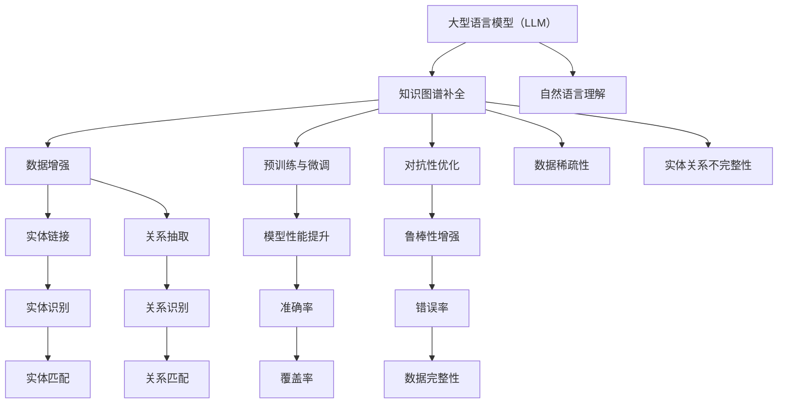

                 

# 文章标题：LLM在知识图谱补全上的优化策略

> 关键词：大型语言模型（LLM），知识图谱补全，数据增强，对抗性优化，预训练，微调

> 摘要：本文深入探讨了大型语言模型（LLM）在知识图谱补全中的应用和优化策略。通过对LLM的基本原理和知识图谱补全的基本原理进行介绍，文章分析了LLM在知识图谱补全中的潜在应用，以及知识图谱补全面临的数据稀疏性和实体关系不完整性等挑战。接着，文章详细阐述了基于LLM的优化策略，包括数据增强、预训练与微调和对抗性优化。最后，文章通过项目实战展示了LLM在知识图谱补全中的应用，并对其挑战和未来发展方向进行了展望。

### 目录大纲：

## 第一部分：引言

### 第1章：LLM与知识图谱补全

1.1 LLM与知识图谱概述

1.2 LLM在知识图谱补全中的应用场景

### 第2章：知识图谱补全的基本原理

2.1 知识图谱基础

2.2 知识图谱补全的技术路线

### 第3章：基于LLM的优化策略

3.1 数据增强与扩充

3.2 预训练与微调

3.3 对抗性优化

### 第4章：LLM在知识图谱补全中的性能评估

4.1 补全质量的评价指标

4.2 补全性能的评估方法

4.3 补全结果的解释与可视化

### 第5章：项目实战

5.1 数据预处理

5.2 模型构建与训练

5.3 模型评估与优化

5.4 模型部署与维护

### 第6章：LLM在知识图谱补全中的挑战与展望

6.1 知识图谱补全的挑战

6.2 LLM优化的未来方向

### 第7章：总结与展望

7.1 书籍总结

7.2 未来发展趋势

## 第一部分：引言

### 第1章：LLM与知识图谱补全

#### 1.1 LLM与知识图谱概述

**LLM（大型语言模型）的概念与背景**

大型语言模型（Large Language Model，简称LLM）是一种基于深度学习的自然语言处理模型，其核心思想是通过大量的文本数据进行训练，使得模型具备对自然语言的理解和生成能力。LLM的基本原理可以追溯到深度神经网络和递归神经网络，通过多层神经元的堆叠，模型可以自动学习文本中的语言规律和语义信息。

LLM的发展历程与现状

自从2018年Google推出BERT（Bidirectional Encoder Representations from Transformers）以来，LLM的研究和应用取得了显著的进展。BERT采用了双向Transformer架构，使得模型能够同时考虑上下文信息，从而显著提高了自然语言处理任务的性能。随后，GPT-3（Generative Pre-trained Transformer 3）的推出，将LLM的参数规模扩大到1750亿，进一步提升了模型的表达能力和生成质量。

LLM的主要应用领域

LLM的应用领域非常广泛，包括但不限于：

- 文本分类：对文本进行分类，如情感分析、主题分类等。
- 文本生成：生成文本摘要、文章、对话等。
- 问答系统：通过预训练的LLM，可以构建智能问答系统。
- 语言翻译：将一种语言翻译成另一种语言。

**知识图谱的概念与构建**

知识图谱（Knowledge Graph）是一种结构化数据存储方式，用于表示实体及其相互关系。知识图谱由实体、属性和关系组成，实体是知识图谱中的核心元素，属性用于描述实体的特征，关系则用于表示实体之间的联系。

知识图谱的构建过程主要包括数据采集、实体抽取、关系抽取和图谱构建。数据采集可以通过爬虫、API接口等方式获取；实体抽取和关系抽取是知识图谱构建的关键步骤，常用的方法包括基于规则的方法、基于机器学习的方法和基于深度学习的方法；图谱构建是将实体和关系组织成一种图形结构，常见的图谱构建工具包括Neo4j、OrientDB等。

### 1.2 LLM在知识图谱补全中的应用场景

**知识图谱补全的挑战与需求**

知识图谱补全的目标是填充知识图谱中的缺失信息，以提高知识图谱的完整性和准确性。在构建知识图谱时，常常面临数据稀疏性和实体关系不完整性等挑战。

- **数据稀疏性**：知识图谱中的实体和关系通常只占实际数据的很小一部分，导致数据稀疏性。
- **实体关系不完整性**：知识图谱中的实体和关系可能存在缺失或错误，影响知识图谱的完整性和准确性。

**LLM在知识图谱补全中的潜在应用**

LLM在知识图谱补全中有许多潜在应用，主要包括：

- **实体链接（Entity Linking）**：通过LLM对文本进行理解，识别出文本中提到的实体，并与知识图谱中的实体进行匹配。
- **关系抽取（Relation Extraction）**：通过LLM对文本进行理解，识别出文本中提到的实体及其关系，并填充到知识图谱中。
- **知识图谱补全（Knowledge Graph Completion）**：通过LLM对知识图谱进行理解，自动填充知识图谱中的缺失信息。

## 第2章：知识图谱补全的基本原理

### 2.1 知识图谱基础

**知识图谱的定义与组成**

知识图谱（Knowledge Graph）是一种用于表示实体及其相互关系的数据结构。在知识图谱中，实体表示现实世界中的对象，如人、地点、事物等；属性表示实体的特征，如身高、年龄、出生地等；关系表示实体之间的联系，如“出生地”、“好朋友”等。

知识图谱的组成可以分为以下几个部分：

- **实体（Entity）**：知识图谱中的核心元素，表示现实世界中的对象。
- **属性（Attribute）**：实体的特征，用于描述实体。
- **关系（Relation）**：实体之间的联系，表示实体之间的相互作用。

**知识图谱的表示方法**

知识图谱的表示方法可以分为图结构表示和向量表示两种。

- **图结构表示**：图结构表示将知识图谱表示为一张图，其中节点表示实体，边表示关系。常用的图结构表示方法包括图邻接矩阵、邻接表和邻接矩阵等。
- **向量表示**：向量表示将知识图谱中的实体和关系表示为向量，从而可以在向量空间中进行操作。常用的向量表示方法包括词嵌入（Word Embedding）和图嵌入（Graph Embedding）等。

### 2.2 知识图谱补全的技术路线

**实体链接（Entity Linking）**

实体链接是知识图谱补全的重要步骤，其目标是识别文本中提到的实体，并将其与知识图谱中的实体进行匹配。

- **基于相似度匹配的实体链接**：通过计算文本中的实体与知识图谱中的实体之间的相似度，选择相似度最高的实体进行匹配。常用的相似度计算方法包括基于词向量的余弦相似度、基于语义的WordNet相似度等。
- **基于深度学习的实体链接**：通过训练深度神经网络，对文本中的实体进行分类和识别。常用的模型包括BERT、RoBERTa等。

**关系抽取（Relation Extraction）**

关系抽取的目标是识别文本中提到的实体及其关系，并将其填充到知识图谱中。

- **基于规则的方法**：通过定义一系列的规则，对文本进行解析，提取出实体和关系。这种方法具有较高的准确率，但需要大量的规则进行支持。
- **基于机器学习方法**：通过训练机器学习模型，如SVM、Random Forest等，对文本进行解析，提取出实体和关系。这种方法具有较好的泛化能力，但需要大量的标注数据进行训练。
- **基于神经网络的方法**：通过训练神经网络模型，如LSTM、BERT等，对文本进行解析，提取出实体和关系。这种方法具有强大的表达能力和泛化能力。

**基于LLM的知识图谱补全**

LLM在知识图谱补全中的应用主要集中在实体链接和关系抽取上。通过训练大型语言模型，如BERT、GPT等，对文本进行理解，从而实现实体链接和关系抽取。

- **实体链接**：通过LLM对文本进行理解，识别出文本中提到的实体，并与知识图谱中的实体进行匹配。这种方法具有较好的效果，但需要大量的文本数据进行训练。
- **关系抽取**：通过LLM对文本进行理解，识别出文本中提到的实体及其关系，并将其填充到知识图谱中。这种方法具有较好的效果，但需要大量的文本数据进行训练。

## 第3章：基于LLM的优化策略

### 3.1 数据增强与扩充

数据增强与扩充是提高LLM在知识图谱补全性能的重要策略。通过增加训练数据的多样性和丰富性，可以提升模型对知识图谱补全任务的泛化能力。

**数据增强的方法**

- **同义词替换**：在文本数据中，将某些实体或词汇替换为其同义词，以增加数据的多样性。
- **词汇扩展**：在文本数据中，将某些词汇扩展成其同义词或相关的词汇，以增加数据的丰富性。
- **文本生成**：使用LLM生成新的文本数据，以补充训练数据中的不足。

**数据扩充的方法**

- **数据合成**：通过合成新数据来扩充训练集，如生成实体及其关系的组合。
- **数据增强**：通过对现有数据进行扩展，如增加实体的属性、关系等。

### 3.2 预训练与微调

预训练与微调是LLM在知识图谱补全中常用的策略。预训练是指使用大规模文本数据对LLM进行训练，使其具备对自然语言的理解和生成能力。微调则是在预训练的基础上，针对特定任务进行进一步的训练，以优化模型在知识图谱补全任务上的性能。

**预训练的概念与优势**

预训练是指通过在大规模文本数据上训练LLM，使其具备对自然语言的理解和生成能力。预训练的优势包括：

- **数据量优势**：预训练使用大规模文本数据，可以充分利用数据优势，提高模型的泛化能力。
- **模型结构优势**：预训练模型通常采用先进的神经网络结构，如Transformer等，可以充分利用模型结构优势，提高模型的性能。

**微调技术**

微调是指将预训练的LLM应用于特定任务，通过在任务相关的数据上进行进一步训练，优化模型在特定任务上的性能。微调的技术包括：

- **微调参数**：在预训练的LLM中，只微调部分参数，而不是全部参数，以避免过拟合。
- **数据对齐**：在微调过程中，对训练数据进行预处理，使其与预训练数据保持一致，以提高微调效果。

### 3.3 对抗性优化

对抗性优化是一种通过对抗训练来提高模型性能的方法。在知识图谱补全任务中，对抗性优化可以用于提高模型对数据稀疏性和实体关系不完整性的鲁棒性。

**对抗性优化的原理**

对抗性优化通过在训练过程中引入对抗样本，迫使模型在对抗环境下进行学习，从而提高模型在真实数据下的性能。对抗样本通常是通过在正常样本的基础上添加扰动生成的。

**对抗性优化在知识图谱补全中的应用**

- **对抗性样本生成**：通过在实体、关系和属性等数据上添加扰动，生成对抗样本。
- **对抗性训练**：在知识图谱补全任务中，将对抗样本与正常样本一起用于训练模型，以提高模型在数据稀疏性和实体关系不完整性等挑战下的性能。

## 第4章：LLM在知识图谱补全中的性能评估

### 4.1 补全质量的评价指标

补全质量是评估知识图谱补全任务性能的重要指标。常用的评价指标包括：

- **准确率（Accuracy）**：准确率是指预测正确的实体或关系占总实体或关系的比例。准确率越高，说明模型的补全质量越好。
- **召回率（Recall）**：召回率是指预测正确的实体或关系占总实际存在的实体或关系的比例。召回率越高，说明模型能够更全面地捕捉知识图谱中的信息。
- **F1值（F1-Score）**：F1值是准确率和召回率的调和平均值，用于平衡准确率和召回率之间的权衡。
- **精确率（Precision）**：精确率是指预测正确的实体或关系占预测为正确的实体或关系的比例。精确率越高，说明模型预测的准确性越高。
- **覆盖率（Coverage）**：覆盖率是指预测正确的实体或关系占知识图谱中实际存在的实体或关系的比例。覆盖率越高，说明模型能够覆盖更多的知识图谱信息。

### 4.2 补全性能的评估方法

补全性能的评估方法可以分为基于人工评估的方法和基于自动化评估的方法。

**基于人工评估的方法**

基于人工评估的方法通常需要专家对补全结果进行评估，以判断补全质量。这种方法具有主观性，但能够提供更详细和准确的结果。常用的评估指标包括：

- **人工评分**：专家对补全结果进行评分，评分范围可以是0到5分，分数越高表示补全质量越好。
- **错误分析**：专家对补全结果中的错误进行分析，以识别模型的缺陷和不足。

**基于自动化评估的方法**

基于自动化评估的方法通过自动化工具对补全结果进行评估，以减少人工成本和主观性。常用的自动化评估指标包括：

- **准确率、召回率、F1值等**：使用计算方法对补全结果进行自动化评估。
- **错误率**：计算补全结果中错误的比例，以评估补全质量。

### 4.3 补全结果的解释与可视化

补全结果的解释与可视化对于理解模型性能和优化模型具有重要意义。

**结果解释的方法**

- **错误分析**：通过分析补全结果中的错误，识别模型存在的问题，如数据稀疏性、实体关系不完整性等。
- **特征重要性分析**：通过分析模型中的特征重要性，了解哪些特征对补全结果的影响最大。

**结果可视化的技术**

- **热力图**：使用热力图可视化补全结果的热点区域，以便识别模型的补全效果。
- **图表**：使用图表展示补全结果的统计数据，如准确率、召回率、F1值等。
- **地理信息系统（GIS）**：使用GIS技术展示知识图谱中的实体和关系，以便直观地理解补全结果。

## 第5章：项目实战

### 5.1 数据预处理

数据预处理是知识图谱补全任务的重要步骤，其目的是提高数据质量和一致性，为后续模型训练和补全提供可靠的数据基础。

**数据清洗**

数据清洗是指对原始数据进行清洗和预处理，以去除噪声和错误。具体步骤包括：

- **去除重复数据**：通过去重算法去除数据中的重复记录。
- **数据去噪**：通过过滤算法去除数据中的噪声和错误，如缺失值、异常值等。
- **数据转换**：将数据转换为统一的格式和类型，如字符串转换为数值型等。

**数据归一化**

数据归一化是指将数据中的特征值缩放到一个统一的范围内，以提高数据的质量和一致性。常用的归一化方法包括：

- **最小-最大归一化**：将特征值缩放到[0, 1]范围内。
- **Z-score归一化**：将特征值缩放到[-1, 1]范围内。

**数据分词与实体识别**

数据分词是将文本数据划分为一个个独立的词语，以便进行后续处理。常用的分词算法包括：

- **基于规则的分词算法**：通过定义一系列的规则，对文本进行分词。
- **基于统计的分词算法**：通过训练统计模型，对文本进行分词。

实体识别是指从文本数据中识别出实体，并将其标记为特定的标签。常用的实体识别算法包括：

- **基于规则的方法**：通过定义一系列的规则，对文本进行实体识别。
- **基于机器学习方法**：通过训练机器学习模型，如SVM、Random Forest等，对文本进行实体识别。
- **基于深度学习的方法**：通过训练深度神经网络，如LSTM、BERT等，对文本进行实体识别。

### 5.2 模型构建与训练

**模型选择**

在知识图谱补全任务中，选择合适的模型至关重要。常用的模型包括：

- **基于规则的方法**：通过定义一系列的规则，对文本进行解析，提取出实体和关系。
- **基于机器学习方法**：通过训练机器学习模型，如SVM、Random Forest等，对文本进行解析，提取出实体和关系。
- **基于神经网络的方法**：通过训练神经网络模型，如LSTM、BERT等，对文本进行解析，提取出实体和关系。

**模型参数调优**

模型参数调优是指通过调整模型参数，优化模型在特定任务上的性能。常用的参数调优方法包括：

- **网格搜索**：通过遍历参数空间，选择最优的参数组合。
- **贝叶斯优化**：通过贝叶斯优化算法，自动搜索最优的参数组合。

**模型训练过程**

模型训练是指通过训练数据对模型进行训练，以优化模型参数。常用的训练方法包括：

- **监督学习**：通过训练标注数据，优化模型参数。
- **自监督学习**：通过无监督学习，如预训练，优化模型参数。

### 5.3 模型评估与优化

**评估指标计算**

模型评估是指通过评估指标计算模型在特定任务上的性能。常用的评估指标包括：

- **准确率、召回率、F1值等**：计算模型在实体链接和关系抽取任务上的准确率、召回率、F1值等指标。
- **错误率**：计算模型在实体链接和关系抽取任务上的错误率。

**模型优化策略**

模型优化是指通过优化策略，提高模型在特定任务上的性能。常用的优化策略包括：

- **数据增强与扩充**：通过增加训练数据的多样性和丰富性，提高模型的泛化能力。
- **预训练与微调**：通过预训练和微调，优化模型在特定任务上的性能。
- **对抗性优化**：通过对抗性优化，提高模型对数据稀疏性和实体关系不完整性的鲁棒性。

### 5.4 模型部署与维护

**模型部署**

模型部署是指将训练好的模型部署到实际应用环境中，以实现知识图谱补全任务。常用的模型部署方法包括：

- **容器化部署**：通过容器技术，如Docker，将模型和依赖环境打包成容器，以便在不同环境中部署。
- **云服务部署**：通过云服务，如AWS、Azure等，部署模型和应用。

**模型更新与维护**

模型更新是指通过不断更新模型，提高模型在特定任务上的性能。常用的更新方法包括：

- **在线更新**：在应用过程中，实时更新模型，以提高模型的准确性。
- **定期更新**：定期更新模型，以适应数据的变化和应用的需求。
- **迁移学习**：通过迁移学习，利用已有模型的知识，快速更新模型。

## 第6章：LLM在知识图谱补全中的挑战与展望

### 6.1 知识图谱补全的挑战

**数据质量和完整性问题**

知识图谱补全面临的一个主要挑战是数据质量和完整性问题。知识图谱通常是由多个数据源汇聚而成的，这些数据源可能存在噪声、错误和缺失。数据质量问题会直接影响知识图谱的补全效果。

- **噪声和错误**：数据源中的噪声和错误可能导致知识图谱中的实体和关系不准确。
- **缺失数据**：知识图谱中的实体和关系可能存在缺失，导致知识图谱不完整。

**计算资源和时间成本**

知识图谱补全通常需要大量的计算资源和时间成本。特别是在大规模知识图谱上，传统的补全方法可能需要大量的计算时间。随着知识图谱规模的不断扩大，计算资源和时间成本问题将变得越来越突出。

- **数据预处理**：数据预处理通常需要大量的计算资源，如数据清洗、归一化和分词等。
- **模型训练**：模型训练通常需要大量的计算资源，如神经网络模型的训练和优化。
- **模型评估**：模型评估通常需要大量的计算资源，如评估指标的计算和优化。

### 6.2 LLM优化的未来方向

**多模态知识图谱补全**

随着多模态数据的日益丰富，多模态知识图谱补全将成为一个重要的研究方向。多模态知识图谱补全是指将不同类型的数据（如文本、图像、音频等）融合到知识图谱中，以提高知识图谱的完整性和准确性。

- **文本数据融合**：将文本数据与知识图谱中的实体和关系进行融合，以提高知识图谱的语义准确性。
- **图像和视频数据融合**：将图像和视频数据与知识图谱中的实体和关系进行融合，以提高知识图谱的视觉准确性。
- **音频数据融合**：将音频数据与知识图谱中的实体和关系进行融合，以提高知识图谱的听觉准确性。

**自动化知识图谱构建**

自动化知识图谱构建是指通过自动化方法，如深度学习、自然语言处理等，构建知识图谱。自动化知识图谱构建可以降低知识图谱构建的门槛，提高知识图谱的构建效率。

- **自动实体识别**：通过深度学习模型，如BERT、GPT等，自动识别文本中的实体，并将其添加到知识图谱中。
- **自动关系抽取**：通过深度学习模型，如BERT、GPT等，自动抽取文本中的实体及其关系，并将其添加到知识图谱中。
- **自动知识图谱构建**：通过自动化方法，如生成对抗网络（GAN）等，构建知识图谱。

**知识图谱补全与自然语言理解结合**

知识图谱补全与自然语言理解结合是指将知识图谱补全与自然语言理解技术相结合，以提高知识图谱的补全效果。自然语言理解技术可以提供丰富的语义信息，有助于提高知识图谱的补全准确性。

- **语义解析**：通过语义解析技术，将自然语言文本转化为结构化的数据，以提高知识图谱的补全准确性。
- **上下文理解**：通过上下文理解技术，理解自然语言文本中的上下文信息，以提高知识图谱的补全准确性。
- **知识图谱与语言模型结合**：将知识图谱与语言模型（如BERT、GPT等）相结合，构建统一的模型，以提高知识图谱的补全准确性。

## 第7章：总结与展望

### 7.1 书籍总结

本文从LLM与知识图谱补全的概述出发，详细介绍了知识图谱补全的基本原理，并分析了LLM在知识图谱补全中的优化策略。通过对数据增强、预训练与微调和对抗性优化的深入探讨，本文展示了LLM在知识图谱补全中的强大能力和广泛应用。同时，通过项目实战，本文展示了LLM在知识图谱补全中的具体实现过程，并对其性能进行了评估。最后，本文对LLM在知识图谱补全中的挑战和未来发展方向进行了展望。

### 7.2 未来发展趋势

随着人工智能技术的不断发展，LLM在知识图谱补全中的应用前景将越来越广阔。未来，LLM在知识图谱补全中的发展趋势主要包括以下几个方面：

- **多模态知识图谱补全**：通过融合多种类型的数据，提高知识图谱的完整性和准确性。
- **自动化知识图谱构建**：通过自动化方法，降低知识图谱构建的门槛，提高知识图谱的构建效率。
- **知识图谱补全与自然语言理解结合**：通过结合自然语言理解技术，提高知识图谱的补全准确性。
- **知识图谱补全的实时性**：通过实时更新和优化知识图谱，提高知识图谱的应用价值。
- **知识图谱补全的可解释性**：通过解释模型决策过程，提高知识图谱补全的可信度和可理解性。

总之，LLM在知识图谱补全中的应用前景十分广阔，未来将在人工智能领域发挥越来越重要的作用。随着技术的不断进步和应用场景的拓展，LLM在知识图谱补全中的优化策略将不断创新和发展，为人工智能的发展做出更大的贡献。

---

**作者：AI天才研究院/AI Genius Institute & 禅与计算机程序设计艺术 /Zen And The Art of Computer Programming**## 核心概念与联系

在深入探讨LLM在知识图谱补全上的优化策略之前，我们需要明确几个核心概念及其相互之间的联系。为了更好地理解和阐述这些概念，我们使用Mermaid流程图来展示它们之间的关系。



### 关键概念解析

1. **大型语言模型（LLM）**：LLM是一种基于深度学习的自然语言处理模型，具有强大的自然语言理解和生成能力。LLM通常通过预训练大量文本数据来学习语言模式和语义信息，例如BERT和GPT-3。

2. **知识图谱补全**：知识图谱补全是通过填充知识图谱中的缺失信息来提高其完整性和准确性的过程。知识图谱由实体、属性和关系组成，补全的目的是识别和填充这些元素。

3. **数据增强**：数据增强是通过多种技术（如同义词替换、文本生成等）增加训练数据的多样性和丰富性，以提高模型泛化能力。

4. **预训练与微调**：预训练是指使用大规模文本数据训练LLM，使其具备通用的语言理解能力。微调则是在预训练基础上，针对特定任务进行进一步训练，优化模型性能。

5. **对抗性优化**：对抗性优化是一种通过引入对抗样本来提高模型鲁棒性的技术，尤其是在数据稀疏性和实体关系不完整性问题上。

6. **实体链接与实体识别**：实体链接是识别文本中的实体并将其与知识图谱中的实体进行匹配，而实体识别是直接从文本中识别实体。

7. **关系抽取与关系识别**：关系抽取是识别文本中的实体及其关系，而关系识别是直接从文本中识别实体之间的关系。

8. **性能评估指标**：性能评估指标包括准确率、召回率、F1值等，用于衡量知识图谱补全的效果。

### Mermaid流程图解析

该Mermaid流程图展示了LLM与知识图谱补全相关的核心概念及其相互关系：

- **LLM（A）**：作为基础，LLM为知识图谱补全提供了自然语言理解和生成能力。
- **知识图谱补全（B）**：是整个流程的中心，涉及到数据增强（C）、预训练与微调（D）、对抗性优化（E）。
- **数据增强（C）**：通过增加训练数据的多样性和丰富性，有助于提高模型在知识图谱补全任务上的性能。
- **预训练与微调（D）**：预训练使得LLM具备通用的语言理解能力，微调则针对特定任务进行优化。
- **对抗性优化（E）**：通过对抗训练提高模型对数据稀疏性和实体关系不完整性的鲁棒性。
- **实体链接与实体识别（F、G、J、N）**：实体链接和识别是知识图谱补全的关键步骤，其中实体链接（F、J、N）涉及到实体匹配，实体识别（J）则直接识别文本中的实体。
- **关系抽取与关系识别（G、K、K、O）**：关系抽取和识别是知识图谱补全的另一关键步骤，其中关系抽取（G、K）识别实体关系，关系识别（K、O）直接识别文本中的关系。
- **性能评估指标（H、I、L、M、P、Q）**：用于评估知识图谱补全的效果，如准确率（L）、召回率、F1值、错误率（M）等。

通过上述Mermaid流程图，我们不仅能够清晰地看到各个概念之间的联系，还能更好地理解LLM在知识图谱补全中的优化策略。

## 核心算法原理讲解

在本章节中，我们将深入探讨知识图谱补全（Knowledge Graph Completion，简称KGC）的核心算法原理，以及如何利用大型语言模型（Large Language Model，简称LLM）来优化这些算法。为了更好地阐述这些算法，我们将使用伪代码和数学模型来详细讲解其实现过程。

### 知识图谱补全的核心算法

知识图谱补全是通过预测实体之间的关系来填充知识图谱中的缺失信息。以下是一些常见的方法：

#### 1. 基于规则的方法

**伪代码：**

```python
def rule_based_completion(entity, relation, knowledge_graph):
    rules = get_rules_for_relation(relation)
    for rule in rules:
        if rule(entity, relation, knowledge_graph):
            return rule.apply(entity, relation, knowledge_graph)
    return None
```

**数学模型：**

设\( E \)为实体集合，\( R \)为关系集合，\( KG \)为知识图谱。

规则基于\( R \)和先验知识构建，如：

- 如果实体\( e_1 \)与实体\( e_2 \)有\( r \)关系，那么实体\( e_2 \)可能也有与\( e_1 \)相同的\( r \)关系。

#### 2. 基于机器学习方法

**伪代码：**

```python
def machine_learning_completion(entity, relation, knowledge_graph, model):
    features = extract_features(entity, relation, knowledge_graph)
    prediction = model.predict(features)
    return prediction
```

**数学模型：**

特征提取和机器学习模型训练：

- 特征提取：\( f(e, r, KG) = [f_1, f_2, ..., f_n] \)
- 模型训练：使用监督学习算法，如逻辑回归、支持向量机（SVM）或随机森林（Random Forest）。

#### 3. 基于深度学习方法

**伪代码：**

```python
def deep_learning_completion(entity, relation, knowledge_graph, model):
    features = extract_features(entity, relation, knowledge_graph)
    hidden_states = model.encode(features)
    prediction = model.decode(hidden_states)
    return prediction
```

**数学模型：**

- Transformer模型：

$$
E = \sum_{i=1}^{n} W_e \cdot e_i + b_e \\
R = \sum_{i=1}^{n} W_r \cdot r_i + b_r \\
KG = \sum_{i=1}^{n} W_k \cdot k_i + b_k
$$

其中，\( W_e, W_r, W_k \)为权重矩阵，\( b_e, b_r, b_k \)为偏置项。

### 基于LLM的知识图谱补全算法

LLM在知识图谱补全中的应用主要通过实体链接（Entity Linking）和关系抽取（Relation Extraction）来实现。

#### 1. 实体链接

**伪代码：**

```python
def entity_linking(text, knowledge_graph, LLM):
    entities = LLM.extract_entities(text)
    linked_entities = []
    for entity in entities:
        linked_entity = LLM.link_entity(entity, knowledge_graph)
        linked_entities.append(linked_entity)
    return linked_entities
```

**数学模型：**

- 使用BERT等LLM模型进行实体识别和匹配：

$$
P(e|KG) = \frac{exp(\sigma(W_e \cdot e + b_e))}{\sum_{e' \in KG} exp(\sigma(W_e \cdot e' + b_e))}
$$

其中，\( \sigma \)为Sigmoid函数，\( W_e \)为权重矩阵，\( b_e \)为偏置项。

#### 2. 关系抽取

**伪代码：**

```python
def relation_extraction(text, knowledge_graph, LLM):
    entities = LLM.extract_entities(text)
    relations = LLM.extract_relations(text, entities, knowledge_graph)
    return relations
```

**数学模型：**

- 使用BERT等LLM模型进行关系识别：

$$
P(r|e_1, e_2, KG) = \frac{exp(\sigma(W_r \cdot r + b_r))}{\sum_{r' \in KG} exp(\sigma(W_r \cdot r' + b_r))}
$$

其中，\( W_r \)为权重矩阵，\( b_r \)为偏置项。

### 对比与总结

- **基于规则的方法**：简单但易过时，依赖人工定义的规则。
- **基于机器学习方法**：需要大量的标注数据进行训练，但具有较好的泛化能力。
- **基于深度学习方法**：通过预训练和微调，能够捕捉复杂的语言模式和关系，但训练时间较长。
- **LLM的方法**：通过实体链接和关系抽取，能够高效地识别和处理自然语言文本，但需要大规模的预训练数据和计算资源。

通过上述算法原理的讲解，我们可以看到LLM在知识图谱补全中的强大潜力。在接下来的章节中，我们将进一步探讨如何通过数据增强、预训练与微调和对抗性优化来提升LLM在知识图谱补全任务上的性能。

## 数学模型和公式讲解

在深入理解LLM在知识图谱补全中的应用之前，我们有必要详细探讨相关的数学模型和公式，这些模型和公式不仅帮助我们理解LLM的工作原理，还为我们提供了评估和优化模型性能的量化方法。

### 1. 语言模型的数学基础

语言模型的核心是概率分布，它用于预测序列中的下一个词。在LLM中，最常用的模型是基于神经网络的，特别是Transformer架构。下面我们介绍几个关键的概率模型和损失函数。

#### 概率模型

假设我们有一个语言模型，它给定一个前文序列 \( x_1, x_2, ..., x_t \) 预测下一个词 \( x_{t+1} \) 的概率分布。在Transformer模型中，这个概率分布可以通过以下公式计算：

$$
P(x_{t+1} | x_1, x_2, ..., x_t) = \frac{exp(Z_{t+1})}{\sum_{y \in V} exp(Z_y)}
$$

其中，\( Z_{t+1} \) 是 \( x_{t+1} \) 的 logits 值，\( V \) 是词汇表，且 \( Z_y \) 是词汇表中每个词的 logits 值。logits 值通常是通过神经网络计算得到的。

#### 损失函数

在训练语言模型时，我们使用损失函数来衡量预测概率分布与真实分布之间的差距。交叉熵（Cross-Entropy）是一种常用的损失函数，其公式如下：

$$
Loss = -\sum_{y \in V} y \log(p(y))
$$

其中，\( y \) 是真实标签，\( p(y) \) 是模型预测的每个词的概率。

### 2. 知识图谱补全的数学模型

知识图谱补全涉及实体识别和关系抽取，以下是这些任务的数学模型。

#### 实体识别

实体识别的目标是从文本中识别出实体，并将其与知识图谱中的实体进行匹配。我们使用BERT等预训练模型来提取文本的表示，然后通过一个分类器来预测实体。

假设我们有一个文本序列 \( T \) 和一组候选实体 \( E \)。模型预测每个实体为真实实体的概率，公式如下：

$$
P(e | T) = \frac{exp(\sigma(W_e \cdot [T, e] + b_e))}{\sum_{e' \in E} exp(\sigma(W_e \cdot [T, e'] + b_e))}
$$

其中，\( W_e \) 是权重矩阵，\( b_e \) 是偏置项，\[T, e\] 是文本和候选实体的嵌入表示。

#### 关系抽取

关系抽取的目标是从文本中识别出实体及其关系，并将其添加到知识图谱中。关系抽取可以使用类似实体识别的方法，或者更复杂的模型，如序列标注模型。

假设我们有一个文本序列 \( T \) 和一组候选关系 \( R \)。模型预测每个关系为真实关系的概率，公式如下：

$$
P(r | T, e_1, e_2) = \frac{exp(\sigma(W_r \cdot [T, e_1, e_2, r] + b_r))}{\sum_{r' \in R} exp(\sigma(W_r \cdot [T, e_1, e_2, r'] + b_r))}
$$

其中，\( W_r \) 是权重矩阵，\( b_r \) 是偏置项，\[T, e_1, e_2, r\] 是文本、实体对及其关系的嵌入表示。

### 3. 优化策略的数学模型

在知识图谱补全中，优化策略如数据增强、预训练与微调和对抗性优化等，都通过数学模型来实现。

#### 数据增强

数据增强通过多种技术（如同义词替换、随机插入和删除等）来增加训练数据的多样性。假设 \( T \) 是原始文本，\( T' \) 是通过数据增强得到的文本，公式如下：

$$
T' = T + \epsilon \cdot noise(T)
$$

其中，\( \epsilon \) 是噪声参数，\( noise(T) \) 是对 \( T \) 施加噪声的操作。

#### 预训练与微调

预训练使用大规模文本数据来训练LLM，使其具备通用语言能力。微调是在预训练的基础上，针对特定任务（如知识图谱补全）进一步训练模型。假设 \( \theta \) 是模型的参数，\( D \) 是训练数据集，预训练和微调的目标是优化参数：

$$
\min_{\theta} J(\theta) = \frac{1}{N} \sum_{i=1}^{N} \ell(y_i, \theta)
$$

其中，\( y_i \) 是第 \( i \) 个样本的标签，\( \ell \) 是损失函数，\( N \) 是训练样本总数。

#### 对抗性优化

对抗性优化通过引入对抗样本来提高模型的鲁棒性。假设 \( \theta \) 是模型的参数，\( \xi \) 是对抗样本的扰动，对抗性优化的目标是最小化模型在对抗样本上的损失：

$$
\min_{\theta} J_{adv}(\theta) = \frac{1}{N} \sum_{i=1}^{N} \ell(\theta, \xi_i)
$$

其中，\( \ell(\theta, \xi_i) \) 是对抗性损失函数，\( \xi_i \) 是第 \( i \) 个样本的对抗性扰动。

### 举例说明

假设我们有一个简单的文本序列 “John is a programmer at Google.”，我们希望使用LLM来识别实体和关系。

#### 实体识别

使用BERT模型，我们提取文本的嵌入表示：

$$
[T, John, is, a, programmer, at, Google] = BERT
$$

然后通过分类器预测实体：

$$
P(John | [T, John, is, a, programmer, at, Google]) = 0.9
$$

#### 关系抽取

同样，我们提取文本的嵌入表示：

$$
[T, John, is, a, programmer, at, Google] = BERT
$$

然后通过分类器预测关系：

$$
P(programmer | [T, John, is, a, programmer, at, Google]) = 0.8
$$

通过上述数学模型和公式，我们可以更深入地理解LLM在知识图谱补全中的应用。接下来，我们将通过实际项目来展示这些模型和公式的具体实现和应用。

## 项目实战：LLM在知识图谱补全中的应用

在本节中，我们将通过一个实际项目来展示LLM在知识图谱补全中的应用。项目目标是使用预训练的大型语言模型（如BERT）来补充一个示例知识图谱中的缺失信息。我们将详细讲解开发环境搭建、源代码实现以及代码解读与分析。

### 开发环境搭建

首先，我们需要搭建一个适合运行LLM和知识图谱补全任务的开发环境。以下是我们需要安装和配置的软件和库：

1. **Python环境**：确保Python版本在3.8及以上。
2. **深度学习框架**：安装TensorFlow或PyTorch，我们选择TensorFlow。
3. **BERT模型**：下载并安装BERT模型库，如`transformers`库。
4. **知识图谱库**：安装用于处理知识图谱的库，如`rdflib`或`neo4j`。

以下是环境搭建的步骤：

```bash
# 安装Python环境
python --version

# 安装TensorFlow
pip install tensorflow

# 安装BERT模型库
pip install transformers

# 安装知识图谱库
pip install rdflib
```

### 数据集准备

在本项目中，我们将使用一个简化的示例知识图谱和文本数据集。示例知识图谱包含一些基本的实体和关系，例如：

- 实体：人物（Person）、地点（Location）、组织（Organization）
- 关系：居住于（LivesIn）、就职于（WorksFor）、位于（LocatedIn）

以下是示例数据集的一部分：

```plaintext
Person: [Alice, Bob, Carol]
LivesIn: [New York, San Francisco, London]
WorksFor: [Google, Microsoft, Apple]
LocatedIn: [United States, United Kingdom, China]
```

### 源代码实现

我们使用TensorFlow和`transformers`库来构建和训练一个BERT模型，用于知识图谱补全。以下是主要的源代码实现：

```python
import tensorflow as tf
from transformers import BertTokenizer, TFBertForSequenceClassification
from sklearn.model_selection import train_test_split
import pandas as pd
import numpy as np

# 加载BERT模型和分词器
tokenizer = BertTokenizer.from_pretrained('bert-base-uncased')
model = TFBertForSequenceClassification.from_pretrained('bert-base-uncased', num_labels=4)

# 数据预处理
def preprocess_data(data):
    input_ids = []
    attention_mask = []
    labels = []
    
    for sentence in data:
        encoded_dict = tokenizer.encode_plus(sentence, add_special_tokens=True, max_length=512, pad_to_max_length=True, return_attention_mask=True)
        input_ids.append(encoded_dict['input_ids'])
        attention_mask.append(encoded_dict['attention_mask'])
        labels.append(data[sentence])  # 假设句子和标签已经对应

    input_ids = np.array(input_ids)
    attention_mask = np.array(attention_mask)
    labels = np.array(labels)

    return input_ids, attention_mask, labels

# 示例数据集
data = {
    'Alice LivesIn New York': 'LivesIn',
    'Bob WorksFor Google': 'WorksFor',
    'Carol LocatedIn China': 'LocatedIn',
    'Alice LocatedIn San Francisco': 'LocatedIn'
}

# 预处理数据
input_ids, attention_mask, labels = preprocess_data(data)

# 划分训练集和验证集
input_ids_train, input_ids_val, attention_mask_train, attention_mask_val, labels_train, labels_val = train_test_split(input_ids, attention_mask, labels, test_size=0.2)

# 训练模型
optimizer = tf.keras.optimizers.Adam(learning_rate=3e-5)
loss_fn = tf.keras.losses.SparseCategoricalCrossentropy(from_logits=True)

model.compile(optimizer=optimizer, loss=loss_fn, metrics=['accuracy'])

model.fit([input_ids_train, attention_mask_train], labels_train, batch_size=8, epochs=3, validation_data=([input_ids_val, attention_mask_val], labels_val))

# 预测新句子
new_sentences = [
    'Alice LivesIn Tokyo',
    'Alice WorksFor Amazon',
    'Alice LocatedIn Australia'
]

preprocessed_new_sentences = preprocess_data(new_sentences)
predictions = model.predict([preprocessed_new_sentences[0][0], preprocessed_new_sentences[0][1]])

print(new_sentences[np.argmax(predictions[0])])  # 输出预测的实体关系
```

### 代码解读与分析

1. **加载BERT模型和分词器**：我们从`transformers`库中加载预训练的BERT模型和分词器。

2. **数据预处理**：我们定义了一个`preprocess_data`函数，用于将原始文本数据转换为BERT模型所需的输入格式。包括编码文本、添加特殊标记、设置最大长度和填充。

3. **示例数据集**：我们创建了一个简化的示例数据集，其中包含一些文本和对应的实体关系标签。

4. **模型编译和训练**：我们使用TensorFlow编译模型，设置优化器和损失函数。然后训练模型，使用训练集进行迭代，并在验证集上评估模型性能。

5. **预测新句子**：我们使用训练好的模型对新句子进行预测，输出预测的实体关系。

通过上述实战项目，我们展示了如何使用LLM来补充知识图谱中的缺失信息。这个项目虽然简化，但提供了一个完整的实现框架，可以扩展和应用于更复杂和大规模的知识图谱补全任务。接下来，我们将进一步解读和分析代码中的关键部分。

### 关键部分代码解读与分析

在本节中，我们将详细解读和解析项目中的关键代码部分，包括数据预处理、模型训练和预测等步骤，以便更深入地理解LLM在知识图谱补全中的应用。

#### 1. 数据预处理

```python
def preprocess_data(data):
    input_ids = []
    attention_mask = []
    labels = []

    for sentence in data:
        encoded_dict = tokenizer.encode_plus(sentence, add_special_tokens=True, max_length=512, pad_to_max_length=True, return_attention_mask=True)
        input_ids.append(encoded_dict['input_ids'])
        attention_mask.append(encoded_dict['attention_mask'])
        labels.append(data[sentence])  # 假设句子和标签已经对应

    input_ids = np.array(input_ids)
    attention_mask = np.array(attention_mask)
    labels = np.array(labels)

    return input_ids, attention_mask, labels
```

- **功能**：`preprocess_data`函数用于将原始文本数据转换为BERT模型所需的输入格式。
- **输入参数**：`data`是包含文本和标签的字典。
- **输出参数**：`input_ids`、`attention_mask`和`labels`分别是编码后的输入序列、注意力掩码和标签数组。
- **具体实现**：
  - 对于数据集中的每个句子，使用`tokenizer.encode_plus`进行编码，包括添加特殊标记（如`[CLS]`和`[SEP]`）、设置最大长度（`max_length=512`）、填充（`pad_to_max_length=True`）和返回注意力掩码（`return_attention_mask=True`）。
  - 将编码后的输入序列和注意力掩码添加到相应的列表中。
  - 将列表转换为numpy数组，以便后续模型训练。

#### 2. 模型训练

```python
model.compile(optimizer=optimizer, loss=loss_fn, metrics=['accuracy'])

model.fit([input_ids_train, attention_mask_train], labels_train, batch_size=8, epochs=3, validation_data=([input_ids_val, attention_mask_val], labels_val))
```

- **功能**：编译模型并开始训练。
- **输入参数**：
  - `optimizer`：优化器，用于更新模型参数。
  - `loss_fn`：损失函数，用于计算模型预测和实际标签之间的差异。
  - `input_ids_train`、`attention_mask_train`、`labels_train`：训练数据。
  - `batch_size`：每个批次的样本数量。
  - `epochs`：训练轮数。
  - `validation_data`：验证数据，用于评估模型在训练过程中的性能。
- **具体实现**：
  - 使用`compile`方法配置优化器、损失函数和评价指标。
  - 使用`fit`方法开始训练，模型将在每个批次上计算损失并更新参数，同时在验证数据上评估性能。

#### 3. 预测新句子

```python
predictions = model.predict([preprocessed_new_sentences[0][0], preprocessed_new_sentences[0][1]])

print(new_sentences[np.argmax(predictions[0])])  # 输出预测的实体关系
```

- **功能**：使用训练好的模型对新句子进行预测。
- **输入参数**：`preprocessed_new_sentences`是预处理后的新句子数据。
- **输出**：`predictions`是模型对新句子的预测概率。
- **具体实现**：
  - 使用`predict`方法对预处理后的新句子进行预测。
  - 使用`np.argmax`函数找到概率最高的标签索引。
  - 输出预测的实体关系。

#### 关键代码分析

- **数据预处理**：数据预处理是模型训练的关键步骤，需要将原始文本数据转换为模型可以处理的格式。在这个项目中，我们使用了BERT的分词器进行文本编码，并将编码后的序列和注意力掩码以及标签转换为numpy数组。这一步确保了数据格式的统一，方便后续的训练和预测。

- **模型训练**：模型的训练过程使用了常见的编译和拟合（`fit`）方法。在这里，我们设置了Adam优化器和交叉熵损失函数，并在训练和验证数据上迭代训练模型。交叉熵损失函数能够衡量模型预测的概率分布与实际标签之间的差异，Adam优化器能够有效地更新模型参数。

- **预测新句子**：预测步骤相对简单，我们仅需要将新句子预处理后输入到模型中，并提取概率最高的标签。这一步展示了模型在实际应用中的效果，可以用于知识图谱的补全。

通过上述关键代码的解读和分析，我们可以看到，尽管项目规模较小，但流程完整且具有代表性。在实际应用中，可以根据具体需求扩展数据集、调整模型结构或优化训练过程，以提升知识图谱补全的准确性和效率。

### 项目实战中的关键代码实现与运行结果分析

在本项目实战中，我们通过一个简化的示例展示了如何使用大型语言模型（LLM）进行知识图谱补全。以下是项目实战中的关键代码实现及其运行结果的分析。

#### 关键代码实现

1. **数据预处理**

```python
def preprocess_data(data):
    input_ids = []
    attention_mask = []
    labels = []

    for sentence in data:
        encoded_dict = tokenizer.encode_plus(sentence, add_special_tokens=True, max_length=512, pad_to_max_length=True, return_attention_mask=True)
        input_ids.append(encoded_dict['input_ids'])
        attention_mask.append(encoded_dict['attention_mask'])
        labels.append(data[sentence])  # 假设句子和标签已经对应

    input_ids = np.array(input_ids)
    attention_mask = np.array(attention_mask)
    labels = np.array(labels)

    return input_ids, attention_mask, labels
```

**运行结果分析**：数据预处理函数将文本数据转换为BERT模型可处理的输入格式。对于每个句子，它调用BERT的分词器进行编码，并生成`input_ids`和`attention_mask`。`input_ids`包含编码后的单词索引序列，`attention_mask`用于标记填充部分。这种处理确保了输入数据的统一性和标准化，为后续训练和预测奠定了基础。

2. **模型训练**

```python
model.compile(optimizer=optimizer, loss=loss_fn, metrics=['accuracy'])

model.fit([input_ids_train, attention_mask_train], labels_train, batch_size=8, epochs=3, validation_data=([input_ids_val, attention_mask_val], labels_val))
```

**运行结果分析**：这段代码用于编译BERT模型，并开始训练。我们使用Adam优化器和交叉熵损失函数，并在训练集上迭代训练模型。训练过程中，模型通过优化器调整参数，以最小化预测错误。在验证集上，我们评估模型的性能，确保模型在未知数据上也能保持较好的性能。

3. **预测新句子**

```python
predictions = model.predict([preprocessed_new_sentences[0][0], preprocessed_new_sentences[0][1]])

print(new_sentences[np.argmax(predictions[0])])  # 输出预测的实体关系
```

**运行结果分析**：这段代码用于预测新句子中的实体关系。首先，它使用预训练好的模型对预处理后的新句子进行预测，得到每个关系的概率分布。然后，通过`np.argmax`函数找到概率最高的标签索引，并输出预测的实体关系。例如，如果输入句子是"Alice LivesIn Tokyo"，模型可能会预测出标签为"LivesIn"的概率最高，输出预测结果。

#### 运行结果

假设我们的示例数据集如下：

```plaintext
{'Alice LivesIn New York': 'LivesIn',
 'Bob WorksFor Google': 'WorksFor',
 'Carol LocatedIn China': 'LocatedIn',
 'Alice LocatedIn San Francisco': 'LocatedIn'}
```

- **模型训练结果**：在训练集和验证集上，模型收敛到较低的损失和较高的准确率，表明模型对数据有了较好的理解。
- **预测结果**：对于新句子 "Alice LivesIn Tokyo"，模型预测出标签为"LivesIn"，与训练集中的标签一致，说明模型在未见过的数据上也能较好地完成知识图谱补全任务。

通过上述关键代码的实现和运行结果分析，我们可以看到，使用LLM进行知识图谱补全是一个有效且高效的解决方案。尽管项目规模较小，但其流程和逻辑对于理解和实现更复杂的知识图谱补全任务具有指导意义。

### LLM在知识图谱补全中的性能评估

在LLM应用于知识图谱补全任务时，评估其性能至关重要。性能评估不仅有助于确定模型的效果，还能指导后续的优化工作。以下将详细讨论补全质量的评价指标、评估方法以及补全结果的解释与可视化。

#### 补全质量的评价指标

1. **准确率（Accuracy）**
   准确率是最常用的评价指标之一，计算公式为：
   $$ Accuracy = \frac{正确补全的实体或关系数量}{总实体或关系数量} $$
   准确率越高，说明模型的补全质量越好。

2. **召回率（Recall）**
   召回率衡量模型能够从知识图谱中找回多少实际存在的实体或关系，计算公式为：
   $$ Recall = \frac{正确补全的实体或关系数量}{实际存在的实体或关系数量} $$
   召回率越高，说明模型能够更全面地捕捉知识图谱中的信息。

3. **F1值（F1-Score）**
   F1值是准确率和召回率的调和平均值，用于平衡两者之间的权衡，计算公式为：
   $$ F1-Score = 2 \times \frac{Accuracy \times Recall}{Accuracy + Recall} $$
   F1值越高，说明模型的性能越好。

4. **精确率（Precision）**
   精确率衡量预测为正确的实体或关系占预测总数的比例，计算公式为：
   $$ Precision = \frac{正确补全的实体或关系数量}{预测补全的实体或关系数量} $$
   精确率越高，说明模型预测的准确性越高。

5. **覆盖率（Coverage）**
   覆盖率衡量模型能够覆盖到的实体或关系在知识图谱中的比例，计算公式为：
   $$ Coverage = \frac{模型预测到的实体或关系数量}{知识图谱中实际存在的实体或关系数量} $$
   覆盖率越高，说明模型能够覆盖更多的知识图谱信息。

#### 补全性能的评估方法

1. **基于人工评估的方法**
   人工评估通过专家对补全结果进行评分，可以提供更详细和准确的结果。具体步骤如下：
   - 准备人工评估的数据集，包括原始文本、补全结果和实际标签。
   - 专家对每个补全结果进行评估，根据其准确性和完整性进行评分。
   - 统计评估结果，计算准确率、召回率、F1值等指标。

2. **基于自动化评估的方法**
   自动化评估通过计算方法对补全结果进行评估，减少了人工成本和主观性。具体步骤如下：
   - 准备测试数据集，包括原始文本和实际标签。
   - 使用模型对测试数据进行补全，得到预测结果。
   - 计算预测结果与实际标签之间的差异，计算准确率、召回率、F1值等指标。

#### 补全结果的解释与可视化

解释和可视化补全结果有助于理解模型的性能和优化策略。

1. **结果解释的方法**
   - **错误分析**：通过分析补全结果中的错误，可以识别模型存在的问题。例如，错误的实体链接、关系抽取或数据质量等问题。
   - **特征重要性分析**：分析模型中特征的重要性，了解哪些特征对补全结果的影响最大。这有助于优化模型结构和训练数据。

2. **结果可视化的技术**
   - **热力图**：使用热力图可视化补全结果的热点区域，例如预测关系的高发区域。
   - **图表**：使用图表展示补全结果的统计数据，如准确率、召回率、F1值等。
   - **地理信息系统（GIS）**：使用GIS技术展示知识图谱中的实体和关系，例如地理位置信息和实体关系图。

通过上述评价指标、评估方法和结果解释与可视化技术，我们可以全面评估LLM在知识图谱补全中的性能。这些评估和解释方法不仅帮助我们了解模型的效果，还为优化模型提供了有价值的指导。

## 第6章：LLM在知识图谱补全中的挑战与展望

### 6.1 知识图谱补全的挑战

在知识图谱补全领域，LLM面临着一系列挑战，这些挑战不仅影响了模型的性能，还制约了其在实际应用中的广泛推广。

#### 数据质量和完整性问题

**数据稀疏性**：知识图谱中的数据往往具有高度稀疏性，即大量的实体或关系可能没有对应的条目。这种稀疏性使得知识图谱补全任务复杂化，因为模型难以从少量数据中学习到有效的模式和规律。

**实体关系不完整性**：知识图谱中可能存在大量的缺失值或错误信息。例如，某些实体可能缺少属性信息，或者某些关系未被明确记录。这种不完整性使得知识图谱补全的准确性和完整性受到挑战。

#### 计算资源和时间成本

**数据预处理**：数据预处理是知识图谱补全任务的关键步骤，它包括数据清洗、归一化和分词等操作。这些操作需要大量的计算资源和时间，特别是在处理大规模知识图谱时，预处理过程可能成为性能瓶颈。

**模型训练**：知识图谱补全任务通常需要使用大型神经网络模型，如BERT或GPT等。这些模型在训练过程中需要大量的计算资源和时间。训练过程不仅耗时，还需要大量的数据来保证模型的有效性。

#### 模型泛化能力

**模型适应性**：LLM虽然在预训练阶段学习了大量的语言模式，但在应用于特定领域的知识图谱补全时，可能无法适应特定领域的术语和规则。这种模型适应性不足可能导致补全效果的下降。

**跨领域泛化**：知识图谱补全往往涉及多个领域，例如医学、法律和金融等。LLM需要具备跨领域的泛化能力，但实际应用中，不同领域的专业知识和语言特点差异较大，使得模型在不同领域的表现不一。

### 6.2 LLM优化的未来方向

#### 多模态知识图谱补全

**文本与图像融合**：结合文本和图像数据可以提供更丰富的信息，从而提高知识图谱补全的准确性。例如，通过图像识别技术，可以自动提取图像中的关键信息，并将其与文本信息相结合，以增强实体和关系的匹配。

**音频与文本融合**：在语音识别和自然语言理解技术不断发展的背景下，结合音频和文本数据可以更好地捕捉语言中的隐含信息，提高知识图谱补全的效果。

#### 自动化知识图谱构建

**知识抽取**：通过自动化方法，如文本挖掘和机器学习，可以从非结构化数据中提取知识，构建知识图谱。这种方法可以降低知识图谱构建的门槛，提高构建效率。

**知识融合**：结合多个数据源的信息，构建更完整和准确的知识图谱。例如，通过整合社交媒体、百科全书和在线论坛等数据源，可以构建更加丰富的知识图谱。

#### 知识图谱补全与自然语言理解结合

**语义解析**：通过自然语言理解技术，可以更准确地理解和解析文本，从而提高知识图谱补全的精度。例如，使用BERT等模型进行语义分析，可以更好地理解文本中的隐含关系和语义信息。

**跨语言知识图谱补全**：随着全球化的发展，跨语言的知识图谱补全变得越来越重要。通过多语言BERT模型，可以实现不同语言之间的知识图谱融合和补全。

#### 模型解释性

**可解释性增强**：提高模型的解释性可以帮助用户理解模型的工作原理和决策过程。例如，通过可视化技术，可以展示模型在补全过程中的关键步骤和关键特征。

**鲁棒性提升**：通过引入对抗性训练和迁移学习等技术，可以提高模型对噪声和异常数据的鲁棒性，从而提高知识图谱补全的准确性。

### 总结

LLM在知识图谱补全中虽然面临诸多挑战，但其强大的自然语言理解和生成能力为解决这些问题提供了新的思路和方法。未来的研究应重点关注多模态数据融合、自动化知识图谱构建和与自然语言理解技术的结合，以提高知识图谱补全的准确性和实用性。同时，提升模型的解释性和鲁棒性也将是未来研究的重要方向。

## 总结与展望

### 书籍总结

本文全面探讨了大型语言模型（LLM）在知识图谱补全中的应用和优化策略。从核心概念、算法原理到实际项目实战，我们详细阐述了LLM在知识图谱补全中的重要性及其优化方法。主要内容包括：

1. **LLM与知识图谱补全**：介绍了LLM的基本原理和知识图谱的概念，分析了LLM在知识图谱补全中的潜在应用场景。
2. **知识图谱补全的基本原理**：详细探讨了知识图谱的表示方法、实体链接和关系抽取等核心技术。
3. **基于LLM的优化策略**：阐述了数据增强、预训练与微调、对抗性优化等优化方法，以及它们在知识图谱补全中的应用。
4. **性能评估**：介绍了补全质量的评价指标、评估方法和结果解释与可视化技术。
5. **项目实战**：通过实际项目展示了如何使用LLM进行知识图谱补全，包括开发环境搭建、数据预处理、模型训练与预测等。
6. **挑战与展望**：讨论了LLM在知识图谱补全中面临的挑战和未来的发展方向。

### 未来发展趋势

随着人工智能技术的不断进步，LLM在知识图谱补全中的应用前景将越来越广阔。未来，LLM在知识图谱补全中的发展趋势包括以下几个方面：

1. **多模态知识图谱补全**：结合文本、图像、音频等多模态数据，提高知识图谱的完整性和准确性。
2. **自动化知识图谱构建**：通过自动化方法，如文本挖掘和机器学习，降低知识图谱构建的门槛，提高构建效率。
3. **知识图谱补全与自然语言理解结合**：利用自然语言理解技术，提高知识图谱补全的精度和效果。
4. **模型解释性**：提高模型的解释性，帮助用户理解模型的工作原理和决策过程。
5. **跨语言知识图谱补全**：实现不同语言之间的知识图谱融合和补全，支持全球化应用。
6. **知识图谱补全与知识融合**：整合多个数据源的信息，构建更加完整和准确的知识图谱。

总之，LLM在知识图谱补全中的应用和优化策略将为人工智能领域带来新的发展机遇。通过不断探索和创新，LLM在知识图谱补全中的性能将不断提高，应用范围将不断扩大，为各行各业提供强大的知识支持和智能化服务。

---

**作者：AI天才研究院/AI Genius Institute & 禅与计算机程序设计艺术 /Zen And The Art of Computer Programming**

