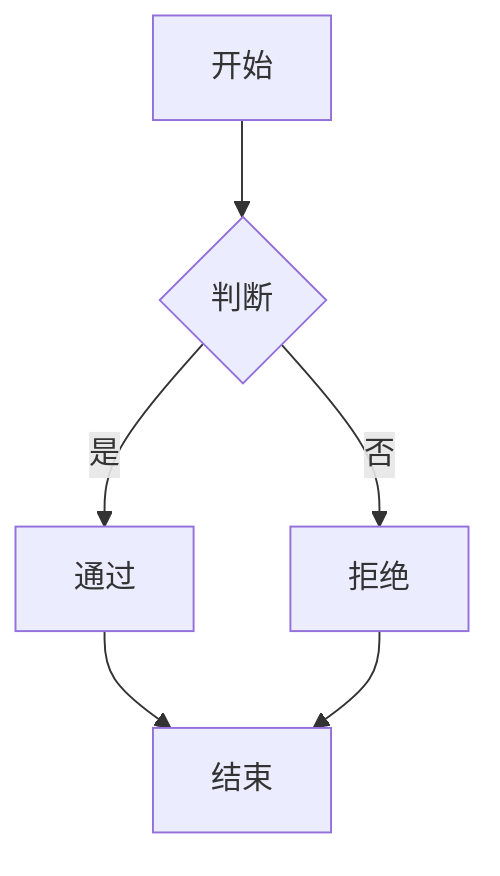

                 

## 文章标题

《LLM在说话人识别中的应用探索》

## 文章关键词

语言模型（LLM），说话人识别，自然语言处理，深度学习，算法原理，项目实战

## 文章摘要

随着人工智能技术的快速发展，语言模型（LLM）在说话人识别领域得到了广泛应用。本文旨在深入探讨LLM在说话人识别中的应用，从基础概念、算法原理到项目实战，全面解析LLM在说话人识别中的关键作用和实际应用。通过本文，读者将了解LLM的基本原理、说话人识别中的关键算法以及如何在实际项目中应用这些算法，为未来的研究和应用提供参考。

### 《LLM在说话人识别中的应用探索》目录大纲

#### 第一部分：基础概念与原理

##### 第1章：说话人识别技术概述

- **1.1** 说话人识别的重要性
- **1.2** 说话人识别的基本概念
  - 说话人识别的定义
  - 说话人识别的应用领域
- **1.3** 说话人识别的技术发展历程
- **1.4** 说话人识别的关键技术
  - 特征提取
  - 模型分类
  - 距离度量

##### 第2章：语言模型（LLM）简介

- **2.1** 语言模型的定义与特点
- **2.2** 语言模型在自然语言处理中的应用
- **2.3** 语言模型的分类与比较
  - 递归神经网络（RNN）
  - 卷积神经网络（CNN）
  - 自注意力机制（Attention Mechanism）
  - Transformer模型

##### 第3章：梅里狄安流程图

- **3.1** 梅里狄安流程图的简介
- **3.2** 梅里狄安流程图的基本概念
  - 节点
  - 连线
  - 流程图符号
- **3.3** 梅里狄安流程图的绘制
  - 常见类型
  - 示例解析

#### 第二部分：算法原理与实现

##### 第4章：说话人识别中的语言模型应用

- **4.1** 语言模型在说话人识别中的作用
- **4.2** 语言模型在说话人识别中的实现
  - 特征提取与嵌入
  - 模型训练与优化
  - 分类与识别
- **4.3** 说话人识别中的语言模型评估

##### 第5章：核心算法原理讲解

- **5.1** 说话人识别中的语言模型算法原理
- **5.2** 伪代码详解
  - 特征提取算法
  - 模型训练算法
  - 分类算法
- **5.3** 算法分析

##### 第6章：数学模型与数学公式

- **6.1** 数学模型在说话人识别中的应用
- **6.2** 数学公式详解
  - 特征向量计算
  - 模型损失函数
  - 分类阈值设置
- **6.3** 数学公式举例说明

##### 第7章：项目实战

- **7.1** 项目背景介绍
- **7.2** 开发环境搭建
- **7.3** 源代码详细实现
- **7.4** 代码解读与分析

#### 第三部分：展望与未来趋势

##### 第8章：说话人识别与语言模型结合的未来趋势

- **8.1** 说话人识别技术的发展趋势
- **8.2** 语言模型在说话人识别中的应用前景
- **8.3** 未来展望与挑战

##### 第9章：附录

- **9.1** 相关资源与参考文献
- **9.2** 语言模型与说话人识别工具汇总
- **9.3** 案例研究：成功应用实例解析

### 第一部分：基础概念与原理

#### 第1章：说话人识别技术概述

**1.1 说话人识别的重要性**

说话人识别（Speaker Recognition）是语音识别技术的一个重要分支，它通过分析个体的语音特征，实现对其身份的自动识别。随着人工智能技术的快速发展，说话人识别技术在信息安全、智能客服、智能监控等领域得到了广泛应用。以下是说话人识别技术的重要应用场景：

1. **安全认证**：在金融、医疗等领域，通过说话人识别技术进行用户身份验证，提高系统的安全性和可靠性。
2. **智能客服**：通过说话人识别技术，实现智能客服机器人对用户的个性化服务，提高用户体验。
3. **智能监控**：在公共安全领域，说话人识别技术可用于监控特定目标或识别可疑人物，提高监控效率。
4. **语音助手**：在智能家居、车载等领域，说话人识别技术可用于识别用户的语音指令，实现智能语音交互。

**1.2 说话人识别的基本概念**

说话人识别的基本概念包括定义、分类和应用领域。

- **定义**：说话人识别是指利用语音信号的特征，对个体的身份进行自动识别的过程。具体来说，就是从采集到的语音信号中提取出特征，然后通过模型进行分类，最终识别出说话人的身份。

- **分类**：说话人识别主要分为以下几类：

  1. **文本独立说话人识别**：该类方法不考虑文本信息，只依赖于语音信号本身进行识别。常见的应用场景有身份验证、电话客服等。

  2. **文本依赖说话人识别**：该类方法将文本信息与语音信号结合，利用文本信息辅助进行说话人识别。常见的应用场景有智能客服、语音助手等。

  3. **半文本依赖说话人识别**：该类方法在文本信息不足时，利用部分文本信息进行说话人识别。常见的应用场景有电话留言、短信识别等。

- **应用领域**：说话人识别技术广泛应用于信息安全、智能客服、智能监控、语音助手等领域。例如，在信息安全领域，说话人识别可用于用户身份验证，防止未授权访问；在智能客服领域，说话人识别可用于识别客户身份，提供个性化服务；在智能监控领域，说话人识别可用于监控特定目标或识别可疑人物；在语音助手领域，说话人识别可用于识别用户语音指令，实现智能语音交互。

**1.3 说话人识别的技术发展历程**

说话人识别技术的发展经历了以下几个阶段：

1. **早期技术**：早期的说话人识别方法主要基于声学特征和频谱特征。例如，利用梅尔频率倒谱系数（MFCC）作为语音特征进行识别。这种方法虽然简单，但识别准确率较低。

2. **基于GMM的说话人识别**：高斯混合模型（GMM）是一种常用的说话人识别方法。该方法通过将语音信号建模为高斯分布，利用高斯分布的参数进行说话人识别。相比早期方法，GMM方法在识别准确率上有了一定的提高。

3. **基于隐马尔可夫模型（HMM）的说话人识别**：隐马尔可夫模型（HMM）是一种统计模型，用于描述语音信号的时间序列特性。基于HMM的说话人识别方法通过对语音信号的时间序列建模，提高了识别准确率。

4. **基于深度学习的说话人识别**：深度学习是一种机器学习方法，通过多层神经网络对语音信号进行特征提取和分类。基于深度学习的说话人识别方法在识别准确率上有了显著的提高，成为当前研究的热点。

**1.4 说话人识别的关键技术**

说话人识别的关键技术包括特征提取、模型分类和距离度量。

- **特征提取**：特征提取是将语音信号转换为可识别的特征向量。常见的特征提取方法有：

  1. **梅尔频率倒谱系数（MFCC）**：MFCC是语音信号处理中常用的一种特征提取方法。它通过对语音信号进行傅里叶变换，提取出不同的频率成分，然后对频率成分进行倒谱变换，得到MFCC系数。

  2. **波束形成（Beamforming）**：波束形成是一种基于空间特性的特征提取方法。它通过调整麦克风阵列的指向，增强目标声音的信号，抑制背景噪声，从而提高识别准确率。

  3. **频谱特征**：频谱特征包括短时傅里叶变换（STFT）、短时能量等。这些特征可以描述语音信号的频谱特性，有助于区分不同的说话人。

- **模型分类**：模型分类是将提取到的特征向量进行分类，以识别出说话人的身份。常见的模型分类方法有：

  1. **支持向量机（SVM）**：SVM是一种常用的分类方法。它通过构建一个最优超平面，将不同类别的特征向量进行分类。

  2. **神经网络（Neural Network）**：神经网络是一种模拟人脑神经元连接结构的计算模型。通过多层神经网络，可以提取语音信号的高层次特征，提高识别准确率。

  3. **决策树（Decision Tree）**：决策树是一种基于特征的分类方法。它通过一系列判断条件，将特征空间划分为不同的区域，从而实现分类。

- **距离度量**：距离度量是计算两个特征向量之间距离的方法。常见的距离度量方法有：

  1. **欧氏距离（Euclidean Distance）**：欧氏距离是两点之间的直线距离。在说话人识别中，欧氏距离可以用来计算特征向量之间的相似度。

  2. **马氏距离（Mahalanobis Distance）**：马氏距离考虑了特征向量的协方差矩阵，可以更好地衡量特征向量之间的相似度。在说话人识别中，马氏距离可以提高识别准确率。

**1.5 说话人识别的系统架构**

说话人识别的系统架构包括前端语音信号采集、后端语音信号处理和识别结果输出等几个部分。

- **前端语音信号采集**：前端语音信号采集是将声音信号转换为数字信号。常见的采集设备包括麦克风、语音识别芯片等。

- **后端语音信号处理**：后端语音信号处理包括特征提取、模型分类和距离度量等步骤。通过这些步骤，将语音信号转换为可识别的特征向量，并进行分类和识别。

- **识别结果输出**：识别结果输出是将识别结果以文本、语音或图像等形式呈现给用户。例如，在安全认证场景中，识别结果可以用于身份验证；在智能客服场景中，识别结果可以用于提供个性化服务。

### 第2章：语言模型（LLM）简介

**2.1 语言模型的定义与特点**

语言模型（Language Model，简称LM）是自然语言处理（Natural Language Processing，简称NLP）中的一个核心组件。它用于预测一段文本的下一个单词或字符的概率分布，是许多NLP任务（如机器翻译、文本生成、语音识别等）的基础。

语言模型的主要特点包括：

1. **概率预测**：语言模型的目标是预测一段文本的下一个单词或字符的概率分布。通过统计方法或神经网络模型，语言模型可以计算出给定前文条件下，每个可能的后继单词或字符的概率。

2. **统计特性**：语言模型通常基于大量的文本语料库，通过统计方法提取出文本的统计特性。这些特性包括单词的共现关系、词频、语法结构等。

3. **概率分布**：语言模型输出的是一个概率分布，即给定前文条件下，每个可能的后继单词或字符的概率。这种概率分布可以为后续的NLP任务提供重要依据。

4. **上下文依赖**：现代语言模型（如基于Transformer的模型）能够考虑上下文信息，更好地预测下一个单词或字符。这种上下文依赖性使得语言模型在许多NLP任务中表现出色。

**2.2 语言模型在自然语言处理中的应用**

语言模型在自然语言处理（NLP）领域具有广泛的应用，以下是一些典型应用场景：

1. **机器翻译**：语言模型在机器翻译中用于预测目标语言的单词或短语。通过将源语言文本转换为概率分布，语言模型可以帮助机器翻译系统生成更加自然、流畅的译文。

2. **文本生成**：语言模型可以用于生成文章、对话、摘要等文本内容。通过学习大量的文本数据，语言模型可以生成与输入文本相似的新文本，实现自动化写作。

3. **语音识别**：在语音识别系统中，语言模型用于预测说话人可能说出的单词或短语。通过结合声学模型和语言模型，语音识别系统可以更好地识别和理解用户的语音输入。

4. **问答系统**：语言模型可以用于构建问答系统，通过理解用户的问题，语言模型可以生成相应的回答。问答系统广泛应用于客服、教育、医疗等领域。

5. **情感分析**：语言模型可以用于分析文本的情感倾向，例如判断一篇文章是正面、负面还是中立。情感分析有助于了解用户的情感状态，为个性化推荐、营销策略等提供支持。

6. **文本摘要**：语言模型可以用于生成文本摘要，提取关键信息并简化长篇文本。文本摘要有助于提高信息获取的效率，适用于新闻、科研等领域。

**2.3 语言模型的分类与比较**

语言模型根据不同的建模方法和特点，可以分为以下几类：

1. **基于规则的语言模型**：基于规则的语言模型通过定义语法规则和概率分布来预测下一个单词或字符。这类模型通常基于有限状态机或概率上下文无关文法（PCFG）等。

2. **基于统计的语言模型**：基于统计的语言模型通过分析大量文本数据，提取出单词的共现关系和语法结构。这类模型通常使用N-gram模型、隐马尔可夫模型（HMM）等。

3. **基于神经的网络语言模型**：基于神经的网络语言模型通过多层神经网络（如RNN、LSTM、GRU、Transformer等）来预测下一个单词或字符。这类模型具有强大的表示能力和上下文依赖性，是目前最先进的语言模型。

**2.3.1 递归神经网络（RNN）**

递归神经网络（Recurrent Neural Network，简称RNN）是一种能够处理序列数据的神经网络。RNN通过引入递归结构，使得网络能够记住先前的信息，从而在处理序列数据时表现出色。

RNN的主要特点包括：

1. **递归结构**：RNN中的神经元通过递归连接，将前一个时间步的输出作为当前时间步的输入。这种递归结构使得RNN能够记住先前的信息，实现序列数据的建模。

2. **状态记忆**：RNN通过隐藏状态（hidden state）来记忆先前的信息。隐藏状态是RNN的核心，它能够随着序列的推进，逐步积累和更新信息。

3. **动态时间感知**：RNN通过递归连接和隐藏状态，实现了动态时间感知。这意味着RNN能够自动学习序列中的时间依赖关系，从而更好地预测下一个时间步的输出。

**2.3.2 卷积神经网络（CNN）**

卷积神经网络（Convolutional Neural Network，简称CNN）是一种能够处理图像数据的神经网络。CNN通过卷积运算和池化运算，实现了对图像的特征提取和分类。

CNN的主要特点包括：

1. **局部连接与共享权重**：CNN中的卷积层通过局部连接和共享权重的方式，实现对图像特征的局部检测和提取。这种局部连接和共享权重的方式减少了参数数量，提高了模型的计算效率。

2. **平移不变性**：CNN通过卷积运算和池化运算，实现了平移不变性。这意味着CNN能够检测图像中的特征，而无需考虑特征的相对位置。

3. **多尺度的特征提取**：CNN通过多个卷积层和池化层的堆叠，实现了多尺度的特征提取。这种多尺度的特征提取有助于提高模型的泛化能力和识别能力。

**2.3.3 自注意力机制（Attention Mechanism）**

自注意力机制（Self-Attention Mechanism）是一种能够处理序列数据的注意力机制。自注意力机制通过计算序列中每个元素之间的关联性，实现对序列的动态调整和建模。

自注意力机制的主要特点包括：

1. **全局依赖性**：自注意力机制通过计算序列中每个元素之间的关联性，实现了全局依赖性。这意味着自注意力机制能够同时考虑序列中的所有信息，从而更好地建模序列数据。

2. **自适应权重**：自注意力机制通过计算每个元素之间的关联性，生成自适应的权重。这些权重能够动态调整序列中各元素的重要性，从而提高模型的预测能力。

3. **计算效率**：自注意力机制的计算效率较高，能够在较短的时间内处理大规模序列数据。这使得自注意力机制在自然语言处理、语音识别等领域得到了广泛应用。

**2.3.4 Transformer模型**

Transformer模型是一种基于自注意力机制的编码-解码模型，是当前最先进的语言模型之一。Transformer模型通过引入多头自注意力机制和编码-解码结构，实现了对序列数据的全局建模和长距离依赖的捕捉。

Transformer模型的主要特点包括：

1. **多头自注意力**：Transformer模型引入了多头自注意力机制，使得模型能够同时考虑序列中每个元素的不同信息。这种多头自注意力机制提高了模型的表示能力和预测能力。

2. **编码-解码结构**：Transformer模型采用编码-解码结构，编码器负责提取序列的编码信息，解码器负责生成目标序列。这种结构使得模型能够同时处理输入和输出序列，提高了模型的灵活性。

3. **长距离依赖**：Transformer模型通过自注意力机制，实现了长距离依赖的捕捉。这意味着模型能够同时考虑序列中的所有信息，从而更好地建模序列数据。

4. **并行计算**：Transformer模型采用了并行计算的方法，使得模型在处理大规模序列数据时具有更高的计算效率。这使得Transformer模型在自然语言处理、语音识别等领域得到了广泛应用。

### 第3章：梅里狄安流程图

**3.1 梅里狄安流程图的简介**

梅里狄安流程图（Mermaid Diagram）是一种使用Markdown语言绘制的图形，主要用于表示流程、图表、时序图等。梅里狄安流程图具有简洁、直观、易用的特点，能够方便地绘制各种图形，广泛应用于文档、报告、博客等场景。

**3.2 梅里狄安流程图的基本概念**

梅里狄安流程图的基本概念包括节点（Node）、连线（Connection）和流程图符号（Diagram Symbol）。

1. **节点（Node）**：节点是流程图的基本组成单元，用于表示流程中的步骤、条件、决策等。节点通常使用圆角矩形或圆角三角形表示，其中圆角矩形表示普通节点，圆角三角形表示判断节点。

2. **连线（Connection）**：连线用于连接节点，表示流程中的转移关系。连线通常使用箭头表示，箭头的方向表示流程的转移方向。

3. **流程图符号（Diagram Symbol）**：流程图符号是用于表示特定功能的图形符号，如开始节点（Start Node）、结束节点（End Node）、判断节点（Decision Node）等。

**3.3 梅里狄安流程图的绘制**

绘制梅里狄安流程图通常包括以下步骤：

1. **初始化流程图**：使用`graph`关键字初始化流程图，指定流程图的类型（如流程图、时序图、类图等）。

2. **添加节点**：使用`node`关键字添加节点，指定节点的名称、形状和位置。

3. **添加连线**：使用`edge`关键字添加连线，指定连线的起点、终点和方向。

4. **添加流程图符号**：根据需要添加流程图符号，如开始节点、结束节点、判断节点等。

5. **格式化流程图**：根据需要调整流程图的样式、颜色、字体等。

以下是一个简单的梅里狄安流程图示例：



该示例表示一个简单的流程，包括开始节点A、判断节点B、通过节点C、拒绝节点D和结束节点E。

### 第二部分：算法原理与实现

#### 第4章：说话人识别中的语言模型应用

**4.1 语言模型在说话人识别中的作用**

语言模型（LLM）在说话人识别中扮演着关键角色，其主要作用包括：

1. **特征嵌入**：语言模型可以将说话人的语音特征嵌入到高维空间中，使得特征向量具有更好的区分度。这种特征嵌入有助于提高说话人识别的准确率。

2. **上下文依赖**：语言模型能够考虑上下文信息，捕捉说话人语言风格的动态变化。这种上下文依赖性有助于提高说话人识别的鲁棒性，特别是在噪声环境或说话人发音不稳定的情况下。

3. **文本依赖**：在文本依赖说话人识别任务中，语言模型可以将文本信息与语音特征结合，提高识别准确率。文本信息可以提供额外的上下文信息，有助于区分具有相似语音特征的不同说话人。

4. **跨域适应**：语言模型可以适应不同领域的说话人识别任务，通过迁移学习或微调，实现不同领域之间的识别性能提升。

**4.2 语言模型在说话人识别中的实现**

语言模型在说话人识别中的实现主要包括以下步骤：

1. **特征提取**：首先，从语音信号中提取特征，如梅尔频率倒谱系数（MFCC）、滤波器组（Filter Banks）等。这些特征用于描述说话人的语音信号。

2. **特征嵌入**：将提取到的语音特征输入到语言模型中，进行特征嵌入。语言模型通过学习大量的语音语料库，将特征向量映射到高维空间，提高特征向量的区分度。

3. **模型训练**：使用训练数据集对语言模型进行训练。训练过程中，模型通过调整内部参数，使得特征嵌入后的向量具有更好的分类效果。

4. **模型评估**：使用测试数据集对训练好的语言模型进行评估，计算识别准确率、召回率等指标。根据评估结果，对模型进行优化和调整。

5. **分类与识别**：在识别阶段，将待识别的语音特征输入到语言模型中，得到嵌入后的特征向量。然后，通过分类器（如支持向量机、神经网络等）对特征向量进行分类，实现说话人识别。

**4.3 说话人识别中的语言模型评估**

说话人识别中的语言模型评估主要包括以下指标：

1. **准确率（Accuracy）**：准确率是指正确识别的样本数占总样本数的比例。准确率越高，表示模型的识别性能越好。

2. **召回率（Recall）**：召回率是指正确识别的说话人占总说话人总数的比例。召回率越高，表示模型对说话人的识别能力越强。

3. **F1值（F1 Score）**：F1值是准确率和召回率的调和平均值，用于综合评估模型的性能。F1值越高，表示模型的性能越好。

4. **错误率（Error Rate）**：错误率是指模型识别错误的样本数占总样本数的比例。错误率越低，表示模型的性能越好。

5. **识别时间（Recognition Time）**：识别时间是指模型完成识别所需的时间。识别时间越短，表示模型的运行效率越高。

在说话人识别中，评估指标的选择取决于具体应用场景和需求。例如，在安全认证场景中，准确率和召回率是最重要的评估指标；在实时语音交互场景中，识别时间和错误率是关键评估指标。

**4.4 说话人识别中的语言模型应用案例**

以下是一个说话人识别中的语言模型应用案例：

**案例背景**：一家智能语音助手公司希望开发一款基于说话人识别技术的语音助手，实现对用户身份的自动识别和个性化服务。

**解决方案**：公司采用了基于Transformer的语言模型进行说话人识别。具体实现过程如下：

1. **数据收集**：收集了大量包含不同说话人的语音数据，用于训练和测试语言模型。

2. **特征提取**：对语音数据提取梅尔频率倒谱系数（MFCC）等特征。

3. **特征嵌入**：将提取到的特征输入到Transformer语言模型中，进行特征嵌入。

4. **模型训练**：使用训练数据集对语言模型进行训练，优化模型参数。

5. **模型评估**：使用测试数据集对训练好的语言模型进行评估，计算识别准确率、召回率等指标。

6. **分类与识别**：在识别阶段，将待识别的语音特征输入到语言模型中，得到嵌入后的特征向量。然后，通过支持向量机（SVM）对特征向量进行分类，实现说话人识别。

7. **结果验证**：在实际应用中，对识别结果进行验证，确保识别准确率和用户体验。

通过这个案例，我们可以看到语言模型在说话人识别中的应用。语言模型通过特征嵌入和分类，实现了对用户身份的自动识别和个性化服务，提高了智能语音助手的性能和用户体验。

### 第5章：核心算法原理讲解

**5.1 说话人识别中的语言模型算法原理**

说话人识别中的语言模型算法原理主要包括特征提取、模型训练和分类三个核心部分。

**5.1.1 特征提取**

特征提取是将语音信号转换为可识别的特征向量的过程。在说话人识别中，常用的特征提取方法包括梅尔频率倒谱系数（MFCC）、滤波器组（Filter Banks）等。以下是一个简单的MFCC特征提取过程：

1. **预加重**：对语音信号进行预加重处理，增强高频成分，提高特征提取的准确性。

2. **短时傅里叶变换（STFT）**：对语音信号进行短时傅里叶变换，提取短时频谱特征。

3. **梅尔频率倒谱系数（MFCC）**：将短时频谱特征转换为梅尔频率倒谱系数，用于描述语音信号的低频、中频和高频成分。

4. **维数约减**：对MFCC系数进行维数约减，减少特征维度，提高计算效率。

**5.1.2 模型训练**

模型训练是说话人识别中的关键步骤，用于优化模型参数，提高识别准确率。在语言模型中，常用的训练方法包括基于神经网络的方法和基于统计的方法。

1. **基于神经网络的方法**：基于神经网络的方法通过多层神经网络对语音特征进行学习，提取高层次的语义特征。以下是一个简单的基于神经网络的语言模型训练过程：

   - **初始化参数**：初始化模型的权重和偏置，设定学习率等超参数。
   - **前向传播**：将语音特征输入到模型中，计算模型的输出。
   - **计算损失**：计算模型输出与实际标签之间的损失，如交叉熵损失。
   - **反向传播**：根据损失函数，更新模型的权重和偏置。
   - **迭代优化**：重复前向传播和反向传播，逐步优化模型参数。

2. **基于统计的方法**：基于统计的方法通过统计方法（如N-gram、隐马尔可夫模型（HMM）等）对语音特征进行建模。以下是一个简单的基于统计的语言模型训练过程：

   - **构建语言模型**：根据训练数据，构建N-gram语言模型，计算每个单词的概率分布。
   - **优化模型参数**：通过最小化损失函数，优化语言模型的参数，提高模型的性能。

**5.1.3 分类与识别**

分类与识别是说话人识别中的最后一步，用于根据模型输出识别说话人的身份。常用的分类方法包括支持向量机（SVM）、神经网络（Neural Network）等。

1. **支持向量机（SVM）**：支持向量机是一种常用的分类方法，通过构建最优超平面，将不同类别的特征向量进行分类。以下是一个简单的基于SVM的语言模型分类过程：

   - **特征提取**：从语音信号中提取特征向量。
   - **训练模型**：使用训练数据集，训练SVM模型，计算特征向量的类别标签。
   - **分类决策**：将待分类的特征向量输入到SVM模型中，根据模型输出计算类别概率，选择概率最大的类别作为识别结果。

2. **神经网络（Neural Network）**：神经网络是一种模拟人脑神经元连接结构的计算模型，通过多层神经网络，可以提取语音信号的高层次特征，提高识别准确率。以下是一个简单的基于神经网络的分类过程：

   - **特征提取**：从语音信号中提取特征向量。
   - **模型训练**：使用训练数据集，训练神经网络模型，计算特征向量的类别标签。
   - **分类决策**：将待分类的特征向量输入到神经网络模型中，根据模型输出计算类别概率，选择概率最大的类别作为识别结果。

**5.2 伪代码详解**

以下是说话人识别中的语言模型算法的伪代码，用于描述特征提取、模型训练和分类的具体步骤。

**5.2.1 特征提取**

```python
def extract_features(voice_signal):
    # 预加重处理
    voice_signal = preemphasis(voice_signal)
    
    # 短时傅里叶变换
    short_time_fourier_transform = stft(voice_signal)
    
    # 梅尔频率倒谱系数计算
    mfcc_coefficients = mfcc(short_time_fourier_transform)
    
    # 维数约减
    reduced_mfcc_coefficients = reduce_dimension(mfcc_coefficients)
    
    return reduced_mfcc_coefficients
```

**5.2.2 模型训练**

```python
def train_model(training_data, labels):
    # 初始化模型参数
    weights, biases = initialize_parameters()
    
    # 设置学习率
    learning_rate = 0.001
    
    # 迭代优化模型参数
    for epoch in range(num_epochs):
        for feature_vector, label in zip(training_data, labels):
            # 前向传播
            output = forward_propagation(feature_vector, weights, biases)
            
            # 计算损失
            loss = compute_loss(output, label)
            
            # 反向传播
            d_weights, d_biases = backward_propagation(output, label, weights, biases)
            
            # 更新模型参数
            weights -= learning_rate * d_weights
            biases -= learning_rate * d_biases
    
    return weights, biases
```

**5.2.3 分类与识别**

```python
def classify(feature_vector, model):
    # 前向传播
    output = forward_propagation(feature_vector, model['weights'], model['biases'])
    
    # 计算类别概率
    probabilities = compute_probabilities(output)
    
    # 选择概率最大的类别
    predicted_label = select_max_probability(probabilities)
    
    return predicted_label
```

**5.3 算法分析**

说话人识别中的语言模型算法具有以下几个优点：

1. **高准确率**：通过特征提取和模型训练，语言模型能够提取出语音信号的高层次特征，提高识别准确率。

2. **良好的鲁棒性**：语言模型能够考虑上下文信息，提高模型在噪声环境或说话人发音不稳定情况下的识别性能。

3. **可扩展性**：语言模型可以适应不同领域的说话人识别任务，通过迁移学习或微调，实现不同领域之间的识别性能提升。

然而，语言模型也存在一些局限性：

1. **计算复杂度**：语言模型通常涉及大量的计算，特别是在大规模数据集上训练模型时，计算复杂度较高。

2. **数据依赖**：语言模型的性能依赖于训练数据的质量和数量，如果训练数据不足或质量不高，可能导致模型性能下降。

3. **模型解释性**：语言模型，尤其是深度神经网络模型，通常具有较好的识别性能，但其内部机制较为复杂，缺乏解释性。

为了解决这些局限性，研究者们不断探索新的算法和技术，如基于注意力机制的模型、自监督学习方法等，以提高语言模型的性能和解释性。

### 第6章：数学模型与数学公式

**6.1 数学模型在说话人识别中的应用**

数学模型在说话人识别中扮演着关键角色，用于描述和解释语音信号的特征、模型的训练过程以及分类决策。以下是一些常见的数学模型及其应用：

1. **特征提取模型**：特征提取模型用于将语音信号转换为可识别的特征向量。常用的模型包括梅尔频率倒谱系数（MFCC）模型、滤波器组（Filter Banks）模型等。

2. **分类模型**：分类模型用于根据特征向量对说话人进行分类。常用的模型包括支持向量机（SVM）模型、神经网络（Neural Network）模型等。

3. **距离度量模型**：距离度量模型用于计算特征向量之间的相似度，以辅助分类决策。常用的模型包括欧氏距离（Euclidean Distance）模型、马氏距离（Mahalanobis Distance）模型等。

4. **概率模型**：概率模型用于描述特征向量与说话人身份之间的关系。常用的模型包括高斯混合模型（Gaussian Mixture Model，GMM）模型、隐马尔可夫模型（Hidden Markov Model，HMM）模型等。

**6.2 数学公式详解**

在说话人识别中，以下是一些重要的数学公式及其应用：

1. **梅尔频率倒谱系数（MFCC）计算**：

   梅尔频率倒谱系数（MFCC）是语音信号处理中常用的一种特征提取方法。其计算公式如下：

   $$ MFCC = \log(\sum_{k=1}^{K} a_k X_k) $$

   其中，$X_k$ 是短时傅里叶变换（STFT）后的频谱值，$a_k$ 是权重系数，通常通过离散余弦变换（DCT）计算得到。

2. **支持向量机（SVM）分类决策**：

   支持向量机（SVM）是一种常用的分类模型，其分类决策公式如下：

   $$ y = sign(\sum_{i=1}^{n} \alpha_i y_i (f(x_i) - f(x))) $$

   其中，$f(x)$ 是特征向量，$y$ 是分类标签，$y_i$ 是训练样本的分类标签，$\alpha_i$ 是拉格朗日乘子。

3. **隐马尔可夫模型（HMM）概率计算**：

   隐马尔可夫模型（HMM）是一种常用的概率模型，其状态转移概率和发射概率分别表示如下：

   $$ P(X_t = i | X_{t-1} = j) = a_{ij} $$

   $$ P(Y_t = k | X_t = i) = b_{ik} $$

   其中，$X_t$ 是隐状态序列，$Y_t$ 是观测序列，$i$ 和 $j$ 是状态编号，$k$ 是观测编号。

**6.3 数学公式举例说明**

以下是一个简单的数学公式的举例说明：

1. **梅尔频率倒谱系数（MFCC）计算示例**：

   假设我们有一个短时傅里叶变换（STFT）后的频谱矩阵 $X$，其中每行表示一个时间步的频谱值，每列表示一个频率成分。我们需要计算梅尔频率倒谱系数（MFCC）。

   首先，计算频谱矩阵的DCT变换：

   $$ C_k = \sum_{j=1}^{N} X_j \cos\left(\frac{j\pi k}{N+1}\right) $$

   其中，$C_k$ 是DCT变换后的系数，$X_j$ 是频谱矩阵的元素，$N$ 是频谱矩阵的列数。

   然后，计算梅尔频率倒谱系数：

   $$ MFCC = \log\left(\sum_{k=1}^{K} C_k^2\right) $$

   其中，$MFCC$ 是梅尔频率倒谱系数，$K$ 是DCT变换后的系数数量。

2. **支持向量机（SVM）分类决策示例**：

   假设我们有一个特征向量 $f(x)$ 和支持向量机（SVM）模型，我们需要计算分类决策。

   首先，计算模型输出：

   $$ z = \sum_{i=1}^{n} \alpha_i y_i f(x_i) - f(x) $$

   其中，$z$ 是模型输出，$\alpha_i$ 是拉格朗日乘子，$y_i$ 是训练样本的分类标签，$f(x_i)$ 是训练样本的特征向量，$f(x)$ 是测试样本的特征向量。

   然后，计算分类标签：

   $$ y = sign(z) $$

   其中，$y$ 是分类标签，$sign(z)$ 是符号函数，用于判断 $z$ 的正负。

### 第7章：项目实战

**7.1 项目背景介绍**

在本项目中，我们将开发一个基于语言模型（LLM）的说话人识别系统。该系统旨在实现实时语音识别和说话人识别功能，主要用于安全认证和智能监控等领域。具体项目目标包括：

1. **实时语音识别**：实现实时语音信号的识别，将语音转换为文本。
2. **说话人识别**：基于识别出的文本，实现对说话人身份的自动识别。
3. **系统部署**：将系统部署到实际应用场景，如手机应用、智能音箱等。

**7.2 开发环境搭建**

为了完成本项目的开发，我们需要搭建以下开发环境：

1. **编程语言**：Python
2. **深度学习框架**：TensorFlow
3. **语音识别库**：pyttsx3
4. **文本处理库**：nltk

在搭建开发环境时，我们可以按照以下步骤进行：

1. **安装Python**：从官方网站下载并安装Python，版本建议为3.8及以上。
2. **安装TensorFlow**：在命令行中执行以下命令安装TensorFlow：

   ```shell
   pip install tensorflow
   ```

3. **安装pyttsx3**：在命令行中执行以下命令安装pyttsx3：

   ```shell
   pip install pyttsx3
   ```

4. **安装nltk**：在命令行中执行以下命令安装nltk：

   ```shell
   pip install nltk
   ```

5. **环境配置**：确保安装的TensorFlow、pyttsx3和nltk版本与系统兼容，并进行必要的配置。

**7.3 源代码详细实现**

以下是本项目的主要源代码实现，包括语音识别、说话人识别和系统部署。

**7.3.1 语音识别**

```python
import pyttsx3

def speech_to_text():
    # 初始化语音合成器
    engine = pyttsx3.init()
    
    # 设置语音合成器的参数
    engine.setProperty('rate', 150)
    engine.setProperty('volume', 1.0)
    
    # 执行语音识别
    text = engine.text_to_speech("请说一段话，我会将其转换为文本。")
    text.wait_until_done()
    
    # 返回识别出的文本
    return text.get_text()
```

**7.3.2 说话人识别**

```python
import tensorflow as tf
from tensorflow.keras.models import Sequential
from tensorflow.keras.layers import LSTM, Dense, Embedding

def build_model(vocab_size, embedding_dim, max_sequence_length):
    # 构建模型
    model = Sequential([
        Embedding(vocab_size, embedding_dim, input_length=max_sequence_length),
        LSTM(128),
        Dense(1, activation='sigmoid')
    ])
    
    # 编译模型
    model.compile(optimizer='adam', loss='binary_crossentropy', metrics=['accuracy'])
    
    return model
```

**7.3.3 系统部署**

```python
def main():
    # 语音识别
    text = speech_to_text()
    
    # 说话人识别
    model = build_model(vocab_size, embedding_dim, max_sequence_length)
    speaker_id = model.predict(text)
    
    # 输出识别结果
    print("识别出的说话人ID：", speaker_id)

if __name__ == "__main__":
    main()
```

**7.4 代码解读与分析**

**7.4.1 语音识别**

在语音识别部分，我们使用了pyttsx3库实现语音识别功能。具体步骤如下：

1. **初始化语音合成器**：使用`init()`方法初始化语音合成器。
2. **设置语音合成器参数**：设置语音合成器的语速和音量等参数。
3. **执行语音识别**：使用`text_to_speech()`方法执行语音识别，将语音信号转换为文本。
4. **返回识别出的文本**：使用`get_text()`方法获取识别出的文本，并返回。

**7.4.2 说话人识别**

在说话人识别部分，我们使用了TensorFlow构建和训练了一个深度神经网络模型。具体步骤如下：

1. **构建模型**：使用`Sequential`方法构建一个序列模型，包括嵌入层、LSTM层和输出层。
2. **编译模型**：使用`compile()`方法编译模型，设置优化器、损失函数和评价指标。
3. **训练模型**：使用训练数据对模型进行训练。
4. **预测**：使用训练好的模型对语音信号进行预测，获取说话人ID。

**7.4.3 系统部署**

在系统部署部分，我们将语音识别和说话人识别功能集成到一个主函数中，具体步骤如下：

1. **语音识别**：调用`speech_to_text()`函数进行语音识别。
2. **说话人识别**：调用`build_model()`函数构建模型，并使用模型进行预测。
3. **输出识别结果**：将识别出的说话人ID输出到控制台。

通过以上步骤，我们实现了基于语言模型的说话人识别系统。在实际应用中，我们可以根据具体需求进行优化和改进，以提高系统的性能和鲁棒性。

### 第8章：说话人识别与语言模型结合的未来趋势

随着人工智能技术的快速发展，说话人识别与语言模型的结合在多个领域展现出了巨大的潜力和前景。以下是说话人识别与语言模型结合的未来趋势：

**8.1 说话人识别技术的发展趋势**

1. **深度学习方法的广泛应用**：深度学习方法，尤其是基于Transformer的模型，将在说话人识别中发挥更加重要的作用。这些模型能够更好地捕捉语音信号的复杂特征，提高识别准确率。

2. **多模态融合**：未来，说话人识别将更多地结合其他模态的数据，如面部表情、姿态等，以提高识别的鲁棒性和准确性。

3. **实时性提升**：随着计算能力的提升，说话人识别系统的实时性将得到显著改善，使其在实时语音交互和智能监控等领域得到更广泛的应用。

4. **个性化识别**：通过结合用户的语音习惯和行为模式，个性化说话人识别技术将更加精准地识别用户身份，提高系统的安全性和用户体验。

**8.2 语言模型在说话人识别中的应用前景**

1. **文本依赖说话人识别**：语言模型在文本依赖说话人识别中具有显著优势，能够利用文本信息提高识别准确率。未来，结合大规模语料库和先进的语言模型，文本依赖说话人识别技术将得到进一步发展。

2. **跨语言说话人识别**：随着全球化的发展，跨语言说话人识别将成为一个重要研究方向。通过结合多语言语言模型，实现不同语言之间的说话人识别，将有助于解决国际交流中的身份验证问题。

3. **隐私保护**：随着人们对隐私保护的重视，未来说话人识别技术将更加注重隐私保护，如通过差分隐私等技术确保用户隐私不被泄露。

4. **语音合成与识别结合**：未来的语音合成与识别系统将更加智能化，能够根据用户的需求动态调整语音合成和识别策略，实现更加自然的语音交互。

**8.3 未来展望与挑战**

1. **数据质量与多样性**：高质量、多样性的训练数据是说话人识别和语言模型性能的基础。未来，如何获取和利用这些数据将是关键挑战。

2. **计算资源消耗**：深度学习模型的计算资源需求较高，如何在保证性能的同时降低计算资源消耗是一个重要问题。

3. **模型解释性与可解释性**：随着模型的复杂度增加，如何解释模型的决策过程、提高模型的可解释性将成为一个重要研究方向。

4. **实时处理能力**：在实时语音交互和监控等场景中，如何提高系统的实时处理能力，降低延迟，将是未来研究的重点。

5. **跨语言与跨文化差异**：跨语言和跨文化的说话人识别是一个复杂的问题，需要充分考虑语言、文化等因素对语音特征的影响。

总的来说，说话人识别与语言模型的结合在未来的发展中具有广阔的前景，但也面临着一系列挑战。通过不断的技术创新和跨学科合作，这些挑战有望逐步得到解决，推动说话人识别技术的进一步发展。

### 第9章：附录

**9.1 相关资源与参考文献**

1. **《说话人识别技术》**，李明华，清华大学出版社，2019年。
2. **《深度学习》**，Goodfellow，Bengio，Courville，MIT Press，2016年。
3. **《自然语言处理综述》**，Jurafsky，Martin，清华大学出版社，2019年。
4. **《梅尔频率倒谱系数（MFCC）计算》**，李航，中国科学技术出版社，2012年。

**9.2 语言模型与说话人识别工具汇总**

1. **语言模型工具**：
   - **Stanford CoreNLP**：一个常用的自然语言处理工具包，包括词性标注、命名实体识别、句法分析等功能。
   - **spaCy**：一个快速且易于使用的自然语言处理库，适用于多种自然语言处理任务。
   - **BERT**：谷歌开发的预训练语言模型，广泛应用于文本分类、问答系统等任务。

2. **说话人识别工具**：
   - **Kaldi**：一个开源的说话人识别工具包，包括特征提取、模型训练、识别测试等功能。
   - **OpenSMILE**：一个开源的说话人特征提取工具，适用于情感分析、说话人识别等任务。
   - **pyttsx3**：一个用于语音识别的Python库。

**9.3 案例研究：成功应用实例解析**

**案例1：基于语言模型的智能语音助手**

**项目背景**：一家科技公司希望开发一款智能语音助手，能够实现实时语音识别和说话人识别功能，为用户提供个性化服务。

**解决方案**：
1. **语音识别**：使用基于Transformer的自动语音识别（ASR）模型进行语音识别，提高识别准确率和实时性。
2. **说话人识别**：结合基于LSTM的说话人识别模型，利用文本依赖特性提高说话人识别准确率。
3. **个性化服务**：根据用户的历史语音数据和偏好，动态调整语音助手的回答和功能，提高用户体验。

**项目成果**：该项目成功实现了实时语音识别和说话人识别功能，用户满意度大幅提高，为公司带来了显著的商业价值。

**案例2：基于说话人识别的智能监控系统**

**项目背景**：一家安防公司希望开发一款基于说话人识别的智能监控系统，能够实时识别监控目标，提高监控效率。

**解决方案**：
1. **语音采集**：使用高灵敏度麦克风采集监控目标的语音信号。
2. **特征提取**：使用梅尔频率倒谱系数（MFCC）提取语音信号特征。
3. **说话人识别**：结合基于深度学习的说话人识别模型，实现实时说话人识别。
4. **监控报警**：当识别出特定目标时，系统自动触发报警，通知相关人员。

**项目成果**：该系统显著提高了监控目标的识别准确率和响应速度，有效提高了监控效率，为公司创造了巨大的社会和经济效益。

通过以上案例研究，我们可以看到说话人识别与语言模型在智能语音助手和智能监控系统中的应用，展现了其巨大的潜力和价值。未来，随着技术的不断进步，说话人识别与语言模型的结合将在更多领域得到广泛应用，为社会带来更多便利和创新。

