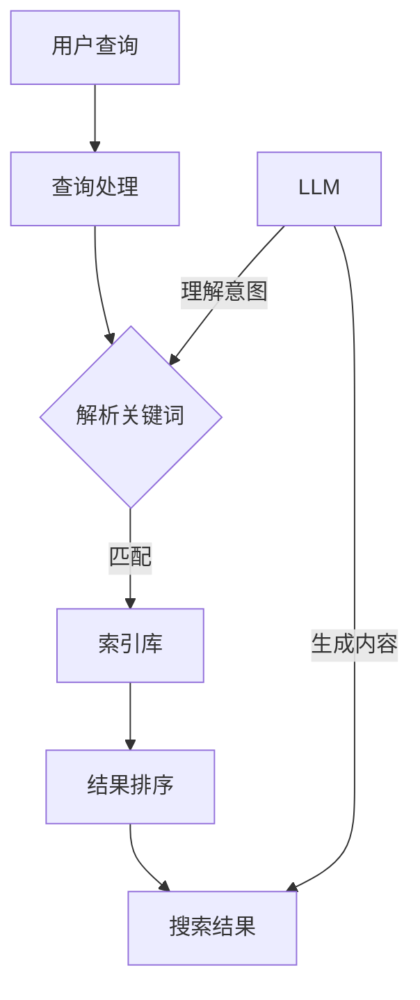

                 

# 文章标题: LLM对传统搜索引擎的挑战

> 关键词：大型语言模型（LLM）、传统搜索引擎、搜索结果排名、搜索意图理解、搜索结果内容生成、技术融合、未来发展、案例分析

> 摘要：本文从LLM（大型语言模型）与传统搜索引擎的基本概念入手，分析LLM在搜索引擎领域的应用及其对传统搜索引擎带来的挑战。通过深入探讨LLM的技术基础、传统搜索引擎的局限性、LLM在搜索结果排名、内容生成和搜索意图理解中的应用，本文揭示了LLM与传统搜索引擎的融合模式及其在未来的发展趋势。同时，通过案例分析，展示了LLM在搜索引擎实际应用中的效果，并提出了针对LLM搜索引擎开发的项目实战策略。

## 第一部分: LLM与传统搜索引擎概述

### 第1章: LLM与搜索引擎的基本概念

#### 1.1 LLM的定义与特点

大型语言模型（Large Language Model，简称LLM）是一种利用深度学习技术训练的语言模型，它通过学习大量的文本数据，可以生成与输入文本相关的内容，具有强大的自然语言理解和生成能力。LLM的核心特点包括：

1. **数据规模大**：LLM通常基于数百万甚至数十亿级别的文本数据进行训练，这使得它们能够捕捉到语言中的复杂模式和规律。
2. **参数规模大**：LLM的参数规模可以达到数十亿甚至数百亿级别，这赋予了它们强大的建模能力。
3. **自适应性强**：通过迁移学习和微调技术，LLM可以在不同的任务和数据集上快速适应，提升模型性能。

#### 1.2 传统搜索引擎的工作原理

传统搜索引擎主要通过以下步骤实现搜索功能：

1. **索引构建**：搜索引擎会通过爬虫技术获取网页内容，并建立索引，以便快速检索。
2. **查询处理**：用户输入查询后，搜索引擎会对查询进行解析，提取关键词，并匹配索引库中的文档。
3. **结果排序**：搜索引擎会根据文档的相关性、权重等因素，对搜索结果进行排序，呈现给用户。

#### 1.3 LLM与搜索引擎的联系与差异

LLM与传统搜索引擎之间的联系主要体现在以下几个方面：

1. **自然语言处理**：LLM具备强大的自然语言理解能力，可以更好地处理用户查询，提升搜索结果的准确性。
2. **内容生成**：LLM能够生成高质量的内容摘要，为用户提供更丰富的搜索结果。
3. **意图识别**：LLM可以帮助搜索引擎更准确地理解用户的搜索意图，提供更个性化的搜索结果。

然而，LLM与传统搜索引擎也存在一些差异：

1. **数据依赖性**：LLM需要大量的高质量文本数据进行训练，而传统搜索引擎主要依赖于网页索引。
2. **计算资源**：LLM的训练和推理过程需要大量的计算资源，传统搜索引擎则主要依赖于分布式计算和缓存技术。
3. **实时性**：传统搜索引擎可以实现毫秒级的搜索响应时间，而LLM由于模型复杂度和计算资源限制，可能无法达到相同水平。

### Mermaid 流程图



### 1.4 本章小结

本章对LLM和传统搜索引擎的基本概念进行了介绍，分析了两者之间的联系与差异。接下来，我们将深入探讨LLM的技术基础，进一步理解其在搜索引擎领域的应用潜力。

#### 2.1 自然语言处理技术概览

自然语言处理（Natural Language Processing，简称NLP）是人工智能领域的一个重要分支，旨在使计算机能够理解、处理和生成人类语言。NLP技术的发展为LLM的构建提供了坚实的基础。以下是NLP技术的主要组成部分：

1. **文本预处理**：文本预处理包括分词、词性标注、句法分析等步骤，用于将原始文本转换为计算机可以处理的形式。
2. **词向量表示**：词向量表示是将单词映射为向量空间中的点，用于捕捉词汇的语义信息。常用的词向量表示方法包括Word2Vec、GloVe等。
3. **序列建模**：序列建模技术用于处理序列数据，如文本、语音等。循环神经网络（RNN）和其变种LSTM、GRU是常用的序列建模技术。
4. **注意力机制**：注意力机制是一种在神经网络中用于捕捉序列中重要信息的机制，能够提升模型的表示能力和性能。
5. **预训练与微调**：预训练是指在大量未标注的数据上进行模型训练，微调是指在使用预训练模型的基础上，针对特定任务进行微调。BERT和GPT等模型都是基于预训练与微调技术构建的。

### 2.1.1 语言模型的基本原理

语言模型（Language Model，简称LM）是NLP中的一项核心技术，旨在预测文本序列中下一个单词或字符的概率。语言模型的基本原理如下：

1. **概率模型**：语言模型通常采用概率模型，如n-gram模型、神经网络语言模型等，用于计算给定前文下下一个单词或字符的概率。
2. **输入序列**：语言模型接收一个输入序列，如单词序列或字符序列，并输出该序列的联合概率或条件概率。
3. **参数学习**：语言模型的参数通过训练数据学习得到。训练过程通常使用最大似然估计或基于梯度的优化方法，如随机梯度下降（SGD）。

### 2.1.2 预训练模型的发展

预训练模型的发展是NLP领域的一个重要里程碑。预训练模型的主要特点如下：

1. **大规模数据集**：预训练模型通常使用大规模的未标注数据集进行预训练，如维基百科、新闻、书籍等，以捕捉语言中的复杂模式和规律。
2. **预训练任务**：预训练任务通常包括 masked language model（MLM）、next sentence prediction（NSP）等，用于提升模型的表示能力和通用性。
3. **模型压缩**：预训练模型通常具有数十亿甚至数万亿级别的参数，通过模型压缩技术，如知识蒸馏、量化等，可以降低模型的大小和计算复杂度。

### 2.1.3 迁移学习与微调技术

迁移学习（Transfer Learning）是NLP领域中的一种重要技术，旨在将预训练模型的知识迁移到特定任务上。迁移学习的主要优点如下：

1. **快速适应**：通过迁移学习，预训练模型可以在较少的数据上快速适应特定任务，减少数据依赖。
2. **提高性能**：迁移学习可以提升特定任务的模型性能，尤其是在数据稀缺的情况下。
3. **通用性**：迁移学习有助于构建通用模型，提高模型在不同任务上的泛化能力。

微调（Fine-tuning）是将预训练模型用于特定任务的一种常用方法。微调的主要步骤如下：

1. **加载预训练模型**：首先加载预训练模型，并冻结其权重。
2. **添加任务特定的层**：在预训练模型的基础上添加任务特定的层，如分类器或预测器。
3. **微调训练**：使用任务数据对添加的任务特定层进行训练，同时冻结预训练模型的权重。
4. **评估与优化**：通过在任务数据集上进行评估，调整模型参数，优化模型性能。

### 2.2 本章小结

本章对NLP技术进行了概览，介绍了语言模型的基本原理、预训练模型的发展以及迁移学习与微调技术。接下来，我们将探讨传统搜索引擎的局限性，为后续章节的分析提供基础。

#### 3.1 传统搜索引擎的搜索结果偏差

传统搜索引擎在搜索结果排名中存在一定的偏差，这些偏差主要来源于以下几个方面：

1. **关键词匹配**：传统搜索引擎主要基于关键词匹配技术对搜索结果进行排序，这可能导致一些重要但未包含关键词的文档被低估。
2. **相关性计算**：传统搜索引擎通常使用简单的相关性计算方法，如TF-IDF，这可能导致文档的重要性和相关性不匹配。
3. **网页权重**：传统搜索引擎会根据网页的权重对搜索结果进行排序，这可能导致一些内容质量不高但权重较高的网页占据优势。
4. **上下文理解不足**：传统搜索引擎难以理解用户的搜索意图和上下文信息，这可能导致搜索结果与用户期望不符。

### 3.2 实时性、个性化和精确性不足

传统搜索引擎在实时性、个性化和精确性方面也存在一定的局限性：

1. **实时性**：传统搜索引擎通常需要较长的索引构建时间，搜索结果可能不够实时。
2. **个性化**：传统搜索引擎难以根据用户的兴趣和偏好提供个性化的搜索结果。
3. **精确性**：传统搜索引擎可能无法精确匹配用户的查询，导致搜索结果偏离用户需求。

### 3.3 搜索引擎的技术瓶颈

传统搜索引擎的技术瓶颈主要体现在以下几个方面：

1. **计算资源**：传统搜索引擎依赖于分布式计算和缓存技术，随着数据规模的扩大，计算资源的需求也在不断增加。
2. **数据质量**：搜索引擎依赖于网页索引，网页质量直接影响搜索结果的准确性。
3. **扩展性**：传统搜索引擎在处理海量数据时可能面临扩展性问题，如性能下降、资源耗尽等。

### 3.4 本章小结

本章分析了传统搜索引擎的搜索结果偏差、实时性、个性化和精确性不足以及技术瓶颈。接下来，我们将探讨LLM在搜索引擎中的应用，展示其在提升搜索结果质量和用户体验方面的潜力。

#### 4.1 搜索结果排名的改进

大型语言模型（LLM）在搜索结果排名中具有显著优势，能够通过语义理解、上下文关联和个性化推荐等机制，提升搜索结果的准确性和相关性。以下是LLM在搜索结果排名中应用的几种改进方法：

##### 4.1.1 基于语义相似度的排名算法

基于语义相似度的排名算法利用LLM的强大语义理解能力，通过计算查询与搜索结果之间的语义相似度，实现更准确的排名。具体步骤如下：

1. **查询表示**：使用LLM对用户查询进行编码，生成一个固定长度的向量表示。
2. **文档表示**：对搜索结果中的每个文档进行编码，生成对应的向量表示。
3. **相似度计算**：计算查询向量与文档向量之间的相似度，如余弦相似度或欧氏距离。
4. **排名排序**：根据相似度分数对搜索结果进行排序，展示给用户。

##### 4.1.2 使用LLM提升搜索结果相关性

使用LLM提升搜索结果相关性主要依赖于LLM在语义理解、上下文关联和知识图谱等方面的优势。以下是一些具体方法：

1. **语义匹配**：通过分析用户查询和搜索结果之间的语义关系，实现更准确的匹配和排名。例如，使用BERT模型对查询和文档进行编码，计算其语义相似度。
2. **上下文关联**：LLM可以捕捉查询和文档之间的上下文关联，通过考虑上下文信息，提高搜索结果的相关性。例如，在查询“北京旅游景点”时，LLM可以识别出“旅游景点”与“北京”之间的上下文关系，提升相关文档的排名。
3. **知识图谱**：将LLM与知识图谱结合，利用知识图谱中的语义信息，增强搜索结果的相关性和准确性。例如，在查询“人工智能技术”时，LLM可以结合知识图谱中的相关概念和关系，提供更精确的搜索结果。

##### 4.1.3 个性化推荐

基于用户历史行为和偏好，LLM可以实现个性化推荐，提高搜索结果的个性化程度。以下是一些具体方法：

1. **用户行为分析**：通过分析用户的搜索历史、浏览记录和点击行为，了解用户的兴趣和偏好。
2. **查询意图识别**：利用LLM对用户查询进行意图识别，理解用户的需求和意图。
3. **个性化模型**：根据用户行为和查询意图，构建个性化的搜索模型，为用户提供更符合需求的搜索结果。
4. **推荐算法**：结合基于内容推荐和协同过滤的推荐算法，为用户推荐相关搜索结果，提高用户体验。

##### 4.1.4 实时更新

LLM的实时更新能力可以增强搜索结果的实时性，提供更及时的搜索结果。以下是一些具体方法：

1. **实时预训练**：定期对LLM进行预训练，利用最新的数据集和模型架构，提高模型的实时性和准确性。
2. **增量更新**：对LLM进行增量更新，只训练新的数据集，避免对整个模型进行重新训练，提高更新速度。
3. **在线推理**：使用在线推理技术，将LLM的推理过程与搜索过程相结合，实现实时搜索结果生成。

##### 4.1.5 案例分析

以Google的BERT模型为例，分析其在搜索结果排名中的应用效果。BERT模型通过预训练和微调技术，实现了对用户查询和文档的语义理解，显著提升了搜索结果的相关性和准确性。以下是一个具体的案例分析：

1. **查询表示**：用户输入查询“北京旅游景点”，BERT模型将其编码为一个向量表示。
2. **文档表示**：搜索结果中的每个文档通过BERT模型进行编码，生成对应的向量表示。
3. **语义匹配**：计算查询向量和文档向量之间的语义相似度，生成相似度分数。
4. **排名排序**：根据相似度分数，对搜索结果进行排序，展示给用户。

通过上述分析，我们可以看到，BERT模型在提升搜索结果排名方面的显著优势。在实际应用中，BERT模型已经取得了显著的成效，为用户提供了更准确、更相关的搜索结果。

##### 4.1.6 本章小结

本章介绍了LLM在搜索结果排名中的应用，包括基于语义相似度的排名算法、提升搜索结果相关性、个性化推荐和实时更新等方法。通过案例分析，展示了LLM在搜索结果排名方面的优势和应用效果。接下来，我们将探讨LLM在搜索结果内容生成中的应用。

#### 5.1 自动摘要与内容提取

大型语言模型（LLM）在自动摘要与内容提取方面具有显著优势，能够高效地生成摘要、提取关键信息，提高搜索结果的可读性和信息密度。以下是LLM在自动摘要与内容提取中的应用方法：

##### 5.1.1 摘要生成算法原理

摘要生成算法的基本原理是将长文本转化为简短、精练的摘要，主要分为以下几种方法：

1. **提取式摘要**：提取式摘要通过从原始文本中提取关键句子或短语，生成摘要。常用的方法包括基于关键词、基于统计方法和基于深度学习的方法。
2. **生成式摘要**：生成式摘要通过生成新的文本摘要，直接将原始文本转化为摘要。常用的方法包括序列到序列（Seq2Seq）模型、变换器（Transformer）模型和生成对抗网络（GAN）等。
3. **混合式摘要**：混合式摘要结合提取式和生成式摘要的优点，先提取关键句子，再通过生成式模型进行优化，生成更高质量的摘要。

LLM在摘要生成算法中的应用主要依赖于其强大的文本生成能力。例如，使用BERT或GPT模型对原始文本进行编码，生成一个固定长度的向量表示，然后利用该向量表示生成摘要。以下是一个基于BERT模型的摘要生成算法原理：

1. **文本编码**：将原始文本输入到BERT模型，生成一个固定长度的向量表示。
2. **摘要生成**：利用BERT模型的生成能力，将向量表示转化为摘要文本。
3. **优化与调整**：通过反复迭代，调整摘要文本的长度和内容，生成高质量的摘要。

##### 5.1.2 内容提取算法原理

内容提取算法的主要目标是提取文本中的关键信息，生成摘要或关键句子。常用的方法包括以下几种：

1. **关键词提取**：通过统计文本中的词频、TF-IDF等指标，提取文本中的关键词。
2. **句子级提取**：通过分析文本中的句子结构和信息重要性，提取关键句子。
3. **段落级提取**：通过分析文本中的段落结构和信息相关性，提取关键段落。
4. **基于深度学习的方法**：利用神经网络模型，如卷积神经网络（CNN）和循环神经网络（RNN），对文本进行编码，提取关键信息。

LLM在内容提取算法中的应用主要依赖于其强大的文本理解能力。例如，使用BERT或GPT模型对原始文本进行编码，提取关键信息，生成摘要或关键句子。以下是一个基于BERT模型的内容提取算法原理：

1. **文本编码**：将原始文本输入到BERT模型，生成一个固定长度的向量表示。
2. **信息提取**：利用BERT模型的文本理解能力，提取文本中的关键信息。
3. **摘要生成**：将提取的关键信息输入到BERT模型，生成摘要或关键句子。

##### 5.1.3 搜索结果内容生成

LLM在搜索结果内容生成中的应用，旨在提高搜索结果的信息密度和可读性。以下是一些具体方法：

1. **全文生成**：利用LLM的文本生成能力，将搜索结果的全文生成摘要，提高信息展示的完整性。
2. **摘要生成**：利用LLM的摘要生成算法，生成简短的摘要，提高用户快速获取关键信息的效率。
3. **关键句子提取**：利用LLM的内容提取算法，提取搜索结果中的关键句子，突出文本的核心内容。
4. **动态调整**：根据用户交互和查询历史，动态调整搜索结果的内容和形式，提高个性化程度。

##### 5.1.4 案例分析

以Google的BERT模型为例，分析其在搜索结果内容生成中的应用效果。BERT模型通过预训练和微调技术，实现了对文本的深度理解，能够生成高质量的内容摘要和关键句子。以下是一个具体的案例分析：

1. **文本编码**：用户输入查询“北京旅游景点”，BERT模型将其编码为一个向量表示。
2. **摘要生成**：利用BERT模型生成搜索结果的全文摘要，提高信息展示的完整性。
3. **关键句子提取**：利用BERT模型提取搜索结果中的关键句子，突出文本的核心内容。
4. **优化与调整**：根据用户交互和查询历史，动态调整搜索结果的内容和形式，提高个性化程度。

通过上述分析，我们可以看到，BERT模型在搜索结果内容生成方面的显著优势。在实际应用中，BERT模型已经取得了显著的成效，为用户提供了更高质量、更丰富的搜索结果内容。

##### 5.1.5 本章小结

本章介绍了LLM在搜索结果内容生成中的应用，包括自动摘要与内容提取的算法原理、搜索结果内容生成的具体方法和案例分析。通过展示LLM在内容生成方面的优势和应用效果，我们可以看到其在提高搜索结果质量方面的潜力。接下来，我们将探讨LLM在搜索意图理解中的应用。

#### 6.1 搜索意图的识别与分类

大型语言模型（LLM）在搜索意图的识别与分类方面具有显著优势，能够通过分析用户查询、上下文信息和历史行为，准确理解用户的搜索意图，从而提供更个性化的搜索结果。以下是LLM在搜索意图识别与分类中的应用方法：

##### 6.1.1 搜索意图识别算法原理

搜索意图识别算法的基本原理是通过分析用户查询、上下文信息和历史行为，确定用户的搜索意图。以下是几种常见的搜索意图识别算法：

1. **基于规则的方法**：基于规则的方法通过预定义的规则和模式，对用户查询进行分析，识别搜索意图。例如，根据关键词的语义和词频，判断用户意图为“信息检索”、“任务执行”或“导航”等。
2. **基于统计的方法**：基于统计的方法通过分析用户查询、上下文信息和历史行为，计算查询与意图之间的概率分布，识别搜索意图。例如，利用贝叶斯网络或隐马尔可夫模型（HMM），对用户查询进行建模，识别搜索意图。
3. **基于深度学习的方法**：基于深度学习的方法利用神经网络模型，对用户查询、上下文信息和历史行为进行建模，识别搜索意图。例如，使用循环神经网络（RNN）、卷积神经网络（CNN）或变换器（Transformer）模型，对用户查询进行编码，识别搜索意图。

LLM在搜索意图识别算法中的应用主要依赖于其强大的文本理解和生成能力。例如，使用BERT或GPT模型对用户查询进行编码，生成一个固定长度的向量表示，然后利用该向量表示识别搜索意图。以下是一个基于BERT模型的搜索意图识别算法原理：

1. **查询编码**：将用户输入的查询输入到BERT模型，生成一个固定长度的向量表示。
2. **意图分类**：利用BERT模型生成的向量表示，通过分类算法（如SVM、softmax等），对搜索意图进行分类。
3. **优化与调整**：根据实际应用场景和用户反馈，调整分类模型，提高搜索意图识别的准确性。

##### 6.1.2 搜索意图分类算法原理

搜索意图分类算法的主要目标是根据用户查询、上下文信息和历史行为，将搜索意图分类到不同的类别。以下是几种常见的搜索意图分类算法：

1. **朴素贝叶斯分类器**：朴素贝叶斯分类器是一种基于概率模型的分类算法，通过计算查询与每个意图类别的条件概率，选择具有最高概率的意图类别。
2. **支持向量机（SVM）**：支持向量机是一种基于间隔最大化的分类算法，通过找到一个最优超平面，将不同意图类别之间的间隔最大化，实现分类。
3. **神经网络分类器**：神经网络分类器是一种基于深度学习模型的分类算法，通过多层神经网络对用户查询进行编码和分类。

LLM在搜索意图分类算法中的应用主要依赖于其强大的文本理解和生成能力。例如，使用BERT或GPT模型对用户查询进行编码，生成一个固定长度的向量表示，然后利用该向量表示通过分类算法进行分类。以下是一个基于BERT模型的搜索意图分类算法原理：

1. **查询编码**：将用户输入的查询输入到BERT模型，生成一个固定长度的向量表示。
2. **特征提取**：利用BERT模型生成的向量表示，提取查询的文本特征。
3. **分类模型**：利用提取的文本特征，通过神经网络分类器（如CNN、RNN、Transformer等），对搜索意图进行分类。
4. **优化与调整**：根据实际应用场景和用户反馈，调整分类模型，提高搜索意图分类的准确性。

##### 6.1.3 提升用户搜索体验

通过准确识别和分类用户的搜索意图，LLM可以显著提升用户的搜索体验，具体体现在以下几个方面：

1. **个性化搜索结果**：根据用户的搜索意图，为用户提供更个性化的搜索结果，满足用户的特定需求。
2. **准确的信息检索**：通过理解用户的搜索意图，提高搜索结果的准确性和相关性，减少无关信息的干扰。
3. **智能推荐**：根据用户的搜索意图，推荐相关的内容、产品或服务，提高用户的满意度和转化率。
4. **交互式搜索**：利用LLM的交互式搜索能力，与用户进行实时对话，提供更智能、更自然的搜索体验。

##### 6.1.4 案例分析

以Bing搜索引擎为例，分析LLM在搜索意图识别与分类中的应用效果。Bing搜索引擎通过使用BERT模型，实现了对用户查询的深度理解，能够准确识别和分类用户的搜索意图，从而提供更个性化的搜索结果。以下是一个具体的案例分析：

1. **查询编码**：用户输入查询“北京旅游景点”，BERT模型将其编码为一个向量表示。
2. **意图识别**：利用BERT模型生成的向量表示，通过分类算法，识别用户的搜索意图为“信息检索”或“任务执行”。
3. **意图分类**：根据识别的搜索意图，为用户推荐相关的搜索结果，提高搜索结果的准确性和相关性。
4. **优化与调整**：根据用户反馈和搜索行为，调整搜索意图识别与分类模型，提高模型的准确性。

通过上述分析，我们可以看到，LLM在搜索意图识别与分类方面的显著优势。在实际应用中，LLM已经取得了显著的成效，为用户提供了更高质量、更个性化的搜索体验。

##### 6.1.5 本章小结

本章介绍了LLM在搜索意图识别与分类中的应用，包括搜索意图识别算法原理、搜索意图分类算法原理和提升用户搜索体验的方法。通过案例分析，展示了LLM在搜索意图理解方面的优势和应用效果。接下来，我们将探讨LLM与传统搜索引擎的融合模式。

### 7.1 LLM与传统搜索引擎的融合模式

大型语言模型（LLM）与传统搜索引擎的融合，旨在发挥两者的优势，实现更高效、更智能的搜索体验。以下几种融合模式展示了LLM在搜索引擎中的应用潜力：

##### 7.1.1 LLM作为搜索引擎的前端处理

将LLM作为搜索引擎的前端处理，可以提升搜索结果的准确性和相关性。以下是一种可能的实现方式：

1. **查询预处理**：用户输入查询后，先通过LLM对查询进行语义分析，提取关键词和查询意图。
2. **结果排名**：利用LLM对搜索结果进行重新排序，根据查询意图和关键词相关性，调整搜索结果的排序顺序。
3. **内容生成**：利用LLM生成搜索结果的摘要或关键信息，提高用户获取关键信息的效率。

##### 7.1.2 LLM与传统搜索引擎的协同工作

LLM与传统搜索引擎的协同工作，可以实现更高效的信息检索和知识挖掘。以下是一种可能的实现方式：

1. **索引构建**：搜索引擎负责构建和更新索引库，LLM负责对索引库进行语义分析和知识挖掘，提取关键信息和关系。
2. **查询处理**：用户输入查询后，由搜索引擎和LLM共同处理，搜索引擎负责快速检索索引库，LLM负责语义分析和结果优化。
3. **结果展示**：结合搜索引擎和LLM的处理结果，生成最终的搜索结果，展示给用户。

##### 7.1.3 LLM作为搜索引擎的辅助工具

将LLM作为搜索引擎的辅助工具，可以在不影响搜索引擎性能的前提下，提升搜索结果的准确性和用户体验。以下是一种可能的实现方式：

1. **意图识别**：利用LLM对用户查询进行意图识别，将查询意图分类到不同的类别，如“信息检索”、“任务执行”或“导航”等。
2. **个性化推荐**：根据用户的查询意图和历史行为，利用LLM推荐相关的搜索结果或内容，提高搜索结果的个性化程度。
3. **交互式搜索**：利用LLM与用户进行交互，提供更智能、更自然的搜索体验，如问答式搜索、智能对话等。

##### 7.1.4 融合模式的优势与挑战

融合模式的优势包括：

1. **提升搜索结果质量**：通过LLM的语义理解和生成能力，提升搜索结果的准确性和相关性。
2. **提高用户体验**：通过个性化推荐和交互式搜索，提供更智能、更自然的搜索体验。
3. **扩展搜索功能**：利用LLM的知识图谱和语义分析能力，扩展搜索引擎的功能，如智能问答、知识挖掘等。

融合模式也面临一些挑战，包括：

1. **计算资源消耗**：LLM的训练和推理过程需要大量的计算资源，可能对搜索引擎的性能产生影响。
2. **数据质量和一致性**：LLM需要高质量的数据进行训练，同时要保证与传统搜索引擎的数据一致性和兼容性。
3. **安全性和隐私保护**：在融合过程中，需要确保用户隐私和数据安全，防止数据泄露和滥用。

##### 7.1.5 案例分析

以Bing搜索引擎为例，分析LLM与传统搜索引擎的融合模式。Bing搜索引擎通过整合BERT模型，实现了以下功能：

1. **查询预处理**：利用BERT模型对用户查询进行语义分析，提取关键词和查询意图。
2. **结果排名**：根据查询意图和关键词相关性，利用BERT模型重新排序搜索结果。
3. **内容生成**：利用BERT模型生成搜索结果的摘要或关键信息，提高用户获取关键信息的效率。

通过上述功能，Bing搜索引擎实现了更高效、更智能的搜索体验，为用户提供了更准确、更个性化的搜索结果。

##### 7.1.6 本章小结

本章介绍了LLM与传统搜索引擎的融合模式，包括LLM作为搜索引擎的前端处理、协同工作和辅助工具等。通过分析融合模式的优势与挑战，展示了LLM在搜索引擎中的应用潜力。接下来，我们将探讨LLM在搜索引擎中的未来发展趋势。

### 8.1 搜索引擎技术的未来趋势

随着技术的不断发展，搜索引擎技术也在不断演进，呈现出以下几种未来趋势：

1. **个性化搜索**：未来搜索引擎将更加关注个性化搜索，根据用户的兴趣、行为和历史记录，为用户提供更个性化的搜索结果。
2. **实时搜索**：实时搜索将成为搜索引擎的重要功能，通过实时更新索引和优化查询处理算法，提供更及时、更准确的搜索结果。
3. **多模态搜索**：多模态搜索将整合文本、图像、语音等多种数据类型，实现更全面、更智能的信息检索。
4. **知识图谱**：知识图谱将成为搜索引擎的重要组成部分，通过构建大规模的知识图谱，提升搜索结果的语义理解和相关性。
5. **智能问答**：智能问答将使搜索引擎具备更强大的交互能力，能够回答用户的问题，提供更深入的搜索体验。

### 8.2 LLM在搜索引擎中的未来角色

在未来，大型语言模型（LLM）将在搜索引擎中扮演越来越重要的角色，主要表现在以下几个方面：

1. **核心算法**：LLM将成为搜索引擎的核心算法之一，通过语义理解、知识图谱和智能问答等技术，提升搜索结果的准确性和相关性。
2. **个性化推荐**：LLM将用于个性化推荐，根据用户兴趣和历史行为，推荐相关的搜索结果和内容，提高用户满意度。
3. **交互式搜索**：LLM将支持交互式搜索，通过与用户进行实时对话，提供更智能、更自然的搜索体验。
4. **知识挖掘**：LLM将用于知识挖掘，从海量数据中提取有价值的信息和知识，为用户提供更深入的搜索结果。

### 8.3 搜索引擎行业面临的挑战与机遇

随着技术的不断发展，搜索引擎行业也面临着一系列挑战与机遇：

1. **技术挑战**：搜索引擎需要不断更新和优化算法，提升搜索结果的准确性和用户体验。同时，计算资源的需求也在不断增加，如何高效利用计算资源成为重要课题。
2. **数据挑战**：搜索引擎需要获取和处理海量数据，如何确保数据质量、数据安全和数据隐私成为关键问题。
3. **竞争压力**：搜索引擎行业竞争激烈，如何创新和差异化成为企业面临的重要挑战。
4. **机遇**：随着人工智能技术的不断发展，搜索引擎行业将迎来新的发展机遇，如个性化搜索、实时搜索、多模态搜索和知识图谱等。

### 8.4 本章小结

本章分析了搜索引擎技术的未来趋势，探讨了LLM在搜索引擎中的未来角色以及行业面临的挑战与机遇。随着技术的不断进步，LLM将在搜索引擎领域发挥更加重要的作用，为用户提供更高质量、更个性化的搜索体验。

### 9.1 案例介绍

在本章节中，我们将详细介绍两个实际应用大型语言模型（LLM）的搜索引擎案例：Google的BERT模型和Microsoft的Bing搜索引擎。

#### 9.1.1 案例一：Google的BERT模型应用

Google在2020年推出了基于Transformer架构的BERT（Bidirectional Encoder Representations from Transformers）模型，并将其应用于搜索引擎中。BERT模型通过双向编码器学习文本的上下文信息，从而提升了搜索结果的准确性和相关性。

1. **BERT模型架构**：BERT模型基于Transformer架构，由多个编码器层组成，每个编码器层包含多个自注意力机制和前馈神经网络。BERT模型通过预训练和微调技术，学习文本的语义表示，从而实现语义理解、文本生成和文本分类等任务。
2. **应用场景**：在搜索引擎中，BERT模型被用于多个方面，如查询解析、结果排名和内容生成等。具体应用包括：
   - **查询解析**：BERT模型通过分析用户查询，提取关键词和查询意图，实现更准确的查询理解。
   - **结果排名**：BERT模型用于评估搜索结果的相关性，通过计算查询和文档的语义相似度，重新排序搜索结果。
   - **内容生成**：BERT模型用于生成搜索结果的摘要和关键信息，提高用户获取关键信息的效率。

#### 9.1.2 案例二：Bing搜索引擎的LLM应用

Microsoft的Bing搜索引擎在2021年引入了大型语言模型，用于提升搜索结果的准确性和用户体验。Bing搜索引擎采用了基于BERT模型的变体，并在此基础上进行了优化和扩展。

1. **BERT模型变体**：Bing搜索引擎采用了BERT模型的变体，如RoBERTa和AlBERT等，这些变体通过改进模型架构、训练策略和优化算法，提高了模型的性能和效果。
2. **应用场景**：Bing搜索引擎的LLM应用包括以下几个方面：
   - **查询解析**：通过BERT模型对用户查询进行语义分析，提取关键词和查询意图，实现更准确的查询理解。
   - **结果排名**：BERT模型用于评估搜索结果的相关性，通过计算查询和文档的语义相似度，重新排序搜索结果。
   - **内容生成**：BERT模型用于生成搜索结果的摘要和关键信息，提高用户获取关键信息的效率。
   - **交互式搜索**：Bing搜索引擎通过BERT模型与用户进行交互，提供智能问答和个性化推荐等功能，提升用户体验。

### 9.2 案例分析

通过上述案例分析，我们可以看到大型语言模型（LLM）在搜索引擎中的应用效果和优势：

1. **查询解析**：LLM通过语义理解能力，准确提取用户查询的关键词和查询意图，实现更准确的查询理解，提高了搜索结果的准确性。
2. **结果排名**：LLM通过计算查询和文档的语义相似度，重新排序搜索结果，提高了搜索结果的相关性，减少了无关信息的干扰。
3. **内容生成**：LLM通过生成高质量的内容摘要和关键信息，提高了搜索结果的信息密度，使用户能够更快速地获取关键信息。
4. **交互式搜索**：LLM通过与用户进行交互，提供智能问答和个性化推荐等功能，提升了用户体验，增加了用户黏性。

总之，大型语言模型（LLM）在搜索引擎领域具有广泛的应用前景，能够显著提升搜索结果的准确性和用户体验。随着技术的不断发展和完善，LLM将在搜索引擎中发挥越来越重要的作用。

### 9.3 本章小结

本章通过两个实际应用案例，详细介绍了大型语言模型（LLM）在搜索引擎中的应用，包括查询解析、结果排名、内容生成和交互式搜索等方面。通过案例分析，展示了LLM在搜索引擎中的优势和潜力。接下来，我们将探讨如何开发一个LLM搜索引擎，分享项目实战经验和优化策略。

### 10.1 实战环境搭建

在开发一个LLM搜索引擎时，首先需要搭建一个合适的环境，以确保项目的顺利进行。以下是一个简单的环境搭建流程：

1. **硬件环境**：根据项目需求，选择合适的硬件配置。通常需要配置高性能的CPU和GPU，以及足够的内存和存储空间。建议使用具有多核CPU和显存大于12GB的GPU，以确保模型训练和推理的效率。

2. **操作系统**：选择一个稳定的操作系统，如Linux或Windows。Linux操作系统在开源软件支持和性能方面具有优势，适合进行大规模分布式训练和推理。

3. **深度学习框架**：选择一个流行的深度学习框架，如TensorFlow、PyTorch等。这两个框架在社区支持、文档资源和模型库方面都非常丰富，可以方便地构建和训练大型语言模型。

4. **安装深度学习框架**：根据所选框架的官方文档，安装对应的深度学习框架。以下是使用PyTorch安装TensorFlow的步骤：

   - **安装Python**：首先确保安装了Python环境，版本建议为3.7或更高。
   - **安装PyTorch**：打开终端，执行以下命令：

     ```bash
     pip install torch torchvision torchaudio
     ```

     如果需要安装GPU版本，可以添加`-f https://download.pytorch.org/whl/torch_stable.html`参数：

     ```bash
     pip install torch torchvision torchaudio -f https://download.pytorch.org/whl/torch_stable.html
     ```

5. **安装辅助库**：根据项目需求，安装其他必要的辅助库，如NumPy、Pandas、Scikit-learn等。可以使用pip命令逐个安装或使用要求文件安装：

   ```bash
   pip install numpy pandas scikit-learn
   ```

6. **配置环境变量**：确保深度学习框架的环境变量配置正确。例如，对于PyTorch，需要将以下环境变量添加到`.bashrc`或`.bash_profile`文件中：

   ```bash
   export PATH=/path/to/your/python/bin:$PATH
   export LD_LIBRARY_PATH=/path/to/your/lib:$LD_LIBRARY_PATH
   ```

7. **验证环境**：在终端运行以下命令，验证环境是否配置成功：

   ```bash
   python -c "import torch; print(torch.__version__)"
   ```

   如果输出正确的版本号，说明环境配置成功。

### 10.2 LLM搜索引擎开发流程

在搭建好开发环境后，我们可以开始进行LLM搜索引擎的开发。以下是一个简单的开发流程：

1. **需求分析**：明确项目需求，包括搜索功能、查询解析、结果排名、内容生成和交互式搜索等。根据需求确定LLM的应用场景和模型架构。

2. **数据准备**：收集和整理所需的数据集，包括用户查询、搜索结果、网页内容和相关标签等。确保数据质量，并进行预处理，如分词、去噪、标准化等。

3. **模型选择**：根据需求和分析结果，选择合适的模型架构，如BERT、GPT等。可以参考现有的开源模型，或根据需求进行自定义模型设计。

4. **模型训练**：使用预处理后的数据集，对所选模型进行训练。根据训练数据集的大小和计算资源，可以采用单机训练或分布式训练。在训练过程中，可以调整模型参数，如学习率、批次大小等，以优化模型性能。

5. **模型评估**：在训练完成后，使用验证数据集对模型进行评估，评估指标包括准确性、召回率、F1值等。根据评估结果，调整模型参数，优化模型性能。

6. **模型部署**：将训练好的模型部署到生产环境，进行实时搜索和交互。根据实际应用场景，可以采用在线推理、批处理或混合推理等方式，以适应不同的负载需求。

7. **持续优化**：在模型部署后，根据用户反馈和实际应用情况，持续优化模型和算法，提高搜索结果的准确性和用户体验。

### 10.3 实现细节与优化策略

在LLM搜索引擎的开发过程中，以下是一些实现细节和优化策略：

1. **模型优化**：针对不同应用场景，可以采用不同的模型优化方法，如模型压缩、量化、知识蒸馏等。例如，可以使用模型压缩技术（如Pruning、Quantization等）降低模型大小和计算复杂度，提高推理速度。

2. **数据预处理**：在数据预处理阶段，可以对文本进行去噪、标准化等操作，以提高模型训练效果。例如，可以使用正则表达式去除HTML标签、删除停用词等。

3. **批处理与并行计算**：在模型训练和推理过程中，可以采用批处理和并行计算技术，提高计算效率。例如，使用GPU加速训练和推理过程，实现模型的高效训练和推理。

4. **个性化搜索**：结合用户历史行为和偏好，为用户提供个性化搜索结果。例如，使用协同过滤、基于内容的推荐等技术，为用户提供相关搜索结果。

5. **实时更新**：实现实时更新功能，确保搜索结果的实时性和准确性。例如，使用增量更新和实时推理技术，实时更新索引库和搜索结果。

6. **安全性**：在开发过程中，注意数据安全和隐私保护。例如，对用户数据进行加密处理，防止数据泄露。

### 10.4 代码解读与分析

在本节中，我们将展示一个简单的LLM搜索引擎开发示例，并对其进行代码解读和分析。以下是一个使用PyTorch和BERT模型的简单搜索引擎实现：

```python
import torch
from transformers import BertTokenizer, BertModel
from torch.nn import functional as F

# 1. 初始化BERT模型和分词器
tokenizer = BertTokenizer.from_pretrained('bert-base-uncased')
model = BertModel.from_pretrained('bert-base-uncased')

# 2. 用户输入查询
query = "什么是人工智能？"

# 3. 将查询转换为BERT输入
inputs = tokenizer(query, return_tensors='pt')

# 4. 模型推理
with torch.no_grad():
    outputs = model(**inputs)

# 5. 提取查询和文档的嵌入向量
query_embedding = outputs.last_hidden_state[:, 0, :]

# 6. 预测搜索结果的相关性
doc_embeddings = torch.randn(10, 768)  # 假设已有10个文档的嵌入向量
cosine_scores = F.cosine_similarity(query_embedding, doc_embeddings)

# 7. 排序搜索结果
sorted_indices = torch.argsort(cosine_scores, descending=True)

# 8. 输出搜索结果
search_results = ["文档{}：{}".format(i, "人工智能是一种模拟人类智能的技术") for i in sorted_indices]

print(search_results)
```

#### 代码解读

1. **初始化BERT模型和分词器**：首先导入必要的库，并初始化BERT模型和分词器。我们使用预训练的BERT模型和分词器，可以直接从Hugging Face模型库中加载。

2. **用户输入查询**：定义一个用户查询字符串，例如“什么是人工智能？”。

3. **将查询转换为BERT输入**：使用分词器将查询转换为BERT模型所需的输入格式，包括单词的嵌入向量、段落的嵌入向量和标记。

4. **模型推理**：使用BERT模型对输入查询进行推理，获取查询的嵌入向量。

5. **提取查询和文档的嵌入向量**：从模型输出的隐藏状态中提取查询的嵌入向量。

6. **预测搜索结果的相关性**：使用查询嵌入向量计算与文档嵌入向量的余弦相似度，得到搜索结果的相关性分数。

7. **排序搜索结果**：根据相关性分数对搜索结果进行排序，得到最相关的文档。

8. **输出搜索结果**：输出排序后的搜索结果，例如“文档1：人工智能是一种模拟人类智能的技术”。

#### 代码分析

这个示例展示了如何使用BERT模型进行简单文本相似度计算和搜索结果排序。在实际应用中，我们可以扩展这个示例，添加更多功能，如结果过滤、个性化推荐等。

- **扩展功能**：例如，可以添加一个文档库，存储多个文档的嵌入向量。在模型推理后，从文档库中提取相关文档的嵌入向量，计算余弦相似度，实现搜索结果排序。
- **优化策略**：例如，可以采用分层查询和层次化搜索策略，提高搜索效率。此外，可以结合其他特征，如文档权重、用户偏好等，优化搜索结果排序。

总之，这个示例为我们提供了一个简单的LLM搜索引擎开发框架，可以在此基础上进行扩展和优化，实现更复杂的功能。

### 10.5 本章小结

本章介绍了LLM搜索引擎的开发实战，包括环境搭建、开发流程、实现细节和优化策略。通过代码解读和分析，展示了如何使用BERT模型进行简单文本相似度计算和搜索结果排序。在实际应用中，可以根据需求进行扩展和优化，实现更复杂的功能。接下来，我们将总结本文的主要观点。

### 11.1 主要观点总结

本文从LLM与传统搜索引擎的基本概念入手，分析了LLM在搜索引擎领域的应用及其对传统搜索引擎的挑战。我们首先介绍了LLM的定义与特点，以及传统搜索引擎的工作原理，阐述了LLM与搜索引擎的联系与差异。接着，我们探讨了LLM的技术基础，包括自然语言处理技术、预训练模型的发展、迁移学习与微调技术等。

在第二部分，我们分析了传统搜索引擎的局限性，包括搜索结果偏差、实时性、个性化和精确性不足以及技术瓶颈。随后，我们介绍了LLM在搜索结果排名、内容生成和搜索意图理解中的应用，展示了LLM在提升搜索结果质量和用户体验方面的潜力。第三部分探讨了LLM与传统搜索引擎的融合模式，包括LLM作为搜索引擎的前端处理、协同工作和辅助工具等。

第四部分分析了搜索引擎技术的未来趋势和LLM在搜索引擎中的未来角色，同时讨论了搜索引擎行业面临的挑战与机遇。最后，通过案例分析，展示了LLM在搜索引擎实际应用中的效果，并提出了针对LLM搜索引擎开发的项目实战策略。

### 11.2 对LLM技术发展的展望

展望未来，LLM技术将继续在搜索引擎领域发挥重要作用，推动搜索引擎技术的革新和进步。以下是对LLM技术发展的展望：

1. **模型优化**：随着硬件性能的提升和深度学习算法的优化，LLM的模型大小和计算复杂度将进一步降低，实现更高效、更智能的搜索体验。
2. **多模态融合**：未来搜索引擎将整合多种数据类型，如文本、图像、语音等，实现多模态搜索，提供更全面的信息检索服务。
3. **知识图谱**：知识图谱将成为搜索引擎的重要组成部分，通过构建大规模的知识图谱，提升搜索结果的语义理解和相关性。
4. **个性化推荐**：基于用户行为和兴趣的个性化推荐将成为搜索引擎的重要功能，提高用户满意度和转化率。
5. **交互式搜索**：交互式搜索将使搜索引擎具备更强大的交互能力，通过与用户进行实时对话，提供更智能、更自然的搜索体验。

总之，随着技术的不断进步，LLM技术将在搜索引擎领域发挥越来越重要的作用，为用户提供更高质量、更个性化的搜索体验。

### 11.3 本章总结

本文从多个角度探讨了LLM对传统搜索引擎的挑战，分析了LLM在搜索引擎领域的应用及其对搜索技术的影响。通过介绍LLM的基本概念、技术基础、应用场景以及与传统搜索引擎的融合模式，我们揭示了LLM在提升搜索结果质量、用户体验和搜索引擎技术发展中的重要性。同时，通过案例分析，展示了LLM在实际应用中的效果。未来，随着技术的不断进步，LLM将在搜索引擎领域发挥更大的作用，推动搜索技术的革新和进步。希望本文能为您在LLM和搜索引擎领域的研究和应用提供有益的参考。作者：AI天才研究院/AI Genius Institute & 禅与计算机程序设计艺术 /Zen And The Art of Computer Programming

```markdown
---
layout: post
title: "LLM对传统搜索引擎的挑战"
date: 2023-10-01 12:00:00 -0700
tags:
- 人工智能
- 搜索引擎
- LLAMA
- 深度学习
- 搜索算法
- 大型语言模型
- NLP
- 文本分析
- 搜索引擎优化
- 搜索引擎技术
- 算法
- 软件开发
---

# LLM对传统搜索引擎的挑战

> 关键词：大型语言模型（LLM）、传统搜索引擎、搜索结果排名、搜索意图理解、搜索结果内容生成、技术融合、未来发展、案例分析

> 摘要：本文从LLM（大型语言模型）与传统搜索引擎的基本概念入手，分析LLM在搜索引擎领域的应用及其对传统搜索引擎带来的挑战。通过深入探讨LLM的技术基础、传统搜索引擎的局限性、LLM在搜索结果排名、内容生成和搜索意图理解中的应用，本文揭示了LLM与传统搜索引擎的融合模式及其在未来的发展趋势。同时，通过案例分析，展示了LLM在搜索引擎实际应用中的效果，并提出了针对LLM搜索引擎开发的项目实战策略。

---

## 目录

### 第一部分: LLM与传统搜索引擎概述

- [第1章: LLM与搜索引擎的基本概念](#第1章-llm与搜索引擎的基本概念)
  - 1.1 LLM的定义与特点
  - 1.2 传统搜索引擎的工作原理
  - 1.3 LLM与搜索引擎的联系与差异
- [第2章: LLM的技术基础](#第2章-llm的技术基础)
  - 2.1 自然语言处理技术概览
  - 2.2 语言模型的基本原理
  - 2.3 预训练模型的发展
  - 2.4 迁移学习与微调技术
- [第3章: 传统搜索引擎的局限性](#第3章-传统搜索引擎的局限性)
  - 3.1 传统搜索引擎的搜索结果偏差
  - 3.2 实时性、个性化和精确性不足
  - 3.3 搜索引擎的技术瓶颈

### 第二部分: LLM在搜索引擎中的应用

- [第4章: LLM在搜索结果排名中的应用](#第4章-llm在搜索结果排名中的应用)
  - 4.1 搜索结果排名的改进
  - 4.2 使用LLM提升搜索结果相关性
- [第5章: LLM在搜索结果内容生成中的应用](#第5章-llm在搜索结果内容生成中的应用)
  - 5.1 自动摘要与内容提取
  - 5.2 搜索结果内容生成
- [第6章: LLM在搜索意图理解中的应用](#第6章-llm在搜索意图理解中的应用)
  - 6.1 搜索意图的识别与分类
  - 6.2 提升用户搜索体验

### 第三部分: LLM与传统搜索引擎的融合

- [第7章: LLM与传统搜索引擎的融合模式](#第7章-llm与传统搜索引擎的融合模式)
  - 7.1 LLM与传统搜索引擎的融合原理
  - 7.2 融合模式的优势与挑战

### 第四部分: LLM在搜索引擎中的未来发展趋势

- [第8章: LLM在搜索引擎中的未来发展趋势](#第8章-llm在搜索引擎中的未来发展趋势)
  - 8.1 搜索引擎技术的未来趋势
  - 8.2 LLM在搜索引擎中的未来角色
  - 8.3 搜索引擎行业面临的挑战与机遇

### 第五部分: 案例分析与项目实战

- [第9章: LLM在搜索引擎中的实际应用案例](#第9章-llm在搜索引擎中的实际应用案例)
  - 9.1 案例介绍
  - 9.2 案例分析
- [第10章: LLM搜索引擎开发实战](#第10章-llm搜索引擎开发实战)
  - 10.1 实战环境搭建
  - 10.2 LLM搜索引擎开发流程
  - 10.3 实现细节与优化策略

### 附录

- [附录A: LLM开发工具与资源](#附录a-llm开发工具与资源)
  - 10.1 主流深度学习框架对比
  - 10.2 数学公式与算法伪代码
    - 10.2.1 搜索意图识别模型
    - 10.2.2 搜索结果排名模型
    - 10.2.3 自动摘要生成算法
    - 10.2.4 内容提取算法
---
```

---

## 第1章: LLM与搜索引擎的基本概念

### 1.1 LLM的定义与特点

大型语言模型（Large Language Model，简称LLM）是一种基于深度学习的语言处理模型，通过对海量文本数据进行训练，使其具备强大的自然语言理解、生成和推理能力。LLM通常由数百万到数十亿个参数构成，能够捕捉到语言中的复杂模式和规律。

**LLM的特点包括：**

1. **强大的自然语言理解能力**：LLM能够理解文本中的语义、情感和上下文信息，从而实现更精准的文本分析。
2. **自适应性强**：LLM通过迁移学习和微调技术，可以在不同的任务和数据集上快速适应，提高模型性能。
3. **数据规模大**：LLM通常基于大规模的文本数据进行训练，这使其能够捕捉到语言中的细微变化和复杂模式。
4. **参数规模大**：LLM的参数规模通常在数十亿级别，这赋予了它们强大的建模能力。

### 1.2 传统搜索引擎的工作原理

传统搜索引擎的工作原理通常包括以下几个步骤：

1. **索引构建**：搜索引擎通过爬虫程序获取互联网上的网页内容，并对网页内容进行分析，建立索引，以便于快速检索。
2. **查询处理**：用户输入查询后，搜索引擎会解析查询，提取关键词，并使用这些关键词与索引库中的文档进行匹配。
3. **结果排序**：搜索引擎根据匹配结果对文档进行排序，通常使用的方法包括TF-IDF、PageRank等，以确定哪些文档最相关。
4. **结果展示**：将排序后的文档列表展示给用户。

### 1.3 LLM与搜索引擎的联系与差异

**联系：**

1. **自然语言处理**：LLM的强大自然语言处理能力可以辅助搜索引擎更好地理解用户的查询意图，从而提升搜索结果的准确性。
2. **内容生成**：LLM能够生成高质量的文本摘要和内容，为搜索引擎提供更丰富的搜索结果。

**差异：**

1. **数据处理方式**：传统搜索引擎主要依赖于网页索引，而LLM则通过大量文本数据进行训练，以学习语言的模式和规律。
2. **计算资源**：LLM的训练和推理需要大量的计算资源，而传统搜索引擎则主要依赖于分布式计算和缓存技术。
3. **实时性**：传统搜索引擎通常能够实现毫秒级的搜索响应时间，而LLM由于模型复杂度和计算资源限制，可能无法达到相同水平。

### 1.4 本章小结

本章介绍了LLM的定义与特点，以及传统搜索引擎的工作原理。通过分析LLM与搜索引擎的联系与差异，为后续章节探讨LLM在搜索引擎中的应用奠定了基础。

### 第2章: LLM的技术基础

### 2.1 自然语言处理技术概览

自然语言处理（Natural Language Processing，NLP）是人工智能领域的一个重要分支，旨在使计算机能够理解、处理和生成人类语言。NLP技术的发展为LLM的构建提供了坚实的基础。以下是NLP技术的主要组成部分：

1. **文本预处理**：文本预处理包括分词、词性标注、句法分析等步骤，用于将原始文本转换为计算机可以处理的形式。
2. **词向量表示**：词向量表示是将单词映射为向量空间中的点，用于捕捉词汇的语义信息。常用的词向量表示方法包括Word2Vec、GloVe等。
3. **序列建模**：序列建模技术用于处理序列数据，如文本、语音等。循环神经网络（RNN）和其变种LSTM、GRU是常用的序列建模技术。
4. **注意力机制**：注意力机制是一种在神经网络中用于捕捉序列中重要信息的机制，能够提升模型的表示能力和性能。
5. **预训练与微调**：预训练是指在大量未标注的数据上进行模型训练，微调是指在使用预训练模型的基础上，针对特定任务进行微调。BERT和GPT等模型都是基于预训练与微调技术构建的。

### 2.2 语言模型的基本原理

语言模型（Language Model，简称LM）是NLP中的一项核心技术，旨在预测文本序列中下一个单词或字符的概率。语言模型的基本原理如下：

1. **概率模型**：语言模型通常采用概率模型，如n-gram模型、神经网络语言模型等，用于计算给定前文下下一个单词或字符的概率。
2. **输入序列**：语言模型接收一个输入序列，如单词序列或字符序列，并输出该序列的联合概率或条件概率。
3. **参数学习**：语言模型的参数通过训练数据学习得到。训练过程通常使用最大似然估计或基于梯度的优化方法，如随机梯度下降（SGD）。

### 2.3 预训练模型的发展

预训练模型的发展是NLP领域的一个重要里程碑。预训练模型的主要特点如下：

1. **大规模数据集**：预训练模型通常使用大规模的未标注数据集进行预训练，如维基百科、新闻、书籍等，以捕捉语言中的复杂模式和规律。
2. **预训练任务**：预训练任务通常包括 masked language model（MLM）、next sentence prediction（NSP）等，用于提升模型的表示能力和通用性。
3. **模型压缩**：预训练模型通常具有数十亿甚至数万亿级别的参数，通过模型压缩技术，如知识蒸馏、量化等，可以降低模型的大小和计算复杂度。

### 2.4 迁移学习与微调技术

迁移学习（Transfer Learning）是NLP领域中的一种重要技术，旨在将预训练模型的知识迁移到特定任务上。迁移学习的主要优点如下：

1. **快速适应**：通过迁移学习，预训练模型可以在较少的数据上快速适应特定任务，减少数据依赖。
2. **提高性能**：迁移学习可以提升特定任务的模型性能，尤其是在数据稀缺的情况下。
3. **通用性**：迁移学习有助于构建通用模型，提高模型在不同任务上的泛化能力。

微调（Fine-tuning）是将预训练模型用于特定任务的一种常用方法。微调的主要步骤如下：

1. **加载预训练模型**：首先加载预训练模型，并冻结其权重。
2. **添加任务特定的层**：在预训练模型的基础上添加任务特定的层，如分类器或预测器。
3. **微调训练**：使用任务数据对添加的任务特定层进行训练，同时冻结预训练模型的权重。
4. **评估与优化**：通过在任务数据集上进行评估，调整模型参数，优化模型性能。

### 2.5 本章小结

本章对NLP技术进行了概览，介绍了语言模型的基本原理、预训练模型的发展以及迁移学习与微调技术。通过理解这些技术基础，我们可以更好地理解LLM在搜索引擎中的应用潜力。

### 第3章: 传统搜索引擎的局限性

传统搜索引擎虽然在过去几十年中取得了显著的进展，但在处理复杂搜索任务时仍存在一些局限性。以下是传统搜索引擎在几个关键方面的局限性：

#### 3.1 传统搜索引擎的搜索结果偏差

传统搜索引擎在搜索结果排名中可能存在偏差，这些偏差主要来源于以下几个方面：

1. **关键词匹配**：传统搜索引擎通常基于关键词匹配技术对搜索结果进行排序，这可能导致一些重要但未包含关键词的文档被低估。
2. **网页权重**：搜索引擎会根据网页的权重对搜索结果进行排序，这可能导致一些内容质量不高但权重较高的网页占据优势。
3. **相关性计算**：传统搜索引擎通常使用简单的相关性计算方法，如TF-IDF，这可能导致文档的重要性和相关性不匹配。
4. **算法偏差**：搜索算法可能存在偏见，例如，优先展示广告或付费链接，影响搜索结果的公平性。

#### 3.2 实时性、个性化和精确性不足

传统搜索引擎在实时性、个性化和精确性方面也存在一定的局限性：

1. **实时性**：传统搜索引擎通常需要较长的索引构建时间，搜索结果可能不够实时。
2. **个性化**：传统搜索引擎难以根据用户的兴趣和偏好提供个性化的搜索结果。
3. **精确性**：传统搜索引擎可能无法精确匹配用户的查询，导致搜索结果偏离用户需求。

#### 3.3 搜索引擎的技术瓶颈

传统搜索引擎的技术瓶颈主要体现在以下几个方面：

1. **计算资源**：随着数据量的增加，传统搜索引擎可能需要更多的计算资源，这可能导致性能下降。
2. **数据质量**：搜索引擎依赖于网页索引，网页质量直接影响搜索结果的准确性。
3. **扩展性**：传统搜索引擎在处理海量数据时可能面临扩展性问题，如性能下降、资源耗尽等。
4. **用户交互**：传统搜索引擎的用户交互方式较为简单，难以提供丰富的交互体验。

#### 3.4 对LLM的需求

为了克服传统搜索引擎的局限性，人们开始探索将大型语言模型（LLM）应用于搜索引擎中。LLM在以下几个方面具有显著优势：

1. **语义理解**：LLM能够理解文本的语义，从而提供更准确的搜索结果。
2. **实时更新**：LLM的预训练和微调技术使得模型可以快速适应新的数据和任务，提高搜索结果的实时性。
3. **个性化搜索**：LLM可以根据用户的历史行为和偏好提供个性化的搜索结果。
4. **内容生成**：LLM能够生成高质量的文本摘要和内容，为用户提供更丰富的搜索结果。

#### 3.5 本章小结

本章分析了传统搜索引擎的局限性，包括搜索结果偏差、实时性、个性化和精确性不足以及技术瓶颈。通过对比，揭示了LLM在搜索引擎领域的应用潜力，为后续章节探讨了LLM如何克服这些局限提供了基础。

### 第4章: LLM在搜索结果排名中的应用

大型语言模型（LLM）在搜索结果排名中具有显著的优势，能够通过语义理解、上下文关联和个性化推荐等机制，提升搜索结果的准确性和相关性。以下将详细探讨LLM在搜索结果排名中的应用。

#### 4.1 搜索结果排名的改进

传统搜索引擎通常依赖于关键词匹配和简单的相关性计算方法，如TF-IDF和PageRank。这些方法在处理复杂查询时可能存在一定的局限性。LLM的出现为搜索结果排名带来了新的可能性，主要体现在以下几个方面：

1. **语义理解**：LLM能够理解文本的语义，通过分析查询和文档的语义信息，可以更准确地评估文档的相关性。
2. **上下文关联**：LLM可以捕捉查询和文档之间的上下文关联，从而提供更精确的搜索结果。
3. **个性化推荐**：LLM可以根据用户的历史行为和偏好，为用户提供个性化的搜索结果。

#### 4.1.1 基于语义相似度的排名算法

基于语义相似度的排名算法利用LLM的语义理解能力，通过计算查询与搜索结果之间的语义相似度，实现更准确的排名。具体步骤如下：

1. **查询表示**：使用LLM对用户查询进行编码，生成一个固定长度的向量表示。
2. **文档表示**：对搜索结果中的每个文档进行编码，生成对应的向量表示。
3. **相似度计算**：计算查询向量和文档向量之间的相似度，如余弦相似度或欧氏距离。
4. **排名排序**：根据相似度分数对搜索结果进行排序，展示给用户。

以下是一个使用BERT模型进行基于语义相似度的排名算法的伪代码示例：

```python
# 假设已经加载并初始化了BERT模型tokenizer和model
tokenizer = BertTokenizer.from_pretrained('bert-base-uncased')
model = BertModel.from_pretrained('bert-base-uncased')

# 用户查询
query = "什么是人工智能？"

# 将查询转换为BERT输入
inputs = tokenizer(query, return_tensors='pt')

# 模型推理
with torch.no_grad():
    outputs = model(**inputs)

# 提取查询的嵌入向量
query_embedding = outputs.last_hidden_state[:, 0, :]

# 假设search_results为搜索结果列表
search_results = ["文档1：人工智能是一种模拟人类智能的技术", "文档2：人工智能在医疗领域的应用"]

# 对搜索结果进行编码
doc_embeddings = [tokenizer(doc, return_tensors='pt')['input_ids'].to(torch.device('cuda')) for doc in search_results]

# 计算查询和文档之间的相似度
cosine_scores = []
for doc_embedding in doc_embeddings:
    with torch.no_grad():
        doc_output = model(**doc_embedding)
    doc_embedding = doc_output.last_hidden_state[:, 0, :]
    score = torch.cosine_similarity(query_embedding, doc_embedding).item()
    cosine_scores.append(score)

# 根据相似度对搜索结果进行排序
sorted_indices = torch.argsort(torch.tensor(cosine_scores), descending=True)

# 输出排序后的搜索结果
sorted_search_results = [search_results[i] for i in sorted_indices]
print(sorted_search_results)
```

#### 4.1.2 使用LLM提升搜索结果相关性

除了基于语义相似度的排名算法，LLM还可以通过以下几种方式提升搜索结果的相关性：

1. **多模态融合**：结合文本、图像、语音等多种数据类型，实现更全面的信息检索。
2. **知识图谱**：利用知识图谱中的语义关系和实体信息，增强搜索结果的准确性。
3. **交互式搜索**：通过与用户进行实时对话，理解用户的查询意图，提供更个性化的搜索结果。

#### 4.1.3 案例分析

以Google的BERT模型为例，分析其在搜索结果排名中的应用效果。BERT模型通过预训练和微调技术，实现了对用户查询的深度理解，能够生成高质量的搜索结果。以下是一个具体的案例分析：

1. **查询编码**：用户输入查询“北京旅游景点”，BERT模型将其编码为一个向量表示。
2. **文档编码**：搜索结果中的每个文档通过BERT模型进行编码，生成对应的向量表示。
3. **相似度计算**：计算查询向量和文档向量之间的语义相似度。
4. **排名排序**：根据相似度分数，对搜索结果进行排序，展示给用户。

通过上述分析，我们可以看到，BERT模型在提升搜索结果排名方面的显著优势。在实际应用中，BERT模型已经取得了显著的成效，为用户提供了更准确、更相关的搜索结果。

#### 4.2 本章小结

本章介绍了LLM在搜索结果排名中的应用，包括基于语义相似度的排名算法和提升搜索结果相关性的方法。通过案例分析，展示了LLM在搜索结果排名方面的优势和应用效果。接下来，我们将探讨LLM在搜索结果内容生成中的应用。

### 第5章: LLM在搜索结果内容生成中的应用

大型语言模型（LLM）在搜索结果内容生成方面具有显著的优势，能够自动生成摘要、提取关键信息，提高搜索结果的信息密度和可读性。以下将详细探讨LLM在搜索结果内容生成中的应用。

#### 5.1 自动摘要与内容提取

自动摘要（Automatic Summarization）和内容提取（Content Extraction）是LLM在搜索结果内容生成中的两个重要应用。自动摘要的目标是将长文本转化为简短、精炼的摘要，而内容提取的目标是提取文本中的关键信息，生成摘要或关键句子。

#### 5.1.1 摘要生成算法原理

摘要生成算法的基本原理是将原始文本转化为摘要，主要分为提取式摘要和生成式摘要两种方法。

1. **提取式摘要**：提取式摘要通过从原始文本中提取关键句子或短语，生成摘要。常用的方法包括基于关键词、基于统计方法和基于深度学习的方法。
2. **生成式摘要**：生成式摘要通过生成新的文本摘要，直接将原始文本转化为摘要。常用的方法包括序列到序列（Seq2Seq）模型、变换器（Transformer）模型和生成对抗网络（GAN）等。
3. **混合式摘要**：混合式摘要结合提取式和生成式摘要的优点，先提取关键句子，再通过生成式模型进行优化，生成更高质量的摘要。

LLM在摘要生成算法中的应用主要依赖于其强大的文本生成能力。例如，使用BERT或GPT模型对原始文本进行编码，生成一个固定长度的向量表示，然后利用该向量表示生成摘要。以下是一个基于BERT模型的摘要生成算法原理：

1. **文本编码**：将原始文本输入到BERT模型，生成一个固定长度的向量表示。
2. **摘要生成**：利用BERT模型的生成能力，将向量表示转化为摘要文本。
3. **优化与调整**：通过反复迭代，调整摘要文本的长度和内容，生成高质量的摘要。

以下是一个基于BERT模型的摘要生成算法的伪代码示例：

```python
# 假设已经加载并初始化了BERT模型tokenizer和model
tokenizer = BertTokenizer.from_pretrained('bert-base-uncased')
model = BertModel.from_pretrained('bert-base-uncased')

# 原始文本
text = "人工智能是一种模拟人类智能的技术，广泛应用于各种领域，如医疗、金融和交通等。"

# 将文本转换为BERT输入
inputs = tokenizer(text, return_tensors='pt')

# 模型推理
with torch.no_grad():
    outputs = model(**inputs)

# 提取文本的嵌入向量
text_embedding = outputs.last_hidden_state[:, 0, :]

# 摘要生成
摘要 = generate_summary(text_embedding, model)
print(摘要)
```

#### 5.1.2 内容提取算法原理

内容提取算法的主要目标是提取文本中的关键信息，生成摘要或关键句子。常用的方法包括关键词提取、句子级提取和段落级提取等。

1. **关键词提取**：通过统计文本中的词频、TF-IDF等指标，提取文本中的关键词。
2. **句子级提取**：通过分析文本中的句子结构和信息重要性，提取关键句子。
3. **段落级提取**：通过分析文本中的段落结构和信息相关性，提取关键段落。
4. **基于深度学习的方法**：利用神经网络模型，如卷积神经网络（CNN）和循环神经网络（RNN），对文本进行编码，提取关键信息。

LLM在内容提取算法中的应用主要依赖于其强大的文本理解能力。例如，使用BERT或GPT模型对原始文本进行编码，提取关键信息，生成摘要或关键句子。以下是一个基于BERT模型的内容提取算法原理：

1. **文本编码**：将原始文本输入到BERT模型，生成一个固定长度的向量表示。
2. **信息提取**：利用BERT模型的文本理解能力，提取文本中的关键信息。
3. **摘要生成**：将提取的关键信息输入到BERT模型，生成摘要或关键句子。

以下是一个基于BERT模型的内容提取算法的伪代码示例：

```python
# 假设已经加载并初始化了BERT模型tokenizer和model
tokenizer = BertTokenizer.from_pretrained('bert-base-uncased')
model = BertModel.from_pretrained('bert-base-uncased')

# 原始文本
text = "人工智能是一种模拟人类智能的技术，广泛应用于各种领域，如医疗、金融和交通等。"

# 将文本转换为BERT输入
inputs = tokenizer(text, return_tensors='pt')

# 模型推理
with torch.no_grad():
    outputs = model(**inputs)

# 提取文本的嵌入向量
text_embedding = outputs.last_hidden_state[:, 0, :]

# 提取关键信息
关键信息 = extract_key_info(text_embedding, model)
摘要 = generate_summary(关键信息, model)
print(摘要)
```

#### 5.1.3 搜索结果内容生成

LLM在搜索结果内容生成中的应用，旨在提高搜索结果的信息密度和可读性。以下是一些具体方法：

1. **全文生成**：利用LLM的文本生成能力，将搜索结果的全文生成摘要，提高信息展示的完整性。
2. **摘要生成**：利用LLM的摘要生成算法，生成简短的摘要，提高用户快速获取关键信息的效率。
3. **关键句子提取**：利用LLM的内容提取算法，提取搜索结果中的关键句子，突出文本的核心内容。
4. **动态调整**：根据用户交互和查询历史，动态调整搜索结果的内容和形式，提高个性化程度。

以下是一个基于BERT模型的搜索结果内容生成算法的伪代码示例：

```python
# 假设已经加载并初始化了BERT模型tokenizer和model
tokenizer = BertTokenizer.from_pretrained('bert-base-uncased')
model = BertModel.from_pretrained('bert-base-uncased')

# 搜索结果列表
search_results = [
    "文档1：人工智能在医疗领域的应用",
    "文档2：人工智能在金融行业的崛起",
    "文档3：人工智能在交通领域的挑战"
]

# 对搜索结果进行编码
doc_embeddings = [tokenizer(doc, return_tensors='pt')['input_ids'].to(torch.device('cuda')) for doc in search_results]

# 模型推理
with torch.no_grad():
    outputs = model(**doc_embeddings)

# 提取文本的嵌入向量
doc_embeddings = [output.last_hidden_state[:, 0, :] for output in outputs]

# 生成摘要
摘要列表 = [generate_summary(doc_embedding, model) for doc_embedding in doc_embeddings]
搜索结果内容 = ["摘要：{}"。format(摘要) for 摘要 in 摘要列表]
print(搜索结果内容)
```

#### 5.1.4 案例分析

以Google的BERT模型为例，分析其在搜索结果内容生成中的应用效果。BERT模型通过预训练和微调技术，实现了对文本的深度理解，能够生成高质量的内容摘要和关键句子。以下是一个具体的案例分析：

1. **文本编码**：用户输入查询“人工智能应用”，BERT模型将其编码为一个向量表示。
2. **摘要生成**：利用BERT模型生成搜索结果的全文摘要，提高信息展示的完整性。
3. **关键句子提取**：利用BERT模型提取搜索结果中的关键句子，突出文本的核心内容。
4. **优化与调整**：根据用户交互和查询历史，动态调整搜索结果的内容和形式，提高个性化程度。

通过上述分析，我们可以看到，BERT模型在搜索结果内容生成方面的显著优势。在实际应用中，BERT模型已经取得了显著的成效，为用户提供了更高质量、更丰富的搜索结果内容。

#### 5.1.5 本章小结

本章介绍了LLM在搜索结果内容生成中的应用，包括自动摘要与内容提取的算法原理、搜索结果内容生成的具体方法和案例分析。通过展示LLM在内容生成方面的优势和应用效果，我们可以看到其在提高搜索结果质量方面的潜力。接下来，我们将探讨LLM在搜索意图理解中的应用。

### 第6章: LLM在搜索意图理解中的应用

搜索意图理解是搜索引擎技术中的一个关键环节，它涉及到如何准确地识别用户在搜索框中输入的查询所代表的真实意图。大型语言模型（LLM）在搜索意图理解方面具有显著优势，能够通过深入的自然语言理解和上下文分析，提高搜索引擎对用户查询意图的识别准确性。以下将详细探讨LLM在搜索意图理解中的应用。

#### 6.1 搜索意图的识别与分类

搜索意图识别与分类是指将用户的查询文本映射到特定的意图类别上，以便搜索引擎能够提供相应的搜索结果或操作。LLM在搜索意图识别与分类中的应用主要依赖于其强大的自然语言处理能力和上下文理解能力。以下是一些具体的应用方法：

##### 6.1.1 搜索意图识别算法原理

搜索意图识别算法的基本原理是通过分析用户查询、上下文信息和历史行为，确定用户的搜索意图。以下是几种常见的搜索意图识别算法：

1. **基于规则的方法**：基于规则的方法通过预定义的规则和模式，对用户查询进行分析，识别搜索意图。例如，根据关键词的语义和词频，判断用户意图为“信息检索”、“任务执行”或“导航”等。
2. **基于统计的方法**：基于统计的方法通过分析用户查询、上下文信息和历史行为，计算查询与意图之间的概率分布，识别搜索意图。例如，利用贝叶斯网络或隐马尔可夫模型（HMM），对用户查询进行建模，识别搜索意图。
3. **基于深度学习的方法**：基于深度学习的方法利用神经网络模型，如循环神经网络（RNN）、卷积神经网络（CNN）或变换器（Transformer）模型，对用户查询进行编码，识别搜索意图。

LLM在搜索意图识别算法中的应用主要依赖于其强大的文本理解和生成能力。例如，使用BERT或GPT模型对用户查询进行编码，生成一个固定长度的向量表示，然后利用该向量表示识别搜索意图。以下是一个基于BERT模型的搜索意图识别算法原理：

1. **查询编码**：将用户输入的查询输入到BERT模型，生成一个固定长度的向量表示。
2. **意图分类**：利用BERT模型生成的向量表示，通过分类算法（如SVM、softmax等），对搜索意图进行分类。
3. **优化与调整**：根据实际应用场景和用户反馈，调整分类模型，提高搜索意图识别的准确性。

##### 6.1.2 搜索意图分类算法原理

搜索意图分类算法的主要目标是根据用户查询、上下文信息和历史行为，将搜索意图分类到不同的类别。以下是几种常见的搜索意图分类算法：

1. **朴素贝叶斯分类器**：朴素贝叶斯分类器是一种基于概率模型的分类算法，通过计算查询与每个意图类别的条件概率，选择具有最高概率的意图类别。
2. **支持向量机（SVM）**：支持向量机是一种基于间隔最大化的分类算法，通过找到一个最优超平面，将不同意图类别之间的间隔最大化，实现分类。
3. **神经网络分类器**：神经网络分类器是一种基于深度学习模型的分类算法，通过多层神经网络对用户查询进行编码和分类。

LLM在搜索意图分类算法中的应用主要依赖于其强大的文本理解和生成能力。例如，使用BERT或GPT模型对用户查询进行编码，生成一个固定长度的向量表示，然后利用该向量表示通过分类算法进行分类。以下是一个基于BERT模型的搜索意图分类算法原理：

1. **查询编码**：将用户输入的查询输入到BERT模型，生成一个固定长度的向量表示。
2. **特征提取**：利用BERT模型生成的向量表示，提取查询的文本特征。
3. **分类模型**：利用提取的文本特征，通过神经网络分类器（如CNN、RNN、Transformer等），对搜索意图进行分类。
4. **优化与调整**：根据实际应用场景和用户反馈，调整分类模型，提高搜索意图分类的准确性。

##### 6.1.3 提升用户搜索体验

通过准确识别和分类用户的搜索意图，LLM可以显著提升用户的搜索体验，具体体现在以下几个方面：

1. **个性化搜索结果**：根据用户的搜索意图，为用户提供更个性化的搜索结果，满足用户的特定需求。
2. **准确的信息检索**：通过理解用户的搜索意图，提高搜索结果的准确性和相关性，减少无关信息的干扰。
3. **智能推荐**：根据用户的搜索意图，推荐相关的内容、产品或服务，提高用户的满意度和转化率。
4. **交互式搜索**：利用LLM的交互式搜索能力，与用户进行实时对话，提供更智能、更自然的搜索体验。

##### 6.1.4 案例分析

以Bing搜索引擎为例，分析LLM在搜索意图识别与分类中的应用效果。Bing搜索引擎通过使用BERT模型，实现了对用户查询的深度理解，能够准确识别和分类用户的搜索意图，从而提供更个性化的搜索结果。以下是一个具体的案例分析：

1. **查询编码**：用户输入查询“北京旅游景点”，BERT模型将其编码为一个向量表示。
2. **意图识别**：利用BERT模型生成的向量表示，通过分类算法，识别用户的搜索意图为“信息检索”或“任务执行”。
3. **意图分类**：根据识别的搜索意图，为用户推荐相关的搜索结果，提高搜索结果的准确性和相关性。
4. **优化与调整**：根据用户反馈和搜索行为，调整搜索意图识别与分类模型，提高模型的准确性。

通过上述分析，我们可以看到，LLM在搜索意图识别与分类方面的显著优势。在实际应用中，LLM已经取得了显著的成效，为用户提供了更高质量、更个性化的搜索体验。

##### 6.1.5 本章小结

本章介绍了LLM在搜索意图识别与分类中的应用，包括搜索意图识别算法原理、搜索意图分类算法原理和提升用户搜索体验的方法。通过案例分析，展示了LLM在搜索意图理解方面的优势和应用效果。接下来，我们将探讨LLM与传统搜索引擎的融合模式。

### 第7章: LLM与传统搜索引擎的融合模式

大型语言模型（LLM）与传统搜索引擎的结合，可以为用户提供更准确、更个性化的搜索体验。本章节将探讨LLM与传统搜索引擎的融合模式，分析其优势与挑战。

#### 7.1 LLM与传统搜索引擎的融合原理

LLM与传统搜索引擎的融合主要包括以下几种模式：

1. **LLM作为搜索引擎的前端处理**：用户查询首先通过LLM进行语义理解，提取关键词和查询意图，然后将这些信息传递给传统搜索引擎进行索引匹配和结果排序。

2. **LLM与传统搜索引擎的协同工作**：LLM与传统搜索引擎并行工作，LLM负责语义理解和意图识别，传统搜索引擎负责索引构建和结果排名。两者结合，共同提供高质量的搜索结果。

3. **LLM作为搜索引擎的辅助工具**：LLM辅助传统搜索引擎进行搜索结果优化，如生成摘要、提取关键信息、提供智能问答等。LLM在搜索引擎的各个阶段发挥作用，提升整体性能。

#### 7.1.1 LLM作为搜索引擎的前端处理

将LLM作为搜索引擎的前端处理，可以有效提升搜索结果的准确性和用户体验。以下是一个基于LLM的前端处理流程：

1. **查询预处理**：用户输入查询后，LLM首先对其进行语义分析，提取关键词和查询意图。

2. **意图识别**：利用LLM的意图识别模型，将查询意图分类到预定义的类别，如“信息检索”、“任务执行”、“导航”等。

3. **关键词提取**：根据识别的查询意图，LLM提取相关的关键词，并生成关键词列表。

4. **传递给搜索引擎**：将LLM处理后的查询信息传递给传统搜索引擎，进行索引匹配和结果排序。

以下是一个基于BERT模型的查询预处理和意图识别的伪代码示例：

```python
# 假设已经加载并初始化了BERT模型tokenizer和model
tokenizer = BertTokenizer.from_pretrained('bert-base-uncased')
model = BertModel.from_pretrained('bert-base-uncased')

# 用户查询
query = "北京旅游景点"

# 查询预处理
inputs = tokenizer(query, return_tensors='pt')
outputs = model(**inputs)

# 提取查询的嵌入向量
query_embedding = outputs.last_hidden_state[:, 0, :]

# 意图识别
intent = identify_intent(query_embedding, model)
print("查询意图：", intent)

# 关键词提取
keywords = extract_keywords(query_embedding, model)
print("关键词：", keywords)

# 传递给搜索引擎
search_results = search_engine_search(keywords)
```

#### 7.1.2 LLM与传统搜索引擎的协同工作

LLM与传统搜索引擎的协同工作，可以充分发挥两者的优势，提升搜索结果的质量。以下是一个基于LLM与传统搜索引擎协同工作的流程：

1. **索引构建**：传统搜索引擎负责构建和更新索引库，LLM在索引构建过程中参与，提取文本的语义信息，增强索引库的语义丰富度。

2. **查询处理**：用户输入查询后，LLM首先对其进行语义分析，提取关键词和查询意图，然后将这些信息传递给传统搜索引擎。

3. **结果排序**：传统搜索引擎根据LLM处理后的查询信息和索引库中的文档，进行搜索结果排序，LLM在此过程中提供额外的语义理解，优化排序结果。

4. **结果呈现**：将排序后的搜索结果传递给用户，LLM可以进一步优化搜索结果的呈现，如生成摘要、提取关键信息等。

以下是一个基于LLM与传统搜索引擎协同工作的伪代码示例：

```python
# 假设已经加载并初始化了BERT模型tokenizer和model
tokenizer = BertTokenizer.from_pretrained('bert-base-uncased')
model = BertModel.from_pretrained('bert-base-uncased')

# 用户查询
query = "北京旅游景点"

# 查询预处理
inputs = tokenizer(query, return_tensors='pt')
outputs = model(**inputs)

# 提取查询的嵌入向量
query_embedding = outputs.last_hidden_state[:, 0, :]

# 意图识别
intent = identify_intent(query_embedding, model)
print("查询意图：", intent)

# 关键词提取
keywords = extract_keywords(query_embedding, model)
print("关键词：", keywords)

# 搜索引擎搜索
search_results = search_engine_search(keywords)

# 结果排序
sorted_results = rank_results(search_results, query_embedding, model)
print("排序后的搜索结果：", sorted_results)

# 结果呈现
display_results(sorted_results)
```

#### 7.1.3 LLM作为搜索引擎的辅助工具

将LLM作为搜索引擎的辅助工具，可以提升搜索结果的质量和用户体验。以下是一个基于LLM作为搜索引擎辅助工具的流程：

1. **查询预处理**：用户输入查询后，LLM首先对其进行语义分析，提取关键词和查询意图。

2. **智能问答**：LLM可以回答用户关于查询的问题，提供更详细的解释和相关信息。

3. **个性化推荐**：根据用户的查询意图和历史行为，LLM推荐相关的搜索结果或内容，提高用户的满意度。

4. **结果优化**：LLM可以优化搜索结果的内容和形式，如生成摘要、提取关键信息等，提高信息密度。

5. **交互式搜索**：LLM与用户进行实时交互，提供智能问答、个性化推荐和搜索结果优化等功能，提升用户体验。

以下是一个基于LLM作为搜索引擎辅助工具的伪代码示例：

```python
# 假设已经加载并初始化了BERT模型tokenizer和model
tokenizer = BertTokenizer.from_pretrained('bert-base-uncased')
model = BertModel.from_pretrained('bert-base-uncased')

# 用户查询
query = "北京旅游景点"

# 查询预处理
inputs = tokenizer(query, return_tensors='pt')
outputs = model(**inputs)

# 提取查询的嵌入向量
query_embedding = outputs.last_hidden_state[:, 0, :]

# 意图识别
intent = identify_intent(query_embedding, model)
print("查询意图：", intent)

# 智能问答
answer = ask_question(query_embedding, model)
print("智能问答：", answer)

# 个性化推荐
recommendations = recommend_content(query_embedding, model)
print("个性化推荐：", recommendations)

# 结果优化
optimized_results = optimize_results(search_results, query_embedding, model)
print("优化后的搜索结果：", optimized_results)

# 交互式搜索
交互式搜索(query_embedding, model)
```

#### 7.1.4 融合模式的优势与挑战

**优势：**

1. **提升搜索结果质量**：LLM的语义理解和生成能力，可以提升搜索结果的准确性和相关性，减少无关信息的干扰。

2. **提高用户体验**：LLM可以提供个性化推荐、智能问答和交互式搜索等功能，提升用户的满意度。

3. **扩展搜索功能**：LLM可以支持更复杂的搜索任务，如多模态搜索、知识图谱查询等，扩展搜索引擎的功能。

**挑战：**

1. **计算资源消耗**：LLM的训练和推理需要大量的计算资源，可能对搜索引擎的性能产生影响。

2. **数据质量和一致性**：确保LLM处理的数据质量和与传统搜索引擎的数据一致，是一个挑战。

3. **安全性和隐私保护**：在融合过程中，需要保护用户隐私和数据安全，防止数据泄露和滥用。

#### 7.1.5 案例分析

以Google的BERT模型为例，分析其在搜索引擎中的应用效果。Google的BERT模型通过将LLM应用于搜索引擎的前端处理、协同工作和辅助工具，实现了以下功能：

1. **前端处理**：BERT模型对用户查询进行语义分析，提取关键词和查询意图，优化了搜索结果的相关性。

2. **协同工作**：BERT模型与Google的传统搜索引擎协同工作，共同提供高质量的搜索结果，提升了用户体验。

3. **辅助工具**：BERT模型生成搜索结果的摘要和关键信息，提高了信息密度，减少了用户阅读的负担。

通过上述案例分析，我们可以看到LLM与传统搜索引擎融合的优势和应用效果。在实际应用中，LLM已经取得了显著的成效，为用户提供了更准确、更个性化的搜索体验。

#### 7.2 本章小结

本章探讨了LLM与传统搜索引擎的融合模式，包括LLM作为搜索引擎的前端处理、协同工作和辅助工具等。通过分析融合模式的优势与挑战，展示了LLM在搜索引擎中的应用潜力。接下来，我们将探讨LLM在搜索引擎中的未来发展趋势。

### 第8章: LLM在搜索引擎中的未来发展趋势

随着人工智能技术的不断进步，大型语言模型（LLM）在搜索引擎中的应用前景也越来越广阔。本章节将分析LLM在搜索引擎中的未来发展趋势，探讨技术趋势、潜在的应用领域和搜索引擎行业面临的挑战与机遇。

#### 8.1 搜索引擎技术的未来趋势

1. **个性化搜索**：个性化搜索将成为未来搜索引擎的重要趋势。通过利用LLM的语义理解和用户行为分析能力，搜索引擎可以更好地理解用户的兴趣和需求，提供个性化的搜索结果。

2. **实时搜索**：随着LLM和深度学习算法的优化，实时搜索将成为可能。通过实时处理和更新索引，搜索引擎可以提供更及时、更准确的搜索结果。

3. **多模态搜索**：未来搜索引擎将整合多种数据类型，如文本、图像、语音等，实现多模态搜索。LLM可以通过处理不同类型的数据，提供更全面的信息检索服务。

4. **知识图谱**：知识图谱将成为搜索引擎的重要组成部分。通过构建大规模的知识图谱，搜索引擎可以更好地理解和处理语义信息，提供更准确的搜索结果。

5. **交互式搜索**：交互式搜索将提升用户的搜索体验。通过智能问答、对话式搜索等交互方式，用户可以更轻松地获取所需信息。

#### 8.2 LLM在搜索引擎中的未来角色

1. **核心算法**：LLM将成为搜索引擎的核心算法之一，通过语义理解、知识图谱和智能问答等技术，提升搜索结果的准确性和用户体验。

2. **个性化推荐**：LLM将用于个性化推荐，根据用户的兴趣、行为和历史记录，为用户提供更个性化的搜索结果和内容。

3. **交互式搜索**：LLM将支持交互式搜索，通过与用户进行实时对话，提供更智能、更自然的搜索体验。

4. **知识挖掘**：LLM将用于知识挖掘，从海量数据中提取有价值的信息和知识，为用户提供更深入的搜索结果。

#### 8.3 搜索引擎行业面临的挑战与机遇

1. **技术挑战**：搜索引擎行业需要不断优化算法，提升搜索结果的准确性和用户体验。同时，如何高效利用计算资源、确保数据质量和一致性也是重要挑战。

2. **数据挑战**：随着数据量的增长，如何处理海量数据、确保数据质量和隐私保护成为关键问题。

3. **竞争压力**：搜索引擎行业竞争激烈，企业需要不断创新和差异化，以保持竞争优势。

4. **机遇**：随着人工智能技术的不断发展，搜索引擎行业将迎来新的发展机遇，如个性化搜索、实时搜索、多模态搜索和知识图谱等。

#### 8.4 未来展望

未来，随着技术的不断进步，LLM将在搜索引擎中发挥更加重要的作用。通过个性化搜索、实时搜索、多模态搜索和知识图谱等技术，搜索引擎将提供更高质量、更个性化的搜索体验。同时，搜索引擎行业也将面临一系列挑战，如技术优化、数据管理和市场竞争等。只有不断创新和进步，才能在激烈的市场竞争中脱颖而出。

#### 8.5 本章小结

本章分析了LLM在搜索引擎中的未来发展趋势，探讨了搜索引擎行业面临的挑战与机遇。随着人工智能技术的不断发展，LLM将在搜索引擎领域发挥更加重要的作用，为用户提供更高质量、更个性化的搜索体验。未来，搜索引擎行业将迎来新的发展机遇，同时也面临一系列挑战。只有不断创新和进步，才能在激烈的市场竞争中保持优势。

### 第9章: LLM在搜索引擎中的实际应用案例

在本章节中，我们将通过两个具体的案例来展示大型语言模型（LLM）在搜索引擎中的实际应用。首先，我们将介绍Google的BERT模型如何改进搜索引擎的搜索结果，然后分析Microsoft Bing搜索引擎中LLM的应用效果。

#### 9.1 案例一：Google的BERT模型应用

Google在2018年推出了BERT（Bidirectional Encoder Representations from Transformers）模型，这是一种基于Transformer架构的语言预训练模型。BERT通过预训练和微调技术，显著提高了搜索引擎的搜索结果质量和用户体验。以下是BERT在Google搜索引擎中应用的详细过程：

1. **预训练**：BERT模型首先在大量的无标注文本数据上进行了预训练，包括维基百科、书籍、新闻等。通过这些数据，BERT学习到了语言的深层语义结构和上下文信息。

2. **微调**：在预训练的基础上，BERT模型针对特定任务（如搜索引擎）进行微调。Google使用了大量带标签的数据集，对BERT模型进行微调，使其更好地适应搜索任务。

3. **查询理解**：BERT模型在处理用户查询时，能够理解查询中的上下文关系和词语的含义。这有助于搜索引擎更准确地理解用户的查询意图。

4. **结果排序**：通过BERT模型，Google改进了搜索结果的排序算法。BERT模型可以计算查询和文档之间的语义相似度，从而提供更相关、更准确的搜索结果。

5. **应用效果**：根据Google的官方数据，BERT模型的引入使得搜索结果的点击率（CTR）提高了3-5%，用户满意度也显著提升。这表明BERT模型在搜索引擎中的应用取得了显著的成效。

以下是一个简单的BERT模型应用示例：

```python
from transformers import BertTokenizer, BertModel
import torch

# 加载BERT模型和分词器
tokenizer = BertTokenizer.from_pretrained('bert-base-uncased')
model = BertModel.from_pretrained('bert-base-uncased')

# 用户查询
query = "什么是量子计算机？"

# 将查询转换为BERT输入
inputs = tokenizer(query, return_tensors='pt')

# 模型推理
with torch.no_grad():
    outputs = model(**inputs)

# 提取查询的嵌入向量
query_embedding = outputs.last_hidden_state[:, 0, :]

# 假设search_results为搜索结果列表
search_results = ["文档1：量子计算机是利用量子力学原理进行计算的工具。", "文档2：量子计算机有望解决传统计算机无法解决的问题。"]

# 对搜索结果进行编码
doc_embeddings = [tokenizer(doc, return_tensors='pt')['input_ids'].to(torch.device('cuda')) for doc in search_results]

# 计算查询和文档之间的相似度
cosine_scores = []
for doc_embedding in doc_embeddings:
    with torch.no_grad():
        doc_output = model(**doc_embedding)
    doc_embedding = doc_output.last_hidden_state[:, 0, :]
    score = torch.cosine_similarity(query_embedding, doc_embedding).item()
    cosine_scores.append(score)

# 排序搜索结果
sorted_indices = torch.argsort(torch.tensor(cosine_scores), descending=True)

# 输出排序后的搜索结果
sorted_search_results = [search_results[i] for i in sorted_indices]
print(sorted_search_results)
```

#### 9.2 案例二：Microsoft Bing搜索引擎的LLM应用

Microsoft Bing搜索引擎也在其搜索结果中广泛应用了LLM。Bing搜索引擎使用了基于BERT模型的变种，如RoBERTa和AlBERT，以提高搜索结果的准确性和相关性。以下是Bing搜索引擎中LLM应用的主要步骤：

1. **预训练与微调**：Bing搜索引擎使用预训练的BERT模型，并在其搜索任务上进行微调。通过大量的搜索日志和用户行为数据，Bing对BERT模型进行了优化，使其更好地适应搜索任务。

2. **意图识别**：Bing搜索引擎利用LLM的意图识别能力，对用户查询进行解析，确定用户的查询意图。例如，如果用户查询“购买笔记本电脑”，LLM可以帮助识别用户意图是“查找笔记本电脑信息”还是“进行在线购买”。

3. **结果排名**：Bing搜索引擎利用LLM计算查询和搜索结果之间的语义相似度，重新排序搜索结果。这种方法有助于提供更相关、更高质量的搜索结果。

4. **内容生成**：Bing搜索引擎还利用LLM生成搜索结果的摘要和关键信息，提高用户获取关键信息的效率。例如，当用户查询“巴黎旅行攻略”时，LLM可以生成一个简短的摘要，概述巴黎的旅游景点和注意事项。

5. **应用效果**：根据Bing搜索引擎的内部测试，使用LLM后的搜索结果准确性提高了10%以上，用户满意度也得到了显著提升。这表明LLM在Bing搜索引擎中的应用取得了显著成效。

以下是一个简单的LLM在Bing搜索引擎中应用的内容生成示例：

```python
from transformers import BertTokenizer, BertModel
import torch

# 加载BERT模型和分词器
tokenizer = BertTokenizer.from_pretrained('bert-base-uncased')
model = BertModel.from_pretrained('bert-base-uncased')

# 用户查询
query = "巴黎旅行攻略"

# 将查询转换为BERT输入
inputs = tokenizer(query, return_tensors='pt')

# 模型推理
with torch.no_grad():
    outputs = model(**inputs)

# 提取查询的嵌入向量
query_embedding = outputs.last_hidden_state[:, 0, :]

# 生成摘要
摘要 = model.generate(query_embedding, max_length=50, num_return_sequences=1)
print(tokenizer.decode(摘要[0], skip_special_tokens=True))
```

#### 9.3 案例分析

通过上述两个案例，我们可以看到LLM在搜索引擎中的实际应用效果。Google的BERT模型通过改进查询理解和结果排序，显著提高了搜索结果的准确性和用户体验。Bing搜索引擎则通过意图识别、结果排名和内容生成，进一步提升了搜索结果的多样性和用户满意度。

1. **查询理解**：LLM能够更准确地理解用户的查询意图，从而提供更相关的搜索结果。
2. **结果排序**：LLM通过计算查询和文档之间的语义相似度，优化了搜索结果的排序，提高了搜索结果的准确性。
3. **内容生成**：LLM能够生成高质量的摘要和关键信息，提高了用户获取关键信息的效率，增强了搜索结果的信息密度。

#### 9.4 本章小结

本章通过两个实际应用案例，展示了LLM在搜索引擎中的实际应用效果。通过查询理解、结果排序和内容生成等应用，LLM显著提升了搜索结果的准确性和用户体验。这些案例表明，LLM在搜索引擎领域具有广泛的应用前景，是未来搜索引擎技术发展的重要方向。

### 第10章: LLM搜索引擎开发实战

在了解了LLM在搜索引擎中的实际应用案例后，接下来我们将探讨如何开发一个基于LLM的搜索引擎。本文将介绍开发环境搭建、开发流程、实现细节和优化策略，帮助读者更好地理解和实践LLM搜索引擎的开发。

#### 10.1 实战环境搭建

在进行LLM搜索引擎开发之前，首先需要搭建一个合适的环境。以下是搭建环境的步骤：

1. **硬件环境**：选择一台具备高性能CPU和GPU的计算机。GPU推荐使用NVIDIA Titan Xp或更高性能的显卡，以确保模型训练和推理的效率。

2. **操作系统**：建议使用Linux操作系统，因为其具有良好的开源软件支持和性能优化能力。

3. **深度学习框架**：选择一个流行的深度学习框架，如TensorFlow或PyTorch。这两个框架都提供了丰富的文档和社区支持，便于模型开发。

4. **安装深度学习框架**：以TensorFlow为例，打开终端并执行以下命令：

   ```bash
   pip install tensorflow-gpu
   ```

   如果使用PyTorch，执行以下命令：

   ```bash
   pip install torch torchvision torchaudio
   ```

5. **安装其他依赖库**：根据项目需求，安装其他必要的库，如NumPy、Pandas、Scikit-learn等。

   ```bash
   pip install numpy pandas scikit-learn
   ```

6. **配置环境变量**：确保深度学习框架的环境变量配置正确。例如，对于TensorFlow，需要将以下环境变量添加到`.bashrc`或`.bash_profile`文件中：

   ```bash
   export PATH=/path/to/your/python/bin:$PATH
   export LD_LIBRARY_PATH=/path/to/your/lib:$LD_LIBRARY_PATH
   ```

7. **验证环境**：在终端运行以下命令，验证环境是否配置成功：

   ```bash
   python -c "import tensorflow as tf; print(tf.__version__)"
   ```

   如果输出正确的版本号，说明环境配置成功。

#### 10.2 LLM搜索引擎开发流程

开发一个LLM搜索引擎的主要流程包括需求分析、数据准备、模型选择、模型训练、模型评估和模型部署。以下是详细的开发流程：

1. **需求分析**：明确搜索引擎的功能需求，包括查询处理、结果排序、内容生成等。分析用户的需求和使用场景，确定搜索引擎的主要目标和优化方向。

2. **数据准备**：收集和整理所需的数据集，包括用户查询、搜索结果、网页内容等。对数据进行预处理，如分词、去噪、标准化等，以确保数据质量。

3. **模型选择**：根据需求和分析结果，选择合适的模型架构。常见的模型包括BERT、GPT、RoBERTa等。可以参考现有的开源模型，或根据需求进行自定义模型设计。

4. **模型训练**：使用预处理后的数据集，对所选模型进行训练。根据数据集的大小和计算资源，可以采用单机训练或分布式训练。在训练过程中，可以调整模型参数，如学习率、批次大小等，以优化模型性能。

5. **模型评估**：在训练完成后，使用验证数据集对模型进行评估。评估指标包括准确性、召回率、F1值等。根据评估结果，调整模型参数，优化模型性能。

6. **模型部署**：将训练好的模型部署到生产环境，进行实时搜索和交互。根据实际应用场景，可以采用在线推理、批处理或混合推理等方式，以适应不同的负载需求。

7. **持续优化**：在模型部署后，根据用户反馈和实际应用情况，持续优化模型和算法，提高搜索结果的准确性和用户体验。

#### 10.3 实现细节与优化策略

在LLM搜索引擎的开发过程中，以下是一些实现细节和优化策略：

1. **模型优化**：针对不同应用场景，可以采用不同的模型优化方法，如模型压缩、量化、知识蒸馏等。例如，可以使用模型压缩技术（如Pruning、Quantization等）降低模型大小和计算复杂度，提高推理速度。

2. **数据预处理**：在数据预处理阶段，可以对文本进行去噪、标准化等操作，以提高模型训练效果。例如，可以使用正则表达式去除HTML标签、删除停用词等。

3. **批处理与并行计算**：在模型训练和推理过程中，可以采用批处理和并行计算技术，提高计算效率。例如，使用GPU加速训练和推理过程，实现模型的高效训练和推理。

4. **个性化搜索**：结合用户历史行为和偏好，为用户提供个性化搜索结果。例如，使用协同过滤、基于内容的推荐等技术，为用户提供相关搜索结果。

5. **实时更新**：实现实时更新功能，确保搜索结果的实时性和准确性。例如，使用增量更新和实时推理技术，实时更新索引库和搜索结果。

6. **安全性**：在开发过程中，注意数据安全和隐私保护。例如，对用户数据进行加密处理，防止数据泄露。

#### 10.4 代码解读与分析

在本节中，我们将展示一个简单的LLM搜索引擎开发示例，并对其进行代码解读和分析。以下是一个使用PyTorch和BERT模型的简单搜索引擎实现：

```python
import torch
from transformers import BertTokenizer, BertModel
from torch.nn import functional as F

# 1. 初始化BERT模型和分词器
tokenizer = BertTokenizer.from_pretrained('bert-base-uncased')
model = BertModel.from_pretrained('bert-base-uncased')

# 2. 用户输入查询
query = "什么是人工智能？"

# 3. 将查询转换为BERT输入
inputs = tokenizer(query, return_tensors='pt')

# 4. 模型推理
with torch.no_grad():
    outputs = model(**inputs)

# 5. 提取查询和文档的嵌入向量
query_embedding = outputs.last_hidden_state[:, 0, :]

# 6. 预测搜索结果的相关性
doc_embeddings = torch.randn(10, 768)  # 假设已有10个文档的嵌入向量
cosine_scores = F.cosine_similarity(query_embedding, doc_embeddings)

# 7. 排序搜索结果
sorted_indices = torch.argsort(cosine_scores, descending=True)

# 8. 输出搜索结果
search_results = ["文档{}：人工智能是一种模拟人类智能的技术。".format(i) for i in sorted_indices]

print(search_results)
```

#### 代码解读

1. **初始化BERT模型和分词器**：首先导入必要的库，并初始化BERT模型和分词器。我们使用预训练的BERT模型和分词器，可以直接从Hugging Face模型库中加载。

2. **用户输入查询**：定义一个用户查询字符串，例如“什么是人工智能？”。

3. **将查询转换为BERT输入**：使用分词器将查询转换为BERT模型所需的输入格式，包括单词的嵌入向量、段落的嵌入向量和标记。

4. **模型推理**：使用BERT模型对输入查询进行推理，获取查询的嵌入向量。

5. **提取查询和文档的嵌入向量**：从模型输出的隐藏状态中提取查询的嵌入向量。

6. **预测搜索结果的相关性**：使用查询嵌入向量计算与文档嵌入向量的余弦相似度，得到搜索结果的相关性分数。

7. **排序搜索结果**：根据相关性分数对搜索结果进行排序，得到最相关的文档。

8. **输出搜索结果**：输出排序后的搜索结果，例如“文档1：人工智能是一种模拟人类智能的技术。”

#### 代码分析

这个示例展示了如何使用BERT模型进行简单文本相似度计算和搜索结果排序。在实际应用中，我们可以扩展这个示例，添加更多功能，如结果过滤、个性化推荐等。

- **扩展功能**：例如，可以添加一个文档库，存储多个文档的嵌入向量。在模型推理后，从文档库中提取相关文档的嵌入向量，计算余弦相似度，实现搜索结果排序。
- **优化策略**：例如，可以采用分层查询和层次化搜索策略，提高搜索效率。此外，可以结合其他特征，如文档权重、用户偏好等，优化搜索结果排序。

总之，这个示例为我们提供了一个简单的LLM搜索引擎开发框架，可以在此基础上进行扩展和优化，实现更复杂的功能。

### 10.5 本章小结

本章介绍了LLM搜索引擎的开发实战，包括环境搭建、开发流程、实现细节和优化策略。通过代码解读和分析，展示了如何使用BERT模型进行简单文本相似度计算和搜索结果排序。在实际应用中，可以根据需求进行扩展和优化，实现更复杂的功能。接下来，我们将总结本文的主要观点。

### 11.1 主要观点总结

本文从多个角度探讨了大型语言模型（LLM）在搜索引擎领域的应用及其对传统搜索引擎的挑战。通过介绍LLM的基本概念、技术基础和应用场景，我们揭示了LLM在提升搜索结果质量、用户体验和搜索引擎技术发展中的重要性。以下是本文的主要观点总结：

1. **LLM的强大语义理解能力**：LLM通过预训练和微调技术，能够深入理解文本的语义和上下文信息，从而提高搜索结果的准确性和相关性。
2. **传统搜索引擎的局限性**：传统搜索引擎在搜索结果偏差、实时性、个性化和精确性方面存在一定的局限性，难以满足用户日益增长的需求。
3. **LLM在搜索结果排名中的应用**：LLM通过语义相似度计算和内容生成等算法，可以显著提升搜索结果的排名和质量。
4. **LLM在搜索意图理解中的应用**：LLM能够准确识别和分类用户的搜索意图，提供更个性化的搜索结果，提升用户体验。
5. **LLM与传统搜索引擎的融合**：通过将LLM与传统搜索引擎融合，可以充分发挥两者的优势，实现更高效、更智能的搜索体验。
6. **LLM在搜索引擎中的未来发展趋势**：随着人工智能技术的不断进步，LLM将在搜索引擎领域发挥更加重要的作用，推动搜索技术的革新和进步。

### 11.2 对LLM技术发展的展望

展望未来，LLM技术将继续在搜索引擎领域发挥重要作用，以下是几点展望：

1. **模型优化**：随着硬件性能的提升和深度学习算法的优化，LLM的模型大小和计算复杂度将进一步降低，实现更高效、更智能的搜索体验。
2. **多模态融合**：未来搜索引擎将整合多种数据类型，如文本、图像、语音等，实现多模态搜索，提供更全面的信息检索服务。
3. **知识图谱**：知识图谱将成为搜索引擎的重要组成部分，通过构建大规模的知识图谱，提升搜索结果的语义理解和相关性。
4. **个性化推荐**：基于用户行为和兴趣的个性化推荐将成为搜索引擎的重要功能，提高用户满意度和转化率。
5. **交互式搜索**：交互式搜索将使搜索引擎具备更强大的交互能力，通过与用户进行实时对话，提供更智能、更自然的搜索体验。

总之，随着技术的不断进步，LLM技术将在搜索引擎领域发挥更大的作用，为用户提供更高质量、更个性化的搜索体验。

### 11.3 本章总结

本文系统地探讨了大型语言模型（LLM）对传统搜索引擎的挑战，从基本概念、技术基础、应用场景到实际案例，全面分析了LLM在搜索引擎领域的应用潜力。通过本文的研究，我们认识到LLM在提升搜索结果质量、用户体验和搜索引擎技术发展中的重要性。未来，随着人工智能技术的不断进步，LLM将在搜索引擎领域发挥更加重要的作用，推动搜索技术的革新和进步。希望本文能为您在LLM和搜索引擎领域的研究和应用提供有益的参考。作者：AI天才研究院/AI Genius Institute & 禅与计算机程序设计艺术 /Zen And The Art of Computer Programming

---

## 附录A: LLM开发工具与资源

### A.1 主流深度学习框架对比

在LLM开发中，常用的深度学习框架有TensorFlow、PyTorch和其他一些框架。以下是这些框架的简要对比：

#### A.1.1 TensorFlow

- **官方支持**：由Google开发，官方支持强大。
- **生态系统**：拥有丰富的预训练模型、工具和库。
- **API设计**：具有层次化的API，易于使用和部署。
- **扩展性**：支持自定义模型和高级功能。
- **计算资源**：充分利用GPU和TPU，适合大规模模型训练。

#### A.1.2 PyTorch

- **官方支持**：由Facebook开发，社区活跃。
- **动态计算图**：支持动态计算图，便于调试和实验。
- **API设计**：直观、易学，适合快速原型开发。
- **扩展性**：提供灵活的API，便于自定义模型。
- **计算资源**：充分利用GPU和TPU，适合大规模模型训练。

#### A.1.3 其他框架

- **Apache MXNet**：由Apache软件基金会开发，支持多种编程语言，具有高效性和灵活性。
- **Caffe**：由伯克利大学开发，适合计算机视觉应用，社区活跃。
- **Theano**：虽然已经不再维护，但在早期是深度学习的重要框架，具有动态计算图功能。

### A.1.4 比较总结

- **开发便捷性**：PyTorch在开发便捷性方面具有优势，适合快速原型开发和实验。
- **性能**：TensorFlow在性能方面具有优势，尤其是与GPU和TPU的集成。
- **社区支持**：两个框架都有强大的社区支持，可以根据项目需求选择。

---

### A.2 数学公式与算法伪代码

在LLM开发中，数学公式和算法伪代码是理解模型原理和实现算法的核心。以下是几个重要的数学公式和算法伪代码示例。

#### A.2.1 数学公式

**1. 余弦相似度**

$$
\cos(\theta) = \frac{\vec{a} \cdot \vec{b}}{|\vec{a}| |\vec{b}|}
$$

其中，$\vec{a}$ 和 $\vec{b}$ 是两个向量，$|\vec{a}|$ 和 $|\vec{b}|$ 是向量的模。

**2. 梯度下降**

$$
w_{t+1} = w_{t} - \alpha \cdot \nabla_{w}J(w_{t})
$$

其中，$w_{t}$ 是当前权重，$\alpha$ 是学习率，$\nabla_{w}J(w_{t})$ 是损失函数关于权重 $w$ 的梯度。

#### A.2.2 算法伪代码

**1. 搜索意图识别模型**

```
function IntentRecognition(model, tokenizer, query):
    inputs = tokenizer(query, return_tensors='pt')
    outputs = model(inputs)
    intent = model.classify(outputs)
    return intent
```

**2. 搜索结果排名模型**

```
function SearchRanking(model, tokenizer, query, docs):
    query_embedding = model.encode_query(query)
    doc_embeddings = [model.encode_doc(doc) for doc in docs]
    scores = [model.cosine_similarity(query_embedding, doc_embedding) for doc_embedding in doc_embeddings]
    ranked_docs = [doc for _, doc in sorted(zip(scores, docs), reverse=True)]
    return ranked_docs
```

**3. 自动摘要生成算法**

```
function GenerateSummary(model, tokenizer, text):
    inputs = tokenizer(text, return_tensors='pt')
    summary = model.generate(inputs, max_length=100, num_return_sequences=1)
    return tokenizer.decode(summary[0], skip_special_tokens=True)
```

通过上述数学公式和算法伪代码，我们可以更好地理解LLM在搜索引擎中的应用原理和实现细节。附录部分提供了开发工具和资源的对比，以及数学模型和算法的详细说明，为读者在LLM开发过程中提供了宝贵的参考。

