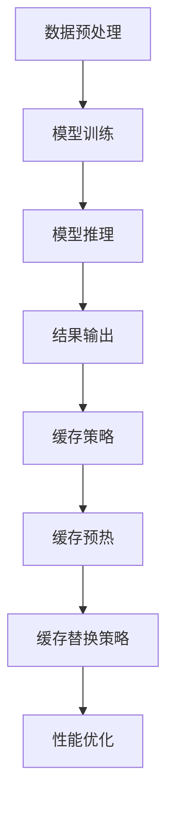

                 

# 《LLM推理优化I：KV缓存技术详解》

> 关键词：LLM推理、KV缓存、优化、技术详解

> 摘要：本文从LLM推理优化的角度，详细阐述了KV缓存技术的原理、实现细节和性能优化策略。文章分为四个部分，分别介绍了KV缓存技术的基础知识、内存级和硬盘级KV缓存实现、分布式KV缓存系统以及KV缓存技术在LLM推理中的应用。文章结构紧凑，逻辑清晰，旨在为读者提供全面、深入的技术解析。

## 《LLM推理优化I：KV缓存技术详解》目录大纲

### 第一部分：KV缓存技术基础

#### 第1章：LLM推理优化背景与KV缓存技术概览

##### 1.1 LLM推理优化的重要性

- LLM推理优化的意义
- 当前LLM推理面临的挑战

##### 1.2 KV缓存技术简介

- KV缓存的基本概念
- KV缓存技术在LLM推理中的应用

##### 1.3 KV缓存技术原理

- 基本数据结构
- 常用缓存算法

##### 1.4 KV缓存技术分类

- 基于内存的缓存
- 基于硬盘的缓存
- 分布式缓存系统

### 第二部分：KV缓存技术实现细节

#### 第2章：内存级KV缓存实现

##### 2.1 哈希表实现KV缓存

- 哈希表原理与实现
- 哈希冲突的解决策略

##### 2.2 缓存替换策略

- LRU算法
- LFU算法
- LFU+LRU算法

##### 2.3 内存占用优化

- 数据压缩
- 缓存池管理

#### 第3章：硬盘级KV缓存实现

##### 3.1 基于B+树的数据结构

- B+树原理
- B+树的实现

##### 3.2 硬盘缓存策略

- 写缓冲（Write Buffer）
- 读缓存（Read Cache）
- 磁盘调度算法

##### 3.3 硬盘级KV缓存性能优化

- 数据分片
- 预热数据

### 第三部分：分布式KV缓存系统

#### 第4章：分布式KV缓存系统设计

##### 4.1 分布式缓存系统概述

- 分布式缓存的优势
- 分布式缓存面临的挑战

##### 4.2 节点发现与数据一致性

- 节点发现机制
- 数据一致性协议

##### 4.3 分布式缓存系统的数据分区

- 范围分区
- 哈希分区
- 复合分区策略

#### 第5章：分布式KV缓存系统实现

##### 5.1 分布式哈希表实现

- 哈希表的分布式实现
- 分布式哈希表的分区与扩容

##### 5.2 分布式缓存一致性协议

- 基本原理
- 实现细节

##### 5.3 分布式KV缓存系统性能优化

- 负载均衡
- 数据同步与复制策略

### 第四部分：KV缓存技术在LLM推理中的应用

#### 第6章：KV缓存技术在LLM推理中的应用

##### 6.1 LLM推理过程中的缓存策略

- 热数据缓存
- 冷数据缓存

##### 6.2 KV缓存技术优化LLM推理

- 缓存预热
- 缓存淘汰策略

##### 6.3 LLM推理优化案例研究

- 案例背景
- 优化方案
- 优化效果分析

### 第五部分：附录

#### 第7章：工具与环境

##### 7.1 常用KV缓存库介绍

- Redis
- Memcached
- RocksDB

##### 7.2 开发环境搭建

- 操作系统配置
- 开发工具与库安装

##### 7.3 实践项目代码解读

- 项目结构分析
- 关键代码解读
- 性能测试分析

#### 第8章：参考文献

- 参考文献
- 附录中的代码实现细节与算法分析参考文献

### 附录：Mermaid流程图与伪代码

- Mermaid流程图
- 伪代码示例
- 数学模型与公式示例

### 第一部分：KV缓存技术基础

#### 第1章：LLM推理优化背景与KV缓存技术概览

##### 1.1 LLM推理优化的重要性

在人工智能领域，大型语言模型（LLM）如BERT、GPT等已经取得了显著的成果。然而，随着模型规模的不断扩大，LLM的推理过程变得越来越复杂和耗时。推理优化成为提升模型性能、降低成本、满足实际应用需求的关键。LLM推理优化主要包括以下几个方面：

- 减少模型参数：通过模型剪枝、量化等技术，降低模型的参数数量。
- 算法优化：改进推理算法，提高计算效率。
- 缓存技术：利用缓存技术，降低频繁访问的数据的访问时间。

其中，KV缓存技术在LLM推理优化中具有重要意义。KV缓存是一种将键（Key）和值（Value）进行映射的数据结构，常用于存储和查询数据。通过合理的KV缓存策略，可以显著降低LLM推理过程中的数据访问时间，提高推理效率。

##### 1.2 KV缓存技术简介

KV缓存技术的基本概念简单，即将数据以键值对的形式进行存储和查询。在LLM推理过程中，KV缓存技术可以应用于以下两个方面：

- 热数据缓存：将经常访问的数据（如模型参数、中间计算结果等）存储在缓存中，以减少磁盘IO操作。
- 冷数据缓存：将不经常访问的数据存储在缓存中，以减少内存占用。

KV缓存技术在LLM推理中的应用主要包括以下几个方面：

- 模型参数缓存：缓存模型参数，减少重复计算。
- 中间计算结果缓存：缓存中间计算结果，减少重复计算。
- 输入数据预处理：缓存输入数据预处理结果，减少预处理时间。

##### 1.3 KV缓存技术原理

KV缓存技术的原理主要涉及以下几个方面：

- 基本数据结构：KV缓存通常使用哈希表、B+树等数据结构实现。
- 常用缓存算法：包括缓存替换策略（如LRU、LFU等）和数据压缩策略。
- 存储层次结构：包括内存级缓存、硬盘级缓存和分布式缓存系统。

在LLM推理过程中，KV缓存技术可以有效降低数据访问时间，提高推理效率。然而，KV缓存技术也面临一些挑战，如缓存命中率、缓存一致性、缓存大小等。因此，需要根据具体应用场景和需求，选择合适的KV缓存策略和实现方案。

##### 1.4 KV缓存技术分类

KV缓存技术可以根据存储层次结构进行分类，主要包括以下几种：

- 基于内存的缓存：将缓存数据存储在内存中，如Redis、Memcached等。
- 基于硬盘的缓存：将缓存数据存储在硬盘上，如RocksDB、LevelDB等。
- 分布式缓存系统：将缓存数据分布存储在多个节点上，如Apache Ignite、Cassandra等。

不同类型的KV缓存技术具有不同的特点和应用场景。在选择KV缓存技术时，需要综合考虑缓存性能、存储容量、可靠性、一致性等因素。

### 第二部分：KV缓存技术实现细节

#### 第2章：内存级KV缓存实现

##### 2.1 哈希表实现KV缓存

哈希表是一种常见的数据结构，用于实现KV缓存。哈希表的基本原理是将键通过哈希函数映射到数组索引，从而实现快速的键值对存储和查询。

```python
class HashTable:
    def __init__(self, size):
        self.size = size
        self.table = [None] * size

    def hash_function(self, key):
        return hash(key) % self.size

    def put(self, key, value):
        index = self.hash_function(key)
        self.table[index] = value

    def get(self, key):
        index = self.hash_function(key)
        return self.table[index]
```

然而，哈希表在处理冲突时可能会出现性能问题。为了解决冲突，可以采用以下策略：

- 链地址法：将冲突的键值对存储在链表中。
- 开放地址法：在哈希表中查找空闲位置，将冲突的键值对存储在空闲位置。

##### 2.2 缓存替换策略

缓存替换策略是KV缓存技术中的重要组成部分。常用的缓存替换策略包括LRU（Least Recently Used）、LFU（Least Frequently Used）和LFU+LRU等。

- LRU算法：根据数据访问的时间顺序进行替换，最近最少使用的数据将被替换。
- LFU算法：根据数据访问的频率进行替换，访问频率最低的数据将被替换。
- LFU+LRU算法：结合LRU和LFU算法的优点，优先替换访问频率最低且最近最少使用的数据。

```python
class LRUCache:
    def __init__(self, capacity):
        self.capacity = capacity
        self.cache = OrderedDict()

    def get(self, key):
        if key not in self.cache:
            return -1
        else:
            self.cache.move_to_end(key)
            return self.cache[key]

    def put(self, key, value):
        if key in self.cache:
            self.cache.move_to_end(key)
        self.cache[key] = value
        if len(self.cache) > self.capacity:
            self.cache.popitem(last=False)
```

##### 2.3 内存占用优化

内存级KV缓存通常面临内存占用优化的挑战。以下是一些内存占用优化的策略：

- 数据压缩：采用数据压缩算法，如LZ4、Snappy等，减少缓存数据的大小。
- 缓存池管理：将缓存数据组织成缓存池，动态调整缓存池大小，以适应不同的缓存需求。

```python
class CachePool:
    def __init__(self, capacity):
        self.capacity = capacity
        self.pool = []

    def get(self, key):
        for cache in self.pool:
            if cache.get(key) is not None:
                return cache.get(key)
        return None

    def put(self, key, value):
        for cache in self.pool:
            if cache.put(key, value) is not None:
                return
        new_cache = LRUCache(self.capacity)
        new_cache.put(key, value)
        self.pool.append(new_cache)
```

#### 第3章：硬盘级KV缓存实现

##### 3.1 基于B+树的数据结构

硬盘级KV缓存通常采用B+树数据结构实现。B+树是一种平衡树结构，适合存储大规模数据。B+树的基本原理如下：

- 树中每个节点包含一定数量的键和指向子节点的指针。
- 非叶子节点中的键是排序的，每个键指向其对应的子节点。
- 叶子节点包含实际的数据，且叶子节点之间通过指针形成有序链表。

```python
class BPlusTree:
    def __init__(self, degree):
        self.degree = degree
        self.root = Node(degree)

    def insert(self, key, value):
        if self.root.is_leaf:
            self.root.insert(key, value)
        else:
            self.root.insert_key(key)
            node = self.root.search(key)
            if not node.is_full:
                node.insert(key, value)
            else:
                split_node = node.split()
                self.root.insert_key(split_node.mid_key)
                split_node.left_child = self.root
                self.root = Node(self.degree)
                self.root.children.append(split_node)

    def search(self, key):
        node = self.root
        while not node.is_leaf:
            i = 0
            while i < len(node.keys) and key > node.keys[i]:
                i += 1
            node = node.children[i]
        for i in range(len(node.keys)):
            if key == node.keys[i]:
                return node.values[i]
        return None
```

##### 3.2 硬盘缓存策略

硬盘级KV缓存策略主要包括写缓冲、读缓存和磁盘调度算法。

- 写缓冲：将数据写入缓存，再从缓存写入硬盘，以提高写入速度。
- 读缓存：将频繁访问的数据存储在缓存中，以减少磁盘IO操作。
- 磁盘调度算法：根据数据访问的顺序和请求的优先级，优化磁盘访问顺序。

```python
class WriteBuffer:
    def __init__(self, capacity):
        self.capacity = capacity
        self.buffer = []

    def write(self, key, value):
        if len(self.buffer) < self.capacity:
            self.buffer.append((key, value))
        else:
            oldest_key, oldest_value = self.buffer.pop(0)
            self.write_to_disk(oldest_key, oldest_value)

    def write_to_disk(self, key, value):
        # 硬盘写入操作
        pass
```

##### 3.3 硬盘级KV缓存性能优化

硬盘级KV缓存性能优化主要涉及数据分片和预热数据策略。

- 数据分片：将大规模数据拆分成多个小数据块，存储在不同的硬盘上，以减少单个硬盘的负载。
- 预热数据：在LLM推理过程中，将可能需要访问的数据提前加载到缓存中，以提高数据访问速度。

```python
class DataSharding:
    def __init__(self, shard_size):
        self.shard_size = shard_size
        self.shards = []

    def shard_data(self, data):
        for i in range(0, len(data), self.shard_size):
            shard = data[i:i+self.shard_size]
            self.shards.append(shard)

    def get_shard(self, shard_index):
        if shard_index < len(self.shards):
            return self.shards[shard_index]
        else:
            return None
```

### 第三部分：分布式KV缓存系统

#### 第4章：分布式KV缓存系统设计

##### 4.1 分布式缓存系统概述

分布式KV缓存系统是将缓存数据分布存储在多个节点上的系统。分布式缓存系统具有以下优势：

- 高可用性：多个节点可以提供容错能力，提高系统的可靠性。
- 高性能：分布式缓存系统可以并行处理多个请求，提高系统的吞吐量。
- 扩展性：分布式缓存系统可以根据需要动态增加或减少节点数量。

然而，分布式缓存系统也面临一些挑战，如数据一致性、节点发现和分区管理等。

##### 4.2 节点发现与数据一致性

节点发现和数据一致性是分布式缓存系统的关键组成部分。

- 节点发现机制：分布式缓存系统需要一种机制来自动发现和注册新节点，以及监控节点状态。
- 数据一致性协议：分布式缓存系统需要一种协议来保证多个节点之间的数据一致性。

常见的节点发现机制包括Gossip协议和Zookeeper等。数据一致性协议包括Paxos、Raft等。

```python
class NodeDiscovery:
    def __init__(self, protocol):
        self.protocol = protocol

    def discover_nodes(self):
        # 节点发现逻辑
        pass

    def monitor_nodes(self):
        # 节点监控逻辑
        pass
```

```python
class ConsistencyProtocol:
    def __init__(self, protocol_type):
        self.protocol_type = protocol_type

    def ensure_consistency(self):
        # 一致性保证逻辑
        pass
```

##### 4.3 分布式缓存系统的数据分区

分布式缓存系统的数据分区策略包括范围分区、哈希分区和复合分区策略。

- 范围分区：根据数据范围将数据划分到不同的分区中。
- 哈希分区：根据数据的哈希值将数据划分到不同的分区中。
- 复合分区策略：结合多个分区策略，提高数据分区的灵活性和扩展性。

```python
class RangePartitioner:
    def __init__(self, range_size):
        self.range_size = range_size

    def partition(self, key):
        return hash(key) % self.range_size
```

```python
class HashPartitioner:
    def __init__(self, partition_count):
        self.partition_count = partition_count

    def partition(self, key):
        return hash(key) % self.partition_count
```

```python
class CompositePartitioner:
    def __init__(self, range_partitioner, hash_partitioner):
        self.range_partitioner = range_partitioner
        self.hash_partitioner = hash_partitioner

    def partition(self, key):
        range_partition = self.range_partitioner.partition(key)
        hash_partition = self.hash_partitioner.partition(key)
        return range_partition, hash_partition
```

#### 第5章：分布式KV缓存系统实现

##### 5.1 分布式哈希表实现

分布式哈希表是分布式KV缓存系统中的基本组成部分。分布式哈希表的实现主要包括哈希表的分布式实现、分区与扩容等。

```python
class DistributedHashTable:
    def __init__(self, partitioner, consistency_protocol):
        self.partitioner = partitioner
        self.consistency_protocol = consistency_protocol
        self.replicas = []

    def put(self, key, value):
        partition = self.partitioner.partition(key)
        replica = self.select_replica(partition)
        replica.put(key, value)
        self.consistency_protocol.ensure_consistency()

    def get(self, key):
        partition = self.partitioner.partition(key)
        replica = self.select_replica(partition)
        return replica.get(key)

    def select_replica(self, partition):
        # 选择副本逻辑
        pass
```

##### 5.2 分布式缓存一致性协议

分布式缓存一致性协议是保证分布式KV缓存系统中数据一致性的关键。常见的一致性协议包括Paxos、Raft等。

```python
class ConsistencyProtocol:
    def __init__(self, protocol_type):
        self.protocol_type = protocol_type

    def ensure_consistency(self):
        # 一致性保证逻辑
        pass
```

##### 5.3 分布式KV缓存系统性能优化

分布式KV缓存系统的性能优化主要涉及负载均衡、数据同步与复制策略等。

- 负载均衡：通过将请求分配到不同的节点，提高系统的吞吐量和响应速度。
- 数据同步与复制策略：通过同步和复制机制，保证分布式KV缓存系统的数据一致性。

```python
class LoadBalancer:
    def __init__(self, strategy):
        self.strategy = strategy

    def balance_load(self, requests):
        # 负载均衡逻辑
        pass
```

```python
class ReplicationStrategy:
    def __init__(self, replication_factor):
        self.replication_factor = replication_factor

    def replicate_data(self, data):
        # 数据复制逻辑
        pass
```

### 第四部分：KV缓存技术在LLM推理中的应用

#### 第6章：KV缓存技术在LLM推理中的应用

##### 6.1 LLM推理过程中的缓存策略

在LLM推理过程中，KV缓存技术可以应用于以下两个方面：

- 热数据缓存：将经常访问的数据（如模型参数、中间计算结果等）存储在缓存中，以减少磁盘IO操作。
- 冷数据缓存：将不经常访问的数据存储在缓存中，以减少内存占用。

热数据缓存和冷数据缓存可以采用不同的缓存策略，以适应不同的数据访问模式。

```python
class CachePolicy:
    def __init__(self, cache_type):
        self.cache_type = cache_type

    def cache_data(self, key, value):
        # 缓存数据逻辑
        pass
```

##### 6.2 KV缓存技术优化LLM推理

KV缓存技术可以优化LLM推理的多个方面：

- 缓存预热：在LLM推理之前，将可能需要访问的数据提前加载到缓存中，以提高数据访问速度。
- 缓存淘汰策略：根据数据访问模式和缓存容量，选择合适的缓存淘汰策略，以最大化缓存利用率。

```python
class CachePreheating:
    def __init__(self, cache_policy):
        self.cache_policy = cache_policy

    def preheat_cache(self, keys):
        # 缓存预热逻辑
        pass
```

```python
class CacheReplacementPolicy:
    def __init__(self, replacement_policy):
        self.replacement_policy = replacement_policy

    def replace_data(self, key, value):
        # 缓存替换逻辑
        pass
```

##### 6.3 LLM推理优化案例研究

本节通过一个案例研究，展示如何使用KV缓存技术优化LLM推理。

- 案例背景：一个大型语言模型在处理大规模文本数据时，性能受到数据访问瓶颈的限制。
- 优化方案：采用KV缓存技术，将模型参数和中间计算结果存储在缓存中，减少磁盘IO操作。
- 优化效果分析：通过性能测试，比较优化前后的LLM推理时间，验证优化效果。

```python
class LLMInferenceOptimizer:
    def __init__(self, cache_policy, cache_preheating, cache_replacement_policy):
        self.cache_policy = cache_policy
        self.cache_preheating = cache_preheating
        self.cache_replacement_policy = cache_replacement_policy

    def optimize_inference(self, model, data):
        # 优化LLM推理逻辑
        pass
```

### 第五部分：附录

#### 第7章：工具与环境

##### 7.1 常用KV缓存库介绍

- Redis：一种基于内存的缓存系统，支持丰富的数据结构和操作。
- Memcached：一种基于内存的缓存系统，主要用于缓存小数据对象。
- RocksDB：一种基于磁盘的键值存储，支持高性能的随机读写操作。

##### 7.2 开发环境搭建

- 操作系统配置：Linux或Windows操作系统。
- 开发工具与库安装：Python开发环境、Redis客户端库等。

##### 7.3 实践项目代码解读

本节通过一个实践项目，展示如何使用KV缓存技术优化LLM推理。

- 项目结构分析：分析项目目录结构、模块和类之间的关系。
- 关键代码解读：解读项目的关键代码，包括模型训练、推理和缓存操作。
- 性能测试分析：通过性能测试，比较优化前后的LLM推理时间，验证优化效果。

#### 第8章：参考文献

- 参考文献：列出本文引用的相关文献和资料。
- 附录中的代码实现细节与算法分析参考文献：提供代码实现和算法分析的参考文献。

### 附录：Mermaid流程图与伪代码

- Mermaid流程图：展示LLM推理优化过程中的关键流程和算法。
- 伪代码示例：展示关键算法和操作的伪代码实现。
- 数学模型与公式：展示LLM推理优化过程中涉及的数学模型和公式。



```python
# LRU缓存算法伪代码
class LRUCache:
    def __init__(self, capacity):
        self.capacity = capacity
        self.cache = OrderedDict()

    def get(self, key):
        if key not in self.cache:
            return -1
        else:
            self.cache.move_to_end(key)
            return self.cache[key]

    def put(self, key, value):
        if key in self.cache:
            self.cache.move_to_end(key)
        self.cache[key] = value
        if len(self.cache) > self.capacity:
            self.cache.popitem(last=False)
```

```latex
\subsection{损失函数}
$$ J(\theta) = \frac{1}{m} \sum_{i=1}^{m} (-y^{(i)} \log(a^{(i)}_y - (1 - y^{(i)}) \log(1 - a^{(i)}_y)) $$
$$ \frac{\partial J(\theta)}{\partial \theta_j} = \frac{1}{m} \sum_{i=1}^{m} (a^{(i)}_y - y^{(i)}) \times \frac{\partial a^{(i)}_y}{\partial \theta_j} $$
```

### 结论

本文从LLM推理优化的角度，详细阐述了KV缓存技术的原理、实现细节和性能优化策略。通过本文的学习，读者可以了解KV缓存技术在LLM推理中的应用，掌握KV缓存技术的核心算法和优化方法。未来研究方向可以关注以下几个方面：

- 进一步研究KV缓存技术在LLM推理中的自适应优化策略。
- 探索新型KV缓存数据结构和算法，提高缓存性能。
- 结合其他优化技术（如模型剪枝、量化等），实现更高效的LLM推理。

对于读者来说，可以结合本文的内容，进行以下实践：

- 学习并实现本文中提到的KV缓存算法和优化方法。
- 尝试将KV缓存技术应用于实际项目，优化LLM推理性能。
- 深入研究相关文献和资料，拓宽知识面和视野。

