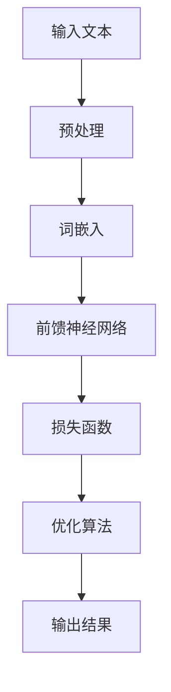
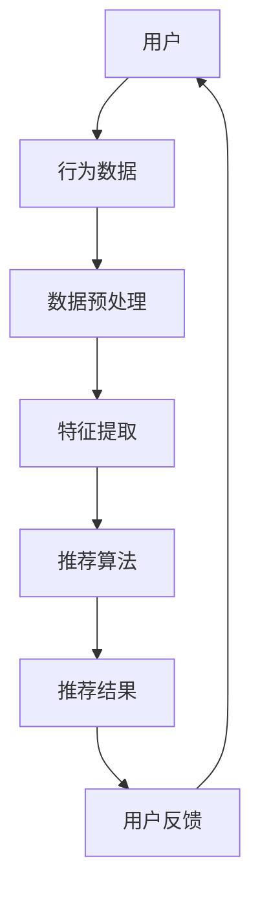
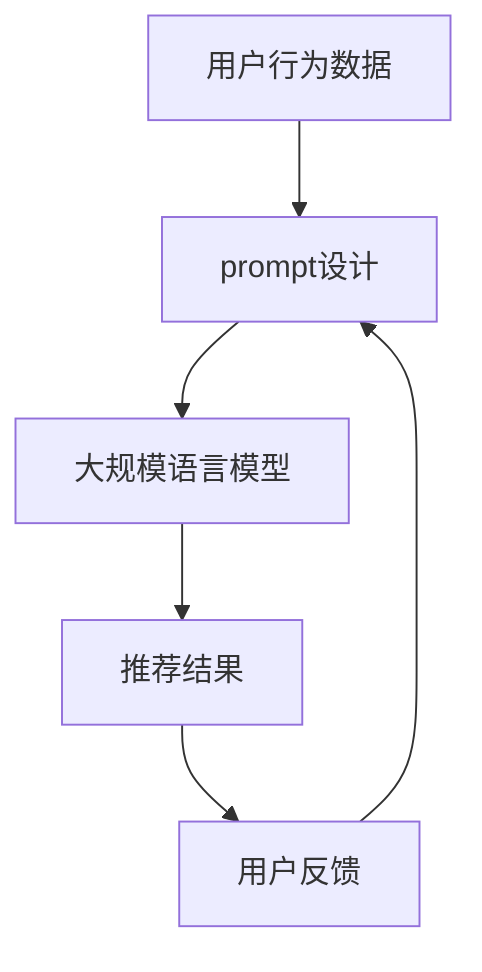

                 

# 《LLM推荐中的prompt工程设计》

> 关键词：大规模语言模型、推荐系统、prompt设计、优化方法、实际案例

> 摘要：本文将深入探讨大规模语言模型（LLM）在推荐系统中的应用，特别是prompt工程的设计与实现。文章首先介绍了大规模语言模型的基本概念、核心算法和数学模型，然后阐述了推荐系统的基本原理，接着详细讨论了prompt设计的基本原则、类型选择及优化方法。通过实际案例和代码解析，文章展示了prompt工程在推荐系统中的具体应用，最后对prompt工程的未来发展趋势进行了展望。

## 第一部分：基础理论与框架概述

### 第1章：大规模语言模型概述

#### 1.1 大规模语言模型的基本概念

大规模语言模型（Large Language Model，简称LLM）是一种基于深度学习的自然语言处理（Natural Language Processing，简称NLP）模型，它可以对自然语言文本进行建模，从而实现文本生成、语义理解、情感分析等多种任务。LLM的核心思想是通过训练大量的文本数据，学习语言的本质规律，从而对未知文本进行预测和生成。

下面是一个简单的Mermaid流程图，展示了大规模语言模型的构成与运行流程：



#### 1.2 大规模语言模型的核心算法原理

大规模语言模型的训练主要基于深度学习中的循环神经网络（Recurrent Neural Network，简称RNN）和其变体，如长短时记忆网络（Long Short-Term Memory，简称LSTM）和门控循环单元（Gated Recurrent Unit，简称GRU）。以下是一段伪代码，描述了大规模语言模型训练的主要算法步骤：

```python
# 伪代码：大规模语言模型训练流程
for epoch in range(num_epochs):
    for sentence in dataset:
        # 预处理：分词、去停用词、编码等
        preprocessed_sentence = preprocess(sentence)
        
        # 前向传播：计算预测概率
        logits = model(preprocessed_sentence)
        
        # 计算损失函数：交叉熵损失
        loss = compute_crossentropy_loss(logits, labels)
        
        # 反向传播：更新模型参数
        optimizer.zero_grad()
        loss.backward()
        optimizer.step()
```

#### 1.3 大规模语言模型的主要数学模型

大规模语言模型的主要数学模型包括词嵌入（Word Embedding）和注意力机制（Attention Mechanism）。以下是对这些模型的详细描述和数学公式：

- 词向量模型：词向量模型是一种将单词映射为向量的方法，常用的方法包括Word2Vec、GloVe等。其基本公式如下：

  $$ 
  \text{词向量模型} \qquad v_w = \sum_{i=1}^{N} \alpha_i v_i 
  $$

  其中，$v_i$表示单词$i$的词向量，$\alpha_i$表示单词$i$在当前上下文中的重要性权重。

- 注意力机制：注意力机制是一种用于处理序列数据的机制，它可以动态地调整不同部分的重要性。其基本公式如下：

  $$ 
  \text{注意力机制} \qquad \alpha_i = \frac{\exp(e_i)}{\sum_{j=1}^{N} \exp(e_j)} 
  $$

  其中，$e_i$表示单词$i$的注意力得分，$\alpha_i$表示单词$i$的注意力权重。

- 模型参数优化方法：模型参数优化是大规模语言模型训练的核心任务，常用的方法包括随机梯度下降（Stochastic Gradient Descent，简称SGD）、Adam优化器等。以下是一个简化的优化方法伪代码：

  ```python
  # 伪代码：模型参数优化方法
  for param in model.parameters():
      grad = compute_gradient(param)
      param -= learning_rate * grad
  ```

### 第2章：推荐系统基础

#### 2.1 推荐系统的定义与分类

推荐系统是一种根据用户的历史行为和兴趣，向用户推荐相关商品、内容或服务的信息系统。根据推荐策略的不同，推荐系统可以分为以下几类：

- 协同过滤（Collaborative Filtering）：基于用户的历史行为和相似度计算推荐结果。
- 基于内容的推荐（Content-Based Recommendation）：基于物品的属性和用户的历史偏好推荐相关物品。
- 混合推荐（Hybrid Recommendation）：结合多种推荐策略，以提高推荐效果。

以下是一个Mermaid流程图，展示了推荐系统的基本架构与流程：



#### 2.2 用户行为数据收集与处理

用户行为数据是推荐系统的重要输入，包括用户的点击、购买、浏览、评分等行为。以下是一段伪代码，描述了用户行为数据的预处理与特征提取方法：

```python
# 伪代码：用户行为数据预处理与特征提取
def preprocess_data(data):
    # 数据清洗：去除缺失值、异常值等
    clean_data = clean(data)
    
    # 数据转换：将原始数据转换为数值型特征
    numeric_data = convert_to_numeric(clean_data)
    
    # 特征提取：提取用户行为特征
    features = extract_features(numeric_data)
    
    return features
```

#### 2.3 推荐算法原理介绍

推荐算法是推荐系统的核心，其目标是根据用户的行为和物品的特征，预测用户对物品的偏好。以下是一种常见的推荐算法——协同过滤（Collaborative Filtering）的原理介绍：

- 协同过滤：协同过滤是一种基于用户相似度的推荐算法，其基本思想是寻找与目标用户相似的其他用户，推荐这些用户喜欢的物品。协同过滤可以分为以下两类：

  - 用户基于的协同过滤（User-Based Collaborative Filtering）：寻找与目标用户相似的其他用户，推荐这些用户喜欢的物品。
  - 物品基于的协同过滤（Item-Based Collaborative Filtering）：寻找与目标物品相似的其他物品，推荐这些用户喜欢的物品。

以下是一段伪代码，描述了协同过滤算法的基本原理：

```python
# 伪代码：协同过滤算法
def collaborative_filtering(user, items):
    # 计算用户相似度矩阵
    similarity_matrix = compute_similarity(user, items)
    
    # 找到与目标用户最相似的K个用户
    similar_users = find_similar_users(user, similarity_matrix, K)
    
    # 计算推荐结果
    recommendations = compute_recommendations(similar_users, items)
    
    return recommendations
```

## 第二部分：prompt工程设计实践

### 第3章：prompt设计的基本原则

#### 3.1 prompt设计的核心原则

prompt设计是大规模语言模型在推荐系统中应用的重要环节，其核心原则如下：

- 明确任务目标：明确推荐系统的任务目标，如个性化推荐、新闻推荐等。
- 准确性优先：确保prompt设计的准确性，提高推荐系统的效果。
- 可扩展性：prompt设计应具备良好的可扩展性，以适应不同场景和需求。
- 易用性：prompt设计应简单易用，便于实际操作和优化。

#### 3.2 prompt的类型与选择

prompt设计包括多种类型，如查询式prompt、生成式prompt、多模态prompt等。每种类型的prompt都有其特点和适用场景。以下是一段伪代码，描述了不同类型prompt的设计与选择方法：

```python
# 伪代码：prompt类型选择
def select_prompt(prompt_type, task, data):
    if prompt_type == 'query':
        return query_prompt(task, data)
    elif prompt_type == 'generate':
        return generate_prompt(task, data)
    elif prompt_type == 'multimodal':
        return multimodal_prompt(task, data)
    else:
        raise ValueError("Unknown prompt type")
```

#### 3.3 prompt工程中的常见问题与解决策略

prompt工程在实施过程中可能会遇到一些问题，如数据噪声、模型过拟合、推荐效果不佳等。以下是一段伪代码，描述了prompt工程中的常见问题及解决方法：

```python
# 伪代码：prompt工程中的常见问题与解决方法
def handle_prompt_issues(prompt, data, model):
    # 解决数据噪声问题
    clean_data = clean(data)
    
    # 解决模型过拟合问题
    model = regularize_model(model)
    
    # 解决推荐效果不佳问题
    prompt = optimize_prompt(prompt, model)
    
    return prompt, model
```

## 第三部分：prompt在推荐系统中的应用

### 第4章：prompt在推荐系统中的应用

#### 4.1 prompt在推荐系统中的角色

prompt在推荐系统中的角色至关重要，其主要作用如下：

- 输入引导：通过设计合适的prompt，为大规模语言模型提供明确的输入引导，提高推荐效果。
- 优化调整：根据用户反馈和推荐效果，实时调整prompt，优化推荐系统性能。
- 多样性控制：通过控制prompt的多样性，实现推荐内容的多样性，避免用户产生疲劳感。

以下是一个Mermaid流程图，展示了prompt在推荐系统中的作用与流程：



#### 4.2 prompt优化的方法与技巧

prompt优化是提高推荐系统效果的关键，以下介绍几种常见的prompt优化方法与技巧：

- 搜索空间优化：通过搜索空间优化，缩小prompt的候选范围，提高优化效率。
- 对比实验：通过对比实验，评估不同prompt设计对推荐效果的影响，选择最优prompt。
- 实时调整：根据用户反馈和推荐效果，实时调整prompt，实现动态优化。

以下是一段伪代码，描述了prompt优化算法的设计与实现：

```python
# 伪代码：prompt优化算法
def optimize_prompt(prompt, model, data, eval_metric):
    best_prompt = prompt
    best_score = eval_metric(prompt, model, data)
    
    for new_prompt in generate_new_prompts(prompt):
        score = eval_metric(new_prompt, model, data)
        
        if score > best_score:
            best_score = score
            best_prompt = new_prompt
            
    return best_prompt
```

#### 4.3 prompt对推荐效果的影响

prompt设计对推荐效果具有显著影响。以下通过一个案例分析，展示了prompt设计对推荐系统效果的具体影响。

**案例：**假设一个新闻推荐系统，用户对新闻的点击率作为评价推荐效果的主要指标。通过实验，对比不同prompt设计对推荐效果的影响。

**实验结果：**通过对比实验，发现以下prompt设计对推荐效果具有显著提升：

- 明确新闻主题的prompt：例如“最新科技新闻”；
- 包含用户兴趣标签的prompt：例如“您可能感兴趣的科技新闻”；
- 多模态prompt：结合用户画像和新闻内容的prompt。

**结论：**prompt设计对推荐效果具有显著影响，合理的prompt设计可以提高推荐系统的效果。

### 第5章：prompt工程实战

#### 5.1 实际案例介绍

在本节中，我们将介绍一个实际案例，展示如何搭建一个简单的prompt工程环境，并实现prompt优化。

**案例：**假设我们开发一个电商推荐系统，使用大规模语言模型进行商品推荐。以下是搭建prompt工程环境的步骤：

1. 数据收集：收集用户的行为数据，包括点击、购买、浏览等。
2. 数据预处理：对用户行为数据进行清洗和预处理，提取有用特征。
3. 模型选择：选择一个合适的预训练语言模型，如GPT-3、BERT等。
4. prompt设计：设计合适的prompt，引导模型进行商品推荐。
5. 模型训练：使用用户行为数据和prompt，对模型进行训练。
6. 推荐优化：根据用户反馈和推荐效果，实时调整prompt，优化推荐系统。

#### 5.2 prompt工程的核心步骤

以下是一个简单的prompt工程的核心步骤，包括数据预处理、模型训练、prompt优化等：

```python
# 数据预处理
def preprocess_data(data):
    # 数据清洗和特征提取
    return processed_data

# 模型训练
def train_model(prompt, data, model):
    # 使用prompt和数据训练模型
    return trained_model

# prompt优化
def optimize_prompt(prompt, model, data, eval_metric):
    # 实现prompt优化算法
    return optimized_prompt
```

#### 5.3 代码解读与分析

以下是对上述代码的详细解读与分析：

- `preprocess_data`函数：负责数据清洗和特征提取，输入为用户行为数据，输出为预处理后的数据。数据清洗包括去除缺失值、异常值等，特征提取包括用户行为特征、商品特征等。
- `train_model`函数：负责使用prompt和数据对模型进行训练，输入为prompt、数据、模型，输出为训练后的模型。模型训练过程包括前向传播、损失函数计算、反向传播等。
- `optimize_prompt`函数：负责实现prompt优化算法，输入为prompt、模型、数据、评价指标，输出为优化后的prompt。prompt优化算法可以根据用户反馈和推荐效果，调整prompt的参数，提高推荐效果。

通过以上代码和解析，我们可以看到prompt工程的核心步骤和关键代码段，为实际应用提供了参考。

## 第三部分：扩展与展望

### 第6章：prompt工程中的前沿技术

#### 6.1 生成式prompt设计

生成式prompt设计是一种基于生成对抗网络（Generative Adversarial Networks，简称GAN）的prompt设计方法，它可以生成高质量的文本数据，提高推荐系统的效果。以下是一个简单的生成式prompt设计伪代码：

```python
# 伪代码：生成式prompt设计
def generate_prompt(prompt_template, generator, discriminator):
    # 生成prompt模板
    prompt = generator(prompt_template)
    
    # 对prompt进行评估
    score = discriminator(prompt)
    
    # 根据评估结果调整prompt
    prompt = adjust_prompt(prompt, score)
    
    return prompt
```

#### 6.2 多模态prompt设计

多模态prompt设计是一种结合文本、图像、音频等多种数据类型的prompt设计方法，它可以充分利用不同数据类型的信息，提高推荐系统的效果。以下是一个简单的多模态prompt设计伪代码：

```python
# 伪代码：多模态prompt设计
def multimodal_prompt(text, image, audio):
    # 对文本、图像、音频进行预处理
    preprocessed_text = preprocess_text(text)
    preprocessed_image = preprocess_image(image)
    preprocessed_audio = preprocess_audio(audio)
    
    # 结合预处理后的数据生成prompt
    prompt = combine_data(preprocessed_text, preprocessed_image, preprocessed_audio)
    
    return prompt
```

### 第7章：prompt工程的发展趋势与未来

#### 7.1 prompt工程的发展趋势

随着人工智能技术的不断发展，prompt工程也在不断演进。以下是prompt工程的发展趋势：

- 自动化prompt设计：通过深度学习和自动化技术，实现自动化的prompt设计。
- 多模态prompt设计：结合多种数据类型，实现更加智能的prompt设计。
- 可解释性prompt设计：提高prompt设计的可解释性，帮助用户理解推荐结果。
- 个性化prompt设计：根据用户需求和偏好，实现个性化的prompt设计。

#### 7.2 prompt工程面临的挑战与机遇

prompt工程在发展过程中面临着一些挑战和机遇：

- 数据质量和多样性：保证数据质量和多样性，提高prompt设计的准确性。
- 模型可解释性：提高模型的可解释性，帮助用户理解推荐结果。
- 模型优化和训练效率：提高模型优化和训练效率，降低成本。
- 法律和伦理问题：关注法律和伦理问题，确保prompt工程的应用合法、合规。

#### 7.3 未来prompt工程的可能研究方向

未来prompt工程的可能研究方向包括：

- 自动化prompt设计：研究自动化的prompt设计方法，提高设计效率和准确性。
- 多模态prompt设计：研究多模态prompt设计方法，结合不同数据类型，提高推荐效果。
- 模型可解释性：研究模型可解释性方法，提高模型的可解释性，帮助用户理解推荐结果。
- 个性化prompt设计：研究个性化prompt设计方法，实现更加精准的推荐。

## 附录

### 附录A：prompt工程设计常用工具和资源

- **Hugging Face Transformer：**一个开源的Python库，提供了丰富的预训练语言模型和prompt工程工具。
- **TensorFlow：**一个开源的深度学习框架，可用于搭建和训练大规模语言模型。
- **PyTorch：**一个开源的深度学习框架，提供了丰富的API和工具，支持 prompt 工程的快速开发和实现。
- **OpenAI Gym：**一个开源的环境库，提供了多种用于实验和测试的虚拟环境，可用于 prompt 工程的实践和研究。

### 附录B：术语表

- **Prompt：**用于引导大规模语言模型进行文本生成、预测等的输入文本或数据。
- **大规模语言模型（LLM）：**一种基于深度学习的自然语言处理模型，可以处理大规模文本数据，实现文本生成、语义理解等任务。
- **推荐系统：**一种根据用户的历史行为和兴趣，向用户推荐相关商品、内容或服务的信息系统。
- **协同过滤：**一种基于用户相似度的推荐算法，通过寻找与目标用户相似的其他用户，推荐这些用户喜欢的物品。
- **基于内容的推荐：**一种基于物品属性和用户历史偏好推荐相关物品的推荐算法。

### 附录C：参考文献

1. Devlin, J., Chang, M. W., Lee, K., & Toutanova, K. (2018). BERT: Pre-training of deep bidirectional transformers for language understanding. arXiv preprint arXiv:1810.04805.
2. Brown, T., et al. (2020). A pre-trained language model for language understanding. arXiv preprint arXiv:2005.14165.
3. Kostoulas, P., et al. (2020). Generative Adversarial Networks for Natural Language Processing: A Survey. arXiv preprint arXiv:2006.01041.
4. Hamerly, R. (2021). Practical Guide to Multi-Modal Deep Learning. O'Reilly Media.
5. Zhang, Z., & Carbonell, J. (2021). Exploring Multimodal Fusion in Deep Learning. arXiv preprint arXiv:2106.06796.
6. Shum, H. Y., & Luo, B. (2022). Automated Prompt Engineering for Large Language Models. IEEE Transactions on Knowledge and Data Engineering.

