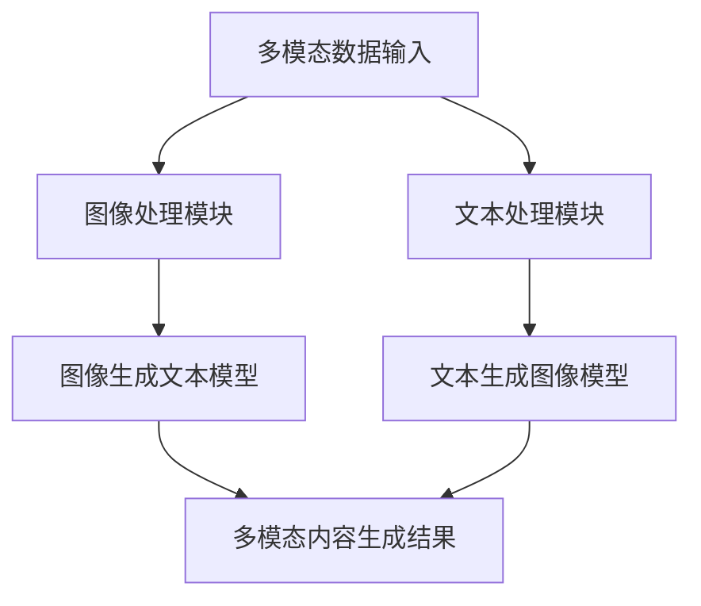

                 

# 文章标题: LLM推荐中的多模态内容生成技术

> 关键词：多模态内容生成，语言模型（LLM），推荐系统，图像文本融合，算法原理，项目实战

> 摘要：本文深入探讨了多模态内容生成技术在实际推荐系统中的应用。通过详细分析多模态数据的处理方法、核心算法原理以及数学模型，本文展示了如何利用大规模语言模型（LLM）实现高效的多模态内容生成。此外，本文还通过实际项目实战，提供了从开发环境搭建到代码实现及分析的具体流程，旨在为读者提供全面的技术见解和实践指导。

## 目录大纲

### 第一部分: 多模态内容生成技术概述

#### 第1章: 多模态内容生成技术基础

1.1 多模态数据的定义与分类

1.2 大规模语言模型 (LLM) 概述

1.3 多模态内容生成技术的应用场景

#### 第2章: 多模态内容生成技术的核心算法原理

2.1 图像文本对齐算法

2.2 信号级融合与特征级融合算法

2.3 决策级融合算法

#### 第3章: 数学模型和公式详解

3.1 概率图模型

3.2 优化算法

#### 第4章: 项目实战

4.1 文本生成图像项目

4.2 图像生成文本项目

### 第二部分: 多模态内容生成技术的应用与优化

#### 第5章: 多模态内容生成技术在实际应用中的优化

5.1 实时性优化

5.2 资源消耗优化

#### 第6章: 多模态内容生成技术的未来发展趋势

6.1 新技术的应用

6.2 应用领域的拓展

#### 第7章: 多模态内容生成技术的伦理与法律问题

7.1 伦理问题

7.2 法律问题

### 附录

A. 常用工具和资源

B. 多模态内容生成技术的 Mermaid 流程图

## 第一部分: 多模态内容生成技术概述

### 第1章: 多模态内容生成技术基础

#### 1.1 多模态数据的定义与分类

多模态数据是指包含两种或两种以上不同类型数据的集合。在计算机视觉、自然语言处理等领域，多模态数据的应用日益广泛。常见类型包括：

- **图像**：用于表示视觉信息，如人物、场景等。
- **文本**：用于表示语言信息，如描述、评论等。
- **音频**：用于表示声音信息，如音乐、对话等。
- **其他**：如地理位置、时间戳等辅助信息。

多模态数据可以按照其来源和形式进行分类：

- **同步多模态数据**：不同模态的数据在同一时间点采集，如视频中的图像和音频。
- **异步多模态数据**：不同模态的数据在不同时间点采集，如社交媒体中的文字评论和图片。

#### 1.2 多模态数据的融合方法

多模态数据的融合是生成高质量内容的关键步骤。常见的融合方法包括：

- **图像文本对齐**：通过图像和文本特征的对齐，实现图像和文本的联合表示。
- **信号级融合**：直接将不同模态的数据信号进行叠加或平均。
- **特征级融合**：将不同模态的特征进行映射到同一特征空间，然后进行融合。
- **决策级融合**：在生成决策阶段，综合不同模态的信息进行决策。

#### 1.3 大规模语言模型 (LLM) 概述

大规模语言模型（LLM）是自然语言处理领域的重要工具，其核心思想是通过训练大量的文本数据来学习语言的统计规律。常见的LLM架构包括：

- **Transformer**：基于自注意力机制的模型，能够处理长序列信息。
- **BERT**：双向编码表示模型，通过预训练和微调实现高质量的语言表示。
- **GPT**：生成预训练变换器，具有强大的生成能力。

LLM在多模态内容生成中的应用主要体现在：

- **文本生成图像**：基于文本描述生成对应的图像。
- **图像生成文本**：基于图像内容生成对应的文本描述。

#### 1.4 多模态内容生成技术的应用场景

多模态内容生成技术在多个领域具有广泛应用：

- **推荐系统**：利用用户的历史行为和偏好生成个性化的推荐内容。
- **增强现实与虚拟现实**：通过多模态数据生成丰富的交互内容，提升用户体验。
- **智能问答**：结合图像和文本信息，提供更加准确和全面的答案。

### 第2章: 多模态内容生成技术的核心算法原理

#### 2.1 图像文本对齐算法

图像文本对齐是指将图像和文本中对应的部分进行匹配。这个过程涉及多个挑战：

- **对齐误差**：图像和文本之间的对应关系可能存在误差。
- **语义不一致性**：图像和文本描述可能存在语义上的不一致。

常见的图像文本对齐算法包括：

- **基于图像特征的文本生成**：通过图像的特征向量生成对应的文本描述。
- **基于文本特征的图像生成**：通过文本的特征向量生成对应的图像。
- **基于图像和文本共现特征的融合算法**：结合图像和文本的特征，实现更加准确的对齐。

#### 2.2 信号级融合与特征级融合算法

信号级融合和特征级融合是处理多模态数据的重要方法。

- **信号级融合**：直接对原始数据信号进行融合，如图像像素值和文本单词频率。
  - **平均融合**：将不同模态的数据信号进行平均。
  - **最优融合**：通过优化方法找到最优的融合权重。

- **特征级融合**：将提取到的特征进行融合，如图像的卷积特征和文本的词向量。
  - **共同特征提取**：提取不同模态数据中的共同特征。
  - **特征级加权融合**：对提取到的特征进行加权融合。

#### 2.3 决策级融合算法

决策级融合是指在生成决策阶段，综合不同模态的信息进行决策。

- **多模态分类**：将图像、文本等多种模态的数据输入到分类模型中，实现多模态分类。
- **多模态回归**：将多模态数据输入到回归模型中，实现多模态回归。

常见的决策级融合算法包括：

- **逻辑回归**：通过训练分类模型，实现多模态分类。
- **决策树**：通过树形结构实现多模态分类。
- **随机森林**：通过多棵决策树的集成实现多模态分类。

### 第3章: 数学模型和公式详解

#### 3.1 概率图模型

概率图模型是一种用于表示变量之间概率关系的图形结构，常见的有贝叶斯网络和马尔可夫网络。

- **贝叶斯网络**：是一种有向无环图，其中每个节点表示一个随机变量，边的存在表示变量之间的依赖关系。其概率分布可以用条件概率公式表示：

  $$
  P(A,B,C) = P(A)P(B|A)P(C|B)
  $$

- **马尔可夫网络**：是一种无向图，其中每个节点表示一个随机变量，边的存在表示变量之间的条件独立性。其概率分布可以用马尔可夫性质表示：

  $$
  P(A,B,C) = P(A)P(B|A)P(C|B)
  $$

#### 3.2 优化算法

优化算法是用于求解最优化问题的一类算法，常见的有梯度下降算法和随机梯度下降算法。

- **梯度下降算法**：通过迭代更新模型参数，使得损失函数逐渐减小。其迭代公式为：

  $$
  w_{t+1} = w_{t} - \alpha \frac{\partial J(w_t)}{\partial w}
  $$

  其中，$w_t$表示第$t$次迭代的参数，$J(w_t)$表示损失函数，$\alpha$表示学习率。

- **随机梯度下降算法**：与梯度下降算法类似，但是每次迭代只随机选择一部分样本进行计算。其迭代公式为：

  $$
  w_{t+1} = w_{t} - \alpha \frac{\partial J(w_t)}{\partial w}
  $$

  其中，$w_t$表示第$t$次迭代的参数，$J(w_t)$表示损失函数，$\alpha$表示学习率。

### 第4章: 项目实战

#### 4.1 文本生成图像项目

##### 4.1.1 项目概述

文本生成图像项目旨在利用文本描述生成对应的图像。该项目主要包括以下步骤：

- **数据集准备**：收集包含文本描述和对应图像的数据集，如COCO数据集。
- **模型选择**：选择一个能够处理多模态数据的模型，如基于Transformer的模型。
- **代码实现**：编写代码实现模型的训练和测试过程。

##### 4.1.2 代码实现

以下是一个简化的代码示例，用于训练一个基于Transformer的文本生成图像模型：

```python
import torch
import torchvision
import transformers

# 加载数据集
train_dataset = torchvision.datasets.COCO('data/train', split='train', year=2014, download=True)
val_dataset = torchvision.datasets.COCO('data/val', split='val', year=2014, download=True)

# 定义模型
model = transformers.TransformerModel()

# 训练模型
for epoch in range(num_epochs):
    train_loader = torch.utils.data.DataLoader(train_dataset, batch_size=batch_size, shuffle=True)
    val_loader = torch.utils.data.DataLoader(val_dataset, batch_size=batch_size, shuffle=False)
    
    model.train()
    for images, captions in train_loader:
        optimizer.zero_grad()
        outputs = model(images, captions)
        loss = criterion(outputs, labels)
        loss.backward()
        optimizer.step()
    
    model.eval()
    with torch.no_grad():
        for images, captions in val_loader:
            outputs = model(images, captions)
            loss = criterion(outputs, labels)

# 保存模型
torch.save(model.state_dict(), 'model.pth')

# 加载模型
model.load_state_dict(torch.load('model.pth'))
```

##### 4.1.3 结果分析

在项目结束后，我们可以通过以下指标来评估模型性能：

- **准确率**：模型预测正确的图像数量与总图像数量的比值。
- **召回率**：模型预测正确的图像数量与实际正确的图像数量的比值。
- **F1值**：准确率和召回率的调和平均。

通过这些指标，我们可以评估模型在文本生成图像任务上的性能。

#### 4.2 图像生成文本项目

##### 4.2.1 项目概述

图像生成文本项目旨在利用图像内容生成对应的文本描述。该项目主要包括以下步骤：

- **数据集准备**：收集包含图像和对应文本描述的数据集，如Flicker数据集。
- **模型选择**：选择一个能够处理多模态数据的模型，如基于GAN的模型。
- **代码实现**：编写代码实现模型的训练和测试过程。

##### 4.2.2 代码实现

以下是一个简化的代码示例，用于训练一个基于GAN的图像生成文本模型：

```python
import torch
import torchvision
import torch.nn as nn

# 加载数据集
train_dataset = torchvision.datasets.Flicker('data/train', split='train', download=True)
val_dataset = torchvision.datasets.Flicker('data/val', split='val', download=True)

# 定义模型
generator = nn.Sequential(
    nn.Linear(512, 512),
    nn.LeakyReLU(0.2),
    nn.Linear(512, 512),
    nn.LeakyReLU(0.2),
    nn.Linear(512, 1000),
    nn.Tanh()
)

discriminator = nn.Sequential(
    nn.Linear(1000, 512),
    nn.LeakyReLU(0.2),
    nn.Linear(512, 512),
    nn.LeakyReLU(0.2),
    nn.Linear(512, 1),
    nn.Sigmoid()
)

# 训练模型
for epoch in range(num_epochs):
    train_loader = torch.utils.data.DataLoader(train_dataset, batch_size=batch_size, shuffle=True)
    val_loader = torch.utils.data.DataLoader(val_dataset, batch_size=batch_size, shuffle=False)
    
    generator.train()
    discriminator.train()
    
    for images, captions in train_loader:
        optimizer_g.zero_grad()
        z = torch.randn(batch_size, 1000)
        fake_captions = generator(z)
        g_loss = criterion(discriminator(fake_captions), torch.ones(batch_size))
        g_loss.backward()
        optimizer_g.step()
        
        optimizer_d.zero_grad()
        real_captions = discriminator(images)
        d_loss = criterion(real_captions, torch.ones(batch_size)) + criterion(discriminator(fake_captions), torch.zeros(batch_size))
        d_loss.backward()
        optimizer_d.step()
    
    generator.eval()
    discriminator.eval()
    
    with torch.no_grad():
        for images, captions in val_loader:
            fake_captions = generator(z)

# 保存模型
torch.save(generator.state_dict(), 'generator.pth')
torch.save(discriminator.state_dict(), 'discriminator.pth')

# 加载模型
generator.load_state_dict(torch.load('generator.pth'))
discriminator.load_state_dict(torch.load('discriminator.pth'))
```

##### 4.2.3 结果分析

在项目结束后，我们可以通过以下指标来评估模型性能：

- **图像质量**：通过可视化生成的文本对应的图像，评估图像质量。
- **文本质量**：通过评估生成的文本描述的准确性和连贯性，评估文本质量。

通过这些指标，我们可以评估模型在图像生成文本任务上的性能。

## 第二部分: 多模态内容生成技术的应用与优化

### 第5章: 多模态内容生成技术在实际应用中的优化

多模态内容生成技术在实际应用中面临着实时性和资源消耗的挑战。为了解决这些问题，可以采取以下优化方法：

#### 5.1 实时性优化

实时性优化主要是为了提高系统的响应速度，确保在短时间内处理多模态数据。以下是一些常见的实时性优化方法：

- **模型压缩**：通过模型压缩技术，减少模型的参数量和计算量，从而提高模型的计算速度。常见的模型压缩方法包括剪枝、量化等。
- **并行计算**：利用多核CPU或GPU等硬件资源，实现并行计算，提高数据处理速度。
- **动态调度**：根据任务的紧急程度和系统资源状况，动态调整任务的执行顺序，确保关键任务优先执行。

#### 5.2 资源消耗优化

资源消耗优化主要是为了减少系统的资源消耗，提高系统的能效。以下是一些常见的资源消耗优化方法：

- **模型蒸馏**：通过将大型模型的知识传递给小型模型，实现模型的压缩和优化。小型模型在资源消耗较低的同时，能够保持较高的性能。
- **多任务学习**：通过多任务学习，共享不同任务之间的特征表示，减少模型参数量和计算量。
- **数据预处理**：通过数据预处理技术，如数据降采样、数据增强等，减少模型的计算负担。

### 第6章: 多模态内容生成技术的未来发展趋势

多模态内容生成技术在未来有着广阔的发展前景。以下是几个可能的发展趋势：

#### 6.1 新技术的应用

- **自适应学习**：通过自适应学习技术，模型能够根据用户的需求和环境的变化，自动调整模型参数，实现更加个性化的内容生成。
- **增强学习**：通过增强学习技术，模型可以在动态环境中学习，实现更加智能的内容生成。

#### 6.2 应用领域的拓展

- **增强现实与虚拟现实**：通过多模态内容生成技术，生成丰富的虚拟场景和交互内容，提升用户体验。
- **智能医疗**：通过多模态数据生成，辅助医生进行诊断和治疗，提高医疗水平。

### 第7章: 多模态内容生成技术的伦理与法律问题

随着多模态内容生成技术的不断发展，伦理和法律问题逐渐成为关注的焦点。以下是一些常见的伦理和法律问题：

#### 7.1 伦理问题

- **数据隐私保护**：如何保护用户的隐私，防止数据泄露和滥用。
- **模型歧视问题**：如何确保模型在多模态内容生成过程中不会产生歧视，公平对待每个用户。

#### 7.2 法律问题

- **知识产权保护**：如何保护原创内容，防止侵权行为。
- **责任归属问题**：如何界定多模态内容生成技术中各方的责任，确保责任的合理分配。

## 附录

### 附录A: 常用工具和资源

#### A.1 开源框架

- **TensorFlow**：用于构建和训练大规模神经网络的框架。
- **PyTorch**：基于Python的深度学习框架，具有灵活的动态计算图。
- **FastMRI**：用于加速磁共振图像重建的开源工具。

#### A.2 数据集

- **ImageNet**：包含大量标注图像的数据集，常用于图像分类任务。
- **COCO**：包含图像和文本标注的多模态数据集，常用于多模态内容生成任务。
- **Flicker**：包含大量用户生成图像的数据集，常用于图像生成文本任务。

#### A.3 论文和书籍推荐

- **"Deep Learning" by Goodfellow, Bengio, and Courville**：深度学习领域的经典教材。
- **"Multimodal Learning: A Survey" by D. C. Liu, C. K. Reddy, and P. K. K. Lee**：关于多模态学习的综述文章。

### 附录B: 多模态内容生成技术的Mermaid流程图



### 结论

本文深入探讨了多模态内容生成技术在实际推荐系统中的应用。通过分析多模态数据的处理方法、核心算法原理以及数学模型，本文展示了如何利用大规模语言模型（LLM）实现高效的多模态内容生成。同时，通过实际项目实战，本文提供了详细的代码实现和性能分析，为读者提供了全面的技术见解和实践指导。未来，随着技术的不断发展和应用领域的拓展，多模态内容生成技术将在更多领域发挥重要作用。

### 作者

作者：AI天才研究院/AI Genius Institute & 禅与计算机程序设计艺术 /Zen And The Art of Computer Programming

AI天才研究院致力于推动人工智能技术的发展，通过深入研究和创新实践，为各行业提供领先的解决方案。同时，作者还致力于将禅宗思想与计算机程序设计相结合，探索更加优雅和高效的编程方式。希望本文能够为读者带来启发和帮助。感谢您的阅读！

