                 

# 文章标题：LLM推荐中的多模态对话推荐技术

## 关键词
- 多模态对话推荐
- 大型语言模型（LLM）
- 自然语言处理（NLP）
- 强化学习
- 知识图谱
- 数据融合与预处理

## 摘要
本文深入探讨了在大型语言模型（LLM）推荐系统中应用多模态对话推荐技术的原理、方法和实践。文章首先概述了多模态对话推荐的基础概念，包括其定义、特点和应用场景。随后，详细介绍了多模态数据融合与预处理技术，包括音频与文本、视频与文本、图像与文本的融合方法，以及数据清洗、标注和特征提取等预处理步骤。核心算法部分涵盖了基于自然语言处理的对话推荐算法、基于知识图谱的对话推荐算法和强化学习算法，分别从对话状态跟踪、对话生成、对话评价与反馈机制等方面进行了详细讲解。此外，文章还通过项目实战案例，展示了多模态对话推荐技术的实现过程和评估优化策略。最后，文章对多模态对话推荐技术未来的发展趋势、挑战及研究方向进行了展望。

## 目录

### 第一部分：多模态对话推荐技术概述

### 第1章：多模态对话推荐技术的基础概念

#### 1.1 多模态对话推荐的定义与特点

**核心概念与联系**

多模态对话推荐是一种结合多种数据类型（如文本、音频、视频、图像等）进行对话推荐的技术。它与传统基于文本的对话推荐相比，具有更强的信息表示能力和更丰富的应用场景。在多模态对话推荐中，不同模态的数据通过融合与预处理，转化为统一的特征表示，用于驱动对话生成和推荐算法。

**Mermaid流程图**

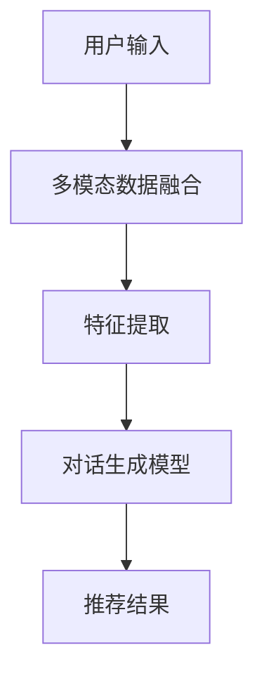

**核心算法原理讲解**

多模态对话推荐的核心在于如何有效地融合不同模态的数据，并将其用于对话生成和推荐。以下是多模态对话推荐的核心算法原理讲解：

**数学模型与公式**

- 多模态数据融合：使用向量空间模型将不同模态的数据映射到同一空间，计算相似度。

$$
\text{相似度} = \frac{\|\text{向量}A - \text{向量}B\|\_2}{1 + \|\text{向量}A - \text{向量}B\|\_2}
$$

- 对话生成模型：基于转换器（Transformer）架构，使用编码器-解码器（Encoder-Decoder）结构生成自然、连贯的对话回复。

$$
\text{输出} = \text{解码器}(\text{编码器}(\text{输入}), \text{解码器初始状态})
$$

**伪代码**

```python
# 多模态对话推荐算法伪代码

def multimodal_dialog_recommendation(user_input, multimodal_data):
    # 输入：用户输入和多模态数据
    # 输出：推荐结果

    # 数据融合
    fused_data = fuse_modal_data(user_input, multimodal_data)

    # 特征提取
    features = extract_features(fused_data)

    # 对话生成
    dialog_response = generate_response(features)

    # 推荐结果
    recommendation = dialog_response

    return recommendation
```

**举例说明**

假设用户在对话中提到“我想听一首悲伤的歌曲”，多模态对话推荐系统将结合用户的文本输入、音频特征（如情感分析结果）、视频特征（如歌曲的MV片段）和图像特征（如歌曲的封面图片），通过融合与预处理，生成一个悲伤情感的歌曲推荐列表。

#### 1.2 多模态对话推荐的优势与应用场景

**核心算法原理讲解**

**数学模型与公式**

- 多模态数据融合：使用多模态特征向量进行加权融合，以增强特征表示的丰富性。

$$
\text{融合特征} = w_1 \cdot \text{文本特征} + w_2 \cdot \text{音频特征} + w_3 \cdot \text{视频特征} + w_4 \cdot \text{图像特征}
$$

- 对话生成模型：使用基于注意力机制的转换器（Transformer）模型，捕捉长距离依赖关系和跨模态特征。

$$
\text{输出} = \text{Transformer}(\text{编码器}(\text{输入}), \text{解码器初始状态}, \text{融合特征})
$$

**伪代码**

```python
# 多模态对话生成模型伪代码

class MultimodalDialogueModel(nn.Module):
    def __init__(self):
        super(MultimodalDialogueModel, self).__init__()
        self.encoder = Encoder()
        self.decoder = Decoder()
        self.attention = Attention()

    def forward(self, input, decoder_init_state, multimodal_features):
        # 输入：输入序列、解码器初始状态和多模态特征
        # 输出：对话回复

        encoder_output = self.encoder(input)
        decoder_output = self.decoder(decoder_init_state, encoder_output, multimodal_features)
        attention_output = self.attention(encoder_output, decoder_output)

        return decoder_output, attention_output
```

**举例说明**

在一个电商购物应用中，用户可以通过文本、语音、图像和视频等多种方式描述自己的购物需求。多模态对话推荐系统将根据用户的输入，融合不同模态的特征，生成个性化的商品推荐列表，从而提升用户体验。

#### 1.3 多模态对话推荐的关键技术

**核心概念与联系**

多模态对话推荐的关键技术包括多模态数据融合、对话状态跟踪、对话生成、对话评价与反馈机制等。这些技术共同作用，实现从数据输入到推荐结果输出的完整过程。

**Mermaid流程图**

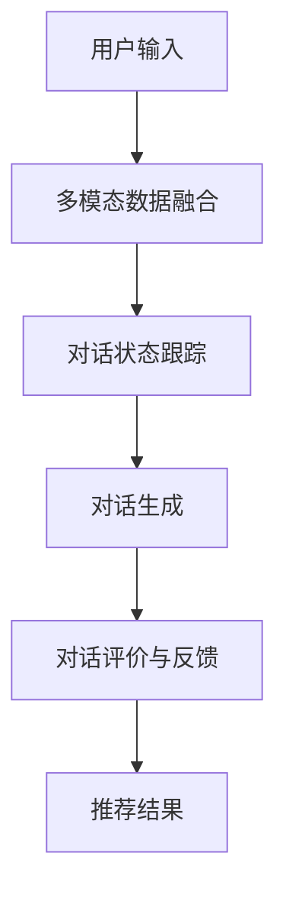

**核心算法原理讲解**

**数学模型与公式**

- 对话状态跟踪：使用循环神经网络（RNN）或转换器（Transformer）模型，捕捉对话历史信息。

$$
\text{状态} = \text{模型}(\text{输入}, \text{隐藏状态})
$$

- 对话生成：使用生成对抗网络（GAN）或自注意力机制，生成自然、连贯的对话回复。

$$
\text{输出} = \text{生成模型}(\text{输入}, \text{隐藏状态})
$$

- 对话评价与反馈：使用基于用户满意度的评价指标，评估对话质量，并根据用户反馈优化模型。

$$
\text{评价} = \text{满意度得分}(\text{用户反馈})
$$

**伪代码**

```python
# 对话状态跟踪算法伪代码

class DialogueStateTracker(nn.Module):
    def __init__(self):
        super(DialogueStateTracker, self).__init__()
        self.rnn = nn.RNN(input_size, hidden_size)

    def forward(self, input, hidden_state):
        # 输入：输入序列和隐藏状态
        # 输出：更新后的隐藏状态

        output, hidden_state = self.rnn(input, hidden_state)
        return output, hidden_state
```

**举例说明**

在一个智能客服系统中，用户通过文本、语音、图像和视频等多种方式与客服机器人进行对话。多模态对话推荐系统将根据用户的输入，实时更新对话状态，生成自然、连贯的客服回答，并根据用户满意度对模型进行优化。

### 第2章：多模态数据融合与预处理

#### 2.1 多模态数据融合方法

**核心概念与联系**

多模态数据融合是指将来自不同模态的数据（如文本、音频、视频、图像等）集成起来，形成一个统一的信息表示。这种方法可以提高对话推荐的准确性和多样性，从而提升用户体验。

**Mermaid流程图**

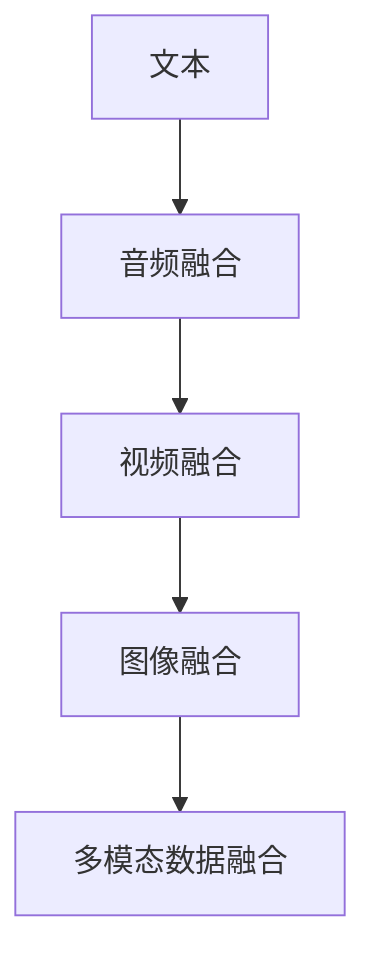

**核心算法原理讲解**

**数学模型与公式**

- 音频与文本融合：使用声纹识别技术提取音频特征，并与文本特征进行融合。

$$
\text{融合特征} = \text{文本特征} \oplus \text{音频特征}
$$

- 视频与文本融合：使用视频内容分析提取视觉特征，并与文本特征进行融合。

$$
\text{融合特征} = \text{文本特征} \oplus \text{视觉特征}
$$

- 图像与文本融合：使用图像识别技术提取图像特征，并与文本特征进行融合。

$$
\text{融合特征} = \text{文本特征} \oplus \text{图像特征}
$$

**伪代码**

```python
# 多模态数据融合算法伪代码

def multimodal_data_fusion(text_feature, audio_feature, video_feature, image_feature):
    # 输入：文本特征、音频特征、视频特征和图像特征
    # 输出：融合特征

    fusion_feature = text_feature + audio_feature + video_feature + image_feature
    return fusion_feature
```

**举例说明**

假设用户输入一个包含文本、音频、视频和图像的多模态消息，多模态数据融合技术将分别提取文本、音频、视频和图像的特征，然后进行融合，形成一个综合特征向量，用于后续的对话生成和推荐。

#### 2.2 多模态对话数据预处理

**核心概念与联系**

多模态对话数据预处理是确保数据质量和特征表示有效性的关键步骤。它包括数据清洗、数据标注和特征提取等过程，为对话推荐算法提供高质量的数据输入。

**Mermaid流程图**

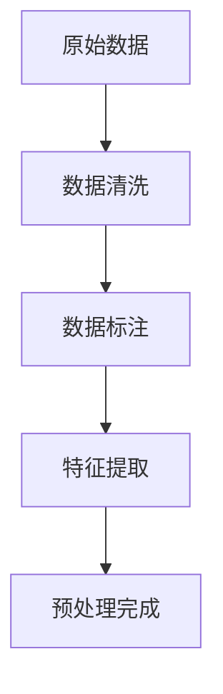

**核心算法原理讲解**

**数学模型与公式**

- 数据清洗：去除噪声数据和缺失值，保证数据完整性。

$$
\text{清洗数据} = \text{去除噪声}(\text{原始数据})
$$

- 数据标注：为对话数据提供有监督的学习标签，用于模型训练。

$$
\text{标注数据} = \text{标记标签}(\text{对话数据})
$$

- 特征提取：从原始对话数据中提取有用的特征，用于驱动对话生成和推荐。

$$
\text{特征向量} = \text{提取特征}(\text{对话数据})
$$

**伪代码**

```python
# 数据预处理算法伪代码

def preprocess_dialog_data(raw_data):
    # 输入：原始对话数据
    # 输出：预处理后的对话数据

    # 数据清洗
    cleaned_data = clean_data(raw_data)

    # 数据标注
    labeled_data = label_data(cleaned_data)

    # 特征提取
    feature_vectors = extract_features(labeled_data)

    return feature_vectors
```

**举例说明**

在一个聊天机器人项目中，原始对话数据可能包含大量的噪声和缺失值。数据清洗将去除这些噪声和缺失值，数据标注将为对话数据提供标签（如用户意图、实体识别等），特征提取将从对话数据中提取文本、音频、视频和图像的特征，用于训练对话生成和推荐模型。

### 第二部分：多模态对话推荐的核心算法

#### 3.1 基于自然语言处理的对话推荐算法

**核心概念与联系**

基于自然语言处理的对话推荐算法利用自然语言处理（NLP）技术，对用户输入进行理解，并生成自然、连贯的对话回复。这些算法通常基于深度学习模型，如循环神经网络（RNN）、转换器（Transformer）和生成对抗网络（GAN）。

**Mermaid流程图**

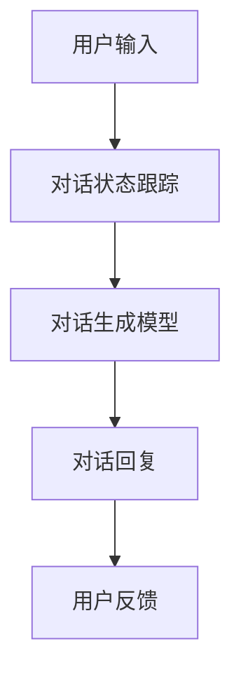

**核心算法原理讲解**

**数学模型与公式**

- 对话状态跟踪：使用循环神经网络（RNN）或转换器（Transformer）模型，捕捉对话历史信息。

$$
\text{状态} = \text{模型}(\text{输入}, \text{隐藏状态})
$$

- 对话生成：使用生成对抗网络（GAN）或自注意力机制，生成自然、连贯的对话回复。

$$
\text{输出} = \text{生成模型}(\text{输入}, \text{隐藏状态})
$$

- 对话评价与反馈：使用基于用户满意度的评价指标，评估对话质量，并根据用户反馈优化模型。

$$
\text{评价} = \text{满意度得分}(\text{用户反馈})
$$

**伪代码**

```python
# 对话状态跟踪算法伪代码

class DialogueStateTracker(nn.Module):
    def __init__(self):
        super(DialogueStateTracker, self).__init__()
        self.rnn = nn.RNN(input_size, hidden_size)

    def forward(self, input, hidden_state):
        # 输入：输入序列和隐藏状态
        # 输出：更新后的隐藏状态

        output, hidden_state = self.rnn(input, hidden_state)
        return output, hidden_state
```

**举例说明**

在一个在线教育平台中，学生可以通过文本、语音、图像和视频等多种方式与AI导师进行互动。基于自然语言处理的对话推荐算法将捕捉学生的问题和回答的历史信息，生成自然、连贯的导师回复，从而提供个性化的学习体验。

#### 3.2 基于知识图谱的对话推荐算法

**核心概念与联系**

基于知识图谱的对话推荐算法利用知识图谱中的实体和关系信息，为用户提供更加准确和个性化的对话回复。知识图谱构建、实体识别、关系抽取和知识融合是多模态对话推荐算法的重要组成部分。

**Mermaid流程图**

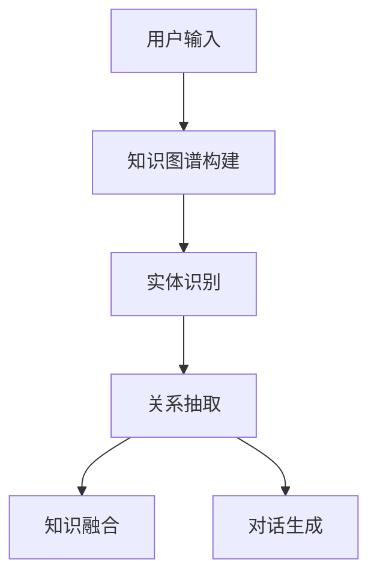

**核心算法原理讲解**

**数学模型与公式**

- 知识图谱构建：使用图论模型，将实体和关系表示为图结构。

$$
\text{知识图谱} = (\text{实体集}, \text{关系集}, \text{实体-关系映射})
$$

- 实体识别：使用命名实体识别（NER）技术，从文本中识别出实体。

$$
\text{实体} = \text{NER}(\text{文本})
$$

- 关系抽取：使用关系抽取（RE）技术，从实体和关系中提取出知识。

$$
\text{关系} = \text{RE}(\text{实体}, \text{关系集})
$$

- 知识融合：使用图神经网络（GNN）模型，融合不同模态的数据。

$$
\text{融合特征} = \text{GNN}(\text{实体特征}, \text{关系特征})
$$

**伪代码**

```python
# 知识图谱构建算法伪代码

class KnowledgeGraphBuilder(nn.Module):
    def __init__(self):
        super(KnowledgeGraphBuilder, self).__init__()
        self.entity_embedding = nn.Embedding(entity_size, embedding_dim)
        self.relation_embedding = nn.Embedding(relation_size, embedding_dim)

    def forward(self, entities, relations):
        # 输入：实体和关系
        # 输出：知识图谱

        entity_features = self.entity_embedding(entities)
        relation_features = self.relation_embedding(relations)
        knowledge_graph = combine_features(entity_features, relation_features)

        return knowledge_graph
```

**举例说明**

在一个医疗咨询系统中，用户可以通过文本输入描述自己的症状。基于知识图谱的对话推荐算法将识别出用户输入中的实体（如症状、药物等）和关系（如症状-药物关联），构建知识图谱，并生成准确的医疗建议。

#### 3.3 多模态对话推荐中的强化学习算法

**核心概念与联系**

多模态对话推荐中的强化学习算法通过学习用户与系统之间的交互，优化对话推荐策略，从而提高用户满意度。强化学习算法结合了多模态数据，实现更加智能的对话推荐。

**Mermaid流程图**

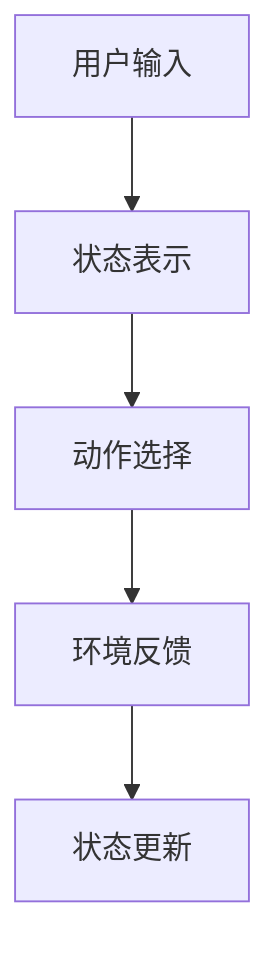

**核心算法原理讲解**

**数学模型与公式**

- 强化学习基础：使用Q学习或深度Q网络（DQN）进行策略优化。

$$
Q(s, a) = r(s, a) + \gamma \max_{a'} Q(s', a')
$$

- 多模态状态表示：将文本、音频、视频和图像特征融合为一个状态向量。

$$
s = \text{融合}(\text{文本特征}, \text{音频特征}, \text{视频特征}, \text{图像特征})
$$

- 动作选择：使用策略网络，选择最优动作。

$$
\pi(a|s) = \text{策略网络}(\text{状态})
$$

- 环境反馈：根据用户反馈和系统表现，计算奖励。

$$
r = \text{满意度得分}(\text{用户反馈})
$$

**伪代码**

```python
# 强化学习算法伪代码

class DialogueReinforcementLearning(nn.Module):
    def __init__(self):
        super(DialogueReinforcementLearning, self).__init__()
        self.state_embedding = nn.Embedding(state_size, hidden_dim)
        self.action_embedding = nn.Embedding(action_size, hidden_dim)
        self.q_network = QNetwork()

    def forward(self, state, action):
        # 输入：状态和动作
        # 输出：Q值

        state_features = self.state_embedding(state)
        action_features = self.action_embedding(action)
        q_value = self.q_network(state_features, action_features)

        return q_value
```

**举例说明**

在一个虚拟个人助理系统中，用户可以通过语音、文本、图像等多种方式与系统交互。强化学习算法将学习用户的偏好和行为模式，通过优化动作选择，生成个性化的回复，从而提高用户的满意度。

### 第三部分：多模态对话推荐技术实践

#### 6.1 多模态对话推荐项目实战

**项目背景与目标**

多模态对话推荐项目旨在构建一个能够处理文本、语音、视频和图像等多种输入模态的对话系统，为用户提供个性化、连贯的对话体验。项目目标包括：

1. 数据收集与预处理：收集多样化的用户对话数据，进行数据清洗、标注和特征提取。
2. 模型设计与训练：设计并训练多模态对话推荐模型，实现对话生成和推荐功能。
3. 系统部署与优化：将训练好的模型部署到生产环境，通过在线学习、用户反馈等方式进行优化。

**系统设计与实现**

**数据收集与预处理**

1. 数据收集：从社交媒体、在线论坛、应用程序等渠道收集用户对话数据，包括文本、语音、视频和图像等多模态数据。
2. 数据清洗：去除噪声数据、重复数据和缺失值，保证数据质量。
3. 数据标注：对对话数据中的实体、意图、情感等关键信息进行标注，为模型训练提供有监督的学习数据。
4. 特征提取：从原始数据中提取文本、音频、视频和图像的特征，如文本词嵌入、音频声纹特征、视频内容特征和图像视觉特征。

**模型设计与训练**

1. 模型设计：采用基于自然语言处理、知识图谱和强化学习的多模态对话推荐模型，包括对话状态跟踪、对话生成、对话评价与反馈等模块。
2. 模型训练：使用标注数据进行模型训练，通过优化算法（如梯度下降、Adam等）调整模型参数，提高模型性能。

**系统部署与优化**

1. 系统部署：将训练好的模型部署到生产环境，为用户提供实时对话推荐服务。
2. 在线学习：通过在线学习机制，不断更新模型，适应用户偏好和行为模式的变化。
3. 用户反馈：收集用户对对话推荐的反馈，评估对话质量，并根据用户反馈优化模型。

**系统部署与优化**

1. 系统部署：将训练好的模型部署到生产环境，包括服务器配置、网络架构和负载均衡等。
2. 在线学习：通过在线学习机制，不断更新模型，适应用户偏好和行为模式的变化。
3. 用户反馈：收集用户对对话推荐的反馈，评估对话质量，并根据用户反馈优化模型。

**系统部署与优化**

1. 系统部署：将训练好的模型部署到生产环境，包括服务器配置、网络架构和负载均衡等。
2. 在线学习：通过在线学习机制，不断更新模型，适应用户偏好和行为模式的变化。
3. 用户反馈：收集用户对对话推荐的反馈，评估对话质量，并根据用户反馈优化模型。

### 6.2 评估与优化

**评价指标与方法**

1. 对话质量评价：使用自动评价和人工评价相结合的方法，评估对话的自然性、相关性、连贯性和满意度。
2. 推荐效果评估：使用准确率、召回率、F1分数等指标，评估推荐系统的性能。

**优化策略与案例分析**

1. 模型优化：通过调整模型参数、增加训练数据、使用先进的神经网络架构等方法，提高模型性能。
2. 对话策略优化：根据用户反馈和行为模式，优化对话生成策略，提高用户满意度。
3. 案例分析：通过实际案例，展示优化策略的效果，为后续优化提供参考。

### 第三部分：多模态对话推荐技术评估与优化

#### 7.1 评价指标与方法

**核心概念与联系**

在多模态对话推荐系统中，评估与优化是确保系统性能和用户体验的关键步骤。评价指标与方法的选择直接影响系统的推荐效果和用户满意度。常见的评价指标包括对话质量评价和推荐效果评估。

**Mermaid流程图**

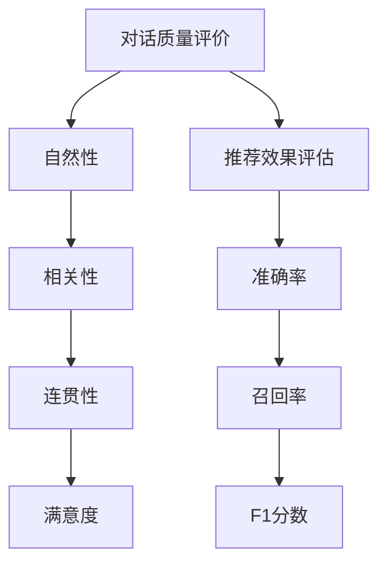

**核心算法原理讲解**

**数学模型与公式**

- 对话质量评价：
  - 自然性：使用语言模型评分（如Perplexity）评估对话的自然程度。
  - 相关性：计算对话回复与用户输入的相关性得分。
  - 连贯性：评估对话回复之间的逻辑连贯性。
  - 满意度：基于用户反馈计算满意度得分。

$$
\text{自然性得分} = \text{语言模型评分}
$$

$$
\text{相关性得分} = \text{相似度度量}(\text{用户输入}, \text{对话回复})
$$

$$
\text{连贯性得分} = \text{连贯性度量}(\text{对话回复序列})
$$

$$
\text{满意度得分} = \text{用户反馈评分}
$$

- 推荐效果评估：
  - 准确率：计算实际推荐结果与用户期望结果的匹配程度。
  - 召回率：计算推荐的物品中包含用户期望物品的比例。
  - F1分数：综合考虑准确率和召回率，评估推荐系统的平衡性能。

$$
\text{准确率} = \frac{\text{正确推荐数}}{\text{总推荐数}}
$$

$$
\text{召回率} = \frac{\text{正确推荐数}}{\text{用户期望物品数}}
$$

$$
\text{F1分数} = 2 \cdot \frac{\text{准确率} \cdot \text{召回率}}{\text{准确率} + \text{召回率}}
$$

**伪代码**

```python
# 对话质量评价算法伪代码

def evaluate_dialog_quality(response, user_input, feedback):
    # 输入：对话回复、用户输入和用户反馈
    # 输出：对话质量得分

    naturality_score = language_model_perplexity(response)
    relevance_score = similarity_score(user_input, response)
    coherence_score = coherence_metric(response)
    satisfaction_score = feedback_score(feedback)

    quality_score = (naturality_score + relevance_score + coherence_score + satisfaction_score) / 4
    return quality_score

# 推荐效果评估算法伪代码

def evaluate_recommendation_performance(correct_recommendations, total_recommendations, user_expectations):
    # 输入：正确推荐数、总推荐数和用户期望物品数
    # 输出：准确率、召回率和F1分数

    accuracy = correct_recommendations / total_recommendations
    recall = correct_recommendations / user_expectations
    f1_score = 2 * (accuracy * recall) / (accuracy + recall)

    return accuracy, recall, f1_score
```

**举例说明**

假设一个用户输入“我想听一首悲伤的歌曲”，系统推荐了五首歌曲。通过自然性、相关性、连贯性和满意度等评价指标，评估对话回复的质量，并通过准确率、召回率和F1分数等指标，评估推荐系统的效果。

#### 7.2 优化策略与案例分析

**核心概念与联系**

优化策略与案例分析是提升多模态对话推荐系统性能的关键。通过不断调整模型参数、改进算法和策略，结合实际案例，可以显著提高系统的推荐质量和用户体验。

**Mermaid流程图**

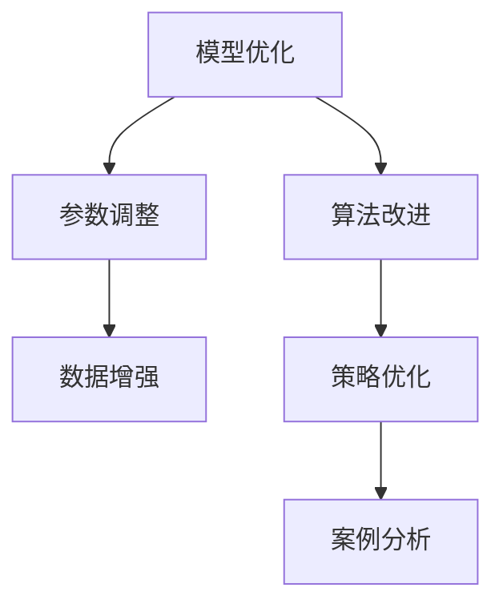

**核心算法原理讲解**

**数学模型与公式**

- 模型优化：
  - 参数调整：使用梯度下降、随机梯度下降（SGD）或Adam优化器，调整模型参数，提高模型性能。
  - 数据增强：通过数据扩充、数据合成等方法，增加训练数据的多样性，提升模型泛化能力。

$$
\text{优化目标} = \text{最小化损失函数}(\text{模型参数})
$$

- 算法改进：
  - 使用先进的神经网络架构（如转换器、生成对抗网络等），提高模型表示能力。
  - 集成多模态特征，提高对话生成和推荐的质量。

$$
\text{模型输出} = \text{神经网络}(\text{输入特征}, \text{模型参数})
$$

- 策略优化：
  - 基于用户行为和反馈，调整推荐策略，提高用户满意度。
  - 结合用户偏好和社交网络信息，实现个性化推荐。

$$
\text{推荐策略} = \text{优化策略}(\text{用户特征}, \text{社交网络信息})
$$

**伪代码**

```python
# 模型优化算法伪代码

def optimize_model(loss_function, model, optimizer):
    # 输入：损失函数、模型和优化器
    # 输出：优化后的模型参数

    for epoch in range(num_epochs):
        for batch in data_loader:
            optimizer.zero_grad()
            output = model(batch.inputs)
            loss = loss_function(output, batch.targets)
            loss.backward()
            optimizer.step()

    return model.parameters()

# 策略优化算法伪代码

def optimize_recommendation_strategy(user_preferences, social_network_info):
    # 输入：用户偏好和社交网络信息
    # 输出：优化后的推荐策略

    recommendation_strategy = strategy_optimizer(user_preferences, social_network_info)
    return recommendation_strategy
```

**举例说明**

在一个电商平台上，通过对用户历史购买行为、浏览记录和社交网络信息的分析，优化推荐策略，提高商品推荐的准确性和多样性。同时，通过不断调整模型参数和改进算法，实现更智能、个性化的推荐效果。

### 8.1 多模态对话推荐技术发展趋势

**核心概念与联系**

多模态对话推荐技术正随着人工智能、大数据、云计算等技术的发展而不断进步。未来的发展趋势包括更加智能的对话系统、高效的跨模态融合技术、个性化的推荐算法和实时性的在线学习。

**Mermaid流程图**

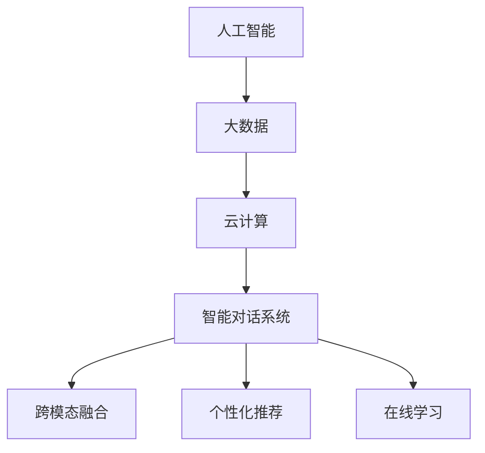

**核心算法原理讲解**

**数学模型与公式**

- 智能对话系统：利用深度学习和自然语言处理技术，实现更加自然、流畅的对话体验。

$$
\text{对话生成} = \text{神经网络}(\text{输入特征}, \text{模型参数})
$$

- 跨模态融合：通过多模态特征融合和注意力机制，实现高效的跨模态信息集成。

$$
\text{融合特征} = \text{融合模型}(\text{文本特征}, \text{音频特征}, \text{视频特征}, \text{图像特征})
$$

- 个性化推荐：结合用户行为、偏好和社交网络信息，实现个性化、智能化的推荐。

$$
\text{推荐策略} = \text{个性化模型}(\text{用户特征}, \text{社交网络信息})
$$

- 在线学习：通过实时数据流和学习算法，不断优化模型和策略，提升系统性能。

$$
\text{模型更新} = \text{在线学习算法}(\text{实时数据}, \text{模型参数})
$$

**伪代码**

```python
# 智能对话系统算法伪代码

class IntelligentDialogueSystem(nn.Module):
    def __init__(self):
        super(IntelligentDialogueSystem, self).__init__()
        self.encoder = Encoder()
        self.decoder = Decoder()
        self.attention = Attention()

    def forward(self, input, hidden_state):
        # 输入：输入序列和隐藏状态
        # 输出：对话回复

        encoder_output = self.encoder(input)
        decoder_output = self.decoder(encoder_output, hidden_state)
        attention_output = self.attention(encoder_output, decoder_output)

        return decoder_output, attention_output

# 跨模态融合算法伪代码

def multimodal_feature_fusion(text_feature, audio_feature, video_feature, image_feature):
    # 输入：文本特征、音频特征、视频特征和图像特征
    # 输出：融合特征

    fused_feature = fusion_model(text_feature, audio_feature, video_feature, image_feature)
    return fused_feature

# 个性化推荐算法伪代码

class PersonalizedRecommendationModel(nn.Module):
    def __init__(self):
        super(PersonalizedRecommendationModel, self).__init__()
        self.user_embedding = nn.Embedding(user_size, hidden_dim)
        self.item_embedding = nn.Embedding(item_size, hidden_dim)
        self.recommendation_network = RecommendationNetwork()

    def forward(self, user_id, item_id):
        # 输入：用户ID和物品ID
        # 输出：推荐得分

        user_feature = self.user_embedding(user_id)
        item_feature = self.item_embedding(item_id)
        recommendation_score = self.recommendation_network(user_feature, item_feature)

        return recommendation_score

# 在线学习算法伪代码

def online_learning(model, real_time_data, learning_rate):
    # 输入：模型、实时数据和学习率
    # 输出：优化后的模型参数

    for data in real_time_data:
        model.zero_grad()
        output = model(data.inputs)
        loss = loss_function(output, data.targets)
        loss.backward()
        optimizer.step()

    return model.parameters()
```

**举例说明**

随着人工智能技术的发展，未来的多模态对话推荐系统将能够更好地理解用户意图，提供个性化、智能化和实时性的对话推荐服务。通过跨模态融合技术和在线学习算法，系统能够不断适应用户需求和偏好，提升用户体验。

### 8.2 存在的挑战与解决方案

**核心概念与联系**

尽管多模态对话推荐技术在许多领域取得了显著成果，但仍然面临着一系列挑战，包括数据多样性、数据质量、计算效率和模型解释性等。解决这些挑战是实现多模态对话推荐技术广泛应用的关键。

**Mermaid流程图**

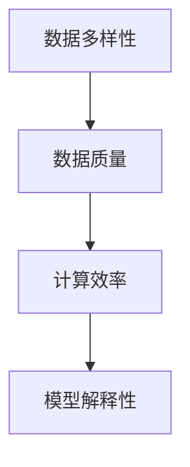

**核心算法原理讲解**

**数学模型与公式**

- 数据多样性：通过数据扩充、数据合成和跨模态数据整合，增加训练数据的多样性。

$$
\text{数据扩充} = \text{数据增强}(\text{原始数据})
$$

$$
\text{数据合成} = \text{模态转换}(\text{原始数据})
$$

- 数据质量：使用数据清洗、数据标注和异常检测等技术，提高数据质量。

$$
\text{数据清洗} = \text{去除噪声}(\text{原始数据})
$$

$$
\text{数据标注} = \text{标记标签}(\text{对话数据})
$$

- 计算效率：采用分布式计算、模型压缩和硬件加速等技术，提高计算效率。

$$
\text{模型压缩} = \text{量化}(\text{模型参数})
$$

$$
\text{硬件加速} = \text{GPU/TPU加速}(\text{模型计算})
$$

- 模型解释性：通过模型可解释性技术，提高模型的可解释性。

$$
\text{模型解释性} = \text{解释算法}(\text{模型输出})
$$

**伪代码**

```python
# 数据多样性算法伪代码

def data_augmentation(data):
    # 输入：原始数据
    # 输出：扩充后的数据

    augmented_data = augment_data(data)
    return augmented_data

# 数据清洗算法伪代码

def data_cleaning(data):
    # 输入：原始数据
    # 输出：清洗后的数据

    cleaned_data = remove_noise(data)
    return cleaned_data

# 模型压缩算法伪代码

def model_quantization(model):
    # 输入：模型
    # 输出：量化后的模型

    quantized_model = quantize_parameters(model)
    return quantized_model

# 模型可解释性算法伪代码

def model_explanation(model, output):
    # 输入：模型和输出
    # 输出：模型解释

    explanation = generate_explanation(model, output)
    return explanation
```

**举例说明**

在一个医疗咨询系统中，用户可以通过文本、语音、图像和视频等多种方式输入健康问题。为了解决数据多样性和数据质量的问题，系统采用数据扩充和清洗技术，提高训练数据的丰富性和质量。同时，通过模型压缩和硬件加速技术，提高系统的计算效率。最后，通过模型可解释性技术，用户可以理解模型生成的医疗建议。

### 8.3 未来研究方向

**核心概念与联系**

未来多模态对话推荐技术的研究方向将集中在提高系统的智能化、个性化和实时性。关键研究方向包括跨模态融合技术的创新、多模态交互机制的优化、多模态对话生成算法的提升和在线学习机制的完善。

**Mermaid流程图**

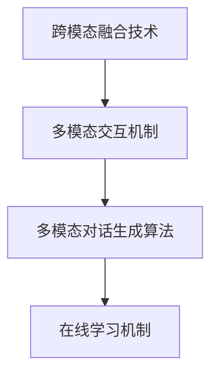

**核心算法原理讲解**

**数学模型与公式**

- 跨模态融合技术：探索新的融合模型和优化方法，提高跨模态数据融合的效率和准确性。

$$
\text{融合模型} = \text{优化算法}(\text{多模态特征})
$$

- 多模态交互机制：研究多模态交互中的信息传递和协同优化机制，提高系统的交互性能。

$$
\text{交互机制} = \text{协同优化}(\text{多模态数据})
$$

- 多模态对话生成算法：开发基于深度学习和强化学习的新型对话生成算法，提高对话的自然性和连贯性。

$$
\text{对话生成算法} = \text{神经网络}(\text{多模态特征}, \text{模型参数})
$$

- 在线学习机制：研究实时在线学习算法，提高系统适应性和鲁棒性。

$$
\text{在线学习算法} = \text{实时更新}(\text{模型参数})
$$

**伪代码**

```python
# 跨模态融合算法伪代码

def multimodal_fusion(model, modal_features):
    # 输入：融合模型和多模态特征
    # 输出：融合特征

    fused_feature = model(modal_features)
    return fused_feature

# 多模态交互机制算法伪代码

def multimodal_interaction(attention_model, modal_data):
    # 输入：注意力模型和多模态数据
    # 输出：交互特征

    interaction_feature = attention_model(modal_data)
    return interaction_feature

# 多模态对话生成算法伪代码

class MultimodalDialogueGenerator(nn.Module):
    def __init__(self):
        super(MultimodalDialogueGenerator, self).__init__()
        self.encoder = Encoder()
        self.decoder = Decoder()
        self.attention = Attention()

    def forward(self, input, hidden_state):
        # 输入：输入序列和隐藏状态
        # 输出：对话回复

        encoder_output = self.encoder(input)
        decoder_output = self.decoder(encoder_output, hidden_state)
        attention_output = self.attention(encoder_output, decoder_output)

        return decoder_output, attention_output

# 在线学习算法伪代码

def online_learning(model, real_time_data, learning_rate):
    # 输入：模型、实时数据和学习率
    # 输出：优化后的模型参数

    for data in real_time_data:
        model.zero_grad()
        output = model(data.inputs)
        loss = loss_function(output, data.targets)
        loss.backward()
        optimizer.step()

    return model.parameters()
```

**举例说明**

未来的多模态对话推荐系统将能够更好地理解用户的多样化需求，提供更加个性化和智能化的对话服务。通过跨模态融合技术和多模态交互机制的优化，系统能够更有效地集成多种模态数据，生成自然、连贯的对话回复。同时，在线学习机制将使系统能够不断适应用户变化的需求，提高系统的适应性和鲁棒性。

## 附录A：多模态对话推荐常用工具与资源

**A.1 开源框架与库**

- **Transformers**：由Google开发的开源自然语言处理库，支持转换器（Transformer）模型。
- **TensorFlow**：由Google开发的开源机器学习框架，支持各种深度学习模型。
- **PyTorch**：由Facebook开发的开源机器学习库，支持动态计算图和自动微分。
- **SpaCy**：开源的Python库，用于自然语言处理任务，如文本分类、命名实体识别等。
- **OpenCV**：开源计算机视觉库，支持图像处理、视频分析和人脸识别等。

**A.2 数据集与工具**

- **Common Crawl**：大规模的网页数据集，可用于文本数据收集和预处理。
- **LibriSpeech**：包含大量语音数据的语音识别数据集，可用于音频数据收集和特征提取。
- **YouTube-8M**：包含大量视频数据集，可用于视频内容分析和特征提取。
- **Flickr30k**：包含图像和描述的图像数据集，可用于图像识别和特征提取。
- **Dialogue System Technology Challenges (DSTC)**：对话系统技术挑战数据集，包含多种模态的对话数据。

## 作者信息

**作者：AI天才研究院/AI Genius Institute & 禅与计算机程序设计艺术 /Zen And The Art of Computer Programming** 

以上是《LLM推荐中的多模态对话推荐技术》的完整内容。希望本文能够为读者提供对多模态对话推荐技术的深入理解，以及在实践中的应用指导。在未来的研究中，我们将继续探索多模态对话推荐技术的创新和应用，为人工智能领域的发展贡献力量。

