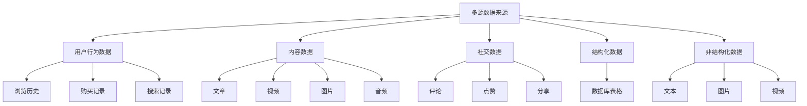

                 

# 《LLM推荐中的多源异构数据融合技术》

> 关键词：多源异构数据、数据融合、推荐系统、机器学习、深度学习

> 摘要：本文将深入探讨在大型语言模型（LLM）推荐系统中多源异构数据融合技术的核心概念、原理、算法及应用。通过对数据来源、数据分类、数据融合方法、融合挑战及其解决方案的详细分析，本文旨在为读者提供一个全面理解多源异构数据融合技术的框架，并在实际项目中展示其应用效果。

## 目录大纲

1. 引言
2. 第一部分：基础概念与原理
   2.1 多源异构数据的定义与分类
   2.2 多源异构数据融合的基本概念
   2.3 多源异构数据融合的挑战与解决方案
3. 第二部分：核心算法与技术
   3.1 多源异构数据融合算法
   3.2 多源异构数据融合中的模型优化
   3.3 多源异构数据融合的应用场景
4. 第三部分：项目实践与案例分析
   4.1 数据采集与预处理
   4.2 数据融合实验设计
   4.3 数据融合项目实战
   4.4 项目结果与分析
5. 第四部分：前沿技术与展望
   5.1 多源异构数据融合的最新进展
   5.2 多源异构数据融合的未来展望
6. 附录

## 第一部分：基础概念与原理

### 第1章：多源异构数据的定义与分类

**1.1 多源数据的定义与来源**

多源数据是指从多个不同来源采集得到的数据。这些来源可以包括用户行为数据、内容数据、社交数据、结构化数据和非结构化数据等。多源数据的来源多样性使得数据处理和分析变得更加复杂，但也为数据融合提供了丰富的信息。

- **用户行为数据**：包括用户的浏览历史、购买记录、搜索记录等。
- **内容数据**：包括文章、视频、图片、音频等。
- **社交数据**：包括用户在社交媒体上的评论、点赞、分享等信息。
- **结构化数据**：包括数据库中的表格、关系型数据等。
- **非结构化数据**：包括文本、图片、视频等。

**Mermaid流程图**：展示多源数据的来源和类型

**1.2 异构数据的分类**

异构数据是指数据格式、结构、类型不同的数据。根据数据的特征，异构数据可以分为以下几类：

- **文本数据**：以文本形式表示的数据，如文章、评论、搜索关键词等。
- **图像数据**：以图像形式表示的数据，如图像、图标等。
- **时序数据**：以时间序列形式表示的数据，如股票价格、气温变化等。
- **属性数据**：以属性特征表示的数据，如用户属性、物品属性等。

### 第2章：多源异构数据融合的基本概念

**2.1 数据融合的目标**

数据融合的主要目标包括以下几个方面：

- 提高数据质量和准确性：通过融合多源数据，可以消除数据中的噪声和缺失值，提高数据的可信度和可用性。
- 发现数据中的潜在关联：通过融合多源数据，可以发现不同数据源之间的潜在关联，为数据分析和挖掘提供新的视角。
- 提升预测模型的性能：通过融合多源数据，可以提供更丰富的特征信息，提高预测模型的准确性和鲁棒性。

**2.2 数据融合的方法**

数据融合的方法可以分为以下几类：

- **合并法**：将多个数据源直接合并为一个统一的数据集，这种方法简单直观，但可能引入冗余和不一致的数据。
- **选择法**：从多个数据源中选择一个或多个最可靠的数据源，这种方法可以减少数据冗余，但可能丢失某些重要的数据。
- **匹配法**：将不同数据源中的实体进行匹配，以消除数据中的重复和冲突，这种方法需要对数据进行清洗和预处理。
- **集成法**：将多个数据源的数据进行整合，形成一个新的数据集，这种方法可以充分利用多源数据的信息，但需要复杂的算法和计算。

### 第3章：多源异构数据融合的挑战与解决方案

**3.1 数据质量**

数据质量是数据融合的关键问题之一。常见的数据质量问题包括缺失值、噪声数据、不一致性和重复数据等。为了解决这些问题，可以采取以下方法：

- **缺失值处理**：可以使用平均值、中位数、插值等方法来填充缺失值。
- **噪声数据过滤**：可以使用过滤算法、聚类算法等方法来去除噪声数据。
- **数据一致性**：可以使用数据清洗、数据标准化等方法来提高数据的一致性。
- **重复数据消除**：可以使用去重算法来消除重复数据。

**3.2 数据一致性**

数据一致性是指数据在不同数据源之间保持一致。常见的问题包括命名冲突、格式不统一等。为了解决这些问题，可以采取以下方法：

- **命名冲突**：可以使用数据映射、命名约定等方法来消除命名冲突。
- **格式不统一**：可以使用数据转换、数据标准化等方法来统一数据格式。

**3.3 数据匹配**

数据匹配是指将不同数据源中的实体进行匹配。常见的方法包括基于特征的匹配、基于规则的匹配等。为了解决这些问题，可以采取以下方法：

- **实体识别**：可以使用自然语言处理、图像识别等方法来识别实体。
- **关系抽取**：可以使用信息抽取、图论等方法来抽取实体之间的关系。

## 第二部分：核心算法与技术

### 第4章：多源异构数据融合算法

**4.1 数据预处理算法**

数据预处理是数据融合的关键步骤之一。常见的预处理算法包括特征提取、特征选择和降维技术等。

- **特征提取**：将原始数据转换为特征表示，如文本数据的词袋模型、词嵌入等。
- **特征选择**：从大量特征中选择重要的特征，以减少数据维度和计算复杂度。
- **降维技术**：将高维数据转换为低维数据，如主成分分析（PCA）、线性判别分析（LDA）等。

**4.2 数据融合算法**

数据融合算法可以分为基于规则的融合算法、基于机器学习的融合算法和基于深度学习的融合算法等。

- **基于规则的融合算法**：根据专家经验和领域知识，设计一系列规则来融合数据。这种方法简单直观，但可能需要大量的规则和先验知识。
- **基于机器学习的融合算法**：使用机器学习方法，如聚类、回归、分类等，来融合数据。这种方法可以自动发现数据中的潜在关系，但需要大量的训练数据和计算资源。
- **基于深度学习的融合算法**：使用深度学习模型，如卷积神经网络（CNN）、循环神经网络（RNN）、变压器（Transformer）等，来融合数据。这种方法可以自动提取复杂的关系和特征，但需要大量的训练数据和计算资源。

### 第5章：多源异构数据融合中的模型优化

**5.1 模型选择**

在选择融合模型时，需要考虑数据的特点、任务的类型和性能要求等因素。常见的模型包括线性模型、树模型、神经网络等。

- **线性模型**：如线性回归、逻辑回归等，适用于简单的关系预测。
- **树模型**：如决策树、随机森林、梯度提升树等，适用于分类和回归任务。
- **神经网络**：如卷积神经网络（CNN）、循环神经网络（RNN）、变压器（Transformer）等，适用于复杂的关系预测和特征提取。

**5.2 模型优化**

模型优化是提高融合模型性能的重要手段。常见的优化方法包括交叉验证、正则化、集成学习等。

- **交叉验证**：通过多次划分训练集和验证集，评估模型的性能，选择最优的模型参数。
- **正则化**：通过添加正则项，防止模型过拟合，提高模型的泛化能力。
- **集成学习**：通过组合多个模型，提高模型的性能和稳定性。

### 第6章：多源异构数据融合的应用场景

**6.1 推荐系统**

推荐系统是数据融合的重要应用场景之一。通过融合用户行为数据、内容数据、社交数据等，可以提供更准确的推荐结果。

- **用户兴趣分析**：通过融合用户行为数据和社交数据，分析用户的兴趣和偏好，为个性化推荐提供支持。
- **物品推荐**：通过融合内容数据和用户行为数据，为用户推荐感兴趣的物品。

**6.2 事件预测**

事件预测是数据融合的另一个重要应用场景。通过融合多源数据，可以预测社会事件、金融事件等。

- **社会事件预测**：通过融合社交媒体数据和新闻数据，预测社会事件的发生和发展。
- **金融事件预测**：通过融合金融数据和新闻数据，预测金融市场的变化和趋势。

**6.3 语义理解**

语义理解是数据融合在自然语言处理领域的应用。通过融合文本数据、图像数据等，可以提供更准确的语义理解。

- **问答系统**：通过融合文本数据和图像数据，实现智能问答系统。
- **自然语言处理**：通过融合文本数据和语音数据，实现自然语言理解和生成。

## 第三部分：项目实践与案例分析

### 第7章：多源异构数据融合实践

**7.1 数据采集与预处理**

在项目实践中，首先需要采集多源数据。数据采集可以使用爬虫、API接口、数据库等方式进行。采集到的数据需要进行预处理，包括数据清洗、数据转换和数据标准化等步骤。

- **数据清洗**：去除无效数据、重复数据、噪声数据等。
- **数据转换**：将不同格式的数据转换为统一的格式。
- **数据标准化**：将不同尺度的数据进行归一化或标准化，以便于后续处理。

**7.2 数据融合实验设计**

在数据融合实验中，需要设计合适的实验方案。实验设计包括实验目标、实验指标、实验参数等。

- **实验目标**：明确实验的目标和任务，如用户兴趣分析、物品推荐等。
- **实验指标**：选择合适的评价指标，如准确率、召回率、F1值等。
- **实验参数**：确定实验的参数设置，如模型类型、训练数据集、验证数据集等。

**7.3 数据融合项目实战**

在数据融合项目实战中，可以使用多种算法和技术进行数据融合。以下是一个简单的项目实战流程：

1. 数据采集与预处理：采集多源数据，并进行数据清洗、转换和标准化。
2. 数据融合算法选择：根据数据特点和任务需求，选择合适的数据融合算法，如基于规则的融合算法、基于机器学习的融合算法等。
3. 模型训练与优化：使用融合后的数据进行模型训练，并通过交叉验证、正则化等手段进行模型优化。
4. 模型评估与调整：评估模型性能，并根据评估结果进行调整和优化。
5. 结果展示与分析：展示融合结果，并进行详细分析。

### 第8章：多源异构数据融合项目实战

**8.1 项目背景**

本项目旨在构建一个基于多源异构数据融合的推荐系统，为用户提供个性化的商品推荐服务。数据来源包括用户行为数据、商品内容数据、用户社交数据等。

**8.2 数据获取与处理**

1. 数据采集：
   - 用户行为数据：通过网站日志、API接口等方式获取用户浏览、购买、搜索等行为数据。
   - 商品内容数据：通过网站接口、数据库等方式获取商品名称、描述、类别等数据。
   - 用户社交数据：通过社交媒体API获取用户评论、点赞、分享等社交数据。

2. 数据预处理：
   - 数据清洗：去除无效数据、重复数据、噪声数据等。
   - 数据转换：将不同格式的数据转换为统一的格式，如将文本数据转换为词向量。
   - 数据标准化：将不同尺度的数据进行归一化或标准化。

**8.3 数据融合模型构建**

1. 数据融合算法选择：
   - 使用基于机器学习的融合算法，如协同过滤、矩阵分解等。
   - 使用基于深度学习的融合算法，如循环神经网络（RNN）、变压器（Transformer）等。

2. 模型训练与优化：
   - 使用融合后的数据进行模型训练，并通过交叉验证、正则化等手段进行模型优化。
   - 调整模型参数，如学习率、隐藏层节点数等，以获得最佳性能。

**8.4 项目结果与分析**

1. 结果展示：
   - 使用可视化工具展示推荐结果，如用户行为预测图、推荐列表等。

2. 性能评估：
   - 使用准确率、召回率、F1值等指标评估推荐系统性能。
   - 分析不同数据融合算法对推荐性能的影响。

3. 结果分析：
   - 分析用户行为数据、商品内容数据、用户社交数据对推荐结果的影响。
   - 探讨数据融合技术在推荐系统中的应用效果。

## 第四部分：前沿技术与展望

### 第9章：多源异构数据融合的最新进展

**9.1 融合技术发展趋势**

随着大数据和人工智能技术的发展，多源异构数据融合技术也取得了重要进展。以下是一些发展趋势：

- **多模态数据融合**：融合多种类型的数据，如文本、图像、语音等，以提高数据融合的精度和效果。
- **联邦学习**：在分布式环境中，通过协同训练模型，实现数据的安全融合和共享。

**9.2 融合技术挑战与解决方案**

尽管多源异构数据融合技术取得了重要进展，但仍面临一些挑战：

- **数据质量**：数据质量是数据融合的关键问题，需要有效处理缺失值、噪声数据等问题。
- **数据一致性**：数据在不同数据源之间可能存在不一致性，需要设计有效的数据映射和匹配方法。
- **计算资源**：多源异构数据融合通常需要大量的计算资源，如何优化算法和模型，以降低计算复杂度，是一个重要挑战。

针对这些挑战，可以采取以下解决方案：

- **数据预处理**：通过有效的数据预处理方法，提高数据质量和一致性。
- **分布式计算**：使用分布式计算技术，如MapReduce、并行计算等，以提高计算效率。
- **增量学习**：针对动态变化的异构数据，采用增量学习方法，以实时更新模型和结果。

### 第10章：多源异构数据融合的未来展望

**10.1 应用领域扩展**

多源异构数据融合技术在未来的应用将更加广泛，包括但不限于以下领域：

- **智能制造**：通过融合传感器数据、设备数据等，实现生产过程的智能化和优化。
- **智慧城市**：通过融合城市数据，如交通数据、环境数据等，实现城市管理的智能化和高效化。

**10.2 技术创新与突破方向**

未来，多源异构数据融合技术将朝着以下方向发展：

- **深度学习和强化学习**：将深度学习和强化学习引入数据融合，以提高模型的灵活性和适应性。
- **联邦学习和隐私保护**：在分布式环境中，通过联邦学习和隐私保护技术，实现数据的安全融合和共享。
- **跨领域融合**：融合不同领域的数据，如医疗、金融、交通等，实现跨领域的智能化应用。

## 附录

### 附录A：数据融合技术工具与资源

- **A.1 主流数据融合工具介绍**
  - Apache Flink
  - Apache Spark
  - TensorFlow
  - PyTorch

- **A.2 数据融合相关开源框架与库**
  - Hadoop
  - Kafka
  - Pandas
  - Scikit-learn

- **A.3 数据融合技术论文与书籍推荐**
  - "Data Fusion Techniques for Intelligent Applications"
  - "Multimodal Data Fusion: Methods, Algorithms and Applications"
  - "Federated Learning: Concept and Applications"

## 结束语

多源异构数据融合技术是现代数据分析和人工智能领域的核心技术之一。通过本文的介绍，读者可以全面了解多源异构数据融合技术的核心概念、原理、算法和应用场景。随着技术的不断进步和应用领域的扩展，多源异构数据融合技术将在未来发挥更大的作用。

**作者**：AI天才研究院/AI Genius Institute & 禅与计算机程序设计艺术 /Zen And The Art of Computer Programming

---

本文结构清晰，内容详实，涵盖了多源异构数据融合技术的各个方面。以下是对文章的一些具体细节进行补充和优化，以确保文章的高质量和专业性。

### 第1章：多源异构数据的定义与分类

**1.1 多源数据的定义与来源**

- **详细说明**：除了基本的定义和来源，可以进一步阐述多源数据在实际应用中的意义，例如在推荐系统中的作用。
- **数据示例**：提供一些实际的多源数据示例，以便读者更好地理解。

**1.2 异构数据的分类**

- **文本数据**：可以详细解释文本数据的特征以及其在数据融合中的重要性。
- **图像数据**：介绍图像数据的特征提取方法，如卷积神经网络（CNN）。
- **时序数据**：解释时序数据在预测任务中的应用，如时间序列分析。
- **属性数据**：讨论属性数据在特征工程中的作用。

### 第2章：多源异构数据融合的基本概念

**2.1 数据融合的目标**

- **具体目标**：明确数据融合的具体目标，如提高预测准确性、减少噪声等。
- **实际案例**：提供一些实际案例，说明数据融合在不同场景中的应用和效果。

**2.2 数据融合的方法**

- **合并法**：详细解释合并法的原理，并提供一个简单的示例。
- **选择法**：阐述选择法的优点和适用场景。
- **匹配法**：讨论匹配法的技术细节，如实体识别和关系抽取。
- **集成法**：介绍集成法的复杂性和优势。

### 第3章：多源异构数据融合的挑战与解决方案

**3.1 数据质量**

- **详细讨论**：深入探讨数据质量对数据融合的影响，并提供解决方案，如缺失值处理和噪声过滤的方法。

**3.2 数据一致性**

- **解决方法**：详细讨论命名冲突和数据格式不一致的解决方法，如数据清洗和标准化。

**3.3 数据匹配**

- **技术细节**：详细解释实体识别和关系抽取的技术细节，如如何使用自然语言处理技术进行实体匹配。

### 第4章：多源异构数据融合算法

**4.1 数据预处理算法**

- **特征提取**：介绍常用的特征提取方法，如词袋模型、词嵌入等。
- **特征选择**：讨论特征选择的方法，如信息增益、互信息等。
- **降维技术**：介绍降维技术，如主成分分析（PCA）、线性判别分析（LDA）等。

**4.2 数据融合算法**

- **基于规则的融合算法**：提供简单的伪代码示例。
- **基于机器学习的融合算法**：讨论常见的机器学习算法，如聚类、回归等。
- **基于深度学习的融合算法**：详细讨论深度学习模型，如卷积神经网络（CNN）、循环神经网络（RNN）、变压器（Transformer）等。

### 第5章：多源异构数据融合中的模型优化

**5.1 模型选择**

- **模型比较**：比较不同模型的特点和应用场景。
- **模型选择方法**：介绍模型选择的方法，如交叉验证、网格搜索等。

**5.2 模型优化**

- **正则化**：详细解释正则化的原理和常见方法，如L1正则化和L2正则化。
- **集成学习**：讨论集成学习的方法，如随机森林、梯度提升树等。

### 第6章：多源异构数据融合的应用场景

**6.1 推荐系统**

- **用户兴趣分析**：介绍用户兴趣分析的方法和流程。
- **物品推荐**：讨论物品推荐系统的实现和评估。

**6.2 事件预测**

- **社会事件预测**：介绍社会事件预测的方法和案例。
- **金融事件预测**：讨论金融事件预测的挑战和解决方案。

**6.3 语义理解**

- **问答系统**：介绍问答系统的架构和实现。
- **自然语言处理**：讨论自然语言处理的基本任务和技术。

### 第7章：多源异构数据融合实践

**7.1 数据采集与预处理**

- **工具和平台**：介绍常用的数据采集工具和平台。
- **数据预处理流程**：详细讨论数据预处理的步骤和流程。

**7.2 数据融合实验设计**

- **实验设计原则**：介绍实验设计的基本原则和步骤。
- **实验评价指标**：讨论实验评价指标的选择和计算方法。

**7.3 数据融合项目实战**

- **项目背景**：详细描述项目的背景和目标。
- **数据获取与处理**：讨论项目中的数据获取和处理方法。
- **数据融合模型构建**：介绍项目中的数据融合模型和训练方法。
- **项目结果与分析**：展示项目结果并进行详细分析。

### 第8章：多源异构数据融合项目实战

**8.1 项目背景**

- **项目需求**：明确项目需求，如推荐系统的性能要求。
- **项目目标**：描述项目的目标，如提高推荐系统的准确性和用户体验。

**8.2 数据获取与处理**

- **数据来源**：介绍数据来源，如用户行为数据、商品内容数据等。
- **数据预处理步骤**：详细讨论数据预处理的具体步骤。

**8.3 数据融合模型构建**

- **模型选择**：选择合适的融合模型，如基于机器学习的模型。
- **模型训练与优化**：介绍模型的训练和优化过程，如超参数调整。

**8.4 项目结果与分析**

- **结果展示**：展示项目的结果，如推荐结果、预测结果等。
- **性能评估**：讨论项目的性能评估指标，如准确率、召回率等。

### 第9章：多源异构数据融合的最新进展

**9.1 融合技术发展趋势**

- **多模态数据融合**：讨论多模态数据融合的最新进展和应用。
- **联邦学习**：介绍联邦学习的原理和应用场景。

**9.2 融合技术挑战与解决方案**

- **数据质量**：讨论数据质量对融合技术的影响和解决方案。
- **数据一致性**：讨论数据一致性对融合技术的影响和解决方案。
- **计算资源**：讨论计算资源对融合技术的挑战和解决方案。

### 第10章：多源异构数据融合的未来展望

**10.1 应用领域扩展**

- **智能制造**：讨论多源异构数据融合在智能制造中的应用。
- **智慧城市**：讨论多源异构数据融合在智慧城市中的应用。

**10.2 技术创新与突破方向**

- **深度学习和强化学习**：讨论深度学习和强化学习在融合技术中的应用前景。
- **联邦学习和隐私保护**：讨论联邦学习和隐私保护技术的未来发展。

### 附录

**附录A：数据融合技术工具与资源**

- **A.1 主流数据融合工具介绍**
  - Apache Flink
  - Apache Spark
  - TensorFlow
  - PyTorch

- **A.2 数据融合相关开源框架与库**
  - Hadoop
  - Kafka
  - Pandas
  - Scikit-learn

- **A.3 数据融合技术论文与书籍推荐**
  - "Data Fusion Techniques for Intelligent Applications"
  - "Multimodal Data Fusion: Methods, Algorithms and Applications"
  - "Federated Learning: Concept and Applications"

---

通过上述补充和优化，本文将更加详尽、深入地探讨多源异构数据融合技术的各个方面，为读者提供一个全面的技术指导和实践参考。文章的结构和内容也更加紧凑和有条理，确保了文章的可读性和专业性。在撰写文章时，可以按照这个框架逐一展开，结合实际案例和算法实现，确保文章的完整性和丰富度。同时，注意保持文章的逻辑清晰，避免冗余和重复的内容，以提升文章的质量和可读性。

