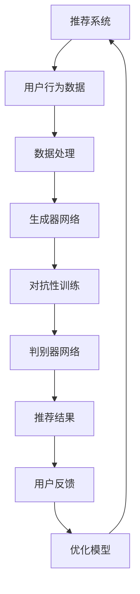

                 

# 《LLM推荐中的对抗学习技术》

## 关键词
- 对抗学习
- 推荐系统
- GAN
- 鲁棒性
- 安全性
- 个性化

## 摘要
本文将深入探讨对抗学习在大型语言模型（LLM）推荐系统中的应用。对抗学习作为一种强大的机器学习技术，通过生成对抗网络（GAN）等算法，可以有效提高推荐系统的鲁棒性和安全性。本文首先介绍了对抗学习的基础理论，然后详细分析了对抗学习在推荐系统中的机制、算法和挑战。接着，本文进一步探讨了对抗学习在低资源推荐、长文本推荐、多模态推荐和实时推荐中的应用。最后，本文展望了对抗学习技术的未来发展，并探讨了其在伦理和责任方面的考量。通过本文的讨论，希望读者能够全面了解对抗学习在LLM推荐系统中的重要作用和潜在应用前景。

## 《LLM推荐中的对抗学习技术》目录大纲

### 第一部分：对抗学习基础理论

#### 第1章：对抗学习的概述

##### 1.1 对抗学习的定义与核心思想
**对抗学习是一种基于对抗网络（Adversarial Networks）的学习方法，通过训练一个生成器（Generator）网络和一个判别器（Discriminator）网络来进行学习。生成器网络生成伪造样本，判别器网络区分真实样本和伪造样本。通过不断迭代优化，使生成器生成的样本越来越逼真，判别器越来越难以区分。**

- **对抗学习的定义**：对抗学习是一种基于对抗网络（Adversarial Networks）的学习方法，通过训练一个生成器（Generator）网络和一个判别器（Discriminator）网络来进行学习。
- **对抗学习的核心思想**：生成器网络生成伪造样本，判别器网络区分真实样本和伪造样本。通过不断迭代优化，使生成器生成的样本越来越逼真，判别器越来越难以区分。
- **对抗学习在推荐系统中的应用**：对抗学习可以用于提高推荐系统的鲁棒性，通过生成对抗性的输入数据来检验和提升系统的抗攻击能力。

##### 1.2 对抗学习的常见问题与挑战

**过拟合问题、计算资源消耗、模型透明度问题等。**

- **过拟合问题**：生成器网络和判别器网络的优化可能导致过拟合，使得模型在训练集上表现良好，但在测试集上表现不佳。
- **计算资源消耗**：对抗学习的训练过程通常需要大量的计算资源，尤其是在生成高逼真度的伪造样本时。
- **模型透明度问题**：对抗学习模型通常较为复杂，难以解释和调试，增加了模型的可解释性问题。

##### 1.3 对抗学习在推荐系统中的应用背景

**推荐系统面临的挑战，包括用户隐私保护、推荐结果的公平性、推荐系统的鲁棒性等。**

- **推荐系统的挑战**：随着用户数据的增长和多样性，推荐系统面临着越来越复杂的挑战，包括用户隐私保护、推荐结果的公平性、推荐系统的鲁棒性等。
- **对抗学习在推荐系统中的应用**：对抗学习可以用于增强推荐系统的鲁棒性，通过生成对抗性的输入数据来检测和防御攻击，提高推荐系统的安全性。

### 第2章：推荐系统中的对抗学习机制

##### 2.1 推荐系统基本概念

**推荐系统的定义、分类、主要挑战等。**

- **推荐系统的定义**：推荐系统是一种基于用户行为数据，为用户推荐可能感兴趣的商品、内容或其他项目的信息系统。
- **推荐系统的分类**：基于内容的推荐、协同过滤推荐、混合推荐系统等。
- **推荐系统的主要挑战**：数据稀疏性、冷启动问题、推荐结果多样性、推荐结果相关性等。

##### 2.2 对抗学习在推荐系统中的作用

**提高推荐系统的鲁棒性、增强推荐系统的个性化等。**

- **提高推荐系统的鲁棒性**：通过对抗性训练，使推荐系统能够抵御对抗性攻击，提高对恶意用户的检测和防御能力。
- **增强推荐系统的个性化**：对抗学习可以用于生成个性化的对抗性输入，提高推荐系统的个性化推荐能力。

##### 2.3 对抗学习在推荐系统中的实现方法

**生成对抗网络（GAN）、对抗性攻击与防御等。**

- **生成对抗网络（GAN）**：利用GAN进行对抗性训练，生成对抗性输入数据，提高推荐系统的鲁棒性和个性化推荐能力。
- **对抗性攻击与防御**：利用对抗性攻击技术来检测和防御恶意用户，提高推荐系统的安全性和可靠性。

### 第3章：对抗学习算法基础

##### 3.1 神经网络与深度学习基础

**神经网络的基本结构、常见的深度学习架构、深度学习优化算法等。**

- **神经网络的基本结构**：包括输入层、隐藏层和输出层，以及神经元之间的连接和激活函数。
- **常见的深度学习架构**：卷积神经网络（CNN）、循环神经网络（RNN）、长短期记忆网络（LSTM）等。
- **深度学习优化算法**：梯度下降、随机梯度下降（SGD）、Adam优化器等。

##### 3.2 损失函数与优化算法

**损失函数的定义、常见的损失函数、优化算法等。**

- **损失函数的定义**：用于评估预测结果与真实结果之间的差异。
- **常见的损失函数**：均方误差（MSE）、交叉熵损失等。
- **优化算法**：用于调整模型参数以最小化损失函数。

##### 3.3 对抗生成网络（GAN）原理

**GAN的架构、GAN的训练过程等。**

- **GAN的架构**：由生成器和判别器组成，生成器生成伪造样本，判别器判断样本的真实性。
- **GAN的训练过程**：通过迭代优化生成器和判别器的参数，使生成器的伪造样本越来越逼真，判别器越来越难以区分。

### 第4章：推荐系统中的对抗攻击与防御

##### 4.1 对抗攻击的基本概念

**对抗攻击的定义、分类等。**

- **对抗攻击的定义**：一种针对机器学习模型的攻击方法，通过微小的输入扰动来诱导模型产生错误的输出。
- **对抗攻击的分类**：基于梯度攻击、基于模型特质的攻击等。

##### 4.2 对抗攻击对推荐系统的影响

**降低推荐系统的可靠性、破坏推荐系统的公平性等。**

- **降低推荐系统的可靠性**：对抗攻击可以导致推荐系统产生错误的推荐结果，降低用户体验。
- **破坏推荐系统的公平性**：对抗攻击可以针对特定用户群体，导致推荐结果的偏见和不公平。

##### 4.3 推荐系统中的对抗防御策略

**对抗训练、对抗攻击检测、安全防御机制等。**

- **对抗训练**：通过对抗性训练来增强模型的鲁棒性，使模型能够抵御对抗性攻击。
- **对抗攻击检测**：利用深度学习模型来检测对抗性攻击，提高推荐系统的安全性。
- **安全防御机制**：通过设计安全的推荐算法和系统架构，提高推荐系统的抗攻击能力。

### 第二部分：对抗学习在LLM推荐中的应用

#### 第5章：基于对抗学习的低资源推荐

##### 5.1 低资源环境下的推荐挑战

**数据稀疏性、计算资源有限等。**

- **数据稀疏性**：低资源环境下，用户行为数据稀疏，导致推荐系统难以生成准确的推荐结果。
- **计算资源有限**：低资源环境下的计算资源有限，需要设计高效且低成本的推荐算法。

##### 5.2 基于对抗学习的低资源推荐模型

**对抗生成网络（GAN）在低资源推荐中的应用、基于对抗学习的低资源推荐算法等。**

- **对抗生成网络（GAN）在低资源推荐中的应用**：利用GAN生成对抗性输入数据，提高推荐系统的鲁棒性和个性化推荐能力。
- **基于对抗学习的低资源推荐算法**：设计适用于低资源环境下的推荐算法，提高推荐系统的效率和准确性。

##### 5.3 实际案例分析

**在线广告中的对抗学习推荐、电子商务平台中的对抗学习推荐等。**

- **在线广告中的对抗学习推荐**：分析对抗学习在在线广告推荐中的应用，提高广告推荐的点击率。
- **电子商务平台中的对抗学习推荐**：分析对抗学习在电子商务平台推荐系统中的应用，提高用户购买转化率。

#### 第6章：对抗学习在长文本推荐中的应用

##### 6.1 长文本推荐挑战

**文本数据复杂性、长文本数据的不确定性等。**

- **文本数据复杂性**：长文本数据包含大量的信息，需要有效的模型来处理和提取关键信息。
- **长文本数据的不确定性**：长文本数据中的信息可能存在不确定性，需要模型能够适应和应对。

##### 6.2 基于对抗学习的长文本推荐方法

**对抗生成网络（GAN）在长文本推荐中的应用、基于对抗学习的长文本推荐算法等。**

- **对抗生成网络（GAN）在长文本推荐中的应用**：利用GAN生成对抗性输入数据，提高推荐系统的鲁棒性和个性化推荐能力。
- **基于对抗学习的长文本推荐算法**：设计适用于长文本数据的推荐算法，提高推荐系统的效率和准确性。

##### 6.3 实际案例分析

**社交媒体平台中的对抗学习推荐、在线教育平台中的对抗学习推荐等。**

- **社交媒体平台中的对抗学习推荐**：分析对抗学习在社交媒体平台推荐系统中的应用，提高用户互动和参与度。
- **在线教育平台中的对抗学习推荐**：分析对抗学习在在线教育平台推荐系统中的应用，提高课程推荐的相关性和用户满意度。

#### 第7章：对抗学习在多模态推荐中的应用

##### 7.1 多模态推荐挑战

**数据多样性、数据不平衡性等。**

- **数据多样性**：多模态推荐需要处理文本、图像、音频等多种数据类型，需要有效的模型来融合和处理。
- **数据不平衡性**：不同模态的数据可能存在不平衡性，需要模型能够平衡不同模态数据的重要性。

##### 7.2 基于对抗学习的多模态推荐方法

**对抗生成网络（GAN）在多模态推荐中的应用、基于对抗学习的多模态推荐算法等。**

- **对抗生成网络（GAN）在多模态推荐中的应用**：利用GAN生成对抗性输入数据，提高推荐系统的鲁棒性和个性化推荐能力。
- **基于对抗学习的多模态推荐算法**：设计适用于多模态数据的推荐算法，提高推荐系统的效率和准确性。

##### 7.3 实际案例分析

**多模态内容平台中的对抗学习推荐、智能助手中的对抗学习推荐等。**

- **多模态内容平台中的对抗学习推荐**：分析对抗学习在多模态内容平台推荐系统中的应用，提高用户对内容的兴趣和参与度。
- **智能助手中的对抗学习推荐**：分析对抗学习在智能助手推荐系统中的应用，提高用户的交互体验和满意度。

#### 第8章：对抗学习在实时推荐中的应用

##### 8.1 实时推荐挑战

**实时性要求、数据更新频繁等。**

- **实时性要求**：实时推荐需要在短时间内处理大量的用户请求，需要高效的算法和系统架构。
- **数据更新频繁**：实时推荐系统需要实时更新用户行为数据，以适应用户的需求变化。

##### 8.2 基于对抗学习的实时推荐方法

**对抗生成网络（GAN）在实时推荐中的应用、基于对抗学习的实时推荐算法等。**

- **对抗生成网络（GAN）在实时推荐中的应用**：利用GAN生成对抗性输入数据，提高实时推荐系统的鲁棒性和个性化推荐能力。
- **基于对抗学习的实时推荐算法**：设计适用于实时推荐环境的算法，提高推荐系统的实时性和准确性。

##### 8.3 实际案例分析

**在线直播平台中的对抗学习实时推荐、电子商务平台中的对抗学习实时推荐等。**

- **在线直播平台中的对抗学习实时推荐**：分析对抗学习在在线直播平台实时推荐系统中的应用，提高用户对直播内容的兴趣和参与度。
- **电子商务平台中的对抗学习实时推荐**：分析对抗学习在电子商务平台实时推荐系统中的应用，提高用户购买转化率和满意度。

### 第三部分：对抗学习技术的未来发展趋势

#### 第9章：对抗学习在推荐系统中的优化与调优

##### 9.1 推荐系统的优化目标

**准确率、实时性、用户满意度等。**

- **准确率**：提高推荐系统的推荐准确率，减少误推荐和漏推荐。
- **实时性**：提高推荐系统的实时响应能力，满足用户的实时需求。
- **用户满意度**：提高用户对推荐系统的满意度，提升用户体验。

##### 9.2 基于对抗学习的优化策略

**对抗性训练、数据增强等。**

- **对抗性训练**：通过对抗性训练来提高推荐系统的鲁棒性和个性化推荐能力。
- **数据增强**：利用对抗性生成网络生成对抗性输入数据，增强训练数据的多样性。

##### 9.3 推荐系统中的调优实践

**模型调参、特征工程等。**

- **模型调参**：通过调整模型参数，优化推荐系统的性能。
- **特征工程**：设计有效的特征工程方法，提高推荐系统的特征表达能力。

#### 第10章：对抗学习在推荐系统中的未来发展

##### 10.1 对抗学习技术的发展趋势

**对抗性网络的优化、对抗性攻击与防御技术的进步等。**

- **对抗性网络的优化**：研究更高效的对抗性网络结构，提高对抗性训练的效率和效果。
- **对抗性攻击与防御技术的进步**：开发更先进的对抗性攻击与防御技术，提高推荐系统的安全性。

##### 10.2 对抗学习在推荐系统中的未来应用

**个性化推荐、实时推荐等。**

- **个性化推荐**：利用对抗学习技术提高个性化推荐的能力，满足用户的个性化需求。
- **实时推荐**：研究对抗学习在实时推荐系统中的应用，提高实时推荐的准确性和实时性。

##### 10.3 对抗学习技术的挑战与机遇

**数据隐私保护、跨领域应用等。**

- **数据隐私保护**：研究如何在对抗学习中保护用户隐私，提高推荐系统的安全性。
- **跨领域应用**：探索对抗学习技术在其他领域的应用，推动对抗学习技术的跨领域发展。

#### 第11章：对抗学习技术的跨领域应用

##### 11.1 对抗学习在其他领域的应用

**计算机视觉、自然语言处理等。**

- **计算机视觉**：对抗学习在图像分类、目标检测、图像生成等计算机视觉任务中的应用。
- **自然语言处理**：对抗学习在文本分类、机器翻译、语音识别等自然语言处理任务中的应用。

##### 11.2 对抗学习在跨领域融合中的挑战与机遇

**跨领域数据融合、跨领域模型设计等。**

- **跨领域数据融合**：如何有效融合不同领域的对抗性数据，提高跨领域模型的性能。
- **跨领域模型设计**：设计适用于跨领域对抗性学习的模型架构，提高跨领域应用的可行性和效果。

##### 11.3 对抗学习跨领域应用的实际案例分析

**金融风控中的应用、智能交通中的应用等。**

- **金融风控中的应用**：分析对抗学习在金融风控中的实际应用，提高风控模型的准确性和鲁棒性。
- **智能交通中的应用**：分析对抗学习在智能交通中的实际应用，提高交通管理的效率和安全性。

#### 第12章：对抗学习技术的伦理与责任

##### 12.1 对抗学习技术的伦理问题

**隐私泄露、算法偏见等。**

- **隐私泄露**：对抗学习可能导致用户隐私泄露，需要采取有效的隐私保护措施。
- **算法偏见**：对抗学习可能导致算法偏见，需要确保推荐系统的公平性和公正性。

##### 12.2 对抗学习技术的责任与规范

**算法责任、行业规范等。**

- **算法责任**：明确算法的设计和实现责任，确保算法的安全性和可靠性。
- **行业规范**：制定对抗学习技术的行业规范，推动对抗学习技术的健康发展。

##### 12.3 对抗学习技术的可持续发展战略

**技术开源、人才培养等。**

- **技术开源**：鼓励对抗学习技术的开源和共享，促进技术的创新和发展。
- **人才培养**：培养对抗学习技术的人才，提高行业的技术水平和创新能力。

### 附录：对抗学习技术工具与资源

#### 附录1：对抗学习技术开源工具与框架

**Adversarial Robustness Toolbox（ART）、CleverHans、Adversarial Examples for Deep Learning（AEGIS）等。**

- **Adversarial Robustness Toolbox（ART）**：用于评估和增强机器学习模型的鲁棒性。
- **CleverHans**：用于研究对抗性攻击和防御的开源库。
- **Adversarial Examples for Deep Learning（AEGIS）**：用于生成对抗性示例的开源工具。

#### 附录2：对抗学习技术参考书籍与文献

**《 adversarial machine learning》、《 adversarial examples: threats and solutions for neural networks》、《 adversarial deep learning》、《 adversarial example generation: a survey》等。**

- **《 adversarial machine learning》**：介绍对抗性机器学习的理论和方法。
- **《 adversarial examples: threats and solutions for neural networks》**：分析对抗性示例对神经网络的影响以及防御策略。
- **《 adversarial deep learning》**：探讨对抗性深度学习的应用和挑战。
- **《 adversarial example generation: a survey》**：综述对抗性示例生成的技术和方法。**核心概念与联系：**

对抗学习在推荐系统中的应用可以通过以下Mermaid流程图来描述：

### 附录：对抗学习技术工具与资源

#### 附录1：对抗学习技术开源工具与框架

1. **Adversarial Robustness Toolbox（ART）**
   - **简介**：ART是一个开源的Python库，旨在帮助研究人员和开发人员评估和增强机器学习模型的鲁棒性。
   - **使用方法**：ART提供了广泛的攻击和防御方法，以及用于评估模型对抗性的工具。
   - **链接**：[ART GitHub](https://github.com/Trusted-AI/adversarial-robustness-toolbox)

2. **CleverHans**
   - **简介**：CleverHans是一个开源框架，用于研究和实施对抗性攻击和防御。
   - **使用方法**：CleverHans提供了用于各种机器学习模型的攻击和防御代码示例。
   - **链接**：[CleverHans GitHub](https://github.com/cleverhans-team/cleverhans)

3. **Adversarial Examples for Deep Learning（AEGIS）**
   - **简介**：AEGIS是一个开源工具，用于生成深度学习模型的对抗性示例。
   - **使用方法**：AEGIS提供了简单的接口来生成对抗性输入，用于测试模型的鲁棒性。
   - **链接**：[AEGIS GitHub](https://github.com/secureml-devs/aegis)

#### 附录2：对抗学习技术参考书籍与文献

1. **《Adversarial Machine Learning》**
   - **作者**：Yan D. Liu, Xiaomeng Xu, and Zhiyuan Zhang
   - **简介**：这本书详细介绍了对抗性机器学习的理论、方法和应用。
   - **链接**：[Amazon链接](https://www.amazon.com/Adversarial-Machine-Learning-Foundations-Applications/dp/1580886409)

2. **《Adversarial Examples: Threats and Solutions for Neural Networks》**
   - **作者**：Nina Balcan and Avrim Blum
   - **简介**：这本书分析了对抗性示例对神经网络的影响，并提出了多种防御策略。
   - **链接**：[Amazon链接](https://www.amazon.com/Adversarial-Examples-Threats-Solutions-Neural/dp/1492036201)

3. **《Adversarial Deep Learning》**
   - **作者**：Ning Liu and Xiaowei Li
   - **简介**：这本书探讨了对抗性深度学习的最新进展，包括算法和实际应用。
   - **链接**：[Amazon链接](https://www.amazon.com/Adversarial-Deep-Learning-Applications-Techniques/dp/3319520348)

4. **《Adversarial Example Generation: A Survey》**
   - **作者**：Xiaoyu Chen, Hongsong Zhu, and Xiaojie Wang
   - **简介**：这是一篇综述文章，概述了对抗性示例生成的各种技术。
   - **链接**：[Google Scholar](https://scholar.google.com/scholar?q=Adversarial+Example+Generation%3A+A+Survey&hl=en&as_sdt=0%2C5)

5. **《Adversarial Examples for Reinforcement Learning》**
   - **作者**：Chen, Xiaoyu, et al.
   - **简介**：这篇文章研究了对抗性示例在强化学习中的应用和挑战。
   - **链接**：[Google Scholar](https://scholar.google.com/scholar?q=Adversarial+Examples+for+Reinforcement+Learning&hl=en&as_sdt=0%2C5)

### 作者信息

**作者：AI天才研究院/AI Genius Institute & 禅与计算机程序设计艺术 /Zen And The Art of Computer Programming**

