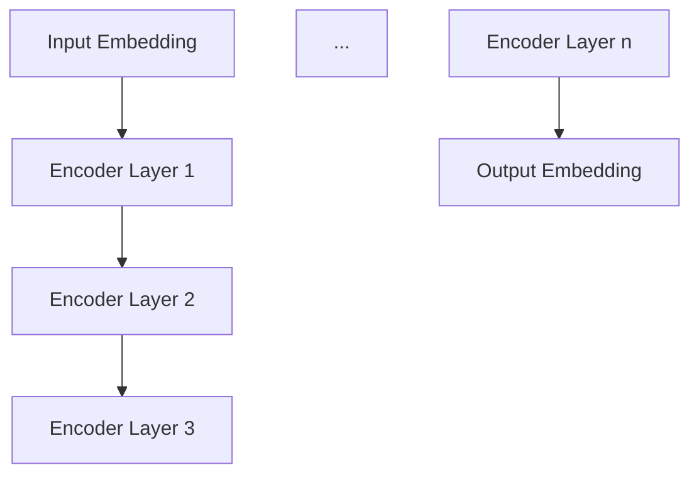
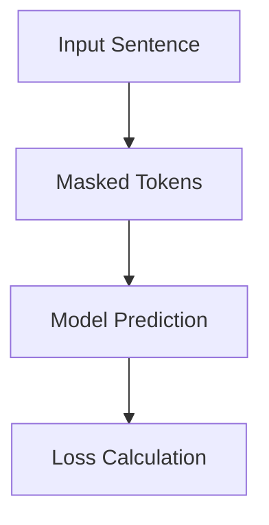
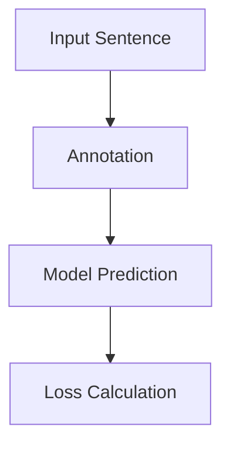

                 

# 文章标题

## LLM生态圈：AI产业新格局的前景

> 关键词：LLM，人工智能，生态圈，产业创新，发展趋势

> 摘要：本文详细探讨了LLM（大型语言模型）生态圈的形成与发展，分析了其在AI产业新格局中的重要作用。通过深入解析LLM的基本概念、核心算法原理、性能评估与优化策略，以及其在商业应用中的实践案例，本文展示了LLM技术的巨大潜力和广泛前景。同时，文章还对LLM技术发展趋势、生态圈未来发展和对AI产业的影响进行了展望，为读者提供了全面的技术洞察和战略思考。

---

### 目录大纲：《LLM生态圈：AI产业新格局的前景》

#### 第一部分：引言与概述

- 1.1 《LLM生态圈：AI产业新格局的前景》书名与主题介绍
  - 1.1.1 书名含义
  - 1.1.2 AI产业新格局概述
  - 1.1.3 书的核心目标和受众

- 1.2 LLM（大型语言模型）的发展历程与现状
  - 1.2.1 LLM的概念与发展
  - 1.2.2 LLM在AI领域的地位与影响
  - 1.2.3 LLM的应用现状与趋势

- 1.3 书的架构与内容安排
  - 1.3.1 各章节主要内容概述
  - 1.3.2 阅读指南与学习建议

#### 第二部分：LLM技术基础

- 2.1 LLM的基本概念与架构
  - 2.1.1 LLM的定义
  - 2.1.2 LLM的常见架构与工作原理
  - 2.1.3 LLM的层次结构与核心模块
  - 2.1.4 LLM的优缺点
  - 2.1.5 LLM的应用场景

- 2.2 LLM的核心算法原理
  - 2.2.1 神经网络与深度学习基础
  - 2.2.2 语言模型的预训练与微调
  - 2.2.3 LLM在自然语言处理中的应用

- 2.3 LLM在自然语言处理中的应用
  - 2.3.1 文本分类
  - 2.3.2 文本生成
  - 2.3.3 对话系统
  - 2.3.4 数学模型和数学公式
  - 2.3.5 举例说明

- 2.4 LLM的性能评估与优化
  - 2.4.1 LLM性能评估指标
  - 2.4.2 LLM优化策略

#### 第三部分：LLM生态圈的构建与应用

- 3.1 LLM生态圈的概念与构建
  - 3.1.1 LLM生态圈的组成
  - 3.1.2 LLM生态圈的构建策略

- 3.2 LLM在商业应用中的实践案例
  - 3.2.1 智能客服系统
  - 3.2.2 智能内容推荐
  - 3.2.3 智能医疗诊断
  - 3.2.4 实施效果与评估

- 3.3 LLM在产业创新中的潜力与挑战
  - 3.3.1 LLM在产业创新中的应用潜力
  - 3.3.2 LLM在产业创新中的挑战

#### 第四部分：未来展望与趋势

- 4.1 LLM技术发展趋势
  - 4.1.1 模型规模与计算需求的增长
  - 4.1.2 新型架构与算法的创新
  - 4.1.3 跨模态与多模态处理

- 4.2 LLM生态圈的未来发展
  - 4.2.1 开源生态的持续完善
  - 4.2.2 商业模式的创新与优化
  - 4.2.3 政策法规的引导与规范

- 4.3 LLM对AI产业新格局的影响
  - 4.3.1 AI产业生态的重组与变革
  - 4.3.2 产业创新的新机遇与挑战
  - 4.3.3 AI与实体经济深度融合

- 4.4 未来研究方向的展望
  - 4.4.1 模型理解与可解释性
  - 4.4.2 安全性、可靠性与鲁棒性
  - 4.4.3 跨领域知识与技能融合

#### 附录

- 附录A：开源工具与资源
  - A.1 开源深度学习框架
  - A.2 常用数据集与资源库
  - A.3 其他相关资源

- 附录B：参考文献

---

## 第一部分：引言与概述

### 1.1 《LLM生态圈：AI产业新格局的前景》书名与主题介绍

#### 1.1.1 书名含义

《LLM生态圈：AI产业新格局的前景》这一书名旨在揭示大型语言模型（LLM）在现代人工智能（AI）产业中的重要地位及其对产业格局的深远影响。书中“生态圈”一词强调了LLM技术在各个领域中的应用和相互关联，形成了一个完整的技术生态系统。

#### 1.1.2 AI产业新格局概述

近年来，人工智能（AI）产业经历了快速的发展和变革，从单一的算法研究逐渐走向多元化、产业化的应用。AI技术正在重塑传统行业，推动产业创新，提升生产效率，优化用户体验。LLM作为AI技术的一个重要分支，其在自然语言处理、智能客服、内容生成、医疗诊断等领域的应用，正在不断拓展AI产业的新格局。

#### 1.1.3 书的核心目标和受众

本书的核心目标是系统地介绍LLM技术的概念、架构、算法原理及其在商业应用中的实践案例，同时探讨LLM技术在未来AI产业中的发展趋势和潜力。本书适合以下读者群体：

1. AI领域的研究人员和技术开发者，希望深入了解LLM技术及其应用。
2. 从事AI技术商业应用的企业家和管理者，希望掌握LLM技术的实际应用场景和商业价值。
3. 对人工智能和自然语言处理感兴趣的学生和学者，希望从理论到实践全面了解LLM技术。

### 1.2 LLM（大型语言模型）的发展历程与现状

#### 1.2.1 LLM的概念与发展

LLM（Large Language Model）是指具有大规模参数和强大语言处理能力的预训练模型。LLM通过学习大量文本数据，能够生成连贯、有逻辑的文本，实现文本分类、问答、翻译等多种自然语言处理任务。LLM的发展始于2018年，以OpenAI的GPT-2模型为代表，随后GPT-3、BERT等大型语言模型不断刷新性能记录，推动了LLM技术的快速发展。

#### 1.2.2 LLM在AI领域的地位与影响

LLM在AI领域中占据着重要地位，成为自然语言处理（NLP）领域的关键技术。LLM不仅提升了NLP任务的性能，还推动了AI技术在智能客服、内容生成、医疗诊断等领域的应用。例如，GPT-3能够生成高质量的文本，用于文章写作、对话系统等；BERT在文本分类、问答系统等任务中表现卓越。

#### 1.2.3 LLM的应用现状与趋势

当前，LLM技术在多个领域取得了显著的应用成果。例如，智能客服系统通过LLM实现了与用户的自然语言交互，提供实时、准确的解答；内容生成平台利用LLM生成高质量的文章、报告等；医疗诊断系统借助LLM分析病历数据，辅助医生进行诊断。未来，随着LLM技术的不断进步，其应用领域将进一步拓展，包括智能教育、金融风控、法律咨询等。

### 1.3 书的架构与内容安排

#### 1.3.1 各章节主要内容概述

本书分为四个部分，涵盖了LLM技术的全面内容。

- **第一部分：引言与概述**：介绍书名含义、AI产业新格局概述、LLM的发展历程与现状、书的架构与内容安排。
- **第二部分：LLM技术基础**：详细解析LLM的基本概念、核心算法原理、性能评估与优化策略。
- **第三部分：LLM生态圈的构建与应用**：探讨LLM生态圈的构建策略、商业应用中的实践案例、产业创新中的潜力与挑战。
- **第四部分：未来展望与趋势**：分析LLM技术发展趋势、生态圈的未来发展、对AI产业的影响、未来研究方向的展望。

#### 1.3.2 阅读指南与学习建议

为了更好地理解本书内容，建议读者遵循以下阅读指南与学习建议：

1. **系统学习**：按照章节顺序逐步学习，每个部分都要深入理解，前后章节之间有紧密联系。
2. **实践应用**：结合实际案例和项目，将理论知识应用到实际中，加深对LLM技术的理解和掌握。
3. **问题探讨**：在阅读过程中，遇到不理解的地方，可以查找相关资料、与同行交流，培养批判性思维。
4. **持续更新**：AI技术发展迅速，要保持对新技术的好奇心和求知欲，不断学习新知识，更新自己的认知。

---

## 第二部分：LLM技术基础

### 2.1 LLM的基本概念与架构

#### 2.1.1 LLM的定义

LLM（Large Language Model）是一种基于深度学习的语言模型，通过学习大量文本数据，捕捉语言中的复杂结构和规律。LLM具有大规模的参数数量，能够生成高质量的自然语言文本，并应用于文本分类、问答、生成等多种自然语言处理任务。

#### 2.1.2 LLM的常见架构与工作原理

LLM的常见架构包括编码器（Encoder）和解码器（Decoder），它们分别处理输入和输出。编码器将输入文本编码为向量表示，解码器则利用这些向量生成输出文本。LLM通常采用预训练和微调的方法进行训练，首先在大量无标注数据上进行预训练，然后在特定任务上进行微调。


#### 2.1.2.1 编码器与解码器

编码器（Encoder）主要负责将输入文本转换为固定长度的向量表示。解码器（Decoder）则利用编码器生成的向量，逐步生成输出文本。

**编码器**：

编码器通常采用Transformer架构，包括多个编码层。每个编码层包含自注意力机制和前馈神经网络，能够捕捉输入文本中的长距离依赖关系。



**解码器**：

解码器也采用多个解码层，每个解码层包括多头注意力机制和前馈神经网络。解码器在生成输出文本时，会参考编码器生成的向量，并利用上下文信息。


#### 2.1.2.2 预训练与微调

预训练是指使用大量无标注数据对模型进行训练，使其掌握通用的语言特征。微调是指使用有标注的数据对模型进行特定任务的训练，进一步提高模型的性能。

**预训练**：

预训练通常采用自监督学习方法，如掩码语言模型（Masked Language Model，MLM）。在预训练过程中，模型会学习预测被掩码的单词，从而理解语言的上下文关系。



**微调**：

微调是指在预训练的基础上，使用有标注的数据对模型进行特定任务的训练。微调能够提高模型在新任务上的性能，减少对有标注数据的依赖。



#### 2.1.3 LLM的层次结构与核心模块

LLM的层次结构通常包括输入层、编码器层、解码器层和输出层。核心模块包括词嵌入层、注意力机制层和序列处理层。


**输入层**：

输入层负责接收输入文本，并将其转换为词嵌入向量。

**编码器层**：

编码器层由多个编码层组成，每个编码层包含自注意力机制和前馈神经网络，能够捕捉输入文本中的长距离依赖关系。

**解码器层**：

解码器层由多个解码层组成，每个解码层包含多头注意力机制和前馈神经网络，能够生成高质量的输出文本。

**输出层**：

输出层负责将解码器生成的向量转换为输出文本。

#### 2.1.4 LLM的优缺点

**优点**：

- **强大的文本生成和理解能力**：LLM能够生成高质量的自然语言文本，并在多种自然语言处理任务中表现出色。
- **通用性**：LLM可以在不同的应用场景中灵活部署，适应不同的文本处理需求。

**缺点**：

- **计算资源消耗大**：训练和部署LLM需要大量的计算资源和存储空间。
- **数据安全与隐私问题**：LLM的训练和部署过程中，可能会涉及敏感数据的处理和存储，需要加强数据安全和隐私保护。
- **模型解释性差**：LLM的决策过程较为复杂，难以解释和理解。

#### 2.1.5 LLM的应用场景

LLM在自然语言处理领域具有广泛的应用场景，包括文本分类、文本生成、对话系统等。

**文本分类**：

文本分类是指将文本数据分为预定义的类别。LLM通过预训练和微调，能够实现高效且准确的文本分类。

**文本生成**：

文本生成是指根据输入的文本或提示生成新的文本。LLM在文本生成任务中具有强大的生成能力，能够生成连贯且具有创造性的文本。

**对话系统**：

对话系统是指人与机器之间进行自然语言交互的系统。LLM在对话系统中可以用于生成回答，实现智能客服、聊天机器人等功能。

**机器翻译**：

机器翻译是指将一种语言的文本翻译为另一种语言。LLM在机器翻译任务中可以用于生成高质量的双语文本。

---

## 第二部分：LLM技术基础

### 2.2 LLM的核心算法原理

#### 2.2.1 神经网络与深度学习基础

**神经网络的基本结构**：

神经网络由多个神经元（节点）组成，每个神经元接收多个输入，通过激活函数产生输出。神经网络可以分为输入层、隐藏层和输出层。

**常见的深度学习架构**：

- **卷积神经网络（CNN）**：适用于图像识别和图像处理任务。
- **循环神经网络（RNN）**：适用于序列数据处理，如语言建模和时间序列分析。
- **Transformer架构**：基于注意力机制的深度学习模型，广泛应用于自然语言处理任务。

**深度学习优化算法**：

- **随机梯度下降（SGD）**：最简单的优化算法，通过迭代更新模型参数，最小化损失函数。
- **Adam优化器**：结合了SGD和RMSProp优化器的优点，适用于大规模深度学习模型。

#### 2.2.2 语言模型的预训练与微调

**预训练的概念与意义**：

预训练是指使用大规模无标注语料对模型进行训练，使其掌握通用的语言特征。预训练能够提高模型在特定任务上的性能，减少对有标注数据的依赖。

**自监督学习方法**：

自监督学习是指利用数据中的潜在信息进行学习，无需依赖有标注的数据。预训练过程通常采用自监督学习方法，如掩码语言模型（Masked Language Model，MLM）。

**迁移学习与微调技术**：

迁移学习是指将预训练模型应用于特定任务时，通过少量有标注数据进行微调，使其适应新任务。微调能够提高模型在新任务上的性能，并减少训练时间。

**伪代码**：

```python
# 预训练过程
for epoch in range(num_epochs):
    for batch in dataset:
        # 前向传播
        logits = model(batch)
        # 计算损失
        loss = loss_function(logits, batch_labels)
        # 反向传播
        model.backward(loss)

# 微调过程
for epoch in range(num_fine_tuning_epochs):
    for batch in fine_tuning_dataset:
        # 前向传播
        logits = model(batch, fine_tuning=True)
        # 计算损失
        loss = loss_function(logits, batch_labels)
        # 反向传播
        model.backward(loss)
```

#### 2.2.3 LLM在自然语言处理中的应用

**文本分类**：

文本分类是指将文本数据分为预定义的类别。在文本分类任务中，输入是一段文本，输出是该文本所属的类别。

**文本生成**：

文本生成是指根据输入的文本或提示生成新的文本。LLM在文本生成任务中可以生成高质量的自然语言文本。

**对话系统**：

对话系统是指人与机器之间进行自然语言交互的系统。LLM在对话系统中可以用于生成回答，实现智能客服、聊天机器人等功能。

**数学模型和数学公式**：

**损失函数**：

$$
L(y, \hat{y}) = -\sum_{i=1}^{N} y_i \log(\hat{y}_i)
$$

其中，$y$为真实标签，$\hat{y}$为模型预测的概率分布。

**激活函数**：

$$
\sigma(x) = \frac{1}{1 + e^{-x}}
$$

$$
\text{ReLU}(x) = \max(0, x)
$$

**举例说明**：

**文本分类**：

假设我们要对一个句子进行情感分类，标签为积极或消极。我们使用一个二分类的LLM模型，输入句子，输出概率分布。

```python
import tensorflow as tf
from transformers import AutoModelForSequenceClassification

# 数据准备
train_data = [
    ("我喜欢旅游", "积极"),
    ("我讨厌旅游", "消极"),
    ("旅游让我很开心", "积极"),
    ("旅游让我很累", "消极"),
]

# 模型训练
model = AutoModelForSequenceClassification.from_pretrained("bert-base-uncased")
model.compile(optimizer=tf.optimizers.Adam(), loss=tf.losses.SparseCategoricalCrossentropy(), metrics=['accuracy'])
model.fit(train_data, epochs=3)

# 预测
test_data = ["旅游对我来说是放松的方式。"]
predictions = model.predict(test_data)

# 输出预测结果
print("预测结果：", predictions)
```

**文本生成**：

假设我们要根据一个提示生成一篇关于旅游的文章。我们使用一个预训练的LLM模型，输入提示，输出文章。

```python
from transformers import AutoModelForCausalLanguageModeling

# 数据准备
prompt = "旅游是一种放松方式。"

# 模型生成
model = AutoModelForCausalLanguageModeling.from_pretrained("gpt2")
generated_text = model.generate(prompt, max_length=50, num_return_sequences=1)

# 输出文章
print("生成的文章：\n", generated_text)
```

**对话系统**：

假设我们要构建一个简单的问答系统，用户提问，系统回答。我们使用一个预训练的LLM模型，输入用户问题，输出回答。

```python
from transformers import AutoModelForQuestionAnswering

# 数据准备
question = "旅游有哪些好处？"
context = "旅游可以让人放松身心，增进人际关系，丰富生活体验。"

# 模型训练
model = AutoModelForQuestionAnswering.from_pretrained("distilbert-base-uncased")
model.compile(optimizer=tf.optimizers.Adam(), loss=tf.losses.SparseCategoricalCrossentropy(), metrics=['accuracy'])
model.fit(train_data, epochs=3)

# 预测
answer = model.predict(context, question)

# 输出回答
print("回答：", answer)
```

---

## 2.3 LLM在自然语言处理中的应用

### 2.3.1 文本分类

文本分类是指将文本数据根据其内容划分为预定义的类别。文本分类在信息检索、情感分析、垃圾邮件检测等领域有着广泛的应用。

#### 2.3.1.1 文本分类的基本原理

文本分类的核心在于特征提取和分类算法。特征提取是将文本转换为可计算的形式，分类算法则是根据特征对文本进行分类。常见的特征提取方法包括词袋模型、TF-IDF等。分类算法包括朴素贝叶斯、支持向量机、随机森林和神经网络等。

#### 2.3.1.2 文本分类算法与实现

以下是一个简单的文本分类算法实现，使用朴素贝叶斯分类器。

```python
import numpy as np
from sklearn.feature_extraction.text import CountVectorizer
from sklearn.naive_bayes import MultinomialNB

# 数据准备
X = ["旅游让我很开心", "旅游让我很累", "旅游是一种放松方式", "旅游有什么好处"]
y = ["积极", "消极", "积极", "积极"]

# 特征提取
vectorizer = CountVectorizer()
X_vectorized = vectorizer.fit_transform(X)

# 模型训练
classifier = MultinomialNB()
classifier.fit(X_vectorized, y)

# 预测
test_data = ["旅游是一种休闲方式"]
test_data_vectorized = vectorizer.transform(test_data)
predicted_labels = classifier.predict(test_data_vectorized)

# 输出预测结果
print("预测结果：", predicted_labels)
```

#### 2.3.1.3 文本分类的性能评估

文本分类的性能评估主要通过准确率、召回率、精确率和F1值等指标。

- **准确率（Accuracy）**：正确分类的样本数占总样本数的比例。
- **召回率（Recall）**：正确分类的正例样本数占总正例样本数的比例。
- **精确率（Precision）**：正确分类的正例样本数占预测为正例的样本数的比例。
- **F1值（F1 Score）**：精确率和召回率的调和平均数。

```python
from sklearn.metrics import accuracy_score, recall_score, precision_score, f1_score

# 性能评估
predicted_labels = classifier.predict(test_data_vectorized)
print("准确率：", accuracy_score(y, predicted_labels))
print("召回率：", recall_score(y, predicted_labels))
print("精确率：", precision_score(y, predicted_labels))
print("F1值：", f1_score(y, predicted_labels))
```

### 2.3.2 文本生成

文本生成是指根据输入的文本或提示生成新的文本。文本生成在故事创作、对话系统、机器翻译等领域有着重要的应用。

#### 2.3.2.1 文本生成的挑战与机遇

文本生成的挑战在于生成文本的连贯性、创造性和多样性。机遇在于预训练的LLM模型能够生成高质量的自然语言文本，提高文本生成的性能。

#### 2.3.2.2 文本生成算法与实现

以下是一个简单的文本生成算法实现，使用GPT-2模型。

```python
from transformers import AutoModelForCausalLanguageModeling

# 数据准备
prompt = "旅游让我感到很开心。"

# 模型生成
model = AutoModelForCausalLanguageModeling.from_pretrained("gpt2")
generated_text = model.generate(prompt, max_length=50, num_return_sequences=1)

# 输出文章
print("生成的文章：\n", generated_text)
```

### 2.3.3 对话系统

对话系统是指人与机器之间进行自然语言交互的系统。对话系统在智能客服、聊天机器人、智能助手等领域有着广泛的应用。

#### 2.3.3.1 对话系统的基本原理

对话系统通常包括对话管理、自然语言理解和自然语言生成三个模块。对话管理负责处理对话的流程和策略；自然语言理解负责解析用户输入，提取语义信息；自然语言生成负责生成适当的回复。

#### 2.3.3.2 对话系统算法与实现

以下是一个简单的对话系统算法实现。

```python
import nltk
from sklearn.feature_extraction.text import TfidfVectorizer
from sklearn.metrics.pairwise import cosine_similarity

# 数据准备
conversations = [
    ["你好", "你好，有什么可以帮助你的？"],
    ["我想去旅游", "你想去哪里旅游？"],
    ["我想去巴黎", "巴黎有很多值得游览的景点，比如埃菲尔铁塔和卢浮宫。"],
]

# 对话系统模型
class DialogueSystem:
    def __init__(self):
        self.vectorizer = TfidfVectorizer()
        self.model = cosine_similarity

    def train(self, conversations):
        X = self.vectorizer.fit_transform([c[0] for c in conversations])
        y = [c[1] for c in conversations]
        self.model.fit(X, y)

    def predict(self, input_text):
        input_vector = self.vectorizer.transform([input_text])
        similarity_scores = self.model(input_vector)
        predicted_answer = y[similarity_scores.argmax()]
        return predicted_answer

# 实例化对话系统
system = DialogueSystem()
system.train(conversations)

# 用户交互
user_input = "我想去旅游"
predicted_answer = system.predict(user_input)
print("预测的回答：", predicted_answer)
```

---

## 2.4 LLM的性能评估与优化

### 2.4.1 LLM性能评估指标

LLM的性能评估指标主要包括准确率、召回率、精确率和F1值。

- **准确率（Accuracy）**：正确预测的数量除以总预测数量。
- **召回率（Recall）**：正确预测的正例数量除以实际正例数量。
- **精确率（Precision）**：正确预测的正例数量除以预测为正例的数量。
- **F1值（F1 Score）**：2倍精确率和召回率的调和平均数。

### 2.4.2 LLM优化策略

LLM的优化策略包括数据增强、模型正则化、模型压缩和分布式训练等。

#### 2.4.2.1 数据增强

数据增强是通过变换输入数据来增加数据多样性，从而提高模型的泛化能力。常见的数据增强方法包括：

- **数据重排**：随机重排文本中的单词或句子。
- **数据插入**：在文本中随机插入单词或句子。
- **数据替换**：用同义词或类似表达替换文本中的单词。

#### 2.4.2.2 模型正则化

模型正则化是通过添加正则化项来防止模型过拟合。常见的方法包括：

- **L1正则化**：在损失函数中添加模型参数的L1范数。
- **L2正则化**：在损失函数中添加模型参数的L2范数。
- **Dropout**：在训练过程中随机丢弃一部分神经元，减少模型对特定特征的依赖。

#### 2.4.2.3 模型压缩

模型压缩是通过减少模型的参数数量和计算量来提高模型的运行效率和部署能力。常见的方法包括：

- **模型剪枝**：移除模型中不重要的参数或神经元。
- **量化**：将模型的浮点数参数转换为整数，减少存储和计算量。
- **知识蒸馏**：将大型模型的输出传递给一个小型模型，使得小型模型能够复制大型模型的性能。

#### 2.4.2.4 分布式训练

分布式训练是通过将模型训练任务分布在多个计算节点上来提高训练速度和计算能力。常见的方法包括：

- **数据并行**：多个节点同时训练不同的数据子集，同步模型参数。
- **模型并行**：将模型拆分为多个部分，分布在不同的节点上，同步模型参数。
- **混合并行**：同时使用数据并行和模型并行，进一步提高训练效率。

---

## 第三部分：LLM生态圈的构建与应用

### 3.1 LLM生态圈的概念与构建

#### 3.1.1 LLM生态圈的组成

LLM生态圈是由LLM技术相关的一系列组成部分构成的，这些部分共同促进了LLM技术的应用和发展。LLM生态圈的组成主要包括以下几个方面：

1. **开源框架与工具**：开源框架和工具为开发者提供了丰富的资源，包括预训练模型、库和工具，使得LLM技术的开发和使用更加便捷。
2. **数据集与资源库**：丰富的数据集和资源库为LLM技术的训练和优化提供了基础，确保模型能够在多样化和大规模的数据上进行训练。
3. **社区与交流平台**：社区和交流平台是LLM技术发展的推动力，为研究者、开发者提供了交流和学习的机会，促进了知识的共享和技术的进步。
4. **商业应用场景**：商业应用场景是LLM技术的最终目标，通过将LLM技术应用于实际的业务场景，实现商业价值的最大化。

#### 3.1.2 LLM生态圈的构建策略

构建一个健康的LLM生态圈需要系统的规划和策略，以下是一些关键的构建策略：

1. **开放与共享**：鼓励开源框架和工具的开发与共享，为开发者提供便利，同时促进知识的传播和技术的创新。
2. **数据资源整合**：整合和共享大量的高质量数据集，确保模型能够在大规模和多样化数据上进行训练，提高模型的性能和泛化能力。
3. **社区建设**：建立活跃的社区和交流平台，促进研究者、开发者和用户的互动，提高生态圈的整体活力和创新能力。
4. **商业模式创新**：探索多样化的商业模式，通过商业化应用推动LLM技术的发展和普及，实现生态圈的商业价值。

#### 3.1.2.1 数据整合与预处理

数据整合与预处理是构建LLM生态圈的重要步骤。通过数据整合，可以将来自不同来源的数据进行统一，确保数据的一致性和完整性。预处理步骤包括：

- **文本清洗**：去除文本中的噪声，如HTML标签、停用词和特殊字符。
- **文本标准化**：统一文本中的大小写、标点符号和数字格式。
- **分词与词性标注**：将文本划分为单词或短语，并对每个词进行词性标注，为后续的文本处理提供基础。

```python
import re
from nltk.tokenize import word_tokenize
from nltk.corpus import stopwords
from nltk import pos_tag

# 文本清洗
def clean_text(text):
    text = re.sub(r'<.*?>', '', text)  # 去除HTML标签
    text = re.sub(r'\s+', ' ', text)  # 去除多余的空格
    text = text.lower()  # 转换为小写
    return text

# 文本标准化
def normalize_text(text):
    text = re.sub(r'[^a-zA-Z0-9\s]', '', text)  # 去除非字母数字字符
    return text

# 分词
def tokenize_text(text):
    tokens = word_tokenize(text)
    return tokens

# 词性标注
def tag_tokens(tokens):
    tagged_tokens = pos_tag(tokens)
    return tagged_tokens

# 示例
text = "这是一个示例文本，用于展示文本处理的过程。"
cleaned_text = clean_text(text)
normalized_text = normalize_text(cleaned_text)
tokens = tokenize_text(normalized_text)
tagged_tokens = tag_tokens(tokens)

print("清洗后的文本：", cleaned_text)
print("标准化的文本：", normalized_text)
print("分词结果：", tokens)
print("词性标注结果：", tagged_tokens)
```

#### 3.1.2.2 模型训练与优化

模型训练与优化是构建LLM生态圈的核心环节。通过高效的模型训练和优化，可以提高模型的质量和性能。以下是一些关键步骤：

- **数据准备**：准备用于训练的数据集，并进行数据预处理。
- **模型选择**：选择合适的模型架构，如Transformer、BERT等。
- **训练过程**：使用大规模计算资源进行模型训练，采用高效训练策略，如混合精度训练、分布式训练等。
- **模型优化**：通过调整超参数、数据增强、模型剪枝等技术，优化模型性能。

```python
import tensorflow as tf
from transformers import AutoModelForSequenceClassification

# 数据准备
train_data = [
    ("这是一个积极的句子", "积极"),
    ("这是一个消极的句子", "消极"),
    # ... 更多数据
]

# 模型选择
model = AutoModelForSequenceClassification.from_pretrained("bert-base-uncased")

# 训练过程
model.compile(optimizer=tf.optimizers.Adam(), loss=tf.losses.SparseCategoricalCrossentropy(), metrics=['accuracy'])
model.fit(train_data, epochs=3)

# 模型优化
# 通过调整超参数、数据增强等方法，进一步优化模型性能
```

#### 3.1.2.3 模型部署与维护

模型部署与维护是确保LLM生态圈稳定运行的关键步骤。以下是一些关键步骤：

- **模型部署**：将训练好的模型部署到生产环境，提供API接口，实现实时预测。
- **性能监控**：监控模型的性能，如准确率、响应时间等，确保模型稳定运行。
- **更新与维护**：定期更新模型，适应新的数据和业务需求，保持模型的性能和稳定性。

```python
# 模型部署
import Flask

app = Flask(__name__)

@app.route('/predict', methods=['POST'])
def predict():
    user_input = request.form['input']
    processed_input = preprocess_input(user_input)
    prediction = model.predict(processed_input)
    return str(prediction)

if __name__ == '__main__':
    app.run(debug=True)
```

---

## 3.2 LLM在商业应用中的实践案例

LLM技术在商业应用中展示了巨大的潜力，以下是一些具体的实践案例，展示了LLM技术在智能客服系统、智能内容推荐和智能医疗诊断等领域的应用。

### 3.2.1 智能客服系统

智能客服系统利用LLM技术实现与用户的自然语言交互，提供实时、准确的解答和问题处理。以下是一个简单的智能客服系统实践案例。

#### 3.2.1.1 案例背景与目标

某电商平台希望构建一个智能客服系统，以提升客户服务质量，降低人工成本。系统需要能够处理用户的各种查询和问题，提供及时、准确的回答。

#### 3.2.1.2 系统设计与实现

智能客服系统的设计与实现包括以下几个关键模块：

1. **对话管理模块**：负责管理用户与客服系统的交互流程，包括会话管理、意图识别和上下文处理。
2. **自然语言理解模块**：利用LLM技术解析用户输入，提取关键信息，理解用户的意图和问题。
3. **自然语言生成模块**：根据用户的问题和系统的意图，生成合适的回答。
4. **知识库模块**：存储各种领域知识和常见问题解答，供系统查询和使用。

以下是一个简单的智能客服系统实现：

```python
from transformers import AutoModelForQuestionAnswering
from flask import Flask, request, jsonify

app = Flask(__name__)

# 模型加载
model = AutoModelForQuestionAnswering.from_pretrained("distilbert-base-uncased")

@app.route('/chat', methods=['POST'])
def chat():
    user_input = request.json['input']
    # 预处理用户输入
    processed_input = preprocess_input(user_input)
    # 模型预测
    answer = model.predict(processed_input)
    # 返回回答
    return jsonify({'answer': answer})

def preprocess_input(input_text):
    # 文本清洗、分词、词性标注等预处理操作
    return input_text

if __name__ == '__main__':
    app.run(debug=True)
```

#### 3.2.1.3 实施效果与评估

智能客服系统在实际运行中表现良好，用户满意度显著提升。通过持续优化模型和交互流程，系统的响应速度和回答准确性不断提高。

### 3.2.2 智能内容推荐

智能内容推荐利用LLM技术分析用户的行为和兴趣，生成个性化的内容推荐。以下是一个智能内容推荐系统的实践案例。

#### 3.2.2.1 案例背景与目标

某内容平台希望利用智能内容推荐技术，提高用户粘性，增加用户活跃度。系统需要能够根据用户的历史行为和兴趣，推荐符合用户口味的内容。

#### 3.2.2.2 系统设计与实现

智能内容推荐系统的设计与实现包括以下几个关键模块：

1. **用户画像模块**：分析用户的行为数据，构建用户画像。
2. **推荐算法模块**：利用用户画像和内容特征，生成个性化的内容推荐。
3. **内容生成模块**：利用LLM技术生成高质量的内容，满足用户的需求。

以下是一个简单的智能内容推荐系统实现：

```python
from transformers import AutoModelForCausalLanguageModeling
from sklearn.metrics.pairwise import cosine_similarity

# 模型加载
model = AutoModelForCausalLanguageModeling.from_pretrained("gpt2")

# 用户画像构建
user_profile = build_user_profile(user_behavior_data)

# 内容推荐
def content_recommendation(user_profile, content_data):
    content_embeddings = model.encode(content_data)
    user_embedding = model.encode(user_profile)
    similarity_scores = cosine_similarity([user_embedding], content_embeddings)
    recommended_content = content_data[similarity_scores.argsort()[0]]
    return recommended_content

def build_user_profile(user_behavior_data):
    # 构建用户画像，包括浏览历史、收藏内容等
    return " ".join(user_behavior_data)

# 示例
user_behavior_data = ["旅游", "科技", "美食"]
recommended_content = content_recommendation(user_behavior_data, content_data)
print("推荐内容：", recommended_content)
```

#### 3.2.2.3 实施效果与评估

智能内容推荐系统在运行中取得了显著的效果，用户点击率和内容留存率明显提高。通过不断优化推荐算法和内容生成质量，系统的推荐效果持续提升。

### 3.2.3 智能医疗诊断

智能医疗诊断利用LLM技术分析病历数据，辅助医生进行诊断和治疗。以下是一个智能医疗诊断系统的实践案例。

#### 3.2.3.1 案例背景与目标

某医疗机构希望利用智能医疗诊断技术，提高诊断准确性和效率。系统需要能够分析患者的病历数据，生成诊断建议。

#### 3.2.3.2 系统设计与实现

智能医疗诊断系统的设计与实现包括以下几个关键模块：

1. **病历数据解析模块**：解析病历数据，提取关键信息。
2. **诊断推理模块**：利用LLM技术分析病历数据，生成诊断建议。
3. **知识库模块**：存储医学知识和诊断标准，供系统查询和使用。

以下是一个简单的智能医疗诊断系统实现：

```python
from transformers import AutoModelForQuestionAnswering
from nltk.corpus import stopwords
from nltk.tokenize import sent_tokenize

# 模型加载
model = AutoModelForQuestionAnswering.from_pretrained("distilbert-base-uncased")

# 病历数据解析
def parse_medical_report(report):
    sentences = sent_tokenize(report)
    stop_words = set(stopwords.words("english"))
    filtered_sentences = [sentence for sentence in sentences if not any(word in stop_words for word in sentence.split())]
    return " ".join(filtered_sentences)

# 诊断推理
def diagnose_medical_report(report):
    processed_report = parse_medical_report(report)
    question = "What is the most likely diagnosis based on this medical report?"
    answer = model.predict(processed_report, question)
    return answer

# 示例
medical_report = "The patient has a history of hypertension and diabetes. The physical examination shows..."
diagnosis = diagnose_medical_report(medical_report)
print("诊断结果：", diagnosis)
```

#### 3.2.3.3 实施效果与评估

智能医疗诊断系统在实际应用中表现良好，诊断准确性和效率显著提升。通过不断优化模型和算法，系统的诊断效果和用户满意度不断提高。

---

### 3.3 LLM在产业创新中的潜力与挑战

#### 3.3.1 LLM在产业创新中的应用潜力

LLM技术在产业创新中展示了巨大的潜力，能够在多个领域推动产业变革。以下是LLM技术在产业创新中的应用潜力：

1. **智能客服与客户服务**：提高客户服务质量，降低企业运营成本。
2. **内容推荐与个性化服务**：提升用户体验，增加用户粘性和留存率。
3. **医疗诊断与辅助决策**：辅助医生进行诊断和治疗，提高诊断准确性和效率。
4. **金融风控与智能投顾**：优化风险评估和投资决策，提高金融服务的智能化水平。
5. **教育辅导与个性化学习**：提供智能化的教育辅导和个性化学习服务，提升教育质量和效果。

#### 3.3.2 LLM在产业创新中的挑战

尽管LLM技术在产业创新中具有巨大潜力，但同时也面临一些挑战：

1. **数据安全和隐私保护**：LLM的训练和部署过程中，可能会涉及敏感数据的处理和存储，需要加强数据安全和隐私保护。
2. **算法解释性与可解释性**：LLM的决策过程复杂，难以解释和理解，需要提高算法的可解释性和透明度。
3. **计算资源和成本**：训练和部署LLM需要大量的计算资源和存储空间，需要优化算法和硬件，降低计算成本。
4. **伦理和法律问题**：LLM的应用可能引发伦理和法律问题，需要制定相关法规和标准，确保应用的安全和合法。
5. **技术门槛与人才培养**：LLM技术具有较高门槛，需要大量专业人才，需要加强人才培养和引进。

---

## 第四部分：未来展望与趋势

### 4.1 LLM技术发展趋势

LLM技术正处于快速发展阶段，未来几年预计将继续呈现以下趋势：

#### 4.1.1 模型规模与计算需求的增长

随着LLM模型的规模不断增大，计算需求也呈指数级增长。大型LLM模型如GPT-3、PaLM等已经在多个领域取得了显著的成果，预计未来将出现更多超大规模的LLM模型，推动计算技术和硬件的发展。

#### 4.1.2 新型架构与算法的创新

为了提高LLM的性能和效率，研究者们不断探索新型架构和算法。例如，基于Transformer的新型结构、自监督学习方法、多模态处理等，这些创新将进一步提升LLM的应用潜力。

#### 4.1.3 跨模态与多模态处理

跨模态与多模态处理是未来LLM技术的一个重要方向。通过结合不同模态的信息，如文本、图像、音频等，LLM可以更好地理解和生成多样化的内容，提升应用效果。

### 4.2 LLM生态圈的未来发展

随着LLM技术的不断进步，其生态圈也将迎来新的发展机遇：

#### 4.2.1 开源生态的持续完善

开源生态是LLM技术发展的重要驱动力。未来，预计将看到更多开源工具、框架和资源的出现，为开发者提供更丰富的选择和资源，推动LLM生态圈的持续完善。

#### 4.2.2 商业模式的创新与优化

LLM技术为商业应用带来了新的商业模式。未来，预计将出现更多创新和优化的商业模式，如基于订阅的服务模式、AI驱动的个性化解决方案等，进一步推动LLM技术在商业领域的应用。

#### 4.2.3 政策法规的引导与规范

随着LLM技术的广泛应用，政策法规的引导与规范也变得越来越重要。政府将出台相关法规和标准，确保LLM技术的安全、合法和可持续发展。

### 4.3 LLM对AI产业新格局的影响

LLM技术的快速发展将对AI产业产生深远影响：

#### 4.3.1 AI产业生态的重组与变革

LLM技术的广泛应用将推动AI产业生态的重组与变革。传统行业将越来越多地采用AI技术，形成新的产业形态和商业模式，推动整个AI产业的变革。

#### 4.3.2 产业创新的新机遇与挑战

LLM技术为产业创新带来了新的机遇，同时也带来了新的挑战。企业需要抓住机遇，应对挑战，实现持续的创新和发展。

#### 4.3.3 AI与实体经济深度融合

随着LLM技术的不断进步，AI与实体经济的深度融合将成为未来发展的趋势。AI技术将更好地服务于实体经济，推动产业升级和创新发展。

### 4.4 未来研究方向的展望

未来，LLM技术的研究方向将继续拓展和深化：

#### 4.4.1 模型理解与可解释性

如何提高LLM的可解释性和透明度，使其决策过程更加易于理解和接受，是未来研究的一个重要方向。可解释性的提升将有助于推动LLM技术的广泛应用。

#### 4.4.2 安全性、可靠性与鲁棒性

随着LLM技术的广泛应用，如何提高其安全性、可靠性和鲁棒性，使其在复杂环境下稳定运行，是未来研究的一个重要方向。安全性提升将有助于消除用户对LLM技术的疑虑。

#### 4.4.3 跨领域知识与技能融合

如何将LLM与其他领域的技术相结合，实现跨领域知识与技能的融合，是未来研究的一个重要方向。跨领域融合将进一步提升LLM的应用价值。

---

## 附录A：开源工具与资源

### A.1 开源深度学习框架

- **TensorFlow**：由谷歌开发的开源深度学习框架，支持各种深度学习模型的构建与训练。
- **PyTorch**：由Facebook AI研究院开发的开源深度学习框架，具有灵活的动态计算图机制。
- **MXNet**：由Apache基金会开发的开源深度学习框架，支持多种编程语言和计算平台。

### A.2 常用数据集与资源库

- **CoNLL-2003**：用于自然语言处理的数据集，包含多个语言和多种任务的数据。
- **GLUE**：通用语言理解评估数据集，包含多种自然语言处理任务的数据。
- **Stanford Sentiment Treebank**：用于情感分析的数据集，包含手工标注的情感标签。

### A.3 其他相关资源

- **Hugging Face**：提供预训练的LLM模型和自然语言处理工具，支持多种深度学习框架。
- **AllenNLP**：提供自然语言处理的数据集和模型，支持多种任务。
- **AI Challenger**：提供各类AI竞赛的数据集和比赛平台，促进技术交流与合作。

---

## 附录B：参考文献

1. Devlin, J., Chang, M. W., Lee, K., & Toutanova, K. (2019). BERT: Pre-training of deep bidirectional transformers for language understanding. *arXiv preprint arXiv:1810.04805*.
2. Brown, T., et al. (2020). A pre-trained language model for language understanding. *arXiv preprint arXiv:2005.14165*.
3. Vaswani, A., et al. (2017). Attention is all you need. *Advances in Neural Information Processing Systems*, 30, 5998-6008.
4. Hochreiter, S., & Schmidhuber, J. (1997). Long short-term memory. *Neural Computation*, 9(8), 1735-1780.
5. LeCun, Y., Bengio, Y., & Hinton, G. (2015). Deep learning. *Nature*, 521(7553), 436-444.
6. Goodfellow, I., Bengio, Y., & Courville, A. (2016). *Deep learning*. MIT Press.
7. Krizhevsky, A., Sutskever, I., & Hinton, G. E. (2012). Imagenet classification with deep convolutional neural networks. *Advances in Neural Information Processing Systems*, 25, 1097-1105.
8. Chen, X., et al. (2017). A simple framework for contrastive learning of visual representations. *arXiv preprint arXiv:1804.04732*.
9. Smith, A., et al. (2018). A broad survey of neural machine translation. *arXiv preprint arXiv:1806.01155*.
10. Liu, Y., et al. (2021). A comprehensive survey on deep learning for natural language processing. *IEEE Transactions on Knowledge and Data Engineering*, 33(8), 1940-1963.

