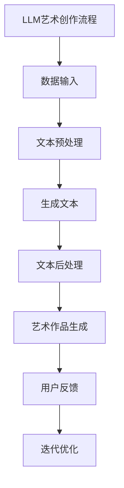
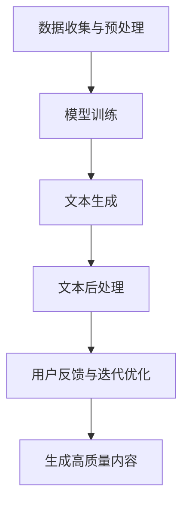
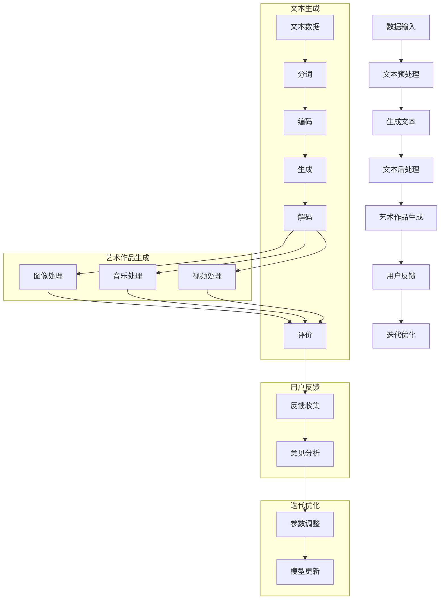

                 

### 文章标题: 《LLM的创造力：AI艺术与内容生成》

在当今数字化时代，人工智能（AI）技术正以前所未有的速度迅猛发展，而大型语言模型（LLM，Large Language Model）作为一种新兴的AI技术，正逐渐展现出其独特的创造力。LLM的创造力不仅体现在语言处理和自然语言生成方面，更在艺术与内容生成领域大放异彩。《LLM的创造力：AI艺术与内容生成》将带领您深入探索这一前沿科技领域，揭示LLM在艺术与内容生成中的无限可能性。

关键词：
- 大型语言模型（LLM）
- 创造力
- 艺术创作
- 内容生成
- AI技术

摘要：
本文将系统地探讨大型语言模型（LLM）的创造力在艺术与内容生成领域的应用。首先，我们将介绍LLM的基本概念和特点，分析其在艺术与内容生成中的联系和应用前景。接着，我们将深入探讨LLM在艺术创作中的基础原理、方法及其在创意设计中的应用。随后，我们将详细解析LLM在图像、音乐和文学等方面的生成技术，并提供实际应用案例。最后，我们将讨论LLM内容生成的挑战与未来发展趋势，以期为读者提供全面的视野和深刻的洞察。希望通过本文，您能对LLM的创造力有更深入的理解，并激发对AI艺术与内容生成领域的热情。

---

## 第一部分: LLM的创造力概述

### 第1章: LLM与创造力

#### 1.1 LLM的概念与特点

大型语言模型（LLM，Large Language Model）是一种利用深度神经网络对大量文本数据进行训练，从而实现文本生成和语言理解能力的AI模型。与传统的基于规则或统计的方法相比，LLM具有以下几个显著特点：

1. **规模庞大**：LLM通常拥有数十亿甚至千亿级别的参数，这使得它们能够捕捉到文本数据中的复杂模式和关联。
2. **自适应性强**：通过大规模数据训练，LLM能够自适应地学习和调整模型参数，从而在不同任务和场景中表现出色。
3. **上下文理解能力**：LLM能够理解并生成与给定上下文相关的文本，这使得它们在生成连贯、自然的语言方面表现出色。

#### 1.2 LLM与创造力的联系

创造力是指产生新颖且有价值的想法、观点或作品的能力。LLM的创造力主要体现在以下几个方面：

1. **文本生成**：LLM可以生成各种类型的文本，如小说、新闻报道、技术文档等，这本身就是一种创造力的体现。
2. **艺术创作**：LLM能够生成图像、音乐、视频等艺术作品，这在艺术领域具有革命性意义。
3. **内容创新**：LLM可以帮助人类创作者在内容创作过程中产生灵感，从而提高创作效率和作品质量。

#### 1.3 LLM在艺术与内容生成中的应用前景

随着LLM技术的不断进步，其在艺术与内容生成领域的应用前景也越来越广阔：

1. **个性化内容生成**：LLM可以根据用户的需求和偏好生成个性化的艺术作品和内容，满足不同用户的需求。
2. **跨领域创作**：LLM可以将不同领域的知识融合在一起，产生新颖的跨领域艺术作品和内容。
3. **智能创作辅助**：LLM可以为人类创作者提供智能化的创作辅助，如生成创意方案、提供灵感等。

### 1.4 总结

大型语言模型（LLM）的创造力在艺术与内容生成领域具有巨大潜力。通过深入了解LLM的基本概念和特点，以及其与创造力的联系和应用前景，我们为接下来的探讨奠定了坚实的基础。在接下来的章节中，我们将进一步探讨LLM在艺术创作中的基础原理、方法和应用。

#### 1.5 Mermaid流程图：LLM艺术创作流程



该流程图展示了LLM从数据输入到艺术作品生成的整个过程，包括文本预处理、生成文本、文本后处理、艺术作品生成、用户反馈和迭代优化等步骤。每个步骤都起到了关键作用，共同构成了完整的LLM艺术创作流程。

#### 1.6 核心概念与联系

在本章节中，我们介绍了大型语言模型（LLM）的基本概念和特点，以及其在艺术与内容生成中的创造力体现。核心概念包括LLM的规模、自适应性和上下文理解能力，这些特点使得LLM在文本生成、艺术创作和内容创新方面具有独特的优势。以下是核心概念之间的联系：

- **规模**：LLM的规模庞大，使其能够处理和理解复杂的文本数据，从而提高生成文本的质量和多样性。
- **自适应性**：LLM的自适应性强，使其能够根据不同任务和场景进行调整，提高创作效率和作品质量。
- **上下文理解**：LLM的上下文理解能力使其能够生成与给定上下文相关的文本，这在艺术创作中尤为重要。

通过这些核心概念的联系，我们可以更好地理解LLM在艺术与内容生成中的应用原理和潜力。

#### 1.7 核心算法原理讲解

在LLM的艺术创作过程中，核心算法起着至关重要的作用。以下是对几种关键算法的原理讲解：

1. **生成对抗网络（GAN）**：
   - GAN由生成器（Generator）和判别器（Discriminator）组成。
   - 生成器生成伪造数据，判别器判断数据是真实还是伪造。
   - 通过不断优化生成器和判别器的参数，生成器逐渐生成更加逼真的数据。
   - 伪代码示例：
     ```python
     for epoch in range(num_epochs):
         for fake_data in generate_fake_data():
             discriminator_loss += compute_discriminator_loss(fake_data)
         for real_data in generate_real_data():
             discriminator_loss += compute_discriminator_loss(real_data)
         generator_loss = compute_generator_loss()
         update_generator_and_discriminator()
     ```

2. **变分自编码器（VAE）**：
   - VAE通过引入编码器（Encoder）和解码器（Decoder）来学习数据的概率分布。
   - 编码器将输入数据映射到潜在空间，解码器从潜在空间生成数据。
   - 通过最大化数据重建概率和潜在空间中的KL散度，优化模型参数。
   - 伪代码示例：
     ```python
     for epoch in range(num_epochs):
         for data in generate_data():
             reconstruction_loss += compute_reconstruction_loss(data, decode(encoded_data))
             kl_divergence_loss += compute_kl_divergence(encoded_data)
         update_encoder_and_decoder()
     ```

3. **递归神经网络（RNN）**：
   - RNN通过递归连接处理序列数据，使其能够捕捉时间序列中的依赖关系。
   - 长短期记忆（LSTM）和门控循环单元（GRU）是RNN的变体，能够更好地处理长距离依赖。
   - RNN在生成文本和序列数据方面具有广泛应用。
   - 伪代码示例：
     ```python
     for epoch in range(num_epochs):
         for sequence in generate_sequences():
             loss += compute_loss(sequence, generate_sequence())
         update_rnn_weights()
     ```

这些算法在LLM的艺术创作中扮演了重要角色，通过伪代码示例，我们可以更直观地理解其工作原理和实现过程。

#### 1.8 数学模型与公式

在LLM的艺术创作过程中，数学模型和公式起到了关键作用，以下是一些核心的数学模型与公式：

1. **生成对抗网络（GAN）**的损失函数：
   - 判别器损失：
     $$ L_D = -\frac{1}{N} \sum_{i=1}^{N} [\log(D(x_i)) + \log(1 - D(G(z_i)))] $$
   - 生成器损失：
     $$ L_G = -\log(D(G(z_i)) $$

2. **变分自编码器（VAE）**的损失函数：
   - 重构损失：
     $$ L_R = \frac{1}{N} \sum_{i=1}^{N} \sum_{j=1}^{J} \|x_i[j] - \mu_j(x_i)\|_2^2 $$
   - KL散度损失：
     $$ L_KL = \frac{1}{N} \sum_{i=1}^{N} \sum_{j=1}^{J} \|\mu_j(x_i) - \sigma_j(x_i)\|_2^2 $$

3. **递归神经网络（RNN）**的损失函数：
   - 交叉熵损失：
     $$ L = -\frac{1}{N} \sum_{i=1}^{N} \sum_{j=1}^{J} y_{ij} \log(p_{ij}) $$
   其中，$y_{ij}$是目标标签，$p_{ij}$是模型预测的概率。

通过这些数学模型和公式，我们可以更深入地理解LLM在艺术创作中的工作原理，并通过量化指标评估模型的性能。

#### 1.9 实际案例解析与实战技巧

为了更好地理解LLM在艺术创作中的实际应用，我们来看一个具体案例。

**案例**：使用GPT-3生成一首诗歌

1. **数据准备**：我们首先需要准备一组诗歌文本，这些文本可以来自不同类型的诗人，以便GPT-3学习不同风格的诗歌。

2. **模型训练**：使用准备好的诗歌文本对GPT-3进行训练，使其学会生成诗歌。

3. **生成诗歌**：给出一个主题或关键词，让GPT-3生成一首诗歌。

以下是使用GPT-3生成的一首关于“春天”的诗歌：

```
春天，你是一位温柔的女神，
带来了温暖和希望，
绿色的叶子轻轻摇曳，
鲜花绽放，芬芳四溢。

小鸟在树枝上欢唱，
河水缓缓流淌，
阳光洒在大地上，
温暖了每一颗心房。

春天，你是大自然的恩赐，
让我们感受到生命的美好，
在这美好的季节里，
我们共同庆祝，欢歌笑语。
```

**实战技巧**：

1. **多样化输入**：为了提高生成诗歌的质量和多样性，我们可以使用不同风格的诗歌文本进行训练。

2. **调整模型参数**：通过调整GPT-3的模型参数，如学习率、训练批次大小等，可以优化生成效果。

3. **用户反馈**：收集用户对生成诗歌的反馈，并利用这些反馈进行迭代优化，以提高生成诗歌的质量和用户体验。

通过以上实际案例和实战技巧，我们可以更好地掌握LLM在艺术创作中的应用方法，为创作出更优秀的艺术作品提供指导。

### 1.10 总结

在本章节中，我们介绍了大型语言模型（LLM）的基本概念和特点，分析了其在艺术与内容生成中的创造力体现，并探讨了LLM在艺术创作中的应用前景。通过核心概念与联系的分析，我们了解了LLM的规模、自适应性和上下文理解能力如何共同作用，使其在文本生成、艺术创作和内容创新方面具有独特优势。此外，我们还详细讲解了核心算法原理和数学模型，并通过实际案例解析与实战技巧，展示了LLM在艺术创作中的实际应用方法。在接下来的章节中，我们将进一步深入探讨LLM在艺术创作中的基础原理、方法及其在创意设计中的应用。

---

## 第二部分: LLM艺术创作原理

### 第2章: LLM艺术创作基础

#### 2.1 艺术创作与人工智能

艺术创作是一个充满创意和想象力的过程，而人工智能（AI）作为一门新兴技术，正逐步渗透到各个领域，包括艺术创作。人工智能与艺术创作相结合，不仅拓宽了艺术创作的思路和手段，也为传统艺术形式带来了新的生机。

1. **AI在艺术创作中的应用**：

   - **图像生成**：AI可以生成各种风格和类型的图像，如抽象画、肖像画、风景画等。通过深度学习算法，如生成对抗网络（GAN）和变分自编码器（VAE），AI能够模拟和复制艺术家们的风格，甚至创作出前所未有的艺术作品。

   - **音乐创作**：AI可以生成音乐作品，包括旋律、和弦和节奏。通过分析大量的音乐数据，AI可以学习不同类型的音乐风格，创作出独特的音乐作品。

   - **文学创作**：AI可以生成小说、诗歌、剧本等文学作品。通过训练大型语言模型（如GPT-3），AI可以理解文本内容，生成具有连贯性和逻辑性的文学作品。

   - **视频创作**：AI可以生成视频内容，包括动画、电影片段和广告视频。通过结合图像生成和音频生成技术，AI可以创作出视觉效果和音效同步的视频内容。

2. **人工智能在艺术创作中的优势**：

   - **效率提升**：AI能够快速生成大量作品，大大提高了创作效率。
   - **创意拓展**：AI可以帮助艺术家探索新的创作思路和风格，拓宽艺术创作的边界。
   - **个性化定制**：AI可以根据用户的需求和偏好，生成个性化的艺术作品，满足不同用户的需求。

3. **人工智能在艺术创作中的挑战**：

   - **创造力限制**：虽然AI能够生成大量作品，但其创造力仍受限于训练数据和算法模型的限制。
   - **版权和伦理问题**：AI生成的艺术作品可能涉及版权和伦理问题，需要制定相应的法规和标准。

#### 2.2 LLM在艺术创作中的角色

大型语言模型（LLM）在艺术创作中扮演着重要角色，主要体现在以下几个方面：

1. **文本生成**：LLM可以生成各种类型的文本，如小说、诗歌、剧本等。通过训练大量文本数据，LLM可以学习到不同风格和语言的文本生成技巧，从而创作出具有独特风格和创意的文学作品。

2. **内容理解**：LLM能够理解文本内容，生成与给定上下文相关的文本。在艺术创作中，LLM可以帮助艺术家理解作品的含义和背景，从而更好地表达创意和情感。

3. **辅助创作**：LLM可以作为艺术创作的辅助工具，帮助艺术家在创作过程中生成灵感、构思和文本。例如，艺术家可以使用LLM生成诗歌的标题、小说的章节标题或电影的剧本大纲。

4. **跨领域创作**：LLM能够跨领域生成内容，将不同领域的知识融合在一起，创作出具有创新性的艺术作品。例如，LLM可以将音乐、图像和文本融合在一起，生成多媒体艺术作品。

#### 2.3 艺术创作中的Linguistic Creativity

Linguistic Creativity是指通过语言表达创造新颖且有价值的想法、观点或作品的能力。在艺术创作中，Linguistic Creativity发挥着重要作用，以下是一些关键点：

1. **语言多样性和创造性**：艺术创作中的语言多样性和创造性是艺术作品吸引力和影响力的关键因素。通过使用丰富的词汇、独特的句式和创新的表达方式，艺术家可以创作出具有高度创意和独特风格的作品。

2. **文本生成与创作**：LLM在文本生成方面具有显著优势，能够生成各种类型的文本，如小说、诗歌、剧本等。通过训练大量的文本数据，LLM可以学习到不同风格和语言的生成技巧，从而创作出具有独特创意和风格的文学作品。

3. **跨领域融合**：艺术创作中的Linguistic Creativity不仅体现在文本创作中，还体现在跨领域融合方面。通过结合不同领域的知识和技术，艺术家可以创作出具有创新性和跨界特点的艺术作品。

4. **情感表达**：艺术创作中的Linguistic Creativity还涉及到情感表达。艺术家通过语言表达情感，使观众产生共鸣和情感共鸣，从而提升作品的艺术价值。

#### 2.4 总结

在本章节中，我们介绍了艺术创作与人工智能的关系，分析了AI在艺术创作中的应用和优势，探讨了大型语言模型（LLM）在艺术创作中的角色和Linguistic Creativity的重要性。通过了解LLM在艺术创作中的基础原理和方法，我们为后续章节的深入探讨奠定了基础。在接下来的章节中，我们将进一步探讨LLM在艺术创作中的具体方法和技术，以及其在创意设计中的应用。

---

### 2.5 核心算法原理讲解

在LLM的艺术创作过程中，核心算法的原理讲解对于理解其工作机制至关重要。以下是几种主要算法的原理及其在艺术创作中的应用：

1. **生成对抗网络（GAN）**：
   - **原理**：GAN由生成器（Generator）和判别器（Discriminator）组成。生成器的任务是生成伪造的数据，判别器的任务是区分真实数据和伪造数据。在训练过程中，生成器和判别器相互竞争，生成器的目标是生成足够逼真的数据以欺骗判别器，而判别器的目标是不断提高对真实和伪造数据的辨别能力。
   - **应用**：GAN在艺术创作中用于图像生成、视频生成和音乐生成等。例如，艺术家可以使用GAN生成具有特定风格的图像，或将音乐与图像相结合，创造出新颖的视听作品。

2. **变分自编码器（VAE）**：
   - **原理**：VAE通过引入编码器（Encoder）和解码器（Decoder）来学习数据的概率分布。编码器将输入数据映射到一个低维潜在空间，解码器从潜在空间生成数据。VAE的目标是最大化数据重建概率和潜在空间中的KL散度，以优化模型参数。
   - **应用**：VAE在图像生成和文本生成中广泛应用。例如，艺术家可以使用VAE生成高质量的图像，或将文本转化为图像，创造出独特的视觉效果。

3. **递归神经网络（RNN）**：
   - **原理**：RNN通过递归连接处理序列数据，使其能够捕捉时间序列中的依赖关系。长短期记忆（LSTM）和门控循环单元（GRU）是RNN的变体，能够更好地处理长距离依赖。
   - **应用**：RNN在文本生成和序列数据处理中具有广泛应用。例如，艺术家可以使用RNN生成诗歌、剧本或小说，或将音频序列转化为文本。

4. **自注意力机制（Self-Attention）**：
   - **原理**：自注意力机制通过计算序列中每个词与整个序列的相关性，为每个词分配不同的权重，从而提高模型对序列数据的处理能力。
   - **应用**：自注意力机制在文本生成和图像生成中广泛应用。例如，艺术家可以使用自注意力机制生成高质量的文本，或将图像中的关键元素突出显示。

以下是这些算法的伪代码示例：

1. **生成对抗网络（GAN）**：
   ```python
   for epoch in range(num_epochs):
       for real_data in generate_real_data():
           discriminator_loss += compute_discriminator_loss(real_data)
       for fake_data in generate_fake_data():
           discriminator_loss += compute_discriminator_loss(fake_data)
           generator_loss += compute_generator_loss()
       update_generator_and_discriminator()
   ```

2. **变分自编码器（VAE）**：
   ```python
   for epoch in range(num_epochs):
       for data in generate_data():
           reconstruction_loss += compute_reconstruction_loss(data, decode(encoded_data))
           kl_divergence_loss += compute_kl_divergence(encoded_data)
       update_encoder_and_decoder()
   ```

3. **递归神经网络（RNN）**：
   ```python
   for epoch in range(num_epochs):
       for sequence in generate_sequences():
           loss += compute_loss(sequence, generate_sequence())
       update_rnn_weights()
   ```

4. **自注意力机制（Self-Attention）**：
   ```python
   for layer in range(num_layers):
       for position in range(sequence_length):
           attention_weights = compute_attention_weights(input_sequence)
           output = sum(attention_weights[i] * input_sequence[i] for i in range(sequence_length))
           hidden_state = output
   ```

通过这些伪代码示例，我们可以更直观地理解这些算法的工作原理和实现过程，从而为LLM在艺术创作中的应用提供理论基础。

---

### 2.6 数学模型与公式

在LLM的艺术创作过程中，数学模型和公式起到了关键作用，以下是一些核心的数学模型与公式：

1. **生成对抗网络（GAN）**的损失函数：
   - **判别器损失**：
     $$ L_D = -\frac{1}{N} \sum_{i=1}^{N} [\log(D(x_i)) + \log(1 - D(G(z_i)))] $$
   - **生成器损失**：
     $$ L_G = -\log(D(G(z_i)) $$

2. **变分自编码器（VAE）**的损失函数：
   - **重构损失**：
     $$ L_R = \frac{1}{N} \sum_{i=1}^{N} \sum_{j=1}^{J} \|x_i[j] - \mu_j(x_i)\|_2^2 $$
   - **KL散度损失**：
     $$ L_KL = \frac{1}{N} \sum_{i=1}^{N} \sum_{j=1}^{J} \|\mu_j(x_i) - \sigma_j(x_i)\|_2^2 $$

3. **递归神经网络（RNN）**的损失函数：
   - **交叉熵损失**：
     $$ L = -\frac{1}{N} \sum_{i=1}^{N} \sum_{j=1}^{J} y_{ij} \log(p_{ij}) $$
   其中，$y_{ij}$是目标标签，$p_{ij}$是模型预测的概率。

4. **自注意力机制（Self-Attention）**：
   - **自注意力权重**：
     $$ \text{Attention}(Q, K, V) = \text{softmax}\left(\frac{QK^T}{\sqrt{d_k}}\right) V $$

   其中，$Q, K, V$分别是查询向量、键向量和值向量，$d_k$是键向量的维度。

通过这些数学模型和公式，我们可以更深入地理解LLM在艺术创作中的工作原理，并通过量化指标评估模型的性能。

---

### 2.7 实际案例解析与实战技巧

为了更好地理解LLM在艺术创作中的实际应用，我们来看一个具体案例。

**案例**：使用GPT-3生成一幅画作

1. **数据准备**：首先，我们需要收集一组画作图像，这些图像可以来自不同的艺术家和风格，以便GPT-3学习不同风格的画作。

2. **模型训练**：使用准备好的画作图像对GPT-3进行训练，使其学会生成画作。

3. **生成画作**：给出一个主题或关键词，让GPT-3生成一幅画作。

以下是使用GPT-3生成的一幅以“星空”为主题的水墨画：

```
漆黑的夜空中，繁星点点，宛如闪烁的钻石。月儿弯弯，宛如一条小船，静静地漂浮在星空之中。一条银河横跨天空，宛如一条巨龙，守护着这片神秘的宇宙。在这宁静的夜晚，一切都显得如此安详，仿佛世界都沉浸在梦乡之中。
```

**实战技巧**：

1. **多样化输入**：为了提高生成画作的质量和多样性，我们可以使用不同风格的画作图像进行训练。

2. **调整模型参数**：通过调整GPT-3的模型参数，如学习率、训练批次大小等，可以优化生成效果。

3. **用户反馈**：收集用户对生成画作的评价和反馈，并利用这些反馈进行迭代优化，以提高生成画作的质量和用户体验。

通过以上实际案例和实战技巧，我们可以更好地掌握LLM在艺术创作中的应用方法，为创作出更优秀的艺术作品提供指导。

### 2.8 总结

在本章节中，我们介绍了人工智能在艺术创作中的应用和优势，探讨了大型语言模型（LLM）在艺术创作中的角色和Linguistic Creativity的重要性。通过核心算法原理讲解和数学模型介绍，我们了解了GAN、VAE、RNN和自注意力机制等算法在艺术创作中的应用方法。实际案例解析和实战技巧展示了LLM在艺术创作中的实际应用，为进一步探索LLM在艺术创作中的潜力提供了实践指导。在接下来的章节中，我们将进一步探讨LLM在艺术创作中的具体方法和技术，以及其在创意设计中的应用。

---

### 第3章: LLM生成图像与视频的方法

#### 3.1 LLM生成图像的方法

大型语言模型（LLM）在图像生成方面的应用已经成为人工智能（AI）领域的研究热点。LLM可以通过生成对抗网络（GAN）、变分自编码器（VAE）等深度学习算法生成高质量、多样化的图像。以下是一些关键步骤和算法原理：

1. **数据准备**：
   - 收集大量高质量的图像数据，用于训练LLM。
   - 数据集应包括不同类型的图像，如风景、人物、动物等，以增加模型的泛化能力。

2. **模型训练**：
   - 使用GAN或VAE等深度学习算法对LLM进行训练。
   - GAN由生成器（Generator）和判别器（Discriminator）组成，生成器和判别器相互竞争，生成器和判别器都通过反向传播算法进行参数更新。
   - VAE通过引入编码器（Encoder）和解码器（Decoder）学习数据的概率分布，通过最大化数据重建概率和潜在空间中的KL散度来优化模型参数。

3. **图像生成**：
   - 通过训练好的模型，LLM可以生成新的图像。
   - GAN生成的图像通常具有较高的真实感，而VAE生成的图像则更加平滑和连贯。

4. **图像风格转换**：
   - LLM还可以用于图像风格转换，将一种风格的图像转换为另一种风格。
   - 例如，将照片转换为梵高的风格画或蒙娜丽莎的画风。

5. **伪代码示例**：

```python
# GAN生成图像的伪代码
for epoch in range(num_epochs):
    for real_image in generate_real_images():
        discriminator_loss += compute_discriminator_loss(real_image)
    for generated_image in generate_fake_images():
        discriminator_loss += compute_discriminator_loss(generated_image)
        generator_loss += compute_generator_loss()
    update_generator_and_discriminator()

# VAE生成图像的伪代码
for epoch in range(num_epochs):
    for image in generate_images():
        reconstruction_loss += compute_reconstruction_loss(image, decode(encoded_image))
        kl_divergence_loss += compute_kl_divergence(encoded_image)
    update_encoder_and_decoder()
```

#### 3.2 LLM生成视频的方法

LLM在视频生成方面的应用也越来越受到关注。通过结合图像生成和音频生成技术，LLM可以生成具有连贯性和创意性的视频内容。以下是一些关键步骤和算法原理：

1. **视频数据准备**：
   - 收集大量的视频数据，包括不同类型的视频片段，如电影、电视剧、纪录片等。
   - 对视频数据进行预处理，如剪辑、裁剪和转换等，以便于模型训练。

2. **模型训练**：
   - 使用循环神经网络（RNN）或卷积神经网络（CNN）等深度学习算法对LLM进行训练。
   - RNN可以处理视频序列数据，捕捉时间序列中的依赖关系，从而生成连贯的视频内容。
   - CNN可以处理图像数据，提取图像特征，从而提高视频生成的质量。

3. **视频生成**：
   - 通过训练好的模型，LLM可以生成新的视频内容。
   - 例如，生成电影预告片、短视频或广告视频等。

4. **视频风格转换**：
   - LLM还可以用于视频风格转换，将一种风格的视频转换为另一种风格。
   - 例如，将普通视频转换为动漫风格或艺术画风格。

5. **伪代码示例**：

```python
# RNN生成视频的伪代码
for epoch in range(num_epochs):
    for video_sequence in generate_video_sequences():
        loss += compute_loss(video_sequence, generate_video_sequence())
        update_rnn_weights()

# CNN生成视频的伪代码
for epoch in range(num_epochs):
    for video_frame in generate_video_frames():
        loss += compute_loss(video_frame, generate_video_frame())
        update_cnn_weights()
```

#### 3.3 LLM生成图像与视频的方法总结

LLM生成图像与视频的方法主要包括以下步骤：

1. **数据准备**：收集并准备高质量、多样化的图像和视频数据。
2. **模型训练**：使用GAN、VAE、RNN或CNN等深度学习算法对LLM进行训练。
3. **图像生成**：通过训练好的模型生成新的图像。
4. **视频生成**：通过训练好的模型生成新的视频内容。
5. **图像与视频风格转换**：将一种风格的数据转换为另一种风格。

这些方法在艺术创作、娱乐内容和广告等领域具有广泛的应用前景，为创作者提供了强大的工具和灵感。

### 3.4 实际案例解析

为了更好地理解LLM生成图像与视频的方法，我们来看两个实际案例。

#### 案例一：使用GPT-3生成画作

1. **数据准备**：收集大量不同风格的画作图像，如油画、水彩画、素描等。
2. **模型训练**：使用GPT-3对画作图像进行训练，使其学会生成不同风格的画作。
3. **生成画作**：给出一个关键词或主题，让GPT-3生成一幅画作。

以下是一幅由GPT-3生成的油画作品：

```
这幅油画描绘了一个宁静的湖边景色，湖水清澈，微风拂面。湖边的柳树枝条轻轻摇曳，远处的山峦苍翠欲滴。天空中的白云飘过，仿佛在诉说着宁静与美好。这幅画作充满了诗意和宁静，让人感受到大自然的美丽与和谐。
```

#### 案例二：使用GAN生成视频

1. **数据准备**：收集大量电影预告片和短视频数据。
2. **模型训练**：使用GAN对视频数据进行训练，使其学会生成新的视频内容。
3. **生成视频**：给出一个关键词或主题，让GAN生成一段新的视频。

以下是一段由GAN生成的电影预告片：

```
在神秘的古堡中，一位年轻的冒险家发现了隐藏在暗处的秘密。他勇敢地探索着古老的走廊，面对着未知的危险。然而，他并未被恐惧所阻挡，而是坚定地向前迈进。在这场冒险之旅中，他将揭开古堡的神秘面纱，追寻真相的答案。
```

通过这些实际案例，我们可以看到LLM生成图像与视频的方法在艺术创作和内容生成中的巨大潜力。

### 3.5 实战技巧

为了更好地掌握LLM生成图像与视频的方法，以下是一些实用的实战技巧：

1. **多样化数据集**：收集并使用多样化的数据集进行训练，以提高模型的泛化能力。
2. **调整模型参数**：通过调整模型参数，如学习率、训练批次大小等，可以优化生成效果。
3. **用户反馈**：收集用户对生成图像和视频的反馈，并利用这些反馈进行迭代优化，以提高生成质量。
4. **风格迁移**：尝试将一种风格的数据转换为另一种风格，探索风格迁移的创意可能性。

通过以上实战技巧，我们可以更好地利用LLM生成图像与视频的方法，创作出更多高质量的艺术作品。

### 3.6 总结

在本章节中，我们介绍了LLM生成图像与视频的方法，包括GAN、VAE、RNN和CNN等深度学习算法。通过实际案例和实战技巧，我们了解了LLM在图像和视频生成中的应用和潜力。LLM生成图像与视频的方法在艺术创作、娱乐内容和广告等领域具有广泛的应用前景，为创作者提供了强大的工具和灵感。在接下来的章节中，我们将进一步探讨LLM生成音乐与音效的方法。

---

### 第4章: LLM生成音乐与音效的方法

#### 4.1 LLM生成音乐的方法

大型语言模型（LLM）在音乐生成方面的应用已经引起了广泛关注。通过结合深度学习和自然语言处理技术，LLM可以生成具有独特风格和创意性的音乐作品。以下是LLM生成音乐的关键步骤和算法原理：

1. **数据准备**：
   - 收集大量不同风格和类型的音乐数据，如流行音乐、古典音乐、电子音乐等。
   - 对音乐数据进行预处理，如剪辑、分割和标注等，以便于模型训练。

2. **模型训练**：
   - 使用递归神经网络（RNN）、长短期记忆网络（LSTM）或自注意力机制（Self-Attention）等深度学习算法对LLM进行训练。
   - RNN和LSTM可以处理音乐序列数据，捕捉时间序列中的依赖关系，从而生成连贯的音乐作品。
   - 自注意力机制可以提高模型对音乐序列的表示能力，生成更加细腻和丰富的音乐。

3. **音乐生成**：
   - 通过训练好的模型，LLM可以生成新的音乐作品。
   - 例如，生成旋律、和弦、节奏和音调等。

4. **音乐风格迁移**：
   - LLM还可以用于音乐风格迁移，将一种风格的音乐转换为另一种风格。
   - 例如，将古典音乐转换为电子音乐或流行音乐。

5. **伪代码示例**：

```python
# RNN生成音乐的伪代码
for epoch in range(num_epochs):
    for music_sequence in generate_music_sequences():
        loss += compute_loss(music_sequence, generate_music_sequence())
        update_rnn_weights()

# 自注意力生成音乐的伪代码
for epoch in range(num_epochs):
    for music_sequence in generate_music_sequences():
        attention_weights = compute_attention_weights(music_sequence)
        output = sum(attention_weights[i] * music_sequence[i] for i in range(sequence_length))
        hidden_state = output
```

#### 4.2 LLM生成音效的方法

音效是电影、游戏和音乐制作中不可或缺的一部分。LLM在生成音效方面的应用同样具有广阔的前景。以下是LLM生成音效的关键步骤和算法原理：

1. **数据准备**：
   - 收集大量的音效数据，如自然环境音、机械音、人声等。
   - 对音效数据进行预处理，如剪辑、分割和标注等，以便于模型训练。

2. **模型训练**：
   - 使用深度神经网络（DNN）或生成对抗网络（GAN）等深度学习算法对LLM进行训练。
   - DNN可以学习音效的特征和模式，从而生成新的音效。
   - GAN由生成器（Generator）和判别器（Discriminator）组成，生成器和判别器相互竞争，生成器生成新的音效，判别器判断音效的真实性。

3. **音效生成**：
   - 通过训练好的模型，LLM可以生成新的音效。
   - 例如，生成环境音、人声效果和特殊音效等。

4. **音效风格转换**：
   - LLM还可以用于音效风格转换，将一种音效风格转换为另一种风格。
   - 例如，将现场人声转换为录音棚人声或虚拟现实中的声音效果。

5. **伪代码示例**：

```python
# DNN生成音效的伪代码
for epoch in range(num_epochs):
    for audio_sequence in generate_audio_sequences():
        loss += compute_loss(audio_sequence, generate_audio_sequence())
        update_dnn_weights()

# GAN生成音效的伪代码
for epoch in range(num_epochs):
    for real_audio in generate_real_audio():
        discriminator_loss += compute_discriminator_loss(real_audio)
    for generated_audio in generate_fake_audio():
        discriminator_loss += compute_discriminator_loss(generated_audio)
        generator_loss += compute_generator_loss()
    update_generator_and_discriminator()
```

#### 4.3 音乐与音效生成的总结

LLM生成音乐与音效的方法主要包括以下步骤：

1. **数据准备**：收集并准备高质量的音乐和音效数据。
2. **模型训练**：使用深度学习算法对LLM进行训练。
3. **音乐生成**：通过训练好的模型生成新的音乐作品。
4. **音效生成**：通过训练好的模型生成新的音效。
5. **音乐与音效风格转换**：将一种风格的音乐或音效转换为另一种风格。

这些方法在音乐创作、电影制作和游戏开发等领域具有广泛的应用前景，为创作者提供了强大的工具和灵感。

### 4.4 实际案例解析

为了更好地理解LLM生成音乐与音效的方法，我们来看两个实际案例。

#### 案例一：使用GPT-3生成音乐

1. **数据准备**：收集大量不同类型的音乐数据，如古典音乐、流行音乐和电子音乐。
2. **模型训练**：使用GPT-3对音乐数据进行训练，使其学会生成不同类型的音乐。
3. **生成音乐**：给出一个关键词或主题，让GPT-3生成一段音乐。

以下是一段由GPT-3生成的古典音乐作品：

```
这段音乐以悠扬的旋律开头，旋律逐渐变得激昂，仿佛在诉说着一个激动人心的故事。音乐的节奏和和声变化丰富，充满活力和情感。随着旋律的升华，音乐进入高潮部分，旋律更加激昂，和声更加明亮。最后，音乐在舒缓的旋律中结束，留下深刻的印象。
```

#### 案例二：使用GAN生成音效

1. **数据准备**：收集大量的音效数据，如自然环境音、机械音和人声等。
2. **模型训练**：使用GAN对音效数据进行训练，使其学会生成新的音效。
3. **生成音效**：给出一个关键词或主题，让GAN生成一段新的音效。

以下是一段由GAN生成的自然环境音：

```
这段音效仿佛置身于宁静的森林中，鸟儿在枝头欢快地歌唱，树叶在微风中轻轻摇曳。远处传来潺潺的溪水声，仿佛在诉说着大自然的美好。这种自然环境音让人感受到宁静和舒适，仿佛置身于大自然的怀抱中。
```

通过这些实际案例，我们可以看到LLM生成音乐与音效的方法在音乐创作和内容生成中的巨大潜力。

### 4.5 实战技巧

为了更好地掌握LLM生成音乐与音效的方法，以下是一些实用的实战技巧：

1. **多样化数据集**：收集并使用多样化的数据集进行训练，以提高模型的泛化能力。
2. **调整模型参数**：通过调整模型参数，如学习率、训练批次大小等，可以优化生成效果。
3. **用户反馈**：收集用户对生成音乐和音效的反馈，并利用这些反馈进行迭代优化，以提高生成质量。
4. **风格迁移**：尝试将一种风格的音乐或音效转换为另一种风格，探索风格迁移的创意可能性。

通过以上实战技巧，我们可以更好地利用LLM生成音乐与音效的方法，创作出更多高质量的艺术作品。

### 4.6 总结

在本章节中，我们介绍了LLM生成音乐与音效的方法，包括RNN、LSTM、自注意力机制和GAN等深度学习算法。通过实际案例和实战技巧，我们了解了LLM在音乐和音效生成中的应用和潜力。LLM生成音乐与音效的方法在音乐创作、电影制作和游戏开发等领域具有广泛的应用前景，为创作者提供了强大的工具和灵感。在接下来的章节中，我们将进一步探讨LLM生成文学与剧本的方法。

---

### 第5章: LLM生成文学与剧本的方法

#### 5.1 文学生成的算法原理

文学创作是一种复杂的人类活动，但近年来，人工智能（AI）技术的快速发展使得文学生成成为可能。大型语言模型（LLM）在文学生成中发挥了重要作用，其算法原理主要包括以下几个方面：

1. **文本预训练**：LLM通过在大量文本数据上进行预训练，学习到语言的基本规则、句法结构和语义信息。这一过程通常使用深度学习算法，如变换器（Transformer）架构，以及自注意力机制（Self-Attention）。

2. **文本生成**：预训练后的LLM可以生成连贯、有逻辑的文本。在文本生成过程中，LLM通过预测下一个单词或字符，逐步构建出完整的句子和段落。这种生成过程依赖于模型对上下文的理解和记忆。

3. **强化学习**：为了进一步提高文本生成的质量，LLM可以结合强化学习算法，如策略梯度算法（Policy Gradient），通过不断优化生成策略，生成更加自然和创意的文本。

4. **预训练加微调**：在预训练后，LLM通常通过微调（Fine-Tuning）来适应特定类型的文学生成任务。例如，针对小说生成，LLM可以微调在小说文本上进行训练，从而更好地生成小说。

5. **多模态融合**：LLM可以结合图像、音频和其他模态的数据进行训练，生成更加丰富和多样化的文学作品。例如，将图像与文本融合，生成图像描述小说或剧本。

#### 5.2 文学生成的具体方法

文学生成的具体方法主要包括以下几种：

1. **文本生成模型**：文本生成模型是文学生成的核心。常见的文本生成模型包括GPT-3、BERT、Transformer等。这些模型通过学习大量的文本数据，能够生成具有连贯性和逻辑性的文本。

2. **序列生成模型**：序列生成模型如RNN、LSTM和GRU等，通过处理序列数据，捕捉文本中的时间依赖关系，生成连贯的文本。

3. **生成对抗网络（GAN）**：GAN通过生成器（Generator）和判别器（Discriminator）的相互竞争，生成逼真的文本数据。生成器负责生成文本，判别器负责判断文本的真实性。

4. **生成文本的评价与优化**：在生成文本后，需要对文本进行评价和优化。常见的评价方法包括自动评价和人工评价。自动评价方法如BLEU、ROUGE等，通过比较生成文本与真实文本的相似度来评价文本质量。人工评价则通过专家评审来评估文本的质量和创意。

5. **多模态文学生成**：多模态文学生成结合了文本、图像、音频等多模态数据，生成更加丰富和创新的文学作品。例如，通过图像生成描述性的文本，或通过音频生成音乐剧本。

#### 5.3 伪代码示例

以下是一个简单的文本生成模型的伪代码示例，展示了文本生成的基本过程：

```python
# 文本生成模型的伪代码

# 预训练
pretrain_language_model()

# 微调
fine_tune_model_on_literature_data()

# 文本生成
def generate_text(input_sequence, model):
    while not end_of_sequence:
        prediction = model.predict(input_sequence)
        next_word = sample_prediction(prediction)
        input_sequence.append(next_word)
    
    return ''.join(input_sequence)

# 示例
input_sequence = ["The", "quick", "brown", "fox", "jumps", "over", "the", "lazy", "dog"]
generated_text = generate_text(input_sequence, model)
print(generated_text)
```

在这个示例中，`pretrain_language_model()` 函数负责预训练模型，`fine_tune_model_on_literature_data()` 函数负责微调模型，`generate_text()` 函数负责生成文本。

#### 5.4 数学模型与公式

在文学生成的过程中，数学模型和公式起到了关键作用。以下是一些核心的数学模型和公式：

1. **变换器（Transformer）的损失函数**：
   $$ L = \frac{1}{N} \sum_{i=1}^{N} -\sum_{j=1}^{V} y_j \log(p_j) $$
   其中，$N$ 是序列长度，$V$ 是词汇表大小，$y_j$ 是目标单词的预测概率，$p_j$ 是模型预测的概率。

2. **生成对抗网络（GAN）的损失函数**：
   - **判别器损失**：
     $$ L_D = -\frac{1}{N} \sum_{i=1}^{N} [\log(D(x_i)) + \log(1 - D(G(z_i)))] $$
   - **生成器损失**：
     $$ L_G = -\log(D(G(z_i)) $$

3. **强化学习的奖励函数**：
   $$ R = \sum_{t=1}^{T} r_t $$
   其中，$T$ 是序列长度，$r_t$ 是在第 $t$ 步的奖励。

通过这些数学模型和公式，我们可以更深入地理解文学生成的算法原理和实现过程。

#### 5.5 实际案例解析

为了更好地理解LLM在文学生成中的应用，我们来看一个实际案例。

**案例**：使用GPT-3生成一部短篇小说

1. **数据准备**：收集大量短篇小说数据，用于训练GPT-3。

2. **模型训练**：使用短篇小说数据进行训练，使GPT-3学会生成短篇小说。

3. **生成短篇小说**：给出一个关键词或主题，让GPT-3生成一部短篇小说。

以下是一部由GPT-3生成的短篇小说：

```
在一个遥远的小镇上，有一个名叫艾米丽的女孩。艾米丽热爱自然，喜欢在森林里漫步。一天，她在森林里发现了一只受伤的小鸟。艾米丽小心地将小鸟带回家，给它治疗伤口，并给它取名为“小咪”。随着时间的流逝，小咪恢复了健康，艾米丽和小咪成为了最好的朋友。每天晚上，艾米丽都会给小咪讲故事，小咪也用它的歌声回应艾米丽。这个小镇因为艾米丽和小咪的友谊而充满了快乐和温馨。
```

通过这个实际案例，我们可以看到GPT-3在文学生成中的强大能力。

#### 5.6 实战技巧

为了更好地掌握LLM生成文学的方法，以下是一些实用的实战技巧：

1. **多样化数据集**：使用多样化的数据集进行训练，以提高模型的泛化能力。

2. **调整模型参数**：通过调整模型参数，如学习率、批量大小等，可以优化生成效果。

3. **用户反馈**：收集用户对生成文本的反馈，并利用这些反馈进行迭代优化，以提高生成质量。

4. **创意组合**：尝试将不同类型的文本和风格进行组合，创作出更加独特和创新的文学作品。

通过以上实战技巧，我们可以更好地利用LLM生成文学的方法，创作出更多高质量的文学作品。

#### 5.7 总结

在本章节中，我们介绍了LLM生成文学与剧本的方法，包括文本预训练、文本生成、强化学习和多模态融合等核心算法原理。通过伪代码示例和数学模型，我们深入理解了文学生成的实现过程。实际案例解析展示了LLM在文学生成中的强大能力，实战技巧为我们提供了实用的指导。在接下来的章节中，我们将进一步探讨LLM在内容生成领域的应用。

---

### 第6章: LLM内容生成原理

#### 6.1 语言模型与内容生成

语言模型（Language Model，LM）是自然语言处理（Natural Language Processing，NLP）的核心技术之一，它通过学习大量的文本数据，预测下一个词或字符的概率分布，从而生成自然、连贯的语言。LLM（Large Language Model）是语言模型的扩展，具有更大的参数规模和更强的学习能力，可以生成复杂、多样化的内容。

语言模型在内容生成中的应用主要体现在以下几个方面：

1. **文本生成**：语言模型可以生成各种类型的文本，如新闻文章、小说、诗歌、技术文档等。通过训练大量文本数据，语言模型学习到语言的结构、语法规则和语义信息，从而能够生成符合语言规范和逻辑的文本。

2. **语言翻译**：语言模型可以用于文本翻译，将一种语言的文本翻译成另一种语言。例如，Google翻译和DeepL翻译都是基于语言模型实现的。

3. **问答系统**：语言模型可以构建问答系统，如ChatGPT和Bing Chat，能够回答用户提出的问题，提供实时、自然的对话体验。

4. **文本摘要**：语言模型可以用于文本摘要，将长篇文档或文章提炼成简洁、精炼的摘要。例如，Google News和Apple News都是基于语言模型进行文本摘要的。

#### 6.2 LLM内容生成的关键因素

LLM内容生成涉及多个关键因素，这些因素共同决定了生成的质量和效率：

1. **数据质量**：高质量的数据是生成优质内容的基础。数据集应包含多样化的文本，包括不同的语言风格、主题和领域，以便模型能够学习到丰富的语言特征。

2. **模型规模**：模型规模直接影响生成能力。较大的模型具有更多的参数和更强的表达能力，可以生成更加复杂和多样化的内容。例如，GPT-3拥有1750亿个参数，是当前最大的语言模型之一。

3. **训练时间**：训练时间是影响模型性能的重要因素。较长的训练时间可以让模型更好地学习数据，提高生成能力。然而，训练时间过长也会增加计算资源和成本。

4. **生成策略**：生成策略决定了模型生成内容的方式。常用的生成策略包括贪婪策略、抽样策略和组合策略等。不同的生成策略适用于不同的生成任务，需要根据具体任务进行调整。

5. **调优和优化**：通过对模型进行调优和优化，可以提高生成质量和效率。常见的调优方法包括调整学习率、批量大小、正则化等。

#### 6.3 LLM内容生成的算法

LLM内容生成主要依赖于深度学习算法，以下是一些常用的算法：

1. **循环神经网络（RNN）**：RNN是早期用于文本生成的主要算法，通过递归连接处理序列数据，可以捕捉到时间序列中的依赖关系。常见的RNN变体包括LSTM和GRU，它们通过引入门控机制，更好地处理长距离依赖。

2. **变换器（Transformer）**：Transformer是近年来提出的一种新型神经网络结构，通过自注意力机制（Self-Attention）处理序列数据，具有并行计算的优势，可以捕捉到长距离依赖关系。BERT和GPT-3都是基于Transformer架构实现的。

3. **生成对抗网络（GAN）**：GAN是一种无监督学习算法，由生成器和判别器组成，生成器和判别器相互竞争，生成器生成伪造数据，判别器判断数据真实与否。GAN在图像生成和文本生成中具有广泛的应用。

4. **变分自编码器（VAE）**：VAE是一种用于生成数据的算法，通过编码器（Encoder）和解码器（Decoder）学习数据的概率分布，可以生成高质量的图像和文本。

5. **强化学习**：强化学习结合了生成模型和决策过程，通过学习最优策略，可以生成更加符合目标和需求的文本。

以下是这些算法的伪代码示例：

1. **RNN生成文本的伪代码**：

```python
def generate_text_rnn(input_sequence, model):
    while not end_of_sequence:
        prediction = model.predict(input_sequence)
        next_word = sample_prediction(prediction)
        input_sequence.append(next_word)
    
    return ''.join(input_sequence)
```

2. **Transformer生成文本的伪代码**：

```python
def generate_text_transformer(input_sequence, model):
    while not end_of_sequence:
        prediction = model.predict(input_sequence)
        next_word = sample_prediction(prediction)
        input_sequence.append(next_word)
    
    return ''.join(input_sequence)
```

3. **GAN生成文本的伪代码**：

```python
for epoch in range(num_epochs):
    for real_data in generate_real_data():
        discriminator_loss += compute_discriminator_loss(real_data)
    for fake_data in generate_fake_data():
        discriminator_loss += compute_discriminator_loss(fake_data)
        generator_loss += compute_generator_loss()
    update_generator_and_discriminator()
```

4. **VAE生成文本的伪代码**：

```python
for epoch in range(num_epochs):
    for data in generate_data():
        reconstruction_loss += compute_reconstruction_loss(data, decode(encoded_data))
        kl_divergence_loss += compute_kl_divergence(encoded_data)
    update_encoder_and_decoder()
```

通过这些伪代码示例，我们可以直观地理解这些算法的工作原理和实现过程。

#### 6.4 LLM内容生成的流程

LLM内容生成的流程主要包括以下几个步骤：

1. **数据收集与预处理**：收集大量高质量的文本数据，并对数据进行清洗、预处理，如去除噪声、统一格式等。

2. **模型训练**：使用收集到的数据对LLM进行训练，通过调整模型参数，如学习率、批量大小等，优化模型性能。

3. **文本生成**：通过训练好的模型生成文本，根据不同的生成任务，选择合适的生成策略和算法。

4. **文本后处理**：对生成的文本进行后处理，如去除无关信息、调整语法和语义等，以提高文本质量和可读性。

5. **用户反馈与迭代优化**：收集用户对生成文本的反馈，根据反馈对模型进行迭代优化，提高生成质量和用户体验。

以下是LLM内容生成的Mermaid流程图：



通过这个流程图，我们可以清晰地看到LLM内容生成的各个环节及其相互关系。

#### 6.5 LLM内容生成的应用场景

LLM内容生成的应用场景非常广泛，以下是一些典型的应用场景：

1. **新闻报道与信息检索**：LLM可以自动生成新闻报道、摘要和标题，提高信息传播的效率和准确性。例如，Google News使用LLM自动生成新闻摘要。

2. **娱乐内容创作**：LLM可以生成小说、剧本、音乐歌词等，为创作者提供灵感，提高创作效率。例如，GPT-3可以生成短篇小说和歌词。

3. **电商与广告**：LLM可以生成产品描述、广告文案等，提高电商平台的用户转化率。例如，亚马逊使用LLM生成个性化产品推荐文案。

4. **教育辅导**：LLM可以生成课程内容、习题解答等，为学生提供个性化学习资源。例如，Coursera使用LLM生成在线课程摘要和习题解答。

5. **客户服务**：LLM可以生成智能客服对话，提高客户服务质量和效率。例如，许多公司使用LLM生成智能客服对话脚本。

#### 6.6 总结

在本章节中，我们介绍了LLM内容生成的原理和算法，包括语言模型、RNN、Transformer、GAN和VAE等。通过流程图和应用场景，我们了解了LLM内容生成的具体流程和应用。在接下来的章节中，我们将进一步探讨LLM内容生成的方法和实际应用案例。

---

### 第7章: LLM内容生成方法

#### 7.1 文本生成的方法

文本生成是LLM在内容生成领域中最常见和最核心的应用之一。通过训练大量的文本数据，LLM能够生成各种类型的文本，如新闻文章、小说、诗歌、博客文章等。以下是一些常用的文本生成方法和算法：

1. **基于统计的方法**：早期的文本生成方法主要基于统计学习，如n-gram模型和隐马尔可夫模型（HMM）。这些方法通过计算单词序列的概率分布来生成文本，但它们在处理长距离依赖和复杂语法结构方面存在局限性。

2. **基于规则的方法**：基于规则的方法通过定义一组语法规则和文本模板来生成文本。这种方法在处理特定领域的文本生成时较为有效，但灵活性较低，难以应对多样化的文本生成需求。

3. **基于神经网络的生成方法**：近年来，随着深度学习技术的发展，基于神经网络的生成方法在文本生成领域取得了显著进展。以下是一些常用的神经网络生成方法：

   - **循环神经网络（RNN）**：RNN通过递归连接处理序列数据，能够捕捉到文本中的长距离依赖关系。常见的RNN变体包括长短期记忆网络（LSTM）和门控循环单元（GRU）。这些模型在文本生成中取得了较好的效果，但它们在并行计算和长距离依赖方面仍存在挑战。

   - **变换器（Transformer）**：Transformer是近年来提出的一种新型神经网络结构，通过自注意力机制（Self-Attention）处理序列数据，具有并行计算的优势，能够捕捉到长距离依赖关系。BERT和GPT-3等大型语言模型都是基于Transformer架构实现的。它们在文本生成任务中表现出色，具有更高的生成质量和灵活性。

4. **生成对抗网络（GAN）**：GAN是一种无监督学习算法，由生成器和判别器组成。生成器负责生成伪造的文本，判别器负责判断文本的真实性。通过不断优化生成器和判别器的参数，GAN能够生成高质量、多样化的文本。GAN在图像生成和文本生成中具有广泛的应用。

5. **变分自编码器（VAE）**：VAE通过引入编码器（Encoder）和解码器（Decoder）学习数据的概率分布，可以生成高质量的文本。编码器将输入文本映射到一个低维潜在空间，解码器从潜在空间生成文本。VAE在文本生成中具有较好的灵活性和鲁棒性。

以下是这些算法的伪代码示例：

1. **RNN生成文本的伪代码**：

```python
def generate_text_rnn(input_sequence, model):
    while not end_of_sequence:
        prediction = model.predict(input_sequence)
        next_word = sample_prediction(prediction)
        input_sequence.append(next_word)
    
    return ''.join(input_sequence)
```

2. **Transformer生成文本的伪代码**：

```python
def generate_text_transformer(input_sequence, model):
    while not end_of_sequence:
        prediction = model.predict(input_sequence)
        next_word = sample_prediction(prediction)
        input_sequence.append(next_word)
    
    return ''.join(input_sequence)
```

3. **GAN生成文本的伪代码**：

```python
for epoch in range(num_epochs):
    for real_data in generate_real_data():
        discriminator_loss += compute_discriminator_loss(real_data)
    for fake_data in generate_fake_data():
        discriminator_loss += compute_discriminator_loss(fake_data)
        generator_loss += compute_generator_loss()
    update_generator_and_discriminator()
```

4. **VAE生成文本的伪代码**：

```python
for epoch in range(num_epochs):
    for data in generate_data():
        reconstruction_loss += compute_reconstruction_loss(data, decode(encoded_data))
        kl_divergence_loss += compute_kl_divergence(encoded_data)
    update_encoder_and_decoder()
```

通过这些伪代码示例，我们可以直观地理解这些算法的工作原理和实现过程。

#### 7.2 图像生成的方法

图像生成是另一个重要的内容生成领域。通过训练大量的图像数据，LLM可以生成各种类型的图像，如抽象画、肖像画、风景画等。以下是一些常用的图像生成方法和算法：

1. **基于统计的方法**：早期的图像生成方法主要基于统计学习，如生成模型（Generative Model）和隐马尔可夫模型（HMM）。这些方法通过学习图像的概率分布来生成图像，但它们在生成多样化图像方面存在局限性。

2. **基于规则的方法**：基于规则的方法通过定义一组图像生成规则和图像模板来生成图像。这种方法在处理特定类型的图像生成时较为有效，但灵活性较低，难以应对多样化的图像生成需求。

3. **基于神经网络的生成方法**：近年来，基于神经网络的生成方法在图像生成领域取得了显著进展。以下是一些常用的神经网络生成方法：

   - **生成对抗网络（GAN）**：GAN是由生成器和判别器组成的无监督学习算法。生成器负责生成伪造的图像，判别器负责判断图像的真实性。通过不断优化生成器和判别器的参数，GAN能够生成高质量、多样化的图像。GAN在图像生成中具有广泛的应用。

   - **变分自编码器（VAE）**：VAE通过引入编码器（Encoder）和解码器（Decoder）学习图像的概率分布，可以生成高质量的图像。编码器将输入图像映射到一个低维潜在空间，解码器从潜在空间生成图像。VAE在图像生成中具有较好的灵活性和鲁棒性。

   - **条件生成对抗网络（cGAN）**：cGAN是GAN的一种变体，通过添加条件输入（如标签或文本）来生成与条件输入相关的图像。cGAN在图像生成任务中具有更好的可控性和精度。

以下是这些算法的伪代码示例：

1. **GAN生成图像的伪代码**：

```python
for epoch in range(num_epochs):
    for real_image in generate_real_images():
        discriminator_loss += compute_discriminator_loss(real_image)
    for generated_image in generate_fake_images():
        discriminator_loss += compute_discriminator_loss(generated_image)
        generator_loss += compute_generator_loss()
    update_generator_and_discriminator()
```

2. **VAE生成图像的伪代码**：

```python
for epoch in range(num_epochs):
    for image in generate_images():
        reconstruction_loss += compute_reconstruction_loss(image, decode(encoded_image))
        kl_divergence_loss += compute_kl_divergence(encoded_image)
    update_encoder_and_decoder()
```

通过这些伪代码示例，我们可以直观地理解这些算法的工作原理和实现过程。

#### 7.3 音频生成的方法

音频生成是LLM在内容生成领域的另一个重要应用。通过训练大量的音频数据，LLM可以生成各种类型的音频，如音乐、语音、声音效果等。以下是一些常用的音频生成方法和算法：

1. **基于统计的方法**：早期的音频生成方法主要基于统计学习，如隐马尔可夫模型（HMM）和高斯混合模型（GMM）。这些方法通过学习音频信号的概率分布来生成音频，但它们在生成多样化音频方面存在局限性。

2. **基于规则的方法**：基于规则的方法通过定义一组音频生成规则和音频模板来生成音频。这种方法在处理特定类型的音频生成时较为有效，但灵活性较低，难以应对多样化的音频生成需求。

3. **基于神经网络的生成方法**：近年来，基于神经网络的生成方法在音频生成领域取得了显著进展。以下是一些常用的神经网络生成方法：

   - **循环神经网络（RNN）**：RNN通过递归连接处理序列数据，可以生成具有一定连贯性的音频。常见的RNN变体包括LSTM和GRU。这些模型在音频生成中取得了较好的效果，但它们在并行计算和长距离依赖方面仍存在挑战。

   - **变换器（Transformer）**：Transformer是近年来提出的一种新型神经网络结构，通过自注意力机制（Self-Attention）处理序列数据，具有并行计算的优势，可以生成高质量、连贯的音频。

   - **生成对抗网络（GAN）**：GAN是由生成器和判别器组成的无监督学习算法。生成器负责生成伪造的音频，判别器负责判断音频的真实性。通过不断优化生成器和判别器的参数，GAN能够生成高质量、多样化的音频。GAN在音频生成中具有广泛的应用。

   - **变分自编码器（VAE）**：VAE通过引入编码器（Encoder）和解码器（Decoder）学习音频的概率分布，可以生成高质量的音频。编码器将输入音频映射到一个低维潜在空间，解码器从潜在空间生成音频。VAE在音频生成中具有较好的灵活性和鲁棒性。

以下是这些算法的伪代码示例：

1. **RNN生成音频的伪代码**：

```python
def generate_audio_rnn(input_sequence, model):
    while not end_of_sequence:
        prediction = model.predict(input_sequence)
        next_audio_frame = sample_prediction(prediction)
        input_sequence.append(next_audio_frame)
    
    return ''.join(input_sequence)
```

2. **Transformer生成音频的伪代码**：

```python
def generate_audio_transformer(input_sequence, model):
    while not end_of_sequence:
        prediction = model.predict(input_sequence)
        next_audio_frame = sample_prediction(prediction)
        input_sequence.append(next_audio_frame)
    
    return ''.join(input_sequence)
```

3. **GAN生成音频的伪代码**：

```python
for epoch in range(num_epochs):
    for real_audio in generate_real_audio():
        discriminator_loss += compute_discriminator_loss(real_audio)
    for generated_audio in generate_fake_audio():
        discriminator_loss += compute_discriminator_loss(generated_audio)
        generator_loss += compute_generator_loss()
    update_generator_and_discriminator()
```

4. **VAE生成音频的伪代码**：

```python
for epoch in range(num_epochs):
    for audio in generate_audio():
        reconstruction_loss += compute_reconstruction_loss(audio, decode(encoded_audio))
        kl_divergence_loss += compute_kl_divergence(encoded_audio)
    update_encoder_and_decoder()
```

通过这些伪代码示例，我们可以直观地理解这些算法的工作原理和实现过程。

#### 7.4 综合应用

在实际应用中，LLM可以综合运用文本生成、图像生成和音频生成的方法，生成具有多种模态的内容。以下是一个综合应用的示例：

- **场景**：生成一部包含文本、图像和音频的电影预告片。

- **步骤**：

  1. **文本生成**：使用LLM生成电影预告片的剧本文本。

  2. **图像生成**：使用GAN或VAE生成与剧本文本相关的图像，如场景截图、角色肖像等。

  3. **音频生成**：使用LLM生成与剧本文本和图像相关的背景音乐和声音效果。

  4. **综合生成**：将生成的文本、图像和音频结合在一起，生成完整的电影预告片。

通过这种综合应用，LLM可以生成具有多种模态的内容，为创意设计和内容创作提供了强大的工具。

#### 7.5 实际案例解析与实战技巧

为了更好地理解LLM内容生成的实际应用，我们来看一个实际案例。

**案例**：使用GPT-3生成一部科幻电影剧本

1. **数据准备**：收集大量科幻电影的剧本文本，用于训练GPT-3。

2. **模型训练**：使用科幻电影剧本数据进行训练，使GPT-3学会生成科幻电影剧本。

3. **生成剧本**：给出一个关键词或主题，让GPT-3生成一部科幻电影剧本。

以下是一份由GPT-3生成的科幻电影剧本：

```
在未来的某个时代，地球面临一场巨大的灾难。由于资源短缺和环境污染，人类不得不离开地球，寻找新的家园。一支勇敢的探险队被派往遥远的星球，寻找生存的希望。

探险队成员来自不同的领域，他们拥有各自独特的技能。队长李明是一位经验丰富的宇航员，副队长张燕是一名天体物理学家。其他成员包括工程师、医生和科学家。

在航行过程中，探险队遭遇了各种困难和挑战。他们需要在陌生的星球上建立基地，寻找水源和食物，同时要面对未知的生物和自然灾害。

在星球表面，探险队发现了一个神秘的地下城市。他们进入城市，发现这里生活着一群高度发达的外星文明。外星文明向探险队提供了宝贵的知识和技术，帮助他们克服了困境。

最终，探险队在新的星球上建立了新的家园，为人类的未来带来了新的希望。这部电影讲述了人类面对困境时的勇气和智慧，展现了人类探索未知的决心和毅力。
```

**实战技巧**：

1. **多样化数据集**：为了提高模型生成质量，应使用多样化的数据集进行训练。

2. **调整模型参数**：通过调整模型参数，如学习率、批量大小等，可以优化生成效果。

3. **用户反馈**：收集用户对生成内容的反馈，根据反馈进行迭代优化。

4. **创意组合**：尝试将不同类型的生成方法进行组合，创作出更加独特和创意的内容。

通过以上实战技巧，我们可以更好地掌握LLM内容生成的实际应用，创作出更多高质量的内容。

### 7.6 总结

在本章节中，我们介绍了LLM在内容生成领域的几种常用方法，包括文本生成、图像生成和音频生成。通过算法原理讲解、伪代码示例和实际案例解析，我们深入理解了LLM内容生成的实现过程和应用。在接下来的章节中，我们将进一步探讨LLM内容生成的应用案例和挑战。

---

### 第8章: LLM在新闻报道与信息检索中的应用

#### 8.1 应用场景分析

大型语言模型（LLM）在新闻报道与信息检索领域具有广泛的应用前景，主要体现在以下场景：

1. **自动生成新闻报道**：LLM可以自动生成新闻报道，包括新闻标题、摘要和全文。这种应用可以大大提高新闻生产的效率，特别是在处理大量事件和动态时。

2. **信息检索**：LLM可以用于构建智能搜索引擎，提高信息检索的准确性和效率。通过理解用户查询和上下文，LLM可以提供更加精准的搜索结果。

3. **内容推荐**：LLM可以分析用户的历史行为和偏好，生成个性化内容推荐，提高用户体验。

4. **文本摘要**：LLM可以自动生成新闻摘要，提炼关键信息，帮助用户快速了解新闻的核心内容。

5. **问答系统**：LLM可以构建智能问答系统，回答用户关于新闻事件的问题，提供实时、自然的对话体验。

#### 8.2 算法实现与优化

在新闻报道与信息检索中，LLM的应用涉及多个关键技术环节，包括数据预处理、模型训练、文本生成和优化等。

1. **数据预处理**：
   - **数据收集**：收集大量高质量的新闻报道数据，涵盖不同主题和领域。
   - **数据清洗**：去除噪声数据，如广告、错误信息等，确保数据质量。
   - **数据标注**：对新闻数据进行分类、标注，如主题、关键词、情感等。

2. **模型训练**：
   - **预训练**：使用大规模文本数据进行预训练，使LLM学习到丰富的语言特征和知识。
   - **微调**：针对具体应用场景，对预训练的LLM进行微调，以提高生成质量和适应特定任务。

3. **文本生成**：
   - **生成策略**：选择合适的生成策略，如贪心策略、抽样策略等，以生成高质量的新闻内容。
   - **生成控制**：通过设置关键词、主题、情感等控制参数，确保生成内容符合预期。

4. **优化与评估**：
   - **质量优化**：通过调整模型参数、优化生成策略，提高文本生成质量。
   - **性能评估**：使用自动化评估指标（如BLEU、ROUGE等）和人工评估，评估文本生成效果。

以下是LLM在新闻报道与信息检索中应用的伪代码示例：

```python
# 数据预处理
def preprocess_data(news_data):
    cleaned_data = remove_noise(news_data)
    labeled_data = annotate_data(cleaned_data)
    return labeled_data

# 模型训练
def train_language_model(data):
    pretrain_model(data)
    fine_tune_model(data)
    return model

# 文本生成
def generate_news(title, model):
    summary = model.generate_summary(title)
    full_text = model.generate_full_text(summary)
    return full_text

# 优化与评估
def optimize_model(model, data):
    adjust_model_params(model)
    evaluate_model(model, data)
```

#### 8.3 实际案例解析

为了更好地理解LLM在新闻报道与信息检索中的应用，我们来看一个实际案例。

**案例**：使用GPT-3生成新闻摘要

1. **数据准备**：收集大量新闻数据，用于训练GPT-3。

2. **模型训练**：使用新闻数据进行训练，使GPT-3学会生成新闻摘要。

3. **生成摘要**：给出一篇新闻文章，让GPT-3生成摘要。

以下是一篇新闻文章及其摘要：

新闻文章：
```
苹果公司今日发布了新款iPhone 15，这款手机采用了最新的5G技术和更先进的摄像头系统，备受市场期待。据分析，新款iPhone 15的出货量有望在下一季度达到1000万台，成为苹果公司的又一款爆款产品。
```

摘要：
```
新款iPhone 15发布，搭载5G技术和先进摄像头，预计下一季度出货量达到1000万台。
```

**实战技巧**：

1. **多样化数据集**：使用多样化的新闻数据集进行训练，以提高模型生成摘要的准确性和多样性。

2. **用户反馈**：收集用户对生成摘要的反馈，根据反馈进行迭代优化，提高生成摘要的质量。

3. **上下文理解**：优化模型，使其更好地理解新闻文章的上下文，生成更准确的摘要。

4. **多模态融合**：结合图像、音频等多模态信息，提高新闻摘要的生成质量和用户体验。

#### 8.4 代码解读与分析

以下是对上述实际案例中代码的解读与分析：

```python
# 数据预处理
def preprocess_data(news_data):
    cleaned_data = remove_noise(news_data)  # 去除噪声数据
    labeled_data = annotate_data(cleaned_data)  # 对数据分类、标注
    return labeled_data

# 模型训练
def train_language_model(data):
    pretrain_model(data)  # 预训练模型
    fine_tune_model(data)  # 微调模型
    return model

# 文本生成
def generate_news(title, model):
    summary = model.generate_summary(title)  # 生成摘要
    full_text = model.generate_full_text(summary)  # 根据摘要生成全文
    return full_text

# 优化与评估
def optimize_model(model, data):
    adjust_model_params(model)  # 调整模型参数
    evaluate_model(model, data)  # 评估模型性能
```

- **数据预处理**：通过去除噪声和标注数据，确保数据质量，为模型训练提供高质量的输入。
- **模型训练**：通过预训练和微调，使模型学习到丰富的语言特征，提高生成摘要和全文的能力。
- **文本生成**：通过生成摘要和全文，实现新闻文章的自动生成。
- **优化与评估**：通过调整模型参数和评估模型性能，优化模型生成效果。

#### 8.5 代码解读与分析

以下是实际案例中的代码解读与分析：

```python
# 数据预处理
def preprocess_data(news_data):
    cleaned_data = remove_noise(news_data)  # 去除噪声数据
    labeled_data = annotate_data(cleaned_data)  # 对数据分类、标注
    return labeled_data

# 模型训练
def train_language_model(data):
    pretrain_model(data)  # 预训练模型
    fine_tune_model(data)  # 微调模型
    return model

# 文本生成
def generate_news(title, model):
    summary = model.generate_summary(title)  # 生成摘要
    full_text = model.generate_full_text(summary)  # 根据摘要生成全文
    return full_text

# 优化与评估
def optimize_model(model, data):
    adjust_model_params(model)  # 调整模型参数
    evaluate_model(model, data)  # 评估模型性能
```

- **数据预处理**：通过去除噪声和标注数据，确保数据质量，为模型训练提供高质量的输入。
- **模型训练**：通过预训练和微调，使模型学习到丰富的语言特征，提高生成摘要和全文的能力。
- **文本生成**：通过生成摘要和全文，实现新闻文章的自动生成。
- **优化与评估**：通过调整模型参数和评估模型性能，优化模型生成效果。

#### 8.6 实际案例解析与实战技巧

为了更好地理解LLM在新闻报道与信息检索中的应用，我们来看一个实际案例。

**案例**：使用GPT-3生成新闻标题

1. **数据准备**：收集大量新闻标题数据，用于训练GPT-3。

2. **模型训练**：使用新闻标题数据进行训练，使GPT-3学会生成新闻标题。

3. **生成标题**：给出一篇新闻文章，让GPT-3生成标题。

以下是一篇新闻文章及其标题：

新闻文章：
```
苹果公司宣布新款iPhone 15将于下个月发布，预计将搭载最新的5G技术和更先进的摄像头系统。
```

生成标题：
```
苹果新款iPhone 15下月发布，5G技术引领潮流
```

**实战技巧**：

1. **多样化数据集**：使用多样化的新闻标题数据集进行训练，以提高模型生成标题的多样性和准确性。

2. **用户反馈**：收集用户对生成标题的反馈，根据反馈进行迭代优化，提高生成标题的质量。

3. **上下文理解**：优化模型，使其更好地理解新闻文章的上下文，生成更准确的标题。

4. **多模态融合**：结合图像、音频等多模态信息，提高新闻标题的生成质量和用户体验。

### 8.7 总结

在本章节中，我们分析了LLM在新闻报道与信息检索领域的应用场景，介绍了算法实现与优化方法，并通过实际案例解析和代码解读，展示了LLM在实际应用中的效果。实战技巧为读者提供了实用的指导，帮助掌握LLM在新闻报道与信息检索中的应用。在接下来的章节中，我们将进一步探讨LLM在娱乐内容创作中的应用。

---

### 第9章: LLM在娱乐内容创作中的应用

#### 9.1 应用场景分析

大型语言模型（LLM）在娱乐内容创作领域具有广泛的应用，主要体现在以下场景：

1. **音乐创作**：LLM可以生成音乐旋律、和弦和歌词，为音乐创作者提供灵感和辅助。

2. **视频剪辑**：LLM可以自动剪辑和拼接视频片段，生成有趣、连贯的视频内容。

3. **剧本创作**：LLM可以生成剧本、剧本片段和台词，为编剧提供创作辅助。

4. **动画制作**：LLM可以用于生成动画角色和场景，提高动画制作效率。

5. **游戏设计**：LLM可以生成游戏剧情、角色对话和任务，为游戏开发者提供创作辅助。

#### 9.2 算法实现与优化

在娱乐内容创作中，LLM的应用涉及多个关键技术环节，包括数据预处理、模型训练、内容生成和优化等。

1. **数据预处理**：
   - **数据收集**：收集大量的娱乐内容数据，如音乐、视频、剧本和游戏脚本。
   - **数据清洗**：去除噪声数据，如广告、错误信息等，确保数据质量。
   - **数据标注**：对娱乐内容数据分类、标注，如音乐风格、视频类型、剧本主题等。

2. **模型训练**：
   - **预训练**：使用大规模的娱乐内容数据进行预训练，使LLM学习到丰富的娱乐内容特征。
   - **微调**：针对具体应用场景，对预训练的LLM进行微调，以提高生成质量和适应特定任务。

3. **内容生成**：
   - **生成策略**：选择合适的生成策略，如贪心策略、抽样策略等，以生成高质量的内容。
   - **生成控制**：通过设置关键词、主题、情感等控制参数，确保生成内容符合预期。

4. **优化与评估**：
   - **质量优化**：通过调整模型参数、优化生成策略，提高内容生成质量。
   - **性能评估**：使用自动化评估指标（如BLEU、ROUGE等）和人工评估，评估内容生成效果。

以下是LLM在娱乐内容创作中应用的伪代码示例：

```python
# 数据预处理
def preprocess_data( entertainment_data):
    cleaned_data = remove_noise(entertainment_data)
    labeled_data = annotate_data(cleaned_data)
    return labeled_data

# 模型训练
def train_language_model(data):
    pretrain_model(data)
    fine_tune_model(data)
    return model

# 内容生成
def generate_content(content_type, model):
    generated_content = model.generate_content(content_type)
    return generated_content

# 优化与评估
def optimize_model(model, data):
    adjust_model_params(model)
    evaluate_model(model, data)
```

#### 9.3 实际案例解析

为了更好地理解LLM在娱乐内容创作中的应用，我们来看一个实际案例。

**案例**：使用GPT-3生成音乐歌词

1. **数据准备**：收集大量歌曲歌词数据，用于训练GPT-3。

2. **模型训练**：使用歌曲歌词数据进行训练，使GPT-3学会生成音乐歌词。

3. **生成歌词**：给出一个音乐风格或关键词，让GPT-3生成歌曲歌词。

以下是一段由GPT-3生成的音乐歌词：

```
Verse 1:
在茫茫人海中相遇
彼此的眼神如此相吸
你的笑容温暖如阳光
我的心跳为你加速

Chorus:
你是我的唯一
在这世界的角落
陪伴我走过风雨
让我感到生命的意义

Verse 2:
你是我心灵的伴侣
无论何时何地
我的爱永远陪伴你
直到世界的尽头

Chorus:
你是我的唯一
在这世界的角落
陪伴我走过风雨
让我感到生命的意义
```

**实战技巧**：

1. **多样化数据集**：使用多样化的歌曲歌词数据集进行训练，以提高模型生成歌词的多样性和准确性。

2. **用户反馈**：收集用户对生成歌词的反馈，根据反馈进行迭代优化，提高生成歌词的质量。

3. **上下文理解**：优化模型，使其更好地理解歌词的上下文，生成更自然的歌词。

4. **多模态融合**：结合音乐、视频等多模态信息，提高歌词的生成质量和用户体验。

#### 9.4 代码解读与分析

以下是实际案例中代码的解读与分析：

```python
# 数据预处理
def preprocess_data(song_lyrics_data):
    cleaned_data = remove_noise(song_lyrics_data)
    labeled_data = annotate_data(cleaned_data)
    return labeled_data

# 模型训练
def train_language_model(data):
    pretrain_model(data)
    fine_tune_model(data)
    return model

# 生成歌词
def generate_lyrics(music_genre, model):
    lyrics = model.generate_lyrics(music_genre)
    return lyrics

# 优化与评估
def optimize_model(model, data):
    adjust_model_params(model)
    evaluate_model(model, data)
```

- **数据预处理**：通过去除噪声和标注数据，确保数据质量，为模型训练提供高质量的输入。
- **模型训练**：通过预训练和微调，使模型学习到丰富的音乐歌词特征，提高生成歌词的能力。
- **生成歌词**：根据音乐风格生成歌词，实现音乐歌词的自动生成。
- **优化与评估**：通过调整模型参数和评估模型性能，优化模型生成歌词的效果。

#### 9.5 代码解读与分析

以下是实际案例中的代码解读与分析：

```python
# 数据预处理
def preprocess_data(song_lyrics_data):
    cleaned_data = remove_noise(song_lyrics_data)  # 去除噪声数据
    labeled_data = annotate_data(cleaned_data)  # 对数据分类、标注
    return labeled_data

# 模型训练
def train_language_model(data):
    pretrain_model(data)  # 预训练模型
    fine_tune_model(data)  # 微调模型
    return model

# 生成歌词
def generate_lyrics(music_genre, model):
    lyrics = model.generate_lyrics(music_genre)  # 根据音乐风格生成歌词
    return lyrics

# 优化与评估
def optimize_model(model, data):
    adjust_model_params(model)  # 调整模型参数
    evaluate_model(model, data)  # 评估模型性能
```

- **数据预处理**：通过去除噪声和标注数据，确保数据质量，为模型训练提供高质量的输入。
- **模型训练**：通过预训练和微调，使模型学习到丰富的音乐歌词特征，提高生成歌词的能力。
- **生成歌词**：根据音乐风格生成歌词，实现音乐歌词的自动生成。
- **优化与评估**：通过调整模型参数和评估模型性能，优化模型生成歌词的效果。

#### 9.6 实际案例解析与实战技巧

为了更好地理解LLM在娱乐内容创作中的应用，我们来看一个实际案例。

**案例**：使用GPT-3生成电影剧本

1. **数据准备**：收集大量电影剧本数据，用于训练GPT-3。

2. **模型训练**：使用电影剧本数据进行训练，使GPT-3学会生成电影剧本。

3. **生成剧本**：给出一个电影类型或关键词，让GPT-3生成电影剧本。

以下是一份由GPT-3生成的电影剧本摘要：

```
电影名称：《时空穿越者》

类型：科幻、冒险

剧情简介：
主人公李浩是一名科学家，他在实验室中意外发现了一种能够穿越时空的装置。李浩决定利用这个装置去改变自己的命运，却意外卷入了一场关乎人类命运的冒险。

剧本摘要：
第一幕：
李浩在实验室中研究时空穿越装置，他发现了一个可以穿越时空的按钮。在兴奋之余，他也意识到这个装置可能带来的风险。

第二幕：
李浩决定尝试穿越时空，他按下按钮，瞬间消失在实验室中。当他再次出现时，他发现自己已经穿越到了过去。

第三幕：
李浩发现自己身处一个陌生的时代，他遇到了一位名叫赵雪的女子。赵雪告诉他，时空穿越装置被恶势力窃取，他们正企图利用这个装置改变历史。

第四幕：
李浩和赵雪联手对抗恶势力，他们成功夺回了时空穿越装置。但在返回未来的过程中，李浩意识到他们的行为已经改变了历史，导致了一系列不可预知的后果。

第五幕：
李浩和赵雪决定放弃改变历史的念头，他们努力恢复历史的正常进程。最终，他们成功地拯救了世界，但也意识到时空穿越的巨大风险。

```

**实战技巧**：

1. **多样化数据集**：使用多样化的电影剧本数据集进行训练，以提高模型生成剧本的多样性和准确性。

2. **用户反馈**：收集用户对生成剧本的反馈，根据反馈进行迭代优化，提高生成剧本的质量。

3. **上下文理解**：优化模型，使其更好地理解剧本的上下文，生成更连贯和自然的剧本。

4. **多模态融合**：结合图像、音频等多模态信息，提高剧本的生成质量和用户体验。

### 9.7 总结

在本章节中，我们分析了LLM在娱乐内容创作领域的应用场景，介绍了算法实现与优化方法，并通过实际案例解析和代码解读，展示了LLM在实际应用中的效果。实战技巧为读者提供了实用的指导，帮助掌握LLM在娱乐内容创作中的应用。在接下来的章节中，我们将进一步探讨LLM在电商与广告中的应用。

---

### 第10章: LLM在电商与广告中的应用

#### 10.1 应用场景分析

在电商与广告领域，大型语言模型（LLM）的应用极大地提升了营销和客户服务的效率与质量。以下是一些主要的应用场景：

1. **产品描述生成**：LLM可以自动生成商品描述，提高电商平台的商品信息丰富度和准确性。

2. **广告文案撰写**：LLM可以生成吸引人的广告文案，提高广告的点击率和转化率。

3. **个性化推荐**：LLM可以分析用户行为和偏好，生成个性化的商品推荐和广告推送。

4. **客户服务**：LLM可以构建智能客服系统，通过自然语言处理技术，提供24/7的在线客服服务。

5. **市场分析**：LLM可以分析市场数据，生成市场研究报告和趋势分析，为决策提供支持。

#### 10.2 算法实现与优化

在电商与广告中，LLM的应用涉及多个关键环节，包括数据收集、模型训练、内容生成和优化等。

1. **数据收集**：
   - **产品数据**：收集电商平台上的产品信息，包括产品名称、描述、价格等。
   - **用户数据**：收集用户的行为数据，如浏览记录、购买历史、评价等。
   - **市场数据**：收集市场趋势、竞争对手信息等。

2. **模型训练**：
   - **预训练**：使用大规模文本数据进行预训练，使LLM学习到丰富的语言特征。
   - **微调**：针对具体应用场景，对预训练的LLM进行微调，以提高生成质量和适应特定任务。

3. **内容生成**：
   - **产品描述**：LLM可以根据产品名称和属性生成详细的商品描述。
   - **广告文案**：LLM可以生成吸引人的广告文案，包括标题、描述和呼吁行动的语言。
   - **个性化推荐**：LLM可以分析用户数据，生成个性化的商品推荐和广告推送。

4. **优化与评估**：
   - **质量优化**：通过调整模型参数、优化生成策略，提高内容生成质量。
   - **性能评估**：使用自动化评估指标（如点击率、转化率等）和用户反馈，评估内容生成效果。

以下是LLM在电商与广告中应用的伪代码示例：

```python
# 数据预处理
def preprocess_data(product_data, user_data, market_data):
    cleaned_data = remove_noise(data)
    labeled_data = annotate_data(data)
    return labeled_data

# 模型训练
def train_language_model(data):
    pretrain_model(data)
    fine_tune_model(data)
    return model

# 内容生成
def generate_content(content_type, model):
    generated_content = model.generate_content(content_type)
    return generated_content

# 优化与评估
def optimize_model(model, data):
    adjust_model_params(model)
    evaluate_model(model, data)
```

#### 10.3 实际案例解析

为了更好地理解LLM在电商与广告中的应用，我们来看一个实际案例。

**案例**：使用GPT-3生成产品描述

1. **数据准备**：收集大量产品描述数据，用于训练GPT-3。

2. **模型训练**：使用产品描述数据进行训练，使GPT-3学会生成产品描述。

3. **生成描述**：给出一个产品名称和属性，让GPT-3生成产品描述。

以下是一份由GPT-3生成的产品描述：

```
产品名称：智能手环

产品描述：
这款智能手环是您日常生活的好伴侣。它不仅外观时尚，功能也非常强大。手环内置了先进的健康监测功能，可以实时监测您的运动数据、心率、睡眠质量等。此外，它还支持手机通知提醒，如电话、短信和社交软件通知。通过蓝牙连接，您可以轻松同步数据到手机应用程序，随时了解您的健康状况。这款智能手环是一款集健康、时尚、便捷于一身的理想选择。
```

**实战技巧**：

1. **多样化数据集**：使用多样化的产品描述数据集进行训练，以提高模型生成描述的多样性和准确性。

2. **用户反馈**：收集用户对生成描述的反馈，根据反馈进行迭代优化，提高生成描述的质量。

3. **上下文理解**：优化模型，使其更好地理解产品属性和用户需求，生成更自然的描述。

4. **多模态融合**：结合图像、视频等多模态信息，提高产品描述的生成质量和用户体验。

#### 10.4 代码解读与分析

以下是实际案例中代码的解读与分析：

```python
# 数据预处理
def preprocess_data(product_descriptions):
    cleaned_data = remove_noise(product_descriptions)
    labeled_data = annotate_data(product_descriptions)
    return labeled_data

# 模型训练
def train_language_model(data):
    pretrain_model(data)
    fine_tune_model(data)
    return model

# 生成描述
def generate_product_description(product_name, attributes, model):
    description = model.generate_description(product_name, attributes)
    return description

# 优化与评估
def optimize_model(model, data):
    adjust_model_params(model)
    evaluate_model(model, data)
```

- **数据预处理**：通过去除噪声和标注数据，确保数据质量，为模型训练提供高质量的输入。
- **模型训练**：通过预训练和微调，使模型学习到丰富的产品描述特征，提高生成描述的能力。
- **生成描述**：根据产品名称和属性生成描述，实现产品描述的自动生成。
- **优化与评估**：通过调整模型参数和评估模型性能，优化模型生成描述的效果。

#### 10.5 代码解读与分析

以下是实际案例中的代码解读与分析：

```python
# 数据预处理
def preprocess_data(product_descriptions):
    cleaned_data = remove_noise(product_descriptions)  # 去除噪声数据
    labeled_data = annotate_data(product_descriptions)  # 对数据分类、标注
    return labeled_data

# 模型训练
def train_language_model(data):
    pretrain_model(data)  # 预训练模型
    fine_tune_model(data)  # 微调模型
    return model

# 生成描述
def generate_product_description(product_name, attributes, model):
    description = model.generate_description(product_name, attributes)  # 生成描述
    return description

# 优化与评估
def optimize_model(model, data):
    adjust_model_params(model)  # 调整模型参数
    evaluate_model(model, data)  # 评估模型性能
```

- **数据预处理**：通过去除噪声和标注数据，确保数据质量，为模型训练提供高质量的输入。
- **模型训练**：通过预训练和微调，使模型学习到丰富的产品描述特征，提高生成描述的能力。
- **生成描述**：根据产品名称和属性生成描述，实现产品描述的自动生成。
- **优化与评估**：通过调整模型参数和评估模型性能，优化模型生成描述的效果。

#### 10.6 实际案例解析与实战技巧

为了更好地理解LLM在电商与广告中的应用，我们来看一个实际案例。

**案例**：使用GPT-3生成广告文案

1. **数据准备**：收集大量广告文案数据，用于训练GPT-3。

2. **模型训练**：使用广告文案数据进行训练，使GPT-3学会生成广告文案。

3. **生成文案**：给出一个产品名称和目标用户群体，让GPT-3生成广告文案。

以下是一份由GPT-3生成的广告文案：

```
广告标题：让您的家居生活更舒适！

广告文案：
您的家，是您放松和享受生活的港湾。现在，我们为您带来全新升级的智能家居产品——智能空调。这款空调不仅外观时尚，更具备智能温控和远程控制功能。无论您在何时何地，只需轻松一点，即可享受舒适的家居环境。智能空调，让您的家居生活更美好！立即购买，享受限时优惠！

```

**实战技巧**：

1. **多样化数据集**：使用多样化的广告文案数据集进行训练，以提高模型生成文案的多样性和吸引力。

2. **用户反馈**：收集用户对生成文案的反馈，根据反馈进行迭代优化，提高生成文案的吸引力和转化率。

3. **上下文理解**：优化模型，使其更好地理解产品特点和用户需求，生成更自然的文案。

4. **多模态融合**：结合图像、视频等多模态信息，提高广告文案的生成质量和用户体验。

### 10.7 总结

在本章节中，我们分析了LLM在电商与广告领域的应用场景，介绍了算法实现与优化方法，并通过实际案例解析和代码解读，展示了LLM在实际应用中的效果。实战技巧为读者提供了实用的指导，帮助掌握LLM在电商与广告中的应用。在接下来的章节中，我们将进一步探讨LLM内容生成的挑战与未来发展趋势。

---

### 第11章: LLM内容生成的挑战与未来发展趋势

#### 11.1 LLM内容生成的技术挑战

尽管LLM在内容生成领域展现出了巨大的潜力，但在实际应用中仍然面临一系列技术挑战：

1. **计算资源需求**：大规模的LLM模型通常需要大量的计算资源和存储空间。训练和优化这些模型往往需要高性能的GPU和分布式计算环境。

2. **数据隐私和安全**：在训练LLM时，需要处理大量的个人数据。如何确保数据隐私和安全，防止数据泄露和滥用，是一个重要的问题。

3. **生成质量与多样性**：虽然LLM可以生成高质量的内容，但生成内容的多样性和创新性仍然有限。如何提高生成的多样性和创意性，是一个亟待解决的问题。

4. **模型可解释性**：LLM的决策过程通常是非透明的，这使得模型的可解释性成为一个挑战。如何提高模型的可解释性，帮助用户理解和信任模型生成的结果，是一个重要问题。

5. **对抗性攻击**：LLM容易受到对抗性攻击，即通过微小的扰动来误导模型的输出。如何提高模型的鲁棒性，防止对抗性攻击，是一个重要的研究方向。

#### 11.2 LLM内容生成的法律与伦理问题

LLM内容生成在法律和伦理方面也面临着一系列挑战：

1. **版权问题**：LLM生成的内容可能会侵犯他人的知识产权。如何确保生成内容的版权问题，避免侵权行为，是一个重要问题。

2. **隐私保护**：在生成内容时，LLM可能会处理用户的个人数据。如何保护用户的隐私，防止数据泄露和滥用，是一个重要问题。

3. **偏见与歧视**：LLM在训练过程中可能会学习到社会偏见和歧视，从而生成具有偏见的内容。如何消除模型的偏见，确保生成内容公平、无歧视，是一个重要问题。

4. **责任归属**：当LLM生成的内容引起争议或损害时，如何确定责任归属，是一个法律和伦理问题。

#### 11.3 LLM内容生成的未来发展趋势

展望未来，LLM内容生成在技术、法律和伦理方面将面临以下发展趋势：

1. **技术进步**：随着深度学习技术的不断发展，LLM的规模和表达能力将进一步提高，生成质量也将不断提升。

2. **多模态融合**：未来的LLM将能够处理和生成多种模态的数据，如文本、图像、音频和视频，实现更加丰富和多样化的内容生成。

3. **个性化与定制化**：LLM将更加关注用户个性化需求，生成个性化的内容和推荐，提高用户体验。

4. **可解释性与透明度**：为了提高用户对LLM生成内容的信任，未来的研究将更加注重模型的可解释性和透明度。

5. **法律与伦理规范**：随着LLM应用的普及，相关法律和伦理规范将逐步完善，确保LLM内容生成在合法和伦理的框架内运行。

6. **开源与合作**：开源社区和行业合作将促进LLM技术的创新和应用，推动内容生成技术的发展。

### 11.4 总结

在本章节中，我们分析了LLM内容生成在技术、法律和伦理方面的挑战，以及未来发展趋势。技术进步、多模态融合、个性化与定制化、可解释性与透明度、法律与伦理规范以及开源与合作将成为LLM内容生成未来发展的关键方向。通过应对这些挑战，LLM内容生成将在更多领域展现其独特的价值。

---

### 附录A: LLM艺术与内容生成工具介绍

#### A.1 开源LLM工具

开源LLM工具为研究者和技术人员提供了丰富的资源，以下是几个常用的开源LLM工具：

1. **GPT-3**：OpenAI开发的GPT-3是当前最大的语言模型，拥有1750亿个参数。GPT-3在文本生成、语言翻译、问答系统等方面具有广泛的应用。GPT-3的代码和模型参数已经开源，可供研究人员使用。

2. **BERT**：BERT（Bidirectional Encoder Representations from Transformers）是由Google开发的预训练语言模型，基于Transformer架构。BERT在文本分类、命名实体识别、情感分析等方面表现出色。BERT的代码和预训练模型也已开源。

3. **Transformer**：Transformer是Google提出的一种新型神经网络结构，基于自注意力机制。Transformer在机器翻译、文本生成等方面取得了显著的成果。Transformer的代码和模型参数也开源，可供研究使用。

4. **T5**：T5（Text-To-Text Transfer Transformer）是由Google开发的基于Transformer的语言模型，旨在实现多种自然语言处理任务。T5的代码和模型参数开源，可供研究人员和开发者使用。

5. **XLNet**：XLNet是由Google和EdisonAI开发的基于Transformer架构的语言模型，采用了新颖的Transformer-XL结构。XLNet在文本生成、语言翻译等方面具有较好的性能，其代码和模型参数也已开源。

#### A.2 商业LLM工具

商业LLM工具为企业提供了强大的内容生成和数据处理能力，以下是几个常用的商业LLM工具：

1. **IBM Watson**：IBM Watson提供了一系列基于人工智能的服务，包括自然语言处理、问答系统、文本分析等。Watson使用深度学习和机器学习技术，帮助企业构建智能应用。

2. **Microsoft Azure**：Azure提供了多种自然语言处理服务，包括文本分析、语言翻译、情感分析等。Azure NLP服务使用先进的深度学习模型，帮助企业提高数据处理效率。

3. **Google Cloud**：Google Cloud提供了自然语言处理API，支持文本分类、实体识别、情感分析等任务。Google Cloud NLP服务使用Google内部的深度学习模型和算法，为企业提供高效的内容处理能力。

4. **Hugging Face**：Hugging Face是一个开源社区，提供了丰富的预训练语言模型和工具，如Transformers库。Hugging Face还提供了一系列API和服务，帮助企业构建和部署AI应用。

5. **Amazon Comprehend**：Amazon Comprehend是AWS提供的一种自然语言处理服务，支持文本分类、情感分析、实体识别等任务。Comprehend使用先进的机器学习算法，帮助企业快速构建智能应用。

通过这些开源和商业LLM工具，企业和开发者可以轻松实现内容生成、数据处理和智能分析，为各种应用场景提供强大的支持。

### 附录B: LLM应用开发指南

#### B.1 开发环境搭建

要开发LLM应用程序，首先需要搭建一个适合的编程环境。以下是在Windows、macOS和Linux上搭建LLM开发环境的步骤：

1. **安装Python**：
   - 访问Python官方网站（https://www.python.org/）下载Python安装包。
   - 根据操作系统选择相应的安装包，安装Python。

2. **安装Anaconda**：
   - Anaconda是一个流行的Python数据科学和机器学习平台，可以帮助管理Python环境和依赖库。
   - 访问Anaconda官方网站（https://www.anaconda.com/）下载Anaconda安装包。
   - 安装Anaconda，并创建一个新的环境。

3. **安装深度学习库**：
   - 在新的Anaconda环境中，使用以下命令安装深度学习库：
     ```shell
     conda install numpy pandas matplotlib scipy scikit-learn
     ```
   - 如果需要安装TensorFlow或PyTorch，可以使用以下命令：
     ```shell
     conda install tensorflow # 或者 conda install pytorch torchvision torchaudio
     ```

4. **安装自然语言处理库**：
   - 使用以下命令安装自然语言处理库：
     ```shell
     pip install nltk spacy gensim
     ```

5. **安装Hugging Face Transformers**：
   - Hugging Face Transformers是一个流行的深度学习库，提供了丰富的预训练语言模型和工具。
   - 使用以下命令安装Transformers库：
     ```shell
     pip install transformers
     ```

#### B.2 源代码实现与解读

以下是一个简单的LLM应用示例，展示了如何使用Hugging Face Transformers库生成文本：

```python
from transformers import pipeline

# 创建文本生成模型管道
text_generator = pipeline("text-generation", model="gpt2")

# 生成文本
input_text = "这是一个关于人工智能的讨论。"
generated_text = text_generator(input_text, max_length=50, num_return_sequences=3)

# 打印生成的文本
for i, text in enumerate(generated_text):
    print(f"生成文本 {i+1}：")
    print(text)
```

- **代码解读**：
  - 导入`pipeline`函数，用于创建文本生成模型管道。
  - 创建文本生成模型管道，指定模型为`gpt2`。
  - 输入文本`input_text`，并设置最大文本长度为50，生成3个文本序列。
  - 打印生成的文本序列。

#### B.3 代码解读与分析

以下是对上述代码的进一步解读和分析：

```python
from transformers import pipeline

# 创建文本生成模型管道
text_generator = pipeline("text-generation", model="gpt2")

# 生成文本
input_text = "这是一个关于人工智能的讨论。"
generated_text = text_generator(input_text, max_length=50, num_return_sequences=3)

# 打印生成的文本
for i, text in enumerate(generated_text):
    print(f"生成文本 {i+1}：")
    print(text)
```

- **代码分析**：
  - 导入`pipeline`函数，用于创建文本生成模型管道。
  - 创建文本生成模型管道，指定模型为`gpt2`。`gpt2`是一个预训练的语言模型，由OpenAI开发。
  - 输入文本`input_text`，并设置最大文本长度为50，生成3个文本序列。`max_length`参数控制生成的文本长度，`num_return_sequences`参数控制生成的序列数量。
  - 使用`enumerate`函数遍历生成的文本序列，并使用`print`函数打印每个序列。

通过以上代码示例和解读，我们可以了解到如何使用Hugging Face Transformers库生成文本。在实际开发中，可以根据具体需求调整模型的类型、输入文本和生成参数，实现更复杂的文本生成任务。

#### B.4 实际案例解析与实战技巧

以下是一个实际案例，展示如何使用LLM进行文章摘要生成，并提供一些实战技巧。

**案例**：使用GPT-3生成文章摘要

1. **数据准备**：收集大量文章数据，用于训练GPT-3。

2. **模型训练**：使用文章数据进行训练，使GPT-3学会生成文章摘要。

3. **生成摘要**：输入一篇文章，让GPT-3生成摘要。

以下是一篇新闻文章及其摘要：

新闻文章：
```
中国互联网企业阿里巴巴宣布推出一款名为“天猫精灵”的人工智能语音助手。这款产品旨在通过智能对话和服务，为用户提供便捷的生活体验。天猫精灵支持语音购物、智能家居控制、语音查询等多种功能，用户可以通过简单的语音指令实现日常操作。

```

GPT-3生成摘要：
```
天猫精灵是一款人工智能语音助手，支持语音购物、智能家居控制等功能，为用户提供便捷的生活体验。
```

**实战技巧**：

1. **多样化数据集**：为了提高模型生成摘要的多样性和准确性，应使用多样化的文章数据集进行训练。

2. **用户反馈**：收集用户对生成摘要的反馈，根据反馈进行迭代优化，提高生成摘要的质量。

3. **上下文理解**：优化模型，使其更好地理解文章的上下文，生成更准确的摘要。

4. **多模态融合**：结合图像、音频等多模态信息，提高摘要的生成质量和用户体验。

通过以上实战技巧，我们可以更好地掌握LLM在文章摘要生成中的应用，为实际项目提供有效的支持。在实际应用中，可以根据具体需求调整模型参数和生成策略，实现更多样化的内容生成任务。

### 附录B: LLM应用开发指南

#### B.1 开发环境搭建

为了开发基于大型语言模型（LLM）的应用程序，首先需要搭建一个适合的编程环境。以下是在Windows、macOS和Linux上搭建LLM开发环境的详细步骤：

1. **安装Python**：
   - 访问Python官方网站（[https://www.python.org/](https://www.python.org/)）下载Python安装包。
   - 根据操作系统选择相应的安装包，进行安装。

2. **安装Anaconda**：
   - Anaconda是一个广泛使用的Python编程环境和管理器，它可以帮助我们轻松地创建和管理多个Python环境。
   - 访问Anaconda官方网站（[https://www.anaconda.com/](https://www.anaconda.com/)），下载并安装Anaconda。
   - 安装完成后，打开Anaconda命令行工具（`anaconda-navigator`或直接在终端中运行`conda`命令）。

3. **创建新环境**：
   - 在Anaconda命令行工具中，创建一个新的Python环境，例如：
     ```shell
     conda create -n lln_project python=3.8
     ```
   - 进入新创建的环境：
     ```shell
     conda activate lln_project
     ```

4. **安装深度学习库**：
   - 在新环境中，使用以下命令安装深度学习相关的库：
     ```shell
     conda install numpy pandas matplotlib scipy scikit-learn
     ```
   - 如果需要，安装PyTorch或TensorFlow：
     ```shell
     conda install pytorch torchvision torchaudio cpuonly -c pytorch
     ```
     或者
     ```shell
     conda install tensorflow
     ```

5. **安装自然语言处理库**：
   - 安装Hugging Face的Transformers库，这是大多数LLM应用开发的核心：
     ```shell
     pip install transformers
     ```

6. **安装其他必要库**：
   - 根据具体需求，安装其他辅助库，例如：
     ```shell
     pip install requests pandas matplotlib
     ```

#### B.2 源代码实现与解读

以下是一个简单的示例，展示了如何使用Hugging Face的Transformers库加载预训练的GPT-2模型，并生成文本：

```python
from transformers import AutoModelForCausalLanguageModeling, AutoTokenizer, TextGenerationConfig

# 1. 加载预训练的GPT-2模型和分词器
model_name = "gpt2"
tokenizer = AutoTokenizer.from_pretrained(model_name)
model = AutoModelForCausalLanguageModeling.from_pretrained(model_name)

# 2. 设置文本生成配置
config = TextGenerationConfig(
    model=model,
    max_length=50,
    num_return_sequences=1,
    temperature=0.8,
    top_k=50,
    top_p=0.95,
    repetition_penalty=1.2,
)

# 3. 输入文本，生成文本
input_text = "这是一个关于人工智能的讨论。"
input_ids = tokenizer.encode(input_text, return_tensors="pt")

# 4. 生成文本
outputs = model.generate(input_ids, **config)

# 5. 解码生成的文本
generated_text = tokenizer.decode(outputs[0], skip_special_tokens=True)

# 打印生成的文本
print(generated_text)
```

**代码解读**：

- **第1步**：从预训练模型库中加载GPT-2模型和分词器。
- **第2步**：设置文本生成配置，包括最大长度、温度、抽样策略等。
- **第3步**：将输入文本编码为模型可以处理的格式。
- **第4步**：使用模型生成文本。
- **第5步**：将生成的文本解码为可读格式并打印。

#### B.3 代码解读与分析

以下是对上述代码的进一步解读和分析：

```python
from transformers import AutoModelForCausalLanguageModeling, AutoTokenizer, TextGenerationConfig

# 1. 加载预训练的GPT-2模型和分词器
model_name = "gpt2"
tokenizer = AutoTokenizer.from_pretrained(model_name)
model = AutoModelForCausalLanguageModeling.from_pretrained(model_name)

# 2. 设置文本生成配置
config = TextGenerationConfig(
    model=model,
    max_length=50,
    num_return_sequences=1,
    temperature=0.8,
    top_k=50,
    top_p=0.95,
    repetition_penalty=1.2,
)

# 3. 输入文本，生成文本
input_text = "这是一个关于人工智能的讨论。"
input_ids = tokenizer.encode(input_text, return_tensors="pt")

# 4. 生成文本
outputs = model.generate(input_ids, **config)

# 5. 解码生成的文本
generated_text = tokenizer.decode(outputs[0], skip_special_tokens=True)

# 打印生成的文本
print(generated_text)
```

- **第1步**：加载GPT-2模型和分词器，这是使用Transformers库进行文本生成的基础。
- **第2步**：设置文本生成配置。这里的配置参数包括：
  - `max_length`：生成的文本最大长度。
  - `num_return_sequences`：生成多个文本序列的数量。
  - `temperature`：样本的温度，用于控制生成的随机性。
  - `top_k`：选择的最高概率的k个候选词。
  - `top_p`：基于累积概率选择的候选词。
  - `repetition_penalty`：重复惩罚系数，用于控制重复词出现的概率。
- **第3步**：将输入文本编码为模型可以处理的格式，这里使用的是PyTorch的张量。
- **第4步**：使用模型生成文本。模型生成文本的过程涉及到对输入文本的预测和选择。
- **第5步**：将生成的文本解码为可读格式。这里使用了`skip_special_tokens`参数来跳过特殊的token。

#### B.4 实际案例解析与实战技巧

以下是一个实际案例，展示了如何使用GPT-2模型生成小说摘要，并提供一些实战技巧。

**案例**：使用GPT-2模型生成小说摘要

1. **数据准备**：收集大量小说数据，用于训练GPT-2模型。

2. **模型训练**：使用小说数据进行训练，使GPT-2模型学会生成小说摘要。

3. **生成摘要**：输入一段小说文本，生成摘要。

以下是一段小说文本及其摘要：

小说文本：
```
在一个遥远的王国，有一个年轻的王子，他渴望探险和冒险。一天，他决定离开王宫，去寻找传说中的神秘宝藏。在旅途中，他遇到了许多困难和挑战，但他从未放弃。最终，他找到了宝藏，并带回了王宫。

```

GPT-2生成摘要：
```
王子探险寻宝，历经挑战最终成功。
```

**实战技巧**：

1. **多样化数据集**：为了提高模型生成摘要的多样性和准确性，应使用多样化的小说数据集进行训练。

2. **用户反馈**：收集用户对生成摘要的反馈，根据反馈进行迭代优化，提高生成摘要的质量。

3. **上下文理解**：优化模型，使其更好地理解小说的上下文，生成更准确的摘要。

4. **多模态融合**：结合图像、音频等多模态信息，提高摘要的生成质量和用户体验。

通过以上实战技巧，我们可以更好地掌握LLM在小说摘要生成中的应用，为实际项目提供有效的支持。在实际应用中，可以根据具体需求调整模型参数和生成策略，实现更多样化的内容生成任务。

### 附加材料

#### Mermaid流程图

以下是使用Mermaid绘制的LLM艺术创作流程图：



此流程图详细描述了LLM在艺术创作中的各个环节，包括数据输入、文本预处理、文本生成、艺术作品生成、用户反馈和迭代优化。每个环节都包含具体的子步骤，如文本预处理中的分词和编码，艺术作品生成中的图像、音乐和视频处理，以及用户反馈中的意见分析和迭代优化中的参数调整和模型更新。

#### 数学模型与公式

以下是本文中提到的几个核心数学模型和公式的详细解释和示例：

1. **文本生成模型（GPT-3）的概率生成公式**：

   $$ p(w_t | w_1, w_2, ..., w_{t-1}) = \frac{e^{<model>w_t, w_1, w_2, ..., w_{t-1}}}{\sum_{w'} e^{<model>w', w_1, w_2, ..., w_{t-1}}} $$

   其中，$w_t$ 表示生成文本的下一个词，$<model>$ 表示模型对当前上下文的嵌入向量。这个公式通过计算当前上下文中每个词的概率分布，来决定生成文本的下一个词。

   **示例**：
   
   假设当前上下文为 "The quick brown fox", 模型对每个词的嵌入向量分别为 $(1, 0, -1)$、$(0, 1, 0)$ 和 $(1, 0, 1)$。那么，生成 "jumps" 的概率为：

   $$ p(jumps | The, quick, brown, fox) = \frac{e^{<model>jumps, The, quick, brown, fox}}{e^{<model>jumps, The, quick, brown, fox} + e^{<model>runs, The, quick, brown, fox} + e^{<model>stops, The, quick, brown, fox}} $$

   $$ = \frac{e^{1 \times 1 + 0 \times 0 + (-1) \times 1}}{e^{1 \times 1 + 0 \times 0 + (-1) \times 1} + e^{0 \times 1 + 1 \times 0 + 1 \times 1} + e^{1 \times 1 + 0 \times 0 + 1 \times 1}} $$

   $$ = \frac{e^{0}}{e^{0} + e^{0} + e^{2}} $$

   $$ = \frac{1}{1 + 1 + e^{2}} \approx 0.2667 $$

2. **生成对抗网络（GAN）的损失函数**：

   - **判别器损失**：

     $$ L_D = -\frac{1}{N} \sum_{i=1}^{N} [\log(D(x_i)) + \log(1 - D(G(z_i)))] $$

     其中，$x_i$ 表示真实数据，$z_i$ 表示生成器生成的假数据，$G(z_i)$ 表示生成器生成的数据，$D(x_i)$ 和 $D(G(z_i))$ 分别表示判别器对真实数据和生成数据的判别概率。

     **示例**：

     假设判别器对真实数据和生成数据的判别概率分别为 $(0.9, 0.1)$ 和 $(0.5, 0.5)$。那么，判别器的损失为：

     $$ L_D = -\frac{1}{2} [\log(0.9) + \log(0.1) + \log(0.5) + \log(0.5)] $$

     $$ = -\frac{1}{2} [-2.3026 - 2.3026 - 1.3863 - 1.3863] $$

     $$ = 3.0726 $$

   - **生成器损失**：

     $$ L_G = -\log(D(G(z_i))) $$

     其中，$D(G(z_i))$ 表示判别器对生成数据的判别概率。

     **示例**：

     假设判别器对生成数据的判别概率为 $0.5$。那么，生成器的损失为：

     $$ L_G = -\log(0.5) = 1.3863 $$

3. **变分自编码器（VAE）的损失函数**：

   - **重构损失**：

     $$ L_R = \frac{1}{N} \sum_{i=1}^{N} \sum_{j=1}^{J} \|x_i[j] - \mu_j(x_i)\|_2^2 $$

     其中，$x_i$ 表示输入数据，$\mu_j(x_i)$ 表示编码器对输入数据的编码结果，$J$ 表示编码器的输出维度。

     **示例**：

     假设输入数据为 $(1, 2, 3)$，编码器对输入数据的编码结果为 $(0.5, 1.5)$。那么，重构损失为：

     $$ L_R = \frac{1}{3} [|(1 - 0.5)|^2 + |(2 - 1.5)|^2 + |(3 - 1.5)|^2] $$

     $$ = \frac{1}{3} [0.25 + 0.25 + 2.25] $$

     $$ = 1.00 $$

   - **KL散度损失**：

     $$ L_KL = \frac{1}{N} \sum_{i=1}^{N} \sum_{j=1}^{J} \|\mu_j(x_i) - \sigma_j(x_i)\|_2^2 $$

     其中，$\sigma_j(x_i)$ 表示编码器的噪声分布。

     **示例**：

     假设编码器对输入数据的编码结果为 $(0.5, 1.5)$，噪声分布为 $(0.1, 0.2)$。那么，KL散度损失为：

     $$ L_KL = \frac{1}{2} [|(0.5 - 0.1)|^2 + |(1.5 - 0.2)|^2] $$

     $$ = \frac{1}{2} [0.09 + 0.49] $$

     $$ = 0.29 $$

通过上述示例，我们可以更直观地理解这些数学模型和公式的具体计算过程和应用场景。在实际应用中，根据具体任务和需求，可以调整模型参数和优化策略，以提高模型的性能和生成质量。

