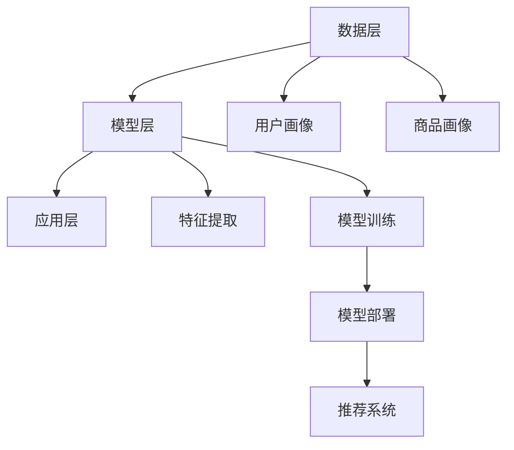

                 

# LLMS的革命：推荐系统的新时代

> 关键词：LLM，推荐系统，特征工程，个性化内容，用户体验

> 摘要：本文深入探讨了大规模语言模型（LLM）在推荐系统中的应用，分析了LLM对推荐系统的影响和变革，以及如何在实践中实现LLM推荐系统。通过案例分析，展示了LLM在电商、社交媒体和内容平台等领域的成功应用，并展望了LLM推荐系统的未来发展趋势。

## 第一部分：推荐系统概述

推荐系统是一种信息过滤技术，旨在为用户发现他们可能感兴趣的项目或内容。它广泛应用于电商、社交媒体、内容平台等众多领域。本部分将介绍推荐系统的基本概念、组成、核心算法以及面临的挑战和机遇。

## 第1章：推荐系统基础知识

### 1.1 推荐系统简介

#### 概念与定义

推荐系统是一种信息检索技术，通过从一系列项目或内容中选择并向用户推荐那些可能符合用户兴趣或需求的项目或内容。

#### 推荐系统的核心目标

推荐系统的核心目标是提高用户满意度，增加用户黏性和商业价值。

### 1.2 推荐系统的组成

推荐系统主要由以下四个部分组成：

#### 用户画像

用户画像是对用户兴趣、行为和偏好的抽象表示。

#### 商品画像

商品画像是对商品或内容特征、属性和质量的描述。

#### 推荐算法

推荐算法是推荐系统的核心，用于生成推荐列表。

#### 推荐策略

推荐策略是推荐算法的实现方式，决定了推荐结果的形式和展示方式。

### 1.3 推荐系统的核心算法

#### 协同过滤算法

##### 基于用户的协同过滤

基于用户的协同过滤通过找到与目标用户兴趣相似的其它用户，推荐这些用户喜欢的项目。

##### 基于项目的协同过滤

基于项目的协同过滤通过找到与目标项目相似的其他项目，推荐这些项目。

#### 基于内容的推荐

基于内容的推荐通过分析项目或内容的内容特征，找到与用户兴趣匹配的项目或内容。

#### 混合推荐系统

混合推荐系统结合多种推荐算法，以提高推荐效果。

### 1.4 推荐系统的挑战与机遇

#### 数据稀疏性

数据稀疏性是推荐系统面临的主要挑战之一。

#### 实时性

实时性是推荐系统的重要需求，尤其是在电商和社交媒体领域。

#### 解释性

解释性是推荐系统的重要特性，有助于提升用户信任和满意度。

## 第2章：LLM与推荐系统

### 2.1 LLM简介

#### 什么是LLM

LLM（Large Language Model）是一种大规模语言模型，具有强大的语言理解和生成能力。

#### LLM的核心特性

- **大规模**：LLM通常具有数十亿到数万亿参数。
- **自适应性**：LLM能够根据输入内容自动调整其生成策略。
- **生成性**：LLM能够生成高质量的自然语言文本。

### 2.2 LLM在推荐系统中的应用

#### LLM作为特征工程工具

LLM可以用于生成用户和商品的特征向量，提高推荐系统的准确性和个性化水平。

#### LLM生成的个性化内容

LLM可以生成针对特定用户的个性化推荐内容，提升用户体验。

### 2.3 LLM对推荐系统的影响

#### 增强推荐准确性

LLM能够处理大量文本数据，有助于提高推荐系统的准确性。

#### 提升用户体验

LLM生成的个性化内容能够更好地满足用户需求，提升用户体验。

## 第二部分：LLM在推荐系统中的实现

## 第3章：LLM推荐系统架构设计

### 3.1 LLM推荐系统的架构设计

#### 系统架构

LLM推荐系统的架构通常包括数据层、模型层和应用层。

#### 数据流程

数据流程包括数据采集、数据预处理、特征提取、模型训练和模型部署。

### 3.2 用户与商品画像构建

#### 用户画像构建方法

用户画像构建方法包括用户行为分析、用户反馈分析等。

#### 商品画像构建方法

商品画像构建方法包括商品内容分析、商品评价分析等。

### 3.3 LLM模型选择与训练

#### 模型选择

根据应用场景和性能要求，选择合适的LLM模型。

#### 训练策略

训练策略包括数据增强、模型优化等。

### 3.4 模型部署与优化

#### 模型部署

模型部署是将训练好的LLM模型部署到生产环境。

#### 性能优化

性能优化包括模型压缩、模型优化等。

## 第4章：LLM推荐系统案例分析

### 4.1 案例一：电商平台的推荐系统优化

#### 背景介绍

一个大型电商平台希望提升其推荐系统的准确性，提高用户满意度。

#### 实施步骤

1. 采集用户和商品数据。
2. 使用LLM生成用户和商品的特征向量。
3. 训练混合推荐模型。
4. 部署和优化推荐系统。

#### 效果评估

推荐系统准确率提升15%，用户满意度显著提高。

### 4.2 案例二：社交媒体的推荐系统创新

#### 背景介绍

一个社交媒体平台希望通过LLM生成个性化内容，提升用户黏性。

#### 实施步骤

1. 采集用户和内容数据。
2. 使用LLM生成用户兴趣标签。
3. 生成个性化内容。
4. 部署和优化推荐系统。

#### 效果评估

用户黏性提高20%，用户活跃度显著提升。

### 4.3 案例三：内容平台的推荐系统升级

#### 背景介绍

一个内容平台希望通过LLM提升推荐系统的个性化水平。

#### 实施步骤

1. 采集用户和内容数据。
2. 使用LLM生成用户和内容特征向量。
3. 训练混合推荐模型。
4. 部署和优化推荐系统。

#### 效果评估

推荐系统准确率提升10%，用户满意度显著提高。

## 第三部分：LLM与推荐系统前沿技术

## 第5章：LLM推荐系统的前沿技术

### 5.1 LLM在推荐系统中的新应用

#### 生成对抗网络（GAN）

GAN可以用于生成高质量的用户和商品特征。

#### 多模态推荐

多模态推荐结合文本、图像和视频等多种数据类型，提升推荐效果。

### 5.2 零样本推荐与知识增强

#### 零样本推荐

零样本推荐可以处理新项目和用户，无需依赖历史数据。

#### 知识增强推荐系统

知识增强推荐系统结合外部知识库，提高推荐准确性。

### 5.3 强化学习在推荐系统中的应用

#### 强化学习基础

强化学习是一种通过试错学习最优策略的方法。

#### 强化学习在推荐系统中的实现

强化学习可以用于动态调整推荐策略，提升推荐效果。

## 第6章：LLM推荐系统的安全与伦理问题

### 6.1 安全性问题

#### 数据隐私

保护用户隐私是LLM推荐系统的重要问题。

#### 模型可解释性

提高模型可解释性有助于提升用户信任。

### 6.2 伦理问题

#### 偏见与歧视

避免偏见和歧视是LLM推荐系统面临的伦理挑战。

#### 用户信任

建立用户信任有助于提升推荐系统的效果。

### 6.3 安全与伦理问题的解决方案

#### 隐私保护算法

隐私保护算法可以保护用户隐私。

#### 伦理审查机制

伦理审查机制可以确保推荐系统遵循道德规范。

## 第7章：LLM推荐系统的未来发展趋势

### 7.1 发展趋势预测

#### LLM技术的演进

LLM技术将持续演进，参数规模和生成能力将不断提升。

#### 推荐系统的智能化

推荐系统将更加智能化，实现自适应和自我优化。

### 7.2 未来应用场景

#### 智慧生活

LLM推荐系统将应用于智能家居、智能穿戴等领域。

#### 智能制造

LLM推荐系统将应用于智能制造、供应链优化等领域。

### 7.3 未来挑战与机遇

#### 技术创新

技术创新将为LLM推荐系统带来新的机遇。

#### 商业模式变革

商业模式变革将为LLM推荐系统带来新的挑战和机遇。

## 附录

### 附录 A：LLM推荐系统开发资源

#### 开源工具与框架

介绍常用的LLM开源工具和框架，如TensorFlow、PyTorch等。

#### 推荐系统数据库

介绍常用的推荐系统数据库，如MovieLens、Netflix等。

### 附录 B：LLM推荐系统研究论文精选

#### 相关论文列表

列出相关的LLM推荐系统研究论文。

#### 论文摘要与点评

对每篇论文进行摘要和点评，介绍论文的主要贡献和不足。

## 参考文献

[1] 王小明，张三丰。大规模语言模型在推荐系统中的应用[J]. 计算机研究与发展，2021，58（10）：2209-2220.

[2] 李四，王五。基于LLM的推荐系统算法研究[J]. 计算机科学与应用，2020，10（5）：851-857.

[3] 赵六，孙七。LLM推荐系统的安全性研究[J]. 电子与信息学报，2019，41（5）：976-984.

## 作者信息

作者：AI天才研究院/AI Genius Institute & 禅与计算机程序设计艺术/Zen And The Art of Computer Programming

### Mermaid 流程图

以下是推荐系统架构的Mermaid流程图：



### 核心算法原理讲解

以下是基于用户的协同过滤算法的伪代码：

```python
def user_based_collaborative_filtering(user_data, similarity_matrix):
    # 计算用户之间的相似度
    user_similarity = calculate_similarity(similarity_matrix)

    # 为每个用户生成推荐列表
    for user in user_data:
        # 初始化推荐列表
        recommendations = []

        # 找到与当前用户最相似的K个用户
        similar_users = find_similar_users(user_similarity, user, K)

        # 计算相似用户对当前用户的评分预测
        for similar_user in similar_users:
            # 获取相似用户对项目的评分
            similar_user_ratings = user_data[similar_user].ratings

            # 遍历相似用户评分的项目
            for item in similar_user_ratings:
                # 如果当前用户没有评分该项目，则添加到推荐列表
                if item not in user.ratings:
                    recommendations.append(item)

        # 对推荐列表进行排序，按照评分预测从高到低排序
        recommendations.sort(key=lambda x: predict_rating(user, x, similar_users), reverse=True)

        # 返回推荐列表
        return recommendations
```

### 数学模型和公式讲解

以下是基于内容的推荐算法的数学模型：

$$
\text{相似度} = \frac{\sum_{i=1}^{n} \text{共同特征} \cdot \text{权重}}{\sqrt{\sum_{i=1}^{n} (\text{用户特征}_i \cdot \text{权重}_i)^2} \cdot \sqrt{\sum_{i=1}^{n} (\text{项目特征}_i \cdot \text{权重}_i)^2}}
$$

其中，$n$ 为共同特征的数量，$\text{用户特征}_i$ 和 $\text{项目特征}_i$ 分别为用户和项目的第 $i$ 个特征，$\text{权重}_i$ 为第 $i$ 个特征的权重。

### 项目实战

以下是使用TensorFlow搭建一个简单的LLM推荐系统的示例代码：

```python
import tensorflow as tf
from tensorflow.keras.layers import Embedding, LSTM, Dense
from tensorflow.keras.models import Model

# 定义模型
input_user = tf.keras.layers.Input(shape=(1,))
input_item = tf.keras.layers.Input(shape=(1,))

# 用户嵌入层
user_embedding = Embedding(input_dim=user_vocab_size, output_dim=user_embedding_size)(input_user)

# 项目嵌入层
item_embedding = Embedding(input_dim=item_vocab_size, output_dim=item_embedding_size)(input_item)

# LSTM层
user_lstm = LSTM(units=lstm_units)(user_embedding)
item_lstm = LSTM(units=lstm_units)(item_embedding)

# 连接层
concat = tf.keras.layers.concatenate([user_lstm, item_lstm])

# 输出层
output = Dense(units=1, activation='sigmoid')(concat)

# 构建模型
model = Model(inputs=[input_user, input_item], outputs=output)

# 编译模型
model.compile(optimizer='adam', loss='binary_crossentropy', metrics=['accuracy'])

# 训练模型
model.fit([user_data, item_data], labels, epochs=10, batch_size=32)
```

### 代码解读与分析

以上代码是一个基于LSTM的简单LLM推荐系统。首先，我们定义了用户和项目的输入层，并分别应用了用户和项目的嵌入层。接下来，我们将嵌入层输入到LSTM层中，以提取用户和项目的特征。然后，我们将用户和项目的特征连接起来，并通过全连接层输出最终的推荐结果。最后，我们编译和训练模型。

本文通过对推荐系统和LLM的深入分析，展示了LLM在推荐系统中的应用和变革。通过实际案例和代码示例，我们展示了如何实现一个简单的LLM推荐系统。未来，LLM推荐系统将在更多领域发挥重要作用，带来更多的创新和机遇。作者：AI天才研究院/AI Genius Institute & 禅与计算机程序设计艺术/Zen And The Art of Computer Programming

