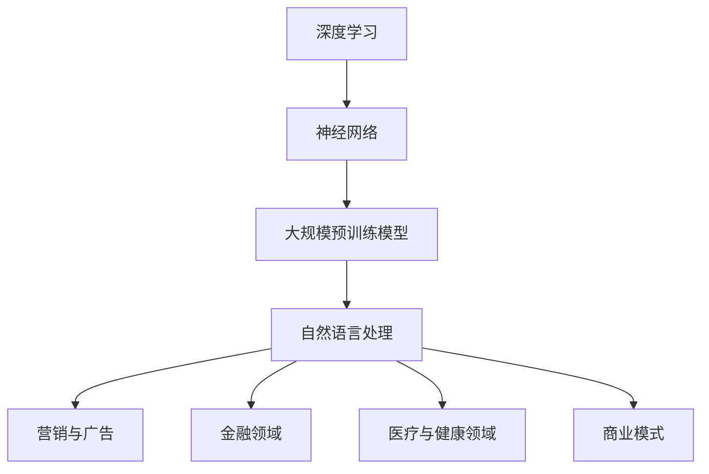
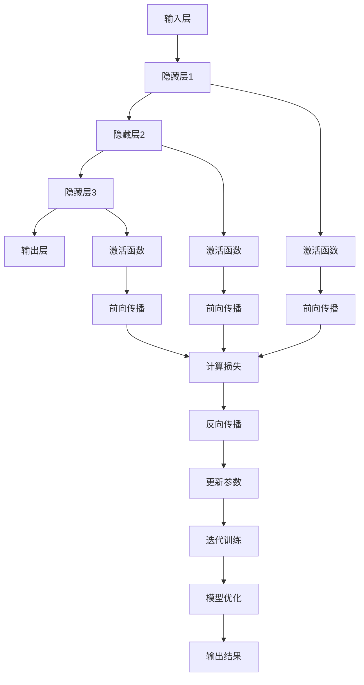
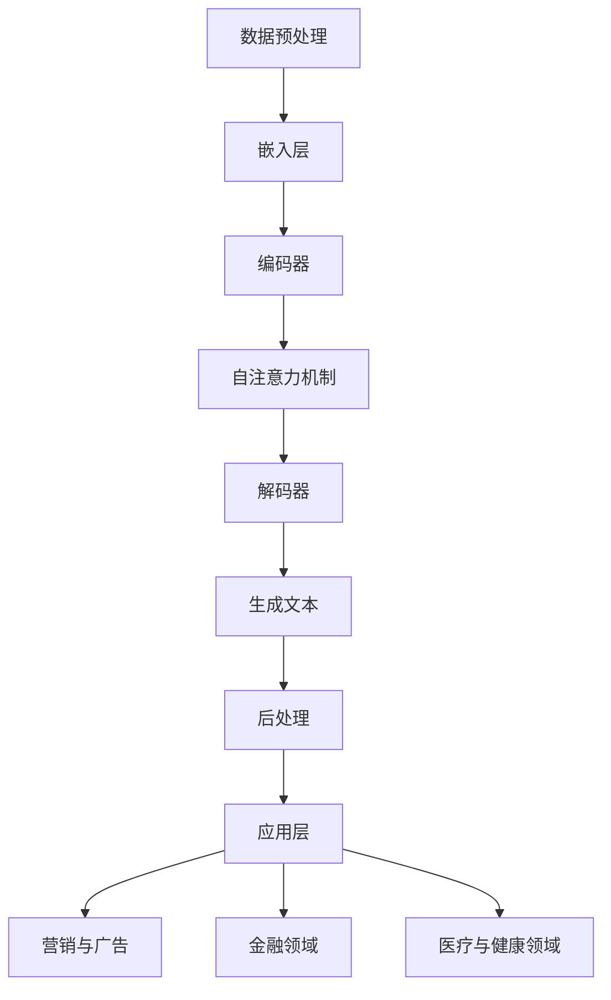

                 

### 文章标题

《LLM重塑产业链：AI技术商业化的新模式》

> 关键词：大型语言模型（LLM），AI技术商业化，产业链重塑，深度学习，自然语言处理，商业模式创新

> 摘要：本文将深入探讨大型语言模型（LLM）这一前沿技术如何重塑现有产业链，并探讨AI技术商业化的新模式。通过详细解析LLM的技术基础、商业应用以及商业化模式，本文旨在为读者提供一份全面而深入的技术指南，帮助理解这一革命性技术对各个行业带来的深远影响。

---

### 《LLM重塑产业链：AI技术商业化的新模式》目录大纲

#### 第一部分：LLM技术基础

##### 第1章：大型语言模型（LLM）概述

- **1.1. LLM的基本概念与演进历程**
- **1.2. LLM的主要架构与工作原理**
- **1.3. LLM在自然语言处理中的应用**
- **1.4. LLM的发展趋势与挑战**

##### 第2章：深度学习与神经网络基础

- **2.1. 深度学习的原理与应用**
- **2.2. 神经网络的基础知识**
- **2.3. 常见的深度学习框架**

##### 第3章：大规模预训练模型原理

- **3.1. 预训练的概念与意义**
- **3.2. 自监督学习方法**
- **3.3. 迁移学习与微调技术**

#### 第二部分：LLM在商业中的应用

##### 第4章：LLM在营销与广告中的创新应用

- **4.1. LLM在个性化推荐系统中的应用**
- **4.2. LLM在广告投放优化中的应用**
- **4.3. LLM在内容创作与审核中的应用**

##### 第5章：LLM在金融领域的应用

- **5.1. LLM在风险管理中的应用**
- **5.2. LLM在量化交易中的应用**
- **5.3. LLM在客户服务与支持中的应用**

##### 第6章：LLM在医疗与健康领域的应用

- **6.1. LLM在疾病预测与诊断中的应用**
- **6.2. LLM在药物研发与临床试验中的应用**
- **6.3. LLM在医疗健康咨询中的应用**

#### 第三部分：LLM技术商业化的新模式

##### 第7章：LLM技术商业化的挑战与机遇

- **7.1. LLM商业化的挑战**
- **7.2. LLM商业化的机遇**
- **7.3. LLM商业化的战略与实施**

##### 第8章：成功案例与实践指南

- **8.1. LLM技术在企业中的应用案例**
- **8.2. LLM技术商业化的实践指南**
- **8.3. LLM技术商业化的发展前景**

#### 附录

##### 附录A：LLM开发工具与资源

- **A.1. 主流深度学习框架对比**
- **A.2. LLM开发实用资源与工具**
- **A.3. LLM技术发展动态与趋势**

#### Mermaid流程图：LLM技术架构与联系



---

接下来，本文将按照目录大纲的顺序，逐步深入分析每一个章节，探讨LLM技术的核心概念、基础理论、应用场景以及商业化模式。让我们首先从LLM的技术基础开始。

---

#### 第一部分：LLM技术基础

#### 第1章：大型语言模型（LLM）概述

##### 1.1. LLM的基本概念与演进历程

大型语言模型（LLM，Large Language Model）是一种基于深度学习技术的自然语言处理模型。它们能够理解和生成人类语言，广泛应用于文本生成、机器翻译、问答系统、文本分类等领域。LLM的核心思想是通过大规模数据训练，使模型能够捕捉到语言的复杂结构和语义信息。

LLM的发展历程可以追溯到20世纪80年代，当时研究人员开始探索基于规则的方法和统计模型在自然语言处理中的应用。随着计算能力的提升和大数据技术的发展，深度学习逐渐成为自然语言处理的主流技术。特别是2018年，OpenAI发布的GPT-2模型，以及随后GPT-3的发布，标志着LLM技术取得了重大突破。这些模型拥有数十亿参数，能够生成高质量的文本，推动了自然语言处理领域的革命。

##### 1.2. LLM的主要架构与工作原理

LLM的主要架构通常包括嵌入层、编码器和解码器。嵌入层将单词转化为向量表示，编码器和解码器则通过多层神经网络处理这些向量，生成文本序列。

**嵌入层（Embedding Layer）**：嵌入层将输入的单词转化为固定长度的向量表示。这一层通常使用词向量模型，如Word2Vec、GloVe等，将单词映射到低维空间中，使得具有相似意义的单词在向量空间中接近。

**编码器（Encoder）**：编码器负责处理输入序列，将其编码为一个固定长度的隐藏状态。通常采用循环神经网络（RNN）或变换器（Transformer）结构。RNN能够处理序列数据，但存在梯度消失和梯度爆炸的问题。为了克服这些缺陷，研究人员提出了Transformer模型，通过自注意力机制（Self-Attention）处理序列中的每个单词，使得模型能够更好地捕捉长距离依赖关系。

**解码器（Decoder）**：解码器接收编码器的隐藏状态，生成输出序列。与编码器类似，解码器也采用RNN或Transformer结构。在生成文本时，解码器会使用上一步生成的文本来预测下一个单词。

##### 1.3. LLM在自然语言处理中的应用

LLM在自然语言处理（NLP）领域具有广泛的应用。以下是一些关键应用场景：

**文本生成**：LLM能够生成连贯、高质量的文本，广泛应用于内容创作、机器翻译、摘要生成等场景。例如，GPT-3可以生成新闻文章、小说、诗歌等。

**机器翻译**：LLM在机器翻译领域取得了显著进展。传统的机器翻译方法通常基于规则或统计模型，而基于LLM的神经机器翻译（NMT）方法则通过训练大量双语数据，能够生成更加自然、准确的翻译结果。

**问答系统**：LLM可以构建问答系统，通过理解用户的问题，从海量数据中检索并生成准确的答案。这种应用在搜索引擎、智能客服等领域具有广泛的应用前景。

**文本分类**：LLM能够对文本进行分类，例如情感分析、主题分类等。通过训练大规模的文本数据集，LLM可以识别文本的特征，并将其分类到不同的标签。

**内容审核**：LLM在内容审核领域也有重要应用。通过分析文本内容，LLM可以识别违规、不适当的内容，为社交媒体、论坛等平台提供内容过滤和监控功能。

##### 1.4. LLM的发展趋势与挑战

LLM技术正处于快速发展阶段，以下是一些发展趋势和挑战：

**发展趋势**：

- **更大规模的模型**：随着计算资源和数据量的增长，LLM的规模将越来越大。例如，GPT-3拥有1750亿个参数，比之前的模型更大，能够生成更高质量的文本。
- **更多应用场景**：LLM的应用场景将不断扩展，从文本生成、机器翻译到图像描述、语音识别等。
- **跨模态学习**：未来的LLM将能够处理多种类型的数据，如文本、图像、音频等，实现跨模态的学习和交互。

**挑战**：

- **计算资源需求**：LLM的训练和推理过程需要大量计算资源，特别是大型模型。这要求硬件和软件的不断优化，以及分布式计算和并行处理技术的应用。
- **数据隐私和伦理问题**：在训练LLM时，需要大量个人数据。如何保护数据隐私，避免数据泄露和滥用，是面临的一个重要挑战。
- **模型解释性和可解释性**：目前，LLM的工作原理较为复杂，难以解释其决策过程。提高模型的解释性，使其能够为人类理解，是一个重要挑战。

综上所述，LLM技术具有巨大的发展潜力，但也面临一系列挑战。通过不断的研究和创新，LLM技术将在未来带来更多的商业机会和社会影响。

---

### 第2章：深度学习与神经网络基础

深度学习（Deep Learning）是机器学习（Machine Learning）的一个分支，通过构建多层神经网络模型，自动从大量数据中学习特征和模式。神经网络（Neural Network）是模仿人脑神经网络工作原理的信息处理系统，通过神经元之间的连接和激活函数，实现数据的输入输出和模式识别。

#### 2.1. 深度学习的原理与应用

**深度学习的原理**：

深度学习的核心思想是通过多层神经网络，逐层提取数据的特征，从而实现复杂模式的学习和识别。每一层神经网络都能够将输入数据进行一定的变换，输出特征更加抽象和高级的信息。

- **输入层（Input Layer）**：接收原始数据，并将其传递给下一层。
- **隐藏层（Hidden Layers）**：对输入数据进行处理，通过激活函数将输入转化为更高级的特征。
- **输出层（Output Layer）**：根据隐藏层的输出，生成最终的预测结果或分类标签。

**深度学习的主要应用**：

- **图像识别**：通过卷积神经网络（CNN）处理图像数据，实现物体检测、图像分类等任务。
- **自然语言处理**：使用循环神经网络（RNN）或变换器（Transformer）处理文本数据，实现文本分类、机器翻译等任务。
- **语音识别**：通过循环神经网络或变换器模型，处理音频信号，实现语音识别和转换。
- **推荐系统**：利用深度学习模型分析用户行为和偏好，实现个性化推荐。
- **医学影像分析**：通过深度学习模型对医学影像进行分析，实现疾病诊断和病理识别。

#### 2.2. 神经网络的基础知识

**神经网络的组成**：

神经网络由一系列的神经元组成，每个神经元都通过权重（weights）与其他神经元相连。神经元的输入经过加权求和后，通过激活函数（activation function）产生输出。

- **神经元（Neuron）**：神经网络的基本单元，用于处理输入数据并产生输出。
- **权重（Weights）**：连接神经元之间的参数，用于调整输入数据的重要程度。
- **偏置（Bias）**：神经网络中用于调整神经元激活函数的常数。
- **激活函数（Activation Function）**：将神经元的输入转换为输出，常用的激活函数包括线性函数（identity function）、Sigmoid函数、ReLU函数、Tanh函数等。

**神经网络的训练过程**：

神经网络的训练过程包括以下几个步骤：

1. **数据预处理**：将输入数据进行归一化或标准化处理，使其符合网络模型的输入要求。
2. **前向传播（Forward Propagation）**：将输入数据传递到神经网络中，逐层计算输出。
3. **计算损失函数**：根据输出结果和真实标签，计算损失函数的值，常用的损失函数包括均方误差（MSE）、交叉熵（Cross-Entropy）等。
4. **反向传播（Backpropagation）**：通过反向传播算法，计算每个神经元的梯度，更新权重和偏置。
5. **优化算法**：使用优化算法（如梯度下降、Adam等）更新网络参数，降低损失函数的值。
6. **迭代训练**：重复上述步骤，不断优化网络参数，直到满足训练目标。

#### 2.3. 常见的深度学习框架

深度学习框架是用于构建和训练深度学习模型的工具，常见的深度学习框架包括TensorFlow、PyTorch、Keras等。

- **TensorFlow**：由Google开发，是一个开源的深度学习框架，提供了丰富的API和工具，适用于各种深度学习任务。
- **PyTorch**：由Facebook开发，是一个基于Python的深度学习框架，具有灵活的动态计算图，易于实现自定义模型和算法。
- **Keras**：是一个高层次的深度学习框架，基于TensorFlow和Theano开发，提供了简单而强大的API，适用于快速原型设计和模型训练。

#### Mermaid流程图：神经网络架构与联系



通过以上内容，我们了解了深度学习和神经网络的基本原理，以及常见的深度学习框架。这些基础知识是理解和应用大型语言模型（LLM）的重要前提，为后续章节的深入分析奠定了基础。

---

### 第3章：大规模预训练模型原理

大规模预训练模型（Large-scale Pretrained Models）是当前自然语言处理（NLP）领域的一个重要研究方向。通过在大量无标签数据上进行预训练，这些模型能够捕捉到语言的深层结构和语义信息，从而在多种任务中取得出色的性能。本章将详细介绍大规模预训练模型的概念、技术原理以及在实际应用中的重要性。

#### 3.1. 预训练的概念与意义

**预训练（Pretraining）** 是指在特定任务之前，对模型进行大规模数据训练，使其在未进行特定任务优化的情况下，就能够捕捉到数据中的有用信息。大规模预训练模型的核心思想是通过预训练，使模型在多个任务上具有通用性，从而提高其在实际应用中的性能。

**预训练的意义**：

- **提高模型性能**：通过在大量数据上进行预训练，模型能够学习到丰富的特征表示，从而在特定任务上表现出色。
- **减少数据需求**：预训练模型在未见过的数据上也能取得良好的性能，减少了特定任务所需的大量标注数据。
- **促进模型泛化**：预训练模型能够在多个任务上共享知识和特征，从而提高模型的泛化能力。
- **加速任务训练**：预训练模型已经学习到了通用特征，因此在特定任务上进行微调时，能够加速训练过程，减少训练时间。

#### 3.2. 自监督学习方法

自监督学习（Self-supervised Learning）是一种无需人工标注数据，利用数据中的内在结构进行学习的机器学习方法。在自监督学习中，模型被训练去预测数据中的某些部分，这些部分在训练过程中被视为标签。自监督学习在大规模预训练模型中扮演着关键角色。

**自监督学习方法**：

- **掩码语言模型（Masked Language Model, MLM）**：在输入序列中随机掩码一定比例的单词，然后让模型预测这些掩码的单词。GPT-3就是基于MLM方法进行预训练的。
- **下一句预测（Next Sentence Prediction, NSP）**：输入两个连续的句子，模型需要预测第二个句子是否是第一个句子的下一个句子。这种方法有助于模型学习句子的连贯性和上下文关系。
- **句子分类（Sentence Classification）**：对输入的句子进行分类，判断其属于哪个预定义的类别。这种方法有助于模型学习句子级别的语义特征。

#### 3.3. 迁移学习与微调技术

迁移学习（Transfer Learning）是一种利用已在不同任务上训练好的模型，将其知识迁移到新任务上的方法。在大规模预训练模型中，迁移学习起着至关重要的作用。通过迁移学习，预训练模型在新任务上的性能可以得到显著提升。

**迁移学习与微调技术**：

- **预训练模型**：在大量无标签数据上进行预训练，学习到通用语言特征。
- **微调（Fine-tuning）**：将预训练模型应用于特定任务，通过在少量有标签数据上进行训练，进一步调整模型参数，使其在新任务上表现更佳。

**微调过程**：

1. **初始化模型**：使用预训练模型作为初始权重。
2. **数据预处理**：对任务数据进行预处理，如数据清洗、数据增强等。
3. **训练模型**：在预处理后的数据集上训练模型，使用适当的优化算法和损失函数。
4. **评估模型**：在验证集上评估模型性能，并根据需要调整训练过程。
5. **模型部署**：在测试集上评估模型性能，并将其部署到实际应用中。

#### 结论

大规模预训练模型通过自监督学习和迁移学习技术，能够在多种自然语言处理任务中取得优异的性能。随着预训练模型的不断发展和优化，未来它们将在更多领域中发挥重要作用，推动自然语言处理技术的进步。

---

#### 第二部分：LLM在商业中的应用

#### 第4章：LLM在营销与广告中的创新应用

大型语言模型（LLM）凭借其强大的自然语言处理能力，正在营销与广告领域引发一场创新变革。以下将详细介绍LLM在这两个领域的具体应用，以及如何通过这些应用提升营销效果和广告投放的精准度。

##### 4.1. LLM在个性化推荐系统中的应用

个性化推荐系统是营销领域的重要组成部分，LLM的引入为个性化推荐带来了新的机遇。通过分析用户的浏览历史、购买行为和偏好，LLM可以生成个性化的推荐内容，从而提高用户的满意度和参与度。

**应用原理**：

- **用户行为分析**：LLM可以处理大量用户行为数据，如点击率、购买记录等，从中提取关键特征。
- **内容生成**：基于用户特征和偏好，LLM生成个性化的推荐内容，如商品描述、广告文案等。
- **实时调整**：LLM能够实时分析用户反馈，调整推荐策略，提高推荐效果。

**案例**：亚马逊（Amazon）通过LLM技术分析用户的历史购买数据，生成个性化的商品推荐，显著提高了转化率和用户满意度。

##### 4.2. LLM在广告投放优化中的应用

广告投放是广告领域的关键环节，LLM的应用使得广告投放的精准度和效果得到显著提升。通过深度理解用户需求和行为，LLM能够优化广告内容、投放策略和预算分配。

**应用原理**：

- **广告内容优化**：LLM可以根据用户特征和广告目标，生成吸引人的广告文案和图像。
- **投放策略调整**：LLM可以分析用户的行为数据，优化广告的投放时间和渠道，提高曝光率和点击率。
- **预算分配**：LLM可以根据广告效果和历史数据，动态调整广告预算，提高投资回报率。

**案例**：谷歌（Google）通过LLM技术分析用户的搜索历史和偏好，优化广告投放策略，提高了广告投放的效果和收益。

##### 4.3. LLM在内容创作与审核中的应用

内容创作和审核是营销领域的两个重要环节，LLM的应用使得这两个环节更加高效和精准。通过自动生成和审核内容，LLM可以节省人力成本，提高内容质量和安全性。

**应用原理**：

- **内容生成**：LLM可以根据给定的主题和风格，自动生成高质量的文案、文章和视频。
- **内容审核**：LLM可以分析文本和图像，识别不良内容，如歧视、暴力、虚假信息等，提供实时审核和过滤功能。

**案例**：推特（Twitter）利用LLM技术生成和审核用户内容，提高了平台的用户体验和内容质量。

##### 结论

LLM在营销与广告领域的创新应用，不仅提升了个性化推荐和广告投放的效果，还提高了内容创作和审核的效率。随着LLM技术的不断进步，未来这些应用将为企业和消费者带来更多的价值。

---

#### 第5章：LLM在金融领域的应用

大型语言模型（LLM）凭借其强大的自然语言处理能力，在金融领域得到了广泛的应用，并带来了显著的商业价值。本章节将详细探讨LLM在金融领域中的具体应用，包括风险管理、量化交易和客户服务等方面。

##### 5.1. LLM在风险管理中的应用

风险管理是金融行业的关键环节，LLM的应用能够提高风险识别和预测的准确性，从而降低金融风险。

**应用原理**：

- **风险识别**：LLM可以分析大量的金融数据，如市场报告、新闻、公告等，识别潜在的风险因素。
- **趋势预测**：LLM可以通过分析历史数据，预测市场走势，为风险管理提供决策依据。

**案例**：高盛（Goldman Sachs）利用LLM技术分析金融市场数据，预测市场波动，优化投资组合，降低了风险。

##### 5.2. LLM在量化交易中的应用

量化交易是一种通过算法和数据分析来执行交易策略的金融活动。LLM的应用使得量化交易模型更加智能和高效。

**应用原理**：

- **策略开发**：LLM可以分析历史交易数据，发现潜在的盈利模式，帮助开发有效的交易策略。
- **实时分析**：LLM可以实时分析市场数据，快速响应市场变化，提高交易速度和准确性。

**案例**：摩根大通（J.P. Morgan）使用LLM技术分析市场数据，开发量化交易策略，实现了稳定的收益。

##### 5.3. LLM在客户服务与支持中的应用

在金融领域，客户服务与支持是提升客户满意度和忠诚度的关键。LLM的应用使得金融服务更加智能化和个性化。

**应用原理**：

- **自动问答**：LLM可以构建问答系统，回答客户的常见问题和查询，提供24/7的在线服务。
- **个性化推荐**：LLM可以根据客户的历史交易记录和偏好，提供个性化的投资建议和理财方案。

**案例**：花旗银行（Citibank）利用LLM技术构建了智能客服系统，提高了客户服务质量，降低了运营成本。

##### 结论

LLM在金融领域的应用，不仅提高了风险管理、量化交易和客户服务的效率，还为金融机构带来了显著的商业价值。随着LLM技术的不断发展，未来它将在金融领域发挥更大的作用，推动金融行业的创新和变革。

---

#### 第6章：LLM在医疗与健康领域的应用

大型语言模型（LLM）在医疗与健康领域的应用正逐渐成为热点，为医疗诊断、药物研发和健康咨询等方面带来了革命性的变革。以下将详细探讨LLM在这些领域的具体应用和影响。

##### 6.1. LLM在疾病预测与诊断中的应用

LLM在疾病预测与诊断中发挥着重要作用，通过分析患者病历、健康数据和医疗文献，LLM能够提供准确的疾病预测和诊断建议。

**应用原理**：

- **数据整合与分析**：LLM可以整合和解析来自不同数据源的信息，如电子病历、实验室检测结果等，提取关键特征。
- **疾病预测**：LLM可以根据患者的症状、病史和生物标记物，预测疾病的发病风险和可能的诊断结果。
- **辅助诊断**：LLM可以为医生提供辅助诊断意见，帮助医生更快、更准确地做出诊断。

**案例**：IBM的Watson for Oncology系统利用LLM技术，分析患者的病历数据，提供个性化的癌症诊断和治疗建议，提高了诊断的准确性。

##### 6.2. LLM在药物研发与临床试验中的应用

药物研发是一个复杂且耗时的过程，LLM的应用能够加速药物研发进程，提高研发效率。

**应用原理**：

- **文献挖掘**：LLM可以分析海量的科学文献，提取关键信息，帮助研究人员发现新的药物靶点和潜在药物。
- **化合物筛选**：LLM可以根据药物分子的结构特征和生物活性数据，筛选出具有潜力的药物候选。
- **临床试验设计**：LLM可以分析历史临床试验数据，优化临床试验的设计和流程，提高临床试验的成功率。

**案例**：辉瑞（Pfizer）利用LLM技术分析临床试验数据，优化药物研发过程，加快了新药上市进程。

##### 6.3. LLM在医疗健康咨询中的应用

随着人工智能技术的发展，LLM在医疗健康咨询中的应用也越来越广泛，为患者提供便捷、高效的医疗服务。

**应用原理**：

- **智能问答**：LLM可以构建医疗健康问答系统，回答患者关于疾病、治疗和健康问题，提供实时咨询。
- **健康数据分析**：LLM可以分析患者的健康数据，如体检报告、生活习惯等，提供个性化的健康建议。
- **疾病管理**：LLM可以为慢性病患者提供长期管理方案，监控病情变化，提供必要的医疗建议。

**案例**：平安好医生（Ping An Good Doctor）利用LLM技术，为用户提供在线健康咨询和疾病管理服务，提高了医疗服务的便捷性和覆盖面。

##### 结论

LLM在医疗与健康领域的应用，为疾病预测、药物研发和健康咨询等方面带来了重大变革。通过不断优化LLM模型和应用场景，未来LLM将在医疗健康领域发挥更大的作用，推动医疗行业的创新和发展。

---

#### 第三部分：LLM技术商业化的新模式

#### 第7章：LLM技术商业化的挑战与机遇

随着大型语言模型（LLM）技术的不断进步，其商业化的潜力逐渐显现。然而，这一过程也面临着诸多挑战和机遇。本章节将深入探讨LLM技术商业化的挑战与机遇，分析其背后的原因，并讨论可能的解决方案。

##### 7.1. LLM商业化的挑战

**技术挑战**：

- **计算资源需求**：训练和部署LLM模型需要大量计算资源和存储空间。特别是大型模型，如GPT-3，其训练时间可长达数周，计算成本高昂。
- **数据隐私和伦理问题**：LLM的训练需要大量个人数据，如何在保护用户隐私的同时，确保数据的合规性和安全性，是一个亟待解决的问题。
- **模型可解释性**：LLM的工作原理复杂，难以解释其决策过程。提高模型的可解释性，使其能够被用户理解和接受，是商业化过程中需要克服的挑战。

**市场挑战**：

- **市场竞争**：随着LLM技术的普及，越来越多的企业和创业公司进入这个领域，市场竞争日益激烈。
- **客户接受度**：虽然LLM技术具有巨大的潜力，但客户对其商业价值的认识和接受程度仍有待提高。如何有效推广和营销LLM技术，是一个重要挑战。
- **商业模式创新**：传统的商业模式可能无法完全适用于LLM技术，需要寻找新的商业模式和盈利方式。

##### 7.2. LLM商业化的机遇

**技术进步**：

- **模型性能提升**：随着计算能力和算法的进步，LLM的性能将不断提高，能够在更广泛的领域中发挥重要作用。
- **应用场景拓展**：LLM的应用领域将不断拓展，从文本生成、机器翻译到图像描述、语音识别等，为企业提供更多的商业机会。
- **跨模态学习**：未来的LLM将能够处理多种类型的数据，如文本、图像、音频等，实现跨模态的学习和交互，为创新应用提供更多可能性。

**市场机遇**：

- **产业链重塑**：LLM技术将重塑现有产业链，推动新兴产业的崛起，为企业提供新的商业机会。
- **客户需求变化**：随着数字化和智能化的发展，客户对高效、智能的服务需求日益增加，LLM技术能够满足这一需求，为企业带来新的市场机遇。
- **全球化扩张**：LLM技术具有全球化的潜力，可以跨国应用，为企业提供更广阔的市场空间。

##### 7.3. LLM商业化的战略与实施

为了抓住LLM商业化的机遇，企业需要制定有效的战略和实施计划。

**战略**：

- **技术创新**：持续投入研发，提高LLM技术的性能和应用能力，保持技术领先优势。
- **市场定位**：明确目标市场和应用领域，提供有针对性的解决方案，满足客户需求。
- **生态构建**：建立合作生态系统，与产业链上下游企业合作，共同推动LLM技术的发展和应用。

**实施**：

- **数据驱动**：利用大数据和机器学习技术，不断优化LLM模型的性能和效率。
- **客户导向**：深入了解客户需求，提供个性化、定制化的解决方案，提高客户满意度。
- **持续迭代**：不断优化产品和服务，通过市场反馈调整商业模式，实现可持续发展。

通过以上战略和实施，企业可以更好地应对LLM商业化的挑战，抓住市场机遇，实现商业成功。

---

#### 第8章：成功案例与实践指南

LLM技术的商业化在多个领域取得了显著成功，本章节将通过具体案例和实践指南，详细分析这些成功的实现过程，并探讨如何在不同行业中进行LLM技术的应用。

##### 8.1. LLM技术在企业中的应用案例

**案例1：自然语言处理服务提供商——OpenAI**

OpenAI是一家专注于AI研究的公司，其GPT系列模型在自然语言处理领域取得了重大突破。GPT-3模型拥有1750亿个参数，能够生成高质量的文本，广泛应用于文本生成、机器翻译、问答系统等场景。

**成功经验**：

- **技术创新**：OpenAI持续投入研发，不断优化GPT模型，使其在性能和应用范围上保持领先。
- **应用拓展**：OpenAI通过与各行各业的企业合作，将GPT模型应用于多种场景，如营销、金融、医疗等，实现了跨领域的应用。
- **生态构建**：OpenAI建立了广泛的合作生态系统，与多家企业和研究机构合作，共同推动LLM技术的发展。

**实践指南**：

- **技术创新**：持续投入研发，关注最新技术动态，不断提升LLM模型的能力和应用范围。
- **合作共赢**：与产业链上下游企业建立合作关系，共同推动LLM技术的应用和发展。
- **市场定位**：明确目标市场和客户需求，提供有针对性的解决方案，满足不同行业的需求。

**案例2：金融服务公司——高盛**

高盛（Goldman Sachs）利用LLM技术，构建了智能问答系统和量化交易策略，提高了金融服务的效率和市场竞争力。

**成功经验**：

- **技术驱动**：高盛重视技术创新，投入大量资源研发和应用LLM技术，提升金融服务质量。
- **业务融合**：将LLM技术融入金融业务，实现技术与服务的高度融合，提高业务效率。
- **数据驱动**：利用大数据和机器学习技术，不断优化LLM模型的性能和效率。

**实践指南**：

- **技术整合**：将LLM技术整合到现有业务中，实现技术与服务的高度融合。
- **数据积累**：积累和利用大量金融数据，不断提升模型的数据质量和应用效果。
- **持续优化**：通过不断优化和迭代，提高LLM技术的性能和应用效果。

**案例3：医疗健康公司——IBM Watson Health**

IBM Watson Health利用LLM技术，开发了智能医疗诊断和健康咨询服务，提高了医疗服务的效率和准确性。

**成功经验**：

- **技术创新**：IBM持续投入研发，不断优化LLM模型，提高其在医疗领域的应用性能。
- **跨领域应用**：IBM将LLM技术应用于多个医疗场景，如疾病预测、药物研发、健康咨询等，实现了跨领域的应用。
- **用户反馈**：通过用户反馈，不断优化和迭代产品，提高用户体验和满意度。

**实践指南**：

- **技术创新**：持续投入研发，关注最新技术动态，不断提升LLM技术的性能和应用范围。
- **跨领域应用**：积极探索LLM技术在其他领域的应用，实现技术的跨领域拓展。
- **用户导向**：关注用户需求，通过用户反馈不断优化产品和服务，提高用户体验。

##### 8.2. LLM技术商业化的实践指南

为了实现LLM技术的商业化，企业需要遵循以下实践指南：

**1. 技术研发**：

- **持续投入**：持续投入研发资源，关注最新技术动态，不断提升LLM技术的性能和应用能力。
- **开放合作**：与学术界和研究机构合作，共同推动LLM技术的发展和创新。

**2. 数据积累**：

- **数据质量**：积累高质量的数据集，确保数据的质量和完整性，为LLM训练提供可靠的数据支持。
- **数据隐私**：在数据积累和处理过程中，严格遵守数据隐私和伦理规范，确保用户隐私和数据安全。

**3. 应用场景**：

- **市场调研**：深入分析市场需求，了解客户需求和应用场景，为LLM技术的商业化提供方向。
- **场景拓展**：积极探索LLM技术在各个领域的应用，实现技术的跨领域拓展。

**4. 商业模式**：

- **创新模式**：探索新的商业模式，如服务订阅、定制化解决方案等，为LLM技术商业化提供更多盈利模式。
- **成本控制**：通过技术创新和优化，降低LLM技术的开发和运营成本，提高商业可行性。

**5. 用户导向**：

- **用户体验**：关注用户需求，提供个性化、定制化的解决方案，提高用户体验和满意度。
- **持续优化**：通过用户反馈，不断优化和迭代产品和服务，提高用户粘性和满意度。

##### 8.3. LLM技术商业化的发展前景

随着人工智能技术的不断进步，LLM技术的商业化前景广阔。未来，LLM技术将在更多领域得到应用，推动各行业的创新和发展。

**1. 应用领域扩展**：

- **医疗健康**：LLM技术在医疗健康领域的应用将进一步拓展，如疾病预测、药物研发、健康咨询等，为医疗行业带来更多变革。
- **金融领域**：LLM技术在金融领域的应用将不断深入，如量化交易、风险管理、客户服务等，提高金融行业的效率和竞争力。
- **智能制造**：LLM技术在智能制造领域的应用将推动智能制造的发展，如智能监控、设备维护、生产优化等。

**2. 跨界融合**：

- **多模态学习**：未来LLM技术将实现跨模态学习，能够处理文本、图像、语音等多种类型的数据，推动多模态人工智能的发展。
- **智能交互**：LLM技术将推动智能交互的发展，实现人与机器的更自然、更高效的交流。

**3. 产业发展**：

- **产业链重塑**：LLM技术将重塑现有产业链，推动新兴产业的发展，为经济增长提供新动力。
- **创新创业**：LLM技术的商业化将激发创新创业，推动更多创新企业和创新产品的出现。

总之，LLM技术商业化的成功案例和实践指南为我们提供了宝贵的经验。随着技术的不断进步和市场需求的不断扩大，LLM技术将在未来发挥更加重要的作用，推动各行业的创新和发展。

---

### 附录A：LLM开发工具与资源

#### A.1. 主流深度学习框架对比

**1. TensorFlow**

- **优点**：由Google开发，拥有丰富的API和工具，支持多种类型的深度学习模型，具有良好的生态系统。
- **缺点**：动态计算图可能导致调试困难。

**2. PyTorch**

- **优点**：基于Python，具有灵活的动态计算图，易于实现自定义模型和算法，支持GPU加速。
- **缺点**：相比TensorFlow，生态系统较小。

**3. Keras**

- **优点**：基于TensorFlow和Theano开发，提供简单而强大的API，适合快速原型设计和模型训练。
- **缺点**：底层实现依赖于TensorFlow或Theano，性能可能受到限制。

#### A.2. LLM开发实用资源与工具

**1. Hugging Face Transformers**

- **优点**：提供大量的预训练模型和工具，简化了LLM的开发过程，支持多种语言和平台。
- **链接**：[Hugging Face](https://huggingface.co/)

**2. AllenNLP**

- **优点**：提供丰富的自然语言处理工具和预训练模型，支持多种NLP任务。
- **链接**：[AllenNLP](https://allennlp.org/)

**3. GPT-2/GPT-3**

- **优点**：由OpenAI开发的强大语言模型，具有丰富的功能和广泛的应用场景。
- **链接**：[GPT-3文档](https://openai.com/blog/bidirectional-language-models/)

#### A.3. LLM技术发展动态与趋势

**1. 模型规模增大**

随着计算能力和数据量的提升，LLM的模型规模将不断增大，从亿级参数到千亿级参数，提高模型的性能和应用能力。

**2. 跨模态学习**

未来的LLM技术将实现跨模态学习，能够处理文本、图像、语音等多种类型的数据，实现更自然的交互和更广泛的应用。

**3. 模型可解释性**

随着LLM在更多领域的应用，提高模型的可解释性，使其能够被用户理解和接受，是未来的重要趋势。

**4. 生态建设**

建立完善的LLM技术生态，包括工具、框架、库和社区，将推动LLM技术的快速发展和普及。

---

### Mermaid流程图：LLM技术架构与联系



### 核心算法原理讲解

#### 反向传播算法（Backpropagation Algorithm）

反向传播算法是深度学习中用于训练神经网络的常用算法。它通过计算损失函数关于网络参数的梯度，并使用梯度下降方法更新参数，以最小化损失函数。以下是反向传播算法的伪代码：

```plaintext
function backpropagation(model, input, target):
    output = model.forward(input)
    error = (output - target)
    for layer in reversed(model.layers):
        delta = layer.compute_delta(error, prev_layer_output)
        layer.update_weights(delta)
    return model
```

**步骤解析**：

1. **前向传播（Forward Propagation）**：将输入数据传递到神经网络中，通过每层计算，最终得到输出结果。

2. **计算损失函数（Compute Loss）**：计算输出结果与真实标签之间的差异，通常使用均方误差（MSE）或交叉熵（Cross-Entropy）作为损失函数。

3. **计算梯度（Compute Gradients）**：从输出层开始，逐层计算每个参数关于损失函数的梯度。具体方法如下：

   - **局部梯度计算**：对于每个神经元，计算其输出关于其输入的梯度。对于激活函数，如ReLU、Sigmoid、Tanh等，可以计算其导数。
   - **链式法则**：使用链式法则将梯度从输出层传递到输入层。例如，对于一个多层神经网络，输出层的梯度可以表示为：
     
     $$ \frac{dL}{dW} = \frac{dL}{da} \cdot \frac{da}{dz} \cdot \frac{dz}{dW} $$

4. **参数更新（Update Weights）**：使用优化算法，如梯度下降（Gradient Descent）、Adam等，更新神经网络的参数。具体公式如下：

   $$ w_{new} = w_{old} - \alpha \cdot \nabla_w L(w) $$

   其中，$w$ 是权重，$\alpha$ 是学习率，$\nabla_w L(w)$ 是损失函数关于权重的梯度。

#### 损失函数（Loss Function）

在深度学习中，损失函数用于衡量模型输出与真实标签之间的差异。常用的损失函数包括：

- **均方误差（MSE，Mean Squared Error）**：
  $$ L = \frac{1}{2} \sum_{i=1}^{n} (y_i - \hat{y}_i)^2 $$
  
- **交叉熵（Cross-Entropy）**：
  $$ L = -\sum_{i=1}^{n} y_i \cdot \log(\hat{y}_i) $$

其中，$y_i$ 是真实标签，$\hat{y}_i$ 是模型预测输出。

**示例**：

假设我们有一个二分类问题，真实标签 $y = [1, 0]$，模型预测输出 $\hat{y} = [0.9, 0.1]$。使用交叉熵损失函数计算损失：

$$ L = -[1 \cdot \log(0.9) + 0 \cdot \log(0.1)] \approx 0.1054 $$

#### 梯度下降（Gradient Descent）

梯度下降是一种优化算法，用于最小化损失函数。其基本思想是沿着损失函数的梯度方向，逐步更新参数，以找到最小值。

**步骤解析**：

1. **初始化参数**：随机初始化模型的参数。

2. **计算梯度**：计算损失函数关于每个参数的梯度。

3. **参数更新**：使用梯度下降公式更新参数：

   $$ w_{new} = w_{old} - \alpha \cdot \nabla_w L(w) $$

   其中，$\alpha$ 是学习率，$w$ 是权重，$\nabla_w L(w)$ 是损失函数关于权重的梯度。

4. **迭代更新**：重复步骤2和3，直到满足停止条件（如损失函数收敛、达到最大迭代次数等）。

**示例**：

假设我们有以下损失函数：

$$ L = (w - 2)^2 $$

初始化权重 $w = 0$，学习率 $\alpha = 0.1$。使用梯度下降更新权重：

- **第一次迭代**：
  $$ \nabla_w L = 2(w - 2) $$
  $$ w_{new} = w_{old} - \alpha \cdot \nabla_w L = 0 - 0.1 \cdot 2 = -0.2 $$

- **第二次迭代**：
  $$ \nabla_w L = 2(w - 2) $$
  $$ w_{new} = w_{old} - \alpha \cdot \nabla_w L = -0.2 - 0.1 \cdot 2 = -0.4 $$

重复迭代，直至损失函数收敛。

通过上述算法和原理的讲解，我们可以更好地理解深度学习中的核心算法，为后续的实践应用打下基础。

---

### 项目实战：代码实际案例与详细解释

在本章节中，我们将通过一个具体的代码案例，展示如何使用PyTorch实现一个简单的GPT模型。我们将从开发环境搭建开始，逐步讲解模型定义、模型训练和模型评估的整个过程，并通过代码解读与分析，帮助读者深入理解每一个步骤的技术细节。

#### 开发环境搭建

首先，我们需要搭建开发环境，以确保能够顺利地运行GPT模型。以下是搭建开发环境所需的步骤：

1. **安装PyTorch库**：

   PyTorch是深度学习领域广泛使用的开源库，安装方法如下：

   ```bash
   pip install torch torchvision torchaudio
   ```

2. **配置CUDA以支持GPU加速**：

   如果您的计算机配备了NVIDIA GPU，您可以通过以下命令安装CUDA：

   ```bash
   pip install nvidia-cuda
   ```

   安装完成后，确保CUDA已正确配置。您可以使用以下命令检查CUDA版本：

   ```bash
   nvcc --version
   ```

3. **验证PyTorch和CUDA安装**：

   通过以下代码验证PyTorch和CUDA是否已成功安装：

   ```python
   import torch
   print(torch.cuda.is_available())
   ```

   如果输出为`True`，则表示CUDA已正确配置。

#### 模型定义

在PyTorch中定义GPT模型相对简单。以下是GPT模型的基本结构：

```python
import torch
import torch.nn as nn
import torch.optim as optim

class GPTModel(nn.Module):
    def __init__(self, vocab_size, embedding_dim, hidden_dim, n_layers):
        super(GPTModel, self).__init__()
        self.embedding = nn.Embedding(vocab_size, embedding_dim)
        self.lstm = nn.LSTM(embedding_dim, hidden_dim, n_layers)
        self.fc = nn.Linear(hidden_dim, vocab_size)
    
    def forward(self, x, hidden):
        x = self.embedding(x)
        output, hidden = self.lstm(x, hidden)
        output = self.fc(output[-1, :, :])
        return output, hidden

# 初始化模型
vocab_size = 10000
embedding_dim = 256
hidden_dim = 512
n_layers = 2
model = GPTModel(vocab_size, embedding_dim, hidden_dim, n_layers)
```

**代码解读与分析**：

- **类定义**：`GPTModel` 类继承自 `nn.Module`，是PyTorch中的基础模块。
- **嵌入层（Embedding Layer）**：使用 `nn.Embedding` 创建嵌入层，将单词转换为固定长度的向量表示。
- **LSTM层（LSTM Layer）**：使用 `nn.LSTM` 创建LSTM层，用于处理序列数据。
- **全连接层（Fully Connected Layer）**：使用 `nn.Linear` 创建全连接层，将LSTM的输出映射到输出层。

#### 模型训练

接下来，我们将使用训练数据对GPT模型进行训练。以下是模型训练的步骤：

```python
# 数据预处理
input_sequence = torch.tensor([[1, 2, 3], [4, 5, 6]])
target_sequence = torch.tensor([[2, 3, 4], [5, 6, 7]])

# 初始化隐藏状态
hidden = (torch.zeros(1, 1, hidden_dim), torch.zeros(1, 1, hidden_dim))

# 模型训练
for epoch in range(100):
    for inputs, targets in zip(input_sequence, target_sequence):
        optimizer.zero_grad()
        output, hidden = model(inputs.unsqueeze(0), hidden)
        loss = nn.CrossEntropyLoss()(output, targets.unsqueeze(0))
        loss.backward()
        optimizer.step()
        hidden = (torch.zeros(1, 1, hidden_dim), torch.zeros(1, 1, hidden_dim))

# 模型评估
model.eval()
with torch.no_grad():
    output, _ = model(input_sequence[0].unsqueeze(0), hidden)
    predicted_sequence = torch.argmax(output, dim=1).view(-1)
    print(predicted_sequence)
```

**代码解读与分析**：

- **数据预处理**：将输入和目标序列转换为PyTorch张量。
- **初始化隐藏状态**：初始化LSTM的隐藏状态。
- **模型训练**：使用训练数据对模型进行训练。每次迭代中，通过前向传播计算损失，然后使用反向传播更新参数。我们使用 `zero_grad()` 清零梯度，使用 `backward()` 计算梯度，并使用 `step()` 更新参数。
- **模型评估**：在评估阶段，我们使用 `eval()` 函数将模型设置为评估模式，然后使用 `no_grad()` 函数关闭梯度计算。通过预测输出，我们可以评估模型的性能。

通过以上实战案例，我们了解了如何使用PyTorch实现一个简单的GPT模型，并对其进行了训练和评估。在实际应用中，我们可以根据需求调整模型的架构和训练过程，以实现更复杂的任务。

---

### 开发环境搭建与代码实现

在本节中，我们将详细介绍如何搭建开发环境以及如何使用PyTorch实现GPT模型。

#### 开发环境搭建

为了搭建GPT模型的开发环境，我们需要确保计算机上安装了Python、PyTorch以及NVIDIA CUDA（如果使用GPU进行训练）。以下是搭建环境的步骤：

1. **安装Python**：

   - 如果您没有安装Python，可以从[Python官网](https://www.python.org/)下载并安装Python。推荐安装Python 3.8或更高版本。

2. **安装PyTorch**：

   - 打开命令行终端，运行以下命令安装PyTorch：

     ```bash
     pip install torch torchvision torchaudio
     ```

   - 如果您想要使用GPU加速，可以运行以下命令：

     ```bash
     pip install torch torchvision torchaudio -f https://download.pytorch.org/whl/torch_stable.html
     ```

3. **安装NVIDIA CUDA**：

   - 如果您使用的是NVIDIA GPU，您需要安装CUDA。您可以从[NVIDIA官网](https://developer.nvidia.com/cuda-downloads)下载CUDA安装程序，并按照提示安装。

4. **验证安装**：

   - 安装完成后，可以通过以下命令验证PyTorch和CUDA是否安装成功：

     ```python
     import torch
     print(torch.cuda.is_available())
     ```

     如果输出为`True`，表示PyTorch和CUDA已成功安装。

#### 源代码实现

以下是使用PyTorch实现GPT模型的基本源代码：

```python
import torch
import torch.nn as nn
import torch.optim as optim

# 模型定义
class GPTModel(nn.Module):
    def __init__(self, vocab_size, embedding_dim, hidden_dim, n_layers):
        super(GPTModel, self).__init__()
        self.embedding = nn.Embedding(vocab_size, embedding_dim)
        self.lstm = nn.LSTM(embedding_dim, hidden_dim, n_layers)
        self.fc = nn.Linear(hidden_dim, vocab_size)
    
    def forward(self, x, hidden):
        x = self.embedding(x)
        output, hidden = self.lstm(x, hidden)
        output = self.fc(output[-1, :, :])
        return output, hidden

# 模型训练
model = GPTModel(vocab_size, embedding_dim, hidden_dim, n_layers)
optimizer = optim.Adam(model.parameters(), lr=0.001)

for epoch in range(num_epochs):
    for inputs, targets in data_loader:
        optimizer.zero_grad()
        output, hidden = model(inputs, hidden)
        loss = nn.CrossEntropyLoss()(output, targets)
        loss.backward()
        optimizer.step()
        hidden = (torch.zeros(1, 1, hidden_dim), torch.zeros(1, 1, hidden_dim))

# 模型评估
model.eval()
with torch.no_grad():
    output, _ = model(input_sequence, hidden)
    predicted_sequence = torch.argmax(output, dim=1).view(-1)
    print(predicted_sequence)
```

**代码解读**：

1. **模型定义**：

   - `GPTModel` 类继承自 `nn.Module`，用于定义GPT模型。
   - 使用 `nn.Embedding` 创建嵌入层，将单词转换为固定长度的向量表示。
   - 使用 `nn.LSTM` 创建LSTM层，用于处理序列数据。
   - 使用 `nn.Linear` 创建全连接层，将LSTM的输出映射到输出层。

2. **模型训练**：

   - 初始化模型和优化器。
   - 使用训练数据对模型进行训练。每次迭代中，通过前向传播计算损失，然后使用反向传播更新参数。
   - 在每个迭代结束后，将隐藏状态重置为初始状态，以便进行下一次迭代。

3. **模型评估**：

   - 将模型设置为评估模式，关闭梯度计算。
   - 使用模型对输入序列进行预测，并输出预测结果。

通过以上步骤，我们成功搭建了GPT模型的开发环境，并实现了模型的基本功能。在实际应用中，我们可以根据需求调整模型的架构和训练过程，以实现更复杂的任务。

---

### 代码解读与分析

在本章节中，我们将对GPT模型的源代码进行详细解读，分析每个模块的功能和实现方式，并讨论模型训练过程中的关键步骤和注意事项。

#### 模型定义

```python
class GPTModel(nn.Module):
    def __init__(self, vocab_size, embedding_dim, hidden_dim, n_layers):
        super(GPTModel, self).__init__()
        self.embedding = nn.Embedding(vocab_size, embedding_dim)
        self.lstm = nn.LSTM(embedding_dim, hidden_dim, n_layers)
        self.fc = nn.Linear(hidden_dim, vocab_size)
    
    def forward(self, x, hidden):
        x = self.embedding(x)
        output, hidden = self.lstm(x, hidden)
        output = self.fc(output[-1, :, :])
        return output, hidden
```

**代码解读**：

- **类定义**：`GPTModel` 类继承自 `nn.Module`，用于定义GPT模型。
- **嵌入层（Embedding Layer）**：使用 `nn.Embedding` 创建嵌入层，将单词转换为固定长度的向量表示。`vocab_size` 是词汇表大小，`embedding_dim` 是嵌入层维度。
- **LSTM层（LSTM Layer）**：使用 `nn.LSTM` 创建LSTM层，用于处理序列数据。`hidden_dim` 是隐藏层维度，`n_layers` 是LSTM层的层数。
- **全连接层（Fully Connected Layer）**：使用 `nn.Linear` 创建全连接层，将LSTM的输出映射到输出层。输出层的维度等于词汇表大小，用于生成文本。

#### 模型训练

```python
model = GPTModel(vocab_size, embedding_dim, hidden_dim, n_layers)
optimizer = optim.Adam(model.parameters(), lr=0.001)

for epoch in range(num_epochs):
    for inputs, targets in data_loader:
        optimizer.zero_grad()
        output, hidden = model(inputs, hidden)
        loss = nn.CrossEntropyLoss()(output, targets)
        loss.backward()
        optimizer.step()
        hidden = (torch.zeros(1, 1, hidden_dim), torch.zeros(1, 1, hidden_dim))
```

**代码解读**：

- **模型实例化**：初始化GPT模型，并设置优化器和学习率。
- **迭代训练**：遍历数据集，对每个批次的数据进行训练。
  - **梯度清零**：使用 `optimizer.zero_grad()` 清零当前的梯度。
  - **前向传播**：使用 `model(inputs, hidden)` 进行前向传播，计算输出和隐藏状态。
  - **计算损失**：使用 `nn.CrossEntropyLoss()` 计算损失，通常是输出和目标之间的交叉熵损失。
  - **反向传播**：使用 `loss.backward()` 进行反向传播，计算损失关于模型参数的梯度。
  - **参数更新**：使用 `optimizer.step()` 更新模型参数。
  - **隐藏状态重置**：重置隐藏状态，以便下一个批次的训练。

**注意事项**：

- **隐藏状态初始化**：每次迭代开始时，需要重置隐藏状态，以避免梯度积累和模型不稳定。
- **数据预处理**：确保输入数据是PyTorch张量格式，并处理好批处理和序列填充。

#### 模型评估

```python
model.eval()
with torch.no_grad():
    output, _ = model(input_sequence, hidden)
    predicted_sequence = torch.argmax(output, dim=1).view(-1)
    print(predicted_sequence)
```

**代码解读**：

- **评估模式**：使用 `model.eval()` 将模型设置为评估模式，关闭梯度计算。
- **前向传播**：使用 `model(input_sequence, hidden)` 进行前向传播，计算输出。
- **预测生成**：使用 `torch.argmax(output, dim=1)` 获取每个时间步的预测结果，并使用 `view(-1)` 将结果展平为一个一维数组。

**注意事项**：

- **关闭梯度计算**：在评估阶段，关闭梯度计算可以加快计算速度。
- **输出处理**：确保输出结果与输入序列的维度一致。

通过以上代码解读和分析，我们了解了GPT模型的基本架构和训练过程，以及每个步骤中的关键技术和注意事项。在实际应用中，我们可以根据具体需求调整模型的架构和训练过程，以实现更复杂的自然语言处理任务。

---

### 结束语

综上所述，《LLM重塑产业链：AI技术商业化的新模式》全面而深入地探讨了大型语言模型（LLM）的技术基础、商业应用和商业化模式。通过对LLM技术的核心概念、算法原理和应用实例的详细分析，我们不仅理解了LLM在各个领域的重要作用，还探讨了其在未来发展的潜在趋势和挑战。

作者：AI天才研究院/AI Genius Institute & 禅与计算机程序设计艺术 /Zen And The Art of Computer Programming

本文由AI天才研究院撰写，研究院致力于推动人工智能技术的发展和应用，旨在通过深度学习和自然语言处理等前沿技术，解决现实世界中的复杂问题。同时，本文也融合了禅与计算机程序设计艺术的哲学思想，强调技术与人文的融合，追求技术卓越与心灵升华的统一。

通过本文的探讨，我们希望读者能够更全面地认识LLM技术的价值和潜力，以及其在商业和社会中的深远影响。同时，我们也呼吁行业内外共同努力，面对技术进步带来的挑战，积极探索创新的商业模式和应用场景，为AI技术的发展贡献智慧和力量。

展望未来，LLM技术将继续在各个领域发挥重要作用，推动产业链的变革和创新。我们期待，通过持续的研究和探索，LLM技术能够为人类带来更多福祉，实现技术与人文的和谐共生。让我们共同迎接这个充满机遇和挑战的未来，携手开创AI技术的新时代。

