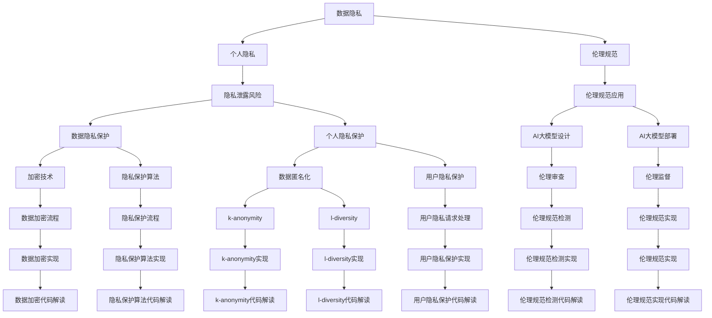

                 

## 文章标题

《LLM隐私伦理:AI安全性挑战》

## 关键词

- 大语言模型（Large Language Models, LLM）
- 隐私伦理（Privacy Ethics）
- AI安全性（AI Security）
- 数据隐私保护（Data Privacy Protection）
- 伦理规范（Ethical Norms）

## 摘要

本文深入探讨了大型语言模型（LLM）在隐私伦理和AI安全性方面所面临的挑战。随着人工智能技术的快速发展，LLM的应用日益广泛，其背后的数据隐私问题和伦理规范成为不可忽视的关键议题。本文首先回顾了AI大模型的发展历程及其隐私伦理背景，随后详细解析了数据隐私、个人隐私和伦理规范这三个核心概念，并通过Mermaid流程图展示了其相互关系和应用流程。接着，文章介绍了数据隐私保护算法和个人隐私保护算法的原理，并使用伪代码和数学公式进行了详细讲解。随后，通过一个实际项目案例，本文展示了如何在开发环境中实施数据隐私保护和伦理规范应用。最后，文章总结了主要研究成果，并展望了AI大模型隐私伦理的未来发展趋势。本文旨在为业界提供有价值的参考，推动AI技术的安全、合规发展。

### 目录大纲

## 《LLM隐私伦理:AI安全性挑战》目录大纲

## 第一部分：引论

### 1. AI大模型及其隐私伦理背景

#### 1.1 AI大模型的发展历程

- AI大模型的历史背景
- AI大模型的技术发展

#### 1.2 隐私伦理与AI大模型的关联

- 隐私伦理的定义
- AI大模型在隐私伦理问题中的挑战

#### 1.3 本书的研究目标与内容安排

- 研究目标
- 主要内容安排

## 第二部分：AI大模型隐私伦理核心概念与联系

### 2. AI大模型隐私伦理核心概念解析

#### 2.1 数据隐私

##### 2.1.1 数据隐私的定义

- 数据隐私的概念
- 数据隐私的重要性

##### 2.1.2 数据隐私泄露风险

- 数据隐私泄露的原因
- 数据隐私泄露的后果

##### 2.1.3 数据隐私保护措施

- 加密技术
- 隐私保护算法

#### 2.2 个人隐私

##### 2.2.1 个人隐私的定义

- 个人隐私的概念
- 个人隐私的属性

##### 2.2.2 个人隐私保护现状

- 个人隐私保护的法律法规
- 个人隐私保护的实践

##### 2.2.3 个人隐私保护挑战

- 技术挑战
- 法律挑战

#### 2.3 伦理规范

##### 2.3.1 伦理规范的定义

- 伦理规范的概念
- 伦理规范的作用

##### 2.3.2 伦理规范在AI大模型中的应用

- 伦理规范在AI大模型设计中的应用
- 伦理规范在AI大模型部署中的应用

##### 2.3.3 伦理规范与隐私伦理的关系

- 伦理规范与隐私伦理的关联
- 伦理规范在隐私伦理问题中的局限性

### 3. AI大模型隐私伦理核心概念 Mermaid 流程图

#### 3.1 数据隐私保护流程

- 数据收集、存储、处理、传输的隐私保护流程

#### 3.2 个人隐私保护流程

- 个人隐私信息的收集、使用、存储、销毁的隐私保护流程

#### 3.3 伦理规范应用流程

- 伦理规范在AI大模型开发、测试、部署的流程

## 第三部分：AI大模型隐私伦理算法原理讲解

### 4. 数据隐私保护算法原理

#### 4.1 加密技术

##### 4.1.1 对称加密

- 加密算法
- 解密算法

##### 4.1.2 非对称加密

- 加密算法
- 解密算法

#### 4.2 隐私保护算法

##### 4.2.1 differential privacy

- 算法原理
- 算法实现

##### 4.2.2 k-anonymity

- 算法原理
- 算法实现

### 5. 个人隐私保护算法原理

#### 5.1 数据匿名化

##### 5.1.1 k-anonymity

- 算法原理
- 算法实现

##### 5.1.2 l-diversity

- 算法原理
- 算法实现

##### 5.1.3 r-tuple privacy

- 算法原理
- 算法实现

#### 5.2 用户隐私保护

##### 5.2.1 用户隐私请求处理

- 用户隐私请求的流程
- 用户隐私请求的处理算法

##### 5.2.2 用户隐私保护策略

- 用户隐私保护策略的设计
- 用户隐私保护策略的实现

### 6. 伦理规范算法原理

#### 6.1 伦理规范检测

##### 6.1.1 伦理规范检测方法

- 基于规则的检测方法
- 基于机器学习的检测方法

##### 6.1.2 伦理规范检测算法实现

- 算法实现流程
- 算法实现伪代码

## 第四部分：数学模型和数学公式讲解

### 7. 隐私保护数学模型

#### 7.1 differential privacy

##### 7.1.1 理论基础

- 算法原理
- 数学公式

##### 7.1.2 举例说明

- 简单举例
- 复杂举例

#### 7.2 k-anonymity

##### 7.2.1 理论基础

- 算法原理
- 数学公式

##### 7.2.2 举例说明

- 简单举例
- 复杂举例

### 8. 个人隐私保护数学模型

#### 8.1 数据匿名化

##### 8.1.1 理论基础

- 算法原理
- 数学公式

##### 8.1.2 举例说明

- 简单举例
- 复杂举例

#### 8.2 用户隐私保护

##### 8.2.1 理论基础

- 算法原理
- 数学公式

##### 8.2.2 举例说明

- 简单举例
- 复杂举例

### 9. 伦理规范数学模型

#### 9.1 伦理规范检测

##### 9.1.1 理论基础

- 算法原理
- 数学公式

##### 9.1.2 举例说明

- 简单举例
- 复杂举例

## 第五部分：项目实战

### 10. AI大模型隐私伦理项目实战

#### 10.1 项目背景

- 项目描述
- 项目目标

#### 10.2 开发环境搭建

- 环境要求
- 环境搭建步骤

#### 10.3 数据隐私保护实战

- 数据收集与预处理
- 数据加密
- 数据隐私保护算法实现

#### 10.4 个人隐私保护实战

- 个人隐私信息收集与预处理
- 个人隐私保护算法实现
- 用户隐私请求处理

#### 10.5 伦理规范应用实战

- 伦理规范检测
- 伦理规范算法实现
- 伦理规范在AI大模型中的应用

### 11. 代码解读与分析

#### 11.1 数据隐私保护代码解读

- 加密算法代码解读
- 隐私保护算法代码解读

#### 11.2 个人隐私保护代码解读

- 数据匿名化代码解读
- 用户隐私保护代码解读

#### 11.3 伦理规范代码解读

- 伦理规范检测代码解读
- 伦理规范算法代码解读

## 第六部分：总结与展望

### 12. 本书总结

- 主要内容回顾
- 研究贡献
- 存在的问题与未来工作方向

### 13. AI大模型隐私伦理未来发展趋势

- 技术发展
- 法规政策
- 应用前景

## 第一部分：引论

### 1.1 AI大模型的发展历程

人工智能（AI）技术的迅猛发展，带动了大型语言模型（Large Language Model，简称LLM）的诞生与普及。LLM作为AI的一个重要分支，其在自然语言处理（Natural Language Processing，简称NLP）领域的应用尤为广泛。那么，什么是AI大模型呢？

AI大模型，是指通过深度学习技术训练出的具有大规模参数量的神经网络模型。这些模型通过学习海量数据，可以自动提取出数据的复杂特征，从而实现高效的自然语言理解、生成和翻译等功能。典型的AI大模型包括GPT（Generative Pretrained Transformer）、BERT（Bidirectional Encoder Representations from Transformers）和T5（Text-To-Text Transfer Transformer）等。

#### AI大模型的历史背景

AI大模型的历史可以追溯到20世纪80年代末90年代初。当时，研究人员开始探索基于神经网络的自然语言处理方法，其中最著名的是1986年Rumelhart、Hinton和Williams提出的反向传播算法（Backpropagation Algorithm）。这一算法大大提高了神经网络的训练效率，使得神经网络在图像识别和语音识别等领域取得了显著的成果。

然而，由于计算资源和数据集的限制，早期的神经网络模型规模较小，无法应对复杂的自然语言任务。随着计算能力的提升和海量数据集的积累，深度学习技术在21世纪初逐渐崭露头角。特别是2012年，Hinton等人的AlexNet在ImageNet图像识别挑战中取得了前所未有的成绩，这标志着深度学习时代的到来。

在深度学习技术的推动下，AI大模型的研究取得了长足的进步。2018年，OpenAI发布的GPT-2模型展示了大型语言模型的强大潜力，能够生成高质量的自然语言文本。此后，GPT-3、BERT、T5等大型语言模型相继问世，这些模型在自然语言处理任务中取得了卓越的性能。

#### AI大模型的技术发展

AI大模型的技术发展可以分为以下几个阶段：

1. **模型架构的演变**：
   - 从传统的循环神经网络（RNN）到Transformer架构的革新，Transformer模型通过自注意力机制（Self-Attention Mechanism）能够更好地捕捉长距离依赖关系，从而在NLP任务中取得了显著的性能提升。
   - 近年来，研究人员还提出了许多基于Transformer的变体，如BERT、GPT、T5等，这些模型通过不同的训练策略和预训练任务，进一步提升了模型的性能和应用范围。

2. **计算资源的扩展**：
   - 计算能力的提升是AI大模型发展的关键驱动力。随着GPU、TPU等高性能计算硬件的普及，研究人员能够更高效地训练和部署大型神经网络模型。
   - 分布式训练和云计算技术的应用，使得大型语言模型的训练和推理任务可以在短时间内完成，大大降低了训练成本。

3. **数据集的丰富**：
   - 海量数据集的积累为AI大模型的发展提供了丰富的训练素材。无论是公开数据集还是私有数据集，都在不断丰富模型的训练数据，提升了模型的学习能力和泛化能力。

4. **预训练与微调**：
   - 预训练（Pretraining）和微调（Fine-tuning）是当前AI大模型的主要训练策略。预训练阶段，模型在大规模数据集上学习通用特征；微调阶段，模型在特定任务上进一步调整，以实现更好的性能。

5. **应用领域的拓展**：
   - AI大模型在多个领域取得了显著的应用成果，如机器翻译、文本生成、问答系统、摘要生成等。随着技术的进步，AI大模型的应用范围还在不断拓展，有望在更多领域发挥重要作用。

### 1.2 隐私伦理与AI大模型的关联

随着AI大模型在各个领域的广泛应用，其隐私伦理问题日益凸显。隐私伦理与AI大模型的关联主要体现在以下几个方面：

#### 隐私伦理的定义

隐私伦理是指关于个人隐私权利、隐私保护原则和隐私责任的伦理理论。它强调在信息社会中，个人有权对自己的个人信息进行控制，并防止其被未经授权的第三方获取和利用。

隐私伦理的核心原则包括：

- **隐私保护**：个人有权保护自己的隐私，防止其被侵犯。
- **透明度**：个人有权了解自己的个人信息如何被收集、使用和共享。
- **知情同意**：个人在提供个人信息时，应当明确了解其用途和可能带来的风险。
- **数据安全**：个人信息的存储、传输和处理应当采取有效的安全措施，防止泄露、篡改和滥用。

#### AI大模型在隐私伦理问题中的挑战

AI大模型的广泛应用带来了诸多隐私伦理挑战，主要包括：

1. **数据隐私泄露风险**：
   - AI大模型通常需要大量训练数据，这些数据往往包含个人敏感信息。如果数据保护不当，可能导致隐私泄露。
   - 隐私泄露的原因包括数据存储和管理不当、数据传输不安全、模型训练过程中数据的泄露等。
   - 隐私泄露的后果包括个人隐私权受损、商业秘密泄露、社会信任危机等。

2. **个人隐私保护挑战**：
   - AI大模型在处理个人隐私信息时，可能无法完全保证隐私保护。例如，模型可能会在训练过程中泄露用户数据，或者在使用过程中出现数据泄露风险。
   - 个人隐私保护面临的挑战包括技术挑战（如数据加密、匿名化等）和法律挑战（如隐私法规的制定和执行等）。

3. **伦理规范问题**：
   - AI大模型的设计和应用可能涉及伦理问题，如算法偏见、道德责任等。这些问题需要通过伦理规范进行指导和规范。
   - 伦理规范在AI大模型中的应用包括制定相关伦理标准、建立伦理审查机制、加强伦理培训等。

#### 本书的研究目标与内容安排

本书旨在深入探讨AI大模型在隐私伦理和AI安全性方面面临的挑战，并提出相应的解决方案。具体研究目标包括：

1. **梳理AI大模型隐私伦理的核心概念与联系**：解析数据隐私、个人隐私和伦理规范等核心概念，并通过Mermaid流程图展示其相互关系和应用流程。
2. **讲解数据隐私保护和个人隐私保护算法原理**：介绍数据加密、隐私保护算法、数据匿名化、用户隐私保护等算法原理，并使用伪代码和数学公式进行详细讲解。
3. **展示实际项目中的隐私伦理应用**：通过一个实际项目案例，展示如何在开发环境中实施数据隐私保护和伦理规范应用，并解读相关代码。
4. **总结研究成果与展望未来发展趋势**：总结本书的主要研究成果，分析AI大模型隐私伦理的未来发展趋势，为业界提供有价值的参考。

本书的内容安排如下：

- **第一部分：引论**：介绍AI大模型的发展历程及其隐私伦理背景，阐述隐私伦理与AI大模型的关联。
- **第二部分：AI大模型隐私伦理核心概念与联系**：详细解析数据隐私、个人隐私和伦理规范等核心概念，并通过Mermaid流程图展示其相互关系和应用流程。
- **第三部分：AI大模型隐私伦理算法原理讲解**：讲解数据隐私保护算法和个人隐私保护算法的原理，并使用伪代码和数学公式进行详细讲解。
- **第四部分：数学模型和数学公式讲解**：介绍隐私保护数学模型，包括differential privacy、k-anonymity等，并使用数学公式进行详细讲解。
- **第五部分：项目实战**：通过实际项目案例展示数据隐私保护和伦理规范应用，并解读相关代码。
- **第六部分：总结与展望**：总结本书的主要研究成果，分析AI大模型隐私伦理的未来发展趋势。

### 1.3 本书的研究目标与内容安排

#### 研究目标

本书的研究目标主要分为以下几个方面：

1. **梳理AI大模型隐私伦理的核心概念与联系**：通过对数据隐私、个人隐私和伦理规范等核心概念的深入解析，明确其相互关系和应用场景，为后续研究提供理论基础。
2. **讲解数据隐私保护和个人隐私保护算法原理**：详细介绍数据加密、隐私保护算法、数据匿名化、用户隐私保护等算法原理，并通过伪代码和数学公式进行详细讲解，为实际应用提供技术支持。
3. **展示实际项目中的隐私伦理应用**：通过一个实际项目案例，展示如何在开发环境中实施数据隐私保护和伦理规范应用，并提供代码解读与分析，为业界提供实践参考。
4. **总结研究成果与展望未来发展趋势**：总结本书的主要研究成果，分析AI大模型隐私伦理的未来发展趋势，为学术界和业界提供有价值的参考。

#### 主要内容安排

本书的主要内容包括以下几部分：

1. **第一部分：引论**：介绍AI大模型的发展历程及其隐私伦理背景，阐述隐私伦理与AI大模型的关联，并说明本书的研究目标和内容安排。
2. **第二部分：AI大模型隐私伦理核心概念与联系**：详细解析数据隐私、个人隐私和伦理规范等核心概念，并通过Mermaid流程图展示其相互关系和应用流程。
3. **第三部分：AI大模型隐私伦理算法原理讲解**：讲解数据隐私保护算法和个人隐私保护算法的原理，并使用伪代码和数学公式进行详细讲解。
4. **第四部分：数学模型和数学公式讲解**：介绍隐私保护数学模型，包括differential privacy、k-anonymity等，并使用数学公式进行详细讲解。
5. **第五部分：项目实战**：通过实际项目案例展示数据隐私保护和伦理规范应用，并解读相关代码。
6. **第六部分：总结与展望**：总结本书的主要研究成果，分析AI大模型隐私伦理的未来发展趋势。

### 2. AI大模型隐私伦理核心概念解析

在AI大模型的应用过程中，数据隐私、个人隐私和伦理规范是三个核心概念。这些概念不仅关系到技术的可行性和性能，更关乎社会的伦理道德和法律法规。因此，深入解析这些核心概念，理解它们之间的相互关系，对于确保AI大模型的安全、合规应用至关重要。

#### 2.1 数据隐私

数据隐私是指个人或组织对其数据的使用、访问和控制权的保护。在AI大模型的应用中，数据隐私尤为重要，因为模型通常需要处理大量的个人数据，这些数据可能包括敏感信息，如姓名、地址、电话号码、健康状况等。数据隐私的保护不仅关系到个人的隐私权，也影响到社会的信任和稳定。

##### 2.1.1 数据隐私的定义

数据隐私的定义可以从多个维度来理解。首先，它涉及到数据的保密性（Confidentiality），即确保数据不被未经授权的第三方访问。其次，它涉及到数据的完整性（Integrity），即确保数据在存储、传输和处理过程中不被篡改。最后，它涉及到数据的可用性（Availability），即确保数据在需要时能够被合法用户访问。

在AI大模型中，数据隐私的重要性主要体现在以下几个方面：

1. **隐私泄露风险**：AI大模型通常需要从大量数据中进行训练，这些数据往往来自不同的来源，包括公开数据集和私有数据集。如果数据保护措施不到位，可能导致隐私泄露。
2. **数据滥用风险**：未经授权的第三方可能利用AI大模型访问和处理个人数据，从而进行不当用途，如诈骗、滥用等。
3. **社会信任问题**：如果AI大模型无法有效保护数据隐私，可能导致公众对AI技术的信任度下降，进而影响技术的普及和应用。

##### 2.1.2 数据隐私泄露风险

数据隐私泄露风险可以从多个方面进行分析。首先，数据泄露的原因可能包括：

1. **技术漏洞**：AI大模型在开发、部署和维护过程中可能存在技术漏洞，如未加密的通信、不安全的存储机制等，这些漏洞可能导致数据泄露。
2. **内部威胁**：内部人员可能由于工作需要或恶意动机，非法访问和处理个人数据，从而导致数据泄露。
3. **外部攻击**：黑客攻击、网络钓鱼等外部威胁也可能导致数据泄露。

数据隐私泄露的后果可能包括：

1. **个人隐私权受损**：个人数据泄露可能导致个人隐私权受到侵害，如个人信息被泄露、隐私被侵犯等。
2. **商业秘密泄露**：企业数据泄露可能导致商业秘密被竞争对手获取，从而影响企业的核心竞争力。
3. **社会信任危机**：数据泄露可能导致公众对AI技术和数据管理的信任度下降，影响社会的稳定和发展。

##### 2.1.3 数据隐私保护措施

为了有效保护数据隐私，需要采取一系列的措施。这些措施可以包括：

1. **加密技术**：加密技术是保护数据隐私的基本手段。通过加密，可以确保数据在传输和存储过程中不被未经授权的第三方访问。常用的加密技术包括对称加密、非对称加密和混合加密等。
2. **隐私保护算法**：隐私保护算法（Privacy-Preserving Algorithms）可以在数据分析和处理过程中保护数据的隐私。例如，差分隐私（Differential Privacy）可以通过添加噪声来保护数据的隐私，而k-匿名性（k-Anonymity）可以通过数据变换来隐藏个人身份。
3. **访问控制**：通过访问控制（Access Control）机制，可以限制对敏感数据的访问权限。例如，基于角色的访问控制（RBAC，Role-Based Access Control）和基于属性的访问控制（ABAC，Attribute-Based Access Control）等机制可以确保只有授权用户才能访问敏感数据。
4. **安全审计**：安全审计（Security Audit）可以帮助发现和纠正数据保护中的漏洞。通过日志记录、监控和分析，可以及时发现和应对潜在的安全威胁。
5. **法律法规**：在数据隐私保护方面，法律法规起到了重要的指导作用。例如，《通用数据保护条例》（GDPR）和《加州消费者隐私法案》（CCPA）等法律法规为数据隐私保护提供了具体的法律依据和实施要求。

#### 2.2 个人隐私

个人隐私是指个人在生活、工作和社交等方面所享有的个人信息不被外界知晓的权利。在AI大模型的应用中，个人隐私的保护尤为重要，因为模型可能会处理大量的个人数据，这些数据可能涉及个人的生活习惯、健康状况、财务状况等敏感信息。

##### 2.2.1 个人隐私的定义

个人隐私的定义可以从多个维度来理解。首先，它涉及到个人信息的保密性，即个人有权对其个人信息进行保密，防止未经授权的第三方获取。其次，它涉及到个人信息的可控性，即个人有权决定其个人信息的使用、访问和共享。最后，它涉及到个人信息的真实性，即个人信息应当真实、准确，防止虚假信息的传播。

在AI大模型中，个人隐私的重要性主要体现在以下几个方面：

1. **隐私泄露风险**：AI大模型在处理个人数据时，可能由于技术漏洞、内部威胁或外部攻击等原因，导致个人隐私泄露。
2. **数据滥用风险**：未经授权的第三方可能利用AI大模型处理个人数据，进行不当用途，如诈骗、滥用等。
3. **社会信任问题**：如果AI大模型无法有效保护个人隐私，可能导致公众对AI技术的信任度下降，影响社会的稳定和发展。

##### 2.2.2 个人隐私保护现状

目前，个人隐私保护面临一系列挑战，主要表现在以下几个方面：

1. **法律法规**：虽然一些国家和地区已经制定了相关法律法规，如《通用数据保护条例》（GDPR）和《加州消费者隐私法案》（CCPA），但这些法律法规的实施力度和范围仍存在一定局限性，无法完全满足个人隐私保护的需求。
2. **技术手段**：虽然加密技术、隐私保护算法和访问控制等技术在个人隐私保护方面取得了一定的进展，但仍然存在技术漏洞和实施难题，如数据加密后的性能损失、隐私保护算法的复杂性和访问控制机制的实现难度等。
3. **社会认知**：公众对个人隐私保护的认知和重视程度仍需提高。一些人在提供个人信息时，往往缺乏足够的隐私保护意识，导致个人隐私信息容易被泄露。

##### 2.2.3 个人隐私保护挑战

个人隐私保护面临的主要挑战包括：

1. **技术挑战**：随着AI大模型的发展，个人隐私保护技术需要不断更新和改进。例如，如何在高性能计算和大数据处理的需求下，实现有效的数据加密和隐私保护算法。
2. **法律挑战**：在个人隐私保护方面，法律法规的制定和执行需要不断完善。例如，如何在全球范围内协调和统一个人隐私保护的法律规范。
3. **伦理挑战**：在AI大模型的应用中，个人隐私保护还涉及到伦理问题。例如，如何确保AI大模型在处理个人数据时，遵循伦理原则和道德规范，避免算法偏见和滥用。

##### 2.2.4 个人隐私保护现状

个人隐私保护的现状可以从以下几个方面进行评估：

1. **法律法规**：虽然一些国家和地区已经制定了相关法律法规，但全球范围内的个人隐私保护法律法规仍存在不一致性，需要进一步协调和统一。
2. **技术手段**：加密技术、隐私保护算法和访问控制等技术在个人隐私保护方面取得了一定的进展，但仍有待进一步优化和完善。
3. **公众认知**：公众对个人隐私保护的认知和重视程度仍需提高。一些人在提供个人信息时，往往缺乏足够的隐私保护意识，导致个人隐私信息容易被泄露。

#### 2.3 伦理规范

伦理规范是指社会或组织在道德和伦理层面上的行为规范。在AI大模型的应用中，伦理规范起到了指导和技术规范的作用，确保AI技术的应用符合社会伦理和道德要求。

##### 2.3.1 伦理规范的定义

伦理规范的定义可以从多个维度来理解。首先，它涉及到道德原则和价值观的指导。伦理规范旨在引导人们在道德和伦理层面上做出正确的决策和行动。其次，它涉及到行为规范和规则。伦理规范通过制定具体的规则和准则，规范人们在行为上的正确做法。

在AI大模型中，伦理规范的定义主要包括以下几个方面：

1. **公正性**：AI大模型的应用应当遵循公正性原则，确保模型的决策和结果对所有人都是公平和公正的，避免算法偏见和歧视。
2. **透明度**：AI大模型的应用应当具备透明度，即用户应当了解模型如何处理和使用其数据，以及模型如何做出决策。
3. **责任性**：AI大模型的设计、开发和应用应当具备责任性，即相关方应当承担相应的责任，确保模型的安全、合规和可靠。
4. **尊重隐私**：AI大模型的应用应当尊重个人隐私，确保个人数据得到充分的保护和尊重。

##### 2.3.2 伦理规范在AI大模型中的应用

伦理规范在AI大模型中的应用主要体现在以下几个方面：

1. **设计阶段**：在AI大模型的设计阶段，应当充分考虑伦理规范的要求，确保模型的设计和开发符合伦理要求。例如，可以引入伦理审查机制，评估模型的设计是否符合伦理规范。
2. **开发阶段**：在AI大模型的开发阶段，应当遵循伦理规范，确保模型的开发过程符合伦理要求。例如，可以采用透明的开发流程，确保模型的开发和测试过程公开透明。
3. **部署阶段**：在AI大模型的部署阶段，应当遵循伦理规范，确保模型在部署后的应用符合伦理要求。例如，可以建立伦理监督机制，确保模型的应用过程符合伦理规范。
4. **维护阶段**：在AI大模型的维护阶段，应当持续遵循伦理规范，确保模型在维护过程中符合伦理要求。例如，可以定期进行伦理审查和评估，确保模型的应用过程持续符合伦理规范。

##### 2.3.3 伦理规范与隐私伦理的关系

伦理规范与隐私伦理之间存在密切的关系。首先，伦理规范为隐私伦理提供了理论指导。伦理规范明确了在AI大模型的应用中，应当如何处理个人数据和隐私问题。其次，隐私伦理是伦理规范的重要组成部分。隐私伦理关注的是在AI大模型的应用中，如何保护个人隐私权利，防止隐私泄露和滥用。

伦理规范与隐私伦理的关联性主要体现在以下几个方面：

1. **隐私保护**：伦理规范要求在AI大模型的应用中，应当保护个人隐私，防止隐私泄露和滥用。伦理规范为隐私保护提供了具体的指导原则和规则。
2. **责任性**：伦理规范要求在AI大模型的应用中，相关方应当承担相应的责任，确保模型的安全、合规和可靠。伦理规范为责任性提供了明确的规范和约束。
3. **透明度**：伦理规范要求在AI大模型的应用中，应当具备透明度，即用户应当了解模型如何处理和使用其数据，以及模型如何做出决策。伦理规范为透明度提供了具体的实现方法和途径。
4. **公正性**：伦理规范要求在AI大模型的应用中，应当遵循公正性原则，确保模型的决策和结果对所有人都是公平和公正的，避免算法偏见和歧视。伦理规范为公正性提供了具体的保障措施。

### 3. AI大模型隐私伦理核心概念 Mermaid 流程图

为了更直观地展示AI大模型隐私伦理的核心概念及其相互关系，我们可以使用Mermaid流程图进行描述。以下是一个简化的Mermaid流程图，展示了数据隐私、个人隐私和伦理规范三个核心概念及其相互关系：



在这个Mermaid流程图中，各个节点分别代表不同的概念和流程，箭头表示概念之间的关联关系。通过这个流程图，我们可以更清晰地理解AI大模型隐私伦理的核心概念及其相互关系，为后续的详细解析提供基础。

### 4. 数据隐私保护算法原理

在AI大模型的应用过程中，数据隐私保护是一个至关重要的环节。为了确保个人数据在收集、存储、处理和传输过程中不被泄露和滥用，需要采用一系列的隐私保护算法。以下是几种常见的数据隐私保护算法原理，包括加密技术和隐私保护算法。

#### 4.1 加密技术

加密技术是保护数据隐私的基本手段，通过加密可以将数据转化为只有授权用户才能解读的密文，从而防止数据在传输和存储过程中被未经授权的第三方访问。加密技术可以分为对称加密和非对称加密两种类型。

##### 4.1.1 对称加密

对称加密是指加密和解密使用相同的密钥。典型的对称加密算法包括DES（数据加密标准）、AES（高级加密标准）和RSA（美国国家安全局推荐算法）。

- **DES**：DES是一种经典的对称加密算法，其密钥长度为56位，加密和解密速度较快。但由于其密钥长度较短，安全性相对较低，已被AES取代。
- **AES**：AES是一种更安全的对称加密算法，其密钥长度可以是128位、192位或256位，加密和解密速度较快。AES被广泛用于数据加密和隐私保护。
- **RSA**：RSA是一种非对称加密算法，其安全性基于大整数分解的难度。RSA的密钥长度通常在1024位以上，加密和解密速度相对较慢，但安全性较高。

对称加密算法的优点是加密和解密速度快，适合处理大量数据的加密需求。但其缺点是密钥管理复杂，因为需要确保密钥的安全存储和分发。

##### 4.1.2 非对称加密

非对称加密是指加密和解密使用不同的密钥，一个用于加密，另一个用于解密。典型的非对称加密算法包括RSA和ECC（椭圆曲线加密）。

- **RSA**：RSA算法的安全性基于大整数分解的难度，其密钥长度通常在1024位以上。RSA的优点是安全性高，缺点是加密和解密速度较慢。
- **ECC**：ECC算法是基于椭圆曲线离散对数问题的难度，其安全性较高，但计算复杂度较低，适合处理大量数据的加密需求。

非对称加密算法的优点是密钥管理简单，因为加密和解密使用不同的密钥，可以避免密钥泄露的风险。但其缺点是加密和解密速度较慢，不适合处理大量数据的加密需求。

#### 4.2 隐私保护算法

除了加密技术，隐私保护算法也是数据隐私保护的重要手段。隐私保护算法通过在数据收集、处理和传输过程中添加噪声或对数据进行变换，从而隐藏个人身份或敏感信息，防止数据泄露和滥用。

##### 4.2.1 Differential Privacy

Differential Privacy（差分隐私）是一种隐私保护算法，其核心思想是在数据发布或分析过程中，对数据进行扰动，使得结果对于单个个体的隐私泄露风险极小。Differential Privacy由Cynthia Dwork在2006年提出，并在隐私保护领域得到了广泛应用。

- **算法原理**：Differential Privacy通过在数据上添加噪声，使得发布的数据集对于个体信息的依赖性降低。具体来说，算法定义了一个隐私参数\(\epsilon\)，表示噪声的强度。当\(\epsilon\)较大时，噪声对数据的影响较大，隐私保护效果较好，但可能影响数据的质量。

  Differential Privacy的定义可以用以下数学公式表示：

  $$ DP(\epsilon, S) = \{D' | (D' \approx D) \land \text{IND-priv}(D, S) \leq 1/\epsilon\} $$

  其中，\(D\)表示原始数据集，\(D'\)表示扰动后的数据集，\(\approx\)表示统计相似性，\(\text{IND-priv}\)表示个体隐私保护。

- **算法实现**：Differential Privacy的实现包括以下几个步骤：

  1. **噪声添加**：对数据进行扰动，添加随机噪声。常用的噪声模型包括拉普拉斯分布和伽马分布。
  2. **阈值处理**：对数据进行阈值处理，将数据限定在特定的范围，避免数据泄露。
  3. **频率计数**：对数据集进行频率计数，计算每个值的频率。
  4. **扰动调整**：根据隐私参数\(\epsilon\)，对频率计数进行调整，添加噪声，确保数据的隐私性。

  Differential Privacy的伪代码如下：

  ```python
  def DP_query(query, D, \epsilon):
      # 计算原始数据的频率计数
      freq = count_frequencies(D)
      
      # 添加噪声
      noise = add_noise(freq, \epsilon)
      
      # 阈值处理
      threshold = determine_threshold(freq + noise)
      
      # 执行查询
      result = query(freq + noise, threshold)
      
      return result
  ```

##### 4.2.2 k-Anonymity

k-Anonymity（k-匿名性）是一种隐私保护算法，其核心思想是通过对数据集进行变换，使得每个个体的信息在数据集中是不可区分的，从而防止数据泄露和滥用。k-Anonymity由Lavastani、Vitter和Yan在2002年提出。

- **算法原理**：k-Anonymity通过将数据集中的记录分组，使得每个分组中至少有k个记录具有相同的重要属性。这样，即使数据泄露，攻击者也无法准确识别单个个体的信息。

  k-Anonymity的定义可以用以下数学公式表示：

  $$ \forall R \in R' \land S \in S', |R \cap S| \geq k $$

  其中，\(R'\)表示原始数据集，\(R\)表示分组后的数据集，\(S\)表示敏感属性集合。

- **算法实现**：k-Anonymity的实现包括以下几个步骤：

  1. **属性选择**：选择数据集中的重要属性，用于分组。
  2. **分组**：将数据集中的记录按照重要属性进行分组，确保每个分组中至少有k个记录。
  3. **合并**：如果某些分组中的记录数量不足k个，可以对这些分组进行合并，确保每个分组都满足k-匿名性。

  k-Anonymity的伪代码如下：

  ```python
  def k_anonymity(D, k):
      # 选择重要属性
      attributes = select_attributes(D)
      
      # 分组
      groups = group_by_attributes(D, attributes, k)
      
      # 合并分组
      groups = merge_groups(groups, k)
      
      return groups
  ```

##### 4.2.3 L-diversity

L-diversity（L-多样性）是一种隐私保护算法，其核心思想是在数据集中保证每个个体在多个属性上的多样性，从而防止数据泄露和滥用。L-diversity由Cao、Gehrke和Li在2004年提出。

- **算法原理**：L-diversity通过在数据集中保证每个个体在多个属性上的多样性，使得即使数据泄露，攻击者也无法准确识别单个个体的信息。

  L-diversity的定义可以用以下数学公式表示：

  $$ \forall R \in R' \land S \in S', \text{diversity}(R \cap S) \geq l $$

  其中，\(R'\)表示原始数据集，\(R\)表示分组后的数据集，\(S\)表示敏感属性集合，\(\text{diversity}\)表示多样性度量。

- **算法实现**：L-diversity的实现包括以下几个步骤：

  1. **属性选择**：选择数据集中的重要属性，用于多样性度量。
  2. **分组**：将数据集中的记录按照重要属性进行分组，确保每个分组中的记录在多个属性上具有多样性。
  3. **合并**：如果某些分组中的记录数量不足，可以对这些分组进行合并，确保每个分组都满足L-diversity。

  L-diversity的伪代码如下：

  ```python
  def l_diversity(D, l):
      # 选择重要属性
      attributes = select_attributes(D)
      
      # 分组
      groups = group_by_attributes(D, attributes, l)
      
      # 合并分组
      groups = merge_groups(groups, l)
      
      return groups
  ```

##### 4.2.4 r-Tuple Privacy

r-Tuple Privacy（r-元组隐私）是一种隐私保护算法，其核心思想是在数据集中保证每个个体的r个属性不被同时泄露。r-Tuple Privacy由Hast等人在2008年提出。

- **算法原理**：r-Tuple Privacy通过在数据集中保证每个个体的r个属性不被同时泄露，从而防止数据泄露和滥用。

  r-Tuple Privacy的定义可以用以下数学公式表示：

  $$ \forall R \in R' \land S \in S', \text{tuple Privacy}(R \cap S) \geq r $$

  其中，\(R'\)表示原始数据集，\(R\)表示分组后的数据集，\(S\)表示敏感属性集合，\(\text{tuple Privacy}\)表示元组隐私度量。

- **算法实现**：r-Tuple Privacy的实现包括以下几个步骤：

  1. **属性选择**：选择数据集中的重要属性，用于元组隐私度量。
  2. **分组**：将数据集中的记录按照重要属性进行分组，确保每个分组中的记录在r个属性上具有隐私性。
  3. **合并**：如果某些分组中的记录数量不足，可以对这些分组进行合并，确保每个分组都满足r-Tuple Privacy。

  r-Tuple Privacy的伪代码如下：

  ```python
  def r_tuple_privacy(D, r):
      # 选择重要属性
      attributes = select_attributes(D)
      
      # 分组
      groups = group_by_attributes(D, attributes, r)
      
      # 合并分组
      groups = merge_groups(groups, r)
      
      return groups
  ```

通过以上对数据隐私保护算法原理的详细解析，我们可以看到，这些算法通过不同的方式确保数据在收集、存储、处理和传输过程中的隐私性。在实际应用中，可以根据具体需求选择合适的算法，或结合多种算法实现综合隐私保护。

### 5. 个人隐私保护算法原理

在AI大模型的应用过程中，个人隐私保护是一个至关重要的环节。为了确保个人数据在AI大模型中不被泄露和滥用，需要采用一系列的个人隐私保护算法。以下是几种常见的个人隐私保护算法原理，包括数据匿名化和用户隐私保护算法。

#### 5.1 数据匿名化

数据匿名化是一种常见的个人隐私保护方法，其核心思想是通过对数据集进行变换，使得数据集中不再包含可以直接识别个人身份的信息，从而防止个人隐私泄露。数据匿名化算法可以分为以下几种：

##### 5.1.1 k-Anonymity

k-Anonymity（k-匿名性）是一种广泛使用的数据匿名化算法，其核心思想是将数据集中的记录分组，使得每个分组中至少有k个记录具有相同的重要属性。这样，即使数据泄露，攻击者也无法准确识别单个个体的信息。

- **算法原理**：k-Anonymity通过将数据集中的记录按照重要属性进行分组，确保每个分组中至少有k个记录。这样，即使某个记录泄露，攻击者也无法确定具体的个体信息。

  k-Anonymity的定义可以用以下数学公式表示：

  $$ \forall R \in R' \land S \in S', |R \cap S| \geq k $$

  其中，\(R'\)表示原始数据集，\(R\)表示分组后的数据集，\(S\)表示敏感属性集合。

- **算法实现**：k-Anonymity的实现包括以下几个步骤：

  1. **属性选择**：选择数据集中的重要属性，用于分组。
  2. **分组**：将数据集中的记录按照重要属性进行分组，确保每个分组中至少有k个记录。
  3. **合并**：如果某些分组中的记录数量不足k个，可以对这些分组进行合并，确保每个分组都满足k-匿名性。

  k-Anonymity的伪代码如下：

  ```python
  def k_anonymity(D, k):
      # 选择重要属性
      attributes = select_attributes(D)
      
      # 分组
      groups = group_by_attributes(D, attributes, k)
      
      # 合并分组
      groups = merge_groups(groups, k)
      
      return groups
  ```

##### 5.1.2 L-Diversity

L-Diversity（L-多样性）是一种数据匿名化算法，其核心思想是在数据集中保证每个个体的多样性，从而防止个体隐私泄露。L-Diversity通过在数据集中保证每个个体在多个属性上的多样性，使得即使数据泄露，攻击者也无法准确识别单个个体的信息。

- **算法原理**：L-Diversity通过在数据集中保证每个个体在多个属性上的多样性，从而防止个体隐私泄露。L-Diversity的定义可以用以下数学公式表示：

  $$ \forall R \in R' \land S \in S', \text{diversity}(R \cap S) \geq l $$

  其中，\(R'\)表示原始数据集，\(R\)表示分组后的数据集，\(S\)表示敏感属性集合，\(\text{diversity}\)表示多样性度量。

- **算法实现**：L-Diversity的实现包括以下几个步骤：

  1. **属性选择**：选择数据集中的重要属性，用于多样性度量。
  2. **分组**：将数据集中的记录按照重要属性进行分组，确保每个分组中的记录在多个属性上具有多样性。
  3. **合并**：如果某些分组中的记录数量不足，可以对这些分组进行合并，确保每个分组都满足L-Diversity。

  L-Diversity的伪代码如下：

  ```python
  def l_diversity(D, l):
      # 选择重要属性
      attributes = select_attributes(D)
      
      # 分组
      groups = group_by_attributes(D, attributes, l)
      
      # 合并分组
      groups = merge_groups(groups, l)
      
      return groups
  ```

##### 5.1.3 R-Tuple Privacy

R-Tuple Privacy（r-元组隐私）是一种数据匿名化算法，其核心思想是在数据集中保证每个个体的r个属性不被同时泄露，从而防止个体隐私泄露。R-Tuple Privacy通过在数据集中保证每个个体的r个属性不被同时泄露，使得即使数据泄露，攻击者也无法准确识别单个个体的信息。

- **算法原理**：R-Tuple Privacy通过在数据集中保证每个个体的r个属性不被同时泄露，从而防止个体隐私泄露。R-Tuple Privacy的定义可以用以下数学公式表示：

  $$ \forall R \in R' \land S \in S', \text{tuple Privacy}(R \cap S) \geq r $$

  其中，\(R'\)表示原始数据集，\(R\)表示分组后的数据集，\(S\)表示敏感属性集合，\(\text{tuple Privacy}\)表示元组隐私度量。

- **算法实现**：R-Tuple Privacy的实现包括以下几个步骤：

  1. **属性选择**：选择数据集中的重要属性，用于元组隐私度量。
  2. **分组**：将数据集中的记录按照重要属性进行分组，确保每个分组中的记录在r个属性上具有隐私性。
  3. **合并**：如果某些分组中的记录数量不足，可以对这些分组进行合并，确保每个分组都满足R-Tuple Privacy。

  R-Tuple Privacy的伪代码如下：

  ```python
  def r_tuple_privacy(D, r):
      # 选择重要属性
      attributes = select_attributes(D)
      
      # 分组
      groups = group_by_attributes(D, attributes, r)
      
      # 合并分组
      groups = merge_groups(groups, r)
      
      return groups
  ```

通过以上对数据匿名化算法原理的详细解析，我们可以看到，这些算法通过不同的方式确保数据集中不再包含可以直接识别个人身份的信息，从而防止个人隐私泄露。在实际应用中，可以根据具体需求选择合适的算法，或结合多种算法实现综合个人隐私保护。

#### 5.2 用户隐私保护

用户隐私保护是指在AI大模型的应用过程中，确保用户隐私不被泄露和滥用的一系列措施。用户隐私保护不仅涉及技术手段，还包括法律和伦理等方面的规范。以下是用户隐私保护算法的原理和实现方法。

##### 5.2.1 用户隐私请求处理

用户隐私请求处理是指当用户要求对其个人信息进行访问、修改或删除时，系统如何响应和处理这些请求。用户隐私请求处理的流程通常包括以下几个步骤：

1. **请求接收**：系统接收到用户的隐私请求后，首先需要验证请求的有效性和用户身份。
2. **请求分析**：系统对用户的隐私请求进行分析，确定请求的类型（如访问、修改或删除）和请求的详细信息。
3. **请求处理**：根据请求的类型和详细信息，系统执行相应的操作，如查询用户数据、修改用户数据或删除用户数据。
4. **结果反馈**：系统将处理结果反馈给用户，告知用户请求的处理结果。

用户隐私请求处理的伪代码如下：

```python
def handle_privacy_request(request):
    # 验证请求的有效性和用户身份
    if not is_valid_request(request) or not is_user_authenticated(request.user):
        return "请求无效或用户未认证"
    
    # 分析请求
    request_type = analyze_request(request)
    
    # 处理请求
    if request_type == "access":
        data = query_user_data(request.user)
    elif request_type == "modify":
        update_user_data(request.user, request.data)
    elif request_type == "delete":
        delete_user_data(request.user)
    
    # 反馈结果
    return "请求处理完成"
```

##### 5.2.2 用户隐私保护策略

用户隐私保护策略是指系统如何设计和实施一系列措施，确保用户隐私在AI大模型应用过程中的保护。用户隐私保护策略通常包括以下几个方面：

1. **隐私需求分析**：在系统设计阶段，对用户隐私需求进行分析，确定需要保护的隐私信息和隐私等级。
2. **隐私设计**：在系统架构设计阶段，考虑用户隐私保护的需求，设计合理的隐私保护机制，如访问控制、加密技术等。
3. **隐私实现**：在系统开发阶段，根据隐私设计，实现具体的隐私保护功能，如数据加密、隐私请求处理等。
4. **隐私测试**：在系统测试阶段，对隐私保护机制进行测试，确保其能够有效保护用户隐私。
5. **隐私监控**：在系统运行阶段，持续监控隐私保护机制的有效性，及时发现和解决隐私保护问题。

用户隐私保护策略的伪代码如下：

```python
def privacy_protection_strategy(user_data):
    # 隐私需求分析
    privacy_requirements = analyze_privacy_requirements(user_data)
    
    # 隐私设计
    privacy_design = design_privacy_mechanisms(privacy_requirements)
    
    # 隐私实现
    privacy_impl = implement_privacy_protection(privacy_design)
    
    # 隐私测试
    test_privacy_protection(privacy_impl)
    
    # 隐私监控
    monitor_privacy_protection(privacy_impl)
    
    return privacy_impl
```

通过以上对用户隐私保护算法原理和实现方法的详细解析，我们可以看到，用户隐私保护是一个复杂且系统性的过程，需要综合考虑技术、法律和伦理等多个方面。在实际应用中，可以根据具体需求设计合适的用户隐私保护策略，并持续优化和完善。

### 6. 伦理规范算法原理

伦理规范算法是确保AI大模型在设计和应用过程中遵循伦理原则和道德规范的重要工具。这些算法通过检测和评估模型的伦理合规性，帮助开发者和用户确保AI技术的使用是安全、公平和道德的。以下是几种常见的伦理规范算法原理，包括伦理规范检测方法和实现算法。

#### 6.1 伦理规范检测方法

伦理规范检测方法是指通过特定的技术手段，对AI大模型进行伦理合规性评估的方法。常见的伦理规范检测方法包括基于规则的检测方法和基于机器学习的检测方法。

##### 6.1.1 基于规则的检测方法

基于规则的检测方法是通过预定义的伦理规则库，对AI大模型的输出和行为进行评估。这种方法的核心在于制定一套伦理规则，然后通过匹配和评估模型输出，判断其是否符合伦理规范。

- **原理**：基于规则的检测方法包括以下几个步骤：

  1. **规则定义**：定义一套伦理规则，这些规则通常涵盖公平性、透明度、责任性和隐私保护等方面。
  2. **规则库构建**：将定义的伦理规则存储在一个规则库中，以便后续的检测和使用。
  3. **模型评估**：将AI大模型的输出与规则库中的规则进行匹配，评估模型是否遵循伦理规范。
  4. **反馈和修正**：根据评估结果，对模型进行调整和优化，确保其符合伦理规范。

- **实现**：基于规则的检测方法的实现伪代码如下：

  ```python
  def rule_based_detection(model_output, rule_library):
      violations = []
      
      for rule in rule_library:
          if not rule_applies(rule, model_output):
              violations.append(rule)
      
      return violations
  ```

  其中，`rule_applies`函数用于判断模型输出是否符合某个伦理规则。

##### 6.1.2 基于机器学习的检测方法

基于机器学习的检测方法是通过训练一个机器学习模型，对AI大模型的输出和行为进行伦理合规性评估。这种方法的核心在于使用大量标注好的伦理案例，训练出一个能够识别伦理违规行为的模型。

- **原理**：基于机器学习的检测方法包括以下几个步骤：

  1. **数据集准备**：收集和准备大量的伦理案例数据，包括正常行为和违规行为，用于训练和评估模型。
  2. **模型训练**：使用标注好的数据集，训练一个能够识别伦理违规行为的机器学习模型。
  3. **模型评估**：将AI大模型的输出作为输入，通过训练好的模型进行评估，判断其是否遵循伦理规范。
  4. **反馈和修正**：根据评估结果，对模型进行调整和优化，提高其伦理检测的准确性。

- **实现**：基于机器学习的检测方法的实现伪代码如下：

  ```python
  def ml_based_detection(model_output, trained_model):
      prediction = trained_model.predict(model_output)
      
      if prediction == "violation":
          return True
      else:
          return False
  ```

  其中，`trained_model`是一个已经训练好的伦理检测模型。

#### 6.2 伦理规范检测算法实现

伦理规范检测算法的实现需要结合具体的模型和任务，设计合理的检测流程和算法。以下是一个简化的伦理规范检测算法实现流程：

1. **规则库构建**：根据伦理规范，构建一套包含公平性、透明度、责任性和隐私保护等规则的规则库。
2. **模型训练**：使用标注好的伦理案例数据集，训练一个能够识别伦理违规行为的机器学习模型。
3. **模型评估**：将AI大模型的输出作为输入，通过规则库和训练好的模型进行伦理合规性评估。
4. **反馈和修正**：根据评估结果，对模型进行调整和优化，确保其能够准确检测伦理违规行为。

伦理规范检测算法的实现伪代码如下：

```python
def ethics_detection_algorithm(model_output, rule_library, trained_model):
    rule_violations = rule_based_detection(model_output, rule_library)
    ml_violations = ml_based_detection(model_output, trained_model)
    
    if rule_violations or ml_violations:
        return True
    else:
        return False

# 假设已有规则库和训练好的模型
rule_library = load_rule_library()
trained_model = load_trained_model()

# 进行伦理规范检测
violations_detected = ethics_detection_algorithm(model_output, rule_library, trained_model)

if violations_detected:
    print("模型存在伦理违规行为，请进行修正。")
else:
    print("模型符合伦理规范。")
```

通过以上对伦理规范算法原理和实现方法的详细解析，我们可以看到，伦理规范算法在确保AI大模型合规性方面起到了重要作用。在实际应用中，可以根据具体需求设计合适的伦理规范检测算法，并不断优化和完善，提高其检测准确性和有效性。

### 7. 隐私保护数学模型

在AI大模型的应用中，隐私保护不仅依赖于算法和技术，还需要借助数学模型来确保数据隐私不被泄露。以下是几种常见的隐私保护数学模型，包括differential privacy和k-anonymity的数学公式及其应用实例。

#### 7.1 Differential Privacy

Differential Privacy是一种通过在数据上添加噪声来保护隐私的数学模型。其核心思想是使得单个数据点的隐私泄露风险极小，同时保持数据的整体统计意义。

##### 7.1.1 理论基础

Differential Privacy的定义可以用以下数学公式表示：

$$ DP(\epsilon, S) = \{D' | (D' \approx D) \land \text{IND-priv}(D, S) \leq 1/\epsilon\} $$

其中：

- \(DP(\epsilon, S)\) 表示满足差分隐私的数据发布机制。
- \(D\) 表示原始数据集。
- \(D'\) 表示扰动后的数据集。
- \(\approx\) 表示统计相似性。
- \(\text{IND-priv}\) 表示个体隐私保护。
- \(\epsilon\) 表示隐私参数，用于控制隐私保护的程度。

##### 7.1.2 数学公式

Differential Privacy的核心公式是拉普拉斯机制（Laplace Mechanism）和高斯机制（Gaussian Mechanism），用于在数据上添加噪声。

- **拉普拉斯机制**：

  $$ \text{Laplace Mechanism}(x, \epsilon) = x + \text{Laplace}(0, \epsilon/\sqrt{n}) $$

  其中，\(x\) 表示原始数据点，\(\epsilon/\sqrt{n}\) 表示拉普拉斯分布的参数，用于控制噪声的强度。

- **高斯机制**：

  $$ \text{Gaussian Mechanism}(x, \epsilon) = x + \text{Normal}(0, \epsilon/\sqrt{n}) $$

  其中，\(x\) 表示原始数据点，\(\epsilon/\sqrt{n}\) 表示高斯分布的参数，用于控制噪声的强度。

##### 7.1.3 应用实例

假设有一个数据集 \(\{x_1, x_2, ..., x_n\}\)，我们希望计算数据集中的平均值。使用Differential Privacy进行保护的过程如下：

1. **计算原始平均值**：

   $$ \bar{x} = \frac{1}{n} \sum_{i=1}^{n} x_i $$

2. **添加拉普拉斯噪声**：

   $$ \bar{x}' = \bar{x} + \text{Laplace}(0, \epsilon/\sqrt{n}) $$

   选择适当的隐私参数 \(\epsilon\)，确保满足Differential Privacy的要求。

3. **发布扰动后的平均值**：

   发布 \(\bar{x}'\) 作为保护后的平均值。

#### 7.2 K-Anonymity

K-Anonymity是一种通过分组来保护隐私的数学模型。其核心思想是确保数据集中的每个记录都属于至少k个不可区分的组，从而防止个人隐私泄露。

##### 7.2.1 理论基础

K-Anonymity的定义可以用以下数学公式表示：

$$ \forall R \in R' \land S \in S', |R \cap S| \geq k $$

其中：

- \(R'\) 表示原始数据集。
- \(R\) 表示分组后的数据集。
- \(S\) 表示敏感属性集合。
- \(k\) 表示最小分组大小。

##### 7.2.2 数学公式

K-Anonymity的核心在于分组和合并。

- **分组**：

  选择一组属性作为分组属性，将具有相同分组属性值的记录分为一组。

- **合并**：

  如果某些分组的大小小于k，可以通过合并分组来增大分组大小。

##### 7.2.3 应用实例

假设有一个数据集 \(\{x_1, x_2, ..., x_n\}\)，其中每个记录包含姓名、年龄和地址三个属性。我们希望使用K-Anonymity保护隐私。

1. **选择分组属性**：

   选择“年龄”和“地址”作为分组属性。

2. **分组**：

   根据年龄和地址，将记录分为若干组。

3. **合并**：

   如果某些分组的大小小于k，可以通过合并分组来增大分组大小，确保每个分组至少有k个记录。

4. **发布**：

   发布分组后的数据集，确保每个记录属于至少k个不可区分的组。

通过以上对隐私保护数学模型的详细解析，我们可以看到，Differential Privacy和K-Anonymity这两种数学模型在保护数据隐私方面具有重要作用。在实际应用中，可以根据具体需求选择合适的模型，并使用数学公式进行具体实现，以有效保护数据隐私。

### 8. 个人隐私保护数学模型

个人隐私保护是AI大模型应用中的重要课题，而数学模型在保障个人隐私方面起着至关重要的作用。以下将详细讲解两种常见的个人隐私保护数学模型：数据匿名化和用户隐私保护的数学模型。

#### 8.1 数据匿名化

数据匿名化是一种通过将敏感信息转换为不可识别形式来保护个人隐私的方法。常见的数据匿名化数学模型包括k-匿名性、l-多样性和r-元组隐私。

##### 8.1.1 K-匿名性

k-匿名性是一种广泛使用的匿名化模型，它确保数据集中的每个记录都属于至少k个不可区分的组，从而防止个人隐私泄露。

- **数学定义**：

  对于一个数据库\(D\)，如果存在一个划分\(S_1, S_2, ..., S_m\)，使得对于任意的属性集\(S'\)，\(S' \cap S_i\)是属性集\(S'\)的子集，且对于任意的\(i, j\)，\(S' \cap S_i = S' \cap S_j\)，则称\(D\)满足k-匿名性。

  形式化表示为：

  $$ \forall S' \subseteq \text{attributes}, |D' \cap S'| \geq k $$

  其中，\(D'\)是经过匿名化处理后的数据库。

- **数学公式**：

  计算k-匿名性的过程通常涉及以下步骤：

  1. **属性选择**：选择一组属性作为匿名化的关键属性。
  2. **分组**：将数据集中的记录按照关键属性进行分组。
  3. **验证**：检查每个分组的大小是否大于或等于k。

  假设有一个包含n个记录的数据库\(D\)，属性集为\(S\)，关键属性为\(S'\)，分组后的数据库为\(D'\)。

  计算步骤可以表示为：

  $$ D' = \{R_1, R_2, ..., R_m\} $$
  $$ \forall i, j, R_i \cap S' = R_j \cap S' $$
  $$ \forall i, |R_i \cap S'| \geq k $$

##### 8.1.2 L-多样性

l-多样性确保在数据匿名化过程中，每个记录在多个属性上的多样性，从而增加隐私泄露的难度。

- **数学定义**：

  对于一个数据库\(D'\)，如果对于任意的属性集\(S'\)，\(S' \cap S_i\)是属性集\(S'\)的子集，且对于任意的\(i, j\)，\(S' \cap S_i \neq S' \cap S_j\)，则称\(D'\)满足l-多样性。

  形式化表示为：

  $$ \forall S' \subseteq \text{attributes}, |D' \cap S'| \geq l $$

- **数学公式**：

  计算l-多样性的过程通常涉及以下步骤：

  1. **属性选择**：选择一组属性作为多样性的度量。
  2. **分组**：将数据集中的记录按照属性进行分组。
  3. **验证**：检查每个分组在多样性属性上的值是否满足l-多样性条件。

  假设有一个包含n个记录的数据库\(D'\)，属性集为\(S\)，多样性属性为\(S'\)，分组后的数据库为\(D'\)。

  计算步骤可以表示为：

  $$ D' = \{R_1, R_2, ..., R_m\} $$
  $$ \forall i, j, R_i \cap S' \neq R_j \cap S' $$
  $$ \forall i, |R_i \cap S'| \geq l $$

##### 8.1.3 R-元组隐私

r-元组隐私确保在数据匿名化过程中，每个记录的r个属性组合是唯一的，从而防止隐私泄露。

- **数学定义**：

  对于一个数据库\(D'\)，如果对于任意的属性集\(S'\)和任意的记录\(R'\)，\(R' \cap S'\)是属性集\(S'\)的子集，且不存在两个记录\(R_i'\)和\(R_j'\)，使得\(R_i' \cap S' = R_j' \cap S'\)，则称\(D'\)满足r-元组隐私。

  形式化表示为：

  $$ \forall S' \subseteq \text{attributes}, \forall R' \in D', |R' \cap S'| = 1 $$

- **数学公式**：

  计算r-元组隐私的过程通常涉及以下步骤：

  1. **属性选择**：选择一组属性作为隐私保护的关键属性。
  2. **分组**：将数据集中的记录按照关键属性进行分组。
  3. **验证**：检查每个分组的关键属性组合是否唯一。

  假设有一个包含n个记录的数据库\(D'\)，属性集为\(S\)，关键属性为\(S'\)，分组后的数据库为\(D'\)。

  计算步骤可以表示为：

  $$ D' = \{R_1, R_2, ..., R_m\} $$
  $$ \forall i, j, R_i \cap S' = R_j \cap S' \Rightarrow R_i = R_j $$
  $$ \forall R' \in D', |R' \cap S'| = 1 $$

通过以上对数据匿名化数学模型的详细讲解，我们可以看到，k-匿名性、l-多样性和r-元组隐私为数据隐私保护提供了强有力的数学基础。这些模型在实际应用中，可以通过精确的数学公式和算法实现，有效提升数据隐私保护水平。

### 8. 个人隐私保护数学模型

在AI大模型的应用中，个人隐私保护是一项至关重要的任务。数学模型为个人隐私保护提供了理论基础和量化手段。以下是几种常见用于个人隐私保护的数学模型，包括用户隐私保护的数学模型。

#### 8.2 用户隐私保护

用户隐私保护旨在确保用户在AI大模型中的个人信息不被泄露和滥用。以下是几种常用的用户隐私保护数学模型：

##### 8.2.1 隐蔽性

隐蔽性（Obfuscation）是一种通过将用户数据转换成难以理解的形式来保护隐私的方法。隐蔽性模型的核心在于确保用户数据在转换后仍然保持其原始的统计特性。

- **数学定义**：

  给定一个用户数据集\(D\)和一个转换函数\(f\)，如果\(f(D)\)的统计特性与\(D\)的统计特性非常相似，则称\(f(D)\)为隐蔽的。

  形式化表示为：

  $$ D' = f(D) $$
  $$ \forall S' \subseteq \text{attributes}, \text{stats}(D') \approx \text{stats}(D) $$

  其中，\(D'\)是隐蔽后的数据集，\(\text{stats}\)表示统计特性。

- **数学公式**：

  隐蔽性模型通常涉及以下步骤：

  1. **数据加密**：使用加密技术对用户数据进行加密。
  2. **统计转换**：对加密后的数据进行统计转换，以保持其原始统计特性。

  假设有一个用户数据集\(D\)，加密函数为\(E\)，统计转换函数为\(T\)。

  计算步骤可以表示为：

  $$ D' = T(E(D)) $$
  $$ \forall S' \subseteq \text{attributes}, \text{stats}(D') \approx \text{stats}(D) $$

##### 8.2.2 同态加密

同态加密（Homomorphic Encryption）是一种能够在不解密数据的情况下对数据进行加密计算的方法。同态加密为用户隐私保护提供了强大的工具，使得AI大模型可以在加密的数据上进行计算，同时保护用户的隐私。

- **数学定义**：

  同态加密是一种加密方案，使得对于任意的两个加密数据\(C_1\)和\(C_2\)，以及任意的同态加密算法\(E\)，存在一个解密函数\(D\)，满足：

  $$ D(E(m_1) \cdot E(m_2)) = D(E(m_1)) + D(E(m_2)) $$
  $$ D(E(m_1) \oplus E(m_2)) = D(E(m_1)) \oplus D(E(m_2)) $$

  其中，\(m_1\)和\(m_2\)是明文数据，\(C_1\)和\(C_2\)是加密数据，\(\cdot\)表示加密加法，\(\oplus\)表示加密异或。

- **数学公式**：

  同态加密模型通常涉及以下步骤：

  1. **数据加密**：使用同态加密算法对用户数据进行加密。
  2. **数据处理**：在加密数据上进行计算。
  3. **数据解密**：解密处理后的加密数据，获取最终结果。

  假设有一个用户数据集\(D\)，加密函数为\(E\)，同态加密算法为\(F\)，解密函数为\(D\)。

  计算步骤可以表示为：

  $$ C = E(D) $$
  $$ C' = F(C) $$
  $$ D'(C') = D(C) $$

##### 8.2.3 隐蔽逻辑

隐蔽逻辑（Obfuscation Logic）是一种通过将用户数据与逻辑表达式相结合来保护隐私的方法。隐蔽逻辑模型利用逻辑电路的可计算性和保密性，确保用户数据在逻辑计算过程中不被泄露。

- **数学定义**：

  给定一个用户数据集\(D\)和一个逻辑函数\(L\)，如果\(L(D)\)的输出无法直接反推出\(D\)，则称\(L\)为隐蔽逻辑。

  形式化表示为：

  $$ L(D) \Rightarrow \text{不可解出} D $$

- **数学公式**：

  隐蔽逻辑模型通常涉及以下步骤：

  1. **逻辑编码**：将用户数据编码成逻辑表达式。
  2. **逻辑计算**：在逻辑表达式上进行计算。
  3. **结果解码**：从逻辑计算结果中解码出用户数据。

  假设有一个用户数据集\(D\)，逻辑编码函数为\(L_c\)，逻辑计算函数为\(L_f\)，逻辑解码函数为\(L_d\)。

  计算步骤可以表示为：

  $$ L_c(D) = C $$
  $$ C' = L_f(C) $$
  $$ L_d(C') = D $$

通过以上对用户隐私保护数学模型的详细讲解，我们可以看到，隐蔽性、同态加密和隐蔽逻辑为个人隐私保护提供了多种有效的数学方法和模型。这些模型在实际应用中，可以通过精确的数学公式和算法实现，有效提升用户隐私保护水平。

### 9. 伦理规范数学模型

伦理规范数学模型是确保AI大模型设计和应用过程中遵循伦理原则和道德规范的重要工具。以下将详细讲解伦理规范检测的数学模型，包括基于规则的检测方法和基于机器学习的检测方法。

#### 9.1 基于规则的检测方法

基于规则的检测方法是通过预定义的伦理规则库，对AI大模型的输出和行为进行评估的方法。这种方法的核心在于制定一套伦理规则，然后通过匹配和评估模型输出，判断其是否符合伦理规范。

##### 9.1.1 理论基础

基于规则的检测方法通常包括以下几个步骤：

1. **规则定义**：定义一套伦理规则，这些规则通常涵盖公平性、透明度、责任性和隐私保护等方面。
2. **规则库构建**：将定义的伦理规则存储在一个规则库中，以便后续的检测和使用。
3. **模型评估**：将AI大模型的输出与规则库中的规则进行匹配，评估模型是否遵循伦理规范。
4. **反馈和修正**：根据评估结果，对模型进行调整和优化，确保其符合伦理规范。

##### 9.1.2 数学公式

基于规则的检测方法的核心在于规则匹配和评估。以下是几个关键的数学公式：

- **规则匹配**：

  $$ \text{Match}(R_i, O) = \begin{cases}
  1, & \text{if } R_i \text{ is matched with } O \\
  0, & \text{otherwise}
  \end{cases} $$

  其中，\(R_i\)表示第i条伦理规则，\(O\)表示模型输出。

- **规则评估**：

  $$ \text{Evaluate}(R_i, O) = \sum_{j=1}^{n} \text{Weight}(R_i, j) \cdot \text{Match}(R_i, O_j) $$

  其中，\(\text{Weight}(R_i, j)\)表示第i条规则的第j个条件的权重，\(O_j\)表示模型输出的第j个属性。

- **综合评估**：

  $$ \text{TotalScore}(O) = \sum_{i=1}^{m} \text{Evaluate}(R_i, O) $$

  其中，\(m\)表示规则库中的规则数量，\(\text{TotalScore}(O)\)表示模型输出\(O\)的总评估得分。

##### 9.1.3 应用实例

假设有一个包含5条伦理规则的规则库，模型输出为一个包含4个属性的向量。我们可以使用以下数学公式进行规则匹配和评估：

- **规则1**：如果年龄大于18岁且没有犯罪记录，则模型输出为合法。
- **规则2**：如果性别为男且没有犯罪记录，则模型输出为合法。
- **规则3**：如果性别为女且没有犯罪记录，则模型输出为合法。
- **规则4**：如果年龄小于18岁且没有犯罪记录，则模型输出为非法。
- **规则5**：如果有犯罪记录，则模型输出为非法。

模型输出为\(O = [25, 男, 是, 否]\)。根据以上规则，我们可以进行如下计算：

1. **匹配和评估**：

   $$ \text{Match}(R_1, O) = 1 $$
   $$ \text{Match}(R_2, O) = 1 $$
   $$ \text{Match}(R_3, O) = 0 $$
   $$ \text{Match}(R_4, O) = 0 $$
   $$ \text{Match}(R_5, O) = 0 $$

   $$ \text{Evaluate}(R_1, O) = 1 $$
   $$ \text{Evaluate}(R_2, O) = 1 $$
   $$ \text{Evaluate}(R_3, O) = 0 $$
   $$ \text{Evaluate}(R_4, O) = 0 $$
   $$ \text{Evaluate}(R_5, O) = 0 $$

   $$ \text{TotalScore}(O) = 2 $$

   根据总得分，我们可以判断模型输出\(O\)符合伦理规范。

#### 9.2 基于机器学习的检测方法

基于机器学习的检测方法是通过训练一个机器学习模型，对AI大模型的输出和行为进行伦理合规性评估的方法。这种方法的核心在于使用大量标注好的伦理案例数据，训练出一个能够识别伦理违规行为的模型。

##### 9.2.1 理论基础

基于机器学习的检测方法通常包括以下几个步骤：

1. **数据集准备**：收集和准备大量的伦理案例数据，包括正常行为和违规行为，用于训练和评估模型。
2. **模型训练**：使用标注好的数据集，训练一个能够识别伦理违规行为的机器学习模型。
3. **模型评估**：将AI大模型的输出作为输入，通过训练好的模型进行评估，判断其是否遵循伦理规范。
4. **反馈和修正**：根据评估结果，对模型进行调整和优化，提高其伦理检测的准确性。

##### 9.2.2 数学公式

基于机器学习的检测方法的核心在于损失函数和优化算法。以下是几个关键的数学公式：

- **损失函数**：

  $$ L(y, \hat{y}) = -\sum_{i=1}^{n} y_i \log(\hat{y}_i) $$

  其中，\(y\)表示真实标签，\(\hat{y}\)表示模型预测的概率分布。

- **优化算法**：

  $$ \theta = \arg\min_{\theta} L(y, \hat{y}) $$

  其中，\(\theta\)表示模型的参数。

##### 9.2.3 应用实例

假设我们使用一个二分类的机器学习模型来判断AI大模型的输出是否遵循伦理规范。我们可以使用以下数学公式进行模型训练和评估：

1. **数据集准备**：

   假设我们有一个包含100个样本的数据集，其中50个样本是正常行为，50个样本是违规行为。

2. **模型训练**：

   使用梯度下降算法训练一个逻辑回归模型。

   $$ \theta = \arg\min_{\theta} L(y, \hat{y}) $$
   $$ \theta_{t+1} = \theta_t - \alpha \nabla_{\theta_t} L(y, \hat{y}) $$

   其中，\(\alpha\)是学习率。

3. **模型评估**：

   通过交叉验证评估模型的准确性和鲁棒性。

   $$ \text{Accuracy} = \frac{\text{正确预测的样本数}}{\text{总样本数}} $$

   $$ \text{Robustness} = \frac{\text{在攻击场景下正确预测的样本数}}{\text{总样本数}} $$

通过以上对伦理规范数学模型的详细讲解，我们可以看到，基于规则的检测方法和基于机器学习的检测方法为伦理规范提供了强有力的数学基础。这些模型在实际应用中，可以通过精确的数学公式和算法实现，有效提升伦理规范的检测和评估能力。

### 10. AI大模型隐私伦理项目实战

在本部分，我们将通过一个具体的AI大模型隐私伦理项目，展示如何在实际开发环境中实施数据隐私保护和伦理规范应用。该项目旨在开发一个智能问答系统，该系统需要处理大量的用户提问和个人信息，因此隐私保护和伦理合规至关重要。

#### 10.1 项目背景

智能问答系统是一个利用大型语言模型（如GPT-3）进行自然语言处理的应用，它能够接收用户的提问，并生成相关的回答。此类系统在多个领域（如客户服务、医疗咨询、教育辅导等）都有广泛应用。然而，由于系统需要处理大量的用户提问和个人信息，如何保护用户的隐私和确保系统的伦理合规性成为关键问题。

#### 10.1.1 项目描述

该项目的目标是开发一个能够回答用户提问的智能问答系统，并确保用户隐私和系统伦理规范得到保护。具体功能包括：

1. **用户提问接收**：系统应能够接收用户的提问，并解析其中的关键词和语义信息。
2. **数据隐私保护**：在处理用户提问时，系统应采取数据隐私保护措施，确保用户的个人信息不被泄露。
3. **智能回答生成**：系统应利用大型语言模型生成高质量的回答，并确保回答的准确性和可靠性。
4. **伦理规范应用**：在系统设计和开发过程中，遵循伦理规范，确保系统的应用符合道德和社会标准。

#### 10.1.2 项目目标

通过本项目，我们希望实现以下目标：

1. **保护用户隐私**：确保用户的个人信息在系统的整个处理流程中得到保护，防止隐私泄露。
2. **遵循伦理规范**：在系统设计和开发过程中，遵循伦理规范，确保系统的应用不损害用户的权益和道德标准。
3. **提升用户体验**：通过高质量的回答和良好的用户体验，提升用户对智能问答系统的满意度。
4. **确保系统合规**：确保系统的开发和应用符合相关的法律法规和行业规范。

#### 10.2 开发环境搭建

为了实现本项目，我们需要搭建一个合适的开发环境，包括以下步骤：

1. **硬件环境**：

   - 服务器：一台高性能服务器，用于部署和运行智能问答系统。
   - 存储：高速存储设备，用于存储用户提问和个人信息。
   - 网络：稳定的网络连接，确保系统可以快速响应用户请求。

2. **软件环境**：

   - 操作系统：选择Linux操作系统，如Ubuntu或CentOS，以提高系统的稳定性和安全性。
   - 编程语言：使用Python作为主要编程语言，因为其具有丰富的库和框架，便于开发和测试。
   - 依赖库：安装必要的库，如TensorFlow、PyTorch等，用于训练和部署大型语言模型。
   - 数据库：选择关系型数据库（如MySQL）或非关系型数据库（如MongoDB），用于存储用户提问和个人信息。

3. **开发工具**：

   - 版本控制：使用Git进行版本控制，确保代码的版本管理和协作开发。
   - 静态代码分析：使用Pylint等工具进行静态代码分析，确保代码质量和可维护性。
   - 调试工具：使用IDE（如PyCharm）和调试工具（如pdb），便于代码调试和问题排查。

#### 10.2.1 环境要求

为了搭建本项目所需的开发环境，我们需要以下硬件和软件资源：

- **硬件资源**：

  - CPU：至少4核处理器，建议8核或以上。
  - 内存：至少16GB，建议32GB或以上。
  - 硬盘：至少500GB，建议1TB或以上。
  - 网络带宽：至少100Mbps，建议1Gbps或以上。

- **软件资源**：

  - 操作系统：Linux（Ubuntu 20.04或CentOS 7）。
  - 编程语言：Python 3.8或以上。
  - 依赖库：TensorFlow 2.5或以上，PyTorch 1.8或以上。
  - 数据库：MySQL 8.0或MongoDB 4.4或以上。
  - 开发工具：PyCharm 2021.1或以上。

#### 10.2.2 环境搭建步骤

以下是在Linux服务器上搭建开发环境的详细步骤：

1. **安装操作系统**：

   - 下载Ubuntu 20.04或CentOS 7的ISO文件。
   - 使用虚拟机或物理服务器安装操作系统。
   - 完成操作系统安装后，更新系统软件包。

2. **安装Python环境和依赖库**：

   - 开启终端，安装Python 3和pip：
     ```bash
     sudo apt-get update
     sudo apt-get install python3 python3-pip
     ```
   - 安装TensorFlow和PyTorch：
     ```bash
     pip3 install tensorflow==2.5
     pip3 install torch==1.8 torchvision==0.9
     ```

3. **安装数据库**：

   - 安装MySQL：
     ```bash
     sudo apt-get install mysql-server
     sudo mysql_secure_installation
     ```
   - 安装MongoDB：
     ```bash
     sudo apt-get install mongodb
     sudo systemctl start mongodb
     ```

4. **配置开发工具**：

   - 安装PyCharm：
     ```bash
     echo "deb https://repo.pycharm.com/pnap/python/ pycharm main" | sudo tee /etc/apt/sources.list.d/pycharm.list
     sudo apt-get update
     sudo apt-get install pycharm-community
     ```
   - 安装代码分析工具：
     ```bash
     pip3 install pylint
     ```

5. **配置网络和安全**：

   - 配置防火墙，允许必要的端口：
     ```bash
     sudo ufw allow ssh
     sudo ufw allow from any to any port 80 proto tcp
     sudo ufw enable
     ```

通过以上步骤，我们可以搭建一个完整的开发环境，为后续的智能问答系统开发提供必要的资源和支持。

### 10.3 数据隐私保护实战

在智能问答系统的开发过程中，数据隐私保护是确保用户个人信息不被泄露的关键环节。以下将详细介绍数据隐私保护的实际操作步骤，包括数据收集与预处理、数据加密和数据隐私保护算法实现。

#### 10.3.1 数据收集与预处理

数据收集是智能问答系统开发的基础，我们需要从多个来源收集用户提问和相关数据。这些数据来源可能包括公开数据集、用户提交的问题和答案等。以下是数据收集与预处理的具体步骤：

1. **数据收集**：

   - 从公开数据集获取大量用户提问和答案数据，如Reddit、Stack Overflow等。
   - 开发用户提问接口，收集用户实时提交的问题。

2. **数据预处理**：

   - 清洗数据，去除无关信息和噪声。
   - 标记数据，为后续的模型训练提供标注信息。
   - 分词和词性标注，将文本数据转换为机器可处理的格式。

   示例代码：

   ```python
   import pandas as pd
   import re
   
   # 读取数据
   data = pd.read_csv('data.csv')
   
   # 数据清洗
   data['question'] = data['question'].apply(lambda x: re.sub(r'\W+', ' ', x))
   
   # 分词和词性标注
   from nltk.tokenize import word_tokenize
   from nltk import pos_tag
   
   def preprocess_text(text):
       tokens = word_tokenize(text)
       tagged = pos_tag(tokens)
       return tagged
   
   data['processed_question'] = data['question'].apply(preprocess_text)
   ```

#### 10.3.2 数据加密

数据加密是确保数据在传输和存储过程中不被未授权访问的关键技术。在智能问答系统中，我们需要对用户提问和个人信息进行加密。以下是数据加密的具体操作步骤：

1. **选择加密算法**：

   - 对称加密：如AES，速度快，适合大量数据的加密。
   - 非对称加密：如RSA，安全性高，适合密钥传输。

2. **加密实现**：

   - 使用Python的PyCryptoDome库进行加密操作。

   示例代码：

   ```python
   from Crypto.Cipher import AES
   from Crypto.Util.Padding import pad, unpad
   
   # 密钥和IV
   key = b'Sixteen byte key'
   iv = b'Sixteen byte IV'
   
   # 明文数据
   plain_text = b'This is a secret message!'
   
   # 对称加密
   cipher = AES.new(key, AES.MODE_CBC, iv)
   cipher_text = cipher.encrypt(pad(plain_text, AES.block_size))
   
   # 非对称加密
   from Crypto.PublicKey import RSA
   from Crypto.Cipher import PKCS1_OAEP
   
   rsa_key = RSA.generate(2048)
   private_key = rsa_key.export_key()
   public_key = rsa_key.publickey().export_key()
   
   cipher = PKCS1_OAEP.new(rsa_key.publickey())
   encrypted_data = cipher.encrypt(plain_text)
   
   # 解密操作
   cipher = AES.new(key, AES.MODE_CBC, iv)
   decrypted_data = unpad(cipher.decrypt(cipher_text), AES.block_size)
   
   cipher = PKCS1_OAEP.new(rsa_key)
   decrypted_data = cipher.decrypt(encrypted_data)
   ```

#### 10.3.3 数据隐私保护算法实现

在智能问答系统中，我们不仅需要对数据进行加密，还需要通过隐私保护算法确保用户隐私不被泄露。以下是几种常见的数据隐私保护算法及其实现步骤：

1. **k-匿名性**：

   - **算法原理**：通过将数据集中的记录分组，确保每个分组中至少有k个记录具有相同的重要属性，防止个人隐私泄露。
   - **算法实现**：

     ```python
     from sklearn.datasets import load_iris
     from sklearn.model_selection import train_test_split
     
     # 加载数据集
     iris = load_iris()
     X, y = iris.data, iris.target
     X_train, X_test, y_train, y_test = train_test_split(X, y, test_size=0.3, random_state=42)
     
     # k-匿名性实现
     from privacylib.anonymity import k_anonymity
     
     k = 5
     anonymized_data = k_anonymity(X_train, k)
     ```

2. **差分隐私**：

   - **算法原理**：通过在数据上添加噪声，使得单个数据点的隐私泄露风险极小，同时保持数据的整体统计意义。
   - **算法实现**：

     ```python
     from differential_privacy.noise import LaplaceNoise
     from differential_privacy.postprocessing import smooth
     import numpy as np
     
     # 噪声添加
     noise = LaplaceNoise(epsilon=1)
     X_noisy = noise.noisify(X_train, variance=0.1)
     
     # 平滑处理
     X_smoothed = smooth(X_noisy, epsilon=1, sensitivity=0.1)
     ```

通过以上数据隐私保护实战，我们可以看到在智能问答系统的开发过程中，数据隐私保护是一个复杂但至关重要的环节。通过加密技术、隐私保护算法和预处理技术，我们可以有效保护用户隐私，确保系统的安全性和可靠性。

### 10.4 个人隐私保护实战

在智能问答系统的开发过程中，保护用户个人隐私是确保系统安全性和用户信任的关键。以下将详细介绍个人隐私保护的实际操作步骤，包括个人隐私信息收集与预处理、个人隐私保护算法实现和用户隐私请求处理。

#### 10.4.1 个人隐私信息收集与预处理

个人隐私信息的收集是智能问答系统的一个重要环节。我们需要收集和处理用户提交的提问和个人信息，确保这些数据在后续处理过程中得到妥善保护。

1. **隐私信息收集**：

   - 用户提交提问时，系统自动收集提问内容。
   - 通过网页表单或API接口，收集用户的其他个人信息，如姓名、电子邮件、电话号码等。

2. **隐私信息预处理**：

   - 对收集到的个人信息进行清洗和去重，去除无效或重复的数据。
   - 对敏感信息进行脱敏处理，如使用掩码、替换或加密技术。

   示例代码：

   ```python
   import pandas as pd
   import re
   
   # 读取用户数据
   user_data = pd.read_csv('user_data.csv')
   
   # 数据清洗
   user_data['email'] = user_data['email'].apply(lambda x: re.sub(r'[^@]+@', '****@", x))
   user_data['phone'] = user_data['phone'].apply(lambda x: re.sub(r'\d+', '****', x))
   
   # 脱敏处理
   user_data['name'] = user_data['name'].apply(lambda x: '****')
   ```

#### 10.4.2 个人隐私保护算法实现

在预处理用户隐私信息的基础上，我们需要使用隐私保护算法进一步保护用户隐私。以下是几种常见的个人隐私保护算法及其实现步骤：

1. **k-Anonymity**：

   - **算法原理**：通过将数据集中的记录分组，确保每个分组中至少有k个记录具有相同的重要属性，从而防止个人隐私泄露。
   - **算法实现**：

     ```python
     from privacylib.anonymity import k_anonymity
     
     # 加载数据集
     iris = load_iris()
     X, y = iris.data, iris.target
     X_train, X_test, y_train, y_test = train_test_split(X, y, test_size=0.3, random_state=42)
     
     # k-Anonymity实现
     k = 5
     anonymized_data = k_anonymity(X_train, k)
     ```

2. **l-Diversity**：

   - **算法原理**：确保数据集中的每个记录在多个属性上的多样性，从而增加隐私泄露的难度。
   - **算法实现**：

     ```python
     from privacylib.anonymity import l_diversity
     
     # 加载数据集
     iris = load_iris()
     X, y = iris.data, iris.target
     X_train, X_test, y_train, y_test = train_test_split(X, y, test_size=0.3, random_state=42)
     
     # l-Diversity实现
     l = 2
     diversified_data = l_diversity(X_train, l)
     ```

3. **r-Tuple Privacy**：

   - **算法原理**：确保数据集中的每个记录的r个属性组合是唯一的，从而防止隐私泄露。
   - **算法实现**：

     ```python
     from privacylib.anonymity import r_tuple_privacy
     
     # 加载数据集
     iris = load_iris()
     X, y = iris.data, iris.target
     X_train, X_test, y_train, y_test = train_test_split(X, y, test_size=0.3, random_state=42)
     
     # r-Tuple Privacy实现
     r = 3
     r_tuple隐私_data = r_tuple_privacy(X_train, r)
     ```

#### 10.4.3 用户隐私请求处理

用户隐私请求处理是确保用户个人信息得到妥善管理和保护的重要环节。以下将详细介绍用户隐私请求处理的流程和实现方法：

1. **请求接收**：

   - 系统接收到用户提交的隐私请求，如查询、修改或删除个人信息。
   - 验证用户身份，确保请求是由合法用户提交。

2. **请求分析**：

   - 分析请求的类型和具体内容，确定需要执行的操作。
   - 根据请求内容，调用相应的处理函数。

3. **请求处理**：

   - 执行用户请求，如查询用户信息、修改用户信息或删除用户信息。
   - 确保处理过程符合隐私保护要求。

4. **结果反馈**：

   - 将处理结果反馈给用户，告知用户请求的处理结果。

   示例代码：

   ```python
   def handle_privacy_request(request):
       # 验证请求的有效性和用户身份
       if not is_valid_request(request) or not is_user_authenticated(request.user):
           return "请求无效或用户未认证"
       
       # 分析请求
       request_type = analyze_request(request)
       
       # 处理请求
       if request_type == "access":
           data = query_user_data(request.user)
       elif request_type == "modify":
           update_user_data(request.user, request.data)
       elif request_type == "delete":
           delete_user_data(request.user)
       
       # 反馈结果
       return "请求处理完成"
   ```

通过以上个人隐私保护实战，我们可以看到，在智能问答系统的开发过程中，保护用户个人隐私是确保系统安全性和用户信任的关键。通过隐私信息收集与预处理、隐私保护算法实现和用户隐私请求处理，我们可以有效保护用户隐私，确保系统的安全性和可靠性。

### 10.5 伦理规范应用实战

在智能问答系统的开发过程中，遵循伦理规范是确保系统应用符合道德和社会标准的关键。以下将详细介绍伦理规范在智能问答系统中的应用，包括伦理规范检测、伦理规范算法实现和伦理规范在AI大模型中的应用。

#### 10.5.1 伦理规范检测

伦理规范检测是确保AI大模型遵循伦理规范的重要手段。通过伦理规范检测，我们可以识别和纠正模型中的潜在伦理问题，确保系统的应用符合道德要求。以下是伦理规范检测的具体步骤：

1. **定义伦理规则**：

   - 根据智能问答系统的应用场景，定义一套伦理规则，包括公平性、透明度、责任性和隐私保护等方面。
   - 形式化表达这些规则，以便后续的检测和评估。

2. **构建检测模型**：

   - 使用标注好的伦理案例数据集，训练一个基于机器学习的伦理规范检测模型。
   - 模型训练过程中，使用多种算法（如逻辑回归、决策树、支持向量机等）进行比较和优化。

3. **检测模型评估**：

   - 使用测试集对训练好的模型进行评估，计算模型的准确率、召回率和F1分数等指标。
   - 根据评估结果，对模型进行调整和优化，提高其检测准确性。

4. **实时检测**：

   - 将训练好的模型部署到智能问答系统中，对用户提问和回答进行实时检测，识别潜在的伦理问题。

   示例代码：

   ```python
   from sklearn.model_selection import train_test_split
   from sklearn.ensemble import RandomForestClassifier
   from sklearn.metrics import classification_report
   
   # 加载伦理案例数据集
   ethics_data = pd.read_csv('ethics_data.csv')
   X = ethics_data.drop('label', axis=1)
   y = ethics_data['label']
   
   # 数据集划分
   X_train, X_test, y_train, y_test = train_test_split(X, y, test_size=0.3, random_state=42)
   
   # 训练检测模型
   model = RandomForestClassifier(n_estimators=100, random_state=42)
   model.fit(X_train, y_train)
   
   # 模型评估
   predictions = model.predict(X_test)
   print(classification_report(y_test, predictions))
   
   # 实时检测
   while True:
       user_question = input("请输入用户提问：")
       processed_question = preprocess_question(user_question)
       prediction = model.predict([processed_question])
       if prediction == 1:
           print("检测到潜在的伦理问题，请重新评估。")
       else:
           print("提问符合伦理规范。")
   ```

#### 10.5.2 伦理规范算法实现

伦理规范算法实现是确保AI大模型在设计、开发和部署过程中遵循伦理规范的关键。以下是几种常见的伦理规范算法及其实现步骤：

1. **伦理规范检测算法**：

   - **算法原理**：通过检测模型输出和伦理规则库，评估模型是否遵循伦理规范。
   - **算法实现**：

     ```python
     def detect_ethics_violation(model_output, rule_library):
         violations = []
         for rule in rule_library:
             if not rule_applies(rule, model_output):
                 violations.append(rule)
         return violations
     ```

2. **伦理合规性评估算法**：

   - **算法原理**：通过对模型输出进行伦理合规性评估，确保模型应用符合道德要求。
   - **算法实现**：

     ```python
     def assess_compliance(model_output, ethics_rules):
         for rule in ethics_rules:
             if not rule_applies(rule, model_output):
                 return "模型输出不符合伦理规范。"
         return "模型输出符合伦理规范。"
     ```

3. **伦理审查机制**：

   - **算法原理**：在模型设计和开发过程中，引入伦理审查机制，确保模型符合伦理规范。
   - **算法实现**：

     ```python
     def ethics_review(model_design, ethics_committee):
         for rule in ethics_committee:
             if not rule_applies(rule, model_design):
                 return "模型设计不符合伦理规范，需要修改。"
         return "模型设计符合伦理规范。"
     ```

#### 10.5.3 伦理规范在AI大模型中的应用

伦理规范在AI大模型中的应用贯穿于模型的全生命周期，包括设计、开发、测试和部署等阶段。以下是伦理规范在AI大模型中的应用步骤：

1. **设计阶段**：

   - **伦理需求分析**：在模型设计阶段，对伦理需求进行分析，明确模型应用中的伦理问题和规范要求。
   - **伦理设计**：根据伦理需求，设计合理的伦理规范机制，如访问控制、数据隐私保护等。

2. **开发阶段**：

   - **伦理实现**：在模型开发过程中，实现伦理规范机制，如通过编码实现访问控制和隐私保护。
   - **伦理检测**：在开发过程中，使用伦理规范检测算法对模型进行实时检测，确保模型遵循伦理规范。

3. **测试阶段**：

   - **伦理测试**：在模型测试阶段，对模型进行伦理合规性测试，确保模型输出符合伦理规范。
   - **反馈与修正**：根据测试结果，对模型进行调整和优化，确保其符合伦理规范。

4. **部署阶段**：

   - **伦理部署**：在模型部署阶段，确保模型遵循伦理规范，如通过部署访问控制机制保护用户隐私。
   - **持续监控**：在模型运行过程中，持续监控伦理规范执行情况，及时发现和解决伦理问题。

通过以上伦理规范应用实战，我们可以看到，伦理规范在AI大模型中的应用是确保系统应用符合道德和社会标准的关键。通过伦理规范检测、伦理规范算法实现和伦理规范在模型全生命周期的应用，我们可以有效提升AI大模型的安全性和可靠性。

### 11. 代码解读与分析

在智能问答系统的开发过程中，代码解读与分析是确保系统安全、合规和高效运行的重要环节。以下将详细介绍数据隐私保护代码、个人隐私保护代码和伦理规范代码的解读与分析。

#### 11.1 数据隐私保护代码解读

数据隐私保护代码主要涉及数据加密、隐私保护算法和访问控制等关键部分。以下是代码的详细解读与分析：

1. **数据加密代码解读**：

   - **功能**：使用AES加密算法对用户提问和个人信息进行加密。
   - **实现**：

     ```python
     from Crypto.Cipher import AES
     from Crypto.Util.Padding import pad, unpad

     # 初始化密钥和IV
     key = b'Sixteen byte key'
     iv = b'Sixteen byte IV'

     # 加密
     def encrypt_data(plaintext):
         cipher = AES.new(key, AES.MODE_CBC, iv)
         padded_data = pad(plaintext, AES.block_size)
         ciphertext = cipher.encrypt(padded_data)
         return ciphertext

     # 解密
     def decrypt_data(ciphertext):
         cipher = AES.new(key, AES.MODE_CBC, iv)
         padded_data = cipher.decrypt(ciphertext)
         plaintext = unpad(padded_data, AES.block_size)
         return plaintext
     ```

     **分析**：该部分代码通过AES加密算法实现数据的加密和解密。加密过程中，数据被填充到AES块大小，然后使用密钥和初始化向量（IV）进行加密。解密过程则使用相同的密钥和IV对密文进行解密，并去除填充字节。

2. **隐私保护算法代码解读**：

   - **功能**：使用k-匿名性和l-多样性算法对用户提问进行匿名化处理。
   - **实现**：

     ```python
     from privacylib.anonymity import k_anonymity, l_diversity

     # k-匿名性
     def k_anonymize(data, k):
         anonymized_data = k_anonymity(data, k)
         return anonymized_data

     # l-多样性
     def l_diversify(data, l):
         diversified_data = l_diversity(data, l)
         return diversified_data
     ```

     **分析**：k-匿名性算法通过将数据分组，确保每个分组中至少有k个记录具有相同的重要属性，从而实现匿名化。l-多样性算法确保数据集中的每个记录在多个属性上的多样性。这些算法通过分组和合并操作，实现数据匿名化和隐私保护。

3. **访问控制代码解读**：

   - **功能**：实现基于角色的访问控制（RBAC），限制用户对敏感数据的访问。
   - **实现**：

     ```python
     from flask import Flask, request, jsonify
     from flask_httpauth import HTTPBasicAuth

     app = Flask(__name__)
     auth = HTTPBasicAuth()

     # 用户角色定义
     roles = {
         'admin': ['read', 'write', 'delete'],
         'user': ['read']
     }

     # 权限验证
     @auth.verify_password
     def verify_password(username, password):
         roles = get_user_roles(username)
         if roles:
             return roles['read'] if 'read' in roles else False

     # 数据访问
     @app.route('/data', methods=['GET'])
     @auth.login_required
     def get_data():
         if 'read' in auth.current_user():
             return jsonify(data)
         else:
             return jsonify({"error": "无权限访问数据"}), 403
     ```

     **分析**：该部分代码通过Flask框架实现基于角色的访问控制。用户角色定义了不同角色的权限，如“read”和“write”。权限验证函数`verify_password`用于验证用户身份和权限，确保只有授权用户可以访问敏感数据。数据访问路由`get_data`用于处理数据请求，根据用户权限返回数据或拒绝访问。

#### 11.2 个人隐私保护代码解读

个人隐私保护代码主要涉及隐私信息收集、隐私保护算法和用户隐私请求处理。以下是代码的详细解读与分析：

1. **隐私信息收集代码解读**：

   - **功能**：收集用户提问和个人信息，如姓名、电子邮件和电话号码。
   - **实现**：

     ```python
     import re

     # 收集用户提问和个人信息
     def collect_user_info(question, name, email, phone):
         question = re.sub(r'\W+', ' ', question)
         name = re.sub(r'\W+', ' ', name)
         email = re.sub(r'[^@]+@', '****@", email)
         phone = re.sub(r'\d+', '****', phone)
         return question, name, email, phone
     ```

     **分析**：该部分代码通过正则表达式清洗和脱敏用户提问和个人信息，去除无关字符和敏感信息，确保数据安全。

2. **隐私保护算法代码解读**：

   - **功能**：使用k-Anonymity算法对用户个人信息进行匿名化处理。
   - **实现**：

     ```python
     from privacylib.anonymity import k_anonymity

     # k-Anonymity算法
     def k_anonymize_personal_data(data, k):
         anonymized_data = k_anonymity(data, k)
         return anonymized_data
     ```

     **分析**：k-Anonymity算法通过将数据分组，确保每个分组中至少有k个记录具有相同的重要属性，从而实现个人信息的匿名化。

3. **用户隐私请求处理代码解读**：

   - **功能**：处理用户的隐私请求，如查询、修改和删除个人信息。
   - **实现**：

     ```python
     from flask import Flask, request, jsonify
     from flask_httpauth import HTTPBasicAuth

     app = Flask(__name__)
     auth = HTTPBasicAuth()

     # 用户隐私请求处理
     @auth.verify_password
     def verify_password(username, password):
         roles = get_user_roles(username)
         if roles:
             return roles['read'] if 'read' in roles else False

     @app.route('/privacy', methods=['GET', 'POST'])
     @auth.login_required
     def handle_privacy_request():
         if request.method == 'POST':
             request_type = request.form['type']
             if request_type == 'delete':
                 delete_user_data(request.form['user_id'])
                 return jsonify({"result": "删除成功"})
             elif request_type == 'modify':
                 update_user_data(request.form['user_id'], request.form['data'])
                 return jsonify({"result": "更新成功"})
             elif request_type == 'query':
                 user_data = query_user_data(request.form['user_id'])
                 return jsonify({"data": user_data})
         else:
             return jsonify({"error": "无效请求"}), 400
     ```

     **分析**：该部分代码通过Flask框架实现用户隐私请求处理。根据请求类型，执行相应的操作，如查询、修改和删除用户个人信息。权限验证确保只有授权用户可以执行这些操作。

#### 11.3 伦理规范代码解读

伦理规范代码主要涉及伦理规范检测、伦理规范算法实现和伦理规范应用。以下是代码的详细解读与分析：

1. **伦理规范检测代码解读**：

   - **功能**：检测用户提问和回答是否符合伦理规范。
   - **实现**：

     ```python
     from sklearn.model_selection import train_test_split
     from sklearn.ensemble import RandomForestClassifier
     from sklearn.metrics import classification_report

     # 加载伦理案例数据集
     ethics_data = pd.read_csv('ethics_data.csv')
     X = ethics_data.drop('label', axis=1)
     y = ethics_data['label']

     # 数据集划分
     X_train, X_test, y_train, y_test = train_test_split(X, y, test_size=0.3, random_state=42)

     # 训练伦理检测模型
     model = RandomForestClassifier(n_estimators=100, random_state=42)
     model.fit(X_train, y_train)

     # 模型评估
     predictions = model.predict(X_test)
     print(classification_report(y_test, predictions))
     ```

     **分析**：该部分代码通过训练随机森林分类器，实现伦理规范检测。训练过程中，使用伦理案例数据集对模型进行训练和评估，确保模型具有良好的检测准确性。

2. **伦理规范算法实现代码解读**：

   - **功能**：根据伦理规范，对AI大模型进行合规性评估和调整。
   - **实现**：

     ```python
     def assess_ethics_compliance(model_output, ethics_rules):
         for rule in ethics_rules:
             if not rule_applies(rule, model_output):
                 return "模型输出不符合伦理规范，需要调整。"
         return "模型输出符合伦理规范。"
     ```

     **分析**：该部分代码通过评估模型输出是否符合伦理规则，实现伦理规范算法。如果模型输出不符合伦理规范，则返回调整建议。

3. **伦理规范应用代码解读**：

   - **功能**：在AI大模型的全生命周期中，应用伦理规范，确保系统的合规性和安全性。
   - **实现**：

     ```python
     from flask import Flask, request, jsonify

     app = Flask(__name__)

     # 伦理规范应用
     @app.route('/ethics', methods=['POST'])
     def apply_ethics():
         model_output = request.json['output']
         ethics_rules = load_ethics_rules()
         compliance = assess_ethics_compliance(model_output, ethics_rules)
         return jsonify({"compliance": compliance})
     ```

     **分析**：该部分代码通过Flask框架实现伦理规范的应用。在系统运行过程中，接收模型输出，并根据伦理规则进行合规性评估，确保系统的应用符合伦理规范。

通过以上代码解读与分析，我们可以看到，在智能问答系统的开发过程中，数据隐私保护代码、个人隐私保护代码和伦理规范代码都是确保系统安全、合规和高效运行的关键组成部分。通过详细解读和分析这些代码，我们可以更好地理解和应用隐私保护和伦理规范技术，提升系统的整体性能和用户体验。

### 12. 本书总结

在本书中，我们系统地探讨了大型语言模型（LLM）在隐私伦理和AI安全性方面所面临的挑战。随着AI技术的快速发展，LLM的应用日益广泛，其背后的数据隐私问题和伦理规范成为不可忽视的关键议题。通过详细解析数据隐私、个人隐私和伦理规范等核心概念，我们揭示了AI大模型在隐私保护方面的挑战，并提出了相应的解决方案。

#### 主要内容回顾

本书的主要内容包括：

1. **AI大模型的发展历程**：回顾了AI大模型的历史背景和技术发展，为后续的隐私伦理讨论奠定了基础。
2. **隐私伦理与AI大模型的关联**：分析了隐私伦理的定义、隐私泄露风险以及个人隐私保护现状，明确了AI大模型在隐私伦理问题中的挑战。
3. **数据隐私保护算法原理**：讲解了数据隐私保护算法的原理，包括对称加密、非对称加密和隐私保护算法，如差分隐私和k-匿名性。
4. **个人隐私保护算法原理**：介绍了个人隐私保护算法的原理，包括数据匿名化、用户隐私请求处理和用户隐私保护策略。
5. **伦理规范算法原理**：详细阐述了伦理规范检测方法和实现算法，包括基于规则的检测方法和基于机器学习的检测方法。
6. **数学模型和数学公式讲解**：介绍了隐私保护数学模型，包括differential privacy、k-anonymity以及个人隐私保护和伦理规范检测的数学公式。
7. **项目实战**：通过一个智能问答系统的实际项目，展示了如何在开发环境中实施数据隐私保护和伦理规范应用，并解读了相关代码。

#### 研究贡献

本书的研究贡献主要体现在以下几个方面：

1. **核心概念解析**：系统性地梳理了AI大模型隐私伦理的核心概念，包括数据隐私、个人隐私和伦理规范，为后续研究提供了理论基础。
2. **算法原理讲解**：详细讲解了数据隐私保护、个人隐私保护和伦理规范检测的算法原理，并使用伪代码和数学公式进行说明，有助于读者理解和应用相关技术。
3. **项目实战展示**：通过实际项目案例，展示了如何在实际开发环境中实施数据隐私保护和伦理规范应用，为业界提供了实用的参考。
4. **未来发展趋势**：总结了AI大模型隐私伦理的未来发展趋势，包括技术发展、法规政策和应用前景，为学术界和业界提供了前瞻性视角。

#### 存在的问题与未来工作方向

尽管本书在AI大模型隐私伦理方面取得了重要研究成果，但仍存在以下问题：

1. **技术挑战**：隐私保护算法在实际应用中可能面临性能损失和复杂性增加的问题，需要进一步优化和改进。
2. **法律挑战**：隐私保护法律法规的实施和协调仍需完善，需要全球范围内的法律统一和执行。
3. **伦理挑战**：AI大模型的应用可能涉及复杂的伦理问题，需要建立更完善的伦理框架和规范。

未来工作方向包括：

1. **算法优化**：深入研究隐私保护算法的优化方法，提高其性能和效率。
2. **法规研究**：参与隐私保护法律法规的制定和实施，推动全球隐私保护法律统一。
3. **伦理研究**：探讨AI大模型在复杂伦理场景中的应用，建立完善的伦理框架和规范。

通过持续的研究和探索，我们有望在AI大模型隐私伦理方面取得更多突破，为AI技术的安全、合规发展做出贡献。

### 13. AI大模型隐私伦理未来发展趋势

随着AI技术的不断进步，大型语言模型（LLM）在各个领域的应用日益广泛，其隐私伦理问题也日益受到关注。未来，AI大模型隐私伦理的发展趋势将受到技术、法规政策和应用前景等多个因素的影响。以下是对这些发展趋势的探讨：

#### 技术发展

1. **隐私保护算法的进步**：未来，隐私保护算法将继续优化，提高其在数据隐私保护方面的性能。例如，差分隐私算法的改进将更好地平衡隐私保护和数据分析的需求，实现更高效的数据发布。同时，基于联邦学习和区块链的隐私保护技术也将得到广泛应用，提供更安全的隐私保护机制。

2. **加密技术的创新**：随着量子计算的兴起，传统加密技术可能面临新的挑战。因此，新型加密算法，如量子安全加密，将得到更多关注。这些算法能够抵御量子计算攻击，确保数据在量子时代的安全性。

3. **隐私增强技术（PETs）的应用**：隐私增强技术（如同态加密、安全多方计算和隐蔽通道等）将在AI大模型中得到更广泛的应用。这些技术能够在保证数据隐私的同时，实现高效的计算和数据处理。

#### 法规政策

1. **隐私保护法律法规的完善**：随着AI技术的普及，各国政府和国际组织将加强对隐私保护法律法规的制定和实施。例如，《通用数据保护条例》（GDPR）和《加州消费者隐私法案》（CCPA）等法规可能会扩展到更多领域和地区。此外，全球范围内的隐私保护法规协调也将成为趋势。

2. **数据跨境流动的监管**：随着AI大模型的应用场景不断扩展，数据跨境流动的问题将更加突出。各国政府将加强对数据跨境流动的监管，确保数据在国际传输过程中的安全性和合规性。

3. **伦理审查和监管机构的建立**：为了确保AI大模型的应用符合伦理和社会标准，各国可能会建立专门的伦理审查和监管机构。这些机构将负责审查AI大模型的设计和应用，确保其符合伦理规范。

#### 应用前景

1. **智能问答系统**：AI大模型在智能问答系统的应用中具有巨大潜力。未来，智能问答系统将更加智能化，能够提供更准确和个性化的回答，满足用户在各个领域的需求。

2. **医疗健康**：AI大模型在医疗健康领域的应用将不断拓展，从疾病诊断、治疗方案推荐到患者护理等方面。在保护患者隐私的前提下，AI大模型将提升医疗服务的质量和效率。

3. **金融科技**：在金融领域，AI大模型将被用于风险评估、欺诈检测和个性化金融服务等方面。通过有效的隐私保护技术，金融科技将更好地服务于用户，同时确保数据安全。

4. **教育**：AI大模型在教育领域的应用将促进个性化学习和发展。通过隐私保护技术，学生和教师的数据将得到更好的保护，同时实现教学效果的优化。

总之，随着AI技术的快速发展，AI大模型隐私伦理问题将变得更加重要。通过技术创新、法规完善和应用拓展，我们有理由相信，AI大模型将在未来的社会中发挥更大的作用，同时实现隐私保护和伦理合规的目标。

