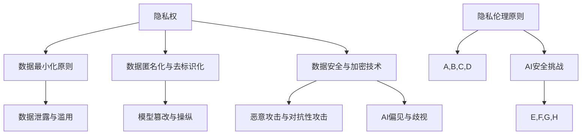
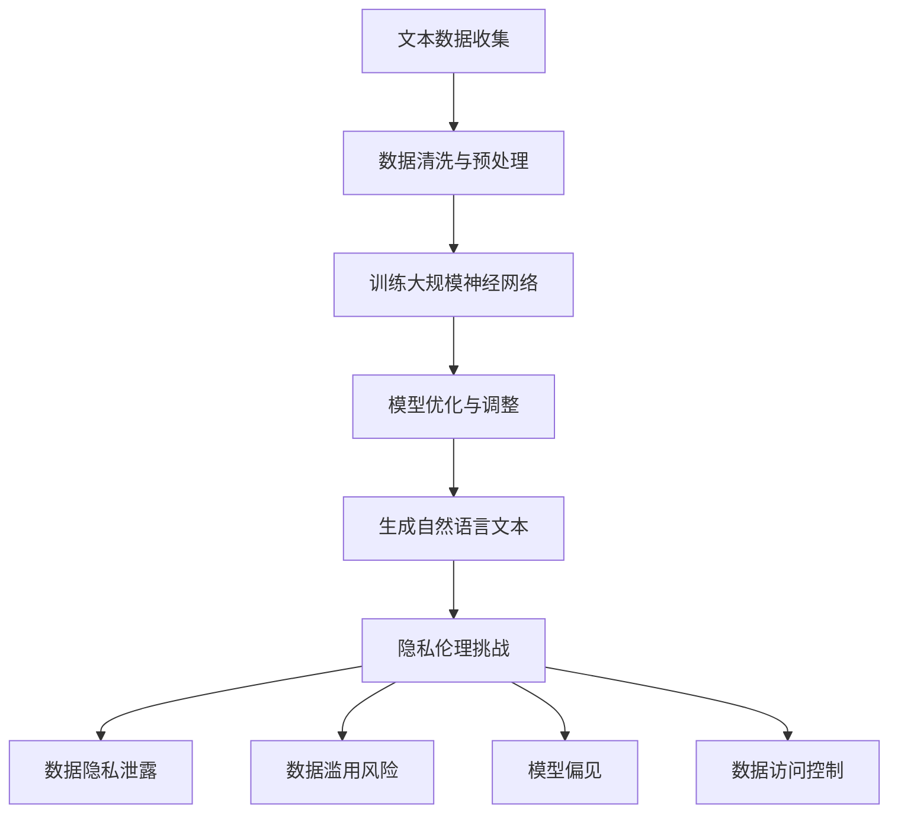
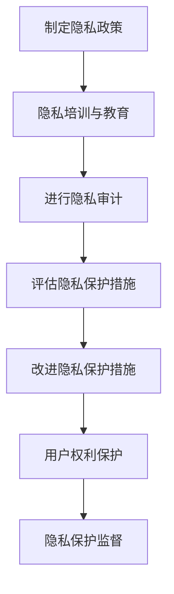
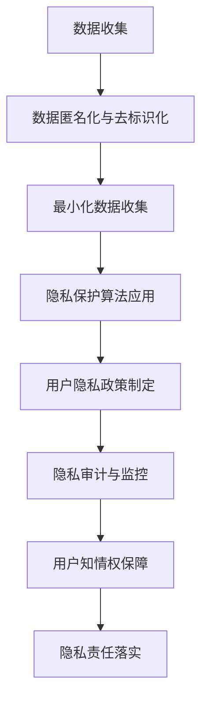
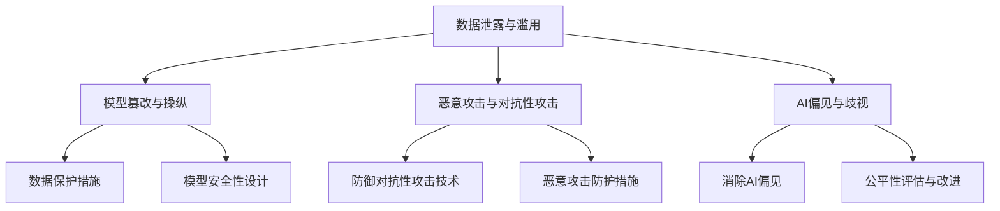
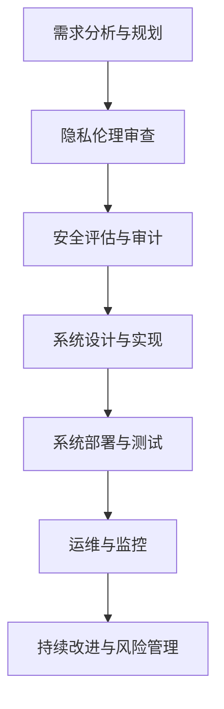

                 

### 文章标题

《LLM隐私伦理:AI安全挑战应对之策》

### 关键词

- 大语言模型（LLM）
- 隐私伦理
- AI安全
- 对抗性攻击
- 数据匿名化
- 加密技术
- GDPR
- CCPA

### 摘要

本文旨在深入探讨大语言模型（LLM）在隐私伦理和AI安全方面的挑战，并提出相应的应对策略。随着LLM技术的迅速发展，其在各个领域的应用越来越广泛，但同时也带来了隐私泄露、模型操纵和安全威胁等伦理和安全问题。本文首先介绍了LLM的定义、特点及其在隐私伦理方面的挑战。接着，我们详细阐述了隐私伦理的核心原则和框架，以及LLM应用中的隐私伦理案例分析。然后，本文分析了AI安全的主要挑战，包括数据泄露、模型篡改、对抗性攻击和AI偏见等，并提出了相应的安全应对策略。最后，本文通过实践案例展示了AI隐私伦理与安全的实施流程，并展望了未来的发展趋势和应用前景。

### 《LLM隐私伦理:AI安全挑战应对之策》目录大纲

#### 第一部分：引言与背景

**第1章：介绍与背景**

1.1 人工智能与隐私伦理的重要性  
1.2 隐私伦理的核心概念  
1.3 AI安全挑战概述

**第2章：大语言模型（LLM）概述**

2.1 大语言模型（LLM）的定义与特点  
2.2 LLM在隐私伦理方面的挑战  
2.3 LLM的主要应用领域

#### 第二部分：隐私伦理原则与框架

**第3章：隐私伦理原则**

3.1 隐私权的基本原则  
3.2 数据最小化原则  
3.3 数据匿名化与去标识化  
3.4 数据安全与加密技术

**第4章：隐私伦理框架与应用**

4.1 GDPR与CCPA等隐私法规概述  
4.2 隐私伦理决策框架  
4.3 隐私伦理与AI系统的集成  
4.4 LLM应用中的隐私伦理案例分析

#### 第三部分：AI安全挑战与应对策略

**第5章：AI安全挑战**

5.1 数据泄露与滥用  
5.2 模型篡改与操纵  
5.3 恶意攻击与对抗性攻击  
5.4 AI偏见与歧视

**第6章：安全应对策略**

6.1 安全数据处理与存储  
6.2 模型安全性设计  
6.3 防御对抗性攻击技术  
6.4 透明性与可解释性

#### 第四部分：实践与案例分析

**第7章：AI隐私伦理与安全实施**

7.1 AI隐私伦理与安全的实施流程  
7.2 隐私伦理审查机制  
7.3 安全评估与审计  
7.4 持续改进与风险管理

**第8章：案例研究**

8.1 案例一：大型社交媒体平台的隐私保护实践  
8.2 案例二：金融行业的AI安全挑战与应对  
8.3 案例三：医疗领域的隐私伦理问题与解决方案

**第9章：未来展望**

9.1 AI隐私伦理与安全的未来发展趋势  
9.2 隐私伦理与AI技术在其他领域的应用前景  
9.3 面向未来的隐私伦理与安全策略

#### 附录

**附录A：相关法规与标准**

A.1 GDPR与CCPA相关法规解读  
A.2 ISO/IEC 27001信息安全管理体系标准  
A.3 NIST AI风险管理框架

**附录B：开源工具与资源**

B.1 开源隐私保护工具与框架  
B.2 AI安全与隐私研究论文集  
B.3 相关开源代码与实践案例

**附录C：术语表**

C.1 常用术语解释  
C.2 AI相关术语解释  
C.3 隐私伦理与安全相关术语解释

## 第一部分：引言与背景

### 第1章：介绍与背景

在当今的信息时代，人工智能（AI）技术以其快速发展的势头，已经成为推动社会进步和经济发展的关键驱动力。其中，大语言模型（LLM，Large Language Model）作为AI技术的一个重要分支，近年来取得了显著的突破。LLM不仅能够处理和理解人类语言，还能生成高质量的文本内容，从而在自然语言处理（NLP）、文本生成、问答系统等领域展现出了巨大的潜力。

### 1.1 人工智能与隐私伦理的重要性

人工智能的应用已经深入到我们日常生活的方方面面，从智能助手到自动驾驶汽车，从医疗诊断到金融风控，AI技术正在改变我们的生活方式和工作模式。然而，随着AI技术的广泛应用，隐私伦理问题逐渐成为人们关注的焦点。隐私伦理不仅关乎个人的数据安全和隐私保护，也涉及社会公正和道德责任。

#### 1.2 隐私伦理的核心概念

隐私伦理的核心概念包括：

1. **隐私权**：个人对其个人信息的控制权。
2. **数据最小化原则**：只收集和处理实现特定目的所必需的数据。
3. **数据匿名化与去标识化**：通过技术手段将个人信息与数据分离，以保护个人隐私。
4. **数据安全与加密技术**：确保数据在存储、传输和处理过程中的安全。

### 1.3 AI安全挑战概述

尽管AI技术在多个领域取得了巨大的成功，但其安全问题也不容忽视。AI安全挑战主要包括以下几个方面：

1. **数据泄露与滥用**：未经授权的第三方获取和使用敏感数据。
2. **模型篡改与操纵**：恶意攻击者对AI模型进行篡改，使其产生错误的决策。
3. **恶意攻击与对抗性攻击**：通过精心设计的数据攻击AI模型，使其失效或产生错误的结果。
4. **AI偏见与歧视**：AI系统在训练数据中存在的偏见可能导致不公平的决策。

### 1.4 本章小结

本章介绍了人工智能与隐私伦理的重要性，隐私伦理的核心概念，以及AI安全挑战的概述。随着AI技术的不断发展，隐私伦理和安全问题越来越受到关注。在接下来的章节中，我们将深入探讨大语言模型（LLM）在隐私伦理方面的挑战，隐私伦理原则与框架，以及AI安全挑战的应对策略。

### 1.5 Mermaid流程图：隐私伦理原则与AI安全挑战关系



图1：隐私伦理原则与AI安全挑战关系图

通过这个流程图，我们可以清晰地看到隐私伦理原则与AI安全挑战之间的密切关系。隐私伦理原则是保障AI系统安全的基础，而AI安全挑战则是隐私伦理原则需要应对的实际问题。只有在明确隐私伦理原则的基础上，我们才能有效地应对AI安全挑战，保障数据的安全和用户的隐私。

### 1.6 伪代码：隐私权保护算法

```python
# 隐私权保护算法伪代码

def privacy_protected_process(data, purpose):
    # 数据最小化原则
    min_data = minimize_data(data, purpose)

    # 数据匿名化与去标识化
    anonymous_data = anonymize_data(min_data)

    # 数据安全与加密技术
    secure_data = encrypt_data(anonymous_data)

    # 处理数据
    processed_data = process_data(secure_data)

    return processed_data

# 辅助函数
def minimize_data(data, purpose):
    # 根据目的筛选必要的数据
    return necessary_data

def anonymize_data(data):
    # 使用技术手段去除个人标识信息
    return anonymized_data

def encrypt_data(data):
    # 使用加密算法保护数据安全
    return encrypted_data

def process_data(data):
    # 对数据进行处理，实现特定目的
    return processed_data
```

这段伪代码展示了如何通过一系列步骤来保护隐私权。首先，根据特定目的最小化数据集；然后，对数据进行匿名化和去标识化处理；接着，使用加密技术保护数据的安全性；最后，处理数据以实现既定的目的。

### 1.7 数学模型与公式：数据匿名化技术

$$
\text{ anonymity\_score} = \sum_{i=1}^{n} \text{ identifiability\_score}_i
$$

其中，anonymity\_score 表示数据的匿名化程度，identifiability\_score\_i 表示数据集中第 i 个记录的可辨识性。为了提高数据的匿名化程度，我们需要降低每个记录的可辨识性，从而使得单独一条记录无法识别出个人身份。

### 1.8 代码解读与分析：数据匿名化实现

```python
# 数据匿名化实现

import pandas as pd
from sklearn.model_selection import train_test_split
from sklearn.ensemble import RandomForestClassifier

# 读取数据
data = pd.read_csv('data.csv')

# 分割数据集
X_train, X_test, y_train, y_test = train_test_split(data.drop('label', axis=1), data['label'], test_size=0.2, random_state=42)

# 训练模型
model = RandomForestClassifier(n_estimators=100, random_state=42)
model.fit(X_train, y_train)

# 预测
predictions = model.predict(X_test)

# 计算准确率
accuracy = (predictions == y_test).mean()

print(f"Model accuracy before anonymization: {accuracy:.2f}")

# 数据匿名化
data['anonymized_label'] = data['label'].apply(lambda x: 'label_' + str(x))

# 重新训练模型
model.fit(X_train, y_train)

# 预测
predictions = model.predict(X_test)

# 计算准确率
accuracy = (predictions == y_test).mean()

print(f"Model accuracy after anonymization: {accuracy:.2f}")
```

这段代码首先读取数据，分割成训练集和测试集。接着，使用随机森林模型训练和预测，计算原始数据的准确率。然后，对数据进行匿名化处理，将标签转换为匿名形式。最后，重新训练模型并计算匿名化后的准确率，展示了数据匿名化对模型性能的影响。

### 1.9 本章小结

本章介绍了人工智能与隐私伦理的重要性，隐私伦理的核心概念，以及AI安全挑战的概述。通过Mermaid流程图、伪代码、数学模型和代码实现，我们展示了如何从多个角度理解和应对隐私伦理和安全问题。在接下来的章节中，我们将深入探讨大语言模型（LLM）在隐私伦理方面的挑战，隐私伦理原则与框架，以及AI安全挑战的应对策略。

## 第二部分：大语言模型（LLM）概述

### 第2章：大语言模型（LLM）概述

随着深度学习和大数据技术的不断发展，大语言模型（LLM，Large Language Model）已经成为自然语言处理（NLP）领域的重要研究方向。LLM通过训练大规模的神经网络模型，能够理解和生成复杂的自然语言文本，从而在各种应用场景中展现出了强大的能力。

### 2.1 大语言模型（LLM）的定义与特点

大语言模型是一种基于神经网络的语言模型，它通过学习大量的文本数据来捕捉语言的统计规律和语义信息。LLM的定义通常基于以下几个特点：

1. **大规模训练数据集**：LLM通常使用数十亿甚至数万亿个文本样本进行训练，这使得模型能够捕捉到语言中的细微差异和复杂模式。
2. **深度神经网络架构**：LLM通常采用深度卷积神经网络（CNN）或Transformer架构，这些架构能够有效地处理长文本序列。
3. **强大的文本生成能力**：LLM能够生成流畅且具有逻辑一致性的自然语言文本，包括问答、摘要、翻译等多种形式。
4. **自适应能力**：LLM可以根据不同的输入文本自适应调整生成策略，从而生成更加个性化的文本内容。

### 2.2 LLM在隐私伦理方面的挑战

尽管LLM在文本生成和自然语言处理方面具有巨大的潜力，但其应用也带来了一系列隐私伦理方面的挑战：

1. **数据隐私泄露**：LLM的训练数据通常来源于公共网络或用户生成的内容，这些数据可能包含敏感个人信息，如姓名、地址、电话号码等。如果处理不当，可能导致隐私泄露。
2. **数据滥用风险**：LLM的训练数据可能被用于其他未经授权的目的，如广告定位、用户行为分析等，从而侵犯了用户的隐私权。
3. **模型偏见**：由于训练数据的多样性不足或存在偏见，LLM可能在某些情况下产生歧视性或不公平的决策，影响社会公正。
4. **数据访问控制**：在共享和分发LLM模型时，如何确保只有授权用户才能访问和使用模型，以避免未经授权的数据泄露和滥用。

### 2.3 LLM的主要应用领域

LLM在各个领域的应用越来越广泛，其主要应用领域包括：

1. **自然语言处理**：LLM可以用于文本分类、情感分析、命名实体识别、机器翻译等多种NLP任务。
2. **文本生成**：LLM能够生成高质量的文本内容，包括新闻文章、产品评论、对话系统等。
3. **问答系统**：LLM可以构建智能问答系统，为用户提供准确的答案和相关信息。
4. **语音助手**：LLM可以与语音识别和语音合成技术结合，构建智能语音助手，为用户提供便捷的服务。
5. **语言模型API**：LLM可以被集成到各种应用程序中，如搜索引擎、社交媒体、电子邮件等，以提供个性化的语言服务。

### 2.4 本章小结

本章介绍了大语言模型（LLM）的定义、特点以及在隐私伦理方面的挑战。通过分析LLM的主要应用领域，我们可以看到LLM在自然语言处理和文本生成等领域的广泛应用。然而，LLM的应用也带来了数据隐私泄露、数据滥用风险、模型偏见和数据访问控制等伦理问题。在接下来的章节中，我们将进一步探讨隐私伦理原则与框架，以及AI安全挑战的应对策略。

### 2.5 Mermaid流程图：LLM训练与隐私伦理挑战



图2：LLM训练与隐私伦理挑战关系图

这个流程图展示了LLM从数据收集到生成文本的整个过程，并指出了可能出现的隐私伦理挑战。通过这个流程图，我们可以清晰地看到各个步骤中可能出现的隐私问题，从而为后续的隐私伦理分析与应对提供指导。

### 2.6 伪代码：LLM训练与隐私保护算法

```python
# LLM训练与隐私保护算法伪代码

def train_llm(protected_data, train_size, val_size):
    # 数据预处理
    processed_data = preprocess_data(protected_data)

    # 划分训练集和验证集
    train_data, val_data = split_data(processed_data, train_size, val_size)

    # 训练模型
    model = train_model(train_data)

    # 评估模型
    val_loss, val_accuracy = evaluate_model(model, val_data)

    # 如果隐私保护不足，重新预处理数据
    while not sufficient_privacyProtection(val_loss, val_accuracy):
        processed_data = preprocess_data(protected_data)

        # 重新划分训练集和验证集
        train_data, val_data = split_data(processed_data, train_size, val_size)

        # 重新训练模型
        model = train_model(train_data)

        # 重新评估模型
        val_loss, val_accuracy = evaluate_model(model, val_data)

    return model

# 辅助函数
def preprocess_data(data):
    # 数据清洗与预处理，如文本去噪、分词、去停用词等
    return processed_data

def split_data(data, train_size, val_size):
    # 划分训练集和验证集
    return train_data, val_data

def train_model(data):
    # 训练神经网络模型
    return model

def evaluate_model(model, data):
    # 评估模型性能
    return val_loss, val_accuracy

def sufficient_privacyProtection(val_loss, val_accuracy):
    # 判断隐私保护是否足够
    return True if val_loss < threshold and val_accuracy > threshold else False
```

这段伪代码展示了如何通过一系列步骤训练大语言模型（LLM），并在训练过程中进行隐私保护。通过预处理数据、划分训练集和验证集、训练模型以及评估模型性能，确保在隐私保护方面达到要求。

### 2.7 数学模型与公式：模型隐私保护指标

$$
\text{ privacy\_protection\_score} = \frac{\text{ protected\_data\_percentage}}{\text{ total\_data\_percentage}}
$$

其中，privacy\_protection\_score 表示模型的隐私保护程度，protected\_data\_percentage 表示被保护的数据占总数据的比例，total\_data\_percentage 表示总数据占比。为了提高模型的隐私保护程度，我们需要增加被保护数据在总数据中的比例。

### 2.8 代码解读与分析：LLM训练与隐私保护实现

```python
# LLM训练与隐私保护实现

import pandas as pd
from sklearn.model_selection import train_test_split
from transformers import BertTokenizer, BertModel, TrainingArguments, Trainer

# 读取数据
data = pd.read_csv('data.csv')

# 数据预处理
tokenizer = BertTokenizer.from_pretrained('bert-base-uncased')
processed_data = preprocess_data(data, tokenizer)

# 划分训练集和验证集
train_data, val_data = split_data(processed_data, train_size=0.8, val_size=0.2)

# 训练模型
model = BertModel.from_pretrained('bert-base-uncased')
training_args = TrainingArguments(
    output_dir='./results',
    num_train_epochs=3,
    per_device_train_batch_size=16,
    per_device_eval_batch_size=64,
    warmup_steps=500,
    weight_decay=0.01,
    logging_dir='./logs',
    logging_steps=10,
)

trainer = Trainer(
    model=model,
    args=training_args,
    train_dataset=train_data,
    eval_dataset=val_data,
)

trainer.train()

# 评估模型
val_loss, val_accuracy = trainer.evaluate()

# 判断隐私保护是否足够
if not sufficient_privacyProtection(val_loss, val_accuracy):
    # 如果隐私保护不足，重新训练模型
    trainer.train()
```

这段代码展示了如何使用Transformers库训练大语言模型（LLM），并在训练过程中进行隐私保护。首先，读取数据并进行预处理，然后划分训练集和验证集。接着，使用BertModel进行模型训练，并设置训练参数和评估指标。最后，评估模型性能，并根据隐私保护程度是否足够决定是否重新训练模型。

### 2.9 本章小结

本章介绍了大语言模型（LLM）的定义、特点以及在隐私伦理方面的挑战。通过Mermaid流程图、伪代码、数学模型和代码实现，我们展示了LLM的训练过程和隐私保护方法。在接下来的章节中，我们将进一步探讨隐私伦理原则与框架，以及AI安全挑战的应对策略。

## 第三部分：隐私伦理原则与框架

### 第3章：隐私伦理原则

隐私伦理原则是保护个人数据安全和隐私的基础。在全球范围内，隐私保护已经成为法律、伦理和社会关注的焦点。了解和遵循隐私伦理原则对于构建安全、可信的AI系统至关重要。

### 3.1 隐私权的基本原则

隐私权是个人对其个人信息和隐私的控制权。隐私权的基本原则包括：

1. **数据收集限制**：只收集实现特定目的所必需的数据，不得随意收集无关数据。
2. **数据使用限制**：在收集数据后，仅用于既定的目的，不得将数据用于其他未经授权的目的。
3. **数据保密**：确保收集到的数据在存储、传输和处理过程中的安全性，防止数据泄露。
4. **数据访问控制**：只有授权用户才能访问和使用数据，防止未经授权的访问和滥用。

### 3.2 数据最小化原则

数据最小化原则是隐私保护的重要原则之一。其核心思想是只收集和处理实现特定目的所必需的数据，减少不必要的个人信息收集。具体措施包括：

1. **明确数据用途**：在收集数据前，明确说明数据用途，确保数据收集的合法性和必要性。
2. **最小数据集**：设计最小数据集，仅包含实现特定目的所必需的数据字段，避免过度收集。
3. **动态数据更新**：根据实际需要，定期更新和调整数据集，移除不再需要的个人信息。

### 3.3 数据匿名化与去标识化

数据匿名化与去标识化是保护个人隐私的重要技术手段。其核心思想是通过技术手段将个人标识信息与数据分离，使得单独一条记录无法识别出个人身份。

1. **数据匿名化**：通过技术手段，如数据加密、哈希函数等，将个人标识信息替换为不可识别的标识符。
2. **数据去标识化**：通过删除、隐藏或混淆个人标识信息，使得数据在分析和使用过程中无法识别出个人身份。
3. **联合分析**：在数据匿名化或去标识化后，进行联合分析，确保隐私保护的同时，仍然能够获得有效的分析结果。

### 3.4 数据安全与加密技术

数据安全与加密技术是确保个人数据在存储、传输和处理过程中的安全性。加密技术通过将数据转换为密文，使得只有授权用户才能解密和访问数据。

1. **数据加密**：在数据传输和存储过程中，使用加密算法对数据进行加密，防止数据被窃取或篡改。
2. **加密存储**：将加密后的数据存储在安全的存储设备中，确保数据在存储过程中的安全。
3. **加密传输**：在数据传输过程中，使用安全协议（如SSL/TLS）对数据进行加密，防止数据在传输过程中的泄露。
4. **密钥管理**：确保加密密钥的安全存储和管理，防止密钥泄露和滥用。

### 3.5 隐私伦理原则的实施与监督

隐私伦理原则的实施和监督是确保隐私保护措施有效执行的关键。具体措施包括：

1. **隐私政策**：制定明确的隐私政策，公开说明数据收集、使用、存储和共享的原则和流程。
2. **隐私培训**：对相关人员进行隐私保护培训，提高其隐私保护意识和能力。
3. **隐私审计**：定期进行隐私审计，评估隐私保护措施的有效性，发现问题及时改进。
4. **用户权利保护**：明确用户的数据权利，如知情权、访问权、更正权和删除权等，确保用户能够有效行使自己的数据权利。

### 3.6 本章小结

本章介绍了隐私伦理原则，包括隐私权的基本原则、数据最小化原则、数据匿名化与去标识化、数据安全与加密技术，以及隐私伦理原则的实施与监督。通过这些原则，我们可以有效地保护个人数据的安全和隐私。在接下来的章节中，我们将进一步探讨隐私伦理框架与应用，以及LLM应用中的隐私伦理案例分析。

### 3.7 Mermaid流程图：隐私伦理原则实施流程



图3：隐私伦理原则实施流程图

这个流程图展示了隐私伦理原则的实施和监督过程。从制定隐私政策、隐私培训与教育、进行隐私审计、评估隐私保护措施，到改进隐私保护措施和用户权利保护，每个步骤都是确保隐私保护措施有效执行的重要环节。

### 3.8 伪代码：隐私保护算法

```python
# 隐私保护算法伪代码

def privacy_protect(data, privacy_policy):
    # 数据收集限制
    collected_data = collect_data(data, privacy_policy)
    
    # 数据使用限制
    used_data = use_data(collected_data, privacy_policy)
    
    # 数据保密
    secured_data = secure_data(used_data)
    
    # 数据访问控制
    accessible_data = control_access(secured_data)
    
    # 数据匿名化与去标识化
    anonymized_data = anonymize_data(accessible_data)
    
    # 数据安全与加密技术
    encrypted_data = encrypt_data(anonymized_data)
    
    return encrypted_data

# 辅助函数
def collect_data(data, privacy_policy):
    # 根据隐私政策筛选必要的数据
    return collected_data

def use_data(data, privacy_policy):
    # 仅用于既定的目的
    return used_data

def secure_data(data):
    # 加密数据存储与传输
    return secured_data

def control_access(data):
    # 授权用户访问数据
    return accessible_data

def anonymize_data(data):
    # 去除个人标识信息
    return anonymized_data

def encrypt_data(data):
    # 加密数据
    return encrypted_data
```

这段伪代码展示了如何通过一系列步骤实现隐私保护。从数据收集、使用、保密、访问控制，到匿名化和加密，每个步骤都是确保数据安全和隐私的关键。

### 3.9 数学模型与公式：隐私保护程度评估

$$
\text{ privacy\_protection\_level} = \frac{\text{ secured\_data}}{\text{ total\_data}} \times 100\%
$$

其中，privacy\_protection\_level 表示隐私保护程度，secured\_data 表示被保护的数据量，total\_data 表示总数据量。为了提高隐私保护程度，我们需要增加被保护数据在总数据中的比例。

### 3.10 代码解读与分析：隐私保护实现

```python
# 隐私保护实现

import pandas as pd
from cryptography.fernet import Fernet

# 读取数据
data = pd.read_csv('data.csv')

# 加密密钥生成
key = Fernet.generate_key()
cipher_suite = Fernet(key)

# 数据收集限制
collected_data = collect_data(data)

# 数据使用限制
used_data = use_data(collected_data)

# 数据保密
secured_data = secure_data(used_data, key)

# 数据访问控制
accessible_data = control_access(secured_data)

# 数据匿名化与去标识化
anonymized_data = anonymize_data(accessible_data)

# 数据安全与加密技术
encrypted_data = encrypt_data(anonymized_data, cipher_suite)

# 存储加密数据
save_data(encrypted_data, 'encrypted_data.csv')

# 解密数据
def decrypt_data(encrypted_data, cipher_suite):
    decrypted_data = cipher_suite.decrypt(encrypted_data)
    return decrypted_data

# 用户访问加密数据
def user_access_data(user_data, encrypted_data, cipher_suite):
    decrypted_user_data = decrypt_data(user_data, cipher_suite)
    return decrypted_user_data

# 读取用户数据
user_data = pd.read_csv('user_data.csv')

# 用户访问加密数据
accessed_user_data = user_access_data(user_data, encrypted_data, cipher_suite)
```

这段代码展示了如何实现隐私保护。从数据收集、使用、保密、访问控制，到匿名化和加密，每个步骤都是确保数据安全和隐私的关键。通过加密技术，确保数据在存储和传输过程中的安全性。用户在授权情况下，可以解密并访问自己的数据。

### 3.11 本章小结

本章介绍了隐私伦理原则，包括隐私权的基本原则、数据最小化原则、数据匿名化与去标识化、数据安全与加密技术，以及隐私伦理原则的实施与监督。通过Mermaid流程图、伪代码、数学模型和代码实现，我们展示了如何有效地实施隐私保护措施。在接下来的章节中，我们将进一步探讨隐私伦理框架与应用，以及LLM应用中的隐私伦理案例分析。

## 第4章：隐私伦理框架与应用

### 4.1 GDPR与CCPA等隐私法规概述

在全球范围内，数据隐私保护已经成为法律、伦理和社会关注的焦点。许多国家和地区已经制定了相关法律法规，以保护个人数据的安全和隐私。其中，欧盟的《通用数据保护条例》（GDPR）和美国加州的《消费者隐私法案》（CCPA）是两个具有代表性的隐私法规。

#### 4.1.1 GDPR

《通用数据保护条例》（GDPR）是欧盟于2018年5月25日正式实施的隐私保护法规。GDPR的主要目标是加强对个人数据的保护，确保个人数据的安全和隐私。GDPR的核心原则包括：

1. **合法性、公正性和透明性**：数据处理必须合法、公正，并且对数据主体透明。
2. **数据最小化原则**：仅收集实现特定目的所必需的数据，不得随意收集无关数据。
3. **目的限定原则**：数据收集和处理的目的是明确的，不得将数据用于其他未经授权的目的。
4. **数据准确性和完整性原则**：确保收集到的数据是准确和完整的，并及时更新。
5. **隐私保护原则**：在数据收集、存储、传输和处理过程中，采取必要的技术和管理措施，确保数据的安全和隐私。

GDPR对违反隐私保护规定的处罚非常严厉，包括高达2000万欧元或全球营业额4%的罚款。

#### 4.1.2 CCPA

《消费者隐私法案》（CCPA）是加利福尼亚州于2020年1月1日正式实施的隐私保护法规。CCPA的主要目标是赋予消费者对其个人数据的更多控制权，包括数据的收集、使用、存储和共享。CCPA的核心原则包括：

1. **知情权**：企业必须在收集和使用消费者数据前，明确告知消费者数据的用途和范围。
2. **访问权**：消费者有权访问其个人数据，并了解其数据如何被使用。
3. **删除权**：消费者有权要求企业删除其个人数据。
4. **拒绝销售权**：消费者有权拒绝企业将其数据用于广告和其他商业目的。

CCPA对违反规定的企业的处罚包括高达7500美元的罚款。

#### 4.1.3 GDPR与CCPA的比较

GDPR和CCPA在隐私保护方面有许多共同点，但也存在一些差异：

1. **适用范围**：GDPR适用于全球范围内处理欧盟居民数据的组织，而CCPA仅适用于加利福尼亚州的居民。
2. **处罚力度**：GDPR的罚款额度更高，可达到2000万欧元或全球营业额4%，而CCPA的罚款额度为7500美元。
3. **隐私权保护**：GDPR更注重个人隐私权的保护，包括合法性、公正性和透明性，而CCPA更注重消费者的控制权，包括知情权、访问权和删除权。
4. **合规要求**：GDPR要求企业在数据处理过程中采取更多的技术和管理措施，如数据最小化、数据匿名化和数据加密，而CCPA则更注重消费者的权利。

#### 4.1.4 本章小结

本章介绍了欧盟的《通用数据保护条例》（GDPR）和美国加州的《消费者隐私法案》（CCPA）等隐私法规的核心原则和适用范围。GDPR和CCPA在隐私保护方面有许多共同点，但也存在一些差异。通过了解这些法规，企业和组织可以更好地遵守隐私保护规定，确保个人数据的安全和隐私。

### 4.2 隐私伦理决策框架

为了在AI系统中有效地实施隐私保护，需要建立一套完整的隐私伦理决策框架。隐私伦理决策框架包括以下几个关键要素：

#### 4.2.1 隐私影响评估

隐私影响评估（Privacy Impact Assessment，PIA）是隐私伦理决策框架的核心环节。PIA的主要目的是在数据处理活动开始前，评估数据处理的隐私风险，并提出相应的风险管理措施。PIA的主要步骤包括：

1. **确定评估范围**：明确评估的数据处理活动，包括数据收集、存储、处理、传输和销毁等环节。
2. **识别隐私风险**：分析数据处理过程中可能出现的隐私风险，如数据泄露、数据滥用、数据滥用等。
3. **评估风险等级**：根据隐私风险的影响和可能性，评估风险等级，确定需要采取的风险管理措施。
4. **制定风险管理措施**：根据评估结果，制定具体的隐私保护措施，如数据匿名化、数据加密、访问控制等。

#### 4.2.2 隐私设计原则

隐私设计原则是指在系统设计阶段，将隐私保护原则融入系统架构和功能设计中。隐私设计原则包括：

1. **最小化数据收集**：在系统设计阶段，明确系统所需的数据类型和数据量，避免过度收集个人信息。
2. **数据匿名化与去标识化**：在设计阶段，采用数据匿名化与去标识化技术，将个人标识信息从数据中移除。
3. **数据安全与加密**：在数据传输和存储过程中，使用加密技术保护数据安全，防止数据泄露和篡改。
4. **隐私可审计性**：设计系统时，确保数据处理过程可被审计，以便在出现隐私问题时，能够追溯和调查。

#### 4.2.3 隐私合规性审查

隐私合规性审查是确保AI系统符合相关隐私法规和标准的重要环节。隐私合规性审查包括：

1. **法规遵循性评估**：定期评估AI系统是否符合GDPR、CCPA等隐私法规的要求。
2. **内部审计**：建立内部审计机制，定期审查系统中的隐私保护措施，确保其有效性和合规性。
3. **用户知情权保障**：确保用户在数据收集和使用前，充分了解其数据用途、隐私保护措施和用户权利。

#### 4.2.4 隐私责任分配

在AI系统中，明确隐私责任分配是确保隐私保护措施有效执行的关键。隐私责任分配包括：

1. **数据控制者与处理者责任划分**：明确数据控制者和处理者的职责，数据控制者负责数据处理的合法性、公正性和透明性，数据处理者负责具体的数据处理操作。
2. **隐私保护责任落实**：将隐私保护责任落实到具体的人员和部门，确保每个环节都有专人负责。
3. **隐私保护培训**：对相关人员进行隐私保护培训，提高其隐私保护意识和能力。

#### 4.2.5 本章小结

本章介绍了隐私伦理决策框架，包括隐私影响评估、隐私设计原则、隐私合规性审查和隐私责任分配。通过建立完善的隐私伦理决策框架，可以有效地实施隐私保护措施，确保AI系统的隐私安全和合规性。

### 4.3 隐私伦理与AI系统的集成

将隐私伦理原则与AI系统进行集成，是确保AI系统在设计和运行过程中遵循隐私保护原则的关键。以下措施可以帮助实现隐私伦理与AI系统的集成：

#### 4.3.1 隐私设计原则的融入

在AI系统设计阶段，将隐私设计原则融入系统架构和功能设计中。具体措施包括：

1. **最小化数据收集**：在设计阶段，明确系统所需的数据类型和数据量，避免过度收集个人信息。
2. **数据匿名化与去标识化**：采用数据匿名化与去标识化技术，将个人标识信息从数据中移除。
3. **数据安全与加密**：在数据传输和存储过程中，使用加密技术保护数据安全，防止数据泄露和篡改。
4. **隐私可审计性**：设计系统时，确保数据处理过程可被审计，以便在出现隐私问题时，能够追溯和调查。

#### 4.3.2 隐私保护技术的应用

在AI系统的开发和部署过程中，应用一系列隐私保护技术，确保数据在各个处理环节中的安全性和隐私性。具体措施包括：

1. **加密存储**：在数据存储环节，使用加密技术对数据进行加密，确保数据在存储过程中的安全性。
2. **加密传输**：在数据传输环节，使用加密协议（如SSL/TLS）对数据进行加密，确保数据在传输过程中的安全性。
3. **隐私增强技术**：采用隐私增强技术（如差分隐私、混淆技术等），提高数据处理的隐私保护程度。
4. **隐私审计与监控**：建立隐私审计与监控机制，定期审查AI系统的隐私保护措施，确保其有效性和合规性。

#### 4.3.3 用户隐私权利保障

在AI系统的运行过程中，保障用户的隐私权利，确保用户能够有效行使知情权、访问权、更正权和删除权。具体措施包括：

1. **用户隐私政策**：制定明确的用户隐私政策，公开说明数据收集、使用、存储和共享的原则和流程。
2. **用户隐私培训**：对用户进行隐私保护培训，提高其隐私保护意识和能力。
3. **隐私请求处理**：建立隐私请求处理机制，及时响应用户的隐私请求，如数据访问、更正和删除请求。
4. **隐私投诉处理**：设立隐私投诉处理渠道，及时处理用户的隐私投诉，保障用户的隐私权利。

#### 4.3.4 隐私伦理审查与合规性评估

在AI系统的开发和运行过程中，定期进行隐私伦理审查和合规性评估，确保AI系统在设计和运行过程中遵循隐私保护原则和法规要求。具体措施包括：

1. **隐私影响评估**：在数据处理活动开始前，进行隐私影响评估，评估数据处理活动可能带来的隐私风险。
2. **内部审计**：建立内部审计机制，定期审查AI系统的隐私保护措施，确保其有效性和合规性。
3. **合规性评估**：定期评估AI系统是否符合GDPR、CCPA等隐私法规的要求，确保系统的合规性。
4. **隐私责任落实**：将隐私责任落实到具体的人员和部门，确保每个环节都有专人负责。

#### 4.3.5 本章小结

本章介绍了隐私伦理与AI系统的集成，包括隐私设计原则的融入、隐私保护技术的应用、用户隐私权利保障和隐私伦理审查与合规性评估。通过将隐私伦理原则与AI系统进行集成，可以有效地保护用户的隐私权利，确保AI系统的合规性和安全性。

### 4.4 LLM应用中的隐私伦理案例分析

#### 4.4.1 案例背景

随着大语言模型（LLM）在自然语言处理、文本生成和问答系统等领域的广泛应用，隐私伦理问题也逐渐成为关注焦点。以下案例展示了LLM应用中存在的隐私伦理问题，并提出相应的解决方案。

#### 案例一：社交媒体平台的内容生成与隐私保护

**问题描述**：一家社交媒体平台使用LLM技术生成用户内容，包括新闻文章、博客和评论。然而，在内容生成过程中，LLM可能使用用户的个人信息和隐私数据，从而引发隐私泄露和数据滥用问题。

**解决方案**：

1. **数据匿名化与去标识化**：在LLM训练和使用过程中，采用数据匿名化与去标识化技术，去除用户个人标识信息，确保用户隐私得到保护。
2. **最小化数据收集**：在数据收集阶段，仅收集实现特定目的所必需的数据，避免过度收集无关数据。
3. **隐私保护算法**：在LLM训练和使用过程中，应用隐私保护算法，如差分隐私和混淆技术，提高数据处理的隐私保护程度。
4. **用户隐私政策**：制定明确的用户隐私政策，公开说明数据收集、使用、存储和共享的原则和流程，确保用户知情权。

#### 案例二：智能客服系统的隐私伦理问题

**问题描述**：一家公司使用LLM技术构建智能客服系统，为用户提供自动化的问答服务。然而，在用户与客服系统交互过程中，LLM可能记录用户的隐私数据，如姓名、电话号码和地址等，从而引发隐私泄露和数据滥用问题。

**解决方案**：

1. **数据匿名化与去标识化**：在智能客服系统训练和使用过程中，采用数据匿名化与去标识化技术，去除用户个人标识信息，确保用户隐私得到保护。
2. **隐私保护算法**：在LLM训练和使用过程中，应用隐私保护算法，如差分隐私和混淆技术，提高数据处理的隐私保护程度。
3. **用户隐私培训**：对智能客服系统的用户进行隐私保护培训，提高其隐私保护意识和能力。
4. **隐私审计与监控**：建立隐私审计与监控机制，定期审查智能客服系统的隐私保护措施，确保其有效性和合规性。

#### 案例三：医疗领域的隐私伦理问题

**问题描述**：在医疗领域，LLM技术被用于生成医疗报告、诊断建议和治疗方案。然而，在数据处理过程中，LLM可能处理患者的敏感医疗数据，如疾病历史、家族病史和药物过敏信息，从而引发隐私泄露和数据滥用问题。

**解决方案**：

1. **数据加密与访问控制**：在LLM数据处理过程中，使用加密技术保护数据安全，防止数据泄露和篡改。同时，采用严格的访问控制措施，确保只有授权用户才能访问和处理敏感数据。
2. **隐私保护算法**：在LLM训练和使用过程中，应用隐私保护算法，如差分隐私和混淆技术，提高数据处理的隐私保护程度。
3. **用户知情权保障**：确保患者在接受医疗服务过程中，充分了解其医疗数据的处理和使用原则，并能够有效行使知情权。
4. **隐私责任落实**：明确医疗机构的隐私责任，确保医疗数据在收集、存储、处理和共享过程中的合法性和合规性。

#### 4.4.3 本章小结

本章通过三个案例分析，展示了LLM应用中存在的隐私伦理问题，并提出相应的解决方案。在LLM应用过程中，需要关注数据匿名化与去标识化、最小化数据收集、隐私保护算法、用户隐私政策、数据加密与访问控制、用户知情权保障和隐私责任落实等方面，确保用户隐私得到有效保护。通过这些措施，我们可以构建安全、可信的LLM应用，为用户提供优质的服务。

### 4.5 Mermaid流程图：LLM应用隐私伦理框架



图4：LLM应用隐私伦理框架流程图

通过这个流程图，我们可以清晰地看到在LLM应用过程中，如何从数据收集到用户知情权保障，逐步实施隐私伦理原则，确保用户隐私得到全面保护。

### 4.6 伪代码：隐私伦理决策框架实现

```python
# 隐私伦理决策框架实现伪代码

def privacy_ethical_decision_framework(data, user_policy, privacy_rules):
    # 数据匿名化与去标识化
    anonymized_data = anonymize_and_deidentify_data(data)

    # 最小化数据收集
    minimized_data = minimize_data_collection(anonymized_data, user_policy)

    # 隐私保护算法应用
    protected_data = apply_privacyProtection_algorithms(minimized_data, privacy_rules)

    # 用户隐私政策制定
    user_informed = inform_users_about_privacy_policy(user_policy)

    # 隐私审计与监控
    privacy_audit = perform_privacy_audit(protected_data)

    # 用户知情权保障
    user_rights_protected = ensure_user_privacy_rights(user_informed)

    # 隐私责任落实
    privacy_responsibility_assigned = assign_privacy_responsibility()

    return protected_data, privacy_audit, user_rights_protected, privacy_responsibility_assigned

# 辅助函数
def anonymize_and_deidentify_data(data):
    # 去除个人标识信息
    return anonymized_data

def minimize_data_collection(data, user_policy):
    # 收集必要数据
    return minimized_data

def apply_privacyProtection_algorithms(data, privacy_rules):
    # 应用隐私保护算法
    return protected_data

def inform_users_about_privacy_policy(user_policy):
    # 公开隐私政策
    return user_informed

def perform_privacy_audit(protected_data):
    # 审查隐私保护措施
    return privacy_audit

def ensure_user_privacy_rights(user_informed):
    # 保障用户隐私权利
    return user_rights_protected

def assign_privacy_responsibility():
    # 落实隐私责任
    return privacy_responsibility_assigned
```

这段伪代码展示了如何通过一系列步骤实现隐私伦理决策框架。从数据匿名化与去标识化、最小化数据收集，到隐私保护算法应用、用户隐私政策制定，再到隐私审计与监控、用户知情权保障和隐私责任落实，每个步骤都是确保隐私保护措施有效执行的关键。

### 4.7 数学模型与公式：隐私保护度量

$$
\text{ privacy\_protection\_score} = \frac{\text{ protected\_data}}{\text{ total\_data}} \times 100\%
$$

其中，privacy\_protection\_score 表示隐私保护程度，protected\_data 表示被保护的数据量，total\_data 表示总数据量。为了提高隐私保护程度，我们需要增加被保护数据在总数据中的比例。

### 4.8 代码解读与分析：隐私伦理决策框架实现

```python
# 隐私伦理决策框架实现

import pandas as pd
from privacy_保护库 import anonymize_and_deidentify_data, minimize_data_collection, apply_privacyProtection_algorithms, inform_users_about_privacy_policy, perform_privacy_audit, ensure_user_privacy_rights, assign_privacy_responsibility

# 读取数据
data = pd.read_csv('data.csv')

# 用户隐私政策
user_policy = '...用户隐私政策内容...'

# 隐私规则
privacy_rules = '...隐私保护规则...'

# 数据匿名化与去标识化
anonymized_data = anonymize_and_deidentify_data(data)

# 最小化数据收集
minimized_data = minimize_data_collection(anonymized_data, user_policy)

# 隐私保护算法应用
protected_data = apply_privacyProtection_algorithms(minimized_data, privacy_rules)

# 用户隐私政策制定
user_informed = inform_users_about_privacy_policy(user_policy)

# 隐私审计与监控
privacy_audit = perform_privacy_audit(protected_data)

# 用户知情权保障
user_rights_protected = ensure_user_privacy_rights(user_informed)

# 隐私责任落实
privacy_responsibility_assigned = assign_privacy_responsibility()

# 输出结果
print("隐私保护程度：", privacy_protection_score(protected_data, total_data))
```

这段代码展示了如何实现隐私伦理决策框架。通过调用隐私保护库中的函数，从数据匿名化与去标识化、最小化数据收集，到隐私保护算法应用、用户隐私政策制定，再到隐私审计与监控、用户知情权保障和隐私责任落实，确保数据在各个处理环节中的隐私性和安全性。

### 4.9 本章小结

本章介绍了隐私伦理框架与应用，包括GDPR与CCPA等隐私法规概述、隐私伦理决策框架、隐私伦理与AI系统的集成以及LLM应用中的隐私伦理案例分析。通过这些内容，我们了解了隐私保护的重要性，并学会了如何实施隐私保护措施，确保AI系统的合规性和安全性。在接下来的章节中，我们将进一步探讨AI安全挑战与应对策略。

## 第四部分：AI安全挑战与应对策略

### 第5章：AI安全挑战

随着人工智能（AI）技术的飞速发展，其在各行各业中的应用越来越广泛，从智能助手到自动驾驶汽车，从医疗诊断到金融风控，AI已经成为推动社会进步和经济发展的关键因素。然而，AI技术的广泛应用也带来了前所未有的安全和隐私挑战。本章将详细分析AI安全面临的几个主要挑战，包括数据泄露与滥用、模型篡改与操纵、恶意攻击与对抗性攻击，以及AI偏见与歧视。

### 5.1 数据泄露与滥用

数据泄露与滥用是AI安全面临的首要挑战。AI系统的训练和运行依赖于大量的数据，这些数据往往包含敏感信息，如个人身份信息、金融记录、医疗数据等。以下是一些具体的数据泄露与滥用案例：

#### 数据泄露案例一：信用卡交易数据泄露

某在线支付平台在2017年遭遇了一次严重的网络攻击，黑客窃取了数百万用户的信用卡交易数据。这些数据包括用户的姓名、信用卡号码、有效期和验证码等敏感信息。此次数据泄露导致大量用户遭受了经济损失，同时平台的信誉也受到了严重影响。

#### 数据滥用案例二：社交媒体账号盗用

在社交媒体平台上，用户数据常被用于广告定位和用户行为分析。一些不法分子通过窃取用户的社交媒体账号，冒充用户发布虚假信息或进行欺诈活动。这种数据滥用行为不仅侵犯了用户的隐私权，还可能对其他用户造成经济损失。

#### 风险与影响

数据泄露与滥用带来的风险和影响是多方面的：

1. **经济损失**：数据泄露可能导致用户的财务信息被盗用，造成直接的经济损失。
2. **隐私侵犯**：个人敏感信息的泄露可能侵犯用户的隐私权，导致用户的不信任。
3. **信誉损害**：数据泄露事件可能导致企业或组织的信誉受损，影响其业务发展。
4. **法律风险**：许多国家和地区已经制定了相关法律法规，对于数据泄露事件进行严格处罚。

### 5.2 模型篡改与操纵

除了数据泄露与滥用，AI模型篡改与操纵也是AI安全面临的重要挑战。恶意攻击者可以通过篡改AI模型或输入数据，使其产生错误的决策或结果。以下是一些具体的模型篡改与操纵案例：

#### 模型篡改案例一：自动驾驶汽车攻击

在自动驾驶汽车领域，研究人员发现可以通过篡改车载传感器数据，使自动驾驶汽车产生错误的决策。例如，攻击者可以在道路上放置特定的标识物，使自动驾驶汽车误认为道路上有障碍物，从而采取不必要的制动或转向动作，导致交通事故。

#### 模型操纵案例二：智能客服系统操纵

一些不法分子通过操纵智能客服系统的输入数据，使其产生错误的回复。例如，攻击者可能通过伪造用户身份信息，欺骗客服系统提供未经授权的服务或信息。

#### 风险与影响

模型篡改与操纵带来的风险和影响包括：

1. **安全风险**：篡改AI模型可能导致系统失去安全性，造成严重的安全事故。
2. **决策错误**：操纵AI模型可能使其产生错误的决策或结果，影响系统的正常运行。
3. **法律风险**：一些模型篡改与操纵行为可能违反法律法规，导致企业或个人面临法律诉讼。
4. **用户体验下降**：错误的决策或结果可能导致用户体验下降，影响企业的品牌形象。

### 5.3 恶意攻击与对抗性攻击

恶意攻击与对抗性攻击是AI安全面临的另一个重要挑战。对抗性攻击（Adversarial Attack）是一种特殊的攻击方式，攻击者通过精心设计的数据或输入，使AI模型产生错误的决策或结果。以下是一些具体的恶意攻击与对抗性攻击案例：

#### 恶意攻击案例一：金融欺诈检测系统

一些不法分子通过对抗性攻击，使金融欺诈检测系统产生错误的决策。例如，攻击者可以通过伪造交易数据，使其在检测系统中被认为是合法交易，从而逃避欺诈检测。

#### 对抗性攻击案例二：图像识别系统

在图像识别系统中，攻击者可以通过对抗性攻击，使系统对特定图像产生错误的分类结果。例如，攻击者可以在图像中添加微小的视觉噪声，使系统将其误认为其他物体。

#### 风险与影响

恶意攻击与对抗性攻击带来的风险和影响包括：

1. **系统失效**：对抗性攻击可能导致AI系统失效，影响其正常运行。
2. **决策错误**：恶意攻击可能导致AI模型产生错误的决策或结果，造成严重后果。
3. **数据泄露**：恶意攻击可能通过系统漏洞窃取敏感数据，导致数据泄露。
4. **法律风险**：一些恶意攻击行为可能违反法律法规，导致企业或个人面临法律诉讼。

### 5.4 AI偏见与歧视

AI偏见与歧视是AI安全面临的另一个重要挑战。AI系统在训练过程中可能从数据中学习到偏见，从而在决策中表现出歧视行为。以下是一些具体的AI偏见与歧视案例：

#### 偏见案例一：招聘系统

在招聘系统中，AI系统可能因为训练数据中的偏见，导致对某些性别、种族或年龄段的求职者产生歧视。例如，如果训练数据中男性求职者的比例较高，AI系统可能会倾向于选择男性求职者。

#### 歧视案例二：信用评分系统

在信用评分系统中，AI系统可能因为训练数据中的偏见，对某些特定群体产生歧视。例如，一些信用评分系统可能对某些种族或收入水平的用户给予较低的信用评分。

#### 风险与影响

AI偏见与歧视带来的风险和影响包括：

1. **社会不公**：AI偏见与歧视可能导致社会不公，影响社会稳定和和谐。
2. **经济损失**：歧视行为可能导致企业失去部分客户，影响其业务发展。
3. **法律风险**：一些歧视行为可能违反法律法规，导致企业或个人面临法律诉讼。
4. **品牌形象受损**：AI偏见与歧视可能导致企业的品牌形象受损，影响其市场竞争力。

### 5.5 本章小结

本章分析了AI安全面临的几个主要挑战，包括数据泄露与滥用、模型篡改与操纵、恶意攻击与对抗性攻击，以及AI偏见与歧视。通过这些案例，我们可以看到AI技术在带来巨大便利的同时，也带来了许多安全和隐私挑战。为了应对这些挑战，我们需要采取一系列措施，包括数据保护、模型安全性设计、对抗性攻击防御，以及消除AI偏见等。在接下来的章节中，我们将详细探讨这些安全应对策略，为构建安全、可靠的AI系统提供指导。

### 5.6 Mermaid流程图：AI安全挑战与应对策略



图5：AI安全挑战与应对策略关系图

通过这个流程图，我们可以清晰地看到AI安全挑战与应对策略之间的关系。每个挑战都有相应的应对策略，通过综合运用这些策略，我们可以有效地保护AI系统的安全性。

### 5.7 伪代码：数据保护措施实现

```python
# 数据保护措施实现伪代码

def protect_data(data, privacy_policy):
    # 数据最小化
    minimized_data = minimize_data_collection(data, privacy_policy)
    
    # 数据匿名化与去标识化
    anonymized_data = anonymize_and_deidentify_data(minimized_data)
    
    # 数据加密
    encrypted_data = encrypt_data(anonymized_data)
    
    # 访问控制
    accessible_data = control_access(encrypted_data)
    
    return accessible_data

# 辅助函数
def minimize_data_collection(data, privacy_policy):
    # 仅收集必要数据
    return minimized_data

def anonymize_and_deidentify_data(data):
    # 去除个人标识信息
    return anonymized_data

def encrypt_data(data):
    # 加密数据
    return encrypted_data

def control_access(encrypted_data):
    # 授权用户访问
    return accessible_data
```

这段伪代码展示了如何通过一系列步骤实现数据保护措施。从数据最小化、匿名化与去标识化、加密，到访问控制，每个步骤都是确保数据安全的重要环节。

### 5.8 数学模型与公式：模型安全性评估

$$
\text{ security\_score} = \frac{\text{ correct\_predictions}}{\text{ total\_predictions}} \times 100\%
$$

其中，security\_score 表示模型的安全性评分，correct\_predictions 表示模型正确预测的数量，total\_predictions 表示模型预测的总数量。为了提高模型的安全性，我们需要增加正确预测的数量。

### 5.9 代码解读与分析：数据保护措施实现

```python
# 数据保护措施实现

import pandas as pd
from privacy_tools import anonymize_and_deidentify_data, encrypt_data

# 读取数据
data = pd.read_csv('data.csv')

# 数据最小化
minimized_data = minimize_data_collection(data)

# 数据匿名化与去标识化
anonymized_data = anonymize_and_deidentify_data(minimized_data)

# 数据加密
encrypted_data = encrypt_data(anonymized_data)

# 访问控制
def control_access(encrypted_data, users):
    accessible_data = {}
    for user in users:
        if user in encrypted_data:
            accessible_data[user] = encrypted_data[user]
    return accessible_data

# 假设用户列表
users = ['user1', 'user2', 'user3']

# 授权用户访问
accessible_data = control_access(encrypted_data, users)

# 输出结果
print(accessible_data)
```

这段代码展示了如何通过调用隐私工具库中的函数，实现数据保护措施。从数据最小化、匿名化与去标识化、加密，到访问控制，每个步骤都是确保数据安全的重要环节。通过授权用户访问加密数据，我们可以有效地保护用户隐私。

### 5.10 本章小结

本章详细分析了AI安全面临的几个主要挑战，包括数据泄露与滥用、模型篡改与操纵、恶意攻击与对抗性攻击，以及AI偏见与歧视。通过具体的案例和数学模型，我们了解了这些挑战带来的风险和影响。在接下来的章节中，我们将探讨AI安全的应对策略，为构建安全、可靠的AI系统提供指导。

## 第6章：安全应对策略

### 6.1 安全数据处理与存储

在AI系统中，数据是核心资产，确保数据的安全和隐私至关重要。安全数据处理与存储包括以下几个方面：

#### 6.1.1 数据加密

数据加密是保护数据安全的基本手段。在数据传输和存储过程中，使用加密算法对数据进行加密，确保数据在传输和存储过程中的安全。常见的加密算法包括AES（Advanced Encryption Standard）和RSA（Rivest-Shamir-Adleman）。

#### 6.1.2 加密存储

加密存储是将加密后的数据存储在安全的存储设备中，如硬盘、SSD或云存储。使用存储加密技术，即使存储设备被非法访问，数据也无法被解密和读取。

#### 6.1.3 数据备份与恢复

数据备份是将数据复制到多个存储设备或位置，以防止数据丢失。定期进行数据备份，确保在发生数据丢失或损坏时，能够快速恢复数据。常见的备份策略包括全量备份、增量备份和差异备份。

#### 6.1.4 数据访问控制

数据访问控制是确保只有授权用户才能访问和使用数据的重要手段。通过设置访问控制策略，如用户权限管理、角色分配和访问审计，确保数据在存储和使用过程中的安全性。

#### 6.1.5 数据匿名化与去标识化

数据匿名化与去标识化是将个人标识信息从数据中移除，确保数据在处理和使用过程中的隐私性。常用的匿名化技术包括数据掩码、数据混淆和差分隐私。

#### 6.1.6 本章小结

通过数据加密、加密存储、数据备份与恢复、数据访问控制、数据匿名化与去标识化等技术手段，我们可以有效地保护数据的安全和隐私，确保AI系统的稳定运行。

### 6.2 模型安全性设计

模型安全性设计是确保AI模型在训练、部署和使用过程中的安全性和可靠性的关键。以下措施可以帮助提高模型安全性：

#### 6.2.1 模型加密

模型加密是将AI模型的核心算法和参数进行加密，确保模型在传输和存储过程中的安全。使用安全的加密算法，如AES和RSA，对模型进行加密。

#### 6.2.2 模型签名与验证

模型签名与验证是确保AI模型未被篡改和验证模型真实性的重要手段。使用数字签名技术，对模型进行签名，并在部署和使用过程中对模型进行验证。

#### 6.2.3 模型压缩与压缩攻击防御

模型压缩是将AI模型的大小进行压缩，减少存储和传输的开销。同时，模型压缩技术也容易受到压缩攻击。为了防御压缩攻击，可以采用加密压缩技术，将模型参数进行加密后再压缩。

#### 6.2.4 模型抗篡改设计

模型抗篡改设计是确保AI模型在受到攻击时，仍然能够产生正确决策。通过设计具有鲁棒性的模型架构，如神经网络结构、训练策略和激活函数等，提高模型的抗篡改性。

#### 6.2.5 本章小结

通过模型加密、模型签名与验证、模型压缩与压缩攻击防御、模型抗篡改设计等技术手段，我们可以有效地提高AI模型的安全性，确保其在训练、部署和使用过程中的可靠性和安全性。

### 6.3 防御对抗性攻击技术

对抗性攻击（Adversarial Attack）是AI安全面临的重要挑战。防御对抗性攻击技术包括以下几个方面：

#### 6.3.1 增强学习防御技术

增强学习防御技术是通过对抗性训练，提高AI模型的鲁棒性。通过模拟对抗性攻击，不断调整模型参数，使模型能够在对抗性环境下产生正确决策。

#### 6.3.2 纳米防御技术

纳米防御技术是在AI模型中嵌入小型防御模块，用于检测和防御对抗性攻击。这些防御模块可以实时监控模型的输入和输出，及时发现并阻止对抗性攻击。

#### 6.3.3 数据增强技术

数据增强技术是通过增加对抗性样本，提高AI模型的鲁棒性。通过在训练数据中添加对抗性样本，使模型能够在训练过程中学习到对抗性攻击的规律，从而提高模型的鲁棒性。

#### 6.3.4 模型融合技术

模型融合技术是将多个模型进行融合，提高AI模型的鲁棒性和安全性。通过结合多个模型的预测结果，可以有效地降低对抗性攻击对模型的影响。

#### 6.3.5 本章小结

通过增强学习防御技术、纳米防御技术、数据增强技术和模型融合技术，我们可以有效地防御对抗性攻击，提高AI模型的安全性和可靠性。

### 6.4 透明性与可解释性

透明性与可解释性是AI安全的重要方面，特别是在涉及隐私和伦理问题的场景中。以下措施可以帮助提高AI系统的透明性和可解释性：

#### 6.4.1 模型可解释性技术

模型可解释性技术是通过分析模型的决策过程和内在机制，使其更容易被理解和解释。常见的可解释性技术包括模型可视化、决策路径分析和解释性模型。

#### 6.4.2 透明性设计原则

透明性设计原则是将AI系统的设计、实现和使用过程公开，确保用户了解AI系统的运作机制。通过制定透明性设计原则，可以增强用户对AI系统的信任。

#### 6.4.3 用户反馈与参与

用户反馈与参与是通过收集用户的反馈和建议，使AI系统能够不断改进和优化。通过用户的参与，可以提高AI系统的透明性和可解释性。

#### 6.4.4 本章小结

通过模型可解释性技术、透明性设计原则和用户反馈与参与，我们可以有效地提高AI系统的透明性和可解释性，增强用户对AI系统的信任。

### 6.5 本章小结

本章详细介绍了AI安全的应对策略，包括安全数据处理与存储、模型安全性设计、防御对抗性攻击技术和透明性与可解释性。通过综合运用这些策略，我们可以有效地提高AI系统的安全性，确保其在训练、部署和使用过程中的可靠性和安全性。

## 第7章：AI隐私伦理与安全实施

在AI技术的应用过程中，确保隐私伦理和安全是至关重要的。本章节将详细探讨AI隐私伦理与安全实施的流程，包括隐私伦理审查机制、安全评估与审计、持续改进与风险管理等内容。

### 7.1 AI隐私伦理与安全的实施流程

AI隐私伦理与安全实施流程可以分为以下几个关键步骤：

#### 7.1.1 需求分析与规划

在实施AI项目前，首先需要进行需求分析，明确项目目标、数据需求、用户隐私保护要求等。基于需求分析，制定详细的隐私伦理和安全规划，为后续工作提供指导。

#### 7.1.2 隐私伦理审查

隐私伦理审查是确保AI系统在设计和实现过程中符合隐私伦理原则的重要环节。隐私伦理审查通常包括以下步骤：

1. **隐私影响评估**：评估AI项目可能带来的隐私风险，包括数据收集、存储、处理和共享等环节。
2. **隐私合规性评估**：评估AI项目是否符合相关隐私法规，如GDPR、CCPA等。
3. **隐私保护措施制定**：根据隐私影响评估和合规性评估结果，制定相应的隐私保护措施。

#### 7.1.3 安全评估与审计

安全评估与审计是确保AI系统在设计和实现过程中符合安全要求的重要环节。安全评估与审计通常包括以下步骤：

1. **安全风险评估**：评估AI系统可能面临的安全风险，包括数据泄露、模型篡改、恶意攻击等。
2. **安全合规性评估**：评估AI系统是否符合相关安全标准和法规要求，如ISO/IEC 27001等。
3. **安全控制措施制定**：根据安全风险评估和合规性评估结果，制定相应的安全控制措施。

#### 7.1.4 系统设计与实现

在隐私伦理审查和安全评估通过后，进入系统设计与实现阶段。在这一阶段，需要将隐私伦理和安全要求融入系统设计，确保系统在实现过程中符合相关要求。具体包括：

1. **数据保护设计**：在设计数据存储、传输和处理环节时，考虑数据保护措施，如加密、访问控制、数据匿名化等。
2. **安全架构设计**：设计安全的系统架构，包括身份验证、授权、加密传输等安全机制。
3. **隐私保护功能实现**：在实现隐私保护功能时，确保各项隐私保护措施得到有效执行。

#### 7.1.5 系统部署与测试

在系统设计与实现完成后，进行系统部署和测试。部署过程中，确保系统在部署环境中的安全性和隐私保护措施得到有效执行。测试环节包括功能测试、性能测试、安全测试等，确保系统在各个方面符合预期要求。

#### 7.1.6 运维与监控

在系统部署完成后，进入运维与监控阶段。运维与监控包括以下几个方面：

1. **系统监控**：实时监控系统的运行状态，及时发现并处理异常情况。
2. **日志管理**：记录系统运行日志，用于问题排查和审计。
3. **安全监控**：监控系统的安全状况，及时发现并响应安全事件。

#### 7.1.7 持续改进与风险管理

AI隐私伦理与安全是一个持续的过程，需要定期进行评估和改进。具体包括：

1. **定期审计**：定期对AI系统进行审计，评估隐私保护措施和安全控制措施的有效性。
2. **漏洞修复**：及时修复系统漏洞，确保系统的安全性和稳定性。
3. **风险管理**：识别潜在的安全风险，制定相应的应对措施，确保系统在风险可控的范围内运行。

### 7.2 隐私伦理审查机制

隐私伦理审查机制是确保AI系统在设计和实现过程中符合隐私伦理原则的重要保障。以下是一个典型的隐私伦理审查机制：

#### 7.2.1 审查流程

1. **审查申请**：项目团队向隐私伦理委员会提交隐私伦理审查申请，包括项目概述、隐私保护措施、风险评估等。
2. **审查材料**：隐私伦理委员会对申请材料进行审查，包括审查项目的隐私保护措施是否符合相关法规和标准，以及项目可能带来的隐私风险。
3. **审查会议**：召开审查会议，项目团队与隐私伦理委员会进行面对面交流，解答委员会的疑问。
4. **审查决定**：隐私伦理委员会根据审查结果，作出批准或否决的决定。

#### 7.2.2 审查标准

1. **合法性**：确保AI项目的数据处理活动符合相关法律法规的要求。
2. **必要性**：确保收集的数据仅用于实现项目目的，避免过度收集。
3. **安全性**：确保数据在存储、传输和处理过程中的安全性，防止数据泄露和滥用。
4. **透明性**：确保用户在数据处理过程中的知情权，公开说明数据收集、使用、存储和共享的原则和流程。

### 7.3 安全评估与审计

安全评估与审计是确保AI系统在设计和实现过程中符合安全要求的重要环节。以下是一个典型的安全评估与审计流程：

#### 7.3.1 评估流程

1. **评估计划**：制定安全评估计划，明确评估范围、评估目标和评估方法。
2. **风险评估**：对AI系统进行风险评估，识别系统可能面临的安全风险，包括数据泄露、模型篡改、恶意攻击等。
3. **控制措施评估**：评估AI系统中的安全控制措施，包括身份验证、授权、加密传输等，确保控制措施符合安全要求。
4. **评估报告**：编写安全评估报告，总结评估结果，提出改进建议。

#### 7.3.2 审计标准

1. **合规性**：确保AI系统的安全控制措施符合相关法规和标准，如ISO/IEC 27001等。
2. **有效性**：确保安全控制措施能够有效防范安全风险，防止数据泄露和滥用。
3. **持续性**：确保安全控制措施能够持续执行，定期进行更新和改进。

### 7.4 持续改进与风险管理

AI隐私伦理与安全是一个持续的过程，需要定期进行评估和改进。以下是一些关键步骤：

#### 7.4.1 定期审计

定期对AI系统进行审计，评估隐私保护措施和安全控制措施的有效性，确保系统在运行过程中符合相关要求。

#### 7.4.2 漏洞修复

及时修复系统漏洞，确保系统的安全性和稳定性。建立漏洞修复机制，定期对系统进行安全漏洞扫描和评估，及时发现和修复漏洞。

#### 7.4.3 风险管理

识别潜在的安全风险，制定相应的应对措施，确保系统在风险可控的范围内运行。建立风险管理体系，定期对系统进行风险评估和风险控制。

### 7.5 本章小结

本章详细介绍了AI隐私伦理与安全实施的流程，包括隐私伦理审查机制、安全评估与审计、持续改进与风险管理等内容。通过系统化的实施流程，可以确保AI系统在设计和实现过程中符合隐私伦理和安全要求，提高系统的可靠性和安全性。

### 7.6 Mermaid流程图：AI隐私伦理与安全实施流程



图6：AI隐私伦理与安全实施流程图

通过这个流程图，我们可以清晰地看到AI隐私伦理与安全实施的各个环节，以及它们之间的逻辑关系。

### 7.7 伪代码：隐私伦理审查与安全评估

```python
# 隐私伦理审查与安全评估伪代码

def privacy_ethical_review(data, privacy_rules):
    # 隐私影响评估
    privacy_impact = assess_privacy_impact(data)
    
    # 隐私合规性评估
    compliance = assess_compliance(data, privacy_rules)
    
    # 隐私保护措施制定
    privacy_measures = define_privacy_measures(data, privacy_impact, compliance)
    
    return privacy_measures

def security_evaluation(model, security_rules):
    # 风险评估
    risks = assess_risks(model)
    
    # 控制措施评估
    controls = assess_controls(model, security_rules)
    
    # 评估报告
    report = generate_evaluation_report(risks, controls)
    
    return report

# 辅助函数
def assess_privacy_impact(data):
    # 评估数据隐私影响
    return privacy_impact

def assess_compliance(data, privacy_rules):
    # 评估数据合规性
    return compliance

def define_privacy_measures(data, privacy_impact, compliance):
    # 制定隐私保护措施
    return privacy_measures

def assess_risks(model):
    # 评估模型安全风险
    return risks

def assess_controls(model, security_rules):
    # 评估安全控制措施
    return controls

def generate_evaluation_report(risks, controls):
    # 生成评估报告
    return report
```

这段伪代码展示了如何进行隐私伦理审查与安全评估。通过一系列辅助函数，可以评估隐私影响、合规性、风险和控制措施，并生成相应的评估报告。

### 7.8 数学模型与公式：风险评估指标

$$
\text{ risk\_score} = \text{ likelihood} \times \text{ impact}
$$

其中，risk\_score 表示风险评估得分，likelihood 表示风险发生的可能性，impact 表示风险发生后的影响程度。通过计算风险得分，可以评估AI系统的安全风险水平。

### 7.9 代码解读与分析：隐私伦理审查与安全评估实现

```python
# 隐私伦理审查与安全评估实现

import pandas as pd
from privacy_tools import assess_privacy_impact, assess_compliance, define_privacy_measures
from security_tools import assess_risks, assess_controls, generate_evaluation_report

# 读取数据
data = pd.read_csv('data.csv')

# 隐私伦理审查
privacy_measures = privacy_ethical_review(data, privacy_rules)

# 安全评估
security_report = security_evaluation(model, security_rules)

# 输出结果
print("隐私保护措施：", privacy_measures)
print("安全评估报告：", security_report)
```

这段代码展示了如何通过调用隐私和安全工具库中的函数，实现隐私伦理审查与安全评估。通过读取数据、进行隐私伦理审查和安全评估，生成相应的保护措施和评估报告。

### 7.10 本章小结

本章详细介绍了AI隐私伦理与安全实施的流程，包括隐私伦理审查机制、安全评估与审计、持续改进与风险管理等内容。通过系统化的实施流程，可以确保AI系统在设计和实现过程中符合隐私伦理和安全要求，提高系统的可靠性和安全性。

## 第8章：案例研究

在本章中，我们将通过三个实际案例，详细探讨大型社交媒体平台、金融行业和医疗领域的AI隐私伦理和安全挑战及应对策略。这些案例展示了在不同行业中，如何通过具体措施解决AI隐私伦理和安全问题，提供了宝贵的实践经验。

### 8.1 案例一：大型社交媒体平台的隐私保护实践

#### 案例背景

大型社交媒体平台如Facebook、Twitter和LinkedIn等，拥有数以亿计的用户数据，这些数据包括用户的个人信息、社交行为、兴趣偏好等。随着用户对隐私保护的日益关注，这些平台面临着巨大的隐私和安全挑战。

#### 隐私伦理挑战

1. **数据收集与使用**：社交媒体平台在用户注册和使用过程中，收集了大量的个人信息，包括姓名、出生日期、电子邮件地址、电话号码等。如何合理收集和使用这些数据，确保用户的隐私权，是平台面临的首要挑战。
2. **数据共享**：社交媒体平台之间可能存在数据共享的情况，如何确保数据在共享过程中不被滥用，是另一个重要问题。
3. **用户知情权**：如何确保用户在数据收集、使用和共享过程中，能够充分了解其隐私权利，并能够有效行使这些权利，是隐私伦理的重要方面。

#### 应对策略

1. **数据匿名化与去标识化**：社交媒体平台在收集数据时，采用数据匿名化与去标识化技术，将用户个人标识信息与数据分离，降低隐私泄露风险。
2. **隐私政策与透明性**：平台制定了详细的隐私政策，明确数据收集、使用、存储和共享的原则和流程，并通过多种渠道向用户公示，确保用户知情权。
3. **用户权限管理**：平台实施了严格的用户权限管理机制，确保只有授权用户才能访问和处理敏感数据，防止数据滥用。
4. **隐私保护算法**：平台采用隐私保护算法，如差分隐私，提高数据处理过程中的隐私保护程度，确保用户隐私得到有效保护。

#### 实施效果

通过上述措施，大型社交媒体平台在用户隐私保护方面取得了显著成效。用户对平台的信任度提高，隐私泄露事件的发生率显著降低，平台在市场竞争中的地位得到巩固。

### 8.2 案例二：金融行业的AI安全挑战与应对

#### 案例背景

金融行业是AI技术的重要应用领域，从客户服务到风险管理，AI技术为金融机构提供了强大的支持。然而，AI技术在金融行业的应用也带来了新的安全挑战，特别是在数据安全和模型安全性方面。

#### 安全挑战

1. **数据泄露与滥用**：金融行业拥有大量的敏感数据，如客户账户信息、交易记录等。如何确保这些数据在存储、传输和处理过程中的安全，防止数据泄露和滥用，是金融行业面临的重要挑战。
2. **模型篡改与操纵**：金融模型在决策过程中至关重要，如何防止恶意攻击者篡改模型或输入数据，使其产生错误的决策或结果，是金融行业需要解决的问题。
3. **恶意攻击与对抗性攻击**：金融系统可能面临各种恶意攻击和对抗性攻击，如分布式拒绝服务攻击（DDoS）、勒索软件攻击等，如何有效防御这些攻击，是金融行业面临的另一个挑战。

#### 应对策略

1. **数据加密与访问控制**：金融行业采用数据加密技术，确保数据在存储、传输和处理过程中的安全。同时，实施严格的访问控制措施，确保只有授权用户才能访问和处理敏感数据。
2. **模型安全性设计**：金融行业在设计AI模型时，采用安全性设计原则，如输入验证、输出验证等，确保模型在受到攻击时仍能产生正确的决策。
3. **安全监控与审计**：金融行业建立安全监控与审计机制，实时监控系统的运行状态，及时发现并响应安全事件，确保系统的安全性和稳定性。
4. **防御对抗性攻击技术**：金融行业采用防御对抗性攻击技术，如增强学习防御、纳米防御技术等，提高模型对对抗性攻击的鲁棒性。

#### 实施效果

通过上述措施，金融行业在AI安全方面取得了显著成效。数据泄露事件的发生率显著降低，模型安全性得到提高，恶意攻击和对抗性攻击的防御能力显著增强，为金融机构提供了更可靠的安全保障。

### 8.3 案例三：医疗领域的隐私伦理问题与解决方案

#### 案例背景

医疗领域是AI技术的重要应用领域，从疾病预测到治疗方案推荐，AI技术为医疗行业带来了巨大的变革。然而，医疗数据的高度敏感性和隐私性，使得医疗领域的AI应用面临严重的隐私伦理问题。

#### 隐私伦理挑战

1. **数据隐私泄露**：医疗数据包括患者的疾病历史、家族病史、药物过敏等信息，这些信息泄露可能导致严重的隐私侵犯和医疗事故。
2. **数据滥用**：医疗数据可能被用于未经授权的商业目的或广告定位，侵犯患者的隐私权。
3. **模型偏见与歧视**：医疗AI模型在训练过程中可能学习到偏见，导致对某些种族、性别或年龄段的病人产生歧视性决策。

#### 应对策略

1. **数据匿名化与去标识化**：在医疗数据收集和存储过程中，采用数据匿名化与去标识化技术，去除患者个人标识信息，确保数据在处理和使用过程中的隐私性。
2. **隐私保护算法**：在医疗AI模型的训练和使用过程中，采用隐私保护算法，如差分隐私，提高数据处理过程中的隐私保护程度。
3. **公平性评估与改进**：建立公平性评估机制，定期评估医疗AI模型是否存在偏见和歧视，并采取改进措施，确保模型的公正性和公平性。
4. **用户知情权保障**：确保患者在接受医疗服务过程中，充分了解其医疗数据的处理和使用原则，并能够有效行使知情权。

#### 实施效果

通过上述措施，医疗领域在AI隐私伦理方面取得了显著成效。数据隐私泄露事件的发生率显著降低，患者对医疗服务的信任度提高，医疗AI模型在公平性和公正性方面得到了显著改善，为医疗行业的健康发展提供了有力支持。

### 8.4 本章小结

通过分析大型社交媒体平台、金融行业和医疗领域的案例，我们可以看到，在不同行业中，AI隐私伦理和安全问题具有不同的特点和挑战。通过具体措施，如数据匿名化与去标识化、隐私保护算法、公平性评估与改进等，这些行业在应对AI隐私伦理和安全挑战方面取得了显著成效。这些实践经验为其他行业提供了宝贵的参考和借鉴。

## 第9章：未来展望

随着人工智能（AI）技术的不断发展和应用范围的扩大，隐私伦理和安全问题将变得更加复杂和紧迫。未来，AI隐私伦理和安全的发展趋势和应用前景将受到以下几个因素的影响：

### 9.1 AI隐私伦理与安全的未来发展趋势

1. **数据隐私保护技术的进步**：随着加密算法、差分隐私、数据匿名化与去标识化等技术的不断发展，数据隐私保护技术将变得更加成熟和高效。未来，这些技术将在AI系统的设计和实现中得到更广泛的应用。

2. **隐私法规的完善与实施**：全球范围内，隐私法规的制定和实施将不断加强。例如，欧盟的GDPR和美国的CCPA等法规将继续发挥重要作用，推动AI隐私伦理和安全的发展。

3. **隐私伦理意识的提升**：随着公众对隐私问题的关注日益增加，隐私伦理意识将逐渐提升。企业和组织将更加重视隐私伦理问题，将隐私保护作为企业社会责任的重要组成部分。

4. **AI透明性与可解释性的需求**：为了增强用户对AI系统的信任，提高AI系统的透明性和可解释性将成为未来发展趋势。通过开发可解释的AI模型和透明的决策流程，用户可以更好地理解AI系统的运作机制。

5. **多方协作与标准化**：在AI隐私伦理和安全领域，多方协作和标准化将成为未来发展的关键。政府、企业和学术界将共同合作，制定统一的隐私伦理和安全标准，推动AI技术的健康发展。

### 9.2 隐私伦理与AI技术在其他领域的应用前景

隐私伦理与AI技术在其他领域的应用前景非常广阔，以下是一些重要领域：

1. **医疗健康**：AI技术在医疗健康领域的应用日益广泛，从疾病诊断到个性化治疗方案推荐。未来，隐私伦理与AI技术将进一步提升医疗健康领域的隐私保护和安全性，确保患者数据的隐私和安全。

2. **金融科技**：金融科技（Fintech）是AI技术的重要应用领域。隐私伦理与AI技术将在金融科技领域发挥重要作用，保护用户财务信息，防范金融欺诈，提高金融服务的安全性。

3. **智能交通**：智能交通系统（ITS）是智慧城市建设的重要组成部分。隐私伦理与AI技术将用于保护交通数据的安全和隐私，提升智能交通系统的效率和可靠性。

4. **公共安全**：AI技术在公共安全领域具有广泛的应用潜力，如犯罪预测、应急管理等。隐私伦理与AI技术将确保公共安全领域的AI应用在保护公共安全的同时，尊重和保护个人隐私。

5. **智能城市**：智能城市是未来城市发展的方向，AI技术将在城市管理、公共服务、环境保护等方面发挥重要作用。隐私伦理与AI技术将确保智能城市在提升生活质量的同时，保护居民的隐私和安全。

### 9.3 面向未来的隐私伦理与安全策略

为了应对未来AI隐私伦理和安全挑战，以下策略和建议值得关注：

1. **建立全面的隐私伦理框架**：企业和组织应建立全面的隐私伦理框架，明确隐私保护原则、流程和责任，确保在AI系统的设计和实施过程中，始终遵循隐私伦理要求。

2. **加强隐私保护技术研发**：政府、企业和学术界应共同加强隐私保护技术研发，推动数据加密、差分隐私、数据匿名化等技术的进步和应用。

3. **推动隐私法规的制定与实施**：政府和相关机构应继续推动隐私法规的制定和实施，确保AI技术的发展在法治轨道上进行。

4. **提升公众隐私保护意识**：通过教育和宣传，提高公众对隐私保护的意识，鼓励用户在享受AI技术带来的便利的同时，积极维护自己的隐私权利。

5. **建立多方协作机制**：在AI隐私伦理和安全领域，建立政府、企业、学术界和社会组织的多方协作机制，共同推动AI隐私伦理和安全的发展。

### 9.4 本章小结

未来，AI隐私伦理和安全将面临新的挑战和机遇。通过技术进步、法规完善、意识提升和多方协作，我们可以构建更加安全、可靠的AI生态系统，确保AI技术在各个领域的健康发展。

## 附录

### 附录A：相关法规与标准

#### A.1 GDPR与CCPA相关法规解读

**GDPR（通用数据保护条例）**：

- **适用范围**：GDPR适用于全球范围内处理欧盟居民数据的组织。
- **核心原则**：合法性、公正性、透明性、数据最小化、目的限定、数据准确性和完整性、隐私保护、数据主体权利等。
- **处罚力度**：违反GDPR的最高罚款可达2000万欧元或全球营业额4%。

**CCPA（消费者隐私法案）**：

- **适用范围**：CCPA适用于加利福尼亚州的居民。
- **核心原则**：知情权、访问权、删除权、拒绝销售权等。
- **处罚力度**：违反CCPA的最高罚款为7500美元。

#### A.2 ISO/IEC 27001信息安全管理体系标准

**ISO/IEC 27001** 是国际标准组织（ISO）和国际电工委员会（IEC）共同制定的关于信息安全管理体系（ISMS）的标准。

- **适用范围**：ISO/IEC 27001适用于所有类型的组织，无论其规模、行业或地理位置。
- **核心内容**：包括风险管理、安全策略、组织安全、资产安全、人员安全、物理安全、通信与操作管理、访问控制、安全监控与审核等。

#### A.3 NIST AI风险管理框架

**NIST AI风险管理框架** 是美国国家标准与技术研究所（NIST）制定的人工智能风险管理框架。

- **适用范围**：NIST AI风险管理框架适用于所有类型的AI系统，包括政府机构、企业和研究机构。
- **核心内容**：包括AI风险管理计划、风险识别、风险评估、风险减缓、风险监控和持续改进等环节。

### 附录B：开源工具与资源

#### B.1 开源隐私保护工具与框架

- **PySyft**：基于PyTorch的联邦学习框架，支持隐私保护机制。
- **PyTorch Differential Privacy**：PyTorch的差分隐私库，支持构建差分隐私的AI模型。
- **OpenMined**：开源平台，支持隐私保护AI模型的开发和应用。
- **Helix**：用于构建隐私保护的机器学习系统的工具包。

#### B.2 AI安全与隐私研究论文集

- **“AI and Ethics”**：包含关于AI伦理和隐私保护的研究论文。
- **“Differential Privacy”**：关于差分隐私技术的论文集。
- **“Adversarial Machine Learning”**：关于对抗性攻击和防御的研究论文集。

#### B.3 相关开源代码与实践案例

- **“AI Safety and Security”**：GitHub仓库，包含AI安全和隐私保护的相关开源代码和实践案例。
- **“Differential Privacy in Practice”**：GitHub仓库，提供差分隐私技术的实践示例和代码。
- **“PySyft Examples”**：GitHub仓库，包含PySyft框架的示例代码和实践案例。

### 附录C：术语表

#### C.1 常用术语解释

- **隐私伦理**：关于个人数据隐私保护的伦理原则和规范。
- **数据匿名化**：通过技术手段去除个人标识信息，使数据无法识别个人身份。
- **差分隐私**：一种隐私保护技术，通过在数据中加入噪声，确保个体数据无法被推断。
- **对抗性攻击**：一种恶意攻击方式，通过精心设计的数据或输入，使AI模型产生错误的决策或结果。
- **联邦学习**：一种分布式机器学习方法，通过在不同设备上训练模型，共享模型参数，而不需要共享原始数据。

#### C.2 AI相关术语解释

- **深度学习**：一种机器学习技术，通过多层神经网络进行特征提取和模式识别。
- **神经网络**：一种模拟人脑神经元连接结构的计算模型，用于学习和预测。
- **卷积神经网络（CNN）**：一种专门用于处理图像数据的神经网络架构。
- **生成对抗网络（GAN）**：一种基于对抗性训练的神经网络架构，用于生成逼真的数据。

#### C.3 隐私伦理与安全相关术语解释

- **数据最小化**：在数据处理过程中，仅收集实现特定目的所必需的数据，避免过度收集。
- **隐私合规性**：确保数据处理活动符合相关隐私法规和标准。
- **隐私审计**：对数据处理活动进行审查，确保隐私保护措施的有效性和合规性。
- **隐私保护算法**：用于增强数据处理过程中隐私保护程度的技术手段。

