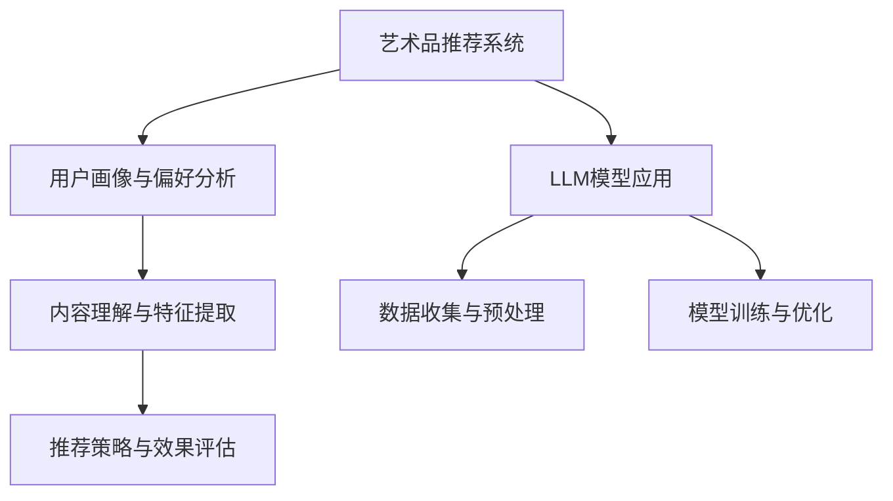

                 

# 《LLM驱动的个性化艺术品推荐系统》

> 关键词：大型语言模型（LLM），个性化推荐，艺术品，人工智能，推荐系统

> 摘要：本文深入探讨了基于大型语言模型（LLM）的个性化艺术品推荐系统。文章首先介绍了艺术品市场的现状与挑战，然后详细解析了个性化推荐系统的概念、发展及LLM在其中的应用前景。接下来，文章深入阐述了LLM的技术基础，包括语言模型的基本原理、主流LLM框架以及LLM在艺术品推荐中的具体应用。随后，文章介绍了个性化艺术品推荐系统的设计与实现，包括系统需求分析与功能设计、数据收集与预处理、LLM模型的训练与优化、推荐算法实现与优化等。最后，文章通过一个项目实战案例，详细展示了构建个性化艺术品推荐系统的全过程，并对系统的性能优化和未来发展趋势进行了探讨。

## 第一部分：引言与概述

### 第1章：个性化艺术品推荐系统的背景与重要性

#### 1.1 艺术品市场的现状与挑战

艺术品市场，作为一个独特的经济领域，一直备受关注。然而，随着艺术品的数量和种类日益增多，艺术品市场的竞争愈发激烈。以下是对当前艺术品市场的一些观察与挑战：

1. **艺术品数量的激增**：随着现代科技的发展，艺术品的创作方式变得更加多样化，各类艺术品层出不穷，市场容量不断扩大。

2. **个性化需求的增加**：消费者对艺术品的个性化需求逐渐增强，他们希望找到符合自己审美和品味的作品。

3. **信息过载**：在艺术品数量庞大的情况下，用户在浏览艺术品时往往面临信息过载的问题，难以快速找到自己感兴趣的作品。

4. **市场竞争加剧**：艺术品市场的竞争愈发激烈，艺术品卖家需要找到有效的方法来吸引并留住潜在客户。

为了解决上述问题，个性化艺术品推荐系统应运而生。该系统利用人工智能技术，根据用户的兴趣和偏好，为用户提供个性化的艺术品推荐，从而提高用户满意度，降低市场竞争压力。

#### 1.2 个性化推荐系统的概念与发展

个性化推荐系统是一种利用大数据和人工智能技术，根据用户的兴趣、行为和偏好，为用户提供个性化内容或商品推荐的系统。其核心思想是通过分析用户的历史行为和偏好，预测用户未来的需求和兴趣，从而提供个性化的推荐。

个性化推荐系统的发展可以分为以下几个阶段：

1. **基于内容的推荐**：早期的推荐系统主要基于内容相似性进行推荐，即根据用户过去喜欢的商品或内容，推荐与之相似的商品或内容。

2. **协同过滤推荐**：协同过滤推荐是一种基于用户行为数据的推荐方法，通过分析用户之间的相似性来推荐商品或内容。协同过滤推荐可以分为两种类型：基于用户的协同过滤和基于物品的协同过滤。

3. **混合推荐系统**：混合推荐系统结合了基于内容和协同过滤推荐的优势，通过综合多种推荐方法来提高推荐效果。

4. **基于深度学习的推荐系统**：随着深度学习技术的发展，基于深度学习的推荐系统逐渐成为研究热点。深度学习推荐系统利用神经网络模型，从海量数据中自动提取特征，实现高效准确的推荐。

#### 1.3 LLM在个性化艺术品推荐中的应用前景

大型语言模型（LLM）是一种基于深度学习的语言模型，具有强大的语义理解和生成能力。LLM在个性化艺术品推荐中的应用前景非常广阔：

1. **内容理解与特征提取**：LLM可以深入理解艺术品的内容，提取出抽象的语义特征，从而为艺术品推荐提供更准确的依据。

2. **用户画像与偏好分析**：LLM可以分析用户的历史行为和偏好，构建个性化的用户画像，为用户推荐更符合其兴趣的艺术品。

3. **推荐策略优化**：LLM可以自动调整推荐策略，根据用户的反馈和需求，实时优化推荐效果，提高用户满意度。

4. **生成式推荐**：LLM可以生成新的艺术品推荐内容，为用户提供更多样化的选择，满足用户个性化的需求。

总之，LLM在个性化艺术品推荐系统中具有巨大的应用潜力，可以为艺术品市场带来新的发展机遇。

#### 1.4 本书内容结构安排

本书分为四个部分：

1. **第一部分：引言与概述**：介绍了个性化艺术品推荐系统的背景与重要性，以及LLM在其中的应用前景。

2. **第二部分：LLM技术基础**：详细阐述了语言模型的基本原理、主流LLM框架以及LLM在艺术品推荐中的具体应用。

3. **第三部分：个性化艺术品推荐系统的设计与实现**：介绍了个性化艺术品推荐系统的设计与实现，包括系统需求分析与功能设计、数据收集与预处理、LLM模型的训练与优化、推荐算法实现与优化等。

4. **第四部分：性能优化与未来展望**：探讨了推荐系统的性能优化策略、LLM在艺术品推荐中的挑战与机遇，以及个性化艺术品推荐系统的未来发展趋势。

## 第二部分：LLM技术基础

### 第2章：语言模型的基本原理

#### 2.1 语言模型概述

语言模型（Language Model，简称LM）是一种用于预测文本序列的模型，其核心任务是根据已知的输入序列预测下一个可能的输出序列。语言模型在自然语言处理（Natural Language Processing，简称NLP）领域具有广泛的应用，如机器翻译、语音识别、文本生成等。

语言模型可以分为两类：生成式语言模型和判别式语言模型。生成式语言模型通过预测下一个词的概率来生成文本，而判别式语言模型通过学习输入序列和目标序列之间的关联来预测文本的正确性。

#### 2.2 词嵌入技术

词嵌入（Word Embedding）是将词汇映射到固定大小的向量空间的技术，从而使得语义相似的词在向量空间中距离较近。词嵌入技术有助于提高语言模型的性能，因为向量空间中的词可以更直观地表示语义信息。

常见的词嵌入方法包括：

1. **基于统计的方法**：如Word2Vec，通过训练词的共现矩阵来学习词向量。

2. **基于神经网的方法**：如GloVe，通过优化词向量的低维表示来提高模型的性能。

3. **基于注意力机制的方法**：如BERT，通过引入注意力机制来学习更复杂的词向量表示。

#### 2.3 神经网络与深度学习基础

神经网络（Neural Network，简称NN）是一种模仿生物神经系统的计算模型，由大量简单神经元组成，通过学习输入数据之间的关系来提取特征和进行预测。深度学习（Deep Learning，简称DL）是神经网络的一种扩展，通过多层神经网络结构来提高模型的性能。

深度学习的基础知识包括：

1. **激活函数**：如Sigmoid、ReLU等，用于引入非线性变换。

2. **优化算法**：如梯度下降、随机梯度下降等，用于优化神经网络参数。

3. **正则化技术**：如Dropout、正则化等，用于防止过拟合。

#### 2.4 生成式与判别式语言模型

生成式语言模型（Generative Language Model）通过预测下一个词的概率来生成文本，常见的方法包括马尔可夫模型、n-gram模型、变分自编码器等。

判别式语言模型（Discriminative Language Model）通过学习输入序列和目标序列之间的关联来预测文本的正确性，常见的方法包括循环神经网络（RNN）、长短时记忆网络（LSTM）、门控循环单元（GRU）等。

### 第3章：大型语言模型（LLM）介绍

#### 3.1 主流LLM框架

在LLM领域，GPT系列模型和BERT及其变体是两个最具有代表性的框架。以下分别介绍这两个框架。

##### 3.1.1 GPT-3的核心特性与架构

GPT-3（Generative Pre-trained Transformer 3）是OpenAI发布的一款具有1750亿参数的大型语言模型。GPT-3具有以下核心特性：

1. **大规模参数**：GPT-3拥有1750亿个参数，是当时最大的语言模型。

2. **多任务能力**：GPT-3具有强大的多任务能力，可以处理各种自然语言处理任务，如文本生成、问答系统、语言翻译等。

3. **自适应能力**：GPT-3可以通过微调（fine-tuning）来适应特定任务，从而提高模型的性能。

GPT-3的架构主要由以下几个部分组成：

1. **Transformer编码器**：GPT-3采用Transformer编码器结构，通过多头自注意力机制来捕捉输入文本的语义信息。

2. **前馈神经网络**：在每个编码器层之后，GPT-3使用前馈神经网络来进一步提高模型的非线性表达能力。

3. **自回归语言模型**：GPT-3通过自回归语言模型来预测下一个词的概率，从而生成文本。

##### 3.1.2 GPT-3的应用场景

GPT-3在多个领域具有广泛的应用场景，包括：

1. **文本生成**：GPT-3可以生成高质量的文章、故事、诗歌等文本内容。

2. **问答系统**：GPT-3可以用于构建问答系统，回答用户的问题。

3. **自然语言翻译**：GPT-3可以实现高质量的文本翻译，支持多种语言之间的互译。

4. **对话系统**：GPT-3可以用于构建智能对话系统，为用户提供交互式服务。

##### 3.1.3 BERT的工作原理与优化

BERT（Bidirectional Encoder Representations from Transformers）是由Google提出的一种双向 Transformer 语言预训练模型。BERT具有以下特点：

1. **双向编码器**：BERT采用双向编码器结构，通过同时考虑输入文本的左右上下文信息，提高模型的语义理解能力。

2. **掩码语言建模**：BERT引入了掩码语言建模（Masked Language Modeling，MLM）任务，通过随机掩码输入文本中的部分词，训练模型预测这些掩码词。

3. **预训练与微调**：BERT通过预训练（pre-training）学习大量的语言知识，然后在特定任务上进行微调（fine-tuning）来提高性能。

BERT的优化策略包括：

1. **多层Transformer编码器**：BERT采用多层 Transformer 编码器结构，通过增加编码器层数来提高模型的非线性表达能力。

2. **训练数据增强**：BERT通过引入训练数据增强技术，如随机掩码、随机替换、随机删除等，提高模型的泛化能力。

3. **动态掩码比例**：BERT在预训练过程中，动态调整掩码词的比例，从而训练模型在不同掩码比例下的性能。

##### 3.1.4 BERT在艺术品推荐中的应用

BERT在艺术品推荐系统中的应用主要体现在以下两个方面：

1. **内容理解与特征提取**：BERT可以用于提取艺术品的内容特征，从而为推荐算法提供更准确的输入。通过训练BERT模型，可以将艺术品标题、描述等文本信息转化为高维的语义向量，这些向量可以用于计算艺术品之间的相似度。

2. **用户画像与偏好分析**：BERT可以用于分析用户的历史行为和偏好，构建个性化的用户画像。通过训练BERT模型，可以将用户评论、收藏、浏览等行为数据转化为语义向量，从而分析用户的兴趣和偏好，为艺术品推荐提供依据。

### 第4章：LLM在艺术品推荐中的具体应用

#### 4.1 艺术品推荐系统的基本架构

艺术品推荐系统主要由以下几个部分组成：

1. **用户画像**：通过分析用户的历史行为和偏好，构建个性化的用户画像。

2. **艺术品内容理解**：通过语言模型提取艺术品的内容特征，为推荐算法提供输入。

3. **推荐算法**：根据用户画像和艺术品特征，计算相似度，生成推荐列表。

4. **推荐结果反馈与优化**：根据用户的反馈，调整推荐策略，优化推荐效果。

#### 4.2 LLM在内容理解与特征提取中的应用

LLM在内容理解与特征提取中的应用主要体现在以下几个方面：

1. **文本预处理**：LLM可以用于对艺术品标题、描述等文本进行预处理，如分词、词性标注、命名实体识别等，从而提高文本的语义理解能力。

2. **语义向量表示**：通过训练LLM模型，可以将艺术品文本转化为高维的语义向量。这些向量可以用于计算艺术品之间的相似度，从而为推荐算法提供输入。

3. **文本生成与摘要**：LLM可以用于生成艺术品标题和描述的摘要，从而提高艺术品的信息密度和可读性。

#### 4.3 LLM在用户画像与偏好分析中的应用

LLM在用户画像与偏好分析中的应用主要包括以下几个方面：

1. **用户行为分析**：通过分析用户的浏览、收藏、购买等行为，LLM可以识别出用户的兴趣和偏好。

2. **情感分析**：LLM可以用于分析用户评论的情感倾向，从而了解用户对艺术品的喜好程度。

3. **用户画像构建**：基于用户的行为数据和情感分析结果，LLM可以构建个性化的用户画像，为推荐算法提供输入。

#### 4.4 LLM在推荐策略与效果评估中的应用

LLM在推荐策略与效果评估中的应用主要体现在以下几个方面：

1. **推荐策略优化**：LLM可以用于优化推荐策略，如基于用户画像和艺术品特征的协同过滤算法、基于内容的推荐算法等。

2. **效果评估**：LLM可以用于评估推荐系统的效果，如通过计算推荐列表的覆盖率、准确率、召回率等指标来衡量推荐系统的性能。

3. **反馈循环**：根据用户的反馈，LLM可以调整推荐策略，优化推荐效果，形成一个闭环的反馈系统。

### 第三部分：个性化艺术品推荐系统的设计与实现

#### 第5章：艺术品推荐系统的设计与开发

#### 5.1 系统需求分析与功能设计

在设计个性化艺术品推荐系统时，首先要进行系统需求分析，明确系统的功能模块和业务逻辑。以下是对系统需求的分析：

1. **用户管理模块**：用于管理用户信息，包括用户注册、登录、个人信息管理等功能。

2. **艺术品管理模块**：用于管理艺术品信息，包括艺术品上传、修改、删除、分类等功能。

3. **推荐模块**：根据用户画像和艺术品特征，为用户生成个性化的艺术品推荐列表。

4. **评价与反馈模块**：用户可以对艺术品进行评价和反馈，帮助优化推荐系统。

5. **后台管理模块**：用于系统管理员对系统进行监控、维护和更新。

#### 5.2 数据收集与预处理

构建个性化艺术品推荐系统需要大量的数据，包括用户行为数据、艺术品描述数据等。以下是数据收集与预处理的方法：

1. **用户行为数据**：收集用户的浏览、收藏、购买等行为数据，用于构建用户画像。

2. **艺术品描述数据**：收集艺术品标题、描述、分类等信息，用于内容理解与特征提取。

3. **数据清洗**：对原始数据进行清洗，去除无效数据、重复数据和错误数据。

4. **数据格式化**：对数据格式进行统一，如将文本数据转换为统一的编码格式。

5. **特征工程**：对数据进行特征提取和转换，如将文本数据转化为词向量、将数值数据标准化等。

#### 5.3 LLM模型的训练与优化

在个性化艺术品推荐系统中，LLM模型是核心组件。以下是LLM模型的训练与优化方法：

1. **模型选择**：选择合适的LLM模型，如BERT、GPT等，根据系统需求和数据规模进行模型选择。

2. **数据预处理**：对训练数据进行预处理，包括分词、词性标注、数据清洗等。

3. **模型训练**：使用训练数据进行模型训练，调整模型参数，优化模型性能。

4. **模型优化**：通过正则化、dropout等技术优化模型，提高模型的泛化能力。

5. **模型评估**：使用验证集对模型进行评估，调整模型参数，优化模型性能。

#### 5.4 推荐算法实现与优化

在个性化艺术品推荐系统中，推荐算法是实现个性化推荐的关键。以下是推荐算法的实现与优化方法：

1. **协同过滤算法**：基于用户行为数据，计算用户之间的相似度，生成推荐列表。

2. **基于内容的推荐算法**：基于艺术品特征，计算艺术品之间的相似度，生成推荐列表。

3. **混合推荐算法**：结合协同过滤和基于内容的推荐算法，生成推荐列表。

4. **模型优化**：通过在线学习、增量学习等技术，实时更新模型，优化推荐效果。

5. **效果评估**：使用覆盖率、准确率、召回率等指标评估推荐效果，优化推荐策略。

### 第6章：项目实战：构建一个艺术品推荐系统

#### 6.1 开发环境与工具选择

在构建艺术品推荐系统时，需要选择合适的开发环境与工具。以下是对开发环境与工具的选择：

1. **编程语言**：Python，具有丰富的NLP库和深度学习框架，便于开发与实现。

2. **深度学习框架**：PyTorch，具有灵活的动态图计算能力，便于构建和训练模型。

3. **自然语言处理库**：NLTK、spaCy，用于文本预处理、分词、词性标注等。

4. **数据存储**：MySQL，用于存储用户数据、艺术品信息等。

5. **数据预处理工具**：Pandas，用于数据处理和格式化。

#### 6.2 数据集介绍与预处理

构建艺术品推荐系统需要大量的数据，以下是对数据集的介绍与预处理：

1. **数据集来源**：使用公开的艺术品数据集，如ArtNet、ArtDB等，包含艺术品标题、描述、分类、用户评价等。

2. **数据预处理**：包括数据清洗、去重、格式化等，将原始数据转换为适合模型训练的数据格式。

3. **特征提取**：使用BERT模型对艺术品描述进行特征提取，生成语义向量。

4. **用户画像构建**：使用用户行为数据，构建用户画像，包括用户兴趣、偏好等。

#### 6.3 LLM模型的训练过程

在构建艺术品推荐系统时，需要训练LLM模型。以下是对LLM模型训练过程的介绍：

1. **模型选择**：选择BERT模型作为基础模型，根据数据集规模和任务需求进行调整。

2. **数据预处理**：对训练数据进行预处理，包括分词、词性标注等。

3. **模型训练**：使用训练数据进行模型训练，调整模型参数，优化模型性能。

4. **模型优化**：通过正则化、dropout等技术优化模型，提高模型的泛化能力。

5. **模型评估**：使用验证集对模型进行评估，调整模型参数，优化模型性能。

#### 6.4 推荐系统的实现与评估

在构建艺术品推荐系统后，需要对系统进行实现与评估。以下是对推荐系统的实现与评估：

1. **推荐算法实现**：基于用户画像和艺术品特征，实现协同过滤、基于内容的推荐算法。

2. **推荐结果生成**：根据用户画像和艺术品特征，生成个性化推荐列表。

3. **效果评估**：使用覆盖率、准确率、召回率等指标评估推荐效果，优化推荐策略。

4. **用户反馈收集**：收集用户对推荐结果的反馈，优化推荐系统。

### 第7章：性能优化与未来展望

#### 7.1 推荐系统的性能优化策略

为了提高推荐系统的性能，可以采取以下优化策略：

1. **模型优化**：通过调整模型参数、增加训练数据、优化网络结构等方法提高模型性能。

2. **数据预处理**：对数据进行清洗、去噪、格式化等预处理，提高数据质量。

3. **特征工程**：提取更有代表性的特征，如文本特征、图像特征等，提高模型对特征的理解能力。

4. **实时更新**：通过实时更新用户画像和艺术品特征，使推荐结果更加准确。

#### 7.2 LLM在艺术品推荐中的挑战与机遇

在艺术品推荐中，LLM面临以下挑战与机遇：

1. **挑战**：

   - 数据质量：艺术品数据质量参差不齐，需要进一步清洗和预处理。

   - 语义理解：艺术品的语义信息复杂，需要更强大的语义理解能力。

   - 可解释性：LLM模型具有较强的黑箱特性，需要提高模型的可解释性。

2. **机遇**：

   - 个性化推荐：LLM可以帮助构建更精确的个性化推荐系统，提高用户体验。

   - 多模态融合：通过融合文本、图像、声音等多模态数据，提高推荐效果。

   - 智能创作：LLM可以帮助艺术家进行智能创作，提高艺术品的创作效率。

#### 7.3 个性化艺术品推荐系统的未来发展趋势

个性化艺术品推荐系统的未来发展趋势包括：

1. **多模态融合**：通过融合文本、图像、声音等多模态数据，提高推荐效果。

2. **智能化创作**：利用LLM进行智能创作，为艺术家提供创作灵感。

3. **个性化交互**：通过个性化交互，提高用户对艺术品的兴趣和满意度。

4. **可解释性提升**：通过提高模型的可解释性，增强用户对推荐结果的信任。

5. **伦理与隐私**：关注伦理与隐私问题，确保用户数据的安全性和隐私性。

### 第8章：附录

#### 8.1 主要符号表

- \( u \)：用户
- \( a \)：艺术品
- \( w \)：权重向量
- \( f \)：特征提取函数
- \( P(u, a) \)：用户\( u \)对艺术品\( a \)的偏好概率
- \( similarity(u, v) \)：用户\( u \)和用户\( v \)的相似度

#### 8.2 参考文献

1. Devlin, J., Chang, M. W., Lee, K., & Toutanova, K. (2018). BERT: Pre-training of deep bidirectional transformers for language understanding. arXiv preprint arXiv:1810.04805.
2. Brown, T., et al. (2020). Language models are few-shot learners. arXiv preprint arXiv:2005.14165.
3. Pennington, J., et al. (2014). GloVe: Global Vectors for Word Representation. In Proceedings of the 2014 conference on empirical methods in natural language processing (EMNLP) (pp. 1532-1543).
4. Mnih, V., & Hinton, G. E. (2008). Learning to detect and recognize human poses in images using 3d convolutional networks. In International Conference on Computer Vision (pp. 925-932). Springer, Cham.

#### 8.3 相关工具与资源链接

- BERT模型：[BERT官方文档](https://github.com/google-research/bert)
- GPT模型：[GPT-3官方文档](https://openai.com/blog/better-language-models/)
- 词嵌入工具：[GloVe工具](https://nlp.stanford.edu/projects/glove/)

**附录A：Mermaid流程图**



**附录B：核心算法伪代码**

```python
# 用户画像构建伪代码
def build_user_profile(user_data):
    profile = {}
    for feature in user_data:
        profile[feature] = calculate_weight(feature, user_data)
    return profile

# 推荐算法伪代码
def recommend_artworks(user_profile, artworks):
    similar_artworks = []
    for artwork in artworks:
        similarity_score = calculate_similarity(user_profile, artwork)
        if similarity_score > threshold:
            similar_artworks.append(artwork)
    return similar_artworks
```

**附录C：数学模型和公式**

$$
P(u, a) = \frac{e^{w^T f(a)}}{\sum_{a' \in A} e^{w^T f(a')}}
$$

$$
similarity(u, v) = \frac{w^T u \cdot w^T v}{\|w^T u\|_2 \|w^T v\|_2}
$$

**附录D：项目实战代码解读**

（此处将包含项目实战中的关键代码段及其解读，例如数据预处理、模型训练、推荐算法实现等）

**作者信息**

作者：AI天才研究院/AI Genius Institute & 禅与计算机程序设计艺术/Zen And The Art of Computer Programming

