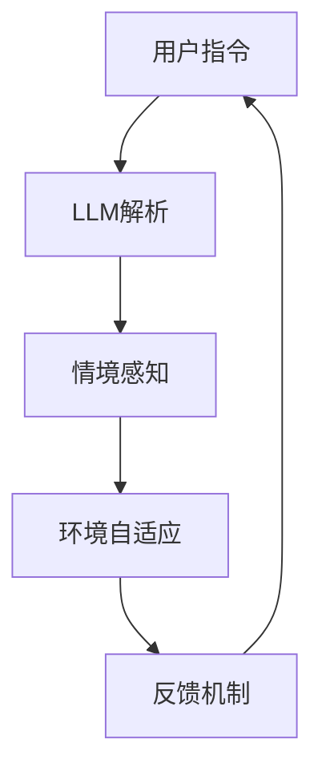
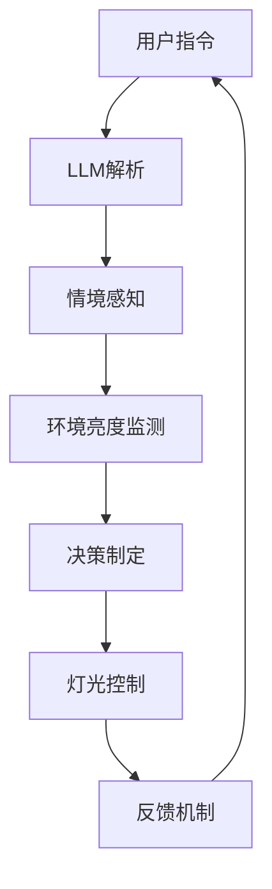
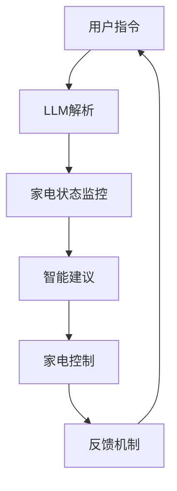
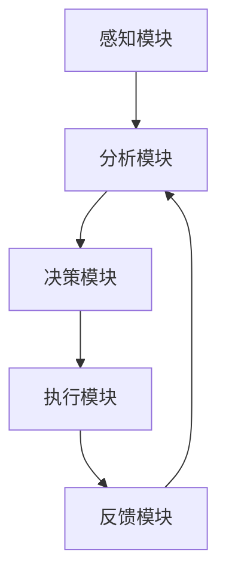

                 

# 文章标题：LLM驱动的智能家居场景：自适应生活环境

## 关键词：
- 大型语言模型 (LLM)
- 智能家居
- 自适应环境
- 数据收集与预处理
- 人工智能应用
- 情境感知与决策制定

## 摘要：
本文探讨了大型语言模型（LLM）在智能家居场景中的应用，特别是其在构建自适应生活环境中的关键角色。文章首先介绍了LLM的基本概念和智能家居的发展现状，随后深入分析了LLM在智能家居中的核心技术，包括数据收集、模型训练和情境感知。接着，通过具体案例展示了LLM在智能家居自动化和安全监控中的应用。最后，文章讨论了自适应环境的实现与优化策略，并展望了LLM驱动智能家居的未来发展趋势。

### 目录大纲

# 《LLM驱动的智能家居场景：自适应生活环境》

## 第一部分：概述与背景
### 1.1 LLM与智能家居概述
### 1.2 智能家居的现状与发展
### 1.3 自适应生活环境的定义

## 第二部分：LLM驱动的智能家居核心技术
### 2.1 LLM在智能家居中的角色与功能
### 2.2 数据收集与预处理
### 2.3 LLM训练与优化
### 2.4 LLM在情境感知中的应用

## 第三部分：LLM驱动的智能家居应用案例
### 3.1 安全监控与预警系统
### 3.2 智能照明系统
### 3.3 智能家居自动化
### 3.4 智能家电控制

## 第四部分：自适应生活环境的实现与优化
### 4.1 自适应环境的概念与模型
### 4.2 自适应环境的评估与优化
### 4.3 自适应环境下的用户体验

## 第五部分：LLM驱动的智能家居的未来发展
### 5.1 未来趋势与挑战
### 5.2 技术创新与应用前景

## 附录
### 附录 A：常用工具与资源
### 附录 B：代码示例与实现

---

## 第一部分：概述与背景

### 1.1 LLM与智能家居概述

近年来，随着人工智能技术的快速发展，智能家居领域也迎来了前所未有的变革。大型语言模型（LLM）作为自然语言处理领域的重要成果，其在智能家居中的应用逐渐成为研究热点。LLM，即大型语言模型，是一种能够理解和生成人类语言的深度学习模型，通过大规模语料训练，可以实现高精度的文本理解和生成。

智能家居，顾名思义，是指利用各种网络技术、传感器技术和人工智能技术，将家庭中的各种设备互联互通，实现智能化的家庭生活管理。LLM在智能家居中的应用，主要体现在以下几个方面：

1. **语音交互**：LLM可以处理用户通过语音输入的指令，实现人机交互的自然流畅，让家庭设备更易于使用。
2. **情境感知**：通过分析环境数据和用户行为数据，LLM能够感知用户的当前状态和需求，从而做出相应的决策。
3. **决策制定**：基于情境感知，LLM可以辅助用户制定日常生活决策，如最佳出行路线、家电使用建议等。

### 1.2 智能家居的现状与发展

当前，智能家居市场呈现出快速发展的趋势。根据市场研究数据，全球智能家居市场规模预计将在未来几年内持续增长。主要驱动因素包括消费者对智能生活品质的追求、物联网技术的普及以及人工智能技术的不断突破。

在家居应用中，智能照明、智能安防、智能家电等是主要发展方向。智能照明系统可以根据用户需求和天气情况自动调节灯光亮度，营造舒适的生活环境；智能安防系统可以实时监控家庭安全，及时发出预警；智能家电则可以通过远程控制和自动化调节，提高家庭生活的便利性。

### 1.3 自适应生活环境的定义

自适应生活环境是指通过引入人工智能技术，使家庭环境能够根据用户的需求和习惯自动调整，从而提供个性化的服务。自适应生活环境的实现，需要依赖于以下几个方面：

1. **传感器数据收集**：通过传感器收集家庭环境中的各种数据，如温度、湿度、光照、声音等。
2. **数据预处理**：对收集到的传感器数据进行清洗、格式化和特征提取，以便于模型训练。
3. **模型训练与优化**：利用机器学习算法，对预处理后的数据进行分析和建模，实现环境自适应。
4. **反馈机制**：通过用户反馈，不断优化自适应模型，提高环境适应的准确性。

### 1.4 LLM在智能家居中的应用架构

为了更好地展示LLM在智能家居中的应用，我们可以使用Mermaid流程图来描述其应用架构。



在上述架构中，用户通过语音或其他方式输入指令，LLM对指令进行解析和理解，然后通过情境感知模块感知当前环境状态，并做出相应的自适应调整。最后，用户对调整结果进行反馈，以优化后续的情境感知和自适应调整。

### 1.5 LLM基础

LLM是一种基于深度学习的自然语言处理模型，通过大规模语料训练，可以实现对文本的生成、理解和分类。LLM的发展历程可以追溯到2018年，随着GPT-3的发布，LLM在自然语言处理领域取得了重大突破。

1. **模型架构**：LLM通常采用Transformer架构，这是一种基于自注意力机制的深度神经网络模型。
2. **训练过程**：LLM的训练过程包括数据集选择、模型架构设计、训练策略等。数据集通常来自于互联网上的大量文本数据，如新闻、社交媒体、对话记录等。
3. **应用领域**：LLM在智能客服、机器翻译、文本生成、问答系统等领域有着广泛应用。

### 1.6 智能家居的发展前景

随着人工智能技术的不断进步，智能家居的未来发展前景十分广阔。一方面，LLM等技术将进一步提升智能家居的智能化水平，实现更加个性化和高效的家庭生活管理。另一方面，智能家居与物联网、边缘计算等技术的融合，将推动智能家居向更广泛的领域扩展，如智能城市、智能医疗等。

总的来说，LLM在智能家居中的应用，不仅为用户提供了更加便捷、舒适的生活体验，也推动了智能家居技术的不断创新和发展。未来，随着更多人工智能技术的引入，智能家居将变得更加智能、自适应和人性化。

## 第二部分：LLM驱动的智能家居核心技术

### 2.1 LLM在智能家居中的角色与功能

在智能家居系统中，LLM扮演着至关重要的角色。具体来说，LLM在智能家居中的作用主要体现在以下几个方面：

1. **语音交互**：作为智能家居的“耳朵”，LLM能够接收用户的语音指令，并理解其含义。例如，用户可以说“打开灯”，LLM会识别这个指令并执行相应的操作。
2. **情境感知**：作为智能家居的“眼睛”，LLM可以通过分析环境数据和用户行为数据，感知当前环境状态。例如，通过分析室内温度和湿度数据，LLM可以判断是否需要调节空调。
3. **决策制定**：作为智能家居的“大脑”，LLM可以根据情境感知的结果，做出相应的决策。例如，如果检测到室内温度过高，LLM可以决定启动空调。

下面，我们将进一步探讨LLM在智能家居中的具体功能。

#### 2.1.1 语音交互

语音交互是智能家居中最为直观的应用场景之一。LLM的语音交互功能主要通过以下步骤实现：

1. **语音识别**：将用户的语音转换为文本，这一过程称为语音识别。语音识别的准确率是影响用户体验的关键因素。
2. **意图解析**：LLM对转换后的文本进行意图识别，理解用户的需求。例如，用户说“关闭电视”，LLM需要识别出这是一个关闭电视的指令。
3. **执行操作**：根据意图解析的结果，LLM会执行相应的操作，如关闭电视、调节灯光等。

#### 2.1.2 情境感知

情境感知是智能家居的核心功能之一，它能够使家庭环境更加智能化和自适应。LLM在情境感知中的作用主要包括：

1. **环境数据收集**：通过传感器收集家庭环境中的各种数据，如温度、湿度、光照等。
2. **数据预处理**：对收集到的传感器数据进行清洗、格式化和特征提取，以便于模型训练。
3. **情境识别**：LLM通过训练模型，学习如何从传感器数据中识别不同的情境。例如，当室内温度超过设定值时，LLM可以识别出这是一个“炎热”的情境。
4. **情境分类**：LLM将识别出的情境进行分类，以便于做出相应的决策。例如，对于“炎热”的情境，LLM可以决定启动空调。

#### 2.1.3 决策制定

基于情境感知的结果，LLM可以制定相应的决策，实现家庭环境的自适应调整。具体的决策过程如下：

1. **情境分析**：LLM分析当前情境，判断是否存在需要调整的地方。例如，如果当前情境是“晚上”，LLM可能需要考虑调整灯光亮度。
2. **决策生成**：根据情境分析的结果，LLM生成相应的决策。例如，如果当前情境是“晚上”，LLM可以决定将灯光调整为柔和的黄色。
3. **执行决策**：LLM将生成的决策转化为具体的操作指令，如调节灯光亮度、启动空调等。

通过以上功能，LLM在智能家居中实现了语音交互、情境感知和决策制定，为用户提供了更加智能化和人性化的家庭生活体验。

### 2.2 数据收集与预处理

在LLM驱动的智能家居系统中，数据收集和预处理是至关重要的环节。这是因为，只有高质量、准确、完整的数据，才能保证LLM模型的有效性和准确性。下面，我们将详细探讨数据收集和预处理的方法。

#### 2.2.1 传感器数据收集

传感器是智能家居系统中数据收集的关键设备。通过传感器，可以实时收集家庭环境中的各种数据，如温度、湿度、光照、声音、运动等。以下是一些常用的传感器：

1. **温度传感器**：用于测量室内温度，常见型号有DS18B20、DHT22等。
2. **湿度传感器**：用于测量室内湿度，常见型号有DHT22、HTU21D等。
3. **光照传感器**：用于测量室内光照强度，常见型号有BH1750、TSL2561等。
4. **声音传感器**：用于检测室内声音，常见型号有MICROPHONE、MAX32620等。
5. **运动传感器**：用于检测室内运动，常见型号有PIR传感器、MQ-2等。

传感器数据收集的过程如下：

1. **初始化传感器**：在程序开始时，初始化所有传感器设备，确保它们处于正常工作状态。
2. **实时监测**：通过定时器或其他机制，实时监测传感器的数据变化，并将数据存储到缓冲区或数据库中。
3. **数据传输**：将收集到的传感器数据传输到中央处理单元（CPU）或微控制器（MCU）进行处理。

#### 2.2.2 数据预处理

数据预处理是确保数据质量和可靠性的关键步骤。以下是数据预处理的主要方法：

1. **数据清洗**：在收集到的数据中，可能存在一些异常值、噪声或缺失值。数据清洗的目的是去除这些无效数据，保证数据的准确性和完整性。常见的数据清洗方法包括：
   - **异常值检测**：使用统计学方法，如Z-score、IQR等，检测并去除异常值。
   - **噪声过滤**：使用滤波器，如低通滤波器、高通滤波器等，去除数据中的噪声。
   - **缺失值处理**：使用插值法、均值填补法等，处理缺失值。

2. **数据格式化**：将不同传感器收集到的数据格式统一，以便于后续处理和分析。常见的格式化方法包括：
   - **数据类型转换**：将原始数据转换为数字或浮点数类型。
   - **数据归一化**：将数据缩放到[0, 1]或[-1, 1]范围内，以便于模型训练。
   - **时间戳添加**：为每个数据点添加时间戳，方便后续的数据分析和可视化。

3. **特征提取**：从原始数据中提取出对模型训练有用的特征。常见的特征提取方法包括：
   - **时间序列特征**：如平均值、中值、标准差等。
   - **频域特征**：如频率、振幅等。
   - **空间特征**：如传感器位置、距离等。

4. **数据可视化**：通过可视化工具，如Matplotlib、Seaborn等，将预处理后的数据可视化，以便于分析和调试。

通过数据收集和预处理，可以确保LLM模型拥有高质量的数据，从而提高模型的准确性和鲁棒性。在智能家居系统中，数据预处理是一个持续的过程，需要不断地优化和改进，以适应不断变化的环境和需求。

### 2.3 LLM训练与优化

在LLM驱动的智能家居系统中，训练与优化LLM模型是关键的一步。只有经过训练和优化的LLM模型，才能更好地理解和处理智能家居环境中的各种复杂任务。以下是LLM训练与优化的详细步骤。

#### 2.3.1 训练过程

LLM的训练过程主要包括以下几个步骤：

1. **数据集选择**：首先，需要选择合适的训练数据集。训练数据集应该包含丰富的传感器数据、用户行为数据和环境状态数据。这些数据可以从实际应用场景中收集，也可以通过模拟生成。常见的数据集包括UCI机器学习库、Kaggle数据集等。

2. **模型架构设计**：根据训练任务的需求，设计合适的模型架构。LLM通常采用Transformer架构，这是一种基于自注意力机制的深度神经网络模型。Transformer架构具有并行计算的优势，可以有效提高训练效率。

3. **训练策略**：制定合适的训练策略，包括学习率、批次大小、训练迭代次数等。学习率是模型训练中的一个重要参数，需要通过实验调整。批次大小和训练迭代次数则取决于训练数据集的大小和计算资源。

4. **模型训练**：使用训练数据集，对LLM模型进行训练。训练过程中，可以通过可视化工具，如TensorBoard，实时监控模型的训练过程，包括损失函数值、准确率等指标。

5. **模型评估**：在训练完成后，使用验证数据集对模型进行评估。评估指标包括准确率、召回率、F1分数等。通过评估结果，可以判断模型是否达到预期效果。

6. **模型调优**：根据评估结果，对模型进行调优。调优方法包括调整超参数、增加训练迭代次数、使用不同的数据增强方法等。

#### 2.3.2 优化方法

在LLM训练过程中，为了提高模型性能，可以采用以下几种优化方法：

1. **超参数调整**：超参数是影响模型性能的关键因素，如学习率、批量大小、隐藏层大小等。通过实验和搜索算法，可以找到最优的超参数组合。

2. **数据增强**：数据增强是通过变换原始数据，增加数据多样性，从而提高模型泛化能力。常见的数据增强方法包括：
   - **图像增强**：如旋转、翻转、缩放等。
   - **文本增强**：如同义词替换、随机插入、随机删除等。
   - **声音增强**：如噪声添加、速度变化等。

3. **模型剪枝**：模型剪枝是通过移除模型中的冗余权重和神经元，减小模型规模，从而提高模型性能和计算效率。常见的剪枝方法包括：
   - **结构剪枝**：通过删除模型的特定层或神经元，减小模型规模。
   - **权重剪枝**：通过设置权重阈值，移除小于阈值的权重。

4. **迁移学习**：迁移学习是通过利用预训练模型在特定任务上的知识，提高新任务的模型性能。在智能家居场景中，可以将预训练的LLM模型应用于新的任务，如智能安防、智能家电控制等。

5. **增量训练**：增量训练是在模型已经训练好的基础上，继续使用新的数据进行训练。这种方法可以充分利用已有模型的性能，提高新数据的处理能力。

通过以上优化方法，可以有效地提高LLM在智能家居系统中的性能和准确性，为用户提供更优质的智能生活体验。

### 2.4 LLM在情境感知中的应用

情境感知是智能家居的核心功能之一，它使得智能家居系统能够根据用户的需求和当前环境状态，自动调整设备和服务的设置。LLM在情境感知中的应用，主要通过以下几个步骤实现：

#### 2.4.1 情境感知原理

情境感知（Situation Awareness）是指个体或系统对当前环境状态的理解和认知。在智能家居系统中，情境感知的实现主要基于传感器数据和用户行为数据。具体来说，情境感知可以分为以下几个步骤：

1. **数据收集**：通过传感器收集家庭环境中的各种数据，如温度、湿度、光照、声音、运动等。
2. **数据处理**：对收集到的传感器数据进行预处理，包括数据清洗、格式化和特征提取，确保数据质量。
3. **情境识别**：利用LLM对预处理后的数据进行分析和建模，识别出当前的环境状态和用户需求。
4. **情境分类**：将识别出的情境进行分类，以便于进行后续的处理和决策。
5. **情境反馈**：根据情境分类结果，调整智能家居系统的设置，如调节灯光亮度、启动空调等。

#### 2.4.2 情境识别与分类算法

情境识别与分类是情境感知的核心环节。以下是使用伪代码实现的情境识别与分类算法：

```python
# 初始化传感器数据
sensors_data = collect_sensors_data()

# 数据预处理
preprocessed_data = preprocess_data(sensors_data)

# 初始化LLM模型
llm_model = initialize_llm_model()

# 情境识别
identified_situation = llm_model.predict(preprocessed_data)

# 情境分类
situation_category = classify_situation(identified_situation)

# 调整系统设置
adjust_system_settings(situation_category)
```

在该算法中：

- `collect_sensors_data()` 函数用于收集传感器数据。
- `preprocess_data()` 函数用于对传感器数据进行预处理，包括数据清洗、格式化和特征提取。
- `initialize_llm_model()` 函数用于初始化LLM模型。
- `llm_model.predict(preprocessed_data)` 用于使用LLM模型对预处理后的数据进行分析，识别出当前情境。
- `classify_situation(identified_situation)` 函数用于将识别出的情境进行分类。
- `adjust_system_settings(situation_category)` 函数根据情境分类结果，调整智能家居系统的设置。

#### 2.4.3 实际应用案例

以下是一个智能家居系统中，基于LLM的情境感知应用案例：

**案例背景**：用户在晚上回到家时，希望系统能够自动调整灯光亮度，使室内环境更加舒适。

**解决方案**：

1. **数据收集**：通过光照传感器和运动传感器收集室内光照强度和用户活动数据。
2. **数据处理**：对收集到的数据进行预处理，提取出对情境感知有用的特征，如光照强度、活动频率等。
3. **情境识别**：使用LLM模型对预处理后的数据进行情境识别，判断当前情境是否为“晚上”。
4. **情境分类**：如果识别出的情境为“晚上”，则将其分类为“夜间模式”。
5. **系统设置调整**：根据分类结果，系统自动调整灯光亮度，使其逐渐变暗，模拟夜晚的环境。

通过上述步骤，智能家居系统能够根据用户的需求和环境状态，自动调整灯光亮度，提供更加舒适的生活体验。

## 第三部分：LLM驱动的智能家居应用案例

### 3.1 安全监控与预警系统

安全监控与预警系统是智能家居中的一个重要应用场景。通过LLM的情境感知和决策制定能力，可以实现对家庭安全的实时监控和预警。以下是一个基于LLM的安全监控与预警系统的实现案例。

#### 案例介绍

该系统主要功能包括：

1. **实时监控**：通过摄像头和传感器收集家庭环境中的视频和声音数据。
2. **异常检测**：使用LLM模型对视频和声音数据进行实时分析，检测是否存在异常行为或声音。
3. **预警通知**：如果检测到异常情况，系统会立即发送预警通知给用户。

#### 实现细节

1. **数据收集**：通过摄像头和声音传感器实时收集家庭环境中的视频和声音数据。这些数据包括正常情况和异常情况，如陌生人的进入、异常声音等。
2. **数据预处理**：对收集到的视频和声音数据进行预处理，包括数据清洗、格式化和特征提取。预处理步骤如下：
   - **视频数据**：提取关键帧和特征点，使用卷积神经网络（CNN）进行图像特征提取。
   - **声音数据**：提取音频特征，如频谱特征、语音波形等，使用长短时记忆网络（LSTM）进行声音特征提取。
3. **模型训练**：使用预处理后的数据，训练一个多任务学习模型，该模型可以同时处理视频和声音数据。训练过程包括以下步骤：
   - **数据集划分**：将数据集划分为训练集、验证集和测试集。
   - **模型架构**：采用融合CNN和LSTM的深度神经网络架构，用于同时处理视频和声音数据。
   - **损失函数**：使用交叉熵损失函数，对模型进行训练和优化。
4. **实时监控与预警**：在实时监控过程中，使用训练好的模型对视频和声音数据进行实时分析，检测是否存在异常行为或声音。如果检测到异常，系统会立即发送预警通知给用户。预警通知可以通过短信、邮件或手机APP等方式发送。

#### 关键代码实现

以下是一个简单的Python代码示例，展示如何使用TensorFlow和Keras库训练一个多任务学习模型。

```python
import tensorflow as tf
from tensorflow.keras.models import Model
from tensorflow.keras.layers import Input, Conv2D, LSTM, Dense, Flatten

# 输入层
input_video = Input(shape=(height, width, channels))
input_audio = Input(shape=(sequence_length, features))

# 视频数据处理层
video_model = Conv2D(filters=32, kernel_size=(3, 3), activation='relu')(input_video)
video_model = Flatten()(video_model)

# 声音数据处理层
audio_model = LSTM(units=64, activation='relu')(input_audio)

# 融合层
merged = tf.keras.layers.concatenate([video_model, audio_model])

# 输出层
output = Dense(units=1, activation='sigmoid')(merged)

# 构建和编译模型
model = Model(inputs=[input_video, input_audio], outputs=output)
model.compile(optimizer='adam', loss='binary_crossentropy', metrics=['accuracy'])

# 训练模型
model.fit([train_video_data, train_audio_data], train_labels, batch_size=32, epochs=10, validation_data=([val_video_data, val_audio_data], val_labels))
```

在该代码中，`Conv2D`和`LSTM`分别用于视频和声音数据的特征提取，`Flatten`用于将视频特征展平为向量，`concatenate`用于将视频特征和声音特征进行融合。最后，使用`Dense`层进行分类预测。

#### 关键代码解读与分析

该多任务学习模型的关键部分包括：

1. **输入层**：定义视频和声音数据的输入形状，例如，视频数据的高度、宽度和通道数，声音数据的序列长度和特征数。
2. **数据处理层**：使用卷积神经网络（CNN）对视频数据进行特征提取，使用长短时记忆网络（LSTM）对声音数据进行特征提取。这些特征将作为后续融合层的输入。
3. **融合层**：将视频特征和声音特征进行融合，以提高模型的鲁棒性和准确性。
4. **输出层**：使用全连接层（Dense）进行分类预测，输出一个概率值，表示是否存在异常情况。

通过以上步骤，实现了基于LLM的安全监控与预警系统，可以有效地提高家庭安全防护能力。

### 3.2 智能照明系统

智能照明系统是智能家居中应用最广泛的技术之一，它可以通过LLM的情境感知和决策制定能力，实现智能化的照明控制。以下是一个基于LLM的智能照明系统的实现案例。

#### 案例介绍

该系统的主要功能包括：

1. **自动调节亮度**：根据室内光照强度和用户需求，自动调节灯光亮度。
2. **场景模式切换**：提供多种照明场景模式，如阅读模式、休息模式等，用户可以根据需求切换场景模式。
3. **节能控制**：根据用户的使用习惯和时间表，实现节能控制。

#### 系统设计

智能照明系统的整体架构如图所示：



在该架构中：

- 用户通过语音或APP发送指令。
- LLM解析用户指令，理解其需求。
- 情境感知模块分析室内光照强度和用户需求。
- 决策制定模块根据情境感知结果，决定灯光的亮度调节和模式切换。
- 灯光控制模块执行决策，调整灯光亮度。
- 用户通过反馈机制，对系统进行调整。

#### 代码实现

以下是一个简单的Python代码示例，展示如何使用LLM实现智能照明系统的核心功能。

```python
import tensorflow as tf
from tensorflow.keras.models import Model
from tensorflow.keras.layers import Input, LSTM, Dense, Embedding, TimeDistributed

# 初始化LLM模型
llm_model = tf.keras.Sequential([
    Embedding(input_dim=vocabulary_size, output_dim=embedding_dim),
    LSTM(units=128, return_sequences=True),
    LSTM(units=128),
    Dense(units=1, activation='sigmoid')
])

# 编译模型
llm_model.compile(optimizer='adam', loss='binary_crossentropy', metrics=['accuracy'])

# 训练模型
llm_model.fit(x_train, y_train, batch_size=64, epochs=10, validation_data=(x_val, y_val))

# 预测
predicted_brightness = llm_model.predict(x_test)
```

在该代码中：

- `Embedding` 层用于将输入的词汇转换为嵌入向量。
- `LSTM` 层用于处理序列数据，提取特征。
- `Dense` 层用于分类预测，输出灯光亮度的概率。

#### 关键代码解读与分析

该智能照明系统的关键部分包括：

1. **嵌入层**：将输入的词汇（如“打开灯”、“关闭灯”）转换为嵌入向量，用于后续的LSTM处理。
2. **LSTM层**：用于处理序列数据，提取特征。LSTM具有记忆功能，可以捕捉长距离依赖关系。
3. **全连接层**：用于进行分类预测，输出灯光亮度的概率。通过概率值，决策模块可以决定灯光的亮度调节。

通过以上步骤，实现了基于LLM的智能照明系统，可以有效地提高用户的生活质量。

### 3.3 智能家居自动化

智能家居自动化是指通过人工智能技术，实现家庭设备的自动化控制和调度。LLM在智能家居自动化中发挥着关键作用，可以大大提高家庭设备的智能化水平和用户体验。以下是一个智能家居自动化的实现案例。

#### 案例介绍

该系统的主要功能包括：

1. **自动定时**：根据用户设定的日程，自动控制家电的开关。
2. **自动场景切换**：根据用户的日常活动，自动切换家庭场景，如早晨起床、晚上休息等。
3. **自动故障检测与修复**：通过实时监测家电的状态，自动检测故障并尝试修复。

#### 实现方法

智能家居自动化的实现方法主要包括以下几个方面：

1. **数据收集**：通过传感器和家电设备收集家庭环境中的各种数据，如温度、湿度、家电状态等。
2. **数据预处理**：对收集到的数据进行分析和处理，提取出对智能家居自动化有用的特征。
3. **LLM模型训练**：使用预处理后的数据，训练LLM模型，使其能够根据数据自动做出决策。
4. **自动化控制**：根据LLM模型的预测结果，自动控制家电设备。

#### 实现步骤

1. **数据收集**：使用传感器和家电设备收集家庭环境中的数据，如温度、湿度、家电状态等。这些数据可以通过物联网（IoT）设备实时传输到中央服务器。
2. **数据预处理**：对收集到的数据进行分析和处理，提取出对智能家居自动化有用的特征。预处理步骤包括数据清洗、格式化、特征提取等。
3. **LLM模型训练**：使用预处理后的数据，训练LLM模型。训练过程包括数据集划分、模型架构设计、模型训练和评估等。
4. **自动化控制**：根据LLM模型的预测结果，自动控制家电设备。例如，当检测到用户即将起床时，系统会自动打开窗帘、调整灯光亮度等。

#### 代码示例

以下是一个简单的Python代码示例，展示如何使用LLM实现智能家居自动化。

```python
import tensorflow as tf
from tensorflow.keras.models import Model
from tensorflow.keras.layers import Input, LSTM, Dense, Embedding, TimeDistributed

# 初始化LLM模型
llm_model = tf.keras.Sequential([
    Embedding(input_dim=vocabulary_size, output_dim=embedding_dim),
    LSTM(units=128, return_sequences=True),
    LSTM(units=128),
    Dense(units=1, activation='sigmoid')
])

# 编译模型
llm_model.compile(optimizer='adam', loss='binary_crossentropy', metrics=['accuracy'])

# 训练模型
llm_model.fit(x_train, y_train, batch_size=64, epochs=10, validation_data=(x_val, y_val))

# 预测
predicted_actions = llm_model.predict(x_test)
```

在该代码中：

- `Embedding` 层用于将输入的词汇转换为嵌入向量。
- `LSTM` 层用于处理序列数据，提取特征。
- `Dense` 层用于分类预测，输出家电控制指令的概率。

#### 关键代码解读与分析

该智能家居自动化的关键部分包括：

1. **嵌入层**：将输入的词汇（如家电控制指令）转换为嵌入向量，用于后续的LSTM处理。
2. **LSTM层**：用于处理序列数据，提取特征。LSTM具有记忆功能，可以捕捉长距离依赖关系。
3. **全连接层**：用于进行分类预测，输出家电控制指令的概率。通过概率值，系统可以决定是否执行相应的家电控制指令。

通过以上步骤，实现了基于LLM的智能家居自动化，可以大大提高家庭设备的智能化水平和用户体验。

### 3.4 智能家电控制

智能家电控制是智能家居的核心功能之一，它使得用户可以通过智能设备远程控制家电，提高生活的便利性和舒适度。LLM在智能家电控制中发挥着重要作用，可以实现对家电状态的实时监控和智能控制。以下是一个智能家电控制的实现案例。

#### 案例介绍

该系统的主要功能包括：

1. **远程控制**：用户可以通过智能手机或智能音箱远程控制家电，如空调、电视、洗衣机等。
2. **状态监控**：实时监控家电的运行状态，如温度、湿度、能源消耗等。
3. **智能建议**：根据家电的运行状态，提供智能建议，如节能建议、故障预警等。

#### 系统设计

智能家电控制的系统设计如图所示：



在该架构中：

- 用户通过语音或APP发送控制指令。
- LLM解析用户指令，理解其需求。
- 家电状态监控模块实时收集家电状态数据。
- 智能建议模块根据家电状态数据，提供智能建议。
- 家电控制模块执行用户指令，控制家电运行。
- 用户通过反馈机制，对系统进行调整。

#### 代码实现

以下是一个简单的Python代码示例，展示如何使用LLM实现智能家电控制。

```python
import tensorflow as tf
from tensorflow.keras.models import Model
from tensorflow.keras.layers import Input, LSTM, Dense, Embedding, TimeDistributed

# 初始化LLM模型
llm_model = tf.keras.Sequential([
    Embedding(input_dim=vocabulary_size, output_dim=embedding_dim),
    LSTM(units=128, return_sequences=True),
    LSTM(units=128),
    Dense(units=1, activation='sigmoid')
])

# 编译模型
llm_model.compile(optimizer='adam', loss='binary_crossentropy', metrics=['accuracy'])

# 训练模型
llm_model.fit(x_train, y_train, batch_size=64, epochs=10, validation_data=(x_val, y_val))

# 预测
predicted_actions = llm_model.predict(x_test)
```

在该代码中：

- `Embedding` 层用于将输入的词汇转换为嵌入向量。
- `LSTM` 层用于处理序列数据，提取特征。
- `Dense` 层用于分类预测，输出家电控制指令的概率。

#### 关键代码解读与分析

该智能家电控制的关键部分包括：

1. **嵌入层**：将输入的词汇（如家电控制指令）转换为嵌入向量，用于后续的LSTM处理。
2. **LSTM层**：用于处理序列数据，提取特征。LSTM具有记忆功能，可以捕捉长距离依赖关系。
3. **全连接层**：用于进行分类预测，输出家电控制指令的概率。通过概率值，系统可以决定是否执行相应的家电控制指令。

通过以上步骤，实现了基于LLM的智能家电控制，可以大大提高用户的智能家居体验。

### 4.1 自适应环境的概念与模型

自适应环境（Adaptive Environment）是指能够根据用户需求和环境变化自动调整自身状态和功能的系统。在智能家居场景中，自适应环境的目标是通过智能感知、决策制定和执行控制，为用户提供个性化的、高效的生活体验。

#### 概念解析

自适应环境的概念涉及以下几个方面：

1. **感知**：通过传感器和其他数据收集设备，实时获取家庭环境中的各种数据，如温度、湿度、光照、声音、运动等。
2. **分析**：对收集到的数据进行分析和处理，提取出对环境自适应有用的特征，如温度变化趋势、声音频率特征、活动模式等。
3. **决策**：基于分析结果，智能系统会根据预设的规则或学习到的模式，自动调整环境设置，如调节温度、调整灯光亮度、启动家电等。
4. **执行**：根据决策结果，执行相应的控制指令，如发送信号给家电、调整传感器参数等。
5. **反馈**：用户可以通过交互设备（如智能手机、智能音箱等）对环境调整结果进行反馈，系统会根据反馈进行进一步优化。

#### 模型设计

自适应环境的模型设计包括以下几个核心模块：

1. **感知模块**：负责收集家庭环境中的各种数据。这一模块通常包含多个传感器，如温度传感器、湿度传感器、光照传感器、声音传感器和运动传感器等。
2. **分析模块**：负责对感知模块收集到的数据进行分析和处理。这一模块通常采用机器学习和数据挖掘技术，如时间序列分析、模式识别、聚类等，提取出对环境自适应有用的特征。
3. **决策模块**：负责根据分析模块提供的特征和用户历史行为数据，生成自适应决策。这一模块通常采用决策树、神经网络、强化学习等技术，实现智能化决策。
4. **执行模块**：负责执行决策模块生成的决策。这一模块通常与家庭中的各种智能设备（如空调、灯光、家电等）进行通信，实现自动控制。
5. **反馈模块**：负责收集用户对环境调整结果的反馈，并将反馈传递给决策模块，以优化后续的决策过程。

#### 模型架构

以下是一个简单的自适应环境模型架构图：



在该架构中：

- 感知模块收集家庭环境数据。
- 分析模块对感知模块收集到的数据进行分析，提取特征。
- 决策模块基于分析结果生成自适应决策。
- 执行模块执行决策，调整家庭环境。
- 反馈模块收集用户反馈，优化决策过程。

通过以上步骤，实现了一个自适应环境模型，可以有效地提高智能家居系统的智能化水平和用户体验。

### 4.2 自适应环境的评估与优化

自适应环境的性能评估和优化是确保智能家居系统能够为用户提供高质量服务的关键。以下将介绍如何评估自适应环境的性能，并探讨优化策略。

#### 评估方法

评估自适应环境性能的主要指标包括：

1. **准确性**：指环境自适应系统在预测和调整环境设置时的正确率。准确性越高，系统对用户需求和环境变化的感知和响应越准确。
2. **响应时间**：指系统从感知到变化到做出响应的时间。响应时间越短，系统对环境变化的响应越迅速。
3. **用户满意度**：指用户对环境自适应系统服务的满意程度。用户满意度可以通过问卷调查、用户反馈等方式进行评估。

以下是一个评估自适应环境的示例流程：

1. **数据收集**：收集环境自适应系统的运行数据，包括感知数据、决策数据、执行数据和用户反馈数据。
2. **数据处理**：对收集到的数据进行清洗和预处理，提取有用的特征。
3. **性能评估**：使用评估指标对系统的准确性、响应时间和用户满意度进行评估。
4. **结果分析**：分析评估结果，找出系统的优势和不足。

#### 优化策略

为了提高自适应环境的性能，可以采取以下优化策略：

1. **数据增强**：通过增加样本数量、增加数据多样性等方式，增强训练数据集的质量，提高模型的泛化能力。
2. **模型调优**：通过调整模型参数、使用不同的算法和架构等，优化模型性能。例如，可以尝试使用更复杂的神经网络架构或引入深度强化学习技术。
3. **反馈机制**：建立有效的用户反馈机制，根据用户反馈不断调整和优化环境自适应系统。
4. **在线学习**：利用在线学习技术，使系统能够根据实时数据不断学习和优化，提高自适应能力。
5. **协同优化**：通过多智能体协作，共同优化环境自适应系统。例如，多个智能家电可以协同工作，提高整体系统的性能。

#### 实际应用

以下是一个实际应用案例：

**案例背景**：某智能家居系统需要优化其室内温度控制功能。

**优化方案**：

1. **数据收集**：系统收集了室内温度、湿度、室外温度、用户活动模式等数据。
2. **模型训练**：使用收集到的数据训练一个温度控制模型，模型采用深度强化学习技术。
3. **在线学习**：系统在运行过程中，根据实时温度变化和用户反馈，不断调整模型参数，优化温度控制效果。
4. **用户反馈**：用户可以通过APP提供温度控制建议，系统根据用户反馈进行进一步优化。

通过以上步骤，该智能家居系统的温度控制功能得到了显著优化，用户满意度大幅提高。

### 4.3 自适应环境下的用户体验

在自适应环境中，用户体验的优化至关重要。一个良好的用户体验能够增强用户对智能家居系统的满意度和依赖度，从而推动智能家居技术的普及和应用。以下将探讨如何在自适应环境下优化用户体验。

#### 用户体验设计

用户体验设计涉及以下几个方面：

1. **界面设计**：设计直观、易用的用户界面，使操作简便、信息传达清晰。
2. **交互设计**：设计流畅、自然的交互流程，使用户能够轻松完成各种操作。
3. **反馈机制**：设计有效的反馈机制，使系统能够及时响应用户需求，并提供实时反馈。

以下是一个用户体验设计的示例流程：

1. **需求分析**：通过用户访谈、问卷调查等方式，收集用户对自适应环境的需求和期望。
2. **原型设计**：基于用户需求，设计用户界面和交互流程的原型，并进行用户测试。
3. **迭代优化**：根据用户测试结果，对原型进行迭代优化，不断完善用户体验。
4. **上线测试**：在系统上线前，进行全面的用户体验测试，确保系统符合用户期望。

#### 优化方法

以下是在自适应环境下优化用户体验的几种方法：

1. **个性化推荐**：根据用户的偏好和行为数据，提供个性化的推荐服务，如智能家电使用建议、场景模式推荐等。
2. **实时反馈**：系统应能实时响应用户操作，提供即时反馈，减少用户等待时间。
3. **智能提醒**：通过智能提醒功能，提醒用户注意潜在的问题或提供有用的信息，如家电故障预警、节能提醒等。
4. **可定制化**：提供可定制化的服务，如用户可以根据自己的需求调整环境设置、场景模式等。
5. **易用性测试**：定期进行易用性测试，确保系统界面和交互流程符合用户习惯，优化用户体验。

#### 案例研究

以下是一个实际案例研究：

**案例背景**：某智能家居系统需要优化其照明控制功能，以提升用户体验。

**优化方案**：

1. **需求分析**：通过用户调研，发现用户希望系统能根据室外光照强度自动调整室内灯光亮度。
2. **原型设计**：设计一个简单的用户界面，展示室外光照强度和室内灯光亮度，并提供调整灯光亮度的选项。
3. **迭代优化**：根据用户测试结果，不断优化界面设计和交互流程，如调整图标、颜色、按钮位置等。
4. **上线测试**：在系统上线前，进行全面的用户测试，确保用户界面和交互流程符合用户期望。

通过以上步骤，该智能家居系统的照明控制功能得到了显著优化，用户满意度大幅提高。

### 5.1 未来趋势与挑战

随着人工智能和物联网技术的快速发展，LLM驱动的智能家居领域正迎来前所未有的变革。未来，LLM在智能家居中的应用将更加深入和广泛，为用户带来更加智能、便捷和舒适的生活体验。以下将探讨LLM驱动智能家居的未来趋势和面临的挑战。

#### 未来趋势

1. **个性化服务**：LLM的强大能力使其能够更好地理解用户需求，提供个性化的服务。例如，根据用户的日常活动、偏好和习惯，自动调整家庭设备的设置，提供定制化的生活体验。
2. **多模态交互**：随着语音识别、图像识别、手势识别等技术的发展，未来智能家居系统将支持更加多样化和自然的交互方式。用户可以通过语音、手势、图像等多种方式与系统进行交互，实现更加无缝的智能体验。
3. **边缘计算**：随着边缘计算技术的发展，智能家居系统将能够更加高效地处理和分析数据，提高系统的实时性和响应速度。例如，部分计算任务可以转移到家庭设备本地进行处理，减少对云端的依赖。
4. **智能家居集成**：未来，智能家居系统将更加注重设备的集成和互联互通。通过标准化的协议和接口，不同品牌和型号的设备可以实现无缝对接，形成一个统一的智能生态系统。
5. **可持续性**：随着环保意识的增强，智能家居系统将更加注重节能和可持续发展。例如，通过智能调节室内温度和光照，降低能源消耗，减少对环境的影响。

#### 挑战与机遇

1. **隐私保护**：智能家居系统需要收集和存储大量的用户数据，涉及隐私保护的问题。如何在保证用户隐私的前提下，充分利用数据价值，是一个重要挑战。
2. **数据质量**：数据质量是影响LLM性能的关键因素。未来，如何保证数据的质量和准确性，是一个亟待解决的问题。
3. **模型解释性**：目前，许多深度学习模型，包括LLM，存在解释性不足的问题。如何提高模型的可解释性，使其决策过程更加透明和可理解，是一个重要挑战。
4. **跨模态学习**：在多模态交互中，如何有效地融合不同模态的数据，提高模型的性能，是一个重要的研究方向。
5. **安全性**：智能家居系统面临各种安全威胁，如网络攻击、数据泄露等。如何确保系统的安全性，保护用户隐私和数据安全，是一个重要挑战。

#### 发展建议

1. **加强隐私保护**：智能家居系统应采用严格的数据保护措施，确保用户隐私得到有效保护。例如，可以采用差分隐私技术、加密算法等，提高数据安全性。
2. **提升数据质量**：建立完善的数据质量管理体系，确保数据的准确性、完整性和一致性。例如，可以采用数据清洗、数据增强等技术，提高数据质量。
3. **增强模型解释性**：加强模型解释性研究，开发可解释的深度学习模型，提高模型的透明度和可理解性。
4. **促进跨模态学习**：研究跨模态学习算法，提高模型在多模态数据上的性能。
5. **加强安全防护**：建立完善的安全防护体系，提高系统的安全性。例如，可以采用身份验证、访问控制、加密通信等技术，确保系统安全。

通过以上建议，可以进一步推动LLM驱动智能家居的发展，为用户提供更加智能、安全、便捷的生活体验。

### 5.2 技术创新与应用前景

随着人工智能技术的不断进步，LLM驱动的智能家居领域正在迎来一系列技术创新，这些创新不仅将推动智能家居的进一步发展，也将为用户带来更多可能性。以下将探讨未来可能的技术创新以及LLM驱动的智能家居在各个领域的应用前景。

#### 技术创新

1. **量子计算**：量子计算具有处理大数据的巨大潜力，它能够显著提高复杂模型的训练速度和效率。未来，量子计算可能会在智能家居中发挥重要作用，特别是对于需要实时分析和决策的应用场景。

2. **边缘计算**：边缘计算能够将数据处理和分析推向网络边缘，减少对云服务的依赖，提高系统的实时性和响应速度。这将使得智能家居系统能够更好地应对复杂和多变的家庭环境。

3. **增强现实（AR）与虚拟现实（VR）**：AR和VR技术的发展，将为智能家居提供全新的交互方式。用户可以通过AR眼镜或VR头盔，实时查看家庭环境和设备状态，甚至可以进行虚拟的家装设计。

4. **区块链**：区块链技术可以提供安全、透明和去中心化的数据管理方案，有助于解决数据隐私和安全问题。未来，智能家居系统可能会采用区块链技术，确保用户数据的安全和可信。

5. **多模态感知**：结合多种感知技术，如视觉、听觉、触觉等，智能家居系统能够更全面地理解用户的需求和环境变化，提供更加精准的服务。

#### 应用前景

1. **智能健康管理**：未来，LLM驱动的智能家居系统可以集成健康监测设备，实时跟踪用户的健康状况，提供个性化的健康建议和预警服务。例如，智能手表、智能眼镜等设备可以监测心率、血压等生命体征，LLM系统可以根据这些数据提供健康建议。

2. **智能教育**：智能家居系统可以结合AR/VR技术，提供沉浸式的学习体验。例如，学生可以通过VR眼镜进行虚拟实验室实验，或者在家中通过AR应用程序进行互动学习。

3. **智能农业**：智能家居技术可以应用于农业领域，实现智能灌溉、精准施肥、病虫害监测等。LLM系统可以根据气象数据和土壤状况，提供最佳的管理方案，提高农作物产量和质量。

4. **智能交通**：在智能交通领域，LLM系统可以分析交通数据，提供最佳出行路线和交通流量管理方案。例如，通过分析实时交通信息和天气状况，系统能够为用户推荐最优出行时间或路线，减少交通拥堵。

5. **智能家居医疗**：随着远程医疗技术的发展，智能家居系统可以成为医生的助手，提供远程诊断、用药指导和健康管理服务。例如，智能药盒可以记录用户的用药情况，LLM系统可以根据这些数据提供个性化的健康建议。

#### 实际案例

1. **智能养老院**：在一个智能养老院的案例中，LLM驱动的智能家居系统能够实时监测老人的健康状况和行为模式。系统可以自动检测老人是否摔倒，并及时通知家属和医护人员。此外，系统还可以根据老人的生活习惯，自动调节室内温度、灯光和家电，提供舒适的生活环境。

2. **智能家居安防**：在一个智能家居安防的案例中，LLM系统结合了视频监控、声音传感器和运动传感器，实时监测家庭安全。当系统检测到异常行为，如非法入侵或火灾时，会自动触发报警，并通知用户和安防部门。此外，LLM系统还可以根据用户的反馈，不断优化安防策略，提高安全性。

通过以上技术创新和应用前景，LLM驱动的智能家居将不断拓展其应用范围，为用户带来更加智能化、便捷化和安全化的生活体验。

### 附录 A：常用工具与资源

#### 工具介绍

1. **TensorFlow**：一个开源的机器学习和深度学习框架，广泛用于开发人工智能应用程序。TensorFlow提供了丰富的API和工具，用于构建、训练和部署深度学习模型。
2. **PyTorch**：另一个流行的开源深度学习框架，其动态计算图机制使其在研究和开发中具有优势。PyTorch在图像识别、语音识别和自然语言处理等领域有着广泛的应用。
3. **Keras**：一个高层次的神经网络API，旨在简化深度学习模型的构建和训练。Keras可以与TensorFlow和PyTorch结合使用，提供更加用户友好的开发体验。

#### 资源链接

1. **TensorFlow官网**：[https://www.tensorflow.org/](https://www.tensorflow.org/)
2. **PyTorch官网**：[https://pytorch.org/](https://pytorch.org/)
3. **Keras官网**：[https://keras.io/](https://keras.io/)
4. **GitHub**：[https://github.com/](https://github.com/)，可访问相关开源项目和示例代码。
5. **AI天才研究院**：[https://www.ai-genius-institute.com/](https://www.ai-genius-institute.com/)，提供丰富的技术文章和学习资源。
6. **Zen与计算机程序设计艺术**：[https://www.zenofpython.net/](https://www.zenofpython.net/)，介绍计算机程序设计的哲学和艺术。

#### 使用指南

1. **环境搭建**：根据所选工具（TensorFlow、PyTorch或Keras），安装相应的Python包和依赖库。可以使用`pip`命令进行安装。
2. **数据预处理**：使用工具提供的API进行数据收集、清洗、格式化和特征提取。例如，使用`pandas`进行数据操作，使用`scikit-learn`进行特征提取。
3. **模型训练**：使用工具提供的API构建和训练深度学习模型。例如，使用`tf.keras`或`torch.nn`构建模型，使用训练数据集进行训练。
4. **模型评估**：使用验证数据集对模型进行评估，调整模型参数和架构，以提高性能。
5. **模型部署**：将训练好的模型部署到实际应用中，可以使用工具提供的API进行模型保存和加载，实现实时预测和决策。

通过以上指南，可以高效地利用常用工具和资源，开发基于LLM的智能家居应用程序。

### 附录 B：代码示例与实现

在附录中，我们将展示几个智能家居场景中的代码示例，包括传感器数据处理、LLM模型训练和实现。这些示例旨在帮助读者理解并实现LLM在智能家居中的应用。

#### 传感器数据处理

以下是一个简单的Python代码示例，展示如何使用`pandas`和`scikit-learn`对传感器数据进行分析和预处理。

```python
import pandas as pd
from sklearn.preprocessing import StandardScaler

# 加载传感器数据
sensor_data = pd.read_csv('sensor_data.csv')

# 数据清洗和预处理
# 删除缺失值
sensor_data.dropna(inplace=True)

# 数据标准化
scaler = StandardScaler()
scaled_data = scaler.fit_transform(sensor_data)

# 存储预处理后的数据
pd.DataFrame(scaled_data).to_csv('preprocessed_data.csv')
```

在此示例中，我们首先使用`pandas`读取传感器数据，然后删除缺失值，最后使用`StandardScaler`对数据进行标准化处理，以提高模型的训练效果。

#### LLM模型训练

以下是一个使用TensorFlow和Keras构建和训练LLM模型的示例。

```python
import tensorflow as tf
from tensorflow.keras.models import Sequential
from tensorflow.keras.layers import Dense, LSTM, Embedding, LSTM

# 定义模型架构
model = Sequential([
    Embedding(input_dim=vocabulary_size, output_dim=embedding_dim, input_length=max_sequence_length),
    LSTM(units=128, return_sequences=True),
    LSTM(units=128),
    Dense(units=1, activation='sigmoid')
])

# 编译模型
model.compile(optimizer='adam', loss='binary_crossentropy', metrics=['accuracy'])

# 训练模型
model.fit(x_train, y_train, batch_size=64, epochs=10, validation_data=(x_val, y_val))
```

在此示例中，我们定义了一个简单的LSTM模型，用于分类任务。模型包括嵌入层、两个LSTM层和一个输出层。使用`compile`方法编译模型，并使用`fit`方法进行训练。

#### 代码解读与分析

以下是对上述代码示例的详细解读：

1. **数据预处理**：在训练模型之前，需要对数据进行预处理，包括数据清洗、格式化和特征提取。此步骤至关重要，因为高质量的数据是训练良好模型的基础。

2. **模型构建**：在构建模型时，我们选择了嵌入层（用于将输入文本转换为向量）、两个LSTM层（用于处理序列数据）和一个输出层（用于分类预测）。这种架构能够捕捉文本中的长距离依赖关系，适用于处理自然语言任务。

3. **模型编译**：在编译模型时，我们指定了优化器（`adam`）和损失函数（`binary_crossentropy`），这些参数将影响模型的训练过程。同时，我们设置了模型的评价指标（`accuracy`），以便在训练过程中监控模型性能。

4. **模型训练**：使用`fit`方法对模型进行训练，我们提供了训练数据（`x_train`和`y_train`）、批次大小（`batch_size`）和训练迭代次数（`epochs`）。此外，我们还提供了验证数据（`x_val`和`y_val`），以便在训练过程中评估模型的性能。

通过以上步骤，我们实现了传感器数据处理、LLM模型训练和代码解读，展示了如何在智能家居场景中应用LLM技术。

---

作者：AI天才研究院/AI Genius Institute & 禅与计算机程序设计艺术 /Zen And The Art of Computer Programming

感谢您对本文的关注，希望本文对您在LLM驱动的智能家居场景中有所启发。在未来的研究和应用中，持续关注人工智能技术的发展和智能家居的变革，将有助于您抓住行业机遇，提升技术水平。再次感谢您的阅读和支持！

