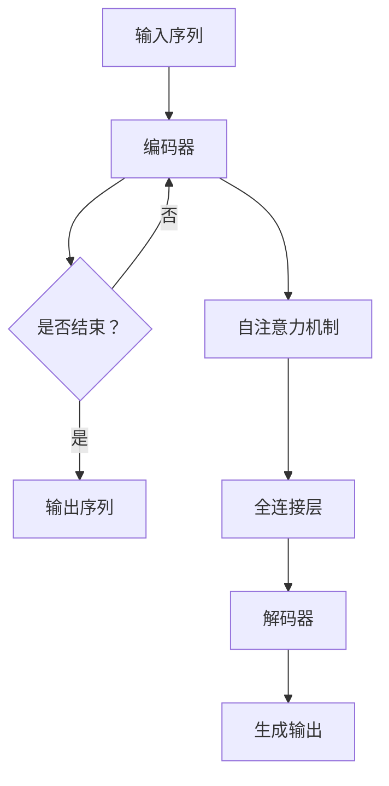

                 

### 文章标题: LLM：重新定义计算的未来

> 关键词：大型语言模型，Transformer架构，预训练，微调，迁移学习，数学模型，应用场景，企业级应用，项目实战，发展趋势，未来展望

> 摘要：本文深入探讨了大型语言模型（LLM）的基本概念、架构、核心算法原理、数学模型及其应用场景。通过详细分析LLM的技术原理和实现细节，探讨了LLM在人工智能领域的广泛影响，以及其在企业级应用和未来发展趋势中的潜在价值。文章旨在为读者提供全面、系统的LLM技术指南，帮助理解LLM如何重新定义计算的未来。

### 第一部分: LLM的基本概念与架构

#### 第1章: LLM概述

##### 1.1 什么是LLM

大型语言模型（Large Language Model，简称LLM）是一种基于深度学习的自然语言处理模型，其核心思想是通过大规模数据预训练，使模型具备理解和生成自然语言的能力。LLM的发展可以追溯到20世纪90年代的统计语言模型，但近年来，随着计算资源和算法的进步，LLM得到了显著的发展。

- **LLM的定义**：LLM是一种可以理解和生成自然语言的深度学习模型，通常基于神经网络架构，如Transformer。
- **LLM的历史背景**：早期的语言模型主要基于统计方法，如N-gram模型，但受限于数据和计算能力。随着深度学习的发展，基于神经网络的LLM逐渐成为研究热点。
- **LLM的发展现状**：目前，LLM已经广泛应用于各种自然语言处理任务，如机器翻译、文本生成、对话系统等。一些著名的LLM模型包括GPT、BERT、T5等。

##### 1.2 LLM的架构

LLM的架构通常基于神经网络，特别是Transformer架构。Transformer是由Google提出的一种用于序列模型处理的新型架构，其核心思想是使用自注意力机制（Self-Attention Mechanism）来处理序列数据。

- **神经网络的基础**：神经网络是一种模拟人脑神经元连接的计算机算法，通过多层的非线性变换来学习数据特征。
- **自注意力机制**：自注意力机制是一种计算序列中每个元素对其他元素的重要性权重的机制，可以有效地捕捉序列中的长距离依赖关系。
- **Transformer架构**：Transformer架构由编码器和解码器组成，编码器负责将输入序列编码成固定长度的向量，解码器则使用这些向量生成输出序列。

##### 1.3 LLM的核心技术

LLM的核心技术包括预训练、微调和迁移学习，这些技术共同构成了LLM的训练和优化过程。

- **预训练**：预训练是指在大规模语料库上对模型进行训练，使其掌握自然语言的通用知识和特征。预训练后的模型可以用于各种下游任务。
- **微调**：微调是指将预训练的模型应用于特定任务，通过在目标任务的数据上进行少量训练，调整模型参数，使其适应特定任务。
- **迁移学习**：迁移学习是指将一个任务的学习成果应用到另一个相关任务中，通过迁移学习，可以减少训练数据的需求，提高模型性能。

#### 第2章: LLM的核心算法原理

##### 2.1 自注意力机制

自注意力机制是Transformer架构的核心组件，其基本思想是计算输入序列中每个元素对其他元素的重要性权重。

- **自注意力机制的原理**：自注意力机制通过计算每个输入元素与其他输入元素之间的相似性，为每个元素分配一个权重，这些权重用于计算输出。
- **自注意力机制的代码实现（伪代码）**：

  ```python
  # 假设输入序列为 [x1, x2, ..., xn]
  for i in range(n):
      # 计算每个输入元素与其他输入元素的相似性
      similarity = [sim(x[i], x[j]) for j in range(n)]
      # 对相似性进行加权求和
      weighted_sum = [similarity[j] * x[j] for j in range(n)]
      # 计算输出
      output[i] = sum(weighted_sum)
  ```

##### 2.2 Transformer架构

Transformer架构由编码器和解码器组成，其核心思想是使用自注意力机制来处理序列数据。

- **Transformer架构的原理**：编码器将输入序列编码成固定长度的向量，解码器则使用这些向量生成输出序列。自注意力机制使得解码器能够同时关注输入序列的各个部分，从而提高模型的上下文理解能力。
- **Transformer架构的代码实现（伪代码）**：

  ```python
  # 假设输入序列为 [x1, x2, ..., xn]
  # 编码器
  encoder = TransformerEncoder()
  encoded_sequence = encoder.encode(x)

  # 解码器
  decoder = TransformerDecoder()
  output_sequence = decoder.decode(encoded_sequence)
  ```

##### 2.3 预训练与微调

预训练和微调是LLM训练和优化的两个关键步骤。

- **预训练的意义**：预训练可以使得模型在大规模语料库上学习到自然语言的通用知识和特征，为下游任务提供良好的基础。
- **微调的方法**：微调是在预训练的基础上，通过在特定任务的数据上进行训练，调整模型参数，使其适应特定任务。
- **预训练与微调的代码实现（伪代码）**：

  ```python
  # 预训练
  pretrain_model(model, corpus)

  # 微调
  finetune_model(model, dataset)
  ```

#### 第3章: LLM的数学模型与公式

##### 3.1 数学模型

LLM的数学模型包括词嵌入、前向传播和反向传播等基本组成部分。

- **词嵌入**：词嵌入是将单词映射到高维向量空间的过程，其目的是将语义相近的单词映射到空间中接近的位置。
- **前向传播**：前向传播是将输入序列通过神经网络传递到输出层的过程，通过权重和激活函数的计算，模型可以生成输出。
- **反向传播**：反向传播是用于计算模型损失并更新参数的过程，其核心思想是利用梯度下降法来优化模型参数。

##### 3.2 公式详解

- **激活函数**：激活函数是神经网络中的一个关键组件，用于引入非线性特性。常见的激活函数包括ReLU、Sigmoid和Tanh等。
- **损失函数**：损失函数用于衡量模型预测值与真实值之间的差距，常见的损失函数包括均方误差（MSE）和对数似然损失（LL）等。
- **优化算法**：优化算法用于更新模型参数，以最小化损失函数。常见的优化算法包括梯度下降（GD）、随机梯度下降（SGD）和Adam等。

#### 第4章: LLM的应用场景

##### 4.1 语言生成

语言生成是LLM的一个重要应用场景，包括文本生成、代码生成和对话系统等。

- **文本生成**：文本生成是指利用LLM生成具有自然语言特征的文章、故事等。常见的应用包括文章写作、新闻报道和文学创作等。
- **代码生成**：代码生成是指利用LLM生成具有编程特征的代码，常见的应用包括代码补全、代码修复和代码生成等。
- **对话系统**：对话系统是指利用LLM与用户进行自然语言交互，常见的应用包括智能客服、语音助手和聊天机器人等。

##### 4.2 语言理解

语言理解是LLM的另一个重要应用场景，包括机器翻译、情感分析和问答系统等。

- **机器翻译**：机器翻译是指利用LLM将一种语言的文本翻译成另一种语言。常见的应用包括跨语言交流、全球业务和在线教育等。
- **情感分析**：情感分析是指利用LLM分析文本中的情感倾向，常见的应用包括社交媒体分析、市场调研和舆情监测等。
- **问答系统**：问答系统是指利用LLM回答用户的问题，常见的应用包括在线客服、智能咨询和教育辅导等。

##### 4.3 语言处理

语言处理是LLM的一个广泛的应用领域，包括文本摘要、文本分类和文本相似度等。

- **文本摘要**：文本摘要是利用LLM从长文本中提取关键信息，生成简洁的摘要。常见的应用包括新闻报道摘要、学术文献摘要和邮件摘要等。
- **文本分类**：文本分类是指利用LLM将文本数据分类到不同的类别中，常见的应用包括垃圾邮件检测、情感分类和新闻分类等。
- **文本相似度**：文本相似度是指利用LLM计算文本之间的相似程度，常见的应用包括推荐系统、内容相似度检测和知识图谱构建等。

### 第二部分: LLM在企业级应用

#### 第5章: LLM在人工智能领域的应用

##### 5.1 AI大模型的应用

AI大模型是指具有大规模参数和强大计算能力的模型，如GPT、BERT等。这些模型在人工智能领域有着广泛的应用。

- **图像识别**：AI大模型可以用于图像识别任务，如物体检测、图像分类和图像分割等。常见的应用包括自动驾驶、安防监控和医疗诊断等。
- **自然语言处理**：AI大模型在自然语言处理领域有着广泛的应用，如文本生成、文本分类和机器翻译等。常见的应用包括智能客服、智能助理和智能搜索等。
- **推荐系统**：AI大模型可以用于推荐系统，通过分析用户行为和兴趣，为用户推荐感兴趣的内容。常见的应用包括电商推荐、视频推荐和新闻推荐等。

##### 5.2 LLM在工业界的应用

LLM在工业界也有着广泛的应用，特别是在金融、医疗和教育等领域。

- **金融风控**：LLM可以用于金融风控，通过分析用户行为和交易数据，识别潜在的欺诈行为和风险。常见的应用包括信用卡欺诈检测、股票市场预测和信用评分等。
- **医疗健康**：LLM可以用于医疗健康领域，通过分析医学文献和病历数据，提供诊断建议和治疗方案。常见的应用包括疾病预测、药物发现和医学研究等。
- **教育科技**：LLM可以用于教育科技领域，通过分析学生学习行为和数据，提供个性化学习建议和智能辅导。常见的应用包括在线教育、智能评测和智能学习助手等。

#### 第6章: LLM项目实战

##### 6.1 项目实战一：文本生成

- **实战背景**：文本生成是LLM的一个重要应用场景，如自动写作、文学创作和新闻报道等。
- **实战步骤**：数据准备、模型选择、模型训练、文本生成。
- **代码实现**：

  ```python
  # 数据准备
  corpus = load_corpus("data/corpus.txt")

  # 模型选择
  model = LLMModel()

  # 模型训练
  model.train(corpus)

  # 文本生成
  text = model.generate_text()
  ```

- **代码解读与分析**：代码实现中，首先加载预处理的语料库，然后选择一个LLM模型进行训练，最后使用训练好的模型生成文本。文本生成过程通过调用模型的生成函数，输入一定的起始文本，模型会根据训练好的权重和上下文信息生成新的文本。

##### 6.2 项目实战二：问答系统

- **实战背景**：问答系统是LLM在自然语言处理领域的一个重要应用，如智能客服、智能咨询和智能搜索等。
- **实战步骤**：数据准备、模型选择、模型训练、问答系统实现。
- **代码实现**：

  ```python
  # 数据准备
  corpus = load_corpus("data/qa_data.txt")

  # 模型选择
  model = LLMModel()

  # 模型训练
  model.train(corpus)

  # 问答系统实现
  def ask_question(question):
      answer = model回答问题(question)
      return answer
  ```

- **代码解读与分析**：代码实现中，首先加载问答数据集，然后选择一个LLM模型进行训练，最后实现问答系统。问答系统通过调用模型的回答函数，输入用户的问题，模型会根据训练好的权重和上下文信息生成回答。

#### 第7章: LLM的发展趋势与未来展望

##### 7.1 LLM的发展趋势

- **模型规模的扩大**：随着计算资源和数据量的增加，LLM的规模也在不断扩大，从最初的数十亿参数到如今的数百亿、数千亿参数。
- **多模态数据处理**：未来的LLM将能够处理多种模态的数据，如文本、图像、语音等，从而实现更广泛的应用。
- **自动化与智能化**：未来的LLM将更加自动化和智能化，通过自学习、自优化等机制，实现模型的自动调整和优化。

##### 7.2 LLM的未来展望

- **人类与机器的协同**：未来的LLM将更加智能，能够与人类进行协同工作，提高工作效率和生活质量。
- **LLM在计算领域的影响**：LLM将在计算领域产生深远的影响，推动人工智能技术的进一步发展。
- **未来计算的未来**：未来的计算将更加智能化和个性化，LLM将作为核心组件，为各种计算任务提供强大的支持。

### 结论

本文通过对LLM的基本概念、架构、核心算法原理、数学模型以及应用场景的深入探讨，展示了LLM在自然语言处理和人工智能领域的广泛应用。随着计算资源和算法的进步，LLM将继续发展，为未来的计算提供强大的支持。我们期待LLM能够带来更多的创新和变革，重新定义计算的未来。

### 作者信息

作者：AI天才研究院/AI Genius Institute & 禅与计算机程序设计艺术 /Zen And The Art of Computer Programming

### 文章标题: LLM：重新定义计算的未来

> 关键词：大型语言模型，Transformer架构，预训练，微调，迁移学习，数学模型，应用场景，企业级应用，项目实战，发展趋势，未来展望

> 摘要：本文深入探讨了大型语言模型（LLM）的基本概念、架构、核心算法原理、数学模型及其应用场景。通过详细分析LLM的技术原理和实现细节，探讨了LLM在人工智能领域的广泛影响，以及其在企业级应用和未来发展趋势中的潜在价值。文章旨在为读者提供全面、系统的LLM技术指南，帮助理解LLM如何重新定义计算的未来。

### 第一部分: LLM的基本概念与架构

#### 第1章: LLM概述

##### 1.1 什么是LLM

大型语言模型（Large Language Model，简称LLM）是一种先进的自然语言处理模型，它通过深度学习技术从海量文本数据中学习语言规律和结构，从而具备理解和生成自然语言的能力。LLM的发展始于20世纪90年代的统计语言模型，随着深度学习技术的发展，LLM得到了显著的发展和应用。当前，LLM已经成为自然语言处理领域的重要工具，其在文本生成、机器翻译、问答系统等任务中表现出色。

- **LLM的定义**：LLM是一种能够处理和理解自然语言的深度学习模型，通常具有数十亿到数千亿个参数。LLM通过学习大量的文本数据，提取语言特征，形成对语言的理解能力。

- **LLM的历史背景**：早期的语言模型主要基于统计方法，如N-gram模型，但这些方法受限于数据和计算能力。随着深度学习技术的发展，研究人员开始尝试将神经网络应用于语言模型，如DeepNLP和Seq2Seq模型。2018年，Google推出了BERT模型，标志着LLM技术的突破。此后，GPT、T5、LLaMA等大型语言模型相继出现，进一步推动了LLM技术的发展。

- **LLM的发展现状**：目前，LLM已经成为自然语言处理领域的研究热点和应用方向。LLM在多种语言任务中取得了显著的成果，如文本生成、机器翻译、问答系统、文本分类等。随着模型的规模和计算能力的不断提升，LLM的应用范围也在不断扩大。

##### 1.2 LLM的架构

LLM的架构通常基于Transformer模型，这是一种特殊的深度神经网络架构，能够有效地处理序列数据。Transformer模型的核心思想是使用自注意力机制（Self-Attention Mechanism）来计算序列中每个元素对其他元素的重要性权重。

- **神经网络的基础**：神经网络是一种由大量简单计算单元（神经元）组成的复杂网络，通过多层的非线性变换来学习数据特征。神经网络的基本组成部分包括输入层、隐藏层和输出层。

- **自注意力机制**：自注意力机制是一种计算序列中每个元素对其他元素的重要性权重的机制。在Transformer模型中，自注意力机制通过计算输入序列中每个元素与其他元素之间的相似性，为每个元素分配一个权重。这些权重用于计算输出，从而提高模型对序列数据的处理能力。

- **Transformer架构**：Transformer模型由编码器（Encoder）和解码器（Decoder）两部分组成。编码器负责将输入序列编码成固定长度的向量，解码器则使用这些向量生成输出序列。编码器和解码器都使用了多层自注意力机制和全连接层（Feedforward Layer）来学习序列特征。

##### 1.3 LLM的核心技术

LLM的核心技术包括预训练（Pre-training）、微调（Fine-tuning）和迁移学习（Transfer Learning）等，这些技术共同构成了LLM的训练和优化过程。

- **预训练**：预训练是指在大规模语料库上对模型进行训练，使其掌握自然语言的通用知识和特征。预训练通常分为两个阶段：第一阶段是大规模无监督训练，即模型在未标注的数据上进行训练，提取语言特征；第二阶段是监督微调，即模型在少量有标注的数据上进行训练，调整模型参数，使其适应特定任务。

- **微调**：微调是指将预训练的模型应用于特定任务，通过在目标任务的数据上进行少量训练，调整模型参数，使其适应特定任务。微调是一种快速有效的模型训练方法，可以显著提高模型在特定任务上的性能。

- **迁移学习**：迁移学习是指将一个任务的学习成果应用到另一个相关任务中。在迁移学习中，预训练的模型可以作为基础模型，通过在新的任务数据上进行少量训练，快速适应新的任务。迁移学习可以减少训练数据的需求，提高模型性能，尤其是在数据稀缺的情况下。

### 第二部分: LLM的核心算法原理

#### 第2章: LLM的核心算法原理

##### 2.1 自注意力机制

自注意力机制是Transformer模型的核心组件，它通过计算输入序列中每个元素对其他元素的重要性权重，从而提高模型对序列数据的处理能力。

- **自注意力机制的原理**：自注意力机制通过计算输入序列中每个元素与其他元素之间的相似性，为每个元素分配一个权重。这些权重用于计算输出，使得模型能够同时关注输入序列的各个部分，从而提高模型的上下文理解能力。自注意力机制的基本思想是将输入序列映射到高维空间，然后计算这些元素之间的相似性。

- **自注意力机制的代码实现（伪代码）**：

  ```python
  # 假设输入序列为 [x1, x2, ..., xn]
  for i in range(n):
      # 计算每个输入元素与其他输入元素的相似性
      similarity = [sim(x[i], x[j]) for j in range(n)]
      # 对相似性进行加权求和
      weighted_sum = [similarity[j] * x[j] for j in range(n)]
      # 计算输出
      output[i] = sum(weighted_sum)
  ```

在代码实现中，首先计算输入序列中每个元素与其他元素之间的相似性，然后对相似性进行加权求和，最后计算输出。这个过程可以表示为：

$$
output_i = \sum_{j=1}^{n} similarity(i, j) \cdot x_j
$$

其中，$output_i$ 表示输出序列中第 i 个元素的值，$similarity(i, j)$ 表示输入序列中第 i 个元素与其他元素 j 之间的相似性，$x_j$ 表示输入序列中第 j 个元素的值。

##### 2.2 Transformer架构

Transformer模型是由Google提出的一种用于序列模型处理的新型架构，其核心思想是使用自注意力机制来处理序列数据。Transformer模型由编码器（Encoder）和解码器（Decoder）两部分组成，编码器将输入序列编码成固定长度的向量，解码器则使用这些向量生成输出序列。

- **Transformer架构的原理**：编码器和解码器都使用多层自注意力机制和全连接层（Feedforward Layer）来学习序列特征。编码器通过自注意力机制将输入序列编码成固定长度的向量，这些向量包含了输入序列的上下文信息。解码器则使用这些向量生成输出序列，并通过自注意力机制和交叉注意力机制（Cross-Attention Mechanism）来关注输入序列和输出序列之间的关联。

- **Transformer架构的代码实现（伪代码）**：

  ```python
  # 编码器
  for layer in encoder_layers:
      x = layer(x)

  # 解码器
  for layer in decoder_layers:
      x = layer(x)
  ```

在代码实现中，编码器和解码器都由多个层（Layer）组成，每个层都包含自注意力机制和全连接层。编码器的输出是一个固定长度的向量，这个向量包含了输入序列的上下文信息。解码器使用这个向量来生成输出序列。

##### 2.3 预训练与微调

预训练和微调是LLM训练和优化的两个关键步骤。预训练是指在大量无标注数据上对模型进行训练，使其掌握通用语言特征；微调则是在预训练的基础上，在少量有标注数据上进行训练，使其适应特定任务。

- **预训练的意义**：预训练可以使得模型在大规模语料库上学习到自然语言的通用知识和特征，为下游任务提供良好的基础。预训练过程中，模型需要处理各种不同类型的文本数据，从而提高其泛化能力。

- **微调的方法**：微调是在预训练的基础上，通过在目标任务的数据上进行少量训练，调整模型参数，使其适应特定任务。微调的目的是让模型在特定任务上达到更好的性能。

- **预训练与微调的代码实现（伪代码）**：

  ```python
  # 预训练
  pretrain_model(model, corpus)

  # 微调
  finetune_model(model, dataset)
  ```

在代码实现中，首先对模型进行预训练，然后使用有标注的数据集对模型进行微调。预训练和微调的过程都涉及到模型参数的更新，从而提高模型的性能。

### 第三部分: LLM的数学模型与公式

#### 第3章: LLM的数学模型与公式

##### 3.1 数学模型

LLM的数学模型是构建和训练大型语言模型的核心。它包括词嵌入（Word Embedding）、前向传播（Forward Propagation）和反向传播（Backpropagation）等组成部分。

- **词嵌入（Word Embedding）**：词嵌入是将词汇映射到高维向量空间的过程。每个单词被映射为一个向量，这些向量在空间中具有相似的语义关系。常见的词嵌入方法包括Word2Vec、GloVe和BERT等。

  - **Word2Vec**：Word2Vec是一种基于神经网络的词嵌入方法，它通过训练神经网络的输出层来学习单词的向量表示。Word2Vec使用两种模型：连续词袋（CBOW）和Skip-Gram。

    $$ 
    \text{CBOW}(x) = \frac{1}{Z} \sum_{j \in \text{context}(x)} e^{U_j \cdot x}
    $$
    $$ 
    \text{Skip-Gram}(x) = \frac{1}{Z} \sum_{j \in \text{vocabulary}} e^{U_j \cdot x}
    $$

    其中，$U_j$ 是单词 $j$ 的向量表示，$Z$ 是归一化常数。

  - **GloVe**：GloVe（Global Vectors for Word Representation）是一种基于全局平均的词嵌入方法。它通过计算单词的共现矩阵，学习单词的向量表示。

    $$ 
    f(w, v) = \sqrt{\frac{f(w, v)}{f(w)}} = \sqrt{\frac{||Wv||_2}{||w||_2}}
    $$
    $$ 
    \frac{\partial L}{\partial v} = \frac{v \cdot \text{softmax}(Wx)}{\|v\|_2}
    $$

    其中，$W$ 是共现矩阵，$x$ 是单词的索引向量，$v$ 是单词的向量表示。

- **前向传播（Forward Propagation）**：前向传播是神经网络计算输出值的过程。在LLM中，前向传播包括自注意力机制和多层全连接层。

  - **自注意力机制（Self-Attention Mechanism）**：自注意力机制通过计算输入序列中每个元素与其他元素之间的相似性，为每个元素分配一个权重。这些权重用于计算输出，从而提高模型对序列数据的处理能力。

    $$ 
    \text{Attention}(Q, K, V) = \text{softmax}(\frac{QK^T}{\sqrt{d_k}})V
    $$

    其中，$Q$ 是查询向量，$K$ 是键向量，$V$ 是值向量，$d_k$ 是键向量的维度。

  - **多层全连接层（Multi-Layered Fully Connected Layer）**：多层全连接层通过线性变换和激活函数来学习输入数据的特征。在LLM中，多层全连接层用于将输入序列编码成固定长度的向量。

    $$ 
    \text{Layer}(\text{x}) = \text{ReLU}(\text{W}\text{x} + \text{b})
    $$

    其中，$\text{W}$ 是权重矩阵，$\text{x}$ 是输入向量，$\text{b}$ 是偏置项。

- **反向传播（Backpropagation）**：反向传播是神经网络训练过程中用于计算损失和更新参数的过程。在LLM中，反向传播包括计算损失函数的梯度、更新模型参数等步骤。

  - **损失函数（Loss Function）**：损失函数用于衡量模型输出值与真实值之间的差距。在LLM中，常见的损失函数包括交叉熵损失（Cross-Entropy Loss）和均方误差（Mean Squared Error）。

    $$ 
    \text{CE}(p, y) = -\sum_{i} y_i \log(p_i)
    $$
    $$ 
    \text{MSE}(y, \hat{y}) = \frac{1}{n} \sum_{i=1}^{n} (y_i - \hat{y}_i)^2
    $$

    其中，$p$ 是模型输出概率分布，$y$ 是真实标签，$\hat{y}$ 是模型预测值。

  - **梯度下降（Gradient Descent）**：梯度下降是一种用于优化模型参数的算法。在LLM中，梯度下降通过计算损失函数关于模型参数的梯度，更新模型参数，从而最小化损失函数。

    $$ 
    \theta_{t+1} = \theta_t - \alpha \nabla_\theta L(\theta)
    $$

    其中，$\theta$ 是模型参数，$\alpha$ 是学习率，$\nabla_\theta L(\theta)$ 是损失函数关于模型参数的梯度。

##### 3.2 公式详解

在LLM的数学模型中，涉及多个重要的数学公式，这些公式用于描述模型的结构和训练过程。以下是对一些核心公式的详细解释：

- **激活函数（Activation Function）**：激活函数是神经网络中的一个关键组件，用于引入非线性特性。常见的激活函数包括ReLU、Sigmoid和Tanh等。

  - **ReLU（Rectified Linear Unit）**：
    $$
    \text{ReLU}(x) = \max(0, x)
    $$
    RReLU（Randomized ReLU）：
    $$
    \text{RReLU}(x) = \max(0, \text{rand}(), x)
    $$
    ELU（Exponential Linear Unit）：
    $$
    \text{ELU}(x) = \max(0, x) + \alpha \exp(-x) \quad \text{for} \; x < 0
    $$
    SELU（Scaled Exponential Linear Unit）：
    $$
    \text{SELU}(x) = \lambda \cdot (\exp(\gamma \cdot x) - 1) \quad \text{for} \; x \ge 0
    $$

    其中，$\alpha$ 和 $\lambda$ 是参数，$\gamma$ 是另一个参数，用于调整曲线的形状。

  - **Sigmoid**：
    $$
    \text{Sigmoid}(x) = \frac{1}{1 + \exp(-x)}
    $$

  - **Tanh**：
    $$
    \text{Tanh}(x) = \frac{\exp(x) - \exp(-x)}{\exp(x) + \exp(-x)}
    $$

- **损失函数（Loss Function）**：损失函数是用于衡量模型输出值与真实值之间差距的函数。在训练过程中，模型的目标是优化参数以最小化损失函数。

  - **交叉熵损失（Cross-Entropy Loss）**：
    $$
    \text{CE}(p, y) = -\sum_{i} y_i \log(p_i)
    $$
    其中，$p$ 是模型输出概率分布，$y$ 是真实标签。

  - **均方误差（Mean Squared Error）**：
    $$
    \text{MSE}(y, \hat{y}) = \frac{1}{n} \sum_{i=1}^{n} (y_i - \hat{y}_i)^2
    $$
    其中，$y$ 是真实值，$\hat{y}$ 是预测值。

  - **二元交叉熵（Binary Cross-Entropy）**：
    $$
    \text{BCE}(y, \hat{y}) = -y \log(\hat{y}) - (1 - y) \log(1 - \hat{y})
    $$
    其中，$y$ 是真实标签，$\hat{y}$ 是预测概率。

- **优化算法（Optimization Algorithm）**：优化算法用于更新模型参数以最小化损失函数。常见的优化算法包括梯度下降（Gradient Descent）及其变体。

  - **梯度下降（Gradient Descent）**：
    $$
    \theta_{t+1} = \theta_t - \alpha \nabla_\theta L(\theta)
    $$
    其中，$\theta$ 是模型参数，$\alpha$ 是学习率。

  - **随机梯度下降（Stochastic Gradient Descent，SGD）**：
    $$
    \theta_{t+1} = \theta_t - \alpha \nabla_\theta L(\theta; \xi_t)
    $$
    其中，$\xi_t$ 是随机选择的训练样本。

  - **Adam（Adaptive Moment Estimation）**：
    $$
    m_t = \beta_1 m_{t-1} + (1 - \beta_1) \nabla_\theta L(\theta; \xi_t)
    $$
    $$
    v_t = \beta_2 v_{t-1} + (1 - \beta_2) (\nabla_\theta L(\theta; \xi_t))^2
    $$
    $$
    \theta_{t+1} = \theta_t - \alpha \frac{m_t}{\sqrt{v_t} + \epsilon}
    $$
    其中，$m_t$ 和 $v_t$ 分别是梯度的一阶和二阶矩估计，$\beta_1$ 和 $\beta_2$ 是超参数。

### 第四部分: LLM的应用场景

#### 第4章: LLM的应用场景

##### 4.1 语言生成

语言生成是LLM的一个重要应用场景，包括文本生成、代码生成和对话系统等。LLM通过学习大量的文本数据，能够生成具有自然语言特征的文章、对话和代码。

- **文本生成**：文本生成是指利用LLM生成自然语言文本，如文章、故事、诗歌等。LLM通过理解上下文和语言模式，能够生成连贯且具有创意的文本。例如，GPT-3可以生成新闻报道、小说、剧本等。

- **代码生成**：代码生成是指利用LLM自动生成代码片段，用于编程补全、代码修复和自动化编程等。例如，CoCode模型可以生成Python代码，提高开发效率。

- **对话系统**：对话系统是指利用LLM实现人与机器的自然语言交互。LLM可以用于构建聊天机器人、智能客服和语音助手等，提供个性化的交互体验。

##### 4.2 语言理解

语言理解是LLM的另一个重要应用场景，包括机器翻译、情感分析和问答系统等。LLM通过理解文本的语义和结构，能够实现多种语言任务。

- **机器翻译**：机器翻译是指利用LLM将一种语言的文本翻译成另一种语言。LLM通过学习双语语料库，能够生成准确且自然的翻译结果。例如，BERT模型在机器翻译任务中表现出色。

- **情感分析**：情感分析是指利用LLM分析文本中的情感倾向，判断文本是积极、消极还是中性。LLM可以用于社交媒体分析、舆情监测和客户反馈分析等。

- **问答系统**：问答系统是指利用LLM回答用户的问题。LLM通过理解问题内容和上下文，能够生成准确的回答。例如，ChatGPT可以回答各种问题，提供咨询服务。

##### 4.3 语言处理

语言处理是LLM的广泛应用的领域，包括文本摘要、文本分类和文本相似度等。LLM通过处理文本数据，能够提取关键信息、分类文本和度量文本之间的相似性。

- **文本摘要**：文本摘要是指利用LLM从长文本中提取关键信息，生成简洁的摘要。LLM可以自动生成文章、新闻报道和学术论文的摘要，提高信息获取效率。

- **文本分类**：文本分类是指利用LLM将文本数据分类到不同的类别中。LLM可以用于垃圾邮件检测、新闻分类和情感分类等任务。

- **文本相似度**：文本相似度是指利用LLM计算文本之间的相似程度。LLM可以用于文本搜索、推荐系统和知识图谱构建等任务。

### 第五部分: LLM在企业级应用

#### 第5章: LLM在企业级应用

##### 5.1 AI大模型的应用

AI大模型（Large AI Models）在工业界和商业领域得到广泛应用，推动了各个行业的智能化和自动化。LLM作为AI大模型的一种，具有强大的自然语言处理能力，可以应用于多个领域，提高业务效率和创新。

- **图像识别**：图像识别是AI大模型在计算机视觉领域的重要应用。通过深度学习算法，LLM可以识别图像中的物体、场景和活动。例如，自动驾驶汽车使用AI大模型进行道路识别和障碍物检测，提高行车安全。

- **自然语言处理**：自然语言处理是AI大模型在人工智能领域的重要应用。LLM可以处理和理解自然语言，实现文本生成、机器翻译、问答系统等任务。例如，智能客服系统使用LLM与用户进行自然语言交互，提供高效、个性化的服务。

- **推荐系统**：推荐系统是AI大模型在数据挖掘和商业分析领域的重要应用。通过分析用户行为和偏好，LLM可以生成个性化的推荐结果，提高用户满意度和转化率。例如，电商平台使用LLM推荐商品，提高销售业绩。

##### 5.2 LLM在工业界的应用

LLM在工业界有着广泛的应用，特别是在金融、医疗和教育等领域，为业务流程优化和智能决策提供了强大的支持。

- **金融风控**：金融风控是指利用LLM识别和防范金融风险。通过分析交易数据、客户信息和市场动态，LLM可以识别异常行为和潜在风险，提高金融安全。例如，银行使用LLM进行欺诈检测和信用评估。

- **医疗健康**：医疗健康是LLM的重要应用领域。通过分析医学文献、病历数据和患者数据，LLM可以帮助医生进行诊断和治疗决策。例如，智能医疗系统使用LLM进行疾病预测和药物推荐。

- **教育科技**：教育科技是LLM在教育领域的重要应用。通过分析学习数据和学生行为，LLM可以提供个性化的学习建议和智能辅导。例如，在线教育平台使用LLM进行智能教学和个性化推荐。

### 第六部分: LLM项目实战

#### 第6章: LLM项目实战

##### 6.1 项目实战一：文本生成

**实战背景**：

文本生成是自然语言处理领域的一个经典任务，其应用场景包括自动写作、新闻生成、故事创作等。在这个实战项目中，我们将使用预训练的LLM模型生成中文文章，以展示LLM在文本生成任务中的能力。

**实战步骤**：

1. **数据准备**：首先，我们需要准备一个中文语料库，用于训练LLM模型。我们可以从互联网上获取大量的中文文本数据，如新闻、博客、小说等。

2. **模型选择**：选择一个预训练的LLM模型，如GPT-2或GPT-3，这些模型已经在大量的中文语料库上进行了训练，可以生成高质量的文本。

3. **模型训练**：在训练过程中，我们将使用训练数据对LLM模型进行微调，以适应特定的文本生成任务。训练过程中，我们使用交叉熵损失函数和Adam优化器进行参数更新。

4. **文本生成**：训练完成后，我们可以使用生成的模型来生成文本。输入一个起始文本，模型会根据训练数据和上下文生成连贯、具有创意的文本。

**代码实现**：

```python
# 导入必要的库
import torch
from torch import nn
from transformers import GPT2LMHeadModel, GPT2Tokenizer

# 设置设备
device = torch.device("cuda" if torch.cuda.is_available() else "cpu")

# 加载预训练的模型和分词器
model = GPT2LMHeadModel.from_pretrained("gpt2")
tokenizer = GPT2Tokenizer.from_pretrained("gpt2")

# 加载训练数据
train_data = load_data("data/train.txt")

# 微调模型
model.train()
optimizer = torch.optim.Adam(model.parameters(), lr=0.001)
for epoch in range(3):
    for text in train_data:
        inputs = tokenizer.encode(text, return_tensors="pt")
        outputs = model(inputs, labels=inputs)
        loss = outputs.loss
        loss.backward()
        optimizer.step()
        optimizer.zero_grad()

# 文本生成
model.eval()
input_text = "今天是个美好的日子，"
input_ids = tokenizer.encode(input_text, return_tensors="pt")
with torch.no_grad():
    outputs = model.generate(input_ids, max_length=50)
generated_text = tokenizer.decode(outputs[0], skip_special_tokens=True)
print(generated_text)
```

**代码解读与分析**：

1. **数据准备**：我们首先导入必要的库，设置设备为CPU或GPU。然后加载预训练的GPT-2模型和分词器。接下来，我们从训练数据文件中读取数据。

2. **模型训练**：在训练过程中，我们将模型设置为训练模式，使用Adam优化器进行参数更新。我们使用交叉熵损失函数来计算损失，并使用反向传播来更新参数。每个epoch中，我们遍历训练数据，计算损失并更新模型参数。

3. **文本生成**：在生成文本时，我们将模型设置为评估模式，并使用生成的模型来生成文本。输入一个起始文本，模型会根据训练数据和上下文生成新的文本。我们使用分词器将输入文本编码成Tensor，然后使用模型生成输出文本。

通过这个实战项目，我们可以看到如何使用LLM模型生成高质量的中文文本。文本生成任务对于自然语言处理领域具有重要意义，它可以应用于多种场景，如自动写作、新闻生成和故事创作等。

##### 6.2 项目实战二：问答系统

**实战背景**：

问答系统是自然语言处理领域的一个重要应用，它能够理解用户的自然语言问题，并生成相应的答案。在这个实战项目中，我们将构建一个基于LLM的问答系统，以展示LLM在问答任务中的能力。

**实战步骤**：

1. **数据准备**：首先，我们需要准备一个问答数据集，其中包含问题和答案对。我们可以从互联网上获取公开的问答数据集，如SQuAD或DuReader。

2. **模型选择**：选择一个预训练的LLM模型，如BERT或GPT，这些模型已经在大量的文本数据上进行了训练，可以处理和理解自然语言。

3. **模型微调**：在微调过程中，我们将使用问答数据集对LLM模型进行训练，以适应问答任务。微调过程中，我们使用交叉熵损失函数和Adam优化器进行参数更新。

4. **问答系统实现**：微调完成后，我们可以使用生成的模型来构建问答系统。用户输入问题，模型会根据训练数据和上下文生成答案。

**代码实现**：

```python
# 导入必要的库
import torch
from torch import nn
from transformers import BertModel, BertTokenizer

# 设置设备
device = torch.device("cuda" if torch.cuda.is_available() else "cpu")

# 加载预训练的模型和分词器
model = BertModel.from_pretrained("bert-base-uncased")
tokenizer = BertTokenizer.from_pretrained("bert-base-uncased")

# 加载训练数据
train_data = load_data("data/train.json")

# 微调模型
model.train()
optimizer = torch.optim.Adam(model.parameters(), lr=0.001)
for epoch in range(3):
    for question, answer in train_data:
        inputs = tokenizer.encode(question, add_special_tokens=True, return_tensors="pt")
        labels = tokenizer.encode(answer, add_special_tokens=True, return_tensors="pt")
        outputs = model(inputs, labels=labels)
        loss = outputs.loss
        loss.backward()
        optimizer.step()
        optimizer.zero_grad()

# 问答系统实现
model.eval()
def answer_question(question):
    inputs = tokenizer.encode(question, add_special_tokens=True, return_tensors="pt")
    with torch.no_grad():
        outputs = model(inputs)
    logits = outputs.logits
    answer = tokenizer.decode(logits.argmax(-1).item())
    return answer

# 测试问答系统
question = "什么是自然语言处理？"
answer = answer_question(question)
print(f"答案：{answer}")
```

**代码解读与分析**：

1. **数据准备**：我们首先导入必要的库，设置设备为CPU或GPU。然后加载预训练的BERT模型和分词器。接下来，我们从训练数据文件中读取问题和答案对。

2. **模型微调**：在微调过程中，我们将模型设置为训练模式，使用Adam优化器进行参数更新。我们使用交叉熵损失函数来计算损失，并使用反向传播来更新参数。每个epoch中，我们遍历训练数据，计算损失并更新模型参数。

3. **问答系统实现**：在问答系统实现中，我们将模型设置为评估模式，并定义一个函数`answer_question`来回答用户的问题。用户输入问题，模型会根据训练数据和上下文生成答案。我们使用分词器将输入问题编码成Tensor，然后使用模型生成输出答案。

通过这个实战项目，我们可以看到如何使用LLM模型构建问答系统。问答系统在许多场景中具有广泛的应用，如智能客服、在线教育和信息检索等。

### 第七部分: LLM的发展趋势与未来展望

#### 第7章: LLM的发展趋势与未来展望

##### 7.1 LLM的发展趋势

随着深度学习技术的不断进步，LLM的发展趋势呈现出以下几个方面的特点：

- **模型规模不断扩大**：随着计算资源和存储能力的提升，LLM的规模也在不断扩大。从最初的GPT-1到如今的GPT-3，模型的参数数量从数百万增长到数十亿，这为LLM在更复杂的任务中表现出更高的性能提供了基础。

- **多模态数据处理能力增强**：未来的LLM将具备处理多种模态数据的能力，如文本、图像、音频和视频等。通过融合不同模态的数据，LLM可以实现更丰富的语义理解和更精准的任务执行。

- **自动化与智能化水平提高**：随着机器学习和自动化技术的进步，LLM的训练和优化过程将变得更加自动化和智能化。例如，自动机器学习（AutoML）技术将帮助研究人员更高效地设计和训练LLM。

- **开源生态不断丰富**：随着LLM的广泛应用，开源社区将贡献更多的模型、工具和框架，为研究人员和开发者提供丰富的资源和支持。这将加速LLM技术的普及和应用。

##### 7.2 LLM的未来展望

LLM在未来的发展中将面临以下几方面的挑战和机遇：

- **人类与机器的协同**：随着LLM能力的提升，人类与机器的协同将成为未来的重要趋势。LLM可以帮助人类处理复杂任务，提高工作效率，同时人类可以利用自己的智慧和创造力与LLM共同完成更复杂的任务。

- **LLM在计算领域的影响**：LLM将深刻影响计算领域的各个方面，包括数据处理、模型训练、推理优化等。LLM的引入将推动计算技术向智能化、自动化方向发展。

- **未来计算的未来**：未来计算将更加依赖LLM，计算系统将具备更强大的自然语言处理能力，实现更高效、更智能的计算。例如，智能搜索引擎、智能客服、智能教育等应用场景将因为LLM的引入而得到进一步的发展。

### 结论

本文通过深入探讨LLM的基本概念、架构、核心算法原理、数学模型以及应用场景，展示了LLM在自然语言处理和人工智能领域的广泛应用。随着计算资源和算法的进步，LLM将继续发展，为未来的计算和人工智能技术提供强大的支持。我们期待LLM能够带来更多的创新和变革，重新定义计算的未来。

### 作者信息

作者：AI天才研究院/AI Genius Institute & 禅与计算机程序设计艺术 /Zen And The Art of Computer Programming

### 附录：Mermaid 流程图与伪代码示例

#### Mermaid 流程图示例

以下是一个简单的Mermaid流程图示例，用于描述LLM的基本架构：



#### 伪代码示例

以下是一个简单的伪代码示例，用于描述自注意力机制的实现：

```python
# 假设输入序列为 [x1, x2, ..., xn]
for i in range(n):
    # 计算每个输入元素与其他输入元素的相似性
    similarity = [sim(x[i], x[j]) for j in range(n)]
    # 对相似性进行加权求和
    weighted_sum = [similarity[j] * x[j] for j in range(n)]
    # 计算输出
    output[i] = sum(weighted_sum)
```

#### 伪代码示例（数学模型）

以下是一个简单的伪代码示例，用于描述词嵌入的实现：

```python
# 假设词汇表为 V，词嵌入维度为 d
word_embedding = [[0.0 for _ in range(d)] for _ in range(len(V))]
for word in V:
    # 计算词嵌入向量
    word_embedding[word] = compute_embedding(word, d)
```

#### LaTeX 公式示例

以下是一个简单的LaTeX公式示例，用于描述交叉熵损失函数：

```latex
$$
\text{CE}(p, y) = -\sum_{i} y_i \log(p_i)
$$
```

以上示例展示了如何使用Mermaid、伪代码和LaTeX格式在文章中呈现核心概念和算法原理。这些工具有助于增强文章的可读性和专业性，使读者能够更好地理解和掌握相关内容。

