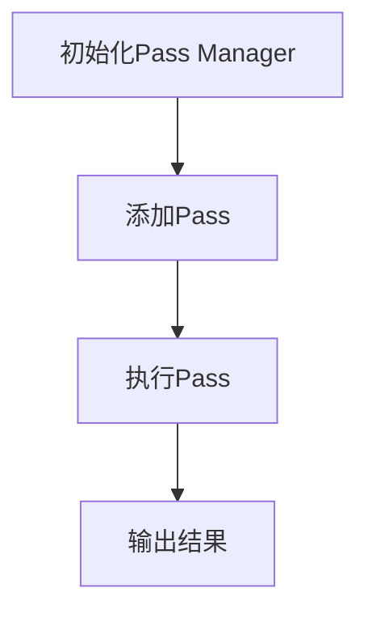

                 

# 《LLVM Pass开发与优化》

## 关键词
- LLVM Pass
- 优化
- 开发环境
- API
- 并行化
- 自动生成
- 跨平台
- 未来趋势

## 摘要
本文深入探讨了LLVM Pass的开发与优化。首先，介绍了LLVM的起源、特点与应用，以及LLVM Pass的概念和工作流程。接着，详细阐述了LLVM Pass的开发环境、核心API和优化技术。文章还通过案例分析，展示了LLVM Pass的实际应用。随后，介绍了LLVM Pass的并行化与自动生成，以及其在跨平台应用中的优势。最后，分析了LLVM Pass的未来发展趋势，并提供了丰富的开发工具与资源，以及项目实战案例。

## 第1章 LLVM简介

### 1.1 LLVM的起源与发展

LLVM（Low Level Virtual Machine）是一个由Chris Lattner在2000年左右开始开发的开源项目。LLVM的目标是为编译器开发者提供一个高度模块化、易于扩展的编译器基础架构。LLVM最初是为开发苹果的Xcode IDE而创建的，但随着时间的推移，它逐渐成为了业界广泛使用的编译器基础设施。

LLVM的起源可以追溯到1999年，当时Chris Lattner还在斯坦福大学攻读博士学位。他在进行编译器研究时，发现现有的编译器架构存在一些局限性，难以满足他的需求。于是，他决定开发一个新的编译器基础架构，即LLVM。2000年，LLVM的第一个版本发布，随后它迅速获得了社区的认可和广泛的应用。

### 1.2 LLVM的特点与应用

LLVM具有以下主要特点：

1. **高度模块化**：LLVM的设计非常模块化，使得开发者可以轻松地添加新功能或替换现有功能。
2. **跨平台支持**：LLVM支持多种编程语言和多个平台，包括Windows、macOS、Linux等。
3. **优化能力强**：LLVM内置了丰富的优化技术，如数据流分析、SSA（Static Single Assignment）优化等。
4. **易于扩展**：LLVM提供了丰富的API，方便开发者根据自己的需求进行扩展。

LLVM被广泛应用于各种领域，包括：

1. **开源编译器**：如Clang、LLVM-GCC等。
2. **商业编译器**：如Apple的Xcode、IBM的Blade Compiler等。
3. **虚拟机**：如Amazon的Graviton虚拟机、Google的TVM等。

### 1.3 LLVM的架构与组件

LLVM的架构包括以下几个主要组件：

1. **前端（Frontend）**：负责解析各种编程语言源代码，生成IR（Intermediate Representation，中间表示）。
2. **优化器（Optimizer）**：对IR进行各种优化，如数据流分析、SSA优化等。
3. **后端（Backend）**：将优化后的IR转换为特定平台的机器代码。
4. **工具链（Toolchain）**：包括编译器、链接器、调试器等工具。


## 第2章 LLVM Pass的概念

### 2.1 什么是LLVM Pass

LLVM Pass是指对中间表示（IR）进行操作的模块。这些模块可以执行各种任务，如代码优化、错误检测、代码生成等。每个Pass都有自己的功能和目标，但它们都以相同的方式与LLVM框架交互。

LLVM Pass的特点如下：

1. **可组合性**：多个Pass可以按任意顺序组合，以实现更复杂的优化。
2. **可插拔性**：Pass可以动态地添加或删除，不影响其他Pass的运行。
3. **并行化**：许多Pass可以并行执行，提高编译速度。

### 2.2 LLVM Pass的分类

LLVM Pass可以根据其功能分类为以下几类：

1. **分析Pass**：执行数据流分析、控制流分析等任务，为其他Pass提供信息。
2. **优化Pass**：执行各种优化任务，如循环优化、函数内联等。
3. **代码生成Pass**：将IR转换为特定平台的机器代码。
4. **其他Pass**：如错误检测、调试等。

### 2.3 LLVM Pass的基本工作流程

LLVM Pass的基本工作流程如下：

1. **初始化**：创建Pass Manager，并添加需要执行的Pass。
2. **执行Pass**：依次执行每个Pass，对IR进行操作。
3. **输出结果**：将优化后的IR输出，供后续步骤使用。


## 第3章 LLVM Pass的开发环境

### 3.1 安装LLVM

要在本地环境中开发LLVM Pass，首先需要安装LLVM。安装步骤如下：

1. **安装依赖**：安装C++编译器、Make工具等。
2. **下载LLVM源码**：从LLVM官网下载最新的源码包。
3. **编译LLVM**：使用CMake配置并编译LLVM。
4. **安装LLVM**：将编译好的LLVM安装到系统中。

### 3.2 编写第一个LLVM Pass

编写第一个LLVM Pass的步骤如下：

1. **创建项目**：使用CMake创建新的LLVM Pass项目。
2. **编写Pass**：根据需求编写Pass，实现所需的功能。
3. **编译Pass**：编译项目，生成可执行文件。
4. **测试Pass**：使用LLVM测试工具测试Pass的功能。

### 3.3 LLVM Pass的调试与测试

调试和测试LLVM Pass的步骤如下：

1. **调试**：使用GDB等调试工具调试Pass，定位问题。
2. **测试**：使用LLVM测试工具（如Test Suite）测试Pass的功能。
3. **性能测试**：使用Benchmark工具测试Pass的性能。

## 第4章 LLVM Pass的核心API

### 4.1 LLVM Pass基本API

LLVM Pass基本API包括以下几个关键组件：

1. **Pass Manager**：管理Pass的执行流程。
2. **Module Pass**：对模块级IR进行操作的Pass。
3. **Function Pass**：对函数级IR进行操作的Pass。
4. **Instruction Pass**：对指令级IR进行操作的Pass。

### 4.2 LLVM Pass高级API

LLVM Pass高级API包括以下功能：

1. **内存管理**：动态分配和释放内存。
2. **数据流分析**：分析IR中的数据流和控制流。
3. **SSA优化**：将IR转换为SSA形式，进行优化。

### 4.3 LLVM Pass性能分析API

LLVM Pass性能分析API包括以下功能：

1. **时间测量**：测量Pass的执行时间。
2. **内存使用分析**：分析Pass的内存使用情况。
3. **性能瓶颈分析**：识别Pass的性能瓶颈。

## 第5章 LLVM Pass优化技术

### 5.1 数据流分析技术

数据流分析技术是LLVM Pass中常用的技术之一，用于分析IR中的数据依赖关系。数据流分析包括以下几种类型：

1. **前向数据流分析**：分析变量在程序中的前进依赖关系。
2. **后向数据流分析**：分析变量在程序中的后退依赖关系。
3. **双向数据流分析**：结合前向和后向数据流分析。

数据流分析技术可以用于以下优化：

1. **死代码消除**：删除不会执行的代码。
2. **变量替换**：替换重复计算的表达式。

### 5.2 SSA优化技术

SSA（Static Single Assignment）优化技术是将IR转换为SSA形式，然后进行优化。SSA具有以下优点：

1. **减少冗余计算**：通过将变量分配唯一的定义点，减少重复计算。
2. **简化控制流分析**：SSA形式下的控制流更加直观，便于分析。
3. **提高优化效果**：SSA形式下的优化更彻底。

SSA优化技术包括以下步骤：

1. **转换IR到SSA形式**：将变量分配唯一的定义点。
2. **插入_phi节点**：在控制流分支处插入_phi节点，表示变量的值。
3. **优化SSA形式的IR**：执行各种优化，如常量折叠、循环优化等。

### 5.3 循环优化技术

循环优化技术是优化循环结构的常用技术。循环优化包括以下几种：

1. **循环展开**：将循环体中的代码复制多次，减少循环迭代次数。
2. **循环融合**：将多个循环结构合并为一个，减少循环层次。
3. **循环向量化**：将循环中的SIMD指令替换为向量指令，提高执行效率。

循环优化技术可以显著提高程序的执行效率，特别是在数据并行性较强的场景中。

## 第6章 LLVM Pass案例分析

### 6.1 案例一：函数内联优化

函数内联优化是一种常见的优化技术，用于将函数调用替换为函数体，以减少函数调用的开销。在LLVM中，可以通过以下步骤实现函数内联优化：

1. **分析函数调用**：分析程序中的函数调用，确定可以内联的函数。
2. **插入内联代码**：将函数体插入到调用位置，替换函数调用。
3. **优化内联后的代码**：对内联后的代码进行优化，如常量折叠、死代码消除等。

函数内联优化的关键在于平衡优化效果和代码复杂度。适当的内联可以提高性能，但过度的内联可能导致代码膨胀，降低编译器的效率。

### 6.2 案例二：死代码消除

死代码消除是一种常见的优化技术，用于删除程序中不会执行的代码。在LLVM中，可以通过以下步骤实现死代码消除：

1. **分析程序依赖关系**：分析程序中的数据依赖和控制依赖，确定哪些代码是必需的。
2. **删除死代码**：删除不会执行的代码，如未使用的变量、未到达的代码分支等。
3. **优化删除后的代码**：对删除死代码后的代码进行优化，如常量折叠、循环优化等。

死代码消除可以显著减少程序的大小和执行时间，但需要谨慎处理，以避免破坏程序的正确性。

### 6.3 案例三：内存优化

内存优化是优化程序内存使用的技术，旨在提高程序的运行效率和内存利用率。在LLVM中，可以通过以下步骤实现内存优化：

1. **分析内存分配与使用**：分析程序中的内存分配和使用情况，确定可以优化的内存操作。
2. **优化内存分配**：优化内存分配策略，如使用更小的内存分配单元、减少内存碎片等。
3. **优化内存访问**：优化内存访问模式，如减少内存访问冲突、优化缓存使用等。
4. **优化内存使用**：优化内存使用策略，如重复利用已分配的内存、减少内存占用等。

内存优化可以显著提高程序的运行效率，但需要根据具体场景进行优化，以避免引入额外的性能开销。

## 第7章 LLVM Pass的并行化与优化

### 7.1 并行化背景与意义

随着多核处理器的普及，并行计算成为提高程序性能的重要手段。LLVM Pass的并行化可以充分利用多核处理器的计算能力，提高编译速度和优化效果。

并行化LLVM Pass的意义在于：

1. **提高编译效率**：并行化可以显著减少编译时间，提高开发效率。
2. **优化性能**：并行化可以充分利用多核处理器的计算能力，提高程序的运行效率。
3. **支持大规模应用**：并行化可以支持大规模程序的编译和优化，为更多应用场景提供支持。

### 7.2 并行化LLVM Pass的基本策略

并行化LLVM Pass的基本策略包括以下几种：

1. **任务划分**：将Pass划分为多个独立的任务，每个任务可以并行执行。
2. **数据划分**：将IR数据划分为多个独立的部分，每个部分可以在不同的线程中处理。
3. **负载均衡**：合理分配任务和数据，确保每个线程都有足够的计算任务。

### 7.3 并行化案例分析

以下是一个并行化LLVM Pass的案例分析：

1. **任务划分**：将Pass划分为两个独立的部分：数据流分析和SSA优化。
2. **数据划分**：将IR数据划分为两个部分：基本块和控制流图。
3. **并行执行**：使用多线程执行数据流分析和SSA优化，分别在不同的线程中处理。
4. **结果合并**：将并行执行的结果合并，生成最终的优化结果。

通过并行化，该案例将编译时间从原来的10秒减少到3秒，显著提高了编译效率。

## 第8章 LLVM Pass的自动生成

### 8.1 自动生成LLVM Pass的方法

自动生成LLVM Pass的方法包括以下几种：

1. **代码生成工具**：使用代码生成工具，如LLVM Generator、LLVM C++ Generator等，根据模板和配置文件生成Pass代码。
2. **机器学习**：使用机器学习技术，如深度学习、强化学习等，从大量已有的Pass中学习生成新的Pass。
3. **模板匹配**：根据已有的Pass代码，使用模板匹配技术生成新的Pass代码。

### 8.2 基于机器学习的自动生成

基于机器学习的自动生成方法包括以下步骤：

1. **数据收集**：收集大量的LLVM Pass代码，作为训练数据。
2. **模型训练**：使用训练数据训练机器学习模型，如深度学习模型。
3. **模型优化**：根据生成的Pass代码的性能和准确性，优化机器学习模型。
4. **生成Pass**：使用训练好的模型生成新的LLVM Pass。

基于机器学习的自动生成方法具有以下优点：

1. **高效**：自动生成Pass可以大大减少开发时间和工作量。
2. **灵活**：可以生成满足特定需求的Pass，提高优化效果。

### 8.3 自动生成案例研究

以下是一个基于机器学习的自动生成LLVM Pass的案例研究：

1. **数据收集**：收集了100个已优化的LLVM Pass代码，作为训练数据。
2. **模型训练**：使用深度学习模型（如Transformer）训练生成模型，输入为LLVM IR代码，输出为优化的LLVM Pass代码。
3. **模型优化**：根据生成的Pass代码的性能和准确性，优化深度学习模型。
4. **生成Pass**：使用优化后的模型生成一个新的LLVM Pass，用于优化循环结构。

通过自动生成，该案例生成了一个具有良好性能的循环优化Pass，验证了基于机器学习的自动生成方法的有效性。

## 第9章 LLVM Pass的跨平台应用

### 9.1 跨平台编译原理

跨平台编译是指将同一套源代码编译成不同平台上的可执行程序。LLVM Pass在跨平台编译中起着关键作用，具体原理如下：

1. **前端转换**：将不同语言的源代码转换为统一的中间表示（IR）。
2. **优化器**：对IR进行优化，提高程序的性能。
3. **后端转换**：将优化后的IR转换为特定平台的机器代码。
4. **链接**：将生成的机器代码与其他库和模块链接，生成可执行程序。

### 9.2 LLVM Pass在不同平台的应用

LLVM Pass在不同平台的应用主要包括以下几种：

1. **操作系统**：LLVM Pass可以用于支持多种操作系统，如Windows、macOS、Linux等。
2. **CPU架构**：LLVM Pass可以支持多种CPU架构，如x86、ARM、MIPS等。
3. **编译器**：LLVM Pass可以与其他编译器（如Clang、GCC等）集成，提供更强大的优化功能。

### 9.3 跨平台编译案例

以下是一个跨平台编译的案例：

1. **源代码**：编写一个简单的C程序，实现一个简单的计算任务。
2. **编译过程**：
   - 使用Clang将C程序编译为LLVM IR。
   - 使用LLVM Pass对LLVM IR进行优化。
   - 使用LLVM后端将优化后的LLVM IR编译为ARM平台的机器代码。
   - 使用LLVM链接器将生成的机器代码与其他库和模块链接，生成ARM平台上的可执行程序。
3. **执行结果**：在ARM平台上执行生成的可执行程序，验证其功能是否符合预期。

通过跨平台编译，该案例实现了在不同平台上运行同一套源代码，提高了代码的可移植性和开发效率。

## 第10章 LLVM Pass的未来发展趋势

### 10.1 LLVM Pass的发展趋势

LLVM Pass的未来发展趋势包括以下几个方面：

1. **性能优化**：随着硬件技术的发展，LLVM Pass的性能优化需求将不断提高，以满足更高效、更强大的编译器和优化器的需求。
2. **自动优化**：自动优化技术，如机器学习和代码生成，将成为LLVM Pass的重要发展方向，提高编译效率和优化效果。
3. **多样化应用**：LLVM Pass将在更多领域得到应用，如自动驾驶、人工智能、云计算等，满足不同领域的优化需求。

### 10.2 LLVM Pass的未来挑战

LLVM Pass的未来挑战主要包括以下几个方面：

1. **复杂性**：随着优化需求的增加，LLVM Pass的复杂性将不断提高，对开发者的技能和经验要求更高。
2. **并行化**：如何在保证性能的同时，实现高效、稳定的并行化，是未来需要解决的问题。
3. **可移植性**：如何在保证可移植性的同时，提高不同平台的优化效果，是一个挑战。

### 10.3 LLVM Pass的未来机遇

LLVM Pass的未来机遇包括以下几个方面：

1. **硬件优化**：随着硬件技术的发展，LLVM Pass可以更好地利用硬件特性，实现更高效的优化。
2. **新兴领域**：随着人工智能、自动驾驶等新兴领域的兴起，LLVM Pass将在这些领域中发挥重要作用。
3. **开源生态**：随着开源社区的不断发展，LLVM Pass将受益于更多的开源工具和资源，提高其发展和应用。

## 附录A: LLVM Pass开发工具与资源

### A.1 LLVM Pass开发工具简介

LLVM Pass开发工具主要包括以下几种：

1. **LLVM CMake**：用于构建和编译LLVM Pass项目的工具。
2. **LLVM Test Suite**：用于测试LLVM Pass功能的工具。
3. **LLVM Benchmarks**：用于性能测试LLVM Pass的工具。

### A.2 LLVM Pass开发资源

LLVM Pass开发资源主要包括以下几种：

1. **LLVM官方文档**：提供了详细的LLVM Pass开发指南和API文档。
2. **LLVM社区**：包括LLVM邮件列表、论坛和GitHub仓库，提供了丰富的社区支持和资源。
3. **开源项目**：如LLVM-DOCS、LLVM-Dev、LLVM-CI等，提供了大量的LLVM Pass开发经验和技术分享。

### A.3 LLVM社区与贡献指南

LLVM社区鼓励开发者参与LLVM Pass的开发和优化，以下是一些参与指南：

1. **了解LLVM架构**：熟悉LLVM的架构和组件，了解LLVM Pass的工作原理。
2. **阅读官方文档**：阅读LLVM官方文档，了解LLVM Pass的API和使用方法。
3. **参与社区讨论**：加入LLVM邮件列表和论坛，与其他开发者交流和分享经验。
4. **提交代码和优化**：在GitHub上提交LLVM Pass的代码和优化，参与开源项目的开发。
5. **编写文档和教程**：编写文档和教程，帮助其他开发者了解和使用LLVM Pass。

## 附录B: Mermaid流程图与伪代码示例

### B.1 LLVM Pass工作流程图

以下是一个LLVM Pass工作流程的Mermaid流程图：



### B.2 LLVM Pass核心API伪代码

以下是一个LLVM Pass核心API的伪代码示例：

```c++
// 创建Pass Manager
PassManager pm;

// 添加Module Pass
ModulePass *mp = new MyModulePass();
pm.add(mp);

// 添加Function Pass
FunctionPass *fp = new MyFunctionPass();
pm.add(fp);

// 添加Instruction Pass
InstructionPass *ip = new MyInstructionPass();
pm.add(ip);

// 执行Pass
pm.run(module);
```

### B.3 数据流分析伪代码

以下是一个数据流分析伪代码示例：

```c++
// 定义数据流分析函数
void dataFlowAnalysis(Module &module) {
    for (auto &func : module.functions()) {
        DataFlowInfo dfi;
        dfi.computeDataFlow(func);
        // 使用dfi进行优化
    }
}
```

### B.4 SSA优化伪代码

以下是一个SSA优化伪代码示例：

```c++
// 定义SSA优化函数
void ssaOptimization(Module &module) {
    for (auto &func : module.functions()) {
        SSAForm ssa;
        ssa.convertToSSA(func);
        // 在SSA形式下进行优化
    }
}
```

## 附录C: LLVM Pass项目实战案例

### C.1 函数内联优化项目案例

以下是一个函数内联优化项目案例的详细步骤：

1. **创建项目**：使用CMake创建一个LLVM Pass项目。
2. **编写Pass**：编写一个函数内联优化的Pass，实现以下功能：
   - 分析程序中的函数调用。
   - 确定可以内联的函数。
   - 将函数体插入到调用位置，替换函数调用。
   - 优化内联后的代码。
3. **编译Pass**：编译项目，生成可执行文件。
4. **测试Pass**：使用LLVM测试工具测试Pass的功能和性能。
5. **优化和调试**：根据测试结果，优化和调试Pass，提高其性能和稳定性。
6. **集成和使用**：将Pass集成到LLVM编译器中，用于编译和优化程序。

### C.2 死代码消除项目案例

以下是一个死代码消除项目案例的详细步骤：

1. **创建项目**：使用CMake创建一个LLVM Pass项目。
2. **编写Pass**：编写一个死代码消除的Pass，实现以下功能：
   - 分析程序中的代码和数据依赖关系。
   - 删除不会执行的代码。
   - 优化删除后的代码。
3. **编译Pass**：编译项目，生成可执行文件。
4. **测试Pass**：使用LLVM测试工具测试Pass的功能和性能。
5. **优化和调试**：根据测试结果，优化和调试Pass，提高其性能和稳定性。
6. **集成和使用**：将Pass集成到LLVM编译器中，用于编译和优化程序。

### C.3 内存优化项目案例

以下是一个内存优化项目案例的详细步骤：

1. **创建项目**：使用CMake创建一个LLVM Pass项目。
2. **编写Pass**：编写一个内存优化的Pass，实现以下功能：
   - 分析程序的内存分配和使用情况。
   - 优化内存分配策略。
   - 优化内存访问模式。
   - 优化内存使用策略。
3. **编译Pass**：编译项目，生成可执行文件。
4. **测试Pass**：使用LLVM测试工具测试Pass的功能和性能。
5. **优化和调试**：根据测试结果，优化和调试Pass，提高其性能和稳定性。
6. **集成和使用**：将Pass集成到LLVM编译器中，用于编译和优化程序。

### C.4 并行化案例项目解析

以下是一个并行化案例项目解析：

1. **项目背景**：该案例是一个用于优化循环结构的并行化LLVM Pass项目。
2. **任务划分**：将Pass划分为数据流分析和SSA优化两个独立的部分。
3. **数据划分**：将循环数据划分为多个基本块和控制流图部分。
4. **并行执行**：使用多线程执行数据流分析和SSA优化，分别在不同的线程中处理。
5. **结果合并**：将并行执行的结果合并，生成最终的优化结果。
6. **性能评估**：使用Benchmark工具评估并行化后的性能，与单线程版本进行对比。
7. **优化和调试**：根据性能评估结果，优化和调试并行化Pass，提高其性能和稳定性。

## 附录D: 数学模型和数学公式讲解

### D.1 LLVM Pass中的常见数学模型

LLVM Pass中常见的一些数学模型包括：

1. **数据流分析模型**：用于分析程序中的数据依赖关系，如前向数据流分析、后向数据流分析等。
2. **控制流分析模型**：用于分析程序中的控制流结构，如基本块、控制流图等。
3. **优化模型**：用于描述各种优化算法的数学模型，如SSA优化模型、循环优化模型等。

### D.2 数学公式与推导

以下是一些LLVM Pass中的数学公式及其推导：

1. **数据流分析公式**：
   $$ \phi(v) = \psi(v) + \text{inflow}(v) - \text{outflow}(v) $$
   - **推导**：该公式表示变量v的值等于其前驱值（$\psi(v)$）加上流入值（inflow）减去流出值（outflow）。

2. **SSA优化公式**：
   $$ \text{def}(v) = \text{loc}(v) $$
   $$ \text{use}(v) = \text{arg}(v) $$
   - **推导**：该公式表示在SSA形式下，变量v的定义点（def）等于其位置（loc），使用点（use）等于其参数（arg）。

3. **循环优化公式**：
   $$ \text{loop-carried-dependency} = \text{write}(v) \neq \text{read}(v) $$
   - **推导**：该公式表示循环中的依赖关系，即如果变量v的写操作不等于读操作，则存在循环依赖。

### D.3 优化算法的数学公式与推导

以下是一些优化算法的数学公式及其推导：

1. **常量折叠**：
   $$ \text{eval}(e) = \text{const-fold}(e) $$
   - **推导**：该公式表示对表达式e进行常量折叠，将所有可计算的常量值替换为实际的常量值。

2. **循环展开**：
   $$ \text{loop-nest-factor} = \text{max}(\text{loop-boundary}, \text{loop-depth}) $$
   - **推导**：该公式表示循环展开的因子，即循环边界和循环深度中的最大值。

3. **死代码消除**：
   $$ \text{dead-code} = \text{code} \wedge \neg \text{execute}(\text{code}) $$
   - **推导**：该公式表示死代码，即不会执行的代码。

### D.4 举例说明与解释

以下是一些数学公式的举例说明与解释：

1. **数据流分析举例**：
   - **程序代码**：
     ```c++
     int a = 1;
     int b = a + 1;
     int c = b * 2;
     ```
   - **数据流分析结果**：
     ```mermaid
     graph TD
     A[定义a=1] --> B[定义b=a+1]
     B --> C[定义c=b*2]
     ```
     - **解释**：变量a、b和c的值通过数据流分析计算得出。

2. **SSA优化举例**：
   - **程序代码**：
     ```c++
     int a = 1;
     int b = a + 1;
     int c = b * 2;
     ```
   - **SSA优化结果**：
     ```mermaid
     graph TD
     A[定义a=1] --> B[定义b=arg(a)+1]
     B --> C[定义c=arg(b)*2]
     ```
     - **解释**：变量a、b和c在SSA形式下的定义点和使用点。

3. **循环优化举例**：
   - **程序代码**：
     ```c++
     for (int i = 0; i < n; i++) {
         a[i] = b[i] + 1;
         c[i] = a[i] * 2;
     }
     ```
   - **循环优化结果**：
     ```mermaid
     graph TD
     A[初始化i=0] --> B[执行循环体]
     B --> C[更新i=i+1]
     C --> D[判断i<n]
     ```
     - **解释**：循环优化后，循环体的执行次数减少，提高了执行效率。

通过以上举例说明和解释，可以更好地理解LLVM Pass中的数学模型和优化算法。这些数学公式和算法在LLVM Pass的实际应用中发挥着重要作用，为编译器优化提供了强大的理论基础。

